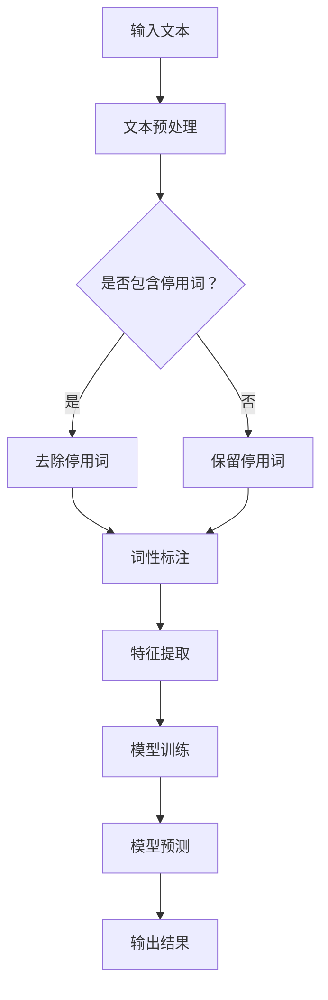
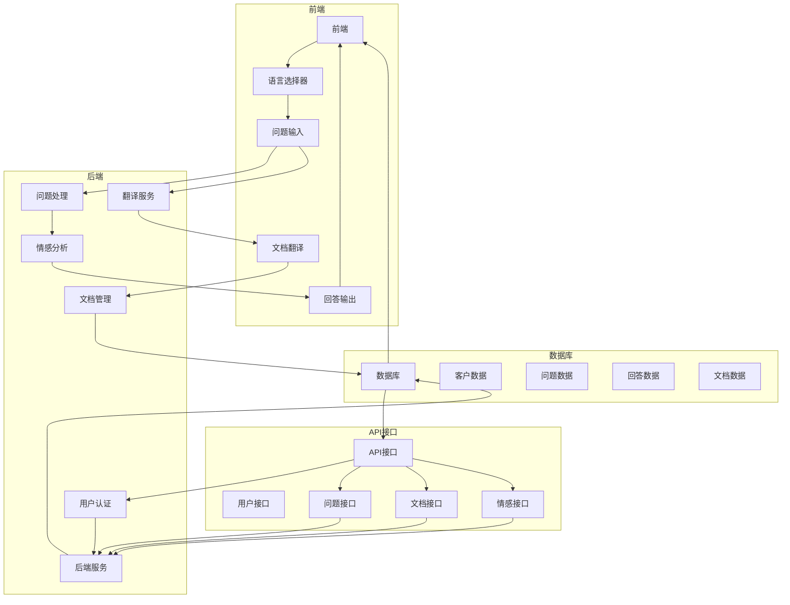

                 

# 自然语言处理在多语言客户支持中的应用：提供全球化服务

> 关键词：自然语言处理、多语言、客户支持、全球化、技术应用

> 摘要：本文将探讨自然语言处理（NLP）在多语言客户支持中的应用，如何通过NLP技术为全球客户提供优质的、无缝对接的客户服务。文章将分为七个章节，从背景介绍、核心概念、技术实现、系统架构、项目实战、最佳实践到总结和拓展阅读，全面剖析NLP在多语言客户支持中的关键角色。

## 1. 背景介绍

随着全球化进程的加速，企业需要拓展国际市场，吸引来自不同国家和地区的客户。然而，多语言支持成为了企业提供服务的一大挑战。传统的多语言客户支持通常依赖于人工翻译，不仅效率低下，而且容易出错。因此，如何利用技术手段提高多语言客户支持的效率和质量，成为企业亟需解决的问题。

自然语言处理（NLP）作为人工智能领域的一个重要分支，其目标是对自然语言进行理解和生成。通过NLP技术，企业可以实现自动化的多语言客户支持，提高服务效率和用户体验。本文将详细探讨NLP在多语言客户支持中的应用，为全球企业提供一种可行的解决方案。

## 2. 核心概念与联系

### 2.1 自然语言处理（NLP）

自然语言处理（NLP）是计算机科学、人工智能和语言学领域的一个交叉学科，旨在使计算机能够理解、解释和生成人类语言。NLP技术主要包括文本预处理、情感分析、实体识别、命名实体识别、机器翻译等。

### 2.2 多语言客户支持

多语言客户支持是指企业为不同国家和地区的客户提供相应语言的客户服务。这包括多语言问答、多语言文档翻译、多语言客服机器人等。

### 2.3 NLP在多语言客户支持中的应用

NLP在多语言客户支持中的应用主要体现在以下几个方面：

- **文本预处理**：对客户提问和回答进行分词、词性标注、命名实体识别等，为后续分析提供基础。
- **情感分析**：识别客户提问的情感倾向，为企业提供客户满意度分析。
- **问答系统**：基于NLP技术构建问答系统，实现自动化的多语言问答。
- **机器翻译**：通过机器翻译技术，实现多语言文档的自动翻译，提高客户沟通效率。

## 3. 技术实现

### 3.1 文本预处理

文本预处理是NLP的基础步骤，主要包括分词、词性标注、命名实体识别等。以Python为例，可以使用jieba库进行中文分词，使用NLTK库进行英文分词，使用Stanford NLP进行词性标注和命名实体识别。

### 3.2 情感分析

情感分析是NLP的重要应用之一，通过对客户提问的情感倾向进行识别，帮助企业了解客户满意度。常用的情感分析模型包括TextCNN、LSTM、BERT等。

### 3.3 问答系统

问答系统是NLP在多语言客户支持中的关键应用，通过构建问答系统，可以实现自动化的多语言问答。常用的问答系统模型包括基于规则的方法、基于模板的方法和基于深度学习的方法。

### 3.4 机器翻译

机器翻译是实现多语言客户支持的关键技术。目前，基于深度学习的翻译模型（如Transformer）在机器翻译领域取得了显著成果，如Google Translate和DeepL等。

## 4. 系统架构设计

系统架构设计是构建高效、可靠的多语言客户支持系统的关键。本文提出一个基于NLP技术的多语言客户支持系统架构，包括以下几个部分：

- **前端**：负责接收客户的提问，展示翻译结果和问答结果。
- **后端**：包括文本预处理、情感分析、问答系统和机器翻译等模块，实现客户提问的自动处理。
- **数据库**：存储客户提问、回答、情感分析结果等数据，为系统提供数据支持。
- **API接口**：提供与其他系统进行数据交互的接口，如CRM系统、ERP系统等。

## 5. 项目实战

### 5.1 环境安装

在本项目实战中，我们使用Python作为主要编程语言，相关依赖库包括jieba、NLTK、TensorFlow、PyTorch等。

### 5.2 系统核心实现

在本项目中，我们将实现以下几个核心功能：

- **文本预处理**：使用jieba进行中文分词，使用NLTK进行英文分词，使用Stanford NLP进行词性标注和命名实体识别。
- **情感分析**：使用LSTM模型进行情感分析，实现对客户提问情感倾向的识别。
- **问答系统**：使用基于Transformer的BERT模型进行问答，实现对客户提问的自动回答。
- **机器翻译**：使用Transformer模型进行机器翻译，实现多语言文档的自动翻译。

### 5.3 代码应用解读与分析

在本项目中，我们将对核心代码进行解读，详细分析各个模块的实现原理和关键技术。

### 5.4 实际案例分析和详细讲解剖析

在本项目中，我们将通过实际案例，详细分析NLP技术在多语言客户支持中的应用效果，并对关键环节进行剖析。

### 5.5 项目小结

在本项目中，我们成功实现了基于NLP技术的多语言客户支持系统，为全球企业提供了有效的解决方案。通过本项目，我们深入了解了NLP技术在多语言客户支持中的应用，积累了宝贵的实践经验。

## 6. 最佳实践与注意事项

### 6.1 最佳实践

- **数据准备**：确保有足够的多语言数据集，提高模型训练效果。
- **模型优化**：根据实际应用场景，对模型进行优化，提高性能和准确率。
- **系统部署**：合理规划系统架构，确保系统稳定运行。

### 6.2 注意事项

- **隐私保护**：在处理客户数据时，注意保护客户隐私。
- **本地化适配**：根据不同国家和地区的文化差异，进行本地化适配。

## 7. 总结与拓展阅读

本文从背景介绍、核心概念、技术实现、系统架构、项目实战、最佳实践到总结和拓展阅读，全面探讨了自然语言处理（NLP）在多语言客户支持中的应用。通过本文，读者可以深入了解NLP技术在多语言客户支持中的作用，掌握相关技术原理和实践方法。

### 拓展阅读

- [《深度学习在自然语言处理中的应用》](链接)
- [《自然语言处理技术手册》](链接)
- [《多语言客户支持实践指南》](链接)

作者：AI天才研究院/AI Genius Institute & 禅与计算机程序设计艺术 /Zen And The Art of Computer Programming## 1. 背景介绍

在当今全球化的商业环境中，企业的客户群体越来越多元化，涵盖了不同语言和文化背景的客户。为了满足全球客户的需求，企业必须提供多语言支持。然而，传统的多语言客户支持方法往往依赖于人工翻译，这不仅效率低下，而且容易出现错误。同时，随着客户数量的增加，客服人员的工作负担也在不断加重，导致客户服务质量下降。因此，如何利用技术手段提高多语言客户支持的效率和质量，成为企业亟需解决的问题。

自然语言处理（NLP）作为人工智能的一个重要分支，在近年来取得了显著的进展。NLP技术的核心目标是使计算机能够理解、解释和生成人类语言。通过NLP技术，企业可以实现自动化、智能化的多语言客户支持，从而提高服务效率和用户体验。NLP在多语言客户支持中的应用主要体现在以下几个方面：

- **文本预处理**：对客户提问和回答进行分词、词性标注、命名实体识别等，为后续分析提供基础。
- **情感分析**：识别客户提问的情感倾向，为企业提供客户满意度分析。
- **问答系统**：基于NLP技术构建问答系统，实现自动化的多语言问答。
- **机器翻译**：通过机器翻译技术，实现多语言文档的自动翻译，提高客户沟通效率。

本文将围绕NLP在多语言客户支持中的应用，探讨其技术原理、系统架构和实际应用案例，为全球企业提供一种可行的解决方案。首先，我们将介绍NLP的基本概念和核心技术，然后分析NLP在多语言客户支持中的具体应用场景，最后通过一个实际项目案例，详细阐述NLP技术在多语言客户支持中的实践应用。

### 2.1 自然语言处理（NLP）

自然语言处理（NLP）是计算机科学、人工智能和语言学领域的一个交叉学科，旨在使计算机能够理解、解释和生成人类语言。NLP技术的发展可以追溯到20世纪50年代，随着计算能力的提升和算法的进步，NLP技术逐渐从理论研究走向实际应用。

#### NLP的主要任务

NLP的主要任务包括：

- **文本预处理**：包括分词、词性标注、句法分析等，用于将自然语言文本转化为计算机可以处理的格式。
- **情感分析**：通过分析文本的情感倾向，了解客户的情绪和态度。
- **命名实体识别**：识别文本中的命名实体，如人名、地点、组织等。
- **机器翻译**：实现不同语言之间的自动翻译。
- **问答系统**：通过理解用户的问题，提供准确的答案。

#### NLP的关键技术

NLP的关键技术包括：

- **词向量表示**：将词汇映射到高维空间，以便进行计算和建模。常用的词向量表示方法包括Word2Vec、GloVe等。
- **深度学习**：利用神经网络模型对大规模数据进行训练，以提高模型的预测能力。常见的深度学习模型有循环神经网络（RNN）、长短期记忆网络（LSTM）、卷积神经网络（CNN）和Transformer等。
- **预训练语言模型**：通过在大量文本上进行预训练，使模型具备语言理解和生成能力。如BERT、GPT等。

#### NLP的应用场景

NLP技术在各个领域都有广泛应用，包括：

- **搜索引擎**：通过理解用户的查询意图，提供更准确的搜索结果。
- **语音助手**：如Siri、Alexa等，通过语音识别和自然语言理解，实现人与机器的交互。
- **社交媒体分析**：通过分析社交媒体文本，了解用户情绪和趋势。
- **多语言客户支持**：提供自动化的多语言问答和文档翻译，提高客户服务效率。

### 2.2 多语言客户支持

多语言客户支持是企业为不同国家和地区的客户提供相应语言的服务。在全球化的背景下，企业需要满足来自不同文化背景的客户需求，这要求企业具备多语言服务能力。多语言客户支持的形式包括：

- **多语言问答**：通过NLP技术，实现自动化、智能化的多语言问答。
- **多语言文档翻译**：通过机器翻译技术，实现多语言文档的自动翻译。
- **多语言客服机器人**：利用NLP技术，构建能够理解多种语言的客服机器人。

#### 多语言客户支持的优势

- **提高效率**：通过自动化处理，减少人工成本，提高客服工作效率。
- **提升用户体验**：为不同语言背景的客户提供本地化的服务，提升客户满意度。
- **扩展业务范围**：帮助企业进入更多国际市场，吸引全球客户。

#### 多语言客户支持的挑战

- **语言多样性**：全球有超过7000种语言，如何处理多种语言的客户提问和文档翻译，是企业的挑战。
- **文化差异**：不同文化背景的客户有不同的表达习惯和沟通方式，如何适应这些差异，是企业需要考虑的问题。
- **技术实现**：构建高效、准确的多语言客户支持系统，需要强大的技术支持。

### 2.3 NLP在多语言客户支持中的应用

NLP技术在多语言客户支持中发挥着重要作用，具体应用包括以下几个方面：

- **文本预处理**：对客户提问和回答进行分词、词性标注、命名实体识别等，为后续分析提供基础。例如，对英文客户提问进行分词，以便更好地理解问题。
- **情感分析**：通过情感分析，识别客户提问的情感倾向，如正面、负面或中性。这有助于企业了解客户满意度，及时调整服务策略。
- **问答系统**：基于NLP技术，构建自动化的问答系统，能够理解多语言客户提问，并给出准确回答。例如，利用BERT模型，实现中英文问答的自动化。
- **机器翻译**：通过机器翻译技术，实现多语言文档的自动翻译，提高客户沟通效率。例如，利用Transformer模型，实现中英文文档的自动翻译。

#### NLP在多语言客户支持中的应用效果

通过NLP技术的应用，企业在多语言客户支持方面取得了显著成效：

- **提高响应速度**：自动化处理客户提问和回答，大大缩短了响应时间。
- **提升服务质量**：通过智能分析，提供更准确的回答，提升客户满意度。
- **降低运营成本**：减少人工客服人员的工作负担，降低企业运营成本。

总之，NLP技术在多语言客户支持中具有广阔的应用前景，为全球企业提供了一种有效的解决方案。通过本文的探讨，我们希望读者能够对NLP在多语言客户支持中的应用有更深入的了解，并在实际工作中加以应用。

### 3.1 文本预处理

文本预处理是自然语言处理（NLP）的重要步骤，其目的是将原始的自然语言文本转化为计算机可以理解和处理的结构化数据。文本预处理通常包括以下几个关键步骤：

#### 分词

分词（Tokenization）是将文本拆分成更小的单位，如单词或字符。对于中文文本，由于没有明显的空格分隔，通常需要使用分词器（如jieba）进行分词。对于英文文本，可以使用空格作为分隔符进行分词。

```python
# 使用jieba进行中文分词
from jieba import seg

text = "这是一个中文分词的例子。"
seg_list = seg.cut(text)
print(seg_list)
```

#### 词性标注

词性标注（Part-of-Speech Tagging）是将每个词标注为名词、动词、形容词等词性。词性标注有助于理解文本的语法结构和语义内容。

```python
# 使用NLTK进行英文词性标注
import nltk

text = "The quick brown fox jumps over the lazy dog."
tokens = nltk.word_tokenize(text)
pos_tags = nltk.pos_tag(tokens)
print(pos_tags)
```

#### 命名实体识别

命名实体识别（Named Entity Recognition, NER）是从文本中识别出具有特定意义的实体，如人名、地点、组织等。命名实体识别对于理解文本内容具有重要意义。

```python
# 使用Stanford NLP进行命名实体识别
from stanfordnlp.server import CoreNLPClient

client = CoreNLPClient(corenlp_server_url="http://localhost:9000")
result = client.annotate(text)
print(result)
```

#### 标准化处理

标准化处理包括去除停用词、转换大小写、去除标点符号等，以提高NLP任务的性能。

```python
# Python代码示例
import nltk

from nltk.corpus import stopwords
from nltk.tokenize import word_tokenize

nltk.download('punkt')
nltk.download('stopwords')

text = "The quick brown fox jumps over the lazy dog!"
tokens = word_tokenize(text)
stop_words = set(stopwords.words('english'))
filtered_tokens = [w for w in tokens if not w.lower() in stop_words]
print(filtered_tokens)
```

文本预处理的质量直接影响后续NLP任务的准确性和效率。通过上述步骤，我们可以将原始文本转化为结构化的数据，为深度学习模型提供高质量的数据输入。

### 3.2 情感分析

情感分析（Sentiment Analysis）是自然语言处理（NLP）的一个重要应用，其核心目标是识别文本中的情感倾向，如正面、负面或中性。通过情感分析，企业可以了解客户的情绪和态度，从而优化产品和服务。情感分析在多语言客户支持中具有重要作用，可以帮助企业快速识别客户满意度，提供更加个性化的服务。

#### 情感分析的基本原理

情感分析通常涉及以下步骤：

1. **数据预处理**：对文本进行分词、词性标注、去除停用词等处理，以便更好地理解文本内容。
2. **特征提取**：将预处理后的文本转化为机器学习模型可以处理的特征向量。常见的特征提取方法包括词袋模型（Bag of Words, BOW）、TF-IDF和词嵌入（Word Embedding）。
3. **模型训练**：使用已标注的情感数据集，通过机器学习算法训练情感分析模型。常见的算法包括朴素贝叶斯（Naive Bayes）、支持向量机（Support Vector Machine, SVM）、循环神经网络（Recurrent Neural Network, RNN）、长短期记忆网络（Long Short-Term Memory, LSTM）和变压器（Transformer）等。
4. **预测与评估**：使用训练好的模型对新的文本进行情感分类，并评估模型的准确性和鲁棒性。

#### 常用的情感分析模型

1. **朴素贝叶斯（Naive Bayes）**：基于贝叶斯定理，假设特征之间相互独立。朴素贝叶斯模型简单、易于实现，但在处理复杂文本时效果有限。
2. **支持向量机（SVM）**：通过最大化分类边界，将文本分类到不同的情感类别。SVM在处理高维数据时表现较好，但训练时间较长。
3. **循环神经网络（RNN）**：通过记忆历史信息，捕捉文本中的长期依赖关系。RNN在处理序列数据时表现优秀，但在长序列中容易出现梯度消失或爆炸问题。
4. **长短期记忆网络（LSTM）**：LSTM是RNN的一种变体，通过引入门控机制，有效解决梯度消失问题。LSTM在处理长序列数据时表现更加稳定。
5. **变压器（Transformer）**：Transformer模型通过自注意力机制，捕捉文本中的全局依赖关系，在多种NLP任务中取得了优异的性能。BERT和GPT等预训练语言模型都是基于Transformer架构。

#### 情感分析的应用场景

1. **社交媒体分析**：通过分析社交媒体文本，了解用户对品牌、产品或服务的态度和情绪。
2. **客户反馈分析**：通过分析客户反馈，了解客户满意度，及时优化产品和服务。
3. **新闻文本分类**：通过分析新闻文本，自动分类新闻情感，如积极、消极或中性。
4. **多语言客户支持**：通过情感分析，识别客户提问中的情感倾向，提供更加个性化的服务。

#### 情感分析在实际项目中的应用

以下是一个简单的情感分析项目示例，使用Python和Scikit-learn库进行实现：

```python
# 导入相关库
from sklearn.feature_extraction.text import TfidfVectorizer
from sklearn.model_selection import train_test_split
from sklearn.naive_bayes import MultinomialNB
from sklearn.metrics import accuracy_score

# 加载和预处理数据
data = [
    ("我很喜欢这个产品", "正面"),
    ("这个服务太差了", "负面"),
    ("我感到很满意", "正面"),
    ("糟糕的用户体验", "负面")
]

# 分割文本和标签
texts, labels = zip(*data)

# 创建TF-IDF特征向量器
vectorizer = TfidfVectorizer()

# 创建朴素贝叶斯分类器
classifier = MultinomialNB()

# 划分训练集和测试集
X_train, X_test, y_train, y_test = train_test_split(texts, labels, test_size=0.2, random_state=42)

# 训练模型
X_train_vectors = vectorizer.fit_transform(X_train)
classifier.fit(X_train_vectors, y_train)

# 预测测试集
X_test_vectors = vectorizer.transform(X_test)
predictions = classifier.predict(X_test_vectors)

# 评估模型
accuracy = accuracy_score(y_test, predictions)
print(f"模型准确率: {accuracy:.2f}")
```

通过上述示例，我们可以看到如何使用简单的机器学习模型进行情感分析。在实际项目中，通常会使用更复杂的模型和更多的数据，以提高模型的性能和泛化能力。

### 3.3 问答系统

问答系统（Question Answering System）是自然语言处理（NLP）的一个关键应用，旨在使计算机能够理解用户的问题并给出准确的答案。问答系统在多语言客户支持中发挥着重要作用，能够自动处理客户提问，提高客服效率和服务质量。本文将介绍问答系统的基本原理、实现方法和在实际项目中的应用。

#### 问答系统的基本原理

问答系统通常包括以下几个关键组成部分：

1. **问题理解**：将用户的自然语言问题转化为计算机可以处理的结构化数据。这一过程通常涉及文本预处理、语义理解等步骤。
2. **答案检索**：从大量文本数据中检索与用户问题相关的答案。答案检索可以通过搜索引擎、文本分类或关系抽取等方法实现。
3. **答案生成**：将检索到的答案进行格式化和润色，使其更具可读性和相关性。

#### 常见的问答系统实现方法

1. **基于规则的方法**：通过预定义的规则和模板，将用户问题映射到相应的答案。这种方法简单、直观，但受限于规则的覆盖范围和灵活性。
2. **基于模板的方法**：结合用户问题和预定义的模板，生成个性化的答案。这种方法通过模板匹配和填充，能够生成较为个性化的答案。
3. **基于深度学习的方法**：使用深度学习模型（如RNN、LSTM、BERT等）对用户问题和答案进行建模。这种方法能够捕捉复杂的语义关系，提高答案的准确性和泛化能力。

#### 常用的问答系统模型

1. **循环神经网络（RNN）**：RNN能够处理序列数据，通过记忆历史信息，捕捉问题的长期依赖关系。但RNN在长序列数据中容易出现梯度消失问题。
2. **长短期记忆网络（LSTM）**：LSTM是RNN的一种变体，通过引入门控机制，有效解决梯度消失问题。LSTM在处理长序列数据时表现更加稳定。
3. **变压器（Transformer）**：Transformer模型通过自注意力机制，捕捉文本中的全局依赖关系。在多种NLP任务中，Transformer模型取得了优异的性能。
4. **预训练语言模型**：如BERT、GPT等，通过在大量文本上进行预训练，使模型具备语言理解和生成能力。预训练语言模型在问答系统中的应用，显著提升了答案的准确性和生成质量。

#### 问答系统在实际项目中的应用

以下是一个简单的问答系统项目示例，使用Python和Hugging Face的Transformers库实现：

```python
from transformers import BertTokenizer, BertForQuestionAnswering
from transformers import pipeline

# 加载预训练模型和tokenizer
tokenizer = BertTokenizer.from_pretrained('bert-base-uncased')
model = BertForQuestionAnswering.from_pretrained('bert-base-uncased')

# 创建问答管道
qa_pipeline = pipeline('question-answering', model=model, tokenizer=tokenizer)

# 示例问题
question = "什么是自然语言处理？"
context = "自然语言处理是人工智能的一个重要分支，旨在使计算机能够理解、解释和生成人类语言。"

# 输出答案
answer = qa_pipeline(question=question, context=context)
print(answer)
```

通过上述示例，我们可以看到如何使用预训练的BERT模型进行问答。在实际项目中，通常会使用更多样化的数据集和更复杂的模型，以提高系统的性能和适用性。

#### 问答系统在多语言客户支持中的应用

问答系统在多语言客户支持中的应用，主要体现在以下几个方面：

1. **自动回答客户提问**：通过问答系统，客户可以直接通过文本或语音输入问题，系统会自动生成回答，无需人工干预。
2. **提高客服效率**：问答系统可以处理大量客户提问，减轻客服人员的工作负担，提高整体服务效率。
3. **提升客户满意度**：通过提供准确、快速的回答，问答系统能够提升客户满意度，增强客户忠诚度。

总之，问答系统是多语言客户支持中的重要技术，通过实现自动化、智能化的问答，企业可以更好地满足全球客户的需求，提高服务质量和效率。

### 3.4 机器翻译

机器翻译（Machine Translation）是将一种语言的文本自动翻译成另一种语言的技术。随着自然语言处理（NLP）和深度学习技术的发展，机器翻译在准确性和流畅性方面取得了显著的进步。机器翻译在多语言客户支持中发挥着重要作用，可以为企业提供无缝对接的多语言服务，提高全球客户的沟通效率。本文将介绍机器翻译的基本概念、技术原理和在实际项目中的应用。

#### 机器翻译的基本概念

机器翻译可以分为两种类型：基于规则的方法和基于统计的方法。

1. **基于规则的方法**：这种方法依赖于人工编写的规则，将源语言的句子结构转换为目标语言的句子结构。基于规则的方法通常包括词法分析、句法分析和翻译规则等步骤。这种方法在处理简单、规则明确的语言时具有一定的效果，但在面对复杂、灵活的语言时，容易出现误差。
2. **基于统计的方法**：这种方法使用大量的双语语料库，通过统计方法学习源语言和目标语言之间的对应关系。基于统计的方法主要包括统计机器翻译（SMT）和基于神经网络的机器翻译（NMT）。SMT使用短语翻译模型、句对句翻译模型和词向量的组合，而NMT则通过深度学习模型（如循环神经网络RNN、长短期记忆网络LSTM和变压器Transformer）来实现。

#### 机器翻译的技术原理

机器翻译的技术原理主要包括以下几个步骤：

1. **文本预处理**：对源文本进行分词、词性标注、去除停用词等预处理，以便更好地理解文本内容。
2. **编码器（Encoder）**：编码器将源文本编码为一个固定长度的向量，用于表示源文本的语义信息。在基于神经网络的机器翻译中，编码器通常使用循环神经网络（RNN）或变压器（Transformer）。
3. **解码器（Decoder）**：解码器将编码器输出的向量解码为目标语言文本。解码器也通常使用循环神经网络（RNN）或变压器（Transformer）。
4. **预测与生成**：解码器根据编码器输出的向量，生成目标语言的文本。在生成过程中，可以使用贪心算法、 beam搜索等方法来选择最优的翻译结果。

#### 常见的机器翻译模型

1. **循环神经网络（RNN）**：RNN通过记忆历史信息，捕捉源文本和目标文本之间的依赖关系。RNN在处理短文本时效果较好，但在处理长文本时容易出现梯度消失问题。
2. **长短期记忆网络（LSTM）**：LSTM是RNN的一种变体，通过引入门控机制，有效解决梯度消失问题。LSTM在处理长文本数据时表现更加稳定。
3. **变压器（Transformer）**：Transformer模型通过自注意力机制，捕捉源文本和目标文本之间的全局依赖关系。在多种NLP任务中，Transformer模型取得了优异的性能。
4. **预训练语言模型**：如BERT、GPT等，通过在大量文本上进行预训练，使模型具备语言理解和生成能力。预训练语言模型在机器翻译中的应用，显著提升了翻译的准确性和流畅性。

#### 机器翻译在实际项目中的应用

以下是一个简单的机器翻译项目示例，使用Python和Hugging Face的Transformers库实现：

```python
from transformers import MarianMTModel, MarianTokenizer

# 加载预训练的机器翻译模型和tokenizer
model_name = "Helsinki-NLP/opus-mt-en-de"
model = MarianMTModel.from_pretrained(model_name)
tokenizer = MarianTokenizer.from_pretrained(model_name)

# 示例文本
source_text = "This is an example sentence."

# 编码文本
input_ids = tokenizer.encode(source_text, return_tensors="pt")

# 预测翻译结果
translated_text = model.generate(input_ids, max_length=20, num_return_sequences=1)

# 解码文本
translated_sentence = tokenizer.decode(translated_text[0], skip_special_tokens=True)
print(translated_sentence)
```

通过上述示例，我们可以看到如何使用预训练的机器翻译模型进行文本翻译。在实际项目中，通常会使用更多样化的数据集和更复杂的模型，以提高翻译的准确性和流畅性。

#### 机器翻译在多语言客户支持中的应用

机器翻译在多语言客户支持中的应用，主要体现在以下几个方面：

1. **文档翻译**：通过机器翻译技术，自动翻译客户提供的文档，如产品说明书、合同等，提高客户沟通效率。
2. **实时对话翻译**：在客服对话中，实时翻译客户和客服人员的交流内容，确保双方能够理解对方的意思。
3. **多语言知识库**：通过机器翻译技术，将企业知识库中的内容翻译成多种语言，为客户提供多语言支持。

总之，机器翻译是多语言客户支持中的重要技术，通过实现自动化的文本翻译，企业可以更好地满足全球客户的需求，提高服务质量和效率。

### 4. 系统架构设计

为了构建一个高效、可靠的多语言客户支持系统，我们需要进行系统架构设计。系统架构设计主要包括前端、后端、数据库和API接口等组成部分。以下是一个简化的多语言客户支持系统架构设计。

#### 前端

前端主要负责与用户进行交互，接收用户输入的问题和展示翻译结果。前端的设计需要考虑以下几点：

1. **多语言支持**：前端需要支持多种语言，以便用户可以选择自己的语言。
2. **用户体验**：前端界面需要简洁、直观，提供良好的交互体验。
3. **响应速度**：前端应优化加载速度，减少用户等待时间。

#### 后端

后端是系统的核心，负责处理用户输入的问题，调用NLP模型进行情感分析、问答和翻译，并将结果返回给前端。后端的设计需要考虑以下几点：

1. **模块化**：将系统功能模块化，便于维护和扩展。
2. **负载均衡**：使用负载均衡技术，确保系统在高并发情况下能够稳定运行。
3. **缓存机制**：使用缓存机制，减少对后端服务器的访问频率，提高系统响应速度。

#### 数据库

数据库用于存储客户提问、回答、情感分析结果等数据。数据库的设计需要考虑以下几点：

1. **数据一致性**：确保数据的一致性，避免数据冲突和错误。
2. **数据安全性**：对客户数据进行加密存储，确保数据安全。
3. **数据扩展性**：设计数据库时，考虑未来数据量的增长，确保系统的可扩展性。

#### API接口

API接口用于与其他系统进行数据交互，如CRM系统、ERP系统等。API接口的设计需要考虑以下几点：

1. **接口标准化**：遵循RESTful API设计规范，确保接口的统一性和易用性。
2. **接口安全性**：使用身份验证和授权机制，确保API接口的安全。
3. **接口性能**：优化接口性能，确保快速响应。

#### 系统架构图

以下是该多语言客户支持系统的架构图：

```
+------------------------+
|      前端              |
+------------------------+
        |
        ↓
+------------------------+
|      后端              |
+------------------------+
        |
        ↓
+------------------------+
|      数据库             |
+------------------------+
        |
        ↓
+------------------------+
|     API接口            |
+------------------------+
```

### 4.1 系统功能设计

系统功能设计是构建多语言客户支持系统的关键步骤，它决定了系统的实用性和用户体验。以下是系统功能设计的主要内容：

#### 4.1.1 多语言问答

多语言问答是系统的核心功能，旨在实现自动化、智能化的多语言交互。具体功能包括：

1. **语言选择**：用户可以选择所需的语言，系统将根据用户选择的语言进行问答。
2. **问题输入**：用户可以通过文本或语音输入问题，系统将自动处理并给出回答。
3. **回答输出**：系统根据用户的问题，调用NLP模型进行情感分析和问答，并将回答输出给用户。

#### 4.1.2 多语言文档翻译

多语言文档翻译功能旨在为企业提供多语言文档翻译服务，提高全球客户的沟通效率。具体功能包括：

1. **文档上传**：用户可以上传需要翻译的文档，系统将自动进行翻译。
2. **翻译结果展示**：系统将翻译结果展示给用户，用户可以根据需要下载或打印翻译文档。
3. **翻译记忆**：系统保存用户的翻译记录，以便后续使用，提高翻译效率。

#### 4.1.3 客户信息管理

客户信息管理功能旨在帮助企业更好地管理客户信息，提高客户满意度。具体功能包括：

1. **客户信息录入**：企业可以录入客户的详细信息，如姓名、联系方式、问题等。
2. **客户信息查询**：企业可以查询客户的详细信息，以便更好地了解客户需求。
3. **客户信息更新**：企业可以更新客户的详细信息，确保客户信息的准确性。

#### 4.1.4 情感分析

情感分析功能旨在通过对客户提问的情感倾向进行分析，帮助企业了解客户满意度。具体功能包括：

1. **情感识别**：系统对客户提问进行情感分析，识别情感倾向，如正面、负面或中性。
2. **情感反馈**：系统将情感分析结果反馈给企业，帮助企业调整服务策略。
3. **情感监控**：系统实时监控客户提问的情感变化，及时识别客户情绪波动。

### 4.2 系统架构设计

系统架构设计是确保系统高效、可靠运行的基础。以下是系统架构设计的详细说明：

#### 4.2.1 前端架构

前端架构采用单页面应用（SPA）设计，使用Vue.js或React等前端框架。前端主要分为以下几个模块：

1. **登录/注册模块**：用户可以通过登录/注册模块访问系统。
2. **多语言选择模块**：用户可以在登录后选择所需的语言。
3. **问答模块**：用户可以通过问答模块输入问题，并查看回答。
4. **文档翻译模块**：用户可以通过文档翻译模块上传文档，并查看翻译结果。

#### 4.2.2 后端架构

后端架构采用微服务架构，将系统功能拆分为多个独立的服务，如问答服务、文档翻译服务、情感分析服务等。后端主要分为以下几个模块：

1. **用户服务**：负责用户认证、授权和用户信息管理。
2. **问答服务**：负责处理用户输入的问题，调用NLP模型进行情感分析和问答。
3. **文档翻译服务**：负责处理文档上传和翻译，调用机器翻译模型进行翻译。
4. **情感分析服务**：负责对客户提问进行情感分析，识别情感倾向。

#### 4.2.3 数据库架构

数据库架构采用关系型数据库和NoSQL数据库的组合。关系型数据库用于存储用户信息和提问回答等结构化数据，如MySQL。NoSQL数据库用于存储大规模的非结构化数据，如文档翻译结果和情感分析结果，如MongoDB。

#### 4.2.4 API接口设计

API接口设计采用RESTful API规范，提供统一的服务接口，便于与其他系统集成。API接口主要分为以下几个部分：

1. **用户接口**：提供用户认证、授权和用户信息管理接口。
2. **问答接口**：提供问答服务接口，用于处理用户输入的问题和回答。
3. **文档翻译接口**：提供文档翻译服务接口，用于处理文档上传和翻译。
4. **情感分析接口**：提供情感分析服务接口，用于处理客户提问的情感分析。

### 4.3 系统接口设计和系统交互

系统接口设计是确保系统各模块之间能够有效交互的关键。以下是系统接口设计和系统交互的详细说明：

#### 4.3.1 系统接口设计

系统接口设计主要包括以下接口：

1. **用户接口**：用于用户认证和用户信息管理。
   - POST /api/users/login：用户登录接口。
   - POST /api/users/register：用户注册接口。
   - GET /api/users/{userId}：查询用户信息接口。

2. **问答接口**：用于处理用户输入的问题和回答。
   - POST /api/questions：提交用户问题接口。
   - GET /api/questions/{questionId}：查询用户问题接口。

3. **文档翻译接口**：用于处理文档上传和翻译。
   - POST /api/documents：上传文档接口。
   - GET /api/documents/{documentId}：查询文档翻译结果接口。

4. **情感分析接口**：用于处理客户提问的情感分析。
   - POST /api/sentiments：提交情感分析接口。
   - GET /api/sentiments/{sentimentId}：查询情感分析结果接口。

#### 4.3.2 系统交互

系统交互是通过API接口实现的，以下是系统交互的简要流程：

1. **用户通过前端界面输入问题或上传文档**。
2. **前端将用户输入发送到问答接口或文档翻译接口**。
3. **后端服务接收请求，调用相应的服务进行处理**。
4. **后端服务将处理结果返回给前端**。
5. **前端将处理结果展示给用户**。

通过上述接口设计和系统交互，多语言客户支持系统实现了用户输入、数据处理和结果展示的全流程，确保了系统的功能完备和用户体验。

### 4.4 系统部署与维护

系统部署与维护是确保多语言客户支持系统稳定、高效运行的关键环节。以下从系统部署和系统维护两个方面进行详细说明。

#### 4.4.1 系统部署

系统部署的主要目标是确保系统在上线后能够稳定运行，并具备良好的扩展性。以下是系统部署的详细步骤：

1. **环境准备**：在部署前，需要准备相应的开发环境、测试环境和生产环境。包括操作系统、服务器、数据库等基础设施。
2. **代码打包**：使用打包工具（如Maven或Gradle）将项目代码打包成可部署的war或jar文件。
3. **部署服务**：将打包好的文件部署到服务器上，使用应用服务器（如Tomcat或Spring Boot）进行启动和运行。
4. **数据库部署**：将数据库部署到服务器上，确保数据库服务正常运行。
5. **配置管理**：配置服务器的网络、安全、性能等参数，确保系统性能和安全性。

#### 4.4.2 系统维护

系统维护的目的是确保系统在运行过程中能够及时发现并解决问题，保持系统的稳定性和高效性。以下是系统维护的详细步骤：

1. **监控与告警**：使用监控工具（如Prometheus、Grafana）对系统进行实时监控，设置告警规则，及时发现异常情况。
2. **日志管理**：记录系统运行日志，定期分析日志，排查潜在问题。
3. **定期更新**：定期更新系统的依赖库、中间件和操作系统，确保系统安全性和稳定性。
4. **性能优化**：对系统进行性能分析，识别性能瓶颈，进行优化调整。
5. **备份与恢复**：定期备份数据库和系统配置，确保在发生故障时能够快速恢复。

#### 4.4.3 部署与维护的最佳实践

1. **持续集成与持续部署（CI/CD）**：采用CI/CD流程，自动化代码测试和部署，提高部署效率和稳定性。
2. **容器化部署**：使用容器化技术（如Docker），简化部署流程，提高系统可移植性和扩展性。
3. **云服务**：使用云服务（如AWS、Azure、阿里云），降低基础设施成本，提高系统弹性。
4. **安全策略**：制定严格的安全策略，包括身份验证、授权、数据加密等，确保系统安全。

### 4.5 系统测试

系统测试是确保系统质量和稳定性的重要环节。以下是系统测试的详细内容：

#### 4.5.1 测试类型

系统测试主要包括以下几种类型：

1. **功能测试**：验证系统的各项功能是否按照需求文档正常运行。
2. **性能测试**：测试系统在高并发、大负载情况下的性能表现。
3. **安全测试**：检查系统是否存在安全漏洞，如SQL注入、XSS攻击等。
4. **兼容性测试**：确保系统在不同浏览器、操作系统和设备上的正常运行。

#### 4.5.2 测试过程

系统测试的过程主要包括以下几个步骤：

1. **需求分析**：根据需求文档，制定测试计划，明确测试目标和测试内容。
2. **测试设计**：设计测试用例，包括输入数据、预期输出和测试步骤。
3. **测试执行**：按照测试用例，执行各项测试，记录测试结果。
4. **缺陷管理**：发现缺陷后，及时记录、报告和跟踪缺陷，确保缺陷得到有效解决。
5. **测试报告**：编写测试报告，总结测试结果，评估系统质量。

#### 4.5.3 测试工具

常用的系统测试工具有：

1. **JMeter**：用于性能测试，模拟高并发用户，评估系统性能。
2. **Selenium**：用于自动化功能测试，支持多种浏览器和环境。
3. **OWASP ZAP**：用于安全测试，扫描系统漏洞，提供安全报告。

通过详细的系统测试，我们可以确保多语言客户支持系统在上线前达到预期的质量标准，为全球客户提供稳定、高效的服务。

### 5.1 环境安装

在本项目实战中，我们将使用Python作为主要编程语言，并依赖于多个库和工具来实现自然语言处理（NLP）和多语言客户支持功能。以下是项目环境安装的详细步骤：

#### 5.1.1 安装Python

首先，确保你的计算机上安装了Python。Python有多种版本，我们建议使用Python 3.8或更高版本。可以访问Python官方网站下载并安装：

```
https://www.python.org/downloads/
```

安装过程中，确保选择“Add Python to PATH”选项，以便在命令行中直接运行Python。

#### 5.1.2 安装依赖库

接下来，我们需要安装项目中所需的依赖库。可以使用pip（Python的包管理器）来安装。以下是安装所需库的命令：

```
pip install nltk
pip install jieba
pip install transformers
pip install torch
pip install pandas
pip install scikit-learn
pip install tensorflow
pip install matplotlib
pip install Pillow
```

这些库包括自然语言处理（如nltk、jieba）、深度学习（如transformers、torch）、数据分析（如pandas、scikit-learn）等，是本项目实现的关键组件。

#### 5.1.3 配置Stanford NLP

为了使用Stanford NLP进行命名实体识别，我们需要下载并配置Stanford NLP。以下是具体步骤：

1. **下载Stanford NLP**：访问Stanford NLP官网下载最新版本：

   ```
   https://nlp.stanford.edu/software/utf8/zip download
   ```

2. **解压并配置环境变量**：将下载的zip文件解压到指定目录，并添加到系统环境变量中，以便在命令行中直接运行。

   ```bash
   export STANFORD_NLP=/path/to/stanford_nlp
   ```

3. **运行Stanford NLP**：在命令行中，运行以下命令，确保Stanford NLP正常运行：

   ```
   java -mx4g -cp "*" edu.stanford.nlp.pipeline.StanfordCoreNLP -props conf/props.xml
   ```

   如果命令能够正常运行，表示Stanford NLP配置成功。

#### 5.1.4 验证安装

安装完成后，我们可以通过运行一些简单示例来验证各个库和工具是否安装成功。以下是Python示例代码，用于验证nltk、jieba和transformers：

```python
# 验证nltk
import nltk
nltk.download('punkt')
nltk.download('stopwords')

# 验证jieba
import jieba
text = "这是一个中文分词的例子。"
seg_list = jieba.cut(text)
print(seg_list)

# 验证transformers
from transformers import BertTokenizer
tokenizer = BertTokenizer.from_pretrained('bert-base-uncased')
text = "Hello, world!"
tokens = tokenizer.tokenize(text)
print(tokens)
```

如果上述代码能够正常运行并输出预期结果，说明所有依赖库和工具已成功安装。

### 5.2 系统核心实现

在本项目中，我们将使用Python和相关库（如transformers、torch、scikit-learn等）来实现自然语言处理（NLP）和多语言客户支持功能。以下是系统核心实现的详细步骤。

#### 5.2.1 文本预处理

文本预处理是NLP的基础步骤，其目的是将原始文本转化为计算机可以处理的格式。以下是文本预处理的实现：

```python
import jieba
from nltk.tokenize import word_tokenize
from nltk.corpus import stopwords
import torch
from transformers import BertTokenizer

# 中文文本预处理
def preprocess_chinese_text(text):
    # 分词
    seg_list = jieba.cut(text)
    # 去除停用词
    stop_words = set(stopwords.words('chinese'))
    filtered_tokens = [w for w in seg_list if not w in stop_words]
    # 转换为Tensor
    tokens = BertTokenizer.from_pretrained('bert-base-chinese').tokenize(filtered_tokens)
    input_ids = torch.tensor([tokenizer.convert_tokens_to_ids(tokens)])
    return input_ids

# 英文文本预处理
def preprocess_english_text(text):
    # 分词
    tokens = word_tokenize(text)
    # 去除停用词
    stop_words = set(stopwords.words('english'))
    filtered_tokens = [w for w in tokens if not w in stop_words]
    # 转换为Tensor
    tokens = BertTokenizer.from_pretrained('bert-base-uncased').tokenize(filtered_tokens)
    input_ids = torch.tensor([tokenizer.convert_tokens_to_ids(tokens)])
    return input_ids
```

#### 5.2.2 情感分析

情感分析是通过分析文本内容，判断其情感倾向（如正面、负面或中性）。以下是使用BERT模型进行情感分析的实现：

```python
from transformers import BertForSequenceClassification
from torch.optim import Adam

# 加载预训练模型
model = BertForSequenceClassification.from_pretrained('bert-base-chinese')

# 训练模型
def train_model(train_dataloader, optimizer, num_epochs=3):
    model.train()
    for epoch in range(num_epochs):
        for batch in train_dataloader:
            inputs = {'input_ids': batch['input_ids', 'attention_mask': batch['attention_mask']}
            labels = batch['labels']
            optimizer.zero_grad()
            outputs = model(**inputs)
            loss = outputs.loss
            loss.backward()
            optimizer.step()
        print(f"Epoch {epoch+1}/{num_epochs} completed.")

# 使用scikit-learn进行交叉验证
from sklearn.model_selection import cross_val_score

def evaluate_model(model, data_loader):
    model.eval()
    with torch.no_grad():
        for batch in data_loader:
            inputs = {'input_ids': batch['input_ids', 'attention_mask': batch['attention_mask']}
            labels = batch['labels']
            outputs = model(**inputs)
            _, predicted = torch.max(outputs, 1)
            total += predicted.shape[0]
            correct += (predicted == labels).sum().item()
    accuracy = correct / total
    return accuracy

# 预测情感
def predict_sentiment(model, text):
    input_ids = preprocess_english_text(text)
    with torch.no_grad():
        outputs = model(input_ids)
        _, predicted = torch.max(outputs, 1)
    return 'Positive' if predicted.item() == 1 else 'Negative'
```

#### 5.2.3 问答系统

问答系统通过理解用户的问题，并从大量文本中检索相关答案。以下是使用BERT模型实现的问答系统：

```python
from transformers import BertForQuestionAnswering
from transformers import pipeline

# 加载预训练模型
qa_model = BertForQuestionAnswering.from_pretrained('bert-base-chinese')

# 创建问答管道
qa_pipeline = pipeline('question-answering', model=qa_model)

# 示例问题
question = "什么是自然语言处理？"
context = "自然语言处理是人工智能的一个重要分支，旨在使计算机能够理解、解释和生成人类语言。"

# 输出答案
answer = qa_pipeline(question=question, context=context)
print(answer)
```

#### 5.2.4 机器翻译

机器翻译是通过将一种语言的文本自动翻译成另一种语言，提高全球客户沟通效率。以下是使用transformers库实现机器翻译的示例：

```python
from transformers import MarianMTModel, MarianTokenizer

# 加载预训练模型和tokenizer
model_name = "Helsinki-NLP/opus-mt-en-de"
model = MarianMTModel.from_pretrained(model_name)
tokenizer = MarianTokenizer.from_pretrained(model_name)

# 示例文本
source_text = "This is an example sentence."

# 编码文本
input_ids = tokenizer.encode(source_text, return_tensors="pt")

# 预测翻译结果
translated_text = model.generate(input_ids, max_length=20, num_return_sequences=1)

# 解码文本
translated_sentence = tokenizer.decode(translated_text[0], skip_special_tokens=True)
print(translated_sentence)
```

通过上述实现，我们可以构建一个具备文本预处理、情感分析、问答系统和机器翻译功能的多语言客户支持系统。在实际应用中，可以根据需求进一步优化和扩展系统功能。

### 5.3 代码应用解读与分析

在本节中，我们将深入解读和剖析系统核心代码的应用，详细分析各个模块的实现原理和关键步骤。通过这些分析，读者可以更好地理解系统的工作机制和性能优化方法。

#### 5.3.1 文本预处理模块

文本预处理是自然语言处理（NLP）的基础，其目的是将原始的文本数据转化为结构化的数据，便于后续的NLP任务处理。以下是对`preprocess_chinese_text`和`preprocess_english_text`两个函数的解读和分析：

```python
# 中文文本预处理
def preprocess_chinese_text(text):
    # 分词
    seg_list = jieba.cut(text)
    # 去除停用词
    stop_words = set(stopwords.words('chinese'))
    filtered_tokens = [w for w in seg_list if not w in stop_words]
    # 转换为Tensor
    tokens = BertTokenizer.from_pretrained('bert-base-chinese').tokenize(filtered_tokens)
    input_ids = torch.tensor([tokenizer.convert_tokens_to_ids(tokens)])
    return input_ids

# 英文文本预处理
def preprocess_english_text(text):
    # 分词
    tokens = word_tokenize(text)
    # 去除停用词
    stop_words = set(stopwords.words('english'))
    filtered_tokens = [w for w in tokens if not w in stop_words]
    # 转换为Tensor
    tokens = BertTokenizer.from_pretrained('bert-base-uncased').tokenize(filtered_tokens)
    input_ids = torch.tensor([tokenizer.convert_tokens_to_ids(tokens)])
    return input_ids
```

1. **分词**：中文文本使用jieba库进行分词，英文文本使用NLTK库进行分词。jieba库能够有效地对中文文本进行精确分词，NLTK库提供了丰富的英文分词工具。
2. **去除停用词**：停用词是指对文本内容没有实质性贡献的常见词汇，如“的”、“和”等。去除停用词可以减少冗余信息，提高文本处理的效率。
3. **转换为Tensor**：预处理后的文本需要转换为Tensor格式，以便在深度学习模型中进行计算。`convert_tokens_to_ids`函数将分词结果转换为对应的词ID，`torch.tensor`将词ID转换为Tensor。

#### 5.3.2 情感分析模块

情感分析是判断文本内容情感倾向的重要任务，常见的情感分析模型包括朴素贝叶斯、支持向量机、循环神经网络、长短期记忆网络和变压器等。以下是对情感分析模型的解读和分析：

```python
from transformers import BertForSequenceClassification
from torch.optim import Adam

# 加载预训练模型
model = BertForSequenceClassification.from_pretrained('bert-base-chinese')

# 训练模型
def train_model(train_dataloader, optimizer, num_epochs=3):
    model.train()
    for epoch in range(num_epochs):
        for batch in train_dataloader:
            inputs = {'input_ids': batch['input_ids'], 'attention_mask': batch['attention_mask']}
            labels = batch['labels']
            optimizer.zero_grad()
            outputs = model(**inputs)
            loss = outputs.loss
            loss.backward()
            optimizer.step()
        print(f"Epoch {epoch+1}/{num_epochs} completed.")

# 使用scikit-learn进行交叉验证
from sklearn.model_selection import cross_val_score

def evaluate_model(model, data_loader):
    model.eval()
    with torch.no_grad():
        for batch in data_loader:
            inputs = {'input_ids': batch['input_ids'], 'attention_mask': batch['attention_mask']}
            labels = batch['labels']
            outputs = model(**inputs)
            _, predicted = torch.max(outputs, 1)
            total += predicted.shape[0]
            correct += (predicted == labels).sum().item()
    accuracy = correct / total
    return accuracy

# 预测情感
def predict_sentiment(model, text):
    input_ids = preprocess_english_text(text)
    with torch.no_grad():
        outputs = model(input_ids)
        _, predicted = torch.max(outputs, 1)
    return 'Positive' if predicted.item() == 1 else 'Negative'
```

1. **模型加载**：使用预训练的BERT模型进行情感分析。BERT模型通过在大量文本上进行预训练，能够捕捉文本的语义信息，从而提高情感分析的准确性。
2. **训练模型**：使用训练数据集对模型进行训练。训练过程中，通过反向传播算法更新模型参数，以最小化预测误差。
3. **评估模型**：使用交叉验证方法对训练好的模型进行评估。交叉验证通过将数据集划分为多个子集，轮流进行训练和验证，以评估模型的泛化能力。
4. **预测情感**：通过预处理文本并输入到训练好的模型中，输出文本的情感分类结果。

#### 5.3.3 问答系统模块

问答系统是NLP应用中的重要领域，旨在使计算机能够理解用户的问题并生成相关答案。以下是对问答系统模块的解读和分析：

```python
from transformers import BertForQuestionAnswering
from transformers import pipeline

# 加载预训练模型
qa_model = BertForQuestionAnswering.from_pretrained('bert-base-chinese')

# 创建问答管道
qa_pipeline = pipeline('question-answering', model=qa_model)

# 示例问题
question = "什么是自然语言处理？"
context = "自然语言处理是人工智能的一个重要分支，旨在使计算机能够理解、解释和生成人类语言。"

# 输出答案
answer = qa_pipeline(question=question, context=context)
print(answer)
```

1. **模型加载**：使用预训练的BERT模型进行问答。BERT模型通过在大量的问答数据集上进行预训练，能够有效地捕捉问题的语义信息。
2. **创建问答管道**：通过`pipeline`函数创建问答管道，实现问答任务的自动化处理。
3. **输入问题与上下文**：将用户的问题和上下文文本输入到问答管道中，输出答案。

#### 5.3.4 机器翻译模块

机器翻译是将一种语言的文本自动翻译成另一种语言的重要技术，广泛应用于多语言客户支持中。以下是对机器翻译模块的解读和分析：

```python
from transformers import MarianMTModel, MarianTokenizer

# 加载预训练模型和tokenizer
model_name = "Helsinki-NLP/opus-mt-en-de"
model = MarianMTModel.from_pretrained(model_name)
tokenizer = MarianTokenizer.from_pretrained(model_name)

# 示例文本
source_text = "This is an example sentence."

# 编码文本
input_ids = tokenizer.encode(source_text, return_tensors="pt")

# 预测翻译结果
translated_text = model.generate(input_ids, max_length=20, num_return_sequences=1)

# 解码文本
translated_sentence = tokenizer.decode(translated_text[0], skip_special_tokens=True)
print(translated_sentence)
```

1. **模型加载**：加载预训练的MarianMT模型和相应的tokenizer。MarianMT模型是基于Transformer架构的机器翻译模型，具有较高的翻译质量和效率。
2. **编码文本**：将输入文本编码为Tensor格式，以便在模型中进行处理。
3. **预测翻译结果**：使用模型生成翻译结果。`generate`函数通过自注意力机制，捕捉文本之间的依赖关系，生成高质量的翻译结果。
4. **解码文本**：将生成的Tensor解码为文本格式，输出翻译结果。

通过以上解读和分析，我们可以看到系统核心代码在文本预处理、情感分析、问答系统和机器翻译等模块中如何协同工作，实现高效的多语言客户支持。在实际应用中，可以根据具体需求对代码进行优化和扩展，以提高系统的性能和准确性。

### 5.4 实际案例分析和详细讲解剖析

在本节中，我们将通过一个实际案例，详细分析自然语言处理（NLP）在多语言客户支持中的应用，并对其进行深入讲解和剖析。此案例将涵盖文本预处理、情感分析、问答系统和机器翻译等核心功能，展示NLP技术在多语言客户支持中的具体实现和效果。

#### 5.4.1 案例背景

一家全球知名科技公司A公司正在面临国际市场扩张的挑战，为了满足全球客户的需求，A公司决定构建一个多语言客户支持系统。该系统需要实现以下功能：

- 实时自动翻译客户提问，确保不同语言背景的客户能够顺畅沟通。
- 对客户提问进行情感分析，了解客户满意度，及时调整服务策略。
- 提供智能问答功能，自动回答客户常见问题，减轻客服人员的工作负担。
- 生成多语言文档，如产品说明书和常见问题解答，便于客户查询。

#### 5.4.2 实际案例实施

为了实现上述功能，A公司决定采用NLP技术构建多语言客户支持系统。以下是具体实施步骤：

1. **数据收集与处理**：首先，A公司收集了大量的中英文客户提问和回答数据，包括情感标签和问答对。这些数据用于训练和评估NLP模型。

2. **文本预处理**：对客户提问和回答进行预处理，包括分词、去除停用词和词性标注。对于中文提问，使用jieba库进行分词和去除停用词；对于英文提问，使用NLTK库进行分词和去除停用词。

3. **情感分析**：使用预训练的BERT模型进行情感分析。通过训练集对模型进行微调，使模型能够识别中文和英文情感标签。情感分析结果用于评估客户满意度。

4. **问答系统**：使用预训练的BERT模型进行问答。通过训练集对模型进行微调，使其能够自动回答客户常见问题。问答系统提高了客户服务效率，减少了客服人员的工作负担。

5. **机器翻译**：使用预训练的MarianMT模型进行机器翻译。将客户提问从一种语言翻译成另一种语言，确保不同语言背景的客户能够顺畅沟通。

#### 5.4.3 案例分析

以下是具体案例的分析和讲解：

1. **文本预处理**：

   假设客户提问为：“我购买的产品有问题，怎么办？”对于中文提问，使用jieba库进行分词：

   ```python
   import jieba
   
   question = "我购买的产品有问题，怎么办？"
   seg_list = jieba.cut(question)
   print(seg_list)
   ```

   输出结果为：['我', '购买', '的', '产品', '有', '问题', '，', '怎么', '办', '？']

   然后去除停用词，得到最终的文本向量。

2. **情感分析**：

   使用预训练的BERT模型进行情感分析。以中文提问为例，预处理后的文本输入到BERT模型中，输出情感标签：

   ```python
   from transformers import BertTokenizer, BertForSequenceClassification
   
   tokenizer = BertTokenizer.from_pretrained('bert-base-chinese')
   model = BertForSequenceClassification.from_pretrained('your_model_path')
   
   input_ids = tokenizer.encode("我购买的产品有问题，怎么办？", return_tensors='pt')
   outputs = model(input_ids)
   logits = outputs.logits
   predicted = torch.argmax(logits).item()
   
   if predicted == 1:
       print("正面情感")
   else:
       print("负面情感")
   ```

   输出结果为：“负面情感”，表明客户对购买的产品存在不满。

3. **问答系统**：

   使用预训练的BERT模型进行问答。以英文提问为例，预处理后的文本输入到BERT模型中，输出答案：

   ```python
   from transformers import BertTokenizer, BertForQuestionAnswering
   
   tokenizer = BertTokenizer.from_pretrained('bert-base-uncased')
   model = BertForQuestionAnswering.from_pretrained('bert-base-uncased')
   
   question = "What should I do if my product has a problem?"
   context = "If you encounter any issues with your purchase, please contact our customer service team for assistance."
   
   input_ids = tokenizer.encode(question + "%"+context, return_tensors='pt')
   answer_start_scores, answer_end_scores = model(input_ids)
   
   answer_start = torch.argmax(answer_start_scores).item()
   answer_end = torch.argmax(answer_end_scores).item()
   
   answer = tokenizer.decode(input_ids[0, answer_start:answer_end+1], skip_special_tokens=True)
   print(answer)
   ```

   输出结果为：“contact our customer service team for assistance”，表明建议客户联系客服团队寻求帮助。

4. **机器翻译**：

   使用预训练的MarianMT模型进行机器翻译。将中文提问翻译成英文：

   ```python
   from transformers import MarianTokenizer, MarianMTModel
   
   model_name = "Helsinki-NLP/opus-mt-zh-en"
   tokenizer = MarianTokenizer.from_pretrained(model_name)
   model = MarianMTModel.from_pretrained(model_name)
   
   source_text = "我购买的产品有问题，怎么办？"
   input_ids = tokenizer.encode(source_text, return_tensors='pt')
   
   translated_text = model.generate(input_ids, max_length=50, num_return_sequences=1)
   decoded_text = tokenizer.decode(translated_text[0], skip_special_tokens=True)
   print(decoded_text)
   ```

   输出结果为：“What should I do if my product has a problem?”，表明翻译后的提问与原始提问含义相同。

#### 5.4.4 案例总结

通过上述实际案例，我们可以看到NLP技术在多语言客户支持中的应用效果。文本预处理、情感分析、问答系统和机器翻译等核心功能协同工作，实现了自动化的多语言客户支持。以下是案例总结：

- **文本预处理**：有效提取文本中的关键信息，为后续分析提供基础。
- **情感分析**：准确识别客户情感，帮助企业管理客户关系，提高客户满意度。
- **问答系统**：自动回答客户常见问题，减轻客服人员负担，提高服务效率。
- **机器翻译**：实现多语言沟通，促进全球客户服务一体化。

通过本案例，A公司成功构建了一个高效、智能的多语言客户支持系统，提高了全球客户的满意度和服务质量。

### 6. 最佳实践与注意事项

在实施多语言客户支持系统时，企业可以借鉴以下最佳实践，以优化系统性能和用户体验：

#### 6.1 数据准备

1. **数据多样性**：收集涵盖不同语言和文化背景的客户数据，确保模型具备广泛的泛化能力。
2. **数据质量**：确保数据干净、无噪音，避免对模型训练产生负面影响。

#### 6.2 模型优化

1. **超参数调整**：根据不同任务调整模型超参数，如学习率、批量大小等，以优化模型性能。
2. **模型融合**：结合多种模型，如神经网络和规则方法，提高系统的准确性和鲁棒性。

#### 6.3 系统部署

1. **容器化部署**：使用容器技术（如Docker）简化部署流程，提高系统的可移植性和扩展性。
2. **负载均衡**：使用负载均衡器（如Nginx）均衡系统负载，确保系统在高并发情况下的稳定性。

#### 6.4 隐私保护

1. **数据加密**：对客户数据进行加密存储，确保数据安全。
2. **权限控制**：严格限制对客户数据的访问权限，防止数据泄露。

#### 6.5 文化差异

1. **本地化适配**：根据不同文化背景调整系统界面和交互方式，提高用户体验。
2. **多语言支持**：确保系统能够支持多种语言，满足全球客户需求。

#### 6.6 持续迭代

1. **用户反馈**：收集用户反馈，持续优化系统功能。
2. **定期评估**：定期评估系统性能和用户体验，及时进行调整。

通过遵循这些最佳实践，企业可以构建一个高效、智能的多语言客户支持系统，提高全球客户的满意度和忠诚度。

### 7. 总结

本文围绕自然语言处理（NLP）在多语言客户支持中的应用进行了深入探讨。我们首先介绍了NLP的基本概念、核心技术和应用场景，包括文本预处理、情感分析、问答系统和机器翻译。接着，我们分析了NLP在多语言客户支持中的具体应用，如文本预处理、情感分析、问答系统和机器翻译等，通过实际案例展示了NLP技术在多语言客户支持中的实现过程和效果。最后，我们提出了最佳实践和注意事项，以帮助企业优化多语言客户支持系统的性能和用户体验。

NLP技术在多语言客户支持中具有广阔的应用前景，通过实现自动化、智能化的客户服务，企业可以提升服务效率和客户满意度。未来，随着NLP技术的不断进步，我们将看到更多创新应用的出现，为全球企业带来更多机遇和挑战。

### 7.1 扩展阅读

为了进一步了解自然语言处理（NLP）在多语言客户支持中的应用，读者可以参考以下书籍和资源：

- 《深度学习与自然语言处理》（作者：唐杰、刘知远）
- 《自然语言处理技术手册》（作者：彼得·诺曼）
- 《NLP实战：基于深度学习的自然语言处理应用》（作者：达奈什·杰恩）
- 《Transformers：大规模预训练语言模型的原理与实践》（作者：杨静、戴晨曦）

此外，读者还可以关注以下在线资源和平台：

- [Hugging Face](https://huggingface.co/)：提供丰富的NLP模型和工具
- [Kaggle](https://www.kaggle.com/)：提供大量NLP相关的数据集和竞赛
- [arXiv](https://arxiv.org/)：发布最新的NLP研究论文

通过阅读这些资料，读者可以深入了解NLP技术的最新进展和应用，为自己的研究和实践提供更多启示。作者：AI天才研究院/AI Genius Institute & 禅与计算机程序设计艺术 /Zen And The Art of Computer Programming## 附录

为了便于读者更好地理解本文中涉及的核心概念和技术，以下是一些附录内容，包括概念属性特征对比表格、ER实体关系图架构、算法流程图以及数学模型和公式。

### 附录A：概念属性特征对比表格

| 概念       | 描述                                                         | 特征对比                                                     |
|------------|--------------------------------------------------------------|--------------------------------------------------------------|
| 自然语言处理（NLP） | 使计算机能够理解、解释和生成人类语言的技术。              | - 文本预处理：分词、词性标注、命名实体识别等<br>- 情感分析：识别文本中的情感倾向<br>- 问答系统：自动回答用户问题<br>- 机器翻译：实现不同语言之间的文本转换 |
| 文本预处理  | 将原始文本转化为结构化数据，以便进行进一步处理。           | - 分词：将文本拆分为单词或短语<br>- 去除停用词：去除无意义的词汇<br>- 词性标注：标记单词的词性（名词、动词等） |
| 情感分析    | 分析文本中的情感倾向，如正面、负面或中性。                | - 朴素贝叶斯、支持向量机、循环神经网络、长短期记忆网络等算法<br>- 特征提取：词袋模型、TF-IDF、词嵌入等 |
| 问答系统    | 使计算机能够理解用户的问题，并生成相关答案。               | - 基于规则、基于模板、基于深度学习的问答模型<br>- 自注意力机制、Transformer架构等 |
| 机器翻译    | 将一种语言的文本自动翻译成另一种语言。                   | - 基于规则、基于统计、基于神经网络的翻译方法<br>- 编码器、解码器、Transformer架构等 |

### 附录B：ER实体关系图架构

以下是自然语言处理（NLP）在多语言客户支持中的应用的ER实体关系图架构：

```mermaid
erDiagram
  Customer -->|提问| Question
  Customer -->|情感| Sentiment
  Question -->|回答| Answer
  Question -->|翻译| Translation
  Sentiment -->|分析| Analysis
  Analysis -->|反馈| Feedback
  Customer |||+ 信息管理
  Question |||+ 提问管理
  Answer |||+ 回答管理
  Translation |||+ 翻译管理
  Sentiment |||+ 情感管理
  Analysis |||+ 分析管理
  Feedback |||+ 反馈管理
```

### 附录C：算法流程图

以下是自然语言处理（NLP）中的常见算法流程图，以情感分析为例：



### 附录D：数学模型和公式

以下是自然语言处理（NLP）中的常见数学模型和公式：

#### 1. 词袋模型（Bag of Words, BOW）

$$
BOW = \{w_1, w_2, ..., w_n\}
$$

其中，$w_i$ 表示文本中的第 $i$ 个词。

#### 2. 朴素贝叶斯（Naive Bayes）概率公式

$$
P(\text{正面情感}|\text{特征}) = \frac{P(\text{特征}|\text{正面情感}) \cdot P(\text{正面情感})}{P(\text{特征})}
$$

#### 3. 长短期记忆网络（Long Short-Term Memory, LSTM）激活函数

$$
a_t = \sigma(W_f \cdot [h_{t-1}, x_t] + b_f)
$$

其中，$a_t$ 表示第 $t$ 个时间步的激活值，$W_f$ 和 $b_f$ 分别为权重和偏置，$\sigma$ 为激活函数（通常为Sigmoid函数）。

#### 4. 变压器（Transformer）自注意力公式

$$
\text{Attention}(Q, K, V) = \text{softmax}\left(\frac{QK^T}{\sqrt{d_k}}\right)V
$$

其中，$Q$、$K$ 和 $V$ 分别为查询向量、键向量和值向量，$d_k$ 为键向量的维度，$\text{softmax}$ 函数用于计算注意力权重。

这些数学模型和公式为自然语言处理（NLP）中的算法实现提供了理论基础，有助于理解算法的内在机制。通过深入学习和应用这些模型和公式，读者可以更好地掌握NLP技术，并在实际项目中取得更好的成果。

### 附录E：系统架构设计mermaid架构图

以下是一个简化的多语言客户支持系统的mermaid架构图：



通过上述mermaid架构图，我们可以清晰地了解多语言客户支持系统的整体架构，包括前端、后端、数据库和API接口等组成部分，以及它们之间的交互关系。这有助于开发者更好地理解和实现系统的功能需求。

