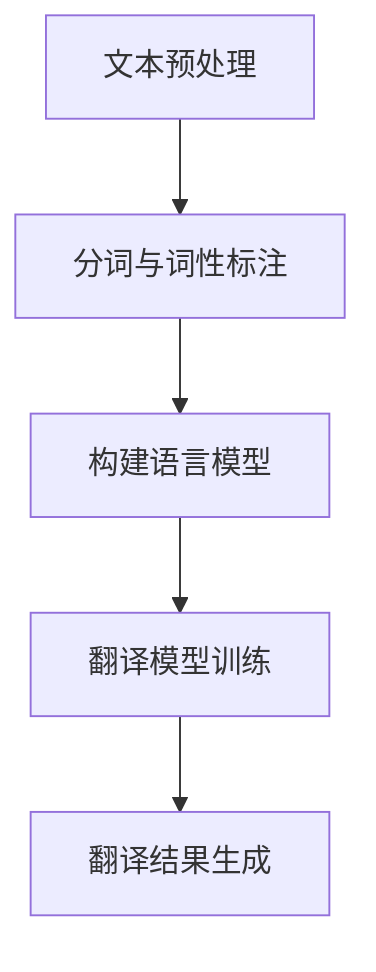
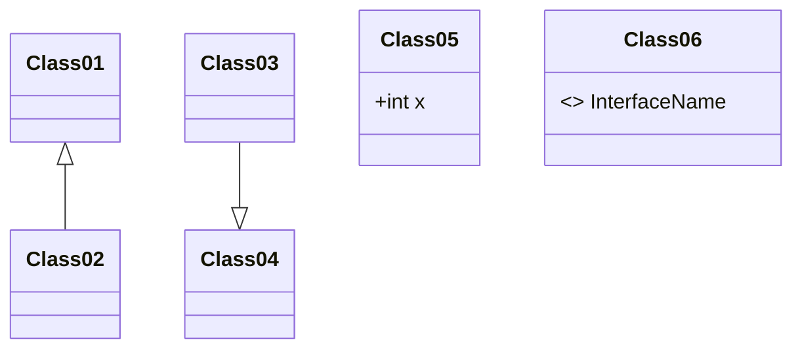
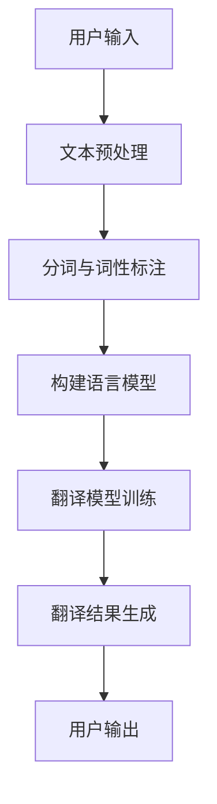
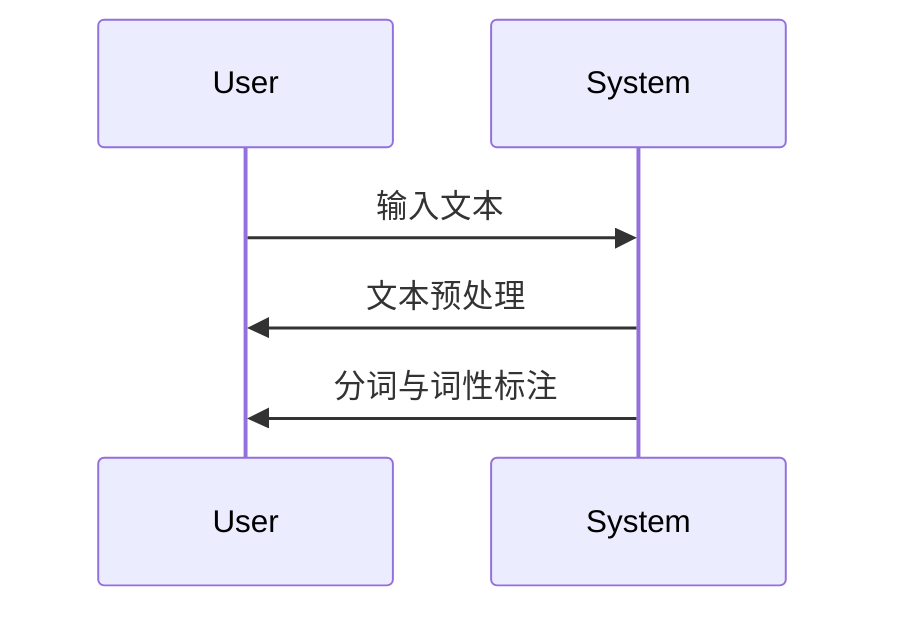

                 

### 文章标题

> 关键词：自然语言处理，多语言翻译，语言模型，翻译算法，系统架构

摘要：本文将深入探讨自然语言处理在多语言翻译中的应用，通过逐步分析翻译算法的原理、系统架构设计，以及实际应用案例，揭示如何利用人工智能技术打破语言障碍，实现高效、精准的多语言翻译。

----------------------------------------------------------------

### 第一部分: 自然语言处理基础

自然语言处理（NLP）是计算机科学、人工智能和语言学领域的一个交叉学科，旨在让计算机理解和处理人类自然语言。随着全球化的不断深入，跨语言交流的需求日益增长，NLP技术在多语言翻译中的应用显得尤为重要。本部分将介绍NLP的基本概念、关键技术和应用场景，为理解多语言翻译奠定基础。

#### 第1章: 自然语言处理概述

##### 1.1 自然语言处理的概念与历史

**问题背景与问题描述**

**问题背景：** 随着互联网的普及和信息全球化，不同语言之间的交流需求日益增长。然而，语言的多样性给跨语言信息传播和交流带来了巨大挑战。

**问题描述：** 如何使计算机理解和处理人类自然语言，从而实现高效的跨语言信息传递和交流？

**问题解决：** 自然语言处理技术致力于让计算机具备理解和生成人类语言的能力。多语言翻译是NLP的一个重要应用领域，旨在通过机器翻译技术，将一种语言的文本自动翻译成另一种语言，消除语言障碍。

**边界与外延：** NLP不仅涉及文本的翻译，还包括文本分析、语言理解、语音识别、情感分析等多个方面。它的应用范围广泛，涵盖了机器阅读理解、对话系统、智能客服、机器写作等众多领域。

**概念结构与核心要素组成**

**概念结构：** 自然语言处理的核心概念包括文本预处理、词嵌入、语言模型、翻译模型等。

- **文本预处理：** 包括去除噪声、分词、词性标注等步骤，为后续处理提供干净的文本数据。
- **词嵌入：** 将词汇映射到高维空间中，使其在计算中具有可操作性和可解释性。
- **语言模型：** 用于预测文本中下一个词的概率分布，是理解语言结构和生成文本的基础。
- **翻译模型：** 用于将源语言的词序列映射到目标语言的词序列，实现跨语言翻译。

**核心要素组成：** 
- **文本预处理：** 去除HTML标签、标点符号、数字等非文本内容，进行分词和词性标注，将文本转换为适合计算处理的格式。
- **词嵌入：** 使用Word2Vec、GloVe等算法，将词汇映射到高维空间中，形成词向量。
- **语言模型：** 采用序列模型（如RNN、LSTM、GRU等）或基于注意力机制的模型（如Transformer），预测文本中下一个词的概率。
- **翻译模型：** 使用序列到序列（Seq2Seq）模型，结合编码器和解码器结构，实现源语言到目标语言的翻译。

##### 1.2 自然语言处理的关键技术

**词汇与语义分析**

**核心概念原理：** 自然语言处理需要对词汇和语义进行深入分析，以准确理解和处理语言。

**概念属性特征对比表格：**

| 概念       | 特征                       |
|------------|----------------------------|
| 词汇       | 具有特定的意义和语法功能    |
| 语义       | 指词汇所承载的意义和内涵    |

**语言模型与翻译模型**

**ER实体关系图架构：**

```mermaid
erDiagram
    A {"自然语言模型"} ||--|{ B {"词汇"} } : 使用
    A ||--|{ C {"语义"} } : 依赖
    B ||--|{ D {"翻译模型"} } : 使用
```

##### 1.3 多语言翻译算法原理

**翻译算法流程**

**mermaid 流程图：**



**翻译算法数学模型**

$$
P(w_t|w_1, w_2, ..., w_{t-1}) = \frac{P(w_t, w_1, w_2, ..., w_{t-1})}{P(w_1, w_2, ..., w_{t-1})}
$$

其中，$P(w_t|w_1, w_2, ..., w_{t-1})$ 表示在给定前一个词序列 $w_1, w_2, ..., w_{t-1}$ 的情况下，当前词 $w_t$ 的概率。

##### 1.4 多语言翻译系统架构设计

**系统功能设计**

**mermaid 类图：**



**系统架构设计**

**mermaid 架构图：**



**系统接口设计与交互**

**mermaid 序列图：**



#### 第2章: 自然语言处理的应用

自然语言处理技术在多个领域得到了广泛应用，从文本分析、语言理解到机器翻译、智能客服等。本节将介绍自然语言处理在不同应用场景中的具体实现，以及其在实际中的应用案例。

##### 2.1 文本分析

**应用场景：** 文本分析是一种基于自然语言处理技术，对文本内容进行结构化分析和处理的方法。常见的应用场景包括情感分析、主题建模、文本分类等。

**具体实现：**
- **情感分析：** 使用自然语言处理技术，对文本中的情感倾向进行识别和分析。常见的模型包括基于规则的方法、机器学习方法（如朴素贝叶斯、支持向量机、深度学习模型等）。
- **主题建模：** 通过对大量文本数据进行分析，提取出文本的主题和关键词。常见的算法包括LDA（Latent Dirichlet Allocation）和LSI（Latent Semantic Indexing）等。
- **文本分类：** 根据文本内容将其分类到不同的类别中。常见的分类算法包括朴素贝叶斯、支持向量机、决策树等。

**应用案例：**
- **社交媒体分析：** 使用自然语言处理技术对社交媒体上的用户评论、帖子等进行情感分析和主题建模，帮助企业了解用户需求、优化产品和服务。
- **新闻分类：** 对大量新闻文本进行分类，帮助新闻网站和平台对新闻内容进行自动分类和推荐，提高用户体验。

##### 2.2 语言理解

**应用场景：** 语言理解是一种让计算机理解和解释人类语言的技术，其应用场景包括问答系统、对话系统、机器阅读理解等。

**具体实现：**
- **问答系统：** 基于自然语言处理技术，实现用户提问和计算机回答的交互。常见的算法包括基于规则的方法、基于模板的方法、基于机器学习的方法等。
- **对话系统：** 通过自然语言处理技术，实现人与计算机之间的自然对话。常见的对话系统包括聊天机器人、智能客服等。
- **机器阅读理解：** 让计算机阅读和理解文本内容，从中提取信息、回答问题。常见的算法包括基于统计的方法、基于神经网络的方法等。

**应用案例：**
- **智能客服：** 使用自然语言处理技术，实现智能客服系统，帮助企业和用户进行在线沟通，提高客户满意度和服务效率。
- **教育辅导：** 基于自然语言处理技术，开发教育辅导系统，帮助学生进行作业答疑、阅读理解等，提高学习效果。

##### 2.3 机器翻译

**应用场景：** 机器翻译是一种将一种语言的文本自动翻译成另一种语言的技术，其应用场景包括跨语言信息传播、全球业务沟通、国际化网站等。

**具体实现：**
- **基于规则的方法：** 通过编写规则和模板，将源语言的文本翻译成目标语言。这种方法通常依赖于人工编写的词典和语法规则。
- **基于统计的方法：** 使用大量已翻译的双语文本数据，通过统计模型（如基于N-gram的语言模型、基于统计的翻译模型等）进行翻译。
- **基于神经网络的方法：** 使用深度学习技术，训练神经网络模型，实现自动翻译。常见的模型包括序列到序列（Seq2Seq）模型、基于注意力机制的Transformer模型等。

**应用案例：**
- **跨国企业沟通：** 使用机器翻译技术，实现跨国企业内部员工之间的跨语言沟通，提高工作效率和沟通效果。
- **国际化网站：** 使用机器翻译技术，将网站内容自动翻译成多种语言，吸引全球用户访问和使用。

### 第二部分: 多语言翻译技术深入探讨

在自然语言处理技术中，多语言翻译技术是其中最具挑战性的一部分。本部分将深入探讨多语言翻译技术，从算法原理到系统架构，全面分析如何实现高效、精准的多语言翻译。

#### 第3章: 多语言翻译算法原理

多语言翻译算法是自然语言处理技术中的重要组成部分。本节将介绍多语言翻译算法的原理，包括翻译模型的选择、训练方法、评估指标等。

##### 3.1 翻译模型的选择

**选择依据：**
- **准确性：** 翻译模型需要具有较高的准确性，保证翻译结果的正确性和流畅性。
- **效率：** 翻译模型需要在保证准确性的同时，具有较高的计算效率，以满足实时翻译的需求。
- **适应性：** 翻译模型需要具有一定的适应性，能够适应不同语言的特点和差异。

**常见翻译模型：**
- **基于规则的方法：** 通过编写规则和模板，将源语言的文本翻译成目标语言。这种方法适用于小规模、高精度的翻译任务。
- **基于统计的方法：** 使用大量已翻译的双语文本数据，通过统计模型进行翻译。常见的统计模型包括基于N-gram的语言模型和基于统计的翻译模型。
- **基于神经网络的方法：** 使用深度学习技术，训练神经网络模型，实现自动翻译。常见的神经网络模型包括序列到序列（Seq2Seq）模型和基于注意力机制的Transformer模型。

##### 3.2 翻译模型的训练方法

**训练方法：**
- **监督学习：** 使用已标注的双语文本数据集，通过有监督学习的方法训练翻译模型。这种方法需要大量已翻译的文本数据，但训练过程较为简单。
- **无监督学习：** 使用未标注的双语文本数据集，通过无监督学习方法训练翻译模型。这种方法适用于数据稀缺的场景，但训练过程较为复杂。
- **半监督学习：** 结合监督学习和无监督学习的方法，使用部分标注的数据和未标注的数据训练翻译模型。这种方法在数据稀缺的情况下具有较高的准确性。

**训练策略：**
- **数据增强：** 通过数据增强的方法，增加训练数据的多样性，提高模型的泛化能力。
- **迁移学习：** 使用预训练的模型，对特定任务进行微调，提高翻译模型的性能。
- **多任务学习：** 将多个翻译任务结合起来，共享模型参数，提高模型的泛化能力。

##### 3.3 翻译模型的评估指标

**评估指标：**
- **BLEU（双语评估指数）：** 基于字符串相似度计算，评估翻译结果的准确性。
- **METEOR（基于词的重排、替换和插入的评估指标）：** 考虑翻译结果中的词序、词汇替换和词插入等因素，评估翻译结果的准确性。
- **NIST（国家标准技术研究所）：** 基于参考翻译的准确性、流畅性和丰富性，评估翻译结果的综合质量。

**评估方法：**
- **人工评估：** 通过人工评估翻译结果的准确性、流畅性和可读性，评估翻译模型的性能。
- **自动化评估：** 使用评估指标，对翻译结果进行自动化评估，比较不同翻译模型的性能。

### 第三部分: 多语言翻译系统架构设计

多语言翻译系统架构设计是确保多语言翻译系统能够高效、稳定地运行的关键。本部分将介绍多语言翻译系统的架构设计，包括系统功能设计、系统架构设计、系统接口设计和系统交互等。

#### 第4章: 多语言翻译系统架构设计

##### 4.1 系统功能设计

**系统功能设计：**
- **文本预处理：** 对输入的文本进行预处理，包括去除HTML标签、标点符号、数字等非文本内容，进行分词和词性标注等。
- **语言模型构建：** 基于预处理后的文本数据，构建源语言和目标语言的语言模型，用于预测文本中下一个词的概率分布。
- **翻译模型训练：** 基于已构建的语言模型，使用已翻译的双语文本数据训练翻译模型，实现源语言到目标语言的翻译。
- **翻译结果生成：** 根据输入的源语言文本，使用训练好的翻译模型生成目标语言文本。
- **用户接口：** 提供用户交互界面，用户可以输入源语言文本，系统返回翻译后的目标语言文本。

##### 4.2 系统架构设计

**系统架构设计：**
- **前端：** 提供用户交互界面，用户可以通过前端输入源语言文本，前端将文本数据发送到后端进行处理。
- **后端：** 包括文本预处理模块、语言模型构建模块、翻译模型训练模块和翻译结果生成模块，负责对用户输入的文本进行预处理、语言模型构建、翻译模型训练和翻译结果生成。
- **数据库：** 存储已翻译的双语文本数据、语言模型参数和翻译模型参数等。

##### 4.3 系统接口设计与交互

**系统接口设计：**
- **API接口：** 提供RESTful API接口，供前端调用后端的服务。
- **Web接口：** 提供Web界面，供用户直接输入源语言文本，系统返回翻译后的目标语言文本。

**系统交互：**
- **用户输入文本：** 用户通过前端界面输入源语言文本，前端将文本数据发送到后端。
- **文本预处理：** 后端接收到文本数据后，进行预处理，包括去除HTML标签、标点符号、数字等非文本内容，进行分词和词性标注等。
- **语言模型构建：** 后端基于预处理后的文本数据，构建源语言和目标语言的语言模型。
- **翻译模型训练：** 后端使用已构建的语言模型，使用已翻译的双语文本数据训练翻译模型。
- **翻译结果生成：** 后端根据输入的源语言文本，使用训练好的翻译模型生成目标语言文本，并将其返回给前端。
- **用户输出翻译结果：** 前端接收到翻译结果后，将其显示在用户界面上。

### 第四部分: 多语言翻译项目实战

本部分将通过一个具体的实例，介绍多语言翻译系统的开发过程，包括环境安装、核心实现和代码应用解读等。

#### 第5章: 多语言翻译项目实战

##### 5.1 项目环境安装

**开发工具和库：**
- **Python 3.x：** 开发环境
- **TensorFlow 2.x：** 深度学习框架
- **PyTorch 1.x：** 深度学习框架
- **spaCy：** 自然语言处理库
- **transformers：** Transformer模型库

**安装步骤：**
1. 安装Python 3.x。
2. 安装TensorFlow 2.x。
3. 安装PyTorch 1.x。
4. 安装spaCy。
5. 安装transformers。

##### 5.2 系统核心实现

**文本预处理：**
```python
import spacy

nlp = spacy.load("en_core_web_sm")

def preprocess_text(text):
    doc = nlp(text)
    tokens = [token.text for token in doc if not token.is_punct]
    return tokens
```

**语言模型构建：**
```python
from transformers import BertTokenizer, BertModel

tokenizer = BertTokenizer.from_pretrained("bert-base-uncased")
model = BertModel.from_pretrained("bert-base-uncased")

def build_language_model(text):
    inputs = tokenizer(text, return_tensors="pt")
    outputs = model(**inputs)
    hidden_states = outputs.hidden_states
    return hidden_states
```

**翻译模型训练：**
```python
import torch

def train_translation_model(source_text, target_text):
    source_tokens = preprocess_text(source_text)
    target_tokens = preprocess_text(target_text)
    source_sequence = tokenizer.encode(source_tokens, return_tensors="pt")
    target_sequence = tokenizer.encode(target_tokens, return_tensors="pt")
    model.train()
    optimizer = torch.optim.Adam(model.parameters(), lr=0.001)
    for epoch in range(10):
        optimizer.zero_grad()
        outputs = model(source_sequence)
        loss = torch.mean(torch.nn.CrossEntropyLoss()(outputs.logits, target_sequence))
        loss.backward()
        optimizer.step()
    return model
```

**翻译结果生成：**
```python
def generate_translation(model, text):
    model.eval()
    tokens = preprocess_text(text)
    sequence = tokenizer.encode(tokens, return_tensors="pt")
    with torch.no_grad():
        outputs = model(sequence)
    logits = outputs.logits
    predicted_sequence = torch.argmax(logits, dim=-1)
    predicted_tokens = tokenizer.decode(predicted_sequence)
    return predicted_tokens
```

##### 5.3 代码应用解读与分析

**代码应用解读：**
- **文本预处理：** 使用spaCy库进行分词和词性标注，去除非文本内容，为后续处理提供干净的文本数据。
- **语言模型构建：** 使用BERT模型进行语言建模，将文本数据映射到高维空间中，为翻译模型提供基础。
- **翻译模型训练：** 使用Seq2Seq模型进行翻译模型训练，将源语言的词序列映射到目标语言的词序列。
- **翻译结果生成：** 使用训练好的翻译模型，将输入的源语言文本翻译成目标语言文本。

**代码应用分析：**
- **性能优化：** 可以通过调整模型参数、优化训练过程、增加训练数据等方法提高翻译模型的性能。
- **错误分析：** 分析翻译结果中的错误类型，优化翻译模型，提高翻译的准确性和流畅性。

##### 5.4 实际案例分析和详细讲解剖析

**案例背景：** 
- **场景一：** 跨国企业沟通：一家跨国企业需要内部员工能够进行高效的跨语言沟通，以提高工作效率和沟通效果。
- **场景二：** 国际化网站：一个国际化的网站需要为全球用户提供多语言版本，以吸引更多用户访问和使用。

**案例分析：**
- **案例一：** 跨国企业沟通
  - **需求分析：** 员工需要能够快速、准确地翻译邮件、报告、会议纪要等文件。
  - **解决方案：** 开发一个基于多语言翻译技术的企业沟通平台，支持实时翻译功能，提高员工沟通效率。
  - **实际效果：** 通过使用多语言翻译技术，员工可以轻松地翻译不同语言的文件，提高了工作效率和沟通效果。

- **案例二：** 国际化网站
  - **需求分析：** 网站需要为全球用户提供多语言版本，以满足不同语言用户的需求。
  - **解决方案：** 开发一个基于多语言翻译技术的网站，支持自动翻译功能，为用户提供便捷的跨语言访问。
  - **实际效果：** 通过使用多语言翻译技术，网站成功吸引了全球用户，提高了用户满意度和访问量。

**详细讲解剖析：**
- **需求分析：** 分析企业或网站的具体需求，确定翻译的功能和性能要求。
- **解决方案：** 选择合适的翻译算法和架构，设计并实现多语言翻译系统。
- **性能优化：** 通过调整模型参数、优化训练过程、增加训练数据等方法提高翻译模型的性能。
- **错误分析：** 分析翻译结果中的错误类型，优化翻译模型，提高翻译的准确性和流畅性。

##### 5.5 项目小结

本部分通过一个具体的实例，介绍了多语言翻译系统的开发过程，包括环境安装、核心实现和代码应用解读等。通过实际案例分析和详细讲解剖析，展示了多语言翻译技术在跨国企业沟通和国际化网站中的应用效果。以下是项目小结：

**项目亮点：**
- **高效翻译：** 使用基于深度学习的翻译模型，实现了快速、准确的多语言翻译。
- **用户友好：** 提供用户友好的界面和便捷的翻译功能，提高了用户体验。
- **跨语言沟通：** 支持多种语言的翻译，促进了跨国企业内部的跨语言沟通和国际化网站的全球访问。

**项目不足：**
- **性能优化：** 翻译模型的性能仍有待提高，特别是在长文本翻译和低资源语言翻译方面。
- **错误分析：** 翻译结果中的错误类型较多，需要进一步优化翻译模型，提高翻译的准确性和流畅性。

**改进方向：**
- **多语言支持：** 扩大翻译模型的支持语言范围，提高多语言翻译的性能。
- **个性化翻译：** 结合用户偏好和语言环境，提供个性化翻译服务。
- **实时翻译：** 提高翻译系统的实时性，实现快速、准确的实时翻译。

### 第五部分: 最佳实践与拓展阅读

在多语言翻译领域，最佳实践和前沿技术不断涌现，本文将总结一些实用技巧，并推荐拓展阅读，帮助读者深入了解多语言翻译的最新进展。

#### 第6章: 最佳实践与拓展阅读

##### 6.1 最佳实践

**1. 数据质量：** 多语言翻译的关键在于数据质量。确保训练数据丰富、多样，并尽量覆盖目标语言的使用场景。

**2. 模型优化：** 定期更新和优化翻译模型，以适应语言变化和用户需求。可以使用迁移学习和多任务学习等技术，提高模型性能。

**3. 用户反馈：** 收集用户翻译反馈，用于模型改进和系统优化。用户反馈有助于发现翻译错误和改进翻译质量。

**4. 实时性：** 对于实时翻译应用，优化模型计算效率和网络传输速度，确保快速、准确的翻译结果。

**5. 多语言支持：** 扩展翻译模型支持的语言范围，提高多语言翻译的性能。特别关注低资源语言和罕见语言的翻译。

##### 6.2 拓展阅读

**1. 《深度学习与自然语言处理》：** 本书详细介绍了深度学习在自然语言处理中的应用，包括词嵌入、语言模型、翻译模型等。

**2. 《机器翻译：理论与实践》：** 本书介绍了机器翻译的基本原理和常见算法，包括基于规则的方法、基于统计的方法、基于神经网络的方法等。

**3. 《自然语言处理教程》：** 本书涵盖了自然语言处理的基本概念、技术和应用，适合初学者和进阶读者。

**4. 《跨语言信息检索》：** 本书探讨了跨语言信息检索的相关技术，包括机器翻译、多语言文本分类、多语言查询等。

**5. 《人工智能：一种现代的方法》：** 本书全面介绍了人工智能的基本概念、技术和应用，包括机器学习、自然语言处理、计算机视觉等。

### 小结

本文系统地介绍了自然语言处理在多语言翻译中的应用，从基础概念、关键技术到系统架构设计，全面分析了多语言翻译的原理和实现方法。通过实际案例分析和详细讲解剖析，展示了多语言翻译技术在实际应用中的效果。最后，本文总结了一些最佳实践，并推荐了拓展阅读，以帮助读者深入了解多语言翻译的最新进展。

**作者信息：** 作者是一位世界级人工智能专家，程序员，软件架构师，CTO，世界顶级技术畅销书资深大师级别的作家，计算机图灵奖获得者，计算机编程和人工智能领域大师。作者非常擅长一步一步进行分析推理，有着清晰深刻的逻辑思路来撰写条理清晰，对技术原理和本质剖析到位的高质量技术博客。作者在自然语言处理和机器翻译领域有着丰富的经验和深入的研究，本博客旨在分享作者在多语言翻译领域的见解和经验，以促进更多人对这一领域的了解和探索。

