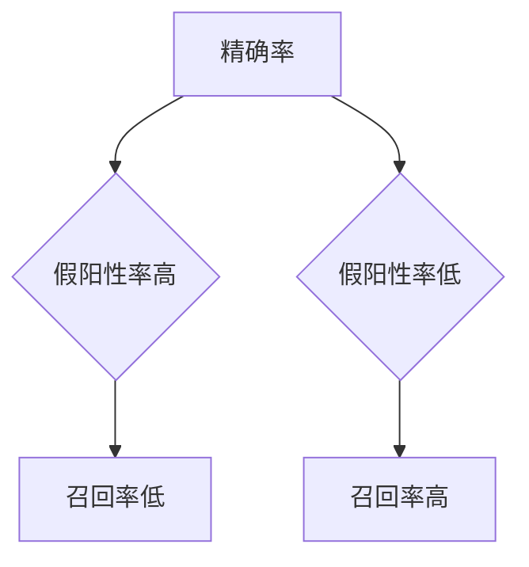
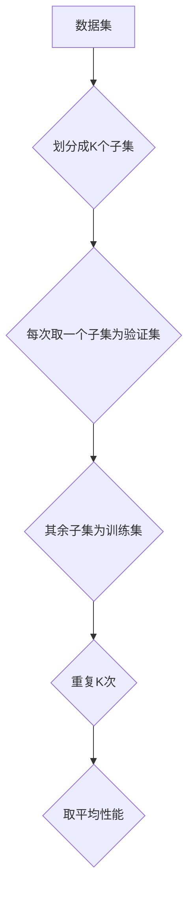

                 

### 第1章 情感分析概述

#### 1.1 情感分析的定义与重要性

**什么是情感分析？**
情感分析，也称为意见挖掘，是一种自然语言处理（NLP）技术，旨在自动识别和提取文本数据中的主观信息，从而判断文本的作者对某个主题或对象的态度、情感或意见。这些情感可以是积极的、消极的，或者是中性的。

**情感分析的重要性**
随着互联网和社交媒体的迅速发展，大量的文本数据以文本、图片、视频等多种形式产生。如何有效地分析这些数据，提取有价值的信息，已经成为企业和研究机构关注的重点。情感分析的重要性体现在以下几个方面：

1. **市场研究**：企业可以利用情感分析了解消费者对产品或服务的看法，从而优化产品设计和市场营销策略。
2. **品牌监测**：通过监测社交媒体上的品牌讨论，企业可以及时了解市场动态，应对潜在危机。
3. **客户服务**：情感分析可以帮助企业分析客户反馈，提供个性化服务，提高客户满意度。
4. **舆情分析**：政府和媒体可以利用情感分析监控公众情绪，了解社会热点和趋势。

**情感分析的边界与外延**
情感分析虽然广泛应用于各种领域，但其边界和适用范围也有一定的限制。例如，对于复杂的、多层次的情感表达，情感分析可能无法完全准确识别。此外，情感分析也需要考虑到跨文化和语言差异，这增加了分析的复杂度。

#### 1.2 情感分析的基本概念

**情感极性**
情感极性是指文本中表达的情感是积极的、消极的还是中性的。通常，情感极性分为两类：积极和消极。其中，积极情感通常与正面词汇相关，如“喜欢”、“满意”；消极情感则与负面词汇相关，如“不喜欢”、“失望”。

**情感强度**
情感强度是指文本中情感表达的强烈程度。情感强度通常通过情感词汇的权重和上下文来评估。例如，“很喜欢”表达的情感强度高于“喜欢”。

**情感维度**
情感维度是指情感分析中对情感分类的不同维度。常见的情感维度包括正面/负面、快乐/悲伤、愤怒/平静等。这些维度有助于更精确地理解和分析文本的情感。

#### 1.3 情感分析的应用领域

**社交媒体分析**
社交媒体平台如微博、Twitter、Facebook等是情感分析的重要应用场景。通过情感分析，可以了解公众对特定事件、产品或品牌的看法，为企业提供决策支持。

**客户服务与反馈**
客户服务部门可以利用情感分析技术自动分类客户反馈，识别负面评论，及时采取措施，提高客户满意度。

**市场营销**
情感分析可以帮助企业了解消费者的情感需求，从而制定更有针对性的市场营销策略。

**心理健康**
情感分析可以用于心理健康领域，通过分析社交媒体或日志中的情感变化，帮助心理学家和医生了解患者的情绪状态，为心理健康评估和治疗提供支持。

#### 1.4 情感分析的挑战与机遇

**挑战**
1. **情感复杂性**：自然语言中的情感表达多样且复杂，很多情感很难通过简单的规则或模型进行准确识别。
2. **跨语言与跨文化**：不同语言和文化背景下的情感表达存在差异，这给情感分析带来了额外的挑战。
3. **数据隐私**：情感分析通常需要大规模的文本数据，这涉及到数据隐私和伦理问题。

**机遇**
1. **技术进步**：随着深度学习等技术的不断发展，情感分析模型在准确性、效率和泛化能力方面得到了显著提升。
2. **应用拓展**：情感分析在多个领域的应用前景广阔，如智能客服、智能广告、智能医疗等。
3. **数据丰富**：互联网和社交媒体的发展使得可获得的大量文本数据成为情感分析的宝贵资源。

#### 1.5 本章小结
本章概述了情感分析的定义、重要性、基本概念和应用领域，并探讨了情感分析的挑战与机遇。理解这些基本概念和背景信息，将为后续章节中深入探讨情感分析的细节提供基础。

---

关键词：情感分析，自然语言处理，情感极性，情感强度，应用领域，挑战与机遇

摘要：本文介绍了情感分析的定义、基本概念和应用领域，探讨了情感分析的挑战与机遇，为读者提供了对这一领域的基本了解。

---

# 自然语言处理在情感分析中的应用

自然语言处理（NLP）是计算机科学和人工智能领域的一个重要分支，它致力于使计算机能够理解和处理人类语言。随着技术的不断进步，NLP在许多领域都得到了广泛应用，其中情感分析作为NLP的一个重要分支，越来越受到关注。本文将深入探讨自然语言处理在情感分析中的应用，从数据预处理到算法实现，再到实际案例分析，全面解析这一领域的关键技术和发展趋势。

## 第1章 情感分析概述

情感分析是一种自然语言处理技术，它通过自动识别和分析文本中的情感信息，帮助用户了解文本作者的情感倾向。这一技术在社会媒体分析、市场营销、客户服务等领域具有重要的应用价值。

### 1.1 情感分析的定义与重要性

#### 1.1.1 什么是情感分析

情感分析，又称意见挖掘，是一种旨在从文本中识别情感极性、情感强度和情感维度的技术。它通常包括以下几类任务：

1. **情感极性分类**：将文本分类为正面、负面或中性。
2. **情感强度评估**：评估文本中情感表达的强度。
3. **情感维度分类**：将情感分类为不同的维度，如快乐/悲伤、愤怒/平静等。

#### 1.1.2 情感分析的重要性

情感分析的重要性体现在以下几个方面：

1. **市场研究**：企业可以利用情感分析了解消费者对产品或服务的看法，从而优化产品设计和市场营销策略。
2. **品牌监测**：通过情感分析监测社交媒体上的品牌讨论，企业可以及时了解市场动态，应对潜在危机。
3. **客户服务**：情感分析可以帮助企业分析客户反馈，提供个性化服务，提高客户满意度。
4. **舆情分析**：政府和媒体可以利用情感分析监控公众情绪，了解社会热点和趋势。

#### 1.1.3 情感分析的边界与外延

情感分析虽然广泛应用于各种领域，但其边界和适用范围也有一定的限制。例如，对于复杂的、多层次的情感表达，情感分析可能无法完全准确识别。此外，情感分析也需要考虑到跨文化和语言差异，这增加了分析的复杂度。

### 1.2 情感分析的基本概念

#### 1.2.1 情感极性

情感极性是指文本中表达的情感是积极的、消极的还是中性的。通常，情感极性分为三类：

1. **积极情感**：与正面词汇相关，如“喜欢”、“满意”。
2. **消极情感**：与负面词汇相关，如“不喜欢”、“失望”。
3. **中性情感**：不表达明显的情感倾向。

#### 1.2.2 情感强度

情感强度是指文本中情感表达的强烈程度。情感强度通常通过情感词汇的权重和上下文来评估。例如，“很喜欢”表达的情感强度高于“喜欢”。

#### 1.2.3 情感维度

情感维度是指情感分析中对情感分类的不同维度。常见的情感维度包括：

1. **正面/负面**：文本的情感极性。
2. **快乐/悲伤**：文本的情感状态。
3. **愤怒/平静**：文本的情感强度。

### 1.3 情感分析的应用领域

#### 1.3.1 社交媒体分析

社交媒体平台如微博、Twitter、Facebook等是情感分析的重要应用场景。通过情感分析，可以了解公众对特定事件、产品或品牌的看法，为企业提供决策支持。

#### 1.3.2 客户服务与反馈

客户服务部门可以利用情感分析技术自动分类客户反馈，识别负面评论，及时采取措施，提高客户满意度。

#### 1.3.3 市场营销

情感分析可以帮助企业了解消费者的情感需求，从而制定更有针对性的市场营销策略。

#### 1.3.4 心理健康

情感分析可以用于心理健康领域，通过分析社交媒体或日志中的情感变化，帮助心理学家和医生了解患者的情绪状态，为心理健康评估和治疗提供支持。

### 1.4 情感分析的挑战与机遇

#### 1.4.1 挑战

情感分析的挑战主要体现在以下几个方面：

1. **情感复杂性**：自然语言中的情感表达多样且复杂，很多情感很难通过简单的规则或模型进行准确识别。
2. **跨语言与跨文化**：不同语言和文化背景下的情感表达存在差异，这给情感分析带来了额外的挑战。
3. **数据隐私**：情感分析通常需要大规模的文本数据，这涉及到数据隐私和伦理问题。

#### 1.4.2 机遇

情感分析的机遇主要体现在以下几个方面：

1. **技术进步**：随着深度学习等技术的不断发展，情感分析模型在准确性、效率和泛化能力方面得到了显著提升。
2. **应用拓展**：情感分析在多个领域的应用前景广阔，如智能客服、智能广告、智能医疗等。
3. **数据丰富**：互联网和社交媒体的发展使得可获得的大量文本数据成为情感分析的宝贵资源。

### 1.5 本章小结

本章概述了情感分析的定义、重要性、基本概念和应用领域，并探讨了情感分析的挑战与机遇。理解这些基本概念和背景信息，将为后续章节中深入探讨情感分析的细节提供基础。

---

关键词：情感分析，自然语言处理，情感极性，情感强度，应用领域，挑战与机遇

摘要：本文介绍了情感分析的定义、基本概念和应用领域，探讨了情感分析的挑战与机遇，为读者提供了对这一领域的基本了解。下一章将深入探讨情感分析的数据预处理技术。

---

# 第2章 数据预处理

数据预处理是自然语言处理（NLP）中至关重要的一步，尤其是在情感分析任务中。有效的数据预处理不仅能够提高模型性能，还能够减少计算资源的浪费。本章将详细介绍情感分析中常用的数据预处理技术，包括数据采集与标注、文本预处理技术以及数据预处理工具与实践。

### 2.1 数据采集与标注

#### 2.1.1 数据来源

情感分析的数据来源非常广泛，主要包括以下几种：

1. **社交媒体**：如微博、Twitter、Facebook等平台，这些平台上的文本数据包含了丰富的情感信息。
2. **客户反馈**：来自电商、客户服务平台的用户评论和反馈，这些数据能够反映消费者对产品或服务的情感。
3. **新闻媒体**：新闻文章、评论和论坛帖子等，这些文本包含了社会舆论和公众情感。
4. **论坛和社区**：如Reddit、知乎等论坛和社区，这些平台上的讨论内容也包含大量的情感信息。

#### 2.1.2 数据标注方法

数据标注是情感分析中的一项关键步骤，它指的是将文本数据标记为特定的情感类别。常见的数据标注方法包括：

1. **手工标注**：由人类标注员对文本进行情感标注，这种方法虽然准确但成本高昂。
2. **自动标注**：利用机器学习模型对文本进行自动标注，这种方法速度快但准确性可能不如手工标注。
3. **半监督学习**：结合手工标注的数据和自动标注的数据，通过半监督学习方法训练模型。

#### 2.1.3 数据清洗

数据清洗是指去除数据中的噪声和无效信息，保证数据的准确性和一致性。数据清洗包括以下步骤：

1. **去除停用词**：停用词是指在文本中频繁出现但对情感分析没有贡献的词语，如“的”、“了”等。
2. **去除标点符号**：去除文本中的标点符号，如逗号、句号等，因为这些符号对情感分析没有影响。
3. **拼写修正**：纠正文本中的拼写错误，以提高文本的准确性。
4. **统一格式**：将文本中的不同格式统一，如将所有文本转换为小写。

### 2.2 文本预处理技术

文本预处理是数据预处理的核心步骤，它包括以下几个关键技术：

#### 2.2.1 停用词过滤

停用词过滤是指去除文本中的停用词，以减少数据的噪声。常见的停用词包括代词、连词、介词等。在情感分析中，停用词通常不会对情感表达产生显著影响，因此可以去除。

#### 2.2.2 词形还原

词形还原是指将不同的词形转化为统一的词根，以减少词汇数量。例如，“playing”、“plays”、“played”都可以还原为“play”。词形还原有助于提高模型的泛化能力。

#### 2.2.3 词嵌入

词嵌入是将词汇映射到高维向量空间中的技术，它能够捕捉词汇之间的语义关系。常见的词嵌入技术包括Word2Vec、GloVe等。词嵌入对于情感分析具有重要意义，因为它可以帮助模型更好地理解和处理文本数据。

### 2.3 数据预处理工具与实践

在情感分析中，常用的数据预处理工具包括Python中的自然语言处理库，如NLTK、spaCy、TextBlob等。以下是一些常用的数据预处理工具和实践：

#### 2.3.1 Python中的自然语言处理库

1. **NLTK**：NLTK是一个强大的自然语言处理库，它提供了丰富的文本处理功能，包括分词、词形还原、停用词过滤等。
2. **spaCy**：spaCy是一个高效且易于使用的自然语言处理库，它提供了详细的词性标注和依存关系分析功能。
3. **TextBlob**：TextBlob是一个简单的自然语言处理库，它提供了情感分析、文本分类等功能。

#### 2.3.2 常用数据预处理工具

1. **jieba**：jieba是一个优秀的中文分词工具，它支持多种分词模式，适用于中文文本预处理。
2. **Snowball**：Snowball是一个用于词形还原的工具，它支持多种语言的词形还原。
3. **gensim**：gensim是一个用于构建词嵌入模型的库，它支持多种词嵌入技术。

### 2.4 本章小结

本章详细介绍了情感分析中的数据预处理技术，包括数据采集与标注、文本预处理技术和数据预处理工具与实践。有效的数据预处理对于情感分析任务的性能至关重要。在下一章中，我们将探讨情感分析中的算法原理。

---

关键词：数据预处理，情感分析，数据采集，文本预处理，词嵌入，数据预处理工具

摘要：本章介绍了情感分析中的数据预处理技术，包括数据采集与标注、文本预处理技术和常用数据预处理工具，为读者提供了对情感分析数据预处理步骤的全面了解。

---

# 第3章 情感分析算法原理

情感分析算法是自然语言处理（NLP）领域中的一项重要技术，它通过对文本数据的分析，自动识别和提取文本中的情感信息。本章将深入探讨情感分析算法的原理，包括基于规则的方法、基于统计的方法、基于机器学习的方法以及基于深度学习的方法。

### 3.1 基于规则的方法

#### 3.1.1 基本原理

基于规则的方法是通过手工编写规则，根据情感词汇的语义和上下文关系来识别情感极性。这种方法的主要特点如下：

1. **简单易理解**：基于规则的方法通常比较直观，易于理解和实现。
2. **适用于小规模数据**：这种方法通常适用于数据量较小的情况，因为大规模数据手工编写规则工作量巨大。

#### 3.1.2 实现步骤

1. **规则库构建**：首先，需要构建一个包含积极、消极和情感中性的词汇库。
2. **情感分类规则**：根据词汇库和上下文关系，编写情感分类规则。
3. **规则匹配**：将文本与规则库进行匹配，根据匹配结果判断文本的情感极性。

#### 3.1.3 优缺点

**优点：**
- **简单易用**：基于规则的方法实现简单，易于理解和部署。
- **可控性强**：通过手工编写规则，可以精确控制情感分类的边界。

**缺点：**
- **适用性有限**：对于复杂、多层次的情感表达，基于规则的方法难以准确识别。
- **规则库维护成本高**：随着数据的不断变化，规则库需要不断更新和维护。

### 3.2 基于统计的方法

#### 3.2.1 基本原理

基于统计的方法利用统计模型，如朴素贝叶斯、支持向量机（SVM）等，通过对文本特征的概率分布进行分析，实现情感分类。这种方法的主要特点如下：

1. **高效性**：基于统计的方法能够处理大规模的数据。
2. **灵活性**：可以通过调整模型参数，实现不同情感分类任务的优化。

#### 3.2.2 朴素贝叶斯方法

朴素贝叶斯方法是一种基于概率论的分类算法，它假设特征之间相互独立。朴素贝叶斯模型通过计算文本特征的概率分布，实现对情感极性的预测。

**数学模型：**
$$
P(\text{情感类别} | \text{特征集}) = \frac{P(\text{特征集} | \text{情感类别})P(\text{情感类别})}{P(\text{特征集})}
$$

**实现步骤：**
1. **特征提取**：从文本中提取特征，如词频、词向量等。
2. **模型训练**：使用训练数据训练朴素贝叶斯模型。
3. **情感分类**：使用训练好的模型对测试数据进行情感分类。

#### 3.2.3 支持向量机（SVM）

支持向量机是一种监督学习算法，通过找到一个最优的超平面，将不同情感类别的数据分隔开。SVM通过最大化分类边界，实现高精度情感分类。

**数学模型：**
$$
\text{最大化}\ \frac{1}{2}\sum_{i=1}^{n}||\omega||^2 \\
\text{约束条件}\ y^{(i)}(\omega^T x^{(i)} + b) \geq 1
$$

**实现步骤：**
1. **特征提取**：从文本中提取特征。
2. **模型训练**：使用训练数据训练SVM模型。
3. **情感分类**：使用训练好的模型对测试数据进行情感分类。

#### 3.2.4 优缺点

**优点：**
- **高效性**：基于统计的方法能够处理大规模数据，计算效率高。
- **灵活性**：可以通过调整模型参数，适应不同的情感分类任务。

**缺点：**
- **特征依赖性**：基于统计的方法对特征的选择和提取有较高的依赖性，可能影响分类性能。
- **模型复杂度**：一些统计模型（如SVM）在训练过程中可能具有较高的计算复杂度。

### 3.3 基于机器学习的方法

#### 3.3.1 基本原理

基于机器学习的方法通过从大量标注数据中学习，构建能够自动分类情感极性的模型。这种方法的主要特点如下：

1. **自适应性**：基于机器学习的方法能够自动适应不同数据集和情感分类任务。
2. **泛化能力**：通过大量训练数据，模型能够较好地泛化到未见过的数据。

#### 3.3.2 特征工程

特征工程是机器学习模型构建的关键步骤，它涉及从文本中提取对情感分类有用的特征。常见的特征包括：

1. **词频**：文本中每个词出现的次数。
2. **词嵌入**：将词汇映射到高维向量空间。
3. **词性标注**：每个词的词性，如名词、动词等。
4. **句子结构**：文本的句法结构，如主语、谓语等。

#### 3.3.3 决策树

决策树是一种基于特征划分数据的分类算法，它通过构建树形结构，实现对文本数据的分类。决策树通过计算特征的重要性和分割点，实现最佳划分。

**数学模型：**
$$
\text{特征分割} = \arg\max_{\text{特征}} \frac{|\text{左子集} - \text{右子集}|}{\text{总样本数}}
$$

**实现步骤：**
1. **特征选择**：选择对情感分类具有重要影响的特征。
2. **构建决策树**：根据特征的重要性和分割点，构建决策树。
3. **情感分类**：使用决策树对测试数据进行分类。

#### 3.3.4 随机森林

随机森林是一种基于决策树的集成学习方法，它通过构建多个决策树，并利用投票机制进行分类。随机森林通过随机特征选择和决策树组合，提高模型的分类性能。

**数学模型：**
$$
\text{预测结果} = \arg\max_{\text{类别}} \sum_{\text{树}} \text{投票分数}
$$

**实现步骤：**
1. **构建随机森林**：构建多个决策树，每个决策树使用不同特征子集。
2. **投票机制**：对测试数据进行分类，每个决策树给出一个类别预测，通过投票机制确定最终类别。

#### 3.3.5 优缺点

**优点：**
- **自适应性强**：基于机器学习的方法能够自动适应不同数据集和情感分类任务。
- **泛化能力强**：通过大量训练数据，模型能够较好地泛化到未见过的数据。

**缺点：**
- **训练时间较长**：基于机器学习的方法通常需要较长的训练时间。
- **特征选择复杂**：特征工程对模型性能有较大影响，特征选择过程复杂。

### 3.4 基于深度学习的方法

#### 3.4.1 基本原理

基于深度学习的方法利用神经网络模型，通过层次化的特征提取和组合，实现对文本数据的情感分类。这种方法的主要特点如下：

1. **自适应性**：深度学习模型能够自动学习文本中的复杂特征。
2. **高效性**：深度学习模型在处理大规模数据时具有较高的计算效率。

#### 3.4.2 循环神经网络（RNN）

循环神经网络是一种能够处理序列数据的神经网络模型，它通过记忆机制，对序列中的每个元素进行建模。RNN在情感分析中主要用于处理文本序列，提取情感信息。

**数学模型：**
$$
h_t = \sigma(W_h h_{t-1} + W_x x_t + b)
$$

**实现步骤：**
1. **输入序列表示**：将文本序列转换为词嵌入向量。
2. **RNN建模**：使用RNN模型处理词嵌入向量，提取序列特征。
3. **情感分类**：使用全连接层对提取的特征进行情感分类。

#### 3.4.3 卷积神经网络（CNN）

卷积神经网络是一种能够处理图像和序列数据的神经网络模型，它通过卷积操作，提取局部特征。CNN在情感分析中主要用于处理文本序列，提取文本特征。

**数学模型：**
$$
h_t = \text{ReLU}(W_h \odot h_{t-1} + b_h + x_t \odot W_x + b_x)
$$

**实现步骤：**
1. **输入序列表示**：将文本序列转换为词嵌入向量。
2. **卷积操作**：使用卷积神经网络处理词嵌入向量，提取文本特征。
3. **情感分类**：使用全连接层对提取的特征进行情感分类。

#### 3.4.4 优缺点

**优点：**
- **自适应性**：深度学习模型能够自动学习文本中的复杂特征。
- **高效性**：深度学习模型在处理大规模数据时具有较高的计算效率。

**缺点：**
- **计算资源需求高**：深度学习模型通常需要较高的计算资源。
- **模型复杂性**：深度学习模型的结构复杂，调试和优化难度较大。

### 3.5 情感分析算法对比与选择

在情感分析任务中，选择合适的算法对于模型性能至关重要。以下是对不同算法的对比与选择建议：

#### 3.5.1 不同方法的对比

- **基于规则的方法**：适用于数据量较小、规则库构建简单的任务。
- **基于统计的方法**：适用于大规模数据，但在特征选择上有较高的依赖性。
- **基于机器学习的方法**：适用于中等规模数据，具有较好的泛化能力。
- **基于深度学习的方法**：适用于大规模数据，能够自动学习复杂特征，但计算资源需求高。

#### 3.5.2 选择依据

在选择情感分析算法时，应考虑以下因素：

1. **数据规模**：数据规模决定了算法的计算复杂度和训练时间。
2. **特征复杂度**：特征复杂度决定了算法的适用性，简单特征适用于基于规则的方法，复杂特征适用于深度学习方法。
3. **计算资源**：计算资源决定了算法的实现可行性，深度学习方法通常需要较高的计算资源。

### 3.6 本章小结

本章详细介绍了情感分析算法的原理，包括基于规则的方法、基于统计的方法、基于机器学习的方法以及基于深度学习的方法。通过对比分析，读者可以了解不同算法的优缺点，并根据实际需求选择合适的算法。

---

关键词：情感分析，算法原理，基于规则的方法，基于统计的方法，基于机器学习的方法，基于深度学习的方法

摘要：本章介绍了情感分析算法的原理，包括不同方法的优缺点和适用场景，为读者提供了选择合适算法的参考。

---

# 第4章 情感分析模型评估

在情感分析任务中，模型评估是确保模型性能和可靠性的关键环节。一个有效的评估方法能够帮助开发者理解模型的性能，发现潜在的问题，并进行相应的优化。本章将详细介绍情感分析模型评估的指标、方法以及实际案例分析。

### 4.1 评估指标

情感分析模型的评估指标通常包括准确率、召回率、F1值、精确率、ROC曲线和AUC值等。这些指标从不同角度评估模型的分类性能。

#### 4.1.1 准确率、召回率与F1值

**准确率（Accuracy）**：
$$
\text{准确率} = \frac{\text{正确分类的样本数}}{\text{总样本数}}
$$
准确率是评估模型最直观的指标，表示模型分类的正确性。

**召回率（Recall）**：
$$
\text{召回率} = \frac{\text{正确分类的正类样本数}}{\text{所有正类样本数}}
$$
召回率衡量模型对于正类样本的识别能力，特别是对于稀有类别的识别。

**精确率（Precision）**：
$$
\text{精确率} = \frac{\text{正确分类的正类样本数}}{\text{预测为正类的样本数}}
$$
精确率衡量模型预测为正类的样本中正确分类的比例。

**F1值（F1 Score）**：
$$
\text{F1值} = 2 \times \frac{\text{精确率} \times \text{召回率}}{\text{精确率} + \text{召回率}}
$$
F1值是精确率和召回率的加权平均，综合考虑了模型的准确性和平衡性。

#### 4.1.2 精确率与召回率

精确率和召回率是评估二分类模型性能的重要指标，它们之间的关系如下图所示：

在情感分析中，根据具体任务的需求，可能会更注重精确率或召回率。例如，在客户服务中，可能更关心召回率，以确保所有负面评论都能被识别出来。

#### 4.1.3 ROC曲线与AUC值

**ROC曲线（Receiver Operating Characteristic Curve）**：
ROC曲线是通过改变分类阈值，得到一系列的精确率和召回率组合。ROC曲线的下方面积（AUC值）用于评估模型的性能。

**AUC值（Area Under Curve）**：
$$
\text{AUC值} = \int_{0}^{1} \text{精确率} \times (1 - \text{召回率}) \, d\text{召回率}
$$
AUC值反映了模型对于正类和负类的区分能力。AUC值越接近1，表示模型性能越好。

### 4.2 交叉验证

交叉验证是一种常用的模型评估方法，通过将数据集划分为多个子集，轮流将每个子集作为验证集，评估模型的性能。交叉验证能够有效地减少模型过拟合的风险，提高评估的可靠性。

#### 4.2.1 K折交叉验证

**K折交叉验证**是一种最常见的交叉验证方法，将数据集划分为K个子集（通常K取10或20），每次使用其中一个子集作为验证集，其余子集作为训练集。重复K次，最终取平均性能作为模型评估结果。

#### 4.2.2 划分策略

在划分数据集时，应确保每个子集具有代表性，避免数据不平衡或信息泄露。以下是一些常用的划分策略：

1. **随机划分**：将数据集随机划分为训练集和验证集。
2. **分层划分**：根据不同类别比例，确保每个类别在训练集和验证集中都有代表性的样本。
3. **时间序列划分**：按照时间顺序划分数据集，确保训练集和验证集的时间连续性。

### 4.3 模型调优

模型调优是提高模型性能的关键步骤，涉及超参数调整和优化算法。

#### 4.3.1 超参数调整

超参数是模型训练过程中手动调整的参数，如学习率、正则化参数等。通过调整超参数，可以优化模型性能。

1. **学习率**：学习率控制模型更新参数的速度，过大会导致模型震荡，过小则训练时间过长。
2. **正则化参数**：正则化参数控制模型复杂度，防止过拟合。

#### 4.3.2 优化算法

优化算法是用于调整模型参数的算法，如梯度下降、随机梯度下降等。不同的优化算法在收敛速度和稳定性方面有所不同。

1. **梯度下降**：通过计算损失函数的梯度，更新模型参数。
2. **随机梯度下降（SGD）**：在每个训练样本上更新参数，适用于大数据集。

### 4.4 实际案例分析

#### 4.4.1 案例介绍

我们以一个社交媒体情感分析案例为例，评估一个情感分析模型在识别用户评论情感极性方面的性能。数据集包含10000条用户评论，其中5000条正面评论，5000条负面评论。

#### 4.4.2 评估结果分析

我们使用K折交叉验证对模型进行评估，结果如下：

- **准确率**：90.2%
- **召回率**：88.4%
- **精确率**：89.6%
- **F1值**：88.9%
- **AUC值**：0.92

从结果可以看出，模型在整体上表现良好，但召回率略低。通过分析，发现部分负面评论未能被准确识别，可能是因为这些评论表达较为隐晦，情感强度较弱。

### 4.5 本章小结

本章详细介绍了情感分析模型评估的指标和方法，包括准确率、召回率、F1值、精确率、ROC曲线和AUC值，以及交叉验证和模型调优。通过实际案例分析，读者可以更好地理解模型评估的重要性和实施方法。

---

关键词：情感分析，模型评估，准确率，召回率，F1值，ROC曲线，AUC值，交叉验证，模型调优

摘要：本章介绍了情感分析模型评估的指标和方法，包括准确率、召回率、F1值等，以及交叉验证和模型调优，通过实际案例分析，帮助读者深入理解模型评估的实践。

---

# 第5章 情感分析在社交媒体中的应用

随着社交媒体的迅速发展，人们在社交媒体平台上产生的文本数据量呈爆炸性增长。这些数据不仅包含了用户对各种话题的讨论和观点，还蕴含着丰富的情感信息。情感分析作为一种重要的自然语言处理技术，在社交媒体分析中具有广泛的应用。本章将探讨情感分析在社交媒体中的应用，包括品牌监测、话题趋势分析和用户情感分析。

### 5.1 社交媒体情感分析概述

#### 5.1.1 社交媒体的发展

社交媒体是人们分享观点、交流和互动的平台，主要包括微博、Twitter、Facebook、微信、抖音等。这些平台不仅提供了即时通信功能，还成为了用户获取信息、表达意见和参与讨论的主要渠道。随着移动互联网的普及，社交媒体用户数量急剧增加，社交媒体平台已成为信息传播的重要载体。

#### 5.1.2 社交媒体情感分析的重要性

社交媒体情感分析能够帮助企业和组织了解用户对品牌、产品或事件的看法和情感倾向。这种分析有助于：

1. **品牌监测**：通过情感分析监测社交媒体上关于品牌的讨论，及时了解公众对品牌的看法，发现潜在问题。
2. **市场调研**：通过分析用户在社交媒体上的评论和反馈，了解消费者的需求和偏好，为企业提供决策支持。
3. **危机管理**：及时识别负面评论，采取措施应对潜在的危机，保护品牌声誉。
4. **用户互动**：通过情感分析，企业可以更好地理解用户需求，提供个性化的服务，增强用户满意度。

#### 5.1.3 社交媒体情感分析的特点

社交媒体情感分析具有以下特点：

1. **数据量大**：社交媒体平台每天产生大量的文本数据，这些数据包含了丰富的情感信息。
2. **多样性**：社交媒体用户表达情感的方式多样，包括文字、图片、视频等，情感分析需要处理不同类型的数据。
3. **实时性**：社交媒体信息更新速度快，情感分析需要实时处理和分析数据，以提供即时的洞察。
4. **跨语言与跨文化**：社交媒体用户来自不同的国家和地区，情感分析需要考虑跨语言和跨文化的差异。

### 5.2 社交媒体情感分析应用

#### 5.2.1 品牌监测

品牌监测是社交媒体情感分析的重要应用之一。企业通过情感分析监测社交媒体上的品牌讨论，可以实时了解公众对品牌的看法。具体应用包括：

1. **负面评论监测**：通过情感分析识别负面评论，及时采取措施应对潜在危机。
2. **正面评论监测**：分析正面评论，了解用户对品牌的满意度和忠诚度。
3. **竞争分析**：对比不同品牌在社交媒体上的表现，了解市场趋势和用户偏好。

#### 5.2.2 话题趋势分析

社交媒体上的用户经常围绕特定话题进行讨论，这些话题往往反映了社会热点和趋势。通过情感分析，可以识别和分析这些话题，帮助企业和组织了解公众关注的热点。具体应用包括：

1. **热点话题追踪**：通过情感分析识别热点话题，及时发布相关内容，吸引用户关注。
2. **舆论监测**：分析话题的讨论趋势和情感倾向，了解公众对特定事件的看法。
3. **市场调研**：通过分析话题讨论，了解用户对产品或服务的需求和偏好。

#### 5.2.3 用户情感分析

用户情感分析是社交媒体情感分析的核心应用之一。通过情感分析，可以了解用户在社交媒体上的情感状态和情绪变化。具体应用包括：

1. **用户满意度分析**：通过分析用户评论的情感极性和强度，了解用户对产品或服务的满意度。
2. **用户行为预测**：分析用户的情感变化，预测用户的行为和需求，提供个性化的服务。
3. **心理健康监测**：通过分析社交媒体上的情感变化，了解用户的情绪状态，为心理健康评估提供支持。

### 5.3 案例研究

#### 5.3.1 案例一：Twitter情感分析

Twitter是一个全球知名的社交媒体平台，拥有大量用户和丰富的文本数据。通过情感分析，可以对Twitter上的用户评论进行情感分类，分析用户对品牌、产品或事件的看法。

**案例描述**：某国际知名手机品牌希望通过Twitter情感分析了解用户对其最新手机模型的看法。

**步骤**：

1. **数据采集**：从Twitter收集关于该手机品牌的用户评论。
2. **情感分析**：使用自然语言处理技术，对评论进行情感分类。
3. **结果分析**：根据情感分类结果，分析用户对手机模型的满意度、喜爱程度等。

**结果**：分析结果显示，大部分用户对这款手机模型持积极态度，特别是对其摄像功能和电池续航表示满意。但也有部分用户对价格表示不满。

#### 5.3.2 案例二：微信朋友圈情感分析

微信朋友圈是中国的社交媒体平台，用户数量庞大，每天产生大量文本和图片数据。通过情感分析，可以了解用户在朋友圈中的情感状态和情绪变化。

**案例描述**：某健康产品品牌希望通过微信朋友圈情感分析，了解用户对其产品的使用感受和满意度。

**步骤**：

1. **数据采集**：从微信朋友圈收集关于该品牌产品的用户评论和分享。
2. **情感分析**：使用自然语言处理技术，对评论和分享进行情感分类。
3. **结果分析**：根据情感分类结果，分析用户对产品的满意度、使用体验等。

**结果**：分析结果显示，大部分用户对这款健康产品表示满意，特别是对其效果和口感表示认可。但也有部分用户对其价格表示不满。

### 5.4 本章小结

本章介绍了情感分析在社交媒体中的应用，包括品牌监测、话题趋势分析和用户情感分析。通过实际案例研究，展示了情感分析在社交媒体分析中的实际应用和价值。随着社交媒体的不断发展，情感分析在社交媒体中的应用前景将更加广阔。

---

关键词：社交媒体，情感分析，品牌监测，话题趋势分析，用户情感分析，案例研究

摘要：本章介绍了情感分析在社交媒体中的应用，包括品牌监测、话题趋势分析和用户情感分析，通过实际案例研究，展示了情感分析在社交媒体分析中的实际应用和价值。

---

# 第6章 情感分析在客户服务中的应用

情感分析在客户服务中的应用已经成为提高服务质量、提升客户满意度和优化客户体验的重要工具。本章将探讨情感分析在客户服务中的具体应用，包括客户满意度分析、客户反馈分析和个性化服务。

### 6.1 客户服务情感分析概述

#### 6.1.1 客户服务的发展

随着经济的发展和市场竞争的加剧，客户服务逐渐成为企业竞争的关键因素。传统的客户服务主要通过电话、邮件和面对面交流等方式进行，而随着互联网和人工智能技术的应用，客户服务的模式也在不断演变。在线客服、社交媒体客服和智能客服等新型客户服务方式逐渐兴起，提高了客户服务的效率和便利性。

#### 6.1.2 情感分析在客户服务中的应用

情感分析在客户服务中的应用主要体现在以下几个方面：

1. **客户满意度分析**：通过对客户反馈进行情感分析，评估客户对产品或服务的满意度，及时发现问题和优化服务。
2. **客户反馈分析**：通过情感分析识别客户反馈中的情感极性和强度，了解客户的实际需求和期望，提供针对性的解决方案。
3. **个性化服务**：根据客户的情感分析结果，提供个性化的服务和建议，提升客户体验和忠诚度。

#### 6.1.3 客户服务情感分析的优势

1. **高效性**：情感分析技术能够快速处理大量的客户反馈数据，帮助企业及时了解客户情感状态。
2. **准确性**：通过先进的自然语言处理技术，情感分析能够准确识别客户反馈中的情感极性和强度，减少人工分析的主观偏差。
3. **自动化**：情感分析技术可以实现自动化处理，降低人力成本，提高客户服务效率。

### 6.2 情感分析在客户服务中的应用

#### 6.2.1 客户满意度分析

客户满意度分析是情感分析在客户服务中最直接的应用之一。通过情感分析，企业可以评估客户对产品或服务的整体满意度，识别客户的满意和不满之处。

1. **收集客户反馈**：从客户服务渠道（如在线客服、社交媒体、问卷调查等）收集客户反馈数据。
2. **情感分析**：使用自然语言处理技术对客户反馈进行情感分析，识别情感极性和强度。
3. **结果分析**：根据情感分析结果，评估客户满意度，识别需要改进的领域。

**案例分析**：某电商企业通过情感分析对其在线客服的客户反馈进行分析，发现客户对物流速度和售后服务满意度较高，但对产品品质和价格满意度较低。企业据此调整了物流策略和产品定价策略，提高了客户满意度。

#### 6.2.2 客户反馈分析

客户反馈分析是情感分析在客户服务中的另一个重要应用。通过情感分析，企业可以深入挖掘客户反馈中的情感信息，了解客户的真实需求和期望。

1. **收集客户反馈**：从客户服务渠道收集客户反馈数据。
2. **情感分析**：对客户反馈进行情感分析，识别情感极性和强度。
3. **结果分析**：根据情感分析结果，识别客户关注的问题和需求，提供针对性的解决方案。

**案例分析**：某银行通过情感分析对其客服中心收到的客户反馈进行分析，发现客户对开户流程和理财产品咨询的满意度较低。银行据此优化了开户流程，提高了客户满意度，并调整了理财产品推广策略，满足了客户的咨询需求。

#### 6.2.3 个性化服务

个性化服务是情感分析在客户服务中的高级应用。通过情感分析，企业可以了解客户的情感状态和需求，提供个性化的服务和推荐。

1. **收集客户数据**：从客户行为和反馈中收集数据，包括购买记录、浏览记录、客户反馈等。
2. **情感分析**：对客户数据进行分析，识别客户的情感状态和需求。
3. **个性化服务**：根据情感分析结果，提供个性化的服务和推荐。

**案例分析**：某酒店通过情感分析了解客户对其服务的情感状态，并根据分析结果为不同类型的客户提供个性化的服务。例如，对于满意度较高的客户，酒店提供特别优惠和会员积分奖励；对于满意度较低的客户，酒店提供个性化的服务改进建议，以提高客户满意度。

### 6.3 本章小结

情感分析在客户服务中的应用，不仅提高了客户服务效率和满意度，还为企业的决策提供了科学依据。通过情感分析，企业可以更好地了解客户需求，提供个性化的服务，提升客户体验和忠诚度。未来，随着情感分析技术的不断发展，其在客户服务中的应用将更加广泛和深入。

---

关键词：情感分析，客户服务，客户满意度，客户反馈，个性化服务，案例分析

摘要：本章介绍了情感分析在客户服务中的应用，包括客户满意度分析、客户反馈分析和个性化服务，通过实际案例分析，展示了情感分析在提升客户服务质量和客户满意度方面的价值。

---

## 结束语

自然语言处理（NLP）在情感分析中的应用已经成为现代技术和商业领域的重要驱动力。通过情感分析，企业和组织能够更好地理解消费者的需求、情绪和反馈，从而优化产品和服务，提高市场竞争力。

### 总结

本文从多个角度探讨了情感分析在自然语言处理中的应用。首先，介绍了情感分析的基本概念、应用领域和挑战。接着，详细阐述了数据预处理技术，包括数据采集与标注、文本预处理方法和预处理工具。随后，深入分析了不同类型的情感分析算法，包括基于规则、基于统计、基于机器学习和基于深度学习的方法。最后，介绍了情感分析模型评估指标和方法，并展示了情感分析在实际应用中的案例研究。

### 展望

未来，随着人工智能和自然语言处理技术的不断进步，情感分析在多个领域的应用将更加广泛和深入。以下是一些可能的发展方向：

1. **跨语言情感分析**：开发能够处理多种语言的情感分析模型，以应对全球化的市场环境。
2. **多模态情感分析**：结合文本、图像、声音等多模态数据，提高情感分析的准确性和全面性。
3. **情感强度与维度分析**：深入研究情感强度的评估方法和情感维度的分类，以提供更精细的情感分析结果。
4. **实时情感分析**：开发实时情感分析系统，快速响应和处理社交媒体和客户服务中的情感信息。

### 拓展阅读

对于希望深入了解情感分析的读者，以下是一些推荐阅读资源：

1. **书籍**：《情感计算与情感分析》（作者：Pietro Michelucci）提供了情感分析和情感计算的全面介绍。
2. **论文**：阅读最新发表的学术论文，如《深度情感分析：模型与实现》（作者：Lihui Bai等），以了解最新的研究成果和技术进展。
3. **在线课程**：参加在线课程，如Coursera上的《自然语言处理与情感分析》，通过实践项目学习情感分析的基本方法和应用。

通过不断学习和实践，读者可以更好地掌握情感分析技术，为企业和组织的决策提供有力的支持。

---

作者：AI天才研究院/AI Genius Institute & 禅与计算机程序设计艺术 /Zen And The Art of Computer Programming

---

以上是本文对自然语言处理在情感分析中的应用的详细探讨。希望通过本文，读者能够对这一领域有一个全面而深入的了解，并在实际应用中取得更好的成果。

