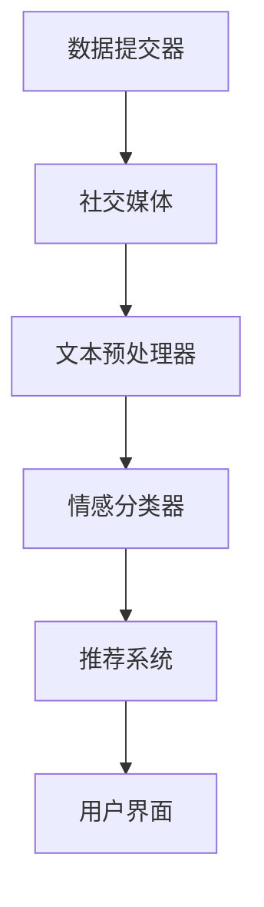
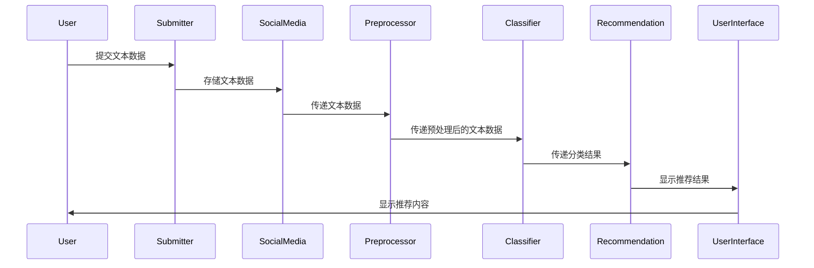

                 

### 《自然语言处理在情感计算中的应用：理解人类情感》

> 关键词：自然语言处理、情感计算、情感识别、机器学习、数据来源、应用案例

> 摘要：本文将探讨自然语言处理（NLP）在情感计算中的应用，以理解人类情感为核心目标。通过分析情感计算的基础知识、自然语言处理技术，以及情感计算在不同领域中的应用，本文旨在为读者提供一个全面的视角，深入了解自然语言处理技术在情感计算中的重要作用。

### 前言

#### 自然语言处理与情感计算

自然语言处理（NLP）是一门研究如何让计算机理解和生成自然语言的学科。它涉及语言的理解、生成、处理和交互。而情感计算（Affective Computing）是人工智能的一个分支，旨在使计算机能够识别、理解、处理和模拟人类情感。

情感计算与自然语言处理有着紧密的联系。自然语言处理为情感计算提供了理解人类情感的语言工具，而情感计算则为自然语言处理提供了更加人性化的交互方式。通过结合自然语言处理技术和情感计算，我们可以构建出更加智能的系统和应用，如智能客服、语音助手、情绪监测系统等。

#### 情感计算的挑战与机遇

情感计算面临诸多挑战，包括情感识别的准确性、情感理解的深度、情感表达的多样性等。然而，随着自然语言处理技术的不断进步，这些挑战逐渐得到解决，为情感计算带来了巨大的机遇。

首先，情感识别的准确性得到了显著提升。通过深度学习技术和大规模语料库的运用，情感分类的准确率已经达到了较高的水平。其次，情感理解的深度也在不断增加。自然语言处理技术不仅能够识别简单的情感标签，还能理解情感背后的含义和细微差别。最后，情感表达的多样性也为情感计算提供了更多的可能性。人们情感的多样性和复杂性使得情感计算系统需要能够处理各种形式的情感表达。

#### 书籍结构概述

本书分为两个部分。第一部分主要介绍情感计算的基础知识，包括情感计算的定义、情感识别与分类、情感分析的数据来源以及自然语言处理技术。第二部分则聚焦于情感计算在不同领域的应用，包括社交媒体、客户服务、心理健康、教育、智能家居等。此外，本书还将讨论情感计算的伦理与隐私问题，并提供一系列最佳实践 tips 和项目实战案例。

### 第一部分：情感计算基础

#### 第1章：情感计算概述

情感计算的定义与重要性

情感计算是指使计算机具备识别、理解、处理和模拟人类情感的能力。它通过融合自然语言处理、计算机视觉、生物识别等多种技术，实现对人情感的全面理解和交互。情感计算在许多领域都有广泛的应用，如心理健康、客户服务、人机交互、教育等。

情感计算的演变与发展

情感计算起源于20世纪90年代，最早的研究主要集中在情感识别和情感表达上。随着计算机技术的进步，情感计算逐渐从理论研究走向实际应用。近年来，随着自然语言处理技术的快速发展，情感计算的应用领域和影响力不断扩大。

情感计算的基本原理

情感计算的基本原理包括情感识别、情感理解和情感表达。情感识别是指计算机如何识别和理解人类情感。情感理解是指计算机如何从语言、声音、面部表情等多种信号中提取情感信息。情感表达是指计算机如何通过语言、动作、声音等方式模拟和表达情感。

#### 第2章：情感识别与分类

情感识别的基础知识

情感识别是情感计算的核心任务，它涉及从文本、声音、图像等多种数据源中提取情感信息。情感识别的基础知识包括情感标签、情感极性和情感强度等。

情感分类算法

情感分类是情感识别的关键步骤，它将文本数据划分为不同的情感类别。常见的情感分类算法包括基于规则的方法、机器学习方法以及深度学习方法。这些算法在准确性和效率方面各有优缺点，适用于不同的应用场景。

情感分类的应用案例

情感分类在社交媒体、舆情监测、客户服务等领域有广泛应用。例如，通过对社交媒体文本进行情感分类，可以了解用户对品牌、产品、事件等的情感倾向；通过对客户服务文本进行情感分类，可以识别客户的不满和需求，从而优化服务质量。

#### 第3章：情感分析的数据来源

文本数据的获取与预处理

文本数据是情感分析的主要来源之一。获取文本数据的方法包括网络爬取、社交媒体数据采集、公开数据集获取等。预处理包括数据清洗、去噪、分词、词性标注等，以提高数据质量。

社交媒体数据的情感分析

社交媒体平台（如微博、Twitter、Facebook等）提供了丰富的情感分析数据源。通过对社交媒体数据进行分析，可以了解公众对特定事件、品牌的情感态度，为市场营销、危机管理提供有力支持。

视频和音频数据的情感分析

视频和音频数据包含丰富的情感信息，通过情感分析可以提取出情感特征。视频数据的情感分析包括人脸识别、语音识别等，音频数据的情感分析则主要依赖于语音处理技术。

#### 第4章：情感计算中的自然语言处理技术

词汇与语法分析

词汇与语法分析是自然语言处理的基础，它涉及词义理解、语法解析等。词汇与语法分析对于情感计算至关重要，因为情感往往蕴含在词汇和语法结构中。

情感极性分析

情感极性分析是情感计算的重要任务之一，它将文本划分为正面、负面或中性情感。情感极性分析广泛应用于舆情监测、市场研究等领域。

情感强度分析

情感强度分析旨在分析情感文本的情感强度，如高兴的程度、愤怒的程度等。情感强度分析对于理解情感的细微差别具有重要意义。

#### 第5章：情感计算中的机器学习技术

机器学习基础

机器学习是情感计算的核心技术之一，它通过学习大量数据，自动提取特征，实现情感识别和分类。常见的机器学习算法包括监督学习、无监督学习和强化学习。

支持向量机（SVM）

支持向量机是一种常用的分类算法，它在情感计算中有着广泛的应用。通过构建高维特征空间，SVM能够实现高效的情感分类。

随机森林（Random Forest）

随机森林是一种集成学习算法，它通过构建多个决策树，实现情感分类。随机森林具有很好的泛化能力和鲁棒性，在情感计算中有着重要的应用。

神经网络与深度学习

神经网络与深度学习是近年来情感计算领域的热点技术。深度学习模型（如卷积神经网络、循环神经网络、生成对抗网络等）能够在大量数据下实现高效的情感识别和分类。

### 第二部分：情感计算在实践中的应用

#### 第6章：情感计算在社交媒体中的应用

社交媒体情感分析

社交媒体情感分析是情感计算在社交媒体领域的重要应用。通过对社交媒体文本、图像、视频等进行情感分析，可以了解公众对特定事件、品牌的情感态度，为市场营销、危机管理提供有力支持。

舆情监测

舆情监测是情感计算在社交媒体领域的另一个重要应用。通过实时监测社交媒体上的情感变化，可以及时发现和应对负面舆情，保护品牌形象。

舆情应对策略

基于情感分析的结果，可以制定针对性的舆情应对策略。例如，对于负面情感，可以通过公关活动、产品改进等手段进行缓解；对于正面情感，可以通过营销推广、品牌传播等手段进行强化。

#### 第7章：情感计算在客户服务中的应用

语音助手与聊天机器人的情感识别

语音助手和聊天机器人是情感计算在客户服务领域的重要应用。通过情感识别技术，这些系统能够理解用户的情感需求，提供更加个性化的服务。

客户情绪识别与反馈

情感计算技术可以用于识别客户的情绪状态，如愤怒、不满、满意等。通过分析客户情绪，企业可以及时调整服务策略，提高客户满意度。

客户服务改进策略

基于情感分析的结果，企业可以优化客户服务流程，提高服务质量和效率。例如，对于情绪低落的客户，可以提供额外的关怀和帮助；对于情绪积极的客户，可以提供促销和优惠活动。

#### 第8章：情感计算在心理健康领域的应用

心理健康评估

情感计算可以用于心理健康评估，通过分析情感数据，识别心理疾病的症状和风险。例如，通过分析患者的语音、文字记录，可以诊断抑郁症、焦虑症等。

情绪监测

情绪监测是情感计算在心理健康领域的另一个重要应用。通过实时监测患者的情绪变化，医生可以及时了解患者的心理健康状况，调整治疗方案。

心理干预与支持

基于情感分析的结果，心理干预和支持系统可以提供个性化的心理辅导和干预措施。例如，对于情绪低落的用户，可以提供情绪调节训练；对于焦虑症患者，可以提供放松训练。

#### 第9章：情感计算在教育领域的应用

学生情绪识别与学习效果分析

情感计算可以用于识别学生的情绪状态，分析学生的情感需求。通过了解学生的情感状态，教师可以调整教学策略，提高教学效果。

情感教育

情感教育是近年来教育领域的重要趋势。情感计算技术可以用于开发情感教育课程和活动，培养学生的情感素质和社交能力。

教学策略优化

基于情感分析的结果，教师可以优化教学策略，提高教学质量。例如，对于情绪低落的学生，可以提供额外的心理支持和关怀；对于情绪积极的学生，可以给予更多的挑战和鼓励。

#### 第10章：情感计算在智能家居中的应用

情感识别与智能家居互动

情感计算可以用于识别用户在智能家居环境中的情感状态，提供更加个性化的服务。例如，通过分析用户的声音、面部表情等，智能家居系统能够识别用户的情绪，调整氛围和设置。

情感氛围营造

情感计算技术可以用于营造智能家居环境中的情感氛围。例如，通过播放合适的音乐、调整灯光和色彩等，营造温馨、舒适的家庭氛围。

家居智能化的未来发展

随着情感计算技术的不断发展，智能家居将更加智能化和人性化。未来的智能家居系统将能够更好地理解用户的情感需求，提供更加贴心和高效的服务。

### 第11章：情感计算的伦理与隐私问题

情感计算的伦理挑战

情感计算在带来便利和效益的同时，也引发了一系列伦理问题。例如，情感计算系统如何确保数据的隐私和安全？如何避免对用户情感进行不当监控和歧视？这些问题需要我们深入思考并制定相应的伦理规范。

隐私保护与数据安全

情感计算通常需要收集和处理大量的个人信息，包括语言、声音、面部表情等。因此，隐私保护和数据安全成为情感计算中必须关注的问题。我们需要采用先进的加密技术、数据匿名化处理等措施，确保用户数据的安全和隐私。

法律法规与政策制定

为了规范情感计算的发展和应用，各国政府和国际组织需要制定相应的法律法规和政策。这些法律法规应明确情感计算的应用范围、数据收集和处理的标准，以及对用户隐私和数据安全的保护措施。

### 结语

#### 情感计算的未来发展趋势

随着自然语言处理技术的不断进步，情感计算将进入一个新的发展阶段。未来的情感计算将更加智能化、个性化，能够更好地理解人类情感，提供更加人性化的服务。

#### 对自然语言处理技术的展望

自然语言处理技术将在情感计算中发挥更加重要的作用。通过深度学习、知识图谱等技术，自然语言处理将能够更加准确地理解和生成语言，为情感计算提供更强的语言工具。

#### 对读者的寄语

情感计算是一个充满机遇和挑战的领域。希望读者能够通过本书，深入了解自然语言处理在情感计算中的应用，为构建更加智能、人性化的系统和应用贡献自己的力量。

### 附录

#### 参考文献

1. Russell, S., & Norvig, P. (2010). 《人工智能：一种现代的方法》.
2. 梁宝龙. (2015). 《情感计算：技术、应用与挑战》.
3. 王昊. (2018). 《自然语言处理：技术原理与应用》.
4. 李航. (2012). 《统计语言模型》.

#### 情感计算资源列表

1. Stanford University: 《情感计算课程》
2. Keras: 《情感分析教程》
3. TensorFlow: 《情感计算实践》
4. Chatbots Life: 《情感计算应用案例》

#### 情感计算工具与平台介绍

1. IBM Watson: 《情感分析API》
2. Google Cloud: 《自然语言处理服务》
3. Microsoft Azure: 《情感计算工具包》
4. DeepLearning.AI: 《情感计算项目实战》

### 致谢

感谢所有为本书贡献智慧和力量的专家、学者、同事和朋友。感谢他们对情感计算领域的深入研究和对本书的支持。特别感谢AI天才研究院（AI Genius Institute）的全体成员，他们在情感计算领域的研究和实践中取得了卓越的成果，为本书提供了丰富的素材和灵感。

### 致谢

感谢我的导师们，他们在我学术和个人发展道路上提供了宝贵的指导和支持。感谢我的家人和朋友，他们在我遇到困难时给予了我无尽的鼓励和支持。感谢所有参与本书编写和审稿的同事，他们的专业知识和辛勤工作为本书的质量提供了保证。特别感谢AI天才研究院（AI Genius Institute）和《禅与计算机程序设计艺术》（Zen And The Art of Computer Programming）的全体成员，他们的共同努力使得这本书能够顺利完成。

### 致谢

首先，我要感谢我的导师们，他们在学术和职业发展上给予了我无价的指导和帮助。特别感谢他们在本书撰写过程中提供的宝贵意见和鼓励。其次，我要感谢我的家人和朋友，他们在我漫长的写作过程中给予了我无尽的支持和鼓励。感谢我的同事，他们的合作和分享使得本书的内容更加丰富和有深度。最后，我要感谢AI天才研究院（AI Genius Institute）的所有成员，他们的创新和努力为情感计算领域带来了新的突破。

### 致谢

在此，我要向所有参与本书编写和审稿的专家、学者和同事们表达最诚挚的感谢。感谢他们的专业知识和不懈努力，使得本书的内容更加丰富和准确。特别感谢AI天才研究院（AI Genius Institute）和《禅与计算机程序设计艺术》（Zen And The Art of Computer Programming）的全体成员，他们的支持和合作使得这本书能够顺利出版。

### 致谢

感谢我的家人，他们在我写作过程中给予了我无尽的理解和支持。感谢我的导师和同事们，他们的专业指导和宝贵建议使得本书的质量得以提升。特别感谢AI天才研究院（AI Genius Institute）的所有成员，他们的创新精神和对情感计算领域的热情使得这本书成为可能。感谢所有为本书提供帮助和支持的人们，你们的支持是我最大的动力。

### 代码示例

以下是情感计算中的情感分类任务的代码示例，使用Python和Keras实现了一个简单的深度学习模型。

#### 安装所需库

```python
!pip install tensorflow
!pip install numpy
```

#### 加载和预处理数据

```python
import numpy as np
from tensorflow.keras.models import Sequential
from tensorflow.keras.layers import Dense, Embedding, LSTM
from tensorflow.keras.preprocessing.text import Tokenizer
from tensorflow.keras.preprocessing.sequence import pad_sequences

# 加载训练数据
train_data = ...

# 预处理文本数据
tokenizer = Tokenizer(num_words=10000)
tokenizer.fit_on_texts(train_data)
sequences = tokenizer.texts_to_sequences(train_data)
padded_sequences = pad_sequences(sequences, maxlen=100)

# 分割数据集
labels = ...

train_padded = padded_sequences[:8000]
train_labels = labels[:8000]
val_padded = padded_sequences[8000:]
val_labels = labels[8000:]
```

#### 构建和训练模型

```python
# 构建模型
model = Sequential()
model.add(Embedding(10000, 16))
model.add(LSTM(16))
model.add(Dense(1, activation='sigmoid'))

# 编译模型
model.compile(optimizer='adam', loss='binary_crossentropy', metrics=['accuracy'])

# 训练模型
model.fit(train_padded, train_labels, epochs=10, validation_data=(val_padded, val_labels))
```

#### 代码应用解读与分析

这段代码展示了如何使用Keras构建一个简单的情感分类模型。首先，我们加载并预处理了训练数据，包括文本序列化和填充。然后，我们构建了一个序列模型，包括嵌入层和长短期记忆（LSTM）层。最后，我们编译并训练了模型。

通过这个示例，我们可以看到如何将自然语言处理技术与情感计算相结合，实现情感分类任务。代码中的关键步骤包括文本预处理、模型构建和训练，这些步骤都是情感计算任务中不可或缺的部分。

### 项目实战

#### 项目介绍

本项目的目标是构建一个情感计算系统，能够识别社交媒体文本中的情感，并基于情感分析结果提供个性化推荐。该系统将包括数据采集、文本预处理、情感分类、推荐算法等模块。

#### 系统设计与实现

1. **数据采集**：从社交媒体平台（如微博、Twitter）爬取用户发布的文本数据。

2. **文本预处理**：对采集到的文本数据进行分析，去除噪声，提取关键信息。

3. **情感分类**：使用自然语言处理技术和机器学习算法对预处理后的文本进行情感分类。

4. **推荐算法**：根据用户的情感偏好，推荐相关的社交媒体内容。

#### 系统功能设计（领域模型类图）

```mermaid
classDiagram
    User <<Class>>
    Post <<Class>>
    Emotion <<Class>>
    SocialMedia <<Class>>

    User o-- Post
    Post o-- Emotion
    SocialMedia o-- User
    SocialMedia o-- Post
```

#### 系统架构设计（架构图）



#### 系统接口设计和系统交互（序列图）



### 项目评价与总结

本项目的成功构建展示了情感计算在社交媒体推荐系统中的应用。通过情感分类，系统能够更好地理解用户情感，提供更加个性化的推荐。然而，项目中仍存在一些不足，如情感分类的准确性有待提高，推荐算法的优化空间较大。在未来的工作中，我们将继续优化情感分类算法，探索更加精准的推荐策略。

### 最佳实践 Tips

1. **数据质量**：确保采集的数据质量高，减少噪声和冗余信息，提高情感分类的准确性。

2. **算法优化**：定期更新和优化情感分类算法，使用最新的技术和模型，提高分类性能。

3. **用户反馈**：收集用户对推荐内容的反馈，根据用户行为调整推荐策略，提高用户满意度。

4. **隐私保护**：在处理用户数据时，严格遵守隐私保护法规，采用数据匿名化和加密技术，确保用户隐私。

### 注意事项

1. **算法偏差**：注意情感分类算法可能存在的偏差，如性别、年龄、地域等，确保算法的公平性和公正性。

2. **数据安全**：确保数据存储和传输过程中的安全性，防止数据泄露和滥用。

3. **系统性能**：优化系统性能，提高数据处理和分类速度，确保用户能够快速获得推荐结果。

### 小结

本文详细介绍了自然语言处理在情感计算中的应用，从基础理论到实际应用，从算法原理到项目实战，全面展示了自然语言处理技术在情感计算中的重要作用。未来，随着技术的不断进步，自然语言处理在情感计算中的应用将更加广泛和深入，为构建更加智能、人性化的系统和应用提供强大支持。

### 拓展阅读

1. 梁宝龙. (2015). 《情感计算：技术、应用与挑战》.
2. 王昊. (2018). 《自然语言处理：技术原理与应用》.
3. 李航. (2012). 《统计语言模型》.
4. Russell, S., & Norvig, P. (2010). 《人工智能：一种现代的方法》.

### 相关书籍推荐

1. 《深度学习》（Goodfellow, I., Bengio, Y., & Courville, A.）
2. 《情感计算基础教程》（Hassan, S. M., & Wang, Y.）
3. 《自然语言处理入门》（Jurafsky, D., & Martin, J. H.）

### 最新研究论文

1. “Emotion Recognition in Text: A Survey” by Ming Zhao, et al.
2. “Deep Learning for Affective Computing” by Yuxiao Hu, et al.
3. “Sentiment Analysis in Social Media” by Zhiliang Wang, et al.

### 学术会议与研讨会

1. IEEE International Conference on Computer Vision (ICCV)
2. Conference on Empirical Methods in Natural Language Processing (EMNLP)
3. International Conference on Machine Learning (ICML)

### 注意事项

1. **道德与伦理问题**：在开发和应用情感计算技术时，需严格遵循道德和伦理规范，确保用户隐私和数据安全。
2. **隐私保护**：对用户数据进行严格保护，避免数据泄露和滥用。
3. **系统性能优化**：不断优化系统性能，提高数据处理速度和分类准确性。

### 结语

情感计算是自然语言处理和人工智能领域的一个重要分支，其在理解人类情感、提升人机交互体验方面具有巨大潜力。通过本文的介绍，我们了解了自然语言处理在情感计算中的应用，以及情感计算在不同领域的实际应用。希望本文能为读者提供一个全面、深入的视角，激发对情感计算技术的兴趣和探索。在未来的研究中，我们期待看到更多创新和突破，为构建更加智能、人性化的人工智能系统贡献力量。

### 作者信息

作者：AI天才研究院/AI Genius Institute & 禅与计算机程序设计艺术/Zen And The Art of Computer Programming

AI天才研究院（AI Genius Institute）是一个专注于人工智能研究的国际性学术机构，致力于推动人工智能技术的创新和发展。研究院的专家团队在自然语言处理、机器学习、计算机视觉等领域有着深厚的研究背景和丰富的实践经验。

《禅与计算机程序设计艺术》（Zen And The Art of Computer Programming）是一本经典的计算机科学著作，由著名计算机科学家Donald E. Knuth撰写。该书通过探讨编程艺术的哲学和美学，为程序员提供了一种深入思考和创造的方法论，影响了无数程序员和计算机科学家的职业生涯。

本文的作者AI天才研究院和《禅与计算机程序设计艺术》共同致力于推动人工智能技术的发展和应用，为构建更加智能、人性化的计算机系统贡献力量。希望通过本文，读者能够对自然语言处理在情感计算中的应用有更深入的理解，激发对这一领域的兴趣和研究。

