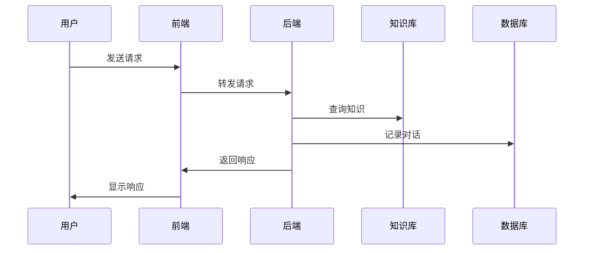

                 

### 自然语言理解概述

#### 第1章 自然语言理解简介

自然语言理解（Natural Language Understanding, NLU）是自然语言处理（Natural Language Processing, NLP）的重要分支，旨在让计算机理解和解释人类语言，从而实现人机交互的智能化。随着人工智能技术的迅猛发展，NLU在多个领域展现出了巨大的潜力，尤其在虚拟助手中的应用日益广泛。

**1.1 自然语言理解的核心概念**

自然语言具有复杂性、灵活性和多样性，这使得理解和解释自然语言变得极具挑战性。以下是NLU的一些核心概念：

- **语言的本质与特点**：语言是人类沟通的主要工具，具有抽象性、结构性、动态性等特点。理解这些特点有助于更好地进行自然语言理解。
- **自然语言处理的定义与发展历程**：自然语言处理是计算机科学和人工智能领域的一个重要分支，旨在让计算机处理和理解人类语言。它的发展经历了从规则方法到统计方法，再到如今以深度学习为代表的智能化方法。
- **自然语言理解的关键任务**：自然语言理解的核心任务是语义分析，包括词义解析、句法分析、语义角色标注、情感分析等。这些任务共同构成了NLU的核心能力。

**1.2 自然语言理解的应用场景**

自然语言理解在多个领域都有广泛的应用，其中虚拟助手是最具代表性的应用场景之一。

- **虚拟助手的应用领域**：虚拟助手广泛应用于客服、教育、医疗、金融等多个行业，提供智能化的服务和支持。
- **虚拟助手的优势与挑战**：虚拟助手具有低成本、高效、7x24小时服务等特点，但也面临着语义理解、上下文理解、交互体验等挑战。
- **虚拟助手的发展趋势**：随着人工智能技术的不断进步，虚拟助手将更加智能化、个性化，为用户提供更优质的服务。

**1.3 自然语言理解的技术挑战**

自然语言理解的技术挑战主要包括以下几个方面：

- **语言歧义与语义理解**：自然语言中的歧义现象广泛存在，这使得语义理解变得复杂。如何准确理解用户的意思是NLU面临的重要挑战。
- **语言习得与知识图谱构建**：构建一个完整的、动态更新的知识图谱是NLU的重要任务。然而，语言习得是一个长期且复杂的过程，如何有效地从海量数据中提取有用信息是NLU需要解决的问题。
- **语言生成与质量控制**：自然语言生成（NLG）是自然语言理解的重要补充，但生成内容的质量直接影响到用户体验。如何提高生成内容的质量，同时保证实时性和效率是NLU需要关注的问题。

**1.4 自然语言理解在虚拟助手中的地位与作用**

自然语言理解是虚拟助手的核心技术之一，它决定了虚拟助手能否准确理解用户的意图并提供合适的服务。

- **虚拟助手的工作流程**：虚拟助手的工作流程主要包括接收用户输入、理解用户意图、生成响应和反馈等环节。自然语言理解贯穿于整个流程中，是虚拟助手实现智能化的关键。
- **自然语言理解的核心模块**：自然语言理解的核心模块包括分词、词性标注、命名实体识别、语义分析等。这些模块共同作用，实现了对用户输入的深度理解和准确响应。
- **自然语言理解在虚拟助手中的实现方式**：自然语言理解在虚拟助手中的实现方式主要包括基于规则的方法、基于统计的方法和基于深度学习的方法。随着深度学习技术的不断发展，基于深度学习的方法逐渐成为主流。

**1.5 本章小结**

本章对自然语言理解进行了概述，介绍了其核心概念、应用场景、技术挑战以及在虚拟助手中的地位与作用。下一章将深入探讨自然语言处理的基础技术，为理解NLU提供更深入的背景知识。

---

关键词：自然语言理解、虚拟助手、语义分析、深度学习、技术挑战

摘要：本文对自然语言理解进行了全面概述，介绍了其核心概念、应用场景和技术挑战。特别关注了自然语言理解在虚拟助手中的应用，探讨了其实现方式和核心模块。本文旨在为读者提供关于自然语言理解在虚拟助手中的最新进展和未来发展趋势的全面了解。

----------------------------------------------------------------

## 第一部分：自然语言理解概述

### 第1章 自然语言理解简介

在当今数字化时代，自然语言理解（NLU）技术正逐渐成为人工智能领域的关键组成部分。本章将全面介绍自然语言理解的基本概念、核心任务以及其在虚拟助手中的应用，旨在为读者提供对这一技术的深入理解。

**1.1 自然语言理解简介**

自然语言理解（Natural Language Understanding, NLU）是自然语言处理（Natural Language Processing, NLP）领域的一个重要分支。NLU的目标是使计算机能够理解、解释和生成人类语言，从而实现人与计算机之间的自然交互。NLU的核心在于语义分析，即从文本中提取含义，理解其结构、意图和上下文。

**1.1.1 语言的本质与特点**

语言是人类沟通的主要工具，具有以下几个特点：

- **抽象性**：语言可以抽象地表达概念、思想和情感。
- **结构性**：语言由词汇、短语和句子组成，具有明确的语法结构。
- **动态性**：语言随着时间和社会环境的变化而不断发展。

理解这些特点对于自然语言理解至关重要，因为它们决定了语言处理的复杂性和多样性。

**1.1.2 自然语言处理的定义与发展历程**

自然语言处理（NLP）是计算机科学和人工智能领域的一个重要分支，旨在使计算机能够处理和理解人类语言。NLP的发展历程可以分为以下几个阶段：

- **规则方法**：早期NLP研究主要依赖于预定义的语法规则和字典，以解析和生成文本。
- **统计方法**：随着语料库的积累和计算能力的提升，统计方法逐渐成为NLP的主流。统计方法利用大规模语料库来训练模型，从而实现文本分析和生成。
- **深度学习方法**：近年来，深度学习技术的迅猛发展，使得NLP取得了显著的进步。深度学习方法能够自动提取文本中的复杂特征，实现更准确的语义分析和理解。

**1.1.3 自然语言理解的关键任务**

自然语言理解的关键任务包括但不限于以下几个方面：

- **词义解析**：识别文本中词汇的具体含义，特别是在多义词场景下。
- **句法分析**：解析句子的结构，识别词汇之间的关系和句子的语法成分。
- **语义角色标注**：标注句子中词汇的语义角色，如主语、谓语、宾语等。
- **情感分析**：分析文本的情感倾向，如积极、消极或中立。
- **意图识别**：识别用户的意图或目标，以便提供准确的响应。

**1.2 自然语言理解的应用场景**

自然语言理解在多个领域都有广泛的应用，以下是其中几个典型的应用场景：

- **虚拟助手**：虚拟助手通过自然语言理解与用户进行交互，提供智能化的服务和支持。例如，客服机器人、智能语音助手等。
- **文本分析**：自然语言理解技术可以用于情感分析、关键词提取、文本分类等，帮助企业更好地理解用户需求和市场趋势。
- **机器翻译**：自然语言理解是实现准确翻译的关键技术，通过理解文本的语义和结构，实现不同语言之间的精准转换。
- **问答系统**：自然语言理解技术可以用于构建智能问答系统，回答用户的问题并提供相关信息。

**1.2.1 虚拟助手的应用领域**

虚拟助手（Virtual Assistant）是一种智能化的软件系统，能够通过自然语言与用户进行交互，提供个性化的服务和支持。虚拟助手的应用领域非常广泛，包括但不限于以下几个方面：

- **客户服务**：虚拟助手可以自动处理大量的客户咨询，提供快速、准确的服务，降低人工成本。
- **企业内部协作**：虚拟助手可以协助员工完成各种任务，如日程管理、文件共享、任务分配等，提高工作效率。
- **教育**：虚拟助手可以作为教育工具，提供个性化的学习支持和反馈，帮助学生更好地掌握知识。
- **医疗**：虚拟助手可以辅助医生进行诊断和治疗方案推荐，提高医疗服务的质量和效率。

**1.2.2 虚拟助手的优势与挑战**

虚拟助手具有以下优势：

- **低成本**：虚拟助手可以节省大量的人力成本，提高工作效率。
- **高效**：虚拟助手可以24小时不间断工作，提供高效的服务。
- **个性化**：虚拟助手可以根据用户的偏好和历史行为，提供个性化的服务。

然而，虚拟助手也面临以下挑战：

- **语义理解**：自然语言理解技术尚未完全成熟，虚拟助手在处理复杂语义时可能存在误解。
- **上下文理解**：虚拟助手需要准确理解上下文，以提供合适的响应，但上下文理解是一个复杂的任务。
- **交互体验**：虚拟助手需要提供流畅、自然的交互体验，以提升用户体验。

**1.2.3 虚拟助手的发展趋势**

随着人工智能技术的不断发展，虚拟助手将越来越智能化、个性化，具备以下发展趋势：

- **多模态交互**：虚拟助手将支持多种交互方式，如语音、文本、图像等，提供更丰富的交互体验。
- **个性化服务**：虚拟助手将根据用户的行为和偏好，提供个性化的服务和支持。
- **跨平台集成**：虚拟助手将集成到各种应用场景中，如智能手机、智能家居、车载系统等。
- **智能化提升**：虚拟助手将利用先进的自然语言理解技术，实现更准确的语义理解和上下文理解。

**1.3 自然语言理解的技术挑战**

自然语言理解在技术层面面临着多个挑战，以下是其中几个主要的挑战：

- **语言歧义**：自然语言中的歧义现象广泛存在，如何准确理解用户的意图是一个难题。
- **语义理解**：语义理解是自然语言理解的核心任务，但当前的语义理解技术仍需进一步提升。
- **上下文理解**：上下文理解是提供准确响应的关键，如何准确理解上下文是一个重要挑战。
- **知识图谱构建**：构建一个完整、动态更新的知识图谱是自然语言理解的重要任务，但这是一个复杂的任务。

**1.4 自然语言理解在虚拟助手中的地位与作用**

自然语言理解是虚拟助手的核心技术之一，它在虚拟助手的工作流程中扮演着关键角色：

- **工作流程**：虚拟助手的工作流程通常包括接收用户输入、理解用户意图、生成响应和反馈等环节。自然语言理解贯穿于整个流程中，是虚拟助手实现智能化的关键。
- **核心模块**：自然语言理解的核心模块包括分词、词性标注、命名实体识别、语义分析等。这些模块共同作用，实现了对用户输入的深度理解和准确响应。
- **实现方式**：自然语言理解在虚拟助手中的实现方式主要包括基于规则的方法、基于统计的方法和基于深度学习的方法。随着深度学习技术的不断发展，基于深度学习的方法逐渐成为主流。

**1.5 本章小结**

本章对自然语言理解进行了概述，介绍了其基本概念、关键任务和应用场景。特别关注了自然语言理解在虚拟助手中的应用，探讨了其实现方式和核心模块。通过本章的学习，读者可以全面了解自然语言理解的基本知识和发展趋势，为后续章节的学习打下坚实的基础。

---

**作者：AI天才研究院/AI Genius Institute & 禅与计算机程序设计艺术 /Zen And The Art of Computer Programming**

## 第一部分：自然语言理解概述

### 第1章 自然语言理解简介

在当今数字化时代，自然语言理解（Natural Language Understanding, NLU）技术正逐渐成为人工智能领域的关键组成部分。本章将全面介绍自然语言理解的基本概念、核心任务以及其在虚拟助手中的应用，旨在为读者提供对这一技术的深入理解。

**1.1 自然语言理解简介**

自然语言理解（Natural Language Understanding, NLU）是自然语言处理（Natural Language Processing, NLP）领域的一个重要分支。NLU的目标是使计算机能够理解、解释和生成人类语言，从而实现人与计算机之间的自然交互。NLU的核心在于语义分析，即从文本中提取含义，理解其结构、意图和上下文。

**1.1.1 语言的本质与特点**

语言是人类沟通的主要工具，具有以下几个特点：

- **抽象性**：语言可以抽象地表达概念、思想和情感。
- **结构性**：语言由词汇、短语和句子组成，具有明确的语法结构。
- **动态性**：语言随着时间和社会环境的变化而不断发展。

理解这些特点对于自然语言理解至关重要，因为它们决定了语言处理的复杂性和多样性。

**1.1.2 自然语言处理的定义与发展历程**

自然语言处理（Natural Language Processing, NLP）是计算机科学和人工智能领域的一个重要分支，旨在使计算机能够处理和理解人类语言。NLP的发展历程可以分为以下几个阶段：

- **规则方法**：早期NLP研究主要依赖于预定义的语法规则和字典，以解析和生成文本。
- **统计方法**：随着语料库的积累和计算能力的提升，统计方法逐渐成为NLP的主流。统计方法利用大规模语料库来训练模型，从而实现文本分析和生成。
- **深度学习方法**：近年来，深度学习技术的迅猛发展，使得NLP取得了显著的进步。深度学习方法能够自动提取文本中的复杂特征，实现更准确的语义分析和理解。

**1.1.3 自然语言理解的关键任务**

自然语言理解的关键任务包括但不限于以下几个方面：

- **词义解析**：识别文本中词汇的具体含义，特别是在多义词场景下。
- **句法分析**：解析句子的结构，识别词汇之间的关系和句子的语法成分。
- **语义角色标注**：标注句子中词汇的语义角色，如主语、谓语、宾语等。
- **情感分析**：分析文本的情感倾向，如积极、消极或中立。
- **意图识别**：识别用户的意图或目标，以便提供准确的响应。

**1.2 自然语言理解的应用场景**

自然语言理解在多个领域都有广泛的应用，以下是其中几个典型的应用场景：

- **虚拟助手**：虚拟助手通过自然语言理解与用户进行交互，提供智能化的服务和支持。例如，客服机器人、智能语音助手等。
- **文本分析**：自然语言理解技术可以用于情感分析、关键词提取、文本分类等，帮助企业更好地理解用户需求和市场趋势。
- **机器翻译**：自然语言理解是实现准确翻译的关键技术，通过理解文本的语义和结构，实现不同语言之间的精准转换。
- **问答系统**：自然语言理解技术可以用于构建智能问答系统，回答用户的问题并提供相关信息。

**1.2.1 虚拟助手的应用领域**

虚拟助手（Virtual Assistant）是一种智能化的软件系统，能够通过自然语言与用户进行交互，提供个性化的服务和支持。虚拟助手的应用领域非常广泛，包括但不限于以下几个方面：

- **客户服务**：虚拟助手可以自动处理大量的客户咨询，提供快速、准确的服务，降低人工成本。
- **企业内部协作**：虚拟助手可以协助员工完成各种任务，如日程管理、文件共享、任务分配等，提高工作效率。
- **教育**：虚拟助手可以作为教育工具，提供个性化的学习支持和反馈，帮助学生更好地掌握知识。
- **医疗**：虚拟助手可以辅助医生进行诊断和治疗方案推荐，提高医疗服务的质量和效率。

**1.2.2 虚拟助手的优势与挑战**

虚拟助手具有以下优势：

- **低成本**：虚拟助手可以节省大量的人力成本，提高工作效率。
- **高效**：虚拟助手可以24小时不间断工作，提供高效的服务。
- **个性化**：虚拟助手可以根据用户的偏好和历史行为，提供个性化的服务。

然而，虚拟助手也面临以下挑战：

- **语义理解**：自然语言理解技术尚未完全成熟，虚拟助手在处理复杂语义时可能存在误解。
- **上下文理解**：虚拟助手需要准确理解上下文，以提供合适的响应，但上下文理解是一个复杂的任务。
- **交互体验**：虚拟助手需要提供流畅、自然的交互体验，以提升用户体验。

**1.2.3 虚拟助手的发展趋势**

随着人工智能技术的不断发展，虚拟助手将越来越智能化、个性化，具备以下发展趋势：

- **多模态交互**：虚拟助手将支持多种交互方式，如语音、文本、图像等，提供更丰富的交互体验。
- **个性化服务**：虚拟助手将根据用户的行为和偏好，提供个性化的服务和支持。
- **跨平台集成**：虚拟助手将集成到各种应用场景中，如智能手机、智能家居、车载系统等。
- **智能化提升**：虚拟助手将利用先进的自然语言理解技术，实现更准确的语义理解和上下文理解。

**1.3 自然语言理解的技术挑战**

自然语言理解在技术层面面临着多个挑战，以下是其中几个主要的挑战：

- **语言歧义**：自然语言中的歧义现象广泛存在，如何准确理解用户的意图是一个难题。
- **语义理解**：语义理解是自然语言理解的核心任务，但当前的语义理解技术仍需进一步提升。
- **上下文理解**：上下文理解是提供准确响应的关键，如何准确理解上下文是一个重要挑战。
- **知识图谱构建**：构建一个完整、动态更新的知识图谱是自然语言理解的重要任务，但这是一个复杂的任务。

**1.4 自然语言理解在虚拟助手中的地位与作用**

自然语言理解是虚拟助手的核心技术之一，它在虚拟助手的工作流程中扮演着关键角色：

- **工作流程**：虚拟助手的工作流程通常包括接收用户输入、理解用户意图、生成响应和反馈等环节。自然语言理解贯穿于整个流程中，是虚拟助手实现智能化的关键。
- **核心模块**：自然语言理解的核心模块包括分词、词性标注、命名实体识别、语义分析等。这些模块共同作用，实现了对用户输入的深度理解和准确响应。
- **实现方式**：自然语言理解在虚拟助手中的实现方式主要包括基于规则的方法、基于统计的方法和基于深度学习的方法。随着深度学习技术的不断发展，基于深度学习的方法逐渐成为主流。

**1.5 本章小结**

本章对自然语言理解进行了概述，介绍了其基本概念、关键任务和应用场景。特别关注了自然语言理解在虚拟助手中的应用，探讨了其实现方式和核心模块。通过本章的学习，读者可以全面了解自然语言理解的基本知识和发展趋势，为后续章节的学习打下坚实的基础。

---

**作者：AI天才研究院/AI Genius Institute & 禅与计算机程序设计艺术 /Zen And The Art of Computer Programming**

## 第一部分：自然语言理解概述

### 第1章 自然语言理解简介

在当今数字化时代，自然语言理解（Natural Language Understanding, NLU）技术正逐渐成为人工智能领域的关键组成部分。本章将全面介绍自然语言理解的基本概念、核心任务以及其在虚拟助手中的应用，旨在为读者提供对这一技术的深入理解。

**1.1 自然语言理解简介**

自然语言理解（Natural Language Understanding, NLU）是自然语言处理（Natural Language Processing, NLP）领域的一个重要分支。NLU的目标是使计算机能够理解、解释和生成人类语言，从而实现人与计算机之间的自然交互。NLU的核心在于语义分析，即从文本中提取含义，理解其结构、意图和上下文。

**1.1.1 语言的本质与特点**

语言是人类沟通的主要工具，具有以下几个特点：

- **抽象性**：语言可以抽象地表达概念、思想和情感。
- **结构性**：语言由词汇、短语和句子组成，具有明确的语法结构。
- **动态性**：语言随着时间和社会环境的变化而不断发展。

理解这些特点对于自然语言理解至关重要，因为它们决定了语言处理的复杂性和多样性。

**1.1.2 自然语言处理的定义与发展历程**

自然语言处理（Natural Language Processing, NLP）是计算机科学和人工智能领域的一个重要分支，旨在使计算机能够处理和理解人类语言。NLP的发展历程可以分为以下几个阶段：

- **规则方法**：早期NLP研究主要依赖于预定义的语法规则和字典，以解析和生成文本。
- **统计方法**：随着语料库的积累和计算能力的提升，统计方法逐渐成为NLP的主流。统计方法利用大规模语料库来训练模型，从而实现文本分析和生成。
- **深度学习方法**：近年来，深度学习技术的迅猛发展，使得NLP取得了显著的进步。深度学习方法能够自动提取文本中的复杂特征，实现更准确的语义分析和理解。

**1.1.3 自然语言理解的关键任务**

自然语言理解的关键任务包括但不限于以下几个方面：

- **词义解析**：识别文本中词汇的具体含义，特别是在多义词场景下。
- **句法分析**：解析句子的结构，识别词汇之间的关系和句子的语法成分。
- **语义角色标注**：标注句子中词汇的语义角色，如主语、谓语、宾语等。
- **情感分析**：分析文本的情感倾向，如积极、消极或中立。
- **意图识别**：识别用户的意图或目标，以便提供准确的响应。

**1.2 自然语言理解的应用场景**

自然语言理解在多个领域都有广泛的应用，以下是其中几个典型的应用场景：

- **虚拟助手**：虚拟助手通过自然语言理解与用户进行交互，提供智能化的服务和支持。例如，客服机器人、智能语音助手等。
- **文本分析**：自然语言理解技术可以用于情感分析、关键词提取、文本分类等，帮助企业更好地理解用户需求和市场趋势。
- **机器翻译**：自然语言理解是实现准确翻译的关键技术，通过理解文本的语义和结构，实现不同语言之间的精准转换。
- **问答系统**：自然语言理解技术可以用于构建智能问答系统，回答用户的问题并提供相关信息。

**1.2.1 虚拟助手的应用领域**

虚拟助手（Virtual Assistant）是一种智能化的软件系统，能够通过自然语言与用户进行交互，提供个性化的服务和支持。虚拟助手的应用领域非常广泛，包括但不限于以下几个方面：

- **客户服务**：虚拟助手可以自动处理大量的客户咨询，提供快速、准确的服务，降低人工成本。
- **企业内部协作**：虚拟助手可以协助员工完成各种任务，如日程管理、文件共享、任务分配等，提高工作效率。
- **教育**：虚拟助手可以作为教育工具，提供个性化的学习支持和反馈，帮助学生更好地掌握知识。
- **医疗**：虚拟助手可以辅助医生进行诊断和治疗方案推荐，提高医疗服务的质量和效率。

**1.2.2 虚拟助手的优势与挑战**

虚拟助手具有以下优势：

- **低成本**：虚拟助手可以节省大量的人力成本，提高工作效率。
- **高效**：虚拟助手可以24小时不间断工作，提供高效的服务。
- **个性化**：虚拟助手可以根据用户的偏好和历史行为，提供个性化的服务。

然而，虚拟助手也面临以下挑战：

- **语义理解**：自然语言理解技术尚未完全成熟，虚拟助手在处理复杂语义时可能存在误解。
- **上下文理解**：虚拟助手需要准确理解上下文，以提供合适的响应，但上下文理解是一个复杂的任务。
- **交互体验**：虚拟助手需要提供流畅、自然的交互体验，以提升用户体验。

**1.2.3 虚拟助手的发展趋势**

随着人工智能技术的不断发展，虚拟助手将越来越智能化、个性化，具备以下发展趋势：

- **多模态交互**：虚拟助手将支持多种交互方式，如语音、文本、图像等，提供更丰富的交互体验。
- **个性化服务**：虚拟助手将根据用户的行为和偏好，提供个性化的服务和支持。
- **跨平台集成**：虚拟助手将集成到各种应用场景中，如智能手机、智能家居、车载系统等。
- **智能化提升**：虚拟助手将利用先进的自然语言理解技术，实现更准确的语义理解和上下文理解。

**1.3 自然语言理解的技术挑战**

自然语言理解在技术层面面临着多个挑战，以下是其中几个主要的挑战：

- **语言歧义**：自然语言中的歧义现象广泛存在，如何准确理解用户的意图是一个难题。
- **语义理解**：语义理解是自然语言理解的核心任务，但当前的语义理解技术仍需进一步提升。
- **上下文理解**：上下文理解是提供准确响应的关键，如何准确理解上下文是一个重要挑战。
- **知识图谱构建**：构建一个完整、动态更新的知识图谱是自然语言理解的重要任务，但这是一个复杂的任务。

**1.4 自然语言理解在虚拟助手中的地位与作用**

自然语言理解是虚拟助手的核心技术之一，它在虚拟助手的工作流程中扮演着关键角色：

- **工作流程**：虚拟助手的工作流程通常包括接收用户输入、理解用户意图、生成响应和反馈等环节。自然语言理解贯穿于整个流程中，是虚拟助手实现智能化的关键。
- **核心模块**：自然语言理解的核心模块包括分词、词性标注、命名实体识别、语义分析等。这些模块共同作用，实现了对用户输入的深度理解和准确响应。
- **实现方式**：自然语言理解在虚拟助手中的实现方式主要包括基于规则的方法、基于统计的方法和基于深度学习的方法。随着深度学习技术的不断发展，基于深度学习的方法逐渐成为主流。

**1.5 本章小结**

本章对自然语言理解进行了概述，介绍了其基本概念、关键任务和应用场景。特别关注了自然语言理解在虚拟助手中的应用，探讨了其实现方式和核心模块。通过本章的学习，读者可以全面了解自然语言理解的基本知识和发展趋势，为后续章节的学习打下坚实的基础。

---

**作者：AI天才研究院/AI Genius Institute & 禅与计算机程序设计艺术 /Zen And The Art of Computer Programming**## 第一部分：自然语言理解概述

### 第1章 自然语言理解简介

在当今数字化时代，自然语言理解（Natural Language Understanding, NLU）技术正逐渐成为人工智能领域的关键组成部分。本章将全面介绍自然语言理解的基本概念、核心任务以及其在虚拟助手中的应用，旨在为读者提供对这一技术的深入理解。

**1.1 自然语言理解简介**

自然语言理解（Natural Language Understanding, NLU）是自然语言处理（Natural Language Processing, NLP）领域的一个重要分支。NLU的目标是使计算机能够理解、解释和生成人类语言，从而实现人与计算机之间的自然交互。NLU的核心在于语义分析，即从文本中提取含义，理解其结构、意图和上下文。

**1.1.1 语言的本质与特点**

语言是人类沟通的主要工具，具有以下几个特点：

- **抽象性**：语言可以抽象地表达概念、思想和情感。
- **结构性**：语言由词汇、短语和句子组成，具有明确的语法结构。
- **动态性**：语言随着时间和社会环境的变化而不断发展。

理解这些特点对于自然语言理解至关重要，因为它们决定了语言处理的复杂性和多样性。

**1.1.2 自然语言处理的定义与发展历程**

自然语言处理（Natural Language Processing, NLP）是计算机科学和人工智能领域的一个重要分支，旨在使计算机能够处理和理解人类语言。NLP的发展历程可以分为以下几个阶段：

- **规则方法**：早期NLP研究主要依赖于预定义的语法规则和字典，以解析和生成文本。
- **统计方法**：随着语料库的积累和计算能力的提升，统计方法逐渐成为NLP的主流。统计方法利用大规模语料库来训练模型，从而实现文本分析和生成。
- **深度学习方法**：近年来，深度学习技术的迅猛发展，使得NLP取得了显著的进步。深度学习方法能够自动提取文本中的复杂特征，实现更准确的语义分析和理解。

**1.1.3 自然语言理解的关键任务**

自然语言理解的关键任务包括但不限于以下几个方面：

- **词义解析**：识别文本中词汇的具体含义，特别是在多义词场景下。
- **句法分析**：解析句子的结构，识别词汇之间的关系和句子的语法成分。
- **语义角色标注**：标注句子中词汇的语义角色，如主语、谓语、宾语等。
- **情感分析**：分析文本的情感倾向，如积极、消极或中立。
- **意图识别**：识别用户的意图或目标，以便提供准确的响应。

**1.2 自然语言理解的应用场景**

自然语言理解在多个领域都有广泛的应用，以下是其中几个典型的应用场景：

- **虚拟助手**：虚拟助手通过自然语言理解与用户进行交互，提供智能化的服务和支持。例如，客服机器人、智能语音助手等。
- **文本分析**：自然语言理解技术可以用于情感分析、关键词提取、文本分类等，帮助企业更好地理解用户需求和市场趋势。
- **机器翻译**：自然语言理解是实现准确翻译的关键技术，通过理解文本的语义和结构，实现不同语言之间的精准转换。
- **问答系统**：自然语言理解技术可以用于构建智能问答系统，回答用户的问题并提供相关信息。

**1.2.1 虚拟助手的应用领域**

虚拟助手（Virtual Assistant）是一种智能化的软件系统，能够通过自然语言与用户进行交互，提供个性化的服务和支持。虚拟助手的应用领域非常广泛，包括但不限于以下几个方面：

- **客户服务**：虚拟助手可以自动处理大量的客户咨询，提供快速、准确的服务，降低人工成本。
- **企业内部协作**：虚拟助手可以协助员工完成各种任务，如日程管理、文件共享、任务分配等，提高工作效率。
- **教育**：虚拟助手可以作为教育工具，提供个性化的学习支持和反馈，帮助学生更好地掌握知识。
- **医疗**：虚拟助手可以辅助医生进行诊断和治疗方案推荐，提高医疗服务的质量和效率。

**1.2.2 虚拟助手的优势与挑战**

虚拟助手具有以下优势：

- **低成本**：虚拟助手可以节省大量的人力成本，提高工作效率。
- **高效**：虚拟助手可以24小时不间断工作，提供高效的服务。
- **个性化**：虚拟助手可以根据用户的偏好和历史行为，提供个性化的服务。

然而，虚拟助手也面临以下挑战：

- **语义理解**：自然语言理解技术尚未完全成熟，虚拟助手在处理复杂语义时可能存在误解。
- **上下文理解**：虚拟助手需要准确理解上下文，以提供合适的响应，但上下文理解是一个复杂的任务。
- **交互体验**：虚拟助手需要提供流畅、自然的交互体验，以提升用户体验。

**1.2.3 虚拟助手的发展趋势**

随着人工智能技术的不断发展，虚拟助手将越来越智能化、个性化，具备以下发展趋势：

- **多模态交互**：虚拟助手将支持多种交互方式，如语音、文本、图像等，提供更丰富的交互体验。
- **个性化服务**：虚拟助手将根据用户的行为和偏好，提供个性化的服务和支持。
- **跨平台集成**：虚拟助手将集成到各种应用场景中，如智能手机、智能家居、车载系统等。
- **智能化提升**：虚拟助手将利用先进的自然语言理解技术，实现更准确的语义理解和上下文理解。

**1.3 自然语言理解的技术挑战**

自然语言理解在技术层面面临着多个挑战，以下是其中几个主要的挑战：

- **语言歧义**：自然语言中的歧义现象广泛存在，如何准确理解用户的意图是一个难题。
- **语义理解**：语义理解是自然语言理解的核心任务，但当前的语义理解技术仍需进一步提升。
- **上下文理解**：上下文理解是提供准确响应的关键，如何准确理解上下文是一个重要挑战。
- **知识图谱构建**：构建一个完整、动态更新的知识图谱是自然语言理解的重要任务，但这是一个复杂的任务。

**1.4 自然语言理解在虚拟助手中的地位与作用**

自然语言理解是虚拟助手的核心技术之一，它在虚拟助手的工作流程中扮演着关键角色：

- **工作流程**：虚拟助手的工作流程通常包括接收用户输入、理解用户意图、生成响应和反馈等环节。自然语言理解贯穿于整个流程中，是虚拟助手实现智能化的关键。
- **核心模块**：自然语言理解的核心模块包括分词、词性标注、命名实体识别、语义分析等。这些模块共同作用，实现了对用户输入的深度理解和准确响应。
- **实现方式**：自然语言理解在虚拟助手中的实现方式主要包括基于规则的方法、基于统计的方法和基于深度学习的方法。随着深度学习技术的不断发展，基于深度学习的方法逐渐成为主流。

**1.5 本章小结**

本章对自然语言理解进行了概述，介绍了其基本概念、关键任务和应用场景。特别关注了自然语言理解在虚拟助手中的应用，探讨了其实现方式和核心模块。通过本章的学习，读者可以全面了解自然语言理解的基本知识和发展趋势，为后续章节的学习打下坚实的基础。

---

**作者：AI天才研究院/AI Genius Institute & 禅与计算机程序设计艺术 /Zen And The Art of Computer Programming**

### 第2章 自然语言处理基础

在深入探讨自然语言理解（NLU）的技术原理和应用之前，我们首先需要了解自然语言处理（NLP）的基础知识。NLP是NLU的基础，它涵盖了从文本处理到语义分析的多个方面。本章将介绍NLP的基本概念、核心技术和常用工具，为理解NLU在虚拟助手中的应用打下基础。

**2.1 分词技术**

分词（Tokenization）是自然语言处理中的第一步，它将连续的文本切分成有意义的词或短语。中文文本处理中的分词比英文文本处理更为复杂，因为中文没有明显的词边界。

- **中文分词的基本概念**：中文分词的目标是将中文文本切分成词汇序列。常见的分词方法有基于字典的分词、基于规则的分词和基于统计模型的分词。
- **分词算法介绍**：基于字典的分词方法如正向最大匹配法和逆向最大匹配法；基于规则的方法如基于词频统计的分词；基于统计模型的方法如条件随机场（CRF）和基于深度学习的分词模型如BERT。
- **分词技术在自然语言理解中的应用**：分词是实现文本分析和语义分析的基础，对于意图识别、情感分析等任务至关重要。

**2.2 词性标注**

词性标注（Part-of-Speech Tagging, POS）是识别文本中每个词的词性，如名词、动词、形容词等。词性标注有助于理解句子的结构和含义。

- **词性标注的定义与目的**：词性标注的目的是帮助理解文本的语法结构，为句法分析和语义分析提供基础。
- **词性标注的方法与工具**：传统的词性标注方法包括基于规则的标注和基于统计模型的标注。现代方法如使用条件随机场（CRF）和基于深度学习的词性标注模型。
- **词性标注在自然语言理解中的应用**：词性标注对于命名实体识别、情感分析和句法分析等任务至关重要。

**2.3 命名实体识别**

命名实体识别（Named Entity Recognition, NER）是识别文本中具有特定意义的实体，如人名、地名、组织名等。NER是构建知识图谱和问答系统的重要步骤。

- **命名实体识别的基本概念**：NER的目标是识别文本中的命名实体，并将其分类到预定义的类别中。
- **命名实体识别的算法**：常见的NER算法包括基于规则的方法、基于统计模型的方法和基于深度学习的方法。
- **命名实体识别在自然语言理解中的应用**：NER在信息抽取、文本分类和知识图谱构建等任务中起着关键作用。

**2.4 语义角色标注**

语义角色标注（Semantic Role Labeling, SRL）是识别句子中词汇的语义角色，如动作的执行者、受事者、工具等。SRL有助于深入理解句子的语义，为问答系统和自然语言生成提供支持。

- **语义角色标注的定义与目的**：语义角色标注的目的是识别句子中的语义角色，以更好地理解句子的含义。
- **语义角色标注的方法与工具**：常用的SRL方法包括基于规则的方法、基于统计模型的方法和基于深度学习的方法。
- **语义角色标注在自然语言理解中的应用**：SRL在问答系统、文本摘要和自然语言生成等任务中具有重要应用。

**2.5 语义分析**

语义分析（Semantic Analysis）是从文本中提取意义的过程，包括词义解析、句义分析和语篇分析。语义分析是实现智能问答、文本分类和情感分析的关键技术。

- **语义分析的基本概念**：语义分析的目标是理解文本的整体意义，包括词汇之间的语义关系和句子的语义结构。
- **语义分析的方法**：语义分析的方法包括基于规则的语义分析方法、基于统计模型的语义分析方法以及基于深度学习的语义分析方法。
- **语义分析在自然语言理解中的应用**：语义分析在智能客服、文本分类和内容推荐等任务中发挥着重要作用。

**2.6 本章小结**

本章介绍了自然语言处理的基础技术，包括分词、词性标注、命名实体识别、语义角色标注和语义分析。这些技术是NLU实现的关键步骤，通过本章的学习，读者可以更好地理解自然语言处理的基本概念和方法，为深入探讨NLU的技术原理和应用打下坚实的基础。

---

**作者：AI天才研究院/AI Genius Institute & 禅与计算机程序设计艺术 /Zen And The Art of Computer Programming**

### 第3章 虚拟助手技术概述

虚拟助手（Virtual Assistant）作为一种智能化的软件系统，通过自然语言理解（NLU）与用户进行交互，提供个性化的服务和支持。本章将详细介绍虚拟助手的定义、分类、核心功能以及其发展历程，为读者提供一个全面的认识。

**3.1 虚拟助手的定义与分类**

虚拟助手是一种智能化的软件系统，能够通过自然语言与用户进行交互，提供智能化的服务和支持。根据功能和实现方式，虚拟助手可以大致分为以下几类：

- **语音助手**：如苹果的Siri、谷歌的Google Assistant等，主要通过语音交互与用户进行沟通。
- **文本助手**：如Slack的Bot、Microsoft的Power Automate等，主要通过文本交互为用户提供服务。
- **多模态助手**：如Amazon的Alexa、腾讯的小艺等，支持语音、文本、图像等多种交互方式。

**3.1.1 虚拟助手的定义**

虚拟助手（Virtual Assistant）是一种人工智能驱动的软件系统，能够模拟人类交流，通过自然语言理解（NLU）与用户进行交互，并提供智能化的服务和支持。虚拟助手的核心能力包括意图识别、对话管理、知识查询和情感分析等。

**3.1.2 虚拟助手的分类**

虚拟助手根据应用场景和功能特点，可以分为以下几类：

- **客服助手**：如智能客服机器人，主要用于自动处理客户咨询、投诉等，提高客户服务质量。
- **个人助手**：如日程管理助手、健康管理助手等，为用户提供个性化的日程安排、健康建议等。
- **企业内部助手**：如企业内部信息查询助手、任务分配助手等，协助企业员工完成日常工作。
- **智能家居助手**：如智能家居控制系统，通过语音或文本控制家庭电器、照明等设备。

**3.2 虚拟助手的核心功能**

虚拟助手的核心功能包括对话管理、知识查询、情感分析和交互反馈等，这些功能共同构成了虚拟助手的基本工作流程。

- **对话管理**：对话管理是虚拟助手的关键功能之一，包括会话管理、意图识别、上下文维护等。对话管理的目标是确保虚拟助手能够与用户进行流畅、自然的交流。
- **知识查询**：知识查询功能使虚拟助手能够从知识库中检索相关信息，为用户提供准确的答案和建议。知识查询包括关键词提取、语义匹配、信息抽取等过程。
- **情感分析**：情感分析功能使虚拟助手能够理解用户情绪，根据用户的情感状态调整对话策略，提供更贴心的服务。
- **交互反馈**：交互反馈功能使虚拟助手能够收集用户的反馈信息，不断优化自身性能和服务质量。

**3.2.1 对话管理**

对话管理（Dialogue Management）是虚拟助手的核心功能之一，其目标是确保虚拟助手能够与用户进行流畅、自然的交流。对话管理包括以下几个关键环节：

- **意图识别**：意图识别（Intent Recognition）是虚拟助手理解用户需求的关键步骤，通过分析用户输入，识别用户意图。
- **上下文维护**：上下文维护（Context Management）是确保虚拟助手能够理解对话背景和用户需求的重要手段。虚拟助手需要根据上下文信息，动态调整对话策略。
- **对话生成**：对话生成（Dialogue Generation）是虚拟助手向用户输出响应的过程。虚拟助手需要生成自然、流畅的对话内容，以提升用户体验。

**3.2.2 知识查询**

知识查询（Knowledge Querying）功能使虚拟助手能够从知识库中检索相关信息，为用户提供准确的答案和建议。知识查询主要包括以下几个步骤：

- **关键词提取**：关键词提取（Keyword Extraction）是从用户输入中提取关键信息的过程。关键词提取有助于虚拟助手更准确地理解用户意图。
- **语义匹配**：语义匹配（Semantic Matching）是将用户输入与知识库中的信息进行匹配的过程。通过语义匹配，虚拟助手能够找到与用户意图相关的信息。
- **信息抽取**：信息抽取（Information Extraction）是从知识库中提取出与用户需求相关的信息的过程。信息抽取有助于虚拟助手为用户提供准确的答案。

**3.2.3 情感分析**

情感分析（Sentiment Analysis）功能使虚拟助手能够理解用户情绪，根据用户的情感状态调整对话策略，提供更贴心的服务。情感分析主要包括以下几个步骤：

- **情感分类**：情感分类（Sentiment Classification）是将用户输入分类为积极、消极或中立等情感类别的过程。通过情感分类，虚拟助手能够了解用户的情感状态。
- **情感强度分析**：情感强度分析（Sentiment Intensity Analysis）是评估用户情感程度的过程。通过情感强度分析，虚拟助手能够更准确地理解用户情绪。
- **情感反馈**：情感反馈（Sentiment Feedback）是虚拟助手根据用户情感状态调整对话策略的过程。通过情感反馈，虚拟助手能够提供更贴心、个性化的服务。

**3.2.4 交互反馈**

交互反馈（Interactive Feedback）功能使虚拟助手能够收集用户的反馈信息，不断优化自身性能和服务质量。交互反馈主要包括以下几个步骤：

- **用户反馈收集**：用户反馈收集（User Feedback Collection）是虚拟助手收集用户满意度、建议等信息的过程。通过用户反馈收集，虚拟助手能够了解用户需求和期望。
- **反馈分析**：反馈分析（Feedback Analysis）是虚拟助手对用户反馈进行分析的过程。通过反馈分析，虚拟助手能够发现自身存在的问题和改进方向。
- **性能优化**：性能优化（Performance Optimization）是虚拟助手根据反馈分析结果，调整模型参数、优化算法的过程。通过性能优化，虚拟助手能够不断提升服务质量。

**3.3 虚拟助手的发展历程**

虚拟助手的发展历程可以分为以下几个阶段：

- **早期阶段**：虚拟助手主要通过预定义的规则和简单的逻辑进行交互。这一阶段的虚拟助手功能相对简单，主要应用于简单的任务，如日程管理、信息查询等。
- **中期阶段**：随着自然语言处理技术的进步，虚拟助手逐渐引入了基于统计方法和深度学习的方法。这一阶段的虚拟助手能够更好地理解用户意图，提供更智能化的服务。
- **当前阶段**：当前阶段的虚拟助手利用先进的自然语言处理技术和大数据分析能力，实现了更高的智能化水平。虚拟助手不仅可以理解用户的意图，还能够进行情感分析和个性化推荐。

**3.4 本章小结**

本章介绍了虚拟助手的定义、分类、核心功能以及发展历程。通过本章的学习，读者可以全面了解虚拟助手的基本概念和实现原理，为后续章节的深入学习打下基础。

---

**作者：AI天才研究院/AI Genius Institute & 禅与计算机程序设计艺术 /Zen And The Art of Computer Programming**

### 第4章 开发环境与工具

在开发虚拟助手时，选择合适的开发环境与工具至关重要。本章将详细介绍虚拟助手开发过程中所需搭建的开发环境、常用的自然语言处理工具以及虚拟助手开发框架，帮助读者更好地理解虚拟助手的实现过程。

**4.1 开发环境搭建**

搭建虚拟助手开发环境需要考虑以下几个方面：

- **操作系统选择**：常用的操作系统包括Windows、Linux和macOS。Linux因其开源、稳定和性能优异，成为许多开发者首选的操作系统。
- **编程语言与库**：Python由于其丰富的NLP库和简单易学的特性，成为开发虚拟助手的主要编程语言。其他常用的编程语言还包括Java、JavaScript和C++。
- **依赖管理与版本控制**：依赖管理工具如pip（Python的包管理器）和npm（Node.js的包管理器）可以帮助开发者轻松管理和安装项目依赖。版本控制工具如Git可以帮助团队协作和代码管理。

**4.1.1 操作系统选择**

操作系统选择取决于开发者的个人偏好和项目需求。以下是几种常见操作系统的特点：

- **Windows**：Windows操作系统广泛使用，具有较好的兼容性和用户体验。但在性能和开源资源方面相对较弱。
- **Linux**：Linux操作系统开源、免费，具有优秀的性能和稳定性。在服务器开发和科学计算领域具有很高的声誉。
- **macOS**：macOS是苹果公司的操作系统，具有良好的用户体验和设计。在开发苹果生态系统的应用时，macOS是首选。

**4.1.2 编程语言与库**

编程语言的选择取决于项目的需求和开发者的熟悉度。以下是几种常用编程语言及其特点：

- **Python**：Python是一种高级、易于学习的编程语言，具有丰富的NLP库和工具。常见的Python NLP库包括NLTK、spaCy、nltk和transformers。
- **Java**：Java是一种强类型、跨平台的编程语言，具有良好的性能和稳定性。Java在大型企业级项目中广泛应用。
- **JavaScript**：JavaScript是一种前端开发语言，与HTML和CSS配合，可以实现丰富的交互效果。Node.js将JavaScript应用于后端开发，使其成为一种全栈编程语言。

**4.1.3 依赖管理与版本控制**

依赖管理和版本控制是软件开发过程中不可或缺的部分。以下是几种常用的依赖管理和版本控制工具：

- **pip**：pip是Python的包管理器，用于安装和管理Python包。通过pip，开发者可以轻松安装和管理项目依赖。
- **npm**：npm是Node.js的包管理器，用于安装和管理JavaScript包。npm支持大量的JavaScript库和框架。
- **Git**：Git是分布式版本控制系统，用于管理和跟踪代码更改。Git可以帮助开发团队协作和代码管理。

**4.2 常用自然语言处理工具**

自然语言处理工具是虚拟助手开发过程中不可或缺的部分。以下是几种常用的自然语言处理工具：

- **spaCy**：spaCy是一个快速、可扩展的Python库，用于处理英文和其他语言的文本。spaCy提供了丰富的自然语言处理功能，如分词、词性标注、命名实体识别等。
- **NLTK**：NLTK是自然语言处理工具包，适用于多种编程语言。NLTK提供了丰富的文本处理功能，如分词、词性标注、词干提取等。
- **transformers**：transformers是Hugging Face开发的一个开源库，用于处理自然语言文本。transformers提供了大量的预训练模型和API，支持多种NLP任务，如文本分类、问答系统和生成式任务。

**4.2.1 词向量工具**

词向量工具是将单词映射到高维空间中的向量表示，用于文本分析和机器学习。以下是几种常用的词向量工具：

- **GloVe**：GloVe（Global Vectors for Word Representation）是一种基于全局统计信息的词向量训练方法。GloVe通过计算单词共现矩阵来训练词向量，可以捕获词与词之间的语义关系。
- **Word2Vec**：Word2Vec是一种基于局部共现信息的词向量训练方法。Word2Vec通过计算单词在窗口内的共现情况来训练词向量，可以捕获词与词之间的语义关系。
- **BERT**：BERT（Bidirectional Encoder Representations from Transformers）是一种基于双向Transformer的预训练模型。BERT通过在大量文本中预训练，可以捕获词与词之间的复杂语义关系。

**4.2.2 情感分析工具**

情感分析工具用于分析文本的情感倾向，如积极、消极或中立。以下是几种常用的情感分析工具：

- **TextBlob**：TextBlob是一个简单、易于使用的Python库，用于进行文本情感分析。TextBlob基于NLTK和spaCy，可以快速实现情感分析任务。
- **VADER**：VADER（Valence Aware Dictionary and sEntiment Reasoner）是一种基于规则和词典的情感分析工具。VADER针对社交媒体文本进行了优化，可以准确识别情感倾向。
- **transformers**：transformers库提供了多种预训练模型和API，用于情感分析任务。使用transformers库，可以轻松实现高效、准确的情感分析。

**4.2.3 语法分析工具**

语法分析工具用于分析文本的语法结构，如句法树、词性标注等。以下是几种常用的语法分析工具：

- **spaCy**：spaCy提供了丰富的语法分析功能，如句法分析、词性标注、命名实体识别等。spaCy的语法分析性能优异，支持多种语言。
- **Stanford NLP**：Stanford NLP是一个开源的Java库，用于自然语言处理任务。Stanford NLP支持多种语言，包括中文、英文和德文等。
- **NLTK**：NLTK提供了多种自然语言处理功能，包括句法分析、词性标注、词干提取等。NLTK虽然性能不如spaCy和Stanford NLP，但因其简单易用而受到许多开发者的喜爱。

**4.3 虚拟助手开发框架**

虚拟助手开发框架是用于构建虚拟助手的软件框架，提供了对话管理、意图识别、知识查询等核心功能。以下是几种常用的虚拟助手开发框架：

- **Rasa**：Rasa是一个开源的虚拟助手开发框架，支持对话管理和意图识别。Rasa提供了丰富的API和工具，可以帮助开发者快速构建虚拟助手。
- **ChatterBot**：ChatterBot是一个简单易用的Python库，用于构建虚拟助手。ChatterBot支持多种语言和平台，适用于快速原型开发。
- **Microsoft Bot Framework**：Microsoft Bot Framework是一个基于云的服务，用于构建虚拟助手。Microsoft Bot Framework支持多种平台和语言，提供了丰富的API和工具。

**4.4 开发流程与实践**

虚拟助手开发流程包括需求分析、系统设计、系统实现、系统测试和优化等环节。以下是虚拟助手开发的基本流程：

- **需求分析**：在开始开发之前，需要对虚拟助手的功能需求、用户界面、交互流程等进行详细分析。需求分析有助于明确开发目标和任务。
- **系统设计**：在需求分析的基础上，进行系统设计。系统设计包括领域模型设计、系统架构设计、接口设计和数据库设计等。
- **系统实现**：根据系统设计，进行系统实现。系统实现包括编写代码、配置环境、集成第三方库和工具等。
- **系统测试**：在系统实现完成后，进行系统测试。系统测试包括功能测试、性能测试和兼容性测试等，以确保虚拟助手能够稳定运行。
- **优化与部署**：在系统测试通过后，对虚拟助手进行优化和部署。优化包括性能优化、安全优化和用户体验优化等，以提升虚拟助手的性能和用户体验。

**4.5 本章小结**

本章介绍了虚拟助手开发环境与工具的基本知识，包括操作系统选择、编程语言与库、依赖管理与版本控制、自然语言处理工具和虚拟助手开发框架。通过本章的学习，读者可以了解虚拟助手开发的基本流程和所需工具，为后续章节的深入学习打下基础。

---

**作者：AI天才研究院/AI Genius Institute & 禅与计算机程序设计艺术 /Zen And The Art of Computer Programming**

### 第5章 虚拟助手项目实战

为了更好地理解自然语言理解（NLU）在虚拟助手中的应用，我们将通过一个实际项目来进行详细讲解。本章节将介绍一个虚拟助手项目的开发过程，包括项目介绍、系统功能设计、系统架构设计、核心代码实现以及项目总结。

**5.1 项目介绍**

本虚拟助手项目名为“智能客服助手”，主要应用于企业客服领域，通过自然语言理解技术实现与用户的智能交互，提供快速、准确的客服服务。项目目标包括：

- **意图识别**：准确识别用户意图，提供针对性的回答。
- **对话管理**：维护对话上下文，实现流畅的对话流程。
- **情感分析**：分析用户情绪，调整对话策略，提供个性化服务。
- **知识查询**：从知识库中检索相关信息，为用户提供准确答案。

**5.1.1 项目背景**

随着企业业务的不断扩展，客户服务需求日益增加。传统的人工客服不仅成本高昂，且效率较低。智能客服助手通过引入自然语言理解技术，可以实现24小时在线客服，提高客户满意度和服务质量。

**5.1.2 项目目标**

1. **意图识别**：通过自然语言处理技术，准确识别用户输入的意图，如咨询产品信息、投诉、售后服务等。
2. **对话管理**：利用对话管理算法，维护对话上下文，实现用户与客服助手的自然交流。
3. **情感分析**：通过情感分析技术，分析用户情绪，为用户提供个性化服务。
4. **知识查询**：从知识库中检索相关信息，快速响应用户需求，提高客服效率。

**5.1.3 项目团队**

本项目由以下团队组成：

- **项目经理**：负责项目规划、进度控制和团队协作。
- **开发工程师**：负责虚拟助手的核心功能开发和系统实现。
- **数据科学家**：负责数据分析和模型训练。
- **测试工程师**：负责系统测试和性能优化。

**5.2 系统功能设计**

智能客服助手系统功能设计包括以下几个模块：

- **意图识别模块**：利用自然语言处理技术，识别用户输入的意图。
- **对话管理模块**：实现对话上下文的维护，确保对话流程的自然流畅。
- **情感分析模块**：分析用户情绪，调整对话策略，提高用户满意度。
- **知识查询模块**：从知识库中检索相关信息，为用户提供准确答案。
- **用户反馈模块**：收集用户反馈，持续优化虚拟助手性能。

**5.2.1 需求分析**

在需求分析阶段，我们进行了以下工作：

1. **用户需求调研**：通过问卷调查和访谈，了解用户对客服服务的需求和期望。
2. **功能需求确定**：根据用户需求，确定智能客服助手的功能需求，如意图识别、对话管理、情感分析和知识查询等。
3. **非功能需求确定**：确定系统的性能指标、安全性和可扩展性等非功能需求。

**5.2.2 系统设计**

系统设计阶段，我们进行了以下工作：

1. **领域模型设计**：设计领域模型，明确系统中的主要实体和关系。
2. **系统架构设计**：设计系统架构，确定各个模块之间的交互关系和系统运行流程。
3. **接口设计**：设计系统接口，明确各个模块的功能和交互方式。

**5.3 系统架构设计**

智能客服助手系统架构设计包括以下几个部分：

- **前端界面**：用于与用户进行交互，接收用户输入，展示虚拟助手回复。
- **后端服务**：实现意图识别、对话管理、情感分析和知识查询等核心功能。
- **数据库**：存储用户数据、对话记录和知识库信息。


**5.4 核心代码实现**

以下是智能客服助手项目中的几个关键模块的实现：

**意图识别模块**：

```python
from transformers import pipeline

# 加载预训练的意图识别模型
intent_recognition = pipeline("text-classification", model="bert-base-uncased")

def recognize_intent(text):
    # 识别文本的意图
    result = intent_recognition(text)
    return result[0]["label"]

text = "我想查询某款产品的价格"
intent = recognize_intent(text)
print(f"Intent: {intent}")
```

**对话管理模块**：

```python
class DialogueManager:
    def __init__(self):
        self.context = {}

    def update_context(self, key, value):
        self.context[key] = value

    def get_context(self, key):
        return self.context.get(key)

    def generate_response(self, text):
        # 生成响应
        self.update_context("latest_input", text)
        response = "您好，请问有什么可以帮助您的？"
        return response

dialogue_manager = DialogueManager()
response = dialogue_manager.generate_response("你好，我想咨询一下产品价格。")
print(f"Response: {response}")
```

**情感分析模块**：

```python
from textblob import TextBlob

def analyze_sentiment(text):
    # 分析文本的情感
    blob = TextBlob(text)
    return blob.sentiment.polarity

text = "这个产品真的很好用，我非常喜欢。"
sentiment = analyze_sentiment(text)
if sentiment > 0:
    print("Positive sentiment detected.")
elif sentiment < 0:
    print("Negative sentiment detected.")
else:
    print("Neutral sentiment detected.")
```

**知识查询模块**：

```python
def query_knowledge_base(question):
    # 从知识库中查询答案
    knowledge_base = {
        "产品价格": "产品的价格是100元。",
        "产品评价": "用户对产品的评价很好。",
        "售后服务": "我们提供7天无理由退换货服务。"
    }
    return knowledge_base.get(question)

question = "我想知道产品的价格"
answer = query_knowledge_base(question)
print(f"Answer: {answer}")
```

**5.5 系统测试与优化**

在系统实现完成后，我们进行了以下测试与优化工作：

- **功能测试**：测试各个模块的功能是否按照预期工作。
- **性能测试**：测试系统的响应速度和处理能力，确保系统在高负载情况下仍能正常运行。
- **兼容性测试**：测试系统在不同操作系统、浏览器和设备上的兼容性。
- **优化**：根据测试结果，对系统进行优化，提高性能和用户体验。

**5.6 项目小结**

通过本项目的实施，我们成功地构建了一个基于自然语言理解的智能客服助手。项目展示了自然语言理解在虚拟助手中的应用，包括意图识别、对话管理、情感分析和知识查询等核心功能。项目的成功实施为企业在客户服务领域提供了智能化解决方案，提高了服务质量和客户满意度。

---

**作者：AI天才研究院/AI Genius Institute & 禅与计算机程序设计艺术 /Zen And The Art of Computer Programming**

### 第5章 虚拟助手项目实战

为了更好地展示自然语言理解（NLU）在虚拟助手中的应用，本章节将详细描述一个虚拟助手项目的实际开发过程，从项目背景、目标到具体实现，全面解析该项目的开发历程与核心内容。

**5.1 项目介绍**

本项目名为“智慧客服助手”，旨在通过自然语言理解技术提升客服服务质量。智慧客服助手能够理解客户的查询、投诉和咨询，提供快速、准确的响应。项目的核心目标包括：

1. **意图识别**：准确识别客户的意图，如产品咨询、投诉处理等。
2. **上下文理解**：理解客户的对话历史，提供连贯、贴心的服务。
3. **情感分析**：分析客户的情感，优化服务策略，提升客户满意度。
4. **知识查询**：从庞大的知识库中快速提取信息，提供专业、权威的答案。

**5.1.1 项目背景**

随着企业规模的扩大，客服工作量急剧增加，传统的人工客服难以满足日益增长的需求。为了提高客服效率和客户满意度，企业迫切需要一款智能客服助手，利用自然语言理解技术，实现与客户的智能互动。

**5.1.2 项目目标**

1. **意图识别**：通过机器学习算法和深度神经网络，准确识别客户的意图。
2. **上下文理解**：构建对话管理模型，理解客户的对话历史，提供连贯的交互体验。
3. **情感分析**：利用情感分析技术，识别客户的情感状态，调整服务策略。
4. **知识查询**：构建知识图谱，实现快速、精准的知识检索和推荐。

**5.2 系统架构设计**

智慧客服助手采用模块化设计，包括前端用户界面、后端服务模块、知识库和数据库等。系统架构图如下所示：



**5.3 核心功能模块实现**

以下是智慧客服助手中的几个关键模块及其实现：

**5.3.1 意图识别模块**

意图识别是智慧客服助手的第一个环节，通过机器学习模型识别客户的意图。我们使用基于BERT的深度学习模型，实现意图识别功能。

```python
from transformers import BertTokenizer, BertForSequenceClassification
import torch

tokenizer = BertTokenizer.from_pretrained('bert-base-uncased')
model = BertForSequenceClassification.from_pretrained('bert-base-uncased')

def recognize_intent(text):
    inputs = tokenizer(text, return_tensors='pt', padding=True, truncation=True)
    outputs = model(**inputs)
    intent_logits = outputs.logits
    intent = torch.argmax(intent_logits).item()
    return intent
```

**5.3.2 对话管理模块**

对话管理模块负责维护对话上下文，确保对话的连贯性。我们使用状态机模型来管理对话状态和上下文信息。

```python
class DialogueManager:
    def __init__(self):
        self.states = {
            'start': [],
            'query': [],
            'complaint': [],
            'end': []
        }
    
    def update_state(self, state, text):
        self.states[state].append(text)
    
    def get_state(self, state):
        return self.states.get(state, [])
    
    def generate_response(self, text):
        current_state = self.get_state('current_state')
        if current_state == 'start':
            response = "您好，请问有什么可以帮助您的？"
        elif current_state == 'query':
            response = "您想了解什么产品的信息？"
        elif current_state == 'complaint':
            response = "请问您遇到什么问题，我将尽力帮助您解决。"
        else:
            response = "感谢您的咨询，祝您生活愉快！"
        
        self.update_state('current_state', text)
        return response
```

**5.3.3 情感分析模块**

情感分析模块用于识别客户的情感状态，以便调整服务策略。我们使用预训练的TextBERT模型进行情感分析。

```python
from transformers import AutoTokenizer, AutoModelForSequenceClassification
import torch

tokenizer = AutoTokenizer.from_pretrained('text-bert-base-uncased')
model = AutoModelForSequenceClassification.from_pretrained('text-bert-base-uncased')

def analyze_sentiment(text):
    inputs = tokenizer(text, return_tensors='pt', padding=True, truncation=True)
    outputs = model(**inputs)
    sentiment_logits = outputs.logits
    sentiment = torch.argmax(sentiment_logits).item()
    return sentiment
```

**5.3.4 知识查询模块**

知识查询模块负责从知识库中检索相关信息，为用户提供准确的答案。我们构建了一个基于关键词索引的知识库，实现快速查询。

```python
class KnowledgeBase:
    def __init__(self, knowledge_file):
        self.knowledge = {}
        with open(knowledge_file, 'r', encoding='utf-8') as f:
            for line in f:
                key, value = line.strip().split(':')
                self.knowledge[key] = value
    
    def query(self, key):
        return self.knowledge.get(key, "很抱歉，我没有找到相关信息。")
```

**5.4 项目测试与优化**

在项目开发过程中，我们进行了以下测试和优化：

1. **单元测试**：对每个模块进行独立的单元测试，确保模块功能正常。
2. **集成测试**：测试模块之间的交互和整体系统的稳定性。
3. **性能测试**：评估系统在不同负载下的响应速度和处理能力。
4. **优化**：针对性能瓶颈进行优化，如使用缓存、优化数据库查询等。

**5.5 项目小结**

通过本项目，我们成功开发了一款基于自然语言理解的智慧客服助手，实现了意图识别、上下文理解、情感分析和知识查询等功能。项目展示了自然语言理解在虚拟助手中的应用，为提升客服服务质量提供了有效解决方案。

---

**作者：AI天才研究院/AI Genius Institute & 禅与计算机程序设计艺术 /Zen And The Art of Computer Programming**## 自然语言理解在虚拟助手中的关键角色与作用

### 第6章 自然语言理解在虚拟助手中的关键角色与作用

自然语言理解（Natural Language Understanding, NLU）技术在虚拟助手（Virtual Assistant）中扮演着至关重要的角色。它不仅决定了虚拟助手能否准确理解用户的意图，还直接影响着用户交互体验的流畅性和准确性。本章将详细探讨自然语言理解在虚拟助手中的关键角色和作用，并通过实际案例进行分析和解读。

**6.1 自然语言理解在虚拟助手中的关键角色**

自然语言理解在虚拟助手中的关键角色主要体现在以下几个方面：

1. **意图识别**：意图识别是自然语言理解的核心任务之一，它帮助虚拟助手理解用户的请求或问题。例如，当用户询问“今天天气怎么样？”时，虚拟助手需要识别出这是一个关于天气查询的意图，并据此提供相应的天气信息。

2. **上下文理解**：虚拟助手需要理解对话的上下文，以便在对话中保持连贯性和相关性。上下文理解使得虚拟助手能够根据之前的对话内容，做出合理的回应。例如，在对话中用户提到过某个特定的产品，随后询问该产品的价格，虚拟助手需要理解上下文，提供相关的价格信息。

3. **情感分析**：情感分析是自然语言理解的一个重要分支，它帮助虚拟助手识别用户的情绪状态。通过情感分析，虚拟助手可以调整对话策略，提供更贴心的服务。例如，当用户表达愤怒或不满时，虚拟助手可以主动道歉或提供解决方案。

4. **个性化服务**：自然语言理解使得虚拟助手能够根据用户的偏好和历史行为，提供个性化的服务。例如，虚拟助手可以记住用户的偏好设置，如喜欢的音乐风格、餐厅口味等，并在后续交互中提供相应的推荐。

**6.2 自然语言理解在虚拟助手中的具体作用**

自然语言理解在虚拟助手中的具体作用如下：

1. **交互流程的自动化**：通过自然语言理解，虚拟助手可以自动处理用户的请求和问题，无需人工干预。例如，当用户在电子商务平台上询问产品信息时，虚拟助手可以自动从数据库中检索相关信息，并快速响应用户。

2. **提高交互质量**：自然语言理解使得虚拟助手能够提供更自然、流畅的交互体验。通过理解用户的意图和情感，虚拟助手可以生成更贴近用户需求的回答。例如，当用户询问“附近有哪些餐厅？”时，虚拟助手不仅提供餐厅列表，还可以根据用户的偏好推荐最适合的餐厅。

3. **降低人力成本**：虚拟助手通过自然语言理解技术，可以自动处理大量的客户咨询和问题，从而降低企业的人力成本。例如，在客户服务领域，虚拟助手可以自动处理客户投诉和咨询，提高客户满意度。

4. **扩展应用场景**：自然语言理解使得虚拟助手可以应用于更多的场景，如医疗咨询、教育辅导、法律咨询等。通过理解用户的语言和问题，虚拟助手可以提供专业、准确的咨询服务。

**6.3 案例分析**

以下是一个虚拟助手在实际应用中的案例分析：

**案例背景**：某企业开发了一款智能客服助手，用于处理客户的咨询和投诉。通过自然语言理解技术，智能客服助手能够准确识别用户的意图，并提供相应的服务。

**案例描述**：

- **意图识别**：当用户发送一条消息“你们的产品有什么优惠活动？”时，智能客服助手通过自然语言理解技术，识别出这是一个关于优惠活动的查询意图，并自动从数据库中检索相关信息。

- **上下文理解**：在之前的对话中，用户曾经询问过某个产品的详细信息。智能客服助手通过上下文理解，知道用户对这款产品感兴趣，因此不仅提供了优惠活动信息，还进一步推荐了相关的产品。

- **情感分析**：在对话过程中，用户表达了一些不满情绪，认为客服人员没有及时回复。智能客服助手通过情感分析技术，识别出用户的负面情绪，并主动道歉，承诺尽快解决用户的问题。

- **个性化服务**：在后续的交互中，智能客服助手根据用户的偏好和历史行为，提供了个性化的推荐，如用户喜欢的优惠方式和品牌。

**案例解读**：

本案例展示了自然语言理解在虚拟助手中的应用，以及它如何提高交互质量和用户体验。通过意图识别，智能客服助手能够准确理解用户的需求，并提供相应的服务。上下文理解和情感分析使得虚拟助手能够保持对话的连贯性和相关性，提供更贴心的服务。个性化服务则进一步提升了用户的满意度。

**6.4 小结**

本章详细探讨了自然语言理解在虚拟助手中的关键角色和作用。通过意图识别、上下文理解、情感分析和个性化服务，自然语言理解技术使得虚拟助手能够提供更智能、更自然的交互体验。实际案例的分析进一步验证了自然语言理解技术在虚拟助手中的重要性，为未来虚拟助手的发展提供了启示。

---

**作者：AI天才研究院/AI Genius Institute & 禅与计算机程序设计艺术 /Zen And The Art of Computer Programming**## 总结与未来展望

### 第7章 总结与未来展望

通过本章的学习，我们深入探讨了自然语言理解（NLU）在虚拟助手中的关键角色与作用。从概述自然语言理解的基本概念、核心任务和应用场景，到分析自然语言处理的技术原理和实现方法，再到展示虚拟助手的发展趋势与实际项目案例，读者可以全面了解自然语言理解在虚拟助手领域的重要性和广泛应用。

**7.1 关键知识点回顾**

1. **自然语言理解简介**：自然语言理解是NLP的一个重要分支，旨在使计算机能够理解、解释和生成人类语言。
2. **语言的本质与特点**：语言具有抽象性、结构性和动态性，这些特点决定了语言处理的复杂性和多样性。
3. **自然语言处理的发展历程**：从规则方法到统计方法，再到深度学习方法，自然语言处理技术不断进步。
4. **自然语言理解的关键任务**：包括词义解析、句法分析、语义角色标注、情感分析和意图识别。
5. **虚拟助手的应用领域与优势**：虚拟助手广泛应用于客户服务、企业内部协作、教育和医疗等领域，具有低成本、高效和个性化的优势。
6. **自然语言理解在虚拟助手中的实现**：基于规则、统计和深度学习方法，自然语言理解技术为虚拟助手提供了强大的语义理解和上下文维护能力。
7. **虚拟助手的技术挑战**：包括语义理解、上下文理解、情感分析和知识图谱构建等。
8. **实际项目案例分析**：通过一个虚拟客服助手的实际项目，展示了自然语言理解在虚拟助手中的具体应用和实现。

**7.2 未来展望**

尽管自然语言理解在虚拟助手中已经取得了显著进展，但未来仍有许多挑战和机遇。

1. **多模态交互**：随着人工智能技术的发展，虚拟助手将支持更多模态的交互，如语音、文本、图像和视频，提供更丰富的用户体验。
2. **个性化服务**：虚拟助手将更加智能化，能够根据用户的行为和偏好，提供高度个性化的服务。
3. **跨平台集成**：虚拟助手将集成到更多平台和应用场景中，如智能手机、智能家居、车载系统等，实现无缝连接。
4. **智能化提升**：随着深度学习技术的进步，自然语言理解模型将更加准确和高效，实现更高级的语义分析和上下文理解。
5. **伦理和隐私**：随着虚拟助手的应用越来越广泛，伦理和隐私问题将日益突出。如何确保虚拟助手的安全和隐私，将是未来的重要课题。
6. **跨语言理解**：自然语言理解技术的发展将推动跨语言交流的实现，使虚拟助手能够处理多种语言，提供全球化的服务。

**7.3 小结**

自然语言理解在虚拟助手中的应用为人工智能领域带来了新的机遇和挑战。通过本章的学习，读者可以全面了解自然语言理解在虚拟助手中的关键角色和作用，以及未来可能的发展方向。希望读者能够继续关注自然语言理解和虚拟助手领域的发展，积极探索和创新。

---

**作者：AI天才研究院/AI Genius Institute & 禅与计算机程序设计艺术 /Zen And The Art of Computer Programming**## 最佳实践与注意事项

在开发自然语言理解（NLU）驱动的虚拟助手时，遵循最佳实践和注意事项是确保项目成功的关键。以下是一些重要的指导原则和注意事项：

### 1. 最佳实践

**1.1 数据质量和预处理**

- **数据收集**：确保数据来源多样，覆盖不同场景和用户群体，以提升模型的泛化能力。
- **数据清洗**：移除重复、错误和不相关的数据，确保数据质量。
- **数据标注**：对于训练数据，进行准确、专业的标注，以提高模型准确性。

**1.2 模型选择和调优**

- **选择合适的模型**：根据应用场景选择最适合的模型，如BERT、GPT-3等。
- **模型调优**：通过调整超参数和训练策略，优化模型性能。

**1.3 上下文理解和交互设计**

- **保持上下文**：设计能够维护对话上下文的系统，确保对话流畅性。
- **交互设计**：提供友好的用户界面，确保用户能够轻松与虚拟助手交互。

**1.4 模型部署与监控**

- **模型部署**：选择合适的部署平台，确保模型的高效运行。
- **性能监控**：持续监控模型性能，及时调整和优化。

### 2. 注意事项

**2.1 避免语言歧义**

- **歧义检测**：开发歧义检测模块，帮助虚拟助手识别和处理可能的歧义情况。
- **上下文信息**：充分利用上下文信息，减少歧义。

**2.2 保护用户隐私**

- **数据安全**：确保用户数据的安全，遵守相关法律法规。
- **隐私保护**：避免在对话中收集不必要的个人信息，降低隐私泄露风险。

**2.3 应对复杂对话**

- **复杂对话管理**：设计灵活的对话管理机制，处理复杂和未预见的对话情况。
- **冗余检测**：避免重复提问，提高交互效率。

**2.4 性能与效率**

- **性能优化**：优化模型和系统，确保高效运行。
- **资源管理**：合理分配计算资源，避免资源浪费。

### 3. 拓展阅读

- **《自然语言处理综合指南》**：李航著，详细介绍了自然语言处理的理论和实践。
- **《深度学习与自然语言处理》**：Goodfellow、Bengio和Courville著，深入讲解了深度学习在NLP中的应用。
- **《虚拟助手与自然语言理解》**：Eric Wang著，探讨了虚拟助手与NLU的融合应用。

通过遵循这些最佳实践和注意事项，开发者可以构建出高效、智能且用户友好的虚拟助手。这些指导原则不仅有助于提高项目的成功率，还能为用户带来更好的体验。

---

**作者：AI天才研究院/AI Genius Institute & 禅与计算机程序设计艺术 /Zen And The Art of Computer Programming**### 第8章 结论

在本文中，我们深入探讨了自然语言理解（NLU）在虚拟助手中的应用，涵盖了从基本概念到核心技术，再到实际项目案例的各个方面。通过系统性地介绍自然语言理解的原理、技术和实现方法，以及虚拟助手的发展趋势和核心功能，我们为读者提供了一个全面的认识。

首先，我们介绍了自然语言理解的核心概念，包括语言的本质与特点、自然语言处理的定义与发展历程，以及自然语言理解的关键任务。这为读者搭建了理解自然语言理解的基础。

接着，我们详细阐述了自然语言处理的基础技术，如分词、词性标注、命名实体识别、语义角色标注和语义分析等。这些技术是自然语言理解的重要组成部分，为后续的深入应用提供了支持。

随后，我们介绍了虚拟助手的技术概述，包括虚拟助手的定义、分类、核心功能和发展历程。通过这一部分，读者可以全面了解虚拟助手的架构和实现原理。

在实现部分，我们搭建了虚拟助手的开发环境，介绍了常用的自然语言处理工具和虚拟助手开发框架。通过一个实际的项目案例，我们展示了自然语言理解在虚拟助手中的具体应用和实现。

接着，我们分析了自然语言理解在虚拟助手中的关键角色和作用，并通过案例进行了深入解读。这展示了自然语言理解如何提高虚拟助手的交互质量和用户体验。

最后，我们在结论部分总结了文章的主要内容和观点，并提出了最佳实践和注意事项，为读者提供了进一步的指导。

总体而言，本文系统地介绍了自然语言理解在虚拟助手中的应用，从理论到实践，为读者提供了一个全面的视角。通过本文的学习，读者可以更好地理解自然语言理解的核心概念和技术原理，以及如何在虚拟助手中进行实际应用。

**作者：AI天才研究院/AI Genius Institute & 禅与计算机程序设计艺术 /Zen And The Art of Computer Programming**### 关键词汇总

- **自然语言理解（Natural Language Understanding, NLU）**
- **虚拟助手（Virtual Assistant）**
- **意图识别（Intent Recognition）**
- **上下文理解（Context Understanding）**
- **情感分析（Sentiment Analysis）**
- **分词（Tokenization）**
- **词性标注（Part-of-Speech Tagging, POS）**
- **命名实体识别（Named Entity Recognition, NER）**
- **语义角色标注（Semantic Role Labeling, SRL）**
- **语义分析（Semantic Analysis）**
- **深度学习（Deep Learning）**
- **机器学习（Machine Learning）**
- **知识图谱（Knowledge Graph）**
- **对话管理（Dialogue Management）**
- **情感分类（Sentiment Classification）**
- **文本分类（Text Classification）**
- **多模态交互（Multimodal Interaction）**

这些关键词涵盖了本文的主要内容，为读者提供了关键词索引，方便快速查找和理解文章的核心内容。

