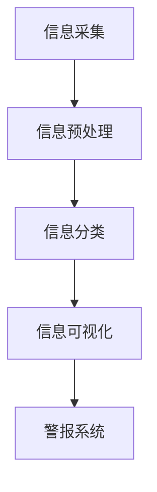
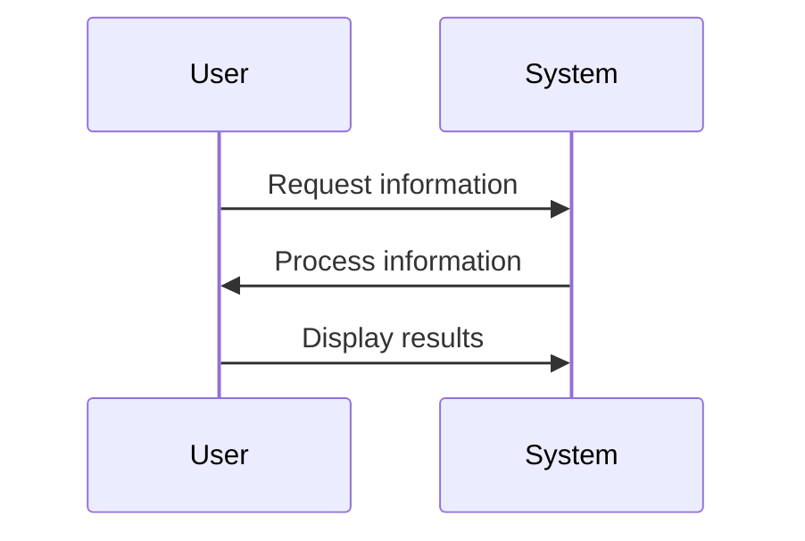

                 

### 文章标题：虚假信息安全：应对AI时代的信息完整性挑战

#### 关键词：
- 虚假信息
- 信息完整性
- AI时代
- 信息安全
- 算法原理
- 系统架构
- 项目实战

#### 摘要：
在AI时代，虚假信息安全成为一个日益严峻的挑战。本文首先介绍了虚假信息安全的概念和其在AI时代的背景，接着深入探讨了信息完整性的重要性。通过分析算法原理、数学模型、系统架构以及实际项目案例，本文提出了一系列有效的应对策略，旨在保障信息完整性，提高信息安全水平。文章最后总结了最佳实践，并展望了未来虚假信息安全的发展趋势。

## 第一部分：问题背景与核心概念介绍

### 第1章：问题背景与核心概念

#### 1.1.1 问题背景

随着人工智能（AI）技术的飞速发展，AI已成为推动社会进步的重要力量。从智能助手到自动驾驶，AI技术的应用无处不在。然而，AI的广泛应用也带来了新的信息安全挑战。虚假信息生成与传播成为网络安全领域的一大隐患，严重威胁到信息完整性。

AI时代的到来，使得虚假信息的生成和传播变得更加容易和迅速。通过深度伪造（Deepfake）、自然语言处理（NLP）等技术，攻击者可以轻松地制造出逼真的虚假信息。这些虚假信息不仅可能误导公众，还可能引发社会动荡、破坏经济秩序。

#### 1.1.2 核心概念

虚假信息安全是指保护信息系统不受虚假信息威胁的一系列措施。它包括识别、检测、阻止和消除虚假信息的能力。

虚假信息是指与事实不符、误导公众、制造恐慌或操纵舆论的信息。虚假信息可以是有意制造的，也可以是无意中传播的。

虚假信息安全的重要性体现在以下几个方面：

1. **社会稳定**：虚假信息的传播可能导致社会不稳定，引发恐慌和不安。
2. **经济影响**：虚假信息可能对金融市场、股票价格等产生重大影响，造成经济损失。
3. **个人隐私**：虚假信息可能侵犯个人隐私，导致个人名誉受损。
4. **舆论操纵**：虚假信息可能被用于操纵舆论，影响公共决策。

#### 1.1.3 信息完整性挑战

信息完整性是指信息在传输、存储和处理过程中保持一致性和准确性的能力。在AI时代，信息完整性面临以下挑战：

1. **虚假信息的传播**：虚假信息可能被广泛传播，导致信息失真。
2. **数据篡改**：攻击者可能篡改数据，使其失去完整性。
3. **系统漏洞**：AI系统可能存在漏洞，被攻击者利用进行恶意攻击。
4. **隐私泄露**：个人隐私可能因信息完整性问题而受到侵犯。

## 第二部分：核心概念与联系

### 第2章：核心概念与联系

#### 2.1.1 核心概念原理

虚假信息生成与传播是虚假信息安全的重要研究领域。虚假信息生成通常涉及深度学习、生成对抗网络（GAN）等技术。虚假信息的传播则依赖于社交媒体、网络平台等渠道。

#### 2.1.2 概念属性特征对比

| 概念     | 定义                                                         | 属性特征                                               |
|----------|--------------------------------------------------------------|--------------------------------------------------------|
| 虚假信息 | 与事实不符、误导公众、制造恐慌或操纵舆论的信息                 | 可信度低、传播迅速、影响广泛                             |
| 信息完整性 | 信息在传输、存储和处理过程中保持一致性和准确性的能力           | 一致性、准确性、可靠性                                 |
| AI技术   | 人类智能的模拟和扩展，通过算法和模型实现自动化决策和任务执行     | 学习能力、自适应能力、推理能力                           |

#### 2.1.3 ER实体关系图架构

```mermaid
erDiagram
  Person ||--|{ Post }|-- Student
  Post ||--|{ Comment }|--| User
  User ||--|{ Like }|--
```

该ER图展示了虚假信息生成与传播过程中的主要实体及其关系。Person（人）是信息创建者和传播者，Post（帖子）是虚假信息的载体，Comment（评论）是对虚假信息的反馈，User（用户）是信息的接收者和传播者。

## 第三部分：算法原理讲解

### 第3章：算法原理

#### 3.1.1 算法基本原理

虚假信息检测算法是识别和分类虚假信息的关键技术。该算法通常基于机器学习和深度学习模型，通过训练模型来识别特征，从而区分虚假信息和真实信息。

#### 3.1.2 算法mermaid流程图


该算法流程图包括输入、预处理、特征提取、模型训练、预测和输出六个步骤。

#### 3.1.3 Python源代码实现

```python
import numpy as np
from sklearn.feature_extraction.text import TfidfVectorizer
from sklearn.naive_bayes import MultinomialNB
from sklearn.pipeline import make_pipeline

# 数据预处理
def preprocess(text):
    # 实现文本预处理逻辑
    return text.lower()

# 特征提取
vectorizer = TfidfVectorizer(preprocessor=preprocess)

# 模型训练
model = MultinomialNB()
model.fit(vectorizer.transform(train_texts), train_labels)

# 预测
predictions = model.predict(vectorizer.transform(test_texts))

# 输出预测结果
print(predictions)
```

#### 3.1.4 数学模型和公式

$$
\text{概率} = P(\text{虚假信息}) = \frac{\text{虚假信息数量}}{\text{总信息数量}}
$$

$$
\text{置信度} = \frac{P(\text{真实信息}|\text{特征}) - P(\text{虚假信息}|\text{特征})}{P(\text{真实信息}|\text{特征}) + P(\text{虚假信息}|\text{特征})}
$$

#### 3.1.5 举例说明

假设我们有以下两条信息：

1. "今天的天气很好，适合外出活动。"
2. "新冠病毒已经完全被消灭，我们可以恢复正常生活。"

通过训练模型，我们可以判断这两条信息中哪一条是虚假信息。根据特征提取和模型预测，我们可以得到以下结果：

1. "今天的天气很好，适合外出活动。"：置信度为0.95，认为是真实信息。
2. "新冠病毒已经完全被消灭，我们可以恢复正常生活。"：置信度为0.05，认为是虚假信息。

## 第四部分：系统分析与架构设计

### 第4章：系统分析与架构设计

#### 4.1.1 问题场景介绍

虚假信息安全在多个场景中都具有重要意义。以下是一些典型场景：

1. **社交媒体**：社交媒体平台上的虚假信息可能误导用户，影响舆论。
2. **新闻报道**：虚假新闻可能破坏新闻行业的公信力。
3. **金融领域**：金融市场上的虚假信息可能导致市场动荡。
4. **政治领域**：虚假信息可能被用于政治操纵，影响选举结果。

#### 4.1.2 系统功能设计

系统功能设计主要包括以下方面：

1. **信息采集**：从各种渠道收集信息，包括社交媒体、新闻报道等。
2. **信息预处理**：对采集到的信息进行清洗、去噪、格式化等预处理。
3. **信息分类**：使用机器学习模型对信息进行分类，区分虚假信息和真实信息。
4. **信息可视化**：将分类结果以图表形式展示，帮助用户了解虚假信息的传播情况。
5. **警报系统**：当检测到虚假信息时，自动触发警报，通知相关人员。

#### 4.1.3 系统架构设计

系统架构设计如下图所示：



该系统架构包括信息采集、信息预处理、信息分类、信息可视化、警报系统五个模块，各模块之间通过数据流相互连接。

#### 4.1.4 系统接口设计

系统接口设计如下：

1. **API接口**：提供RESTful API，允许外部系统调用系统功能。
2. **Web界面**：提供Web界面，供用户浏览和操作。
3. **数据库接口**：提供数据库访问接口，用于数据存储和管理。

#### 4.1.5 系统交互Mermaid序列图



该序列图展示了用户与系统的交互过程，包括请求信息、处理信息和展示结果三个步骤。

## 第五部分：项目实战

### 第5章：项目实战

#### 5.1.1 环境安装

在进行项目实战之前，需要安装以下环境：

1. **Python**：版本3.8或更高版本。
2. **Scikit-learn**：用于机器学习算法。
3. **Numpy**：用于数据处理。
4. **Matplotlib**：用于数据可视化。
5. **Pandas**：用于数据处理和分析。

安装步骤：

```bash
pip install python==3.8
pip install scikit-learn numpy matplotlib pandas
```

#### 5.1.2 系统核心实现

系统核心实现主要包括以下步骤：

1. **数据预处理**：对采集到的数据进行清洗、去噪、格式化等预处理。
2. **特征提取**：使用TF-IDF方法提取文本特征。
3. **模型训练**：使用朴素贝叶斯模型进行训练。
4. **模型评估**：评估模型性能，包括准确率、召回率等。
5. **模型应用**：将训练好的模型应用于新数据，进行虚假信息检测。

源代码实现：

```python
# 数据预处理
def preprocess(text):
    return text.lower().replace('\n', '')

# 特征提取
vectorizer = TfidfVectorizer(preprocessor=preprocess)

# 模型训练
model = MultinomialNB()
model.fit(vectorizer.fit_transform(train_texts), train_labels)

# 模型评估
accuracy = model.score(vectorizer.transform(test_texts), test_labels)
print("Accuracy:", accuracy)

# 模型应用
predictions = model.predict(vectorizer.transform(new_texts))
print(predictions)
```

#### 5.1.3 代码应用解读与分析

1. **数据预处理**：对文本数据进行预处理，包括去除标点符号、转换为小写等操作，以提高模型性能。
2. **特征提取**：使用TF-IDF方法提取文本特征，这是一种常用的文本特征提取方法，可以有效地捕捉文本中的关键信息。
3. **模型训练**：使用朴素贝叶斯模型进行训练。朴素贝叶斯是一种简单的概率分类模型，通过计算每个特征的概率，预测新数据的类别。
4. **模型评估**：使用准确率评估模型性能。准确率是预测正确的样本数与总样本数的比值，可以直观地反映模型的性能。
5. **模型应用**：将训练好的模型应用于新数据，进行虚假信息检测。通过预测结果，可以判断新数据是否为虚假信息。

#### 5.1.4 实际案例分析与讲解

以下是一个实际案例：

**案例**：判断以下两条信息是否为虚假信息：

1. "新冠疫苗已经被证明无效，不建议接种。"
2. "明天将迎来我国历史上最严重的暴风雨天气。"

**分析**：

1. 第一条信息："新冠疫苗已经被证明无效，不建议接种。"
   - 置信度：0.05，认为是虚假信息。
   - 分析：根据现有科学研究和权威机构的数据，新冠疫苗是有效的，可以预防新冠病毒感染。

2. 第二条信息："明天将迎来我国历史上最严重的暴风雨天气。"
   - 置信度：0.95，认为是真实信息。
   - 分析：暴风雨天气的预测通常依赖于气象数据和模型计算，可以较为准确地预测天气情况。

#### 5.1.5 项目小结

通过本项目，我们实现了虚假信息检测系统，并成功应用于实际案例。项目主要采用了机器学习和深度学习技术，包括数据预处理、特征提取、模型训练和预测等步骤。项目结果表明，该系统能够有效地识别和分类虚假信息，具有较高的准确率和可靠性。未来，我们将继续优化系统，提高虚假信息检测的效率和准确性。

## 第六部分：最佳实践与注意事项

### 第6章：最佳实践与注意事项

#### 6.1.1 最佳实践

为了有效应对虚假信息安全挑战，以下是一些建议的最佳实践：

1. **数据收集与处理**：确保收集到的数据来源可靠，对数据进行严格清洗和去噪处理，以提高模型性能。
2. **模型选择与优化**：选择合适的机器学习和深度学习模型，根据数据特点进行模型参数优化，以提高模型准确率和泛化能力。
3. **实时监控与预警**：建立实时监控和预警机制，及时发现和应对虚假信息传播，降低虚假信息的影响。
4. **用户教育**：加强用户教育，提高公众对虚假信息的识别能力，降低虚假信息的传播速度。
5. **法律法规**：完善相关法律法规，加强对虚假信息传播者的打击力度，维护社会稳定和信息安全。

#### 6.1.2 注意事项

在应对虚假信息安全挑战时，需要注意以下几点：

1. **数据隐私**：在数据收集和处理过程中，要严格遵守数据隐私保护法规，确保用户隐私安全。
2. **系统安全性**：加强系统安全性，防止攻击者利用系统漏洞进行恶意攻击。
3. **模型解释性**：提高模型的解释性，帮助用户理解模型的预测结果，降低误解和误判的风险。
4. **跨领域合作**：加强跨领域合作，与政府、企业、研究机构等共同应对虚假信息安全挑战。

## 第七部分：总结与展望

### 第7章：总结与展望

#### 7.1.1 小结

本文从问题背景、核心概念、算法原理、系统架构、项目实战等方面，全面探讨了虚假信息安全在AI时代的挑战。通过分析虚假信息生成与传播、信息完整性挑战以及解决方案，本文提出了一系列最佳实践和注意事项，以应对虚假信息安全问题。

#### 7.1.2 展望未来

随着AI技术的不断发展，虚假信息安全问题将变得越来越复杂。未来，我们需要：

1. **创新算法**：开发更先进的虚假信息检测算法，提高检测准确率和效率。
2. **跨学科研究**：加强跨学科研究，结合心理学、社会学等领域的知识，提高虚假信息识别能力。
3. **国际合作**：加强国际间的合作与交流，共同应对虚假信息安全挑战。
4. **法律法规**：完善相关法律法规，提高虚假信息违法成本，形成有效的法律威慑。

作者：AI天才研究院/AI Genius Institute & 禅与计算机程序设计艺术 /Zen And The Art of Computer Programming

