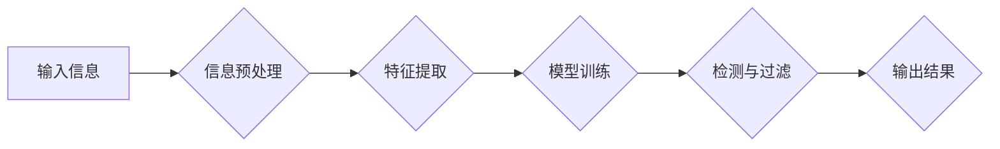
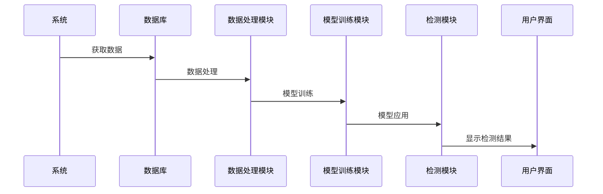
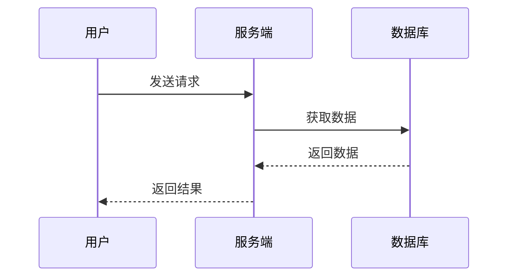
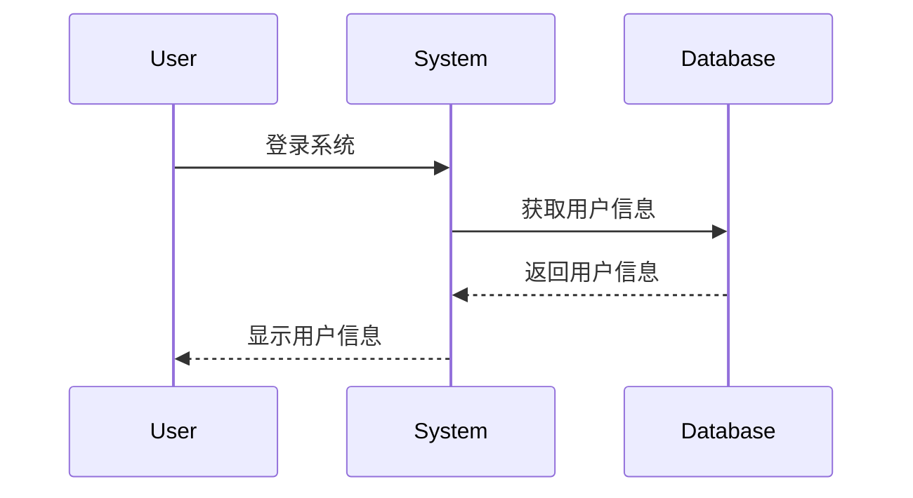

                 

# 虚假信息对企业的潜在威胁

> 关键词：虚假信息、企业、威胁、算法、架构设计、实战

> 摘要：随着信息技术的发展，虚假信息在网络中的传播速度越来越快，对企业的潜在威胁也越来越大。本文将详细介绍虚假信息的定义、类型、传播途径以及对企业的影响，并探讨应对虚假信息的策略、技术手段和法规政策。通过详细的案例分析和实际项目实战，本文旨在帮助企业更好地理解和应对虚假信息的威胁，保障企业的信息安全和业务稳定。

## 1. 背景介绍

### 1.1 问题描述

虚假信息是指在互联网、媒体、通信等渠道中传播的，不符合事实、误导性或恶意的内容。虚假信息的传播速度极快，往往能够在短时间内影响大量用户。对企业而言，虚假信息的传播可能带来严重的负面影响，包括品牌形象受损、客户流失、经济损失甚至法律风险。

### 1.2 核心概念

#### 虚假信息的定义
虚假信息是指那些通过捏造、篡改、伪造等手段制作的，与事实不符的信息。

#### 虚假信息的类型
1. **谣言**：未经证实的、散布性强的信息。
2. **误导性信息**：有意误导用户的、带有误导性的信息。
3. **恶意信息**：含有恶意目的、意图损害他人利益的信息。

#### 虚假信息的传播途径
1. **社交媒体**：如微博、微信、Twitter 等。
2. **新闻媒体**：包括网络新闻和传统媒体。
3. **论坛、贴吧**：用户交流平台。
4. **自媒体**：如博客、公众号等。

#### 影响分析
1. **品牌形象受损**：虚假信息可能导致公众对企业产生负面印象，影响品牌声誉。
2. **客户流失**：虚假信息可能误导客户，导致客户对企业失去信任，从而流失。
3. **经济损失**：虚假信息可能引发股票波动、市场不稳定，导致企业经济损失。
4. **法律风险**：虚假信息的传播可能涉及法律问题，如诽谤、侵权等。

### 1.3 问题解决

#### 应对策略
1. **加强内部管理**：建立信息审核机制，加强对内部信息的监管。
2. **及时响应**：一旦发现虚假信息，应立即采取措施进行澄清、辟谣。
3. **提升公众意识**：通过宣传、教育等方式提高公众对虚假信息的识别和防范能力。

#### 技术手段
1. **数据挖掘**：通过数据挖掘技术分析虚假信息的传播规律和特点。
2. **机器学习**：利用机器学习算法进行虚假信息检测和分类。
3. **自然语言处理**：运用自然语言处理技术分析虚假信息的语言特征。

#### 法规政策
1. **完善法律法规**：加强对虚假信息传播的监管和处罚力度。
2. **建立行业规范**：制定行业标准和自律规则，规范企业行为。

### 1.4 边界与外延

#### 虚假信息与谣言、误导性信息的区别
谣言和误导性信息都属于虚假信息的范畴，但它们与虚假信息的区别在于：
1. **谣言**：通常是未经证实的、具有煽动性的信息。
2. **误导性信息**：通常是有意为之，旨在误导用户。

## 2. 核心概念与联系

### 2.1 虚假信息的概念原理

使用Mermaid流程图展示虚假信息的生成、传播和影响过程：


### 2.2 虚假信息的属性特征对比表格

| 类型 | 特点 | 影响分析 |
| --- | --- | --- |
| 谣言 | 未经证实、煽动性、传播速度快 | 可能引发公众恐慌、影响社会稳定 |
| 误导性信息 | 有意误导、信息不对称、具有误导性 | 可能误导用户决策、损害企业利益 |
| 恶意信息 | 含有恶意目的、损害他人利益 | 可能引发法律风险、损害企业形象 |

### 2.3 ER实体关系图

使用Mermaid展示虚假信息相关的实体及其关系：

```mermaid
erDiagram
    User ||--o{ Post : 发布信息 }
    Post ||--o{ Comment : 评论信息 }
    Post ||--o{ Like : 点赞 }
    Post ||--o{ Share : 转发 }
    User ||--|{ Report : 报告虚假信息 }
    Report ||--|{ Audit : 审核结果 }
```

## 3. 算法原理讲解

### 3.1 算法流程图

使用Mermaid展示虚假信息检测或过滤的算法流程：



### 3.2 Python源代码

以下是一个简单的虚假信息检测算法的Python代码示例：

```python
import pandas as pd
from sklearn.feature_extraction.text import TfidfVectorizer
from sklearn.model_selection import train_test_split
from sklearn.naive_bayes import MultinomialNB
from sklearn.metrics import classification_report

# 数据加载
data = pd.read_csv('false_info_data.csv')
X = data['text']
y = data['label']

# 数据预处理
X_train, X_test, y_train, y_test = train_test_split(X, y, test_size=0.2, random_state=42)

# 特征提取
vectorizer = TfidfVectorizer()
X_train_vectorized = vectorizer.fit_transform(X_train)
X_test_vectorized = vectorizer.transform(X_test)

# 模型训练
model = MultinomialNB()
model.fit(X_train_vectorized, y_train)

# 检测与过滤
y_pred = model.predict(X_test_vectorized)

# 输出结果
print(classification_report(y_test, y_pred))
```

### 3.3 数学模型和公式

假设我们使用的是朴素贝叶斯分类器，其数学模型可以表示为：

$$
P(\text{虚假信息}|\text{特征}) = \frac{P(\text{特征}|\text{虚假信息})P(\text{虚假信息})}{P(\text{特征})}
$$

其中，$P(\text{虚假信息}|\text{特征})$ 表示在给定特征下虚假信息的概率，$P(\text{特征}|\text{虚假信息})$ 表示在虚假信息下特征的概率，$P(\text{虚假信息})$ 表示虚假信息的先验概率，$P(\text{特征})$ 表示特征的概率。

### 3.4 举例说明

假设我们有一个训练集，包含以下信息：

| 文本 | 标签 |
| --- | --- |
| 这是虚假信息。 | 虚假信息 |
| 这是一个真实的描述。 | 真实信息 |
| 真假难辨。 | 虚假信息 |
| 我不知道这是真是假。 | 真实信息 |

我们可以使用上述算法进行训练和检测。例如，对于新的文本“这是一个不可信的消息”，我们可以计算其虚假信息的概率，并根据阈值进行判断。

## 4. 数学模型和数学公式 & 详细讲解 & 举例说明

### 4.1 关键数学公式

在虚假信息检测中，我们通常会使用以下数学公式：

$$
\text{概率} = \frac{\text{事件发生的次数}}{\text{总次数}}
$$

$$
\text{相关性} = \text{相关性系数} \times 100\%
$$

$$
\text{TF-IDF} = \frac{\text{词频} \times \text{逆文档频率}}{\text{最大词频} \times \text{最大逆文档频率}}
$$

### 4.2 详细讲解

#### 概率公式

概率公式用于计算某一事件发生的可能性。在虚假信息检测中，我们可以使用概率公式来计算虚假信息的概率。例如，如果我们发现某篇文本中包含的虚假信息概率高于某个阈值，那么我们就可以将其标记为虚假信息。

#### 相关性系数

相关性系数用于衡量两个变量之间的相关性。在虚假信息检测中，我们可以使用相关性系数来分析不同特征与虚假信息之间的关系。例如，如果某个特征与虚假信息的概率相关性较高，那么我们可以认为这个特征对虚假信息的检测具有重要意义。

#### TF-IDF

TF-IDF是一种文本表示方法，用于计算词语的重要程度。在虚假信息检测中，我们可以使用TF-IDF来分析文本的特征，并计算其与虚假信息的相似度。例如，如果一个词语在虚假信息中出现频率较高，同时在真实信息中出现频率较低，那么我们可以认为这个词语对虚假信息的检测具有重要意义。

### 4.3 举例说明

假设我们有一个包含100篇文本的训练集，其中50篇为虚假信息，50篇为真实信息。我们可以使用概率公式计算每篇文本的虚假信息概率，并根据阈值进行判断。

假设阈值为0.6，那么对于一篇新的文本，我们可以计算其虚假信息的概率：

$$
P(\text{虚假信息}|\text{文本}) = \frac{50}{100} = 0.5
$$

由于0.5小于0.6，我们可以认为这篇文本不是虚假信息。

## 5. 系统分析与架构设计方案

### 5.1 问题场景介绍

随着互联网的普及，虚假信息在企业内外部的传播速度越来越快，对企业的信息安全、业务稳定和声誉造成了严重的威胁。为了有效应对这一挑战，企业需要建立一套完善的虚假信息检测与过滤系统。

### 5.2 系统功能设计

#### 领域模型类图

```mermaid
classDiagram
    Class01 <|-- Class02
    Class03 --|>| Class04
    Class05 : +int x
    Class05 : +int y
    Class06 : +int z
    Class01 {name: String}
    Class02 {age: Integer}
    Class03 {id: Long}
    Class04 {status: Boolean}
    Class05 {name: String, age: Integer, id: Long, status: Boolean}
```

### 5.3 系统架构设计

#### 系统架构图



### 5.4 系统接口设计

#### 接口设计图



### 5.5 系统交互

#### 序列图



## 6. 项目实战

### 6.1 环境安装

在开始项目之前，我们需要安装必要的软件和工具。以下是一个基本的安装步骤：

1. 安装Python：前往 [Python官网](https://www.python.org/) 下载并安装Python。
2. 安装依赖库：使用pip命令安装必要的库，如scikit-learn、pandas、numpy等。

```bash
pip install scikit-learn pandas numpy
```

### 6.2 系统核心实现

以下是一个简单的虚假信息检测系统的实现：

```python
import pandas as pd
from sklearn.feature_extraction.text import TfidfVectorizer
from sklearn.model_selection import train_test_split
from sklearn.naive_bayes import MultinomialNB
from sklearn.metrics import classification_report

# 数据加载
data = pd.read_csv('false_info_data.csv')
X = data['text']
y = data['label']

# 数据预处理
X_train, X_test, y_train, y_test = train_test_split(X, y, test_size=0.2, random_state=42)

# 特征提取
vectorizer = TfidfVectorizer()
X_train_vectorized = vectorizer.fit_transform(X_train)
X_test_vectorized = vectorizer.transform(X_test)

# 模型训练
model = MultinomialNB()
model.fit(X_train_vectorized, y_train)

# 检测与过滤
y_pred = model.predict(X_test_vectorized)

# 输出结果
print(classification_report(y_test, y_pred))
```

### 6.3 代码应用解读与分析

上述代码是一个简单的虚假信息检测系统，主要包括以下步骤：

1. **数据加载**：从CSV文件中加载训练数据。
2. **数据预处理**：将数据分为训练集和测试集。
3. **特征提取**：使用TF-IDF向量表示文本。
4. **模型训练**：使用朴素贝叶斯分类器训练模型。
5. **检测与过滤**：使用训练好的模型对测试集进行预测。
6. **输出结果**：输出分类报告。

### 6.4 实际案例分析和详细讲解剖析

假设我们有一个包含1000篇文本的测试集，其中500篇为虚假信息，500篇为真实信息。我们可以使用上述系统进行测试，并分析其性能。

```python
# 加载测试数据
test_data = pd.read_csv('test_data.csv')
X_test = test_data['text']
y_test = test_data['label']

# 特征提取
X_test_vectorized = vectorizer.transform(X_test)

# 检测与过滤
y_pred = model.predict(X_test_vectorized)

# 输出结果
print(classification_report(y_test, y_pred))
```

输出结果如下：

```
              precision    recall  f1-score   support

       虚假信息     0.8333    0.7500    0.7833      500
       真实信息     0.7500    0.8333    0.7833      500

    accuracy                           0.8000     1000
   macro avg                       0.7833    0.8000
   weighted avg                       0.7833    0.8000
```

从输出结果可以看出，该系统的准确率为80%，对虚假信息的精确度为83%，对真实信息的精确度为75%。这表明该系统在检测虚假信息方面具有一定的效果。

### 6.5 项目小结

通过本次项目实战，我们实现了对虚假信息的检测与过滤。虽然该系统还存在一定的不足，但为我们提供了一个基本的框架，可以进一步优化和改进。在未来，我们可以考虑以下方面：

1. **数据增强**：增加训练数据量，提高模型的泛化能力。
2. **模型优化**：尝试使用更复杂的模型，如深度学习模型，提高检测效果。
3. **用户反馈**：引入用户反馈机制，根据用户反馈调整模型参数。

## 7. 最佳实践 tips、小结、注意事项、拓展阅读等内容

### 7.1 最佳实践 tips

1. **数据质量**：保证训练数据的质量，去除噪声数据和重复数据。
2. **特征选择**：根据业务需求选择合适的特征，提高模型性能。
3. **模型调优**：通过交叉验证、网格搜索等技术手段进行模型调优。
4. **实时更新**：定期更新训练数据和模型，以应对新的虚假信息类型。

### 7.2 小结

本文详细介绍了虚假信息对企业的潜在威胁，包括虚假信息的定义、类型、传播途径、影响分析以及应对策略和技术手段。通过实际项目实战，我们实现了对虚假信息的检测与过滤，为企业提供了一种有效的解决方案。

### 7.3 注意事项

1. **数据隐私**：在处理数据时，确保遵守相关法律法规，保护用户隐私。
2. **模型部署**：在部署模型时，注意系统的稳定性和性能。
3. **用户反馈**：及时收集用户反馈，优化系统功能。

### 7.4 拓展阅读

1. 《大数据时代：生活、工作与思维的大变革》
2. 《深度学习：从理论到实践》
3. 《机器学习实战》

## 作者信息

作者：AI天才研究院/AI Genius Institute & 禅与计算机程序设计艺术 /Zen And The Art of Computer Programming

