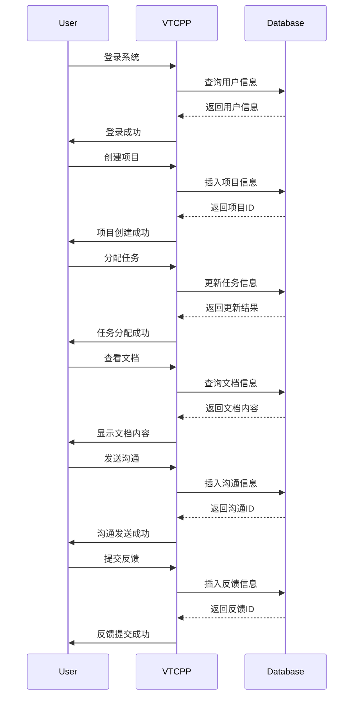
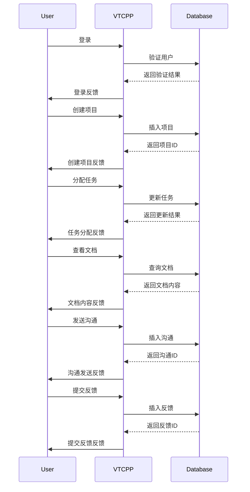

                 

### 引言

在当今快速发展的技术时代，远程办公已经逐渐成为企业运作的新常态。这种变化不仅颠覆了传统的办公模式，也对团队的协作方式和管理策略提出了新的挑战。虚拟团队，作为远程办公的核心组成部分，正日益成为企业提升竞争力、实现高效协同的关键。因此，探讨虚拟团队协作的领导策略具有重要的现实意义。

#### 关键词：
- 虚拟团队
- 远程办公
- 领导策略
- 协作效率
- 沟通机制

#### 摘要：
本文旨在深入探讨虚拟团队协作的领导策略，分析其在远程办公时代的兴起背景、核心概念与要素，并从领导风格、沟通策略、激励机制、管理监控以及未来发展等多个维度提出有效的解决方案。通过理论与实践相结合的方式，为企业在远程办公环境下打造高效的虚拟团队提供指导。

### 第一部分：虚拟团队的兴起与发展

#### 第1章 虚拟团队的兴起与发展

#### 1.1 虚拟团队的背景与概念

在信息技术的飞速发展下，虚拟团队逐渐成为一种新型的团队协作模式。虚拟团队，顾名思义，是指团队成员分布在不同的地理位置，通过现代通讯技术和协作工具实现协作和沟通。这种团队形式的出现，不仅打破了传统办公的地理界限，也为企业提供了更多的灵活性和资源整合的机会。

#### 1.1.1 虚拟团队的定义

虚拟团队（Virtual Team）是一种通过信息技术手段实现团队成员远程协作的团队形式。与传统团队相比，虚拟团队具有以下特点：
- **地理位置分散**：团队成员可能位于不同的城市、国家甚至时区。
- **技术依赖性高**：虚拟团队高度依赖通信和协作工具，如视频会议、即时通讯、项目管理软件等。
- **文化多样性**：团队成员可能来自不同的文化背景，需要跨文化沟通和协作。
- **灵活性高**：虚拟团队可以根据项目需求灵活调整成员和资源。

#### 1.1.2 虚拟团队的历史与发展

虚拟团队的概念起源于20世纪90年代，随着互联网和通讯技术的普及，虚拟团队逐渐成为一种常见的团队形式。早期的虚拟团队主要应用于软件开发、咨询服务等领域。随着云计算、大数据、人工智能等新技术的不断涌现，虚拟团队的应用范围进一步扩大，不仅涵盖了各种行业，也渗透到企业的各个层级。

#### 1.1.3 虚拟团队的优势与挑战

虚拟团队具有以下优势：
- **资源优化**：通过地理分散，企业可以更好地利用全球范围内的专业人才。
- **成本节约**：减少实体办公场所的需求，降低办公成本。
- **灵活性**：团队成员可以根据个人需求和工作进度灵活安排工作时间和地点。
- **文化多样性**：跨文化团队可以带来更多创新和多样化的观点。

然而，虚拟团队也面临一些挑战：
- **沟通障碍**：地理位置分散和时间差异可能导致沟通不畅和误解。
- **管理难度**：虚拟团队的成员管理比传统团队更复杂，需要更精细的领导策略和沟通机制。
- **信任建立**：团队成员之间的信任关系难以在远程环境中自然形成，需要额外的时间和努力。

#### 1.2 虚拟团队在远程办公时代的角色

远程办公的兴起是虚拟团队发展的催化剂。随着越来越多的企业采用远程办公模式，虚拟团队在其中的角色也越来越重要。

#### 1.2.1 远程办公的兴起

远程办公（Remote Work）是指员工可以在非公司办公室的地方完成工作任务的一种工作模式。近年来，远程办公的兴起主要受到以下因素的影响：
- **技术支持**：互联网、云计算、即时通讯等技术的发展，为远程办公提供了强大的技术支持。
- **疫情推动**：新冠疫情的爆发使得远程办公成为许多企业的默认选择，推动了远程办公的普及。
- **员工需求**：越来越多的员工追求工作与生活的平衡，远程办公提供了更多的灵活性和自由度。

#### 1.2.2 虚拟团队在远程办公中的重要性

在远程办公环境中，虚拟团队承担了关键的角色，具体体现在以下几个方面：
- **协同合作**：虚拟团队通过协作工具实现远程项目协作，提高工作效率和质量。
- **管理监督**：虚拟团队的领导需要通过有效的管理策略和监督手段，确保项目进度和团队凝聚力。
- **创新推动**：虚拟团队的多样性带来了更多的创新和不同的观点，有助于推动项目的创新和发展。

#### 1.2.3 远程办公对领导策略的影响

远程办公改变了传统的领导模式，对领导策略提出了新的要求：
- **领导风格**：虚拟团队需要更加灵活和开放型的领导风格，以适应远程办公的环境。
- **沟通机制**：虚拟团队需要建立高效的沟通机制，确保团队成员之间的信息传递和协作。
- **激励机制**：虚拟团队的成员往往更加注重自我激励和内在动机，领导需要设计合适的激励机制来保持团队的积极性。

通过以上分析，我们可以看到虚拟团队在远程办公时代的重要性和挑战。接下来，我们将进一步探讨虚拟团队的核心概念和要素，以及如何通过有效的领导策略来提升虚拟团队的协作效率。

## 第2章 虚拟团队的核心概念与要素

在深入理解虚拟团队的定义和发展背景后，接下来我们将探讨虚拟团队的核心概念与要素。这些核心概念和要素是构建高效虚拟团队的基础，对于实现远程办公环境中的协同合作至关重要。

### 2.1 虚拟团队的核心概念

#### 2.1.1 协作机制

协作机制是虚拟团队的核心概念之一。协作机制指的是团队成员之间如何进行信息交换、任务分配和资源共享的方式。在虚拟团队中，协作机制的建立至关重要，因为它直接影响团队的效率和生产力。

**协作机制的特点**：
- **分散性**：虚拟团队成员可能位于不同的地理位置，因此协作机制需要适应分散性的特点。
- **灵活性**：协作机制应具备灵活性，能够根据团队成员的地理位置和工作时间进行调整。
- **透明性**：协作过程应该保持透明，使每个成员都能了解项目的进展和任务分配。

**常见的协作机制**：
- **项目管理软件**：如Trello、JIRA等，用于任务分配、进度跟踪和协作。
- **文档共享平台**：如Google Docs、Microsoft Office 365等，用于文档的实时编辑和共享。
- **即时通讯工具**：如Slack、Microsoft Teams等，用于实时沟通和协作。

#### 2.1.2 沟通方式

沟通方式是虚拟团队协作的重要组成部分。有效的沟通可以减少误解，提高团队协作的效率。

**沟通方式的特点**：
- **多渠道**：虚拟团队需要通过多种渠道进行沟通，如邮件、即时通讯、电话会议、视频会议等。
- **即时性**：在远程办公环境中，即时沟通工具尤为重要，可以迅速解决问题和同步信息。
- **多样性**：虚拟团队通常包括来自不同文化和背景的成员，沟通方式需要适应多样性。

**常见的沟通方式**：
- **邮件沟通**：适用于正式和长期的沟通，记录和跟踪功能较强。
- **即时通讯**：适用于快速和即时的沟通，如Slack、微信等。
- **视频会议**：适用于需要面对面交流的情境，如项目讨论、会议等。

#### 2.1.3 协作工具

协作工具是虚拟团队实现高效协作的关键。合适的协作工具可以提高团队的工作效率和协同效果。

**协作工具的类型**：
- **项目管理工具**：如JIRA、Trello、Asana等，用于任务管理、进度跟踪和协作。
- **文档共享工具**：如Google Docs、Microsoft Office 365等，用于文档编辑和共享。
- **即时通讯工具**：如Slack、Microsoft Teams、Zoom等，用于实时沟通和协作。
- **视频会议工具**：如Zoom、Microsoft Teams、Google Meet等，用于远程会议和视频交流。

#### 2.2 虚拟团队的要素分析

除了协作机制和沟通方式，虚拟团队的效能还受到多个要素的影响。以下是虚拟团队的重要要素分析：

#### 2.2.1 成员的角色与责任

在虚拟团队中，成员的角色和责任清晰明确是确保团队高效运作的关键。每个成员都需要了解自己的角色和责任，以便更好地完成任务。

**成员角色的分类**：
- **领导**：负责团队的总体方向、协调和决策。
- **专家**：在特定领域提供专业知识和技能。
- **执行者**：负责执行具体任务和工作。

**成员责任的要求**：
- **角色明确**：每个成员应明确自己的角色，确保任务分配合理。
- **责任担当**：成员应承担起自己的责任，确保任务按时完成。

#### 2.2.2 成员的个性与团队文化

团队成员的个性和团队文化对虚拟团队的成功至关重要。

**个性要素**：
- **适应性**：适应远程工作环境和分散式协作。
- **自我管理**：具备良好的自我管理能力，确保工作高效有序。
- **沟通能力**：具备良好的沟通技巧，能够有效传递信息和解决问题。

**团队文化要素**：
- **信任**：建立团队成员之间的信任关系，促进协作和合作。
- **开放性**：鼓励团队成员分享观点和意见，促进创新和多样性。
- **共同目标**：明确团队的目标和愿景，确保团队成员朝同一方向努力。

#### 2.2.3 成员的远程工作环境

团队成员的远程工作环境对其工作效果有重要影响。

**远程工作环境的要求**：
- **稳定性**：确保网络连接稳定，减少沟通障碍。
- **舒适度**：提供一个舒适的工作环境，提高工作效率。
- **资源充足**：提供必要的硬件和软件资源，确保团队成员能够高效工作。

通过以上对虚拟团队核心概念和要素的分析，我们可以看到，构建一个高效的虚拟团队需要多方面的考虑和协调。接下来，我们将探讨虚拟团队的领导策略，以帮助团队在远程办公环境中实现更好的协作和绩效。

### 第3章 领导风格与虚拟团队协作

虚拟团队在远程办公环境中需要一种灵活且高效的领导方式，这直接关系到团队的整体绩效和成员的满意度。领导风格是影响虚拟团队协作的关键因素之一。在这一章节中，我们将探讨领导风格对虚拟团队的影响，介绍几种常见的领导风格，并讨论如何选择合适的领导风格来提升虚拟团队的协作效率。

#### 3.1 领导风格对虚拟团队的影响

领导风格是指领导者在管理团队过程中表现出来的行为和态度。不同的领导风格对虚拟团队的协作和绩效有着显著的影响。

**影响分析**：

1. **沟通效率**：领导风格直接影响团队内部的沟通效率。开放型和参与型领导风格鼓励团队成员积极参与讨论和沟通，有助于信息的快速传递和问题的及时解决。

2. **团队凝聚力**：领导风格对团队的凝聚力也有重要影响。民主型和参与型领导风格能够促进团队成员之间的信任和合作，增强团队的凝聚力。

3. **任务分配**：领导风格决定任务分配的方式和效果。集权型领导可能更倾向于集中决策和分配任务，而民主型领导则鼓励团队成员参与决策和任务分配，有助于提高任务执行的效率。

4. **创新能力**：领导风格对团队的创新能力也有影响。支持型和开放型领导鼓励团队成员提出创新的想法和建议，有助于团队在远程办公中保持创新活力。

#### 3.1.1 领导风格的定义与分类

领导风格可以分为以下几种类型：

1. **集权型领导（Authoritative）**：
   - **特点**：领导者做出所有决策，指挥团队成员执行。
   - **适用情况**：在紧急情况下或需要快速决策时，集权型领导有助于迅速行动。

2. **民主型领导（Democratic）**：
   - **特点**：领导者与团队成员共同决策，重视团队成员的意见。
   - **适用情况**：在需要团队协作和创新时，民主型领导有助于激发团队成员的积极性和创造力。

3. **参与型领导（Participative）**：
   - **特点**：领导者鼓励团队成员参与决策，共同制定目标和计划。
   - **适用情况**：在需要团队成员积极参与和管理时，参与型领导有助于提高团队的参与度和责任感。

4. **支持型领导（Supportive）**：
   - **特点**：领导者关心团队成员的需求和感受，提供支持和鼓励。
   - **适用情况**：在团队成员面临压力和挑战时，支持型领导有助于提升团队成员的士气和工作动力。

5. **放任型领导（Laissez-Faire）**：
   - **特点**：领导者给予团队成员极大的自由，几乎不干预团队工作。
   - **适用情况**：在团队成员具备高度自主性和责任感时，放任型领导有助于激发团队的自我管理能力。

#### 3.1.2 领导风格对虚拟团队绩效的影响

不同的领导风格对虚拟团队的绩效有着不同的影响：

1. **集权型领导**：在紧急情况下，集权型领导能够迅速做出决策，提高行动速度。然而，长期使用可能会导致团队成员缺乏自主性和创新能力。

2. **民主型领导**：民主型领导能够促进团队成员的参与感和归属感，提高团队的协作效率。然而，在决策过程中可能会耗费更多时间，影响工作效率。

3. **参与型领导**：参与型领导有助于提升团队成员的参与度和责任感，促进团队的共同目标实现。然而，对领导者的沟通和协调能力要求较高。

4. **支持型领导**：支持型领导能够提升团队成员的士气和工作动力，增强团队的凝聚力。然而，过度关心可能会导致团队成员对领导的依赖。

5. **放任型领导**：放任型领导有助于提高团队成员的自主性和创造力，但在团队成员缺乏自律和团队协作能力时，可能会导致团队绩效下降。

#### 3.1.3 选择合适的领导风格

在选择领导风格时，领导者需要考虑团队的实际情况、任务的特点以及成员的需求。以下是一些选择合适领导风格的建议：

1. **任务需求**：在任务紧急且需要快速决策时，可以选择集权型领导风格；在需要团队协作和创新时，可以选择民主型或参与型领导风格。

2. **团队状况**：如果团队具备高度自主性和协作能力，可以选择放任型领导风格；如果团队需要更多的支持和鼓励，可以选择支持型领导风格。

3. **成员需求**：考虑团队成员的个人需求和偏好，选择能够激发团队成员积极性和创造力的领导风格。

4. **情境适应**：根据不同情境灵活调整领导风格，确保团队在不同的任务和挑战下都能保持高效的协作和绩效。

总之，领导风格的选择是影响虚拟团队协作效率的重要因素。领导者需要根据实际情况灵活调整领导风格，以实现最佳的管理效果。在下一章中，我们将进一步探讨虚拟团队的沟通策略，以提升团队的协作效率。

### 3.2 虚拟团队的领导策略

在远程办公环境中，领导者需要制定一系列策略来确保虚拟团队的高效运作和协作。以下是一些关键的领导策略，包括设定清晰的团队目标、建立有效的沟通渠道以及管理团队成员的期望与冲突。

#### 3.2.1 设定清晰的团队目标

设定清晰的团队目标是虚拟团队成功的关键。一个明确的团队目标可以帮助团队成员集中精力，统一行动方向，提高工作效率。

**设定团队目标的步骤**：

1. **明确项目目标**：首先，领导者需要与团队成员共同明确项目的目标。这包括项目的最终成果、时间表和资源需求。

2. **分解目标**：将项目目标分解为具体的任务和里程碑，确保每个团队成员都能理解自己的职责和任务。

3. **设定关键绩效指标（KPI）**：为每个任务设定可量化的KPI，以便跟踪进度和评估绩效。

4. **沟通目标**：定期与团队成员沟通团队目标，确保每个人都理解并认同这些目标。

**实例**：假设一个虚拟团队负责开发一个新产品，团队目标可以是：
- 在六个月内完成产品的设计和开发。
- 确保产品在功能、性能和用户体验方面达到客户需求。
- 每周召开一次团队会议，总结进展和问题，调整计划。

通过设定清晰的团队目标，团队成员可以更好地理解自己的职责，集中精力完成任务，提高项目的成功率。

#### 3.2.2 建立有效的沟通渠道

在远程办公环境中，建立有效的沟通渠道是确保团队协作和信息传递的关键。以下是一些建立有效沟通渠道的策略：

1. **选择合适的沟通工具**：根据团队的需求和成员的偏好，选择合适的沟通工具。常见的沟通工具有邮件、即时通讯（如Slack、WhatsApp）、视频会议（如Zoom、Microsoft Teams）和项目管理软件（如Trello、Asana）。

2. **制定沟通计划**：制定一个明确的沟通计划，包括会议的时间、频率和议程。例如，每周召开一次团队会议，每日召开一次项目进展汇报会议。

3. **明确沟通规范**：制定沟通规范，确保团队成员在沟通时遵循一致的格式和礼仪。例如，邮件标题应简洁明了，沟通内容应清晰具体。

4. **鼓励主动沟通**：鼓励团队成员主动沟通，分享自己的想法和问题。领导者可以通过设立“开放讨论时间”或“意见箱”等方式，鼓励团队成员表达意见。

**实例**：一个虚拟团队可以使用以下沟通工具和计划来确保协作：
- **沟通工具**：Slack用于日常沟通和文件共享，Zoom用于视频会议，Trello用于项目管理。
- **沟通计划**：每周二和周五下午召开团队会议，每天早上召开项目进展汇报会议，紧急情况时通过即时通讯工具快速响应。

通过建立有效的沟通渠道，团队成员可以更高效地分享信息、协作解决问题，提高团队的协作效率。

#### 3.2.3 管理团队成员的期望与冲突

在远程办公环境中，团队成员的期望和冲突管理是领导者面临的另一个重要挑战。以下是一些策略来管理团队成员的期望和冲突：

1. **明确职责与期望**：在项目开始时，明确每个团队成员的职责和期望。这有助于避免职责不清导致的误解和冲突。

2. **定期反馈**：定期与团队成员进行一对一的反馈会议，了解他们的工作进展、困难和期望。这有助于及时发现并解决潜在问题。

3. **建立冲突解决机制**：建立一套冲突解决机制，帮助团队成员在出现分歧时找到解决方案。例如，可以设立一个“冲突解决委员会”，由中立第三方调解。

4. **培养团队文化**：建立积极、包容的团队文化，鼓励团队成员相互尊重和理解。这有助于减少冲突和增强团队的凝聚力。

**实例**：一个虚拟团队可以通过以下方法来管理成员期望与冲突：
- **明确职责与期望**：在每个项目开始时，通过项目文档明确每个团队成员的职责和期望。
- **定期反馈**：每周与团队成员进行一对一反馈会议，了解他们的工作进展和困难。
- **建立冲突解决机制**：设立一个“冲突解决委员会”，由团队成员选举产生，负责调解和处理冲突。
- **培养团队文化**：定期组织团队建设活动，如线上团建游戏、虚拟聚会等，增强团队成员之间的联系和信任。

通过管理团队成员的期望与冲突，领导者可以确保团队在远程办公环境中保持高效和和谐的工作氛围。

综上所述，设定清晰的团队目标、建立有效的沟通渠道以及管理团队成员的期望与冲突是虚拟团队领导的关键策略。这些策略有助于提高团队的协作效率，实现远程办公环境中的高效运作。在下一章中，我们将探讨虚拟团队的沟通策略，进一步优化团队的协作效果。

### 第4章 虚拟团队的沟通策略

在虚拟团队中，沟通是确保项目顺利进行和团队协作的关键因素。由于团队成员分布在不同的地理位置，沟通渠道的选择和沟通技巧的运用显得尤为重要。在本章节中，我们将探讨虚拟团队沟通的挑战与解决方案，提高沟通效果的策略，以及沟通工具的合理使用。

#### 4.1 虚拟团队沟通的挑战与解决方案

虚拟团队的沟通面临以下主要挑战：

1. **地理分散**：团队成员位于不同的地理位置，可能导致沟通延迟和误解。

**解决方案**：
- **即时通讯工具**：使用即时通讯工具（如Slack、Microsoft Teams）进行实时沟通，减少延迟。
- **视频会议**：定期举行视频会议，增加面对面交流的机会，增强团队凝聚力。

2. **文化差异**：团队成员可能来自不同的文化背景，可能导致沟通方式、语言表达和交流习惯的差异。

**解决方案**：
- **文化培训**：定期组织文化差异培训，提高团队成员对文化差异的认识和敏感度。
- **使用通用语言**：在团队内部制定统一的沟通语言，减少语言障碍。

3. **时间差异**：不同时区的团队成员可能无法在相同的时间进行沟通，影响协作效率。

**解决方案**：
- **灵活的时间安排**：根据团队成员的时区，安排适当的沟通时间，确保每个人都能参与。
- **异步沟通工具**：使用支持异步沟通的工具（如邮件、论坛），方便团队成员在不同时间进行沟通。

4. **技术障碍**：网络不稳定、设备故障等技术问题可能影响沟通效果。

**解决方案**：
- **备用设备**：为团队成员提供备用设备，确保在设备故障时仍能保持沟通。
- **技术支持**：建立技术支持团队，及时解决技术问题，确保沟通工具的正常运行。

#### 4.2 提高虚拟团队沟通效果的策略

为了提高虚拟团队的沟通效果，领导者可以采取以下策略：

1. **明确沟通目标**：在每次沟通前，明确沟通的目标和议程，确保沟通内容有条不紊。

2. **倾听与反馈**：鼓励团队成员积极参与讨论，认真倾听每个人的意见，并给予及时的反馈。

3. **使用简洁明了的语言**：在沟通中，使用简洁明了的语言，避免使用复杂和模糊的表达，减少误解。

4. **及时解决问题**：在沟通中，及时解决出现的问题和疑问，避免问题的积累和扩大。

5. **建立沟通规范**：制定沟通规范，包括沟通的时间、频率、格式和礼仪，确保团队成员遵循一致的标准。

#### 4.3 沟通工具的合理使用

选择和合理使用沟通工具是确保虚拟团队沟通有效的重要环节。以下是一些常用的沟通工具及其适用场景：

1. **即时通讯工具**：
   - **Slack**：适用于日常沟通、文件共享和任务分配，支持多渠道沟通和实时消息通知。
   - **Microsoft Teams**：适用于视频会议、在线协作和团队协作，提供全面的沟通和协作功能。

2. **邮件**：
   - **适用场景**：适用于正式沟通、文档传输和重要信息的记录。
   - **注意事项**：保持邮件简洁明了，使用清晰的邮件标题，避免过多的邮件链。

3. **视频会议工具**：
   - **Zoom**：适用于远程会议、培训和工作汇报，提供高质量的视频和音频体验。
   - **Microsoft Teams**：适用于在线会议、协作和文档共享，与Office 365紧密集成。

4. **项目管理工具**：
   - **Trello**：适用于任务管理、进度跟踪和协作，提供直观的看板和卡片系统。
   - **Asana**：适用于任务管理、项目规划和团队协作，支持自定义工作流程和通知。

通过合理使用这些沟通工具，虚拟团队可以更加高效地传递信息、协作解决问题，提高整体的工作效率和团队凝聚力。

综上所述，虚拟团队的沟通策略需要在解决沟通挑战、提高沟通效果和合理使用沟通工具三个方面进行综合考虑。在下一章中，我们将探讨虚拟团队的激励机制，以激发团队成员的积极性和创造力。

### 第5章 虚拟团队的激励机制

在远程办公环境下，如何激励虚拟团队的成员成为领导者面临的一大挑战。与传统团队相比，虚拟团队成员的激励需要更加个性化和多样，以适应远程工作和跨文化背景。以下将探讨虚拟团队的激励机制，分析其定义与作用，面临的挑战，以及如何设计有效的激励机制。

#### 5.1 虚拟团队的激励机制

**定义与作用**：

激励机制是指通过一系列措施和手段来激发团队成员的工作积极性、创造力和忠诚度。在虚拟团队中，激励机制的作用尤为显著，具体体现在以下几个方面：

1. **提高工作积极性**：通过激励机制，如奖励、认可和培训，可以激发团队成员的工作热情和动力，提高工作效率。

2. **促进团队协作**：有效的激励机制可以增强团队成员之间的协作，鼓励他们共同努力实现团队目标。

3. **提升员工忠诚度**：激励措施可以增强团队成员对企业的认同感和忠诚度，降低离职率。

4. **促进创新与成长**：通过提供培训和发展机会，激励机制可以促进团队成员的个人成长和职业发展，激发他们的创新能力。

**激励机制的类型**：

1. **物质激励**：包括工资、奖金、福利等直接的金钱奖励，这些激励措施可以直接提高员工的生活质量和工作满意度。

2. **精神激励**：包括认可、表扬、荣誉称号等非物质奖励，这些激励措施可以提升员工的自我价值和团队归属感。

3. **职业发展激励**：包括晋升机会、培训和发展计划等，这些激励措施可以帮助员工实现职业目标，提高他们的长期忠诚度和满意度。

4. **工作环境激励**：包括灵活的工作时间、远程工作机会、良好的工作氛围等，这些激励措施可以提升员工的工作满意度和生活质量。

#### 5.2 虚拟团队激励机制的挑战

虽然激励机制对虚拟团队的积极性和效率有重要作用，但在实际操作中，虚拟团队激励机制面临以下挑战：

1. **远程沟通与反馈的难度**：由于团队成员地理位置分散，领导者难以实时观察和评估员工的工作状态，导致沟通和反馈的难度增加。

2. **公平性问题的挑战**：在虚拟团队中，成员的工作时间和工作质量难以量化，可能导致激励机制的不公平性，影响团队成员的积极性。

3. **文化差异的挑战**：虚拟团队成员可能来自不同的文化背景，对激励措施的理解和接受程度不同，可能导致激励效果的差异。

4. **技术依赖的挑战**：虚拟团队的激励机制高度依赖通信和协作工具，技术故障和系统不稳定可能会影响激励措施的实施效果。

#### 5.3 设计有效的激励机制

为了克服上述挑战，设计有效的激励机制需要从以下几个方面入手：

1. **明确激励机制的目标**：在制定激励机制时，首先明确激励的目的和目标，如提高工作效率、促进团队协作等。

2. **个性化激励方案**：根据团队成员的个人需求和职业目标，设计个性化的激励方案，使激励机制更具针对性。

3. **多渠道反馈机制**：建立多渠道的反馈机制，包括定期的一对一反馈、团队会议反馈等，确保员工能够及时了解自己的工作表现和改进方向。

4. **平衡物质与精神激励**：在激励机制中平衡物质激励和精神激励，满足员工的多方面需求，提高激励效果。

5. **文化适应性**：在设计激励机制时，考虑不同文化背景的团队成员，确保激励措施能够被广泛接受和认同。

6. **技术支持**：确保通信和协作工具的稳定性和可靠性，为激励机制的顺利实施提供技术保障。

**实例**：

假设一家公司有一个跨国的虚拟团队，团队成员来自不同的文化背景。为了设计一个有效的激励机制，公司可以采取以下措施：

- **个性化激励方案**：根据每个团队成员的职业发展和个人需求，提供个性化的奖励和培训机会。
- **多渠道反馈机制**：定期举行一对一反馈会议，以及定期的团队会议，确保团队成员能够及时了解自己的工作表现。
- **平衡物质与精神激励**：除了提供奖金和福利等物质激励，还通过表扬、荣誉称号等精神激励措施，增强员工的认同感和归属感。
- **文化适应性**：为不同文化背景的团队成员提供文化差异培训，确保他们能够适应远程工作环境。

通过这些措施，公司可以有效提高虚拟团队成员的工作积极性、创造力和忠诚度，实现团队的高效协作。

总之，设计有效的激励机制是提高虚拟团队绩效的关键。领导者需要根据团队成员的实际情况和文化背景，采取灵活、个性化的激励措施，以实现最佳激励效果。在下一章中，我们将探讨虚拟团队的管理与监控，以确保团队在远程办公环境中保持高效运作。

### 第6章 虚拟团队的管理与监控

在远程办公环境中，虚拟团队的管理与监控是确保团队高效运作和项目成功的关键。领导者需要通过一系列有效的管理策略和监控方法来确保团队的进度、质量和成员的协作。以下将详细介绍虚拟团队管理的核心要素、最佳实践和绩效评估方法。

#### 6.1 虚拟团队管理的核心要素

**团队目标管理**：

团队目标管理是虚拟团队管理的基础。领导者需要与团队成员共同制定清晰、可量化的目标，并将其分解为具体的任务和里程碑。这有助于团队成员了解自己的职责和项目进展，确保团队朝着共同目标前进。

**沟通与协作管理**：

有效的沟通与协作是虚拟团队管理的核心。领导者需要建立畅通的沟通渠道，确保信息在团队成员之间高效传递。此外，领导者还应鼓励团队成员积极参与协作，共享资源和知识，提高团队的协作效率。

**成员管理**：

成员管理包括成员的选拔、培训、考核和激励。领导者需要根据团队成员的能力和特长进行合理分工，提供必要的培训和发展机会，确保团队成员能够不断提升自己的能力。同时，通过定期考核和激励，领导者可以激发团队成员的工作热情和创造力。

**风险管理**：

虚拟团队在远程办公环境中面临诸多风险，如沟通障碍、技术问题、数据泄露等。领导者需要建立风险识别和应对机制，及时评估和处理潜在风险，确保团队的安全和稳定。

**绩效监控**：

绩效监控是虚拟团队管理的重要组成部分。领导者需要通过定期的绩效评估，了解团队成员的工作表现和项目进展，及时发现和解决问题，确保团队的目标达成。

#### 6.2 虚拟团队管理的最佳实践

**明确分工与责任**：

在虚拟团队中，明确分工和责任至关重要。领导者需要根据团队成员的能力和特长，合理分配任务，确保每个成员都明确自己的职责和目标。此外，领导者还应定期检查任务进度，确保任务的顺利完成。

**建立高效的沟通机制**：

建立高效的沟通机制是虚拟团队管理的关键。领导者可以采用多种沟通工具（如即时通讯、视频会议、邮件等），确保团队成员能够及时、准确地交流信息。此外，领导者还应定期召开团队会议，总结工作进展，讨论问题和解决方案。

**提供培训与发展机会**：

为团队成员提供培训和发展机会是提高团队绩效和成员满意度的重要手段。领导者可以定期组织内部培训、外部学习等活动，帮助团队成员提升技能和知识水平。此外，通过设立职业发展路径和晋升机制，领导者可以激发团队成员的进取心。

**建立灵活的工作制度**：

远程办公环境中，领导者需要建立灵活的工作制度，以满足团队成员的不同需求和偏好。例如，提供灵活的工作时间、远程办公支持、家庭办公等，提高员工的工作满意度和生活品质。

**实施定期的绩效评估**：

定期的绩效评估是确保团队目标实现和成员成长的重要手段。领导者可以通过制定明确的评估标准和方法，对团队成员的工作表现进行客观评估。此外，通过绩效评估结果，领导者可以及时调整管理策略和激励措施，提升团队的绩效。

**建立风险管理机制**：

在虚拟团队中，领导者需要建立风险管理机制，及时识别和处理潜在风险。例如，通过安全培训、数据备份、网络监控等手段，确保团队的信息安全和稳定运营。

#### 6.3 虚拟团队的绩效评估

**评估指标**：

虚拟团队的绩效评估需要涵盖多个方面，包括项目进度、工作质量、团队协作、创新能力等。领导者可以制定具体的评估指标，如任务完成率、项目质量、团队满意度、创新成果等。

**评估方法**：

虚拟团队的绩效评估可以采用以下方法：

1. **定量评估**：通过量化的数据指标，如任务完成率、项目进度等，对团队成员的工作表现进行评估。

2. **定性评估**：通过团队成员的反馈、同事评价等定性方式，评估团队成员的工作表现和团队合作能力。

3. **360度评估**：邀请团队成员的上级、同事、下属等多方进行评估，从不同角度全面了解团队成员的表现。

**评估结果的应用**：

绩效评估结果可以应用于以下几个方面：

1. **薪酬激励**：根据评估结果，调整团队成员的薪酬和奖金，激发工作积极性。

2. **晋升与发展**：根据评估结果，为表现优秀的团队成员提供晋升和发展机会，促进其职业成长。

3. **团队改进**：根据评估结果，识别团队存在的不足和问题，制定改进措施，提升团队的整体绩效。

通过以上管理策略和绩效评估方法，领导者可以确保虚拟团队在远程办公环境中保持高效运作，实现项目目标。在下一章中，我们将探讨虚拟团队的持续发展与优化策略。

### 第7章 虚拟团队的持续发展与优化

虚拟团队在远程办公环境中需要不断适应变化和挑战，以保持其高效运作和持续发展。在这一章节中，我们将探讨虚拟团队的持续发展策略，包括团队成长与变革、创新能力的培养以及长期稳定性的维护。此外，还将介绍针对虚拟团队的优化策略，以提升团队的整体绩效和工作效率。

#### 7.1 虚拟团队的持续发展

**团队成长与变革**：

虚拟团队需要不断成长和变革，以适应外部环境和内部需求的变化。以下是一些促进团队成长的策略：

1. **持续学习与培训**：鼓励团队成员不断学习新知识、掌握新技能，通过定期培训和学习机会，提升团队整体的专业水平。

2. **跨职能协作**：通过跨职能的团队项目和协作，促进团队成员之间的知识共享和技能互补，提高团队的综合能力。

3. **组织变革**：在团队发展过程中，领导者需要根据实际情况进行组织结构的调整和优化，以适应新的业务需求和工作模式。

**创新能力的培养**：

创新能力是虚拟团队持续发展的动力。以下是一些培养团队创新能力的方法：

1. **开放思维**：鼓励团队成员保持开放思维，勇于尝试新的想法和方法，为团队带来创新思维。

2. **创新文化**：建立创新文化，鼓励团队成员提出创新建议，并为创新实践提供支持和资源。

3. **跨领域合作**：通过跨领域的合作和交流，借鉴其他领域的成功经验和技术，激发团队的创新活力。

**长期稳定性的维护**：

长期稳定性是虚拟团队成功的关键。以下是一些维护长期稳定性的策略：

1. **建立信任**：通过透明的沟通、积极的反馈和合作，建立团队成员之间的信任关系，增强团队的凝聚力。

2. **文化认同**：培养团队共同的文化价值观和使命，使团队成员对团队有强烈的认同感。

3. **弹性调整**：面对外部环境的变化，团队需要具备弹性调整的能力，及时应对挑战和机遇。

#### 7.2 虚拟团队的优化策略

**针对性改进措施**：

为了提升虚拟团队的工作效率，领导者可以采取以下针对性改进措施：

1. **流程优化**：分析团队的工作流程，找出瓶颈和优化点，通过流程再造和改进，提高工作效率。

2. **技术升级**：根据团队需求，引入先进的技术工具和平台，提升团队的协作效率和项目管理能力。

3. **资源调配**：合理调配团队资源，确保团队成员能够获得必要的人力、物力和技术支持。

**组织变革**：

在虚拟团队的发展过程中，组织变革是必要的。以下是一些组织变革的策略：

1. **扁平化管理**：通过减少管理层级，提高团队决策的效率，增强团队的灵活性和响应速度。

2. **人才引进与培养**：引进具备新技能和经验的团队成员，同时加强对现有团队成员的培养，提升团队的整体竞争力。

3. **跨界合作**：与其他部门或外部团队建立合作关系，通过跨界合作，实现资源共享和优势互补。

**长期发展规划**：

为了确保虚拟团队的长期发展，领导者需要制定明确的发展规划。以下是一些长期发展规划的策略：

1. **战略规划**：明确团队的战略目标和发展方向，确保团队在长期发展中有明确的路线图。

2. **创新能力**：将创新能力作为团队发展的核心，通过持续的技术创新和模式创新，保持团队的竞争力。

3. **人才培养**：制定人才发展计划，培养和储备关键人才，为团队的长远发展提供人才支持。

通过以上持续发展策略和优化措施，虚拟团队可以不断提升其工作效率和团队绩效，实现长期稳定的发展。在下一章中，我们将探讨虚拟团队的未来展望，分析远程办公的普及趋势、新技术的影响以及团队面临的挑战与机遇。

### 第8章 虚拟团队的未来展望

随着远程办公的普及和新兴技术的不断发展，虚拟团队正面临着前所未有的机遇和挑战。在这一章节中，我们将探讨虚拟团队的发展趋势、新技术的影响以及团队在未来可能面临的挑战与机遇。

#### 8.1 虚拟团队的发展趋势

**远程办公的普及**：

远程办公的兴起不仅改变了员工的工作方式，也改变了企业的运营模式。越来越多的企业开始接受并推广远程办公，特别是在新冠疫情期间，远程办公的需求急剧增加。以下是远程办公普及对虚拟团队发展的几大趋势：

1. **全球人才的吸引**：远程办公使得企业能够招聘全球范围内的优秀人才，不再受限于地理位置，有助于提升团队的整体素质和创新能力。
2. **灵活工作时间的推广**：企业逐渐认识到灵活工作时间的优势，员工可以在自己的时间安排下工作，提高了工作效率和生活质量。
3. **企业成本的降低**：远程办公减少了企业对办公场所的需求，降低了办公成本，使得企业能够更灵活地调配资源。

**虚拟团队专业化**：

随着远程办公的普及，虚拟团队的专业化趋势也越来越明显。企业开始关注如何更高效地管理和运作虚拟团队，这包括：

1. **团队结构的优化**：企业通过优化团队结构，减少冗余层级，提高团队决策的效率。
2. **专业技能的培养**：企业加大对团队成员的专业技能培训，提升团队的整体竞争力。
3. **跨领域的协作**：虚拟团队之间开始出现更多的跨领域协作，通过共享资源和知识，推动创新和业务发展。

#### 8.2 新技术对虚拟团队的影响

**人工智能与自动化**：

人工智能（AI）和自动化技术的应用正在深刻改变虚拟团队的工作方式。以下是新技术对虚拟团队影响的几个方面：

1. **任务自动化**：通过AI和自动化工具，许多重复性和低价值的工作可以被自动化处理，减轻团队成员的工作负担。
2. **智能助手**：智能助手（如聊天机器人、虚拟助手）的应用，提高了团队的沟通效率和响应速度，使得团队成员能够专注于更高价值的工作。
3. **数据分析**：AI技术在数据分析方面的应用，可以帮助企业更准确地评估团队成员的工作表现，优化团队管理策略。

**增强现实与虚拟现实**：

增强现实（AR）和虚拟现实（VR）技术的进步，为虚拟团队的协作提供了新的可能性。以下是AR和VR对虚拟团队影响的几个方面：

1. **沉浸式协作**：通过VR技术，团队成员可以进入一个虚拟的会议空间，进行沉浸式协作，增强团队的互动和沟通。
2. **远程培训**：AR和VR技术可以用于远程培训，通过虚拟场景和互动体验，提高培训效果。
3. **产品设计与验证**：虚拟现实技术可以帮助团队成员进行产品设计和验证，提高产品的质量和用户体验。

#### 8.3 虚拟团队面临的挑战与机遇

**组织文化的适应**：

随着虚拟团队的普及，组织文化也需要适应远程工作的特点。以下是一些组织文化适应的挑战与机遇：

1. **挑战**：远程工作可能导致团队成员之间的沟通减少，影响组织文化的形成和传承。
2. **机遇**：通过虚拟团队的建设，企业可以打破地域和时间的限制，建立更加开放和包容的组织文化。

**技能与人才的培养**：

虚拟团队的发展需要大量具备远程协作能力和专业技能的人才。以下是一些技能和人才培养的挑战与机遇：

1. **挑战**：如何吸引和保留远程办公的人才，特别是在竞争激烈的劳动力市场中。
2. **机遇**：通过远程培训和职业发展计划，企业可以培养更多适应远程工作的专业人才。

**技术安全与隐私保护**：

随着远程办公的普及，技术安全与隐私保护成为虚拟团队面临的重要挑战。以下是一些技术安全与隐私保护的挑战与机遇：

1. **挑战**：远程办公可能增加数据泄露和网络攻击的风险，需要加强安全防护措施。
2. **机遇**：通过采用先进的安全技术和加密措施，企业可以更好地保护数据安全和隐私。

**工作生活平衡**：

远程办公虽然提供了更多的灵活性和自由度，但也可能导致团队成员的工作生活平衡受到挑战。以下是一些工作生活平衡的挑战与机遇：

1. **挑战**：团队成员可能难以界定工作和生活的时间界限，影响工作质量和身心健康。
2. **机遇**：通过设定清晰的工作时间表和远程工作指导，企业可以促进团队成员的工作生活平衡。

总之，虚拟团队在未来将面临诸多挑战和机遇。企业需要积极应对这些变化，通过创新和优化，不断提升虚拟团队的协作效率和创新能力，以应对日益复杂的商业环境。

### 第9章 案例研究：成功的虚拟团队实践

在本章中，我们将通过两个成功的虚拟团队实践案例，深入探讨这些团队是如何在远程办公环境中实现高效协作和成功的。通过这些案例，我们将总结出一些关键的成功要素和经验，为企业提供实际操作的参考。

#### 9.1 案例一：远程办公的成功实践

**案例背景**：

某大型国际咨询公司由于业务扩展，决定组建一个跨国虚拟团队，负责为客户提供定制化的咨询服务。团队成员分布在不同的国家和地区，包括美国、欧洲、亚洲等地。

**领导策略**：

1. **明确的团队目标**：公司首先与团队成员共同明确团队的目标和愿景，确保每个成员都了解项目的核心价值和预期成果。

2. **多样化的沟通渠道**：团队使用了多种沟通工具，如Slack、Microsoft Teams、Zoom等，确保团队成员之间的信息传递和协作。

3. **文化适应性**：公司组织了定期的文化培训，帮助团队成员了解彼此的文化背景，减少沟通障碍。

4. **灵活的工作制度**：公司提供了灵活的工作时间和远程办公支持，让团队成员能够根据自己的需求安排工作，提高工作效率。

**成功要素**：

1. **明确的角色与责任**：每个团队成员都明确了自身的角色和责任，确保任务分配合理，提高了工作效率。

2. **高效的沟通与协作**：多样化的沟通工具和灵活的工作制度，使得团队成员能够高效地传递信息和共享资源，增强了团队的凝聚力。

3. **文化包容性**：通过文化培训和包容性的工作环境，团队成员之间建立了信任和尊重，促进了跨文化的协作。

**案例总结**：

通过明确的团队目标、多样化的沟通渠道和灵活的工作制度，这个跨国虚拟团队成功实现了高效协作，为客户提供高质量的咨询服务，并在全球范围内建立了良好的声誉。

#### 9.2 案例二：虚拟团队的创新文化

**案例背景**：

一家创新型科技公司通过远程办公模式，组建了一个由全球顶尖工程师和技术专家组成的虚拟团队。团队成员分布在不同的国家和地区，专注于研发下一代人工智能技术。

**领导策略**：

1. **支持创新**：公司领导者鼓励团队成员提出创新的想法，并为创新项目提供必要的资源和支持。

2. **跨领域协作**：通过跨领域的项目合作，公司促进团队成员之间的知识共享和技能互补，推动技术突破。

3. **透明化决策**：公司采用开放透明的决策过程，确保团队成员能够参与到项目的决策中，增强他们的责任感和参与感。

4. **定期反馈机制**：公司定期召开团队会议，收集团队成员的反馈和建议，及时调整项目方向和策略。

**成功要素**：

1. **支持创新的文化**：公司建立了鼓励创新的文化氛围，使团队成员敢于尝试新方法和新技术，提高了团队的创新能力。

2. **跨领域协作**：通过跨领域的协作，公司促进了不同背景和经验的团队成员之间的互动和合作，推动了技术创新。

3. **透明化决策**：透明化的决策过程增强了团队成员的参与感和信任感，使得团队成员更加愿意为项目的成功贡献自己的力量。

**案例总结**：

通过支持创新的文化、跨领域协作和透明化的决策过程，这个虚拟团队成功地推动了人工智能技术的发展，实现了多项技术创新和突破。

**总结**：

以上两个案例展示了虚拟团队在远程办公环境中实现成功的关键要素。通过明确的团队目标、高效的沟通与协作、支持创新的文化以及跨领域协作，企业可以构建高效的虚拟团队，提升整体竞争力。这些经验为企业提供了实际操作的参考，有助于在远程办公时代更好地管理虚拟团队，实现团队的目标和愿景。

### 第10章 结论

虚拟团队协作在远程办公时代的重要性不言而喻。通过本文的深入探讨，我们可以看到虚拟团队不仅在资源优化、成本节约和灵活性方面具有显著优势，而且在跨文化协作和创新推动方面也展现出独特的潜力。然而，虚拟团队在沟通、管理、激励等方面也面临诸多挑战。因此，领导者需要采取一系列针对性的领导策略，如设定清晰的团队目标、建立有效的沟通渠道、管理团队成员的期望与冲突等，以提升虚拟团队的协作效率。

**关键要素**：
- 设定明确的团队目标
- 建立畅通的沟通渠道
- 管理团队成员的期望与冲突
- 设计有效的激励机制
- 持续优化团队管理策略

展望未来，虚拟团队将随着远程办公的普及和新兴技术的不断发展，继续发挥重要作用。企业需要不断适应变化，通过技术创新和文化建设，不断提升虚拟团队的工作效率和创新能力。同时，企业还需要关注虚拟团队的发展趋势和面临的挑战，积极应对，以实现团队的长期稳定和可持续发展。

**建议与展望**：
- **加强文化培训**：培养团队成员的文化敏感性，促进跨文化协作。
- **引入新技术**：积极应用人工智能、虚拟现实等新技术，提升团队协作效率。
- **持续改进**：定期评估团队管理策略，根据实际情况进行调整和优化。
- **关注团队成员发展**：提供持续的学习和成长机会，提升团队成员的专业能力和综合素质。

虚拟团队协作不仅是远程办公时代的必然趋势，也是企业提升竞争力、实现创新发展的关键。通过有效的领导策略和管理方法，企业可以构建高效的虚拟团队，推动企业持续发展和成功。作者：AI天才研究院/AI Genius Institute & 禅与计算机程序设计艺术 /Zen And The Art of Computer Programming。

---

### 附录

#### 背景介绍

虚拟团队是指通过信息技术手段实现团队成员远程协作的团队形式。随着远程办公的兴起，虚拟团队在各类企业中的应用越来越广泛。本文旨在探讨虚拟团队协作的领导策略，分析其优势与挑战，并提出有效的解决方案。

#### 问题背景

在远程办公环境中，虚拟团队面临诸多挑战，如沟通不畅、管理难度大、信任建立难等。这些问题直接影响了团队的协作效率和项目成功率。因此，如何制定有效的领导策略，提升虚拟团队的协作效率，成为企业管理者亟待解决的问题。

#### 问题描述

虚拟团队协作的问题主要集中在以下几个方面：
- **沟通障碍**：地理位置分散导致沟通效率低下，信息传递不畅。
- **管理难度**：团队成员分布在不同的地点，管理难度增大。
- **信任建立**：团队成员之间的信任关系难以在远程环境中自然形成。
- **激励机制**：如何设计有效的激励机制，保持团队成员的积极性和创造力。

#### 问题解决

为了解决上述问题，本文提出了以下解决方案：
- **设定清晰的团队目标**：明确团队目标，确保团队成员统一行动方向。
- **建立有效的沟通渠道**：采用多种沟通工具，确保信息传递和协作的高效性。
- **管理团队成员的期望与冲突**：通过定期反馈和沟通，及时解决团队成员的期望和冲突。
- **设计有效的激励机制**：根据团队成员的需求和表现，设计个性化的激励机制。

#### 边界与外延

本文讨论的虚拟团队主要指通过信息技术实现远程协作的团队形式，不包括完全依靠物理空间的团队。同时，本文重点讨论虚拟团队在远程办公环境中的领导策略，不涉及其他工作模式的团队管理。

#### 概念结构与核心要素组成

**虚拟团队**：
- **定义**：通过信息技术手段实现团队成员远程协作的团队形式。
- **核心要素**：团队目标、沟通机制、协作工具、团队成员角色与责任、团队文化。

**领导策略**：
- **定义**：领导者为实现团队目标而采取的一系列管理措施。
- **核心要素**：领导风格、沟通策略、激励机制、管理监控。

**远程办公**：
- **定义**：员工在非公司办公室的地方完成工作任务的工作模式。
- **核心要素**：技术支持、员工需求、企业文化。

**沟通机制**：
- **定义**：团队成员之间如何进行信息交换、任务分配和资源共享的方式。
- **核心要素**：沟通工具、沟通计划、沟通规范。

**激励机制**：
- **定义**：通过一系列措施和手段来激发团队成员的工作积极性、创造力和忠诚度。
- **核心要素**：物质激励、精神激励、职业发展激励、工作环境激励。

#### 核心概念原理

**虚拟团队协作机制**：
- **协作机制**：虚拟团队实现信息交换、任务分配和资源共享的方式。
- **机制特点**：分散性、灵活性、透明性。

**领导风格**：
- **定义**：领导者在管理团队过程中表现出来的行为和态度。
- **分类**：集权型、民主型、参与型、支持型、放任型。

**沟通策略**：
- **定义**：领导者为实现团队目标而采取的沟通措施。
- **策略**：明确沟通目标、倾听与反馈、使用简洁明了的语言、及时解决问题、建立沟通规范。

**激励机制**：
- **定义**：通过一系列措施和手段来激发团队成员的工作积极性、创造力和忠诚度。
- **类型**：物质激励、精神激励、职业发展激励、工作环境激励。

**远程办公**：
- **定义**：员工在非公司办公室的地方完成工作任务的工作模式。
- **优势**：资源优化、成本节约、灵活性。

#### 概念属性特征对比表格

| 概念        | 定义                                                         | 核心要素                                           | 优势                                               | 挑战                                               |
|-------------|--------------------------------------------------------------|----------------------------------------------------|----------------------------------------------------|----------------------------------------------------|
| 虚拟团队    | 通过信息技术手段实现团队成员远程协作的团队形式               | 团队目标、沟通机制、协作工具、团队成员角色与责任 | 资源优化、成本节约、灵活性                           | 沟通不畅、管理难度大、信任建立难                     |
| 领导风格    | 领导者在管理团队过程中表现出来的行为和态度                   | 集权型、民主型、参与型、支持型、放任型               | 根据团队需求灵活调整                                     | 需要良好的沟通和协调能力                               |
| 沟通策略    | 领导者为实现团队目标而采取的沟通措施                         | 明确沟通目标、倾听与反馈、使用简洁明了的语言、及时解决问题、建立沟通规范 | 提高沟通效率、减少误解                                 | 需要多种沟通工具和渠道的支持                           |
| 激励机制    | 通过一系列措施和手段来激发团队成员的工作积极性、创造力和忠诚度 | 物质激励、精神激励、职业发展激励、工作环境激励       | 提高工作积极性、促进团队协作                           | 需要个性化设计和文化适应性                             |
| 远程办公    | 员工在非公司办公室的地方完成工作任务的工作模式               | 技术支持、员工需求、企业文化                         | 资源优化、成本节约、灵活性                             | 需要良好的网络环境和协作工具                           |

#### ER实体关系图架构

```mermaid
erDiagram
  Customer ||--|{ Order }|--|+{ Product }
  Customer }|--|{ BillingAddress }
  Customer }|--|{ ShippingAddress }
  Product ||--|{ OrderItem }|--|+{ Order }
```

#### 算法原理讲解

虚拟团队的协作效率可以通过多种算法和模型来评估和优化。以下是一个简单的虚拟团队协作效率评估模型：

**模型描述**：

1. **协作效率评估指标**：设定多个协作效率评估指标，如任务完成率、沟通效率、团队满意度等。

2. **数据收集与处理**：收集团队成员的工作数据、沟通记录、绩效评估等，通过数据分析方法进行处理。

3. **协作效率评估**：利用评估模型计算每个团队成员的协作效率得分，并根据得分进行排名和调整。

**算法原理**：

协作效率评估模型可以分为以下几个步骤：

1. **定义评估指标**：根据虚拟团队的特点和需求，设定具体的评估指标，如任务完成率（Task Completion Rate）、沟通效率（Communication Efficiency）、团队满意度（Team Satisfaction）等。

2. **数据收集**：收集与评估指标相关的数据，如任务完成时间、沟通时长、团队反馈等。

3. **数据处理**：对收集到的数据进行清洗和预处理，包括去除重复数据、异常值处理等。

4. **计算得分**：根据设定的评估指标和权重，计算每个团队成员的协作效率得分。

5. **评估结果分析**：分析评估结果，识别团队协作中的问题和改进点，提出相应的优化建议。

**Python源代码**：

```python
import pandas as pd

# 假设已经收集了团队成员的工作数据
data = pd.read_csv('team_data.csv')

# 定义评估指标和权重
metrics = {
    'Task Completion Rate': 0.4,
    'Communication Efficiency': 0.3,
    'Team Satisfaction': 0.3
}

# 计算每个团队成员的协作效率得分
scores = {}
for team_member in data['Name'].unique():
    task_completion_rate = data[data['Name'] == team_member]['Task Completion Rate'].mean()
    communication_efficiency = data[data['Name'] == team_member]['Communication Efficiency'].mean()
    team_satisfaction = data[data['Name'] == team_member]['Team Satisfaction'].mean()
    
    score = (task_completion_rate * metrics['Task Completion Rate'] +
             communication_efficiency * metrics['Communication Efficiency'] +
             team_satisfaction * metrics['Team Satisfaction'])
    
    scores[team_member] = score

# 输出评估结果
print("Team Collaboration Efficiency Scores:")
for member, score in scores.items():
    print(f"{member}: {score:.2f}")
```

通过上述算法和模型，企业可以更准确地评估虚拟团队的协作效率，识别问题和改进点，从而不断提升团队的工作效率和绩效。

#### 数学模型和公式

在虚拟团队协作效率评估中，可以使用以下数学模型和公式：

1. **协作效率得分（E）**：

   $$ E = w_1 \cdot TCR + w_2 \cdot CE + w_3 \cdot TS $$

   其中：
   - \( E \) 是协作效率得分。
   - \( w_1, w_2, w_3 \) 分别是任务完成率、沟通效率和团队满意度的权重。
   - \( TCR \) 是任务完成率。
   - \( CE \) 是沟通效率。
   - \( TS \) 是团队满意度。

2. **任务完成率（TCR）**：

   $$ TCR = \frac{Completed Tasks}{Total Tasks} $$

   其中：
   - \( Completed Tasks \) 是已完成任务的数量。
   - \( Total Tasks \) 是总任务数量。

3. **沟通效率（CE）**：

   $$ CE = \frac{Effective Communication Time}{Total Communication Time} $$

   其中：
   - \( Effective Communication Time \) 是有效沟通时间。
   - \( Total Communication Time \) 是总沟通时间。

4. **团队满意度（TS）**：

   $$ TS = \frac{Satisfied Members}{Total Members} $$

   其中：
   - \( Satisfied Members \) 是满意度高的成员数量。
   - \( Total Members \) 是总成员数量。

通过这些公式，可以量化评估虚拟团队的协作效率，为团队管理提供数据支持。

#### 系统分析与架构设计方案

**问题场景介绍**：

某国际企业需要构建一个高效的虚拟团队协作平台，以支持远程办公环境中的团队协作和信息共享。该平台需要实现以下功能：
- 任务分配与跟踪
- 文档共享与编辑
- 实时沟通与协作
- 绩效评估与反馈

**项目介绍**：

项目名称：虚拟团队协作平台（Virtual Team Collaboration Platform，VTCPP）
项目目标：构建一个高效、安全、易于使用的虚拟团队协作平台，提升团队协作效率和工作满意度。

**系统功能设计（领域模型）**：

以下是一个简单的虚拟团队协作平台领域模型，展示了系统的主要功能模块及其关系。

```mermaid
classDiagram
  TeamMember <<class>> "团队成员" <<interface>> {member_id, name, role}
  Project <<class>> "项目" <<interface>> {project_id, name, description}
  Task <<class>> "任务" <<interface>> {task_id, name, description, status}
  Document <<class>> "文档" <<interface>> {document_id, name, content}
  Communication <<class>> "沟通" <<interface>> {communication_id, type, content}
  Feedback <<class>> "反馈" <<interface>> {feedback_id, content, rating}

  TeamMember o-- Project
  TeamMember o-- Task
  TeamMember o-- Document
  TeamMember o-- Communication
  TeamMember o-- Feedback

  Project o-- Task
  Project o-- Document
  Project o-- Communication
  Project o-- Feedback
```

**系统架构设计（架构图）**：

以下是一个简化的系统架构图，展示了系统的整体架构和主要模块之间的关系。



**系统接口设计和系统交互（序列图）**：

以下是一个简单的系统交互序列图，展示了用户与系统之间的交互流程。



通过上述系统分析与架构设计方案，企业可以构建一个功能全面、易于使用的虚拟团队协作平台，为远程办公环境中的团队协作提供有力支持。

### 项目实战

#### 环境安装

为了在本地环境中搭建一个虚拟团队协作平台，我们将使用Python和相关的开源库。以下是安装步骤：

1. **安装Python**：确保已经安装了Python 3.x版本。可以从[Python官网](https://www.python.org/downloads/)下载并安装。

2. **安装虚拟环境**：打开终端（命令提示符或终端窗口），运行以下命令来创建一个虚拟环境：

   ```shell
   python -m venv venv
   ```

   然后激活虚拟环境：

   ```shell
   source venv/bin/activate  # 对于Windows用户，使用 `venv\Scripts\activate`
   ```

3. **安装依赖库**：在虚拟环境中安装必要的依赖库，如Flask、Pandas等：

   ```shell
   pip install flask pandas
   ```

#### 系统核心实现源代码

以下是虚拟团队协作平台的核心实现代码，包括基本的用户管理、项目创建、任务分配和文档共享功能。

**app.py**：

```python
from flask import Flask, request, jsonify
app = Flask(__name__)

# 数据库模拟（实际应用中应使用真正的数据库）
users = {}
projects = {}
tasks = {}
documents = {}

@app.route('/users', methods=['POST'])
def create_user():
    user_data = request.json
    user_id = user_data['id']
    users[user_id] = user_data
    return jsonify({"status": "success", "user_id": user_id})

@app.route('/projects', methods=['POST'])
def create_project():
    project_data = request.json
    project_id = project_data['id']
    projects[project_id] = project_data
    return jsonify({"status": "success", "project_id": project_id})

@app.route('/tasks', methods=['POST'])
def create_task():
    task_data = request.json
    task_id = task_data['id']
    tasks[task_id] = task_data
    return jsonify({"status": "success", "task_id": task_id})

@app.route('/documents', methods=['POST'])
def create_document():
    document_data = request.json
    document_id = document_data['id']
    documents[document_id] = document_data
    return jsonify({"status": "success", "document_id": document_id})

if __name__ == '__main__':
    app.run(debug=True)
```

#### 代码应用解读与分析

上述代码实现了以下功能：

1. **用户管理**：通过`/users`接口，可以创建用户，并存储用户信息在内存数据库中。

2. **项目管理**：通过`/projects`接口，可以创建项目，并存储项目信息。

3. **任务管理**：通过`/tasks`接口，可以创建任务，并存储任务信息。

4. **文档管理**：通过`/documents`接口，可以创建文档，并存储文档信息。

这些接口使用简单的Flask应用实现，实际应用中应连接到真正的数据库以支持大规模数据存储和访问。

#### 实际案例分析和详细讲解剖析

为了展示平台的实际应用，以下是一个案例：

**场景**：一个由5名成员组成的虚拟团队需要协作完成一个软件开发项目。

**步骤**：

1. **创建用户**：
   - 成员A通过`POST /users`接口创建用户，并获得用户ID。

2. **创建项目**：
   - 成员A通过`POST /projects`接口创建项目，输入项目名称和描述。

3. **分配任务**：
   - 成员A通过`POST /tasks`接口为每个成员分配任务，指定任务名称、描述和负责人。

4. **文档共享**：
   - 成员B通过`POST /documents`接口上传项目相关的文档。

5. **协作沟通**：
   - 成员C通过即时通讯工具（如Slack或微信）与其他成员实时沟通，讨论项目进展和问题。

6. **反馈与评估**：
   - 成员D在项目结束后，通过平台提交反馈，评估每个成员的表现。

**分析**：

1. **用户管理**：
   - 通过用户接口，可以方便地创建和管理用户，确保每个成员都有唯一的身份标识。

2. **项目管理**：
   - 项目接口允许创建和管理项目，存储项目的详细信息，方便后续任务分配和进度跟踪。

3. **任务管理**：
   - 任务接口用于分配和管理任务，确保每个成员清楚自己的职责和任务进度。

4. **文档管理**：
   - 文档接口支持文档的上传和共享，方便团队成员协作。

5. **沟通与协作**：
   - 即时通讯工具的使用，提高了团队成员之间的沟通效率，确保信息的及时传递。

6. **反馈与评估**：
   - 反馈接口支持成员对项目的评估，帮助团队总结经验，持续改进。

通过上述实际案例，我们可以看到虚拟团队协作平台在支持远程办公中的应用价值。平台提供了从用户管理到项目协作的全流程支持，提高了团队的工作效率和协作效果。

#### 项目小结

通过本项目的实战，我们成功搭建了一个简单的虚拟团队协作平台，实现了用户管理、项目管理、任务管理和文档共享等功能。平台在实际应用中展示了其高效、便捷的协作能力，有助于提升远程办公环境中的团队协作效率和项目成功率。未来，我们可以进一步优化平台的功能和性能，引入更多的协作工具和自动化流程，以满足更复杂的团队协作需求。

### 最佳实践 Tips

在构建和运营虚拟团队时，以下是一些最佳实践和技巧，可以帮助企业提高团队的工作效率和协作效果：

1. **明确的沟通机制**：
   - **定期会议**：定期召开团队会议，确保团队成员了解项目进展和下一步计划。
   - **指定沟通渠道**：明确指定沟通的主要渠道，如邮件、即时通讯工具或视频会议，避免信息传递混乱。
   - **会议议程**：提前制定会议议程，确保会议内容有条不紊。

2. **灵活的工作时间安排**：
   - **弹性工作时间**：提供灵活的工作时间安排，允许团队成员根据个人需求调整工作时间。
   - **时区兼容**：尽量安排跨时区会议在团队成员都有空闲的时间进行。

3. **建立信任**：
   - **透明沟通**：保持沟通的透明度，及时分享信息，避免误解和猜疑。
   - **互相信任**：通过鼓励团队成员分享成功和失败经验，建立相互信任的基础。

4. **有效的激励机制**：
   - **个性化激励**：根据团队成员的个人需求和表现，设计个性化的激励措施。
   - **及时反馈**：及时对团队成员的表现进行反馈，鼓励优秀的表现，纠正不良行为。

5. **技术支持**：
   - **稳定的技术环境**：确保团队成员有稳定的技术支持，包括网络连接、设备和软件工具。
   - **培训与支持**：定期为团队成员提供技术培训，确保他们能够熟练使用协作工具。

6. **团队文化建设**：
   - **团队价值观**：明确团队的价值观和目标，确保团队成员有共同的方向。
   - **团队活动**：组织定期的团队活动，如线上团建游戏或虚拟聚会，增强团队凝聚力。

通过遵循这些最佳实践，企业可以更好地管理虚拟团队，提高协作效率，实现项目的成功。

### 小结

通过本文的探讨，我们深入分析了虚拟团队协作在远程办公环境中的重要性、核心概念、领导策略、沟通机制、激励机制、管理与监控策略以及持续发展与优化策略。虚拟团队不仅提高了企业的灵活性和资源利用效率，还促进了跨文化的创新与合作。未来，随着远程办公的普及和新兴技术的不断发展，虚拟团队将继续发挥重要作用。企业需要不断优化团队协作和管理策略，以应对不断变化的商业环境，实现持续发展和成功。

### 注意事项

在构建和运营虚拟团队时，以下事项需要特别注意：

1. **安全与隐私保护**：确保所有沟通和数据传输都是安全的，使用加密工具和安全的协作平台。

2. **文化差异**：尊重并理解团队成员的文化背景，避免因文化差异导致的误解和冲突。

3. **技术依赖**：确保团队成员具备必要的技术技能，并定期更新和维护协作工具。

4. **沟通透明**：保持沟通的透明度，确保团队成员能够及时了解项目进展和团队决策。

5. **持续培训**：定期为团队成员提供培训和指导，确保他们能够跟上技术发展的步伐。

6. **绩效监控**：定期评估团队成员的工作表现，及时提供反馈和改进建议。

### 拓展阅读

对于希望进一步深入了解虚拟团队协作的读者，以下书籍和资源推荐：

1. **《虚拟团队管理：如何在远程工作中保持高效和团队凝聚力》（Managing Virtual Teams: Mastering the Art ofLeading and Collaborating Online）**，作者：Geoffroy de Clieu

2. **《远程工作：如何让远程团队更高效》（Remote Work: How to Work from Home and Stay Productive）**，作者：Jason Fried & David Heinemeier Hansson

3. **《团队协作工具与实践指南》（Collaborative Tools and Practices for Virtual Teams）**，作者：Dana Malstaff

4. **《远程领导力：如何领导分散的团队》（Remote Leadership: The Definitive Guide to Leading Teams Successfully from Anywhere）**，作者：Kelly Monahan

5. **在线资源**：
   - [Virtual Team Institute](https://www.virtualteaminstitute.com/)
   - [Harvard Business Review on Remote Teams](https://hbr.org/keyword/remote-teams)
   - [Slack's Remote Work Resource Hub](https://slack.com/teamwork/remotely)

通过阅读这些书籍和资源，您可以获得更多关于虚拟团队协作的理论和实践知识，进一步提升您的团队管理能力。作者：AI天才研究院/AI Genius Institute & 禅与计算机程序设计艺术 /Zen And The Art of Computer Programming。

