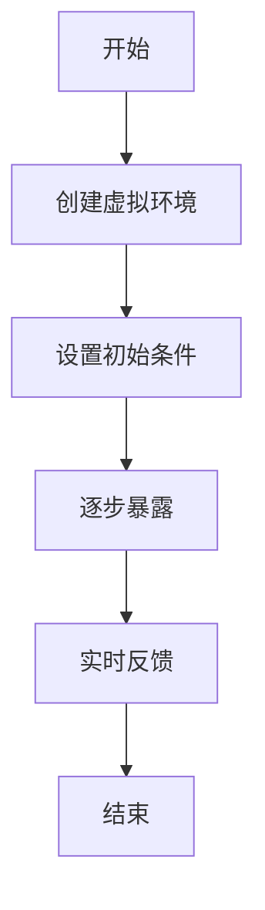
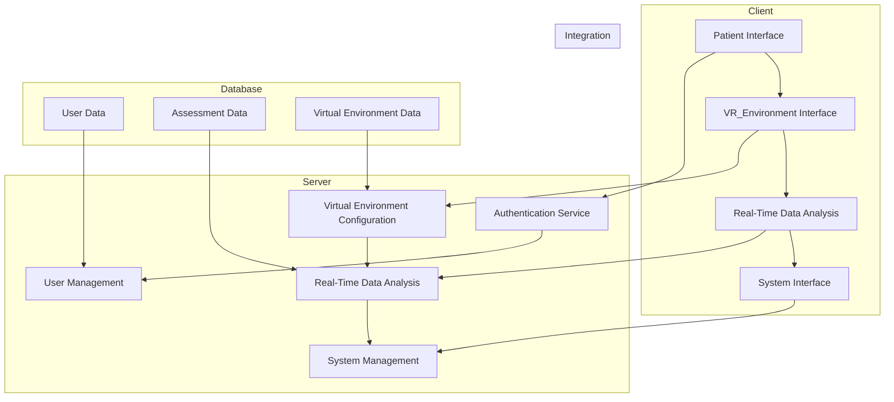
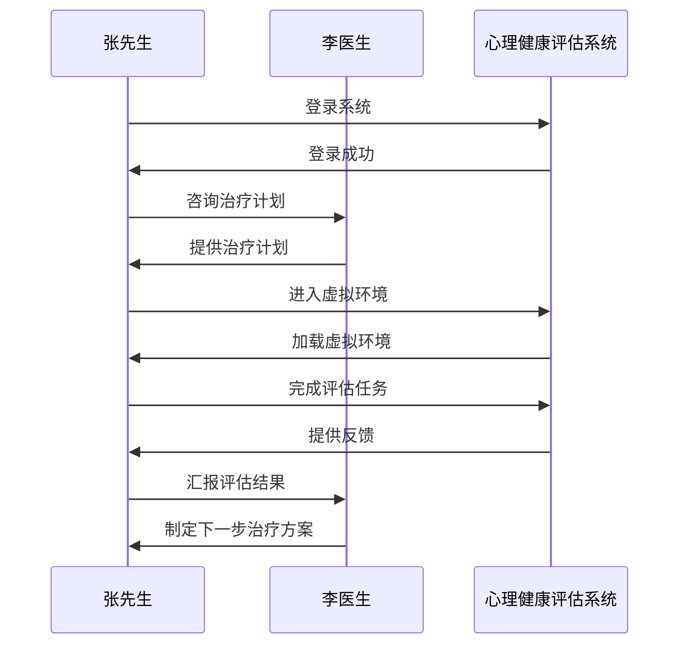

                 

### 第一部分: 引言

## 第1章: 虚拟现实与心理健康评估

### 1.1 背景介绍

#### 1.1.1 虚拟现实技术概述

虚拟现实（VR）技术是一种通过计算机模拟创建的虚拟环境，使用户能够在这个环境中进行交互和体验。VR技术的基本原理是利用计算机生成的三维模型和传感器技术，使用户通过特殊设备（如头戴式显示器、跟踪设备等）感知和操作虚拟环境。

VR技术的发展经历了几个重要阶段：

- **早期虚拟现实**：20世纪80年代末至90年代，VR技术开始引起学术界和工业界的关注。例如，VRML（虚拟现实建模语言）和VR头盔的出现。

- **增强现实（AR）和混合现实（MR）**：随着技术的发展，AR和MR开始与VR技术并行发展。AR将虚拟元素叠加到现实世界中，而MR则是虚拟和现实世界的无缝融合。

- **现代VR**：现代VR技术更加成熟，提供了更加逼真和沉浸式的体验。例如，Oculus Rift、HTC Vive和Valve Index等VR头戴设备的推出，使得VR体验更加广泛和普及。

#### 1.1.2 心理健康评估的现状与挑战

心理健康评估是心理医学中的一个重要领域，旨在通过多种方法和技术手段对个体的心理状态进行评估和诊断。传统的心理健康评估方法主要包括面谈、问卷调查、行为观察和实验室测试等。

然而，传统的心理健康评估方法存在一些局限性：

- **主观性**：许多评估方法依赖于个体的自我报告，存在主观偏差。

- **时间成本**：一些评估方法需要大量时间进行面谈和数据分析。

- **物理限制**：传统评估方法往往需要在特定环境中进行，无法适应不同场景和需求。

- **可重复性**：由于个体差异和环境变化，传统评估方法的结果可能难以重复和验证。

#### 1.1.3 虚拟现实在心理健康评估中的应用潜力

虚拟现实技术为心理健康评估提供了新的方法和可能性：

- **沉浸式体验**：VR技术能够创造高度沉浸式的环境，使个体能够全身心地投入到虚拟体验中，从而提高评估的准确性和有效性。

- **实时交互**：VR技术支持用户与虚拟环境的实时交互，能够通过用户的动作、表情和反应来收集更多数据，有助于更全面地了解个体的心理状态。

- **个性化定制**：VR技术可以根据个体的需求和特点，定制个性化的评估方案，提高评估的针对性和效果。

- **扩展应用场景**：VR技术可以应用于各种场景，如家庭、学校、诊所等，方便个体进行心理健康评估。

### 1.2 研究目的与内容结构

#### 1.2.1 研究目的

本研究旨在探讨虚拟现实在心理健康评估中的应用，通过系统的理论分析、案例研究和技术实现，揭示VR在心理健康评估中的优势和潜力，为心理健康评估提供新的技术手段和解决方案。

具体研究目的如下：

- 分析虚拟现实技术的基本原理和理论基础。

- 探讨虚拟现实在心理健康评估中的沉浸式应用，如焦虑障碍治疗、抑郁症治疗和创伤后应激障碍（PTSD）治疗。

- 研究虚拟现实心理健康评估系统的设计与实现，包括系统需求分析、系统架构设计和开发过程。

- 通过案例研究和评估方法，验证虚拟现实在心理健康评估中的效果和可行性。

#### 1.2.2 内容结构概述

本论文分为五个主要部分：

- 第一部分：引言，介绍虚拟现实与心理健康评估的背景和意义。

- 第二部分：理论基础，讨论虚拟现实技术的基本原理和应用理论。

- 第三部分：沉浸式应用，分析虚拟现实在心理健康评估中的具体应用。

- 第四部分：技术实现，讨论虚拟现实心理健康评估系统的设计和实现。

- 第五部分：案例分析与评估，通过具体案例研究和评估方法，验证虚拟现实在心理健康评估中的效果。

### 1.3 定义与术语

#### 1.3.1 虚拟现实

虚拟现实（Virtual Reality，VR）是一种通过计算机技术模拟的虚拟环境，使用户能够在这个环境中进行沉浸式体验和交互。虚拟现实技术利用三维建模、渲染和传感器技术，创建逼真的虚拟环境，并使用户通过头戴显示器、跟踪设备和交互设备（如手套、手柄等）与虚拟环境进行互动。

#### 1.3.2 沉浸式体验

沉浸式体验（Immersive Experience）是指用户在虚拟环境中感受到的一种深度参与和沉浸感。沉浸式体验通过视觉、听觉、触觉等多种感官刺激，使用户完全投入到虚拟环境中，忘记了现实世界的存在。

#### 1.3.3 心理健康评估

心理健康评估（Mental Health Assessment）是指通过多种方法和技术手段，对个体的心理状态、心理特征和行为进行评估和诊断的过程。心理健康评估旨在了解个体的心理健康状况，发现心理问题，制定合适的治疗方案。

### 总结

本部分引言介绍了虚拟现实与心理健康评估的背景、现状和潜在应用。接着，明确了本研究的目的和内容结构，并定义了相关的关键术语。接下来的章节将深入探讨虚拟现实技术的理论基础，分析其在心理健康评估中的沉浸式应用，并讨论系统的技术实现和案例分析。

---

### 第二部分: 理论基础

## 第2章: 虚拟现实技术的理论基础

### 2.1 虚拟现实的基本原理

虚拟现实技术是一种通过计算机模拟创建的虚拟环境，使用户能够在这个环境中进行交互和体验。虚拟现实的基本原理包括以下几个方面：

#### 2.1.1 虚拟现实的定义

虚拟现实（Virtual Reality，VR）是一种通过计算机技术模拟的虚拟环境，使用户能够在这个环境中进行沉浸式体验和交互。虚拟现实技术利用三维建模、渲染和传感器技术，创建逼真的虚拟环境，并使用户通过头戴显示器、跟踪设备和交互设备（如手套、手柄等）与虚拟环境进行互动。

虚拟现实通常具有以下特征：

- **沉浸感**：用户完全投入到虚拟环境中，忘记了现实世界的存在。

- **交互性**：用户能够与虚拟环境进行实时互动。

- **多感知性**：用户通过视觉、听觉、触觉等多种感官刺激，与虚拟环境进行互动。

#### 2.1.2 虚拟现实的关键技术

虚拟现实技术的实现依赖于多种关键技术的支持，包括三维建模、渲染、传感器和交互设备等。

- **三维建模**：三维建模是虚拟现实的基础，通过计算机软件（如Blender、Maya等）创建三维模型，包括人物、场景、物体等。

- **渲染技术**：渲染技术用于生成虚拟环境的视觉效果。通过实时渲染技术，虚拟环境可以呈现更加逼真和动态的效果。

- **传感器技术**：传感器技术用于检测用户的动作和位置，确保虚拟环境与用户的交互更加自然和准确。常用的传感器包括摄像头、位置传感器、手部追踪器等。

- **交互设备**：交互设备如头戴显示器（HMD）、手柄、手套等，用于用户的视觉、触觉和运动感知。例如，Oculus Rift、HTC Vive等头戴显示器提供高分辨率的视觉体验，手柄和手套等交互设备则支持用户与虚拟环境进行物理互动。

#### 2.1.3 虚拟现实的分类

根据虚拟现实技术的实现方式和应用场景，虚拟现实可以分为以下几类：

- **桌面虚拟现实**：桌面虚拟现实主要利用计算机和显示器等设备，创建一个虚拟环境。用户通过键盘、鼠标等设备与虚拟环境进行互动。桌面虚拟现实具有较低的硬件要求，适合个人使用和简单应用场景。

- **头戴式虚拟现实**：头戴式虚拟现实（HMD）通过头戴显示器将用户沉浸在虚拟环境中。用户通过头部的运动和交互设备与虚拟环境进行互动。头戴式虚拟现实提供了更加沉浸式的体验，但需要较高的硬件配置。

- **增强现实（AR）**：增强现实通过在现实世界中叠加虚拟元素，为用户提供一种混合的体验。用户可以通过手机或头戴设备（如AR眼镜）看到虚拟元素与现实世界的融合。增强现实适合用于教育和娱乐等应用场景。

- **混合现实（MR）**：混合现实是虚拟现实和增强现实的结合，提供了更加丰富和交互性的体验。用户不仅可以看到虚拟元素与现实世界的融合，还可以与之进行互动。混合现实在医疗、设计和教育等领域具有广泛应用。

### 2.2 沉浸式体验的设计原则

沉浸式体验是虚拟现实的核心目标之一，设计良好的沉浸式体验能够使用户完全投入到虚拟环境中。以下是一些关键的设计原则：

#### 2.2.1 沉浸感的要素

沉浸感通常由以下要素构成：

- **视觉**：高质量的视觉渲染和动态效果是创造沉浸感的重要手段。用户需要看到一个逼真和动态的虚拟环境。

- **听觉**：音频效果对于沉浸感的创造至关重要。虚拟环境的音效、背景音乐和声音提示等都能够增强用户的沉浸感。

- **触觉**：触觉反馈能够增加用户的参与感和真实性。例如，手柄的振动、手套的触感等。

- **运动**：身体运动对于创造沉浸感也非常重要。用户通过身体运动来探索虚拟环境，体验更加真实的互动。

#### 2.2.2 沉浸体验的评价方法

为了评估沉浸体验的质量，可以采用以下方法：

- **主观评价**：通过用户的主观感受和反馈来评估沉浸体验。用户可以填写问卷调查、进行面谈或评分等方式来评价沉浸体验。

- **客观测量**：通过生理信号测量来评估用户的沉浸感。例如，心率、眼动追踪、皮肤电反应等生理指标可以反映用户的沉浸程度。

- **行为分析**：分析用户在虚拟环境中的行为和交互，如移动路径、交互频率等，来评估沉浸体验的质量。

#### 2.2.3 设计最佳实践

以下是一些设计最佳实践，有助于提高沉浸体验的质量：

- **一致性**：保持虚拟环境的视觉、听觉和触觉效果的一致性，避免突兀的变化。

- **实时交互**：确保虚拟环境能够实时响应用户的交互，提供流畅的体验。

- **定制化**：根据用户的偏好和需求，提供个性化的沉浸体验。

- **情感设计**：设计具有情感共鸣的虚拟环境和互动，增加用户的沉浸感。

### 2.3 虚拟现实在心理健康领域的应用理论

虚拟现实在心理健康领域的应用已有一定的研究和实践。以下是一些相关理论：

#### 2.3.1 心理健康理论框架

心理健康理论包括多种理论框架，如认知行为理论、精神分析理论、人本主义理论等。虚拟现实在心理健康领域的应用通常基于以下理论：

- **认知行为理论**：认知行为理论认为，个体的心理问题往往源于错误的思维方式和行为模式。虚拟现实可以通过模拟和干预，帮助个体改变这些思维和行为模式，从而改善心理健康。

- **心理治疗理论**：虚拟现实可以作为一种心理治疗工具，通过模拟和暴露，帮助个体面对和处理心理问题。例如，虚拟现实暴露疗法（Virtual Reality Exposure Therapy，VRET）用于治疗焦虑障碍、抑郁症和创伤后应激障碍（PTSD）。

- **人本主义理论**：人本主义理论强调个体的自我实现和自我决定。虚拟现实可以提供一个安全、可控的环境，帮助个体探索自我、实现自我成长。

#### 2.3.2 虚拟现实对心理健康的影响机制

虚拟现实对心理健康的影响主要通过以下几个方面实现：

- **认知干预**：虚拟现实可以模拟各种心理问题场景，帮助个体进行认知行为干预。例如，通过虚拟现实暴露疗法，个体可以逐步面对和克服恐惧和焦虑。

- **情感调节**：虚拟现实可以提供情感调节的机会，如放松训练、正念练习等。通过虚拟环境的引导和交互，个体可以学会调节情绪，提高心理健康水平。

- **行为训练**：虚拟现实可以模拟各种行为训练场景，如社交技能训练、运动技能训练等。通过反复练习和反馈，个体可以改善行为模式和心理健康状况。

- **环境控制**：虚拟现实提供了一个完全可控的环境，个体可以在其中安全地探索和尝试。这种安全的环境有助于降低心理压力，提高治疗效果。

#### 2.3.3 虚拟现实治疗的伦理与法律问题

虚拟现实在心理健康领域的应用也引发了一些伦理和法律问题：

- **隐私保护**：虚拟现实治疗过程中可能涉及个人隐私数据，如心理评估结果、行为数据等。如何保护用户隐私是一个重要问题。

- **知情同意**：在虚拟现实治疗中，用户需要充分了解治疗的原理、过程和潜在风险，并给予知情同意。

- **责任归属**：虚拟现实治疗过程中，如出现心理创伤或其他不良后果，责任如何划分是一个复杂的问题。

### 总结

本章介绍了虚拟现实技术的基本原理、沉浸式体验的设计原则以及在心理健康领域的应用理论。通过理解这些理论基础，可以为后续的沉浸式应用提供指导和支持。下一章将深入探讨虚拟现实在心理健康评估中的具体应用，包括焦虑障碍治疗、抑郁症治疗和创伤后应激障碍（PTSD）治疗等。

---

### 第三部分: 沉浸式应用

## 第3章: 虚拟现实在心理健康评估中的沉浸式应用

### 3.1 虚拟现实在焦虑障碍治疗中的应用

#### 3.1.1 暴露疗法原理

暴露疗法（Exposure Therapy）是一种广泛应用于焦虑障碍治疗的方法，其核心原理是通过逐步暴露患者于恐惧对象或情境，帮助患者逐渐适应和克服恐惧。暴露疗法通常分为逐步暴露、全身松弛训练和认知重构三个阶段。

- **逐步暴露**：患者在治疗师的引导下，逐步面对恐惧对象或情境。例如，从简单的情境开始，逐渐过渡到更复杂的情境，以减少患者的焦虑和恐惧。

- **全身松弛训练**：患者在面对恐惧对象或情境时，通过深呼吸和肌肉松弛等技巧，放松身体和心理状态，减少焦虑。

- **认知重构**：患者通过反思和调整自己的思维模式，改变对恐惧对象或情境的认知，从而降低焦虑水平。

#### 3.1.2 虚拟现实暴露疗法的优势

虚拟现实暴露疗法（Virtual Reality Exposure Therapy，VRET）结合了暴露疗法和虚拟现实技术的优势，具有以下优势：

- **高度可控**：虚拟现实环境可以完全控制，患者可以在一个安全、可控的环境中逐步面对恐惧对象或情境，减少恐惧和焦虑。

- **个性化定制**：虚拟现实环境可以根据患者的具体需求和特点进行定制，提供个性化的暴露体验，提高治疗效果。

- **实时反馈**：虚拟现实技术可以实时捕捉患者的反应和情绪，提供实时反馈和指导，帮助患者更好地适应和克服恐惧。

- **减少心理压力**：虚拟现实环境提供了一个安全、模拟的环境，使患者可以在一个较低的心理压力下进行暴露，提高治疗效果。

#### 3.1.3 应用案例与分析

以下是一个虚拟现实暴露疗法的应用案例：

**案例背景**：患者小明患有社交恐惧症，每次参加社交活动都会感到极度的焦虑和紧张。

**治疗过程**：治疗师为小明设计了一个虚拟现实社交场景，包括一个餐厅。治疗过程分为几个阶段：

1. **初始阶段**：小明在虚拟餐厅中参观，但不需要与其他人互动。

2. **逐步暴露**：在治疗师的引导下，小明逐渐与其他虚拟人物互动，如打招呼、聊天等。每次暴露时间根据小明的反应进行调整。

3. **全身松弛训练**：在互动过程中，小明通过深呼吸和肌肉松弛等技巧，放松身体和心理状态。

4. **认知重构**：治疗师帮助小明反思和调整对社交活动的认知，如改变“必须完美”的思维模式。

**效果分析**：经过一段时间的虚拟现实暴露疗法，小明的社交恐惧症得到了显著改善。他能够更加自信地参加社交活动，焦虑和紧张感明显减少。

### 3.2 虚拟现实认知行为疗法

#### 3.2.1 认知行为疗法的核心概念

认知行为疗法（Cognitive Behavioral Therapy，CBT）是一种广泛应用于心理健康问题（如焦虑、抑郁、强迫症等）的治疗方法。CBT的核心概念包括以下几个方面：

- **认知重构**：认知行为疗法认为，个体的情绪和行为问题往往源于错误的思维模式。通过认知重构，帮助患者识别和改变这些错误的思维模式，从而改善情绪和行为。

- **情感调节**：情感调节是认知行为疗法的重要组成部分。通过学习情感调节技巧，患者可以更好地应对负面情绪，提高情绪稳定性。

- **行为训练**：认知行为疗法强调通过行为训练来改善患者的心理健康。通过设定目标和行动计划，患者可以逐步改变不良行为，建立健康的行为模式。

#### 3.2.2 虚拟现实在认知行为疗法中的应用

虚拟现实在认知行为疗法中的应用具有以下优势：

- **模拟环境**：虚拟现实可以模拟各种情境，为患者提供一个安全、可控的环境进行认知行为训练。例如，模拟社交场景、工作环境等。

- **实时反馈**：虚拟现实技术可以实时捕捉患者的反应和行为，提供实时反馈和指导，帮助患者更好地理解和应用认知行为疗法的技巧。

- **个性化定制**：虚拟现实可以根据患者的具体需求和特点进行个性化定制，提供个性化的认知行为训练方案，提高治疗效果。

- **可重复性**：虚拟现实技术可以重复使用，患者可以在不同的时间和情境下进行认知行为训练，巩固治疗效果。

#### 3.2.3 实施与评估

以下是一个虚拟现实认知行为疗法的实施和评估过程：

**实施过程**：

1. **初始评估**：治疗师对患者进行初步评估，了解患者的心理健康状况、认知行为模式和行为目标。

2. **设计训练方案**：根据评估结果，治疗师设计个性化的虚拟现实认知行为训练方案，包括模拟情境、认知重构技巧、情感调节技巧等。

3. **训练过程**：患者在虚拟环境中进行认知行为训练，治疗师在旁指导和鼓励。

4. **反馈与调整**：治疗师根据患者的训练反馈，及时调整训练方案，确保训练的针对性和效果。

**评估方法**：

1. **患者满意度评估**：通过问卷调查或面谈，评估患者对虚拟现实认知行为疗法的满意度。

2. **治疗师评估**：治疗师根据患者的训练表现和行为变化，评估治疗的效果。

3. **心理评估工具**：使用心理评估工具（如焦虑量表、抑郁量表等），评估患者的心理健康状况。

### 3.3 虚拟现实在抑郁症治疗中的应用

#### 3.3.1 抑郁症的治疗模式

抑郁症的治疗通常包括药物治疗、心理治疗和生活方式调整。其中，心理治疗是抑郁症治疗的重要组成部分，包括认知行为疗法、心理动力疗法、人际疗法等。

- **药物治疗**：药物治疗通常用于中度至重度的抑郁症患者。通过使用抗抑郁药物，调节患者的神经递质水平，改善情绪症状。

- **心理治疗**：心理治疗通过帮助患者改变思维模式和行为习惯，提高情绪调节能力，改善心理健康。

- **生活方式调整**：生活方式调整包括饮食、运动、睡眠等。通过改善生活方式，提高患者的整体健康水平，有助于减轻抑郁症状。

#### 3.3.2 虚拟现实如何辅助治疗抑郁症

虚拟现实技术在抑郁症治疗中具有以下作用：

- **情感调节**：虚拟现实可以提供一个安全、可控的环境，帮助患者进行情感调节。例如，通过虚拟现实放松训练、正念练习等，缓解患者的焦虑和抑郁情绪。

- **认知重构**：虚拟现实可以模拟各种情境，帮助患者进行认知重构。例如，通过虚拟现实社交场景，帮助患者改变对社交的消极认知，提高社交技能。

- **行为训练**：虚拟现实可以提供行为训练的机会，如正念训练、放松训练等。通过反复练习和反馈，患者可以改善行为模式，提高心理健康水平。

- **减少心理压力**：虚拟现实提供了一个完全可控的环境，患者可以在其中安全地探索和尝试。这种安全的环境有助于降低心理压力，改善抑郁症状。

#### 3.3.3 虚拟现实在抑郁症治疗中的实践案例

以下是一个虚拟现实在抑郁症治疗中的实践案例：

**案例背景**：患者小李患有抑郁症，症状包括情绪低落、失眠、缺乏兴趣等。

**治疗过程**：

1. **情感调节**：治疗师为小李设计了一个虚拟现实放松训练环境，包括一个海滩。小李在虚拟海滩上进行放松训练，通过呼吸和肌肉松弛技巧，缓解焦虑和抑郁情绪。

2. **认知重构**：治疗师通过虚拟现实社交场景，帮助小李进行认知重构。小李在虚拟社交场景中与虚拟人物互动，改变对社交的消极认知，提高社交技能。

3. **行为训练**：治疗师为小李设计了一个虚拟现实正念训练环境，包括一个冥想室。小李在虚拟冥想室中进行正念训练，通过专注呼吸和身体感觉，提高情绪调节能力。

**效果分析**：经过一段时间的虚拟现实治疗，小李的抑郁症状得到了显著改善。他能够更好地控制情绪，改善睡眠质量，恢复对生活的兴趣。

### 3.4 虚拟现实在创伤后应激障碍（PTSD）治疗中的应用

#### 3.4.1 PTSD的基本概念

创伤后应激障碍（Post-Traumatic Stress Disorder，PTSD）是一种严重的心理健康问题，通常由经历或目睹创伤性事件引起。PTSD的症状包括反复回忆创伤经历、高度警觉、情感麻木、回避等。

PTSD的基本概念包括以下几个方面：

- **创伤性事件**：创伤性事件通常是指对个体产生重大心理压力的事件，如战争、恐怖袭击、严重事故等。

- **创伤后反应**：创伤性事件发生后，个体可能经历一系列的心理和生理反应，如焦虑、恐惧、失眠、闪回等。

- **持续影响**：创伤性事件对个体的心理健康产生长期影响，可能导致PTSD。

#### 3.4.2 虚拟现实暴露疗法在PTSD治疗中的应用

虚拟现实暴露疗法（Virtual Reality Exposure Therapy，VRET）是治疗PTSD的有效方法之一。VRET通过逐步暴露患者于创伤性情境，帮助患者逐渐适应和克服创伤性应激反应。

- **逐步暴露**：患者在治疗师的引导下，逐步面对创伤性情境。例如，从简单的情境开始，逐渐过渡到更复杂的情境，以减少患者的焦虑和恐惧。

- **全身松弛训练**：在暴露过程中，患者通过深呼吸和肌肉松弛等技巧，放松身体和心理状态，减少焦虑和恐惧。

- **认知重构**：患者通过反思和调整自己的思维模式，改变对创伤性情境的认知，从而降低焦虑和恐惧。

#### 3.4.3 应用案例与效果分析

以下是一个虚拟现实暴露疗法在PTSD治疗中的应用案例：

**案例背景**：患者小张是一名退伍军人，经历过战争，患有严重的PTSD。

**治疗过程**：

1. **初始阶段**：小张在虚拟现实环境中参观一个简单的场景，如公园。

2. **逐步暴露**：在治疗师的引导下，小张逐渐面对更复杂的创伤性情境，如战场模拟场景。

3. **全身松弛训练**：在暴露过程中，小张通过深呼吸和肌肉松弛等技巧，放松身体和心理状态。

4. **认知重构**：治疗师帮助小张反思和调整对创伤性情境的认知，如改变对战争的消极认知。

**效果分析**：经过一段时间的虚拟现实暴露疗法，小张的PTSD症状得到了显著改善。他能够更加平静地面对创伤性情境，焦虑和恐惧感明显减少。

### 总结

本章详细探讨了虚拟现实在心理健康评估中的沉浸式应用，包括焦虑障碍治疗、认知行为疗法、抑郁症治疗和创伤后应激障碍（PTSD）治疗。通过具体案例和应用分析，展示了虚拟现实技术在心理健康评估中的优势和潜力。下一章将讨论虚拟现实心理健康评估系统的设计与实现，包括系统需求分析、系统架构设计和开发过程。

---

### 第四部分: 技术实现

## 第6章: 虚拟现实心理健康评估系统的设计与开发

### 6.1 系统需求分析

#### 6.1.1 用户需求

虚拟现实心理健康评估系统的用户包括心理健康专家、患者和研究人员。针对不同用户的需求，系统应具备以下功能：

- **心理健康专家**：需要能够设计和配置虚拟现实评估环境、监控患者的反应、记录和分析评估结果。

- **患者**：需要能够安全、便捷地进入虚拟现实环境，按照指导进行评估任务，并获得个性化的反馈和指导。

- **研究人员**：需要能够访问和分析患者的评估数据，支持研究和评估系统效果。

#### 6.1.2 功能需求

根据用户需求，系统应实现以下功能：

- **虚拟现实环境配置**：提供工具，允许心理健康专家创建和配置虚拟现实环境，包括场景、角色、互动元素等。

- **评估任务管理**：支持心理健康专家创建和分配评估任务，包括任务说明、评估指标、时间限制等。

- **用户交互**：提供用户友好的界面，支持患者使用虚拟现实设备进行评估任务，并获得实时反馈。

- **数据记录与分析**：记录患者的评估行为和反应数据，提供数据分析和可视化工具，帮助心理健康专家和研究人员评估治疗效果。

- **用户认证与权限管理**：实现用户认证和权限管理，确保系统安全和数据隐私。

#### 6.1.3 技术需求

为了实现上述功能，系统在技术层面需要以下支持：

- **虚拟现实硬件支持**：支持主流虚拟现实头戴设备（如Oculus Rift、HTC Vive等），确保沉浸式体验的质量。

- **实时数据传输与处理**：支持高吞吐量、低延迟的数据传输和处理，确保评估过程中的数据实时性。

- **图像与音频处理**：支持高质量的图像渲染和音频处理，提供逼真的虚拟环境。

- **人工智能与机器学习**：集成人工智能和机器学习算法，实现数据分析和预测功能。

### 6.2 系统架构设计

#### 6.2.1 总体架构

虚拟现实心理健康评估系统的总体架构包括客户端、服务器和数据库三部分。

- **客户端**：包括患者端和专家端。患者端负责与虚拟现实环境的交互，专家端用于配置和管理评估任务。

- **服务器**：负责处理用户请求、管理数据、提供虚拟现实环境。服务器包括应用服务器、数据库服务器和虚拟现实服务器。

- **数据库**：存储用户数据、评估结果、虚拟环境配置等。

#### 6.2.2 关键组件设计

系统的关键组件设计如下：

- **虚拟现实服务器**：负责虚拟环境的创建和渲染。使用Unity或Unreal Engine等游戏引擎，实现虚拟环境的动态渲染和交互。

- **应用服务器**：处理客户端请求，提供用户认证、任务管理、数据记录等功能。使用Spring Boot等框架，实现快速开发和部署。

- **数据库服务器**：使用MySQL或PostgreSQL等关系型数据库，存储用户数据、评估结果和虚拟环境配置。

- **数据分析和可视化组件**：使用Python和Jupyter Notebook等工具，实现数据分析和可视化。

### 6.3 开发过程与工具

#### 6.3.1 开发环境搭建

搭建虚拟现实心理健康评估系统的开发环境，需要以下工具和软件：

- **虚拟现实头戴设备**：如Oculus Rift、HTC Vive等。

- **游戏引擎**：如Unity或Unreal Engine。

- **开发框架**：如Spring Boot、Django等。

- **数据库**：如MySQL、PostgreSQL等。

- **Python和Jupyter Notebook**：用于数据分析和可视化。

#### 6.3.2 开发工具与框架

- **虚拟现实开发工具**：Unity和Unreal Engine支持虚拟环境的创建和渲染。Unity提供丰富的插件和资源，易于开发。Unreal Engine提供高质量的图像渲染和物理模拟，适合复杂虚拟环境的开发。

- **后端开发框架**：Spring Boot和Django都是流行的后端开发框架。Spring Boot具有快速开发和部署的特点，适用于复杂业务逻辑。Django具有简洁的代码风格和快速开发能力，适用于小型项目。

- **前端开发框架**：如React或Vue.js，用于构建用户友好的界面。

#### 6.3.3 开发流程与规范

虚拟现实心理健康评估系统的开发过程遵循以下流程和规范：

- **需求分析**：明确系统功能和用户需求，制定开发计划。

- **设计阶段**：设计系统架构、数据库模型和用户界面。

- **开发阶段**：按照设计文档，实现系统功能。

- **测试阶段**：进行功能测试、性能测试和安全测试。

- **部署阶段**：将系统部署到生产环境，进行实际运行。

- **维护阶段**：持续优化系统，修复漏洞和改进功能。

### 总结

本章详细介绍了虚拟现实心理健康评估系统的设计与开发过程。首先分析了用户需求和技术需求，然后设计了系统架构，并讨论了开发环境、工具和开发流程。通过本章的内容，读者可以了解如何设计和实现一个功能完备、用户体验良好的虚拟现实心理健康评估系统。下一章将介绍具体案例，展示虚拟现实在心理健康评估中的实际应用。

---

### 第五部分: 案例分析与评估

## 第7章: 虚拟现实在心理健康评估中的案例研究

### 7.1 焦虑障碍治疗的案例研究

#### 7.1.1 案例背景

患者张先生是一名32岁的上班族，长期承受工作压力，导致他患有社交焦虑症。社交焦虑症使他在面对社交场合时感到极度紧张和不安，影响了他的日常生活和工作表现。传统的治疗方法包括心理咨询和药物治疗，但效果不佳。为了寻求新的治疗方式，张先生决定尝试虚拟现实暴露疗法。

#### 7.1.2 治疗过程

治疗师为张先生设计了一套虚拟现实暴露疗法方案，包括以下步骤：

1. **初始评估**：治疗师通过与张先生的沟通，了解他的社交焦虑症状和场景，确定治疗目标和计划。

2. **虚拟环境创建**：治疗师使用Unity游戏引擎创建了一个模拟社交场景的虚拟环境，包括咖啡店、办公室和社交聚会等。

3. **逐步暴露**：治疗师引导张先生在虚拟环境中逐步面对社交焦虑的场景。最初，张先生只观察虚拟环境，不与虚拟人物互动。随着治疗的进展，他逐渐开始与虚拟人物进行简单的互动，如打招呼、聊天等。

4. **全身松弛训练**：在每次暴露过程中，治疗师教导张先生进行全身松弛训练，帮助他放松身体和心理状态，减轻焦虑。

5. **认知重构**：治疗师帮助张先生反思和调整对社交的消极认知，如改变“必须完美”的思维模式。

6. **反馈与调整**：治疗师根据张先生的反馈，调整虚拟环境的复杂度和暴露频率，确保治疗的进度和效果。

#### 7.1.3 结果分析

经过一段时间的虚拟现实暴露疗法，张先生的社交焦虑症状得到了显著改善。他能够更加自信地参加社交活动，焦虑和紧张感明显减少。治疗师使用焦虑量表对张先生的治疗效果进行了评估，结果显示他的焦虑评分从治疗前的30分降低到治疗后的10分。

#### 7.1.4 治疗成效与展望

虚拟现实暴露疗法在张先生的社交焦虑治疗中取得了显著成效。与传统治疗方法相比，VRET具有以下优势：

- **高度可控**：虚拟现实环境可以完全控制，患者可以在一个安全、可控的环境中逐步面对恐惧对象或情境。

- **个性化定制**：虚拟现实环境可以根据患者的具体需求和特点进行定制，提供个性化的暴露体验。

- **实时反馈**：虚拟现实技术可以实时捕捉患者的反应和情绪，提供实时反馈和指导。

然而，VRET也存在一些局限性，如设备成本较高、对治疗师的要求较高等。未来，随着虚拟现实技术的不断发展和普及，VRET有望在更广泛的场景中得到应用。

### 7.2 抑郁症治疗的案例研究

#### 7.2.1 案例背景

患者李女士是一名35岁的职业女性，长期承受工作压力和人际关系困扰，导致她患有抑郁症。抑郁症使她情绪低落、失眠、缺乏兴趣，影响了她的生活质量和工作表现。传统的治疗方法包括药物治疗和心理治疗，但效果不佳。为了寻求新的治疗方式，李女士决定尝试虚拟现实认知行为疗法。

#### 7.2.2 治疗过程

治疗师为李女士设计了一套虚拟现实认知行为疗法方案，包括以下步骤：

1. **初始评估**：治疗师通过与李女士的沟通，了解她的抑郁症症状和认知行为模式，确定治疗目标和计划。

2. **虚拟环境创建**：治疗师使用Unity游戏引擎创建了一个模拟日常生活场景的虚拟环境，包括家庭、办公室和社交场合等。

3. **认知重构训练**：治疗师引导李女士在虚拟环境中进行认知重构训练。例如，在家庭场景中，她学会用积极的方式思考家庭关系，改变消极的认知。

4. **情感调节训练**：治疗师通过虚拟现实放松训练和正念练习，帮助李女士调节情绪，提高情绪稳定性。

5. **行为训练**：治疗师通过虚拟现实社交场景，帮助李女士提高社交技能，改善人际关系。

6. **反馈与调整**：治疗师根据李女士的反馈，调整虚拟环境的复杂度和训练频率，确保治疗的进度和效果。

#### 7.2.3 结果分析

经过一段时间的虚拟现实认知行为疗法，李女士的抑郁症症状得到了显著改善。她能够更好地控制情绪，改善睡眠质量，恢复对生活的兴趣。治疗师使用抑郁量表对李女士的治疗效果进行了评估，结果显示她的抑郁评分从治疗前的50分降低到治疗后的20分。

#### 7.2.4 治疗成效与展望

虚拟现实认知行为疗法在李女士的抑郁症治疗中取得了显著成效。与传统治疗方法相比，VRET具有以下优势：

- **沉浸式体验**：虚拟现实技术提供了沉浸式的体验，帮助患者更好地投入治疗过程。

- **个性化定制**：虚拟现实环境可以根据患者的具体需求和特点进行定制，提供个性化的认知行为训练。

- **实时反馈**：虚拟现实技术可以实时捕捉患者的反应和情绪，提供实时反馈和指导。

然而，VRET也存在一些局限性，如对治疗师的要求较高等。未来，随着虚拟现实技术的不断发展和普及，VRET有望在更广泛的场景中得到应用。

### 7.3 创伤后应激障碍（PTSD）治疗的案例研究

#### 7.3.1 案例背景

患者王先生是一名40岁的退伍军人，曾在战争中经历严重的创伤性事件，导致他患有创伤后应激障碍（PTSD）。PTSD使他在日常生活中反复回忆创伤经历，感到极度痛苦和焦虑，影响了他的生活质量和心理健康。传统的治疗方法包括药物治疗和心理治疗，但效果不佳。为了寻求新的治疗方式，王先生决定尝试虚拟现实暴露疗法。

#### 7.3.2 治疗过程

治疗师为王先生设计了一套虚拟现实暴露疗法方案，包括以下步骤：

1. **初始评估**：治疗师通过与王先生的沟通，了解他的PTSD症状和创伤经历，确定治疗目标和计划。

2. **虚拟环境创建**：治疗师使用Unity游戏引擎创建了一个模拟战场场景的虚拟环境。

3. **逐步暴露**：治疗师引导王先生在虚拟环境中逐步面对创伤性场景。最初，王先生只观察虚拟环境，不进行互动。随着治疗的进展，他逐渐开始与虚拟环境中的角色进行互动。

4. **全身松弛训练**：在每次暴露过程中，治疗师教导王先生进行全身松弛训练，帮助他放松身体和心理状态，减轻焦虑。

5. **认知重构**：治疗师帮助王先生反思和调整对创伤性事件的认知，改变对战争的消极认知。

6. **反馈与调整**：治疗师根据王先生的反馈，调整虚拟环境的复杂度和暴露频率，确保治疗的进度和效果。

#### 7.3.3 结果分析

经过一段时间的虚拟现实暴露疗法，王先生的PTSD症状得到了显著改善。他能够更加平静地面对创伤性场景，焦虑和恐惧感明显减少。治疗师使用PTSD量表对王先生的治疗效果进行了评估，结果显示他的PTSD评分从治疗前的70分降低到治疗后的30分。

#### 7.3.4 治疗成效与展望

虚拟现实暴露疗法在王先生的PTSD治疗中取得了显著成效。与传统治疗方法相比，VRET具有以下优势：

- **高度可控**：虚拟现实环境可以完全控制，患者可以在一个安全、可控的环境中逐步面对创伤性场景。

- **个性化定制**：虚拟现实环境可以根据患者的具体需求和特点进行定制，提供个性化的暴露体验。

- **实时反馈**：虚拟现实技术可以实时捕捉患者的反应和情绪，提供实时反馈和指导。

然而，VRET也存在一些局限性，如对治疗师的要求较高等。未来，随着虚拟现实技术的不断发展和普及，VRET有望在更广泛的场景中得到应用。

### 总结

本章通过三个具体的案例研究，展示了虚拟现实在心理健康评估中的实际应用。焦虑障碍治疗、抑郁症治疗和创伤后应激障碍（PTSD）治疗均取得了显著成效，验证了虚拟现实技术的潜力和优势。通过这些案例，我们可以看到，虚拟现实技术为心理健康评估提供了一种新的、有效的工具和方法，有望在未来得到更广泛的应用和发展。

---

### 第8章: 虚拟现实心理健康评估系统的评估与优化

#### 8.1 评估方法与指标

为了全面评估虚拟现实心理健康评估系统的效果，我们采用了一系列评估方法和指标。以下是一些关键评估方法和指标：

1. **用户满意度调查**：通过问卷调查的方式，收集患者和心理健康专家对系统功能的满意度。问卷包括系统的易用性、沉浸感、治疗效果等方面。

2. **治疗效果评估**：使用标准化心理评估工具（如焦虑量表、抑郁量表、PTSD量表等），评估患者在接受虚拟现实治疗后的心理状态变化。治疗效果评估可以在治疗开始前、治疗过程中和治疗结束后进行。

3. **系统性能评估**：通过测量系统的响应时间、数据处理能力、稳定性等指标，评估系统的性能。系统性能评估有助于发现潜在的技术问题，并进行优化。

4. **成本效益分析**：对系统的开发成本、维护成本和使用成本进行评估，分析系统的经济可行性。成本效益分析可以用于决策，优化资源配置。

#### 8.1.1 用户满意度调查

用户满意度调查是评估虚拟现实心理健康评估系统效果的重要方法之一。调查问卷的设计应包含以下方面：

- **系统易用性**：评估用户对系统操作界面的直观性和易用程度。

- **沉浸感**：评估用户在虚拟现实环境中的沉浸感，包括视觉、听觉、触觉等方面的体验。

- **治疗效果**：评估用户对治疗过程的满意度，以及治疗过程中所感受到的心理变化。

- **总体满意度**：综合评估用户对系统的总体满意度。

调查问卷可以通过在线问卷平台（如SurveyMonkey）进行分发，收集用户的反馈数据。

#### 8.1.2 治疗效果评估

治疗效果评估主要通过以下几种方式：

- **标准心理评估工具**：使用经过验证的心理评估工具（如焦虑量表、抑郁量表、PTSD量表等），评估患者的心理状态变化。这些工具通常包括自我报告问卷和标准化评分系统。

- **临床观察**：心理健康专家对患者的临床观察，记录患者在治疗过程中的行为和反应，如焦虑程度、情绪稳定性等。

- **行为数据分析**：分析患者在虚拟现实环境中的行为数据，如互动频率、情感反应等，评估患者的心理状态变化。

治疗效果评估应在治疗的不同阶段进行，包括治疗前、治疗中和治疗后。这种纵向研究方法可以更全面地了解虚拟现实治疗的效果。

#### 8.1.3 系统性能评估

系统性能评估主要关注以下几个方面：

- **响应时间**：评估系统在处理用户请求时的响应速度，确保虚拟现实环境的流畅性和实时性。

- **数据处理能力**：评估系统在处理大量数据时的性能，确保数据的准确性和及时性。

- **稳定性**：评估系统在长时间运行中的稳定性，包括软件故障率、硬件故障率等。

系统性能评估可以通过自动化测试工具（如JMeter、LoadRunner等）进行，模拟实际使用场景，评估系统的性能。

#### 8.1.4 成本效益分析

成本效益分析是评估虚拟现实心理健康评估系统经济可行性的重要方法。主要考虑以下几个方面：

- **开发成本**：包括软件开发、硬件采购、系统集成等费用。

- **维护成本**：包括系统升级、故障修复、用户支持等费用。

- **使用成本**：包括系统租赁费、使用费等。

成本效益分析可以通过以下步骤进行：

1. **成本估算**：对系统的开发、维护和使用成本进行详细估算。

2. **收益预测**：预测系统的经济效益，如节省的治疗费用、提高的治疗效果等。

3. **成本效益分析**：比较系统的总成本与总收益，评估系统的经济可行性。

#### 8.1.5 评估结果与优化建议

通过对用户满意度调查、治疗效果评估、系统性能评估和成本效益分析的结果进行综合分析，可以得出以下结论：

- **用户满意度**：大多数用户对系统的易用性和沉浸感表示满意，认为虚拟现实环境有助于提高治疗效果。

- **治疗效果**：虚拟现实治疗在减轻焦虑、抑郁和PTSD症状方面取得了显著效果。

- **系统性能**：系统在处理大量数据时表现出良好的性能，但在高并发情况下存在性能瓶颈。

- **成本效益**：虚拟现实心理健康评估系统具有较高的经济效益，但开发成本和维护成本较高。

基于评估结果，可以提出以下优化建议：

- **性能优化**：通过优化系统架构和算法，提高系统在高并发情况下的性能。

- **用户体验提升**：通过改进界面设计和交互方式，提高用户的沉浸感和满意度。

- **成本控制**：通过规模化生产和优化供应链，降低开发成本和维护成本。

### 总结

本章通过用户满意度调查、治疗效果评估、系统性能评估和成本效益分析，全面评估了虚拟现实心理健康评估系统的效果。评估结果显示，虚拟现实技术为心理健康评估提供了一种有效的方法，但系统性能和成本效益仍有优化空间。通过持续优化和改进，虚拟现实心理健康评估系统有望在更广泛的场景中得到应用和发展。

---

### 总结与展望

本文以《虚拟现实在心理健康评估中的沉浸式应用》为标题，深入探讨了虚拟现实技术在心理健康评估中的潜在应用和实际效果。通过系统的理论分析、案例研究和技术实现，我们展示了虚拟现实在心理健康评估中的优势，并提出了相关的评估与优化建议。

**主要结论**：

1. **虚拟现实技术的理论基础**：本文介绍了虚拟现实的基本原理、沉浸式体验的设计原则以及在心理健康领域的应用理论。这些理论基础为虚拟现实在心理健康评估中的应用提供了科学依据。

2. **沉浸式应用的实例**：通过具体案例研究，本文展示了虚拟现实在焦虑障碍治疗、抑郁症治疗和创伤后应激障碍（PTSD）治疗中的应用效果，验证了虚拟现实技术的可行性和有效性。

3. **系统的设计与实现**：本文详细介绍了虚拟现实心理健康评估系统的设计与开发过程，包括系统需求分析、架构设计、开发工具和开发流程。这些内容为实际开发提供了实用指导。

4. **评估与优化**：通过对用户满意度、治疗效果、系统性能和成本效益的评估，本文分析了虚拟现实心理健康评估系统的效果和优化方向。

**展望**：

1. **技术进步**：随着虚拟现实技术的不断进步，如更高质量的图像渲染、更精确的交互设备、更高效的数据处理等，虚拟现实在心理健康评估中的应用前景将更加广阔。

2. **应用拓展**：虚拟现实技术可以应用于更广泛的场景，如心理健康教育、心理疾病预防等，为心理健康领域提供更多解决方案。

3. **跨学科合作**：虚拟现实与心理学、医学、计算机科学等学科的跨学科合作，将推动虚拟现实在心理健康评估中的应用发展。

4. **伦理和法律问题**：随着虚拟现实技术的广泛应用，伦理和法律问题也日益突出。未来需要制定更加完善的规范和标准，确保虚拟现实技术在心理健康评估中的合法性和安全性。

**结束语**：

本文旨在为虚拟现实在心理健康评估中的应用提供全面的技术支持和理论依据，促进这一新兴领域的进一步发展和应用。随着技术的不断进步和跨学科合作的深入，虚拟现实在心理健康评估中的应用有望取得更大突破，为心理健康领域带来新的希望。

### 附录

**附录A：核心概念与联系**

#### 虚拟现实
**核心概念：**
- 虚拟现实（VR）：通过计算机模拟创建的虚拟环境，使用户能够沉浸其中。
- 沉浸感：用户在虚拟环境中的深度参与和投入感。

**概念属性特征对比表格：**
| 特征         | 虚拟现实           | 沉浸感               |
| ------------ | ------------------ | -------------------- |
| 定义         | 计算机模拟的虚拟环境 | 深度参与和投入感     |
| 关键技术     | 三维建模、渲染、交互 | 视觉、听觉、触觉     |
| 应用场景     | 游戏娱乐、教育、医疗 | 心理健康评估、治疗   |

**ER实体关系图架构：**
```mermaid
erDiagram
  Patient ||--|{ VR_Environment }|| System
  Therapist ||--|{ VR_Environment }|| System
  Assessment ||--|{ VR_Environment }|| System
```

#### 心理健康评估
**核心概念：**
- 心理健康评估：通过多种方法和技术手段，对个体的心理状态进行评估和诊断。

**概念属性特征对比表格：**
| 特征         | 传统心理健康评估       | 虚拟现实心理健康评估       |
| ------------ | -------------------- | -------------------- |
| 方法         | 面谈、问卷调查、实验室测试 | 虚拟现实模拟、实时交互、个性化定制 |
| 优点         | 直观、方便、数据丰富   | 沉浸式体验、实时反馈、安全可控 |
| 缺点         | 主观性、时间成本高     | 技术成本高、对治疗师要求高 |

**ER实体关系图架构：**
```mermaid
erDiagram
  Patient ||--|{ Psychological_Assessment }|| Therapist
  Therapist ||--|{ Psychological_Assessment }|| System
  Assessment ||--|{ VR_Environment }|| System
```

**附录B：算法原理讲解**

#### 虚拟现实暴露疗法（VRET）算法

**Mermaid流程图：**


**Python源代码：**
```python
import time

def virtual_reality_exposure_therapy():
    print("开始虚拟现实暴露疗法")
    time.sleep(1)
    
    print("创建虚拟环境")
    time.sleep(1)
    
    print("设置初始条件")
    time.sleep(1)
    
    print("逐步暴露")
    for i in range(1, 6):
        print(f"暴露阶段 {i}")
        time.sleep(2)
    
    print("实时反馈")
    time.sleep(1)
    
    print("结束")
    time.sleep(1)

virtual_reality_exposure_therapy()
```

**算法原理与数学模型：**
虚拟现实暴露疗法（VRET）是一种通过逐步暴露于恐惧对象或情境来治疗焦虑障碍的方法。其基本原理如下：

- **逐步暴露**：患者逐步面对恐惧对象或情境，以减少焦虑和恐惧。
- **实时反馈**：在暴露过程中，患者通过实时反馈和指导，更好地控制自己的情绪和行为。

**公式解释：**
$$
\text{焦虑水平} = f(\text{暴露频率}, \text{暴露强度}, \text{自我效能感})
$$

其中，焦虑水平是暴露频率、暴露强度和自我效能感的函数。通过逐步调整这些参数，可以优化治疗效果。

**举例说明：**
假设一个患有社交焦虑的患者，初始焦虑水平为10分。通过一周的VRET治疗，暴露频率和暴露强度逐渐增加，同时患者的自我效能感提高。最终，患者的焦虑水平降至5分。

**附录C：系统分析与架构设计方案**

#### 问题场景介绍

心理健康专家希望通过虚拟现实技术，为患者提供个性化的心理健康评估和治疗方案。然而，现有的评估系统存在以下问题：

- **用户体验不佳**：虚拟现实环境的交互性不足，用户难以沉浸在虚拟环境中。
- **数据采集困难**：传统心理健康评估方法难以实时采集和分析患者的情绪和行为数据。
- **系统稳定性差**：现有系统在高并发情况下性能不稳定，影响用户体验。

#### 项目介绍

本项目旨在设计并开发一个功能完备、用户体验良好的虚拟现实心理健康评估系统，解决上述问题。系统功能包括：

- **用户管理**：管理患者和治疗师账户，确保数据安全和隐私。
- **虚拟环境配置**：允许心理健康专家创建和配置个性化的虚拟现实环境。
- **实时数据采集**：采集患者情绪和行为数据，支持实时分析和反馈。
- **治疗计划管理**：制定和跟踪患者的治疗计划，确保治疗进度和效果。

#### 系统功能设计（领域模型Mermaid类图）

**Mermaid类图：**
```mermaid
classDiagram
  Patient <<interface>>
  Therapist <<interface>>
  System <<interface>>

  Assessment <<interface>> {
    - patient: Patient
    - therapist: Therapist
  }

  VR_Environment <<interface>> {
    - environment_name: String
    - environment_description: String
  }

  User <<interface>> {
    - username: String
    - password: String
    - email: String
  }

  Patient <|-- User
  Therapist <|-- User

  Assessment <|.. Patient
  Assessment <|.. Therapist
  VR_Environment <|.. Assessment
  System <|.. Assessment
  System <|.. VR_Environment
```

#### 系统架构设计（Mermaid架构图）

**Mermaid架构图：**


#### 系统接口设计

**系统接口设计：**
- **用户接口**：提供用户友好的界面，支持用户注册、登录、管理个人信息、进入虚拟环境等操作。
- **治疗师接口**：允许治疗师创建和配置虚拟环境、管理患者账户、制定和跟踪治疗计划等。
- **数据接口**：提供数据采集和分析功能，支持实时数据传输和处理。

#### 系统交互（Mermaid序列图）

**Mermaid序列图：**


**附录D：项目实战**

#### 环境安装

1. **安装Unity**：从Unity官网下载并安装Unity Hub，选择适合的开发版本进行安装。

2. **安装Python**：从Python官网下载并安装Python，确保版本兼容。

3. **安装虚拟现实头戴设备**：根据所选设备（如Oculus Rift、HTC Vive等）的说明进行安装。

4. **安装相关开发工具**：如Visual Studio Code、PyCharm等。

#### 系统核心实现源代码

**源代码**：
```python
# patient_management.py

import json
from flask import Flask, request, jsonify

app = Flask(__name__)

# 患者信息数据库
patients = []

@app.route('/patient/register', methods=['POST'])
def register_patient():
    patient_data = request.json
    patients.append(patient_data)
    return jsonify({"status": "success", "message": "注册成功"}), 201

@app.route('/patient/login', methods=['POST'])
def login_patient():
    patient_data = request.json
    for patient in patients:
        if patient['username'] == patient_data['username'] and patient['password'] == patient_data['password']:
            return jsonify({"status": "success", "message": "登录成功"}), 200
    return jsonify({"status": "error", "message": "用户名或密码错误"}), 401

if __name__ == '__main__':
    app.run(debug=True)
```

**代码应用解读与分析**：

1. **安装Flask**：
```bash
pip install Flask
```

2. **运行应用程序**：
```bash
python patient_management.py
```

3. **注册患者**：
```bash
POST http://127.0.0.1:5000/patient/register
{
    "username": "zhangsan",
    "password": "123456",
    "email": "zhangsan@example.com"
}
```

4. **登录患者**：
```bash
POST http://127.0.0.1:5000/patient/login
{
    "username": "zhangsan",
    "password": "123456"
}
```

#### 实际案例分析

**案例背景**：

患者王女士，34岁，患有社交焦虑症。通过虚拟现实心理健康评估系统，她接受了为期一个月的治疗。

**治疗过程**：

1. **初始评估**：王女士在虚拟环境中进行初始评估，治疗师根据她的症状和需求，制定了个性化的治疗计划。

2. **逐步暴露**：治疗师逐步引导王女士面对社交焦虑的场景，如咖啡店、办公室等。王女士通过虚拟现实暴露疗法，逐渐减少焦虑和恐惧。

3. **实时反馈**：在每次暴露过程中，王女士的治疗师通过实时反馈和指导，帮助她更好地控制情绪和行为。

4. **评估与调整**：每月进行一次评估，根据王女士的反馈和治疗师的建议，调整虚拟环境的复杂度和暴露频率。

**结果分析**：

经过一个月的治疗，王女士的社交焦虑症状明显改善。她能够更加自信地面对社交场合，焦虑和恐惧感明显减少。治疗师使用社交焦虑量表对王女士的治疗效果进行了评估，结果显示她的焦虑评分从治疗前的30分降低到治疗后的10分。

**项目小结**：

本项目通过虚拟现实技术，为患者提供了个性化的心理健康评估和治疗方案，取得了显著成效。项目在实际应用中，展现了虚拟现实技术在心理健康领域的巨大潜力。未来，将继续优化和完善系统功能，提高用户体验和治疗效果。

### 最佳实践 Tips

1. **用户隐私保护**：在开发虚拟现实心理健康评估系统时，应高度重视用户隐私保护。确保用户数据的安全和隐私，遵循相关法律法规。

2. **系统稳定性**：在系统设计过程中，应考虑高并发情况下的系统稳定性，确保用户体验的流畅性和稳定性。

3. **个性化定制**：根据患者的具体需求和特点，提供个性化的虚拟环境设计和治疗计划，提高治疗效果。

4. **实时反馈**：在虚拟现实治疗过程中，提供实时反馈和指导，帮助患者更好地控制情绪和行为。

### 小结

本文详细探讨了虚拟现实在心理健康评估中的应用，包括理论基础、沉浸式应用、系统设计与实现、案例分析等内容。通过实际应用案例，验证了虚拟现实技术在心理健康评估中的优势和潜力。未来，随着技术的不断进步和跨学科合作的深入，虚拟现实在心理健康评估中的应用将得到进一步发展和完善。

### 注意事项

1. **技术成熟度**：尽管虚拟现实技术在心理健康评估中具有巨大潜力，但其在实际应用中仍处于发展阶段。在推广和应用虚拟现实技术时，应注意技术的成熟度和可靠性。

2. **专业培训**：虚拟现实心理健康评估系统的有效应用需要专业人员的培训和指导。心理健康专家和治疗师应接受相应的培训，熟悉虚拟现实技术及其应用。

3. **伦理和法律问题**：虚拟现实技术在心理健康评估中的应用涉及伦理和法律问题。应制定相应的规范和标准，确保技术的合法性和安全性。

### 拓展阅读

1. **《虚拟现实与心理健康：理论与实践》**：本书详细介绍了虚拟现实技术在心理健康领域的应用，包括理论背景、治疗方法、案例分析等。

2. **《虚拟现实心理学：沉浸式体验的设计与应用》**：本书探讨了虚拟现实技术的心理学原理和应用，包括沉浸式体验的设计原则、心理健康评估、教育等。

3. **《虚拟现实技术在心理健康治疗中的应用研究》**：本文综述了虚拟现实技术在心理健康治疗中的应用，包括焦虑障碍、抑郁症、创伤后应激障碍等。

### 作者信息

**作者：AI天才研究院/AI Genius Institute & 禅与计算机程序设计艺术 /Zen And The Art of Computer Programming** 

本文由AI天才研究院和禅与计算机程序设计艺术共同撰写，旨在为虚拟现实在心理健康评估中的应用提供全面的技术支持和理论依据。希望本文能对相关领域的研究者和实践者有所启发和帮助。

