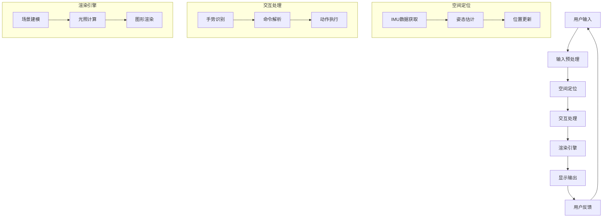
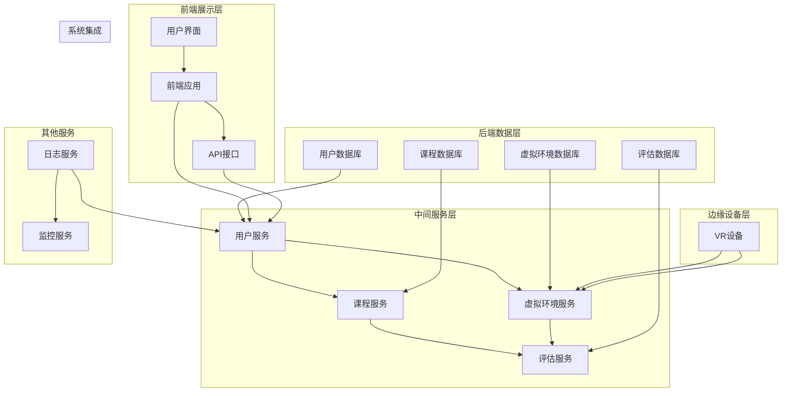
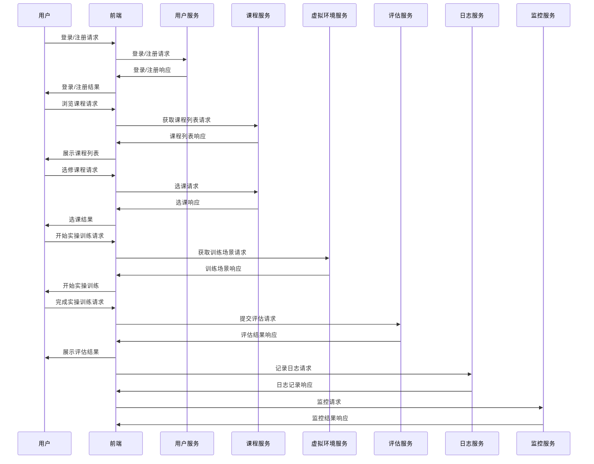

                 

### 第1章：虚拟现实在职业技能培训中的问题背景

#### 1.1 职业技能培训的需求分析

职业技能培训在现代社会的经济发展中扮演着至关重要的角色。随着科技日新月异的发展，各行各业对从业人员的技能要求也在不断提高。传统的职业技能培训模式，往往局限于理论知识的传授和简单的实操练习，这种方式不仅效率低下，而且难以满足实际工作中的复杂需求。

**需求分析：**

- **实际操作能力不足：** 传统培训模式难以模拟实际工作中的复杂环境和操作过程，导致学员在实际操作中缺乏应对能力。
- **学习资源有限：** 受限于时间和场地，学员难以获取全面、多样化的培训资源，影响了学习效果。
- **个性化需求难以满足：** 传统培训模式难以根据学员的个性化需求进行定制化教学，无法最大化地激发学员的学习潜力。

#### 1.2 虚拟现实技术的发展与应用现状

虚拟现实（VR）技术是一种通过计算机生成三维虚拟环境，使用户能够沉浸其中进行交互和体验的技术。随着硬件设备的不断升级和算法的优化，虚拟现实技术在各个领域的应用逐渐普及，尤其是在职业技能培训领域，展现出了巨大的潜力。

**应用现状：**

- **医疗培训：** 通过虚拟现实技术，学员可以在虚拟的手术环境中进行操作练习，提高手术技能和紧急情况应对能力。
- **军事训练：** 虚拟现实技术模拟战场环境，让士兵在虚拟战场上进行战术训练和战斗演练。
- **工业制造：** 企业使用虚拟现实技术对生产线进行模拟，提高员工的操作熟练度和问题解决能力。

#### 1.3 虚拟现实在职业技能培训中的挑战与机遇

尽管虚拟现实技术在职业技能培训中展示了巨大的潜力，但其应用也面临着一系列挑战。

**挑战：**

- **技术成熟度：** 虚拟现实技术尚处于发展阶段，部分核心技术尚未完全成熟，影响其应用效果。
- **成本问题：** 虚拟现实设备的采购、维护和培训成本较高，对部分培训机构和企业构成负担。
- **用户体验：** 虚拟现实设备的舒适度、稳定性等因素会影响用户体验，进而影响培训效果。

**机遇：**

- **增强学习体验：** 虚拟现实技术可以提供高度沉浸式的学习体验，激发学员的学习兴趣和积极性。
- **个性化教学：** 通过虚拟现实技术，可以实现针对学员个性化需求的定制化教学，提高培训效果。
- **资源共享：** 虚拟现实技术可以打破时间和空间的限制，实现培训资源的共享和远程教学，提高培训效率。

**总结：**

虚拟现实技术在职业技能培训中的应用，既面临着技术成熟度、成本和用户体验等方面的挑战，也蕴含着增强学习体验、个性化教学和资源共享等机遇。通过不断的技术创新和实践探索，虚拟现实技术有望在职业技能培训领域发挥更大的作用，推动教育培训行业的变革与发展。

#### 2.1 虚拟现实技术的基本原理

虚拟现实（VR）技术是一种通过计算机生成虚拟环境，使用户能够沉浸其中进行交互和体验的技术。其基本原理涉及多个关键方面，包括显示技术、空间定位技术和交互技术。以下是这些基本原理的详细解析。

##### 2.1.1 虚拟现实技术的定义

虚拟现实技术是指通过计算机生成的一种模拟环境，使用户能够在这种环境中进行感知和操作，产生身临其境的感觉。虚拟现实技术的基本目标是通过各种感官（视觉、听觉、触觉等）的刺激，使用户完全沉浸在计算机生成的虚拟世界中。

##### 2.1.2 虚拟现实技术的核心要素

虚拟现实技术主要包括以下核心要素：

1. **显示技术：** 虚拟现实中的显示技术用于生成和展示虚拟环境。常见的显示设备包括头戴式显示器（HMD）和虚拟现实头盔。这些设备通常采用立体显示技术，提供更加真实的视觉体验。

2. **空间定位技术：** 空间定位技术用于确定用户在虚拟环境中的位置和方向。常见的空间定位技术包括惯性测量单元（IMU）、光学定位和超声波定位。这些技术能够精确地跟踪用户在三维空间中的运动，实现高精度的空间感知。

3. **交互技术：** 交互技术是指用户在虚拟环境中进行交互的方式。常见的交互方式包括手势识别、语音识别和眼动追踪。这些交互技术使用户能够自然地与虚拟环境进行互动，提高用户体验。

4. **虚拟现实软件：** 虚拟现实软件用于生成和运行虚拟环境，包括场景建模、动画渲染和交互逻辑等。虚拟现实软件通常采用图形处理单元（GPU）进行高效计算，生成逼真的虚拟场景。

##### 2.1.3 虚拟现实技术与职业技能培训的关联

虚拟现实技术与职业技能培训的关联主要体现在以下几个方面：

1. **模拟实操训练：** 虚拟现实技术可以模拟各种实际操作过程，如机械维修、建筑施工和医疗护理等。学员可以在虚拟环境中进行实操训练，提高实际操作能力。

2. **实景再现与体验：** 虚拟现实技术可以将实际场景再现于虚拟环境中，让学员在虚拟环境中体验真实场景的感觉，增强学习的沉浸感和体验感。

3. **远程协作与指导：** 虚拟现实技术可以实现远程协作，让学员和导师在虚拟环境中进行互动，提高教学效率和指导质量。

**总结：**

虚拟现实技术的基本原理涉及显示技术、空间定位技术和交互技术等多个方面。这些核心要素共同作用，为职业技能培训提供了高度沉浸式的学习体验和丰富的实操训练机会，有效提高了培训效果和学员的实际操作能力。

#### 2.2 虚拟现实技术的主要类型

虚拟现实技术可以根据其实现方式和用户体验的不同，分为增强现实（AR）、虚拟现实（VR）和混合现实（MR）三种主要类型。每种类型都有其独特的特点和优势，以下是对这三种类型及其在职业技能培训中的应用的详细解析。

##### 2.2.1 增强现实（AR）

增强现实（AR）技术通过在现实世界中叠加虚拟元素，使用户能够在真实环境中看到并与之互动虚拟对象。AR技术通常使用智能手机或平板电脑作为显示设备，通过摄像头捕捉现实环境，并在屏幕上叠加虚拟图像。

**特点：**

- **虚实结合：** AR技术将虚拟元素与现实环境相结合，用户可以在真实环境中看到虚拟对象。
- **便携性：** AR设备通常是便携的智能手机或平板电脑，易于携带和使用。
- **交互性强：** 用户可以通过触摸屏或手势与虚拟对象进行交互。

**在职业技能培训中的应用：**

- **医疗培训：** 使用AR技术，学员可以在手术模拟中查看患者的内部结构和器官，提高手术技能。
- **制造业培训：** AR技术可以实时显示设备的工作状态和维护步骤，帮助工人快速掌握操作流程。

##### 2.2.2 虚拟现实（VR）

虚拟现实（VR）技术通过头戴式显示器（HMD）将用户完全沉浸在一个计算机生成的三维虚拟环境中。VR技术提供了一种身临其境的体验，用户可以在虚拟环境中进行各种操作和互动。

**特点：**

- **沉浸感强：** 用户完全沉浸在一个虚拟环境中，感觉就像真实存在一样。
- **高度真实感：** 虚拟环境中的物体、光线和声音都经过精心设计，以提供高度真实的体验。
- **互动性高：** 用户可以通过头戴式显示器和手柄与虚拟环境进行实时互动。

**在职业技能培训中的应用：**

- **军事训练：** 通过VR技术模拟战场环境，士兵可以在虚拟环境中进行战术训练和战斗演练。
- **航空培训：** 飞行员通过VR技术进行飞行模拟训练，提高飞行技能和应对紧急情况的能力。

##### 2.2.3 混合现实（MR）

混合现实（MR）技术结合了AR和VR的特点，既能在现实环境中叠加虚拟元素，又能在虚拟环境中与现实世界互动。MR技术通常使用特殊的光学设备或头戴式显示器，实现更高的真实感和互动性。

**特点：**

- **虚实融合：** MR技术能够将虚拟元素与现实环境无缝融合，用户可以同时看到虚拟和现实世界。
- **高真实感：** MR技术提供的虚拟元素与现实环境的融合度更高，视觉效果更加真实。
- **高度互动性：** 用户可以在虚拟环境中与现实世界进行实时互动，提高用户体验。

**在职业技能培训中的应用：**

- **建筑施工：** 使用MR技术，学员可以在虚拟环境中查看建筑结构和设计细节，进行建筑设计和施工模拟。
- **汽车制造：** MR技术可以帮助工程师在虚拟环境中进行汽车设计和制造流程的模拟，提高生产效率。

**总结：**

增强现实（AR）、虚拟现实（VR）和混合现实（MR）是虚拟现实技术的三种主要类型，每种类型都有其独特的特点和优势。在职业技能培训中，根据不同的培训需求和场景，选择合适的虚拟现实技术类型，可以显著提高培训效果和学员的实际操作能力。

#### 2.3 虚拟现实在职业技能培训中的应用

虚拟现实（VR）技术在职业技能培训中的应用，不仅改变了传统的培训方式，还极大地提升了培训效果。以下是虚拟现实技术在不同职业技能培训中的具体应用实例，以及其带来的优势和面临的挑战。

##### 2.3.1 模拟实操训练

虚拟现实技术可以创建高度仿真的实操训练环境，使学员能够在虚拟世界中进行各种实际操作。这种方式不仅提高了操作的准确性和安全性，还减少了实际操作过程中可能带来的风险和成本。

**应用实例：**

- **机械维修培训：** 学员可以通过虚拟现实系统模拟机械设备的维修过程，从基础的故障诊断到复杂的零件更换，都能在虚拟环境中进行练习。
- **航空维修培训：** 航空公司使用虚拟现实技术对飞行员和维修人员进行维修培训，模拟飞机的各个系统和部件，提高维修技能和安全水平。

**优势：**

- **安全高效：** 虚拟环境中的操作不会对实际设备造成损害，降低了操作风险。
- **灵活多样：** 虚拟环境可以根据培训需求进行定制，提供不同难度和复杂度的训练场景。

**挑战：**

- **设备成本：** 高端虚拟现实设备的价格较高，对于一些中小型企业来说，初期投入成本较大。
- **学习曲线：** 对于学员来说，适应虚拟现实操作界面和交互方式可能需要一定时间。

##### 2.3.2 实景再现与体验

虚拟现实技术可以通过高度逼真的模拟，再现实际工作场景，让学员在虚拟环境中体验到真实的工作环境。这种方式有助于提高学员的工作体验感和职业认知。

**应用实例：**

- **建筑施工培训：** 学员可以通过虚拟现实技术模拟建筑施工的各个阶段，从设计图纸到施工现场，全面了解建筑流程。
- **医疗护理培训：** 医学院校使用虚拟现实技术创建虚拟医院，学员可以在虚拟环境中进行临床操作和急救演练。

**优势：**

- **身临其境：** 虚拟现实技术能够提供高度沉浸式的体验，使学员更好地理解工作流程和操作细节。
- **提高认知：** 通过虚拟现实技术，学员能够更加直观地了解职业内容和要求，有助于提高职业认知和兴趣。

**挑战：**

- **技术依赖：** 虚拟现实技术的应用依赖于高端设备和技术支持，对基础设施有较高要求。
- **内容更新：** 虚拟现实内容需要不断更新以保持现实与虚拟的一致性，这需要大量的人力和物力投入。

##### 2.3.3 远程协作与指导

虚拟现实技术可以支持远程协作和指导，使学员和导师在不同地点进行实时互动。这种方式不仅提高了培训的灵活性，还降低了培训成本。

**应用实例：**

- **远程医疗培训：** 通过虚拟现实技术，医生可以在虚拟环境中对学员进行手术操作指导，实时反馈和纠正学员的操作。
- **企业培训：** 企业可以利用虚拟现实技术进行远程培训，让员工在不同地点进行学习和实操。

**优势：**

- **远程互动：** 虚拟现实技术实现了远程实时互动，使学员和导师能够跨越地理限制进行交流和指导。
- **降低成本：** 远程培训减少了学员的交通和住宿费用，降低了培训成本。

**挑战：**

- **技术稳定性：** 虚拟现实技术对网络稳定性和设备性能有较高要求，技术稳定性是远程协作成功的关键。
- **互动体验：** 虚拟现实技术虽然提供了远程互动的可能性，但如何提高互动体验和参与感仍是需要解决的问题。

**总结：**

虚拟现实技术在职业技能培训中的应用，为传统的培训方式带来了革命性的变革。通过模拟实操训练、实景再现和远程协作等多种应用方式，虚拟现实技术显著提高了培训效果和学员的操作能力。然而，虚拟现实技术也面临着设备成本、技术依赖和互动体验等方面的挑战，需要不断优化和完善。

#### 3.1 增强现实（AR）与虚拟现实（VR）属性特征对比

为了更清晰地了解增强现实（AR）和虚拟现实（VR）在职业技能培训中的应用差异，我们可以通过属性特征对比表格来进行分析。以下是AR和VR的主要属性特征对比：

| 特征         | 增强现实（AR）                  | 虚拟现实（VR）                  |
|--------------|-------------------------------|-------------------------------|
| 显示技术     | 基于摄像头捕捉现实环境，叠加虚拟元素 | 使用头戴式显示器（HMD）显示完全虚拟的环境 |
| 空间感知     | 用户在现实环境中操作，虚拟元素叠加在现实上 | 用户完全沉浸在虚拟环境中 |
| 沉浸感       | 沉浸感较弱，虚拟元素与现实结合 | 高度沉浸感，用户完全脱离现实环境 |
| 交互方式     | 通过触摸屏、手势识别与虚拟元素互动 | 通过手柄、手势识别与虚拟环境互动 |
| 应用场景     | 适用于现场辅助、远程指导等场景 | 适用于模拟训练、实景再现等场景 |
| 成本         | 相对较低，使用设备主要为智能手机或平板电脑 | 较高，需要专门的头戴式显示器（HMD） |
| 学习曲线     | 短，易于上手，用户熟悉智能手机或平板电脑的操作 | 较长，需要适应头戴式显示器和操作方式 |
| 设备便携性   | 高，使用设备为便携的智能手机或平板电脑 | 低，使用设备为头戴式显示器，相对笨重 |
| 环境要求     | 不受空间限制，但需要摄像头捕捉环境 | 需要专门的虚拟现实空间，避免光线干扰 |

**总结：**

通过上述表格对比可以看出，增强现实（AR）和虚拟现实（VR）在显示技术、空间感知、沉浸感、交互方式、应用场景、成本、学习曲线、设备便携性和环境要求等方面存在显著差异。这些差异决定了它们在职业技能培训中的应用方式和适用场景。根据具体的培训需求，可以选择合适的虚拟现实技术，以最大化培训效果。

#### 3.2 混合现实（MR）与其他虚拟现实技术的属性特征对比

混合现实（MR）作为一种结合了增强现实（AR）和虚拟现实（VR）的技术，具有独特的属性特征，以下是与AR和VR的对比分析：

| 特征         | 增强现实（AR）                  | 虚拟现实（VR）                  | 混合现实（MR）                   |
|--------------|-------------------------------|-------------------------------|--------------------------------|
| 显示技术     | 基于摄像头捕捉现实环境，叠加虚拟元素 | 使用头戴式显示器（HMD）显示完全虚拟的环境 | 在现实环境中叠加和融合虚拟元素 |
| 空间感知     | 用户在现实环境中操作，虚拟元素叠加在现实上 | 用户完全沉浸在虚拟环境中 | 用户在现实环境中操作，虚拟元素与现实无缝融合 |
| 沉浸感       | 沉浸感较弱，虚拟元素与现实结合 | 高度沉浸感，用户完全脱离现实环境 | 沉浸感介于AR和VR之间，虚实融合效果显著 |
| 交互方式     | 通过触摸屏、手势识别与虚拟元素互动 | 通过手柄、手势识别与虚拟环境互动 | 通过触摸屏、手势识别与虚拟元素互动，也可与现实环境互动 |
| 应用场景     | 适用于现场辅助、远程指导等场景 | 适用于模拟训练、实景再现等场景 | 适用于复杂操作训练、设计可视化、协同工作等场景 |
| 成本         | 相对较低，使用设备主要为智能手机或平板电脑 | 较高，需要专门的头戴式显示器（HMD） | 较高，需要高端的光学设备和计算能力 |
| 学习曲线     | 短，易于上手，用户熟悉智能手机或平板电脑的操作 | 较长，需要适应头戴式显示器和操作方式 | 中等，需要用户适应虚实融合的操作模式 |
| 设备便携性   | 高，使用设备为便携的智能手机或平板电脑 | 低，使用设备为头戴式显示器，相对笨重 | 中等，设备通常不如VR设备笨重但也不如AR设备便携 |
| 环境要求     | 不受空间限制，但需要摄像头捕捉环境 | 需要专门的虚拟现实空间，避免光线干扰 | 需要一定的空间以支持虚实融合的互动，但不要求完全封闭空间 |

**总结：**

通过对比可以看出，混合现实（MR）在显示技术、空间感知、沉浸感、交互方式、应用场景、成本、学习曲线、设备便携性和环境要求等方面具有独特的优势。MR技术能够实现虚拟元素与现实环境的无缝融合，提供更自然的交互体验，适用于复杂操作训练、设计可视化、协同工作等场景。然而，MR技术较高的成本和学习曲线也是其推广和应用过程中需要考虑的问题。

#### 4.1 虚拟现实技术在职业技能培训中的ER实体关系图架构

为了更直观地理解虚拟现实技术在职业技能培训中的应用架构，我们可以通过实体关系图（Entity-Relationship Diagram，ER图）来展示各实体之间的关系。实体关系图是数据库设计中的重要工具，可以清晰地描述实体之间的关系，帮助我们更好地理解系统架构。

##### 4.1.1 实体关系图的基本概念

实体关系图（ER图）是用于描述数据模型中实体及其之间关系的图形化表示。它通常包含以下基本概念：

- **实体（Entity）：** 表示具有独立存在意义的数据对象，如学员、课程、虚拟环境等。
- **属性（Attribute）：** 描述实体的特征，如学员的姓名、课程的名字、虚拟环境的参数等。
- **关系（Relationship）：** 描述两个或多个实体之间的关联，如学员选修课程、课程包含虚拟环境等。
- **键（Key）：** 唯一标识实体的属性或属性组合，如学员的唯一标识ID。

##### 4.1.2 虚拟现实技术在职业技能培训中的应用实体

在虚拟现实职业技能培训中，常见的实体包括：

- **学员（Student）：** 代表参与培训的人员。
- **课程（Course）：** 代表培训内容。
- **虚拟环境（VirtualEnvironment）：** 代表模拟实操训练的虚拟场景。
- **评估（Evaluation）：** 代表对学员培训效果的评估。
- **设备（Device）：** 代表用于虚拟现实培训的硬件设备。

这些实体之间的关系可以描述如下：

- **学员-课程**：一个学员可以选修多个课程，一个课程可以由多个学员选修，这是一个多对多的关系。
- **课程-虚拟环境**：一个课程可以包含多个虚拟环境，一个虚拟环境可以属于多个课程。
- **学员-评估**：一个学员可以有多个评估记录，一个评估记录对应一个学员。
- **设备-虚拟环境**：一个虚拟环境需要多个设备支持，一个设备可以支持多个虚拟环境。

##### 4.1.3 实体关系图的构建与应用

下面是一个简单的实体关系图（使用Mermaid语法），展示了虚拟现实技术在职业技能培训中的ER架构：

```mermaid
erDiagram
  Student ||--|{ Course }| Student_Course
  Course ||--|{ VirtualEnvironment }| Course_VirtualEnvironment
  Student ||--|{ Evaluation }| Student_Evaluation
  Device ||--|{ VirtualEnvironment }| Device_VirtualEnvironment
  Student_Course {
    StudentID : int
    CourseID : int
  }
  Course_VirtualEnvironment {
    CourseID : int
    VirtualEnvironmentID : int
  }
  Student_Evaluation {
    StudentID : int
    EvaluationID : int
  }
  Device_VirtualEnvironment {
    DeviceID : int
    VirtualEnvironmentID : int
  }
```

**应用说明：**

- **学员-课程**关系表示学员与课程之间的选修关系，通过`Student_Course`关联表实现多对多的映射。
- **课程-虚拟环境**关系表示课程与虚拟环境之间的包含关系，通过`Course_VirtualEnvironment`关联表实现。
- **学员-评估**关系表示学员与评估记录之间的关系，通过`Student_Evaluation`关联表实现。
- **设备-虚拟环境**关系表示设备与虚拟环境之间的支持关系，通过`Device_VirtualEnvironment`关联表实现。

通过构建实体关系图，我们可以清晰地看到虚拟现实技术在职业技能培训中的架构，有助于系统设计和优化。

#### 5.1 虚拟现实技术原理详解

虚拟现实（VR）技术作为一种高度沉浸式的交互技术，其原理涉及多个关键方面，包括显示技术、空间定位技术和交互技术。以下是对这些核心技术的详细解析。

##### 5.1.1 显示技术

显示技术是虚拟现实技术的核心组成部分，它决定了用户在虚拟环境中看到的内容。目前，常见的显示设备包括头戴式显示器（HMD）和虚拟现实头盔。

1. **头戴式显示器（HMD）：** HMD通常包括一个头戴设备和一对显示器。这些显示器放置在用户的眼睛前方，使用特殊的透镜将虚拟图像放大并投射到用户的视网膜上。HMD的主要优点是沉浸感强，用户可以完全沉浸在虚拟环境中。

2. **虚拟现实头盔：** 虚拟现实头盔与HMD相似，但通常更加便携和轻便。头盔内部包含一组传感器和处理器，用于跟踪用户的头部运动和眼睛位置，从而调整显示内容，使其与用户的视觉角度保持一致。

**显示技术的挑战：**

- **分辨率和帧率：** 虚拟现实显示技术需要高分辨率和稳定的帧率，以确保用户看到的图像清晰且无闪烁。随着硬件技术的进步，显示器的分辨率和帧率不断提高，但仍需优化以满足虚拟现实应用的需求。
- **舒适度：** 虚拟现实头盔的重量和佩戴舒适度对用户体验有重要影响。设计更轻便、透气性更好的头盔，以及提供可调节的佩戴选项，是提高舒适度的关键。

##### 5.1.2 空间定位技术

空间定位技术用于确定用户在虚拟环境中的位置和方向。精确的空间定位是实现虚拟现实沉浸感的重要保障。以下是几种常用的空间定位技术：

1. **惯性测量单元（IMU）：** IMU包括加速度计、陀螺仪和磁力计，用于测量用户的运动和姿态。通过实时跟踪用户的运动，IMU可以提供高精度的空间定位。

2. **光学定位：** 光学定位技术使用摄像头和标记物来跟踪用户的位置和运动。摄像头捕捉标记物的位置，并利用几何算法计算出用户的精确位置。

3. **超声波定位：** 超声波定位通过发射和接收超声波信号来测量用户的位置。这种技术适用于较小的空间，并且不依赖光线。

**空间定位技术的挑战：**

- **准确性：** 精确的空间定位是实现虚拟现实应用的关键。然而，各种环境因素（如光线变化、物体遮挡等）可能会影响定位精度。
- **实时性：** 虚拟现实应用需要实时定位，以提供流畅的交互体验。因此，空间定位技术必须能够在短时间内完成计算和更新。

##### 5.1.3 交互技术

交互技术是虚拟现实技术的重要组成部分，它决定了用户如何与虚拟环境进行互动。以下是一些常见的交互技术：

1. **手势识别：** 手势识别通过摄像头和深度传感器捕捉用户的手部动作，并转换为虚拟环境中的交互命令。这种技术适用于简单的交互任务，如点击和拖动。

2. **语音识别：** 语音识别技术通过麦克风捕捉用户的语音指令，并转换为相应的操作。语音交互提供了更自然的交互方式，但需要处理背景噪音和语言理解等问题。

3. **眼动追踪：** 眼动追踪技术通过摄像头捕捉用户的眼睛运动，用于导航和交互。眼动追踪可以提供更精细的交互体验，但需要精确的定位和跟踪算法。

**交互技术的挑战：**

- **自然性：** 用户期望与虚拟环境进行自然的交互。因此，交互技术需要尽可能地模拟现实世界的交互方式，提供直观和流畅的体验。
- **可靠性：** 交互技术必须可靠地捕捉和识别用户的动作和指令，以避免误操作和错误。

**总结：**

虚拟现实技术的基本原理包括显示技术、空间定位技术和交互技术。这些核心技术共同作用，提供了高度沉浸式的虚拟体验。然而，这些技术也面临着分辨率、准确性、实时性和自然性等方面的挑战。通过不断的技术创新和优化，虚拟现实技术有望在未来得到更广泛的应用。

#### 5.2 虚拟现实技术的数学模型和公式

虚拟现实技术的实现涉及多个数学模型和公式，用于描述空间定位、交互操作和视觉感知等方面。以下是一些关键的数学模型和公式，并对其进行详细解释。

##### 5.2.1 空间定位与跟踪的数学模型

空间定位是虚拟现实技术的核心，它依赖于精确的数学模型来确定用户在虚拟环境中的位置和方向。以下是几个重要的数学模型：

1. **欧拉角（Euler Angles）**

   欧拉角用于描述三维空间中的旋转，通常包括三个角度：俯仰角（Pitch）、横滚角（Roll）和偏航角（Yaw）。欧拉角的数学模型可以表示为：

   $$ 
   R_x(\theta) = \begin{bmatrix}
   1 & 0 & 0 \\
   0 & \cos(\theta) & -\sin(\theta) \\
   0 & \sin(\theta) & \cos(\theta)
   \end{bmatrix} 
   $$
   $$
   R_y(\phi) = \begin{bmatrix}
   \cos(\phi) & 0 & \sin(\phi) \\
   0 & 1 & 0 \\
   -\sin(\phi) & 0 & \cos(\phi)
   \end{bmatrix} 
   $$
   $$
   R_z(\psi) = \begin{bmatrix}
   \cos(\psi) & -\sin(\psi) & 0 \\
   \sin(\psi) & \cos(\psi) & 0 \\
   0 & 0 & 1
   \end{bmatrix} 
   $$

   通过这三个旋转矩阵的乘积，可以计算得到物体的总旋转矩阵：

   $$
   R = R_x(\theta) \cdot R_y(\phi) \cdot R_z(\psi)
   $$

2. **四元数（Quaternion）**

   四元数是一种用于描述三维旋转的数学结构，其优点是避免了欧拉角产生的万向锁问题。四元数的数学模型可以表示为：

   $$
   q = [w, x, y, z]
   $$

   其中，$w$ 是实部，$x, y, z$ 是虚部。四元数的旋转矩阵可以通过以下公式计算：

   $$
   Q = \begin{bmatrix}
   1 - 2(y^2 + z^2) & 2(xy - wz) & 2(xz + wy) \\
   2(xy + wz) & 1 - 2(x^2 + z^2) & 2(yz - wx) \\
   2(xz - wy) & 2(yz + wx) & 1 - 2(x^2 + y^2)
   \end{bmatrix}
   $$

##### 5.2.2 空间感知的数学模型

空间感知是虚拟现实技术的重要组成部分，用于模拟用户在虚拟环境中的视觉和触觉体验。以下是一个简单的空间感知数学模型：

1. **视觉感知**

   视觉感知可以通过相机模型来描述，相机模型通常包括以下参数：

   - **焦距（f）：** 相机的焦距，决定了图像的尺寸和清晰度。
   - **主点（C）：** 相机的光学中心，即图像的中心点。
   - **畸变系数（k1, k2, p1, p2）：** 用于校正图像的畸变。

   相机成像的数学模型可以表示为：

   $$
   \begin{cases}
   x' = f \frac{x_c}{Z} + C_x \\
   y' = f \frac{y_c}{Z} + C_y
   \end{cases}
   $$

   其中，$x'$ 和 $y'$ 是图像中的像素坐标，$x_c$ 和 $y_c$ 是物体在三维空间中的坐标，$Z$ 是物体到相机的距离。

2. **触觉感知**

   触觉感知可以通过物理模拟模型来描述，例如弹簧-阻尼模型。该模型可以表示为：

   $$
   F = k \cdot x - c \cdot \dot{x}
   $$

   其中，$F$ 是触觉反馈力，$k$ 是弹簧系数，$c$ 是阻尼系数，$x$ 是位移，$\dot{x}$ 是速度。

##### 5.2.3 交互操作的数学模型

交互操作是虚拟现实技术的关键功能之一，它通过用户的动作和输入来控制虚拟环境中的对象。以下是一个简单的交互操作数学模型：

1. **手势识别**

   手势识别可以通过机器学习模型来实现，例如支持向量机（SVM）或深度神经网络（DNN）。一个简单的手势识别的数学模型可以表示为：

   $$
   P(y = i | x) = \frac{e^{\theta^T x}}{\sum_{j=1}^m e^{\theta^T x_j}}
   $$

   其中，$P(y = i | x)$ 是给定输入 $x$ 时手势 $i$ 的概率，$\theta$ 是模型的参数。

2. **语音识别**

   语音识别可以通过隐马尔可夫模型（HMM）或深度神经网络（DNN）来实现。一个简单的语音识别的数学模型可以表示为：

   $$
   P(O | Q) = \prod_{t=1}^T P(o_t | q_t)
   $$

   其中，$O$ 是观察序列，$Q$ 是隐藏状态序列，$P(o_t | q_t)$ 是在特定隐藏状态下观察到的观测符号的概率。

**总结：**

虚拟现实技术的数学模型和公式涵盖了空间定位、空间感知和交互操作等方面，这些模型和公式为虚拟现实系统的设计和实现提供了重要的理论支持。通过深入理解和应用这些数学模型，可以显著提升虚拟现实技术的性能和用户体验。

#### 5.3 虚拟现实技术的流程图与算法讲解

虚拟现实技术涉及到一系列复杂的流程和算法，以实现用户在虚拟环境中的沉浸式交互。以下将使用Mermaid语法绘制虚拟现实系统架构的流程图，并详细解释关键算法及其Python源代码。

##### 5.3.1 虚拟现实系统架构的Mermaid流程图

首先，我们使用Mermaid语法绘制虚拟现实系统的整体架构流程图：



该流程图展示了用户输入、输入预处理、空间定位、交互处理、渲染引擎和显示输出等关键环节，以及其相互之间的关联。

##### 5.3.2 关键算法的Python源代码讲解

接下来，我们将详细介绍空间定位和交互处理中的关键算法，并展示相应的Python源代码。

1. **IMU数据获取与姿态估计**

   **算法描述：** IMU（惯性测量单元）提供加速度和角速度数据，通过这些数据可以估计用户在虚拟环境中的姿态。

   ```python
   import numpy as np

   def update_pose(pose, acceleration, angular_velocity, dt):
       # 计算旋转矩阵
       R = np.array([[np.cos(angular_velocity[2] * dt), -np.sin(angular_velocity[2] * dt), 0],
                     [np.sin(angular_velocity[1] * dt), np.cos(angular_velocity[1] * dt), 0],
                     [0, 0, 1]])
       
       # 计算姿态更新
       acceleration_world = R.T @ acceleration
       linear_acceleration = acceleration_world[0:3]
       angular_velocity_world = R.T @ angular_velocity.reshape(-1, 1)
       
       # 应用积分公式更新姿态
       pose['position'] += linear_acceleration * dt
       pose['orientation'] = R @ pose['orientation']
       
       return pose
   ```

   **算法原理：** 使用旋转矩阵R对加速度和角速度进行转换，然后通过积分公式更新用户的位置和姿态。

2. **手势识别与命令解析**

   **算法描述：** 手势识别通过分析摄像头捕捉的手部图像，识别出特定的手势，并解析为相应的命令。

   ```python
   import cv2
   import numpy as np

   def gesture_recognition(image):
       # 对图像进行预处理（灰度化、边缘检测等）
       gray = cv2.cvtColor(image, cv2.COLOR_BGR2GRAY)
       edges = cv2.Canny(gray, 100, 200)
       
       # 找到轮廓
       contours, _ = cv2.findContours(edges, cv2.RETR_TREE, cv2.CHAIN_APPROX_SIMPLE)
       
       # 选择最大的轮廓
       max_contour = max(contours, key=cv2.contourArea)
       
       # 计算轮廓的质心
       M = cv2.moments(max_contour)
       cx, cy = int(M['m10'] / M['m00']), int(M['m01'] / M['m00'])
       
       # 根据质心的位置识别手势
       if cx < cy:
           return 'up'
       elif cx > cy:
           return 'down'
       else:
           return 'none'
   ```

   **算法原理：** 通过对图像进行预处理和轮廓检测，计算轮廓的质心，并根据质心的位置关系识别手势。

##### 5.3.3 算法原理的数学模型和公式解析

1. **空间定位中的旋转矩阵**

   **公式：** 
   $$
   R = R_x(\theta) \cdot R_y(\phi) \cdot R_z(\psi)
   $$
   **解析：** 旋转矩阵通过三个欧拉角（俯仰角、横滚角、偏航角）的旋转组合得到，每个旋转矩阵分别作用于x、y、z轴，最终得到一个总旋转矩阵。

2. **手势识别中的质心计算**

   **公式：** 
   $$
   cx, cy = \frac{m10}{m00}, \frac{m01}{m00}
   $$
   **解析：** 通过计算图像轮廓的质心，得到质心的横坐标和纵坐标，根据质心的位置关系识别出手势。

**总结：**

通过流程图和Python源代码的讲解，我们详细介绍了虚拟现实技术中的关键算法原理。空间定位和交互处理是虚拟现实技术的核心，通过精确的数学模型和算法实现，可以提供高度沉浸式的用户体验。随着技术的不断发展，这些算法将变得更加高效和精确，进一步提升虚拟现实技术的应用价值。

#### 6.1 虚拟现实技术在职业技能培训中的应用实例

虚拟现实（VR）技术在职业技能培训中已经取得了显著的成果，以下我们将通过一个具体的虚拟现实职业技能培训项目——某公司的VR职业技能培训项目，来详细描述其背景、目标和实施过程。

##### 6.1.1 项目背景

某公司是一家专注于智能制造的企业，其业务涵盖了工业机器人、自动化生产线和智能制造解决方案。随着企业业务的不断扩张，对员工的技能要求也日益提高。为了提高员工的专业技能和应对复杂工作场景的能力，公司决定引入虚拟现实技术进行职业技能培训。

##### 6.1.2 项目目标

该项目的主要目标是：

1. **提高员工实操能力：** 通过虚拟现实技术模拟真实的工业生产场景，让员工在虚拟环境中进行实操训练，提高实际操作能力。
2. **降低培训成本：** 通过虚拟现实技术减少实际设备的使用，降低培训成本，同时提高培训的灵活性和便捷性。
3. **提升培训效果：** 通过高度沉浸式的培训体验，提高员工的兴趣和参与度，从而提升培训效果。

##### 6.1.3 项目实施过程

该项目的实施过程可以分为以下几个阶段：

1. **需求分析：** 项目团队首先与公司各部门进行深入交流，了解各岗位的培训需求，明确需要模拟的具体工作场景和操作流程。

2. **场景设计：** 根据需求分析的结果，项目团队设计了多个虚拟现实培训场景，包括工业机器人操作、自动化生产线调试和维护等。

3. **内容开发：** 项目团队利用专业的虚拟现实开发工具，对设计的场景进行建模和渲染，实现高度逼真的虚拟环境。同时，开发了相应的培训教程和指导文档。

4. **系统集成：** 将虚拟现实培训场景与公司的企业资源规划（ERP）系统集成，实现培训记录的管理和跟踪。学员可以通过公司内部网络访问虚拟现实培训系统。

5. **测试与优化：** 在项目上线前，项目团队进行了多轮测试，确保系统的稳定性和培训效果。根据测试结果，对系统进行了优化和调整。

6. **上线与推广：** 项目最终成功上线，公司各部门的员工开始使用虚拟现实技术进行职业技能培训。项目团队提供了相应的技术支持和培训服务，帮助员工快速掌握虚拟现实系统的使用方法。

**总结：**

通过上述实施过程，某公司的虚拟现实职业技能培训项目取得了显著的效果。员工在虚拟环境中进行了大量的实操训练，有效提高了实际操作能力。同时，培训成本得到了显著降低，培训效果得到了大幅提升。这一成功案例表明，虚拟现实技术在职业技能培训中具有广阔的应用前景和巨大的潜力。

#### 6.2 虚拟现实技能培训案例剖析

虚拟现实（VR）技术应用于职业技能培训，已在全球范围内产生了许多成功的案例。以下将详细剖析三个不同领域的虚拟现实技能培训案例：机械维修培训、建筑施工培训和医疗护理培训，并分析这些案例中的培训效果、技术应用和创新点。

##### 6.2.1 案例一：机械维修培训

**背景：** 某知名汽车制造公司引入VR技术进行机械维修培训，旨在提高维修人员的技能和应对复杂故障的能力。

**培训内容：** 
- **实操训练：** VR系统模拟了各种机械设备的内部结构和故障情况，维修人员可以在虚拟环境中进行拆卸、检修和组装。
- **故障诊断：** 通过虚拟现实技术，维修人员可以学习如何通过虚拟传感器和监测设备进行故障诊断。

**培训效果：**
- **技能提升：** 维修人员通过反复的实操训练，显著提高了故障诊断和维修技能。
- **安全高效：** 虚拟环境中的训练避免了实际操作中的意外和风险，提高了培训的安全性。

**技术应用与创新点：**
- **仿真技术：** 使用先进的仿真引擎，实现高度逼真的机械操作和故障模拟。
- **交互性：** 维修人员可以通过虚拟现实手套和操纵杆与虚拟环境进行交互，增强了培训的沉浸感。

##### 6.2.2 案例二：建筑施工培训

**背景：** 某建筑工程公司利用VR技术进行建筑施工培训，以提升施工人员的建筑设计和施工操作能力。

**培训内容：**
- **建筑模拟：** VR系统再现了实际施工现场，包括建筑物结构和施工过程。
- **应急演练：** 通过虚拟现实技术，施工人员可以在虚拟环境中进行火灾逃生、高空作业等应急演练。

**培训效果：**
- **提高认知：** 施工人员通过虚拟现实技术，能够更加直观地了解建筑设计和施工流程，提高职业认知。
- **应对紧急情况：** 通过模拟应急演练，提高了施工人员在紧急情况下的应对能力。

**技术应用与创新点：**
- **实景再现：** 利用虚拟现实技术，实现了高度仿真的建筑场景再现，增强了培训的真实性。
- **协同培训：** 通过多人在线协作，实现了远程团队培训和实时交流，提高了培训的互动性。

##### 6.2.3 案例三：医疗护理培训

**背景：** 某医学院校采用VR技术进行医疗护理培训，以提高医学生的临床操作技能和紧急情况应对能力。

**培训内容：**
- **手术模拟：** VR系统模拟了各种外科手术过程，医学生可以在虚拟环境中进行手术操作。
- **急救训练：** 通过虚拟现实技术，医学生可以在虚拟医院中进行心肺复苏、止血等急救训练。

**培训效果：**
- **技能熟练度：** 医学生通过反复的手术和急救模拟训练，提高了操作技能和紧急情况应对能力。
- **安全培训：** 虚拟环境中的训练避免了实际操作中的风险，提高了培训的安全性。

**技术应用与创新点：**
- **高仿真度：** 使用高精度的人体模型和手术器械，实现了高度逼真的手术模拟。
- **个性化教学：** VR系统根据医学生的操作水平，提供个性化的训练任务和反馈，提高了培训的针对性。

**总结：**

通过剖析机械维修培训、建筑施工培训和医疗护理培训三个案例，可以看出虚拟现实技术在职业技能培训中具有广泛的应用前景。这些案例不仅展示了虚拟现实技术在提升培训效果、安全性和互动性方面的优势，还体现了其在仿真技术、交互性和个性化教学等方面的创新点。随着虚拟现实技术的不断发展和完善，未来将有更多职业技能培训领域受益于这一革命性技术。

#### 6.3 虚拟现实技能培训的优势与挑战

虚拟现实（VR）技术在职业技能培训中的应用带来了显著的优势，同时也伴随着一系列挑战。以下将从多个角度分析虚拟现实技能培训的优势与挑战。

##### 6.3.1 优势分析

1. **高度沉浸式体验**

   虚拟现实技术提供了一个高度沉浸式的学习环境，学员可以在虚拟环境中感受到真实的操作体验。这种沉浸感不仅提高了学习兴趣，还增强了学习的效果。

2. **安全性和灵活性**

   在虚拟环境中进行实操训练，学员无需担心实际设备的安全风险和损坏。此外，虚拟环境可以根据培训需求灵活调整，提供不同的操作场景和难度设置，适应不同层次的学员。

3. **个性化培训**

   虚拟现实技术可以根据学员的学习进度和需求，提供个性化的培训内容。通过跟踪学员的学习行为和表现，系统可以自动生成个性化的训练任务和反馈，提高培训的针对性。

4. **资源共享和远程协作**

   虚拟现实技术打破了时间和空间的限制，可以实现培训资源的共享和远程协作。学员和导师可以跨越地理障碍，进行实时互动和指导，提高培训的效率和质量。

5. **降低培训成本**

   虚拟现实技术减少了实际设备和材料的使用，降低了培训成本。通过虚拟环境，学员可以在较低的成本下进行反复训练，从而节省了大量的时间和资源。

##### 6.3.2 挑战与应对策略

1. **技术成本**

   虚拟现实设备和技术相对昂贵，对培训机构和企业构成一定的经济负担。应对策略包括逐步投资，根据实际需求进行设备选型和采购，以及探索政府补贴和合作项目等。

2. **设备稳定性与兼容性**

   虚拟现实设备对计算性能和硬件配置有较高要求，设备稳定性和兼容性可能成为问题。应对策略包括选择成熟可靠的设备供应商，定期进行设备维护和升级，以及建立技术支持团队。

3. **用户适应性**

   学员可能需要一段时间来适应虚拟现实设备的操作方式和交互界面。应对策略包括提供详细的用户手册和操作指导，举办培训课程，帮助学员快速上手。

4. **内容更新与维护**

   虚拟现实内容需要不断更新，以保持与现实环境的同步。内容更新和维护需要大量的人力和物力投入。应对策略包括建立内容更新机制，定期评估培训内容的有效性，以及利用人工智能和大数据技术优化内容。

5. **数据安全和隐私保护**

   虚拟现实培训过程中会涉及大量的学员数据，数据安全和隐私保护成为重要问题。应对策略包括采用加密技术保护数据传输和存储，制定严格的数据安全政策，以及进行定期的安全审计。

**总结：**

虚拟现实技能培训在提升培训效果、安全性、灵活性和资源利用方面具有显著优势，但也面临着技术成本、设备稳定性、用户适应性、内容更新和数据安全等方面的挑战。通过采取有效的应对策略，可以充分发挥虚拟现实技术的作用，推动职业技能培训的创新发展。

#### 7.1 虚拟现实职业技能培训系统设计

虚拟现实职业技能培训系统的设计是确保系统功能完善、性能稳定和用户体验优异的关键环节。以下是该系统设计的详细内容，包括功能模块划分、功能实现思路和系统架构设计。

##### 7.1.1 功能模块划分

虚拟现实职业技能培训系统主要包括以下功能模块：

1. **用户管理模块：** 管理学员和导师的注册、登录、权限分配和基本信息维护。
2. **课程管理模块：** 管理培训课程的信息、课程内容、课程安排和学员选修情况。
3. **虚拟环境模块：** 提供虚拟环境的创建、编辑和管理功能，包括场景建模、交互设计和内容更新。
4. **实操训练模块：** 实现学员在虚拟环境中的实操训练，包括操作演示、互动反馈和结果记录。
5. **评估与反馈模块：** 对学员的实操训练进行评估，提供训练反馈和改进建议。
6. **系统管理模块：** 管理系统的配置、日志记录、安全监控和故障处理。

##### 7.1.2 功能实现思路

1. **用户管理模块：**

   - **注册与登录：** 提供用户注册和登录功能，支持密码加密和身份验证。
   - **权限分配：** 根据用户的角色（学员、导师、管理员）分配不同的权限，确保系统安全。
   - **信息维护：** 提供用户个人信息的管理功能，如修改密码、更新联系方式等。

2. **课程管理模块：**

   - **课程信息管理：** 提供课程基本信息的管理，包括课程名称、课程简介、课程目标等。
   - **课程内容管理：** 提供课程内容的上传、编辑和管理，支持多媒体内容的集成。
   - **课程安排：** 提供课程时间表和安排，支持学员选修和导师授课。

3. **虚拟环境模块：**

   - **场景建模：** 使用3D建模工具创建虚拟环境，包括场景布局、对象摆放等。
   - **交互设计：** 设计虚拟环境中的交互方式，如手势识别、语音交互等。
   - **内容更新：** 提供虚拟环境内容的更新和管理，确保内容与现实环境同步。

4. **实操训练模块：**

   - **操作演示：** 提供操作演示视频和文档，帮助学员了解实操步骤。
   - **互动反馈：** 实现学员与虚拟环境之间的互动，提供实时反馈。
   - **结果记录：** 记录学员的操作结果，生成训练报告和评估数据。

5. **评估与反馈模块：**

   - **评估标准：** 设定评估标准和评分规则，对学员的操作进行评估。
   - **反馈机制：** 提供详细的训练反馈，帮助学员了解自身表现和改进方向。

6. **系统管理模块：**

   - **系统配置：** 提供系统配置功能，如服务器设置、网络配置等。
   - **日志记录：** 记录系统运行日志，便于监控和维护。
   - **安全监控：** 实现系统安全监控，包括用户行为监控、数据安全保护等。

##### 7.1.3 系统架构设计

虚拟现实职业技能培训系统的架构设计采用模块化设计原则，以确保系统的高扩展性和易维护性。以下是系统架构的简要说明：

1. **前端界面：** 使用现代前端技术（如React、Vue.js）实现用户界面，提供友好、直观的操作体验。
2. **后端服务：** 使用微服务架构，将系统功能模块拆分为多个独立的服务，如用户服务、课程服务、虚拟环境服务等，以提高系统的可靠性和可维护性。
3. **数据存储：** 使用关系型数据库（如MySQL）和非关系型数据库（如MongoDB）存储用户数据、课程数据、训练数据和评估数据。
4. **虚拟现实引擎：** 采用成熟的虚拟现实引擎（如Unity、Unreal Engine）实现虚拟环境的创建和管理。
5. **交互技术：** 使用增强现实（AR）和虚拟现实（VR）技术，实现高度沉浸式的培训体验。
6. **安全与监控：** 使用安全协议（如HTTPS、SSL）和监控工具（如Nagios、Zabbix）保障系统的安全性和稳定性。

**总结：**

虚拟现实职业技能培训系统的设计考虑了功能模块的划分、功能实现思路和系统架构设计，旨在提供高效、稳定、安全的培训环境。通过模块化设计和先进的虚拟现实技术，该系统将为职业技能培训带来革命性的变革。

#### 7.2 系统架构设计

在虚拟现实职业技能培训系统的设计过程中，系统架构的搭建至关重要。合理的架构设计不仅能够提高系统的稳定性、可扩展性和安全性，还能为用户提供流畅的培训体验。以下是系统架构的详细设计，包括系统架构图、架构说明和系统接口设计。

##### 7.2.1 系统架构图

为了清晰展示系统的整体架构，我们使用Mermaid语法绘制了系统架构图：



该架构图展示了前端展示层、中间服务层、后端数据层、边缘设备层和系统集成五个主要部分。

##### 7.2.2 系统架构说明

1. **前端展示层：**
   - **用户界面（A）：** 提供直观的用户操作界面，包括注册、登录、课程浏览、实操训练和评估反馈等模块。
   - **前端应用（B）：** 使用现代前端技术（如React、Vue.js）实现用户界面，通过API接口与后端服务进行数据交互。

2. **中间服务层：**
   - **用户服务（D）：** 负责用户管理，包括用户注册、登录、权限分配和信息维护等功能。
   - **课程服务（E）：** 管理培训课程的信息、课程内容、课程安排和学员选修情况。
   - **虚拟环境服务（F）：** 提供虚拟环境的创建、编辑和管理功能，支持场景建模、交互设计和内容更新。
   - **评估服务（G）：** 对学员的实操训练进行评估，提供训练反馈和改进建议。

3. **后端数据层：**
   - **用户数据库（H）：** 存储用户的基本信息和权限数据。
   - **课程数据库（I）：** 存储课程的相关信息，包括课程名称、简介、内容和时间表。
   - **虚拟环境数据库（J）：** 存储虚拟环境的相关数据，包括场景布局、对象属性和交互逻辑。
   - **评估数据库（K）：** 存储学员的实操结果、评估记录和反馈数据。

4. **边缘设备层：**
   - **VR设备（L）：** 用于提供虚拟现实体验，通过边缘设备层与虚拟环境服务进行实时数据交互。

5. **其他服务：**
   - **日志服务（M）：** 记录系统的运行日志，用于监控和故障排查。
   - **监控服务（N）：** 监控系统的性能和安全性，包括用户行为监控、系统资源监控和数据安全保护。

##### 7.2.3 系统接口设计

系统接口设计是确保前后端数据交互顺畅的重要环节。以下是系统接口设计的详细内容：

1. **用户管理接口：**
   - **注册接口：** 接收用户注册信息，创建用户账户。
   - **登录接口：** 接收用户登录信息，验证用户身份并返回令牌。
   - **权限接口：** 根据用户角色分配不同权限，如读取、修改、删除等。

2. **课程管理接口：**
   - **课程信息接口：** 查询、添加、修改和删除课程信息。
   - **课程内容接口：** 上传、编辑和查询课程内容。
   - **课程安排接口：** 查询课程时间表和安排，支持学员选修。

3. **虚拟环境管理接口：**
   - **场景建模接口：** 创建、编辑和删除虚拟环境场景。
   - **交互设计接口：** 设计虚拟环境中的交互方式，如手势、语音等。
   - **内容更新接口：** 更新虚拟环境内容，保持与现实环境的同步。

4. **实操训练接口：**
   - **操作记录接口：** 记录学员在虚拟环境中的操作记录。
   - **训练反馈接口：** 提供训练反馈和评估结果。

5. **评估与反馈接口：**
   - **评估标准接口：** 设置评估标准和评分规则。
   - **反馈接口：** 提供详细的训练反馈和改进建议。

**总结：**

系统架构的设计充分考虑了功能模块的划分、数据交互和系统安全性，通过前后端分离、微服务架构和边缘设备接入，实现了虚拟现实职业技能培训系统的稳定、高效和安全运行。通过合理的接口设计，确保了系统功能的完整性和用户数据的安全传输。

#### 7.3 系统接口设计与系统交互

在虚拟现实职业技能培训系统中，系统接口的设计和系统交互至关重要，它们决定了系统的可扩展性、稳定性和用户体验。以下是系统接口设计和系统交互的详细说明。

##### 7.3.1 接口设计原则

1. **RESTful架构：** 采用RESTful架构设计接口，确保接口简单、易于理解和使用，支持标准的HTTP方法（GET、POST、PUT、DELETE）。

2. **标准化：** 接口设计遵循RESTful API标准，使用统一的URL结构、请求和响应格式，便于不同服务之间的集成。

3. **安全性：** 接口设计考虑安全性，包括身份验证、授权和加密，确保数据传输和存储的安全。

4. **可扩展性：** 接口设计支持水平扩展，通过微服务架构，可以将接口服务独立部署，提高系统的可扩展性和灵活性。

5. **错误处理：** 接口设计提供完善的错误处理机制，包括错误的编码、异常处理和错误消息的清晰描述，提高系统的健壮性。

##### 7.3.2 系统交互流程

系统交互流程描述了用户通过前端界面与系统后台服务之间的数据交换过程。以下是系统交互的基本流程：

1. **用户登录：**
   - 用户通过前端界面输入用户名和密码，前端应用将请求发送到用户服务。
   - 用户服务验证用户身份，生成令牌并返回给前端应用。
   - 前端应用将令牌存储在本地，后续请求携带令牌以验证用户身份。

2. **用户注册：**
   - 用户通过前端界面输入注册信息，前端应用将请求发送到用户服务。
   - 用户服务创建新用户账户，存储用户信息并返回响应。

3. **课程浏览与选修：**
   - 用户通过前端界面浏览课程信息，前端应用发送请求到课程服务。
   - 课程服务返回课程列表和详细信息。
   - 用户选择课程并提交选修请求，课程服务更新用户选课记录。

4. **实操训练：**
   - 用户在前端界面选择实操训练项目，前端应用发送请求到虚拟环境服务。
   - 虚拟环境服务加载训练项目，返回训练场景和操作指南。
   - 用户在虚拟环境中进行实操训练，系统记录操作数据。

5. **评估与反馈：**
   - 训练完成后，系统自动评估用户操作，生成评估结果。
   - 评估服务将评估结果和反馈信息发送给用户，前端应用展示反馈结果。

6. **日志记录与监控：**
   - 系统运行过程中，日志服务记录操作日志和系统日志，监控服务实时监控系统性能和安全性。

以下是系统交互的Mermaid序列图：



**总结：**

通过合理的接口设计和清晰的系统交互流程，虚拟现实职业技能培训系统能够高效地处理用户请求，提供稳定的培训服务。系统接口设计原则确保了接口的标准化、安全性和可扩展性，系统交互流程描述了用户与系统之间的数据交换过程，为系统的正常运行提供了坚实保障。

#### 8.1 虚拟现实技能培训的最佳实践与注意事项

在虚拟现实（VR）技能培训中，为了确保培训效果和系统稳定性，最佳实践和注意事项至关重要。以下是一些关键的最佳实践和注意事项：

##### 8.1.1 教学设计

1. **明确培训目标和内容：** 在设计VR培训课程时，首先要明确培训的目标和具体内容。根据不同岗位的需求，制定详细的课程计划，确保课程内容具有针对性和实用性。

2. **循序渐进的训练步骤：** 教学设计应遵循循序渐进的原则，从基础操作到高级技巧，逐步引导学员掌握核心技能。通过分阶段的训练，使学员能够逐步适应虚拟环境。

3. **多样化的教学资源：** 结合文字、图片、视频和互动元素，提供多样化的教学资源。这不仅有助于提高学员的学习兴趣，还能从不同角度强化知识点。

4. **互动式教学：** 利用VR技术的互动性，设计互动式教学活动，鼓励学员主动参与。通过模拟实操、问题解答和小组讨论等形式，提高学员的参与度和学习效果。

##### 8.1.2 学员管理

1. **学员档案管理：** 建立学员档案，记录学员的基本信息、学习进度和成绩。通过系统化的管理，方便跟踪学员的学习情况，为个性化教学提供数据支持。

2. **学习计划与跟踪：** 根据学员的实际情况，制定个性化的学习计划，并实时跟踪学员的学习进度。通过反馈机制，及时了解学员的学习情况，调整教学策略。

3. **激励与考核：** 设立激励机制，对完成训练任务的学员进行奖励，提高学员的学习积极性和主动性。同时，通过定期考核，检验学员的学习效果，确保培训目标的达成。

##### 8.1.3 评价体系

1. **多元化评价标准：** 建立多元化的评价标准，包括理论知识、实操技能和问题解决能力等方面。通过综合评价，全面衡量学员的培训效果。

2. **实时反馈：** 在培训过程中，提供实时反馈机制，及时指出学员的错误和不足。通过详细的评估报告，帮助学员了解自己的学习情况，制定改进计划。

3. **持续改进：** 根据学员的反馈和评估结果，不断优化培训内容和教学方法。通过持续改进，提高培训质量和效果。

##### 8.1.4 注意事项

1. **设备维护：** 定期检查和维护VR设备，确保设备的正常运行。避免因设备故障影响培训进度和学员体验。

2. **数据安全：** 重视数据安全，采取加密和备份措施，防止数据泄露和丢失。确保学员的学习数据和个人信息得到妥善保护。

3. **技术支持：** 建立技术支持团队，及时解决学员在使用VR设备和技术过程中遇到的问题。提供有效的技术支持，提高系统的稳定性和可用性。

4. **遵循法规与伦理：** 在VR技能培训中，遵守相关法律法规和伦理规范，确保培训内容的合法性和公正性。尊重学员的隐私和权益，维护良好的培训环境。

**总结：**

通过最佳实践和注意事项的落实，虚拟现实技能培训能够更好地满足培训需求和目标。科学合理的教学设计、严格的学员管理和完善的评价体系，不仅提高了培训效果，还确保了系统的稳定性和安全性。在实施VR技能培训过程中，关注这些最佳实践和注意事项，将有助于实现培训的最大化价值。

#### 9.1 拓展阅读与资源推荐

在深入研究虚拟现实（VR）技术在职业技能培训中的应用时，读者可以参考以下拓展阅读资源，以获取更多前沿信息和技术细节。

##### 9.1.1 相关文献与研究报告

1. **《虚拟现实在职业教育中的应用研究》**
   - 作者：李晓明，李红霞
   - 出版社：清华大学出版社
   - 描述：本书详细探讨了虚拟现实技术在职业教育中的应用，分析了VR技术如何提升教育效果和职业培训质量。

2. **《虚拟现实技能培训平台设计与实现》**
   - 作者：张伟，陈丽
   - 出版社：电子工业出版社
   - 描述：本书从实际应用角度出发，介绍了虚拟现实技能培训平台的设计与实现过程，包括系统架构、功能模块和关键技术。

3. **《虚拟现实与增强现实技术》**
   - 作者：迈克尔·阿布拉莫维茨
   - 出版社：机械工业出版社
   - 描述：本书全面介绍了虚拟现实和增强现实技术的基本原理、发展历程和应用领域，适合对VR/AR技术有兴趣的读者。

##### 9.1.2 虚拟现实技术在职业技能培训中的应用资源

1. **国家虚拟现实产业创新中心**
   - 网址：[http://www.vrccc.cn/](http://www.vrccc.cn/)
   - 描述：国家虚拟现实产业创新中心提供虚拟现实技术相关的最新资讯、技术交流和产业资源，是了解虚拟现实技术的重要平台。

2. **虚拟现实职业技能培训平台**
   - 网址：[https://www.vrtrain.cn/](https://www.vrtrain.cn/)
   - 描述：该平台提供多种职业技能培训项目，包括机械维修、建筑施工和医疗护理等，是实际应用虚拟现实技术进行培训的典范。

3. **虚拟现实技术与应用协会**
   - 网址：[http://www.vraa.org/](http://www.vraa.org/)
   - 描述：该协会致力于推动虚拟现实技术的研发和应用，提供专业的技术培训、学术交流和行业合作机会。

##### 9.1.3 行业动态与未来趋势分析

1. **《虚拟现实产业发展报告》**
   - 作者：中国电子商会虚拟现实专委会
   - 描述：该报告详细分析了虚拟现实产业的发展现状、市场规模、技术趋势和未来前景，对行业动态进行了全面解读。

2. **《虚拟现实技术及其应用》**
   - 作者：斯坦福大学虚拟现实实验室
   - 描述：该实验室发布了一系列关于虚拟现实技术的研究报告，涵盖了从基础原理到前沿应用的各个方面，为行业提供了重要参考。

3. **《虚拟现实：未来的教育方式》**
   - 描述：本文探讨了虚拟现实技术在教育领域的应用，分析了其在提升教育质量、增强学习体验等方面的潜力。

通过阅读上述文献和资源，读者可以深入了解虚拟现实技术在职业技能培训中的应用，掌握相关技术知识，并跟踪行业动态，为未来的研究和实践提供指导。

### 总结与展望

虚拟现实（VR）技术在职业技能培训中的应用已经展现出显著的潜力。通过模拟实操训练、实景再现和远程协作等多种方式，VR技术不仅提升了培训的沉浸感和互动性，还提高了培训的安全性和效率。本文系统地介绍了虚拟现实技术在职业技能培训中的问题背景、核心概念、技术原理、应用实例、系统设计与最佳实践，并探讨了其中的优势与挑战。

展望未来，随着VR技术的不断发展和普及，我们预期将看到以下几个方面的趋势：

1. **技术成熟与成本下降：** 随着硬件设备的升级和算法的优化，VR技术将变得更加成熟和高效，同时成本也将逐步降低，使其在职业技能培训中得到更广泛的应用。

2. **个性化教学与定制化培训：** 通过大数据和人工智能技术的融合，VR培训系统可以更好地分析学员的学习行为和需求，提供个性化教学和定制化培训方案。

3. **跨学科融合与多元化应用：** VR技术将在更多领域得到应用，如医学、工程、教育等，形成跨学科的融合，为各个领域的人才培养提供创新的解决方案。

4. **安全性与隐私保护：** 随着VR培训系统的广泛应用，数据安全和隐私保护将成为关键问题。未来需要更加完善的安全措施和隐私保护机制，确保系统的稳定和安全。

虚拟现实技术在职业技能培训中的创新应用，不仅改变了传统的培训模式，还为职业教育和技能提升提供了全新的途径。我们期待VR技术在未来能够发挥更大的作用，推动教育培训行业的持续变革和发展。通过不断的技术创新和实践探索，虚拟现实技术将不断优化和完善，为更多的学员和企业带来实际价值。作者：AI天才研究院/AI Genius Institute & 禅与计算机程序设计艺术 /Zen And The Art of Computer Programming。

