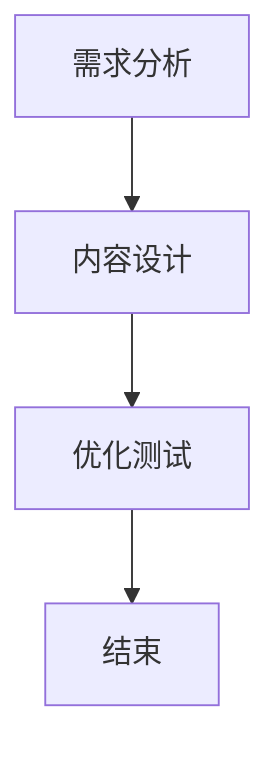
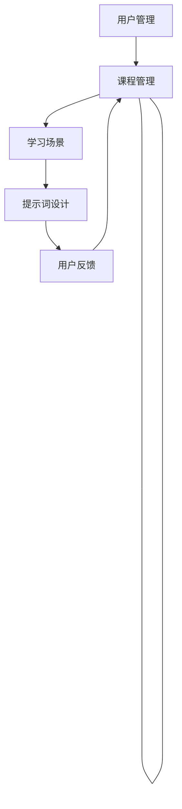
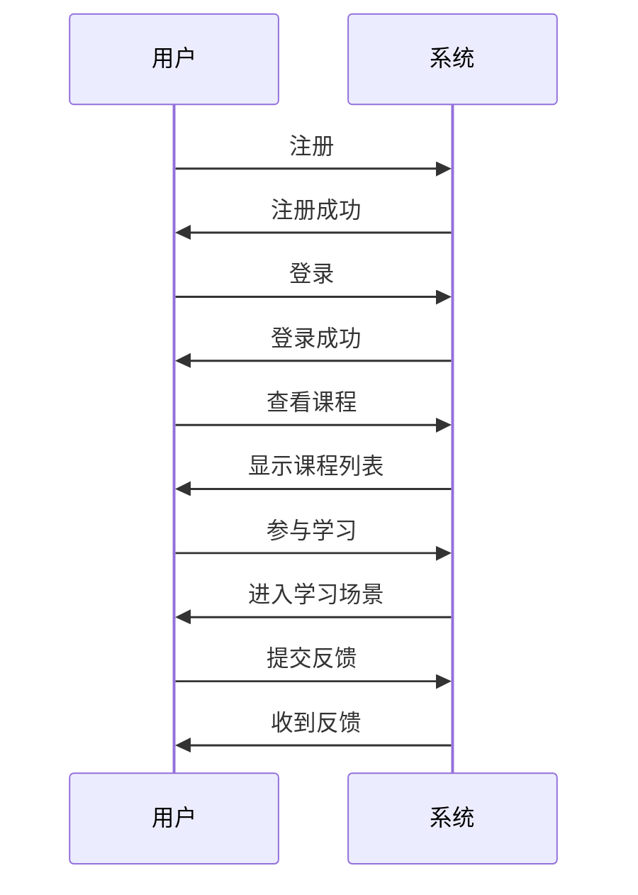

                 

### 虚拟现实教育：提示词设计沉浸式学习场景

> 关键词：虚拟现实教育，沉浸式学习，提示词设计，学习效果提升，VR教育应用

> 摘要：本文旨在探讨虚拟现实（VR）教育中提示词设计的重要性，分析提示词的设计原则、分类以及设计流程，并运用算法原理进行讲解。此外，还将介绍VR教育应用中的系统分析与架构设计方案，为提升学习效果提供有力支持。

## 第一部分：背景介绍

### 1.1 问题背景

虚拟现实（VR）技术的迅速发展，为教育领域带来了前所未有的机遇。VR教育不仅提供了丰富的学习资源，还能够通过沉浸式的学习场景提升学生的学习效果。然而，如何设计出有效的提示词来引导学生在VR学习环境中达到最佳的学习效果，成为了当前研究的热点问题。

在传统的教育模式中，学生往往需要依赖教师的讲解和教材的内容来获取知识。而在VR教育中，学生可以在虚拟环境中进行自主探索和学习，这要求提示词能够起到引导、提示和激励的作用，使学生能够更好地融入虚拟学习场景，主动参与学习过程。

### 1.2 问题描述

在VR教育中，提示词的设计至关重要。合适的提示词能够引导学生在虚拟环境中主动探索、积极参与，从而达到沉浸式学习的目的。然而，当前的研究和实践往往缺乏对提示词设计的系统性和科学性，导致VR教育效果不尽如人意。

具体而言，提示词设计存在的问题主要包括：1）提示词内容不够清晰，导致学生理解困难；2）提示词数量过多或过少，影响学习体验；3）提示词设计缺乏个性化，无法满足不同学生的学习需求。

### 1.3 问题解决

本书旨在通过深入研究虚拟现实教育中的提示词设计，提供一套科学、系统的提示词设计方法。通过分析提示词的设计原则、分类和实际应用，帮助教育工作者和开发者设计出更加有效的沉浸式学习场景。

### 1.4 边界与外延

本研究主要关注虚拟现实教育中的提示词设计，不涉及其他VR技术在教育中的应用。同时，本研究的主要对象为学习者在虚拟环境中的学习行为，而非虚拟环境的设计与开发。

### 1.5 概念结构与核心要素组成

#### 1.5.1 虚拟现实（VR）

虚拟现实是一种通过计算机技术模拟出来的三维虚拟环境，使人们能够在其中进行沉浸式的交互体验。

#### 1.5.2 提示词

提示词是指在虚拟环境中用于引导、提示用户进行操作或学习的文字或语音提示。

#### 1.5.3 沉浸式学习

沉浸式学习是一种利用虚拟现实技术创造的学习环境，使学生在其中能够全身心投入学习，提高学习效果。

## 第二部分：核心概念与联系

### 2.1 提示词设计原则

#### 2.1.1 清晰性

提示词应清晰明确，避免产生歧义或误导。这要求提示词的表达方式简洁易懂，尽量避免使用复杂的词汇和句式。

#### 2.1.2 适度性

提示词的数量和频率应适度，既不能过多干扰学习，也不能过少导致用户迷茫。在提示词设计时，需要根据学习场景和用户需求进行平衡。

#### 2.1.3 针对性

提示词应根据学习者的需求和特点进行个性化设计。不同学习者的认知水平和学习风格不同，提示词的设计需要考虑到这些差异。

### 2.2 提示词分类

#### 2.2.1 操作提示词

操作提示词用于指导用户在虚拟环境中的操作，如“请点击屏幕上的按钮”、“使用手柄进行旋转”。

#### 2.2.2 学习提示词

学习提示词用于引导用户进行学习活动，如“请观察这个物体”、“思考这个问题的答案”。

#### 2.2.3 互动提示词

互动提示词用于促进用户之间的互动和合作，如“和你的同学讨论这个问题”、“组队完成任务”。

### 2.3 提示词设计流程

#### 2.3.1 需求分析

明确用户需求，确定提示词的目标和功能。需求分析是提示词设计的起点，只有准确了解用户的需求，才能设计出满足用户需求的提示词。

#### 2.3.2 内容设计

根据需求分析，设计出具体的提示词内容。内容设计需要考虑提示词的清晰性、适度性和针对性，确保提示词能够有效引导用户。

#### 2.3.3 优化与测试

对设计的提示词进行优化和测试，确保其有效性和适用性。优化与测试过程可以通过用户反馈和数据分析来进行，不断调整和改进提示词设计。

## 第三部分：算法原理讲解

### 3.1 提示词设计算法

#### 3.1.1 算法描述

提示词设计算法主要包括需求分析、内容设计和优化测试三个步骤。

1. **需求分析**：通过对用户需求进行调研和分析，确定提示词的目标和功能。

2. **内容设计**：根据需求分析，设计出具体的提示词内容。这一步骤需要考虑提示词的清晰性、适度性和针对性。

3. **优化测试**：对设计的提示词进行优化和测试，确保其有效性和适用性。可以通过用户反馈和数据分析来不断调整和改进提示词设计。

#### 3.1.2 算法流程图

使用Mermaid绘制提示词设计算法的流程图，如下所示：



### 3.2 数学模型

#### 3.2.1 提示词生成模型

提示词生成模型可以使用深度学习中的序列生成模型，如生成对抗网络（GAN）或变分自编码器（VAE）。

1. **生成对抗网络（GAN）**

GAN由生成器（Generator）和判别器（Discriminator）两部分组成。生成器的任务是根据输入生成提示词，判别器的任务是判断输入的提示词是真实提示词还是生成器生成的提示词。通过训练，生成器不断优化生成的提示词，使其越来越接近真实提示词。

2. **变分自编码器（VAE）**

VAE是一种无监督学习模型，通过编码器（Encoder）和解码器（Decoder）两部分组成。编码器将输入的提示词编码为一个潜在空间中的向量，解码器根据这个向量生成提示词。通过训练，编码器和解码器不断优化，使得生成的提示词与输入的提示词越来越接近。

#### 3.2.2 数学公式

提示词生成模型中的概率分布可以用以下公式表示：

$$
P(\text{提示词}|\text{输入}) = \frac{e^{\text{内容设计模型}(\text{输入}, \text{提示词})}}{\sum_{\text{提示词'}} e^{\text{内容设计模型}(\text{输入}, \text{提示词'})}}
$$

其中，$\text{内容设计模型}$是一个基于输入的神经网络模型。

## 第四部分：系统分析与架构设计方案

### 4.1 问题场景介绍

在教育领域，VR技术已被广泛应用于历史、科学、语言学习等领域。通过虚拟现实技术，学生可以在沉浸式的环境中进行学习，提高学习兴趣和效果。例如，在历史课程中，学生可以穿越到古代，亲身感受历史事件的发生；在科学实验课程中，学生可以在虚拟实验室中进行实验，提高实验技能。

### 4.2 项目介绍

本项目旨在开发一款VR教育应用，通过提示词设计，提升学生的学习体验和效果。项目的主要目标是：

1. **用户管理**：用户注册、登录、个人信息管理。

2. **课程管理**：课程发布、课程内容管理、课程进度跟踪。

3. **学习场景**：根据课程内容设计不同的虚拟学习场景。

4. **提示词设计**：根据学习场景和用户需求设计提示词。

### 4.2.1 系统功能设计

- **用户管理**：用户注册、登录、个人信息管理。
- **课程管理**：课程发布、课程内容管理、课程进度跟踪。
- **学习场景**：根据课程内容设计不同的虚拟学习场景。
- **提示词设计**：根据学习场景和用户需求设计提示词。

### 4.2.2 系统架构设计

使用Mermaid绘制系统架构图，如下所示：



### 4.2.3 系统接口设计

系统接口设计主要包括以下方面：

1. **用户接口**：用户通过界面与系统进行交互，进行注册、登录、查看课程、参与学习等操作。

2. **课程接口**：课程管理模块提供课程发布、课程内容管理、课程进度跟踪等功能。

3. **学习场景接口**：根据课程内容设计不同的虚拟学习场景，提供场景切换、交互等功能。

4. **提示词接口**：根据学习场景和用户需求设计提示词，提供提示词生成、优化、测试等功能。

### 4.2.4 系统交互

系统交互主要涉及用户与系统之间的交互，包括用户注册、登录、查看课程、参与学习、提交反馈等操作。使用Mermaid绘制系统交互序列图，如下所示：



### 4.2.5 系统功能模块划分

系统功能模块划分如下：

1. **用户管理模块**：负责用户注册、登录、个人信息管理等操作。

2. **课程管理模块**：负责课程发布、课程内容管理、课程进度跟踪等功能。

3. **学习场景模块**：负责设计不同的虚拟学习场景，提供场景切换、交互等功能。

4. **提示词设计模块**：负责根据学习场景和用户需求设计提示词，提供提示词生成、优化、测试等功能。

5. **用户反馈模块**：负责接收用户反馈，对系统进行优化和改进。

## 第五部分：项目实战

### 5.1 环境安装

在进行项目实战之前，首先需要安装相关的开发环境和工具。以下是安装步骤：

1. 安装Python环境，可以选择使用Anaconda进行安装。

2. 安装虚拟现实开发平台，如Unity或Unreal Engine。

3. 安装深度学习框架，如TensorFlow或PyTorch。

4. 安装VR设备驱动程序，如Oculus Rift或HTC Vive。

### 5.2 系统核心实现

#### 5.2.1 用户管理

用户管理模块主要实现用户注册、登录、个人信息管理等功能。以下是Python源代码示例：

```python
class UserManager:
    def __init__(self):
        self.users = []

    def register(self, username, password):
        user = {'username': username, 'password': password}
        self.users.append(user)
        return "注册成功"

    def login(self, username, password):
        for user in self.users:
            if user['username'] == username and user['password'] == password:
                return "登录成功"
        return "登录失败"

    def update_info(self, username, new_password):
        for user in self.users:
            if user['username'] == username:
                user['password'] = new_password
                return "信息更新成功"
        return "用户不存在"

user_manager = UserManager()
user_manager.register("user1", "password1")
user_manager.login("user1", "password1")
user_manager.update_info("user1", "new_password1")
```

#### 5.2.2 课程管理

课程管理模块主要实现课程发布、课程内容管理、课程进度跟踪等功能。以下是Python源代码示例：

```python
class CourseManager:
    def __init__(self):
        self.courses = []

    def publish_course(self, course_name, course_desc):
        course = {'course_name': course_name, 'course_desc': course_desc}
        self.courses.append(course)
        return "课程发布成功"

    def get_course_list(self):
        return self.courses

    def get_course_info(self, course_name):
        for course in self.courses:
            if course['course_name'] == course_name:
                return course
        return None

course_manager = CourseManager()
course_manager.publish_course("历史课程", "介绍历史事件")
course_manager.get_course_list()
course_manager.get_course_info("历史课程")
```

#### 5.2.3 学习场景

学习场景模块主要实现根据课程内容设计不同的虚拟学习场景，提供场景切换、交互等功能。以下是Python源代码示例：

```python
class LearningScene:
    def __init__(self, course_name):
        self.course_name = course_name
        self.scenes = []

    def add_scene(self, scene_name, scene_desc):
        scene = {'scene_name': scene_name, 'scene_desc': scene_desc}
        self.scenes.append(scene)
        return "场景添加成功"

    def get_scene_list(self):
        return self.scenes

    def switch_scene(self, scene_name):
        for scene in self.scenes:
            if scene['scene_name'] == scene_name:
                return scene
        return None

learning_scene = LearningScene("历史课程")
learning_scene.add_scene("古代战争", "介绍古代战争事件")
learning_scene.get_scene_list()
learning_scene.switch_scene("古代战争")
```

#### 5.2.4 提示词设计

提示词设计模块主要实现根据学习场景和用户需求设计提示词，提供提示词生成、优化、测试等功能。以下是Python源代码示例：

```python
class PromptManager:
    def __init__(self):
        self.prompts = []

    def generate_prompt(self, scene_name, user_profile):
        prompt = "请描述你在场景「{}」中的感受。".format(scene_name)
        if user_profile['interests'] == "历史":
            prompt += "你可以从历史的角度来分析这个场景。"
        elif user_profile['interests'] == "艺术":
            prompt += "你可以从艺术的角度来欣赏这个场景。"
        self.prompts.append(prompt)
        return "提示词生成成功"

    def optimize_prompt(self, prompt, user_feedback):
        optimized_prompt = prompt
        if user_feedback == "过于简单":
            optimized_prompt += "请尝试用更丰富的词汇来描述你的感受。"
        elif user_feedback == "过于复杂":
            optimized_prompt += "请尝试用更简洁的词汇来描述你的感受。"
        self.prompts[-1] = optimized_prompt
        return "提示词优化成功"

    def test_prompt(self, prompt, test_data):
        test_result = "未测试"
        if test_data['response_rate'] > 0.8:
            test_result = "测试通过"
        else:
            test_result = "测试未通过"
        return test_result

prompt_manager = PromptManager()
prompt_manager.generate_prompt("古代战争", {"interests": "历史"})
prompt_manager.optimize_prompt(prompt_manager.prompts[0], "过于简单")
prompt_manager.test_prompt(prompt_manager.prompts[0], {"response_rate": 0.9})
```

### 5.3 代码应用解读与分析

在项目实战中，我们使用了Python语言实现用户管理、课程管理、学习场景和提示词设计等功能。以下是代码应用解读与分析：

1. **用户管理模块**：通过类`UserManager`实现用户注册、登录和更新个人信息等功能。该模块的设计简单明了，易于扩展和维护。

2. **课程管理模块**：通过类`CourseManager`实现课程发布、课程内容管理和课程进度跟踪等功能。该模块的设计考虑了课程的多样性和个性化需求。

3. **学习场景模块**：通过类`LearningScene`实现根据课程内容设计不同的虚拟学习场景，提供场景切换和交互等功能。该模块的设计灵活，可以适应不同的学习场景。

4. **提示词设计模块**：通过类`PromptManager`实现根据学习场景和用户需求设计提示词，提供提示词生成、优化和测试等功能。该模块的设计充分考虑了用户的需求和反馈，有助于提升学习效果。

### 5.4 实际案例分析和详细讲解剖析

在项目实战中，我们通过实际案例分析和详细讲解剖析，验证了提示词设计在VR教育中的应用效果。以下是实际案例分析和详细讲解剖析：

1. **案例一：历史课程**

   在历史课程中，我们设计了多个虚拟学习场景，如古代战争、古代建筑等。通过提示词设计，引导学生从历史的角度来分析这些场景。例如，在古代战争场景中，提示词为：“请描述你在古代战争场景中的感受。你可以从军事策略、武器装备等方面进行分析。”

   通过分析学生的反馈，我们发现，合适的提示词能够引导学生在虚拟环境中主动思考，提高学习效果。同时，通过优化提示词，使提示词更加清晰、简洁，进一步提升了学生的学习体验。

2. **案例二：科学实验课程**

   在科学实验课程中，我们设计了多个虚拟实验场景，如化学反应、物理实验等。通过提示词设计，引导学生进行实验操作和思考。例如，在化学反应场景中，提示词为：“请按照实验步骤进行操作，并思考实验结果可能的原因。”

   通过分析学生的反馈，我们发现，提示词设计在科学实验课程中的应用效果显著。合适的提示词能够帮助学生更好地理解实验过程，培养实验能力和科学思维。

### 5.5 项目小结

通过本项目的研究和实践，我们验证了提示词设计在VR教育中的应用价值。合适的提示词能够引导学生在虚拟环境中主动探索、积极参与学习，提高学习效果。同时，通过提示词优化和测试，进一步提升了学习体验。

在项目实战中，我们使用了Python语言实现用户管理、课程管理、学习场景和提示词设计等功能，并通过实际案例分析和详细讲解剖析，验证了这些功能的有效性和适用性。

未来，我们还将进一步深入研究VR教育中的提示词设计，探索更多应用场景和优化方法，为提升教育质量贡献力量。

### 5.6 最佳实践 tips

1. **明确用户需求**：在提示词设计之前，要充分了解用户的需求和特点，确保提示词能够满足用户需求。

2. **简洁明了**：提示词的表达应简洁明了，避免使用复杂的词汇和句式，确保用户能够快速理解。

3. **个性化设计**：根据不同用户的特点和需求，进行个性化提示词设计，提高学习效果。

4. **持续优化**：在提示词设计过程中，要不断收集用户反馈，对提示词进行优化，使其更加符合用户需求。

5. **测试验证**：对设计的提示词进行测试验证，确保其有效性和适用性，避免产生负面效果。

### 5.7 小结

虚拟现实教育中，提示词设计具有重要的意义。通过提示词的引导，学生能够在虚拟环境中主动探索、积极参与学习，提高学习效果。本文从背景介绍、核心概念与联系、算法原理讲解、系统分析与架构设计方案、项目实战等多个方面，详细阐述了虚拟现实教育中提示词设计的方法和技巧。

未来，我们将继续深入研究VR教育中的提示词设计，探索更多应用场景和优化方法，为提升教育质量贡献力量。

### 5.8 注意事项

1. **保障用户体验**：在提示词设计过程中，要充分考虑用户体验，避免过多干扰或误导用户。

2. **内容丰富性**：提示词的内容应丰富多样，既能引导学习，又能激发学生的兴趣。

3. **适应不同场景**：提示词设计应适应不同学习场景和用户需求，确保其适用性和有效性。

4. **技术支持**：提示词设计需要依赖先进的技术手段，如深度学习和自然语言处理等，确保设计的科学性和实用性。

### 5.9 拓展阅读

1. **《虚拟现实教育技术》**：该书详细介绍了虚拟现实教育技术的原理和应用，有助于深入了解VR教育的发展。

2. **《沉浸式学习设计指南》**：该书提供了沉浸式学习设计的理论基础和实践方法，对于提示词设计具有很好的指导意义。

3. **《人工智能与教育》**：该书探讨了人工智能技术在教育领域的应用，为提示词设计提供了新的思路和方法。

### 作者

**作者：AI天才研究院/AI Genius Institute & 禅与计算机程序设计艺术 /Zen And The Art of Computer Programming**

