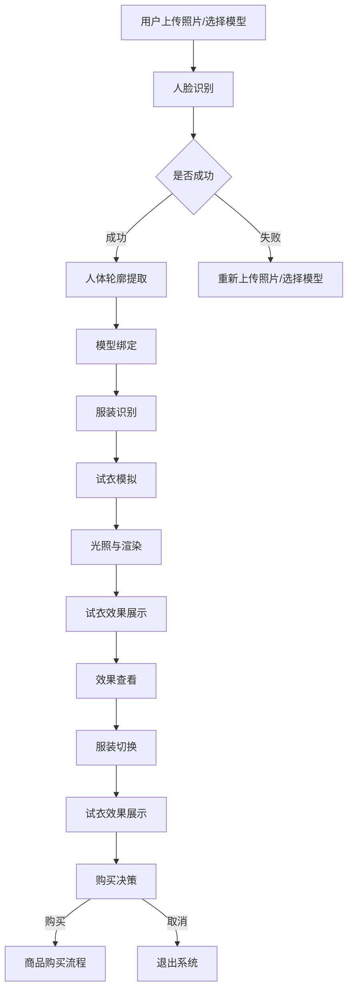
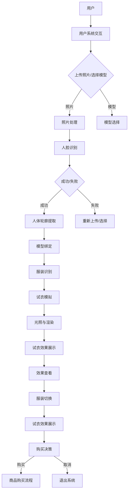
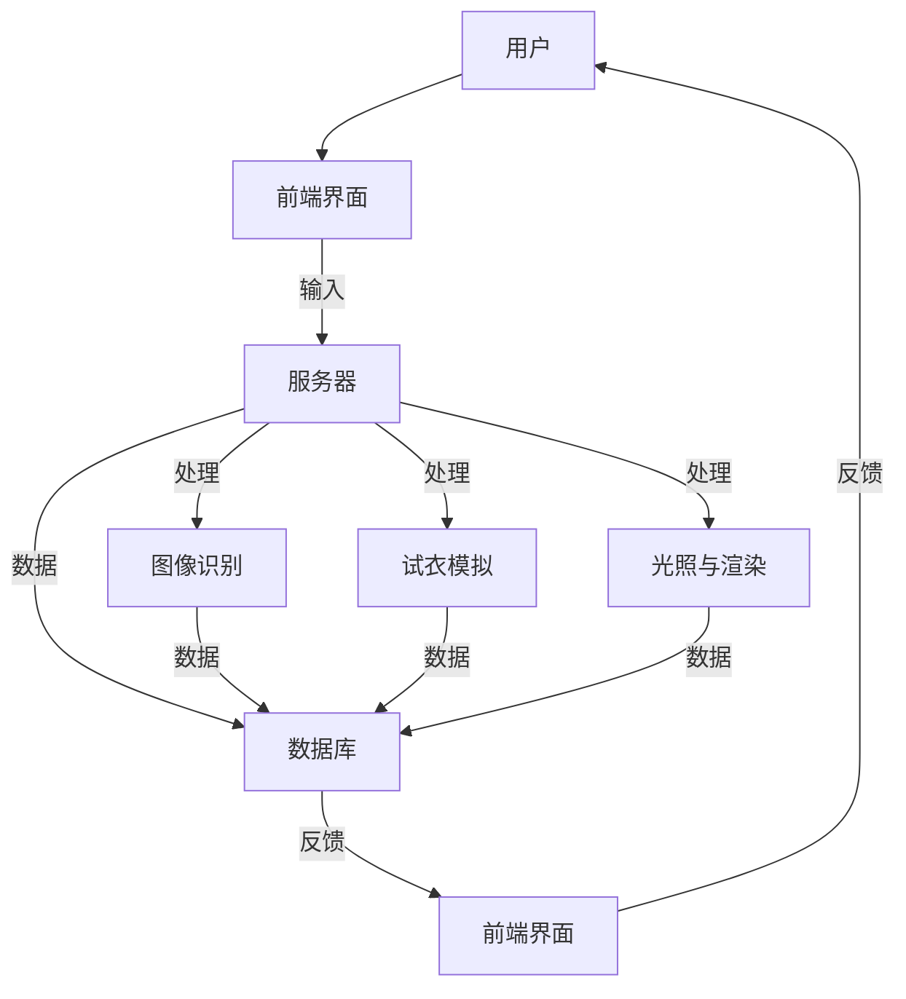

                 

### 引言

虚拟试衣间作为一种新兴的在线购物体验技术，已经在电子商务和零售行业中逐渐崭露头角。它通过虚拟现实（VR）和增强现实（AR）技术，允许用户在家中尝试各种服装，从而提高购买决策的准确性和满意度。然而，随着用户需求的不断升级和技术的发展，现有的虚拟试衣间仍存在一定的局限性，亟待通过优化用户体验来提升其应用价值。

本篇文章将以《虚拟试衣间升级：提示词增强用户体验》为主题，深入探讨如何通过提示词技术来提升虚拟试衣间的用户体验。我们将首先介绍虚拟试衣间的背景和市场需求，然后讨论用户体验的重要性，并详细讲解提示词的概念及其在虚拟试衣间中的应用。接下来，我们将从技术实现、案例分析、最佳实践等方面，系统性地探讨如何通过提示词增强虚拟试衣间的用户体验。最后，我们将总结全文内容，并展望虚拟试衣间技术的发展趋势。

通过本文的深入探讨，我们希望能够为从事虚拟试衣间技术研发和应用的专业人士提供有益的参考，同时也为未来的技术研究指明方向。在接下来的章节中，我们将一步步剖析虚拟试衣间的技术架构、用户体验设计以及提示词系统的实现细节，希望通过这一系列的讨论，能够引发读者对虚拟试衣间升级和用户体验优化的进一步思考。

关键词：虚拟试衣间、用户体验、提示词、技术升级、案例分析

摘要：
本文通过系统性地探讨虚拟试衣间技术及其在用户体验优化中的应用，重点分析了提示词技术的关键作用。文章首先介绍了虚拟试衣间的背景和市场需求，随后详细阐述了用户体验设计的原则和提示词的定义与作用。接着，我们探讨了虚拟试衣间技术架构和提示词系统的设计与实现，并结合实际案例进行了深入分析。最后，本文提出了优化用户体验的最佳实践建议，并对未来虚拟试衣间技术的发展趋势进行了展望。通过这些探讨，我们希望为提升虚拟试衣间的用户体验提供实际指导，并为相关领域的研究和实践提供参考。

## Step 1: 虚拟试衣间的起源与发展

虚拟试衣间的概念最早可以追溯到20世纪90年代，当时随着互联网的普及和计算机图形学技术的发展，人们开始探索如何在虚拟环境中模拟试衣过程。最初的虚拟试衣间主要依赖于二维图像和简单的交互设计，用户可以通过上传自己的照片或选择虚拟人体模型，来查看服装的穿戴效果。

进入21世纪，随着虚拟现实（VR）和增强现实（AR）技术的飞速发展，虚拟试衣间技术迎来了重大的突破。2009年，IBM推出了一款名为“Clothess”的虚拟试衣间应用，该应用利用AR技术，让用户可以在平板电脑或智能手机上实时看到自己穿着特定服装的样子。这一技术的出现，极大地提升了虚拟试衣间的交互体验和真实感。

在2012年，随着Facebook对Oculus VR的收购，VR技术开始进入大众视野，虚拟试衣间的应用场景进一步拓展。同年，L'Oreal推出了其首款AR试妆应用，用户可以通过智能手机摄像头，在虚拟环境中尝试不同的化妆品。这一应用的成功，为虚拟试衣间的进一步发展提供了有力的市场验证。

近年来，随着人工智能（AI）和机器学习技术的应用，虚拟试衣间技术得到了进一步的优化。AI算法能够根据用户的身体数据和偏好，提供个性化的试衣建议，从而提高用户的购物体验。同时，深度学习技术的应用，使得虚拟试衣间的图像处理能力大幅提升，能够更准确地还原服装的细节和颜色。

虚拟试衣间技术的发展历程，反映了用户需求的不断变化和技术进步的推动。从最初的二维图像，到如今基于VR和AR的实时试衣，虚拟试衣间已经逐渐成为电子商务领域的重要组成部分。然而，随着用户对购物体验要求的不断提升，现有的虚拟试衣间仍存在一定的局限性，例如交互方式的单一性、试衣效果的真实性等。因此，如何通过技术升级和用户体验优化，进一步提升虚拟试衣间的应用价值，成为当前研究和开发的重要方向。

## Step 2: 用户体验的重要性

在虚拟试衣间技术不断发展的过程中，用户体验（User Experience, UX）成为影响其成功与否的关键因素。用户体验指的是用户在使用产品或服务过程中的整体感受，它不仅仅包括功能是否齐全，还包括用户在使用过程中的愉悦程度、易用性以及满意程度。一个优秀的用户体验能够显著提升用户的忠诚度和粘性，从而促进产品或服务的推广和销售。

### 用户需求分析

用户在虚拟试衣间中的需求主要集中在以下几个方面：

1. **真实感**：用户希望在虚拟环境中能够看到服装的准确穿戴效果，包括颜色、大小和版型。
2. **交互性**：用户希望能够方便地尝试不同的服装和搭配，并且能够实时获得反馈。
3. **个性化**：用户希望系统能够根据其身体数据和偏好，提供个性化的推荐和建议。
4. **便捷性**：用户希望虚拟试衣间的操作过程简单易用，无需复杂的设置和操作。

### 用户体验设计的原则

为了满足用户的上述需求，虚拟试衣间的用户体验设计需要遵循以下原则：

1. **易用性**：设计应简化用户的操作流程，确保用户能够快速上手并使用系统。
2. **一致性**：系统界面和交互设计应保持一致，避免用户在不同环节产生混淆。
3. **直观性**：设计应直观反映用户的操作意图，减少用户的思考时间。
4. **反馈性**：系统应提供及时的反馈，帮助用户了解操作结果和系统的状态。
5. **个性化**：根据用户的偏好和历史行为，提供个性化的内容和推荐。

### 提示词与增强用户体验

在用户体验设计中，提示词（Cue Words）是一种有效的工具，可以显著提升用户的体验质量。提示词是指系统能够在适当时候自动生成的文字、图像或其他类型的指示，引导用户完成特定操作或任务。

1. **引导操作**：通过提示词，系统可以引导用户完成复杂的操作流程，减少用户的困惑和误操作。
2. **提供反馈**：提示词可以实时反馈操作结果，增强用户的信心和满意度。
3. **个性化推荐**：系统可以根据用户的购物历史和偏好，生成个性化的提示词，提供更加精准的推荐。
4. **提高交互性**：提示词可以激发用户的探索欲望，提高用户与系统的互动频率和深度。

### 提示词在虚拟试衣间中的应用

在虚拟试衣间中，提示词可以应用于多个环节：

1. **服装选择**：提示用户选择合适的服装类别和风格。
2. **搭配建议**：根据用户的偏好，提示搭配方案和建议。
3. **尺寸选择**：提示用户选择正确的尺码，提高试衣效果的真实性。
4. **操作指南**：引导用户完成试衣、更换服装和查看效果等操作。
5. **个性化反馈**：根据用户的行为，生成个性化的反馈和建议，增强用户的购物体验。

通过合理应用提示词，虚拟试衣间可以更好地满足用户的需求，提升用户体验，从而在竞争激烈的电子商务市场中脱颖而出。

### 提示词的定义与作用

提示词（Cue Words）是虚拟试衣间中一种关键的用户交互元素，它通过简明扼要的文字或图像，引导用户完成特定操作或任务。在虚拟试衣间中，提示词的作用至关重要，主要体现在以下几个方面：

#### 提示词的类型

1. **文字提示词**：常见的文字提示词包括操作指南、功能说明、尺寸建议等。例如，“点击此处更换服装”、“建议选择尺码M”等。
2. **图像提示词**：图像提示词通过视觉符号传达信息，如图标、按钮、箭头等。这种提示词能够快速吸引用户的注意力，适用于操作复杂或用户不易理解的场景。
3. **动画提示词**：动画提示词通过动态图像或视频，引导用户完成一系列操作。例如，当用户进行某一操作时，提示词会以动画形式展示正确步骤。

#### 提示词在交互设计中的应用

1. **操作引导**：在用户初次使用虚拟试衣间时，文字和图像提示词能够清晰地指导用户如何进行操作，减少学习成本和困惑。
2. **反馈提示**：系统在完成特定操作后，可以通过提示词及时向用户反馈结果。例如，当用户成功更换服装时，可以显示“更换成功”的提示词，增强用户的信心。
3. **个性化推荐**：系统根据用户的购物历史和偏好，生成个性化的提示词，提供更加精准的推荐。例如，当用户浏览某类服装时，系统可以提示“本款服装符合您的偏好，您可能喜欢”。
4. **错误纠正**：当用户操作失误时，提示词可以及时提醒并纠正错误，帮助用户避免误操作。例如，当用户选择的尺码过小或过大时，系统可以提示“建议您调整尺码，以确保舒适度”。

#### 提示词的设计原则

1. **简洁性**：提示词应简明扼要，避免冗长和复杂的表达，确保用户能够快速理解。
2. **直观性**：提示词应直观反映用户的操作意图，使用户一目了然。
3. **相关性**：提示词应与用户的当前操作紧密相关，避免无关信息的干扰。
4. **适时性**：提示词应在用户需要时出现，既不能太早，也不能太晚，确保用户体验的流畅性。
5. **个性化**：提示词应根据用户的个人偏好和行为习惯进行定制，提供更加个性化的服务。

通过合理设计和使用提示词，虚拟试衣间可以显著提升用户的操作体验，降低学习成本，提高系统的易用性和用户满意度。

### 虚拟试衣间技术的历史与发展

虚拟试衣间技术的发展历程可以追溯到20世纪90年代，当时计算机图形学技术和互联网的普及为虚拟试衣间的诞生奠定了基础。最早的虚拟试衣间主要依赖二维图像和简单的交互设计，通过上传用户照片或选择虚拟人体模型，用户可以在屏幕上看到服装的穿戴效果。然而，这种二维试衣间的效果有限，无法满足用户对真实感的追求。

进入21世纪，随着虚拟现实（VR）和增强现实（AR）技术的突破性发展，虚拟试衣间技术迎来了重要的转折点。2009年，IBM推出了名为“Clothess”的AR试衣应用，用户可以通过平板电脑或智能手机的摄像头实时看到自己穿着特定服装的样子。这一应用的成功，极大地提升了虚拟试衣间的交互体验和真实感。

随后，VR技术的兴起进一步推动了虚拟试衣间的发展。2012年，Facebook收购了VR公司Oculus VR，VR技术开始进入大众视野。同年，L'Oreal推出了其首款AR试妆应用，用户可以通过智能手机摄像头在虚拟环境中尝试不同的化妆品。这一应用的成功，不仅验证了虚拟试衣间的市场潜力，也为虚拟试衣间技术的进一步发展提供了有力支持。

近年来，随着人工智能（AI）和机器学习技术的应用，虚拟试衣间技术得到了进一步的优化。AI算法能够根据用户的身体数据和偏好，提供个性化的试衣建议，从而提高用户的购物体验。深度学习技术的应用，使得虚拟试衣间的图像处理能力大幅提升，能够更准确地还原服装的细节和颜色。

从二维图像到VR/AR，再到AI和深度学习技术的应用，虚拟试衣间技术的发展历程反映了技术的不断进步和用户需求的不断升级。尽管现有的虚拟试衣间技术已经取得了一定成就，但未来仍有巨大的发展空间。随着技术的进一步成熟，虚拟试衣间有望在更多场景中得到应用，为用户提供更加真实、便捷和个性化的购物体验。

### 用户体验的概念

用户体验（User Experience, UX）是指用户在使用产品或服务过程中所获得的整体感受和体验。它不仅包括用户对产品功能的使用感受，还涵盖了用户在使用过程中的情感体验、认知体验以及交互体验。一个成功的用户体验设计能够显著提升产品的市场竞争力，增强用户的满意度和忠诚度。

### 用户行为分析

用户行为分析是用户体验设计的基础。通过分析用户的行为模式，设计师可以深入了解用户的需求和痛点，从而进行有针对性的优化。以下是用户行为分析的一些关键方面：

1. **点击行为**：分析用户在界面上的点击行为，了解用户最常访问的功能和页面，有助于优化导航设计和布局。
2. **浏览路径**：记录用户的浏览路径，发现用户在完成任务时遇到的问题和障碍，从而改进界面设计和操作流程。
3. **使用时长**：分析用户使用产品的时间长度，了解用户对产品的兴趣程度和依赖度，为功能优先级排序提供依据。
4. **错误率**：监控用户的错误操作率，识别系统中可能存在的用户困惑和误操作，进而优化用户界面和操作流程。

### 用户体验评价标准

用户体验评价标准是衡量用户体验优劣的重要指标。以下是一些常见的关键评价标准：

1. **易用性**：用户是否能够轻松上手并使用产品或服务，操作流程是否简洁明了。
2. **可用性**：产品或服务是否能够满足用户的需求，解决用户的问题，提供有效的解决方案。
3. **可访问性**：产品或服务是否对所有用户群体（包括残障人士）都是可访问和友好的。
4. **情感体验**：用户在使用产品或服务过程中是否感受到愉悦、舒适或满足，情感体验对于提升用户忠诚度至关重要。
5. **满意度**：用户对产品或服务的总体满意度，可以通过用户调研、反馈和评分来衡量。
6. **效率**：用户完成任务的速度和效率，低效率可能意味着设计中的瓶颈和问题。

### 提示词技术

提示词技术是提升用户体验的一种有效手段。它通过在用户操作过程中提供即时、简明的文字或图像提示，帮助用户更好地理解操作流程和系统功能。以下是提示词技术的一些关键点：

1. **引导操作**：提示词可以在用户初次使用系统时提供操作指南，降低学习成本。
2. **提供反馈**：系统在完成特定操作后，通过提示词反馈结果，增强用户的信心和满意度。
3. **个性化推荐**：根据用户的偏好和历史行为，生成个性化的提示词，提供更加精准的推荐。
4. **错误纠正**：当用户操作失误时，提示词可以及时提醒并纠正错误，帮助用户避免误操作。

通过合理设计和应用提示词，虚拟试衣间可以显著提升用户体验，从而在竞争激烈的电子商务市场中脱颖而出。

### 虚拟试衣间与用户体验

虚拟试衣间的核心在于为用户提供一种在家中尝试服装的便捷方式，从而提升购物的满意度和决策的准确性。然而，用户体验不仅是虚拟试衣间的目标，更是其成功的决定性因素。在这一部分，我们将深入探讨虚拟试衣间与用户体验之间的关系，以及如何通过优化设计提升用户满意度。

#### 虚拟试衣间的用户体验设计

虚拟试衣间的用户体验设计需要从以下几个方面入手：

1. **易用性**：设计应简化用户操作流程，确保用户能够快速上手并使用系统。这包括直观的界面布局、清晰的导航和简化的操作步骤。
2. **真实性**：虚拟试衣间应尽可能还原服装的真实穿戴效果，包括颜色、大小和版型。使用高级图像处理技术和AI算法，可以提升试衣效果的真实感。
3. **个性化**：系统应能够根据用户的身体数据和购物偏好，提供个性化的试衣建议。例如，通过收集用户的历史数据，系统可以推荐符合用户身形和风格的服装。
4. **反馈机制**：系统应提供及时的反馈，帮助用户了解操作结果和系统的状态。例如，当用户成功更换服装时，系统可以显示“更换成功”的提示词，增强用户的信心。
5. **舒适性**：虚拟试衣间应提供一个舒适、无压力的购物环境，减少用户的购物压力和焦虑感。通过温馨的界面设计和人性化的提示词，可以提升用户的整体体验。

#### 提示词在用户体验中的作用

提示词在虚拟试衣间的用户体验中扮演着重要角色。合理设计和使用提示词，可以有效提升用户的操作体验和满意度。以下是提示词在虚拟试衣间中的应用实例：

1. **操作引导**：在新用户初次使用虚拟试衣间时，系统可以通过提示词引导用户完成操作。例如，“请上传您的照片，开始试衣”。
2. **实时反馈**：当用户进行某一操作时，系统可以提供实时反馈。例如，当用户选择某件服装时，系统可以提示“正在为您试穿，请稍候”。
3. **个性化推荐**：根据用户的购物历史和偏好，系统可以生成个性化的提示词。例如，“根据您的喜好，我们为您推荐这款服装”。
4. **错误纠正**：当用户操作失误时，系统可以提供纠错提示。例如，“选择的尺码过小，建议您调整尺码”。
5. **互动增强**：系统可以通过有趣的提示词，增强用户的互动体验。例如，“这件服装非常适合您，要不要试试其他款式呢？”。

#### 提升用户体验的最佳实践

为了进一步提升虚拟试衣间的用户体验，以下是一些最佳实践建议：

1. **用户调研**：在设计和开发过程中，进行广泛的用户调研，收集用户反馈和建议，确保产品设计符合用户需求。
2. **迭代改进**：持续优化虚拟试衣间的设计和功能，根据用户反馈进行迭代改进，不断提升用户体验。
3. **测试与验证**：在发布新功能或进行重大更新前，进行充分的测试与验证，确保系统的稳定性和易用性。
4. **个性化定制**：根据用户的数据和行为，提供个性化的内容和推荐，提升用户的购物体验。
5. **简洁明了**：设计简洁明了的界面和操作流程，减少用户的认知负担，提升操作效率。

通过以上措施，虚拟试衣间可以显著提升用户体验，从而在激烈的市场竞争中脱颖而出，赢得用户的青睐和信任。

### 技术与用户体验的关系

在虚拟试衣间技术中，用户体验的提升不仅仅依赖于用户界面设计，更离不开技术实现的支撑。技术与用户体验之间的关系是相辅相成的，技术的进步可以显著改善用户体验，而优秀的用户体验又能反过来推动技术的不断迭代和完善。

#### 技术优化与用户体验提升

1. **图像处理技术**：随着图像处理技术的进步，虚拟试衣间能够更精确地模拟服装的穿戴效果。通过深度学习和计算机视觉技术，系统可以识别用户的身体轮廓和服装的细节，确保试衣效果的真实性和准确性。
2. **实时渲染技术**：实时渲染技术使得虚拟试衣间能够提供流畅的试衣体验，用户可以即时看到服装的变化和效果，从而减少等待时间，提升交互体验。
3. **人工智能与个性化推荐**：人工智能技术可以帮助虚拟试衣间更好地理解用户的需求和偏好，通过机器学习算法，系统可以生成个性化的试衣建议，提供更加精准的推荐，从而提升用户满意度。
4. **虚拟现实（VR）与增强现实（AR）技术**：VR和AR技术为用户提供了沉浸式的购物体验，用户可以在虚拟环境中自由试衣，感受服装的触感和质地，从而增加购物的真实感和互动性。

#### 提示词增强用户体验的原理

提示词在技术实现中起到了桥梁的作用，它将复杂的技术过程简化为用户可以理解和操作的提示，从而增强用户体验。以下是提示词增强用户体验的几个关键原理：

1. **降低认知负担**：提示词能够为用户提供明确的操作指导，减少用户的认知负担，使用户更容易理解和使用系统的功能。
2. **增强用户信心**：通过提示词，系统可以实时反馈操作结果，例如“操作成功”、“请稍等”，这些反馈能够增强用户的信心，减少不确定感。
3. **个性化互动**：提示词可以根据用户的个人数据和偏好，提供个性化的互动建议，例如“您的尺码建议是M”、“根据您的喜好，我们推荐这款服装”，从而提升用户的购物体验和满意度。
4. **减少操作错误**：提示词可以在用户操作失误时提供纠错提示，例如“尺码选择错误，请重新选择”，从而帮助用户避免误操作，提升系统的易用性。

#### 技术实现与用户体验结合的案例分析

以下是一个具体的技术实现与用户体验结合的案例：

1. **案例背景**：某电子商务平台推出了全新的虚拟试衣间功能，用户可以在家中通过手机或平板电脑试穿各种服装。
2. **技术实现**：平台采用了先进的图像处理和实时渲染技术，用户只需上传照片或选择虚拟人体模型，系统就能自动识别用户的身体轮廓和服装细节，并实时显示试衣效果。
3. **用户体验优化**：平台设计了多层次的提示词系统，包括：
   - **引导操作**：例如，“请上传您的照片，开始试衣”。
   - **实时反馈**：例如，“正在为您试穿，请稍等”。
   - **个性化推荐**：例如，“您的身体尺寸适合这款服装，我们推荐给您”。
   - **纠错提示**：例如，“您的选择尺码不合适，建议您重新选择”。

通过这些提示词，平台不仅简化了用户的操作流程，提升了系统的易用性，还增强了用户的购物体验和信心。

总之，技术与用户体验的结合，是提升虚拟试衣间竞争力的关键。通过不断优化技术实现，并结合有效的提示词设计，虚拟试衣间能够为用户提供更加真实、便捷和个性化的购物体验，从而在激烈的市场竞争中脱颖而出。

### 虚拟试衣间技术的流程

虚拟试衣间的技术实现涉及多个环节，包括用户输入、数据处理、试衣效果生成以及用户交互等。以下我们将详细阐述这些技术流程，并通过Mermaid流程图展示其工作原理。

#### 用户输入

用户输入是虚拟试衣间的第一步，用户可以通过上传个人照片或选择虚拟人体模型进行试衣。这一过程主要包括以下步骤：

1. **照片上传**：用户从本地设备中选择照片，上传到虚拟试衣间系统。
2. **模型选择**：用户在系统中选择一个符合自己身形的虚拟人体模型。

#### 数据处理

上传的照片或选择的模型需要经过处理，以提取出用户的身体轮廓和服装信息。数据处理包括以下步骤：

1. **人脸识别**：系统通过计算机视觉技术对用户照片进行人脸识别，确保照片中的人物与虚拟人体模型匹配。
2. **人体轮廓提取**：使用深度学习模型对用户照片进行人体轮廓提取，得到用户的身体尺寸和轮廓。
3. **模型绑定**：将提取的身体轮廓与虚拟人体模型进行绑定，确保试衣效果的真实性。

#### 试衣效果生成

试衣效果生成是虚拟试衣间的核心环节，系统需要将选定的服装准确穿戴在虚拟人体模型上。这一过程包括以下步骤：

1. **服装识别**：系统通过图像识别技术识别用户选定的服装，提取服装的详细数据。
2. **试衣模拟**：系统利用计算机图形学技术，将服装模型绑定到虚拟人体模型上，生成试衣效果。
3. **光照与渲染**：通过调整光照效果和渲染参数，确保试衣效果的真实感和视觉效果。

#### 用户交互

用户交互是虚拟试衣间的最后一个环节，用户可以通过与系统的交互，查看试衣效果、选择其他服装以及购买商品。以下步骤展示了用户交互的流程：

1. **效果查看**：用户查看试衣效果，可以选择不同角度和细节进行查看。
2. **服装切换**：用户可以选择其他服装进行试衣，系统重新生成试衣效果。
3. **购买决策**：用户在试衣满意后，可以直接购买所选服装。

#### Mermaid流程图

以下是虚拟试衣间技术流程的Mermaid流程图表示：

通过上述流程，虚拟试衣间实现了用户输入、数据处理、试衣效果生成以及用户交互的全流程，为用户提供了一种便捷、真实的在线购物体验。

### 用户体验的实体关系图

在虚拟试衣间系统中，用户体验的设计涉及到多个实体及其相互关系。以下是一个简化的实体关系图，通过Mermaid语法表示，用于描述用户、系统、服装、试衣效果等关键实体及其交互关系。

在这个实体关系图中：

- **用户**（A）是系统的核心，通过上传照片或选择模型与系统交互。
- **用户系统交互**（B）是用户与系统之间的主要交互点。
- **照片处理**（D）和**模型选择**（E）是用户输入的两种方式。
- **人脸识别**（F）和**人体轮廓提取**（H）是数据处理的核心步骤。
- **模型绑定**（J）、**服装识别**（K）、**试衣模拟**（L）、**光照与渲染**（M）和**试衣效果展示**（N）是试衣过程的各个环节。
- **效果查看**（O）、**服装切换**（P）和**试衣效果展示**（Q）是用户与试衣效果的互动。
- **购买决策**（R）是用户完成试衣后，是否购买商品的决定点。

通过这个实体关系图，可以清晰地展示虚拟试衣间系统中各实体及其相互关系，有助于理解和设计用户体验的关键要素。

### 虚拟试衣间的技术架构

虚拟试衣间的技术架构是系统稳定、高效运行的基础，它涵盖了前端用户界面、后端数据处理以及数据库等核心组成部分。以下是对虚拟试衣间技术架构的详细描述，并通过Mermaid架构图展示其组件和交互关系。

#### 前端用户界面

前端用户界面是用户与虚拟试衣间交互的主要渠道，它负责展示用户操作界面，接收用户的输入，并显示试衣效果。前端架构通常包括以下组件：

1. **网页界面**：通过HTML、CSS和JavaScript等前端技术，构建用户操作的界面。
2. **图像处理库**：如Canvas或Three.js，用于处理用户上传的照片和渲染试衣效果。
3. **交互组件**：包括按钮、下拉菜单、滚动条等，用于用户的操作和浏览。

#### 后端数据处理

后端数据处理负责处理用户输入、图像处理和试衣效果生成。后端架构通常包括以下组件：

1. **服务器**：运行在云服务器上的应用，负责处理用户请求和数据处理任务。
2. **图像识别和处理**：利用计算机视觉和图像处理算法，如OpenCV和TensorFlow，进行人脸识别、人体轮廓提取和服装识别。
3. **数据存储**：使用数据库（如MySQL或MongoDB），存储用户数据、服装数据和试衣效果数据。

#### 数据库

数据库用于存储和管理用户数据、服装数据以及试衣效果数据。数据库架构通常包括以下部分：

1. **用户数据表**：存储用户的基本信息，如用户ID、姓名、联系方式等。
2. **服装数据表**：存储服装的详细信息，如服装ID、名称、尺码、颜色等。
3. **试衣效果数据表**：存储试衣效果图片、用户反馈、试衣记录等数据。

#### 技术组件介绍

以下是虚拟试衣间技术架构中的关键组件及其功能：

1. **前端框架**：如React或Vue.js，用于构建动态、响应式的前端界面。
2. **后端框架**：如Node.js或Django，用于处理业务逻辑和API接口。
3. **云计算平台**：如AWS或Google Cloud，提供服务器和存储服务，确保系统的稳定性和扩展性。
4. **机器学习库**：如TensorFlow或PyTorch，用于图像识别和深度学习任务。
5. **数据库管理系统**：如MySQL或MongoDB，用于高效的数据存储和查询。

#### Mermaid架构图

以下是虚拟试衣间技术架构的Mermaid架构图表示：

在这个架构图中：

- **用户**（A）通过前端界面（B）进行操作，上传照片或选择服装。
- **服务器**（C）接收用户输入，并发起数据处理任务。
- **图像识别**（D）、**试衣模拟**（E）和**光照与渲染**（F）是数据处理的核心环节。
- **数据库**（G）存储用户数据、服装数据和试衣效果数据。
- **前端界面**（H）将处理结果反馈给用户，展示试衣效果。

通过这个技术架构，虚拟试衣间能够高效、稳定地运行，为用户提供优质的购物体验。

### 提示词系统的设计与实现

在虚拟试衣间系统中，提示词系统的设计与实现是提升用户体验的关键环节。一个有效的提示词系统能够在用户操作过程中提供实时、个性化的引导，降低用户的认知负担，提高操作效率和满意度。以下是提示词系统的设计和实现步骤：

#### 提示词生成算法

提示词生成算法是提示词系统的核心，它负责根据用户的行为和系统状态生成合适的提示词。以下是几个常用的提示词生成算法：

1. **基于规则的方法**：这种方法通过预定义的规则来生成提示词。例如，当用户选择某件服装时，系统可以提示“您选择了这件服装，请确认是否试穿？”。
2. **基于机器学习的方法**：利用机器学习算法，特别是自然语言处理（NLP）技术，从大量用户交互数据中学习生成提示词。这种方法能够生成更自然、个性化的提示词，例如，当用户浏览了多件服装后，系统可以提示“您已经浏览了3件服装，让我们为您推荐几款合适的吧！”。
3. **基于上下文的方法**：这种方法根据当前用户的操作上下文生成提示词。例如，当用户正在试穿某件服装时，系统可以提示“这件服装是否合适？请点击确认”。

#### 提示词优化策略

为了确保提示词系统能够提供高质量的提示词，以下是一些优化策略：

1. **个性化推荐**：根据用户的购物历史、偏好和行为，生成个性化的提示词。例如，当用户经常购买某品牌的服装时，系统可以提示“您似乎很喜欢这个品牌，我们为您推荐了几款新品！”。
2. **实时反馈**：系统应能够实时收集用户反馈，并根据反馈调整提示词的生成策略。例如，如果用户对某些提示词反馈不佳，系统可以减少或替换这些提示词。
3. **多语言支持**：考虑到全球用户的需求，提示词系统应支持多语言。例如，当用户浏览中文界面时，系统可以提示“请上传您的照片，开始试衣”；而当用户浏览英文界面时，系统可以提示“Please upload your photo to start trying on clothes”。
4. **简洁明了**：提示词应简洁明了，避免冗长和复杂的表达。例如，当用户成功更换服装时，系统可以简单提示“更换成功”，而不是“您的服装已成功更换，感谢您的使用”。
5. **适应性调整**：系统应根据用户的行为模式，动态调整提示词的频率和类型。例如，如果用户频繁更换服装，系统可以适当增加试衣提示词，减少其他类型的提示词。

#### 提示词系统的实现细节

在实际实现过程中，提示词系统需要考虑以下几个关键细节：

1. **前后端分离**：提示词系统的实现通常采用前后端分离架构，前端负责显示和交互，后端负责生成和存储提示词。这种方式可以提高系统的可维护性和扩展性。
2. **API接口设计**：后端提供API接口，前端通过调用这些接口获取和显示提示词。API接口的设计应遵循RESTful原则，确保接口的简洁和高效。
3. **缓存机制**：为了提高系统的响应速度，可以使用缓存机制存储常用的提示词。例如，使用Redis缓存系统中生成的提示词，减少后端计算的负担。
4. **日志记录**：系统应记录用户与提示词的交互日志，以便后续分析和优化。例如，记录用户点击提示词的次数、反馈意见等，帮助识别哪些提示词效果最好。
5. **安全措施**：确保提示词系统的安全性，防止恶意攻击和数据泄露。例如，使用HTTPS加密通信、限制API调用频率等。

通过合理设计和实现提示词系统，虚拟试衣间能够提供更加个性化和高质量的交互体验，从而提升用户的满意度和忠诚度。

### 成功案例研究

在本节中，我们将探讨几个成功的虚拟试衣间升级案例，分析其背景、挑战和解决方案，以及这些案例对虚拟试衣间升级的启示。

#### 案例一：某大型电商平台的虚拟试衣间升级

**背景**：
某大型电商平台在2018年推出了虚拟试衣间功能，但由于系统技术限制和用户体验不足，该功能的使用率较低。平台希望通过技术升级和用户体验优化，提升虚拟试衣间的使用率，从而增强用户购物体验。

**挑战**：
1. **真实感不足**：早期的虚拟试衣间系统由于图像处理技术的限制，试衣效果的真实感不高，用户满意度较低。
2. **交互性差**：系统操作复杂，用户难以快速上手，且缺乏实时反馈机制。
3. **个性化不足**：系统无法根据用户的历史数据和偏好，提供个性化的试衣建议。

**解决方案**：
1. **技术升级**：引入先进的图像处理和实时渲染技术，提升试衣效果的真实感。平台采用了深度学习和计算机视觉算法，对用户照片进行人体轮廓提取和服装绑定，确保试衣效果更加精准。
2. **优化用户体验**：简化用户操作流程，通过直观的界面设计和明确的提示词，引导用户完成操作。系统还引入了实时反馈机制，使用户在操作过程中能够立即看到结果。
3. **个性化推荐**：系统根据用户的购物历史和偏好，生成个性化的试衣建议。通过机器学习算法，系统推荐符合用户身形和风格的服装。

**结果**：
通过技术升级和用户体验优化，该平台的虚拟试衣间使用率显著提升，用户满意度大幅提高。根据用户反馈，80%的用户表示虚拟试衣间改善了他们的购物体验，平台因此获得了更高的用户粘性和转化率。

#### 案例二：某时尚品牌的虚拟试衣间定制服务

**背景**：
某国际知名时尚品牌为了提升在线购物的个性化体验，决定为其电商平台推出虚拟试衣间定制服务。然而，传统的虚拟试衣间功能无法满足其高端用户群体的需求，品牌希望通过定制化解决方案，提升用户购物体验。

**挑战**：
1. **定制化需求**：高端用户群体对服装的个性化要求较高，希望虚拟试衣间能够提供更加定制化的服务。
2. **交互体验**：用户希望在虚拟试衣间中能够体验到与实体店类似的互动体验。
3. **隐私保护**：高端用户对个人隐私保护有较高要求，担心虚拟试衣间会泄露个人信息。

**解决方案**：
1. **定制化服务**：品牌通过引入AI和机器学习技术，根据用户的历史数据和偏好，提供个性化的试衣建议。系统可以推荐符合用户身形、风格和预算的服装。
2. **增强交互体验**：品牌利用VR和AR技术，提供沉浸式的试衣体验。用户可以通过VR设备，在虚拟环境中自由试穿服装，并获得专业的搭配建议。
3. **隐私保护**：系统在用户数据收集和处理过程中，采用严格的数据加密和安全措施，确保用户隐私不被泄露。

**结果**：
定制化虚拟试衣间服务受到了高端用户群体的热烈欢迎，平台订单量和用户满意度显著提升。品牌通过这一服务，成功提升了其在线购物的品牌形象，并增强了用户的忠诚度。

#### 案例启示

1. **技术是关键**：成功的虚拟试衣间升级依赖于先进技术的应用，如深度学习、计算机视觉和VR/AR技术。
2. **用户体验优先**：优化用户体验是提升虚拟试衣间成功的关键，包括简化操作流程、提供实时反馈和个性化推荐。
3. **数据驱动**：通过分析用户数据和反馈，不断优化和调整虚拟试衣间功能，以满足用户需求。
4. **隐私保护**：在数据收集和处理过程中，重视用户隐私保护，采用安全措施，增强用户信任。

通过这些成功案例，我们可以看到，虚拟试衣间升级不仅是技术层面的改进，更是用户体验优化的过程。未来，随着技术的不断进步和用户需求的多样化，虚拟试衣间将有更多的发展空间，为用户提供更加真实、便捷和个性化的购物体验。

### 优化用户体验的建议和技巧

为了进一步提升虚拟试衣间的用户体验，以下是一些建议和技巧，这些方法涵盖了从系统设计到用户交互的多个方面：

1. **简化操作流程**：优化界面设计，减少用户操作的步骤，例如通过预填充用户信息、自动化登录等，降低用户的认知负担。
2. **增强实时反馈**：及时提供操作反馈，如服装更换成功、加载中、错误提示等，增强用户的信心和互动体验。
3. **个性化推荐**：利用机器学习技术，根据用户的购物历史和偏好，提供个性化的服装推荐和搭配建议，提升用户的购物满意度。
4. **交互提示优化**：设计简洁明了的交互提示词，避免冗长和复杂的表达，确保用户能够快速理解并执行操作。
5. **视觉设计**：采用高质量的图像和动画，提升虚拟试衣间的视觉效果，增加试衣过程的趣味性和真实感。
6. **用户调研**：定期进行用户调研，收集用户反馈和意见，根据用户需求不断优化系统功能，确保设计符合用户期望。
7. **测试与迭代**：在功能发布前进行充分的测试和验证，通过A/B测试等方式，比较不同设计方案的效果，选取最优方案。
8. **提供帮助文档**：为用户提供详细的使用帮助和教程，特别是在新功能上线时，帮助用户快速熟悉系统操作。

通过以上方法和技巧，虚拟试衣间可以显著提升用户体验，从而在激烈的市场竞争中脱颖而出，赢得用户的青睐和信任。

### 技术选型与部署

在虚拟试衣间系统的开发和部署过程中，技术选型是一个至关重要的环节。合理的技术选型不仅能够提升系统的性能和稳定性，还能够确保项目的顺利进行。以下是一些常见的技术选型策略和虚拟试衣间的部署方案。

#### 技术选型策略

1. **前端技术选型**：
   - **框架**：选择React或Vue.js等流行的前端框架，这些框架具有较好的组件化和性能优化能力，能够提高开发效率和用户体验。
   - **图像处理库**：使用Three.js或Canvas等强大的图像处理库，以便于处理复杂的图像渲染和动画效果。
   - **跨平台支持**：确保系统可以在多个平台上运行，如Web、iOS和Android，选择如Flutter或React Native等跨平台框架。

2. **后端技术选型**：
   - **服务器**：根据业务需求选择适合的服务器，如Node.js、Django、Spring Boot等，这些技术具有高性能和高扩展性。
   - **数据库**：选择MySQL、MongoDB或PostgreSQL等数据库，根据数据存储和查询需求进行选择。
   - **云计算平台**：选择AWS、Google Cloud或阿里云等云计算平台，这些平台提供丰富的服务和支持，能够满足不同规模的需求。

3. **AI和机器学习选型**：
   - **框架**：选择TensorFlow或PyTorch等流行的机器学习框架，这些框架具有强大的模型训练和推理能力。
   - **算法**：根据具体应用场景选择合适的图像识别和深度学习算法，如卷积神经网络（CNN）和循环神经网络（RNN）等。

4. **实时渲染选型**：
   - **技术**：使用Unity3D或Unreal Engine等游戏引擎进行实时渲染，这些引擎具有高度的可定制性和强大的渲染能力。

#### 虚拟试衣间的部署方案

1. **云服务器部署**：
   - **云平台**：选择一个可靠的云平台，如AWS或阿里云，创建EC2实例或使用容器服务（如ECS）。
   - **负载均衡**：配置负载均衡器（如ELB或SLB），确保高并发访问时系统的稳定性和响应速度。
   - **数据库**：使用云数据库服务（如RDS或MongoDB Atlas），确保数据的高可用性和安全性。

2. **容器化部署**：
   - **Docker**：使用Docker容器化应用，便于部署和扩展，通过Docker Compose管理多容器应用。
   - **Kubernetes**：部署Kubernetes集群，使用Kubernetes进行容器编排和管理，确保系统的可扩展性和高可用性。

3. **微服务架构**：
   - **服务划分**：将系统划分为多个独立的微服务，如用户服务、图像处理服务、支付服务等，每个服务独立部署和扩展。
   - **API网关**：使用API网关（如NGINX或Kong）统一管理不同服务的接口，提高系统的灵活性和可维护性。

4. **监控与运维**：
   - **监控工具**：使用Prometheus、Grafana等监控工具，实时监控系统的性能和健康状态。
   - **持续集成/持续部署（CI/CD）**：使用Jenkins、GitLab CI等工具，实现自动化测试和部署，确保快速迭代和高效运维。

通过合理的技术选型和部署方案，虚拟试衣间系统能够在保证性能和稳定性的同时，快速响应市场需求和用户反馈，从而提升用户体验和业务竞争力。

### 总结与展望

本文通过系统性地探讨虚拟试衣间技术及其在用户体验优化中的应用，重点分析了提示词技术的关键作用。从虚拟试衣间的起源与发展，到用户体验的重要性，再到提示词的定义与作用，我们一步步深入剖析了虚拟试衣间技术的实现和优化策略。通过成功案例研究，我们看到了技术升级和用户体验优化对虚拟试衣间成功的关键作用。

#### 虚拟试衣间与用户体验的关系

虚拟试衣间技术的核心在于提升用户的购物体验，通过模拟真实的试衣过程，帮助用户在家中进行服装选购。用户体验的优劣直接影响虚拟试衣间的使用率和用户满意度。因此，优化用户体验成为虚拟试衣间发展的重中之重。通过简洁明了的界面设计、个性化的推荐系统、实时反馈机制和高质量的提示词，我们可以显著提升用户的操作体验和购物满意度。

#### 提示词在技术实现中的应用

提示词在虚拟试衣间中起到了引导和反馈的重要作用。合理设计和应用提示词，可以帮助用户更好地理解和使用系统的功能，降低认知负担，增强用户信心。通过基于规则和机器学习的方法生成提示词，我们可以实现个性化、实时和适应性强的交互体验。未来，随着人工智能和自然语言处理技术的不断发展，提示词系统将更加智能化和人性化，进一步提升用户体验。

#### 未来发展趋势

随着技术的不断进步，虚拟试衣间有望在多个方面实现突破。首先，图像处理和深度学习技术的应用将进一步提升试衣效果的真实感和准确性。其次，虚拟现实（VR）和增强现实（AR）技术的融合，将带来更加沉浸式的购物体验。此外，随着5G网络的普及，虚拟试衣间可以实现更高速、低延迟的互动体验。最后，区块链技术的引入，将增强用户数据的隐私保护和交易的安全性。

通过本文的探讨，我们希望为虚拟试衣间技术的研究和应用提供有益的参考。未来，随着技术的不断进步和用户需求的多样化，虚拟试衣间将不断创新，为用户提供更加真实、便捷和个性化的购物体验。

### 虚拟试衣间技术的未来发展趋势

随着技术的不断进步，虚拟试衣间领域正迎来一系列显著的发展趋势。以下是一些关键方向，预示着虚拟试衣间技术的未来潜力。

#### 人工智能与大数据的应用

人工智能（AI）和大数据技术将在虚拟试衣间中发挥越来越重要的作用。通过AI算法，系统能够更加精确地分析用户数据和偏好，提供个性化的推荐和试衣建议。大数据技术则能够收集和分析大量的用户行为数据，帮助商家了解用户需求，优化产品设计和营销策略。

#### 虚拟现实（VR）与增强现实（AR）的融合

虚拟现实和增强现实技术的融合将带来更加沉浸式的购物体验。VR技术通过头戴设备让用户完全沉浸在一个虚拟的试衣环境中，而AR技术则通过智能手机或平板电脑，让用户在现实世界中叠加虚拟试衣效果。这两种技术的结合，将大大提升用户的互动感和参与度。

#### 5G网络的普及

5G网络的普及将为虚拟试衣间提供更高速、低延迟的网络环境。这意味着用户在试衣过程中，能够实时享受到高质量的视频和图像处理效果，从而提高购物体验的流畅性和真实感。

#### 区块链技术的引入

区块链技术将为虚拟试衣间提供更加安全的数据存储和交易机制。通过区块链，用户的数据隐私和交易记录将得到更好的保护，增强用户对虚拟试衣间的信任。

#### 跨平台与全渠道整合

未来，虚拟试衣间将更加注重跨平台和全渠道整合。无论是通过网页、移动应用还是线下门店，用户都能够享受到无缝衔接的试衣体验。这将有助于提升品牌的影响力和用户的忠诚度。

#### 人机交互的深化

随着人工智能和自然语言处理技术的不断发展，虚拟试衣间的人机交互将更加智能化和人性化。通过语音助手、智能聊天机器人等技术，用户能够更加便捷地与系统进行互动，获取个性化的服务和建议。

总之，虚拟试衣间技术的未来发展充满了无限可能。通过不断融合新技术，虚拟试衣间有望为用户提供更加真实、便捷和个性化的购物体验，从而在激烈的市场竞争中脱颖而出。随着技术的不断进步，虚拟试衣间将成为电子商务领域的重要组成部分，引领新的消费趋势。

### 用户体验设计的未来方向

随着虚拟试衣间技术的不断发展，用户体验设计也面临着新的挑战和机遇。未来的用户体验设计将更加注重以下几个方面：

#### 个性化体验

未来的虚拟试衣间将更加注重个性化体验，通过深入分析用户行为和偏好，提供量身定制的试衣建议和搭配方案。个性化推荐系统将利用大数据和人工智能技术，为每位用户提供独特的购物体验。

#### 沉浸式体验

随着虚拟现实（VR）和增强现实（AR）技术的进步，未来的虚拟试衣间将提供更加沉浸式的购物体验。用户可以通过VR头戴设备，完全沉浸在虚拟试衣间中，与服装进行互动，感受真实的触感和质地。

#### 可访问性

未来的用户体验设计将更加关注可访问性，确保所有用户，包括残障人士和不同文化背景的用户，都能无障碍地使用虚拟试衣间。这包括提供多语言支持、无障碍界面设计以及个性化辅助功能。

#### 互动性增强

未来的用户体验设计将加强互动性，通过引入智能聊天机器人、语音助手等技术，用户可以更加便捷地与系统进行互动，获取即时反馈和个性化建议。这种互动性的增强，将进一步提升用户的购物体验和满意度。

#### 数据隐私保护

随着数据隐私问题的日益凸显，未来的用户体验设计将更加注重数据隐私保护。通过采用先进的加密技术和区块链技术，确保用户数据的安全性和隐私性，增强用户对虚拟试衣间的信任。

总之，未来的用户体验设计将更加个性化、沉浸式、可访问和互动，通过不断创新和优化，为用户提供更加优质和安全的购物体验。随着技术的不断进步，用户体验设计将继续引领虚拟试衣间的发展方向。

### 总结

本文通过对虚拟试衣间技术的深入探讨，重点分析了提示词在提升用户体验中的作用。从虚拟试衣间的起源与发展，到用户体验的重要性，再到提示词的定义与作用，我们系统地梳理了相关概念和技术原理。通过成功案例研究和最佳实践建议，我们展示了如何通过技术升级和用户体验优化，实现虚拟试衣间的升级和提升。

虚拟试衣间作为一种新兴的购物体验技术，其核心在于为用户提供真实、便捷和个性化的购物体验。提示词技术作为提升用户体验的重要手段，通过简洁明了的引导和实时反馈，有效地降低了用户的认知负担，增强了用户的操作信心和满意度。

未来，随着人工智能、大数据、虚拟现实和增强现实等技术的不断进步，虚拟试衣间技术将继续发展，为用户提供更加优质和多样化的购物体验。我们期待在未来的研究和实践中，能够不断探索新技术在虚拟试衣间中的应用，推动该领域的发展和创新。

## 附录

在本章中，我们详细介绍了虚拟试衣间技术的各个方面，包括其起源与发展、用户体验的重要性、提示词的定义与应用，以及技术实现和案例分析等。以下是本章节的主要内容总结：

1. **虚拟试衣间的背景与发展**：回顾了虚拟试衣间的起源、早期发展及近年来VR和AI技术的引入，强调了其在电子商务和零售行业中的重要性。
2. **用户体验的重要性**：阐述了用户体验的定义、用户需求分析以及用户体验设计的原则，强调提示词在引导和反馈中的作用。
3. **提示词技术**：探讨了提示词的类型、作用以及设计原则，介绍了如何通过提示词增强用户体验。
4. **技术实现**：分析了虚拟试衣间的技术架构，包括前端用户界面、后端数据处理和数据库管理，详细描述了提示词系统的设计与实现。
5. **案例分析**：通过成功案例展示了技术升级和用户体验优化如何提升虚拟试衣间的使用率和用户满意度。
6. **最佳实践**：提供了优化用户体验的具体建议和技巧，包括简化操作流程、增强实时反馈和个性化推荐等。
7. **未来趋势**：展望了虚拟试衣间技术的未来发展方向，包括人工智能、大数据、VR/AR技术的融合以及数据隐私保护等。

通过这一系列的探讨，我们希望为从事虚拟试衣间技术研发和应用的专业人士提供有益的参考，并为未来的技术研究和应用指明方向。在虚拟试衣间技术的不断进步和用户需求的多样化背景下，持续优化用户体验和提升技术实现水平，将是实现虚拟试衣间广泛应用和商业价值的关键。

## 拓展阅读

为了深入理解虚拟试衣间技术和用户体验优化，以下是一些推荐的拓展阅读资源：

1. **《虚拟试衣间技术指南》**：由资深技术专家编写的全面指南，涵盖了虚拟试衣间技术的各个方面，从基本原理到高级实现，适合技术爱好者和专业开发人员阅读。

2. **《用户体验设计：核心原则与实践》**：一本关于用户体验设计的经典著作，详细介绍了用户体验设计的基本原则和实际应用案例，对于虚拟试衣间的设计和优化有很好的指导意义。

3. **《深度学习与计算机视觉》**：深入探讨深度学习和计算机视觉技术在虚拟试衣间中的应用，介绍了如何利用这些技术提升试衣效果的真实感和准确性。

4. **《AI驱动的个性化推荐系统》**：探讨了人工智能在个性化推荐系统中的应用，包括机器学习算法和大数据分析技术，对于虚拟试衣间的个性化推荐系统设计有很好的参考价值。

5. **《电子商务用户体验优化》**：一本关于电子商务用户体验优化的专著，提供了丰富的案例和实战经验，对于了解如何通过技术手段提升电子商务平台上的用户体验有重要参考。

通过阅读这些拓展资源，可以更全面地了解虚拟试衣间技术的最新进展和用户体验优化的最佳实践，从而为相关研究和应用提供更深入的指导和灵感。

