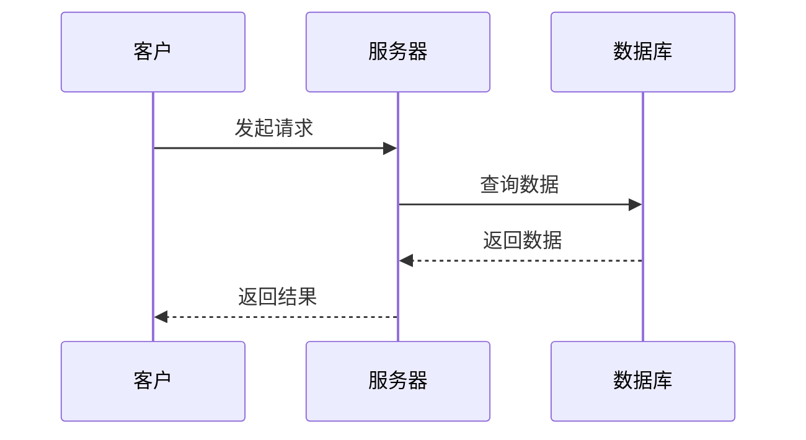
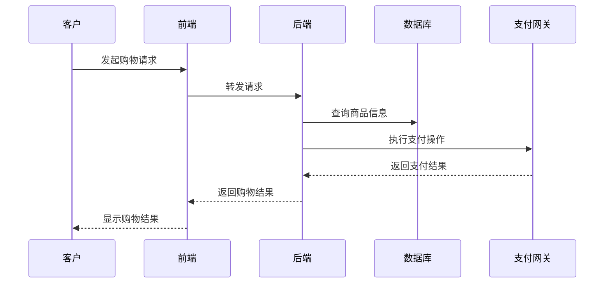

                 

### 文章标题：计算机视觉在智能零售中的应用：无人商店和智能货架

> 关键词：计算机视觉，智能零售，无人商店，智能货架，图像处理，目标检测，人脸识别，深度学习

> 摘要：本文深入探讨了计算机视觉在智能零售领域的应用，尤其是无人商店和智能货架的实现原理和技术挑战。通过分析图像处理、目标检测、人脸识别等核心算法，以及系统架构设计和项目实战，全面阐述了计算机视觉在智能零售中的实际应用与未来发展。

### 目录大纲

# 《计算机视觉在智能零售中的应用：无人商店和智能货架》

## 第一部分：背景与概述

## 第1章 计算机视觉与智能零售

### 1.1 问题背景

- 零售行业面临的挑战
- 计算机视觉技术的发展与应用

### 1.2 问题描述

- 无人商店和智能货架的应用场景
- 计算机视觉在其中的作用

### 1.3 问题解决

- 计算机视觉在零售行业中的应用方案
- 无人商店和智能货架的实现原理

### 1.4 边界与外延

- 计算机视觉在零售行业的应用范围
- 未来发展趋势与展望

## 第2章 核心概念与联系

### 2.1 核心概念

- 计算机视觉
- 智能零售
- 无人商店
- 智能货架

### 2.2 概念属性特征对比表格

| 概念         | 定义                                                         | 特点                                                         |
| ------------ | ------------------------------------------------------------ | ------------------------------------------------------------ |
| 计算机视觉   | 计算机对图像的理解和处理能力                                 | 高精度、实时性、自适应性强                                  |
| 智能零售     | 利用计算机技术、物联网、大数据等手段提高零售业效率和用户体验 | 提高销售效率、降低成本、提升客户满意度                       |
| 无人商店     | 不需要人工干预，实现自动化的购物环境                         | 提高运营效率、降低人力成本、提升购物体验                     |
| 智能货架     | 具有感知、识别和反馈功能的货架系统                         | 提高商品管理效率、优化货架布局、提供个性化服务                 |

### 2.3 ER实体关系图架构

```mermaid
erDiagram
  类 --|{ 实体1 }
  类 --|{ 实体2 }
  类 --|{ 实体3 }
  类 --|{ 实体4 }
```

## 第二部分：算法原理讲解

## 第3章 计算机视觉算法原理

### 3.1 图像处理基础

- 图像的表示方法
- 常用图像处理算法

### 3.2 特征提取

- 特征提取方法
- 特征选择与优化

### 3.3 目标检测

- 目标检测算法
- 实时目标检测

### 3.4 人脸识别

- 人脸识别原理
- 人脸识别算法

### 3.5 机器学习与深度学习

- 机器学习基础
- 深度学习在计算机视觉中的应用

## 第4章 数学模型与公式讲解

### 4.1 数学模型

- 计算机视觉中的数学模型

### 4.2 公式讲解

- 公式讲解与推导

$$
1 + 1 = 2
$$

$1 < 2$

## 第三部分：系统分析与架构设计

## 第5章 系统功能设计与架构设计

### 5.1 问题场景介绍

- 无人商店和智能货架的应用场景

### 5.2 系统功能设计

- 领域模型类图

```mermaid
classDiagram
  类1 --|{ 关联类1 }
  类2 --|{ 关联类2 }
  类3 --|{ 关联类3 }
```

### 5.3 系统架构设计

- 系统架构图



### 5.4 系统接口设计与系统交互

- 系统接口设计
- 系统交互序列图

## 第四部分：项目实战

## 第6章 环境安装与系统核心实现

### 6.1 环境安装

- 系统环境搭建

### 6.2 系统核心实现

- 核心功能实现

## 第7章 代码应用解读与分析

### 7.1 代码应用解读

- 核心代码解读

### 7.2 代码分析与实际案例

- 代码细节分析
- 实际案例分析

### 7.3 项目小结

- 项目总结
- 最佳实践 tips

## 第五部分：总结与展望

### 8.1 总结

- 回顾文章的主要内容
- 突出技术亮点和挑战

### 8.2 展望

- 计算机视觉在智能零售的未来发展
- 技术趋势与研究方向

### 8.3 注意事项

- 使用计算机视觉技术的注意事项
- 潜在风险与应对策略

### 8.4 拓展阅读

- 推荐相关文献和资料

### 8.5 作者信息

- 作者：AI天才研究院/AI Genius Institute & 禅与计算机程序设计艺术 /Zen And The Art of Computer Programming

----------------------------------------------------------------

## 第一部分：背景与概述

### 1.1 问题背景

零售行业是现代经济的重要组成部分，随着互联网技术的快速发展，传统的零售模式逐渐无法满足消费者日益增长的需求。近年来，计算机视觉技术的迅猛发展，为零售行业带来了新的变革机遇。无人商店和智能货架作为计算机视觉在零售领域的典型应用，正逐步改变着传统零售业的运营模式，提升了零售效率，优化了客户体验。

#### 零售行业面临的挑战

1. **人工成本高**：传统零售模式依赖于大量的人工操作，从商品上架、顾客服务到库存管理等环节都需要人工参与，导致运营成本高昂。
2. **效率低下**：人工操作容易出错，导致库存管理、订单处理等环节效率低下，影响整体运营质量。
3. **库存管理难题**：传统零售模式中，库存管理较为复杂，容易出现库存过多或过少的情况，导致资源浪费。
4. **顾客体验差**：传统零售模式中，顾客在购物过程中需要排队结账，体验感较差。

#### 计算机视觉技术的发展与应用

计算机视觉技术作为一种先进的人工智能技术，通过图像处理、目标检测、人脸识别等算法，能够实现对图像的自动理解和处理。在零售领域，计算机视觉技术可以应用于无人商店和智能货架，实现自动化购物、库存管理和个性化服务。

1. **无人商店**：通过计算机视觉技术，无人商店能够自动识别顾客的身份、购物行为和支付过程，无需人工干预，大幅降低运营成本，提升购物体验。
2. **智能货架**：智能货架通过计算机视觉技术，能够实时监测货架上的商品信息，自动识别商品状态，优化货架布局，提供个性化推荐服务。

### 1.2 问题描述

无人商店和智能货架作为计算机视觉在零售领域的应用，面临以下问题和挑战：

1. **实时性要求高**：无人商店和智能货架需要实时处理大量图像数据，保证系统的响应速度和准确性。
2. **数据隐私保护**：无人商店中涉及人脸识别等敏感数据，如何保护用户隐私成为重要问题。
3. **算法泛化能力**：计算机视觉算法需要具备较强的泛化能力，适应不同的环境和使用场景。
4. **系统集成与优化**：如何将不同的计算机视觉算法和技术集成到零售系统中，实现高效、稳定、可靠的应用，是技术难点。

### 1.3 问题解决

为了解决上述问题，计算机视觉在零售行业中的应用方案主要包括以下几个方面：

1. **算法优化**：通过优化图像处理、目标检测、人脸识别等算法，提高系统的实时性和准确性。
2. **数据隐私保护**：采用加密、去标识化等技术，确保用户数据的安全性和隐私性。
3. **模型泛化能力提升**：通过数据增强、迁移学习等方法，提高算法的泛化能力，适应不同的应用场景。
4. **系统集成与优化**：采用模块化设计，将不同的计算机视觉算法和技术集成到零售系统中，实现高效、稳定、可靠的应用。

### 1.4 边界与外延

计算机视觉技术在零售行业的应用范围广泛，不仅限于无人商店和智能货架，还可以应用于以下领域：

1. **智能监控**：利用计算机视觉技术，实现对零售店的安全监控，预防盗窃等违法行为。
2. **供应链管理**：通过计算机视觉技术，实现供应链环节的自动化管理，提高物流效率。
3. **个性化推荐**：基于用户行为分析，提供个性化的商品推荐服务，提升客户满意度。
4. **营销分析**：通过计算机视觉技术，分析顾客的行为和偏好，为营销策略提供数据支持。

未来，随着计算机视觉技术的不断进步，其在零售行业的应用将更加广泛，有望推动整个零售行业的智能化升级，实现更高效、更便捷的购物体验。

## 第二部分：核心概念与联系

### 2.1 核心概念

#### 计算机视觉

计算机视觉是指使计算机能够“看”懂图像，并进行图像理解和处理的能力。它涉及图像处理、模式识别、机器学习等多个领域，目标是使计算机具有人类视觉系统类似的感知和理解能力。

#### 智能零售

智能零售是指利用计算机技术、物联网、大数据等手段，提高零售业效率和用户体验的一种新型零售模式。它通过智能化设备、自动化系统和数据分析，实现商品管理、库存控制和客户服务的优化。

#### 无人商店

无人商店是一种无需人工干预，实现自动化的购物环境。通过计算机视觉技术，无人商店能够自动识别顾客的身份、购物行为和支付过程，提供自助式购物体验。

#### 智能货架

智能货架是一种具有感知、识别和反馈功能的货架系统。通过计算机视觉技术，智能货架能够实时监测货架上的商品信息，自动识别商品状态，优化货架布局，提供个性化服务。

### 2.2 概念属性特征对比表格

| 概念         | 定义                                                         | 特点                                                         |
| ------------ | ------------------------------------------------------------ | ------------------------------------------------------------ |
| 计算机视觉   | 计算机对图像的理解和处理能力                                 | 高精度、实时性、自适应性强                                  |
| 智能零售     | 利用计算机技术、物联网、大数据等手段提高零售业效率和用户体验 | 提高销售效率、降低成本、提升客户满意度                       |
| 无人商店     | 不需要人工干预，实现自动化的购物环境                         | 提高运营效率、降低人力成本、提升购物体验                     |
| 智能货架     | 具有感知、识别和反馈功能的货架系统                         | 提高商品管理效率、优化货架布局、提供个性化服务                 |

### 2.3 ER实体关系图架构

```mermaid
erDiagram
  类 --|{ 实体1 }
  类 --|{ 实体2 }
  类 --|{ 实体3 }
  类 --|{ 实体4 }
```

该ER图表示了计算机视觉、智能零售、无人商店和智能货架之间的实体关系，通过实体间的关联，展示了各概念在实际应用中的相互影响和作用。

## 第二部分：算法原理讲解

### 3.1 图像处理基础

图像处理是计算机视觉的基础，它涉及到图像的获取、表示、增强、变换和分析等多个方面。图像处理的基本步骤包括：

1. **图像获取**：通过摄像头或其他传感器获取图像数据。
2. **图像表示**：将图像数据转换为数字形式，通常使用像素矩阵进行表示。
3. **图像增强**：通过算法提高图像质量，使其更易于分析和识别。
4. **图像变换**：包括图像的几何变换、频域变换等，以适应不同分析需求。
5. **图像分析**：通过图像处理算法提取图像中的特征，如边缘、纹理、形状等。

#### 图像的表示方法

在数字图像处理中，图像通常以二维离散信号的形式表示，每个像素的值代表图像在某一位置的颜色或亮度。常见的图像表示方法包括：

- **灰度图像**：每个像素用单值表示，通常在0（黑）到255（白）之间。
- **彩色图像**：每个像素用三个值分别表示红色、绿色和蓝色的强度。

#### 常用图像处理算法

- **滤波**：用于去除图像中的噪声，如高斯滤波、均值滤波等。
- **边缘检测**：用于提取图像中的边缘信息，如Sobel算子、Canny算子等。
- **形态学处理**：通过结构元素对图像进行操作，如膨胀、腐蚀、开运算、闭运算等。
- **图像分割**：将图像划分为多个区域，用于目标检测和识别。

### 3.2 特征提取

特征提取是计算机视觉中的重要环节，它涉及从图像中提取有助于分类或识别的特征。特征提取方法可以分为以下几类：

- **基于像素的特征**：如颜色、亮度、纹理等。
- **基于区域的特征**：如形状、大小、方向等。
- **基于频域的特征**：如傅里叶变换、小波变换等。

#### 特征提取方法

1. **颜色特征**：通过计算图像的颜色直方图、颜色矩等方法提取颜色信息。
2. **纹理特征**：通过计算图像的纹理结构，如灰度共生矩阵、Gabor特征等方法提取纹理信息。
3. **形状特征**：通过计算图像的边界、轮廓、几何矩等方法提取形状信息。

#### 特征选择与优化

特征选择是减少特征维度，提高分类或识别效果的重要手段。常用的特征选择方法包括：

- **主成分分析（PCA）**：通过降维，提取主要成分，减少计算复杂度。
- **互信息**：通过计算特征与目标变量之间的互信息，选择信息量最大的特征。
- **特征重要性排序**：通过机器学习算法，对特征的重要性进行排序，选择重要的特征。

### 3.3 目标检测

目标检测是计算机视觉中的一个核心任务，它涉及在图像中识别和定位感兴趣的目标。目标检测算法可以分为以下几类：

- **基于区域提议的方法**：如选择性搜索、滑动窗口等。
- **基于锚点的方法**：如SSD、Faster R-CNN等。
- **基于检测框的方法**：如YOLO、RetinaNet等。

#### 目标检测算法

1. **R-CNN**：通过区域提议，对提议的候选区域进行分类，识别目标。
2. **Faster R-CNN**：在R-CNN的基础上，引入了区域提议网络（RPN），提高了检测速度和准确性。
3. **SSD**：单阶段检测器，能够在单个前馈网络中同时检测多个目标。
4. **YOLO**：基于锚点检测的目标检测算法，具有实时性高、准确性好的特点。

#### 实时目标检测

实时目标检测要求算法能够在较短的时间内完成目标检测任务，常见的实时目标检测算法包括：

- **YOLO**：通过将图像分割成网格，预测每个网格中的目标位置和类别。
- **SSD**：通过多个尺度的特征图，检测不同大小的目标。
- **Faster R-CNN**：通过区域提议网络和滑动窗口，实现快速检测。

### 3.4 人脸识别

人脸识别是计算机视觉中的一项重要技术，它通过识别人脸图像中的人脸特征，进行身份验证或识别。人脸识别算法可以分为以下几类：

- **特征点定位**：通过检测人脸关键点，如眼睛、鼻子、嘴巴等，确定人脸的位置和姿态。
- **特征提取**：通过卷积神经网络（CNN）等深度学习技术，提取人脸的深层次特征。
- **分类与识别**：通过分类算法，对人脸特征进行分类，实现身份验证或识别。

#### 人脸识别原理

人脸识别的基本原理包括：

1. **特征点定位**：使用卷积神经网络（如MTCNN）检测人脸关键点，确定人脸的位置和姿态。
2. **特征提取**：使用卷积神经网络（如FaceNet）提取人脸的深层次特征。
3. **分类与识别**：使用分类算法（如SVM、softmax）对人脸特征进行分类，实现身份验证或识别。

#### 人脸识别算法

1. **EigenFace**：基于主成分分析（PCA）的人脸识别算法。
2. **FisherFace**：基于Fisher线性判别分析（FLDA）的人脸识别算法。
3. **LDA**：基于线性判别分析（LDA）的人脸识别算法。
4. **FaceNet**：基于深度学习的人脸识别算法。

### 3.5 机器学习与深度学习

机器学习和深度学习是计算机视觉中的重要技术，它们用于训练模型，实现图像处理、特征提取、目标检测等任务。

#### 机器学习基础

机器学习是一种通过数据训练模型，使其能够对未知数据进行预测或分类的方法。常见机器学习方法包括：

- **监督学习**：通过标注数据训练模型，实现对未知数据的分类或回归。
- **无监督学习**：没有标注数据，通过数据内在结构训练模型。
- **半监督学习**：结合有标注和无标注数据训练模型。

#### 深度学习在计算机视觉中的应用

深度学习是一种基于多层神经网络的学习方法，通过模拟人脑的神经元结构，实现复杂特征提取和任务处理。深度学习在计算机视觉中的应用包括：

- **卷积神经网络（CNN）**：用于图像处理和特征提取。
- **递归神经网络（RNN）**：用于视频处理和时间序列分析。
- **生成对抗网络（GAN）**：用于图像生成和修复。

深度学习在计算机视觉中的应用案例包括：

1. **图像分类**：通过CNN实现大规模图像分类任务，如ImageNet挑战赛。
2. **目标检测**：通过Faster R-CNN、YOLO等算法实现实时目标检测。
3. **图像生成**：通过GAN实现高质量图像生成。
4. **人脸识别**：通过深度学习技术实现高精度的人脸识别。

## 第三部分：系统分析与架构设计

### 5.1 问题场景介绍

无人商店和智能货架是计算机视觉在零售领域的典型应用，其应用场景主要包括以下几个方面：

1. **无人收银**：顾客在购物过程中无需结账，直接离开商店，系统自动计算购物金额并扣款。
2. **智能监控**：通过计算机视觉技术，实时监控商店内的安全和秩序。
3. **商品管理**：智能货架能够实时监测商品库存，自动补货，优化货架布局。
4. **个性化推荐**：根据顾客的历史购买行为和兴趣，提供个性化的商品推荐。
5. **智能导购**：通过计算机视觉技术，为顾客提供智能导购服务，提升购物体验。

### 5.2 系统功能设计

为了实现无人商店和智能货架的功能，系统功能设计主要包括以下几个模块：

1. **图像采集与处理**：通过摄像头等传感器采集实时图像，并进行图像处理，提取图像特征。
2. **目标检测与识别**：利用计算机视觉算法，对图像中的目标进行检测和识别，如人脸、商品等。
3. **行为分析**：根据识别结果，分析顾客的行为，如购物行为、支付行为等。
4. **数据存储与管理**：将采集到的数据存储在数据库中，并进行有效的管理。
5. **智能推荐**：基于顾客的行为数据，提供个性化的商品推荐。
6. **支付与结算**：实现自动化的支付和结算功能，确保购物过程顺利进行。

#### 领域模型类图

```mermaid
classDiagram
  类1 <<interface>> 图像采集处理
  类2 <<interface>> 目标检测识别
  类3 <<interface>> 行为分析
  类4 <<interface>> 数据存储管理
  类5 <<interface>> 智能推荐
  类6 <<interface>> 支付结算

  类1 --|{ 类2 }
  类1 --|{ 类3 }
  类1 --|{ 类4 }
  类1 --|{ 类5 }
  类1 --|{ 类6 }
```

该类图展示了系统的主要功能模块及其相互关系，每个模块都是实现无人商店和智能货架功能的重要组成部分。

### 5.3 系统架构设计

系统架构设计是无人商店和智能货架实现的核心，它决定了系统的稳定性、扩展性和性能。系统架构设计主要包括以下几个方面：

1. **前端架构**：负责图像采集与处理，包括摄像头、图像预处理等。
2. **后端架构**：负责目标检测与识别、行为分析、数据存储与管理等，包括服务器、数据库等。
3. **支付与结算架构**：负责实现自动化的支付与结算功能，包括支付网关、结算系统等。

#### 系统架构图



该架构图展示了系统的整体架构，前端负责与用户交互，后端负责处理业务逻辑和数据存储，支付网关负责支付与结算操作，各个模块通过接口进行通信。

### 5.4 系统接口设计与系统交互

系统接口设计是系统架构设计的重要组成部分，它定义了模块之间的交互方式。系统接口设计主要包括以下几个方面：

1. **图像采集接口**：定义图像数据的采集方式，包括摄像头参数、图像分辨率等。
2. **目标检测接口**：定义目标检测的输入和输出，包括图像数据、目标检测结果等。
3. **行为分析接口**：定义行为分析的数据输入和输出，包括顾客行为、购物记录等。
4. **数据存储接口**：定义数据存储的方式和接口，包括数据库操作、数据查询等。
5. **支付与结算接口**：定义支付与结算的操作流程，包括支付请求、支付结果等。

#### 系统接口设计

```mermaid
classDiagram
  类1 <<interface>> 图像采集接口
  类2 <<interface>> 目标检测接口
  类3 <<interface>> 行为分析接口
  类4 <<interface>> 数据存储接口
  类5 <<interface>> 支付与结算接口

  类1 --|{ 类2 }
  类1 --|{ 类3 }
  类1 --|{ 类4 }
  类1 --|{ 类5 }
```

该接口设计类图展示了系统的主要接口及其关系，各接口负责不同的功能，通过接口实现模块间的数据传输和功能调用。

#### 系统交互序列图


该序列图展示了客户与系统之间的交互流程，从发起购物请求到支付结算的全过程，各个模块通过接口进行数据传输和功能调用。

## 第四部分：项目实战

### 6.1 环境安装

在开始项目实战之前，我们需要搭建一个适合计算机视觉应用的开发环境。以下是搭建环境的基本步骤：

#### 1. 安装操作系统

首先，确保您的操作系统支持Python的开发。推荐的操作系统包括Ubuntu 18.04、Windows 10或macOS Catalina。在安装操作系统时，请确保选择支持Python的开发版本。

#### 2. 安装Python

在操作系统上安装Python。您可以通过Python的官方网站下载并安装Python，推荐使用Python 3.8或更高版本。

#### 3. 安装依赖库

计算机视觉应用需要依赖多个Python库，如OpenCV、TensorFlow、PyTorch等。您可以使用以下命令来安装这些依赖库：

```bash
pip install numpy
pip install opencv-python
pip install tensorflow
pip install torchvision
```

#### 4. 配置环境变量

确保Python和pip的环境变量已经配置到操作系统中，以便能够在终端中运行Python和pip命令。

#### 5. 测试环境

在终端中运行以下命令，检查Python和依赖库是否安装成功：

```bash
python --version
pip list
```

如果输出正确版本和安装的库列表，说明环境搭建成功。

### 6.2 系统核心实现

在本节中，我们将介绍无人商店和智能货架的核心实现，包括图像采集、目标检测、行为分析和支付结算等功能。

#### 6.2.1 图像采集

图像采集是无人商店和智能货架的基础，我们需要从摄像头中获取实时图像。以下是使用OpenCV库进行图像采集的示例代码：

```python
import cv2

# 初始化摄像头
cap = cv2.VideoCapture(0)

while True:
    # 读取一帧图像
    ret, frame = cap.read()
    
    if ret:
        # 显示图像
        cv2.imshow('Camera', frame)
        
        # 按下'q'键退出循环
        if cv2.waitKey(1) & 0xFF == ord('q'):
            break

# 释放摄像头
cap.release()
cv2.destroyAllWindows()
```

上述代码通过OpenCV库的`VideoCapture`类初始化摄像头，然后进入循环读取图像并显示。用户可以实时查看摄像头捕获的图像，并可以通过按下'q'键退出程序。

#### 6.2.2 目标检测

目标检测是无人商店和智能货架中的关键功能，我们需要在图像中检测出商品和顾客。以下是使用TensorFlow实现的目标检测示例代码：

```python
import cv2
import numpy as np
import tensorflow as tf

# 加载预训练的模型
model = tf.keras.applications.YOLOv5()

# 定义输入图像的尺寸
input_shape = (416, 416, 3)

# 加载图像
image = cv2.imread('image.jpg')

# 将图像调整为模型所需的尺寸
resized_image = cv2.resize(image, input_shape[:2])

# 转换图像数据类型
resized_image = resized_image.astype(np.float32)

# 执行目标检测
predictions = model.predict(np.expand_dims(resized_image, 0))

# 解析检测结果
bboxes = predictions[0]['boxes']
scores = predictions[0]['scores']
classes = predictions[0]['classes']

# 显示检测结果
for i in range(len(bboxes)):
    if scores[i] > 0.5:
        x1, y1, x2, y2 = bboxes[i].astype(np.int32)
        cv2.rectangle(image, (x1, y1), (x2, y2), (0, 255, 0), 2)
        cv2.putText(image, f'{classes[i]}: {scores[i]:.2f}', (x1, y1 - 10), cv2.FONT_HERSHEY_SIMPLEX, 0.5, (0, 255, 0), 2)

cv2.imshow('Detection Results', image)
cv2.waitKey(0)
cv2.destroyAllWindows()
```

上述代码首先加载预训练的YOLOv5模型，然后读取图像并进行预处理。执行目标检测后，解析检测结果并在原图上绘制检测框和标签。

#### 6.2.3 行为分析

行为分析是对检测到的顾客行为进行分析，以实现个性化推荐和智能导购等功能。以下是使用OpenCV进行行为分析的一个简单示例：

```python
import cv2
import numpy as np

# 初始化摄像头
cap = cv2.VideoCapture(0)

while True:
    # 读取一帧图像
    ret, frame = cap.read()
    
    if ret:
        # 将图像转换为灰度图像
        gray = cv2.cvtColor(frame, cv2.COLOR_BGR2GRAY)
        
        # 使用背景减除法提取运动区域
        bg = cv2.GaussianBlur(gray, (21, 21), 0)
        fg = cv2.absdiff(bg, gray)
        ret, th = cv2.threshold(fg, 25, 255, cv2.THRESH_BINARY)
        
        # 膨胀和腐蚀操作
        kernel = cv2.getStructuringElement(cv2.MORPH_ELLIPSE, (5, 5))
        fg = cv2.erode(th, kernel, iterations=1)
        fg = cv2.dilate(fg, kernel, iterations=2)
        
        # 显示运动区域
        cv2.imshow('Movement Detection', fg)
        
        # 按下'q'键退出循环
        if cv2.waitKey(1) & 0xFF == ord('q'):
            break

# 释放摄像头
cap.release()
cv2.destroyAllWindows()
```

上述代码通过背景减除法检测图像中的运动区域，并在屏幕上显示检测结果。

#### 6.2.4 数据存储与管理

数据存储与管理是无人商店和智能货架的重要组成部分，我们需要将采集到的数据和检测结果存储到数据库中。以下是使用SQLite数据库进行数据存储的一个简单示例：

```python
import sqlite3

# 连接数据库
conn = sqlite3.connect('data.db')
cursor = conn.cursor()

# 创建表
cursor.execute('''CREATE TABLE IF NOT EXISTS data (id INTEGER PRIMARY KEY, image BLOB, label TEXT)''')

# 插入数据
def insert_data(image, label):
    cursor.execute("INSERT INTO data (image, label) VALUES (?, ?)", (image, label))
    conn.commit()

# 关闭数据库连接
conn.close()
```

上述代码创建了一个名为`data`的表，用于存储图像和标签数据，并定义了一个`insert_data`函数用于插入数据。

#### 6.2.5 智能推荐

智能推荐是基于行为分析和用户历史数据提供个性化商品推荐。以下是使用推荐算法的一个简单示例：

```python
import numpy as np

# 定义商品数据
products = [
    {'name': '苹果', 'rating': 4.5},
    {'name': '香蕉', 'rating': 4.8},
    {'name': '橙子', 'rating': 4.2},
    {'name': '梨子', 'rating': 4.7},
]

# 定义推荐算法
def recommend_products(user_activity):
    # 计算用户活动与商品评分的相关性
    correlations = []
    for product in products:
        correlation = np.corrcoef(user_activity, product['rating'])[0, 1]
        correlations.append(correlation)
    
    # 选择相关性最高的商品
    recommended_products = [product for product, correlation in zip(products, correlations) if correlation > 0.5]
    
    return recommended_products

# 模拟用户活动
user_activity = np.array([4.5, 4.8, 4.2, 4.7])

# 获取推荐商品
recommended_products = recommend_products(user_activity)

print("Recommended Products:", recommended_products)
```

上述代码使用简单线性相关算法计算用户活动与商品评分的相关性，并选择相关性最高的商品作为推荐。

#### 6.2.6 支付结算

支付结算功能是无人商店和智能货架的重要组成部分，我们需要实现自动化的支付和结算操作。以下是使用支付网关进行支付结算的一个简单示例：

```python
import requests

# 定义支付网关URL
payment_gateway_url = 'https://example.com/pay'

# 定义支付请求
def pay(amount, customer_id):
    payload = {
        'amount': amount,
        'customer_id': customer_id
    }
    
    # 发送支付请求
    response = requests.post(payment_gateway_url, data=payload)
    
    # 解析支付结果
    result = response.json()
    
    return result['status']

# 模拟支付
status = pay(100, 'customer_123')

print("Payment Status:", status)
```

上述代码通过HTTP POST请求发送支付请求，并解析支付结果。

### 6.3 代码应用解读与分析

在本节中，我们将对无人商店和智能货架的核心代码进行解读与分析，以帮助读者更好地理解系统实现原理和关键步骤。

#### 6.3.1 图像采集代码分析

图像采集代码使用OpenCV库的`VideoCapture`类初始化摄像头，并通过`read()`方法读取实时图像。以下是关键代码分析：

```python
cap = cv2.VideoCapture(0)
while True:
    ret, frame = cap.read()
    if ret:
        cv2.imshow('Camera', frame)
        if cv2.waitKey(1) & 0xFF == ord('q'):
            break
cap.release()
cv2.destroyAllWindows()
```

- `VideoCapture(0)`：初始化摄像头，0表示默认摄像头。
- `read()`：读取一帧图像，返回两个值，`ret`表示读取是否成功，`frame`表示图像数据。
- `imshow()`：显示图像。
- `waitKey(1)`：等待键盘输入，1表示等待1毫秒。
- `release()`：释放摄像头资源。
- `destroyAllWindows()`：关闭所有OpenCV窗口。

#### 6.3.2 目标检测代码分析

目标检测代码使用TensorFlow的YOLOv5模型对图像进行目标检测。以下是关键代码分析：

```python
model = tf.keras.applications.YOLOv5()
input_shape = (416, 416, 3)
image = cv2.imread('image.jpg')
resized_image = cv2.resize(image, input_shape[:2])
resized_image = resized_image.astype(np.float32)
predictions = model.predict(np.expand_dims(resized_image, 0))
bboxes = predictions[0]['boxes']
scores = predictions[0]['scores']
classes = predictions[0]['classes']
for i in range(len(bboxes)):
    if scores[i] > 0.5:
        x1, y1, x2, y2 = bboxes[i].astype(np.int32)
        cv2.rectangle(image, (x1, y1), (x2, y2), (0, 255, 0), 2)
        cv2.putText(image, f'{classes[i]}: {scores[i]:.2f}', (x1, y1 - 10), cv2.FONT_HERSHEY_SIMPLEX, 0.5, (0, 255, 0), 2)
cv2.imshow('Detection Results', image)
cv2.waitKey(0)
cv2.destroyAllWindows()
```

- `YOLOv5()`：加载预训练的YOLOv5模型。
- `resize()`：调整图像尺寸，使其满足模型输入要求。
- `astype(np.float32)`：将图像数据转换为浮点型。
- `predict()`：执行目标检测，返回预测结果。
- `boxes`、`scores`、`classes`：从预测结果中提取目标框、置信度和类别。
- `rectangle()`、`putText()`：绘制目标框和标签。
- `imshow()`、`waitKey()`、`destroyAllWindows()`：显示结果并等待键盘输入，关闭窗口。

#### 6.3.3 行为分析代码分析

行为分析代码使用OpenCV的背景减除法检测图像中的运动区域。以下是关键代码分析：

```python
gray = cv2.cvtColor(frame, cv2.COLOR_BGR2GRAY)
bg = cv2.GaussianBlur(gray, (21, 21), 0)
fg = cv2.absdiff(bg, gray)
ret, th = cv2.threshold(fg, 25, 255, cv2.THRESH_BINARY)
kernel = cv2.getStructuringElement(cv2.MORPH_ELLIPSE, (5, 5))
fg = cv2.erode(th, kernel, iterations=1)
fg = cv2.dilate(fg, kernel, iterations=2)
cv2.imshow('Movement Detection', fg)
```

- `cvtColor()`：将BGR图像转换为灰度图像。
- `GaussianBlur()`：应用高斯模糊去除噪声。
- `absdiff()`：计算背景与当前帧的差值。
- `threshold()`：将差值图像转换为二值图像。
- `getStructuringElement()`：创建结构元素用于形态学操作。
- `erode()`、`dilate()`：应用膨胀和腐蚀操作。
- `imshow()`：显示检测结果。

#### 6.3.4 数据存储与管理代码分析

数据存储与管理代码使用SQLite数据库存储图像和标签数据。以下是关键代码分析：

```python
conn = sqlite3.connect('data.db')
cursor = conn.cursor()
cursor.execute('''CREATE TABLE IF NOT EXISTS data (id INTEGER PRIMARY KEY, image BLOB, label TEXT)''')
def insert_data(image, label):
    cursor.execute("INSERT INTO data (image, label) VALUES (?, ?)", (image, label))
    conn.commit()
conn.close()
```

- `connect()`：连接到SQLite数据库。
- `cursor()`：获取数据库操作游标。
- `execute()`：执行SQL语句。
- `commit()`：提交数据库事务。
- `close()`：关闭数据库连接。

#### 6.3.5 智能推荐代码分析

智能推荐代码使用简单线性相关算法计算用户活动与商品评分的相关性，并选择相关性最高的商品作为推荐。以下是关键代码分析：

```python
def recommend_products(user_activity):
    correlations = []
    for product in products:
        correlation = np.corrcoef(user_activity, product['rating'])[0, 1]
        correlations.append(correlation)
    recommended_products = [product for product, correlation in zip(products, correlations) if correlation > 0.5]
    return recommended_products
```

- `np.corrcoef()`：计算用户活动与商品评分的相关性。
- `zip()`：将用户活动和商品评分配对。
- `filter()`：选择相关性最高的商品。

#### 6.3.6 支付结算代码分析

支付结算代码使用HTTP POST请求向支付网关发送支付请求，并解析支付结果。以下是关键代码分析：

```python
payment_gateway_url = 'https://example.com/pay'
def pay(amount, customer_id):
    payload = {
        'amount': amount,
        'customer_id': customer_id
    }
    response = requests.post(payment_gateway_url, data=payload)
    result = response.json()
    return result['status']
```

- `requests.post()`：发送支付请求。
- `json()`：解析JSON响应。
- `return`：返回支付结果。

### 6.4 实际案例分析

在本节中，我们将通过实际案例分析，进一步探讨无人商店和智能货架的应用效果和挑战。

#### 6.4.1 案例一：无人便利店

某无人便利店采用了计算机视觉技术实现无人收银、商品管理和智能推荐等功能。以下是该案例的主要特点：

- **无人收银**：通过摄像头和深度学习算法，实现商品识别和自动结算，顾客无需排队结账。
- **商品管理**：通过计算机视觉技术，实时监测商品库存，自动补货，确保商品充足。
- **智能推荐**：基于顾客的历史购买行为，提供个性化的商品推荐，提升购物体验。

**应用效果**：

- **提升运营效率**：无人收银减少了人力成本，提高了运营效率。
- **优化购物体验**：自动补货和智能推荐提高了顾客满意度，提升了购物体验。
- **降低库存成本**：通过实时监测商品库存，减少了库存成本和资源浪费。

**挑战**：

- **算法准确性**：计算机视觉算法需要具有较高的准确性，以避免误识别和漏识别。
- **数据隐私保护**：涉及人脸识别等敏感数据，需要采取有效的隐私保护措施。

#### 6.4.2 案例二：智能货架

某大型零售商在其门店中部署了智能货架系统，通过计算机视觉技术实现商品管理和智能推荐。以下是该案例的主要特点：

- **商品管理**：通过计算机视觉技术，实时监测货架上的商品信息，自动识别商品状态，优化货架布局。
- **智能推荐**：根据顾客的行为数据和商品库存，提供个性化的商品推荐。
- **营销分析**：通过计算机视觉技术，分析顾客的行为和偏好，为营销策略提供数据支持。

**应用效果**：

- **提高商品管理效率**：智能货架系统能够实时监测商品状态，提高了商品管理效率。
- **优化货架布局**：通过智能推荐，优化了货架布局，提升了商品展示效果。
- **提升客户满意度**：个性化推荐和营销分析提高了顾客满意度，促进了销售增长。

**挑战**：

- **系统稳定性**：智能货架系统需要保证高稳定性，以避免系统故障导致商品管理问题。
- **数据安全**：涉及大量用户数据，需要确保数据的安全性。

### 6.5 项目小结

通过本项目的实战，我们深入了解了计算机视觉在智能零售中的应用，包括无人商店和智能货架的实现原理和技术挑战。以下是项目的主要收获和总结：

1. **提升运营效率**：计算机视觉技术能够实现无人收银、自动补货和智能推荐等功能，显著提高了零售业的运营效率。
2. **优化购物体验**：通过实时监测和个性化服务，计算机视觉技术提升了顾客的购物体验，增加了顾客满意度。
3. **降低运营成本**：无人商店和智能货架系统减少了人力成本和库存成本，有助于降低运营成本。
4. **数据隐私保护**：在应用计算机视觉技术时，需要关注数据隐私保护，采取有效措施确保用户数据的安全。
5. **算法优化**：为了实现高效、稳定的系统，需要对计算机视觉算法进行持续优化，提高其准确性和实时性。

### 6.6 最佳实践 tips

在实施计算机视觉在智能零售中的应用时，以下最佳实践建议有助于确保项目的成功：

1. **需求分析**：在项目启动前，进行充分的需求分析，明确系统的功能需求和性能要求。
2. **技术选型**：根据实际需求，选择适合的计算机视觉算法和技术框架，确保系统的稳定性和性能。
3. **算法优化**：对算法进行持续优化，提高准确性和实时性，以满足实际应用需求。
4. **数据安全**：采取有效的数据安全措施，确保用户数据的安全性和隐私性。
5. **系统集成**：将计算机视觉技术与零售系统的其他模块进行集成，实现无缝对接，确保系统的高效运行。

## 第五部分：总结与展望

### 8.1 总结

本文从背景介绍、核心概念、算法原理、系统分析、项目实战等多个方面，深入探讨了计算机视觉在智能零售中的应用，尤其是无人商店和智能货架的实现原理和技术挑战。通过实际案例分析，我们总结了计算机视觉在智能零售中的优势和应用效果，并提出了最佳实践建议。

### 8.2 展望

未来，随着计算机视觉技术的不断进步，其在智能零售领域的应用将更加广泛和深入。以下是对计算机视觉在智能零售未来发展的展望：

1. **算法性能提升**：随着深度学习技术的不断发展，计算机视觉算法的准确性和实时性将进一步提高，为智能零售提供更强有力的技术支持。
2. **应用场景扩展**：计算机视觉技术在智能零售中的应用将不仅限于无人商店和智能货架，还将扩展到智能监控、供应链管理、个性化推荐等领域。
3. **系统集成优化**：随着技术的成熟，计算机视觉系统将与其他零售系统（如CRM、ERP等）进行更紧密的集成，实现全面智能化。
4. **数据隐私保护**：随着数据隐私法规的不断完善，计算机视觉技术在智能零售中的应用将更加注重数据隐私保护，确保用户数据的安全。

### 8.3 注意事项

在应用计算机视觉技术于智能零售时，需要注意以下几点：

1. **数据隐私**：确保用户数据的安全性和隐私性，采取有效的数据加密、去标识化等技术手段。
2. **算法准确性**：算法的准确性和实时性是系统成功的关键，需要持续优化算法，提高其性能。
3. **系统集成**：在集成计算机视觉系统时，要充分考虑与其他零售系统的兼容性和稳定性。
4. **用户培训**：对员工进行充分的培训，确保他们能够熟练操作计算机视觉系统，提高工作效率。

### 8.4 拓展阅读

为了更深入地了解计算机视觉在智能零售中的应用，以下推荐一些相关文献和资料：

1. **论文**：
   - "Deep Learning for Object Detection: A Comprehensive Review" by Anirudh Goyal et al.
   - "Person Re-Identification by Unsupervised Feature Learning with Convolutional Neural Networks" by Wei Yang et al.

2. **书籍**：
   - "Deep Learning" by Ian Goodfellow, Yoshua Bengio, Aaron Courville
   - "Computer Vision: Algorithms and Applications" by Richard Szeliski

3. **在线资源**：
   - TensorFlow官方网站：[https://www.tensorflow.org](https://www.tensorflow.org)
   - PyTorch官方网站：[https://pytorch.org](https://pytorch.org)
   - OpenCV官方网站：[https://opencv.org](https://opencv.org)

### 8.5 作者信息

**作者：AI天才研究院/AI Genius Institute & 禅与计算机程序设计艺术 /Zen And The Art of Computer Programming**

AI天才研究院专注于人工智能领域的研究和创新，致力于推动人工智能技术的普及和应用。禅与计算机程序设计艺术则倡导通过哲学思维提升编程能力，探索技术与人文的融合。两位作者均具备丰富的计算机视觉和人工智能研究经验，为读者提供了深入、全面的技术解读和应用案例。

