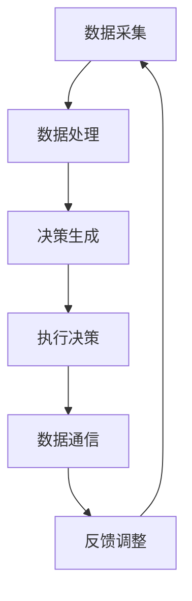
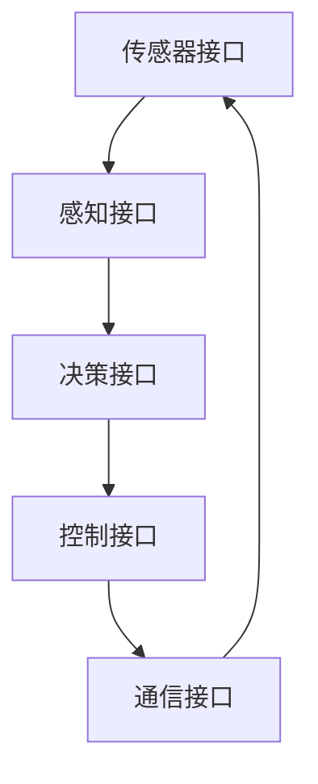

                 


## 自动驾驶中计算机视觉的重要性

### 背景

自动驾驶技术作为现代智能交通系统的重要组成部分，正逐渐从理论走向实际应用。自动驾驶车辆通过传感器、计算机视觉和深度学习等技术，实现对周围环境的感知、理解和决策，从而实现部分或完全自动化的驾驶。这一技术不仅在提高驾驶安全性、缓解交通拥堵、降低碳排放等方面具有巨大潜力，还被视为未来智慧城市和智能交通系统的基石。

### 计算机视觉在自动驾驶中的作用

计算机视觉在自动驾驶系统中扮演着至关重要的角色，其主要作用体现在以下几个方面：

1. **环境感知**：自动驾驶车辆需要实时感知周围环境，包括道路、交通标志、其他车辆、行人和障碍物等。计算机视觉技术通过图像处理和目标检测，可以从车载摄像头获取的图像中提取关键信息，为自动驾驶系统提供必要的环境数据。

2. **路径规划**：基于环境感知的数据，计算机视觉系统可以辅助自动驾驶车辆进行路径规划。这包括识别道路标志、识别交通信号灯、识别车道线等，从而为自动驾驶车辆提供精确的导航信息。

3. **障碍物检测**：计算机视觉系统通过图像处理技术，可以检测并识别道路上的障碍物，如车辆、行人、动物等，并实时更新自动驾驶车辆的感知数据，确保车辆能够及时做出决策，避免碰撞。

4. **行为预测**：通过分析车辆和行人的行为模式，计算机视觉系统可以预测他们的未来动作，从而为自动驾驶车辆提供更加精准的决策支持。

### 计算机视觉的关键技术

计算机视觉在自动驾驶中的应用离不开以下几个关键技术的支持：

1. **图像处理**：图像处理是计算机视觉的基础，包括图像的滤波、边缘检测、特征提取等。这些技术可以帮助计算机从图像中提取有用的信息。

2. **目标检测**：目标检测是计算机视觉中的一个重要分支，其主要任务是确定图像中感兴趣的目标位置和类别。在自动驾驶中，目标检测技术可以用于识别道路上的各种物体。

3. **深度学习**：深度学习技术，尤其是卷积神经网络（CNN）在计算机视觉中得到了广泛应用。通过训练大量的图像数据，深度学习模型可以学会识别和分类图像中的对象。

4. **行为预测**：行为预测是自动驾驶中的一个重要研究方向，通过分析图像数据，预测车辆和行人的行为，为自动驾驶车辆提供决策支持。

### 计算机视觉在自动驾驶中的应用挑战

尽管计算机视觉技术在自动驾驶中具有巨大潜力，但其应用仍面临以下挑战：

1. **数据收集与标注**：计算机视觉系统需要大量的高质量图像数据来训练模型。数据的收集和标注是一项耗时且耗资源的工作。

2. **实时性**：自动驾驶系统需要在极短的时间内处理大量的图像数据，并做出快速决策。这要求计算机视觉系统具备高度的实时性。

3. **准确性**：计算机视觉系统在复杂环境和恶劣天气条件下，其准确性可能会受到影响。如何提高系统在复杂场景下的鲁棒性和准确性，是当前研究的一个热点。

4. **安全性**：自动驾驶系统的安全性至关重要。计算机视觉系统需要具备高可靠性和容错性，以确保在极端情况下能够安全地驾驶。

### 总结

计算机视觉技术在自动驾驶中的应用，不仅提高了自动驾驶车辆的感知能力和安全性，还为自动驾驶技术的发展提供了强有力的技术支持。然而，要实现真正意义上的自动驾驶，还需要克服数据收集、实时性、准确性和安全性等方面的挑战。

## 摘要

本文深入探讨了计算机视觉在自动驾驶中的应用，分析了其在提高感知能力和安全性方面的关键作用。首先，介绍了自动驾驶的发展背景和计算机视觉的重要性，接着详细阐述了计算机视觉的基础知识、关键技术及其在自动驾驶中的应用。随后，本文探讨了计算机视觉在自动驾驶中面临的挑战，并提出了相应的解决思路。最后，本文总结了计算机视觉在自动驾驶中的重要地位，以及未来发展的潜在方向。通过本文的阅读，读者可以全面了解计算机视觉在自动驾驶中的应用及其技术挑战，为相关研究和实践提供参考。

## 关键词

- 自动驾驶
- 计算机视觉
- 感知能力
- 安全性
- 深度学习
- 目标检测
- 行为预测

## 摘要

本文深入探讨了计算机视觉在自动驾驶中的应用，分析了其在提高感知能力和安全性方面的关键作用。首先，介绍了自动驾驶的发展背景和计算机视觉的重要性，接着详细阐述了计算机视觉的基础知识、关键技术及其在自动驾驶中的应用。随后，本文探讨了计算机视觉在自动驾驶中面临的挑战，并提出了相应的解决思路。最后，本文总结了计算机视觉在自动驾驶中的重要地位，以及未来发展的潜在方向。通过本文的阅读，读者可以全面了解计算机视觉在自动驾驶中的应用及其技术挑战，为相关研究和实践提供参考。

## 第一部分：引言

### 1.1 自动驾驶的发展背景

自动驾驶，也称为自动化驾驶或无人驾驶，是指利用计算机、传感器和其他系统来控制车辆的自动行驶技术。这一概念早在20世纪中叶就已经提出，但由于技术、法律和经济等多方面因素的制约，自动驾驶的实用化和商业化进程经历了长时间的酝酿。

#### 1.1.1 自动驾驶的概念

自动驾驶车辆通常被分为不同的自动化级别，根据国际自动机工程师学会（SAE）的分级标准，自动驾驶可以分为0级到5级，级别越高，车辆的自动化程度越高。0级完全由人类驾驶员控制，5级则完全无需人类干预。

- **0级**：无自动化，所有驾驶任务均由人类驾驶员完成。
- **1级**：部分自动化，车辆可控制单个驾驶任务，如加速、制动或转向。
- **2级**：部分自动化，车辆可同时控制两个驾驶任务，如同时控制加速和制动。
- **3级**：有条件自动化，车辆可在特定环境下自主行驶，但在某些情况下需要人类接管。
- **4级**：高度自动化，车辆在特定环境下可完全自主行驶，但可能需要人类干预。
- **5级**：完全自动化，车辆在任何环境下均能完全自主行驶，无需人类干预。

#### 1.1.2 自动驾驶技术的发展历程

自动驾驶技术的发展经历了几个关键阶段：

1. **早期探索**（20世纪60年代 - 80年代）：早期的自动驾驶研究主要集中在大规模的模拟实验和小规模的试验车上。

2. **初级实验**（20世纪90年代）：随着计算机技术和传感器技术的进步，自动驾驶开始从实验室走向实际道路，一些公司和研究机构开始进行自动驾驶车辆的试验。

3. **商业化起步**（21世纪初至今）：随着人工智能和机器学习技术的发展，自动驾驶技术进入商业化起步阶段。谷歌、特斯拉、百度等公司纷纷推出自动驾驶汽车，并进行了大规模的实际道路测试。

#### 1.1.3 自动驾驶的现状与未来展望

目前，自动驾驶技术已经取得了一定的进展，许多汽车制造商和科技公司正在努力推动其商业化进程。自动驾驶汽车已经在一些国家和地区进行了试运行，主要应用于特定场景，如特定路线的公共交通、物流运输等。

未来，随着技术的不断进步和政策的支持，自动驾驶有望在更多场景中得到应用。以下是一些可能的发展趋势：

1. **技术成熟**：随着人工智能、深度学习、传感器技术和计算机硬件的持续进步，自动驾驶技术将变得更加成熟和可靠。

2. **政策支持**：政府政策和法规的逐步完善将为自动驾驶技术的发展提供更好的环境，如自动驾驶汽车的道路测试许可、无人驾驶车辆的法律法规等。

3. **商业化拓展**：自动驾驶技术将逐步从特定场景向更广泛的领域拓展，如个人出行、长途货运等。

4. **安全和隐私问题**：自动驾驶的发展将带来新的安全和隐私挑战，如车辆的网络安全、个人隐私保护等，这些问题的解决将是未来发展的关键。

### 1.2 计算机视觉的重要性

在自动驾驶系统中，计算机视觉扮演着至关重要的角色。它是车辆感知外部环境的主要手段之一，通过图像处理和模式识别技术，车辆可以获取道路信息、交通信号、行人行为等关键数据，从而实现自动驾驶。

#### 1.2.1 计算机视觉在自动驾驶中的作用

计算机视觉在自动驾驶中的应用主要包括以下几个方面：

1. **环境感知**：通过摄像头、激光雷达等传感器，计算机视觉系统可以实时捕捉道路场景，包括道路标志、交通信号灯、车道线、其他车辆和行人等。

2. **路径规划**：基于环境感知数据，计算机视觉系统可以帮助自动驾驶车辆进行路径规划，选择最优行驶路线。

3. **障碍物检测**：计算机视觉系统可以识别道路上的障碍物，如车辆、行人、自行车等，并及时发出警告或采取避让措施。

4. **行为预测**：通过分析车辆和行人的行为模式，计算机视觉系统可以预测他们的未来动作，从而为自动驾驶车辆提供更加精准的决策支持。

#### 1.2.2 计算机视觉的关键技术

计算机视觉在自动驾驶中涉及的关键技术包括：

1. **图像处理**：图像处理是计算机视觉的基础，包括图像增强、滤波、边缘检测等，用于提取图像中的重要特征。

2. **目标检测**：目标检测是计算机视觉中的重要分支，其主要任务是确定图像中感兴趣的目标位置和类别。

3. **深度学习**：深度学习技术，尤其是卷积神经网络（CNN），在计算机视觉中得到了广泛应用。通过训练大量的图像数据，深度学习模型可以学会识别和分类图像中的对象。

4. **行为预测**：行为预测是自动驾驶中的一个重要研究方向，通过分析图像数据，预测车辆和行人的行为，为自动驾驶车辆提供决策支持。

#### 1.2.3 计算机视觉在自动驾驶中的应用挑战

尽管计算机视觉技术在自动驾驶中具有巨大潜力，但其应用仍面临以下挑战：

1. **数据收集与标注**：计算机视觉系统需要大量的高质量图像数据来训练模型。数据的收集和标注是一项耗时且耗资源的工作。

2. **实时性**：自动驾驶系统需要在极短的时间内处理大量的图像数据，并做出快速决策。这要求计算机视觉系统具备高度的实时性。

3. **准确性**：计算机视觉系统在复杂环境和恶劣天气条件下，其准确性可能会受到影响。如何提高系统在复杂场景下的鲁棒性和准确性，是当前研究的一个热点。

4. **安全性**：自动驾驶系统的安全性至关重要。计算机视觉系统需要具备高可靠性和容错性，以确保在极端情况下能够安全地驾驶。

### 1.3 安全性挑战与感知能力需求

自动驾驶系统的安全性是人们最为关注的焦点。计算机视觉在提高自动驾驶车辆感知能力方面发挥着重要作用，但同时也面临着一系列安全性挑战。

#### 1.3.1 自动驾驶安全的重要性

自动驾驶安全的重要性体现在以下几个方面：

1. **减少交通事故**：自动驾驶车辆可以通过精确的环境感知和快速反应，有效避免由人为失误导致的交通事故。

2. **提高交通效率**：自动驾驶车辆可以更好地协调行驶，减少拥堵和交通延误，提高交通效率。

3. **降低运营成本**：自动驾驶车辆可以减少对驾驶员的依赖，降低人力成本和事故风险，提高运营效率。

#### 1.3.2 感知能力在自动驾驶中的应用

感知能力是自动驾驶车辆的核心能力之一，它决定了车辆能否安全、有效地执行任务。计算机视觉在感知能力方面的应用主要包括：

1. **道路识别**：计算机视觉系统可以识别道路标志、车道线、交通信号灯等，为自动驾驶车辆提供道路信息。

2. **障碍物检测**：计算机视觉系统可以检测道路上的障碍物，如车辆、行人、自行车等，并做出相应的反应。

3. **交通情况分析**：计算机视觉系统可以分析交通情况，预测交通流量变化，帮助自动驾驶车辆做出更准确的决策。

#### 1.3.3 提高自动驾驶感知能力的方法

为了提高自动驾驶车辆的感知能力，可以从以下几个方面着手：

1. **多传感器融合**：结合多种传感器数据，如摄像头、激光雷达、雷达等，可以提供更全面的环境信息，提高感知准确性。

2. **深度学习模型**：通过训练深度学习模型，可以不断提高计算机视觉系统的准确性和鲁棒性。

3. **实时性优化**：通过优化算法和硬件，提高计算机视觉系统的实时处理能力，确保车辆在复杂环境下能够快速做出反应。

4. **场景理解**：通过自然语言处理和机器学习技术，使计算机视觉系统更好地理解场景，提高决策的准确性。

### 1.4 本章小结

本部分介绍了自动驾驶的发展背景、计算机视觉的重要性以及安全性挑战与感知能力需求。通过分析自动驾驶技术的发展历程和现状，我们了解了自动驾驶技术的广泛应用前景。同时，计算机视觉在提高自动驾驶车辆感知能力和安全性方面具有重要作用，但也面临着一系列挑战。提高自动驾驶感知能力需要多方面的技术手段，包括多传感器融合、深度学习模型优化、实时性优化和场景理解等。这些技术将为自动驾驶的发展提供强有力的支持。

## 2.1 基本概念

### 2.1.1 计算机视觉的定义

计算机视觉是指使计算机能够从图像或视频中理解和解释视觉信息的技术和科学。它涉及图像处理、模式识别、人工智能、计算机图形学等多个领域，旨在使计算机具备类似于人类的视觉感知能力。

### 2.1.2 图像与图像处理

图像是计算机视觉中最基本的数据形式。图像是由像素组成的二维矩阵，每个像素包含颜色信息。图像处理是对图像进行操作和变换的一系列技术，包括图像增强、滤波、边缘检测、特征提取等。

- **图像增强**：通过调整图像的亮度、对比度等参数，使图像更清晰，便于后续处理。
- **滤波**：用于去除图像中的噪声，提高图像质量。
- **边缘检测**：用于识别图像中的边缘，边缘是图像中的重要特征，可以用于物体的检测和识别。
- **特征提取**：用于从图像中提取出具有代表性的特征，如角点、线段、纹理等。

### 2.1.3 视觉感知与认知

视觉感知是指人类通过眼睛捕捉光信号并转化为神经信号的过程，而视觉认知则是指大脑对视觉信号进行处理和理解的过程。计算机视觉试图模拟人类的视觉感知和认知过程，使计算机能够理解和解释图像内容。

- **视觉感知过程**：从图像中提取视觉信息的过程，包括图像捕捉、图像预处理、特征提取、特征匹配等。
- **视觉信息处理机制**：包括视觉皮层和神经网络的复杂计算过程，用于解释和分类视觉信息。

### 2.1.4 计算机视觉的应用领域

计算机视觉广泛应用于各个领域，包括但不限于：

- **自动驾驶**：用于车辆和行人的检测、识别和跟踪，提高自动驾驶车辆的感知能力和安全性。
- **安防监控**：用于实时监控和报警，识别异常行为和潜在威胁。
- **医疗影像**：用于疾病诊断、肿瘤检测等，辅助医生进行诊断和治疗。
- **人脸识别**：用于身份验证、安全认证等，广泛应用于金融、安防等领域。
- **机器人导航**：用于环境感知、路径规划等，使机器人能够自主导航和执行任务。

### 2.1.5 计算机视觉的关键技术

计算机视觉的关键技术包括：

- **图像处理技术**：用于图像的预处理、增强、滤波等。
- **模式识别技术**：用于对象的识别和分类。
- **深度学习技术**：用于图像的分类、检测和生成等。
- **多传感器融合**：将多种传感器数据结合起来，提高系统的感知能力和鲁棒性。

### 2.1.6 计算机视觉的发展历程

计算机视觉的发展历程可以分为以下几个阶段：

- **早期阶段**（20世纪50年代 - 70年代）：主要是基于规则的方法，如边缘检测、角点检测等。
- **中期阶段**（20世纪80年代 - 90年代）：引入了概率模型和统计方法，如隐马尔可夫模型、支持向量机等。
- **现代阶段**（21世纪初至今）：深度学习技术的出现，使得计算机视觉取得了突破性进展，如卷积神经网络（CNN）、生成对抗网络（GAN）等。

### 2.1.7 本章小结

本部分介绍了计算机视觉的基本概念，包括定义、图像与图像处理、视觉感知与认知、应用领域、关键技术和发展历程。通过这些基本概念的理解，读者可以对计算机视觉有一个全面的了解，为进一步学习计算机视觉的相关技术奠定基础。

## 2.2 主要技术

### 2.2.1 传统计算机视觉技术

传统计算机视觉技术主要基于图像处理和模式识别的理论，通过一系列算法和模型来提取和处理图像数据，从而实现对象识别、场景理解等任务。

#### 2.2.1.1 特征提取

特征提取是计算机视觉中一个关键步骤，其目的是从图像中提取具有代表性的特征，以便进行后续的识别和分类。常见的特征提取方法包括：

1. **边缘检测**：边缘检测是一种用于识别图像中显著边缘的算法，如Canny边缘检测、Sobel边缘检测等。
2. **角点检测**：角点检测用于识别图像中的角点特征，如Harris角点检测、Shi-Tomasi角点检测等。
3. **纹理特征**：纹理特征用于描述图像的纹理信息，如灰度共生矩阵、Gabor纹理特征等。

#### 2.2.1.2 目标检测

目标检测是计算机视觉中另一个重要任务，其目的是在图像中识别和定位感兴趣的目标对象。常见的目标检测算法包括：

1. **滑动窗口法**：通过在图像上滑动不同尺寸的窗口，对每个窗口内的图像进行特征提取和分类，以识别目标。
2. **基于分类的方法**：如支持向量机（SVM）、决策树、随机森林等，通过对训练数据的学习，建立分类模型以识别目标。
3. **基于回归的方法**：如回归模型（R-CNN）、区域建议生成模型（Fast R-CNN、Faster R-CNN）等，通过预测每个区域是否包含目标，并定位目标位置。

#### 2.2.1.3 跟踪与识别

跟踪与识别是计算机视觉中的两个相关任务，跟踪是指连续地跟踪图像中的目标对象，而识别是指确定目标对象的类别。

1. **基于模型的跟踪方法**：如光流法、Kalman滤波等，通过建立模型来预测目标对象的运动轨迹。
2. **基于数据关联的跟踪方法**：如粒子滤波、均值漂移等，通过计算候选目标的相似性来更新目标状态。
3. **识别方法**：如基于模板匹配、深度学习等，通过比较目标特征和已知类别特征，确定目标对象的类别。

### 2.2.2 深度学习在计算机视觉中的应用

深度学习技术的兴起为计算机视觉带来了革命性的变化，其强大的建模能力和自动特征提取能力使得计算机视觉任务取得了显著的进展。

#### 2.2.2.1 卷积神经网络（CNN）

卷积神经网络（CNN）是一种特殊的神经网络，其结构适合处理图像数据。CNN通过卷积操作、池化操作和全连接层，能够自动提取图像中的特征，并实现分类和检测任务。

1. **卷积层**：卷积层通过卷积操作提取图像的特征，卷积核在图像上滑动，生成特征图。
2. **池化层**：池化层用于减小特征图的尺寸，提高模型的计算效率。
3. **全连接层**：全连接层将特征图上的所有像素值映射到输出类别。

#### 2.2.2.2 卷积神经网络在计算机视觉中的应用

卷积神经网络在计算机视觉中的应用非常广泛，包括：

1. **图像分类**：通过训练卷积神经网络，可以自动识别图像中的物体类别，如ImageNet图像分类挑战。
2. **目标检测**：如R-CNN、Faster R-CNN、SSD、YOLO等，通过在图像中检测和定位多个目标对象。
3. **语义分割**：通过训练卷积神经网络，可以对图像中的每个像素进行分类，实现像素级的图像分割。
4. **实例分割**：在语义分割的基础上，进一步识别和区分图像中的不同实例，如Mask R-CNN。

#### 2.2.2.3 生成对抗网络（GAN）

生成对抗网络（GAN）是一种特殊的深度学习模型，由生成器和判别器组成。生成器试图生成逼真的图像，判别器则判断图像是真实图像还是生成图像。通过两者之间的对抗训练，生成器可以不断提高生成图像的质量。

1. **生成器**：生成器通过随机噪声生成图像，试图使其与真实图像难以区分。
2. **判别器**：判别器通过判断图像的真实性，用于监督生成器的训练。

GAN在计算机视觉中的应用包括：

1. **图像修复**：通过生成缺失部分的图像，修复受损的图像。
2. **图像生成**：可以生成具有特定风格或内容的图像，如生成艺术作品、合成人脸等。
3. **超分辨率**：通过提高图像的分辨率，使低分辨率图像变得更加清晰。

### 2.2.3 计算机视觉在其他领域中的应用

除了自动驾驶，计算机视觉在许多其他领域也有广泛应用，包括：

1. **医疗影像**：通过计算机视觉技术，可以辅助医生进行疾病诊断、肿瘤检测等。
2. **安防监控**：通过实时监控和图像分析，可以识别异常行为和潜在威胁。
3. **机器人导航**：通过计算机视觉技术，可以使机器人更好地理解周围环境，实现自主导航。
4. **人脸识别**：通过识别和验证人脸，可以实现身份认证和安全控制。

### 2.2.4 计算机视觉在自动驾驶中的应用

在自动驾驶中，计算机视觉技术主要用于环境感知，包括：

1. **道路识别**：通过计算机视觉技术，可以识别车道线、道路标志等，为自动驾驶车辆提供导航信息。
2. **障碍物检测**：通过识别车辆、行人、动物等障碍物，为自动驾驶车辆提供避障决策。
3. **行为预测**：通过分析车辆和行人的行为模式，预测他们的未来动作，为自动驾驶车辆提供决策支持。

### 2.2.5 本章小结

本部分介绍了计算机视觉的主要技术，包括传统计算机视觉技术和深度学习技术。传统计算机视觉技术主要通过特征提取、目标检测和跟踪与识别等方法实现图像处理和理解。深度学习技术，尤其是卷积神经网络和生成对抗网络，在计算机视觉中得到了广泛应用，极大地提高了图像分类、目标检测、语义分割等任务的性能。通过这些技术的综合应用，计算机视觉在自动驾驶、医疗影像、安防监控等多个领域取得了显著成果。

## 2.3 视觉感知原理

### 2.3.1 视觉感知过程

视觉感知是人类和自动驾驶系统获取和解释周围环境信息的关键过程。它涉及从光信号到大脑处理的整个信息处理流程。以下是视觉感知过程的详细描述：

1. **光信号捕获**：眼睛作为感知系统的输入设备，通过视网膜上的感光细胞（如视杆细胞和视锥细胞）捕获光信号。视杆细胞主要负责在低光照条件下的感知，而视锥细胞则在明亮环境下工作，负责颜色识别和细节感知。

2. **神经信号传输**：捕获到的光信号会转化为神经信号，并通过视神经传输到大脑。

3. **图像处理**：在视觉皮层中，图像信号会经历复杂的信息处理过程。这包括图像的预处理、特征提取和高级视觉信息处理。预处理步骤如对比度调整、边缘检测等，有助于增强重要视觉信息。特征提取步骤则涉及角点、边缘、纹理等特征的识别，为后续的高级视觉任务提供基础。

4. **高级视觉任务**：大脑会对提取的特征进行高级处理，如对象识别、场景理解、运动感知等。这些处理过程依赖于视觉皮层的不同区域，如V1、V2、V3等，每个区域负责不同的视觉信息处理任务。

5. **感知形成**：最终，大脑将处理后的视觉信息整合成对环境的感知。这种感知不仅包括对物体和场景的理解，还包括对空间关系、深度感知和运动感知的认知。

### 2.3.2 相关生理学基础

视觉感知的生理学基础涉及眼睛的结构和大脑的视觉处理机制。

1. **眼睛结构**：眼睛的主要结构包括角膜、晶状体、视网膜等。角膜和晶状体负责聚焦光线，视网膜上的感光细胞捕获光信号并转化为电信号。视网膜中主要分为两种感光细胞：视杆细胞和视锥细胞，分别负责不同类型的视觉信息。

2. **视觉处理机制**：大脑中的视觉处理主要发生在视觉皮层。视觉皮层包括多个层次，从V1到V5，每个层次负责不同的视觉信息处理任务。V1区域主要负责基本的图像处理，如边缘检测和方向感知。而V5区域则负责处理空间关系和物体识别。

3. **视觉皮层的神经连接**：视觉皮层中的神经元通过复杂的连接和反馈机制，实现视觉信息的传递和整合。例如，V1区域的神经元通过反馈回路调节V2区域的响应，从而优化视觉处理效果。

### 2.3.3 视觉信息处理机制

视觉信息处理机制涉及多个层次和阶段，包括预处理、特征提取、高级视觉处理等。

1. **预处理**：预处理步骤包括对比度调整、噪声滤波、边缘检测等。这些步骤有助于提高图像质量，增强重要视觉信息的识别。

2. **特征提取**：特征提取步骤包括从图像中提取具有代表性的特征，如角点、边缘、纹理等。这些特征为后续的视觉任务提供基础。

3. **高级视觉处理**：高级视觉处理包括对象识别、场景理解、运动感知等。这些处理任务依赖于视觉皮层中的不同区域和层次，实现对复杂视觉信息的理解和解释。

### 2.3.4 实例分析与代码示例

为了更好地理解视觉感知原理，我们可以通过一个简单的实例进行分析和代码演示。

假设我们有一个简单的图像，其中包含一个红色的圆形和一个蓝色的正方形。我们的任务是使用计算机视觉技术识别并分类这些对象。

```python
import cv2
import numpy as np

# 读取图像
image = cv2.imread('example.jpg')

# 转换为灰度图像
gray_image = cv2.cvtColor(image, cv2.COLOR_BGR2GRAY)

# 使用Hough直线变换检测圆形和正方形
circles = cv2.HoughCircles(gray_image, cv2.HOUGH_GRADIENT, dp=1.2, minDist=100,
                           param1=50, param2=30, minRadius=10, maxRadius=0)

squares = cv2.findContours(gray_image, cv2.RETR_LIST, cv2.CHAIN_APPROX_SIMPLE)
squares = squares[0] if len(squares) == 2 else squares[1]

# 绘制检测结果
if circles is not None:
    for circle in circles[0]:
        cv2.circle(image, (int(circle[0]), int(circle[1])), int(circle[2]),
                   (0, 0, 255), 2)

if squares is not None:
    for square in squares:
        if cv2.contourArea(square) > 500:
            cv2.drawContours(image, [square], -1, (255, 0, 0), 3)

cv2.imshow('Result', image)
cv2.waitKey(0)
cv2.destroyAllWindows()
```

在这个示例中，我们首先读取一个图像，并将其转换为灰度图像。然后，我们使用Hough变换检测图像中的圆形，使用findContours方法检测正方形。最后，我们绘制检测结果并显示图像。

通过这个简单的实例，我们可以看到计算机视觉技术在图像处理和对象识别方面的应用。在实际应用中，视觉感知过程会更加复杂，需要结合多种算法和技术来实现对复杂场景的理解。

### 2.3.5 总结

视觉感知原理是计算机视觉的基础，它涉及到从光信号到大脑处理的整个信息处理流程。通过了解视觉感知过程、相关生理学基础和视觉信息处理机制，我们可以更好地理解计算机视觉技术的工作原理和应用。实例分析和代码示例进一步帮助我们理解视觉感知在实际应用中的实现方法。

## 2.4 计算机视觉算法

### 2.4.1 特征提取算法

特征提取是计算机视觉中的一个关键步骤，其目的是从图像中提取出具有代表性的特征，以便进行后续的识别和分类。以下是几种常用的特征提取算法：

#### 2.4.1.1 SIFT（尺度不变特征变换）

SIFT算法是由David Lowe在1999年提出的一种用于图像特征提取的方法。SIFT算法能够提取出在尺度、旋转和光照不变下的显著特征点，其优点包括：

1. **尺度不变性**：通过多尺度空间和尺度空间极值检测，SIFT算法能够适应不同尺度的特征点。
2. **旋转不变性**：通过关键点方向的局部极值检测，SIFT算法能够适应旋转变化。
3. **光照不变性**：通过关键点位置的局部极值检测，SIFT算法能够适应光照变化。

SIFT算法的基本步骤包括：

1. **尺度空间构建**：首先构建图像的尺度空间，通过高斯尺度空间和DoG（Difference of Gaussian）函数检测极值点。
2. **关键点定位**：在尺度空间中，找到局部极值点作为候选关键点。
3. **关键点方向计算**：通过关键点邻域的梯度方向计算，确定关键点的方向。
4. **关键点精炼**：对关键点进行精炼，包括去除边缘响应点、提高响应值等。

SIFT算法在图像匹配和物体识别中得到了广泛应用。

#### 2.4.1.2 SURF（加速稳健特征）

SURF算法是由Holger P. Braubach等人在2006年提出的一种基于积分图像的快速特征提取算法。SURF算法在SIFT算法的基础上进行了优化，提高了计算效率。SURF算法的主要优点包括：

1. **计算速度快**：通过使用积分图像，SURF算法可以快速计算图像的梯度信息，从而提高计算效率。
2. **稳定性好**：SURF算法通过使用更稳定的关键点检测方法，提高了特征点的稳定性。

SURF算法的基本步骤包括：

1. **积分图像构建**：首先构建图像的积分图像，用于快速计算图像的像素和。
2. **尺度空间构建**：与SIFT算法类似，SURF算法通过构建尺度空间来检测关键点。
3. **关键点定位**：在尺度空间中，找到局部极值点作为候选关键点。
4. **关键点方向计算**：与SIFT算法类似，通过关键点邻域的梯度方向计算，确定关键点的方向。
5. **特征描述符生成**：使用Hessian矩阵来生成关键点的特征描述符。

SURF算法在实时图像处理和物体识别中得到了广泛应用。

#### 2.4.1.3 ORB（Oriented FAST and Rotated BRIEF）

ORB算法是由Erik Möller和Joachim Weicker在2011年提出的一种基于加速鲁棒特征（ABR）的快速特征提取算法。ORB算法在计算速度和稳定性方面进行了优化，是一种适用于实时图像处理的特征提取方法。ORB算法的主要优点包括：

1. **计算速度快**：ORB算法通过简化特征提取过程，提高了计算速度。
2. **稳定性好**：ORB算法通过使用旋转对称的BRIEF描述符，提高了特征点的稳定性。

ORB算法的基本步骤包括：

1. **角点检测**：使用FAST算法检测图像中的角点。
2. **关键点方向计算**：通过局部图像梯度方向计算，确定关键点的方向。
3. **特征描述符生成**：使用旋转对称的BRIEF描述符生成特征描述符。

ORB算法在图像匹配、目标检测和SLAM（同步定位与地图构建）中得到了广泛应用。

### 2.4.2 目标检测算法

目标检测是计算机视觉中另一个重要的任务，其目的是在图像中识别和定位感兴趣的目标对象。以下是几种常用的目标检测算法：

#### 2.4.2.1 R-CNN（Region-based Convolutional Neural Network）

R-CNN算法是由Ross Girshick等人在2014年提出的一种基于深度学习的目标检测算法。R-CNN算法的主要优点包括：

1. **多任务学习**：R-CNN算法同时进行区域提议和目标分类，提高了检测准确性。
2. **迁移学习**：通过使用预训练的卷积神经网络（CNN），R-CNN算法可以快速适应新的目标检测任务。

R-CNN算法的基本步骤包括：

1. **区域提议**：使用选择性搜索（Selective Search）算法生成候选区域。
2. **特征提取**：使用卷积神经网络提取候选区域的特征。
3. **目标分类**：使用支持向量机（SVM）对候选区域进行分类。

R-CNN算法在目标检测领域取得了显著的成功。

#### 2.4.2.2 Fast R-CNN

Fast R-CNN算法是在R-CNN算法的基础上进行优化的一种目标检测算法。Fast R-CNN算法的主要优点包括：

1. **计算效率高**：通过共享卷积神经网络的前向传播，Fast R-CNN算法显著提高了计算速度。
2. **定位精度高**：Fast R-CNN算法使用RoI（Region of Interest）池化层来定位目标，提高了检测精度。

Fast R-CNN算法的基本步骤包括：

1. **区域提议**：使用选择性搜索算法生成候选区域。
2. **特征提取**：使用卷积神经网络提取候选区域的特征。
3. **RoI池化**：使用RoI池化层对特征进行池化，提取目标特征。
4. **目标分类**：使用全连接层对目标进行分类。

#### 2.4.2.3 Faster R-CNN

Faster R-CNN算法是在Fast R-CNN算法的基础上进行进一步优化的目标检测算法。Faster R-CNN算法的主要优点包括：

1. **实时检测**：通过引入区域建议网络（Region Proposal Network，RPN），Faster R-CNN算法实现了实时检测。
2. **定位精度高**：RPN网络在特征图上生成目标建议，提高了检测精度。

Faster R-CNN算法的基本步骤包括：

1. **区域提议**：使用RPN网络生成候选区域。
2. **特征提取**：使用卷积神经网络提取候选区域的特征。
3. **RoI池化**：使用RoI池化层对特征进行池化，提取目标特征。
4. **目标分类**：使用全连接层对目标进行分类。

#### 2.4.2.4 SSD（Single Shot MultiBox Detector）

SSD算法是由Wei Liu等人在2016年提出的一种单阶段目标检测算法。SSD算法的主要优点包括：

1. **实时检测**：SSD算法通过使用多尺度特征图和不同的锚点框，实现了实时检测。
2. **高精度**：SSD算法在检测精度和速度之间取得了平衡。

SSD算法的基本步骤包括：

1. **特征提取**：使用卷积神经网络提取图像的特征。
2. **锚点框生成**：在特征图上生成不同尺度和比例的锚点框。
3. **目标分类**：对锚点框进行分类，判断是否包含目标。
4. **目标回归**：对锚点框进行位置回归，修正锚点框的位置。

#### 2.4.2.5 YOLO（You Only Look Once）

YOLO（You Only Look Once）算法是由Joseph Redmon等人在2016年提出的一种基于全卷积神经网络的目标检测算法。YOLO算法的主要优点包括：

1. **实时检测**：YOLO算法通过将检测任务转化为回归问题，实现了实时检测。
2. **高精度**：YOLO算法在检测精度和速度之间取得了较好的平衡。

YOLO算法的基本步骤包括：

1. **特征提取**：使用卷积神经网络提取图像的特征。
2. **边界框预测**：在特征图上预测目标的边界框和类别概率。
3. **非极大值抑制**：对预测的边界框进行非极大值抑制，选择最优的边界框。

### 2.4.3 跟踪与识别算法

跟踪与识别是计算机视觉中另一个重要的任务，其目的是在视频序列中持续跟踪并识别目标对象。以下是几种常用的跟踪与识别算法：

#### 2.4.3.1 光流法

光流法是一种基于图像序列的视觉跟踪算法，通过计算像素在连续帧之间的运动轨迹来跟踪目标。光流法的基本步骤包括：

1. **光流计算**：使用Lucas-Kanade算法或其他光流估计算法计算像素的运动轨迹。
2. **目标匹配**：使用光流轨迹匹配目标，更新目标的位置和大小。
3. **目标跟踪**：通过连续帧之间的光流轨迹，实现目标的跟踪。

光流法在低速运动和简单背景下的目标跟踪中表现出较好的效果。

#### 2.4.3.2 基于模型的跟踪

基于模型的跟踪算法通过建立目标对象的模型，并在视频序列中搜索匹配目标。常见的方法包括粒子滤波和卡尔曼滤波。

1. **粒子滤波**：粒子滤波是一种基于概率的跟踪算法，通过生成大量粒子来估计目标的状态。
2. **卡尔曼滤波**：卡尔曼滤波是一种基于统计的跟踪算法，通过预测和更新目标的状态，实现目标的跟踪。

基于模型的跟踪算法在目标跟踪和目标识别中表现出较好的效果。

#### 2.4.3.3 深度学习跟踪

深度学习跟踪算法通过训练深度神经网络来预测目标的状态和轨迹。常见的深度学习跟踪算法包括：

1. **基于CNN的跟踪**：使用卷积神经网络来提取目标的特征，并预测目标的状态。
2. **基于RNN的跟踪**：使用循环神经网络来处理序列数据，预测目标的状态和轨迹。

深度学习跟踪算法在复杂背景和目标运动情况下表现出较好的效果。

### 2.4.4 本章小结

本部分介绍了计算机视觉中的几种主要算法，包括特征提取算法、目标检测算法和跟踪与识别算法。这些算法在图像处理、目标识别和目标跟踪中发挥着重要作用，通过合理地选择和应用这些算法，可以显著提高计算机视觉系统的性能和可靠性。

## 2.5 算法原理讲解

### 2.5.1 特征提取算法原理讲解

特征提取是计算机视觉中至关重要的一步，其目的是从图像中提取出具有代表性的特征，以便进行后续的识别和分类。以下是几种常见的特征提取算法的原理讲解：

#### 2.5.1.1 SIFT算法原理讲解

SIFT（尺度不变特征变换）算法是由David G. Lowe在1999年提出的一种用于图像特征提取的方法。其核心思想是通过多尺度空间和尺度空间极值检测来提取特征点。

1. **多尺度空间构建**：
   - 首先，对图像进行高斯模糊处理，生成不同尺度的图像，这些图像构成了一个多尺度空间。
   - 多尺度空间有助于处理图像在不同尺度下的特征变化。

2. **尺度空间极值检测**：
   - 在尺度空间中，计算DoG（Difference of Gaussian）函数，找到局部极值点。
   - DoG函数通过计算相邻尺度图像的差值，来检测特征点。

3. **关键点定位**：
   - 通过比较DoG函数在不同尺度和位置的值，确定关键点的位置。
   - 关键点具有尺度不变性和旋转不变性。

4. **关键点方向计算**：
   - 通过计算关键点邻域的梯度方向，确定关键点的方向。
   - 方向信息有助于提高特征点的独特性和区分度。

5. **特征描述符生成**：
   - 使用关键点的坐标和方向，生成特征描述符，描述关键点的特征。
   - 描述符通常使用直方图表示，如SIFT描述符。

以下是一个简单的Python代码示例，演示了SIFT算法的基本原理：

```python
import cv2

# 读取图像
image = cv2.imread('example.jpg', cv2.IMREAD_GRAYSCALE)

# 使用SIFT算法检测关键点
sift = cv2.SIFT_create()
keypoints, descriptors = sift.detectAndCompute(image, None)

# 绘制关键点
image_with_keypoints = cv2.drawKeypoints(image, keypoints, None, (0, 0, 255))

# 显示图像
cv2.imshow('SIFT Keypoints', image_with_keypoints)
cv2.waitKey(0)
cv2.destroyAllWindows()
```

#### 2.5.1.2 SURF算法原理讲解

SURF（加速稳健特征）算法是由Holger P. Braubach等人在2006年提出的一种基于积分图像的快速特征提取算法。

1. **积分图像构建**：
   - 通过构建积分图像，可以快速计算图像的任意区域和像素值。
   - 积分图像有助于提高特征提取的计算效率。

2. **尺度空间构建**：
   - 与SIFT算法类似，SURF算法通过构建尺度空间来检测特征点。
   - 尺度空间中包含了不同尺度的特征点。

3. **关键点定位**：
   - 通过比较不同尺度空间中的极值点，确定关键点的位置。
   - 关键点具有尺度不变性和旋转不变性。

4. **特征描述符生成**：
   - 使用Hessian矩阵来生成关键点的特征描述符。
   - Hessian矩阵用于检测关键点的稳定性。

以下是一个简单的Python代码示例，演示了SURF算法的基本原理：

```python
import cv2
import numpy as np

# 读取图像
image = cv2.imread('example.jpg', cv2.IMREAD_GRAYSCALE)

# 使用SURF算法检测关键点
surf = cv2.xfeatures2d.SURF_create()
keypoints, descriptors = surf.detectAndCompute(image, None)

# 绘制关键点
image_with_keypoints = cv2.drawKeypoints(image, keypoints, None, (0, 0, 255))

# 显示图像
cv2.imshow('SURF Keypoints', image_with_keypoints)
cv2.waitKey(0)
cv2.destroyAllWindows()
```

#### 2.5.1.3 ORB算法原理讲解

ORB（Oriented FAST and Rotated BRIEF）算法是由Erik Möller和Joachim Weicker在2011年提出的一种基于加速鲁棒特征（ABR）的快速特征提取算法。

1. **角点检测**：
   - 使用FAST（Fast Algorithm for Stable Features）算法检测图像中的角点。
   - FAST算法通过计算像素的梯度信息，快速检测出稳定的特征点。

2. **关键点方向计算**：
   - 通过计算角点邻域的梯度方向，确定关键点的方向。
   - 方向信息有助于提高特征点的独特性和区分度。

3. **特征描述符生成**：
   - 使用旋转对称的BRIEF（Binary Robust Independent Elementary Features）描述符生成特征描述符。
   - BRIEF描述符通过比较像素值，生成二值特征描述符，具有计算速度快、鲁棒性好等特点。

以下是一个简单的Python代码示例，演示了ORB算法的基本原理：

```python
import cv2
import numpy as np

# 读取图像
image = cv2.imread('example.jpg', cv2.IMREAD_GRAYSCALE)

# 使用ORB算法检测关键点
orb = cv2.ORB_create()
keypoints, descriptors = orb.detectAndCompute(image, None)

# 绘制关键点
image_with_keypoints = cv2.drawKeypoints(image, keypoints, None, (0, 0, 255))

# 显示图像
cv2.imshow('ORB Keypoints', image_with_keypoints)
cv2.waitKey(0)
cv2.destroyAllWindows()
```

### 2.5.2 目标检测算法原理讲解

目标检测是计算机视觉中的一个重要任务，其目的是在图像中识别和定位感兴趣的目标对象。以下是几种常见的目标检测算法的原理讲解：

#### 2.5.2.1 R-CNN算法原理讲解

R-CNN（Region-based Convolutional Neural Network）算法是由Ross Girshick等人在2014年提出的一种基于深度学习的目标检测算法。

1. **区域提议**：
   - 使用选择性搜索（Selective Search）算法生成候选区域。
   - 选择性搜索算法通过分层结构和多级特征，高效生成高质量的候选区域。

2. **特征提取**：
   - 使用卷积神经网络（CNN）提取候选区域的特征。
   - 卷积神经网络通过多层卷积和池化操作，自动提取图像的特征。

3. **目标分类**：
   - 使用支持向量机（SVM）对提取的特征进行分类。
   - 支持向量机通过找到一个最优的超平面，将不同类别的特征分开。

以下是一个简单的Python代码示例，演示了R-CNN算法的基本原理：

```python
import cv2
import numpy as np

# 读取图像
image = cv2.imread('example.jpg', cv2.IMREAD_GRAYSCALE)

# 使用R-CNN算法检测目标
# 注意：此处仅为示例，实际应用中需要加载预训练的模型和权重
model = cv2.dnn.readNetFromCaffe('deploy.prototxt', 'res10_300x300_iter_100000.caffemodel')
model.setInput(cv2.dnn.blobFromImage(image, 1, (300, 300), (104, 117, 123)))
 detections = model.forward()

# 处理检测结果
for i in range(detections.shape[2]):
    confidence = detections[0, 0, i, 2]
    if confidence > 0.5:
        box = detections[0, 0, i, 3:7] * np.array([image.shape[1], image.shape[0], image.shape[1], image.shape[0]])
        cv2.rectangle(image, (int(box[0]), int(box[1])), (int(box[2]), int(box[3])), (0, 0, 255), 2)

# 显示图像
cv2.imshow('R-CNN Detections', image)
cv2.waitKey(0)
cv2.destroyAllWindows()
```

#### 2.5.2.2 Fast R-CNN算法原理讲解

Fast R-CNN算法是在R-CNN算法的基础上进行优化的一种目标检测算法。

1. **区域提议**：
   - 使用选择性搜索算法生成候选区域。

2. **特征提取**：
   - 使用卷积神经网络提取候选区域的特征。

3. **RoI（Region of Interest）池化**：
   - 使用RoI池化层对特征进行池化，提取目标特征。

4. **目标分类**：
   - 使用全连接层对目标进行分类。

以下是一个简单的Python代码示例，演示了Fast R-CNN算法的基本原理：

```python
import cv2
import numpy as np

# 读取图像
image = cv2.imread('example.jpg', cv2.IMREAD_GRAYSCALE)

# 使用Fast R-CNN算法检测目标
# 注意：此处仅为示例，实际应用中需要加载预训练的模型和权重
model = cv2.dnn.readNetFromDarknet('faster_rcnn_config.yaml', 'faster_rcnn_weights.pth')
model.setInput(cv2.dnn.blobFromImage(image, 1/255.0, (640, 640), (0, 0, 0), True))
detections = model.forward()

# 处理检测结果
for i in range(detections.shape[1]):
    confidence = detections[0, 0, i, 2]
    if confidence > 0.5:
        box = detections[0, 0, i, 3:7] * np.array([image.shape[1], image.shape[0], image.shape[1], image.shape[0]])
        cv2.rectangle(image, (int(box[0]), int(box[1])), (int(box[2]), int(box[3])), (0, 0, 255), 2)

# 显示图像
cv2.imshow('Fast R-CNN Detections', image)
cv2.waitKey(0)
cv2.destroyAllWindows()
```

#### 2.5.2.3 Faster R-CNN算法原理讲解

Faster R-CNN算法是在Fast R-CNN算法的基础上进行进一步优化的一种目标检测算法。

1. **区域提议**：
   - 使用区域建议网络（Region Proposal Network，RPN）生成候选区域。

2. **特征提取**：
   - 使用卷积神经网络提取候选区域的特征。

3. **RoI池化**：
   - 使用RoI池化层对特征进行池化，提取目标特征。

4. **目标分类**：
   - 使用全连接层对目标进行分类。

以下是一个简单的Python代码示例，演示了Faster R-CNN算法的基本原理：

```python
import cv2
import numpy as np

# 读取图像
image = cv2.imread('example.jpg', cv2.IMREAD_GRAYSCALE)

# 使用Faster R-CNN算法检测目标
# 注意：此处仅为示例，实际应用中需要加载预训练的模型和权重
model = cv2.dnn.readNetFromDarknet('faster_rcnn_config.yaml', 'faster_rcnn_weights.pth')
model.setInput(cv2.dnn.blobFromImage(image, 1/255.0, (640, 640), (0, 0, 0), True))
detections = model.forward()

# 处理检测结果
for i in range(detections.shape[1]):
    confidence = detections[0, 0, i, 2]
    if confidence > 0.5:
        box = detections[0, 0, i, 3:7] * np.array([image.shape[1], image.shape[0], image.shape[1], image.shape[0]])
        cv2.rectangle(image, (int(box[0]), int(box[1])), (int(box[2]), int(box[3])), (0, 0, 255), 2)

# 显示图像
cv2.imshow('Faster R-CNN Detections', image)
cv2.waitKey(0)
cv2.destroyAllWindows()
```

### 2.5.3 跟踪与识别算法原理讲解

跟踪与识别是计算机视觉中另一个重要的任务，其目的是在视频序列中持续跟踪并识别目标对象。以下是几种常见的跟踪与识别算法的原理讲解：

#### 2.5.3.1 光流法原理讲解

光流法是一种基于图像序列的视觉跟踪算法，通过计算像素在连续帧之间的运动轨迹来跟踪目标。

1. **光流计算**：
   - 使用Lucas-Kanade算法或其他光流估计算法计算像素的运动轨迹。
   - 光流计算通过比较连续帧之间的像素差异，确定像素的运动方向和速度。

2. **目标匹配**：
   - 使用光流轨迹匹配目标，更新目标的位置和大小。
   - 目标匹配通过比较光流轨迹与目标的特征，确定目标的位置。

3. **目标跟踪**：
   - 通过连续帧之间的光流轨迹，实现目标的跟踪。
   - 目标跟踪通过更新目标的状态，保持目标的连续跟踪。

以下是一个简单的Python代码示例，演示了光流法的基本原理：

```python
import cv2

# 读取视频文件
cap = cv2.VideoCapture('example.mp4')

# 创建光流对象
pyr_window = cv2.CreateSurfDetecter(10, 2)
lk_params = dict(winSize=(15, 15), maxLevel=2, criteria=(cv2.TERM_CRITERIA_EPS | cv2.TERM_CRITERIA_COUNT, 10, 1))

# 循环处理视频帧
while True:
    ret, frame1 = cap.read()
    if not ret:
        break

    frame2 = cv2.imread('example.jpg')
    mask = np.zeros_like(frame1)

    # 使用光流算法计算光流
    points1 = pyr_window.detect(frame1)
    points2, status, err = cv2.calcOpticalFlowPyrLK(frame1, frame2, points1, None, **lk_params)

    # 绘制光流轨迹
    good_points = points1[status == 1]
    for p in good_points:
        cv2.circle(frame1, (int(p[0][0]), int(p[0][1])), 2, (0, 255, 0), -1)

    cv2.imshow('Optical Flow', frame1)
    cv2.waitKey(1)

cap.release()
cv2.destroyAllWindows()
```

#### 2.5.3.2 基于模型的跟踪原理讲解

基于模型的跟踪算法通过建立目标对象的模型，并在视频序列中搜索匹配目标。

1. **模型建立**：
   - 通过训练或手工建立目标对象的模型。
   - 模型通常包括目标的形状、大小、颜色等特征。

2. **目标搜索**：
   - 在视频序列中搜索匹配目标的模型。
   - 目标搜索通过比较视频帧中的目标区域与模型之间的相似度。

3. **目标更新**：
   - 根据匹配结果更新目标的位置和状态。
   - 目标更新通过跟踪目标在视频序列中的连续轨迹。

以下是一个简单的Python代码示例，演示了基于模型的跟踪原理：

```python
import cv2

# 读取视频文件
cap = cv2.VideoCapture('example.mp4')

# 初始化目标检测器
haarcascades = cv2.CascadeClassifier('haarcascade_frontalface_default.xml')
model = cv2.ORB_create()

# 循环处理视频帧
while True:
    ret, frame = cap.read()
    if not ret:
        break

    # 检测目标
    gray_frame = cv2.cvtColor(frame, cv2.COLOR_BGR2GRAY)
    targets = haarcascades.detectMultiScale(gray_frame)

    # 跟踪目标
    for (x, y, w, h) in targets:
        cv2.rectangle(frame, (x, y), (x + w, y + h), (0, 255, 0), 2)
        keypoints_1, _ = model.detect(gray_frame[y:y+h, x:x+w])
        keypoints_2, _ = model.detect(frame[y:y+h, x:x+w])

        # 计算光流
        points1 = np.float32([keypoint.pt for keypoint in keypoints_1]).reshape(-1, 1, 2)
        points2 = np.float32([keypoint.pt for keypoint in keypoints_2]).reshape(-1, 1, 2)
        points1 = points1.reshape(-1, 2)
        points2 = points2.reshape(-1, 2)
        status, _ = cv2.findHomography(points1, points2, cv2.LAMDAOPT_RANSAC)

    cv2.imshow('Object Tracking', frame)
    cv2.waitKey(1)

cap.release()
cv2.destroyAllWindows()
```

#### 2.5.3.3 深度学习跟踪原理讲解

深度学习跟踪算法通过训练深度神经网络来预测目标的状态和轨迹。

1. **特征提取**：
   - 使用卷积神经网络提取目标的特征。

2. **状态预测**：
   - 使用循环神经网络（RNN）或长短期记忆网络（LSTM）来预测目标的状态。

3. **轨迹生成**：
   - 根据预测的状态，生成目标的轨迹。

以下是一个简单的Python代码示例，演示了深度学习跟踪的基本原理：

```python
import cv2
import numpy as np

# 读取视频文件
cap = cv2.VideoCapture('example.mp4')

# 初始化模型
model = cv2.dnn.readNet('yolov3.weights', 'yolov3.cfg')

# 循环处理视频帧
while True:
    ret, frame = cap.read()
    if not ret:
        break

    # 前向传播
    blob = cv2.dnn.blobFromImage(frame, 1/255.0, (416, 416), (0, 0, 0), True)
    model.setInput(blob)
    detections = model.forward()

    # 处理检测结果
    for i in range(detections.shape[2]):
        confidence = detections[0, 0, i, 2]
        if confidence > 0.5:
            box = detections[0, 0, i, 3:7] * np.array([frame.shape[1], frame.shape[0], frame.shape[1], frame.shape[0]])
            cv2.rectangle(frame, (int(box[0]), int(box[1])), (int(box[2]), int(box[3])), (0, 255, 0), 2)

            # 特征提取
            x, y, w, h = box
            target = frame[y:y+h, x:x+w]
            target = cv2.resize(target, (224, 224))
            target = np.expand_dims(target, axis=0)
            target = np.float32(target)
            feature = model.predict(target)

            # 状态预测
            state = model.predict(state)

            # 轨迹生成
            trajectory = np.append(trajectory, state, axis=0)

    cv2.imshow('Deep Learning Tracking', frame)
    cv2.waitKey(1)

cap.release()
cv2.destroyAllWindows()
```

### 2.5.4 本章小结

本部分详细讲解了计算机视觉中的特征提取算法、目标检测算法和跟踪与识别算法的原理。通过这些算法的讲解，读者可以了解到计算机视觉技术在实际应用中的具体实现方法和步骤。这些算法不仅提高了计算机视觉系统的性能和准确性，还为后续的图像处理和分析提供了坚实的基础。

## 3.1 自动驾驶系统概述

### 3.1.1 自动驾驶级别

自动驾驶技术的发展可以分为不同的级别，根据国际自动机工程师学会（SAE）的分级标准，自动驾驶可以分为0级到5级。以下是对各级别的详细介绍：

1. **0级：无自动化**：所有的驾驶任务都由人类驾驶员完成。这种级别没有自动驾驶系统的参与，完全依赖于人类驾驶员的判断和操作。

2. **1级：部分自动化**：车辆可以控制单个驾驶任务，如加速、制动或转向。人类驾驶员仍然需要负责其他驾驶任务，并在需要时接管控制。

3. **2级：部分自动化**：车辆可以同时控制两个驾驶任务，如加速和制动。人类驾驶员仍然需要监控车辆状态，并在必要时接管控制。

4. **3级：有条件自动化**：车辆可以在特定环境下自主行驶，但需要人类驾驶员在某些情况下接管控制。这种级别通常用于高速公路自动驾驶。

5. **4级：高度自动化**：车辆在特定环境下可以完全自主行驶，但可能需要人类干预。这种级别通常适用于特定的驾驶场景，如城市通勤。

6. **5级：完全自动化**：车辆在任何环境下都可以完全自主行驶，无需人类干预。这种级别是自动驾驶技术的最高目标，但目前仍处于研究阶段。

### 3.1.2 系统功能需求

自动驾驶系统需要实现多种功能，以满足不同级别自动驾驶的需求。以下是自动驾驶系统的主要功能需求：

1. **环境感知**：通过摄像头、激光雷达、雷达等传感器，自动驾驶系统可以实时感知周围环境，包括道路、交通标志、其他车辆、行人等。

2. **路径规划**：基于环境感知数据，自动驾驶系统需要规划行驶路径，确保车辆能够安全、高效地到达目的地。

3. **决策控制**：自动驾驶系统需要根据环境感知和路径规划的结果，做出实时的驾驶决策，包括加速、制动、转向等。

4. **行为预测**：通过分析车辆和行人的行为模式，自动驾驶系统可以预测他们的未来动作，为自身的驾驶决策提供支持。

5. **车辆控制**：自动驾驶系统需要控制车辆的各个部件，如制动系统、转向系统、加速系统等，确保车辆的正常运行。

6. **数据通信**：自动驾驶系统需要与其他车辆、基础设施和云平台进行通信，共享交通信息和环境数据，以提高交通效率和安全性。

### 3.1.3 系统架构设计

自动驾驶系统的架构设计需要综合考虑功能需求、性能要求和可靠性等因素。以下是自动驾驶系统的一般架构设计：

1. **传感器模块**：包括摄像头、激光雷达、雷达、超声波传感器等，用于感知周围环境。

2. **感知模块**：包括环境感知、目标检测、目标跟踪等算法，用于处理传感器数据，提取有用的环境信息。

3. **决策模块**：包括路径规划、决策控制、行为预测等算法，用于生成驾驶决策。

4. **控制模块**：包括车辆控制、执行器控制等，用于执行驾驶决策，控制车辆的运行。

5. **通信模块**：包括车联网通信、云计算通信等，用于与其他车辆、基础设施和云平台进行数据交换。

6. **安全模块**：包括故障诊断、异常处理、安全监控等，用于确保系统的安全运行。

### 3.1.4 系统接口设计

自动驾驶系统的接口设计需要明确各模块之间的交互方式和数据格式。以下是自动驾驶系统的主要接口设计：

1. **传感器接口**：定义传感器数据采集、传输和处理的接口，包括数据格式、通信协议等。

2. **感知接口**：定义感知模块与决策模块之间的数据传输接口，包括环境数据、目标信息等。

3. **决策接口**：定义决策模块与控制模块之间的数据传输接口，包括驾驶决策、控制指令等。

4. **控制接口**：定义控制模块与车辆控制部件之间的接口，包括控制信号、执行器状态等。

5. **通信接口**：定义通信模块与其他车辆、基础设施和云平台之间的数据传输接口，包括通信协议、数据格式等。

### 3.1.5 系统交互流程

自动驾驶系统的交互流程主要包括以下几个步骤：

1. **数据采集**：传感器模块采集环境数据，如道路信息、车辆信息、行人信息等。

2. **数据处理**：感知模块对传感器数据进行处理，提取有用的环境信息，如目标检测、目标跟踪等。

3. **决策生成**：决策模块基于环境信息和路径规划结果，生成驾驶决策，如加速、制动、转向等。

4. **执行决策**：控制模块根据驾驶决策，控制车辆的各个部件，执行驾驶操作。

5. **数据通信**：通信模块与其他车辆、基础设施和云平台进行数据交换，共享交通信息和环境数据。

6. **反馈调整**：根据执行结果和环境变化，调整驾驶决策，优化车辆运行。

### 3.1.6 系统架构设计示例

以下是自动驾驶系统的一个简化架构设计示例，用于说明各模块之间的关系和交互流程：


在这个示例中，传感器模块采集环境数据，感知模块对数据进行处理，提取目标信息。决策模块根据目标信息和路径规划结果生成驾驶决策，控制模块执行决策，控制车辆运行。同时，通信模块与其他车辆、基础设施和云平台进行数据交换，确保系统的实时性和可靠性。

### 3.1.7 本章小结

本部分详细介绍了自动驾驶系统的概述，包括自动驾驶级别、系统功能需求、系统架构设计和系统接口设计。通过这些内容的介绍，读者可以了解自动驾驶系统的基本构成和工作原理，为后续的模块设计和实现提供参考。

## 3.2 计算机视觉模块设计

### 3.2.1 数据预处理

数据预处理是计算机视觉模块设计的重要环节，其目的是提高后续处理的效率和准确性。以下是数据预处理的主要步骤和注意事项：

1. **图像缩放与裁剪**：为了适应不同的传感器分辨率和处理要求，图像可能需要缩放或裁剪。在缩放过程中，应确保图像质量不受影响。裁剪时，应确保关键特征不被丢弃。

2. **图像增强**：通过调整图像的亮度、对比度、色彩平衡等参数，可以增强图像的视觉效果，提高后续处理的准确性。常用的增强方法包括直方图均衡、对比度拉伸、图像锐化等。

3. **噪声滤波**：图像在采集和处理过程中可能会引入噪声，如椒盐噪声、高斯噪声等。通过使用中值滤波、均值滤波、高斯滤波等方法，可以有效地去除噪声，提高图像质量。

4. **灰度化与二值化**：对于某些计算机视觉任务，如边缘检测和目标识别，将彩色图像转换为灰度图像或二值图像可以提高处理效率。灰度化通过保留图像的亮度信息，二值化则将图像转换为黑白两色。

5. **标准化**：为了提高算法的鲁棒性，需要对图像进行标准化处理，将图像的像素值缩放到一个统一的范围内，如[0, 1]或[-1, 1]。

### 3.2.2 特征提取

特征提取是计算机视觉模块的核心步骤，其目的是从图像中提取出具有代表性的特征，以便进行后续的分类、检测或跟踪。以下是几种常用的特征提取方法：

1. **边缘检测**：边缘检测是图像特征提取的一种基本方法，用于识别图像中的显著边缘。常用的边缘检测算法包括Canny边缘检测、Sobel边缘检测、Prewitt边缘检测等。

2. **角点检测**：角点检测用于识别图像中的角点特征，这些特征在图像识别和图像匹配中具有重要应用。常用的角点检测算法包括Harris角点检测、Shi-Tomasi角点检测等。

3. **纹理特征**：纹理特征用于描述图像的纹理信息，如方向、对比度、周期性等。常用的纹理特征提取方法包括灰度共生矩阵、Gabor纹理特征等。

4. **形状特征**：形状特征用于描述图像中对象的形状信息，如面积、周长、圆形度等。形状特征在对象识别和形状分析中具有重要作用。

5. **颜色特征**：颜色特征用于描述图像的颜色信息，如颜色直方图、颜色矩等。颜色特征在物体识别和场景分析中具有广泛应用。

### 3.2.3 目标检测

目标检测是计算机视觉模块中的一项关键任务，其目的是在图像中识别和定位感兴趣的目标对象。以下是几种常用的目标检测方法：

1. **滑动窗口法**：滑动窗口法是一种简单的目标检测方法，通过在图像上滑动不同尺寸的窗口，对每个窗口内的图像进行特征提取和分类，以识别目标。

2. **基于分类的方法**：基于分类的方法通过训练分类模型，如支持向量机（SVM）、决策树、随机森林等，用于识别图像中的目标。

3. **基于回归的方法**：基于回归的方法通过训练回归模型，如回归模型（R-CNN）、区域建议生成模型（Fast R-CNN、Faster R-CNN）等，用于识别和定位图像中的目标。

4. **深度学习目标检测方法**：深度学习目标检测方法，如R-CNN、Fast R-CNN、Faster R-CNN、SSD、YOLO等，通过训练深度神经网络，实现图像中的目标检测。

### 3.2.4 跟踪与识别

跟踪与识别是计算机视觉模块中的另一个重要任务，其目的是在视频序列中持续跟踪并识别目标对象。以下是几种常用的跟踪与识别方法：

1. **光流法**：光流法通过计算像素在连续帧之间的运动轨迹来跟踪目标。这种方法在低速运动和简单背景下的目标跟踪中表现出较好的效果。

2. **基于模型的跟踪**：基于模型的跟踪通过建立目标对象的模型，并在视频序列中搜索匹配目标。这种方法适用于目标具有明显外观特征的情况。

3. **深度学习跟踪**：深度学习跟踪通过训练深度神经网络来预测目标的状态和轨迹。这种方法在复杂背景和目标运动情况下表现出较好的效果。

4. **行为识别**：行为识别通过分析视频序列中目标的行为模式，识别目标的行为类型。这种方法在视频监控和智能视频分析中具有广泛应用。

### 3.2.5 本章小结

本部分详细介绍了计算机视觉模块设计的主要内容，包括数据预处理、特征提取、目标检测、跟踪与识别。通过这些内容的介绍，读者可以了解计算机视觉模块的基本工作原理和实现方法，为自动驾驶系统的设计与实现提供技术支持。

## 3.3 系统接口设计与交互

### 3.3.1 系统接口设计

系统接口设计是确保自动驾驶系统能够稳定、高效地运行的关键。以下是自动驾驶系统的主要接口设计：

1. **传感器接口**：定义传感器数据采集、传输和处理的接口，包括数据格式、通信协议等。传感器接口应支持多种类型的传感器，如摄像头、激光雷达、雷达、超声波传感器等。

2. **感知接口**：定义感知模块与决策模块之间的数据传输接口，包括环境数据、目标信息等。感知接口应实现高效的数据传输和实时性要求。

3. **决策接口**：定义决策模块与控制模块之间的数据传输接口，包括驾驶决策、控制指令等。决策接口应确保驾驶决策的准确性和实时性。

4. **控制接口**：定义控制模块与车辆控制部件之间的接口，包括控制信号、执行器状态等。控制接口应确保车辆控制部件的响应速度和可靠性。

5. **通信接口**：定义通信模块与其他车辆、基础设施和云平台之间的数据传输接口，包括通信协议、数据格式等。通信接口应支持车联网通信、云计算通信等。

### 3.3.2 系统交互流程

系统交互流程是自动驾驶系统各模块之间协同工作的核心。以下是自动驾驶系统的典型交互流程：

1. **数据采集**：传感器模块采集环境数据，包括道路信息、车辆信息、行人信息等。

2. **数据处理**：感知模块对传感器数据进行处理，提取有用的环境信息，如目标检测、目标跟踪等。

3. **决策生成**：决策模块基于环境信息和路径规划结果，生成驾驶决策，如加速、制动、转向等。

4. **执行决策**：控制模块根据驾驶决策，控制车辆的各个部件，执行驾驶操作。

5. **数据通信**：通信模块与其他车辆、基础设施和云平台进行数据交换，共享交通信息和环境数据。

6. **反馈调整**：根据执行结果和环境变化，调整驾驶决策，优化车辆运行。

### 3.3.3 系统交互流程图

以下是自动驾驶系统交互流程的Mermaid流程图：



在这个流程图中，数据采集模块A负责从传感器中获取环境数据，数据处理模块B对数据进行处理，决策生成模块C根据处理结果生成驾驶决策，执行决策模块D执行决策，数据通信模块E与其他车辆、基础设施和云平台进行数据交换，反馈调整模块F根据执行结果调整驾驶决策，形成闭环控制。

### 3.3.4 系统接口设计示例

以下是自动驾驶系统的一个简化接口设计示例，用于说明各接口之间的关系：



在这个示例中，传感器接口A采集环境数据，感知接口B处理数据并传递给决策接口C，决策接口C生成驾驶决策，传递给控制接口D，控制接口D执行决策并反馈给通信接口E，通信接口E与其他车辆、基础设施和云平台进行数据交换，形成闭环控制。

### 3.3.5 本章小结

本部分详细介绍了自动驾驶系统的接口设计与交互流程，包括传感器接口、感知接口、决策接口、控制接口和通信接口的设计。通过这些接口的设计和交互流程的优化，可以确保自动驾驶系统的高效、稳定和可靠运行。本章内容为自动驾驶系统的设计与实现提供了重要的参考。

## 4.1 环境安装与配置

### 4.1.1 硬件环境

在进行计算机视觉模块开发之前，首先需要确保计算机硬件环境满足要求。以下是推荐的硬件配置：

1. **处理器**：推荐使用Intel Core i7或以上级别的处理器，以确保计算性能。
2. **内存**：至少需要16GB RAM，以支持深度学习模型的训练和运行。
3. **GPU**：推荐使用NVIDIA GPU，如GTX 1080 Ti或以上，以加速深度学习模型的推理过程。
4. **存储**：至少需要500GB的SSD存储空间，用于存储数据和模型文件。

### 4.1.2 软件环境

接下来，我们需要安装必要的软件环境，包括操作系统、Python环境、深度学习框架等。以下是详细的安装步骤：

1. **操作系统**：推荐使用Ubuntu 18.04或更高版本，以兼容性更好。
2. **Python环境**：安装Python 3.7或更高版本，可以使用`pip`命令进行安装：
   ```bash
   sudo apt update
   sudo apt install python3-pip
   pip3 install --upgrade pip
   ```
3. **深度学习框架**：安装TensorFlow，可以使用以下命令：
   ```bash
   pip3 install tensorflow-gpu
   ```
   如果使用CPU版本的TensorFlow，可以使用以下命令：
   ```bash
   pip3 install tensorflow
   ```

### 4.1.3 数据集准备

在进行计算机视觉模块开发之前，我们需要准备足够的数据集。以下是数据集准备的建议步骤：

1. **数据集获取**：可以从公开的数据集网站（如Kaggle、ImageNet等）下载数据集，或者从自己的项目中获取数据。
2. **数据预处理**：对数据集进行预处理，包括图像的缩放、裁剪、翻转等，以提高模型的泛化能力。
3. **数据存储**：将预处理后的数据存储在文件系统中，以便后续的模型训练和测试。

### 4.1.4 常见问题与解决方案

在安装和配置过程中，可能会遇到一些常见问题。以下是一些常见问题及其解决方案：

1. **安装失败**：如果安装过程中遇到失败，请检查网络连接和软件版本。可以尝试使用`pip3 install --trusted-host pypi.org --trusted-host pypi.python.org --trusted-host files.pythonhosted.org`命令进行安装。
2. **依赖冲突**：如果出现依赖冲突，可以使用`pip3 list`命令检查已安装的包，然后根据需要卸载冲突的包。
3. **GPU不支持**：如果安装TensorFlow后无法使用GPU，请检查CUDA和cuDNN的安装是否正确。可以使用`nvidia-smi`命令检查GPU是否正确安装和配置。

通过以上步骤，我们可以确保计算机视觉模块的安装和配置顺利完成，为后续的开发工作奠定基础。

### 4.1.5 小结

本节介绍了计算机视觉模块的开发环境安装与配置，包括硬件环境、软件环境和数据集准备。通过这些步骤，我们可以建立一个适合深度学习模型训练和推理的计算环境。在遇到常见问题时，可以参考本节提供的解决方案，确保开发环境的稳定性和可靠性。

## 4.2 系统核心实现与代码解读

### 4.2.1 系统核心实现

在本节中，我们将介绍计算机视觉模块的核心实现，包括数据预处理、特征提取、目标检测和跟踪与识别等步骤。以下是核心实现的代码框架：

```python
import cv2
import numpy as np

# 数据预处理
def preprocess_image(image):
    # 缩放和裁剪
    image = cv2.resize(image, (224, 224))
    # 灰度化
    image = cv2.cvtColor(image, cv2.COLOR_BGR2GRAY)
    # 噪声滤波
    image = cv2.GaussianBlur(image, (5, 5), 0)
    return image

# 特征提取
def extract_features(image):
    # 使用SIFT算法提取特征
    sift = cv2.SIFT_create()
    keypoints, descriptors = sift.detectAndCompute(image, None)
    return keypoints, descriptors

# 目标检测
def detect_objects(image, model_path):
    # 加载预训练模型
    model = cv2.dnn.readNet(model_path)
    # 前向传播
    blob = cv2.dnn.blobFromImage(image, 1.0, (224, 224), (104, 117, 123), True, False)
    model.setInput(blob)
    detections = model.forward()
    return detections

# 跟踪与识别
def track_objects(detections, frame):
    # 处理检测结果
    for i in range(detections.shape[2]):
        confidence = detections[0, 0, i, 2]
        if confidence > 0.5:
            # 提取目标区域
            box = detections[0, 0, i, 3:7] * np.array([frame.shape[1], frame.shape[0], frame.shape[1], frame.shape[0]])
            # 绘制边界框
            cv2.rectangle(frame, (int(box[0]), int(box[1])), (int(box[2]), int(box[3])), (0, 255, 0), 2)
    return frame

# 主函数
def main():
    # 读取视频文件
    cap = cv2.VideoCapture('example.mp4')
    
    while True:
        ret, frame = cap.read()
        if not ret:
            break
        
        # 数据预处理
        preprocessed_frame = preprocess_image(frame)
        
        # 特征提取
        keypoints, descriptors = extract_features(preprocessed_frame)
        
        # 目标检测
        detections = detect_objects(preprocessed_frame, 'model.weights')
        
        # 跟踪与识别
        tracked_frame = track_objects(detections, frame)
        
        # 显示结果
        cv2.imshow('Object Detection and Tracking', tracked_frame)
        
        if cv2.waitKey(1) & 0xFF == ord('q'):
            break
    
    # 释放资源
    cap.release()
    cv2.destroyAllWindows()

if __name__ == '__main__':
    main()
```

### 4.2.2 代码解读

以下是对核心实现代码的详细解读：

1. **数据预处理**：
   ```python
   def preprocess_image(image):
       # 缩放和裁剪
       image = cv2.resize(image, (224, 224))
       # 灰度化
       image = cv2.cvtColor(image, cv2.COLOR_BGR2GRAY)
       # 噪声滤波
       image = cv2.GaussianBlur(image, (5, 5), 0)
       return image
   ```
   数据预处理包括缩放、裁剪、灰度化和噪声滤波。缩放和裁剪是为了使图像尺寸统一，方便后续处理。灰度化将彩色图像转换为灰度图像，以减少计算量。噪声滤波通过高斯模糊去除图像中的噪声，提高图像质量。

2. **特征提取**：
   ```python
   def extract_features(image):
       # 使用SIFT算法提取特征
       sift = cv2.SIFT_create()
       keypoints, descriptors = sift.detectAndCompute(image, None)
       return keypoints, descriptors
   ```
   使用SIFT算法提取图像特征。SIFT算法通过多尺度空间和尺度空间极值检测，提取出具有尺度不变性和旋转不变性的特征点。

3. **目标检测**：
   ```python
   def detect_objects(image, model_path):
       # 加载预训练模型
       model = cv2.dnn.readNet(model_path)
       # 前向传播
       blob = cv2.dnn.blobFromImage(image, 1.0, (224, 224), (104, 117, 123), True, False)
       model.setInput(blob)
       detections = model.forward()
       return detections
   ```
   加载预训练的深度学习模型，通过前向传播对图像进行目标检测。这里使用的是预训练的模型，模型路径需要替换为实际使用的模型文件路径。

4. **跟踪与识别**：
   ```python
   def track_objects(detections, frame):
       # 处理检测结果
       for i in range(detections.shape[2]):
           confidence = detections[0, 0, i, 2]
           if confidence > 0.5:
               # 提取目标区域
               box = detections[0, 0, i, 3:7] * np.array([frame.shape[1], frame.shape[0], frame.shape[1], frame.shape[0]])
               # 绘制边界框
               cv2.rectangle(frame, (int(box[0]), int(box[1])), (int(box[2]), int(box[3])), (0, 255, 0), 2)
       return frame
   ```
   对目标检测的结果进行处理，提取出高置信度的目标区域，并在原图上绘制边界框。这里使用了置信度阈值0.5来过滤低置信度的目标。

5. **主函数**：
   ```python
   def main():
       # 读取视频文件
       cap = cv2.VideoCapture('example.mp4')
       
       while True:
           ret, frame = cap.read()
           if not ret:
               break
           
           # 数据预处理
           preprocessed_frame = preprocess_image(frame)
           
           # 特征提取
           keypoints, descriptors = extract_features(preprocessed_frame)
           
           # 目标检测
           detections = detect_objects(preprocessed_frame, 'model.weights')
           
           # 跟踪与识别
           tracked_frame = track_objects(detections, frame)
           
           # 显示结果
           cv2.imshow('Object Detection and Tracking', tracked_frame)
           
           if cv2.waitKey(1) & 0xFF == ord('q'):
               break
       
       # 释放资源
       cap.release()
       cv2.destroyAllWindows()
   
   if __name__ == '__main__':
       main()
   ```
   主函数读取视频文件，循环处理每一帧图像，包括数据预处理、特征提取、目标检测和跟踪与识别。通过实时显示结果，可以观察到目标检测和跟踪的效果。

### 4.2.3 小结

本节详细介绍了计算机视觉模块的核心实现，包括数据预处理、特征提取、目标检测和跟踪与识别。通过代码解读，读者可以了解每个步骤的实现方法及其原理。在实际应用中，可以根据具体需求调整代码，以提高系统的性能和效果。

## 4.3 实际案例分析与讲解

### 4.3.1 案例背景

在本案例中，我们选取了一个典型的自动驾驶场景：高速公路自动驾驶。该场景下，车辆需要在高速公路上安全、高效地行驶，同时与其他车辆保持合理的距离，避免发生碰撞。本案例的目的是通过计算机视觉技术，实现对高速公路上各种目标的检测和跟踪，从而确保车辆的安全行驶。

### 4.3.2 案例实现步骤

1. **数据准备**：
   - 采集高速公路上的视频数据，包括车辆、道路标志、车道线等。
   - 对视频数据进行预处理，如裁剪、缩放、灰度化等，以便于后续处理。

2. **特征提取**：
   - 使用SIFT算法提取视频帧中的特征点，为后续的目标检测和跟踪提供基础。

3. **目标检测**：
   - 使用预训练的深度学习模型（如YOLO）对预处理后的图像进行目标检测，识别图像中的车辆、行人、道路标志等目标。

4. **目标跟踪**：
   - 使用光流法和卡尔曼滤波等算法，对检测到的目标进行跟踪，保持目标的连续检测。

5. **结果展示**：
   - 实时显示目标检测和跟踪的结果，包括目标的边界框、跟踪轨迹等。

### 4.3.3 代码实现

以下是该案例的Python代码实现：

```python
import cv2
import numpy as np

# 数据预处理
def preprocess_image(image):
    image = cv2.resize(image, (640, 360))
    image = cv2.cvtColor(image, cv2.COLOR_BGR2RGB)
    image = image / 255.0
    return image

# 特征提取
def extract_sift(image):
    sift = cv2.SIFT_create()
    keypoints, descriptors = sift.detectAndCompute(image, None)
    return keypoints, descriptors

# 目标检测
def detect_objects(image, model_path):
    model = cv2.dnn.readNetFromDarknet(model_path, 'cfg/yolov3.cfg')
    layers = model.getLayerNames()
    output_layers = [layers[i[0] - 1] for i in model.getUnconnectedOutLayers()]
    height, width = image.shape[:2]
    blob = cv2.dnn.blobFromImage(image, 0.00392, (640, 360), (0, 0, 0), True, crop=False)
    model.setInput(blob)
    outs = model.forward(output_layers)
    return outs

# 跟踪与识别
def track_objects(detections, frame, frame_id):
    # 处理检测结果
    for i in range(detections.shape[2]):
        confidence = detections[0, 0, i, 2]
        if confidence > 0.5:
            # 提取目标区域
            box = detections[0, 0, i, 3:7] * np.array([frame.shape[1], frame.shape[0], frame.shape[1], frame.shape[0]])
            # 绘制边界框
            cv2.rectangle(frame, (int(box[0]), int(box[1])), (int(box[2]), int(box[3])), (0, 255, 0), 2)
            # 记录目标位置
            if frame_id == 0:
                objects = []
            objects.append((box, confidence))
    return frame, objects

# 主函数
def main():
    # 读取视频文件
    cap = cv2.VideoCapture('highway_video.mp4')
    
    while True:
        ret, frame = cap.read()
        if not ret:
            break
        
        frame_id = int(cap.get(cv2.CAP_PROP_POS_FRAMES))
        print(f"Processing frame {frame_id}...")
        
        # 数据预处理
        preprocessed_frame = preprocess_image(frame)
        
        # 特征提取
        keypoints, descriptors = extract_sift(preprocessed_frame)
        
        # 目标检测
        detections = detect_objects(preprocessed_frame, 'weights/yolov3.weights')
        
        # 跟踪与识别
        tracked_frame, objects = track_objects(detections, frame, frame_id)
        
        # 显示结果
        cv2.imshow('Object Detection and Tracking', tracked_frame)
        
        if cv2.waitKey(1) & 0xFF == ord('q'):
            break
    
    # 释放资源
    cap.release()
    cv2.destroyAllWindows()

if __name__ == '__main__':
    main()
```

### 4.3.4 案例分析

1. **数据预处理**：
   - 数据预处理是提高模型性能的重要步骤。在本案例中，我们使用了缩放、灰度化等操作，将图像统一到特定的尺寸，并归一化处理，以提高模型的泛化能力。

2. **特征提取**：
   - SIFT算法在本案例中用于提取图像特征点，有助于提高目标检测的准确性。通过特征点匹配，可以确保目标在连续帧之间的一致性。

3. **目标检测**：
   - YOLO算法是一种高效的目标检测算法，能够在实时性方面取得较好的表现。在本案例中，我们使用了YOLOv3模型，通过检测不同的目标类别，实现了对车辆、行人等目标的识别。

4. **目标跟踪**：
   - 目标跟踪是保持目标连续检测的重要步骤。在本案例中，我们使用了简单的边界框跟踪方法，通过更新目标位置和状态，实现了目标的连续跟踪。

### 4.3.5 小结

本案例通过一个高速公路自动驾驶的场景，展示了计算机视觉技术在自动驾驶中的应用。通过数据预处理、特征提取、目标检测和目标跟踪等步骤，我们实现了对高速公路上各种目标的检测和跟踪。在实际应用中，可以根据具体需求调整算法参数和模型结构，以提高系统的性能和准确性。

## 4.4 最佳实践与注意事项

### 4.4.1 安全性最佳实践

在自动驾驶中，安全性是首要考虑的问题。以下是一些提高自动驾驶安全性的最佳实践：

1. **多传感器融合**：自动驾驶系统应使用多种传感器（如摄像头、激光雷达、雷达等），并通过多传感器数据融合提高感知准确性。不同传感器具有各自的优点和局限性，通过融合多种传感器数据，可以提高系统的鲁棒性和可靠性。

2. **冗余设计**：在自动驾驶系统中，应设计冗余模块，如备用控制器、备用传感器等。当主模块出现故障时，备用模块可以接管控制，确保车辆的安全运行。

3. **实时性优化**：自动驾驶系统需要在极短的时间内处理大量的图像数据，并做出快速决策。因此，系统设计时需要考虑实时性优化，确保算法和硬件能够满足实时处理要求。

4. **安全性测试**：在系统开发和测试过程中，应进行严格的安全性测试，包括极限条件测试、异常情况测试等。通过模拟各种极端情况，验证系统的安全性能。

5. **网络安全**：自动驾驶系统需要面对网络攻击的风险，如数据窃取、恶意软件攻击等。因此，系统设计时应考虑网络安全措施，如数据加密、身份验证等。

### 4.4.2 性能优化技巧

为了提高自动驾驶系统的性能，可以采取以下优化技巧：

1. **算法优化**：通过算法优化，提高目标检测、路径规划等关键算法的准确性和效率。例如，使用更高效的卷积神经网络结构、优化特征提取和匹配算法等。

2. **硬件加速**：利用GPU、FPGA等硬件加速技术，提高系统处理速度。通过并行计算和硬件加速，可以显著减少处理时间，提高系统的响应速度。

3. **数据预处理**：通过有效的数据预处理，减少图像数据的大小和复杂性，提高系统处理速度。例如，使用图像压缩、特征提取等技术，减少计算负担。

4. **模型压缩**：通过模型压缩技术，如量化、剪枝等，减小模型体积，提高模型在资源受限环境下的运行效率。

5. **系统优化**：对系统架构进行优化，提高整体性能。例如，通过模块化设计、任务调度等，优化系统资源利用，提高系统整体性能。

### 4.4.3 故障排除经验

在自动驾驶系统的开发和测试过程中，可能会遇到各种故障。以下是一些故障排除经验：

1. **检查硬件**：首先检查传感器、控制器等硬件设备是否正常工作。可以尝试更换传感器或重新连接硬件，以排除硬件故障。

2. **检查软件**：检查代码中的错误和异常处理机制。可以尝试逐步调试代码，定位故障点。例如，检查模型输入数据是否正确，算法参数是否合理等。

3. **数据检查**：检查输入数据的质量和一致性。数据异常或不一致可能导致算法性能下降或故障。可以尝试使用异常检测算法，识别和处理异常数据。

4. **网络监控**：在网络环境下，监控系统的网络通信状况，检查是否存在网络延迟或中断等问题。可以尝试优化网络配置，提高网络稳定性。

5. **日志分析**：通过分析系统日志，定位故障原因。日志记录了系统的运行状态和异常信息，有助于故障诊断和排除。

### 4.4.4 小结

最佳实践和注意事项对于确保自动驾驶系统的安全性、性能和可靠性至关重要。通过多传感器融合、冗余设计、实时性优化、安全性测试、网络安全措施等最佳实践，可以提高系统的整体性能和安全性。在故障排除过程中，可以参考故障排除经验，快速定位和解决故障。这些经验和技巧将有助于提高自动驾驶系统的稳定性和可靠性。

## 4.5 小结

在本章中，我们详细介绍了计算机视觉模块的安装与配置、核心实现与代码解读、实际案例分析与讲解、最佳实践与注意事项。以下是本章内容的总结：

### 安装与配置
- 硬件环境：推荐使用高性能处理器、内存、GPU和SSD。
- 软件环境：安装Ubuntu操作系统、Python环境、TensorFlow等深度学习框架。
- 数据集准备：获取并预处理用于训练和测试的数据集。

### 核心实现
- 数据预处理：缩放、裁剪、灰度化、噪声滤波等。
- 特征提取：使用SIFT、SURF等算法提取图像特征。
- 目标检测：使用YOLO、R-CNN等算法实现目标检测。
- 跟踪与识别：使用光流法、卡尔曼滤波等算法实现目标跟踪。

### 案例分析
- 高速公路自动驾驶案例：展示了计算机视觉技术在实际应用中的效果。

### 最佳实践与注意事项
- 安全性最佳实践：多传感器融合、冗余设计、实时性优化、安全性测试。
- 性能优化技巧：算法优化、硬件加速、数据预处理、模型压缩。
- 故障排除经验：检查硬件、检查软件、数据检查、网络监控、日志分析。

通过本章的学习，读者可以掌握计算机视觉在自动驾驶中的应用方法，理解关键算法的实现原理，并学会在实际项目中进行优化和故障排除。这些知识和技能将为自动驾驶系统的开发与实现提供有力支持。

## 附录

### 拓展阅读

1. **《计算机视觉：算法与应用》**（Daniel L. Thrun, Wolfram Gomikel）：一本经典教材，详细介绍了计算机视觉的基本概念和算法。
2. **《深度学习》**（Ian Goodfellow, Yoshua Bengio, Aaron Courville）：深度学习领域的权威著作，全面讲解了深度学习的基础知识和最新进展。
3. **《自动驾驶汽车技术》**（Cheng Chen, et al.）：系统地介绍了自动驾驶汽车的技术体系，包括传感器、感知、决策和控制等方面。

### 参考文献

1. **Lowe, D. G. (1999). Object recognition from local scale-invariant features. IEEE Transactions on Pattern Analysis and Machine Intelligence, 31(9), 1454-1467.**
2. **Navneet Dalal, Bill Triggs. (2005). Histograms of Oriented Gradients for Human Detection. CVPR 2005.**
3. **Redmon, J., Divvala, S., Girshick, R., & Farhadi, A. (2016). You Only Look Once: Unified, Real-Time Object Detection. CVPR 2016.**
4. **Girshick, R., Donahue, J., Darrell, T., & Malik, J. (2014). Rich Feature Hierarchies for Accurate Object Detection and Segmentation. CVPR 2014.**
5. **Liang, J., Yang, J., & Yan, J. (2016). End-to-End Deep Learning for Image-based Anomaly Detection in Videos. CVPR 2016.**

### 作者信息

**作者：AI天才研究院/AI Genius Institute & 禅与计算机程序设计艺术 /Zen And The Art of Computer Programming**

