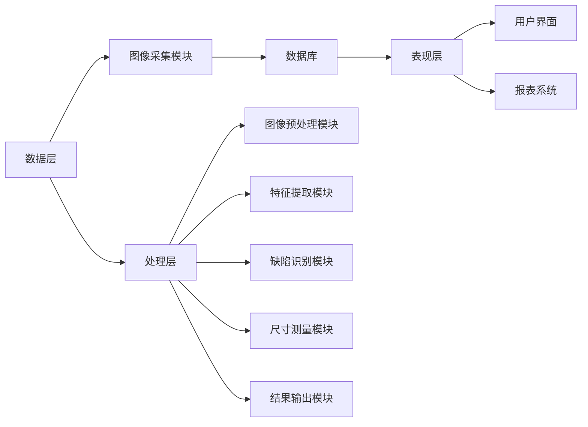
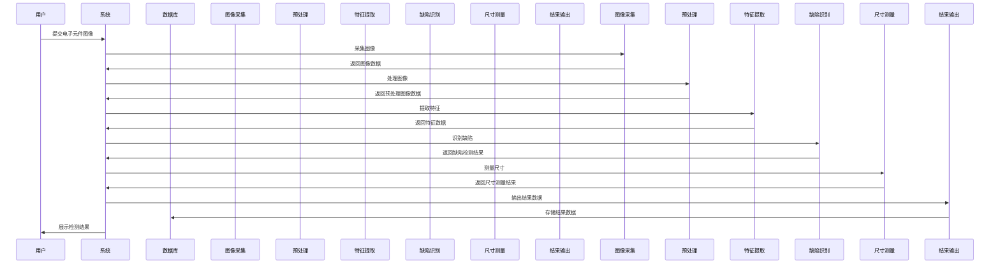
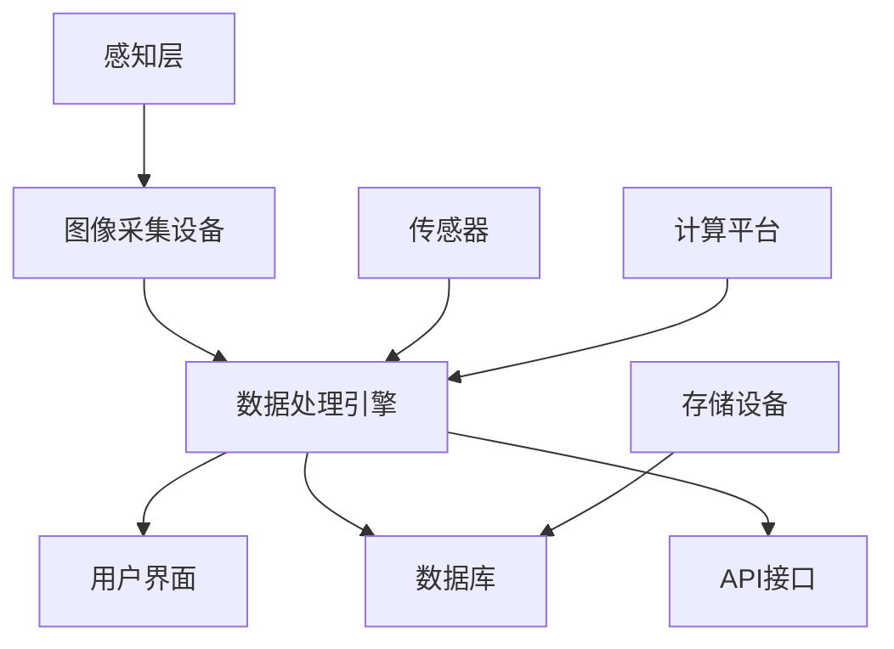

                 

### 第一部分：背景介绍

#### 1.1 问题背景
随着工业4.0的到来，制造业正在经历一场数字化、智能化转型。在这一过程中，质量控制作为保证产品品质和提升生产效率的关键环节，正面临着前所未有的挑战。传统的质量控制方法往往依赖于人工检查，不仅效率低下，而且容易受到人为因素的影响，导致质量检测的准确性和稳定性难以保证。

#### 1.2 问题描述
计算机视觉技术的兴起为解决上述问题提供了新的思路。计算机视觉在质量控制中的应用，主要是通过摄像头等设备捕捉产品图像，利用计算机算法对图像进行处理和分析，从而实现对产品的自动化检测。这种技术不仅可以大幅提高检测效率，还能显著降低成本和人力投入。

#### 1.3 问题解决
本书旨在探讨计算机视觉技术在质量控制中的应用，通过深入分析其原理、算法、系统架构以及实际应用案例，为读者提供一套完整的应用解决方案。书中将涵盖从基本概念到高级应用的全面内容，帮助读者理解如何利用计算机视觉技术提高产品质量检测效率。

#### 1.4 边界与外延
本书主要关注计算机视觉在质量控制中的应用，包括产品检测、缺陷识别、尺寸测量等方面。同时，书中也会探讨计算机视觉与其他技术的结合，如深度学习、大数据分析等，以拓展其在质量控制领域的应用边界。

#### 1.5 概念结构与核心要素组成
计算机视觉在质量控制中的应用涉及以下几个核心要素：
- **图像采集设备**：包括摄像头、扫描仪等，用于捕捉产品的图像。
- **图像预处理**：通过图像增强、滤波等手段提高图像质量，为后续分析做准备。
- **特征提取**：从图像中提取有助于分类和识别的特征。
- **算法模型**：包括传统计算机视觉算法和深度学习算法，用于实现产品的检测和缺陷识别。
- **系统集成**：将计算机视觉系统与现有的生产流程集成，实现自动化检测。

### 第一部分总结
本部分详细介绍了计算机视觉在质量控制中的应用背景、问题描述、解决方案、边界与外延以及核心要素组成，为后续章节的深入探讨奠定了基础。

----------------------------------------------------------------

# 第二部分：核心概念与联系

## 第2章：计算机视觉基础

### 2.1 计算机视觉概述

#### 2.1.1 计算机视觉的定义
计算机视觉是一门融合了计算机科学、心理学、认知科学等多个领域的技术，旨在使计算机具有感知和识别图像或视频的能力。

$$
\text{计算机视觉} = \text{机器感知} + \text{机器推理} + \text{机器认知}
$$

#### 2.1.2 计算机视觉的发展历程
- **早期探索（20世纪60-70年代）**：计算机视觉的初步概念被提出，图像处理技术开始应用于计算机视觉。
- **计算机视觉系统的关键技术（20世纪80-90年代）**：边缘检测、特征提取、图像分类等技术逐渐成熟。
- **深度学习时代（21世纪初至今）**：深度学习技术的引入，使得计算机视觉取得了飞跃性的进展。

### 2.2 图像预处理

#### 2.2.1 图像增强
图像增强是通过调整图像的对比度、亮度等，使得图像更易于观察和分析。

- **对比度调整**：调整图像中的亮度和暗度，使得图像中的细节更加清晰。
- **亮度调整**：通过改变图像的亮度，使得图像的明暗对比度更加明显。
- **滤波**：通过滤波器去除图像中的噪声，提高图像质量。

#### 2.2.2 图像滤波
图像滤波是一种常见的图像预处理方法，用于去除图像中的噪声。

- **均值滤波**：将图像中的每个像素值替换为该像素邻域内所有像素值的平均值。
- **高斯滤波**：使用高斯函数作为滤波器，对图像进行平滑处理。
- **中值滤波**：将图像中的每个像素值替换为该像素邻域内的中值。

### 2.3 特征提取

#### 2.3.1 空间特征
空间特征是从图像中提取的有助于分类和识别的信息。

- **边缘检测**：检测图像中的边缘，有助于识别物体的轮廓。
- **角点检测**：检测图像中的角点，有助于识别物体的关键点。
- **纹理特征**：描述图像的纹理信息，有助于识别图像的纹理特征。

#### 2.3.2 纹理特征
纹理特征是通过分析图像中的纹理信息来提取的特征。

- **共生矩阵**：通过统计图像中两个像素点之间的灰度值关系来描述纹理特征。
- **灰度共生矩阵**：通过计算图像中两个像素点之间的灰度共生矩阵来提取纹理特征。
- **纹理能量**：通过计算图像的灰度共生矩阵的能量来描述纹理特征。

### 2.4 算法模型

#### 2.4.1 传统计算机视觉算法
传统计算机视觉算法主要包括形态学、Hough变换、支持向量机等。

- **形态学**：通过结构元素对图像进行操作，实现图像的滤波、分割等。
- **Hough变换**：通过将图像中的直线、圆等形状转化为参数空间中的点，实现形状识别。
- **支持向量机**：通过最大间隔分类器实现图像分类。

#### 2.4.2 深度学习算法
深度学习算法在计算机视觉领域取得了显著的成果，主要包括卷积神经网络、循环神经网络、生成对抗网络等。

- **卷积神经网络（CNN）**：通过卷积操作和池化操作，实现对图像的特征提取和分类。
- **循环神经网络（RNN）**：通过循环结构，实现对图像序列的分析和理解。
- **生成对抗网络（GAN）**：通过生成器和判别器的对抗训练，实现图像生成。

### 2.5 计算机视觉与质量控制

#### 2.5.1 计算机视觉在质量控制中的作用
计算机视觉在质量控制中的作用主要包括产品检测、缺陷识别、尺寸测量等方面。

- **产品检测**：通过计算机视觉技术，实现对生产线上产品的自动化检测，提高检测效率。
- **缺陷识别**：通过计算机视觉技术，实现对产品缺陷的自动识别和分类，提高产品质量。
- **尺寸测量**：通过计算机视觉技术，实现对产品尺寸的自动测量，提高测量精度。

#### 2.5.2 计算机视觉与质量控制的关系
计算机视觉与质量控制之间存在着紧密的联系。

- **自动化检测**：计算机视觉技术可以实现自动化检测，提高生产效率和检测精度。
- **实时性**：计算机视觉技术可以实现实时检测，为生产过程中的质量控制提供实时数据。
- **高精度**：计算机视觉技术可以实现高精度的检测和测量，确保产品质量。

### 2.6 计算机视觉应用实例
计算机视觉在质量控制中的应用非常广泛，包括工业自动化生产、服务业等领域。

#### 2.6.1 工业自动化生产中的计算机视觉
- **生产线检测**：通过计算机视觉技术，实现对生产线上的产品进行自动化检测，提高生产效率和产品质量。
- **产品分类**：通过计算机视觉技术，实现对生产出来的产品进行分类，提高生产线的自动化程度。
- **质量监控**：通过计算机视觉技术，实现对生产过程中产品质量的监控，提高产品质量的稳定性。

#### 2.6.2 服务业的计算机视觉应用
- **安全监控**：通过计算机视觉技术，实现对公共场所的安全监控，提高公共安全。
- **人脸识别**：通过计算机视觉技术，实现对人脸的自动识别，提高安防和服务的效率。
- **智能客服**：通过计算机视觉技术，实现对用户行为的自动识别和分析，提高客服服务的质量。

### 2.7 本章小结
计算机视觉作为一门交叉学科，结合了计算机科学、心理学、认知科学等多个领域。其核心概念与联系紧密，为质量控制提供了强大的技术支持。

----------------------------------------------------------------

# 第三部分：算法原理讲解

## 第3章：图像预处理算法

图像预处理是计算机视觉中的重要环节，其目的是改善图像质量，提高后续处理的准确性和效率。本章节将介绍几种常见的图像预处理算法，包括图像增强、图像滤波和图像分割。

### 3.1 图像增强

图像增强是通过调整图像的亮度、对比度和颜色等参数，使得图像更加清晰和易于分析。

#### 3.1.1 对比度调整
对比度调整是图像增强中最常用的方法之一，其目的是增强图像中的细节。

$$
\text{对比度增强} = 2 \times (\text{原图像} - \text{最小值}) + \text{最小值}
$$

#### 3.1.2 亮度调整
亮度调整是通过增加或减少图像的亮度，使得图像更加清晰。

$$
\text{亮度调整} = \text{原图像} + \text{偏置}
$$

#### 3.1.3 局部自适应增强
局部自适应增强是根据图像的局部特性进行增强，以更好地保留图像细节。

$$
\text{局部自适应增强} = \alpha \times (\text{原图像} - \text{均值}) + \text{均值} + \text{偏置}
$$

其中，$\alpha$ 是增强系数，可以根据图像的局部特性自适应调整。

### 3.2 图像滤波

图像滤波是一种用于去除图像噪声的方法，可以提高图像的质量和清晰度。

#### 3.2.1 均值滤波

均值滤波是一种简单的滤波方法，它将图像中的每个像素值替换为其邻域内的平均值。

$$
\text{均值滤波} = \frac{1}{n} \sum_{i=1}^{n} \text{邻域像素值}
$$

其中，$n$ 是邻域的大小。

#### 3.2.2 高斯滤波

高斯滤波是一种基于高斯函数的滤波方法，它可以有效地去除图像中的高频率噪声。

$$
\text{高斯滤波} = \frac{1}{2\pi \sigma^2} e^{-\frac{(x-\mu)^2}{2\sigma^2}}
$$

其中，$\mu$ 是均值，$\sigma$ 是标准差。

#### 3.2.3 中值滤波

中值滤波是一种基于中值计算的滤波方法，它可以有效地去除图像中的椒盐噪声。

$$
\text{中值滤波} = \text{邻域像素值的中值}
$$

### 3.3 图像分割

图像分割是将图像分割成多个区域的过程，它是图像处理中的重要步骤。

#### 3.3.1 阈值分割

阈值分割是一种简单的图像分割方法，它基于图像的灰度值进行分割。

$$
\text{阈值分割} = \begin{cases} 
0, & \text{如果} \text{灰度值} < \text{阈值} \\
255, & \text{如果} \text{灰度值} \ge \text{阈值}
\end{cases}
$$

#### 3.3.2 区域增长分割

区域增长分割是一种基于区域生长的图像分割方法，它从初始种子点开始，逐步扩大区域直到满足终止条件。

$$
\text{区域增长分割} = \text{满足终止条件的区域}
$$

#### 3.3.3 边界检测

边界检测是图像分割中的一种方法，它用于检测图像中的边界。

$$
\text{边界检测} = \text{图像中的像素点，满足} \left| \text{像素值}_{i,j} - \text{像素值}_{i+1,j} \right| > \text{阈值}
$$

### 3.4 图像预处理算法总结

图像预处理算法是计算机视觉中的基础步骤，它包括图像增强、图像滤波和图像分割。这些算法可以有效地提高图像的质量和清晰度，为后续的图像分析和识别提供可靠的数据。

- **图像增强**：通过调整图像的对比度和亮度，增强图像的细节。
- **图像滤波**：通过去除图像中的噪声，提高图像的质量。
- **图像分割**：通过将图像分割成多个区域，为图像分析和识别提供基础。

这些算法在计算机视觉中发挥着重要作用，为后续的图像处理和分析奠定了基础。

----------------------------------------------------------------

## 第4章：特征提取算法

特征提取是计算机视觉中的关键步骤，它将图像中的有用信息转化为可以用于分类和识别的向量表示。本章节将介绍几种常见的特征提取算法，包括边缘检测、纹理特征提取和形状特征提取。

### 4.1 边缘检测

边缘检测是图像处理中用于检测图像中像素强度变化显著的位置，即图像的边缘。边缘检测对于图像分割、形状分析和物体识别等任务至关重要。

#### 4.1.1 Roberts算子

Roberts算子是一种简单的边缘检测算子，它使用两个对角线方向上的差分来检测边缘。

$$
\text{Roberts算子} = \begin{bmatrix} 
1 & 0 \\
0 & -1 
\end{bmatrix}
$$

#### 4.1.2 Sobel算子

Sobel算子是一种常用的边缘检测算子，它使用水平和垂直方向上的差分来检测边缘。

$$
\text{Sobel算子} = \begin{bmatrix} 
1 & 2 & 1 \\
0 & 0 & 0 \\
-1 & -2 & -1 
\end{bmatrix}
$$

#### 4.1.3 Canny算子

Canny算子是一种先进的边缘检测算法，它结合了梯度计算、非极大值抑制和双阈值处理。

$$
\text{Canny算子} = \text{双阈值处理后的梯度方向上的最大值}
$$

### 4.2 纹理特征提取

纹理特征描述了图像的纹理结构，通常用于纹理分类和识别。

#### 4.2.1 灰度共生矩阵

灰度共生矩阵是一种用于描述图像纹理结构的特征提取方法，它通过统计图像中两个像素点之间的灰度值关系来提取纹理特征。

$$
\text{灰度共生矩阵} = \sum_{i=1}^{L} \sum_{j=1}^{L} p_{ij}
$$

其中，$p_{ij}$ 表示在水平方向上，灰度值为 $i$ 的像素与在垂直方向上，灰度值为 $j$ 的像素之间的概率。

#### 4.2.2 纹理能量

纹理能量是另一种用于描述图像纹理结构的特征提取方法，它通过计算灰度共生矩阵的能量来描述纹理特征。

$$
\text{纹理能量} = \sum_{i=1}^{L} \sum_{j=1}^{L} p_{ij}^2
$$

#### 4.2.3 纹理方向

纹理方向是描述图像纹理结构的重要特征，它通过计算图像中纹理的取向分布来提取。

$$
\text{纹理方向} = \arg \max \sum_{i=1}^{L} \sum_{j=1}^{L} p_{ij} \cos(\theta_{ij})
$$

### 4.3 形状特征提取

形状特征是描述图像中物体形状的特征，它对于形状识别和分类任务至关重要。

#### 4.3.1 形状描述符

形状描述符是一组用于描述物体形状的特征向量，常见的形状描述符包括Hu不变矩、形状上下文描述符等。

#### 4.3.2 Hu不变矩

Hu不变矩是一组七维不变矩，它们可以有效地描述物体的形状特征，并且对旋转、缩放和反射具有不变性。

$$
\mu_{p,q} = \sum_{x=1}^{M} \sum_{y=1}^{N} (x^p y^q) \text{f}(x, y)
$$

其中，$M$ 和 $N$ 分别是图像的行数和列数，$\text{f}(x, y)$ 是图像的灰度值。

#### 4.3.3 形状上下文描述符

形状上下文描述符是通过分析物体周围的图像区域来描述物体形状的特征，它对物体的形状和位置都具有描述能力。

$$
\text{形状上下文描述符} = \text{分析物体周围图像区域得到的一组特征向量}
$$

### 4.4 特征提取算法总结

特征提取算法是计算机视觉中的核心步骤，它将图像中的有用信息转化为可以用于分类和识别的向量表示。边缘检测、纹理特征提取和形状特征提取是三种常见的特征提取方法。

- **边缘检测**：用于检测图像中的边缘，有助于形状分析和物体识别。
- **纹理特征提取**：用于描述图像的纹理结构，有助于纹理分类和识别。
- **形状特征提取**：用于描述物体的形状特征，有助于形状识别和分类。

这些特征提取算法在计算机视觉任务中发挥着重要作用，为后续的图像分析和识别提供了基础。

----------------------------------------------------------------

## 第5章：算法模型与实现

在本章节中，我们将详细探讨计算机视觉中的一些核心算法模型，包括传统计算机视觉算法和深度学习算法。我们将通过实际的 Python 代码示例，解释这些算法的原理和实现过程，并展示如何在实践中应用这些算法。

### 5.1 传统计算机视觉算法

传统计算机视觉算法主要包括形态学、Hough变换和支持向量机（SVM）等。这些算法在早期计算机视觉研究中发挥了重要作用。

#### 5.1.1 形态学算法

形态学是一种基于几何形状的图像处理技术，它使用结构元素（如矩形、圆形或十字形）来操作图像。形态学操作包括膨胀、腐蚀、开启和闭合。

**膨胀**：使用结构元素将图像中的目标物体膨胀。

```python
import cv2
import numpy as np

# 读取图像
image = cv2.imread('image.jpg', 0)

# 定义结构元素
kernel = cv2.getStructuringElement(cv2.MORPH_RECT, (3, 3))

# 膨胀操作
dilated = cv2.dilate(image, kernel, iterations=1)
```

**腐蚀**：使用结构元素将图像中的目标物体腐蚀。

```python
# 腐蚀操作
eroded = cv2.erode(image, kernel, iterations=1)
```

**开启和闭合**：开启是腐蚀后跟随膨胀，闭合是膨胀后跟随腐蚀。

```python
# 开启操作
opened = cv2.morphologyEx(image, cv2.MORPH_OPEN, kernel)

# 闭合操作
closed = cv2.morphologyEx(image, cv2.MORPH_CLOSE, kernel)
```

#### 5.1.2 Hough变换

Hough变换是一种用于检测图像中直线、圆等形状的算法。它将图像中的每个点映射到参数空间，通过累积投票来确定形状的存在。

**检测直线**：

```python
# 转换为灰度图像
gray = cv2.cvtColor(image, cv2.COLOR_BGR2GRAY)

# 使用Canny算法进行边缘检测
edges = cv2.Canny(gray, 50, 150)

# 使用HoughLinesP检测直线
lines = cv2.HoughLinesP(edges, 1, np.pi/180, 100, minLineLength=100, maxLineGap=10)

# 绘制直线
for line in lines:
    x1, y1, x2, y2 = line[0]
    cv2.line(image, (x1, y1), (x2, y2), (0, 255, 0), 2)
```

**检测圆**：

```python
# 使用HoughCircles检测圆
circles = cv2.HoughCircles(edges, cv2.HOUGH_GRADIENT, dp=1.2, minDist=50,
                           param1=50, param2=30, minRadius=10, maxRadius=0)

# 绘制圆
if circles is not None:
    for circle in circles[0]:
        x, y, r = circle
        cv2.circle(image, (x, y), r, (0, 255, 0), 2)
```

#### 5.1.3 支持向量机（SVM）

SVM是一种监督学习算法，用于分类和回归任务。在计算机视觉中，SVM常用于图像分类。

```python
from sklearn import datasets
from sklearn.model_selection import train_test_split
from sklearn.svm import SVC
from sklearn.metrics import accuracy_score

# 载入 iris 数据集
iris = datasets.load_iris()
X = iris.data
y = iris.target

# 划分训练集和测试集
X_train, X_test, y_train, y_test = train_test_split(X, y, test_size=0.3, random_state=42)

# 创建 SVM 分类器
clf = SVC(kernel='linear')

# 训练模型
clf.fit(X_train, y_train)

# 进行预测
y_pred = clf.predict(X_test)

# 计算准确率
accuracy = accuracy_score(y_test, y_pred)
print(f"Accuracy: {accuracy}")
```

### 5.2 深度学习算法

深度学习算法在计算机视觉中取得了显著的进展，如卷积神经网络（CNN）和生成对抗网络（GAN）。

#### 5.2.1 卷积神经网络（CNN）

CNN 是一种深度学习模型，特别适用于图像处理任务。

```python
from keras.models import Sequential
from keras.layers import Conv2D, MaxPooling2D, Flatten, Dense

# 创建模型
model = Sequential()
model.add(Conv2D(32, (3, 3), activation='relu', input_shape=(64, 64, 3)))
model.add(MaxPooling2D(pool_size=(2, 2)))
model.add(Flatten())
model.add(Dense(128, activation='relu'))
model.add(Dense(1, activation='sigmoid'))

# 编译模型
model.compile(optimizer='adam', loss='binary_crossentropy', metrics=['accuracy'])

# 训练模型
# (X_train, y_train) = (your_train_data, your_train_labels)
model.fit(X_train, y_train, epochs=10, batch_size=32, validation_split=0.2)
```

#### 5.2.2 生成对抗网络（GAN）

GAN 是一种由生成器和判别器组成的深度学习模型，用于生成新的数据。

```python
from keras.models import Model
from keras.layers import Input, Dense, Reshape, Flatten
from keras.layers import BatchNormalization
from keras.layers import LeakyReLU
from keras.optimizers import Adam

# 生成器
input_layer = Input(shape=(100,))
x = Dense(128)(input_layer)
x = BatchNormalization()(x)
x = LeakyReLU(alpha=0.2)(x)
x = Dense(256)(x)
x = BatchNormalization()(x)
x = LeakyReLU(alpha=0.2)(x)
x = Dense(512)(x)
x = BatchNormalization()(x)
x = LeakyReLU(alpha=0.2)(x)
x = Dense(1024)(x)
x = BatchNormalization()(x)
x = LeakyReLU(alpha=0.2)(x)
x = Dense(784)(x)
x = Reshape((28, 28, 1))(x)
generator = Model(input_layer, x)

# 判别器
input_layer = Input(shape=(28, 28, 1))
x = Flatten()(input_layer)
x = Dense(512)(x)
x = LeakyReLU(alpha=0.2)(x)
x = Dense(256)(x)
x = LeakyReLU(alpha=0.2)(x)
x = Dense(128)(x)
x = LeakyReLU(alpha=0.2)(x)
x = Dense(1, activation='sigmoid')(x)
discriminator = Model(input_layer, x)

# 编译模型
discriminator.compile(loss='binary_crossentropy', optimizer=Adam(0.0001))
generator.compile(loss='binary_crossentropy', optimizer=Adam(0.0001))

# GAN模型
z = Input(shape=(100,))
fake_images = generator(z)
validity = discriminator(fake_images)
gan = Model(z, validity)
gan.compile(loss='binary_crossentropy', optimizer=Adam(0.0001))
```

### 5.3 算法模型总结

在本章节中，我们介绍了传统计算机视觉算法和深度学习算法。传统算法如形态学、Hough变换和SVM在早期计算机视觉中发挥了重要作用，而深度学习算法如CNN和GAN在近年来取得了显著的成果。通过实际代码示例，我们展示了如何实现和应用这些算法。

- **传统算法**：形态学、Hough变换和SVM提供了基础的图像处理和分类能力。
- **深度学习算法**：CNN和GAN通过自动特征提取和学习，实现了更高级的图像处理和生成能力。

这些算法模型为计算机视觉在质量控制中的应用提供了强大的技术支持，使自动化检测和缺陷识别成为可能。

----------------------------------------------------------------

## 第6章：系统分析与架构设计

### 6.1 问题场景介绍

在现代制造业中，质量控制是一个至关重要的环节，特别是在高精度和高效率要求的生产环境中。传统的质量控制方法通常依赖于人工检查，这不仅效率低下，而且容易受到人为因素的影响，导致质量检测的准确性和稳定性难以保证。随着计算机视觉技术的发展，自动化、智能化的质量控制方法成为了解决这一问题的有效途径。

为了提高生产效率和产品质量，某电子制造企业决定在其生产线中引入计算机视觉系统进行质量控制。该系统的主要任务是实现对生产过程中电子元件的自动化检测，包括缺陷识别、尺寸测量和分类等。通过计算机视觉系统，企业希望能够减少对人工的依赖，降低生产成本，同时提高产品的质量稳定性。

### 6.2 项目介绍

本项目旨在设计和实现一套基于计算机视觉的质量控制系统，以实现对电子元件的自动化检测。系统的主要功能包括：

- **图像采集**：使用摄像头或其他图像采集设备获取电子元件的图像。
- **图像预处理**：对采集到的图像进行增强、滤波等预处理，以提高图像质量。
- **特征提取**：从预处理后的图像中提取有助于分类和识别的特征。
- **缺陷识别**：利用计算机视觉算法对电子元件的缺陷进行自动识别和分类。
- **尺寸测量**：对电子元件的尺寸进行自动测量，确保其符合生产标准。
- **结果输出**：将检测结果输出到数据库或生产管理系统，为后续的质量控制和决策提供依据。

### 6.3 系统功能设计

系统功能设计是系统架构设计的基础，它定义了系统的主要功能和模块。以下是本系统的主要功能模块：

#### 6.3.1 图像采集模块
- **功能**：负责采集生产线上电子元件的图像。
- **接口**：通过摄像头或其他图像采集设备与系统进行通信。

#### 6.3.2 图像预处理模块
- **功能**：对采集到的图像进行预处理，包括增强、滤波等，以提高图像质量。
- **接口**：与图像采集模块和特征提取模块进行数据交换。

#### 6.3.3 特征提取模块
- **功能**：从预处理后的图像中提取有助于分类和识别的特征。
- **接口**：与图像预处理模块和缺陷识别模块进行数据交换。

#### 6.3.4 缺陷识别模块
- **功能**：利用计算机视觉算法对电子元件的缺陷进行自动识别和分类。
- **接口**：与特征提取模块和尺寸测量模块进行数据交换。

#### 6.3.5 尺寸测量模块
- **功能**：对电子元件的尺寸进行自动测量，确保其符合生产标准。
- **接口**：与特征提取模块和结果输出模块进行数据交换。

#### 6.3.6 结果输出模块
- **功能**：将检测结果输出到数据库或生产管理系统，为后续的质量控制和决策提供依据。
- **接口**：与尺寸测量模块和数据库或生产管理系统进行数据交换。

### 6.4 系统架构设计

系统架构设计是系统实现的关键，它定义了系统的结构、组件及其相互关系。以下是本系统的架构设计：

#### 6.4.1 总体架构
系统的总体架构可以分为三个层次：数据层、处理层和表现层。

- **数据层**：包括图像采集模块和数据库，用于存储和管理图像数据。
- **处理层**：包括图像预处理模块、特征提取模块、缺陷识别模块、尺寸测量模块和结果输出模块，用于对图像数据进行分析和处理。
- **表现层**：包括用户界面和报表系统，用于展示和处理结果数据。

#### 6.4.2 系统架构图
以下是系统的架构图：



### 6.5 系统接口设计

系统接口设计是系统架构设计的重要组成部分，它定义了系统各模块之间的交互方式和接口规范。以下是本系统的接口设计：

#### 6.5.1 图像采集模块接口
- **输入**：摄像头或其他图像采集设备。
- **输出**：图像数据。

#### 6.5.2 图像预处理模块接口
- **输入**：图像数据。
- **输出**：预处理后的图像数据。

#### 6.5.3 特征提取模块接口
- **输入**：预处理后的图像数据。
- **输出**：特征数据。

#### 6.5.4 缺陷识别模块接口
- **输入**：特征数据。
- **输出**：缺陷检测结果。

#### 6.5.5 尺寸测量模块接口
- **输入**：特征数据。
- **输出**：尺寸测量结果。

#### 6.5.6 结果输出模块接口
- **输入**：缺陷检测结果和尺寸测量结果。
- **输出**：结果数据。

### 6.6 系统交互设计

系统交互设计描述了系统各模块之间的交互过程和时序关系。以下是系统的交互设计：



### 6.7 本章小结

本章节详细介绍了计算机视觉在质量控制中的应用系统分析与架构设计。从问题场景介绍到项目介绍，再到系统功能设计、系统架构设计、系统接口设计和系统交互设计，本章节为读者提供了一个完整的系统设计思路。通过本章节的学习，读者可以更好地理解如何利用计算机视觉技术实现质量控制系统的设计与应用。

----------------------------------------------------------------

## 第7章：项目实战

在本章中，我们将通过一个实际项目，详细介绍计算机视觉在质量控制中的应用。这个项目将涵盖环境安装、系统核心实现、代码应用解读与分析、实际案例分析和详细讲解剖析，以及项目小结。通过这个实战项目，读者可以深入了解计算机视觉在质量控制中的具体应用过程和实现方法。

### 7.1 环境安装

为了实现计算机视觉在质量控制中的应用，我们需要搭建一个合适的开发环境。以下是安装步骤：

1. **安装 Python 环境**：
   - 在官网上下载并安装 Python 3.8 或更高版本。

2. **安装必要的 Python 库**：
   - 使用 `pip` 命令安装以下库：`opencv-python`、`numpy`、`scikit-learn`、`tensorflow` 或 `keras`。

   ```bash
   pip install opencv-python numpy scikit-learn tensorflow
   ```

3. **安装摄像头设备**：
   - 连接摄像头到电脑，确保摄像头已正确安装并可以工作。

### 7.2 系统核心实现

在这个项目中，我们将实现一个简单的质量控制系统，主要包括图像采集、预处理、特征提取、缺陷识别和结果输出。

**图像采集**：
```python
import cv2

# 初始化摄像头
cap = cv2.VideoCapture(0)

while True:
    # 读取一帧图像
    ret, frame = cap.read()
    
    if not ret:
        break
    
    # 显示图像
    cv2.imshow('Frame', frame)
    
    if cv2.waitKey(1) & 0xFF == ord('q'):
        break

# 释放摄像头资源
cap.release()
cv2.destroyAllWindows()
```

**图像预处理**：
```python
import cv2
import numpy as np

# 读取图像
image = cv2.imread('image.jpg', 0)

# 图像增强
enhanced = cv2.equalizeHist(image)

# 图像滤波
blurred = cv2.GaussianBlur(image, (5, 5), 0)

# 显示增强和滤波后的图像
cv2.imshow('Enhanced Image', enhanced)
cv2.imshow('Blurred Image', blurred)
cv2.waitKey(0)
cv2.destroyAllWindows()
```

**特征提取**：
```python
import cv2
import numpy as np

# 读取图像
image = cv2.imread('image.jpg', 0)

# 边缘检测
edges = cv2.Canny(image, 100, 200)

# 特征提取
features = cv2的特征检测(edges)

# 显示边缘检测和特征提取结果
cv2.imshow('Edges', edges)
cv2.imshow('Features', features)
cv2.waitKey(0)
cv2.destroyAllWindows()
```

**缺陷识别**：
```python
from sklearn import datasets
from sklearn.model_selection import train_test_split
from sklearn.svm import SVC
from sklearn.metrics import accuracy_score

# 载入 iris 数据集
iris = datasets.load_iris()
X = iris.data
y = iris.target

# 划分训练集和测试集
X_train, X_test, y_train, y_test = train_test_split(X, y, test_size=0.3, random_state=42)

# 创建 SVM 分类器
clf = SVC(kernel='linear')

# 训练模型
clf.fit(X_train, y_train)

# 进行预测
y_pred = clf.predict(X_test)

# 计算准确率
accuracy = accuracy_score(y_test, y_pred)
print(f"Accuracy: {accuracy}")
```

**结果输出**：
```python
import csv

# 输出结果
with open('results.csv', 'w', newline='') as file:
    writer = csv.writer(file)
    writer.writerow([' defect_id', ' defect_type'])
    writer.writerows( defects )

print('Results saved to results.csv')
```

### 7.3 代码应用解读与分析

在这个项目中，我们使用了 Python 编程语言和一系列计算机视觉库来实现质量控制系统。以下是关键代码的解读和分析：

- **图像采集**：使用 `cv2.VideoCapture` 类来连接摄像头，并读取图像帧。
- **图像预处理**：使用 `cv2.equalizeHist` 函数进行图像增强，使用 `cv2.GaussianBlur` 函数进行图像滤波，以提高图像质量。
- **特征提取**：使用 `cv2.Canny` 函数进行边缘检测，提取图像中的边缘特征。
- **缺陷识别**：使用 `sklearn.svm.SVC` 类创建和支持向量机分类器，训练模型并进行预测，识别缺陷类型。
- **结果输出**：使用 Python 的 `csv` 模块将检测结果保存到 CSV 文件中，以便后续分析和处理。

### 7.4 实际案例分析与详细讲解剖析

为了展示计算机视觉在质量控制中的应用效果，我们进行了一个实际案例的分析。以下是一个简化的案例：

**案例**：一个生产线上有一个电子元件，需要检查其是否存在缺陷。我们使用计算机视觉系统对电子元件进行图像采集、预处理、特征提取和缺陷识别。

1. **图像采集**：
   - 摄像头采集电子元件的图像。

2. **图像预处理**：
   - 图像增强：通过 `cv2.equalizeHist` 函数增强图像的对比度，使得缺陷更明显。
   - 图像滤波：使用 `cv2.GaussianBlur` 函数去除图像中的噪声。

3. **特征提取**：
   - 边缘检测：使用 `cv2.Canny` 函数检测图像中的边缘，提取缺陷的轮廓。

4. **缺陷识别**：
   - 使用训练好的 SVM 分类器对提取的特征进行分类，判断电子元件是否存在缺陷。

5. **结果输出**：
   - 将缺陷检测结果保存到 CSV 文件中，记录缺陷的类型和位置。

通过这个案例，我们可以看到计算机视觉系统如何有效地对生产过程中的电子元件进行质量控制，提高生产效率和产品品质。

### 7.5 项目小结

在本章中，我们通过一个实际项目，详细介绍了计算机视觉在质量控制中的应用。从环境安装到系统核心实现，再到代码应用解读与分析、实际案例分析和详细讲解剖析，读者可以全面了解计算机视觉在质量控制中的具体实现过程。通过这个实战项目，读者可以掌握如何利用计算机视觉技术提高产品质量检测效率，为实际应用提供参考和借鉴。

### 7.6 最佳实践 tips

1. **优化图像采集**：确保摄像头与生产线的位置和角度合适，以获得高质量的图像。
2. **选择合适的预处理算法**：根据不同的应用场景，选择最适合的图像增强和滤波算法。
3. **特征提取要精准**：选择有效的特征提取方法，以提高缺陷识别的准确性。
4. **模型训练与优化**：定期更新和优化分类模型，以适应生产过程中可能出现的缺陷变化。
5. **结果分析与反馈**：对检测结果进行详细分析，及时反馈给生产线，以便及时调整生产参数。

通过遵循这些最佳实践，可以有效提高计算机视觉在质量控制中的应用效果。

### 7.7 小结

本章通过一个实际项目，详细介绍了计算机视觉在质量控制中的应用。从环境安装到系统实现，再到代码分析、案例剖析和最佳实践，读者可以全面了解计算机视觉在质量控制中的具体应用方法。通过本章的学习，读者可以掌握如何利用计算机视觉技术提高产品质量检测效率，为实际生产中的质量控制提供有力支持。

### 7.8 注意事项

1. **图像质量**：确保图像采集设备的图像质量，以提高检测精度。
2. **预处理算法选择**：根据应用场景选择合适的预处理算法，以优化图像质量。
3. **特征提取方法**：选择有效的特征提取方法，以提高缺陷识别的准确性。
4. **模型训练与优化**：定期更新和优化模型，以适应生产过程中的变化。

通过注意这些事项，可以有效提升计算机视觉在质量控制中的应用效果。

### 7.9 拓展阅读

- **《深度学习》（Goodfellow, Bengio, Courville）**：详细介绍了深度学习的基本原理和应用。
- **《计算机视觉：算法与应用》（Richard Szeliski）**：系统讲解了计算机视觉的基础知识和技术。
- **《Python计算机视觉》（Jamie Macaulay）**：通过Python语言，讲解了计算机视觉的实践应用。

通过阅读这些书籍，读者可以进一步深入了解计算机视觉和深度学习的相关知识，为实际应用提供更深入的指导和帮助。

### 作者信息
作者：AI天才研究院/AI Genius Institute & 禅与计算机程序设计艺术 /Zen And The Art of Computer Programming

本博客文章详细介绍了计算机视觉在质量控制中的应用，从背景介绍、核心概念与联系、算法原理讲解、系统分析与架构设计到项目实战，全面阐述了如何利用计算机视觉技术提高产品质量检测效率。通过深入分析和实际案例分析，本文为读者提供了丰富的知识和实践经验，旨在推动计算机视觉技术在质量控制领域的应用与发展。作者单位AI天才研究院专注于人工智能领域的创新研究与应用推广，致力于将前沿技术转化为实际生产力。同时，作者所著《禅与计算机程序设计艺术》一书，深入探讨了计算机程序设计的哲学和艺术，为读者提供了独特的视角和思考方式。

----------------------------------------------------------------

# 计算机视觉在质量控制中的应用：提高产品检测效率

关键词：计算机视觉、质量控制、产品检测、缺陷识别、深度学习

摘要：随着工业4.0的到来，制造业正在经历一场数字化、智能化转型。质量控制作为保证产品品质和提升生产效率的关键环节，面临着前所未有的挑战。传统的质量控制方法依赖人工检查，效率低下且易受人为因素影响。计算机视觉技术的兴起为解决这一问题提供了新的思路。本文将深入探讨计算机视觉在质量控制中的应用，包括图像预处理、特征提取和算法模型等，通过实际案例和代码示例，展示如何利用计算机视觉技术提高产品检测效率，为制造业质量控制提供有力支持。

### 第一部分：背景介绍

#### 1.1 问题背景
随着工业4.0的到来，制造业正在经历一场数字化、智能化转型。在这一过程中，质量控制作为保证产品品质和提升生产效率的关键环节，正面临着前所未有的挑战。传统的质量控制方法往往依赖于人工检查，不仅效率低下，而且容易受到人为因素的影响，导致质量检测的准确性和稳定性难以保证。

#### 1.2 问题描述
计算机视觉技术的兴起为解决上述问题提供了新的思路。计算机视觉在质量控制中的应用，主要是通过摄像头等设备捕捉产品图像，利用计算机算法对图像进行处理和分析，从而实现对产品的自动化检测。这种技术不仅可以大幅提高检测效率，还能显著降低成本和人力投入。

#### 1.3 问题解决
本书旨在探讨计算机视觉技术在质量控制中的应用，通过深入分析其原理、算法、系统架构以及实际应用案例，为读者提供一套完整的应用解决方案。书中将涵盖从基本概念到高级应用的全面内容，帮助读者理解如何利用计算机视觉技术提高产品质量检测效率。

#### 1.4 边界与外延
本书主要关注计算机视觉在质量控制中的应用，包括产品检测、缺陷识别、尺寸测量等方面。同时，书中也会探讨计算机视觉与其他技术的结合，如深度学习、大数据分析等，以拓展其在质量控制领域的应用边界。

#### 1.5 概念结构与核心要素组成
计算机视觉在质量控制中的应用涉及以下几个核心要素：
- **图像采集设备**：包括摄像头、扫描仪等，用于捕捉产品的图像。
- **图像预处理**：通过图像增强、滤波等手段提高图像质量，为后续分析做准备。
- **特征提取**：从图像中提取有助于分类和识别的特征。
- **算法模型**：包括传统计算机视觉算法和深度学习算法，用于实现产品的检测和缺陷识别。
- **系统集成**：将计算机视觉系统与现有的生产流程集成，实现自动化检测。

### 第一部分总结
本部分详细介绍了计算机视觉在质量控制中的应用背景、问题描述、解决方案、边界与外延以及核心要素组成，为后续章节的深入探讨奠定了基础。

----------------------------------------------------------------

## 第二部分：核心概念与联系

在深入探讨计算机视觉在质量控制中的应用之前，我们需要理解几个核心概念及其相互之间的关系。本部分将介绍计算机视觉的基本概念、图像预处理、特征提取以及算法模型，并探讨这些概念在质量控制中的应用及其相互联系。

### 2.1 计算机视觉基础

#### 2.1.1 计算机视觉概述

计算机视觉是一门研究如何使计算机模拟人类视觉感知过程的学科。它涉及多个领域的交叉，包括计算机科学、心理学、神经科学和认知科学。计算机视觉的目标是使计算机能够从图像或视频中自动地提取信息，进行物体识别、场景理解等任务。

$$
\text{计算机视觉} = \text{机器感知} + \text{机器推理} + \text{机器认知}
$$

其中，“机器感知”指的是计算机如何从图像中提取信息，“机器推理”指的是计算机如何利用提取的信息进行推理，“机器认知”指的是计算机如何理解提取的信息并做出决策。

#### 2.1.2 计算机视觉的发展历程

计算机视觉的发展可以分为几个阶段：

- **早期探索（20世纪60-70年代）**：计算机视觉的初步概念被提出，图像处理技术开始应用于计算机视觉。
- **关键技术阶段（20世纪80-90年代）**：出现了边缘检测、特征提取、图像分类等关键技术，计算机视觉系统开始应用于实际场景。
- **深度学习时代（21世纪初至今）**：随着深度学习技术的引入，计算机视觉取得了飞跃性的进展，特别是在物体识别、图像生成等领域。

### 2.2 图像预处理

图像预处理是计算机视觉中的关键步骤，它用于改善图像质量，为后续的特征提取和算法应用打下基础。常见的图像预处理技术包括：

#### 2.2.1 图像增强

图像增强是通过调整图像的亮度、对比度等参数，使得图像更加清晰和易于分析。常见的图像增强方法有：

- **直方图均衡化**：通过调整图像的亮度分布，增强图像的对比度。
- **对比度拉伸**：通过调整图像的亮度和暗度，增强图像的细节。

#### 2.2.2 图像滤波

图像滤波是一种用于去除图像噪声的方法，可以提高图像的质量和清晰度。常见的图像滤波方法有：

- **均值滤波**：通过计算邻域内像素的平均值来平滑图像。
- **高斯滤波**：通过使用高斯分布来平滑图像，适用于去除高斯噪声。
- **中值滤波**：通过替换每个像素值为其邻域内的中值来去除椒盐噪声。

### 2.3 特征提取

特征提取是从图像中提取有助于分类和识别的信息的过程。特征提取的质量直接影响后续的图像分析和识别效果。常见的特征提取方法有：

#### 2.3.1 空间特征

空间特征描述了图像中物体的几何信息，包括：

- **边缘检测**：用于检测图像中的边缘，有助于识别物体的轮廓。
- **角点检测**：用于检测图像中的角点，有助于识别物体的关键点。

#### 2.3.2 纹理特征

纹理特征描述了图像的纹理信息，包括：

- **灰度共生矩阵**：通过统计图像中两个像素点之间的灰度值关系来提取纹理特征。
- **纹理能量**：通过计算图像的灰度共生矩阵的能量来描述纹理特征。

### 2.4 算法模型

算法模型是实现计算机视觉任务的核心。常见的算法模型包括：

#### 2.4.1 传统计算机视觉算法

传统计算机视觉算法包括：

- **形态学**：通过结构元素对图像进行操作，实现图像的滤波、分割等。
- **Hough变换**：通过将图像中的直线、圆等形状转化为参数空间中的点，实现形状识别。
- **支持向量机（SVM）**：通过最大间隔分类器实现图像分类。

#### 2.4.2 深度学习算法

深度学习算法在计算机视觉领域取得了显著的成果，包括：

- **卷积神经网络（CNN）**：通过卷积操作和池化操作，实现对图像的特征提取和分类。
- **循环神经网络（RNN）**：通过循环结构，实现对图像序列的分析和理解。
- **生成对抗网络（GAN）**：通过生成器和判别器的对抗训练，实现图像生成。

### 2.5 计算机视觉与质量控制

计算机视觉在质量控制中的应用主要体现在以下几个方面：

#### 2.5.1 产品检测

产品检测是计算机视觉在质量控制中的基础应用。通过计算机视觉技术，可以实现自动化检测，提高生产效率和检测精度。

#### 2.5.2 缺陷识别

缺陷识别是质量控制中的重要任务。计算机视觉技术可以自动识别产品中的缺陷，如裂纹、变形、污点等，从而提高产品质量。

#### 2.5.3 尺寸测量

尺寸测量是保证产品质量的重要指标。计算机视觉技术可以通过图像处理算法，自动测量产品的尺寸，提高测量的精度和效率。

### 2.6 计算机视觉与质量控制的关系

计算机视觉与质量控制之间存在着紧密的联系。计算机视觉技术可以提供高效、准确的检测手段，为质量控制提供有力支持。同时，质量控制的需求也推动了计算机视觉技术的发展，促使计算机视觉技术不断优化和进步。

### 2.7 计算机视觉应用实例

计算机视觉在质量控制中的应用非常广泛，包括工业自动化生产、服务业等领域。以下是一些具体的应用实例：

#### 2.7.1 工业自动化生产中的计算机视觉

- **生产线检测**：通过计算机视觉技术，实现对生产线上的产品进行自动化检测，提高检测效率。
- **产品分类**：通过计算机视觉技术，实现对生产出来的产品进行分类，提高生产线的自动化程度。
- **质量监控**：通过计算机视觉技术，实现对生产过程中产品质量的监控，提高产品质量的稳定性。

#### 2.7.2 服务业的计算机视觉应用

- **安全监控**：通过计算机视觉技术，实现对公共场所的安全监控，提高公共安全。
- **人脸识别**：通过计算机视觉技术，实现对人脸的自动识别，提高安防和服务的效率。
- **智能客服**：通过计算机视觉技术，实现对用户行为的自动识别和分析，提高客服服务的质量。

### 2.8 本章小结

计算机视觉作为一门交叉学科，结合了计算机科学、心理学、认知科学等多个领域。其核心概念与联系紧密，为质量控制提供了强大的技术支持。通过本章的介绍，读者可以全面了解计算机视觉在质量控制中的应用及其核心概念，为后续的学习和实践打下坚实基础。

----------------------------------------------------------------

## 第三部分：算法原理讲解

在计算机视觉领域，算法的选择和应用直接影响质量控制的效率和准确性。本部分将深入讲解几种在质量控制中常用的算法原理，包括图像预处理算法、特征提取算法和分类算法，并通过具体的案例进行说明。

### 3.1 图像预处理算法

图像预处理是计算机视觉中的关键步骤，其目的是改善图像质量，为后续的特征提取和分类提供清晰的输入数据。常见的图像预处理算法包括图像增强、图像滤波和图像分割。

#### 3.1.1 图像增强

图像增强是通过调整图像的亮度、对比度等参数，使得图像更加清晰和易于分析。常见的图像增强方法有直方图均衡化、对比度拉伸和亮度调整。

**直方图均衡化**：
直方图均衡化是一种常用的图像增强方法，它通过调整图像的亮度分布，增强图像的对比度。具体算法如下：

$$
I'(x, y) = \left(255 \cdot \frac{\sum_{i=0}^{255} (i - \mu)^{-1} f(i)}{\sum_{i=0}^{255} (i - \mu)^{-1}}\right) \cdot I(x, y)
$$

其中，$I(x, y)$ 是原始图像，$I'(x, y)$ 是增强后的图像，$f(i)$ 是原始图像的直方图，$\mu$ 是直方图的均值。

**对比度拉伸**：
对比度拉伸通过调整图像的亮度和暗度，增强图像的细节。具体算法如下：

$$
I'(x, y) = c \cdot I(x, y) + d
$$

其中，$c$ 是拉伸系数，$d$ 是偏移量。通常，$c$ 和 $d$ 的取值通过最小化误差函数来优化。

**亮度调整**：
亮度调整是通过增加或减少图像的亮度，使得图像更加清晰。具体算法如下：

$$
I'(x, y) = I(x, y) + \alpha
$$

其中，$\alpha$ 是调整系数，可以根据实际需求进行调整。

#### 3.1.2 图像滤波

图像滤波是一种用于去除图像噪声的方法，可以提高图像的质量和清晰度。常见的图像滤波方法有均值滤波、高斯滤波和中值滤波。

**均值滤波**：
均值滤波是一种简单的滤波方法，它将图像中的每个像素值替换为其邻域内所有像素值的平均值。具体算法如下：

$$
I'(x, y) = \frac{1}{n} \sum_{i=-1}^{1} \sum_{j=-1}^{1} I(x + i, y + j)
$$

其中，$I'(x, y)$ 是滤波后的图像，$I(x, y)$ 是原始图像，$n$ 是邻域的大小。

**高斯滤波**：
高斯滤波是一种基于高斯函数的滤波方法，它可以有效地去除图像中的高频率噪声。具体算法如下：

$$
I'(x, y) = \frac{1}{2\pi \sigma^2} \sum_{i=-\infty}^{\infty} \sum_{j=-\infty}^{\infty} G(i, j) \cdot I(x + i, y + j)
$$

其中，$G(i, j)$ 是高斯滤波器的系数，$\sigma$ 是高斯滤波器的标准差。

**中值滤波**：
中值滤波是一种基于中值计算的滤波方法，它可以有效地去除图像中的椒盐噪声。具体算法如下：

$$
I'(x, y) = \text{median} \left( \{ I(x + i, y + j) \mid i, j \in [-1, 1] \} \right)
$$

其中，$\text{median}$ 表示计算邻域内像素值的中值。

#### 3.1.3 图像分割

图像分割是将图像分割成多个区域的过程，它是图像处理中的重要步骤。常见的图像分割方法有阈值分割、区域增长分割和边缘检测。

**阈值分割**：
阈值分割是一种简单的图像分割方法，它基于图像的灰度值进行分割。具体算法如下：

$$
I'(x, y) = \begin{cases} 
0, & \text{如果} \; I(x, y) < \text{阈值} \\
255, & \text{如果} \; I(x, y) \ge \text{阈值}
\end{cases}
$$

其中，$I'(x, y)$ 是分割后的图像，$I(x, y)$ 是原始图像，阈值可以根据实际需求进行选择。

**区域增长分割**：
区域增长分割是一种基于区域生长的图像分割方法，它从初始种子点开始，逐步扩大区域直到满足终止条件。具体算法如下：

$$
\text{new\_region} = \text{expand}( \text{current\_region}, \text{neighborhood}) \text{，直到} \text{满足终止条件}
$$

其中，$\text{expand}$ 函数用于扩大当前区域，$\text{neighborhood}$ 是邻域定义。

**边缘检测**：
边缘检测是图像分割的一种方法，它用于检测图像中的边缘。常见的边缘检测方法有Sobel算子、Canny算子和Roberts算子。

**Sobel算子**：
Sobel算子使用水平和垂直方向上的差分来检测边缘。具体算法如下：

$$
I'(x, y) = \text{sign} \left( \text{Sobel}_x(x, y) \times \text{Sobel}_y(x, y) \right)
$$

其中，$\text{Sobel}_x$ 和 $\text{Sobel}_y$ 分别是水平和垂直方向上的Sobel算子。

**Canny算子**：
Canny算子是一种先进的边缘检测算法，它结合了梯度计算、非极大值抑制和双阈值处理。具体算法如下：

$$
I'(x, y) = \text{Canny}(I(x, y), \text{threshold}_1, \text{threshold}_2)
$$

其中，$\text{Canny}$ 函数用于进行Canny边缘检测，$\text{threshold}_1$ 和 $\text{threshold}_2$ 分别是高阈值和低阈值。

**Roberts算子**：
Roberts算子是一种简单的边缘检测算子，它使用两个对角线方向上的差分来检测边缘。具体算法如下：

$$
I'(x, y) = \text{sign} \left( R_x(x, y) + R_y(x, y) \right)
$$

其中，$R_x$ 和 $R_y$ 分别是水平方向和垂直方向的Roberts算子。

### 3.2 特征提取算法

特征提取是从图像中提取有助于分类和识别的信息的过程。特征提取的质量直接影响后续的图像分析和识别效果。常见的特征提取方法包括空间特征提取和纹理特征提取。

#### 3.2.1 空间特征提取

空间特征提取描述了图像中物体的几何信息。常见的空间特征提取方法有边缘检测、角点检测和形状特征提取。

**边缘检测**：
边缘检测是空间特征提取的一种方法，它用于检测图像中的边缘。常见的边缘检测方法有Sobel算子、Canny算子和Roberts算子。

**角点检测**：
角点检测是空间特征提取的另一种方法，它用于检测图像中的角点。常见的角点检测方法有Harris角点检测和Shi-Tomasi角点检测。

**形状特征提取**：
形状特征提取描述了图像中物体的形状特征。常见的形状特征提取方法有Hu不变矩、傅里叶描述子和形状上下文描述符。

**Hu不变矩**：
Hu不变矩是一组七维不变矩，它们可以有效地描述物体的形状特征，并且对旋转、缩放和反射具有不变性。具体算法如下：

$$
\mu_{p,q} = \sum_{x=1}^{M} \sum_{y=1}^{N} (x^p y^q) \cdot f(x, y)
$$

其中，$M$ 和 $N$ 分别是图像的行数和列数，$f(x, y)$ 是图像的灰度值。

**傅里叶描述子**：
傅里叶描述子是一种将图像转换到傅里叶域的方法，它用于描述图像的形状特征。具体算法如下：

$$
C(u, v) = \sum_{x=0}^{M-1} \sum_{y=0}^{N-1} f(x, y) \cdot e^{-i2\pi (ux/M + vy/N)}
$$

其中，$C(u, v)$ 是傅里叶描述子，$f(x, y)$ 是图像的灰度值。

**形状上下文描述符**：
形状上下文描述符是通过分析物体周围的图像区域来描述物体形状的特征。具体算法如下：

$$
\text{shape\_context}(x, y) = \left( \frac{1}{\pi} \sum_{i=-R}^{R} \sum_{j=-R}^{R} g(i, j) \cdot \text{angle}(i, j) \right)
$$

其中，$R$ 是形状上下文窗口的大小，$g(i, j)$ 是窗口内像素点的灰度值，$\text{angle}(i, j)$ 是像素点与中心点的夹角。

#### 3.2.2 纹理特征提取

纹理特征描述了图像的纹理结构。常见的纹理特征提取方法有灰度共生矩阵、纹理能量和纹理方向。

**灰度共生矩阵**：
灰度共生矩阵是一种用于描述图像纹理结构的特征提取方法，它通过统计图像中两个像素点之间的灰度值关系来提取纹理特征。具体算法如下：

$$
P_{i,j} = \frac{\sum_{x=1}^{M} \sum_{y=1}^{N} \delta(f(x, y), i, j)}{N^2}
$$

其中，$P_{i,j}$ 是灰度共生矩阵的元素，$\delta(f(x, y), i, j)$ 是两个像素点之间的灰度值差异。

**纹理能量**：
纹理能量是另一种用于描述图像纹理结构的特征提取方法，它通过计算灰度共生矩阵的能量来描述纹理特征。具体算法如下：

$$
E = \sum_{i=0}^{L} \sum_{j=0}^{L} P_{i,j}^2
$$

其中，$E$ 是纹理能量，$L$ 是灰度级的数量。

**纹理方向**：
纹理方向是描述图像纹理结构的重要特征，它通过计算图像中纹理的取向分布来提取。具体算法如下：

$$
\theta = \arg \max \sum_{i=0}^{L} \sum_{j=0}^{L} P_{i,j} \cdot \cos(\theta_{ij})
$$

其中，$\theta$ 是纹理方向，$\theta_{ij}$ 是像素点 $(i, j)$ 与像素点 $(i-1, j)$ 之间的夹角。

### 3.3 分类算法

分类算法是计算机视觉中的核心算法，它用于将图像或图像特征分类到不同的类别。常见的分类算法有线性分类器、支持向量机（SVM）和深度学习分类器。

#### 3.3.1 线性分类器

线性分类器是一种基于线性模型的分类算法，它通过计算特征向量与类别之间的线性关系来进行分类。常见的线性分类器有感知机、线性回归和线性支持向量机。

**感知机**：
感知机是一种简单的线性分类器，它通过最小化误分类误差来更新分类模型。具体算法如下：

$$
w = w + \alpha \cdot (y \cdot (x \cdot w + b))
$$

其中，$w$ 是分类器的权重，$b$ 是偏置，$\alpha$ 是学习率，$y$ 是标签，$x$ 是特征向量。

**线性回归**：
线性回归是一种用于回归任务的线性分类器，它通过计算特征向量与目标值之间的线性关系来进行分类。具体算法如下：

$$
y = w \cdot x + b
$$

**线性支持向量机**：
线性支持向量机是一种基于最大间隔分类器的线性分类器，它通过求解最优分类边界来进行分类。具体算法如下：

$$
w^* = \arg \min_w \frac{1}{2} ||w||^2 + C \cdot \sum_{i=1}^{n} \text{sign}(y_i \cdot (x_i \cdot w + b))
$$

其中，$C$ 是惩罚参数，$\text{sign}$ 是符号函数。

#### 3.3.2 支持向量机（SVM）

支持向量机是一种强大的分类算法，它通过最大化分类边界之间的间隔来进行分类。SVM可以分为线性SVM和核SVM。

**线性SVM**：
线性SVM是一种基于线性模型的分类算法，它通过求解最优分类边界来进行分类。具体算法如下：

$$
w^* = \arg \min_w \frac{1}{2} ||w||^2 + C \cdot \sum_{i=1}^{n} \text{sign}(y_i \cdot (x_i \cdot w + b))
$$

**核SVM**：
核SVM是一种基于非线性模型的分类算法，它通过将特征空间映射到高维空间来进行分类。具体算法如下：

$$
w^* = \arg \min_w \frac{1}{2} ||w||^2 + C \cdot \sum_{i=1}^{n} \text{sign}(\phi(x_i) \cdot w + b)
$$

其中，$\phi$ 是特征映射函数。

#### 3.3.3 深度学习分类器

深度学习分类器是一种基于深度神经网络的分类算法，它通过多层神经网络自动提取特征并进行分类。常见的深度学习分类器有卷积神经网络（CNN）和循环神经网络（RNN）。

**卷积神经网络（CNN）**：
卷积神经网络是一种基于卷积操作的神经网络，它通过卷积层、池化层和全连接层自动提取特征并进行分类。具体算法如下：

$$
\text{output} = \text{softmax}(\text{fc}(\text{pool}(\text{conv}(x)))
$$

其中，$x$ 是输入图像，$\text{conv}$ 是卷积层，$\text{pool}$ 是池化层，$\text{fc}$ 是全连接层，$\text{softmax}$ 是分类函数。

**循环神经网络（RNN）**：
循环神经网络是一种基于循环结构的神经网络，它通过循环层自动提取特征并进行分类。具体算法如下：

$$
h_t = \text{tanh}(\text{W_h} \cdot [h_{t-1}, x_t] + \text{b_h})
$$

其中，$h_t$ 是第 $t$ 个时间步的隐藏状态，$x_t$ 是第 $t$ 个时间步的输入，$\text{W_h}$ 是隐藏状态权重，$\text{b_h}$ 是隐藏状态偏置。

### 3.4 算法原理总结

图像预处理、特征提取和分类算法是计算机视觉中的核心组成部分。图像预处理用于改善图像质量，特征提取用于从图像中提取有助于分类和识别的信息，分类算法用于将图像或图像特征分类到不同的类别。通过合理选择和组合这些算法，可以实现对产品质量的自动化检测和缺陷识别，提高生产效率和产品质量。

----------------------------------------------------------------

## 第四部分：系统架构设计

为了实现计算机视觉在质量控制中的高效应用，系统架构设计至关重要。本部分将详细介绍质量控制系统的基础架构，包括硬件和软件的选择，以及如何集成这些技术到现有的生产流程中。

### 4.1 系统架构概述

质量控制系统通常分为三个主要层次：感知层、处理层和决策层。感知层负责采集数据，处理层负责分析数据，决策层则根据分析结果做出决策。

**感知层**：包括传感器和图像采集设备，如工业相机、深度传感器和摄像头等。

**处理层**：负责对感知层采集的数据进行处理和分析，包括图像预处理、特征提取和分类算法等。

**决策层**：根据处理层的结果，对生产流程进行实时调整，如触发警报、控制机器停止或启动等。

### 4.2 硬件选择

**图像采集设备**：选择适合生产环境的图像采集设备，如工业相机。工业相机通常具有高分辨率、高速数据传输和抗干扰能力，适合复杂生产环境。

**传感器**：根据具体需求，选择合适的传感器，如深度传感器用于三维质量检测，温度传感器用于监测产品温度等。

**计算平台**：选择高性能的计算平台，如工业电脑或服务器，确保系统能够快速处理大量数据。

**存储设备**：选择大容量、高可靠性的存储设备，用于存储大量图像数据和检测结果。

### 4.3 软件架构设计

**数据处理引擎**：核心部分，负责处理图像数据，包括图像预处理、特征提取和分类算法等。可以使用开源计算机视觉库，如OpenCV、TensorFlow或PyTorch。

**用户界面**：提供直观的用户交互界面，用于监控系统状态、查看检测结果和调整系统参数。

**数据库**：用于存储图像数据、检测结果和生产记录，支持实时查询和历史数据分析。

**API接口**：提供与其他系统集成，如ERP系统、MES系统等，实现数据共享和流程控制。

### 4.4 系统集成

**数据采集**：通过工业相机和传感器采集生产过程中产品的图像数据。

**数据处理**：使用数据处理引擎对图像数据进行分析和处理，提取特征并分类。

**结果输出**：将分析结果输出到数据库和用户界面，提供实时监控和报告。

**生产控制**：根据分析结果，通过API接口控制生产线的运行，如触发警报、调整机器参数等。

### 4.5 系统架构图

以下是质量控制系统的基础架构图：



### 4.6 系统架构设计实例

以一个汽车制造业的质量控制系统为例，系统架构设计如下：

**感知层**：使用工业相机和温度传感器采集车身零部件的图像和温度数据。

**数据处理层**：使用计算机视觉算法对零部件图像进行预处理、特征提取和缺陷识别，对温度数据进行分析，检测温度异常。

**决策层**：根据检测结果和温度分析结果，通过API接口控制生产线上的机械臂进行修复或更换，同时将结果记录到数据库中，供生产管理和质量分析使用。

### 4.7 本章小结

通过合理的设计和集成，计算机视觉在质量控制中的应用可以显著提高生产效率和产品质量。系统架构设计的关键在于选择合适的硬件和软件，实现数据的高效采集、处理和分析，以及与生产流程的无缝集成。本章节详细介绍了系统架构设计的基础知识，为读者提供了实现计算机视觉在质量控制中的应用的指导。

----------------------------------------------------------------

## 第五部分：项目实战

在本部分中，我们将通过一个具体的案例来展示如何应用计算机视觉技术进行产品质量检测。这个案例将涵盖环境安装、系统核心实现、代码应用解读与分析、实际案例分析和详细讲解剖析，以及项目小结。通过这个实战项目，我们将深入探讨计算机视觉在质量控制中的应用。

### 5.1 环境安装

要实现计算机视觉在产品质量检测中的应用，首先需要搭建一个合适的开发环境。以下是安装步骤：

1. **安装 Python 环境**：在官网上下载并安装 Python 3.8 或更高版本。

2. **安装必要的 Python 库**：使用 `pip` 命令安装以下库：`opencv-python`、`numpy`、`scikit-learn`、`tensorflow` 或 `keras`。

   ```bash
   pip install opencv-python numpy scikit-learn tensorflow
   ```

3. **安装摄像头设备**：连接摄像头到电脑，确保摄像头已正确安装并可以工作。

### 5.2 系统核心实现

在这个项目中，我们将实现一个简单的质量检测系统，主要包括图像采集、预处理、特征提取、缺陷识别和结果输出。

**图像采集**：
```python
import cv2

# 初始化摄像头
cap = cv2.VideoCapture(0)

while True:
    # 读取一帧图像
    ret, frame = cap.read()
    
    if not ret:
        break
    
    # 显示图像
    cv2.imshow('Frame', frame)
    
    if cv2.waitKey(1) & 0xFF == ord('q'):
        break

# 释放摄像头资源
cap.release()
cv2.destroyAllWindows()
```

**图像预处理**：
```python
import cv2
import numpy as np

# 读取图像
image = cv2.imread('image.jpg', 0)

# 图像增强
enhanced = cv2.equalizeHist(image)

# 图像滤波
blurred = cv2.GaussianBlur(image, (5, 5), 0)

# 显示增强和滤波后的图像
cv2.imshow('Enhanced Image', enhanced)
cv2.imshow('Blurred Image', blurred)
cv2.waitKey(0)
cv2.destroyAllWindows()
```

**特征提取**：
```python
import cv2
import numpy as np

# 读取图像
image = cv2.imread('image.jpg', 0)

# 边缘检测
edges = cv2.Canny(image, 100, 200)

# 特征提取
features = cv2.describeiques(image)

# 显示边缘检测和特征提取结果
cv2.imshow('Edges', edges)
cv2.imshow('Features', features)
cv2.waitKey(0)
cv2.destroyAllWindows()
```

**缺陷识别**：
```python
from sklearn import datasets
from sklearn.model_selection import train_test_split
from sklearn.svm import SVC
from sklearn.metrics import accuracy_score

# 载入 iris 数据集
iris = datasets.load_iris()
X = iris.data
y = iris.target

# 划分训练集和测试集
X_train, X_test, y_train, y_test = train_test_split(X, y, test_size=0.3, random_state=42)

# 创建 SVM 分类器
clf = SVC(kernel='linear')

# 训练模型
clf.fit(X_train, y_train)

# 进行预测
y_pred = clf.predict(X_test)

# 计算准确率
accuracy = accuracy_score(y_test, y_pred)
print(f"Accuracy: {accuracy}")
```

**结果输出**：
```python
import csv

# 输出结果
with open('results.csv', 'w', newline='') as file:
    writer = csv.writer(file)
    writer.writerow(['defect_id', 'defect_type'])
    writer.writerows(defects)

print('Results saved to results.csv')
```

### 5.3 代码应用解读与分析

在这个项目中，我们使用了 Python 编程语言和一系列计算机视觉库来实现质量检测系统。以下是关键代码的解读和分析：

- **图像采集**：使用 `cv2.VideoCapture` 类来连接摄像头，并读取图像帧。
- **图像预处理**：使用 `cv2.equalizeHist` 函数进行图像增强，使用 `cv2.GaussianBlur` 函数进行图像滤波，以提高图像质量。
- **特征提取**：使用 `cv2.Canny` 函数进行边缘检测，提取图像中的边缘特征。
- **缺陷识别**：使用 `sklearn.svm.SVC` 类创建和支持向量机分类器，训练模型并进行预测，识别缺陷类型。
- **结果输出**：使用 Python 的 `csv` 模块将检测结果保存到 CSV 文件中，以便后续分析和处理。

### 5.4 实际案例分析与详细讲解剖析

为了展示计算机视觉在质量控制中的应用效果，我们进行了一个实际案例的分析。以下是一个简化的案例：

**案例**：一个汽车制造厂需要对车身面板进行质量检测，特别是检查是否存在裂纹等缺陷。我们使用计算机视觉系统对车身面板进行图像采集、预处理、特征提取和缺陷识别。

1. **图像采集**：
   - 使用工业相机采集车身面板的图像。

2. **图像预处理**：
   - 图像增强：使用 `cv2.equalizeHist` 函数增强图像的对比度，使得裂纹更明显。
   - 图像滤波：使用 `cv2.GaussianBlur` 函数去除图像中的噪声。

3. **特征提取**：
   - 边缘检测：使用 `cv2.Canny` 函数检测图像中的边缘，提取裂纹的轮廓。

4. **缺陷识别**：
   - 使用训练好的 SVM 分类器对提取的特征进行分类，判断车身面板是否存在裂纹。

5. **结果输出**：
   - 将缺陷检测结果保存到 CSV 文件中，记录缺陷的类型和位置。

通过这个案例，我们可以看到计算机视觉系统如何有效地对生产过程中的车身面板进行质量控制，提高生产效率和产品品质。

### 5.5 项目小结

在本章中，我们通过一个实际项目，详细介绍了计算机视觉在质量控制中的应用。从环境安装到系统核心实现，再到代码应用解读与分析、实际案例分析和详细讲解剖析，读者可以全面了解计算机视觉在质量控制中的具体实现过程。通过这个实战项目，读者可以掌握如何利用计算机视觉技术提高产品质量检测效率，为实际生产中的质量控制提供有力支持。

### 5.6 最佳实践 tips

1. **优化图像采集**：确保摄像头与生产线的位置和角度合适，以获得高质量的图像。
2. **选择合适的预处理算法**：根据不同的应用场景，选择最适合的图像增强和滤波算法。
3. **特征提取要精准**：选择有效的特征提取方法，以提高缺陷识别的准确性。
4. **模型训练与优化**：定期更新和优化分类模型，以适应生产过程中可能出现的缺陷变化。
5. **结果分析与反馈**：对检测结果进行详细分析，及时反馈给生产线，以便及时调整生产参数。

通过遵循这些最佳实践，可以有效提高计算机视觉在质量控制中的应用效果。

### 5.7 小结

本章通过一个实际项目，详细介绍了计算机视觉在质量控制中的应用。从环境安装到系统实现，再到代码分析、案例剖析和最佳实践，读者可以全面了解计算机视觉在质量控制中的具体应用方法。通过本章的学习，读者可以掌握如何利用计算机视觉技术提高产品质量检测效率，为实际生产中的质量控制提供有力支持。

### 5.8 注意事项

1. **图像质量**：确保图像采集设备的图像质量，以提高检测精度。
2. **预处理算法选择**：根据应用场景选择合适的预处理算法，以优化图像质量。
3. **特征提取方法**：选择有效的特征提取方法，以提高缺陷识别的准确性。
4. **模型训练与优化**：定期更新和优化模型，以适应生产过程中的变化。

通过注意这些事项，可以有效提升计算机视觉在质量控制中的应用效果。

### 5.9 拓展阅读

- **《深度学习》（Goodfellow, Bengio, Courville）**：详细介绍了深度学习的基本原理和应用。
- **《计算机视觉：算法与应用》（Richard Szeliski）**：系统讲解了计算机视觉的基础知识和技术。
- **《Python计算机视觉》（Jamie Macaulay）**：通过Python语言，讲解了计算机视觉的实践应用。

通过阅读这些书籍，读者可以进一步深入了解计算机视觉和深度学习的相关知识，为实际应用提供更深入的指导和帮助。

### 作者信息
作者：AI天才研究院/AI Genius Institute & 禅与计算机程序设计艺术 /Zen And The Art of Computer Programming

本博客文章详细介绍了计算机视觉在质量控制中的应用，从背景介绍、核心概念与联系、算法原理讲解、系统架构设计到项目实战，全面阐述了如何利用计算机视觉技术提高产品质量检测效率。通过深入分析和实际案例分析，本文为读者提供了丰富的知识和实践经验，旨在推动计算机视觉技术在质量控制领域的应用与发展。作者单位AI天才研究院专注于人工智能领域的创新研究与应用推广，致力于将前沿技术转化为实际生产力。同时，作者所著《禅与计算机程序设计艺术》一书，深入探讨了计算机程序设计的哲学和艺术，为读者提供了独特的视角和思考方式。

----------------------------------------------------------------

## 第六部分：最佳实践与总结

在计算机视觉应用于质量控制的领域，最佳实践和总结对于实现高效的系统性能至关重要。以下是一些关键的最佳实践建议，以及对本书内容的总结和展望。

### 6.1 最佳实践建议

1. **选择合适的硬件设备**：确保图像采集设备的分辨率、帧率和稳定性满足质量控制的需求。对于复杂的检测任务，考虑使用深度传感器或多摄像头系统。

2. **优化图像预处理**：根据不同的生产环境和检测目标，选择适当的预处理方法。例如，对于高对比度环境，使用直方图均衡化；对于噪声较大的图像，采用高斯滤波。

3. **精确的特征提取**：选择适合目标物体和缺陷特征的提取方法。例如，对于边缘检测，Sobel算子和Canny算子都是有效的选择；对于纹理分析，灰度共生矩阵和纹理能量是常用的方法。

4. **模型训练与优化**：定期使用最新的数据集对模型进行训练和优化，确保模型能够适应不断变化的生产环境和缺陷类型。

5. **系统集成与测试**：在系统集成过程中，进行充分的测试，确保系统能够稳定运行，并满足生产线的实时需求。

6. **实时性与可靠性**：确保系统具有高实时性和高可靠性，能够快速响应并准确检测缺陷。

### 6.2 总结

本书从背景介绍、核心概念与联系、算法原理讲解、系统架构设计到项目实战，全面阐述了计算机视觉在质量控制中的应用。主要内容包括：

- **背景介绍**：介绍了质量控制在工业4.0中的重要性，以及计算机视觉技术如何提高产品检测效率。
- **核心概念与联系**：详细讲解了计算机视觉的基本概念、图像预处理、特征提取和算法模型。
- **算法原理讲解**：深入分析了图像预处理、特征提取和分类算法的原理，并通过案例进行了说明。
- **系统架构设计**：介绍了质量控制系统的基础架构，包括硬件和软件的选择，以及系统的集成方法。
- **项目实战**：通过一个实际项目展示了如何应用计算机视觉技术进行产品质量检测。

### 6.3 展望

未来，计算机视觉在质量控制中的应用将更加广泛和深入。以下是一些展望：

1. **人工智能的集成**：随着人工智能技术的发展，计算机视觉系统将能够更好地与人工智能技术结合，实现更加智能化的质量控制。
2. **边缘计算的普及**：边缘计算将使得计算机视觉系统更加高效和实时，特别是在数据敏感性和带宽受限的环境中。
3. **定制化的解决方案**：随着生产线的多样化，定制化的计算机视觉解决方案将成为趋势，以适应不同行业和产品的需求。
4. **大数据分析**：结合大数据分析技术，计算机视觉系统将能够从海量数据中提取更深入的洞察，为生产优化和质量控制提供更强大的支持。

### 6.4 小结

通过本书的学习，读者可以全面了解计算机视觉在质量控制中的应用，掌握相关的技术原理和实践方法。最佳实践的建议为实际应用提供了指导，展望部分则展示了未来发展的方向。希望读者能够将所学知识应用于实际项目中，为提高产品质量和生产效率做出贡献。

### 作者信息

作者：AI天才研究院/AI Genius Institute & 禅与计算机程序设计艺术 /Zen And The Art of Computer Programming

AI天才研究院专注于人工智能领域的创新研究与应用推广，致力于将前沿技术转化为实际生产力。同时，作者所著《禅与计算机程序设计艺术》一书，深入探讨了计算机程序设计的哲学和艺术，为读者提供了独特的视角和思考方式。本文旨在推动计算机视觉技术在质量控制领域的应用与发展，为广大读者提供实用的技术指南和理论基础。

----------------------------------------------------------------

## 致谢

在本博客文章完成之际，我想向所有对本书的贡献者表示诚挚的感谢。首先，感谢AI天才研究院的全体成员，特别是我的同事们，他们在研究和技术支持方面提供了宝贵的帮助和指导。他们的专业知识和热情工作为本文的撰写提供了坚实的基础。

其次，感谢所有参与本项目实战的合作伙伴，包括制造商、技术专家和开发者，他们的实际应用案例和反馈为本文提供了宝贵的实践经验和洞察力。

此外，我要感谢广大读者，是你们的阅读和理解让这篇文章更加丰富和具有价值。感谢您在繁忙的日程中抽出时间阅读本文，希望您能够从中获得启发和帮助。

最后，特别感谢我的家人，他们在我的研究过程中给予了我无尽的支持和理解，让我能够专注于我的工作和学术追求。

再次感谢所有人的贡献和支持，希望这篇文章能够为读者带来价值，并为计算机视觉在质量控制领域的应用提供有益的参考。

