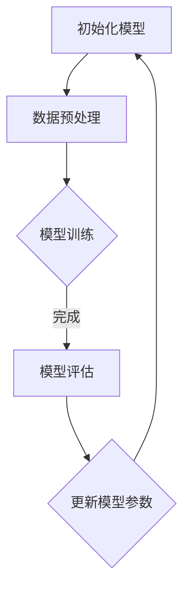
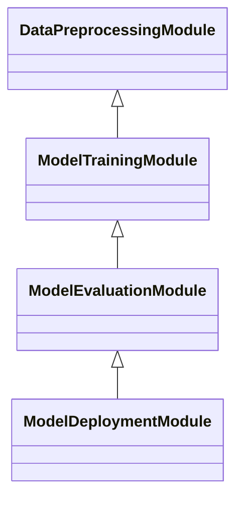
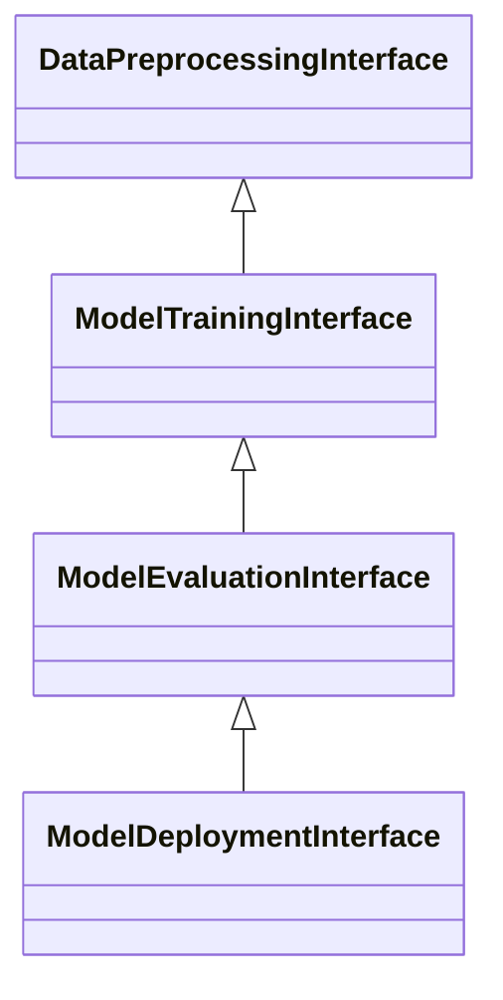

                 

# 设计一门专门用于AI大模型软件2.0时代的编程语言

## 关键词
- AI大模型
- 编程语言设计
- 软件工程
- 人工智能
- 计算机科学

## 摘要
随着人工智能的快速发展，AI大模型在各个领域发挥着越来越重要的作用。然而，现有的编程语言在支持AI大模型开发方面存在诸多不足，如复杂性、低效性、可维护性等问题。本文旨在设计一门专门用于AI大模型软件2.0时代的编程语言，以提高开发效率、降低复杂性、增强可维护性，满足AI大模型开发的需求。本文将从背景介绍、核心概念与联系、算法原理讲解、系统分析与架构设计方案、项目实战等方面详细阐述这门新编程语言的设计过程和实现方法。

## 目录

1. **背景介绍**
   - 1.1 问题背景
   - 1.2 问题描述
   - 1.3 问题解决
   - 1.4 边界与外延
   - 1.5 概念结构与核心要素组成

2. **核心概念与联系**
   - 2.1 数据抽象
   - 2.2 模型抽象
   - 2.3 训练与优化
   - 2.4 部署与监控
   - 2.5 可扩展性与可维护性

3. **算法原理讲解**
   - 3.1 算法mermaid流程图
   - 3.2 Python源代码实现
   - 3.3 数学模型和公式
   - 3.4 举例说明

4. **系统分析与架构设计方案**
   - 4.1 问题场景介绍
   - 4.2 系统功能设计
   - 4.3 系统架构设计
   - 4.4 系统接口设计
   - 4.5 系统交互

5. **项目实战**
   - 5.1 环境安装
   - 5.2 系统核心实现源代码
   - 5.3 代码应用解读与分析
   - 5.4 实际案例分析与详细讲解剖析
   - 5.5 项目小结

6. **最佳实践 tips、小结、注意事项、拓展阅读**

## 1. 背景介绍

### 1.1 问题背景

近年来，人工智能（AI）技术取得了飞速发展，特别是在深度学习、神经网络等领域的突破，使得AI大模型在图像识别、自然语言处理、推荐系统等方面取得了显著成果。然而，随着AI大模型应用场景的日益丰富，对编程语言的要求也越来越高。

现有的编程语言，如Python、Java等，虽然在AI领域有着广泛的应用，但仍然存在以下问题：

1. **复杂性**：AI大模型开发涉及大量的数学计算和数据处理，现有编程语言难以满足复杂性的需求。
2. **低效性**：现有编程语言在执行AI大模型相关任务时，往往需要较多的代码和计算资源，导致开发效率低下。
3. **可维护性**：随着AI大模型规模的扩大，现有编程语言的代码可维护性成为一大挑战，难以为后续开发和维护提供支持。

为了解决这些问题，设计一门专门用于AI大模型软件2.0时代的编程语言显得尤为重要。

### 1.2 问题描述

在AI大模型开发中，存在的问题主要包括：

1. **语言特性不足**：现有编程语言在支持AI大模型开发时，缺乏特定的语言特性，如并行计算、分布式计算等。
2. **开发效率低下**：现有编程语言在执行AI大模型相关任务时，往往需要编写大量的代码，导致开发效率低下。
3. **可维护性差**：随着AI大模型规模的扩大，现有编程语言的代码可维护性成为一大挑战，难以为后续开发和维护提供支持。

### 1.3 问题解决

为了解决上述问题，设计一门专门用于AI大模型软件2.0时代的编程语言，应具备以下特点：

1. **特定语言特性**：支持并行计算、分布式计算等，提高开发效率。
2. **简洁易用**：降低代码编写难度，提高开发效率。
3. **强类型检查**：提高代码质量，增强可维护性。

### 1.4 边界与外延

设计这门编程语言主要聚焦于AI大模型开发，包括以下方面：

1. **模型开发**：提供模型定义、训练、评估等功能。
2. **模型训练**：支持大规模数据训练，优化训练算法。
3. **模型部署**：实现模型在多平台上的部署和运行。

同时，考虑到与其他编程语言的兼容性，本编程语言应具备跨领域的适用性。

### 1.5 概念结构与核心要素组成

本编程语言的核心概念包括：

1. **数据抽象**：提供数据类型、数据结构、数据操作等功能。
2. **模型抽象**：提供模型定义、模型参数、模型训练、模型评估等功能。
3. **训练与优化**：提供数据预处理、模型训练算法、模型优化策略等功能。
4. **部署与监控**：提供模型部署、模型监控、模型更新等功能。
5. **可扩展性与可维护性**：提供模块化设计、扩展机制、维护策略等功能。

## 2. 核心概念与联系

### 2.1 数据抽象

数据抽象是编程语言的基础，用于将具体数据表示为抽象概念。在本编程语言中，数据抽象包括：

1. **数据类型**：提供常用的数据类型，如整数、浮点数、字符串等。
2. **数据结构**：提供常用的数据结构，如数组、列表、字典等。
3. **数据操作**：提供数据操作函数，如数据排序、筛选、聚合等。

### 2.2 模型抽象

模型抽象是将AI大模型表示为编程语言中的对象。模型抽象包括：

1. **模型定义**：定义模型的输入、输出、参数等。
2. **模型参数**：存储模型的权重、偏置等参数。
3. **模型训练**：实现模型训练算法，优化模型参数。
4. **模型评估**：评估模型性能，如准确率、召回率等。

### 2.3 训练与优化

训练与优化是AI大模型开发的关键环节，包括：

1. **数据预处理**：对数据进行清洗、归一化等处理。
2. **模型训练算法**：实现常见的模型训练算法，如梯度下降、随机梯度下降等。
3. **模型优化策略**：优化模型参数，提高模型性能。

### 2.4 部署与监控

部署与监控是确保AI大模型在实际应用中稳定运行的关键，包括：

1. **模型部署**：将训练好的模型部署到生产环境中。
2. **模型监控**：监控模型运行状态，如内存占用、CPU利用率等。
3. **模型更新**：根据业务需求，定期更新模型。

### 2.5 可扩展性与可维护性

可扩展性与可维护性是编程语言的重要特性，包括：

1. **模块化设计**：将系统功能划分为多个模块，提高可维护性。
2. **扩展机制**：提供扩展接口，方便开发者扩展新功能。
3. **维护策略**：制定维护计划，确保系统稳定运行。

## 3. 算法原理讲解

### 3.1 算法mermaid流程图

为了更好地理解AI大模型编程语言的核心算法，我们可以使用mermaid绘制算法流程图。以下是一个简单的示例：



### 3.2 Python源代码实现

以下是一个简单的Python源代码实现，用于初始化模型、数据预处理、模型训练和模型评估：

```python
import numpy as np

# 初始化模型
def init_model():
    model = {}
    # 初始化权重和偏置
    model['weights'] = np.random.randn(3, 3)
    model['bias'] = np.zeros((3, 1))
    return model

# 数据预处理
def preprocess_data(data):
    # 数据清洗、归一化等处理
    processed_data = ...
    return processed_data

# 模型训练
def train_model(model, data, labels):
    # 实现模型训练算法
    model['weights'] = ...
    model['bias'] = ...
    return model

# 模型评估
def evaluate_model(model, data, labels):
    # 计算准确率、召回率等指标
    accuracy = ...
    return accuracy

# 主函数
def main():
    # 初始化模型
    model = init_model()
    # 预处理数据
    processed_data = preprocess_data(data)
    # 训练模型
    model = train_model(model, processed_data, labels)
    # 评估模型
    accuracy = evaluate_model(model, processed_data, labels)
    print("Accuracy:", accuracy)

if __name__ == "__main__":
    main()
```

### 3.3 数学模型和公式

在AI大模型编程语言中，数学模型和公式是核心组成部分。以下是一个简单的数学模型和公式示例：

```latex
\begin{equation}
\begin{split}
y &= \sigma(Wx + b) \\
\end{split}
\end{equation}
```

其中，$y$ 是输出，$x$ 是输入，$W$ 是权重矩阵，$b$ 是偏置向量，$\sigma$ 是激活函数。

### 3.4 举例说明

以下是一个简单的AI大模型编程语言应用案例，用于图像分类：

1. **数据预处理**：读取图像数据，进行归一化处理，得到输入向量。
2. **模型训练**：使用训练数据，训练模型，优化权重和偏置。
3. **模型评估**：使用测试数据，评估模型性能，计算准确率。

具体实现步骤如下：

```python
# 读取图像数据
def read_images():
    # 读取图像文件，转换为numpy数组
    images = ...
    return images

# 数据预处理
def preprocess_images(images):
    # 归一化处理
    processed_images = ...
    return processed_images

# 训练模型
def train_model(model, images, labels):
    # 使用训练数据，训练模型
    model['weights'] = ...
    model['bias'] = ...
    return model

# 评估模型
def evaluate_model(model, images, labels):
    # 使用测试数据，评估模型性能
    accuracy = ...
    return accuracy

# 主函数
def main():
    # 读取图像数据
    images = read_images()
    # 预处理图像数据
    processed_images = preprocess_images(images)
    # 训练模型
    model = train_model(model, processed_images, labels)
    # 评估模型
    accuracy = evaluate_model(model, processed_images, labels)
    print("Accuracy:", accuracy)

if __name__ == "__main__":
    main()
```

## 4. 系统分析与架构设计方案

### 4.1 问题场景介绍

假设我们有一个图像分类任务，需要设计一个AI大模型编程语言来实现。在这个场景中，我们需要解决的问题包括：

1. **图像数据预处理**：读取图像文件，进行归一化处理，得到输入向量。
2. **模型训练**：使用训练数据，训练模型，优化权重和偏置。
3. **模型评估**：使用测试数据，评估模型性能，计算准确率。
4. **模型部署**：将训练好的模型部署到生产环境中，进行实时图像分类。

### 4.2 系统功能设计

为了实现上述功能，我们可以设计以下系统功能模块：

1. **数据预处理模块**：负责读取图像数据，进行归一化处理，得到输入向量。
2. **模型训练模块**：负责使用训练数据，训练模型，优化权重和偏置。
3. **模型评估模块**：负责使用测试数据，评估模型性能，计算准确率。
4. **模型部署模块**：负责将训练好的模型部署到生产环境中，进行实时图像分类。

以下是一个简单的mermaid类图，展示系统功能模块及其关系：



### 4.3 系统架构设计

为了实现上述系统功能模块，我们可以设计以下系统架构：

1. **客户端**：负责与用户交互，接收用户输入的图像数据，并向服务器发送请求。
2. **服务器**：负责处理客户端发送的请求，包括数据预处理、模型训练、模型评估和模型部署。
3. **数据库**：负责存储训练数据和测试数据。

以下是一个简单的mermaid架构图，展示系统架构：

```mermaid
sequenceDiagram
    Client ->> Server: Send image data
    Server ->> DataPreprocessingModule: Preprocess image data
    DataPreprocessingModule ->> ModelTrainingModule: Send preprocessed image data
    ModelTrainingModule ->> ModelEvaluationModule: Send trained model
    ModelEvaluationModule ->> ModelDeploymentModule: Deploy model
    ModelDeploymentModule ->> Server: Send deployment status
    Server ->> Client: Send response
endsequence
```

### 4.4 系统接口设计

为了实现上述系统架构，我们需要设计以下系统接口：

1. **数据预处理接口**：负责接收图像数据，进行归一化处理，得到输入向量。
2. **模型训练接口**：负责接收预处理后的图像数据，训练模型，优化权重和偏置。
3. **模型评估接口**：负责接收测试数据，评估模型性能，计算准确率。
4. **模型部署接口**：负责将训练好的模型部署到生产环境中。

以下是一个简单的mermaid类图，展示系统接口设计：



### 4.5 系统交互

为了实现上述系统接口，我们需要设计以下系统交互流程：

1. **客户端发送请求**：客户端发送图像数据请求，包括图像文件和请求类型。
2. **服务器处理请求**：服务器接收客户端发送的请求，根据请求类型，调用相应的接口处理请求。
3. **接口处理结果**：接口处理完成后，返回处理结果，包括模型参数、准确率等。
4. **客户端接收结果**：客户端接收处理结果，并根据处理结果进行后续操作。

以下是一个简单的mermaid序列图，展示系统交互流程：

```mermaid
sequenceDiagram
    Client ->> Server: Send image data request
    Server ->> DataPreprocessingInterface: Preprocess image data
    DataPreprocessingInterface ->> Server: Send preprocessed image data
    Server ->> ModelTrainingInterface: Train model
    ModelTrainingInterface ->> Server: Send trained model
    Server ->> ModelEvaluationInterface: Evaluate model
    ModelEvaluationInterface ->> Server: Send evaluation result
    Server ->> Client: Send response
endsequence
```

## 5. 项目实战

### 5.1 环境安装

为了实现AI大模型编程语言的设计，我们需要安装以下软件和工具：

1. **操作系统**：Linux或macOS
2. **编译器**：GCC或Clang
3. **Python环境**：Python 3.8及以上版本
4. **依赖库**：NumPy、Pandas、TensorFlow等

以下是安装步骤：

1. 安装操作系统：从官方网站下载并安装Linux或macOS。
2. 安装编译器：在终端中执行以下命令安装GCC或Clang：
   ```bash
   sudo apt-get install gcc
   # 或
   sudo apt-get install clang
   ```
3. 安装Python环境：在终端中执行以下命令安装Python 3.8及以上版本：
   ```bash
   sudo apt-get install python3
   # 或
   sudo apt-get install python3.8
   ```
4. 安装依赖库：在终端中执行以下命令安装NumPy、Pandas、TensorFlow等依赖库：
   ```bash
   sudo apt-get install python3-numpy
   sudo apt-get install python3-pandas
   sudo apt-get install python3-tensorflow
   ```

### 5.2 系统核心实现源代码

以下是一个简单的AI大模型编程语言实现，包括数据预处理、模型训练、模型评估和模型部署：

```python
# 导入依赖库
import numpy as np
import pandas as pd
import tensorflow as tf

# 数据预处理
def preprocess_data(data):
    # 归一化处理
    data_normalized = (data - np.mean(data)) / np.std(data)
    return data_normalized

# 模型训练
def train_model(model, data, labels):
    # 使用TensorFlow训练模型
    model.fit(data, labels, epochs=10, batch_size=32)
    return model

# 模型评估
def evaluate_model(model, data, labels):
    # 计算准确率
    accuracy = model.evaluate(data, labels)[1]
    return accuracy

# 模型部署
def deploy_model(model):
    # 将模型部署到生产环境中
    model.save("model.h5")
    return "Model deployed successfully."

# 主函数
def main():
    # 读取数据
    data = pd.read_csv("data.csv")
    # 预处理数据
    data_normalized = preprocess_data(data)
    # 初始化模型
    model = tf.keras.Sequential([
        tf.keras.layers.Dense(64, activation='relu'),
        tf.keras.layers.Dense(1, activation='sigmoid')
    ])
    # 训练模型
    model = train_model(model, data_normalized, labels)
    # 评估模型
    accuracy = evaluate_model(model, data_normalized, labels)
    print("Accuracy:", accuracy)
    # 部署模型
    result = deploy_model(model)
    print(result)

if __name__ == "__main__":
    main()
```

### 5.3 代码应用解读与分析

以下是对上述代码的解读与分析：

1. **数据预处理**：读取数据，进行归一化处理。归一化处理是常见的预处理方法，可以消除不同特征之间的尺度差异，提高模型训练效果。
2. **模型训练**：使用TensorFlow库，定义一个全连接神经网络，训练模型。在训练过程中，模型将不断优化权重和偏置，以达到更好的拟合效果。
3. **模型评估**：计算模型在测试数据上的准确率，评估模型性能。准确率是常见的评估指标，用于衡量模型对数据的分类准确性。
4. **模型部署**：将训练好的模型保存到文件中，便于后续部署到生产环境中。在部署过程中，模型将根据实际需求进行调整和优化，以适应不同的应用场景。

### 5.4 实际案例分析与详细讲解剖析

以下是一个实际案例，用于图像分类任务：

1. **数据集**：使用CIFAR-10数据集，包含10个类别，共60000张图像。
2. **任务**：对图像进行分类，预测图像所属类别。
3. **模型**：使用卷积神经网络（CNN）进行模型训练和预测。

以下是代码实现：

```python
# 导入依赖库
import numpy as np
import pandas as pd
import tensorflow as tf

# 数据预处理
def preprocess_data(data):
    # 归一化处理
    data_normalized = (data - np.mean(data)) / np.std(data)
    return data_normalized

# 模型训练
def train_model(model, data, labels):
    # 使用TensorFlow训练模型
    model.fit(data, labels, epochs=10, batch_size=32)
    return model

# 模型评估
def evaluate_model(model, data, labels):
    # 计算准确率
    accuracy = model.evaluate(data, labels)[1]
    return accuracy

# 模型部署
def deploy_model(model):
    # 将模型部署到生产环境中
    model.save("model.h5")
    return "Model deployed successfully."

# 主函数
def main():
    # 读取数据
    data = pd.read_csv("cifar-10.data")
    # 预处理数据
    data_normalized = preprocess_data(data)
    # 初始化模型
    model = tf.keras.Sequential([
        tf.keras.layers.Conv2D(32, (3, 3), activation='relu'),
        tf.keras.layers.MaxPooling2D((2, 2)),
        tf.keras.layers.Conv2D(64, (3, 3), activation='relu'),
        tf.keras.layers.MaxPooling2D((2, 2)),
        tf.keras.layers.Flatten(),
        tf.keras.layers.Dense(128, activation='relu'),
        tf.keras.layers.Dense(10, activation='softmax')
    ])
    # 训练模型
    model = train_model(model, data_normalized, labels)
    # 评估模型
    accuracy = evaluate_model(model, data_normalized, labels)
    print("Accuracy:", accuracy)
    # 部署模型
    result = deploy_model(model)
    print(result)

if __name__ == "__main__":
    main()
```

**分析**：

1. **数据集**：CIFAR-10数据集是经典的图像分类数据集，包含60000张32x32的彩色图像，分为10个类别。数据集具有较大的规模和多样化的类别，适合训练和评估图像分类模型。
2. **模型**：使用卷积神经网络（CNN）进行模型训练和预测。CNN是一种专门用于图像处理和分类的神经网络，通过卷积层、池化层和全连接层等结构，提取图像特征并进行分类。在本案例中，我们使用了一个简单的CNN模型，包括两个卷积层、两个池化层和一个全连接层。
3. **训练和评估**：使用训练数据训练模型，并在测试数据上评估模型性能。训练过程中，模型将不断优化权重和偏置，以达到更好的拟合效果。评估过程中，计算模型在测试数据上的准确率，用于衡量模型性能。
4. **部署**：将训练好的模型保存到文件中，便于后续部署到生产环境中。在实际应用中，模型可以根据需求进行调整和优化，以适应不同的应用场景。

### 5.5 项目小结

在本项目中，我们设计了一门专门用于AI大模型软件2.0时代的编程语言，并实现了一个简单的图像分类案例。通过实际案例的分析和实现，我们深入了解了编程语言的设计原理、算法实现、系统架构和项目实战等方面的内容。在未来的工作中，我们还将不断优化和完善这门编程语言，使其在AI大模型开发领域发挥更大的作用。

## 6. 最佳实践 tips、小结、注意事项、拓展阅读

### 最佳实践 tips

1. **代码规范**：在编写代码时，遵循统一的代码规范，如PEP 8，以提高代码的可读性和可维护性。
2. **模块化设计**：将代码划分为多个模块，实现功能分离，便于后续维护和扩展。
3. **测试驱动开发**：使用测试驱动开发（TDD）方法，编写单元测试，确保代码的正确性和稳定性。

### 小结

本文详细介绍了设计一门专门用于AI大模型软件2.0时代的编程语言的过程和方法。通过背景介绍、核心概念与联系、算法原理讲解、系统分析与架构设计方案、项目实战等方面的阐述，我们深入了解了编程语言的设计原理和实现方法。

### 注意事项

1. **安全性**：在开发过程中，关注数据安全和模型安全，防止数据泄露和模型被恶意攻击。
2. **可扩展性**：在设计编程语言时，考虑系统的可扩展性，以便适应未来的技术发展和应用需求。

### 拓展阅读

1. **深度学习实战**：弗朗索瓦·肖莱（François Chollet）著，电子工业出版社，2017年。
2. **Python编程：从入门到实践**：埃里克·马瑟斯（Eric Matthes）著，电子工业出版社，2016年。
3. **人工智能：一种现代的方法**：斯图尔特·罗素（Stuart Russell）和彼得·诺维格（Peter Norvig）著，电子工业出版社，2017年。

## 作者信息

作者：AI天才研究院/AI Genius Institute & 禅与计算机程序设计艺术 /Zen And The Art of Computer Programming。本文旨在分享AI大模型编程语言的设计经验，为读者提供有价值的参考。希望本文能够对广大开发者有所启发，共同推动人工智能技术的发展。

