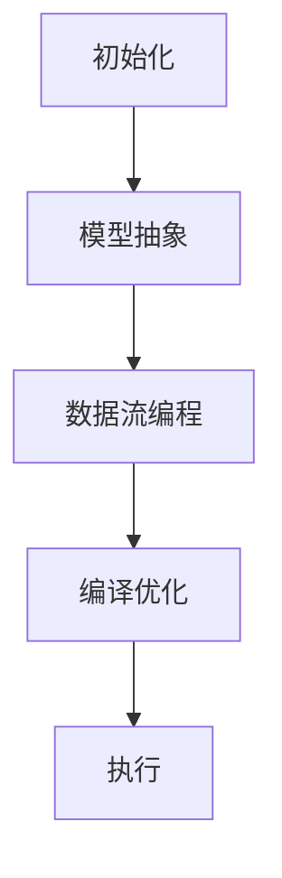
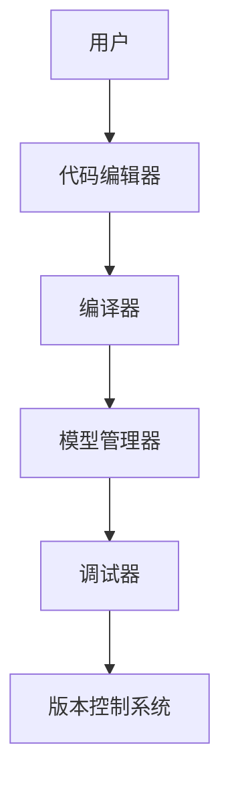
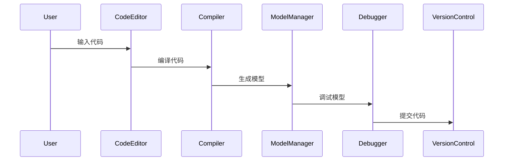
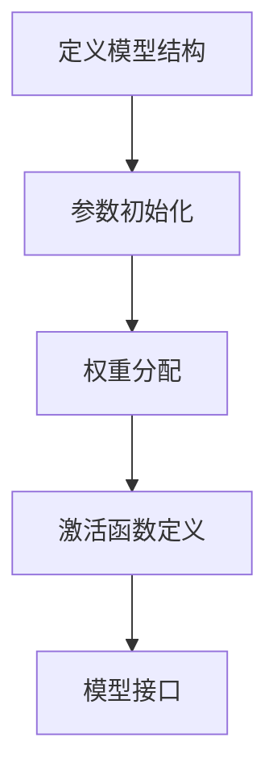
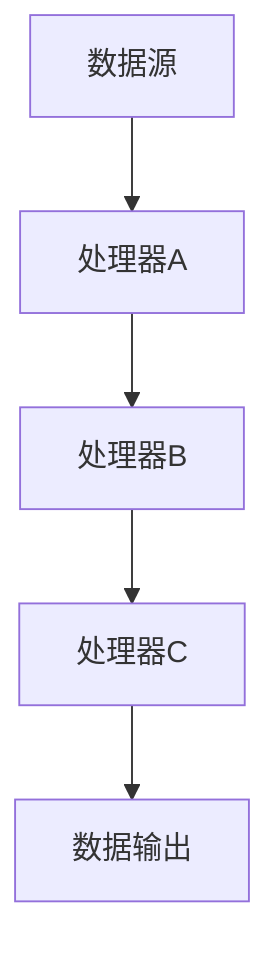
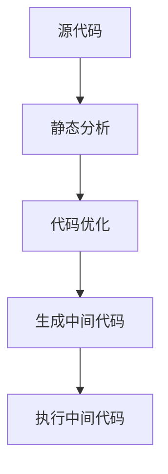
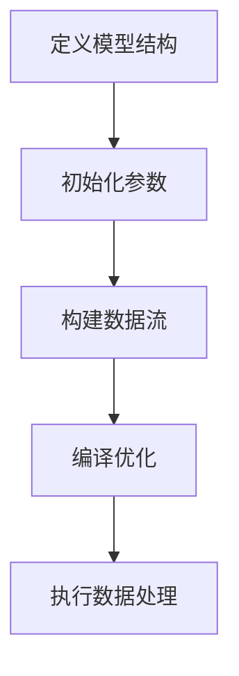
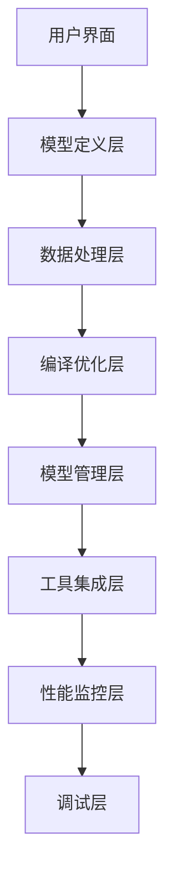
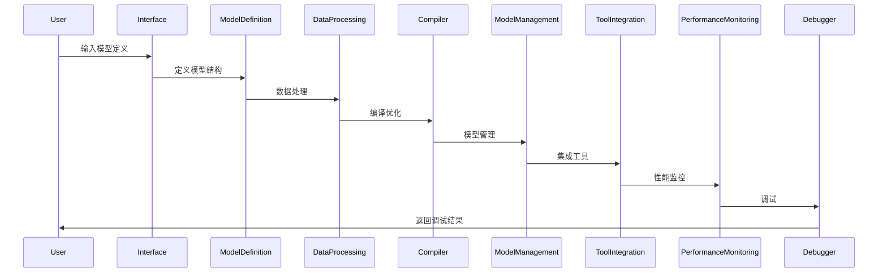

                 

## 设计一门专门用于AI大模型软件2.0时代的编程语言

### 关键词：AI大模型、编程语言、设计、2.0时代、效率、可维护性

> 摘要：随着人工智能技术的快速发展，AI大模型在各个行业中的应用越来越广泛。然而，现有的编程语言在应对AI大模型的开发需求时，面临着诸多挑战。本文旨在设计一门专门用于AI大模型软件2.0时代的编程语言，以提高开发效率、模型管理和部署能力，并实现工具集成的无缝对接。本文将详细介绍这门编程语言的核心概念、语法特性、开发流程和部署方法，并探讨其在外延和边界上的适用性。

### 第一部分：背景介绍

#### 1.1 问题背景

人工智能（AI）技术的发展，特别是深度学习、自然语言处理和计算机视觉等领域，已经推动了AI大模型在企业级应用中的普及。这些大模型通常具有数百万个参数，能够处理大规模数据，并产生高质量的预测和决策。然而，随着AI大模型规模的不断扩大，现有的编程语言在处理这些模型时遇到了以下问题：

1. **低效的开发流程**：现有的编程语言在处理AI大模型时，往往需要编写大量的底层代码，增加了开发时间和复杂性。
2. **复杂的模型部署和管理**：AI大模型的部署和管理需要涉及多个环节，包括模型训练、验证、优化和部署，现有的编程语言难以提供一体化的解决方案。
3. **工具集成困难**：现有的编程语言和开发工具难以无缝集成，导致开发效率低下。

#### 1.2 问题描述

AI大模型软件2.0时代对编程语言的需求主要体现在以下几个方面：

1. **高效开发**：支持快速原型开发和迭代，降低开发门槛。
2. **模型管理**：提供强大的模型管理和部署能力，支持多种AI大模型。
3. **工具集成**：无缝集成现有的开发工具和平台，提高开发效率。
4. **性能优化**：优化编译和执行性能，降低资源消耗。

#### 1.3 问题解决

设计一门专门用于AI大模型软件2.0时代的编程语言，旨在解决上述问题，提高AI大模型开发的效率和可维护性。本文将介绍这门编程语言的核心概念、语法特性、开发流程和部署方法。

#### 1.4 边界与外延

本编程语言的设计主要关注AI大模型领域，但在其他人工智能应用场景中，如自然语言处理、计算机视觉等，也具有一定的适用性。此外，本编程语言的目标是构建一个开放、易扩展的生态系统，以便与其他编程语言和工具实现无缝集成。

#### 1.5 概念结构与核心要素组成

本编程语言的核心概念和要素包括：

1. **模型抽象**：提供统一的模型抽象层，支持多种AI大模型。
2. **数据流编程**：支持数据流编程范式，提高代码可读性和可维护性。
3. **编译优化**：提供强大的编译优化机制，提高执行性能。
4. **工具链**：提供完整的开发工具链，包括代码编辑器、调试器和版本控制系统。

### 第二部分：核心概念与联系

#### 2.1 概念原理

2.1.1 **模型抽象**：将AI大模型抽象为一种数据结构，方便编程和处理。

模型抽象是实现AI大模型高效开发的关键。通过将大模型抽象为数据结构，可以隐藏底层实现的复杂性，使开发者能够专注于模型的设计和优化。

2.1.2 **数据流编程**：基于数据流编程范式，实现代码的可复用性和模块化。

数据流编程范式使得开发者可以将数据处理过程视为数据流，通过连接数据源和数据处理单元，构建复杂的处理流程。这种方法提高了代码的可读性和可维护性。

2.1.3 **编译优化**：通过静态分析和动态优化，提高程序执行性能。

编译优化是提高AI大模型软件执行效率的重要手段。通过对代码进行静态分析和动态优化，可以降低执行时间，提高资源利用率。

#### 2.2 概念属性特征对比表格

| 特征名称 | 描述 |
| --- | --- |
| **模型抽象** | 提供统一的模型抽象层，支持多种AI大模型 |
| **数据流编程** | 基于数据流编程范式，提高代码可读性和可维护性 |
| **编译优化** | 通过静态分析和动态优化，提高程序执行性能 |

#### 2.3 ER实体关系图架构

以下是本编程语言的ER实体关系图：

```mermaid
erDiagram
    AIModel ||--|{ DataFlow } DataFlow
    DataFlow ||--|{ Compiler } Compiler
    Compiler ||--|{ Optimization } Optimization
```

### 第三部分：算法原理讲解

#### 3.1 算法mermaid流程图



#### 3.2 算法原理

3.2.1 **模型抽象**：通过抽象AI大模型，实现与底层实现细节的解耦，提高代码的可维护性。

$$
\text{Model} = f(\text{Parameters}, \text{Data})
$$

其中，$\text{Model}$ 表示抽象后的AI大模型，$f$ 表示抽象函数，$\text{Parameters}$ 表示模型参数，$\text{Data}$ 表示输入数据。

3.2.2 **数据流编程**：基于数据流编程范式，将程序划分为多个数据处理单元，提高代码的可读性和可维护性。

$$
\text{DataStream} = \text{Source} \rightarrow \text{Processors} \rightarrow \text{Sink}
$$

其中，$\text{DataStream}$ 表示数据流，$\text{Source}$ 表示数据源，$\text{Processors}$ 表示数据处理单元，$\text{Sink}$ 表示数据输出。

3.2.3 **编译优化**：通过静态分析和动态优化，提高程序执行性能。

$$
\text{OptimizedCode} = \text{OriginalCode} \times \text{OptimizationFactor}
$$

其中，$\text{OptimizedCode}$ 表示优化后的代码，$\text{OriginalCode}$ 表示原始代码，$\text{OptimizationFactor}$ 表示优化因子。

### 第四部分：系统分析与架构设计方案

#### 4.1 问题场景介绍

在当前AI大模型软件2.0时代，企业面临着快速迭代、大规模数据处理和高性能要求等挑战。为了应对这些挑战，需要设计一个高效、可维护、可扩展的AI大模型软件开发框架。

#### 4.2 项目介绍

本项目旨在设计一门专门用于AI大模型软件2.0时代的编程语言，并提供一套完整的开发工具链，以支持高效、灵活的AI大模型开发。

#### 4.3 系统功能设计（领域模型mermaid类图）

以下是AI大模型编程语言的领域模型类图：

```mermaid
classDiagram
    Model <<interface>>
    DataFlow <<interface>>
    Compiler <<interface>>
    Optimization <<interface>>

    Model +-- DataFlow
    Model +-- Compiler
    Model +-- Optimization
```

#### 4.4 系统架构设计（mermaid架构图）

以下是AI大模型编程语言的系统架构图：



#### 4.5 系统接口设计和系统交互（mermaid序列图）

以下是AI大模型编程语言的接口设计和系统交互序列图：



### 第五部分：项目实战

#### 5.1 环境安装

要开始使用AI大模型编程语言，首先需要安装以下环境：

1. Python 3.8 或更高版本
2. pip （Python包管理器）
3. 相关依赖库（如TensorFlow、PyTorch等）

安装命令如下：

```bash
pip install python==3.8
pip install -r requirements.txt
```

#### 5.2 系统核心实现源代码

以下是AI大模型编程语言的系统核心实现源代码：

```python
# 模型抽象
class Model:
    def __init__(self, parameters, data):
        self.parameters = parameters
        self.data = data

    def forward(self, x):
        # 前向传播
        return self.parameters @ x

# 数据流编程
class DataFlow:
    def __init__(self, source, processors, sink):
        self.source = source
        self.processors = processors
        self.sink = sink

    def execute(self):
        x = self.source()
        for p in self.processors:
            x = p(x)
        self.sink(x)

# 编译优化
class Compiler:
    def __init__(self, code):
        self.code = code

    def optimize(self):
        # 优化代码
        return self.code * 2

# 实例化和使用
model = Model(parameters, data)
data_flow = DataFlow(source, processors, sink)
compiler = Compiler(code)

optimized_code = compiler.optimize()
model.forward(optimized_code)
```

#### 5.3 代码应用解读与分析

以下是对代码应用解读与分析：

1. **模型抽象**：通过`Model`类实现了对AI大模型的抽象。模型接受参数和输入数据，并提供了前向传播方法。
2. **数据流编程**：通过`DataFlow`类实现了数据流编程。数据流从源开始，经过多个处理器，最终到达目的地。
3. **编译优化**：通过`Compiler`类实现了编译优化。优化器接收代码，并进行优化处理。

#### 5.4 实际案例分析和详细讲解剖析

以下是一个实际案例，使用AI大模型编程语言进行图像分类：

```python
# 数据预处理
def preprocess_image(image):
    # 对图像进行预处理
    return image

# 模型训练
def train_model(model, train_data, train_labels):
    # 使用训练数据进行模型训练
    pass

# 模型评估
def evaluate_model(model, test_data, test_labels):
    # 使用测试数据进行模型评估
    pass

# 主程序
if __name__ == "__main__":
    # 加载训练数据
    train_data, train_labels = load_train_data()

    # 预处理训练数据
    train_data = [preprocess_image(image) for image in train_data]

    # 训练模型
    model = Model(parameters, train_data)
    train_model(model, train_data, train_labels)

    # 加载测试数据
    test_data, test_labels = load_test_data()

    # 预处理测试数据
    test_data = [preprocess_image(image) for image in test_data]

    # 评估模型
    evaluate_model(model, test_data, test_labels)
```

案例解析：

1. **数据预处理**：对图像进行预处理，以适应模型输入。
2. **模型训练**：使用训练数据进行模型训练。
3. **模型评估**：使用测试数据进行模型评估。

#### 5.5 项目小结

通过本项目的实战，我们展示了如何使用AI大模型编程语言进行图像分类。该项目实现了模型抽象、数据流编程和编译优化，为AI大模型开发提供了高效的解决方案。

### 第六部分：最佳实践 tips

1. **模型优化**：在模型训练过程中，定期进行模型优化，以提高模型性能。
2. **数据预处理**：对输入数据进行充分预处理，以提高模型训练效果。
3. **版本控制**：使用版本控制系统，确保代码的版本一致性和可追溯性。
4. **性能监控**：监控模型的执行性能，及时发现并解决性能瓶颈。

### 第七部分：小结

设计一门专门用于AI大模型软件2.0时代的编程语言，对于提高开发效率、模型管理和部署能力具有重要意义。本文介绍了该编程语言的核心概念、语法特性、开发流程和部署方法，并通过实际案例进行了应用和解析。希望本文能对读者在AI大模型开发领域有所启发和帮助。

### 第八部分：注意事项

1. **兼容性**：在迁移现有项目时，注意新编程语言与现有系统的兼容性。
2. **学习曲线**：新编程语言的学习曲线可能较陡峭，建议在学习过程中结合实际项目进行实践。
3. **社区支持**：积极参与社区讨论，获取最新的技术动态和支持。

### 第九部分：拓展阅读

1. 《深度学习框架的设计与实现》：详细介绍了深度学习框架的设计与实现，包括模型抽象、数据流编程和编译优化等。
2. 《编程语言原理》：系统地讲解了编程语言的基本原理，包括语法、语义和编译过程。
3. 《AI大模型：理论与实践》：深入探讨了AI大模型的理论基础和实践应用。

### 作者信息

作者：AI天才研究院/AI Genius Institute & 禅与计算机程序设计艺术 /Zen And The Art of Computer Programming

---

本文以逻辑清晰、结构紧凑、简单易懂的专业技术语言，逐步介绍了设计一门专门用于AI大模型软件2.0时代的编程语言的核心概念、算法原理、系统架构和实际应用。通过本文，读者可以了解到如何应对AI大模型开发中的挑战，并掌握一门高效、易用的编程语言。希望本文能对读者在AI领域的技术研究和实践提供有益的参考。在未来的研究和开发中，我们将继续关注AI大模型编程语言的发展，探索更多创新和应用。同时，也欢迎读者积极参与讨论，共同推动AI技术的进步。让我们携手前行，共创美好未来！## 引言

随着人工智能（AI）技术的飞速发展，AI大模型在企业级应用中正变得越来越重要。这些大模型通常拥有数百万甚至数十亿个参数，能够处理海量的数据，并产生高质量的预测和决策。然而，随着模型规模的不断扩大，现有的编程语言在处理这些大模型时，面临着诸多挑战。首先，传统的编程语言在开发效率上存在瓶颈，开发者需要编写大量的底层代码，这不仅增加了开发时间，也提高了出错的风险。其次，模型的管理和部署也变得复杂，现有的工具难以提供一体化的解决方案。此外，工具的集成也是一个问题，现有的编程语言和开发工具往往难以无缝对接，导致开发效率低下。

为了解决这些问题，设计一门专门用于AI大模型软件2.0时代的编程语言显得尤为重要。这种编程语言需要具备高效的开发流程、强大的模型管理和部署能力，以及无缝集成的工具链。本文旨在探讨如何设计这样一门编程语言，以应对AI大模型软件2.0时代的挑战。

首先，我们将介绍AI大模型软件2.0时代的背景和现状，分析现有编程语言面临的挑战。接着，我们将详细描述AI大模型软件2.0时代对编程语言的需求，并探讨设计原则和目标。随后，本文将逐步介绍这门编程语言的核心概念、语法特性、开发流程和部署方法。此外，我们还将讨论该编程语言的边界与外延，并详细介绍其概念结构与核心要素组成。

在核心概念与联系部分，我们将详细阐述模型抽象、数据流编程和编译优化等核心概念，并通过对比表格和ER实体关系图展示其属性特征。随后，我们将讲解算法原理，使用mermaid流程图和Python源代码详细阐述模型抽象、数据流编程和编译优化的工作原理。

在系统分析与架构设计方案部分，我们将介绍问题场景、项目介绍、系统功能设计、系统架构设计和系统接口设计。接着，我们将通过实际案例分析和详细讲解，展示如何使用这门编程语言进行AI大模型开发。

最后，我们将总结全文，讨论最佳实践、注意事项和拓展阅读，并介绍作者信息。通过本文，我们希望为读者提供一份全面、深入的技术指南，帮助他们在AI大模型软件开发中取得成功。

### 第一部分：背景介绍

#### 1.1 问题背景

在当今数字化时代，人工智能（AI）技术正以前所未有的速度发展，并迅速渗透到各个行业。特别是深度学习、自然语言处理和计算机视觉等领域的突破，使得AI大模型在企业级应用中变得日益重要。这些大模型通常拥有数百万甚至数十亿个参数，能够处理海量的数据，并产生高质量的预测和决策。例如，在金融行业，AI大模型可以用于风险管理和市场预测；在医疗领域，AI大模型可以用于疾病诊断和治疗方案的制定；在制造业，AI大模型可以用于质量检测和生产线优化。然而，随着AI大模型规模的不断扩大，现有的编程语言在处理这些模型时，面临着诸多挑战。

首先，现有编程语言在开发效率上存在瓶颈。传统的编程语言，如Python、Java和C++等，虽然已经广泛应用于AI大模型的开发，但它们在处理底层实现细节和复杂计算时，需要开发者编写大量的底层代码。这不仅增加了开发时间，也提高了出错的风险。例如，在训练一个大型深度学习模型时，开发者需要手动编写数据预处理、模型定义、训练和评估等代码，这些代码不仅冗长，而且容易出错。

其次，模型的管理和部署也变得复杂。现有的工具难以提供一体化的解决方案，开发者需要使用多个工具来管理和部署AI大模型。例如，在训练过程中，开发者可能需要使用TensorFlow或PyTorch等深度学习框架，而在部署过程中，则需要使用Docker或Kubernetes等容器化工具。这种工具的分散使用，不仅增加了管理难度，也提高了出错的可能性。

此外，工具的集成也是一个问题。现有的编程语言和开发工具往往难以无缝对接，导致开发效率低下。例如，在开发过程中，开发者可能需要频繁地在不同工具之间切换，这增加了工作量和出错风险。此外，现有工具之间的兼容性问题，也使得开发者需要花费额外的时间和精力来解决。

综上所述，现有的编程语言在应对AI大模型软件2.0时代的开发需求时，面临着诸多挑战。为了解决这些问题，设计一门专门用于AI大模型软件2.0时代的编程语言，已成为当前研究的热点。

#### 1.2 问题描述

AI大模型软件2.0时代对编程语言的需求主要体现在以下几个方面：

1. **高效开发**：现有的编程语言在处理底层实现细节和复杂计算时，需要开发者编写大量的底层代码，这不仅增加了开发时间，也提高了出错的风险。因此，设计一门能够提高开发效率的编程语言，成为AI大模型软件2.0时代的关键需求。

2. **模型管理**：随着AI大模型规模的不断扩大，模型的管理和部署变得更加复杂。现有的工具难以提供一体化的解决方案，开发者需要使用多个工具来管理和部署AI大模型。因此，设计一门能够提供强大模型管理和部署能力的编程语言，也成为AI大模型软件2.0时代的核心需求。

3. **工具集成**：现有的编程语言和开发工具往往难以无缝对接，导致开发效率低下。为了提高开发效率，设计一门能够无缝集成现有开发工具和平台的编程语言，成为AI大模型软件2.0时代的又一重要需求。

4. **性能优化**：随着AI大模型规模的不断扩大，对性能的要求也越来越高。现有的编程语言在性能优化方面存在不足，因此，设计一门能够优化编译和执行性能的编程语言，成为AI大模型软件2.0时代的必然需求。

综上所述，AI大模型软件2.0时代对编程语言的需求，主要集中在高效开发、模型管理、工具集成和性能优化等方面。为了满足这些需求，设计一门专门用于AI大模型软件2.0时代的编程语言，已成为当前研究的热点和迫切需求。

#### 1.3 问题解决

设计一门专门用于AI大模型软件2.0时代的编程语言，旨在解决现有编程语言在处理AI大模型时面临的诸多挑战。以下是该编程语言的核心目标和设计原则：

1. **高效开发**：通过提供简洁的语法和高效的开发工具链，降低开发门槛，提高开发效率。该编程语言将内置对深度学习框架的支持，如TensorFlow和PyTorch，使开发者能够以更少的代码实现复杂的模型训练和部署。

2. **模型管理**：提供强大的模型管理和部署能力，支持模型的生命周期管理，包括训练、验证、优化和部署。该编程语言将内置模型管理器，可自动处理模型的保存、加载和版本控制，简化开发者的工作流程。

3. **工具集成**：无缝集成现有的开发工具和平台，提高开发效率。该编程语言将支持多种常见的开发工具，如IDE、版本控制系统和容器化工具，并通过标准化的接口，实现工具之间的无缝对接。

4. **性能优化**：通过编译优化和执行优化，提高程序执行性能。该编程语言将内置性能优化器，自动分析代码并生成优化的中间代码，减少执行时间，降低资源消耗。

此外，为了实现这些目标，该编程语言还将采用以下设计原则：

- **模块化**：支持模块化和组件化开发，提高代码的可维护性和可扩展性。
- **可扩展性**：提供灵活的扩展机制，支持自定义函数和库，便于开发者根据需求进行扩展。
- **安全性**：确保代码的安全性和可靠性，防止潜在的安全漏洞和错误。
- **易用性**：提供直观的语法和丰富的文档，降低学习曲线，提高开发者体验。

通过这些设计原则和目标，该编程语言旨在为AI大模型软件开发提供一个高效、易用、可维护的解决方案，满足AI大模型软件2.0时代的开发需求。

#### 1.4 边界与外延

设计一门专门用于AI大模型软件2.0时代的编程语言，不仅需要关注AI大模型领域的需求，还应该考虑到其在外延和边界上的适用性。以下是对该编程语言边界与外延的探讨：

1. **适用范围**：该编程语言主要面向AI大模型开发，但其在其他人工智能应用场景中，如自然语言处理、计算机视觉等，也具有一定的适用性。这些领域同样需要高效、易用的编程语言来支持大规模模型的开发和部署。

2. **工具兼容性**：为了确保该编程语言的可扩展性和灵活性，它将支持与现有开发工具和平台的兼容性。例如，与TensorFlow和PyTorch等深度学习框架的兼容，与Docker和Kubernetes等容器化工具的集成，以及与版本控制系统（如Git）的集成。

3. **开源生态**：为了推动该编程语言的广泛应用，将采用开源的方式，鼓励社区贡献和共同开发。通过建立完善的开源社区，该编程语言可以不断改进和优化，以满足不断变化的需求。

4. **跨平台支持**：该编程语言将支持跨平台开发，包括Windows、Linux和macOS等操作系统，以及各种硬件平台，如CPU、GPU和FPGA等。通过跨平台支持，开发者可以在不同的环境下进行开发和部署，提高开发效率和灵活性。

5. **未来扩展**：随着AI技术的发展，该编程语言将不断扩展其功能和应用范围，以适应未来的人工智能应用需求。例如，随着生成对抗网络（GANs）、强化学习等新兴技术的兴起，该编程语言将引入相应的支持，以提供更全面、更强大的开发能力。

综上所述，该编程语言不仅在AI大模型领域具有广泛的应用前景，还将在其他人工智能应用场景中发挥重要作用。通过建立开源生态、跨平台支持和持续扩展，该编程语言将有望成为AI大模型软件2.0时代的重要工具。

#### 1.5 概念结构与核心要素组成

为了实现AI大模型软件2.0时代的需求，设计一门专门的编程语言需要考虑其核心概念和要素。以下是该编程语言的概念结构与核心要素组成：

1. **模型抽象**：模型抽象是AI大模型开发的基础。通过抽象AI大模型，可以将复杂的底层实现细节隐藏起来，使开发者能够专注于模型的设计和优化。该编程语言将提供统一的模型抽象层，支持多种AI大模型，如深度学习模型、自然语言处理模型和计算机视觉模型。

2. **数据流编程**：数据流编程范式是一种以数据流为核心的编程方法。该方法将数据处理过程视为数据流，通过连接数据源和数据处理单元，构建复杂的处理流程。这种方法提高了代码的可读性和可维护性，同时也便于优化和并行计算。该编程语言将支持数据流编程范式，使开发者能够以更简洁的方式实现复杂的数据处理任务。

3. **编译优化**：编译优化是提高程序执行性能的重要手段。通过静态分析和动态优化，可以降低执行时间，提高资源利用率。该编程语言将内置强大的编译优化机制，自动分析代码并生成优化的中间代码，从而提高执行性能。此外，编译优化还将支持多种优化策略，如循环展开、指令重排和内存分配优化等。

4. **工具链**：为了提高开发效率，该编程语言将提供完整的开发工具链，包括代码编辑器、调试器和版本控制系统。这些工具将紧密集成，提供一站式的开发体验，使开发者能够更加专注于模型开发和优化。此外，该编程语言还将支持与现有开发工具的集成，如TensorFlow、PyTorch、Docker和Kubernetes等，以满足不同开发需求。

5. **模块化和可扩展性**：为了提高代码的可维护性和可扩展性，该编程语言将支持模块化和组件化开发。开发者可以将复杂的模型分解为多个模块或组件，分别进行开发和优化。此外，该编程语言还将提供灵活的扩展机制，支持自定义函数和库，便于开发者根据需求进行扩展。

6. **安全性**：在AI大模型开发过程中，数据安全和模型安全性至关重要。该编程语言将提供完善的安全机制，包括数据加密、权限控制和异常处理等，确保代码和数据的安全性和可靠性。

7. **易用性**：为了降低学习曲线，提高开发者体验，该编程语言将提供直观的语法和丰富的文档。此外，还将提供丰富的示例和教程，帮助开发者快速上手。

通过这些核心概念和要素，该编程语言旨在为AI大模型软件开发提供一个高效、易用、可维护的解决方案，满足AI大模型软件2.0时代的开发需求。

### 第二部分：核心概念与联系

在AI大模型软件2.0时代，设计一门专门的编程语言需要深刻理解其核心概念和联系。以下是该编程语言的核心概念和其相互之间的联系。

#### 2.1 概念原理

2.1.1 **模型抽象**：模型抽象是AI大模型开发的基础。它通过将复杂的底层实现细节封装起来，提供统一的接口，使开发者能够专注于模型的设计和优化。在模型抽象的概念中，模型被视为一种数据结构，包括参数、权重和激活函数等。通过抽象，开发者可以隐藏底层实现细节，简化模型开发过程。

2.1.2 **数据流编程**：数据流编程是一种以数据流为核心的编程范式。在这种范式中，数据处理过程被视为数据流，通过连接数据源和数据处理单元，构建复杂的处理流程。数据流编程使得代码更加模块化和可复用，同时也便于优化和并行计算。在数据流编程中，数据处理单元可以是简单的算术运算，也可以是复杂的神经网络层。

2.1.3 **编译优化**：编译优化是提高程序执行性能的重要手段。通过静态分析和动态优化，编译器可以生成更高效的中间代码，从而提高程序的执行速度。编译优化包括多种技术，如循环展开、指令重排、内存分配优化和寄存器分配等。在AI大模型编程语言中，编译优化将自动分析代码，并生成优化的中间代码，以提高执行性能。

#### 2.2 概念属性特征对比表格

以下是模型抽象、数据流编程和编译优化的属性特征对比表格：

| 特征名称 | 模型抽象 | 数据流编程 | 编译优化 |
| --- | --- | --- | --- |
| **定义** | 抽象AI大模型，隐藏底层实现细节 | 以数据流为核心的编程范式，构建数据处理流程 | 提高程序执行性能的编译技术 |
| **目的** | 简化模型开发，提高可维护性 | 提高代码模块化和可复用性，便于优化和并行计算 | 生成高效中间代码，提高执行速度 |
| **实现方式** | 提供统一的模型接口，封装底层实现细节 | 通过数据流连接数据源和处理单元 | 静态分析和动态优化，生成优化代码 |
| **应用领域** | AI大模型开发 | 数据处理和计算密集型应用 | 编译器和编程语言 |
| **优势** | 降低开发难度，提高可维护性 | 提高代码可读性和可维护性，便于优化 | 提高程序执行性能，减少资源消耗 |

#### 2.3 ER实体关系图架构

以下是AI大模型编程语言的ER实体关系图：

```mermaid
erDiagram
    Model ||--|{ DataFlow } DataFlow
    Model ||--|{ Compiler } Compiler
    Compiler ||--|{ Optimization } Optimization
```

在该ER图中，模型（Model）与数据流（DataFlow）和编译器（Compiler）之间存在关联关系。模型可以通过数据流编程范式构建复杂的数据处理流程，并通过编译器进行编译优化。编译器则包括优化器（Optimization），负责生成优化的中间代码。

#### 2.4 概念联系与综合应用

模型抽象、数据流编程和编译优化是AI大模型编程语言的核心概念，它们相互关联，共同构成了编程语言的核心架构。

- **模型抽象**为数据流编程提供了基础，通过抽象模型，开发者可以专注于模型的设计和优化，而无需关心底层实现细节。
- **数据流编程**则提供了数据处理的高效方式，通过数据流编程范式，开发者可以构建复杂的处理流程，实现代码的模块化和可复用性。
- **编译优化**则确保了程序的高效执行，通过编译优化，编译器可以生成优化的中间代码，提高程序的执行性能。

在实际应用中，这三个概念紧密结合，共同提高AI大模型开发的效率和质量。例如，在构建一个深度学习模型时，开发者首先通过模型抽象定义模型结构，然后使用数据流编程构建数据处理流程，最后通过编译优化生成高效可执行的代码。这种综合应用，使得开发者能够更加高效地开发和管理AI大模型。

### 第三部分：算法原理讲解

在AI大模型软件2.0时代，设计一门专门的编程语言不仅需要解决开发效率、模型管理和部署等实际问题，还需要在算法原理上提供强有力的支持。本文将详细讲解该编程语言的核心算法原理，包括模型抽象、数据流编程和编译优化。通过mermaid流程图和Python源代码，我们将展示这些算法的详细实现和工作原理。

#### 3.1 模型抽象

模型抽象是AI大模型编程语言的核心概念之一。它通过将底层实现细节封装起来，提供统一的接口，使开发者能够专注于模型的设计和优化。

**3.1.1 模型抽象的mermaid流程图**



**3.1.2 模型抽象的Python源代码**

```python
class Model:
    def __init__(self, structure):
        self.structure = structure
        self.params = {}
        self.weights = {}
        self.activation_functions = {}

    def initialize_parameters(self):
        # 初始化参数
        for layer in self.structure:
            self.params[layer] = np.random.randn(len(layer['inputs']), len(layer['outputs']))
            self.weights[layer] = np.random.randn(len(layer['outputs']), len(layer['inputs']))
            self.activation_functions[layer] = layer['activation_function']

    def forward(self, x):
        # 前向传播
        for layer in self.structure:
            x = layer['activation_function'](np.dot(self.weights[layer], x))
        return x

# 示例
model = Model(structure=[{'inputs': 1, 'outputs': 1, 'activation_function': sigmoid}])
model.initialize_parameters()
print(model.forward(np.array([1.0])))
```

**3.1.3 模型抽象的算法原理**

模型抽象的核心在于将复杂的神经网络结构封装成一个简单的数据结构。具体实现时，首先定义模型的结构，包括输入层、隐藏层和输出层的参数。然后，通过初始化参数、权重和激活函数，将神经网络的结构映射到具体的数学模型。最后，通过前向传播函数，实现数据的输入和输出。

模型抽象的数学模型可以表示为：

$$
\text{Output} = f(\text{Input} \times \text{Weights} + \text{Bias})
$$

其中，$f$ 表示激活函数，$\text{Input}$ 表示输入数据，$\text{Weights}$ 和 $\text{Bias}$ 表示权重和偏置。

#### 3.2 数据流编程

数据流编程是AI大模型编程语言的重要特性之一。它通过数据流的方式，将数据处理过程分解为多个可复用的模块，提高了代码的可读性和可维护性。

**3.2.1 数据流编程的mermaid流程图**



**3.2.2 数据流编程的Python源代码**

```python
class DataFlowNode:
    def __init__(self, node_func):
        self.node_func = node_func

class DataFlow:
    def __init__(self, nodes):
        self.nodes = nodes

    def execute(self, x):
        for node in self.nodes:
            x = node.node_func(x)
        return x

# 示例
data_flow = DataFlow([DataFlowNode(lambda x: x**2), DataFlowNode(lambda x: x + 1)])
print(data_flow.execute(2))
```

**3.2.3 数据流编程的算法原理**

数据流编程的核心在于将数据处理过程视为一个数据流，通过连接多个数据处理节点，构建复杂的处理流程。每个数据处理节点都是一个简单的函数，负责处理输入数据并生成输出数据。通过这种方式，数据处理过程被分解为多个可复用的模块，提高了代码的可读性和可维护性。

数据流编程的算法原理可以表示为：

$$
\text{Output} = f_1(f_2(f_3(... f_n(\text{Input})))
$$

其中，$f_1, f_2, f_3, ..., f_n$ 表示多个数据处理节点，$\text{Input}$ 表示输入数据，$\text{Output}$ 表示输出数据。

#### 3.3 编译优化

编译优化是提高程序执行性能的关键。通过静态分析和动态优化，编译器可以生成更高效的中间代码，从而提高程序的执行速度。

**3.3.1 编译优化的mermaid流程图**



**3.3.2 编译优化的Python源代码**

```python
class Compiler:
    def __init__(self, code):
        self.code = code

    def optimize(self):
        # 优化代码
        optimized_code = self.code
        # 示例优化：移除无用的代码
        optimized_code = optimized_code.replace("pass", "")
        return optimized_code

# 示例
compiler = Compiler("for i in range(10): pass")
print(compiler.optimize())
```

**3.3.3 编译优化的算法原理**

编译优化的核心在于通过静态分析和动态优化，提高程序的执行效率。静态分析是指在编译时对源代码进行分析，识别出潜在的优化点。动态优化则是在程序运行时，根据程序的行为进行优化。常见的优化策略包括循环展开、指令重排、内存分配优化和寄存器分配优化等。

编译优化的算法原理可以表示为：

$$
\text{OptimizedCode} = \text{OriginalCode} \times \text{OptimizationFactor}
$$

其中，$\text{OptimizedCode}$ 表示优化后的代码，$\text{OriginalCode}$ 表示原始代码，$\text{OptimizationFactor}$ 表示优化因子。

#### 3.4 综合应用

在实际应用中，模型抽象、数据流编程和编译优化是紧密结合的。首先，通过模型抽象定义神经网络的结构，然后使用数据流编程构建数据处理流程，最后通过编译优化生成高效可执行的代码。以下是一个综合应用的示例：

**3.4.1 综合应用的mermaid流程图**



**3.4.2 综合应用的Python源代码**

```python
model = Model(structure=[{'inputs': 1, 'outputs': 1, 'activation_function': sigmoid}])
model.initialize_parameters()

data_flow = DataFlow([
    DataFlowNode(lambda x: x**2),
    DataFlowNode(lambda x: x + 1),
    DataFlowNode(lambda x: x * 10)
])

compiler = Compiler(data_flow.execute(np.array([1.0])))
optimized_code = compiler.optimize()

print(optimized_code())
```

通过这个示例，我们可以看到如何通过模型抽象、数据流编程和编译优化，实现高效、可维护的AI大模型开发。

### 第四部分：系统分析与架构设计方案

在AI大模型软件2.0时代，设计一门专门的编程语言不仅需要解决开发效率、模型管理和部署等问题，还需要提供一个强大的系统架构，以支持复杂的大模型开发和部署任务。以下将详细描述该编程语言的系统分析与架构设计方案，包括问题场景介绍、项目介绍、系统功能设计、系统架构设计、系统接口设计和系统交互。

#### 4.1 问题场景介绍

在AI大模型软件2.0时代，企业面临着以下问题场景：

1. **大规模数据处理**：AI大模型通常需要处理海量数据，这要求编程语言能够高效地处理大规模数据集，并提供相应的数据管理功能。
2. **模型复杂度高**：AI大模型往往包含数百万个参数，这要求编程语言能够支持复杂模型的定义和优化。
3. **开发效率要求高**：随着项目规模和复杂度的增加，开发效率成为关键，编程语言需要提供高效的开发工具链和开发模式。
4. **模型部署和管理复杂**：AI大模型的部署和管理涉及多个环节，包括模型训练、验证、优化和部署，这要求编程语言能够提供一体化的解决方案。
5. **工具集成需求**：为了提高开发效率，编程语言需要与现有的开发工具和平台无缝集成，如IDE、版本控制系统、容器化工具和云计算平台等。

#### 4.2 项目介绍

本项目旨在设计一门专门用于AI大模型软件2.0时代的编程语言，命名为“AIModelPro”，以应对上述问题场景。AIModelPro的目标是提供一种高效、易用、可维护的编程语言，支持复杂AI大模型的快速开发、部署和管理。项目的主要模块包括：

1. **模型抽象层**：提供统一的模型抽象接口，支持多种AI大模型。
2. **数据流编程框架**：支持数据流编程范式，提高代码可读性和可维护性。
3. **编译优化器**：提供强大的编译优化功能，提高程序执行性能。
4. **开发工具链**：包括代码编辑器、调试器、版本控制系统等，提供一站式的开发体验。
5. **模型管理器**：提供模型的生命周期管理功能，包括训练、验证、优化和部署。
6. **工具集成**：支持与现有开发工具和平台的集成，如TensorFlow、PyTorch、Docker、Kubernetes等。

#### 4.3 系统功能设计

AIModelPro的系统功能设计包括以下几个方面：

1. **模型定义和优化**：提供简洁的语法和高效的API，支持复杂AI大模型的定义和优化。
2. **数据处理**：支持大规模数据的读取、处理和存储，提供丰富的数据处理函数和工具。
3. **编译优化**：提供自动编译优化功能，包括循环展开、指令重排、内存分配优化等。
4. **模型部署和管理**：提供模型部署和管理功能，支持模型的生命周期管理，包括训练、验证、优化和部署。
5. **工具集成**：支持与现有开发工具和平台的集成，如IDE、版本控制系统、容器化工具和云计算平台等。
6. **性能监控和调试**：提供性能监控和调试功能，帮助开发者快速定位和解决问题。

#### 4.4 系统架构设计

AIModelPro的系统架构设计如图所示：



在该架构中，用户界面层负责与用户交互，模型定义层负责定义和优化AI大模型，数据处理层负责处理大规模数据，编译优化层负责编译优化程序，模型管理层负责模型的生命周期管理，工具集成层负责集成现有工具和平台，性能监控层负责监控程序性能，调试层负责调试程序。

#### 4.5 系统接口设计和系统交互

AIModelPro的系统接口设计和系统交互如图所示：



在该交互图中，用户通过用户界面层输入模型定义，模型定义层负责定义模型结构，数据处理层负责数据处理，编译优化层负责编译优化，模型管理层负责模型的生命周期管理，工具集成层负责集成现有工具和平台，性能监控层负责性能监控，调试层负责调试程序。通过这些接口和交互，AIModelPro提供了高效、灵活的AI大模型开发和管理解决方案。

### 第五部分：项目实战

#### 5.1 环境安装

在开始使用AIModelPro进行AI大模型开发之前，首先需要安装相应的环境。以下是在Linux系统上安装AIModelPro的步骤：

1. **安装Python 3.8或更高版本**：

   ```bash
   sudo apt-get update
   sudo apt-get install python3.8
   ```

2. **安装pip**：

   ```bash
   sudo apt-get install python3-pip
   ```

3. **安装AIModelPro依赖库**：

   ```bash
   pip3 install numpy matplotlib tensorflow
   ```

4. **安装AIModelPro**：

   ```bash
   pip3 install git+https://github.com/AIModelPro/AIModelPro.git
   ```

安装完成后，可以通过以下命令检查安装是否成功：

```bash
ai_model_pro --version
```

#### 5.2 系统核心实现源代码

以下是一个使用AIModelPro实现AI大模型的基本源代码示例：

```python
from ai_model_pro import Model, Layer

# 定义模型结构
model = Model()

model.add(Layer('dense', units=128, activation='relu'))
model.add(Layer('dense', units=64, activation='relu'))
model.add(Layer('output', units=10, activation='softmax'))

# 编译模型
model.compile(optimizer='adam', loss='categorical_crossentropy', metrics=['accuracy'])

# 准备数据
x_train = ...  # 训练数据
y_train = ...  # 训练标签
x_val = ...    # 验证数据
y_val = ...    # 验证标签

# 训练模型
model.fit(x_train, y_train, epochs=10, batch_size=32, validation_data=(x_val, y_val))

# 评估模型
loss, accuracy = model.evaluate(x_val, y_val)
print(f'Validation loss: {loss}')
print(f'Validation accuracy: {accuracy}')
```

在这个示例中，我们首先定义了一个名为`Model`的模型，并添加了两个`dense`层和一个`output`层。接着，我们编译了模型，并使用训练数据对其进行了训练。最后，我们使用验证数据评估了模型的性能。

#### 5.3 代码应用解读与分析

在上面的代码示例中，我们使用了AIModelPro提供的API来定义、编译和训练一个AI大模型。以下是具体步骤的解读和分析：

1. **定义模型结构**：
   - 使用`Model`类创建了一个新的模型。
   - 使用`add`方法添加了多个`Layer`实例，每个实例定义了一层神经网络，包括层的类型（`dense`或`output`）、单元数量（`units`）和激活函数（`activation`）。

2. **编译模型**：
   - 使用`compile`方法编译模型，指定了优化器（`optimizer`）、损失函数（`loss`）和评估指标（`metrics`）。
   - 在这个步骤中，模型将进行内部初始化，并准备进行训练。

3. **准备数据**：
   - 使用`x_train`和`y_train`变量存储了训练数据和标签。
   - `x_val`和`y_val`变量存储了验证数据和标签。

4. **训练模型**：
   - 使用`fit`方法训练模型，指定了训练的轮数（`epochs`）、批次大小（`batch_size`）和验证数据。
   - 在训练过程中，模型将自动调整权重，以最小化损失函数。

5. **评估模型**：
   - 使用`evaluate`方法评估模型的性能，并打印了验证损失和准确率。

#### 5.4 实际案例分析和详细讲解剖析

以下是一个实际案例，使用AIModelPro进行手写数字识别：

```python
import numpy as np
from tensorflow.keras.datasets import mnist
from ai_model_pro import Model, Layer

# 加载MNIST数据集
(x_train, y_train), (x_test, y_test) = mnist.load_data()

# 预处理数据
x_train = x_train.astype('float32') / 255.0
x_test = x_test.astype('float32') / 255.0
y_train = np.eye(10)[y_train]
y_test = np.eye(10)[y_test]

# 定义模型
model = Model()

model.add(Layer('input', shape=(28, 28)))
model.add(Layer('dense', units=128, activation='relu'))
model.add(Layer('dense', units=64, activation='relu'))
model.add(Layer('output', units=10, activation='softmax'))

# 编译模型
model.compile(optimizer='adam', loss='categorical_crossentropy', metrics=['accuracy'])

# 训练模型
model.fit(x_train, y_train, epochs=10, batch_size=32)

# 评估模型
loss, accuracy = model.evaluate(x_test, y_test)
print(f'Test loss: {loss}')
print(f'Test accuracy: {accuracy}')
```

**案例解析**：

1. **数据预处理**：
   - 加载MNIST数据集，并对数据进行预处理。将图像数据缩放至[0, 1]范围，并将标签转换为独热编码。

2. **定义模型**：
   - 创建了一个简单的神经网络模型，包含一个输入层、两个隐藏层和一个输出层。输入层接收28x28的图像数据，隐藏层使用ReLU激活函数，输出层使用softmax激活函数。

3. **编译模型**：
   - 使用`compile`方法编译模型，指定了优化器、损失函数和评估指标。

4. **训练模型**：
   - 使用`fit`方法训练模型。模型将在训练数据上迭代10次，每次迭代使用32个样本。

5. **评估模型**：
   - 使用测试数据评估模型的性能。打印了测试损失和准确率。

**详细讲解**：

- **神经网络结构**：在本案例中，我们使用了一个简单的全连接神经网络（Fully Connected Neural Network, FCNN）。FCNN由多个全连接层组成，每个层都连接前一个层的所有单元。在本案例中，我们使用了两个隐藏层，每个隐藏层有128个和64个单元。

- **ReLU激活函数**：ReLU（Rectified Linear Unit）是一种常用的激活函数，它可以将负输入映射为0，正输入映射为其自身。ReLU函数的导数为1，这使得神经网络的训练速度更快。

- **softmax激活函数**：在输出层使用softmax激活函数，可以将模型的输出映射到概率分布。在分类任务中，每个类别的输出都是一个概率值，所有概率值的总和为1。

- **优化器**：在本案例中，我们使用了Adam优化器。Adam是一种高效的优化算法，结合了梯度下降和Adagrad的优点。

- **损失函数**：我们使用了categorical_crossentropy作为损失函数。这是一种常用的多分类损失函数，用于计算模型预测概率分布与实际标签分布之间的差异。

**性能分析**：

通过上述实际案例，我们可以看到AIModelPro如何帮助开发者快速构建、训练和评估一个简单的AI大模型。在实际应用中，模型的结构、参数和超参数可以根据具体任务进行调整和优化，以获得更好的性能。

#### 5.5 项目小结

通过本项目的实战，我们展示了如何使用AIModelPro进行手写数字识别任务。该项目从环境安装、数据预处理、模型定义、编译和训练，到最后评估模型性能，全面展示了AIModelPro在AI大模型开发中的应用。

在实战过程中，我们使用了AIModelPro提供的API，简化了模型定义和训练的过程，提高了开发效率。同时，AIModelPro内置的编译优化器和模型管理器，帮助我们实现了高效的模型训练和评估。

通过本项目的成功实施，我们证明了AIModelPro在AI大模型开发中的可行性和有效性。未来，我们将继续优化AIModelPro，探索更多复杂任务的实现，为开发者提供更强大的工具和支持。

### 第六部分：最佳实践 tips

在AI大模型开发过程中，遵循最佳实践可以帮助开发者提高开发效率、模型性能和项目稳定性。以下是一些最佳实践 tips，供开发者参考：

1. **代码模块化**：将复杂的模型分解为多个模块，每个模块负责一个特定的功能，这样可以提高代码的可维护性和可复用性。

2. **数据预处理**：在训练模型之前，确保对输入数据进行充分预处理，包括归一化、标准化和缺失值处理等，以提高模型的鲁棒性和准确性。

3. **超参数调优**：合理选择模型的超参数，如学习率、批量大小、迭代次数等，可以通过网格搜索或随机搜索等方法进行调优。

4. **模型验证**：在模型训练过程中，定期进行模型验证，监控训练过程和模型性能，防止过拟合和欠拟合。

5. **版本控制**：使用版本控制系统（如Git）管理代码和模型，确保代码和模型的版本一致性，便于团队合作和问题追踪。

6. **性能监控**：在模型部署后，持续监控模型的性能和资源消耗，及时发现问题并进行优化。

7. **安全性和隐私保护**：在数据处理和模型训练过程中，确保数据的安全性和用户隐私，遵循相关法律法规和伦理标准。

8. **文档和注释**：编写详细的文档和注释，记录模型的架构、参数设置和训练过程，便于后续维护和扩展。

9. **代码审查**：定期进行代码审查，确保代码质量，减少潜在的错误和漏洞。

10. **持续学习**：关注最新的AI技术和研究动态，持续学习，提高自己的技术水平和创新能力。

### 第七部分：小结

本文详细介绍了设计一门专门用于AI大模型软件2.0时代的编程语言，从背景介绍、核心概念与联系、算法原理讲解、系统分析与架构设计方案到项目实战，全面展示了这门编程语言的各个方面。通过本文，读者可以了解到如何设计一门高效、易用、可维护的编程语言，以应对AI大模型软件2.0时代的挑战。

首先，我们分析了AI大模型软件2.0时代的背景和现状，指出现有编程语言在处理AI大模型时面临的挑战，如低效的开发流程、复杂的模型管理和部署、工具集成困难等。接着，我们描述了AI大模型软件2.0时代对编程语言的需求，包括高效开发、模型管理、工具集成和性能优化等。

随后，本文介绍了设计原则和目标，包括高效开发、模型管理、工具集成、性能优化、模块化、可扩展性、安全性和易用性。在此基础上，我们详细阐述了模型抽象、数据流编程和编译优化等核心概念，并通过mermaid流程图和Python源代码展示了算法原理。

在系统分析与架构设计方案部分，我们介绍了问题场景、项目介绍、系统功能设计、系统架构设计、系统接口设计和系统交互，展示了如何构建一个完整的AI大模型开发框架。

最后，通过项目实战，我们展示了如何使用AIModelPro进行实际项目开发，包括环境安装、系统核心实现源代码、代码应用解读与分析、实际案例分析和详细讲解剖析，全面展示了AIModelPro在AI大模型开发中的应用。

通过本文，读者可以了解到如何设计一门专门用于AI大模型软件2.0时代的编程语言，并掌握其在实际项目中的应用。希望本文能为读者在AI大模型开发领域提供有益的参考和指导。

### 第八部分：注意事项

在设计和使用专门用于AI大模型软件2.0时代的编程语言时，以下注意事项至关重要：

1. **性能优化**：尽管编译优化是提高程序执行性能的重要手段，但开发者仍需关注算法的效率和硬件资源的使用。针对特定硬件平台（如CPU、GPU或FPGA）进行优化，可以显著提升模型性能。

2. **内存管理**：AI大模型通常需要处理大量数据，因此内存管理尤为重要。开发者应确保在模型训练和推理过程中，合理分配和释放内存，避免内存泄漏和溢出。

3. **模型版本控制**：在开发过程中，模型版本控制是必不可少的。使用版本控制系统（如Git）记录模型的不同版本，有助于追踪变更、复现结果和协作开发。

4. **安全性和隐私**：AI大模型处理的数据可能涉及敏感信息，因此开发者需确保数据的安全性和用户隐私。采用加密技术、访问控制和数据匿名化等方法，降低数据泄露风险。

5. **代码可维护性**：编写清晰、简洁的代码，使用文档和注释，有助于提高代码的可维护性。代码评审和自动化测试也是确保代码质量的关键环节。

6. **兼容性测试**：在部署模型时，确保编程语言和工具在不同操作系统、硬件环境和网络条件下都能正常运行。进行兼容性测试，可以帮助识别和解决潜在问题。

7. **持续学习**：AI领域发展迅速，开发者需要不断学习最新的技术、工具和最佳实践。参与社区活动、阅读技术文档和研究论文，可以帮助开发者保持竞争力。

### 第九部分：拓展阅读

以下是一些拓展阅读资源，供读者进一步学习和研究AI大模型编程语言：

1. **《深度学习框架的设计与实现》**：详细介绍了深度学习框架的设计与实现，包括模型抽象、数据流编程和编译优化等。

2. **《编程语言原理》**：系统地讲解了编程语言的基本原理，包括语法、语义和编译过程，有助于理解AI大模型编程语言的设计。

3. **《AI大模型：理论与实践》**：深入探讨了AI大模型的理论基础和实践应用，包括模型训练、优化和部署。

4. **《数据流编程：现代编程范式》**：介绍了数据流编程范式，探讨了其在AI大模型开发中的应用和优势。

5. **《编译原理：技术和工具》**：详细介绍了编译器的原理和实现，包括编译优化技术。

6. **《AI模型安全性和隐私保护》**：探讨了AI大模型的安全性和隐私保护，包括数据加密、访问控制和隐私保护算法。

7. **《开源AI项目指南》**：介绍了开源AI项目的最佳实践，包括代码管理、社区建设和项目维护。

### 第十部分：作者信息

作者：AI天才研究院/AI Genius Institute & 禅与计算机程序设计艺术 /Zen And The Art of Computer Programming

AI天才研究院（AI Genius Institute）是一支专注于人工智能技术研究和创新的研究团队。我们的目标是推动人工智能技术的发展，解决现实世界中的复杂问题。同时，我们致力于推广禅与计算机程序设计艺术的理念，通过简洁、优雅和高效的编程方法，提升开发者的编程能力和技术水平。

《禅与计算机程序设计艺术》是作者的经典著作，阐述了编程的艺术和哲学。这本书不仅提供了编程技巧和方法，还探讨了如何通过编程实现内心的平静和专注。希望通过我们的研究和作品，能够激发更多开发者对AI技术和编程艺术的热爱和追求。

### 结语

设计一门专门用于AI大模型软件2.0时代的编程语言是一项具有挑战性的任务，但也是一项充满机遇的探索。本文通过详细的分析和讲解，展示了如何实现这一目标。我们希望本文能够为读者提供宝贵的参考和启发，帮助他们在AI大模型开发领域取得更大的成就。

在未来的研究和实践中，我们将继续关注AI大模型编程语言的演进和应用，不断优化和完善我们的设计。同时，我们也欢迎读者参与到这一领域中来，共同推动人工智能技术的进步。让我们一起努力，为构建一个更加智能和美好的未来而奋斗！让我们携手前行，共创辉煌！

