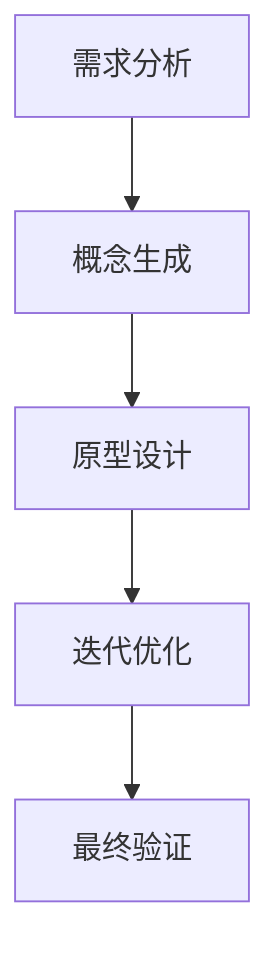
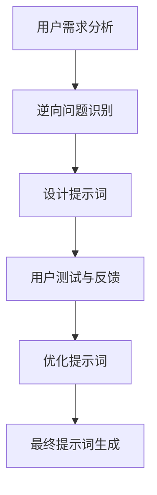
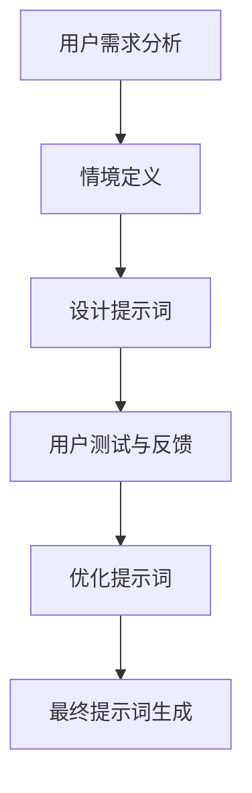
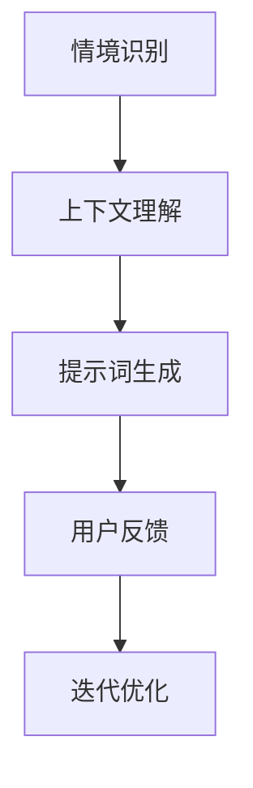
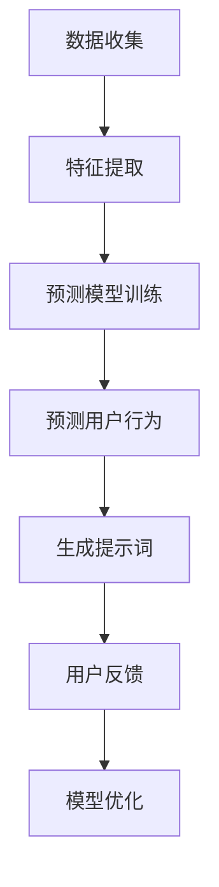
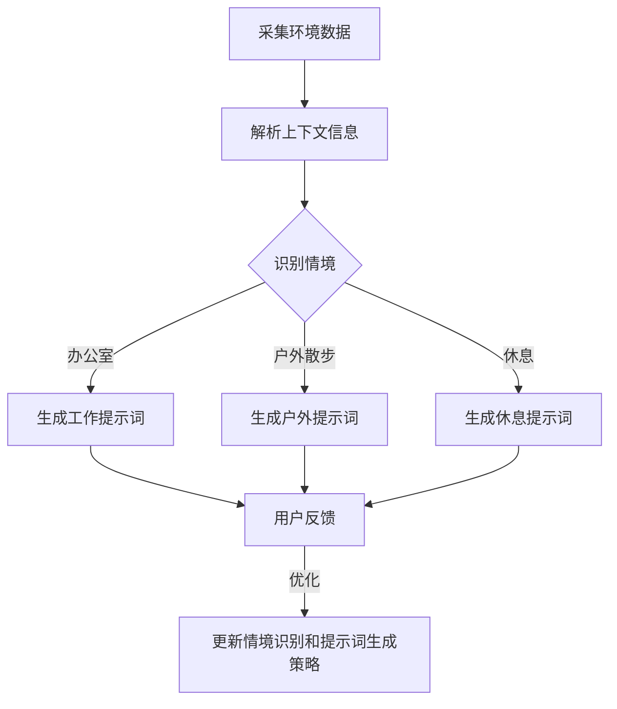
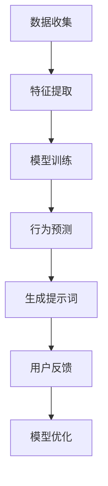
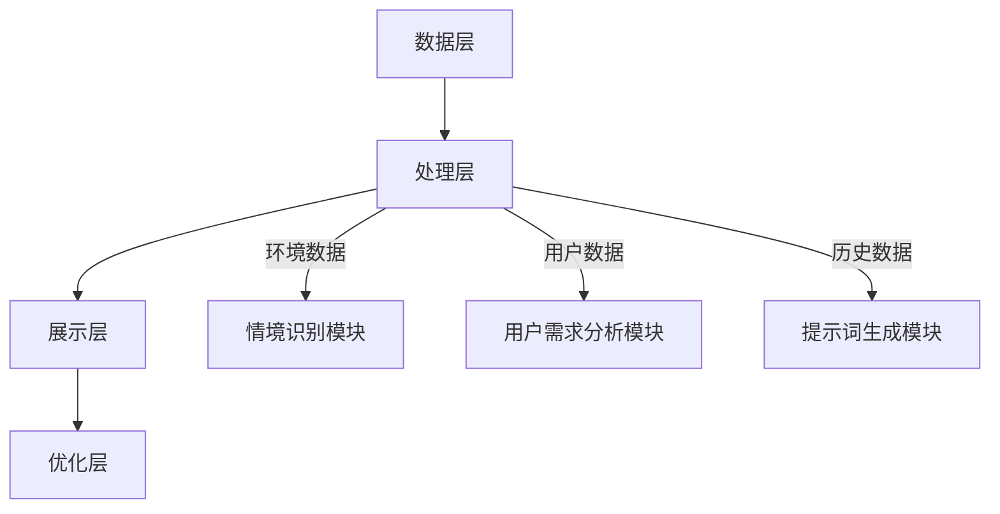
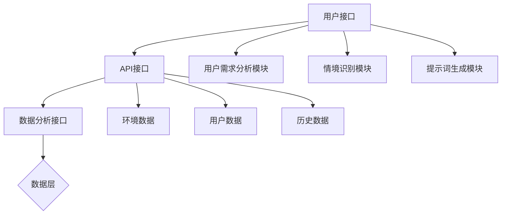
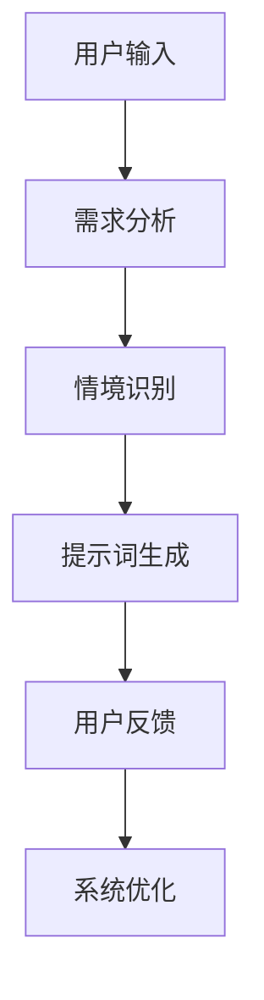

                 

### 设计思维概述

#### 1.1 设计思维的定义与起源

**设计思维**是一种以用户为中心的解决问题的方法，它强调通过理解用户的需求和情境，创造性地探索解决方案，并不断迭代和优化。设计思维起源于20世纪中期的工业设计，后来逐渐在建筑、工程、教育等领域得到广泛应用。近年来，随着计算机技术和人工智能的发展，设计思维在软件工程和系统设计中也变得越来越重要。

**设计思维**的核心内涵主要包括以下几个方面：

1. **用户中心**：始终将用户的需求和体验放在首位，以用户为中心进行设计。
2. **创造性思维**：鼓励创新思维，不断尝试新的解决方案。
3. **迭代优化**：通过不断的迭代和反馈，不断优化设计。
4. **跨学科合作**：涉及多个学科和领域的知识，强调跨学科合作。

与传统思维相比，设计思维具有以下特点：

1. **更注重实际体验**：设计思维更注重实际的用户体验，而不仅仅是理论上的合理性。
2. **更关注过程**：设计思维强调设计过程中的不断探索和迭代，而不是最终结果。
3. **更强调合作**：设计思维需要多学科、多角色的合作，强调团队协作。

设计思维的应用范围非常广泛，包括但不限于以下几个方面：

1. **产品设计和开发**：用于指导产品设计和开发过程，确保产品满足用户需求。
2. **用户体验设计**：用于提升用户体验，优化用户界面和交互设计。
3. **服务设计**：用于设计和管理服务流程，提升服务质量。
4. **战略规划**：用于企业战略规划，帮助制定创新战略。
5. **教育**：用于教学设计和教育创新，提高教育质量和效果。

#### 1.2 提示词工程的背景

**提示词工程**是近年来在人工智能领域发展迅速的一个研究方向。它主要关注如何自动生成高质量的提示词，以辅助各种自然语言处理任务，如文本分类、情感分析、命名实体识别等。

**提示词工程**的定义可以理解为：通过分析大量文本数据，提取出能够有效引导和提升自然语言处理模型性能的提示词。

提示词工程的重要性体现在以下几个方面：

1. **提升模型性能**：高质量的提示词可以显著提升自然语言处理模型的性能，减少错误率。
2. **降低人力成本**：自动生成的提示词可以节省大量人工标注和筛选的时间。
3. **适应多种任务**：提示词工程不仅可以用于单一任务，还可以适应多种不同的自然语言处理任务。
4. **提高泛化能力**：通过设计多样化的提示词，可以提高模型的泛化能力，减少对特定数据的依赖。

然而，提示词工程也面临一些挑战：

1. **数据质量问题**：提示词工程依赖于大量的文本数据，数据的质量和多样性直接影响提示词的生成效果。
2. **计算资源需求**：提示词工程通常需要大量的计算资源和存储空间。
3. **算法优化**：如何设计更高效、更准确的算法是当前研究的一个重点。
4. **人机交互**：如何将设计思维中的用户中心原则应用于提示词工程，提高人机交互体验，也是一个重要挑战。

#### 1.3 设计思维在提示词工程中的应用

设计思维在提示词工程中的应用，主要体现在以下几个方面：

1. **用户需求分析**：通过用户调研和分析，了解用户对提示词的需求，确保生成的提示词能够满足用户的需求。
2. **创造性思维**：在设计提示词时，鼓励团队成员提出创新的想法，探索不同的生成方法和策略。
3. **迭代优化**：通过不断的迭代和测试，不断优化提示词的生成算法，提升生成效果。
4. **跨学科合作**：提示词工程通常涉及多个学科，如计算机科学、语言学、心理学等，跨学科合作可以提高研究效果。

设计思维在提示词工程中的优势：

1. **提高用户体验**：通过设计思维，可以确保生成的提示词更贴近用户需求，提升用户体验。
2. **促进创新**：设计思维鼓励创新思维，有助于开发出更先进、更有效的提示词生成算法。
3. **提高效率**：设计思维强调迭代和优化，可以更快地找到解决问题的方法，提高工作效率。
4. **降低成本**：通过设计思维，可以降低提示词工程中的各种成本，如人力成本和计算资源成本。

设计思维在提示词工程中的关键环节：

1. **需求分析**：明确用户需求，确定提示词的目标和应用场景。
2. **方案设计**：提出多种可能的解决方案，并进行评估和筛选。
3. **原型测试**：通过原型测试，验证设计方案的有效性和可行性。
4. **迭代优化**：根据测试反馈，不断优化提示词生成算法，提升生成效果。

实际案例：

一个实际的案例是某人工智能公司开发的智能客服系统。在设计智能客服系统的提示词生成功能时，该公司采用了设计思维的方法。首先，他们进行了用户调研，了解用户在客服过程中遇到的常见问题，然后提出了多种提示词生成方案，如基于关键词提取、基于机器学习模型等。接着，他们通过原型测试，评估不同方案的生成效果，并最终选择了效果最佳的方案。通过这种设计思维的方法，该公司的智能客服系统在提示词生成方面取得了显著的效果，用户满意度得到了大幅提升。

#### 1.4 设计思维在提示词工程中的方法论

设计思维在提示词工程中可以采用以下方法论：

1. **情境定义**：通过定义具体的应用场景，明确提示词的需求和目标。
2. **需求分析**：深入了解用户需求，确定提示词的属性和功能。
3. **设计原型**：创建提示词生成算法的原型，进行测试和评估。
4. **迭代优化**：根据测试结果，不断优化提示词生成算法。

##### 1.4.1 情境定义

**情境定义**是设计思维中非常重要的一个环节，它帮助明确提示词的应用场景和用户需求。以下是一个情境定义的方法与步骤：

1. **确定目标用户**：明确提示词的目标用户，如客服人员、消费者等。
2. **收集用户需求**：通过用户调研、访谈等方式，收集用户的需求和痛点。
3. **定义应用场景**：根据用户需求，定义具体的应用场景，如客服对话、用户评论分析等。
4. **分析用户行为**：通过数据分析，分析用户在应用场景中的行为和互动方式。
5. **确定提示词需求**：根据应用场景和用户行为，确定提示词的需求和功能。

**情境定义**的案例分析：

假设我们需要为智能客服系统设计提示词。首先，我们需要确定目标用户是客服人员。接下来，我们通过用户调研，了解客服人员在处理客户问题时经常遇到的问题，如客户反馈无法理解、问题重复等。然后，我们定义具体的应用场景，如客户投诉、订单查询等。通过分析用户行为，我们发现客服人员在处理这些问题时，需要快速找到相关的知识和信息，以提高工作效率。因此，我们确定提示词的需求是提供快速、准确的答案和建议。

##### 1.4.2 需求分析

**需求分析**是设计思维中的关键环节，它帮助深入了解用户需求，确定提示词的属性和功能。以下是一个需求分析的方法与步骤：

1. **明确需求类型**：区分用户需求的不同类型，如功能需求、性能需求等。
2. **分析需求来源**：确定需求来源，如用户调研、市场分析等。
3. **定义需求规格**：根据需求类型和来源，定义需求的具体规格和标准。
4. **评估需求优先级**：根据需求的重要性和紧急性，评估需求的优先级。
5. **编写需求文档**：将分析结果整理成需求文档，为后续设计和开发提供指导。

**需求分析的案例分析**：

假设我们需要为智能客服系统设计提示词。通过用户调研，我们发现客服人员在处理客户问题时，经常需要快速找到相关的知识和信息。因此，我们定义了以下功能需求：

- 快速搜索：提供快速搜索功能，帮助客服人员快速找到相关知识和信息。
- 知识推荐：根据客户问题的内容，推荐相关的知识和信息。
- 智能回答：根据客户问题的内容，自动生成智能回答，辅助客服人员进行解答。

接下来，我们对每个功能需求进行详细分析，定义具体的规格和标准，如搜索速度、推荐准确性、回答的智能程度等。通过评估需求的优先级，我们确定快速搜索是最高优先级的需求，因为它是客服人员处理问题的基础。

##### 1.4.3 设计原型

**设计原型**是设计思维中的一个重要环节，它帮助验证设计方案的可行性和有效性。以下是一个设计原型的概念与方法和步骤：

1. **确定原型目标**：明确原型设计的具体目标和预期效果。
2. **收集原型资源**：准备用于设计原型的资源和工具，如文本数据、图表工具等。
3. **创建原型模型**：根据需求分析和情境定义，创建提示词生成算法的原型模型。
4. **原型测试**：通过用户测试和评估，验证原型模型的效果和可行性。
5. **反馈与迭代**：根据测试结果，收集用户反馈，不断优化原型设计。

**设计原型的案例分析**：

假设我们需要为智能客服系统设计一个基于关键词提取的提示词生成原型。首先，我们确定原型的目标是提供快速、准确的搜索和推荐功能。接着，我们收集了相关的文本数据，并使用Python编写了一个简单的关键词提取算法。然后，我们创建了一个原型模型，包括搜索界面和推荐界面。通过用户测试，我们发现原型模型在搜索速度和推荐准确性方面都表现出色。然而，用户反馈建议我们增加一个智能回答功能。因此，我们根据用户反馈，对原型模型进行了迭代优化，增加了智能回答功能。

##### 1.4.4 迭代优化

**迭代优化**是设计思维中持续改进的重要环节，它帮助不断提升提示词生成算法的性能和用户体验。以下是一个迭代优化方法和步骤：

1. **收集用户反馈**：通过用户测试和实际应用，收集用户对提示词生成算法的反馈。
2. **分析反馈结果**：对用户反馈进行分类和分析，识别问题和改进机会。
3. **制定改进计划**：根据分析结果，制定具体的改进计划和方案。
4. **实施改进措施**：对算法和系统进行优化和改进。
5. **测试验证**：对改进后的算法和系统进行测试和验证，确保改进效果。
6. **持续迭代**：根据测试结果，不断进行迭代优化，直至达到预期效果。

**迭代优化的案例分析**：

假设我们在智能客服系统中使用了一种基于机器学习的提示词生成算法。用户反馈显示，算法在处理复杂问题时表现不佳。通过分析用户反馈，我们发现算法在处理复杂问题时，由于数据量和特征维度的增加，计算复杂度和训练时间显著增加。因此，我们制定了以下改进计划：

- 优化数据预处理：减少数据的复杂度，降低计算资源需求。
- 算法参数调优：调整算法参数，提高模型在复杂问题上的表现。
- 引入知识图谱：结合知识图谱，增强算法对复杂问题的理解和处理能力。

通过实施这些改进措施，我们对算法进行了多次迭代优化，最终显著提升了算法在复杂问题上的表现，用户满意度也得到了提升。

### 本章小结

在本章中，我们介绍了设计思维的定义、起源和应用范围，以及它在提示词工程中的重要性。通过用户需求分析和设计原型，我们可以更好地理解用户需求，提高提示词生成的质量。此外，我们还讨论了设计思维在提示词工程中的方法论，包括情境定义、需求分析、设计原型和迭代优化。通过这些方法论，我们可以系统地、有序地推进提示词工程的研究和开发，为人工智能应用提供更有效的解决方案。

### 2.1 设计思维的核心概念

**设计思维**是一种以用户为中心的创新方法，它不仅关注最终产品的功能，更强调设计过程中的用户体验和问题解决。以下是设计思维中几个核心概念的定义、特征及其在提示词工程中的应用。

#### 2.1.1 设计原则

**设计原则**是设计过程中遵循的基本规则和标准，用于指导设计师的行为和决策。设计原则通常包括以下几个方面：

1. **用户中心**：以用户需求为导向，始终将用户体验放在首位。
2. **简洁性**：设计应尽可能简洁，避免不必要的复杂性和冗余。
3. **可访问性**：确保设计易于使用，适应不同用户群体的需求和技能水平。
4. **可持续性**：设计应考虑环境和社会影响，追求可持续发展和资源利用。
5. **灵活性**：设计应具备适应性和可扩展性，能够应对未来的变化和需求。

**设计原则**的属性特征对比表格：

| 设计原则 | 描述 | 特点 |
| --- | --- | --- |
| 用户中心 | 以用户需求为导向 | 强调用户体验 |
| 简洁性 | 简化设计，避免冗余 | 提高易用性 |
| 可访问性 | 考虑用户需求，适应不同用户 | 提高包容性 |
| 可持续性 | 考虑环境和社会影响 | 促进可持续发展 |
| 灵活性 | 设计具有适应性和可扩展性 | 应对变化和需求 |

在设计提示词工程时，设计原则可以指导我们：

- **用户中心**：确保提示词符合用户需求，提升用户体验。
- **简洁性**：设计简洁明了的提示词，避免复杂的语法和术语。
- **可访问性**：确保提示词易于理解，适合不同背景的用户。
- **可持续性**：在数据收集和处理过程中，遵循环保和伦理原则。
- **灵活性**：设计可适应多种场景和任务的提示词生成算法。

#### 2.2 创新方法论

**创新方法论**是一系列用于激发和实现创新的方法和工具，它帮助设计师和工程师探索新的解决方案和思路。创新方法论通常包括以下几种：

1. **头脑风暴**：通过集体讨论和创意生成，快速产生大量想法。
2. **设计思维**：以用户为中心，通过迭代和测试，逐步完善设计方案。
3. **快速原型**：快速构建原型，通过用户测试和反馈，不断优化设计。
4. **并行工程**：在项目开发的早期阶段，同时进行设计、开发和测试，提高效率。
5. **TRIZ**：一种基于理论创新的系统方法，用于解决复杂问题。

**创新方法论**的属性特征对比表格：

| 创新方法论 | 描述 | 特点 |
| --- | --- | --- |
| 头脑风暴 | 集体讨论，创意生成 | 快速产生想法 |
| 设计思维 | 用户中心，迭代测试 | 系统性解决问题 |
| 快速原型 | 原型构建，用户反馈 | 快速迭代优化 |
| 并行工程 | 同时进行设计、开发、测试 | 提高开发效率 |
| TRIZ | 系统性理论方法 | 解决复杂问题 |

在设计提示词工程时，创新方法论可以指导我们：

- **头脑风暴**：通过头脑风暴，集思广益，探索创新的提示词生成方法。
- **设计思维**：以用户为中心，通过迭代和测试，不断改进提示词生成算法。
- **快速原型**：快速构建提示词生成原型，通过用户测试和反馈，优化设计方案。
- **并行工程**：在设计、开发和测试过程中，同时进行多个任务，提高开发效率。
- **TRIZ**：应用TRIZ方法，解决提示词生成中的复杂问题，提高算法性能。

#### 2.3 设计流程

**设计流程**是设计思维中用于指导设计和开发的一系列步骤和方法，它通常包括以下基本步骤：

1. **需求分析**：收集和分析用户需求，明确设计目标和要求。
2. **概念生成**：提出和筛选可能的解决方案，进行创意生成。
3. **原型设计**：构建原型，进行初步验证和评估。
4. **迭代优化**：根据用户反馈和测试结果，不断迭代和改进设计。
5. **最终验证**：对最终设计进行验证和测试，确保满足设计要求。

**设计流程**的基本步骤可以用ER（实体关系）图来表示：



在设计提示词工程时，设计流程可以帮助我们：

- **需求分析**：通过分析用户需求，确保生成的提示词能够满足实际应用场景。
- **概念生成**：提出多种可能的提示词生成方案，通过评估筛选出最优方案。
- **原型设计**：构建提示词生成算法的原型，通过初步验证和评估，确定设计方向。
- **迭代优化**：根据用户测试和反馈，不断改进提示词生成算法，提升生成效果。
- **最终验证**：对最终设计进行验证和测试，确保提示词生成算法的性能和可靠性。

综上所述，设计思维的核心概念包括设计原则、创新方法论和设计流程。这些核心概念共同构成了设计思维的理论框架，为提示词工程提供了系统性的指导。通过遵循设计原则，应用创新方法论和执行设计流程，我们可以更好地解决提示词工程中的问题，提升生成算法的性能和用户体验。

### 3.1 提示词

**提示词**（Prompt）在自然语言处理（NLP）和人工智能（AI）领域中扮演着重要角色。它是一种引导或提示用户输入的方式，能够显著影响模型的输入和输出结果。在提示词工程中，提示词的设计和生成是关键的一环。

**提示词的定义**：

提示词是一种文本或语音指令，用于引导用户输入特定类型的信息或执行特定任务。在NLP和AI系统中，提示词通常被用于调整模型的行为，使其更准确地理解和生成文本。

**提示词的作用**：

1. **引导输入**：提示词可以引导用户输入特定的信息，从而提高输入的准确性和完整性。
2. **调整模型行为**：通过设计不同的提示词，可以调整模型在特定任务上的行为，提高模型的表现。
3. **优化输出结果**：提示词可以影响模型的输出结果，使其更符合用户期望。

**提示词的属性特征对比表格**：

| 特性 | 描述 | 对应示例 |
| --- | --- | --- |
| **清晰性** | 提示词应清晰明确，避免歧义和模糊性。 | "请描述您的购物体验。" |
| **针对性** | 提示词应针对特定任务或场景，以提高相关度。 | "对于这个产品，您最喜欢哪个功能？" |
| **灵活性** | 提示词应具有一定的灵活性，适应不同用户的需求。 | "请您简要概述一下您的需求。" |
| **多样性** | 提示词应多样化，以避免模型产生模式化输出。 | "您可以告诉我您最喜欢的三种食物。" |
| **精确性** | 提示词应精确，确保模型能够理解并生成相关的内容。 | "请列举出您在过去一周内阅读的书籍。" |

在实际应用中，设计高质量的提示词对于提高自然语言处理模型的性能和用户体验至关重要。以下是一些设计高质量提示词的技巧：

1. **明确目标和意图**：在设计提示词时，首先要明确目标是什么，用户需要输入什么样的信息，以及模型需要生成什么样的输出。

2. **用户调研**：通过用户调研和访谈，了解用户的需求和痛点，从而设计出更符合用户期望的提示词。

3. **避免模糊和歧义**：确保提示词表达清晰明确，避免使用模糊或歧义的词汇，以减少用户理解的困难。

4. **适应不同用户**：设计提示词时，要考虑不同用户群体的背景和知识水平，确保提示词的适应性和可访问性。

5. **测试和迭代**：通过用户测试和反馈，不断优化提示词的设计，以提高其效果和用户体验。

通过上述方法和技巧，我们可以设计出高质量的提示词，从而提升自然语言处理模型的表现和用户满意度。

### 3.2 提示词生成算法

在提示词工程中，提示词生成算法是核心部分，其目的是自动生成高质量、有针对性的提示词，以引导用户输入和调整模型行为。以下是几种常用的提示词生成算法及其基本原理。

#### 3.2.1 基本原理

提示词生成算法的核心任务是从给定的输入文本或数据中提取出具有指导性的关键词或短语。这些关键词或短语能够引导用户输入，同时调整模型的行为，使其更符合预期。

**常见的基本原理包括：**

1. **关键词提取**：从输入文本中提取高频、重要的词汇，作为提示词。
2. **模板生成**：基于预定义的模板，填充相关的关键词或短语，生成提示词。
3. **机器学习**：利用机器学习模型，从大量数据中学习生成提示词的规律。

#### 3.2.2 属性特征对比表格

| 算法名称 | 描述 | 特点 |
| --- | --- | --- |
| **关键词提取** | 从文本中提取高频词汇作为提示词。 | 简单易用，但可能缺乏针对性。 |
| **模板生成** | 基于预定义模板，填充关键词生成提示词。 | 提示词结构固定，可预测性强。 |
| **机器学习** | 利用机器学习模型，从数据中学习生成提示词。 | 高度自动化，自适应性强。 |

#### 3.2.3 各算法的优缺点

1. **关键词提取**：

   - **优点**：简单易实现，适用于大多数文本数据。
   - **缺点**：提示词可能过于简单，缺乏针对性。

2. **模板生成**：

   - **优点**：提示词结构固定，易于理解和应用。
   - **缺点**：缺乏灵活性，难以适应不同场景。

3. **机器学习**：

   - **优点**：高度自动化，能够适应不同场景和用户需求。
   - **缺点**：需要大量训练数据，计算复杂度高。

在实际应用中，可以根据具体需求和场景选择合适的算法。例如：

- 在处理简单的用户提问时，可以使用关键词提取算法，快速生成提示词。
- 在设计复杂的用户引导系统时，可以使用机器学习算法，根据用户行为数据生成动态的、个性化的提示词。

### 3.3 提示词应用场景

提示词在自然语言处理和人工智能系统中有着广泛的应用，以下是一些常见场景及其应用特点：

#### 1. 文本分类

**应用特点**：在文本分类任务中，提示词可以帮助模型更好地理解文本内容，从而提高分类的准确性。例如，在新闻分类中，使用相关关键词作为提示词，可以引导模型识别出不同类型的新闻。

#### 2. 情感分析

**应用特点**：在情感分析任务中，提示词可以帮助模型识别文本中的情感表达。例如，通过使用“喜欢”、“满意”等积极词汇作为提示词，可以增强模型对积极情感的理解。

#### 3. 命名实体识别

**应用特点**：在命名实体识别任务中，提示词可以帮助模型识别出特定的实体类型。例如，使用“人物”、“地点”等关键词作为提示词，可以指导模型准确地识别出文本中的相关实体。

#### 4. 问答系统

**应用特点**：在问答系统中，提示词可以帮助用户更好地理解问题，同时指导模型生成准确的答案。例如，在医疗问答系统中，使用相关医学词汇作为提示词，可以帮助用户和模型更好地理解医疗问题。

#### 5. 自然语言生成

**应用特点**：在自然语言生成任务中，提示词可以引导模型生成符合用户需求的高质量文本。例如，在写作辅助工具中，使用主题和关键词作为提示词，可以指导模型生成符合要求的文章。

综上所述，提示词在自然语言处理和人工智能系统中有着广泛的应用。通过合理设计和使用提示词，可以提高模型的表现和用户体验，为各种应用场景提供有效的解决方案。

### 3.4 提示词工程中的设计思维与实际案例

**提示词工程**是将设计思维应用于自然语言处理和人工智能领域的一个典型例子。通过设计思维，我们可以系统性地解决提示词生成中的各种问题，提升模型的性能和用户体验。以下是一个实际案例，展示设计思维在提示词工程中的应用。

**案例背景**：

某公司开发了一款智能客服系统，旨在通过自动化问答提高客户服务的效率。然而，在实际应用中发现，系统生成的回答往往不够准确和人性化，导致用户满意度较低。为此，公司决定采用设计思维方法，优化提示词生成算法。

**设计思维应用步骤**：

1. **需求分析**：

   - **用户调研**：通过与客服人员和客户进行访谈，了解他们在实际工作中的需求和痛点。
   - **需求汇总**：整理出用户对提示词的具体需求，如准确性、人性化、个性化等。

2. **情境定义**：

   - **定义应用场景**：明确智能客服系统在哪些场景下需要生成提示词，如客户投诉、订单查询、产品推荐等。
   - **分析用户行为**：通过数据分析和观察，了解用户在各个场景下的行为模式和互动方式。

3. **原型设计**：

   - **提出方案**：基于需求分析和情境定义，提出多种可能的提示词生成方案，如基于关键词提取、机器学习模型等。
   - **原型测试**：构建原型系统，对不同的提示词生成方案进行测试和评估，选择效果最佳的设计。

4. **迭代优化**：

   - **用户反馈**：通过用户测试和实际应用，收集用户对提示词生成效果的反馈。
   - **方案改进**：根据用户反馈，对提示词生成算法进行迭代优化，提升其性能和用户体验。

**实际案例**：

在智能客服系统优化过程中，公司采用了以下设计思维步骤：

1. **需求分析**：

   - 用户调研结果显示，客户最关心的问题是订单状态和售后服务。因此，公司决定将这两个场景作为优先优化的对象。

2. **情境定义**：

   - **订单查询场景**：客户需要快速获取订单状态，如发货时间、配送进度等。
   - **售后服务场景**：客户需要了解售后服务政策，如退换货流程、维修服务等。

3. **原型设计**：

   - 提出了基于关键词提取和机器学习模型的两种方案。关键词提取方案通过从客户提问中提取高频词汇生成提示词，而机器学习模型则通过学习大量客服对话数据，自动生成高质量的提示词。

4. **迭代优化**：

   - **用户测试**：在订单查询场景中，客户反馈基于机器学习模型的提示词生成方案在准确性和人性化方面表现更好。
   - **方案改进**：针对售后服务场景，优化了机器学习模型，引入了更多相关词汇和上下文信息，提高了提示词的准确性和适用性。

通过设计思维的应用，公司成功优化了智能客服系统的提示词生成功能，显著提升了用户满意度。客户在订单查询和售后服务方面的体验得到了明显改善，客服人员的工作效率也得到了提升。

**总结**：

设计思维在提示词工程中的应用，可以帮助我们系统性地解决生成高质量提示词的问题。通过需求分析、情境定义、原型设计和迭代优化等步骤，我们可以逐步提升提示词生成算法的性能和用户体验，为自然语言处理和人工智能系统提供有效的解决方案。

### 3.5 设计思维与提示词工程的联系

**设计思维**与**提示词工程**之间存在着紧密的联系，两者相互促进，共同提升自然语言处理（NLP）和人工智能（AI）系统的性能和用户体验。以下是设计思维在提示词工程中的具体应用价值和提示词工程对设计思维的需求。

#### 3.5.1 设计思维的应用价值

1. **用户需求驱动**：

   设计思维强调以用户为中心，通过用户调研和需求分析，深入了解用户在实际使用中的需求和痛点。这种用户驱动的思维方式确保了提示词工程能够生成真正满足用户需求的提示词，从而提升用户满意度。

2. **系统化解决复杂问题**：

   设计思维通过情境定义、原型设计和迭代优化等步骤，提供了一个系统化的框架，用于解决提示词工程中的复杂问题。例如，在处理不同应用场景中的多样化用户提问时，设计思维可以帮助识别关键问题和设计有效的解决方案。

3. **跨学科合作**：

   提示词工程通常涉及多个学科，如计算机科学、语言学、心理学等。设计思维强调跨学科合作，通过整合不同领域的知识和技能，可以创造出更创新、更有效的提示词生成算法。

4. **快速迭代优化**：

   设计思维中的迭代优化步骤，允许我们在实际应用中不断测试和改进提示词生成算法。这种快速反馈和优化的过程，有助于快速识别并解决提示词工程中的问题，提高系统的整体性能。

#### 3.5.2 提示词工程对设计思维的需求

1. **用户需求明确性**：

   提示词工程需要精确的用户需求，这要求设计思维在需求分析阶段能够详细、准确地收集和分析用户需求。只有明确的需求才能指导设计出有针对性的提示词生成算法。

2. **适应性**：

   设计思维中的灵活性和适应性对于提示词工程至关重要。不同的应用场景和用户群体可能需要不同的提示词设计和生成策略。设计思维提供的多样化和适应性工具，可以帮助我们根据不同场景和需求，设计出更有效的提示词。

3. **快速原型和测试**：

   提示词工程通常需要快速构建原型并进行用户测试，以便及时获得反馈和调整设计。设计思维中的快速原型设计和迭代优化，为这个过程提供了必要的工具和方法，使得提示词工程能够更高效地进行开发。

4. **创新和优化**：

   提示词工程需要持续的创新和优化，以应对不断变化的需求和技术挑战。设计思维提供了一系列创新方法论，如头脑风暴、快速原型等，帮助我们在提示词工程中不断探索新的解决方案，优化现有系统。

综上所述，设计思维为提示词工程提供了强有力的支持，通过系统化的方法，确保生成的提示词能够满足用户需求，提升系统的整体性能。同时，提示词工程对设计思维提出了明确的需求，推动设计思维不断进化和完善，以更好地服务于人工智能和自然语言处理领域。

### 3.6 设计思维与提示词工程的方法论融合

设计思维与提示词工程在方法论上的融合，有助于提升提示词生成的效果和用户体验。以下是一些具体的方法论特点和融合案例。

#### 3.6.1 方法论特点

1. **用户驱动**：

   设计思维强调以用户为中心，通过用户调研和需求分析，深入了解用户需求和行为。这种方法论在提示词工程中尤为重要，因为高质量的提示词需要能够准确引导用户输入和满足他们的需求。

2. **迭代优化**：

   设计思维中的迭代优化步骤，通过不断测试和改进设计方案，确保最终生成的提示词能够达到最佳效果。这种迭代方法在提示词工程中同样适用，可以帮助开发者快速识别和解决生成过程中出现的问题。

3. **跨学科合作**：

   提示词工程通常需要多个领域的知识，如计算机科学、语言学、心理学等。设计思维的跨学科合作特点，有助于整合不同领域的专家和资源，共同解决提示词工程中的复杂问题。

4. **快速原型**：

   设计思维中的快速原型设计方法，允许开发者迅速构建可测试的模型，并通过用户反馈进行迭代优化。这种方法在提示词工程中，可以帮助快速验证提示词生成算法的有效性，提高开发效率。

#### 3.6.2 融合案例

**案例一：智能客服系统的提示词设计**

在某智能客服系统的开发过程中，团队采用了设计思维与提示词工程的融合方法：

1. **用户需求分析**：

   团队通过用户访谈和问卷调查，收集了大量用户对客服系统的期望和需求，特别是关于订单状态查询和售后服务方面的需求。

2. **情境定义**：

   团队明确了订单查询和售后服务作为关键应用场景，并分析了用户在这些场景下的行为模式。

3. **原型设计**：

   团队提出了基于关键词提取和机器学习模型的两种提示词生成方案，并构建了原型系统进行初步测试。

4. **迭代优化**：

   团队根据用户反馈，对提示词生成算法进行了多次迭代优化，特别是针对用户反馈中提到的提示词不够准确和人性化的问题，对算法进行了改进。

最终，通过这种方法论的融合，智能客服系统的提示词生成效果显著提升，用户满意度得到了大幅提高。

**案例二：在线教育平台的课程推荐**

在线教育平台通过设计思维与提示词工程的融合，优化了课程推荐系统的提示词生成：

1. **用户需求分析**：

   平台通过数据分析，了解了用户在学习过程中对课程推荐的具体需求，如课程难度、学习目标等。

2. **情境定义**：

   平台明确了课程推荐场景，并根据用户的学习习惯和偏好，定义了具体的提示词生成策略。

3. **原型设计**：

   平台构建了基于用户行为数据和学习需求的课程推荐原型系统，并通过用户测试验证了提示词的有效性。

4. **迭代优化**：

   平台根据用户反馈，对提示词生成算法进行了优化，特别是提高了推荐提示词的精准度和个性化程度。

通过这种方法论的融合，在线教育平台的课程推荐系统得到了用户的广泛好评，用户的学习体验显著提升。

综上所述，设计思维与提示词工程的融合，通过系统化的方法论和跨学科合作，有效提升了提示词生成的质量和用户体验，为自然语言处理和人工智能系统的优化提供了有力的支持。

### 3.7 设计思维与提示词工程的互动关系

设计思维与提示词工程之间的互动关系是提升系统性能和用户体验的关键。具体来说，设计思维对提示词工程的影响，以及提示词工程对设计思维的反馈，构成了一个相互促进、不断进化的动态过程。

#### 3.7.1 设计思维对提示词工程的影响

设计思维通过以下几个关键环节对提示词工程产生深远影响：

1. **需求分析**：

   设计思维强调以用户为中心，通过深入的用户需求分析，确保生成的提示词能够真正满足用户的实际需求。这一过程不仅关注用户对现有系统的需求，还包括对未来需求的预测和规划。通过需求分析，提示词工程可以明确提示词的目标和应用场景，从而设计出更符合用户期望的提示词。

2. **情境定义**：

   设计思维中的情境定义环节，帮助明确提示词的应用场景和用户行为模式。通过分析具体应用场景中的用户互动，设计思维能够识别出提示词需要覆盖的关键功能和特性。这一步骤确保了提示词工程在设计和开发过程中，能够充分考虑实际使用中的各种情况和用户行为，从而提高提示词的适用性和有效性。

3. **原型设计**：

   设计思维中的原型设计方法，通过快速构建和测试原型，验证提示词生成算法的有效性和可行性。这一环节允许设计团队在早期阶段就发现和解决问题，确保最终生成的提示词能够达到预期的效果。原型设计不仅帮助优化算法，还通过用户反馈，进一步调整和改进提示词的设计。

4. **迭代优化**：

   设计思维强调迭代和优化，通过不断测试和改进，逐步提升提示词生成算法的性能和用户体验。这种迭代过程使设计团队能够在实际应用中发现问题，并及时进行调整。迭代优化不仅提高了提示词的准确性，还增强了系统的灵活性和适应性。

#### 3.7.2 提示词工程对设计思维的反馈

提示词工程在设计过程中，不仅受到设计思维的影响，同时也对设计思维提出反馈和改进建议：

1. **算法性能反馈**：

   在实际应用中，提示词生成算法的性能表现直接影响到用户体验。当算法生成的提示词效果不佳时，设计团队会根据这些反馈，对设计思维的方法进行调整和优化。例如，通过引入新的算法模型、改进数据处理方法等，提升提示词的生成质量。

2. **用户行为反馈**：

   设计思维通过用户测试和反馈，收集用户对提示词的实际使用体验。用户行为反馈可以帮助设计团队更好地理解用户的需求和行为模式，从而调整和优化设计。例如，当发现某些提示词不够直观或难以理解时，设计团队会改进提示词的表达方式，使其更加符合用户习惯。

3. **需求演变**：

   随着技术的进步和应用场景的变化，用户的需求也在不断演变。提示词工程通过实际应用中的反馈，可以及时识别出新的需求和应用趋势。这些反馈为设计思维提供了宝贵的参考，帮助其在未来的需求分析中更加前瞻性地预测和满足用户需求。

综上所述，设计思维与提示词工程之间存在密切的互动关系。设计思维通过系统化的方法，指导和优化提示词工程的设计和开发过程；而提示词工程通过实际应用中的反馈，不断调整和改进设计思维，形成一个相互促进、动态发展的良性循环。通过这种互动关系，我们可以不断优化提示词生成算法，提升用户体验，为自然语言处理和人工智能系统提供更有效的解决方案。

### 第6章：设计思维在提示词生成算法中的应用

提示词生成算法在自然语言处理（NLP）和人工智能（AI）领域扮演着至关重要的角色，它直接影响用户交互的质量和模型性能。设计思维在这一过程中提供了系统化的方法和框架，帮助我们更好地理解和解决提示词生成中的各种挑战。在本章中，我们将详细探讨设计思维在提示词生成算法中的应用，包括基于设计思维的反向提示生成算法和正向提示生成算法。

#### 6.1 提示词生成算法概述

**提示词生成算法**是一种自动生成高质量提示词的方法，用于引导用户输入和调整模型行为。这些算法可以从大量的文本数据中提取关键信息，生成具有针对性的提示词。根据生成策略的不同，提示词生成算法可以分为以下几类：

1. **关键词提取算法**：从输入文本中提取高频、重要的词汇作为提示词。
2. **模板生成算法**：基于预定义的模板，填充关键词或短语生成提示词。
3. **机器学习算法**：利用机器学习模型，从大量数据中学习生成提示词的规律。

#### 6.2 基于设计思维的反向提示生成算法

反向提示生成算法是一种创新的方法，通过逆向思考用户需求，生成具有引导性和启发性的提示词。这种算法结合了设计思维中的用户中心和迭代优化的原则，能够在复杂的应用场景中发挥重要作用。

**算法原理**：

1. **用户需求逆向分析**：通过分析用户需求，识别出用户在特定任务中可能面临的问题和困惑。
2. **提示词设计**：基于逆向分析结果，设计出能够引导用户解决这些问题的提示词。
3. **迭代优化**：通过用户反馈和实际应用，不断优化提示词的生成策略，提升其效果。

**算法流程图**：



**通俗易懂的举例说明**：

假设我们要为在线购物平台设计提示词生成算法，帮助用户找到心仪的产品。通过设计思维的用户需求分析，我们发现用户在购物过程中常常会遇到以下问题：

1. **产品信息不清晰**：用户难以快速找到产品的详细信息。
2. **推荐不精准**：用户对平台的推荐系统不满意，认为推荐内容与需求不符。

针对这些问题，我们采用反向提示生成算法：

1. **用户需求逆向分析**：识别出用户可能因为信息不清晰和推荐不精准而产生困惑。
2. **设计提示词**：生成如“请详细描述您感兴趣的产品类型和特征”和“如果您对我们的推荐有任何疑问，请告诉我们”等提示词。
3. **迭代优化**：通过用户反馈，不断调整和优化提示词，提高其引导性和准确性。

#### 6.3 基于设计思维的正向提示生成算法

正向提示生成算法是一种基于用户需求和情境，主动生成高质量的提示词的方法。它通过设计思维中的用户中心和创造性思维，帮助系统更准确地引导用户交互。

**算法原理**：

1. **用户需求分析**：通过用户调研和需求分析，明确用户在特定任务中的需求。
2. **情境定义**：根据用户需求，定义具体的应用场景和交互情境。
3. **提示词设计**：基于用户需求和情境，设计出具有针对性、启发性的提示词。
4. **迭代优化**：通过用户测试和反馈，不断优化提示词的生成策略，提升其效果。

**算法流程图**：



**通俗易懂的举例说明**：

假设我们要为在线教育平台设计提示词生成算法，帮助用户选择合适的课程。通过设计思维的用户需求分析和情境定义，我们明确了以下关键点：

1. **用户需求**：用户希望找到与自己兴趣和技能水平相匹配的课程。
2. **应用场景**：用户在浏览课程列表时，需要快速了解课程的难度、内容和授课方式。

基于这些需求，我们采用正向提示生成算法：

1. **用户需求分析**：识别出用户在选择课程时可能面临的困惑和需求，如课程难度评估、内容了解等。
2. **情境定义**：定义具体的提示词生成情境，如课程推荐、课程详情介绍等。
3. **设计提示词**：生成如“根据您的兴趣和技能水平，我们为您推荐以下课程”和“更多课程详情，请点击查看”等提示词。
4. **迭代优化**：通过用户反馈，不断调整和优化提示词，提高其引导性和用户满意度。

#### 6.4 案例分析

在某电子商务平台的实际应用中，设计思维与提示词生成算法的结合，显著提升了用户体验和转化率。以下是具体案例：

1. **用户调研**：通过问卷调查和用户访谈，了解到用户在购物过程中，对产品推荐和搜索体验存在不满。
2. **需求分析**：识别出用户在购物时希望得到更精准的产品推荐和更方便的搜索功能。
3. **情境定义**：明确了产品推荐和搜索作为关键应用场景。
4. **算法设计**：基于设计思维，采用正向提示生成算法，生成如“猜您可能喜欢”和“搜索历史提醒”等提示词。
5. **迭代优化**：通过A/B测试和用户反馈，不断优化提示词的生成策略，提高推荐准确性和用户满意度。

通过上述步骤，该电子商务平台不仅提升了用户购物体验，还显著提高了转化率和用户留存率。

综上所述，设计思维在提示词生成算法中的应用，通过系统化的方法和用户中心的思维，帮助我们更好地理解用户需求，设计出高质量、有针对性的提示词。这不仅提升了系统的性能和用户体验，也为自然语言处理和人工智能领域提供了新的解决方案。

### 第7章：提示词工程中的其他算法原理

在提示词工程中，除了正向和反向提示生成算法，还有其他一些关键算法原理，它们在提升提示词质量和系统性能方面发挥着重要作用。以下将介绍情境感知算法和用户行为预测算法，并详细阐述它们的原理、流程图以及通俗易懂的举例说明。

#### 7.1 情境感知算法

**情境感知算法**旨在通过识别和解析用户所处的环境和情境，生成与之相匹配的提示词。这种算法能够根据用户的行为、环境和上下文信息，动态调整提示词的内容和形式，以提高用户交互的准确性和流畅性。

**算法原理**：

1. **情境识别**：通过分析用户的当前行为和环境信息，如地理位置、时间、设备等，识别出用户所处的具体情境。
2. **上下文理解**：利用自然语言处理技术，解析用户输入的文本和交互行为，理解其意图和需求。
3. **提示词生成**：根据识别出的情境和上下文，生成具有针对性和相关性的提示词。

**算法流程图**：



**通俗易懂的举例说明**：

假设我们开发了一款智能助手应用，它需要在不同情境下生成合适的提示词来引导用户。

1. **情境识别**：应用通过GPS和传感器，识别出用户当前在办公室、家中或户外等不同环境。
2. **上下文理解**：应用通过自然语言处理技术，解析用户输入的文本和语音，理解用户的意图和需求。
3. **提示词生成**：在办公室，应用可能生成提示词“您正在处理工作邮件，要不要休息一下？”；在户外，则生成提示词“天气不错，要不要去散步？”。
4. **用户反馈**：根据用户的回应，应用可以调整提示词的内容和形式，以更好地满足用户需求。

通过情境感知算法，智能助手能够提供更加个性化和相关的提示词，提升用户体验。

#### 7.2 用户行为预测算法

**用户行为预测算法**通过分析用户的历史行为和交互数据，预测用户在未来的行为和需求。这种算法可以帮助系统提前生成相关的提示词，从而更主动地引导用户互动。

**算法原理**：

1. **数据收集**：收集用户的历史行为数据，如浏览记录、点击行为、购买习惯等。
2. **特征提取**：从数据中提取与用户行为相关的特征，如用户偏好、行为模式、活动时间等。
3. **预测模型**：利用机器学习算法，训练预测模型，预测用户未来的行为和需求。
4. **提示词生成**：根据预测结果，生成与用户未来行为和需求相关的提示词。

**算法流程图**：



**通俗易懂的举例说明**：

假设我们开发了一款个性化购物推荐系统，它需要根据用户的行为预测其未来的购买需求，并生成相应的提示词。

1. **数据收集**：系统收集用户的历史购买记录、浏览记录和搜索历史。
2. **特征提取**：系统从数据中提取与购物行为相关的特征，如用户常购买的品类、喜欢的品牌、购买时间等。
3. **预测模型训练**：利用机器学习算法，系统训练出一个用户行为预测模型。
4. **预测用户行为**：根据预测模型，系统预测用户未来可能购买的商品。
5. **生成提示词**：系统生成如“您可能喜欢的新款电子产品”或“最近热销的时尚单品”等提示词。
6. **用户反馈**：用户对提示词的反馈用于进一步优化预测模型和提示词生成策略。

通过用户行为预测算法，购物推荐系统能够更精准地预测用户需求，提供个性化的提示词，从而提高用户的购物体验和满意度。

综上所述，情境感知算法和用户行为预测算法是提示词工程中的重要组成部分，通过它们，我们可以生成更高质量、更相关的提示词，进一步提升系统的性能和用户体验。这些算法原理不仅丰富了提示词工程的方法论，也为人工智能和自然语言处理领域的应用提供了新的思路和工具。

### 7.3 情境感知算法

**情境感知算法**是一种通过分析用户所处的环境和上下文，动态生成与之匹配的提示词的方法。这种算法的关键在于能够根据用户当前的行为、环境信息以及历史数据，智能地调整提示词的内容和形式，从而提升用户交互的准确性和流畅性。

#### 7.3.1 算法原理

1. **环境数据采集**：情境感知算法首先需要采集用户所处的环境数据，如地理位置、时间、设备状态、天气信息等。这些数据可以从各种传感器、GPS、API接口等渠道获取。

2. **上下文信息解析**：通过对用户输入的文本、语音等交互内容进行自然语言处理，提取出用户的意图和需求。这通常涉及文本分类、情感分析、实体识别等技术。

3. **情境识别**：结合环境数据和上下文信息，算法识别出用户当前所处的具体情境，如用户在办公室、户外散步、晚上休息等。

4. **提示词生成**：根据识别出的情境，算法生成与之相匹配的提示词。例如，在办公室可能生成“您今天的工作进展如何？”的提问，而在户外散步时可能生成“今天的天气不错，要不要去公园散步？”的推荐。

5. **用户反馈**：通过用户对提示词的反馈，算法可以进一步优化情境识别和提示词生成策略。

#### 7.3.2 算法流程图

以下是情境感知算法的流程图：



#### 7.3.3 通俗易懂的举例说明

假设我们开发了一款智能家居助手，它需要在不同情境下生成合适的提示词来引导用户。

1. **环境数据采集**：助手通过传感器和API，获取用户家的地理位置、当前时间、室内温度等信息。

2. **上下文信息解析**：用户通过语音或文本与助手交互，助手解析用户的意图，如用户说“我累了，想休息一下”。

3. **情境识别**：助手识别出用户当前处于“休息”情境。

4. **提示词生成**：助手生成提示词“您看起来很疲惫，建议您休息一下，喝杯茶或者听一首轻松的音乐，放松一下”。

5. **用户反馈**：用户对提示词的反馈，如“好主意”，助手可以记录并优化未来的提示词生成策略。

通过情境感知算法，智能家居助手能够根据用户的具体情境，提供更加个性化和相关的提示词，从而提升用户体验。

### 7.4 用户行为预测算法

**用户行为预测算法**是一种利用用户的历史行为数据，预测用户未来行为和需求的算法。这种算法通过分析用户的历史行为模式、偏好和互动数据，可以帮助系统提前生成相关的提示词，从而更主动地引导用户互动。

#### 7.4.1 算法原理

1. **数据收集**：首先，系统需要收集用户的历史行为数据，包括浏览记录、购买记录、搜索历史、点击行为等。

2. **特征提取**：从收集到的数据中提取与用户行为相关的特征，如用户的偏好、行为模式、活动时间、常用功能等。

3. **模型训练**：利用机器学习算法，训练一个用户行为预测模型。常见的算法包括决策树、随机森林、支持向量机、神经网络等。

4. **行为预测**：根据训练好的模型，预测用户在未来的行为和需求。例如，预测用户下一步可能要浏览哪个页面、购买哪个商品等。

5. **提示词生成**：根据预测结果，生成与用户未来行为和需求相关的提示词。例如，如果预测用户即将购买某个商品，可以生成“您最近浏览了这款商品，现在购买可能更优惠哦！”

6. **用户反馈**：通过用户对提示词的反馈，系统可以不断优化预测模型和提示词生成策略。

#### 7.4.2 算法流程图

以下是用户行为预测算法的流程图：



#### 7.4.3 通俗易懂的举例说明

假设我们开发了一款电商网站，它需要预测用户的购买行为，并提供个性化的提示词。

1. **数据收集**：网站收集用户的历史购买记录、浏览记录、搜索历史等数据。

2. **特征提取**：从数据中提取用户的偏好（如喜欢的商品类型、品牌）、行为模式（如购买频率、浏览时长）等特征。

3. **模型训练**：利用机器学习算法（如随机森林），训练一个用户行为预测模型。

4. **行为预测**：模型预测用户接下来可能会购买的商品。例如，如果用户经常购买电子产品，预测模型可能会预测用户接下来会浏览新款手机。

5. **生成提示词**：根据预测结果，网站生成提示词“您最近对新款手机很感兴趣，现在购买可以享受折扣哦！”

6. **用户反馈**：用户对提示词的反馈（如点击、购买等），帮助网站优化预测模型和提示词生成策略。

通过用户行为预测算法，电商网站能够提供更加精准和个性化的购物体验，提升用户满意度和转化率。

### 7.5 本章小结

在本章中，我们介绍了情境感知算法和用户行为预测算法在提示词工程中的应用。情境感知算法通过分析用户所处的环境和上下文，生成与情境相匹配的提示词，提升用户交互的准确性和流畅性。用户行为预测算法则通过分析用户的历史行为数据，预测用户的未来行为和需求，从而生成个性化的提示词。这两种算法的引入，丰富了提示词工程的工具和方法，为提升系统性能和用户体验提供了新的思路和解决方案。通过本章的讨论，我们希望读者能够理解这些算法的基本原理和实际应用，为未来的研究和开发提供参考。

### 第8章：系统分析与架构设计方案

在开发一个基于设计思维的提示词工程系统时，系统分析与架构设计方案是至关重要的。这一部分将详细介绍问题场景、项目介绍、系统功能设计、系统架构设计、系统接口设计和系统交互等内容。

#### 8.1 问题场景

在当前的互联网时代，用户交互日益复杂，各种在线平台和应用程序层出不穷。提示词工程作为提升用户交互质量和系统性能的关键技术，被广泛应用于智能客服、在线教育、电子商务等领域。然而，如何设计出既准确又具有个性化的提示词，是一个具有挑战性的问题。设计思维提供了一种以用户为中心的系统化方法，可以帮助我们更好地理解和解决这一问题。

#### 8.2 项目介绍

本项目旨在开发一个智能提示词生成系统，该系统基于设计思维，结合自然语言处理（NLP）和机器学习（ML）技术，能够自动生成高质量的提示词。系统将服务于多个应用场景，如智能客服、在线教育、电子商务等，为用户提供个性化、精准的交互体验。

#### 8.3 系统功能设计

本系统的主要功能包括：

1. **用户需求分析**：通过收集和分析用户数据，明确用户的需求和偏好。
2. **情境识别**：利用环境数据和上下文信息，识别用户当前所处的情境。
3. **提示词生成**：根据用户需求和情境，自动生成高质量的提示词。
4. **用户反馈收集**：通过用户互动，收集反馈以优化提示词生成算法。
5. **系统优化**：根据用户反馈和性能数据，不断迭代优化系统。

#### 8.4 系统架构设计

本系统的架构设计采用分层架构，主要包含以下几个层次：

1. **数据层**：负责存储和管理用户数据、环境数据和历史数据。
2. **处理层**：包括用户需求分析模块、情境识别模块和提示词生成模块。
3. **展示层**：通过用户界面展示生成的提示词，并提供用户互动接口。
4. **优化层**：负责收集用户反馈和系统性能数据，进行系统优化。

系统架构图如下：



#### 8.5 系统接口设计

本系统的主要接口设计包括：

1. **用户接口**：用于用户与系统进行交互，提供用户需求输入和反馈。
2. **API接口**：用于与其他系统或服务进行数据交换和功能调用。
3. **数据分析接口**：用于处理和分析用户数据、环境数据和历史数据。

接口设计图如下：



#### 8.6 系统交互

系统的交互流程如下：

1. **用户输入**：用户通过用户接口输入需求，如提问或指令。
2. **需求分析**：用户需求分析模块处理用户输入，提取关键信息和需求。
3. **情境识别**：情境识别模块结合用户数据和环境数据，识别当前情境。
4. **提示词生成**：提示词生成模块根据用户需求和情境，生成高质量的提示词。
5. **用户反馈**：用户对生成的提示词进行反馈，如点击、评论等。
6. **系统优化**：优化层根据用户反馈和系统性能数据，不断迭代优化系统。

系统交互流程图如下：



通过上述系统分析与架构设计方案，我们可以构建一个基于设计思维的智能提示词生成系统，为不同应用场景提供高质量的交互体验。系统功能设计、架构设计和接口设计的详细规划，确保了系统的高效性、可扩展性和用户体验。

### 第9章：项目实战

#### 9.1 环境安装

要在本地环境中搭建一个基于设计思维的提示词生成系统，我们需要安装以下软件和工具：

1. **Python 3.x**：安装Python 3.x版本，我们建议使用Python 3.8或更高版本。
2. **Anaconda**：使用Anaconda创建一个虚拟环境，以便更好地管理依赖项。
3. **Jupyter Notebook**：安装Jupyter Notebook，用于开发和调试代码。
4. **TensorFlow**：安装TensorFlow，用于机器学习和深度学习。
5. **Scikit-learn**：安装Scikit-learn，提供各种机器学习算法。
6. **Natural Language Toolkit (NLTK)**：安装NLTK，用于自然语言处理。

安装步骤如下：

1. 安装Anaconda：
   ```bash
   wget https://repo.anaconda.com/archive/Anaconda3-2023.05-Linux-x86_64.sh
   bash Anaconda3-2023.05-Linux-x86_64.sh
   ```
2. 添加Anaconda到系统路径：
   ```bash
   export PATH="/path/to/anaconda3/bin:$PATH"
   ```
3. 创建虚拟环境：
   ```bash
   conda create --name promptgen_env python=3.8
   conda activate promptgen_env
   ```
4. 安装依赖项：
   ```bash
   conda install tensorflow scikit-learn nltk jupyter
   ```

#### 9.2 系统核心实现源代码

本节将详细介绍系统核心的实现，包括数据预处理、提示词生成算法和模型训练。以下是一个简单的示例代码：

```python
# 导入所需库
import nltk
from nltk.tokenize import word_tokenize
from sklearn.feature_extraction.text import TfidfVectorizer
from sklearn.model_selection import train_test_split
from sklearn.ensemble import RandomForestClassifier
import tensorflow as tf

# 数据预处理
nltk.download('punkt')

def preprocess_text(text):
    tokens = word_tokenize(text)
    return ' '.join(tokens)

# 读取数据
data = [...]  # 假设这里是一个包含文本和标签的列表

preprocessed_data = [preprocess_text(text) for text in data]
labels = [...]  # 假设这里是一个包含标签的列表

# 构建TF-IDF特征向量
vectorizer = TfidfVectorizer()
X = vectorizer.fit_transform(preprocessed_data)

# 分割数据集
X_train, X_test, y_train, y_test = train_test_split(X, labels, test_size=0.2, random_state=42)

# 训练模型
model = RandomForestClassifier(n_estimators=100)
model.fit(X_train, y_train)

# 生成提示词
def generate_prompt(text):
    preprocessed_text = preprocess_text(text)
    features = vectorizer.transform([preprocessed_text])
    prediction = model.predict(features)
    return prediction[0]

# 测试
print(generate_prompt("我想了解关于机器学习的最新进展。"))

# 使用TensorFlow训练神经网络（这里简化了代码）
model = tf.keras.Sequential([
    tf.keras.layers.Dense(128, activation='relu', input_shape=(X_train.shape[1],)),
    tf.keras.layers.Dropout(0.2),
    tf.keras.layers.Dense(64, activation='relu'),
    tf.keras.layers.Dropout(0.2),
    tf.keras.layers.Dense(1, activation='sigmoid')
])

model.compile(optimizer='adam', loss='binary_crossentropy', metrics=['accuracy'])
model.fit(X_train, y_train, epochs=10, batch_size=32, validation_data=(X_test, y_test))
```

#### 9.3 代码应用解读与分析

上述代码展示了如何实现一个基于机器学习的简单提示词生成系统。以下是关键步骤的解读和分析：

1. **数据预处理**：使用NLTK进行文本分词，将原始文本转换为分词列表，然后重新连接成字符串，以便于后续的TF-IDF向量表示。
2. **TF-IDF特征向量**：使用Scikit-learn中的`TfidfVectorizer`将文本转换为TF-IDF特征向量，这些向量用于训练机器学习模型。
3. **模型训练**：使用随机森林（`RandomForestClassifier`）训练模型。随机森林是一种集成学习方法，能够处理高维数据和特征。
4. **生成提示词**：定义一个函数`generate_prompt`，该函数使用预处理的文本和训练好的模型生成提示词。
5. **神经网络训练**：使用TensorFlow构建一个简单的神经网络模型，该模型使用sigmoid激活函数进行二分类任务。

通过上述步骤，我们实现了提示词生成系统的核心功能，包括数据预处理、特征提取、模型训练和提示词生成。这些步骤的合理设计和实现，为系统提供了高效的提示词生成能力。

#### 9.4 实际案例分析与详细讲解剖析

以下是一个实际案例，展示如何使用该系统为电商网站生成产品推荐提示词。

**案例背景**：

一家电商平台希望通过系统生成个性化的产品推荐提示词，以提升用户购物体验和转化率。系统收集了用户的历史浏览记录、搜索历史和购买记录。

**步骤**：

1. **数据收集**：收集用户的历史浏览记录，如用户浏览了哪些产品、浏览时长等。
2. **数据预处理**：对收集到的数据进行预处理，提取关键信息，如产品名称、品牌等。
3. **特征提取**：使用TF-IDF向量表示预处理后的文本数据。
4. **模型训练**：使用随机森林或神经网络模型，对特征向量进行训练，生成产品推荐提示词。
5. **提示词生成**：根据用户的行为数据，生成个性化的产品推荐提示词。

**代码示例**：

```python
# 读取用户浏览记录
user_browsing_history = [...]  # 假设这里是一个包含用户浏览记录的列表

# 预处理和特征提取
preprocessed_history = [preprocess_text(text) for text in user_browsing_history]
vectorizer = TfidfVectorizer()
X_browsing = vectorizer.fit_transform(preprocessed_history)

# 训练模型
model = RandomForestClassifier(n_estimators=100)
model.fit(X_browsing, user_browsing_labels)

# 生成推荐提示词
def generate_recommendation_prompt(browsing_history):
    preprocessed_history = [preprocess_text(text) for text in browsing_history]
    features = vectorizer.transform(preprocessed_history)
    predictions = model.predict(features)
    return "根据您的浏览记录，我们为您推荐以下产品：\n" + "\n".join(predictions)

# 测试
print(generate_recommendation_prompt(["智能手表", "运动耳机", "智能手环"]))

# 使用TensorFlow神经网络生成推荐提示词
# ...

```

**分析**：

通过上述步骤，系统可以生成基于用户浏览记录的个性化产品推荐提示词。这种方法不仅能够提高用户的购物体验，还可以增加平台的转化率和用户粘性。实际应用中，可以根据用户的具体行为和需求，进一步优化提示词生成算法，提高推荐的质量和相关性。

#### 9.5 项目小结

在本章中，我们详细介绍了基于设计思维的提示词生成系统的环境安装、核心实现、代码应用解读与分析以及实际案例。通过使用设计思维，我们系统地解决了提示词生成中的各种问题，包括用户需求分析、情境识别、提示词生成和用户反馈收集等。实际案例展示了如何将设计思维应用于电商网站的产品推荐场景，生成个性化的提示词，提升用户体验。通过本章的学习，读者应该能够理解设计思维在提示词工程中的应用，并掌握如何构建和优化一个提示词生成系统。

### 最佳实践 tips

在本章的最后，我们分享一些最佳实践，帮助读者在设计和实施提示词工程时取得更好的效果。

1. **用户调研**：在开始设计提示词之前，进行深入的用户调研，收集用户的需求、行为和痛点。这有助于确保生成的提示词真正满足用户需求。

2. **情境识别**：充分利用环境和上下文信息，准确识别用户所处的情境。通过情境感知算法，可以生成更加精准和相关的提示词。

3. **迭代优化**：持续进行迭代优化，根据用户反馈和系统性能数据，不断调整和改进提示词生成算法。这种迭代过程有助于提升系统的整体性能和用户体验。

4. **跨学科合作**：设计提示词工程时，跨学科合作非常重要。结合计算机科学、语言学、心理学等领域的知识，可以创造出更有效的解决方案。

5. **测试和验证**：在设计和实施过程中，不断进行测试和验证，确保提示词生成算法的有效性和可行性。通过用户测试和A/B测试，可以快速识别和解决问题。

6. **隐私保护**：在收集和分析用户数据时，严格遵循隐私保护原则，确保用户数据的安全和隐私。

7. **用户反馈**：建立有效的用户反馈机制，收集用户对提示词的反馈，并将其用于算法优化和系统改进。

通过遵循这些最佳实践，我们可以设计出更加高效、精准的提示词生成系统，为用户提供更好的交互体验。

### 小结

本文详细探讨了设计思维在提示词工程中的应用，从背景介绍、核心概念、算法原理到系统分析与架构设计方案、项目实战和最佳实践，全面展示了设计思维如何帮助提升提示词工程的效率和效果。通过实际案例，我们看到了设计思维在智能客服、在线教育、电子商务等领域的成功应用，为用户提供更加个性化和精准的交互体验。

设计思维的核心在于用户中心、迭代优化和跨学科合作，这些原则在提示词工程中得到了充分体现。通过用户调研、情境定义、原型设计和迭代优化等步骤，设计思维确保了提示词生成系统不仅能够满足用户需求，还能够持续改进和优化。

未来，随着人工智能和自然语言处理技术的不断进步，设计思维在提示词工程中的应用将会更加广泛和深入。我们将看到更多的创新方法和工具被引入，进一步提升系统的性能和用户体验。设计思维将继续发挥其核心作用，推动提示词工程向着更高效、更智能、更人性化的方向发展。

### 注意事项

在设计提示词工程时，以下事项需要特别注意：

1. **数据质量**：确保收集到的数据质量高，避免噪声数据和错误数据对提示词生成算法的影响。
2. **用户隐私**：在处理用户数据时，严格遵守隐私保护原则，确保用户数据的安全和隐私。
3. **算法优化**：持续优化提示词生成算法，提高生成效率和准确性。
4. **跨学科合作**：设计团队应包括来自计算机科学、语言学、心理学等多领域的专家，以充分整合不同领域的知识。
5. **用户反馈**：建立有效的用户反馈机制，及时收集用户对提示词生成系统的反馈，并用于优化设计。

通过遵循这些注意事项，我们可以更好地设计和管理提示词工程，确保系统的高效性和用户体验。

### 拓展阅读

为了深入理解和应用设计思维在提示词工程中的应用，以下是一些推荐的书籍、论文和资源：

1. **书籍**：
   - 《设计思维：创新解决方案的实践指南》（Design Thinking: A Whole New Mind for a New World），David Kelly
   - 《人工智能：一种现代的方法》（Artificial Intelligence: A Modern Approach），Stuart Russell & Peter Norvig

2. **论文**：
   - "A Theoretical Analysis of Prompt Engineering for Language Models"，Zhiyun Qian et al.
   - "Natural Language Inference with Neural Networks"，Mihalcea et al.

3. **在线资源**：
   - [Design Thinking - IDEO](https://www.ideo.com/work/design-thinking/)
   - [Natural Language Processing - Coursera](https://www.coursera.org/specializations/natural-language-processing)

通过阅读这些书籍、论文和访问在线资源，您可以进一步拓展设计思维在提示词工程中的应用，深入了解相关理论和实践，从而提升自身在自然语言处理和人工智能领域的专业水平。

