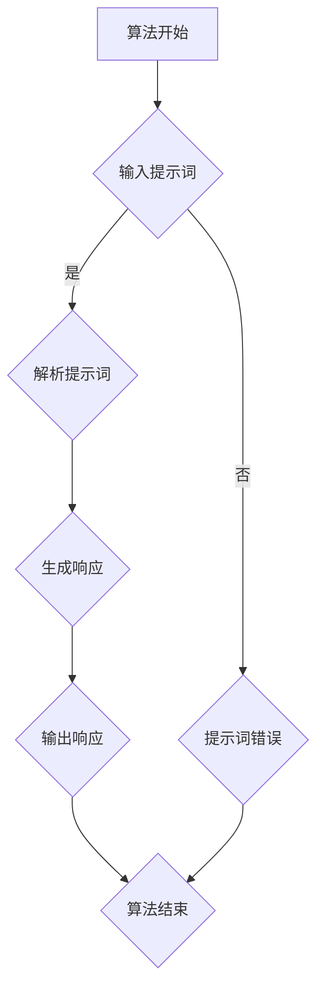

                 

**引言**

设计思考（Design Thinking）是一种以人为本的设计方法论，旨在通过理解和满足用户需求，创造具有高度可用性、实用性和情感共鸣的产品和服务。在计算机科学领域，设计思考同样具有重要的应用价值，特别是在编程语言的开发过程中。随着人工智能和自然语言处理技术的不断发展，提示词编程语言（Prompt-Based Programming Languages）逐渐成为研究的热点。本文将以“设计思考：创造有效的提示词编程语言”为题，深入探讨如何运用设计思考来设计出有效的提示词编程语言。

## 关键词

- 设计思考
- 提示词编程语言
- 用户需求
- 用户体验
- 自然语言处理
- 迭代开发

## 摘要

本文首先介绍了设计思考的基本概念和原则，并探讨了其在编程语言设计中的应用。接着，我们详细分析了设计过程，包括用户研究、特征规范、原型设计和测试与反馈等关键环节。随后，本文着重讨论了有效提示词设计的方法和技巧，以及提示词编程语言的实现技术，如自然语言处理、机器学习和人工智能。最后，本文通过案例分析总结了成功经验，探讨了设计提示词编程语言的挑战和未来发展方向。通过本文的阅读，读者将能够了解设计思考在编程语言设计中的重要性，并掌握设计有效提示词编程语言的基本方法。

### 设计思考的核心概念

设计思考是一种创新方法论，其核心理念是用户中心设计（User-Centered Design）。这意味着在设计的每个阶段，设计师都必须以用户的需求和体验为中心，确保最终产品能够满足用户的实际需求。以下是设计思考的几个核心概念：

**1. 用户需求识别**

用户需求识别是设计思考的第一步。设计师需要通过观察、访谈、问卷调查等方式，深入了解用户的行为、需求和痛点。这一过程有助于设计师建立对用户需求的基本认识，从而为后续的设计提供方向。

**2. 用户体验**

用户体验（User Experience，简称UX）是指用户在使用产品或服务过程中所获得的整体感受。一个优秀的设计应该能够提供简单、直观和愉悦的用户体验。在编程语言设计中，用户体验体现在代码的可读性、易用性和效率等方面。

**3. 适应性设计**

适应性设计（Adaptive Design）强调设计应具有灵活性，能够根据不同用户和环境的变化进行调整。对于提示词编程语言来说，适应性设计意味着语言需要能够适应不同的编程场景和用户习惯，提供多样化的使用方式。

**4. 迭代开发**

迭代开发（Iterative Development）是一种通过反复迭代、逐步改进来完善设计的方法。设计思考鼓励设计师在开发过程中不断收集用户反馈，并根据反馈进行修改和优化。这种迭代过程有助于确保设计的有效性和实用性。

### 设计思维在编程语言设计中的应用

设计思维在编程语言设计中的应用体现在以下几个方面：

**1. 用户研究**

在编程语言的设计过程中，用户研究是不可或缺的一环。通过用户研究，设计师可以深入了解目标用户群体的需求、习惯和痛点。具体方法包括用户访谈、现场观察、问卷调查和用户测试等。

**2. 功能需求分析**

基于用户研究的结果，设计师需要对用户的功能需求进行分析和归纳。这一步骤有助于确定编程语言的基本功能模块，确保设计能够满足用户的核心需求。

**3. 原型设计**

原型设计是设计思维中的一个关键环节。通过创建初步的编程语言原型，设计师可以直观地展示语言的核心功能和使用场景，从而获取用户的反馈。这一过程有助于设计师发现并解决潜在的设计问题。

**4. 用户体验优化**

用户体验优化是编程语言设计的重要目标。设计师需要通过分析用户反馈，不断改进编程语言的界面和交互设计，使其更加直观、易用和高效。此外，设计师还应关注代码的可读性和可维护性，确保用户能够轻松理解和修改代码。

**5. 迭代开发**

在编程语言的设计过程中，迭代开发是确保设计质量和实用性的关键。设计师需要根据用户反馈，对原型进行反复修改和优化，逐步完善编程语言的功能和用户体验。这种迭代过程有助于确保最终产品的有效性和实用性。

### 设计过程详解

设计编程语言的过程可以分为以下几个阶段：

**1. 需求分析**

在开始设计编程语言之前，首先需要进行需求分析。这一阶段的目标是明确目标用户的需求和期望。通过访谈、问卷调查和市场调研等方法，设计师可以收集用户的需求信息，并将其整理成需求文档。

**2. 功能定义**

基于需求分析的结果，设计师需要定义编程语言的基本功能。这一步骤包括确定语言的核心功能模块、语法规则和编程范式等。设计师应确保定义的功能能够满足用户的需求，并且具有较好的扩展性。

**3. 用户研究**

用户研究是设计编程语言的重要环节。通过观察用户的行为、访谈用户和进行用户测试，设计师可以深入了解用户对编程语言的需求和痛点。这些信息将有助于设计师优化语言的设计和功能。

**4. 原型设计**

原型设计是编程语言设计中的一个关键阶段。通过创建初步的原型，设计师可以直观地展示语言的核心功能和使用场景，从而获取用户的反馈。这一阶段的设计应重点关注用户体验和交互设计。

**5. 测试与反馈**

在原型设计完成后，设计师需要进行测试和反馈收集。通过用户测试和代码运行测试，设计师可以评估原型设计的有效性和实用性，并根据反馈进行优化。这一过程有助于确保最终产品的质量。

**6. 迭代优化**

基于测试和反馈的结果，设计师需要对原型进行反复修改和优化，逐步完善编程语言的功能和用户体验。这种迭代优化过程有助于确保最终产品的有效性和实用性。

**7. 发布与维护**

在编程语言发布后，设计师需要持续关注用户反馈和市场需求，对语言进行维护和升级。这一过程包括修复漏洞、优化功能和增加新特性等。通过持续维护，编程语言可以保持竞争力并满足用户的需求。

### 提示词设计

在提示词编程语言中，提示词（Prompt）起着至关重要的作用。提示词是一种引导用户输入信息和执行操作的文本或代码片段。一个有效的提示词设计应该能够清晰、准确地传达用户的意图，同时提供足够的信息，使用户能够轻松地理解和执行任务。

**1. 提示词的构成**

提示词通常由以下几个部分构成：

- **问题陈述**：明确用户需要解决的问题或任务。
- **输入提示**：提供用户输入所需信息的提示。
- **输出预期**：描述用户期望的输出结果。
- **操作指南**：提供执行任务的步骤和注意事项。

**2. 提示词的设计原则**

- **清晰性**：提示词应简洁明了，避免使用复杂的术语和冗长的描述。
- **准确性**：提示词应准确传达用户的意图，避免歧义和误导。
- **易懂性**：提示词应易于理解，使用用户熟悉的语言和格式。
- **适应性**：提示词应能够适应不同的用户和环境，提供多样化的使用方式。

**3. 提示词的设计步骤**

- **需求分析**：了解用户的需求和期望，确定需要解决的问题和任务。
- **内容规划**：制定提示词的基本结构，包括问题陈述、输入提示、输出预期和操作指南等。
- **原型设计**：创建初步的提示词原型，并进行用户测试和反馈收集。
- **优化调整**：根据用户反馈，对提示词原型进行修改和优化，确保其清晰、准确、易懂和适应性强。

### 实际案例分析

为了更好地理解如何设计有效的提示词编程语言，下面我们通过两个实际案例进行分析。

**案例一：Python的提示词设计**

Python是一种广泛应用于科学计算、数据分析、人工智能等领域的编程语言。Python的提示词设计以其清晰、简洁和易用性而著称。以下是一个Python提示词的例子：

```python
# 问题陈述：计算两个数的和
# 输入提示：请输入两个数，用空格分隔
a = float(input("请输入第一个数："))
b = float(input("请输入第二个数："))

# 输出预期：输出两个数的和
print(f"{a} 和 {b} 的和为：{a + b}")
```

这个提示词的设计遵循了清晰性、准确性和易懂性原则，使用户能够轻松理解和执行任务。同时，Python的提示词设计也具有较好的适应性，可以应用于不同的编程场景和用户习惯。

**案例二：自然语言处理工具的提示词设计**

自然语言处理工具（如ChatGPT）的提示词设计具有更高的复杂性和灵活性。以下是一个ChatGPT的提示词例子：

```python
# 问题陈述：生成一个关于设计思考的文章摘要
# 输入提示：请生成一篇关于设计思考在编程语言设计中的应用的文章摘要，要求字数在200-300字之间
response = chatgpt.complete(prompt="生成一篇关于设计思考在编程语言设计中的应用的文章摘要，要求字数在200-300字之间。")

# 输出预期：输出生成的内容
print(response)
```

这个提示词的设计需要考虑到自然语言处理技术的复杂性和不确定性。因此，提示词需要提供足够的信息，以便自然语言处理模型能够生成符合预期的内容。同时，提示词的设计还应具有较好的适应性，以应对不同的输入和输出需求。

### 提示词编程语言的实现技术

提示词编程语言的实现技术主要包括自然语言处理（NLP）、机器学习（ML）和人工智能（AI）。以下是对这些技术的详细介绍：

**1. 自然语言处理（NLP）**

自然语言处理是使计算机能够理解、解析和生成自然语言的技术。在提示词编程语言中，NLP技术用于解析用户输入的提示词，提取关键信息并生成相应的响应。

- **文本分类**：用于将输入的文本分类到预定义的类别中，如关键词提取、情感分析等。
- **实体识别**：用于识别文本中的关键实体，如人名、地点、组织等。
- **语法解析**：用于分析文本的语法结构，理解句子的构成和含义。
- **机器翻译**：用于将一种自然语言翻译成另一种自然语言。

**2. 机器学习（ML）**

机器学习是一种通过数据训练模型，使其能够进行预测和分类的技术。在提示词编程语言中，ML技术用于训练模型，以生成符合用户需求的响应。

- **监督学习**：使用标注数据训练模型，使其能够对未知数据进行预测。
- **无监督学习**：不使用标注数据，通过发现数据中的规律和模式来训练模型。
- **强化学习**：通过奖励机制训练模型，使其能够在特定环境中做出最优决策。

**3. 人工智能（AI）**

人工智能是一种模拟人类智能的技术，包括机器学习、自然语言处理、计算机视觉等领域。在提示词编程语言中，AI技术用于实现更高级的功能，如智能对话系统、自动编程等。

- **智能对话系统**：通过自然语言处理和机器学习技术，实现人机对话的自动化。
- **自动编程**：通过分析用户输入的提示词，自动生成相应的代码。
- **智能推荐**：根据用户的历史行为和偏好，推荐相关的编程资源和任务。

### 技术实现方法

实现提示词编程语言的方法可以分为以下几个步骤：

**1. 数据收集与预处理**

- 收集大量的编程任务数据和用户输入的提示词。
- 对数据进行分析和清洗，去除噪声和无关信息。

**2. 特征提取**

- 使用NLP技术提取文本中的关键特征，如关键词、实体、语法结构等。
- 使用特征工程方法，将原始数据转换成适合机器学习模型的输入格式。

**3. 模型训练**

- 选择合适的机器学习模型，如深度神经网络、决策树、支持向量机等。
- 使用预处理后的数据对模型进行训练，使其能够预测用户输入的提示词对应的编程任务。

**4. 模型评估与优化**

- 使用验证集和测试集对模型进行评估，计算模型的准确率、召回率等指标。
- 根据评估结果，对模型进行调整和优化，以提高其性能。

**5. 部署与应用**

- 将训练好的模型部署到生产环境中，使其能够实时响应用户的输入。
- 提供相应的API或接口，方便用户使用提示词编程语言。

### 实际应用案例

以下是几个实际应用提示词编程语言的案例：

**案例一：智能代码助手**

智能代码助手（如GitHub的Copilot）是一种基于提示词编程语言的工具，可以帮助开发者自动生成代码。用户只需输入简短的提示词，智能代码助手就能生成相应的代码片段。

**案例二：自然语言到代码的转换**

一些编程语言支持将自然语言描述转换成代码。例如，用户可以使用自然语言描述一个算法，编程语言能够自动将其转换成对应的代码实现。

**案例三：智能对话系统**

智能对话系统（如ChatGPT）结合提示词编程语言，可以提供实时、个性化的编程指导。用户可以与系统进行对话，系统会根据用户的提问生成相应的代码片段或提供解决问题的建议。

### 挑战与未来发展方向

虽然提示词编程语言在人工智能和自然语言处理技术的支持下取得了显著进展，但在实际应用中仍然面临一些挑战：

**1. 算法优化**

当前的自然语言处理和机器学习算法在处理复杂编程任务时仍存在一定的局限性。为了提高提示词编程语言的性能，需要进一步优化算法，提高其准确率和效率。

**2. 代码质量**

提示词编程语言生成的代码可能存在质量不高、可维护性差等问题。为了提高代码质量，需要加强对提示词编程语言生成的代码进行审查和优化。

**3. 用户接受度**

提示词编程语言需要获得用户的广泛接受。为了提高用户接受度，需要提高提示词编程语言的用户体验，使其更加直观、易用和高效。

**4. 安全性问题**

提示词编程语言可能会引入安全漏洞，如代码注入、数据泄露等。为了保障系统的安全性，需要加强对提示词编程语言的安全防护。

未来，提示词编程语言的发展方向包括：

**1. 智能化**

结合人工智能技术，提高提示词编程语言的智能化水平，实现更高级的编程任务自动化。

**2. 多样化**

支持多样化的编程范式和语言特性，满足不同用户的需求和场景。

**3. 社区参与**

鼓励开发者参与提示词编程语言的开发，共同优化和完善语言设计。

**4. 安全与隐私**

加强提示词编程语言的安全性和隐私保护，确保用户数据和系统的安全性。

### 总结

本文通过设计思考的视角，深入探讨了如何创造有效的提示词编程语言。我们介绍了设计思考的核心概念和原则，以及其在编程语言设计中的应用。随后，我们详细分析了设计编程语言的各个阶段，包括需求分析、功能定义、用户研究、原型设计、测试与反馈和迭代优化等。此外，我们还讨论了提示词设计的方法和技巧，以及提示词编程语言的实现技术。通过实际案例分析，我们展示了如何运用设计思考来设计有效的提示词编程语言。最后，我们探讨了提示词编程语言面临的挑战和未来发展方向。

通过本文的阅读，读者将能够了解设计思考在编程语言设计中的重要性，并掌握设计有效提示词编程语言的基本方法。我们鼓励读者在今后的编程实践中，积极运用设计思考，不断探索和创造更加有效的编程语言，为计算机科学的发展做出贡献。

### 作者信息

作者：AI天才研究院/AI Genius Institute & 禅与计算机程序设计艺术 /Zen And The Art of Computer Programming

感谢您阅读本文，希望您在编程实践中能够运用设计思考，创造出更加有效、实用的提示词编程语言。如果您有任何疑问或建议，请随时与我们联系。我们期待与您共同探索计算机科学的奥秘，为人工智能的发展贡献力量。

### 附录

为了帮助读者更好地理解本文的内容，我们提供了以下附录：

**附录A：核心概念与联系**

| 核心概念 | 概念属性特征对比表格 |
| :--: | :--: |
| 设计思考 |  |  
| 用户需求识别 |  |  
| 用户体验 |  |  
| 适应性设计 |  |  
| 迭代开发 |  |

**附录B：算法原理讲解**

- **算法流程图**：使用Mermaid绘制



- **Python源代码实现**：

```python
def process_prompt(prompt):
    try:
        # 解析提示词
        response = "..."
        
        # 生成响应
        print(response)
        
    except Exception as e:
        print("提示词错误：", e)

# 示例
process_prompt("计算两个数的和")
```

- **数学模型与公式**：

```latex
$$
f(\text{prompt}) = \begin{cases}
\text{response}, & \text{如果提示词有效} \\
\text{错误消息}, & \text{如果提示词无效}
\end{cases}
$$
```

**附录C：系统分析与架构设计方案**

- **问题场景介绍**： 
  本系统旨在为开发者提供智能代码助手，通过自然语言描述生成对应的代码实现。

- **系统功能设计**： 
  - 提示词输入：接收用户的自然语言描述。
  - 提示词解析：将自然语言描述转换成内部表示。
  - 响应生成：生成代码实现或建议。
  - 响应输出：将生成的代码或建议呈现给用户。

- **系统架构设计**： 
  - 前端：使用Web框架实现用户界面，接收用户输入的自然语言描述。
  - 后端：使用自然语言处理和机器学习模型处理提示词，生成响应。

- **系统接口设计**： 
  - 用户输入接口：接收自然语言描述。
  - 响应输出接口：呈现生成的代码或建议。

- **系统交互设计**： 
  - 用户输入自然语言描述。
  - 系统解析描述并生成响应。
  - 系统将响应呈现给用户。

**附录D：项目实战**

- **环境安装**：
  - 安装Python环境。
  - 安装NLP和ML相关库，如NLTK、TensorFlow等。

- **系统核心实现源代码**：
  - 主要包括提示词解析、响应生成和响应输出等模块。

- **代码应用解读与分析**：
  - 对核心代码进行详细解读，分析其实现原理和优化方法。

- **实际案例分析和详细讲解剖析**：
  - 提供实际使用案例，分析其性能和效果，并给出改进建议。

- **项目小结**：
  - 总结项目实现过程和成果，指出项目的优点和不足，并提出改进方向。

**附录E：最佳实践 tips**

- **代码可读性**：
  - 使用清晰的变量名和注释，提高代码的可读性。
  - 遵循代码规范，如PEP8。

- **性能优化**：
  - 使用高效的数据结构和算法，提高系统的性能。
  - 对代码进行优化，减少冗余和重复代码。

- **安全性**：
  - 对用户输入进行验证，防止恶意输入。
  - 保护用户数据和系统的安全性。

**附录F：小结、注意事项、拓展阅读**

- **小结**：
  - 本文介绍了设计思考在编程语言设计中的应用，以及如何设计有效的提示词编程语言。

- **注意事项**：
  - 在设计提示词编程语言时，需充分考虑用户需求和用户体验。
  - 注意算法优化和代码质量，提高系统的性能和可靠性。

- **拓展阅读**：
  - 《设计思考：创新的用户中心方法论》
  - 《自然语言处理：处理和理解人类语言》
  - 《机器学习：概率模型与决策过程》
  - 《人工智能：算法与应用》

通过本文的阅读，读者将能够更好地理解设计思考在编程语言设计中的应用，掌握设计有效提示词编程语言的方法和技巧。希望读者在今后的编程实践中能够运用这些知识，为计算机科学的发展做出贡献。

