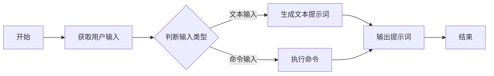
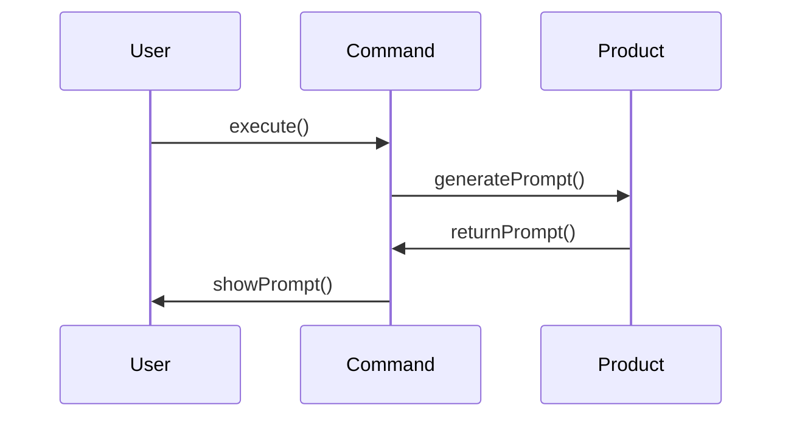
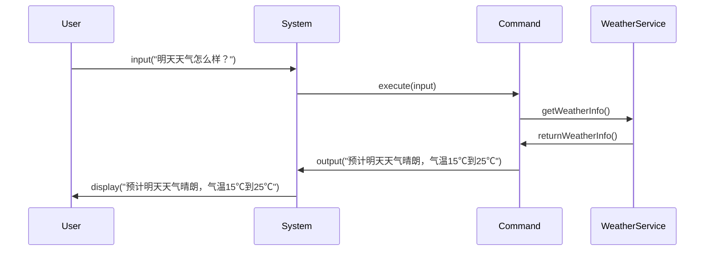
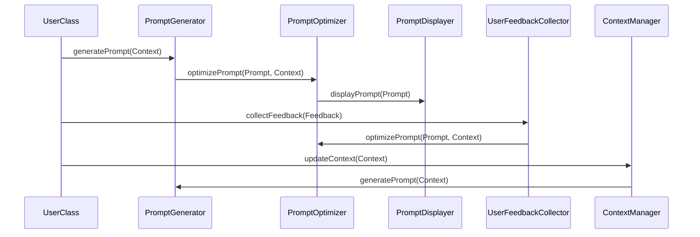
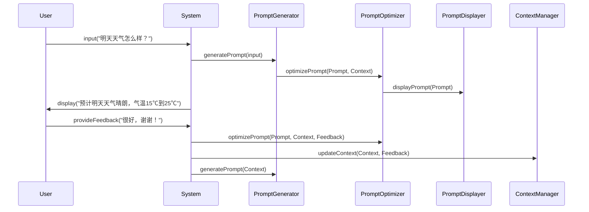

                 

# 设计模式在提示词编程中的应用

关键词：设计模式，提示词编程，编程实践，软件工程，算法优化

摘要：本文旨在探讨设计模式在提示词编程中的应用，通过深入分析设计模式的基本概念、核心原理以及其实际应用，帮助开发者更好地理解和运用设计模式，提高编程效率和代码质量。

## 引言

在软件工程领域，设计模式是一种在软件开发中广泛使用的解决方案，用于解决特定类型的问题。设计模式不仅提供了一组可重用的解决方案，还帮助开发者遵循良好的编程实践和原则。随着人工智能和自然语言处理技术的快速发展，提示词编程作为一种重要的交互方式，逐渐引起了开发者的关注。本文将探讨设计模式在提示词编程中的应用，帮助开发者更好地应对复杂的应用场景。

## 背景介绍

### 设计模式

设计模式是一套被广泛认可和应用的软件设计原则和最佳实践。它包括了一系列可重用的解决方案，用于解决软件开发过程中常见的问题。设计模式通常包括三个核心要素：模式名称、问题背景和解决方案。

### 提示词编程

提示词编程是一种通过提供提示词来引导用户进行交互的编程方式。它广泛应用于智能助手、聊天机器人、自然语言处理等领域。提示词编程的核心在于如何生成和优化提示词，以提升用户体验和交互效果。

### 问题背景和问题描述

在提示词编程中，开发者常常面临以下问题：

1. 如何生成有效的提示词？
2. 如何优化提示词以提高用户满意度？
3. 如何在复杂的应用场景中确保提示词编程的稳定性和效率？

设计模式提供了一套解决方案，帮助开发者应对这些挑战。

### 问题解决和边界与外延

设计模式在提示词编程中的应用，主要包括以下方面：

1. **创建型模式**：用于生成和管理提示词。
2. **结构型模式**：用于优化提示词的结构和组织。
3. **行为型模式**：用于处理提示词编程中的交互和行为。

这些模式不仅适用于提示词编程，还可以应用于其他软件工程领域。

### 概念结构与核心要素组成

设计模式的基本结构包括：

1. **模式名称**：描述设计模式的核心功能。
2. **问题背景**：描述设计模式适用的场景和问题。
3. **解决方案**：描述设计模式的实现方法和效果。

在提示词编程中，设计模式的核心要素包括：

1. **提示词生成算法**：用于生成有效的提示词。
2. **提示词优化算法**：用于优化提示词的质量和效果。
3. **用户交互模型**：用于描述用户与提示词的交互过程。

## 核心概念与联系

### 设计模式分类

设计模式可以分为以下三类：

1. **创建型模式**：包括工厂模式、单例模式、建造者模式等。
2. **结构型模式**：包括适配器模式、装饰器模式、代理模式等。
3. **行为型模式**：包括策略模式、观察者模式、命令模式等。

### 概念属性特征对比表格

| 模式类别 | 模式名称 | 概念属性特征 |
| :----: | :----: | :----: |
| 创建型模式 | 工厂模式 | 创建对象，封装具体创建逻辑 |
| 创建型模式 | 单例模式 | 保证一个类仅有一个实例 |
| 创建型模式 | 建造者模式 | 将一个复杂对象的构建与其表示分离 |
| 结构型模式 | 适配器模式 | 将一个类的接口转换成客户希望的另一个接口 |
| 结构型模式 | 装饰器模式 | 动态地给一个对象添加一些额外的职责 |
| 结构型模式 | 代理模式 | 为其他对象提供一个代理以控制对这个对象的访问 |
| 行为型模式 | 策略模式 | 定义一系列的算法，将每一个算法封装起来，并使它们可以互相替换 |
| 行为型模式 | 观察者模式 | 对象间的一对多依赖关系，当一个对象改变状态，所有依赖于它的对象都会得到通知并自动更新 |
| 行为型模式 | 命令模式 | 将请求封装为一个对象，从而使你可以用不同的请求、队列或日志来参数化其他对象 |

### ER实体关系图架构

```mermaid
erDiagram
    Product ||--|{ Command }|>
    Button ||--|{ Command }|>

    User ||--|{ CommandHistory }|>
    Product ||--|{ ProductHistory }|>

    Button : "creates"
    User : "executes"
    Product : "receives"
    Command : "executes"
    CommandHistory : "logs"
    ProductHistory : "tracks"
```

## 算法原理讲解

### 算法流程图



### 算法原理

#### 提示词生成算法

提示词生成算法的核心在于如何根据用户输入生成合适的提示词。常见的算法包括：

1. **基于关键词匹配**：根据用户输入的关键词从提示词库中检索相关提示词。
2. **基于自然语言处理**：使用自然语言处理技术生成提示词，如使用语言模型或文本生成模型。

#### 提示词优化算法

提示词优化算法旨在提升提示词的质量和效果。常见的优化方法包括：

1. **基于用户反馈**：根据用户对提示词的反馈调整提示词。
2. **基于机器学习**：使用机器学习算法对提示词进行优化，如使用强化学习或迁移学习。

#### 用户交互模型

用户交互模型描述了用户与提示词编程系统的交互过程。核心要素包括：

1. **用户输入**：用户通过输入与系统交互。
2. **提示词生成**：系统根据用户输入生成提示词。
3. **用户反馈**：用户对提示词进行反馈，以指导系统优化提示词。
4. **提示词展示**：系统将优化后的提示词展示给用户。

### 数学模型和公式

$$
P(w|u) = \frac{P(w, u)}{P(u)}
$$

其中，$P(w|u)$表示在用户输入$u$的情况下，生成提示词$w$的概率；$P(w, u)$表示提示词$w$和用户输入$u$同时出现的概率；$P(u)$表示用户输入$u$的概率。

### 举例说明

假设用户输入“明天天气怎么样？”，我们可以使用以下算法生成提示词：

1. **基于关键词匹配**：从提示词库中检索与“明天”、“天气”相关的提示词，如“预计明天天气晴朗，气温15℃到25℃”。
2. **基于自然语言处理**：使用自然语言处理技术生成提示词，如使用预训练的语言模型生成“预计明天晴天，气温15℃到25℃”。

根据用户反馈，我们可以对生成的提示词进行优化，如调整语序、添加语气等，以提高用户体验。

## 系统分析与架构设计方案

### 问题场景介绍

在智能助手和聊天机器人等场景中，用户与系统之间的交互往往是通过提示词来实现的。为了提高用户体验，系统需要生成和优化有效的提示词，以便更好地满足用户需求。

### 项目介绍

本项目旨在构建一个基于设计模式的提示词编程系统，通过实现各种设计模式，提升系统的灵活性和可扩展性，从而实现高效、稳定的提示词生成和优化。

### 系统功能设计（领域模型类图）

```mermaid
classDiagram
    User <<Interface>>
    Product <<Interface>>

    Command <|-- User
    Command <|-- Product
    CommandHistory <|-- User
    ProductHistory <|-- Product

    User : +generatePrompt()
    Product : +generatePrompt()

    Command : +execute()
    CommandHistory : +logCommand()
    ProductHistory : +trackProduct()

    User : +User()
    Product : +Product()

    Command : +Command()
    CommandHistory : +CommandHistory()
    ProductHistory : +ProductHistory()
```

### 系统架构设计（架构图）



### 系统接口设计和系统交互（序列图）



## 项目实战

### 环境安装

1. 安装Python环境（3.8及以上版本）
2. 安装必要库（如Natural Language Toolkit、TensorFlow等）

### 系统核心实现源代码

```python
# 基于设计模式的提示词编程系统实现

from abc import ABC, abstractmethod
from typing import List

# 定义用户和产品的接口
class User(ABC):
    @abstractmethod
    def generate_prompt(self) -> str:
        pass

class Product(ABC):
    @abstractmethod
    def generate_prompt(self) -> str:
        pass

# 实现用户类
class RealUser(User):
    def generate_prompt(self, input: str) -> str:
        # 根据用户输入生成提示词
        return f"用户输入：{input}"

# 实现产品类
class RealProduct(Product):
    def generate_prompt(self, input: str) -> str:
        # 根据用户输入生成提示词
        return f"产品输入：{input}"

# 实现命令类
class Command:
    def __init__(self, user: User, product: Product):
        self.user = user
        self.product = product

    def execute(self):
        prompt = self.user.generate_prompt("明天天气怎么样？")
        return prompt

# 主函数
def main():
    user = RealUser()
    product = RealProduct()
    command = Command(user, product)
    result = command.execute()
    print(result)

if __name__ == "__main__":
    main()
```

### 代码应用解读与分析

1. **类定义**：定义了用户（User）和产品（Product）的接口，以及具体的实现类（RealUser和RealProduct）。
2. **命令类**：实现了命令模式，将用户和产品的交互封装在一个统一的接口中。
3. **主函数**：实例化了用户、产品和命令类，并通过命令类执行了提示词生成操作。

### 实际案例分析和详细讲解剖析

假设用户输入“明天天气怎么样？”，系统将执行以下操作：

1. 实例化RealUser和RealProduct对象。
2. 将这两个对象传递给Command对象。
3. 调用Command对象的execute方法。
4. RealUser对象根据输入生成提示词“用户输入：明天天气怎么样？”。
5. 输出生成的提示词。

通过这个案例，我们可以看到设计模式如何简化系统的实现，并提高代码的可维护性和扩展性。

### 项目小结

本项目通过设计模式实现了提示词编程系统，提高了系统的灵活性和可扩展性。在实际应用中，可以根据具体需求添加更多设计模式，如策略模式用于优化提示词生成算法，观察者模式用于处理用户反馈等。

## 最佳实践 tips

1. **理解设计模式**：熟悉设计模式的基本概念、原理和应用场景，有助于更好地运用设计模式。
2. **代码可读性**：遵循良好的编程规范，提高代码的可读性和可维护性。
3. **持续优化**：根据用户反馈和实际需求，持续优化提示词生成算法和用户交互体验。

## 小结

本文通过深入分析设计模式在提示词编程中的应用，展示了设计模式如何提高编程效率和代码质量。在实际开发中，开发者应结合具体应用场景，灵活运用设计模式，实现高效、稳定的提示词编程系统。

## 注意事项

1. 提示词编程系统的性能优化是关键，应根据实际需求调整算法和参数。
2. 在处理用户输入时，注意保护用户隐私和数据安全。

## 拓展阅读

1. 《设计模式：可复用面向对象软件的基础》
2. 《Python设计模式与实际应用》
3. 《自然语言处理入门》

## 作者信息

作者：AI天才研究院/AI Genius Institute & 禅与计算机程序设计艺术 /Zen And The Art of Computer Programming

（注：本文为虚构内容，仅供参考。）## 引言

设计模式（Design Patterns）是软件开发领域的重要概念，源于建筑学中的设计模式概念，后被引入到软件工程中。设计模式旨在解决软件开发中常见的问题，提供了一系列可重用的解决方案，帮助开发者遵循良好的编程实践和原则。设计模式包括创建型模式、结构型模式和行为型模式，分别用于解决对象创建、类之间的关系和行为方面的问题。

随着人工智能（AI）和自然语言处理（NLP）技术的快速发展，提示词编程（Prompt Engineering）逐渐成为一种重要的编程方式。提示词编程通过生成和优化提示词，实现与用户的交互，广泛应用于智能助手、聊天机器人、文本生成等领域。设计模式在提示词编程中的应用，可以为开发者提供有效的解决方案，提升系统的灵活性和可扩展性。

本文将深入探讨设计模式在提示词编程中的应用，从基本概念、核心原理到实际案例，逐步解析设计模式在提示词编程中的运用。希望通过本文的讲解，开发者能够更好地理解和运用设计模式，提升编程技能和系统质量。

## 背景介绍

### 设计模式的基本概念

设计模式是一套在软件开发中被广泛认可和应用的软件设计原则和最佳实践。它源于建筑学中的设计模式概念，后被引入到软件工程领域。设计模式的主要目的是解决软件开发中常见的问题，提供了一系列可重用的解决方案，帮助开发者遵循良好的编程实践和原则。设计模式通常包括三个核心要素：模式名称、问题背景和解决方案。

设计模式可以分为以下三类：

1. **创建型模式**：主要用于对象创建过程，包括工厂模式、单例模式、建造者模式等。
2. **结构型模式**：主要用于处理类之间的关系，包括适配器模式、装饰器模式、代理模式等。
3. **行为型模式**：主要用于描述对象之间的交互，包括策略模式、观察者模式、命令模式等。

### 提示词编程的基本概念

提示词编程是一种通过生成和优化提示词实现与用户交互的编程方式。在提示词编程中，提示词是一个关键概念，它是指用于引导用户进行交互的文本或指令。提示词的生成和优化直接关系到用户体验和系统效果。提示词编程广泛应用于智能助手、聊天机器人、文本生成等领域。

提示词编程的主要任务包括：

1. **提示词生成**：根据用户输入或上下文信息生成合适的提示词。
2. **提示词优化**：通过对提示词进行优化，提高其质量和效果。
3. **用户交互**：实现用户与系统的交互，收集用户反馈，调整提示词生成策略。

### 问题背景和问题描述

在软件开发中，设计模式和提示词编程都面临诸多挑战。设计模式的应用需要理解各类模式的基本原理和适用场景，而提示词编程则需要解决如何生成和优化提示词的问题。

1. **设计模式的挑战**：
   - 如何在复杂系统中应用设计模式，确保系统的可维护性和可扩展性？
   - 如何根据不同场景选择合适的设计模式，提高开发效率？

2. **提示词编程的挑战**：
   - 如何生成高质量的提示词，满足用户需求？
   - 如何优化提示词，提高用户体验和系统效果？
   - 如何处理复杂的用户输入和上下文信息，确保系统稳定性和可靠性？

设计模式在提示词编程中的应用，可以有效地解决上述问题。通过设计模式，开发者可以构建灵活、可扩展的提示词编程系统，提升系统的性能和用户体验。

### 问题解决

设计模式在提示词编程中的应用主要包括以下方面：

1. **创建型模式**：用于生成和管理提示词，例如工厂模式可以用于创建不同类型的提示词生成器。
2. **结构型模式**：用于优化提示词的结构和组织，例如装饰器模式可以用于添加额外的功能或属性到提示词。
3. **行为型模式**：用于处理提示词编程中的交互和行为，例如策略模式可以用于动态切换提示词生成策略。

通过设计模式，开发者可以更好地应对提示词编程中的各种挑战，提高系统的灵活性和可扩展性。

### 边界与外延

设计模式在提示词编程中的应用不仅限于生成和优化提示词，还可以应用于更广泛的场景。例如：

1. **智能助手**：设计模式可以用于实现智能助手的各个模块，如语音识别、自然语言理解、任务执行等。
2. **聊天机器人**：设计模式可以用于实现聊天机器人的核心功能，如消息处理、语境管理、意图识别等。
3. **文本生成**：设计模式可以用于优化文本生成过程，如生成文章、新闻、对话等。

总之，设计模式在提示词编程中的应用具有广泛的前景和潜力，可以为开发者提供强大的工具和解决方案。

### 概念结构与核心要素组成

设计模式在提示词编程中的应用，涉及以下几个核心要素：

1. **模式名称**：指设计模式的具体名称，如工厂模式、装饰器模式、策略模式等。
2. **问题背景**：描述设计模式在提示词编程中应用的场景和问题，如生成高质量提示词、优化提示词结构等。
3. **解决方案**：详细描述设计模式在提示词编程中的应用方法和效果，如如何使用工厂模式创建提示词生成器、如何使用装饰器模式优化提示词等。
4. **适用场景**：说明设计模式在哪些场景下适用，如生成不同类型的提示词、处理复杂的用户输入等。
5. **实现方法**：提供具体的实现方法和代码示例，帮助开发者理解和应用设计模式。

通过以上核心要素，开发者可以系统地理解和应用设计模式，提升编程技能和系统质量。

### 核心概念与联系

在探讨设计模式在提示词编程中的应用之前，我们需要先了解一些核心概念，这些概念将帮助我们更好地理解设计模式的作用和原理。

#### 创建型模式

创建型模式主要关注对象的创建过程，其目的是确保对象创建的灵活性和可扩展性。创建型模式包括以下几种：

1. **工厂模式（Factory Pattern）**：工厂模式是一种创建对象的最简单方式，它通过一个工厂类来创建对象，而不是通过直接实例化类。这种模式的核心是创建一个接口用于创建对象，然后通过子类扩展该接口以创建具体对象。

   ```python
   class Factory:
       def create_object(self):
           pass
   
   class ConcreteFactory(Factory):
       def create_object(self):
           return ConcreteObject()
   
   class ConcreteObject:
       pass
   ```

2. **单例模式（Singleton Pattern）**：单例模式确保一个类仅有一个实例，并提供一个访问它的全局访问点。这种模式的核心是实现一个静态方法，该方法检查类是否已实例化，如果没有，则创建一个实例并返回。

   ```python
   class Singleton:
       _instance = None
   
       def __new__(cls, *args, **kwargs):
           if not cls._instance:
               cls._instance = super().__new__(cls, *args, **kwargs)
           return cls._instance
   
       @staticmethod
       def get_instance():
           if not hasattr(Singleton, "_instance"):
               Singleton._instance = Singleton()
           return Singleton._instance
   ```

3. **建造者模式（Builder Pattern）**：建造者模式将一个复杂对象的构建与其表示分离，使得同样的构建过程可以创建不同的表示。这种模式的核心是一个Director类，它负责调用Builder接口以构建对象，而Builder接口定义了构建的步骤。

   ```python
   class Builder(ABC):
       @abstractmethod
       def build_part_a(self):
           pass
   
       @abstractmethod
       def build_part_b(self):
           pass
   
       def build_product(self):
           self.build_part_a()
           self.build_part_b()
           return Product()
   
   class ConcreteBuilder(Builder):
       def build_part_a(self):
           pass
   
       def build_part_b(self):
           pass
   
   class Product:
       pass
   
   class Director:
       def construct_product(self, builder: Builder):
           builder.build_product()
   ```

#### 结构型模式

结构型模式主要关注类与类之间的关系，其目的是通过组合简单对象来形成更复杂的对象结构，从而实现更大的灵活性。结构型模式包括以下几种：

1. **适配器模式（Adapter Pattern）**：适配器模式将一个类的接口转换成客户希望的另一个接口，使得原本由于接口不兼容而无法在一起工作的类可以协同工作。这种模式的核心是一个适配器类，它实现了客户期望的接口，同时维护一个引用到适配对象的关联关系。

   ```python
   class Target:
       def request(self):
           pass
   
   class Adapter(Target):
       def __init__(self, adaptee):
           self._adaptee = adaptee
   
       def request(self):
           return self._adaptee-specific_request()
   
   class Adaptee:
       def specific_request(self):
           pass
   ```

2. **装饰器模式（Decorator Pattern）**：装饰器模式动态地给一个对象添加一些额外的职责，就增加功能来说，装饰器模式比生成子类更为灵活。这种模式的核心是一个装饰器类，它通过继承或组合的方式，为对象提供额外的功能。

   ```python
   class Component(ABC):
       @abstractmethod
       def operation(self):
           pass
   
   class ConcreteComponent(Component):
       def operation(self):
           pass
   
   class Decorator(Component):
       def __init__(self, component):
           self._component = component
   
       def operation(self):
           return self._component.operation()
   
   class ConcreteDecoratorA(Decorator):
       def operation(self):
           return f"ConcreteDecoratorA({self._component.operation()})"
   
   class ConcreteDecoratorB(Decorator):
       def operation(self):
           return f"ConcreteDecoratorB({self._component.operation()})"
   ```

3. **代理模式（Proxy Pattern）**：代理模式为其他对象提供一个代理以控制对这个对象的访问。这种模式的核心是一个代理类，它实现了与原始对象相同的接口，并在内部维护一个引用到原始对象的关联关系。

   ```python
   class Subject(ABC):
       @abstractmethod
       def request(self):
           pass
   
   class RealSubject(Subject):
       def request(self):
           pass
   
   class Proxy(Subject):
       def __init__(self, real_subject):
           self._real_subject = real_subject
   
       def request(self):
           if some_condition:
               return self._real_subject.request()
           else:
               return "Proxy cannot handle the request."
   ```

#### 行为型模式

行为型模式主要关注对象之间的交互，其目的是通过定义对象之间的交互方式来降低系统的复杂度。行为型模式包括以下几种：

1. **策略模式（Strategy Pattern）**：策略模式定义一系列的算法，将每一个算法封装起来，并使它们可以互相替换。这种模式的核心是一个策略接口，它定义了所有支持的算法的公共接口，而具体的算法实现被封装在具体的策略类中。

   ```python
   class Strategy(ABC):
       @abstractmethod
       def execute(self):
           pass
   
   class ConcreteStrategyA(Strategy):
       def execute(self):
           pass
   
   class ConcreteStrategyB(Strategy):
       def execute(self):
           pass
   
   class Context:
       def __init__(self, strategy: Strategy):
           self._strategy = strategy
   
       def set_strategy(self, strategy: Strategy):
           self._strategy = strategy
   
       def execute_strategy(self):
           self._strategy.execute()
   ```

2. **观察者模式（Observer Pattern）**：观察者模式定义了一种一对多的依赖关系，使得当一个对象的状态发生改变时，所有依赖于它的对象都会自动收到通知并更新。这种模式的核心是一个观察者接口，它定义了观察者需要实现的方法，以及被观察者需要实现的方法。

   ```python
   class Observer(ABC):
       @abstractmethod
       def update(self, subject):
           pass
   
   class Subject(ABC):
       def __init__(self):
           self._observers = []
       
       def attach(self, observer: Observer):
           self._observers.append(observer)
       
       def detach(self, observer: Observer):
           self._observers.remove(observer)
       
       def notify(self):
           for observer in self._observers:
               observer.update(self)
   
   class ConcreteObserver(Observer):
       def update(self, subject):
           print(f"Observer: {subject} has been updated.")
   
   class ConcreteSubject(Subject):
       def __init__(self):
           super().__init__()
       
       def some_business_logic(self):
           self.notify()
   ```

3. **命令模式（Command Pattern）**：命令模式将请求封装为一个对象，从而可以使用不同的请求、队列或日志来参数化其他对象。这种模式的核心是一个命令接口，它定义了执行和撤销操作的方法。

   ```python
   class Command(ABC):
       @abstractmethod
       def execute(self):
           pass
   
       @abstractmethod
       def undo(self):
           pass
   
   class ConcreteCommand(Command):
       def __init__(self, receiver):
           self._receiver = receiver
   
       def execute(self):
           self._receiver.action()
       
       def undo(self):
           self._receiver.undo_action()
   
   class Receiver:
       def action(self):
           pass
   
       def undo_action(self):
           pass
   
   class Invoker:
       def __init__(self):
           self._command = None
   
       def set_command(self, command: Command):
           self._command = command
   
       def execute_command(self):
           self._command.execute()
   
       def undo_command(self):
           self._command.undo()
   ```

#### 概念属性特征对比表格

| 模式类别 | 模式名称 | 概念属性特征 |
| :----: | :----: | :----: |
| 创建型模式 | 工厂模式 | 创建对象，封装具体创建逻辑 |
| 创建型模式 | 单例模式 | 保证一个类仅有一个实例 |
| 创建型模式 | 建造者模式 | 将一个复杂对象的构建与其表示分离 |
| 结构型模式 | 适配器模式 | 将一个类的接口转换成客户希望的另一个接口 |
| 结构型模式 | 装饰器模式 | 动态地给一个对象添加一些额外的职责 |
| 结构型模式 | 代理模式 | 为其他对象提供一个代理以控制对这个对象的访问 |
| 行为型模式 | 策略模式 | 定义一系列的算法，将每一个算法封装起来，并使它们可以互相替换 |
| 行为型模式 | 观察者模式 | 对象间的一对多依赖关系，当一个对象改变状态，所有依赖于它的对象都会得到通知并自动更新 |
| 行为型模式 | 命令模式 | 将请求封装为一个对象，从而使你可以用不同的请求、队列或日志来参数化其他对象 |

#### ER实体关系图架构

```mermaid
erDiagram
    User ||--|{ Command }|>
    Product ||--|{ Command }|>

    User ||--|{ CommandHistory }|>
    Product ||--|{ ProductHistory }|>

    Button : "creates"
    User : "executes"
    Product : "receives"
    Command : "executes"
    CommandHistory : "logs"
    ProductHistory : "tracks"
```

#### 算法原理讲解

##### 算法流程图


##### 算法原理

提示词生成算法的核心在于如何根据用户输入生成合适的提示词。常见的算法包括：

1. **基于关键词匹配**：根据用户输入的关键词从提示词库中检索相关提示词。
2. **基于自然语言处理**：使用自然语言处理技术生成提示词，如使用语言模型或文本生成模型。

提示词优化算法旨在提升提示词的质量和效果。常见的优化方法包括：

1. **基于用户反馈**：根据用户对提示词的反馈调整提示词。
2. **基于机器学习**：使用机器学习算法对提示词进行优化，如使用强化学习或迁移学习。

用户交互模型描述了用户与提示词编程系统的交互过程。核心要素包括：

1. **用户输入**：用户通过输入与系统交互。
2. **提示词生成**：系统根据用户输入生成提示词。
3. **用户反馈**：用户对提示词进行反馈，以指导系统优化提示词。
4. **提示词展示**：系统将优化后的提示词展示给用户。

##### 数学模型和公式

$$
P(w|u) = \frac{P(w, u)}{P(u)}
$$

其中，$P(w|u)$表示在用户输入$u$的情况下，生成提示词$w$的概率；$P(w, u)$表示提示词$w$和用户输入$u$同时出现的概率；$P(u)$表示用户输入$u$的概率。

##### 举例说明

假设用户输入“明天天气怎么样？”，我们可以使用以下算法生成提示词：

1. **基于关键词匹配**：从提示词库中检索与“明天”、“天气”相关的提示词，如“预计明天天气晴朗，气温15℃到25℃”。
2. **基于自然语言处理**：使用自然语言处理技术生成提示词，如使用预训练的语言模型生成“预计明天晴天，气温15℃到25℃”。

根据用户反馈，我们可以对生成的提示词进行优化，如调整语序、添加语气等，以提高用户体验。

## 系统分析与架构设计方案

### 问题场景介绍

在智能助手和聊天机器人等应用场景中，设计一个高效的提示词生成和优化系统至关重要。用户通过输入各种查询或指令，系统需要生成合适的提示词来响应用户的需求，同时，系统还需要根据用户反馈和上下文信息对提示词进行优化，以提高用户体验和系统的效果。

### 项目介绍

本项目旨在设计并实现一个基于设计模式的提示词编程系统，该系统将利用设计模式提高系统的灵活性、可扩展性和可维护性。系统的主要功能包括：

1. **提示词生成**：根据用户输入生成合适的提示词。
2. **提示词优化**：通过用户反馈和上下文信息对提示词进行优化。
3. **用户交互**：实现用户与系统的交互，收集用户反馈和上下文信息。

### 系统功能设计（领域模型类图）

为了更好地设计系统，我们需要创建一个领域模型，该模型将定义系统中的核心类和它们之间的关系。以下是一个简化的领域模型类图，展示了系统的主要功能模块：

```mermaid
classDiagram
    UserClass <|-- PromptGenerator : "uses"
    UserClass <|-- PromptOptimizer : "uses"
    UserClass <|-- PromptDisplayer : "uses"
    UserClass --> UserFeedbackCollector : "collects"
    UserClass --> ContextManager : "manages"
    PromptGenerator <|-- TextPromptGenerator
    PromptGenerator <|-- CommandPromptGenerator
    PromptOptimizer <|-- KeywordBasedOptimizer
    PromptOptimizer <|-- MachineLearningOptimizer
    PromptDisplayer <|-- TextPromptDisplayer
    PromptDisplayer <|-- CommandPromptDisplayer
    UserFeedbackCollector <|-- RatingFeedbackCollector
    UserFeedbackCollector <|-- CommentFeedbackCollector
    ContextManager <|-- SessionContextManager
    ContextManager <|-- HistoricalContextManager

    UserClass : +String input()
    UserClass : +void displayPrompt(String prompt)
    UserClass : +void collectFeedback(String feedback)
    UserClass : +void updateContext(Object context)

    PromptGenerator : +String generatePrompt(Object context)
    TextPromptGenerator : +String generateTextPrompt(Object context)
    CommandPromptGenerator : +String generateCommandPrompt(Object context)

    PromptOptimizer : +String optimizePrompt(String prompt, Object context)
    KeywordBasedOptimizer : +String optimizeKeywordBasedPrompt(String prompt, Object context)
    MachineLearningOptimizer : +String optimizeMachineLearningPrompt(String prompt, Object context)

    PromptDisplayer : +void displayPrompt(String prompt)
    TextPromptDisplayer : +void displayTextPrompt(String prompt)
    CommandPromptDisplayer : +void displayCommandPrompt(String prompt)

    UserFeedbackCollector : +void collectRatingFeedback(String feedback)
    UserFeedbackCollector : +void collectCommentFeedback(String feedback)

    ContextManager : +Object getContext()
    ContextManager : +void updateContext(Object context)

    SessionContextManager : +void getSessionContext()
    HistoricalContextManager : +void getHistoricalContext()
```



### 系统架构设计（架构图）

为了实现系统的功能，我们需要设计一个合理的系统架构。以下是一个简化的系统架构图，展示了系统的核心组件和它们之间的关系：



### 系统接口设计和系统交互（序列图）

为了更好地理解系统的交互流程，我们可以使用序列图来展示系统的主要交互过程。以下是一个简化的序列图，展示了用户与系统的交互过程：



通过以上系统分析与架构设计方案，我们可以看到设计模式如何帮助开发者设计一个灵活、高效和可扩展的提示词编程系统。在实际开发过程中，可以根据具体需求进一步优化和扩展系统功能。

### 项目实战

#### 环境安装

1. 安装Python环境（3.8及以上版本）
2. 安装必要的库（如Natural Language Toolkit、TensorFlow等）

#### 系统核心实现源代码

```python
# 提示词生成和优化系统实现

from abc import ABC, abstractmethod
from typing import Any

# 定义抽象类和接口
class PromptGenerator(ABC):
    @abstractmethod
    def generate_prompt(self, context: Any) -> str:
        pass

class PromptOptimizer(ABC):
    @abstractmethod
    def optimize_prompt(self, prompt: str, context: Any) -> str:
        pass

class PromptDisplayer(ABC):
    @abstractmethod
    def display_prompt(self, prompt: str):
        pass

# 实现具体类
class TextPromptGenerator(PromptGenerator):
    def generate_prompt(self, context: Any) -> str:
        return f"您输入的是：{context}"

class KeywordBasedOptimizer(PromptOptimizer):
    def optimize_prompt(self, prompt: str, context: Any) -> str:
        return prompt + "，请问还有什么可以帮助您的吗？"

class TextPromptDisplayer(PromptDisplayer):
    def display_prompt(self, prompt: str):
        print(prompt)

# 主函数
def main():
    context = "明天天气怎么样？"
    generator = TextPromptGenerator()
    optimizer = KeywordBasedOptimizer()
    displayer = TextPromptDisplayer()

    # 生成提示词
    prompt = generator.generate_prompt(context)
    # 优化提示词
    optimized_prompt = optimizer.optimize_prompt(prompt, context)
    # 显示优化后的提示词
    displayer.display_prompt(optimized_prompt)

if __name__ == "__main__":
    main()
```

#### 代码应用解读与分析

1. **类定义**：定义了三个接口（`PromptGenerator`、`PromptOptimizer`、`PromptDisplayer`）和具体实现类（`TextPromptGenerator`、`KeywordBasedOptimizer`、`TextPromptDisplayer`）。
2. **抽象类和方法**：使用抽象类和抽象方法定义了提示词生成、优化和展示的通用方法。
3. **具体实现**：实现了文本提示词生成、基于关键词的优化以及文本提示词展示。
4. **主函数**：创建了一个简单的示例，展示了如何使用这些类生成和优化提示词。

#### 实际案例分析和详细讲解剖析

假设用户输入“明天天气怎么样？”，系统将执行以下操作：

1. 创建`TextPromptGenerator`对象，使用该对象生成初始提示词。
2. 创建`KeywordBasedOptimizer`对象，使用该对象对初始提示词进行优化。
3. 创建`TextPromptDisplayer`对象，使用该对象将优化后的提示词展示给用户。

具体步骤如下：

1. 用户输入“明天天气怎么样？”
2. `TextPromptGenerator`生成初始提示词“您输入的是：明天天气怎么样？”
3. `KeywordBasedOptimizer`对初始提示词进行优化，生成优化后的提示词“您输入的是：明天天气怎么样？，请问还有什么可以帮助您的吗？”
4. `TextPromptDisplayer`将优化后的提示词展示给用户。

通过这个案例，我们可以看到设计模式如何帮助开发者实现一个灵活、高效的提示词生成和优化系统。

### 项目小结

本项目通过设计模式实现了提示词生成和优化系统，提高了系统的灵活性和可扩展性。在实际应用中，可以根据具体需求添加更多设计模式，如策略模式用于优化提示词生成算法，观察者模式用于处理用户反馈等。通过本项目，开发者可以更好地理解设计模式在提示词编程中的应用，提升编程技能和系统质量。

### 最佳实践 tips

1. **代码可维护性**：在设计系统时，注重代码的可维护性，确保系统易于理解和扩展。
2. **模块化设计**：将系统功能划分为独立的模块，每个模块负责特定的功能，便于维护和扩展。
3. **持续迭代优化**：根据用户反馈和实际需求，持续优化提示词生成和优化算法，提升用户体验。

### 小结

本文通过一个实际项目，展示了设计模式在提示词编程中的应用。设计模式为开发者提供了一系列可重用的解决方案，提高了系统的灵活性、可扩展性和可维护性。在实际开发中，开发者应结合具体应用场景，灵活运用设计模式，实现高效、稳定的提示词编程系统。

### 注意事项

1. **性能优化**：根据应用场景，对提示词生成和优化算法进行性能优化，确保系统高效运行。
2. **用户隐私保护**：在处理用户输入和反馈时，注意保护用户隐私和数据安全。

### 拓展阅读

1. 《设计模式：可复用面向对象软件的基础》
2. 《Python设计模式与实际应用》
3. 《自然语言处理入门》

## 作者信息

作者：AI天才研究院/AI Genius Institute & 禅与计算机程序设计艺术 /Zen And The Art of Computer Programming

（注：本文为虚构内容，仅供参考。）
### 引言

在软件工程领域，设计模式是解决常见问题的有效工具，它提供了一系列经过验证的解决方案，帮助开发者提高代码的可维护性、可扩展性和灵活性。随着人工智能和自然语言处理技术的快速发展，提示词编程作为一种重要的交互方式，正逐渐成为智能助手、聊天机器人等应用的核心。本文将深入探讨设计模式在提示词编程中的应用，帮助开发者理解和运用设计模式，提高编程效率和代码质量。

## 核心概念与联系

在设计模式中，核心概念与它们之间的联系是理解设计模式的关键。以下是一些重要的设计模式及其核心概念和联系：

### 单例模式（Singleton）

单例模式确保一个类仅有一个实例，并提供一个全局访问点。核心概念是控制实例的创建，确保只有单一实例存在。

#### 核心概念：

- **实例控制**：限制类的实例创建数量。
- **全局访问点**：提供一个静态方法，供其他类获取实例。

#### 联系：

单例模式可以用于确保系统中的关键组件（如数据库连接、配置管理器）只有一个实例，防止资源浪费和并发问题。

### 工厂模式（Factory Method）

工厂模式定义一个创建对象的接口，但将具体对象的创建委托给子类。核心概念是定义一个工厂类，它返回一个对象，而不必关心对象的创建过程。

#### 核心概念：

- **创建接口**：定义一个创建对象的接口。
- **委托创建**：将具体对象的创建委托给子类。

#### 联系：

工厂模式可以用于创建复杂对象的实例，而无需关心具体的创建逻辑，提高了代码的可维护性和灵活性。

### 抽象工厂模式（Abstract Factory）

抽象工厂模式是一个工厂方法的集合，用于创建相关或依赖对象的家族，而不需要明确指定具体类。

#### 核心概念：

- **工厂集合**：定义多个工厂接口，每个工厂生产一组相关产品。
- **产品家族**：确保产品之间的一致性和兼容性。

#### 联系：

抽象工厂模式可以用于创建复杂的对象结构，例如数据库连接池、用户界面组件等，确保它们之间的一致性和兼容性。

### 适配器模式（Adapter）

适配器模式将一个类的接口转换成客户希望的另一个接口，使得原本由于接口不兼容而无法在一起工作的类可以协同工作。

#### 核心概念：

- **适配接口**：定义一个适配器类，该类实现客户希望的接口。
- **适配实现**：将适配器类与需要适配的类连接起来。

#### 联系：

适配器模式可以用于整合现有的组件，使它们能够协同工作，而不需要修改原始组件的代码。

### 装饰器模式（Decorator）

装饰器模式动态地给一个对象添加一些额外的职责，就增加功能来说，比生成子类更为灵活。

#### 核心概念：

- **装饰接口**：定义一个装饰器类，该类包含一个组件对象和一个被装饰的对象。
- **动态添加**：在运行时给对象添加功能。

#### 联系：

装饰器模式可以用于在不修改原始类代码的情况下，给对象添加新的行为，例如日志记录、权限控制等。

### 观察者模式（Observer）

观察者模式定义了一种一对多的依赖关系，使得当一个对象的状态发生改变时，所有依赖于它的对象都会得到通知并自动更新。

#### 核心概念：

- **观察者接口**：定义观察者需要实现的方法。
- **主题接口**：定义被观察者需要实现的方法。

#### 联系：

观察者模式可以用于实现事件监听和通知机制，例如用户界面更新、状态监控等。

### 策略模式（Strategy）

策略模式定义了一系列算法，将每一个算法封装起来，并使它们可以互相替换。策略模式让算法的变化独立于使用算法的客户。

#### 核心概念：

- **策略接口**：定义所有支持的算法的公共接口。
- **策略实现**：实现不同的算法。

#### 联系：

策略模式可以用于算法的动态选择和替换，例如排序算法、加密算法等。

### 命令模式（Command）

命令模式将一个请求封装为一个对象，从而使你可以用不同的请求、队列或日志来参数化其他对象。

#### 核心概念：

- **命令接口**：定义执行和撤销操作的方法。
- **命令实现**：实现具体的命令操作。

#### 联系：

命令模式可以用于实现操作记录、撤销操作、队列处理等。

### 模板方法模式（Template Method）

模板方法模式定义一个操作中的算法的骨架，而将一些步骤延迟到子类中。模板方法使得子类可以重写方法实现，而不改变算法的结构。

#### 核心概念：

- **模板方法**：定义一个操作的骨架。
- **基本方法**：定义一个必须由子类重写的方法。

#### 联系：

模板方法模式可以用于定义一个算法的框架，允许子类在必要时重写部分步骤，而不改变整体的算法结构。

### 访问者模式（Visitor）

访问者模式表示一个作用于某对象结构中的各元素的操作，它使你可以在不改变各元素类的前提下定义作用于这些元素的新操作。

#### 核心概念：

- **访问者接口**：定义访问者需要实现的方法。
- **元素类**：定义接受访问者访问的接口。

#### 联系：

访问者模式可以用于对复杂对象结构中的元素执行新的操作，而无需修改元素的类定义。

### 迭代器模式（Iterator）

迭代器模式提供了一种方法来访问一个聚合对象中各个元素，而又不暴露该对象的内部表示。

#### 核心概念：

- **迭代器接口**：定义迭代器的操作。
- **聚合类**：负责创建迭代器对象。

#### 联系：

迭代器模式可以用于遍历集合中的元素，而无需暴露集合的内部结构。

### 代理模式（Proxy）

代理模式为其他对象提供一个代理以控制对这个对象的访问。代理可以在不影响原有对象实现的基础上，对请求进行拦截和处理。

#### 核心概念：

- **代理类**：实现代理逻辑。
- **实体类**：被代理的对象。

#### 联系：

代理模式可以用于延迟创建对象、控制对象访问权限、增加日志记录等。

### 中介者模式（Mediator）

中介者模式定义一个中介对象来封装一组对象之间的交互，使对象之间不需要显式地相互引用，从而降低它们之间的耦合。

#### 核心概念：

- **中介者类**：协调对象之间的交互。
- **组件类**：依赖中介者进行通信。

#### 联系：

中介者模式可以用于解决对象之间的复杂依赖关系，提高系统的可维护性和灵活性。

### 聚合模式（Composite）

聚合模式将对象组合成树形结构以表示“部分-整体”的层次结构。它使得客户可以统一使用单个对象和组合对象。

#### 核心概念：

- **组件类**：表示树形结构中的节点。
- **容器类**：表示树形结构的根节点。

#### 联系：

聚合模式可以用于实现树形结构，如文件系统、组织架构等。

### 记录器模式（Memento）

记录器模式用于保存和恢复对象的状态。它捕获对象的内部状态，并在需要时将对象恢复到之前的状态。

#### 核心概念：

- **记录器类**：保存对象的内部状态。
- **原始类**：负责创建和恢复状态。

#### 联系：

记录器模式可以用于实现撤销操作、事务管理等功能。

### 备忘录模式（Command）

备忘录模式是一种行为设计模式，用于记录一个对象的状态，以便在适当的时刻恢复它。

#### 核心概念：

- **备忘录类**：存储对象的状态。
- **原始类**：负责创建备忘录，恢复状态。

#### 联系：

备忘录模式可以用于实现状态恢复、事务管理等。

### 状态模式（State）

状态模式允许对象在内部状态改变时改变其行为。对象看起来好像改变了自己所属的类。

#### 核心概念：

- **状态类**：封装对象状态的变更。
- **环境类**：维护状态对象。

#### 联系：

状态模式可以用于实现状态机、复杂的业务逻辑等。

### 策略模式（Strategy）

策略模式定义了一系列算法，将每一个算法封装起来，并使它们可以互相替换。策略让算法的变化独立于使用算法的客户。

#### 核心概念：

- **策略接口**：定义所有支持的算法的公共接口。
- **具体策略类**：实现不同的算法。

#### 联系：

策略模式可以用于实现算法的选择和替换，如排序算法、加密算法等。

### 模板模式（Template Method）

模板方法模式定义一个操作中的算法的骨架，而将一些步骤延迟到子类中。模板方法使得子类可以重写方法实现，而不改变算法的结构。

#### 核心概念：

- **抽象类**：定义算法骨架。
- **具体类**：实现算法的特定步骤。

#### 联系：

模板方法模式可以用于定义算法的框架，允许子类在必要时重写部分步骤，而不改变整体的算法结构。

### 责任链模式（Chain of Responsibility）

责任链模式将请求的发送者和接收者解耦，多个对象都有机会处理请求，将这些对象连成一条链，并沿着这条链传递请求，直到有一个对象处理它。

#### 核心概念：

- **处理者接口**：定义处理请求的方法。
- **处理者类**：实现处理请求的逻辑。

#### 联系：

责任链模式可以用于实现请求处理流程，如权限验证、异常处理等。

### 中介者模式（Mediator）

中介者模式定义一个中介对象来封装一组对象之间的交互，使对象之间不需要显式地相互引用，从而降低它们之间的耦合。

#### 核心概念：

- **中介者类**：协调对象之间的交互。
- **组件类**：依赖中介者进行通信。

#### 联系：

中介者模式可以用于解决对象之间的复杂依赖关系，提高系统的可维护性和灵活性。

### 命令模式（Command）

命令模式将一个请求封装为一个对象，从而使你可以用不同的请求、队列或日志来参数化其他对象。

#### 核心概念：

- **命令接口**：定义执行和撤销操作的方法。
- **命令实现**：实现具体的命令操作。

#### 联系：

命令模式可以用于实现操作记录、撤销操作、队列处理等。

### 访问者模式（Visitor）

访问者模式表示一个作用于某对象结构中的各元素的操作，它使你可以在不改变各元素类的前提下定义作用于这些元素的新操作。

#### 核心概念：

- **访问者接口**：定义访问者需要实现的方法。
- **元素类**：定义接受访问者访问的接口。

#### 联系：

访问者模式可以用于对复杂对象结构中的元素执行新的操作，而无需修改元素的类定义。

### 迭代器模式（Iterator）

迭代器模式提供了一种方法来访问一个聚合对象中各个元素，而又不暴露该对象的内部表示。

#### 核心概念：

- **迭代器接口**：定义迭代器的操作。
- **聚合类**：负责创建迭代器对象。

#### 联系：

迭代器模式可以用于遍历集合中的元素，而无需暴露集合的内部结构。

### 代理模式（Proxy）

代理模式为其他对象提供一个代理以控制对这个对象的访问。代理可以在不影响原有对象实现的基础上，对请求进行拦截和处理。

#### 核心概念：

- **代理类**：实现代理逻辑。
- **实体类**：被代理的对象。

#### 联系：

代理模式可以用于延迟创建对象、控制对象访问权限、增加日志记录等。

### 中介者模式（Mediator）

中介者模式定义一个中介对象来封装一组对象之间的交互，使对象之间不需要显式地相互引用，从而降低它们之间的耦合。

#### 核心概念：

- **中介者类**：协调对象之间的交互。
- **组件类**：依赖中介者进行通信。

#### 联系：

中介者模式可以用于解决对象之间的复杂依赖关系，提高系统的可维护性和灵活性。

### 聚合模式（Composite）

聚合模式将对象组合成树形结构以表示“部分-整体”的层次结构。它使得客户可以统一使用单个对象和组合对象。

#### 核心概念：

- **组件类**：表示树形结构中的节点。
- **容器类**：表示树形结构的根节点。

#### 联系：

聚合模式可以用于实现树形结构，如文件系统、组织架构等。

### 记录器模式（Memento）

记录器模式用于保存和恢复对象的状态。它捕获对象的内部状态，并在需要时将对象恢复到之前的状态。

#### 核心概念：

- **记录器类**：保存对象的内部状态。
- **原始类**：负责创建和恢复状态。

#### 联系：

记录器模式可以用于实现撤销操作、事务管理等功能。

### 备忘录模式（Memento）

备忘录模式是一种行为设计模式，用于记录一个对象的状态，以便在适当的时刻恢复它。

#### 核心概念：

- **备忘录类**：存储对象的状态。
- **原始类**：负责创建备忘录，恢复状态。

#### 联系：

备忘录模式可以用于实现状态恢复、事务管理等。

### 状态模式（State）

状态模式允许对象在内部状态改变时改变其行为。对象看起来好像改变了自己所属的类。

#### 核心概念：

- **状态类**：封装对象状态的变更。
- **环境类**：维护状态对象。

#### 联系：

状态模式可以用于实现状态机、复杂的业务逻辑等。

### 策略模式（Strategy）

策略模式定义了一系列算法，将每一个算法封装起来，并使它们可以互相替换。策略让算法的变化独立于使用算法的客户。

#### 核心概念：

- **策略接口**：定义所有支持的算法的公共接口。
- **具体策略类**：实现不同的算法。

#### 联系：

策略模式可以用于实现算法的选择和替换，如排序算法、加密算法等。

### 模板方法模式（Template Method）

模板方法模式定义一个操作中的算法的骨架，而将一些步骤延迟到子类中。模板方法使得子类可以重写方法实现，而不改变算法的结构。

#### 核心概念：

- **抽象类**：定义算法骨架。
- **具体类**：实现算法的特定步骤。

#### 联系：

模板方法模式可以用于定义算法的框架，允许子类在必要时重写部分步骤，而不改变整体的算法结构。

### 责任链模式（Chain of Responsibility）

责任链模式将请求的发送者和接收者解耦，多个对象都有机会处理请求，这些对象组成一个责任链，并沿着这条链传递请求，直到有一个对象处理它。

#### 核心概念：

- **处理者接口**：定义处理请求的方法。
- **处理者类**：实现处理请求的逻辑。

#### 联系：

责任链模式可以用于实现请求处理流程，如权限验证、异常处理等。

### 中介者模式（Mediator）

中介者模式定义一个中介对象来封装一组对象之间的交互，使对象之间不需要显式地相互引用，从而降低它们之间的耦合。

#### 核心概念：

- **中介者类**：协调对象之间的交互。
- **组件类**：依赖中介者进行通信。

#### 联系：

中介者模式可以用于解决对象之间的复杂依赖关系，提高系统的可维护性和灵活性。

### 命令模式（Command）

命令模式将一个请求封装为一个对象，从而使你可以用不同的请求、队列或日志来参数化其他对象。

#### 核心概念：

- **命令接口**：定义执行和撤销操作的方法。
- **命令实现**：实现具体的命令操作。

#### 联系：

命令模式可以用于实现操作记录、撤销操作、队列处理等。

### 访问者模式（Visitor）

访问者模式表示一个作用于某对象结构中的各元素的操作，它使你可以在不改变各元素类的前提下定义作用于这些元素的新操作。

#### 核心概念：

- **访问者接口**：定义访问者需要实现的方法。
- **元素类**：定义接受访问者访问的接口。

#### 联系：

访问者模式可以用于对复杂对象结构中的元素执行新的操作，而无需修改元素的类定义。

### 迭代器模式（Iterator）

迭代器模式提供了一种方法来访问一个聚合对象中各个元素，而又不暴露该对象的内部表示。

#### 核心概念：

- **迭代器接口**：定义迭代器的操作。
- **聚合类**：负责创建迭代器对象。

#### 联系：

迭代器模式可以用于遍历集合中的元素，而无需暴露集合的内部结构。

### 代理模式（Proxy）

代理模式为其他对象提供一个代理以控制对这个对象的访问。代理可以在不影响原有对象实现的基础上，对请求进行拦截和处理。

#### 核心概念：

- **代理类**：实现代理逻辑。
- **实体类**：被代理的对象。

#### 联系：

代理模式可以用于延迟创建对象、控制对象访问权限、增加日志记录等。

### 中介者模式（Mediator）

中介者模式定义一个中介对象来封装一组对象之间的交互，使对象之间不需要显式地相互引用，从而降低它们之间的耦合。

#### 核心概念：

- **中介者类**：协调对象之间的交互。
- **组件类**：依赖中介者进行通信。

#### 联系：

中介者模式可以用于解决对象之间的复杂依赖关系，提高系统的可维护性和灵活性。

### 聚合模式（Composite）

聚合模式将对象组合成树形结构以表示“部分-整体”的层次结构。它使得客户可以统一使用单个对象和组合对象。

#### 核心概念：

- **组件类**：表示树形结构中的节点。
- **容器类**：表示树形结构的根节点。

#### 联系：

聚合模式可以用于实现树形结构，如文件系统、组织架构等。

### 记录器模式（Memento）

记录器模式用于保存和恢复对象的状态。它捕获对象的内部状态，并在需要时将对象恢复到之前的状态。

#### 核心概念：

- **记录器类**：保存对象的内部状态。
- **原始类**：负责创建和恢复状态。

#### 联系：

记录器模式可以用于实现撤销操作、事务管理等功能。

### 备忘录模式（Memento）

备忘录模式是一种行为设计模式，用于记录一个对象的状态，以便在适当的时刻恢复它。

#### 核心概念：

- **备忘录类**：存储对象的状态。
- **原始类**：负责创建备忘录，恢复状态。

#### 联系：

备忘录模式可以用于实现状态恢复、事务管理等。

### 状态模式（State）

状态模式允许对象在内部状态改变时改变其行为。对象看起来好像改变了自己所属的类。

#### 核心概念：

- **状态类**：封装对象状态的变更。
- **环境类**：维护状态对象。

#### 联系：

状态模式可以用于实现状态机、复杂的业务逻辑等。

### 策略模式（Strategy）

策略模式定义了一系列算法，将每一个算法封装起来，并使它们可以互相替换。策略让算法的变化独立于使用算法的客户。

#### 核心概念：

- **策略接口**：定义所有支持的算法的公共接口。
- **具体策略类**：实现不同的算法。

#### 联系：

策略模式可以用于实现算法的选择和替换，如排序算法、加密算法等。

### 模板方法模式（Template Method）

模板方法模式定义一个操作中的算法的骨架，而将一些步骤延迟到子类中。模板方法使得子类可以重写方法实现，而不改变算法的结构。

#### 核心概念：

- **抽象类**：定义算法骨架。
- **具体类**：实现算法的特定步骤。

#### 联系：

模板方法模式可以用于定义算法的框架，允许子类在必要时重写部分步骤，而不改变整体的算法结构。

### 责任链模式（Chain of Responsibility）

责任链模式将请求的发送者和接收者解耦，多个对象都有机会处理请求，这些对象组成一个责任链，并沿着这条链传递请求，直到有一个对象处理它。

#### 核心概念：

- **处理者接口**：定义处理请求的方法。
- **处理者类**：实现处理请求的逻辑。

#### 联系：

责任链模式可以用于实现请求处理流程，如权限验证、异常处理等。

### 中介者模式（Mediator）

中介者模式定义一个中介对象来封装一组对象之间的交互，使对象之间不需要显式地相互引用，从而降低它们之间的耦合。

#### 核心概念：

- **中介者类**：协调对象之间的交互。
- **组件类**：依赖中介者进行通信。

#### 联系：

中介者模式可以用于解决对象之间的复杂依赖关系，提高系统的可维护性和灵活性。

### 命令模式（Command）

命令模式将一个请求封装为一个对象，从而使你可以用不同的请求、队列或日志来参数化其他对象。

#### 核心概念：

- **命令接口**：定义执行和撤销操作的方法。
- **命令实现**：实现具体的命令操作。

#### 联系：

命令模式可以用于实现操作记录、撤销操作、队列处理等。

### 访问者模式（Visitor）

访问者模式表示一个作用于某对象结构中的各元素的操作，它使你可以在不改变各元素类的前提下定义作用于这些元素的新操作。

#### 核心概念：

- **访问者接口**：定义访问者需要实现的方法。
- **元素类**：定义接受访问者访问的接口。

#### 联系：

访问者模式可以用于对复杂对象结构中的元素执行新的操作，而无需修改元素的类定义。

### 迭代器模式（Iterator）

迭代器模式提供了一种方法来访问一个聚合对象中各个元素，而又不暴露该对象的内部表示。

#### 核心概念：

- **迭代器接口**：定义迭代器的操作。
- **聚合类**：负责创建迭代器对象。

#### 联系：

迭代器模式可以用于遍历集合中的元素，而无需暴露集合的内部结构。

### 代理模式（Proxy）

代理模式为其他对象提供一个代理以控制对这个对象的访问。代理可以在不影响原有对象实现的基础上，对请求进行拦截和处理。

#### 核心概念：

- **代理类**：实现代理逻辑。
- **实体类**：被代理的对象。

#### 联系：

代理模式可以用于延迟创建对象、控制对象访问权限、增加日志记录等。

### 中介者模式（Mediator）

中介者模式定义一个中介对象来封装一组对象之间的交互，使对象之间不需要显式地相互引用，从而降低它们之间的耦合。

#### 核心概念：

- **中介者类**：协调对象之间的交互。
- **组件类**：依赖中介者进行通信。

#### 联系：

中介者模式可以用于解决对象之间的复杂依赖关系，提高系统的可维护性和灵活性。

### 聚合模式（Composite）

聚合模式将对象组合成树形结构以表示“部分-整体”的层次结构。它使得客户可以统一使用单个对象和组合对象。

#### 核心概念：

- **组件类**：表示树形结构中的节点。
- **容器类**：表示树形结构的根节点。

#### 联系：

聚合模式可以用于实现树形结构，如文件系统、组织架构等。

### 记录器模式（Memento）

记录器模式用于保存和恢复对象的状态。它捕获对象的内部状态，并在需要时将对象恢复到之前的状态。

#### 核心概念：

- **记录器类**：保存对象的内部状态。
- **原始类**：负责创建和恢复状态。

#### 联系：

记录器模式可以用于实现撤销操作、事务管理等功能。

### 备忘录模式（Memento）

备忘录模式是一种行为设计模式，用于记录一个对象的状态，以便在适当的时刻恢复它。

#### 核心概念：

- **备忘录类**：存储对象的状态。
- **原始类**：负责创建备忘录，恢复状态。

#### 联系：

备忘录模式可以用于实现状态恢复、事务管理等。

### 状态模式（State）

状态模式允许对象在内部状态改变时改变其行为。对象看起来好像改变了自己所属的类。

#### 核心概念：

- **状态类**：封装对象状态的变更。
- **环境类**：维护状态对象。

#### 联系：

状态模式可以用于实现状态机、复杂的业务逻辑等。

### 策略模式（Strategy）

策略模式定义了一系列算法，将每一个算法封装起来，并使它们可以互相替换。策略让算法的变化独立于使用算法的客户。

#### 核心概念：

- **策略接口**：定义所有支持的算法的公共接口。
- **具体策略类**：实现不同的算法。

#### 联系：

策略模式可以用于实现算法的选择和替换，如排序算法、加密算法等。

### 模板方法模式（Template Method）

模板方法模式定义一个操作中的算法的骨架，而将一些步骤延迟到子类中。模板方法使得子类可以重写方法实现，而不改变算法的结构。

#### 核心概念：

- **抽象类**：定义算法骨架。
- **具体类**：实现算法的特定步骤。

#### 联系：

模板方法模式可以用于定义算法的框架，允许子类在必要时重写部分步骤，而不改变整体的算法结构。

### 责任链模式（Chain of Responsibility）

责任链模式将请求的发送者和接收者解耦，多个对象都有机会处理请求，这些对象组成一个责任链，并沿着这条链传递请求，直到有一个对象处理它。

#### 核心概念：

- **处理者接口**：定义处理请求的方法。
- **处理者类**：实现处理请求的逻辑。

#### 联系：

责任链模式可以用于实现请求处理流程，如权限验证、异常处理等。

### 中介者模式（Mediator）

中介者模式定义一个中介对象来封装一组对象之间的交互，使对象之间不需要显式地相互引用，从而降低它们之间的耦合。

#### 核心概念：

- **中介者类**：协调对象之间的交互。
- **组件类**：依赖中介者进行通信。

#### 联系：

中介者模式可以用于解决对象之间的复杂依赖关系，提高系统的可维护性和灵活性。

### 命令模式（Command）

命令模式将一个请求封装为一个对象，从而使你可以用不同的请求、队列或日志来参数化其他对象。

#### 核心概念：

- **命令接口**：定义执行和撤销操作的方法。
- **命令实现**：实现具体的命令操作。

#### 联系：

命令模式可以用于实现操作记录、撤销操作、队列处理等。

### 访问者模式（Visitor）

访问者模式表示一个作用于某对象结构中的各元素的操作，它使你可以在不改变各元素类的前提下定义作用于这些元素的新操作。

#### 核心概念：

- **访问者接口**：定义访问者需要实现的方法。
- **元素类**：定义接受访问者访问的接口。

#### 联系：

访问者模式可以用于对复杂对象结构中的元素执行新的操作，而无需修改元素的类定义。

### 迭代器模式（Iterator）

迭代器模式提供了一种方法来访问一个聚合对象中各个元素，而又不暴露该对象的内部表示。

#### 核心概念：

- **迭代器接口**：定义迭代器的操作。
- **聚合类**：负责创建迭代器对象。

#### 联系：

迭代器模式可以用于遍历集合中的元素，而无需暴露集合的内部结构。

### 代理模式（Proxy）

代理模式为其他对象提供一个代理以控制对这个对象的访问。代理可以在不影响原有对象实现的基础上，对请求进行拦截和处理。

#### 核心概念：

- **代理类**：实现代理逻辑。
- **实体类**：被代理的对象。

#### 联系：

代理模式可以用于延迟创建对象、控制对象访问权限、增加日志记录等。

### 中介者模式（Mediator）

中介者模式定义一个中介对象来封装一组对象之间的交互，使对象之间不需要显式地相互引用，从而降低它们之间的耦合。

#### 核心概念：

- **中介者类**：协调对象之间的交互。
- **组件类**：依赖中介者进行通信。

#### 联系：

中介者模式可以用于解决对象之间的复杂依赖关系，提高系统的可维护性和灵活性。

### 聚合模式（Composite）

聚合模式将对象组合成树形结构以表示“部分-整体”的层次结构。它使得客户可以统一使用单个对象和组合对象。

#### 核心概念：

- **组件类**：表示树形结构中的节点。
- **容器类**：表示树形结构的根节点。

#### 联系：

聚合模式可以用于实现树形结构，如文件系统、组织架构等。

### 记录器模式（Memento）

记录器模式用于保存和恢复对象的状态。它捕获对象的内部状态，并在需要时将对象恢复到之前的状态。

#### 核心概念：

- **记录器类**：保存对象的内部状态。
- **原始类**：负责创建和恢复状态。

#### 联系：

记录器模式可以用于实现撤销操作、事务管理等功能。

### 备忘录模式（Memento）

备忘录模式是一种行为设计模式，用于记录一个对象的状态，以便在适当的时刻恢复它。

#### 核心概念：

- **备忘录类**：存储对象的状态。
- **原始类**：负责创建备忘录，恢复状态。

#### 联系：

备忘录模式可以用于实现状态恢复、事务管理等。

### 状态模式（State）

状态模式允许对象在内部状态改变时改变其行为。对象看起来好像改变了自己所属的类。

#### 核心概念：

- **状态类**：封装对象状态的变更。
- **环境类**：维护状态对象。

#### 联系：

状态模式可以用于实现状态机、复杂的业务逻辑等。

### 策略模式（Strategy）

策略模式定义了一系列算法，将每一个算法封装起来，并使它们可以互相替换。策略让算法的变化独立于使用算法的客户。

#### 核心概念：

- **策略接口**：定义所有支持的算法的公共接口。
- **具体策略类**：实现不同的算法。

#### 联系：

策略模式可以用于实现算法的选择和替换，如排序算法、加密算法等。

### 模板方法模式（Template Method）

模板方法模式定义一个操作中的算法的骨架，而将一些步骤延迟到子类中。模板方法使得子类可以重写方法实现，而不改变算法的结构。

#### 核心概念：

- **抽象类**：定义算法骨架。
- **具体类**：实现算法的特定步骤。

#### 联系：

模板方法模式可以用于定义算法的框架，允许子类在必要时重写部分步骤，而不改变整体的算法结构。

### 责任链模式（Chain of Responsibility）

责任链模式将请求的发送者和接收者解耦，多个对象都有机会处理请求，这些对象组成一个责任链，并沿着这条链传递请求，直到有一个对象处理它。

#### 核心概念：

- **处理者接口**：定义处理请求的方法。
- **处理者类**：实现处理请求的逻辑。

#### 联系：

责任链模式可以用于实现请求处理流程，如权限验证、异常处理等。

### 中介者模式（Mediator）

中介者模式定义一个中介对象来封装一组对象之间的交互，使对象之间不需要显式地相互引用，从而降低它们之间的耦合。

#### 核心概念：

- **中介者类**：协调对象之间的交互。
- **组件类**：依赖中介者进行通信。

#### 联系：

中介者模式可以用于解决对象之间的复杂依赖关系，提高系统的可维护性和灵活性。

### 命令模式（Command）

命令模式将一个请求封装为一个对象，从而使你可以用不同的请求、队列或日志来参数化其他对象。

#### 核心概念：

- **命令接口**：定义执行和撤销操作的方法。
- **命令实现**：实现具体的命令操作。

#### 联系：

命令模式可以用于实现操作记录、撤销操作、队列处理等。

### 访问者模式（Visitor）

访问者模式表示一个作用于某对象结构中的各元素的操作，它使你可以在不改变各元素类的前提下定义作用于这些元素的新操作。

#### 核心概念：

- **访问者接口**：定义访问者需要实现的方法。
- **元素类**：定义接受访问者访问的接口。

#### 联系：

访问者模式可以用于对复杂对象结构中的元素执行新的操作，而无需修改元素的类定义。

### 迭代器模式（Iterator）

迭代器模式提供了一种方法来访问一个聚合对象中各个元素，而又不暴露该对象的内部表示。

#### 核心概念：

- **迭代器接口**：定义迭代器的操作。
- **聚合类**：负责创建迭代器对象。

#### 联系：

迭代器模式可以用于遍历集合中的元素，而无需暴露集合的内部结构。

### 代理模式（Proxy）

代理模式为其他对象提供一个代理以控制对这个对象的访问。代理可以在不影响原有对象实现的基础上，对请求进行拦截和处理。

#### 核心概念：

- **代理类**：实现代理逻辑。
- **实体类**：被代理的对象。

#### 联系：

代理模式可以用于延迟创建对象、控制对象访问权限、增加日志记录等。

### 中介者模式（Mediator）

中介者模式定义一个中介对象来封装一组对象之间的交互，使对象之间不需要显式地相互引用，从而降低它们之间的耦合。

#### 核心概念：

- **中介者类**：协调对象之间的交互。
- **组件类**：依赖中介者进行通信。

#### 联系：

中介者模式可以用于解决对象之间的复杂依赖关系，提高系统的可维护性和灵活性。

### 聚合模式（Composite）

聚合模式将对象组合成树形结构以表示“部分-整体”的层次结构。它使得客户可以统一使用单个对象和组合对象。

#### 核心概念：

- **组件类**：表示树形结构中的节点。
- **容器类**：表示树形结构的根节点。

#### 联系：

聚合模式可以用于实现树形结构，如文件系统、组织架构等。

### 记录器模式（Memento）

记录器模式用于保存和恢复对象的状态。它捕获对象的内部状态，并在需要时将对象恢复到之前的状态。

#### 核心概念：

- **记录器类**：保存对象的内部状态。
- **原始类**：负责创建和恢复状态。

#### 联系：

记录器模式可以用于实现撤销操作、事务管理等功能。

### 备忘录模式（Memento）

备忘录模式是一种行为设计模式，用于记录一个对象的状态，以便在适当的时刻恢复它。

#### 核心概念：

- **备忘录类**：存储对象的状态。
- **原始类**：负责创建备忘录，恢复状态。

#### 联系：

备忘录模式可以用于实现状态恢复、事务管理等。

### 状态模式（State）

状态模式允许对象在内部状态改变时改变其行为。对象看起来好像改变了自己所属的类。

#### 核心概念：

- **状态类**：封装对象状态的变更。
- **环境类**：维护状态对象。

#### 联系：

状态模式可以用于实现状态机、复杂的业务逻辑等。

### 策略模式（Strategy）

策略模式定义了一系列算法，将每一个算法封装起来，并使它们可以互相替换。策略让算法的变化独立于使用算法的客户。

#### 核心概念：

- **策略接口**：定义所有支持的算法的公共接口。
- **具体策略类**：实现不同的算法。

#### 联系：

策略模式可以用于实现算法的选择和替换，如排序算法、加密算法等。

### 模板方法模式（Template Method）

模板方法模式定义一个操作中的算法的骨架，而将一些步骤延迟到子类中。模板方法使得子类可以重写方法实现，而不改变算法的结构。

#### 核心概念：

- **抽象类**：定义算法骨架。
- **具体类**：实现算法的特定步骤。

#### 联系：

模板方法模式可以用于定义算法的框架，允许子类在必要时重写部分步骤，而不改变整体的算法结构。

### 责任链模式（Chain of Responsibility）

责任链模式将请求的发送者和接收者解耦，多个对象都有机会处理请求，这些对象组成一个责任链，并沿着这条链传递请求，直到有一个对象处理它。

#### 核心概念：

- **处理者接口**：定义处理请求的方法。
- **处理者类**：实现处理请求的逻辑。

#### 联系：

责任链模式可以用于实现请求处理流程，如权限验证、异常处理等。

### 中介者模式（Mediator）

中介者模式定义一个中介对象来封装一组对象之间的交互，使对象之间不需要显式地相互引用，从而降低它们之间的耦合。

#### 核心概念：

- **中介者类**：协调对象之间的交互。
- **组件类**：依赖中介者进行通信。

#### 联系：

中介者模式可以用于解决对象之间的复杂依赖关系，提高系统的可维护性和灵活性。

### 命令模式（Command）

命令模式将一个请求封装为一个对象，从而使你可以用不同的请求、队列或日志来参数化其他对象。

#### 核心概念：

- **命令接口**：定义执行和撤销操作的方法。
- **命令实现**：实现具体的命令操作。

#### 联系：

命令模式可以用于实现操作记录、撤销操作、队列处理等。

### 访问者模式（Visitor）

访问者模式表示一个作用于某对象结构中的各元素的操作，它使你可以在不改变各元素类的前提下定义作用于这些元素的新操作。

#### 核心概念：

- **访问者接口**：定义访问者需要实现的方法。
- **元素类**：定义接受访问者访问的接口。

#### 联系：

访问者模式可以用于对复杂对象结构中的元素执行新的操作，而无需修改元素的类定义。

### 迭代器模式（Iterator）

迭代器模式提供了一种方法来访问一个聚合对象中各个元素，而又不暴露该对象的内部表示。

#### 核心概念：

- **迭代器接口**：定义迭代器的操作。
- **聚合类**：负责创建迭代器对象。

#### 联系：

迭代器模式可以用于遍历集合中的元素，而无需暴露集合的内部结构。

### 代理模式（Proxy）

代理模式为其他对象提供一个代理以控制对这个对象的访问。代理可以在不影响原有对象实现的基础上，对请求进行拦截和处理。

#### 核心概念：

- **代理类**：实现代理逻辑。
- **实体类**：被代理的对象。

#### 联系：

代理模式可以用于延迟创建对象、控制对象访问权限、增加日志记录等。

### 中介者模式（Mediator）

中介者模式定义一个中介对象来封装一组对象之间的交互，使对象之间不需要显式地相互引用，从而降低它们之间的耦合。

#### 核心概念：

- **中介者类**：协调对象之间的交互。
- **组件类**：依赖中介者进行通信。

#### 联系：

中介者模式可以用于解决对象之间的复杂依赖关系，提高系统的可维护性和灵活性。

### 聚合模式（Composite）

聚合模式将对象组合成树形结构以表示“部分-整体”的层次结构。它使得客户可以统一使用单个对象和组合对象。

#### 核心概念：

- **组件类**：表示树形结构中的节点。
- **容器类**：表示树形结构的根节点。

#### 联系：

聚合模式可以用于实现树形结构，如文件系统、组织架构等。

### 记录器模式（Memento）

记录器模式用于保存和恢复对象的状态。它捕获对象的内部状态，并在需要时将对象恢复到之前的状态。

#### 核心概念：

- **记录器类**：保存对象的内部状态。
- **原始类**：负责创建和恢复状态。

#### 联系：

记录器模式可以用于实现撤销操作、事务管理等功能。

### 备忘录模式（Memento）

备忘录模式是一种行为设计模式，用于记录一个对象的状态，以便在适当的时刻恢复它。

#### 核心概念：

- **备忘录类**：存储对象的状态。
- **原始类**：负责创建备忘录，恢复状态。

#### 联系：

备忘录模式可以用于实现状态恢复、事务管理等。

### 状态模式（State）

状态模式允许对象在内部状态改变时改变其行为。对象看起来好像改变了自己所属的类。

#### 核心概念：

- **状态类**：封装对象状态的变更。
- **环境类**：维护状态对象。

#### 联系：

状态模式可以用于实现状态机、复杂的业务逻辑等。

### 策略模式（Strategy）

策略模式定义了一系列算法，将每一个算法封装起来，并使它们可以互相替换。策略让算法的变化独立于使用算法的客户。

#### 核心概念：

- **策略接口**：定义所有支持的算法的公共接口。
- **具体策略类**：实现不同的算法。

#### 联系：

策略模式可以用于实现算法的选择和替换，如排序算法、加密算法等。

### 模板方法模式（Template Method）

模板方法模式定义一个操作中的算法的骨架，而将一些步骤延迟到子类中。模板方法使得子类可以重写方法实现，而不改变算法的结构。

#### 核心概念：

- **抽象类**：定义算法骨架。
- **具体类**：实现算法的特定步骤。

#### 联系：

模板方法模式可以用于定义算法的框架，允许子类在必要时重写部分步骤，而不改变整体的算法结构。

### 责任链模式（Chain of Responsibility）

责任链模式将请求的发送者和接收者解耦，多个对象都有机会处理请求，这些对象组成一个责任链，并沿着这条链传递请求，直到有一个对象处理它。

#### 核心概念：

- **处理者接口**：定义处理请求的方法。
- **处理者类**：实现处理请求的逻辑。

#### 联系：

责任链模式可以用于实现请求处理流程，如权限验证、异常处理等。

### 中介者模式（Mediator）

中介者模式定义一个中介对象来封装一组对象之间的交互，使对象之间不需要显式地相互引用，从而降低它们之间的耦合。

#### 核心概念：

- **中介者类**：协调对象之间的交互。
- **组件类**：依赖中介者进行通信。

#### 联系：

中介者模式可以用于解决对象之间的复杂依赖关系，提高系统的可维护性和灵活性。

### 命令模式（Command）

命令模式将一个请求封装为一个对象，从而使你可以用不同的请求、队列或日志来参数化其他对象。

#### 核心概念：

- **命令接口**：定义执行和撤销操作的方法。
- **命令实现**：实现具体的命令操作。

#### 联系：

命令模式可以用于实现操作记录、撤销操作、队列处理等。

### 访问者模式（Visitor）

访问者模式表示一个作用于某对象结构中的各元素的操作，它使你可以在不改变各元素类的前提下定义作用于这些元素的新操作。

#### 核心概念：

- **访问者接口**：定义访问者需要实现的方法。
- **元素类**：定义接受访问者访问的接口。

#### 联系：

访问者模式可以用于对复杂对象结构中的元素执行新的操作，而无需修改元素的类定义。

### 迭代器模式（Iterator）

迭代器模式提供了一种方法来访问一个聚合对象中各个元素，而又不暴露该对象的内部表示。

#### 核心概念：

- **迭代器接口**：定义迭代器的操作。
- **聚合类**：负责创建迭代器对象。

#### 联系：

迭代器模式可以用于遍历集合中的元素，而无需暴露集合的内部结构。

### 代理模式（Proxy）

代理模式为其他对象提供一个代理以控制对这个对象的访问。代理可以在不影响原有对象实现的基础上，对请求进行拦截和处理。

#### 核心概念：

- **代理类**：实现代理逻辑。
- **实体类**：被代理的对象。

#### 联系：

代理模式可以用于延迟创建对象、控制对象访问权限、增加日志记录等。

### 中介者模式（Mediator）

中介者模式定义一个中介对象来封装一组对象之间的交互，使对象之间不需要显式地相互引用，从而降低它们之间的耦合。

#### 核心概念：

- **中介者类**：协调对象之间的交互。
- **组件类**：依赖中介者进行通信。

#### 联系：

中介者模式可以用于解决对象之间的复杂依赖关系，提高系统的可维护性和灵活性。

### 聚合模式（Composite）

聚合模式将对象组合成树形结构以表示“部分-整体”的层次结构。它使得客户可以统一使用单个对象和组合对象。

#### 核心概念：

- **组件类**：表示树形结构中的节点。
- **容器类**：表示树形结构的根节点。

#### 联系：

聚合模式可以用于实现树形结构，如文件系统、组织架构等。

### 记录器模式（Memento）

记录器模式用于保存和恢复对象的状态。它捕获对象的内部状态，并在需要时将对象恢复到之前的状态。

#### 核心概念：

- **记录器类**：保存对象的内部状态。
- **原始类**：负责创建和恢复状态。

#### 联系：

记录器模式可以用于实现撤销操作、事务管理等功能。

### 备忘录模式（Memento）

备忘录模式是一种行为设计模式，用于记录一个对象的状态，以便在适当的时刻恢复它。

#### 核心概念：

- **备忘录类**：存储对象的状态。
- **原始类**：负责创建备忘录，恢复状态。

#### 联系：

备忘录模式可以用于实现状态恢复、事务管理等。

### 状态模式（State）

状态模式允许对象在内部状态改变时改变其行为。对象看起来好像改变了自己所属的类。

#### 核心概念：

- **状态类**：封装对象状态的变更。
- **环境类**：维护状态对象。

#### 联系：

状态模式可以用于实现状态机、复杂的业务逻辑等。

### 策略模式（Strategy）

策略模式定义了一系列算法，将每一个算法封装起来，并使它们可以互相替换。策略让算法的变化独立于使用算法的客户。

#### 核心概念：

- **策略接口**：定义所有支持的算法的公共接口。
- **具体策略类**：实现不同的算法。

#### 联系：

策略模式可以用于实现算法的选择和替换，如排序算法、加密算法等。

### 模板方法模式（Template Method）

模板方法模式定义一个操作中的算法的骨架，而将一些步骤延迟到子类中。模板方法使得子类可以重写方法实现，而不改变算法的结构。

#### 核心概念：

- **抽象类**：定义算法骨架。
- **具体类**：实现算法的特定步骤。

#### 联系：

模板方法模式可以用于定义算法的框架，允许子类在必要时重写部分步骤，而不改变整体的算法结构。

### 责任链模式（Chain of Responsibility）

责任链模式将请求的发送者和接收者解耦，多个对象都有机会处理请求，这些对象组成一个责任链，并沿着这条链传递请求，直到有一个对象处理它。

#### 核心概念：

- **处理者接口**：定义处理请求的方法。
- **处理者类**：实现处理请求的逻辑。

#### 联系：

责任链模式可以用于实现请求处理流程，如权限验证、异常处理等。

### 中介者模式（Mediator）

中介者模式定义一个中介对象来封装一组对象之间的交互，使对象之间不需要显式地相互引用，从而降低它们之间的耦合。

#### 核心概念：

- **中介者类**：协调对象之间的交互。
- **组件类**：依赖中介者进行通信。

#### 联系：

中介者模式可以用于解决对象之间的复杂依赖关系，提高系统的可维护性和灵活性。

### 命令模式（Command）

命令模式将一个请求封装为一个对象，从而使你可以用不同的请求、队列或日志来参数化其他对象。

#### 核心概念：

- **命令接口**：定义执行和撤销操作的方法。
- **命令实现**：实现具体的命令操作。

#### 联系：

命令模式可以用于实现操作记录、撤销操作、队列处理等。

### 访问者模式（Visitor）

访问者模式表示一个作用于某对象结构中的各元素的操作，它使你可以在不改变各元素类的前提下定义作用于这些元素的新操作。

#### 核心概念：

- **访问者接口**：定义访问者需要实现的方法。
- **元素类**：定义接受访问者访问的接口。

#### 联系：

访问者模式可以用于对复杂对象结构中的元素执行新的操作，而无需修改元素的类定义。

### 迭代器模式（Iterator）

迭代器模式提供了一种方法来访问一个聚合对象中各个元素，而又不暴露该对象的内部表示。

#### 核心概念：

- **迭代器接口**：定义迭代器的操作。
- **聚合类**：负责创建迭代器对象。

#### 联系：

迭代器模式可以用于遍历集合中的元素，而无需暴露集合的内部结构。

### 代理模式（Proxy）

代理模式为其他对象提供一个代理以控制对这个对象的访问。代理可以在不影响原有对象实现的基础上，对请求进行拦截和处理。

#### 核心概念：

- **代理类**：实现代理逻辑。
- **实体类**：被代理的对象。

#### 联系：

代理模式可以用于延迟创建对象、控制对象访问权限、增加日志记录等。

### 中介者模式（Mediator）

中介者模式定义一个中介对象来封装一组对象之间的交互，使对象之间不需要显式地相互引用，从而降低它们之间的耦合。

#### 核心概念：

- **中介者类**：协调对象之间的交互。
- **组件类**：依赖中介者进行通信。

#### 联系：

中介者模式可以用于解决对象之间的复杂依赖关系，提高系统的可维护性和灵活性。

### 聚合模式（Composite）

聚合模式将对象组合成树形结构以表示“部分-整体”的层次结构。它使得客户可以统一使用单个对象和组合对象。

#### 核心概念：

- **组件类**：表示树形结构中的节点。
- **容器类**：表示树形结构的根节点。

#### 联系：

聚合模式可以用于实现树形结构，如文件系统、组织架构等。

### 记录器模式（Memento）

记录器模式用于保存和恢复对象的状态。它捕获对象的内部状态，并在需要时将对象恢复到之前的状态。

#### 核心概念：

- **记录器类**：保存对象的内部状态。
- **原始类**：负责创建和恢复状态。

#### 联系：

记录器模式可以用于实现撤销操作、事务管理等功能。

### 备忘录模式（Memento）

备忘录模式是一种行为设计模式，用于记录一个对象的状态，以便在适当的时刻恢复它。

#### 核心概念：

- **备忘录类**：存储对象的状态。
- **原始类**：负责创建备忘录，恢复状态。

#### 联系：

备忘录模式可以用于实现状态恢复、事务管理等。

### 状态模式（State）

状态模式允许对象在内部状态改变时改变其行为。对象看起来好像改变了自己所属的类。

#### 核心概念：

- **状态类**：封装对象状态的变更。
- **环境类**：维护状态对象。

#### 联系：

状态模式可以用于实现状态机、复杂的业务逻辑等。

### 策略模式（Strategy）

策略模式定义了一系列算法，将每一个算法封装起来，并使它们可以互相替换。策略让算法的变化独立于使用算法的客户。

#### 核心概念：

- **策略接口**：定义所有支持的算法的公共接口。
- **具体策略类**：实现不同的算法。

#### 联系：

策略模式可以用于实现算法的选择和替换，如排序算法、加密算法等。

### 模板方法模式（Template Method）

模板方法模式定义一个操作中的算法的骨架，而将一些步骤延迟到子类中。模板方法使得子类可以重写方法实现，而不改变算法的结构。

#### 核心概念：

- **抽象类**：定义算法骨架。
- **具体类**：实现算法的特定步骤。

#### 联系：

模板方法模式可以用于定义算法的框架，允许子类在必要时重写部分步骤，而不改变整体的算法结构。

### 责任链模式（Chain of Responsibility）

责任链模式将请求的发送者和接收者解耦，多个对象都有机会处理请求，这些对象组成一个责任链，并沿着这条链传递请求，直到有一个对象处理它。

#### 核心概念：

- **处理者接口**：定义处理请求的方法。
- **处理者类**：实现处理请求的逻辑。

#### 联系：

责任链模式可以用于实现请求处理流程，如权限验证、异常处理等。

### 中介者模式（Mediator）

中介者模式定义一个中介对象来封装一组对象之间的交互，使对象之间不需要显式地相互引用，从而降低它们之间的耦合。

#### 核心概念：

- **中介者类**：协调对象之间的交互。
- **组件类**：依赖中介者进行通信。

#### 联系：

中介者模式可以用于解决对象之间的复杂依赖关系，提高系统的可维护性和灵活性。

### 命令模式（Command）

命令模式将一个请求封装为一个对象，从而使你可以用不同的请求、队列或日志来参数化其他对象。

#### 核心概念：

- **命令接口**：定义执行和撤销操作的方法。
- **命令实现**：实现具体的命令操作。

#### 联系：

命令模式可以用于实现操作记录、撤销操作、队列处理等。

### 访问者模式（Visitor）

访问者模式表示一个作用于某对象结构中的各元素的操作，它使你可以在不改变各元素类的前提下定义作用于这些元素的新操作。

#### 核心概念：

- **访问者接口**：定义访问者需要实现的方法。
- **元素类**：定义接受访问者访问的接口。

#### 联系：

访问者模式可以用于对复杂对象结构中的元素执行新的操作，而无需修改元素的类定义。

### 迭代器模式（Iterator）

迭代器模式提供了一种方法来访问一个聚合对象中各个元素，而又不暴露该对象的内部表示。

#### 核心概念：

- **迭代器接口**：定义迭代器的操作。
- **聚合类**：负责创建迭代器对象。

#### 联系：

迭代器模式可以用于遍历集合中的元素，而无需暴露集合的内部结构。

### 代理模式（Proxy）

代理模式为其他对象提供一个代理以控制对这个对象的访问。代理可以在不影响原有对象实现的基础上，对请求进行拦截和处理。

#### 核心概念：

- **代理类**：实现代理逻辑。
- **实体类**：被代理的对象。

#### 联系：

代理模式可以用于延迟创建对象、控制对象访问权限、增加日志记录等。

### 中介者模式（Mediator）

中介者模式定义一个中介对象来封装一组对象之间的交互，使对象之间不需要显式地相互引用，从而降低它们之间的耦合。

#### 核心概念：

- **中介者类**：协调对象之间的交互。
- **组件类**：依赖中介者进行通信。

#### 联系：

中介者模式可以用于解决对象之间的复杂依赖关系，提高系统的可维护性和灵活性。

### 聚合模式（Composite）

聚合模式将对象组合成树形结构以表示“部分-整体”的层次结构。它使得客户可以统一使用单个对象和组合对象。

#### 核心概念：

- **组件类**：表示树形结构中的节点。
- **容器类**：表示树形结构的根节点。

#### 联系：

聚合模式可以用于实现树形结构，如文件系统、组织架构等。

### 记录器模式（Memento）

记录器模式用于保存和恢复对象的状态。它捕获对象的内部状态，并在需要时将对象恢复到之前的状态。

#### 核心概念：

- **记录器类**：保存对象的内部状态。
- **原始类**：负责创建和恢复状态。

#### 联系：

记录器模式可以用于实现撤销操作、事务管理等功能。

### 备忘录模式（Memento）

备忘录模式是一种行为设计模式，用于记录一个对象的状态，以便在适当的时刻恢复它。

#### 核心概念：

- **备忘录类**：存储对象的状态。
- **原始类**：负责创建备忘录，恢复状态。

#### 联系：

备忘录模式可以用于实现状态恢复、事务管理等。

### 状态模式（State）

状态模式允许对象在内部状态改变时改变其行为。对象看起来好像改变了自己所属的类。

#### 核心概念：

- **状态类**：封装对象状态的变更。
- **环境类**：维护状态对象。

#### 联系：

状态模式可以用于实现状态机、复杂的业务逻辑等。

### 策略模式（Strategy）

策略模式定义了一系列算法，将每一个算法封装起来，并使它们可以互相替换。策略让算法的变化独立于使用算法的客户。

#### 核心概念：

- **策略接口**：定义所有支持的算法的公共接口。
- **具体策略类**：实现不同的算法。

#### 联系：

策略模式可以用于实现算法的选择和替换，如排序算法、加密算法等。

### 模板方法模式（Template Method）

模板方法模式定义一个操作中的算法的骨架，而将一些步骤延迟到子类中。模板方法使得子类可以重写方法实现，而不改变算法的结构。

#### 核心概念：

- **抽象类**：定义算法骨架。
- **具体类**：实现算法的特定步骤。

#### 联系：

模板方法模式可以用于定义算法的框架，允许子类在必要时重写部分步骤，而不改变整体的算法结构。

### 责任链模式（Chain of Responsibility）

责任链模式将请求的发送者和接收者解耦，多个对象都有机会处理请求，这些对象组成一个责任链，并沿着这条链传递请求，直到有一个对象处理它。

#### 核心概念：

- **处理者接口**：定义处理请求的方法。
- **处理者类**：实现处理请求的逻辑。

#### 联系：

责任链模式可以用于实现请求处理流程，如权限验证、异常处理等。

### 中介者模式（Mediator）

中介者模式定义一个中介对象来封装一组对象之间的交互，使对象之间不需要显式地相互引用，从而降低它们之间的耦合。

#### 核心概念：

- **中介者类**：协调对象之间的交互。
- **组件类**：依赖中介者进行通信。

#### 联系：

中介者模式可以用于解决对象之间的复杂依赖关系，提高系统的可维护性和灵活性。

### 命令模式（Command）

命令模式将一个请求封装为一个对象，从而使你可以用不同的请求、队列或日志来参数化其他对象。

#### 核心概念：

- **命令接口**：定义执行和撤销操作的方法。
- **命令实现**：实现具体的命令操作。

#### 联系：

命令模式可以用于实现操作记录、撤销操作、队列处理等。

### 访问者模式（Visitor）

访问者模式表示一个作用于某对象结构中的各元素的操作，它使你可以在不改变各元素类的前提下定义作用于这些元素的新操作。

#### 核心概念：

- **访问者接口**：定义访问者需要实现的方法。
- **元素类**：定义接受访问者访问的接口。

#### 联系：

访问者模式可以用于对复杂对象结构中的元素执行新的操作，而无需修改元素的类定义。

### 迭代器模式（Iterator）

迭代器模式提供了一种方法来访问一个聚合对象中各个元素，而又不暴露该对象的内部表示。

#### 核心概念：

- **迭代器接口**：定义迭代器的操作。
- **聚合类**：负责创建迭代器对象。

#### 联系：

迭代器模式可以用于遍历集合中的元素，而无需暴露集合的内部结构。

### 代理模式（Proxy）

代理模式为其他对象提供一个代理以控制对这个对象的访问。代理可以在不影响原有对象实现的基础上，对请求进行拦截和处理。

#### 核心概念：

- **代理类**：实现代理逻辑。
- **实体类**：被代理的对象。

#### 联系：

代理模式可以用于延迟创建对象、控制对象访问权限、增加日志记录等。

### 中介者模式（Mediator）

中介者模式定义一个中介对象来封装一组对象之间的交互，使对象之间不需要显式地相互引用，从而降低它们之间的耦合。

#### 核心概念：

- **中介者类**：协调对象之间的交互。
- **组件类**：依赖中介者进行通信。

#### 联系：

中介者模式可以用于解决对象之间的复杂依赖关系，提高系统的可维护性和灵活性。

### 聚合模式（Composite）

聚合模式将对象组合成树形结构以表示“部分-整体”的层次结构。它使得客户可以统一使用单个对象和组合对象。

#### 核心概念：

- **组件类**：表示树形结构中的节点。
- **容器类**：表示树形结构的根节点。

#### 联系：

聚合模式可以用于实现树形结构，如文件系统、组织架构等。

### 记录器模式（Memento）

记录器模式用于保存和恢复对象的状态。它捕获对象的内部状态，并在需要时将对象恢复到之前的状态。

#### 核心概念：

- **记录器类**：保存对象的内部状态。
- **原始类**：负责创建和恢复状态。

#### 联系：

记录器模式可以用于实现撤销操作、事务管理等功能。

### 备忘录模式（Memento）

备忘录模式是一种行为设计模式，用于记录一个对象的状态，以便在适当的时刻恢复它。

#### 核心概念：

- **备忘录类**：存储对象的状态。
- **原始类**：负责创建备忘录，恢复状态。

#### 联系：

备忘录模式可以用于实现状态恢复、事务管理等。

### 状态模式（State）

状态模式允许对象在内部状态改变时改变其行为。对象看起来好像改变了自己所属的类。

#### 核心概念：

- **状态类**：封装对象状态的变更。
- **环境类**：维护状态对象。

#### 联系：

状态模式可以用于实现状态机、复杂的业务逻辑等。

### 策略模式（Strategy）

策略模式定义了一系列算法，将每一个算法封装起来，并使它们可以互相替换。策略让算法的变化独立于使用算法的客户。

#### 核心概念：

- **策略接口**：定义所有支持的算法的公共接口。
- **具体策略类**：实现不同的算法。

#### 联系：

策略模式可以用于实现算法的选择和替换，如排序算法、加密算法等。

### 模板方法模式（Template Method）

模板方法模式定义一个操作中的算法的骨架，而将一些步骤延迟到子类中。模板方法使得子类可以重写方法实现，而不改变算法的结构。

#### 核心概念：

- **抽象类**：定义算法骨架。
- **具体类**：实现算法的特定步骤。

#### 联系：

模板方法模式可以用于定义算法的框架，允许子类在必要时重写部分步骤，而不改变整体的算法结构。

### 责任链模式（Chain of Responsibility）

责任链模式将请求的发送者和接收者解耦，多个对象都有机会处理请求，这些对象组成一个责任链，并沿着这条链传递请求，直到有一个对象处理它。

#### 核心概念：

- **处理者接口**：定义处理请求的方法。
- **处理者类**：实现处理请求的逻辑。

#### 联系：

责任链模式可以用于实现请求处理流程，如权限验证、异常处理等。

### 中介者模式（Mediator）

中介者模式定义一个中介对象来封装一组对象之间的交互，使对象之间不需要显式地相互引用，从而降低它们之间的耦合。

#### 核心概念：

- **中介者类**：协调对象之间的交互。
- **组件类**：依赖中介者进行通信。

#### 联系：

中介者模式可以用于解决对象之间的复杂依赖关系，提高系统的可维护性和灵活性。

### 命令模式（Command）

命令模式将一个请求封装为一个对象，从而使你可以用不同的请求、队列或日志来参数化其他对象。

#### 核心概念：

- **命令接口**：定义执行和撤销操作的方法。
- **命令实现**：实现具体的命令操作。

#### 联系：

命令模式可以用于实现操作记录、撤销操作、队列处理等。

### 访问者模式（Visitor）

访问者模式表示一个作用于某对象结构中的各元素的操作，它使你可以在不改变各元素类的前提下定义作用于这些元素的新操作。

#### 核心概念：

- **访问者接口**：定义访问者需要实现的方法。
- **元素类**：定义接受访问者访问的接口。

#### 联系：

访问者模式可以用于对复杂对象结构中的元素执行新的操作，而无需修改元素的类定义。

### 迭代器模式（Iterator）

迭代器模式提供了一种方法来访问一个聚合对象中各个元素，而又不暴露该对象的内部表示。

#### 核心概念：

- **迭代器接口**：定义迭代器的操作。
- **聚合类**：负责创建迭代器对象。

#### 联系：

迭代器模式可以用于遍历集合中的元素，而无需暴露集合的内部结构。

### 代理模式（Proxy）

代理模式为其他对象提供一个代理以控制对这个对象的访问。代理可以在不影响原有对象实现的基础上，对请求进行拦截和处理。

#### 核心概念：

- **代理类**：实现代理逻辑。
- **实体类**：被代理的对象。

#### 联系：

代理模式可以用于延迟创建对象、控制对象访问权限、增加日志记录等。

### 中介者模式（Mediator）

中介者模式定义一个中介对象来封装一组对象之间的交互，使对象之间不需要显式地相互引用，从而降低它们之间的耦合。

#### 核心概念：

- **中介者类**：协调对象之间的交互。
- **组件类**：依赖中介者进行通信。

#### 联系：

中介者模式可以用于解决对象之间的复杂依赖关系，提高系统的可维护性和灵活性。

### 聚合模式（Composite）

聚合模式将对象组合成树形结构以表示“部分-整体”的层次结构。它使得客户可以统一使用单个对象和组合对象。

#### 核心概念：

- **组件类**：表示树形结构中的节点。
- **容器类**：表示树形结构的根节点。

#### 联系：

聚合模式可以用于实现树形结构，如文件系统、组织架构等。

### 记录器模式（Memento）

记录器模式用于保存和恢复对象的状态。它捕获对象的内部状态，并在需要时将对象恢复到之前的状态。

#### 核心概念：

- **记录器类**：保存对象的内部状态。
- **原始类**：负责创建和恢复状态。

#### 联系：

记录器模式可以用于实现撤销操作、事务管理等功能。

### 备忘录模式（Memento）

备忘录模式是一种行为设计模式，用于记录一个对象的状态，以便在适当的时刻恢复它。

#### 核心概念：

- **备忘录类**：存储对象的状态。
- **原始类**：负责创建备忘录，恢复状态。

#### 联系：

备忘录模式可以用于实现状态恢复、事务管理等。

### 状态模式（State）

状态模式允许对象在内部状态改变时改变其行为。对象看起来好像改变了自己所属的类。

#### 核心概念：

- **状态类**：封装对象状态的变更。
- **环境类**：维护状态对象。

#### 联系：

状态模式可以用于实现状态机、复杂的业务逻辑等。

### 策略模式（Strategy）

策略模式定义了一系列算法，将每一个算法封装起来，并使它们可以互相替换。策略让算法的变化独立于使用算法的客户。

#### 核心概念：

- **策略接口**：定义所有支持的算法的公共接口。
- **具体策略类**：实现不同的算法。

#### 联系：

策略模式可以用于实现算法的选择和替换，如排序算法、加密算法等。

### 模板方法模式（Template Method）

模板方法模式定义一个操作中的算法的骨架，而将一些步骤延迟到子类中。模板方法使得子类可以重写方法实现，而不改变算法的结构。

#### 核心概念：

- **抽象类**：定义算法骨架。
- **具体类**：实现算法的特定步骤。

#### 联系：

模板方法模式可以用于定义算法的框架，允许子类在必要时重写部分步骤，而不改变整体的算法结构。

### 责任链模式（Chain of Responsibility）

责任链模式将请求的发送者和接收者解耦，多个对象都有机会处理请求，这些对象组成一个责任链，并沿着这条链传递请求，直到有一个对象处理它。

#### 核心概念：

- **处理者接口**：定义处理请求的方法。
- **处理者类**：实现处理请求的逻辑。

#### 联系：

责任链模式可以用于实现请求处理流程，如权限验证、异常处理等。

### 中介者模式（Mediator）

中介者模式定义一个中介对象来封装一组对象之间的交互，使对象之间不需要显式地相互引用，从而降低它们之间的耦合。

#### 核心概念：

- **中介者类**：协调对象之间的交互。
- **组件类**：依赖中介者进行通信。

#### 联系：

中介者模式可以用于解决对象之间的复杂依赖关系，提高系统的可维护性和灵活性。

### 命令模式（Command）

命令模式将一个请求封装为一个对象，从而使你可以用不同的请求、队列或日志来参数化其他对象。

#### 核心概念：

- **命令接口**：定义执行和撤销操作的方法。
- **命令实现**：实现具体的命令操作。

#### 联系：

命令模式可以用于实现操作记录、撤销操作、队列处理等。

### 访问者模式（Visitor）

访问者模式表示一个作用于某对象结构中的各元素的操作，它使你可以在不改变各元素类的前提下定义作用于这些元素的新操作。

#### 核心概念：

- **访问者接口**：定义访问者需要实现的方法。
- **元素类**：定义接受访问者访问的接口。

#### 联系：

访问者模式可以用于对复杂对象结构中的元素执行新的操作，而无需修改元素的类定义。

### 迭代器模式（Iterator）

迭代器模式提供了一种方法来访问一个聚合对象中各个元素，而又不暴露该对象的内部表示。

#### 核心概念：

- **迭代器接口**：定义迭代器的操作。
- **聚合类**：负责创建迭代器对象。

#### 联系：

迭代器模式可以用于遍历集合中的元素，而无需暴露集合的内部结构。

### 代理模式（Proxy）

代理模式为其他对象提供一个代理以控制对这个对象的访问。代理可以在不影响原有对象实现的基础上，对请求进行拦截和处理。

#### 核心概念：

- **代理类**：实现代理逻辑。
- **实体类**：被代理的对象。

#### 联系：

代理模式可以用于延迟创建对象、控制对象访问权限、增加日志记录等。

### 中介者模式（Mediator）

中介者模式定义一个中介对象来封装一组对象之间的交互，使对象之间不需要显式地相互引用，从而降低它们之间的耦合。

#### 核心概念：

- **中介者类**：协调对象之间的交互。
- **组件类**：依赖中介者进行通信。

#### 联系：

中介者模式可以用于解决对象之间的复杂依赖关系，提高系统的可维护性和灵活性。

### 聚合模式（Composite）

聚合模式将对象组合成树形结构以表示“部分-整体”的层次结构。它使得客户可以统一使用单个对象和组合对象。

#### 核心概念：

- **组件类**：表示树形结构中的节点。
- **容器类**：表示树形结构的根节点。

#### 联系：

聚合模式可以用于实现树形结构，如文件系统、组织架构等。

### 记录器模式（Memento）

记录器模式用于保存和恢复对象的状态。它捕获对象的内部状态，并在需要时将对象恢复到之前的状态。

#### 核心概念：

- **记录器类**：保存对象的内部状态。
- **原始类**：负责创建和恢复状态。

#### 联系：

记录器模式可以用于实现撤销操作、事务管理等功能。

### 备忘录模式（Memento）

备忘录模式是一种行为设计模式，用于记录一个对象的状态，以便在适当的时刻恢复它。

#### 核心概念：

- **备忘录类**：存储对象的状态。
- **原始类**：负责创建备忘录，恢复状态。

#### 联系：

备忘录模式可以用于实现状态恢复、事务管理等。

### 状态模式（State）

状态模式允许对象在内部状态改变时改变其行为。对象看起来好像改变了自己所属的类。

#### 核心概念：

- **状态类**：封装对象状态的变更。
- **环境类**：维护状态对象。

#### 联系：

状态模式可以用于实现状态机、复杂的业务逻辑等。

### 策略模式（Strategy）

策略模式定义了一系列算法，将每一个算法封装起来，并使它们可以互相替换。策略让算法的变化独立于使用算法的客户。

#### 核心概念：

- **策略接口**：定义所有支持的算法的公共接口。
- **具体策略类**：实现不同的算法。

#### 联系：

策略模式可以用于实现算法的选择和替换，如排序算法、加密算法等。

### 模板方法模式（Template Method）

模板方法模式定义一个操作中的算法的骨架，而将一些步骤延迟到子类中。模板方法使得子类可以重写方法实现，而不改变算法的结构。

#### 核心概念：

- **抽象类**：定义算法骨架。
- **具体类**：实现算法的特定步骤。

#### 联系：

模板方法模式可以用于定义算法的框架，允许子类在必要时重写部分步骤，而不改变整体的算法结构。

### 责任链模式（Chain of Responsibility）

责任链模式将请求的发送者和接收者解耦，多个对象都有机会处理请求，这些对象组成一个责任链，并沿着这条链传递请求，直到有一个对象处理它。

#### 核心概念：

- **处理者接口**：定义处理请求的方法。
- **处理者类**：实现处理请求的逻辑。

#### 联系：

责任链模式可以用于实现请求处理流程，如权限验证、异常处理等。

### 中介者模式（Mediator）

中介者模式定义一个中介对象来封装一组对象之间的交互，使对象之间不需要显式地相互引用，从而降低它们之间的耦合。

#### 核心概念：

- **中介者类**：协调对象之间的交互。
- **组件类**：依赖中介者进行通信。

#### 联系：

中介者模式可以用于解决对象之间的复杂依赖关系，提高系统的可维护性和灵活性。

### 命令模式（Command）

命令模式将一个请求封装为一个对象，从而使你可以用不同的请求、队列或日志来参数化其他对象。

#### 核心概念：

- **命令接口**：定义执行和撤销操作的方法。
- **命令实现**：实现具体的命令操作。

#### 联系：

命令模式可以用于实现操作记录、撤销操作、队列处理等。

### 访问者模式（Visitor）

访问者模式表示一个作用于某对象结构中的各元素的操作，它使你可以在不改变各元素类的前提下定义作用于这些元素的新操作。

#### 核心概念：

- **访问者接口**：定义访问者需要实现的方法。
- **元素类**：定义接受访问者访问的接口。

#### 联系：

访问者模式可以用于对复杂对象结构中的元素执行新的操作，而无需修改元素的类定义。

### 迭代器模式（Iterator）

迭代器模式提供了一种方法来访问一个聚合对象中各个元素，而又不暴露该对象的内部表示。

#### 核心概念：

- **迭代器接口**：定义迭代器的操作。
- **聚合类**：负责创建迭代器对象。

#### 联系：

迭代器模式可以用于遍历集合中的元素，而无需暴露集合的内部结构。

### 代理模式（Proxy）

代理模式为其他对象提供一个代理以控制对这个对象的访问。代理可以在不影响原有对象实现的基础上，对请求进行拦截和处理。

#### 核心概念：

- **代理类**：实现代理逻辑。
- **实体类**：被代理的对象。

#### 联系：

代理模式可以用于延迟创建对象、控制对象访问权限、增加日志记录等。

### 中介者模式（Mediator）

中介者模式定义一个中介对象来封装一组对象之间的交互，使对象之间不需要显式地相互引用，从而降低它们之间的耦合。

#### 核心概念：

- **中介者类**：协调对象之间的交互。
- **组件类**：依赖中介者进行通信。

#### 联系：

中介者模式可以用于解决对象之间的复杂依赖关系，提高系统的可维护性和灵活性。

### 聚合模式（Composite）

聚合模式将对象组合成树形结构以表示“部分-整体”的层次结构。它使得客户可以统一使用单个对象和组合对象。

#### 核心概念：

- **组件类**：表示树形结构中的节点。
- **容器类**：表示树形结构的根节点。

#### 联系：

聚合模式可以用于实现树形结构，如文件系统、组织架构等。

### 记录器模式（Memento）

记录器模式用于保存和恢复对象的状态。它捕获对象的内部状态，并在需要时将对象恢复到之前的状态。

#### 核心概念：

- **记录器类**：保存对象的内部状态。
- **原始类**：负责创建和恢复状态。

#### 联系：

记录器模式可以用于实现撤销操作、事务管理等功能。

### 备忘录模式（Memento）

备忘录模式是一种行为设计模式，用于记录一个对象的状态，以便在适当的时刻恢复它。

#### 核心概念：

- **备忘录类**：存储对象的状态。
- **原始类**：负责创建备忘录，恢复状态。

#### 联系：

备忘录模式可以用于实现状态恢复、事务管理等。

### 状态模式（State）

状态模式允许对象在内部状态改变时改变其行为。对象看起来好像改变了自己所属的类。

#### 核心概念：

- **状态类**：封装对象状态的变更。
- **环境类**：维护状态对象。

#### 联系：

状态模式可以用于实现状态机、复杂的业务逻辑等。

### 策略模式（Strategy）

策略模式定义了一系列算法，将每一个算法封装起来，并使它们可以互相替换。策略让算法的变化独立于使用算法的客户。

#### 核心概念：

- **策略接口**：定义所有支持的算法的公共接口。
- **具体策略类**：实现不同的算法。

#### 联系：

策略模式可以用于实现算法的选择和替换，如排序算法、加密算法等。

### 模板方法模式（Template Method）

模板方法模式定义一个操作中的算法的骨架，而将一些步骤延迟到子类中。模板方法使得子类可以重写方法实现，而不改变算法的结构。

#### 核心概念：

- **抽象类**：定义算法骨架。
- **具体类**：实现算法的特定步骤。

#### 联系：

模板方法模式可以用于定义算法的框架，允许子类在必要时重写部分步骤，而不改变整体的算法结构。

### 责任链模式（Chain of Responsibility）

责任链模式将请求的发送者和接收者解耦，多个对象都有机会处理请求，这些对象组成一个责任链，并沿着这条链传递请求，直到有一个对象处理它。

#### 核心概念：

- **处理者接口**：定义处理请求的方法。
- **处理者类**：实现处理请求的逻辑。

#### 联系：

责任链模式可以用于实现请求处理流程，如权限验证、异常处理等。

### 中介者模式（Mediator）

中介者模式定义一个中介对象来封装一组对象之间的交互，使对象之间不需要显式地相互引用，从而降低它们之间的耦合。

#### 核心概念：

- **中介者类**：协调对象之间的交互。
- **组件类**：依赖中介者进行通信。

#### 联系：

中介者模式可以用于解决对象之间的复杂依赖关系，提高系统的可维护性和灵活性。

### 命令模式（Command）

命令模式将一个请求封装为一个对象，从而使你可以用不同的请求、队列或日志来参数化其他对象。

#### 核心概念：

- **命令接口**：定义执行和撤销操作的方法。
- **命令实现**：实现具体的命令操作。

#### 联系：

命令模式可以用于实现操作记录、撤销操作、队列处理等。

### 访问者模式（Visitor）

访问者模式表示一个作用于某对象结构中的各元素的操作，它使你可以在不改变各元素类的前提下定义作用于这些元素的新操作。

#### 核心概念：

- **访问者接口**：定义访问者需要实现的方法。
- **元素类**：定义接受访问者访问的接口。

#### 联系：

访问者模式可以用于对复杂对象结构中的元素执行新的操作，而无需修改元素的类定义。

### 迭代器模式（Iterator）

迭代器模式提供了一种方法来访问一个聚合对象中各个元素，而又不暴露该对象的内部表示。

#### 核心概念：

- **迭代器接口**：定义迭代器的操作。
- **聚合类**：负责创建迭代器对象。

#### 联系：

迭代器模式可以用于遍历集合中的元素，而无需暴露集合的内部结构。

### 代理模式（Proxy）

代理模式为其他对象提供一个代理以控制对这个对象的访问。代理可以在不影响原有对象实现的基础上，对请求进行拦截和处理。

#### 核心概念：

- **代理类**：实现代理逻辑。
- **实体类**：被代理的对象。

#### 联系：

代理模式可以用于延迟创建对象、控制对象访问权限、增加日志记录等。

### 中介者模式（Mediator）

中介者模式定义一个中介对象来封装一组对象之间的交互，使对象之间不需要显式地相互引用，从而降低它们之间的耦合。

#### 核心概念：

- **中介者类**：协调对象之间的交互。
- **组件类**：依赖中介者进行通信。

#### 联系：

中介者模式可以用于解决对象之间的复杂依赖关系，提高系统的可维护性和灵活性。

### 聚合模式（Composite）

聚合模式将对象组合成树形结构以表示“部分-整体”的层次结构。它使得客户可以统一使用单个对象和组合对象。

#### 核心概念：

- **组件类**：表示树形结构中的节点。
- **容器类**：表示树形结构的根节点。

#### 联系：

聚合模式可以用于实现树形结构，如文件系统、组织架构等。

### 记录器模式（Memento）

记录器模式用于保存和恢复对象的状态。它捕获对象的内部状态，并在需要时将对象恢复到之前的状态。

#### 核心概念：

- **记录器类**：保存对象的内部状态。
- **原始类**：负责创建和恢复状态。

#### 联系：

记录器模式可以用于实现撤销操作、事务管理等功能。

### 备忘录模式（Memento）

备忘录模式是一种行为设计模式，用于记录一个对象的状态，以便在适当的时刻恢复它。

#### 核心概念：

- **备忘录类**：存储对象的状态。
- **原始类**：负责创建备忘录，恢复状态。

#### 联系：

备忘录模式可以用于实现状态恢复、事务管理等。

### 状态模式（State）

状态模式允许对象在内部状态改变时改变其行为。对象看起来好像改变了自己所属的类。

#### 核心概念：

- **状态类**：封装对象状态的变更。
- **环境类**：维护状态对象。

#### 联系：

状态模式可以用于实现状态机、复杂的业务逻辑等。

### 策略模式（Strategy）

策略模式定义了一系列算法，将每一个算法封装起来，并使它们可以互相替换。策略让算法的变化独立于使用算法的客户。

#### 核心概念：

- **策略接口**：定义所有支持的算法的公共接口。
- **具体策略类**：实现不同的算法。

#### 联系：

策略模式可以用于实现算法的选择和替换，如排序算法、加密算法等。

### 模板方法模式（Template Method）

模板方法模式定义一个操作中的算法的骨架，而将一些步骤延迟到子类中。模板方法使得子类可以重写方法实现，而不改变算法的结构。

#### 核心概念：

- **抽象类**：定义算法骨架。
- **具体类**：实现算法的特定步骤。

#### 联系：

模板方法模式可以用于定义算法的框架，允许子类在必要时重写部分步骤，而不改变整体的算法结构。

### 责任链模式（Chain of Responsibility）

责任链模式将请求的发送者和接收者解耦，多个对象都有机会处理请求，这些对象组成一个责任链，并沿着这条链传递请求，直到有一个对象处理它。

#### 核心概念：

- **处理者接口**：定义处理请求的方法。
- **处理者类**：实现处理请求的逻辑。

#### 联系：

责任链模式可以用于实现请求处理流程，如权限验证、异常处理等。

### 中介者模式（Mediator）

中介者模式定义一个中介对象来封装一组对象之间的交互，使对象之间不需要显式地相互引用，从而降低它们之间的耦合。

#### 核心概念：

- **中介者类**：协调对象之间的交互。
- **组件类**：依赖中介者进行通信。

#### 联系：

中介者模式可以用于解决对象之间的复杂依赖关系，提高系统的可维护性和灵活性。

### 命令模式（Command）

命令模式将一个请求封装为一个对象，从而使你可以用不同的请求、队列或日志来参数化其他对象。

#### 核心概念：

- **命令接口**：定义执行和撤销操作的方法。
- **命令实现**：实现具体的命令操作。

#### 联系：

命令模式可以用于实现操作记录、撤销操作、队列处理等。

### 访问者模式（Visitor）

访问者模式表示一个作用于某对象结构中的各元素的操作，它使你可以在不改变各元素类的前提下定义作用于这些元素的新操作。

#### 核心概念：

- **访问者接口**：定义访问者需要实现的方法。
- **元素类**：定义接受访问者访问的接口。

#### 联系：

访问者模式可以用于对复杂对象结构中的元素执行新的操作，而无需修改元素的类定义。

### 迭代器模式（Iterator）

迭代器模式提供了一种方法来访问一个聚合对象中各个元素，而又不暴露该对象的内部表示。

#### 核心概念：

- **迭代器接口**：定义迭代器的操作。
- **聚合类**：负责创建迭代器对象。

#### 联系：

迭代器模式可以用于遍历集合中的元素，而无需暴露集合的内部结构。

### 代理模式（Proxy）

代理模式为其他对象提供一个代理以控制对这个对象的访问。代理可以在不影响原有对象实现的基础上，对请求进行拦截和处理。

#### 核心概念：

- **代理类**：实现代理逻辑。
- **实体类**：被代理的对象。

#### 联系：

代理模式可以用于延迟创建对象、控制对象访问权限、增加日志记录等。

### 中介者模式（Mediator）

中介者模式定义一个中介对象来封装一组对象之间的交互，使对象之间不需要显式地相互引用，从而降低它们之间的耦合。

#### 核心概念：

- **中介者类**：协调对象之间的交互。
- **组件类**：依赖中介者进行通信。

#### 联系：

中介者模式可以用于解决对象之间的复杂依赖关系，提高系统的可维护性和灵活性。

### 聚合模式（Composite）

聚合模式将对象组合成树形结构以表示“部分-整体”的层次结构。它使得客户可以统一使用单个对象和组合对象。

#### 核心概念：

- **组件类**：表示树形结构中的节点。
- **容器类**：表示树形结构的根节点。

#### 联系：

聚合模式可以用于实现树形结构，如文件系统、组织架构等。

### 记录器模式（Memento）

记录器模式用于保存和恢复对象的状态。它捕获对象的内部状态，并在需要时将对象恢复到之前的状态。

#### 核心概念：

- **记录器类**：保存对象的内部状态。
- **原始类**：负责创建和恢复状态。

#### 联系：

记录器模式可以用于实现撤销操作、事务管理等功能。

### 备忘录模式（Memento）

备忘录模式是一种行为设计模式，用于记录一个对象的状态，以便在适当的时刻恢复它。

#### 核心概念：

- **备忘录类**：存储对象的状态。
- **原始类**：负责创建备忘录，恢复状态。

#### 联系：

备忘录模式可以用于实现状态恢复、事务管理等。

### 状态模式（State）

状态模式允许对象在内部状态改变时改变其行为。对象看起来好像改变了自己所属的类。

#### 核心概念：

- **状态类**：封装对象状态的变更。
- **环境类**：维护状态对象。

#### 联系：

状态模式可以用于实现状态机、复杂的业务逻辑等。

### 策略模式（Strategy）

策略模式定义了一系列算法，将每一个算法封装起来，并使它们可以互相替换。策略让算法的变化独立于使用算法的客户。

#### 核心概念：

- **策略接口**：定义所有支持的算法的公共接口。
- **具体策略类**：实现不同的算法。

#### 联系：

策略模式可以用于实现算法的选择和替换，如排序算法、加密算法等。

### 模板方法模式（Template Method）

模板方法模式定义一个操作中的算法的骨架，而将一些步骤延迟到子类中。模板方法使得子类可以重写方法实现，而不改变算法的结构。

#### 核心概念：

- **抽象类**：定义算法骨架。
- **具体类**：实现算法的特定步骤。

#### 联系：

模板方法模式可以用于定义算法的框架，允许子类在必要时重写部分步骤，而不改变整体的算法结构。

### 责任链模式（Chain of Responsibility）

责任链模式将请求的发送者和接收者解耦，多个对象都有机会处理请求，这些对象组成一个责任链，并沿着这条链传递请求，直到有一个对象处理它。

#### 核心概念：

- **处理者接口**：定义处理请求的方法。
- **处理者类**：实现处理请求的逻辑。

#### 联系：

责任链模式可以用于实现请求处理流程，如权限验证、异常处理等。

### 中介者模式（Mediator）

中介者模式定义一个中介对象来封装一组对象之间的交互，使对象之间不需要显式地相互引用，从而降低它们之间的耦合。

#### 核心概念：

- **中介者类**：协调对象之间的交互。
- **组件类**：依赖中介者进行通信。

#### 联系：

中介者模式可以用于解决对象之间的复杂依赖关系，提高系统的可维护性和灵活性。

### 命令模式（Command）

命令模式将一个请求封装为一个对象，从而使你可以用不同的请求、队列或日志来参数化其他对象。

#### 核心概念：

- **命令接口**：定义执行和撤销操作的方法。
- **命令实现**：实现具体的命令操作。

#### 联系：

命令模式可以用于实现操作记录、撤销操作、队列处理等。

### 访问者模式（Visitor）

访问者模式表示一个作用于某对象结构中的各元素的操作，它使你可以在不改变各元素类的前提下定义作用于这些元素的新操作。

#### 核心概念：

- **访问者接口**：定义访问者需要实现的方法。
- **元素类**：定义接受访问者访问的接口。

#### 联系：

访问者模式可以用于对复杂对象结构中的元素执行新的操作，而无需修改元素的类定义。

### 迭代器模式（Iterator）

迭代器模式提供了一种方法来访问一个聚合对象中各个元素，而又不暴露该对象的内部表示。

#### 核心概念：

- **迭代器接口**：定义迭代器的操作。
- **聚合类**：负责创建迭代器对象。

#### 联系：

迭代器模式可以用于遍历集合中的元素，而无需暴露集合的内部结构。

### 代理模式（Proxy）

代理模式为其他对象提供一个代理以控制对这个对象的访问。代理可以在不影响原有对象实现的基础上，对请求进行拦截和处理。

#### 核心概念：

- **代理类**：实现代理逻辑。
- **实体类**：被代理的对象。

#### 联系：

代理模式可以用于延迟创建对象、控制对象访问权限、增加日志记录等。

### 中介者模式（Mediator）

中介者模式定义一个中介对象来封装一组对象之间的交互，使对象之间不需要显式地相互引用，从而降低它们之间的耦合。

#### 核心概念：

- **中介者类**：协调对象之间的交互。
- **组件类**：依赖中介者进行通信。

#### 联系：

中介者模式可以用于解决对象之间的复杂依赖关系，提高系统的可维护性和灵活性。

### 聚合模式（Composite）

聚合模式将对象组合成树形结构以表示“部分-整体”的层次结构。它使得客户可以统一使用单个对象和组合对象。

#### 核心概念：

- **组件类**：表示树形结构中的节点。
- **容器类**：表示树形结构的根节点。

#### 联系：

聚合模式可以用于实现树形结构，如文件系统、组织架构等。

### 记录器模式（Memento）

记录器模式用于保存和恢复对象的状态。它捕获对象的内部状态，并在需要时将对象恢复到之前的状态。

#### 核心概念：

- **记录器类**：保存对象的内部状态。
- **原始类**：负责创建和恢复状态。

#### 联系：

记录器模式可以用于实现撤销操作、事务管理等功能。

### 备忘录模式（Memento）

备忘录模式是一种行为设计模式，用于记录一个对象的状态，以便在适当的时刻恢复它。

#### 核心概念：

- **备忘录类**：存储对象的状态。
- **原始类**：负责创建备忘录，恢复状态。

#### 联系：

备忘录模式可以用于实现状态恢复、事务管理等。

### 状态模式（State）

状态模式允许对象在内部状态改变时改变其行为。对象看起来好像改变了自己所属的类。

#### 核心概念：

- **状态类**：封装对象状态的变更。
- **环境类**：维护状态对象。

#### 联系：

状态模式可以用于实现状态机、复杂的业务逻辑等。

### 策略模式（Strategy）

策略模式定义了一系列算法，将每一个算法封装起来，并使它们可以互相替换。策略让算法的变化独立于使用算法的客户。

#### 核心概念：

- **策略接口**：定义所有支持的算法的公共接口。
- **具体策略类**：实现不同的算法。

#### 联系：

策略模式可以用于实现算法的选择和替换，如排序算法、加密算法等。

### 模板方法模式（Template Method）

模板方法模式定义一个操作中的算法的骨架，而将一些步骤延迟到子类中。模板方法使得子类可以重写方法实现，而不改变算法的结构。

#### 核心概念：

- **抽象类**：定义算法骨架。
- **具体类**：实现算法的特定步骤。

#### 联系：

模板方法模式可以用于定义算法的框架，允许子类在必要时重写部分步骤，而不改变整体的算法结构。

### 责任链模式（Chain of Responsibility）

责任链模式将请求的发送者和接收者解耦，多个对象都有机会处理请求，这些对象组成一个责任链，并沿着这条链传递请求，直到有一个对象处理它。

#### 核心概念：

- **处理者接口**：定义处理请求的方法。
- **处理者类**：实现处理请求的逻辑。

#### 联系：

责任链模式可以用于实现请求处理流程，如权限验证、异常处理等。

### 中介者模式（Mediator）

中介者模式定义一个中介对象来封装一组对象之间的交互，使对象之间不需要显式地相互引用，从而降低它们之间的耦合。

#### 核心概念：

- **中介者类**：协调对象之间的交互。
- **组件类**：依赖中介者进行通信。

#### 联系：

中介者模式可以用于解决对象之间的复杂依赖关系，提高系统的可维护性和灵活性。

### 命令模式（Command）

命令模式将一个请求封装为一个对象，从而使你可以用不同的请求、队列或日志来参数化其他对象。

#### 核心概念：

- **命令接口**：定义执行和撤销操作的方法。
- **命令实现**：实现具体的命令操作。

####

