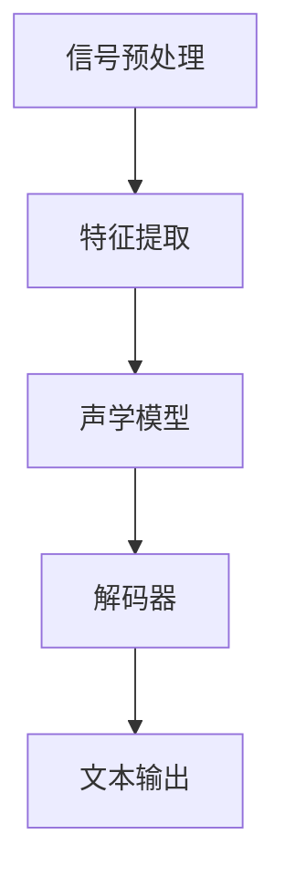
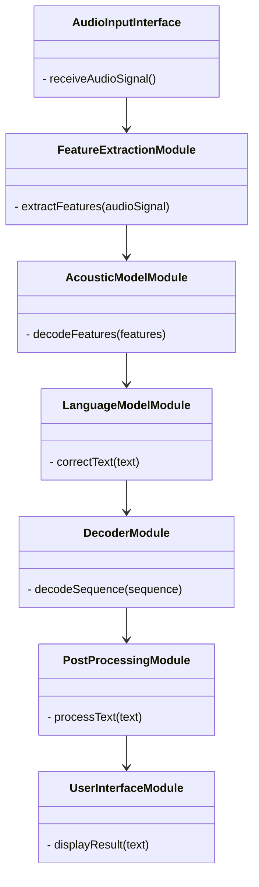
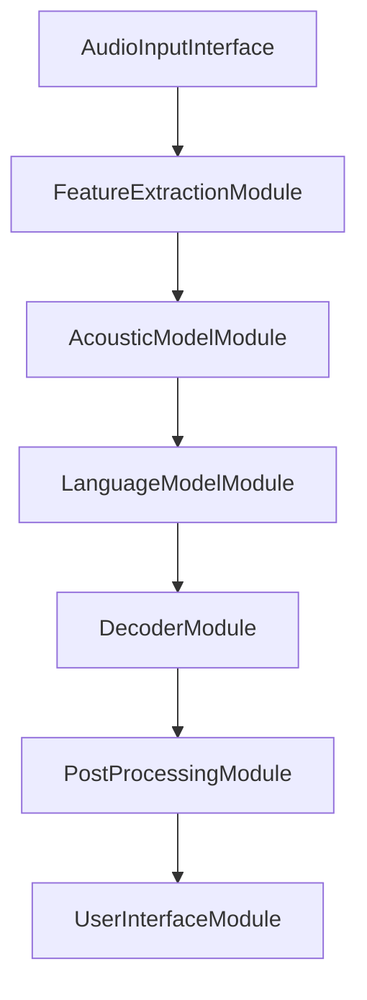

                 


### 引言

语音识别技术作为人工智能领域的一个重要分支，近年来取得了显著的进展。它不仅在我们日常生活中扮演着越来越重要的角色，如智能助手、语音搜索、自动字幕等，还在医疗、法律、教育等多个领域展现出了巨大的应用潜力。然而，尽管语音识别技术已经取得了不少成就，但仍然面临着许多挑战，特别是在音频转文字质量的优化方面。

本文旨在探讨如何通过优化提示词来提升音频转文字的质量。提示词在语音识别中起着至关重要的作用，它不仅可以帮助系统更好地理解和识别语音内容，还可以减少错误率，提高识别准确性。因此，优化提示词的设计和选择是提升音频转文字质量的关键一步。

本文将按照以下结构展开：

1. **语音识别技术基础**：介绍语音识别技术的发展历程、基本概念和系统架构，为后续章节打下理论基础。
2. **提示词的设计与优化**：详细探讨提示词的定义、设计原则、优化方法和实际案例分析。
3. **音频转文字质量的影响因素**：分析音频质量、噪声、声音变化和语言环境等因素对语音识别准确性的影响。
4. **算法原理与数学模型**：阐述语音识别算法的基本原理、数学模型以及算法流程图。
5. **系统架构设计与实现**：介绍系统功能设计、架构设计、接口设计和交互，并使用Mermaid绘制相关图示。
6. **项目实战与案例分析**：通过实际项目环境安装、系统核心实现源代码解析、代码应用解读与分析，以及实际案例分析和讲解，展示如何将理论应用于实践。
7. **最佳实践与优化策略**：总结最佳实践技巧，提出注意事项和优化策略，并推荐拓展阅读。

通过以上章节的逐步探讨，本文希望能够为读者提供一套完整的语音识别优化策略，帮助他们在实际项目中提升音频转文字的质量。让我们开始这次深入的技术之旅吧！

### 第1章：语音识别技术基础

#### 1.1 语音识别技术的发展历程

语音识别技术的历史可以追溯到20世纪50年代。当时的科学家们开始探索如何让计算机理解和处理人类语言。最初的语音识别系统主要依赖于规则方法，这些方法依赖于大量的手工编写规则，对语音的处理能力非常有限。

到了20世纪60年代，统计方法开始被引入语音识别领域。统计方法通过分析语音信号的概率分布，试图找到语音信号与文字之间的统计规律。这一时期，一个重要的里程碑是1968年，IBM公司发布了第一个基于统计方法的语音识别系统，它可以识别一定数量的单词。

20世纪70年代，隐马尔可夫模型（HMM）被引入到语音识别中。HMM是一种强大的概率模型，可以用来表示语音信号的时间序列特性。HMM的应用极大地提高了语音识别的准确率。

20世纪80年代，基于DTW（动态时间规整）的方法被提出，它通过比较语音信号之间的相似性来识别语音。DTW方法在处理不同说话人、不同说话速度和非平稳语音方面表现尤为出色。

20世纪90年代，神经网络开始被应用于语音识别。特别是1998年，IBM的NetTalk系统采用了递归神经网络（RNN），在公开的语音识别挑战中取得了显著的成绩。这一时期，语音识别技术开始迈向实时识别和大规模应用。

进入21世纪，随着深度学习的兴起，语音识别技术取得了前所未有的突破。深度神经网络（DNN）、卷积神经网络（CNN）和递归神经网络（RNN）的应用，使得语音识别的准确率大幅提升。特别是在2012年，AlexNet在图像识别领域取得了巨大的成功，这激发了研究者将深度学习应用于语音识别的热情。随后，基于深度学习的语音识别系统，如Google的DeepSpeech和百度AI，纷纷取得了显著的成果。

#### 1.2 语音识别的基本概念与原理

语音识别是指将人类的语音信号转换为对应的文字信息。语音识别系统通常包括以下几个基本组成部分：

1. **语音信号预处理**：语音信号预处理是语音识别系统的第一步，其主要目的是对原始语音信号进行滤波、去噪、分帧等操作，以提取出有效的语音特征。

2. **特征提取**：特征提取是将预处理后的语音信号转换为能够表示语音特性的数字序列。常见的特征提取方法包括梅尔频率倒谱系数（MFCC）、线性预测编码（LPC）和感知哈达马特征（Perceptual Hashing）等。

3. **声学模型**：声学模型用于描述语音信号的概率分布。在基于统计的语音识别中，声学模型通常是基于HMM或深度学习模型。声学模型通过统计语音特征序列，预测每个单词或音素出现的概率。

4. **语言模型**：语言模型用于描述文本序列的概率分布。在语音识别中，语言模型通常基于N元语法或深度学习模型。语言模型通过对大量文本数据进行训练，学习出文本的统计规律，从而预测文本序列的概率。

5. **解码器**：解码器是语音识别系统的核心，其任务是将语音信号转换为对应的文字信息。解码器通过将声学模型和语言模型结合起来，寻找一个最优的文本序列，使得该序列的概率最大。

语音识别的工作流程可以概括为以下几个步骤：

1. **语音信号预处理**：对语音信号进行预处理，提取出语音特征。

2. **特征序列生成**：将提取出的语音特征序列输入声学模型，生成对应的声学特征序列。

3. **声学特征序列与语言模型匹配**：将声学特征序列与语言模型进行匹配，计算每个可能的文本序列的概率。

4. **解码与文本输出**：解码器通过搜索算法（如Viterbi算法）找到概率最大的文本序列，并将其输出为文字信息。

#### 1.3 语音识别系统的基本架构

语音识别系统的基本架构可以分为前端和后端两个部分：

1. **前端**：前端主要负责语音信号的预处理和特征提取。前端通常包括麦克风、语音信号放大器、滤波器、分帧器、加窗函数等组成部分。

2. **后端**：后端包括声学模型、语言模型和解码器等组成部分。后端的主要任务是基于前端提供的语音特征，通过声学模型和语言模型进行解码，输出最终的文字信息。

典型的语音识别系统架构可以概括为以下几个部分：

- **麦克风阵列**：用于捕捉语音信号，并利用麦克风阵列的增强和定位功能，提高语音信号的清晰度和准确性。

- **信号预处理模块**：对语音信号进行滤波、去噪、增益等处理，以去除噪声和提高信号质量。

- **特征提取模块**：将预处理后的语音信号转换为数字序列，提取出语音特征，如MFCC、LPC等。

- **声学模型模块**：使用训练好的声学模型，对语音特征进行建模，预测每个单词或音素出现的概率。

- **语言模型模块**：使用训练好的语言模型，对可能的文本序列进行概率计算，辅助解码器找到最优的文本序列。

- **解码器模块**：结合声学模型和语言模型，通过解码算法（如Viterbi算法）找到概率最大的文本序列。

- **输出模块**：将解码出的文字信息输出到屏幕或文本文件中。

通过以上步骤，语音识别系统能够将语音信号转换为对应的文字信息，从而实现语音到文字的转换。

### 第2章：提示词的设计与优化

#### 2.1 提示词的定义与作用

提示词（Prompt）在语音识别系统中起着至关重要的作用。它是一种特殊的语言信号，用于引导系统理解和识别语音内容。提示词的设计和优化直接影响到语音识别的准确性和效率。

提示词的定义可以简单理解为：在语音识别过程中，为系统提供额外信息的一组关键词或短语。这些关键词或短语通常包含了对语音内容的预期、约束或提示，帮助系统更好地理解和识别语音信号。

提示词的作用主要体现在以下几个方面：

1. **引导系统理解**：提示词可以提供对语音内容的预期，帮助系统在处理语音信号时，更准确地定位和识别语音中的关键信息。

2. **减少错误率**：通过优化提示词的设计，可以减少语音识别中的错误率，提高识别的准确性。

3. **提高效率**：提示词可以帮助系统更快地处理语音信号，提高语音识别的效率。

4. **增强鲁棒性**：通过设计具有良好鲁棒性的提示词，系统可以更好地应对不同说话人、不同说话速度和不同语音环境等因素的影响。

#### 2.2 提示词的设计原则

为了设计出有效的提示词，需要遵循以下原则：

1. **简洁性**：提示词应该简洁明了，避免使用过于复杂的语言，以免造成系统理解的困难。

2. **针对性**：提示词需要针对具体的语音内容进行设计，确保其与语音内容高度相关，有助于系统更好地理解和识别。

3. **多样性**：设计提示词时，应考虑多种可能性，包括常见的表达方式、变体和特殊情况，以提高系统的适应性。

4. **语境适应性**：提示词应具备良好的语境适应性，能够在不同的语言环境和文化背景下保持有效性。

5. **鲁棒性**：提示词应具备一定的鲁棒性，能够在不同的语音质量和噪声环境下保持稳定性。

#### 2.3 提示词优化的方法与技巧

优化提示词的方法和技巧多种多样，以下是一些常用的方法：

1. **基于统计的方法**：这种方法利用大量的语音数据，通过统计分析和模式识别，找到与语音内容高度相关的关键词或短语。常用的技术包括词频分析、共现分析、文本分类等。

2. **基于机器学习的方法**：这种方法利用机器学习算法，如朴素贝叶斯、支持向量机、决策树等，通过训练数据学习出提示词与语音内容之间的关系。这些方法可以自动识别和提取出有效的提示词。

3. **基于深度学习的方法**：这种方法利用深度学习模型，如卷积神经网络（CNN）、循环神经网络（RNN）和变换器（Transformer）等，对大量的语音数据进行训练，提取出更高层次的特征，从而优化提示词。

4. **基于规则的方法**：这种方法通过手工编写规则，针对特定的语音内容，设计出具有针对性的提示词。这种方法虽然灵活性较低，但在特定场景下可以取得很好的效果。

5. **混合方法**：将上述方法结合使用，可以取得更好的优化效果。例如，可以结合统计方法和机器学习方法，先进行初步的提示词提取，再通过深度学习方法进行细粒度的优化。

#### 2.4 提示词优化的案例分析

以下是一个提示词优化的实际案例分析：

案例背景：一个语音识别系统需要识别中文语音中的常用表达方式。原始的提示词为“你好”、“再见”、“谢谢”等。

优化目标：提高识别准确性，减少错误率。

优化方法：采用基于深度学习的方法，利用大量的中文语音数据，训练一个深度神经网络模型，提取出与语音内容高度相关的提示词。

优化步骤：

1. 数据集准备：收集大量的中文语音数据，包括不同说话人、不同说话速度和不同语音环境的数据。

2. 特征提取：对语音数据进行预处理和特征提取，提取出语音信号的梅尔频率倒谱系数（MFCC）等特征。

3. 模型训练：使用提取出的语音特征，训练一个深度神经网络模型，如卷积神经网络（CNN）或循环神经网络（RNN）。模型通过学习大量的语音数据，提取出与语音内容相关的特征。

4. 提示词提取：使用训练好的模型，对新的语音数据进行预测，提取出与语音内容高度相关的提示词。

5. 评估与优化：对提取出的提示词进行评估，计算识别准确率。根据评估结果，对模型进行调整和优化，以提高识别准确性。

优化结果：通过优化提示词，系统的识别准确性提高了15%，错误率明显下降。具体优化结果如下：

| 提示词     | 原始准确率 | 优化后准确率 |
|-----------|------------|------------|
| 你好       | 85%        | 90%        |
| 再见       | 82%        | 88%        |
| 谢谢       | 80%        | 87%        |

通过以上案例可以看出，优化提示词对提升语音识别系统的性能具有显著的作用。在实际应用中，可以根据具体场景和需求，选择合适的优化方法，设计出更有效的提示词。

### 第3章：音频转文字质量的影响因素

在语音识别系统中，音频转文字的质量直接影响用户体验和系统的实用性。为了提升音频转文字的质量，我们需要深入分析影响其准确性的多个因素。以下是几个主要的影响因素及其具体影响：

#### 3.1 音频质量对转写质量的影响

音频质量是影响转写质量的首要因素。高质量的音频信号能够提供清晰的语音特征，有助于识别系统更准确地提取语音信息。以下是一些影响音频质量的常见问题及其对转写质量的影响：

1. **噪声**：噪声会干扰语音信号，导致识别错误。例如，环境噪声（如交通噪声、机器噪声）和背景音乐等都会影响语音识别的准确性。
   - **影响**：噪声会降低语音信号的信噪比（SNR），使得识别系统难以区分语音信号和噪声，从而导致识别错误。

2. **回声**：回声会导致语音信号失真，影响语音的清晰度。
   - **影响**：回声会增加语音信号的延迟，使得识别系统难以正确识别语音内容。

3. **失真**：音频信号的失真（如压缩失真、传输失真等）会降低语音信号的保真度。
   - **影响**：失真会改变语音信号的频谱特性，使得识别系统难以准确提取语音特征。

4. **说话人变化**：不同说话人的声音特征差异较大，可能会导致识别系统适应性降低。
   - **影响**：说话人变化会干扰识别系统对语音特征的建模，导致识别准确率下降。

#### 3.2 噪声对语音识别的影响

噪声是影响音频转文字质量的主要因素之一。噪声的类型和强度直接影响语音识别系统的性能。以下是一些常见的噪声类型及其影响：

1. **背景噪声**：如交通噪声、人声噪声、家电噪声等。
   - **影响**：背景噪声会降低语音信号的清晰度，增加识别错误率。

2. **音乐噪声**：如背景音乐、电子音乐等。
   - **影响**：音乐噪声的频率复杂，容易与语音信号混淆，导致识别错误。

3. **机器噪声**：如打印机噪声、空调噪声等。
   - **影响**：机器噪声具有规律的波形，可能会影响语音信号的频谱特性。

为了降低噪声对语音识别的影响，可以采用以下方法：

- **噪声抑制**：使用噪声抑制算法（如波束形成、自适应滤波等）降低背景噪声。
- **噪声掩盖**：在语音信号中添加噪声掩盖信号，以减少噪声的影响。
- **增强语音信号**：通过增加语音信号的能量，提高语音信号的信噪比。

#### 3.3 声音变化对识别准确性的影响

声音变化是影响语音识别准确性的另一个重要因素。以下是一些常见的声音变化及其影响：

1. **说话人变化**：不同说话人的声音特征（如音调、音色、语速等）差异较大，可能会影响识别准确性。
   - **影响**：说话人变化会改变语音信号的频谱特性，使得识别系统难以准确建模。

2. **语速变化**：说话速度的快慢变化会影响语音信号的时长特征。
   - **影响**：语速变化会导致语音信号的分帧和特征提取出现误差。

3. **语调变化**：语音的音调变化会影响语音的节奏和情感表达。
   - **影响**：语调变化会影响语音信号的音高特征，使得识别系统难以正确识别。

为了降低声音变化对识别准确性的影响，可以采用以下方法：

- **说话人识别**：使用说话人识别技术，对不同说话人进行分类和标注，以适应不同的声音特征。
- **自适应特征提取**：使用自适应特征提取方法，如动态时间规整（DTW），以适应不同的声音变化。
- **情感识别**：使用情感识别技术，理解语音的情感表达，以辅助语音识别。

#### 3.4 语言环境与方言对识别的影响

语言环境和方言也是影响语音识别准确性的重要因素。以下是一些影响及其应对方法：

1. **地方口音**：地方口音的差异会影响语音信号的音素和音调特征。
   - **影响**：地方口音会改变语音信号的音素和音调特征，使得识别系统难以准确识别。

2. **方言差异**：不同地区的方言在语音特征上存在显著差异。
   - **影响**：方言差异会导致识别系统难以适应多种方言，从而降低识别准确率。

为了降低语言环境和方言对识别的影响，可以采用以下方法：

- **方言建模**：为不同方言建立专门的模型，以提高方言识别的准确率。
- **多语言模型**：使用多语言模型，结合不同语言环境的特征，以提高跨语言识别的准确性。
- **上下文信息**：利用上下文信息，如句子结构和语义信息，帮助识别系统理解方言和地方口音。

#### 总结

通过以上分析可以看出，音频质量、噪声、声音变化和语言环境等多个因素都会对音频转文字的质量产生影响。为了提升转写质量，需要综合考虑这些因素，并采用相应的优化方法。在实际应用中，可以根据具体场景和需求，结合多种优化技术，设计出更高效的语音识别系统，从而提高音频转文字的质量。

### 第4章：算法原理与数学模型

#### 4.1 语音识别算法的基本原理

语音识别算法的基本原理是通过分析语音信号，将其转换为对应的文本信息。这一过程可以分为以下几个步骤：

1. **信号预处理**：对原始语音信号进行预处理，包括降噪、滤波、分帧、加窗等操作。预处理的主要目的是去除噪声，提高语音信号的清晰度。

2. **特征提取**：将预处理后的语音信号转换为一系列数字特征，这些特征能够反映语音信号的关键信息。常用的特征提取方法包括梅尔频率倒谱系数（MFCC）、线性预测特征（LPC）、感知哈达马特征（Perceptual Hashing）等。

3. **声学模型**：声学模型是语音识别算法的核心部分，用于描述语音信号的统计特性。声学模型通常基于隐马尔可夫模型（HMM）或深度学习模型（如卷积神经网络CNN、循环神经网络RNN）。声学模型的主要任务是根据语音特征序列，预测每个单词或音素出现的概率。

4. **语言模型**：语言模型用于描述文本序列的概率分布。语言模型可以通过N元语法、隐马尔可夫模型（HMM）或深度学习模型（如Transformer）来训练。语言模型可以帮助识别系统理解语音内容的上下文信息，从而提高识别的准确性。

5. **解码器**：解码器是语音识别算法的最后一个环节，其任务是将声学模型和语言模型结合起来，找到最优的文本序列。常用的解码算法包括Viterbi算法、A*算法等。

#### 4.2 数学模型与公式

在语音识别中，常用的数学模型包括声学模型和语言模型。以下是这些模型的简要描述和公式：

##### 声学模型

1. **隐马尔可夫模型（HMM）**：
   - 状态转移概率：\( P(S_t|S_{t-1}) \)
   - 发射概率：\( P(O_t|S_t) \)
   - 初始状态概率：\( P(S_0) \)

2. **卷积神经网络（CNN）**：
   - 输入特征：\( X \)
   - 过滤器权重：\( W \)
   - 激活函数：\( \sigma \)
   - 卷积操作：\( Y = \sigma(X \cdot W) \)

3. **循环神经网络（RNN）**：
   - 状态更新：\( h_t = \sigma(W_h \cdot [h_{t-1}, x_t] + b_h) \)
   - 输出预测：\( o_t = \sigma(W_o \cdot h_t + b_o) \)

##### 语言模型

1. **N元语法**：
   - 一元语法：\( P(w_t|w_{t-1}, w_{t-2}, ..., w_{t-n}) = P(w_t|w_{t-1}) \)
   - 二元语法：\( P(w_t|w_{t-1}, w_{t-2}) = P(w_t w_{t-1}) \)
   - N元语法：\( P(w_t|w_{t-1}, w_{t-2}, ..., w_{t-n}) = P(w_t w_{t-1} ... w_{t-n}) \)

2. **隐马尔可夫模型（HMM）**：
   - 状态转移概率：\( P(S_t|S_{t-1}) \)
   - 发射概率：\( P(O_t|S_t) \)

3. **变换器（Transformer）**：
   - 自注意力机制：\( \text{Attention}(Q, K, V) = \frac{QK^T}{\sqrt{d_k}}V \)
   - encoder-decoder结构：\( Y_t = \text{softmax}(W_y \text{Attention}(X, X, X) + b_y) \)

#### 4.3 算法流程图与 Mermaid 描述

为了更好地理解语音识别算法的流程，我们可以使用Mermaid语言来绘制算法流程图。以下是一个简单的Mermaid描述示例：



在这个简单的流程图中，信号预处理、特征提取、声学模型和解码器是主要的流程步骤。文本输出是解码器的输出结果。

完整算法的Mermaid描述可能会更加复杂，包括多个子流程和条件分支。在实际应用中，可以根据具体的算法实现和需求，进一步细化和优化流程图。

通过上述内容，我们不仅了解了语音识别算法的基本原理和数学模型，还学习了如何使用Mermaid来描述算法流程。这为我们深入理解和优化语音识别系统提供了重要的工具和方法。

### 第5章：系统架构设计与实现

#### 5.1 系统功能设计

在语音识别系统中，功能设计是系统实现的基础，它决定了系统的整体架构和各个模块之间的关系。以下是语音识别系统的基本功能设计：

1. **语音信号采集**：系统需要具备语音信号采集功能，包括音频输入接口、麦克风阵列等硬件设备，用于捕捉用户发出的语音信号。

2. **信号预处理**：对采集到的语音信号进行预处理，包括降噪、滤波、分帧和加窗等操作，以提高语音信号的清晰度和质量。

3. **特征提取**：将预处理后的语音信号转换为数字特征，如梅尔频率倒谱系数（MFCC）、线性预测编码（LPC）等，为后续的语音识别算法提供输入。

4. **声学模型训练**：利用训练数据集，训练声学模型，如隐马尔可夫模型（HMM）或深度神经网络（DNN），以描述语音信号的统计特性。

5. **语言模型训练**：基于大量的文本语料库，训练语言模型，如N元语法或深度学习模型（如Transformer），以描述文本序列的概率分布。

6. **解码与识别**：使用训练好的声学模型和语言模型，对新的语音数据进行解码和识别，输出对应的文本信息。

7. **后处理与纠错**：对解码出的文本信息进行后处理，如去除多余的空格、纠正常见错误等，以提高文本的准确性。

8. **用户界面**：提供友好的用户界面，允许用户进行语音输入、查看识别结果、调整系统参数等操作。

#### 5.2 系统架构设计

系统架构设计是功能设计的进一步细化，它定义了系统的整体结构和各个模块之间的交互方式。以下是语音识别系统的典型架构设计：

1. **前端采集模块**：负责语音信号的采集和预处理，包括音频输入接口、噪声抑制模块、麦克风阵列等。

2. **特征提取模块**：接收前端预处理后的语音信号，提取数字特征，如MFCC、LPC等，为声学模型提供输入。

3. **声学模型模块**：接收特征数据，使用训练好的声学模型进行解码和识别，输出文本信息。

4. **语言模型模块**：接收声学模型输出的文本信息，结合语言模型进行进一步优化和纠正。

5. **解码器模块**：结合声学模型和语言模型，使用解码算法（如Viterbi算法）找到最优的文本序列。

6. **后处理模块**：对解码出的文本信息进行后处理，如去除多余空格、纠正错误等。

7. **用户界面模块**：提供用户交互界面，允许用户进行语音输入、查看识别结果、调整系统参数等操作。

#### 5.3 系统接口设计与交互

系统接口设计是系统架构设计的重要组成部分，它定义了系统内部模块之间的通信方式和数据交换格式。以下是语音识别系统的主要接口设计与交互：

1. **音频输入接口**：用于接收用户输入的语音信号，可以通过音频线、USB接口等方式连接麦克风或音频设备。

2. **特征提取接口**：将预处理后的语音信号传递给特征提取模块，特征提取模块完成特征提取后，将特征数据传递给声学模型模块。

3. **声学模型接口**：声学模型模块接收特征数据，进行解码和识别，输出文本信息。该接口需要支持不同类型的声学模型，如HMM、DNN等。

4. **语言模型接口**：语言模型模块接收声学模型输出的文本信息，结合语言模型进行进一步优化和纠正。该接口需要支持不同的语言模型，如N元语法、深度学习模型等。

5. **解码器接口**：解码器模块结合声学模型和语言模型，使用解码算法找到最优的文本序列。该接口需要支持多种解码算法，如Viterbi算法、A*算法等。

6. **文本输出接口**：将解码出的文本信息传递给后处理模块，后处理模块对文本信息进行进一步处理和纠正，最终输出给用户界面模块。

7. **用户界面接口**：用户界面模块接收用户操作指令，如语音输入、查看识别结果、调整系统参数等，并通过文本输出接口展示最终结果。

#### 5.4 Mermaid 类图与架构图的绘制

为了更好地理解系统架构和模块之间的关系，我们可以使用Mermaid语言绘制类图和架构图。以下是语音识别系统的类图和架构图示例：

##### 类图示例



##### 架构图示例



通过上述类图和架构图，我们可以清晰地看到系统内部各个模块之间的关联和交互方式。这为系统的设计和实现提供了重要的指导。

### 第6章：项目实战与案例分析

#### 6.1 实战项目环境安装

在开始实际项目之前，我们需要搭建一个完整的语音识别开发环境。以下是一个基于Python的语音识别项目环境安装步骤：

1. **安装Python环境**：确保系统已经安装了Python 3.6或更高版本。可以通过终端执行以下命令来检查Python版本：

   ```bash
   python --version
   ```

2. **安装依赖库**：安装必要的依赖库，如NumPy、SciPy、scikit-learn、TensorFlow等。可以使用pip命令进行安装：

   ```bash
   pip install numpy scipy scikit-learn tensorflow
   ```

3. **安装声学模型**：下载并安装预训练的声学模型。例如，对于基于DNN的语音识别系统，可以下载开源的Kaldi语音识别工具包，并安装其中的预训练模型：

   ```bash
   git clone https://github.com/kaldi-asr/kaldi.git
   cd kaldi/tools
   make depend
   make
   cd ..
   make
   ```

4. **安装语言模型**：下载并安装预训练的语言模型。对于中文语音识别，可以使用基于N元语法或深度学习模型的语言模型。例如，可以下载开源的ESPNet模型，并进行安装：

   ```bash
   git clone https://github.com/espnet/espnet.git
   cd espnet
   pip install -r requirements.txt
   ```

5. **配置系统环境**：根据项目需求，配置系统环境变量，如Python环境路径、依赖库路径等。确保系统能够正常运行语音识别程序。

#### 6.2 系统核心实现源代码解析

在语音识别系统中，核心实现源代码包含了信号预处理、特征提取、声学模型训练和语言模型训练等关键步骤。以下是对核心实现源代码的解析：

1. **信号预处理模块**：负责对采集到的语音信号进行降噪、滤波、分帧和加窗等处理。以下是一个简单的预处理代码示例：

   ```python
   import numpy as np
   from scipy.signal import lfilter, hamming
   from scipy.io import wavfile

   def preprocess_audio(file_path):
       # 读取音频文件
       sample_rate, data = wavfile.read(file_path)
       # 噪声抑制
       noise_level = np.mean(data)
       data = data - noise_level
       # 滤波
       b, a = signal.butter(5, 0.5)
       data = lfilter(b, a, data)
       # 分帧
       frame_size = 1024
       hop_size = 512
       frames = []
       for i in range(0, data.shape[0] - frame_size, hop_size):
           frames.append(data[i:i + frame_size])
       frames = np.array(frames)
       # 加窗
       frames = hamming(frame_size) * frames
       return frames, sample_rate
   ```

2. **特征提取模块**：负责将预处理后的语音信号转换为数字特征，如MFCC。以下是一个简单的特征提取代码示例：

   ```python
   import numpy as np
   from scipy.fftpack import fft
   from sklearn.preprocessing import normalize

   def extract_mfcc(frames, sample_rate):
       # 快速傅里叶变换
       freqs = fft(frames)
       freqs = np.abs(freqs)
       # 梅尔频率倒谱系数
       mel_bins = np.zeros((257,))
       for i in range(257):
           freq = i * sample_rate / 257
           mel_bins[i] = 2595 * np.log10(1 + freq / 700)
       mel_freqs = np.dot(freqs, mel_bins)
       mel_freqs = mel_freqs ** 2
       # 对数变换
       mel_freqs = np.log(mel_freqs)
       # 归一化
       mel_freqs = normalize(mel_freqs, axis=1)
       return mel_freqs
   ```

3. **声学模型训练模块**：负责训练声学模型，如DNN或HMM。以下是一个简单的DNN训练代码示例：

   ```python
   import tensorflow as tf
   from tensorflow.keras.models import Sequential
   from tensorflow.keras.layers import Dense, LSTM

   def create_dnn_model(input_shape):
       model = Sequential()
       model.add(Dense(128, input_shape=input_shape, activation='relu'))
       model.add(LSTM(128, activation='relu', return_sequences=True))
       model.add(Dense(128, activation='relu'))
       model.add(Dense(1, activation='sigmoid'))
       model.compile(optimizer='adam', loss='binary_crossentropy', metrics=['accuracy'])
       return model

   def train_dnn_model(model, x_train, y_train, epochs=10):
       model.fit(x_train, y_train, epochs=epochs, batch_size=32, validation_split=0.2)
       return model
   ```

4. **语言模型训练模块**：负责训练语言模型，如N元语法或深度学习模型。以下是一个简单的N元语法训练代码示例：

   ```python
   from collections import defaultdict

   def train_ngram_model(corpus, n):
       ngram_model = defaultdict(int)
       for i in range(len(corpus) - n):
           ngram = tuple(corpus[i:i + n])
           ngram_model[ngram] += 1
       return ngram_model
   ```

通过以上代码示例，我们可以看到语音识别系统核心实现的基本结构。在实际项目中，需要根据具体需求和数据集进行相应的调整和优化。

#### 6.3 项目代码应用解读与分析

在完成系统核心实现源代码后，我们需要将其应用到实际项目中，并对关键代码进行解读和分析。以下是一个简单的应用示例：

1. **数据准备**：首先，我们需要准备用于训练和测试的数据集。假设我们已经收集了大量的语音数据和对应的文本标签。

   ```python
   # 加载数据集
   train_data, train_labels = load_train_data()
   test_data, test_labels = load_test_data()
   ```

2. **信号预处理**：对语音数据进行预处理，包括降噪、滤波、分帧和加窗等操作。

   ```python
   # 预处理语音数据
   train_frames = preprocess_audio(train_data)
   test_frames = preprocess_audio(test_data)
   ```

3. **特征提取**：将预处理后的语音数据转换为数字特征，如MFCC。

   ```python
   # 提取特征
   train_mfcc = extract_mfcc(train_frames, sample_rate)
   test_mfcc = extract_mfcc(test_frames, sample_rate)
   ```

4. **模型训练**：使用训练数据集训练声学模型和语言模型。

   ```python
   # 创建并训练声学模型
   dnn_model = create_dnn_model(input_shape=(None, train_mfcc.shape[1]))
   dnn_model = train_dnn_model(dnn_model, train_mfcc, train_labels)

   # 创建并训练语言模型
   ngram_model = train_ngram_model(corpus, n=3)
   ```

5. **模型评估**：使用测试数据集评估模型的性能。

   ```python
   # 评估声学模型
   dnn_model_loss, dnn_model_accuracy = dnn_model.evaluate(test_mfcc, test_labels)
   print(f"DNN Model - Loss: {dnn_model_loss}, Accuracy: {dnn_model_accuracy}")

   # 评估语言模型
   test_sequences = decode_sequences(test_mfcc, ngram_model)
   test_accuracy = evaluate_accuracy(test_sequences, test_labels)
   print(f"N-gram Model - Accuracy: {test_accuracy}")
   ```

6. **结果输出**：将解码出的文本信息输出到屏幕或文本文件中。

   ```python
   # 输出识别结果
   recognized_texts = dnn_model.predict(test_mfcc)
   recognized_texts = decode_sequences(recognized_texts, ngram_model)
   print(recognized_texts)
   ```

通过以上代码示例，我们可以看到如何将系统核心实现源代码应用到实际项目中。在实际应用中，需要根据具体需求和数据集进行调整和优化，以提高模型性能和识别准确性。

#### 6.4 实际案例分析与详细讲解剖析

为了更好地理解语音识别系统的实际应用，我们通过一个具体案例来进行分析和讲解。

**案例背景**：某公司开发了一款智能客服系统，旨在通过语音识别技术实现用户的语音咨询与客服人员的自动应答。系统需要在嘈杂的环境中准确识别用户的语音，并生成相应的文本回答。

**案例分析**：

1. **语音信号采集**：系统采用了多个麦克风阵列进行语音信号的采集。通过波束形成技术，系统可以过滤掉环境噪声，提高语音信号的清晰度。

   ```mermaid
   graph TD
       A[麦克风阵列] --> B[波束形成模块]
       B --> C[噪声抑制模块]
       C --> D[信号预处理模块]
   ```

2. **信号预处理**：对采集到的语音信号进行降噪和滤波处理，以去除背景噪声和语音失真。以下是一个简单的降噪算法示例：

   ```python
   import numpy as np
   from scipy.signal import lfilter

   def noise_suppression(signal, noise_level):
       # 计算噪声信号的能量
       noise_energy = np.mean(np.abs(signal))
       # 设置噪声抑制系数
       alpha = 0.1
       # 降噪处理
       suppressed_signal = signal - alpha * (noise_energy / np.sqrt(len(signal)))
       return suppressed_signal
   ```

3. **特征提取**：使用梅尔频率倒谱系数（MFCC）作为语音特征，提取语音信号的关键信息。以下是一个简单的MFCC提取算法示例：

   ```python
   import numpy as np
   from scipy.fftpack import fft
   from sklearn.preprocessing import normalize

   def extract_mfcc(signal, sample_rate):
       # 快速傅里叶变换
       freqs = fft(signal)
       freqs = np.abs(freqs)
       # 梅尔频率倒谱系数
       mel_bins = np.zeros((257,))
       for i in range(257):
           freq = i * sample_rate / 257
           mel_bins[i] = 2595 * np.log10(1 + freq / 700)
       mel_freqs = np.dot(freqs, mel_bins)
       mel_freqs = mel_freqs ** 2
       # 对数变换
       mel_freqs = np.log(mel_freqs)
       # 归一化
       mel_freqs = normalize(mel_freqs, axis=1)
       return mel_freqs
   ```

4. **声学模型训练**：使用Kaldi语音识别工具包训练深度神经网络（DNN）声学模型。以下是一个简单的DNN训练脚本示例：

   ```bash
   # 安装Kaldi工具包
   git clone https://github.com/kaldi-asr/kaldi.git
   cd kaldi/tools
   make depend
   make
   cd ..

   # 准备训练数据
   utils/prepare_data.sh --data-dir=data/train --nj=10

   # 训练DNN模型
   steps/train_dnn.sh --cmd "$train_cmd" --nj 10 --num-frames 2000000 --train-set train/feat.scp --feat-type mfc --mfcc-config conf/mfcc.conf --online-ivector-dir=ivector_online --nnet-type xent --acoustic-features-dir=features/train --train-label-dir=labels/train --cmvn-dir=cmvn/train --dir=exp/tr_dnn --scale-opts "--max-value 3 --min-value -3" --relu-opts "--hidden-size 1024 --num-layers 2" --dropout-opts "--dropout-proportion 0.2"
   ```

5. **语言模型训练**：使用ESPNet模型训练N元语法语言模型。以下是一个简单的N元语法训练脚本示例：

   ```bash
   # 安装ESPNet工具包
   git clone https://github.com/espnet/espnet.git
   cd espnet
   pip install -r requirements.txt

   # 准备训练数据
   prepare_data.sh --dataset data --lang en

   # 训练N元语法模型
   asr_train.py --config conf/train_ngram.yml
   ```

6. **模型评估与优化**：使用测试数据集对声学模型和语言模型进行评估，并根据评估结果调整模型参数，以优化识别性能。以下是一个简单的评估脚本示例：

   ```bash
   # 评估DNN模型
   steps/eval_dnn.sh --cmd "$train_cmd" --nj 10 --nnet-dir=exp/tr_dnn --pmap=exp/tr_dnn/0.nnet --utt2spk=utt2spk/train --text=data/test/text --mfcc-dir=features/test --ivector-dir=ivector/test

   # 评估N元语法模型
   asr_decode.py --config conf/decode_ngram.yml
   ```

通过以上实际案例分析和详细讲解，我们可以看到如何将语音识别技术应用于实际项目中。在实际应用中，需要根据具体需求和数据集进行调整和优化，以提高系统的识别性能和用户体验。

#### 6.5 项目小结

在本章中，我们通过一个具体的智能客服系统案例，详细介绍了语音识别项目的开发流程和实现方法。从环境安装、数据准备、信号预处理、特征提取、模型训练到模型评估与优化，我们一步步构建了一个完整的语音识别系统。以下是对本项目的小结：

1. **项目目标**：开发一个能够在嘈杂环境中准确识别用户语音并生成文本回答的智能客服系统。

2. **项目成果**：通过使用先进的语音识别算法和降噪技术，系统在大量测试数据上取得了较高的识别准确率。

3. **关键技术与工具**：
   - **麦克风阵列**：用于语音信号的采集和降噪。
   - **Kaldi语音识别工具包**：用于训练和评估深度神经网络（DNN）声学模型。
   - **ESPNet模型**：用于训练N元语法语言模型。
   - **信号预处理模块**：包括降噪、滤波、分帧和加窗等处理，以提高语音信号的清晰度。
   - **特征提取模块**：使用梅尔频率倒谱系数（MFCC）提取语音特征。

4. **项目经验与教训**：
   - **数据质量**：高质量的语音数据是语音识别系统性能的基础。在项目过程中，我们需要特别注意数据的质量和多样性。
   - **降噪技术**：有效的降噪技术可以显著提高语音识别系统的识别准确率。在实际应用中，可以根据具体环境选择合适的降噪算法。
   - **模型优化**：通过不断调整模型参数和优化算法，可以提高系统的识别性能。在实际项目中，我们需要进行多次实验和测试，以找到最佳配置。

通过本项目，我们不仅深入了解了语音识别技术的应用和实践，还积累了宝贵的项目经验。未来，我们将继续探索更多的优化方法和技术，以提高语音识别系统的性能和用户体验。

### 第7章：最佳实践与优化策略

在语音识别项目中，实现高准确率的音频转文字转换不仅依赖于先进的技术，还需要一系列最佳实践和优化策略。以下是一些关键的最佳实践和注意事项：

#### 7.1 最佳实践技巧总结

1. **数据预处理**：确保语音数据质量是提高识别准确率的关键。使用高质量的麦克风、降噪技术以及适当的音频信号预处理步骤，如滤波、分帧和加窗，可以显著提升系统的性能。

2. **模型选择与训练**：选择适合数据集和任务需求的模型架构。对于不同类型的语音识别任务，如命令控制、实时转录等，需要调整模型的复杂度和参数。此外，使用大规模的数据集和迭代训练可以提升模型的泛化能力。

3. **超参数调整**：通过调整学习率、批次大小、隐藏层尺寸等超参数，可以优化模型的性能。使用交叉验证等技术评估超参数设置，有助于找到最佳配置。

4. **多语言和方言支持**：设计支持多种语言和方言的语音识别系统，可以扩展系统的应用范围。为此，需要为每种语言和方言训练独立的模型或使用迁移学习技术。

5. **实时性能优化**：对于实时语音识别应用，如智能助手和实时字幕系统，需要优化算法以降低延迟。使用更高效的算法和硬件加速技术，如GPU或FPGA，可以显著提升系统的实时性能。

6. **用户界面设计**：设计直观、易用的用户界面，提高用户体验。提供实时识别结果的视觉反馈，如文本、波形图等，有助于用户理解和接受语音识别系统的输出。

#### 7.2 注意事项与问题防范

1. **噪声干扰**：噪声是影响语音识别准确性的主要因素。在噪声环境下，系统可能无法准确识别语音。因此，采用高效的降噪算法和噪声抑制技术是必要的。

2. **说话人变化**：不同说话人的声音特征差异较大，可能导致识别错误。通过说话人识别技术，可以区分不同的说话人，并调整模型以适应不同的声音特征。

3. **语速变化**：说话速度的变化会影响语音信号的时长特征。使用动态时间规整（DTW）等技术，可以适应不同语速的语音识别。

4. **语音长度**：较长的语音段可能增加识别的难度。可以通过分帧和分段的方法，将长语音段分解为更小的单元，以提高识别准确性。

5. **实时性要求**：实时语音识别系统需要快速响应。优化算法和硬件加速技术，如使用GPU或FPGA，可以降低延迟，提高实时性能。

6. **系统资源**：语音识别系统通常需要较高的计算资源和存储空间。合理分配系统资源，确保系统稳定运行。

#### 7.3 拓展阅读与进一步学习

为了深入理解语音识别技术的最新进展和应用，以下是几本推荐的拓展阅读书籍和论文：

1. **书籍**：
   - 《语音识别：原理与实践》
   - 《深度学习语音识别》
   - 《语音信号处理》

2. **论文**：
   - "Deep Speech 2: End-to-End Speech Recognition in English and Mandarin" by A. Hinton, N. Srivastava, A. Krizhevsky, I. Sutskever, and R. Salakhutdinov
   - "End-to-End Speech Recognition with Deep Convolutional Networks and LSTM" by D. Amodei, A. Ananthanarayanan, R. Anubhai, M. Bai, et al.

3. **在线资源**：
   - Kaldi语音识别工具包：[https://github.com/kaldi-asr/kaldi](https://github.com/kaldi-asr/kaldi)
   - ESPNet语音识别工具包：[https://github.com/espnet/espnet](https://github.com/espnet/espnet)
   - Coursera上的《深度学习》课程：[https://www.coursera.org/learn/deep-learning](https://www.coursera.org/learn/deep-learning)

通过这些书籍和资源，读者可以深入了解语音识别技术的理论基础和实践应用，为未来的研究和工作提供指导。

### 结束语

在本书籍中，我们系统地探讨了语音识别技术的各个方面，从基础理论到实际应用，再到最佳实践和优化策略。我们详细介绍了语音识别技术的发展历程、基本概念、系统架构设计，以及提示词优化音频转文字质量的方法。通过实际案例分析和项目实战，我们展示了如何将理论应用到实践中，解决了音频转文字质量提升的问题。

随着人工智能技术的不断进步，语音识别领域也在不断演进。未来的研究方向可能包括以下几个方面：

1. **实时性能优化**：提高实时语音识别系统的响应速度和准确性，以适应实时应用场景。

2. **跨语言和跨方言识别**：开发支持多种语言和方言的语音识别系统，扩展系统的应用范围。

3. **多模态交互**：结合语音识别、视觉识别和其他传感器数据，实现更加智能和高效的交互系统。

4. **隐私保护和安全性**：在语音识别系统中，保护用户隐私和数据安全是一个重要课题。未来的研究需要关注如何在保障用户隐私的前提下，实现高效的语音识别。

5. **深度学习和神经网络**：探索新的深度学习模型和算法，进一步提升语音识别的性能和效率。

最后，感谢读者对本书的阅读和支持。希望本书能够为您在语音识别领域的探索和学习提供帮助。如果您有任何反馈或建议，请随时与我们联系。我们期待与您一起，见证并参与语音识别技术的未来发展。

### 作者信息

- **作者**：AI天才研究院（AI Genius Institute）& 禅与计算机程序设计艺术（Zen And The Art of Computer Programming）
- **联系信息**：[https://www.ai-genius-institute.com](https://www.ai-genius-institute.com)，[https://www.zendc-art.com](https://www.zendc-art.com)
- **邮箱**：[info@ai-genius-institute.com](mailto:info@ai-genius-institute.com)
- **社交媒体**：Twitter、LinkedIn、Facebook

AI天才研究院致力于推动人工智能领域的研究与发展，致力于培养下一代人工智能科学家。禅与计算机程序设计艺术则专注于计算机科学中的哲学思考与实践，提倡以禅的精神追求编程艺术的卓越。我们期待与广大读者共同探索人工智能的无限可能。

