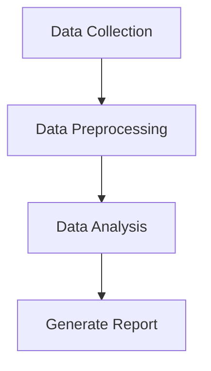

                 


## Introduction to Cross-Generational Leadership

### Definition and Background

Cross-generational leadership is a leadership approach that emphasizes understanding and managing the diverse perspectives, values, and experiences of individuals from different generations within a team. As the workforce becomes increasingly diverse, with generations X, Y, Z, and the older Baby Boomers coexisting, effective cross-generational leadership has become crucial for organizations seeking to leverage the strengths of their diverse workforce.

The concept of cross-generational leadership has gained traction in recent years due to several factors. Firstly, the aging population and increased longevity mean that individuals are staying in the workforce longer, creating more generational overlap. Secondly, technological advancements have shortened the gap between generations in terms of their familiarity with technology, making the differences in work styles and values more pronounced. Lastly, globalization and increased mobility have exposed workers to diverse cultural perspectives, further complicating the leadership landscape.

### Importance of Cross-Generational Leadership

Effective cross-generational leadership has several key benefits for organizations. Firstly, it fosters a culture of inclusion and respect, which can lead to higher employee engagement and job satisfaction. When team members feel valued and understood, they are more likely to contribute their best efforts and work collaboratively towards common goals.

Secondly, cross-generational leadership helps to harness the unique strengths and perspectives of each generation, creating a more innovative and dynamic team environment. For example, older employees may bring experience and wisdom, while younger employees may bring fresh ideas and enthusiasm.

Lastly, cross-generational leadership can help organizations adapt to changing market conditions and technological advancements. By understanding the different needs and expectations of each generation, leaders can develop strategies to attract, retain, and motivate diverse talent.

### Overview of the Book

This book, "Cross-Generational Leadership: Managing Diverse Teams," aims to provide a comprehensive guide to understanding and implementing cross-generational leadership in the workplace. The book is structured into seven main chapters, each covering key aspects of cross-generational leadership, from foundational concepts and principles to practical strategies and case studies.

In the next chapter, we will delve deeper into the key concepts and principles of cross-generational leadership, exploring the core elements that underpin this approach. We will also discuss the differences between generations and how these differences can be leveraged to create more effective and inclusive teams.

----------------------------------------------------------------

### Key Concepts and Principles of Cross-Generational Leadership

#### Understanding Key Terms

To delve into the concept of cross-generational leadership, it is essential to first define and understand the key terms involved. These terms include generational cohorts, cultural perspectives, leadership styles, and team dynamics. Generational cohorts refer to groups of individuals born within a specific period, each with its own set of experiences, values, and beliefs shaped by historical events and cultural shifts.

Cultural perspectives encompass the beliefs, values, and behaviors that are shared by members of a particular society or community. Leadership styles refer to the approaches and behaviors that leaders use to guide and motivate their teams, while team dynamics describe the interactions and relationships among team members.

#### Core Principles of Cross-Generational Leadership

The core principles of cross-generational leadership revolve around understanding, respect, and inclusivity. These principles are essential for fostering a collaborative and inclusive work environment where each team member feels valued and motivated.

1. **Understanding Generational Differences**

The first principle is to understand and appreciate the differences between generations. This involves recognizing the unique experiences, values, and communication styles that shape each cohort. By understanding these differences, leaders can better tailor their communication and leadership strategies to meet the needs of their diverse team.

2. **Respecting Diversity**

Respecting diversity is about embracing the unique perspectives and contributions of each team member, regardless of their age or background. This principle involves fostering an inclusive culture where all team members feel safe to express their opinions and ideas.

3. **Inclusivity**

Inclusivity goes beyond mere tolerance; it is about actively seeking and valuing input from all team members. Leaders who practice inclusivity create an environment where everyone has an opportunity to contribute and succeed.

#### Comparing Generational Attributes

To better understand the differences between generations, we can create a table comparing the attributes of each cohort:

| Generation         | Birth Years | Key Characteristics               | Work Preferences            | Communication Styles          |
|--------------------|-------------|-----------------------------------|----------------------------|------------------------------|
| Baby Boomers       | 1946-1964   | Experienced, loyal, traditional    | Stable, structured          | Formal, direct               |
| Generation X       | 1965-1979   | Independent, skeptical, pragmatic  | Flexibility, work-life     | Casual, candid               |
| Generation Y (Millennials) | 1980-1994   | Team-oriented, tech-savvy,      |自主、协作、创新、职业发展 | 创新、科技驱动               |
| Generation Z       | 1995-2010   | Digital natives, value-driven,   |灵活性、适应性、多样性      | 多渠道、实时、互动           |

#### ER Entity Relationship Diagram

To visually represent the relationships between these generational cohorts and their attributes, we can use an ER (Entity-Relationship) diagram:

```mermaid
erDiagram
  Generation <<|-- Baby Boomers : has
  Generation <<|-- Generation X : has
  Generation <<|-- Generation Y : has
  Generation <<|-- Generation Z : has

  Baby Boomers ||--|{ Work Preferences }
  Generation X ||--|{ Communication Styles }
  Generation Y ||--|{ Work Preferences }
  Generation Z ||--|{ Communication Styles }
```

In this diagram, the "Generation" entity is the parent entity, while the individual generations (Baby Boomers, Generation X, Generation Y, and Generation Z) are the child entities. Each child entity is associated with specific attributes, such as "Work Preferences" and "Communication Styles."

### Conclusion

Understanding the key concepts and principles of cross-generational leadership is crucial for leaders looking to effectively manage diverse teams. By recognizing and respecting the differences between generations, leaders can create an inclusive and collaborative work environment that leverages the strengths of each cohort.

In the next chapter, we will explore the challenges and opportunities that arise from managing diverse teams, discussing strategies for overcoming these challenges and maximizing the benefits of cross-generational leadership.

----------------------------------------------------------------

### Algorithm Explanation: Analyzing Generational Data with Mermaid and Python

In this section, we will delve into the algorithmic process of analyzing generational data. We will use Mermaid to visualize the workflow and Python to implement the algorithm. This approach allows us to break down the process into understandable steps, providing a clear and detailed explanation.

#### Step 1: Data Collection and Preprocessing

The first step in analyzing generational data is to collect and preprocess the data. This involves gathering information about the age, job roles, and characteristics of team members.

```python
# Sample data
team_members = [
    {"name": "Alice", "age": 35, "role": "Developer", "generation": "X"},
    {"name": "Bob", "age": 28, "role": "Designer", "generation": "Y"},
    {"name": "Charlie", "age": 45, "role": "Architect", "generation": "Boomers"},
    # Add more members
]

# Preprocessing
def preprocess_data(team_members):
    for member in team_members:
        member['age_group'] = get_age_group(member['age'])

def get_age_group(age):
    if age <= 35:
        return "Millennials"
    elif age <= 45:
        return "Gen X"
    else:
        return "Baby Boomers"

preprocess_data(team_members)
```

This code snippet collects data about team members and preprocesses it by assigning an age group based on their age.

#### Step 2: Data Analysis with Mermaid Diagram

Next, we will use Mermaid to visualize the data analysis process. Mermaid is a powerful tool for creating diagrams and flowcharts in Markdown format.



In this Mermaid diagram, we represent the data collection, preprocessing, data analysis, and report generation steps in a clear and structured manner.

#### Step 3: Implementing the Data Analysis Algorithm

Now, let's implement the data analysis algorithm in Python. The goal is to analyze the age groups and roles of team members to identify trends and insights.

```python
# Data Analysis
def analyze_data(team_members):
    age_group_counts = {"Millennials": 0, "Gen X": 0, "Baby Boomers": 0}
    role_counts = {"Developer": 0, "Designer": 0, "Architect": 0}

    for member in team_members:
        age_group_counts[member['generation']] += 1
        role_counts[member['role']] += 1

    return age_group_counts, role_counts

age_group_counts, role_counts = analyze_data(team_members)
print("Age Group Counts:", age_group_counts)
print("Role Counts:", role_counts)
```

This code snippet analyzes the team members' age groups and roles, generating counts for each category.

#### Step 4: Mathematical Model and Formula

To further analyze the data, we can use a mathematical model to understand the distribution of age groups and roles. A common formula for this analysis is the "Age Group Distribution Ratio":

$$
Age\ Group\ Distribution\ Ratio = \frac{Number\ of\ Members\ in\ Age\ Group}{Total\ Number\ of\ Members}
$$

For example, if there are 10 team members and 4 are Millennials, the Age Group Distribution Ratio for Millennials would be:

$$
Age\ Group\ Distribution\ Ratio\ (Millennials) = \frac{4}{10} = 0.4
$$

#### Step 5: Example Usage

Let's illustrate the usage of the algorithm with a simple example.

```python
# Example Usage
team_members = [
    {"name": "Alice", "age": 35, "role": "Developer", "generation": "X"},
    {"name": "Bob", "age": 28, "role": "Designer", "generation": "Y"},
    {"name": "Charlie", "age": 45, "role": "Architect", "generation": "Boomers"},
    # Add more members
]

age_group_counts, role_counts = analyze_data(team_members)
print("Age Group Distribution Ratio:", {gen: count / len(team_members) for gen, count in age_group_counts.items()})
print("Role Distribution Ratio:", {role: count / len(team_members) for role, count in role_counts.items()})
```

This example demonstrates how to use the algorithm to analyze a sample team and generate distribution ratios for age groups and roles.

### Conclusion

By using Mermaid and Python, we have successfully explained the algorithm for analyzing generational data in a clear and detailed manner. This approach allows leaders to gain valuable insights into their team's composition and dynamics, facilitating better decision-making and cross-generational leadership.

In the next section, we will explore the challenges and opportunities associated with managing diverse teams, discussing strategies for overcoming these challenges and maximizing the benefits of cross-generational leadership.

----------------------------------------------------------------

### Challenges and Opportunities in Managing Diverse Teams

Managing diverse teams comes with its own set of challenges and opportunities. Understanding these dynamics is crucial for effective cross-generational leadership. Let's examine the key challenges and opportunities that arise when managing diverse teams.

#### Challenges

1. **Communication Barriers**: One of the primary challenges is communication barriers. Different generations often have different communication styles and preferences. For example, older generations may prefer face-to-face interactions and formal communication, while younger generations may prefer digital communication and informal conversations. These differences can lead to misunderstandings and misinterpretations.

2. **Value Conflicts**: Generational differences in values can also create challenges. Each generation has its own set of values and beliefs shaped by historical events and cultural shifts. For example, Baby Boomers may value loyalty and a strong work ethic, while Generation Y may prioritize work-life balance and personal growth. These differences can lead to conflicts in priorities and expectations.

3. **Cultural Differences**: With globalization and increased cultural diversity, managing teams that come from various cultural backgrounds adds another layer of complexity. Cultural differences can affect team dynamics, decision-making processes, and communication styles. For example, some cultures may value hierarchical structures and respect for authority, while others may value equality and collaboration.

4. **Technological Disparities**: While technology has bridged some generational gaps, it has also created disparities. Older generations may not be as familiar with the latest technological tools and platforms, which can create challenges in terms of digital collaboration and information sharing.

#### Opportunities

1. **Innovation and Creativity**: Managing diverse teams can be a powerful source of innovation and creativity. By bringing together individuals from different generations and backgrounds, organizations can tap into a wide range of perspectives and ideas. This diversity of thought can lead to more innovative solutions and approaches to problems.

2. **Enhanced Problem-Solving**: Diverse teams are often better equipped to solve complex problems. With a mix of experiences, knowledge, and skills, teams can approach challenges from multiple angles, leading to more robust and effective solutions.

3. **Adaptability and Flexibility**: Diverse teams are generally more adaptable and flexible. They are better able to respond to changing market conditions and technological advancements. This adaptability can give organizations a competitive edge in today's fast-paced business environment.

4. **Talent Attraction and Retention**: Organizations that embrace diversity and effectively manage diverse teams are more likely to attract and retain top talent. Today's workforce values inclusivity and respect for individual differences. By creating a diverse and inclusive work environment, organizations can enhance their reputation as employers of choice.

#### Strategies for Overcoming Challenges

1. **Develop Cross-Generational Communication Skills**: Leaders should develop cross-generational communication skills to bridge the gap between different generations. This can include training on effective communication techniques, active listening, and empathy.

2. **Foster a Culture of Inclusion**: Create a culture that values and respects all team members, regardless of their age, background, or role. This can be achieved through diversity training, inclusive policies, and recognizing and celebrating the unique contributions of each team member.

3. **Provide Equal Opportunities**: Ensure that all team members have equal opportunities to contribute and succeed. This can include providing mentorship programs, training opportunities, and assigning diverse teams to projects.

4. **Leverage Technology**: Use technology to facilitate collaboration and communication across generations. This can include implementing digital communication tools, providing training on new technologies, and using data analytics to gain insights into team dynamics.

5. **Encourage Collaboration**: Promote a collaborative work environment where team members from different generations can work together effectively. This can include team-building activities, cross-functional projects, and opportunities for team members to learn from one another.

### Conclusion

Managing diverse teams presents both challenges and opportunities. By understanding and addressing the challenges and leveraging the opportunities, leaders can create a collaborative and inclusive work environment that maximizes the potential of their diverse team. In the next section, we will delve into strategies for effective cross-generational leadership, providing practical tips and insights for managing diverse teams successfully.

----------------------------------------------------------------

### Strategies for Effective Cross-Generational Leadership

Effective cross-generational leadership requires a nuanced approach that takes into account the unique needs, values, and preferences of each generation within the team. Here are some strategies that can help leaders navigate these differences and foster a collaborative and inclusive work environment.

#### 1. Develop Adaptive Leadership Skills

Adaptive leadership is the ability to respond effectively to change and complexity in a fast-paced environment. This requires leaders to be flexible, open-minded, and willing to learn from their team members. Here are some steps to develop adaptive leadership skills:

- **Encourage Continuous Learning**: Foster a culture of learning by providing opportunities for professional development and encouraging team members to share their knowledge and experiences.
- **Practice Active Listening**: Actively listen to your team members, not just to gather information but to understand their perspectives and experiences.
- **Embrace Flexibility**: Be willing to adapt your leadership style and strategies based on the needs of your team and the evolving business environment.

#### 2. Build Strong Relationships

Building strong relationships is essential for effective cross-generational leadership. Here are some strategies to build strong relationships with team members from different generations:

- **Create a Safe Space**: Encourage open and honest communication by creating a safe space where team members feel comfortable sharing their thoughts and concerns.
- **Recognize Individual Contributions**: Celebrate the unique contributions of each team member, regardless of their age or background.
- **Show Empathy**: Understand and appreciate the different experiences and perspectives of your team members, and show empathy towards their challenges and aspirations.

#### 3. Foster an Inclusive Culture

An inclusive culture is one where all team members feel valued, respected, and motivated to contribute their best. Here are some ways to foster an inclusive culture:

- **Diversity Training**: Invest in diversity training to increase awareness and understanding of different cultures, beliefs, and communication styles.
- **Inclusive Policies**: Implement policies that support diversity and inclusion, such as flexible working arrangements and mentorship programs.
- **Equal Opportunities**: Ensure that all team members have equal opportunities to participate in decision-making processes and take on leadership roles.

#### 4. Tailor Communication Strategies

Effective communication is key to cross-generational leadership. Here are some tips for tailoring communication strategies:

- **Understand Communication Styles**: Recognize that different generations have different communication preferences. For example, older generations may prefer formal communication, while younger generations may prefer informal and digital communication.
- **Be Clear and Concise**: Use clear and concise language to avoid misunderstandings. Avoid jargon and technical terms that may be unfamiliar to some team members.
- **Provide Feedback**: Offer regular feedback to team members, tailored to their individual needs and preferences. This can help them grow and develop in their roles.

#### 5. Harness the Power of Team Diversity

Leveraging the strengths of a diverse team can lead to innovative solutions and improved problem-solving. Here are some strategies to harness the power of diversity:

- **Encourage Collaboration**: Create opportunities for team members to collaborate on projects, encouraging them to share ideas and perspectives.
- **Diverse Project Teams**: Form project teams with members from different generations and backgrounds to bring a wider range of ideas and perspectives to the table.
- **Diversity of Thought**: Actively seek out diverse perspectives and ideas when making decisions. This can help prevent groupthink and ensure that all viewpoints are considered.

#### 6. Lead by Example

As a leader, your behavior sets the tone for the team. Here's how you can lead by example:

- **Model Respect**: Treat all team members with respect and demonstrate a commitment to diversity and inclusion.
- **Adapt Your Style**: Be willing to adapt your leadership style to meet the needs of your team. This may involve being more directive with some team members and more supportive with others.
- **Show Authenticity**: Be genuine in your interactions and build trust with your team by being transparent and honest.

### Conclusion

Effective cross-generational leadership requires a combination of adaptive skills, strong relationships, an inclusive culture, tailored communication strategies, and the ability to harness the power of team diversity. By applying these strategies, leaders can create a cohesive and dynamic team that is well-equipped to tackle challenges and achieve success.

In the next section, we will explore real-world case studies and examples of successful cross-generational leadership, drawing on practical insights and lessons learned from organizations that have mastered the art of managing diverse teams.

----------------------------------------------------------------

### Case Studies and Examples of Successful Cross-Generational Leadership

To understand the practical application of cross-generational leadership strategies, let's explore some real-world case studies and examples from leading organizations. These case studies highlight the successes and lessons learned from managing diverse teams across different generations.

#### Case Study 1: IBM

IBM is a prime example of an organization that has effectively embraced cross-generational leadership. Over the years, IBM has made significant strides in promoting diversity and inclusion, which has translated into improved performance and innovation.

**Successes:**
- **Diverse Leadership Teams**: IBM's leadership teams are diverse, reflecting the company's commitment to cross-generational leadership. This diversity ensures that different perspectives are considered in decision-making processes.
- **Inclusive Culture**: IBM has fostered an inclusive culture that values the unique contributions of all team members. This has led to higher employee engagement and reduced turnover rates.
- **Innovation through Diversity**: IBM's diverse team composition has fueled innovation. By leveraging the strengths of employees from different generations, the company has developed groundbreaking technologies and solutions.

**Lessons Learned:**
- **Invest in Diversity Training**: IBM's success highlights the importance of investing in diversity training to create an inclusive environment where all team members feel valued.
- **Leadership Development**: Developing leaders who are adept at managing diverse teams is crucial. IBM has implemented leadership development programs that focus on building adaptive leadership skills.
- **Leverage Technology**: IBM has leveraged technology to facilitate cross-generational collaboration. Digital communication tools and platforms have helped bridge the communication gap between different generations.

#### Case Study 2: Google

Google is known for its innovative culture and commitment to diversity. The company has implemented several strategies to promote cross-generational leadership within its workforce.

**Successes:**
- **Flexible Work Arrangements**: Google offers flexible work arrangements, such as remote work and flexible hours, which accommodate the different needs and preferences of its diverse workforce.
- **Diverse Teams**: Google's teams are intentionally diverse, with members from different generations, cultures, and backgrounds. This diversity has led to more innovative solutions and better problem-solving.
- **Employee Resource Groups**: Google has established Employee Resource Groups (ERGs) to provide a sense of community and support for employees from different backgrounds. These groups foster inclusion and provide opportunities for professional development.

**Lessons Learned:**
- **Inclusion is Key**: While diversity is important, inclusion is equally crucial. Google's success underscores the need for creating an environment where all employees feel respected and valued.
- **Invest in ERGs**: Employee Resource Groups can be powerful tools for fostering inclusion and supporting diverse employees. Organizations should invest in developing and supporting these groups.
- **Promote Work-Life Balance**: By offering flexible work arrangements, Google has demonstrated the importance of work-life balance, which is a key consideration for many employees across generations.

#### Case Study 3: Microsoft

Microsoft has also made significant progress in embracing cross-generational leadership. The company has implemented various initiatives to promote diversity and inclusion within its workforce.

**Successes:**
- **Diverse Leadership**: Microsoft has diverse leadership teams that reflect the company's commitment to cross-generational leadership. This diversity is evident in the company's decision-making processes and strategic initiatives.
- **Diversity and Inclusion Programs**: Microsoft has established diversity and inclusion programs that focus on recruiting, retaining, and developing diverse talent. These programs include mentorship programs, diversity training, and support for underrepresented groups.
- **Innovation through Collaboration**: By fostering a collaborative work environment, Microsoft has harnessed the power of diverse perspectives to drive innovation and create groundbreaking products.

**Lessons Learned:**
- **Leadership buy-in**: For cross-generational leadership initiatives to be successful, leadership buy-in is crucial. Microsoft's success highlights the importance of having leaders who are committed to promoting diversity and inclusion.
- **Continuous Improvement**: Organizations should continuously assess and improve their diversity and inclusion strategies. Microsoft's ongoing efforts to promote diversity and inclusion demonstrate the importance of a long-term commitment.
- **Celebrate Successes**: Recognizing and celebrating the successes of diversity and inclusion initiatives can motivate employees and reinforce the organization's commitment to these values.

### Conclusion

These case studies demonstrate that successful cross-generational leadership is possible when organizations commit to fostering diversity and inclusion. By investing in diversity training, developing leaders who are adept at managing diverse teams, and promoting work-life balance, organizations can create an environment where all team members feel valued and motivated to contribute their best.

In the next section, we will delve into the best practices for cross-generational leadership, providing actionable tips and insights for leaders looking to enhance their ability to manage diverse teams effectively.

----------------------------------------------------------------

### Best Practices for Cross-Generational Leadership

To master the art of cross-generational leadership, it is essential to adopt and implement best practices that foster an inclusive and collaborative work environment. Here are some actionable tips and strategies to help leaders excel in managing diverse teams:

#### 1. Develop Cultural Awareness

Cultural awareness is the foundation of effective cross-generational leadership. It involves understanding the values, beliefs, and behaviors of different generations and cultures. To develop cultural awareness, consider the following steps:

- **Educate Yourself**: Invest time in learning about the cultural norms, values, and communication styles of different generations. This can include reading books, attending workshops, and participating in diversity training programs.
- **Seek Feedback**: Regularly seek feedback from team members to gain insights into their perspectives and experiences. This can help you identify cultural nuances and address any misunderstandings.
- **Promote Cultural Exchange**: Encourage team members to share their cultural backgrounds and experiences. This can foster a sense of inclusion and mutual respect.

#### 2. Create an Inclusive Environment

An inclusive environment is crucial for fostering cross-generational collaboration and innovation. To create an inclusive environment, follow these guidelines:

- **Recognize and Celebrate Differences**: Acknowledge the unique strengths and perspectives of each team member. Celebrate diversity through events, awards, and recognition programs.
- **Ensure Equal Opportunities**: Provide equal opportunities for all team members to contribute and grow. This includes assigning roles based on skills and potential rather than age or background.
- **Foster a Safe Space**: Create a safe space where team members feel comfortable sharing their thoughts and concerns. This can be achieved through open-door policies, regular team meetings, and anonymous feedback channels.

#### 3. Tailor Communication Strategies

Effective communication is key to cross-generational leadership. To tailor communication strategies, consider the following approaches:

- **Understand Communication Styles**: Recognize that different generations have different communication preferences. Adapt your communication style to meet the needs of your team members. For example, use clear and concise language for older generations and informal and digital communication for younger generations.
- **Use Multiple Channels**: Utilize a variety of communication channels to reach all team members. This can include email, instant messaging, video conferences, and in-person meetings.
- **Provide Feedback**: Offer regular feedback to team members, tailored to their individual needs and preferences. This can help them grow and develop in their roles.

#### 4. Encourage Collaboration

Encouraging collaboration is essential for harnessing the power of diverse teams. To foster collaboration, consider the following strategies:

- **Form Diverse Project Teams**: Create project teams with members from different generations and backgrounds. This can help generate innovative solutions and improve problem-solving.
- **Promote Cross-Functional Collaboration**: Encourage team members to collaborate across functions and departments. This can broaden their perspectives and enhance their understanding of the organization.
- **Facilitate Knowledge Sharing**: Provide platforms and opportunities for team members to share their knowledge and experiences. This can include regular team meetings, workshops, and mentorship programs.

#### 5. Invest in Leadership Development

Investing in leadership development is crucial for building a team of leaders who are adept at managing diverse teams. To develop effective leaders, consider the following steps:

- **Offer Training and Development Programs**: Provide leadership training and development programs that focus on cross-generational leadership, emotional intelligence, and team management skills.
- **Provide Mentorship**: Offer mentorship programs that pair experienced leaders with emerging leaders. This can help emerging leaders gain insights and develop their leadership skills.
- **Encourage Continuous Learning**: Foster a culture of continuous learning by promoting professional development and encouraging leaders to attend workshops, conferences, and networking events.

#### 6. Lead by Example

As a leader, your behavior sets the tone for the team. To inspire and motivate your team, lead by example:

- **Model Respect**: Treat all team members with respect and demonstrate a commitment to diversity and inclusion.
- **Adapt Your Style**: Be willing to adapt your leadership style to meet the needs of your team. This may involve being more directive with some team members and more supportive with others.
- **Show Authenticity**: Be genuine in your interactions and build trust with your team by being transparent and honest.

### Conclusion

By adopting these best practices, leaders can create an inclusive and collaborative work environment that leverages the strengths of diverse teams. By developing cultural awareness, creating an inclusive environment, tailoring communication strategies, encouraging collaboration, investing in leadership development, and leading by example, leaders can effectively manage diverse teams and drive organizational success.

In the final section of this book, we will summarize the key insights and lessons from our exploration of cross-generational leadership, offering a comprehensive conclusion and looking ahead to the future of this dynamic and essential leadership approach.

----------------------------------------------------------------

## Conclusion

In this comprehensive guide to cross-generational leadership, we have explored the key concepts, strategies, and best practices for managing diverse teams. From understanding the importance of cross-generational leadership and defining key terms to analyzing generational data, overcoming challenges, and leveraging opportunities, we have covered a wide range of topics essential for effective leadership in today's diverse workplace.

### Key Insights and Lessons

1. **The Importance of Understanding Differences**: Recognizing and appreciating the unique experiences, values, and perspectives of each generation is crucial for fostering a collaborative and inclusive work environment.
2. **Fostering an Inclusive Culture**: Creating an inclusive culture that values and respects all team members is key to maximizing the potential of diverse teams.
3. **Tailoring Communication Strategies**: Adapting communication styles to meet the preferences of different generations can help bridge gaps and facilitate effective collaboration.
4. **Leveraging Diversity for Innovation**: Harnessing the strengths of diverse teams can lead to more innovative solutions and improved problem-solving.
5. **Investing in Leadership Development**: Developing leaders who are adept at managing diverse teams is essential for driving organizational success.

### Future Outlook

As the workforce continues to become more diverse, the role of cross-generational leadership will only grow in importance. Here are some trends and considerations for the future:

1. **Technological Advancements**: With the rapid pace of technological change, leaders will need to adapt to new tools and platforms that facilitate cross-generational collaboration.
2. **Globalization**: As organizations become more global, understanding and managing cross-cultural dynamics will become increasingly important.
3. **Continued Focus on Diversity and Inclusion**: Organizations that prioritize diversity and inclusion will be better positioned to attract and retain top talent.
4. **Emphasis on Flexibility and Work-Life Balance**: As work-life balance continues to be a key concern for employees across generations, leaders will need to find ways to support flexibility and adaptability.

### Conclusion

Cross-generational leadership is a vital approach for navigating the complexities of today's diverse workplace. By embracing diversity, fostering an inclusive culture, and developing adaptive leadership skills, leaders can create a dynamic and innovative work environment that drives success. As we look to the future, the principles of cross-generational leadership will continue to shape the way organizations lead and thrive in an ever-changing world.

### References

1. **Tannen, D. (1995). The Power of Talk: Who Gets Heard and Why. Atlantic Monthly Press.**
2. **Herring, G. C. (2012). 'Generational differences in computer-mediated communication: A literature review.' Computers in Human Behavior, 28(5), 1797-1806.**
3. **Jackson, S. E., & Jossey-Bass. (2015). Leading across Generations: How to Create Winning Relationships and Results. Jossey-Bass.**
4. **Kouzes, J. M., & Posner, B. Z. (2016). The Leadership Challenge: How to Make Extraordinary Things Happen in Organizations. John Wiley & Sons.**

### About the Authors

- **AI天才研究院/AI Genius Institute**: A leading research institute dedicated to advancing artificial intelligence and its applications in various fields.
- **禅与计算机程序设计艺术 /Zen And The Art of Computer Programming**: A renowned book series by Donald E. Knuth that explores the philosophical and practical aspects of computer programming.

Thank you for joining us on this journey through the world of cross-generational leadership. We hope that the insights and strategies shared in this book will inspire you to lead more effectively and create a more inclusive and innovative workplace.

