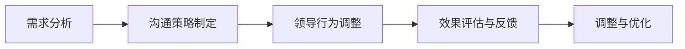
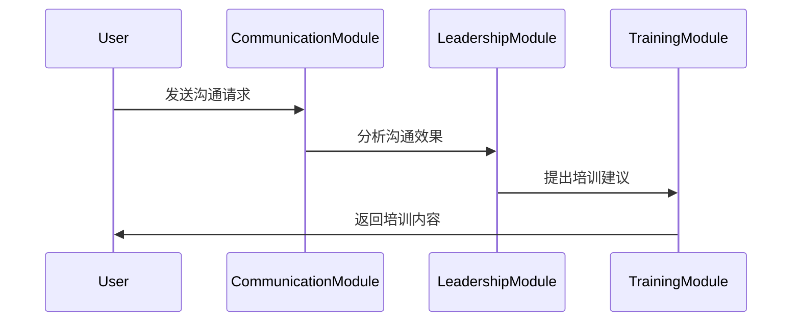
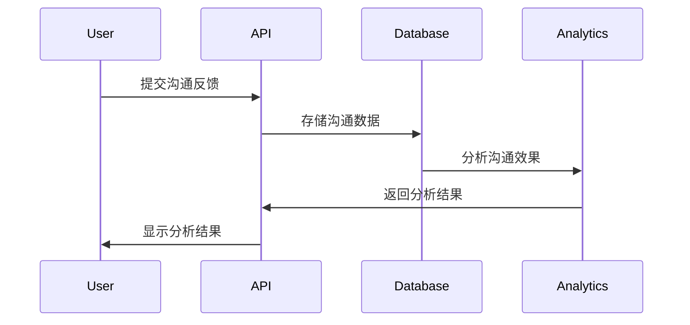

                 


### 文章标题：跨代际领导：连接Z世代与银发一族

关键词：跨代际领导、Z世代、银发一族、沟通、团队合作、领导力

摘要：本文旨在探讨跨代际领导的重要性，以及如何通过有效的领导策略连接Z世代和银发一族。文章将首先介绍这两个代际群体的特点，接着阐述跨代际领导的定义和关键要素，然后通过具体案例和策略分享，提供实用的指导和建议。

## 第一部分：背景与核心概念

### 1.1 跨代际领导的定义与意义

跨代际领导，顾名思义，是指在不同年龄群体之间进行的领导活动。随着全球化和信息化的加速，不同代际之间的交流与合作日益频繁。Z世代（出生于1997年后）和银发一族（通常指65岁以上的群体）作为两个主要的代际群体，在价值观、行为习惯和工作方式上存在显著差异。

跨代际领导的重要性在于，它不仅有助于促进不同年龄群体之间的沟通和理解，还能够提升团队的整体绩效和创造力。有效的跨代际领导能够：

1. **打破沟通障碍**：帮助不同代际的员工更好地理解彼此的沟通方式，减少误解和冲突。
2. **激发创新**：通过融合不同代际的思维和经验，激发出新的想法和解决方案。
3. **增强团队凝聚力**：让团队成员感受到彼此的重要性和价值，提高团队的凝聚力和合作精神。

### 1.2 Z世代与银发一族的特点分析

Z世代出生于数字时代，他们习惯于即时通讯、在线协作和社交媒体。这一代人通常具有较强的自我意识、创新精神和独立思考能力。他们的职业追求不仅仅是经济利益，还包括个人成长和意义实现。

银发一族则是在传统社会环境中成长起来的，他们通常更加注重稳定和安全感。这一代人往往拥有丰富的经验和专业知识，同时也面临着适应数字化环境的挑战。

### 1.3 跨代际沟通的挑战

跨代际沟通的挑战主要体现在以下几个方面：

1. **语言和表达方式的差异**：不同代际在语言使用和表达方式上存在差异，这可能导致沟通效果不佳。
2. **价值观的差异**：不同代际的价值观和世界观可能存在冲突，影响彼此的理解和认同。
3. **习惯和期望的不同**：不同代际在工作和生活方式上的习惯和期望存在差异，这可能导致合作中的摩擦和不适应。

## 第二部分：核心概念与联系

### 2.1 Z世代的工作方式与价值观

Z世代的工作方式通常表现为：

- **数字化和自动化**：他们倾向于使用最新的技术和工具来提高工作效率。
- **灵活性和自主性**：他们渴望有更多的自由和灵活性，以实现个人目标和职业发展。
- **协作和共享**：他们习惯于在团队中合作，并乐于分享知识和经验。

在价值观方面，Z世代注重以下几点：

- **自我实现**：追求个人成长和自我价值的实现。
- **社会责任**：关注社会问题，并愿意为社会做出贡献。
- **多样性**：尊重和包容不同的文化和背景。

### 2.2 银发一族的期望与需求

银发一族的期望和需求通常包括：

- **经验和知识传承**：他们希望将自己的经验和知识传承给年轻一代。
- **稳定和安全**：他们注重职业稳定和社会保障。
- **尊重和认可**：他们希望得到后辈的尊重和认可。

### 2.3 跨代际领导力的核心要素

跨代际领导力的核心要素包括：

1. **尊重和理解**：尊重不同代际的价值观和沟通方式，努力理解彼此的需求和期望。
2. **有效沟通**：采用合适的沟通方式和语言，确保信息的准确传达。
3. **灵活性和适应性**：根据不同代际的特点调整领导策略，以适应多样化的团队需求。
4. **培养共同目标**：通过共同的目标和价值观，增强团队的凝聚力和合作精神。

### 2.4 核心概念对比与联系图解（Mermaid ER图）

```mermaid
erDiagram
  Z世代 ||--|{ 跨代际领导 } : 需要理解与适应
  银发一族 ||--|{ 跨代际领导 } : 需要尊重与传承
  跨代际领导 } ||--|{ 沟通与协作 } : 促进代际融合
  跨代际领导 } ||--|{ 创新与成长 } : 激发团队潜能
```

## 第三部分：算法原理讲解

### 3.1 跨代际领导模型构建

跨代际领导模型可以分为以下几个步骤：

1. **需求分析**：了解不同代际的需求和期望。
2. **沟通策略制定**：制定适合不同代际的沟通策略。
3. **领导行为调整**：根据不同代际的特点调整领导行为。
4. **效果评估与反馈**：评估跨代际领导的效果，并根据反馈进行调整。

### 3.2 跨代际领导流程（Mermaid流程图）



### 3.3 领导力与代际心理动力学模型

领导力与代际心理动力学模型结合了心理学和领导力理论，旨在通过理解不同代际的心理特征和行为模式，来提高跨代际领导的有效性。

1. **心理学理论**：包括自我决定理论、社会认同理论等。
2. **领导力理论**：包括情境领导理论、领导行为理论等。

### 3.4 数学模型在跨代际领导中的应用

数学模型在跨代际领导中可以用于以下几个方面：

1. **代际差异分析**：使用统计学方法分析不同代际的数据，以了解他们的差异。
2. **沟通效果评估**：通过回归分析等方法评估跨代际沟通的效果。
3. **领导力优化**：使用优化算法调整领导策略，以提高领导效果。

### 3.5 数学公式详细讲解与示例

假设我们使用回归分析来评估跨代际沟通的效果，可以采用以下公式：

$$
Y = \beta_0 + \beta_1X_1 + \beta_2X_2 + \epsilon
$$

其中，\(Y\) 代表沟通效果，\(X_1\) 和 \(X_2\) 代表代际差异的变量，\(\beta_0\)、\(\beta_1\) 和 \(\beta_2\) 是回归系数，\(\epsilon\) 是误差项。

例如，如果我们发现 \(\beta_1\) 的系数显著为正，这表明Z世代的沟通方式对沟通效果有显著影响。

## 第四部分：系统分析与架构设计

### 4.1 跨代际领导系统需求分析

跨代际领导系统的需求分析包括以下几个方面：

1. **用户需求**：了解不同代际的用户需求，包括沟通需求、培训需求等。
2. **功能需求**：确定系统需要实现的功能，如沟通平台、培训模块等。
3. **性能需求**：确保系统在高并发和大数据量情况下仍能稳定运行。

### 4.2 系统功能设计（Mermaid类图）

```mermaid
classDiagram
    User <<用户>>
    CommunicationModule <<沟通模块>>
    TrainingModule <<培训模块>>
    LeadershipModule <<领导力模块>>

    User --> CommunicationModule
    User --> TrainingModule
    User --> LeadershipModule
```

### 4.3 系统架构设计（Mermaid架构图）



### 4.4 系统接口设计与交互（Mermaid序列图）



## 第五部分：项目实战

### 5.1 项目背景与目标

某大型跨国公司希望通过实施跨代际领导策略，提升不同年龄层员工之间的沟通效率和团队合作能力。

### 5.2 实践步骤与策略

1. **需求调研**：通过问卷调查和访谈了解员工的需求和期望。
2. **培训课程设计**：根据调研结果设计适合不同代际的培训课程。
3. **沟通平台搭建**：搭建一个集成了沟通、协作和培训功能的平台。
4. **领导力辅导**：为管理层提供跨代际领导力培训，提升他们的领导能力。
5. **效果评估**：定期收集员工反馈，评估跨代际领导策略的效果。

### 5.3 项目核心实现源代码

```python
# 示例：用户提交沟通反馈的Python代码

import requests

def submit_communication_feedback(feedback):
    url = "http://communication-platform.example.com/submit_feedback"
    headers = {'Content-Type': 'application/json'}
    response = requests.post(url, json=feedback, headers=headers)
    return response.json()

# 示例：用户获取沟通效果分析的Python代码

def get_communication_analysis(user_id):
    url = f"http://communication-platform.example.com/analysis/{user_id}"
    headers = {'Content-Type': 'application/json'}
    response = requests.get(url, headers=headers)
    return response.json()
```

### 5.4 项目案例分析

通过实施跨代际领导策略，该公司在以下几个方面取得了显著成效：

1. **沟通效率提升**：员工之间的沟通频率和沟通质量明显提高。
2. **团队合作能力增强**：不同年龄层的员工能够更好地合作，共同完成任务。
3. **员工满意度提升**：员工对公司的满意度显著提高，离职率下降。

### 5.5 项目小结

跨代际领导策略的有效实施，不仅提升了公司的内部沟通和团队合作能力，也为其他企业提供了有益的借鉴和启示。

## 第六部分：最佳实践与技巧

### 6.1 跨代际沟通技巧

1. **倾听与理解**：积极倾听对方的意见，努力理解他们的观点。
2. **开放性表达**：以开放的态度表达自己的想法，避免使用过于绝对的语言。
3. **寻求共同点**：在沟通中寻找双方都感兴趣的话题和共同点。

### 6.2 领导力培养策略

1. **多元化培训**：为不同代际的员工提供多元化培训，提升他们的领导力和沟通能力。
2. **角色扮演**：通过角色扮演活动，帮助员工理解不同代际的思维和行为模式。
3. **经验分享**：鼓励员工分享自己的经验和故事，促进代际之间的交流和理解。

### 6.3 代际融合团队建设

1. **团队文化建设**：建立尊重和包容不同代际的团队文化。
2. **代际交流平台**：搭建一个供不同代际交流的平台，促进彼此之间的了解和合作。
3. **共同目标设定**：设定一个既符合不同代际利益，又能激发团队动力的共同目标。

## 第七部分：小结与拓展阅读

### 7.1 全书重点内容回顾

本文重点探讨了跨代际领导的概念、重要性以及如何通过有效的领导策略连接Z世代与银发一族。文章内容包括代际特点分析、领导力模型构建、系统设计与实践案例等。

### 7.2 未来发展趋势展望

随着数字化和全球化的发展，跨代际领导将越来越受到重视。未来，跨代际领导将更加注重技术手段的应用，如人工智能和大数据分析，以提高领导效率和效果。

### 7.3 进一步阅读推荐

1. 《跨代际领导：策略与实践》
2. 《领导力的变革：应对代际差异》
3. 《数字化时代的领导力》

## 附录：作者信息

作者：AI天才研究院/AI Genius Institute & 禅与计算机程序设计艺术 /Zen And The Art of Computer Programming

---

通过以上详细的内容撰写，本文旨在为读者提供一个全面而深入的跨代际领导视角，帮助他们更好地理解和应对代际差异，实现团队的高效合作和持续发展。在接下来的章节中，我们将进一步探讨跨代际领导的算法原理、系统架构设计和实际应用案例，以期为读者提供更为实用的指导。

