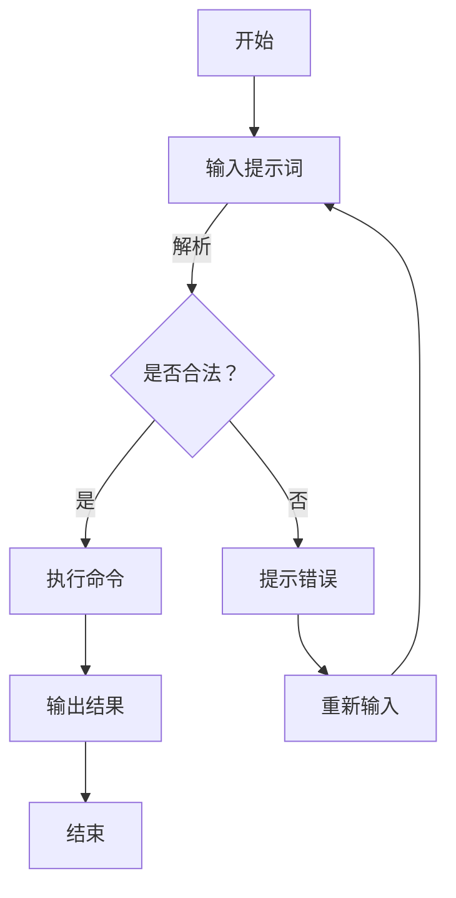
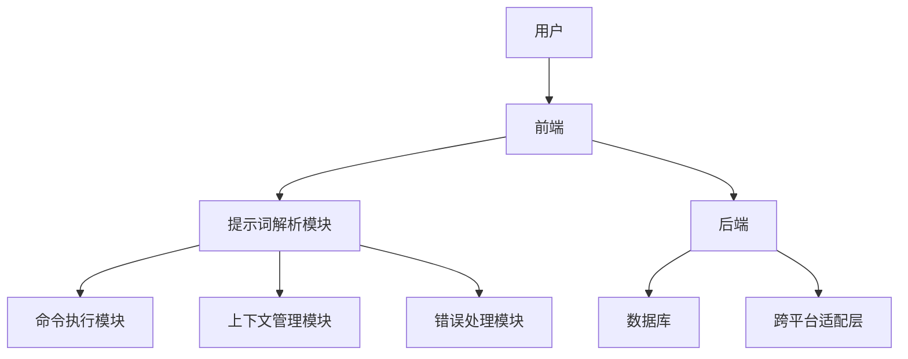
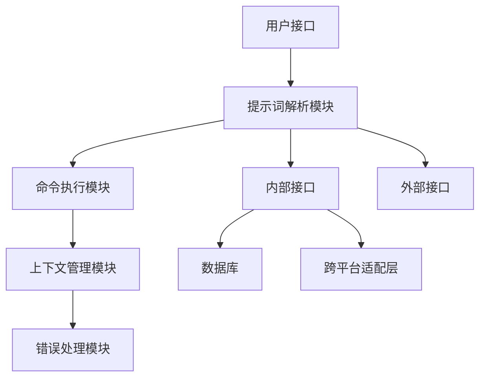
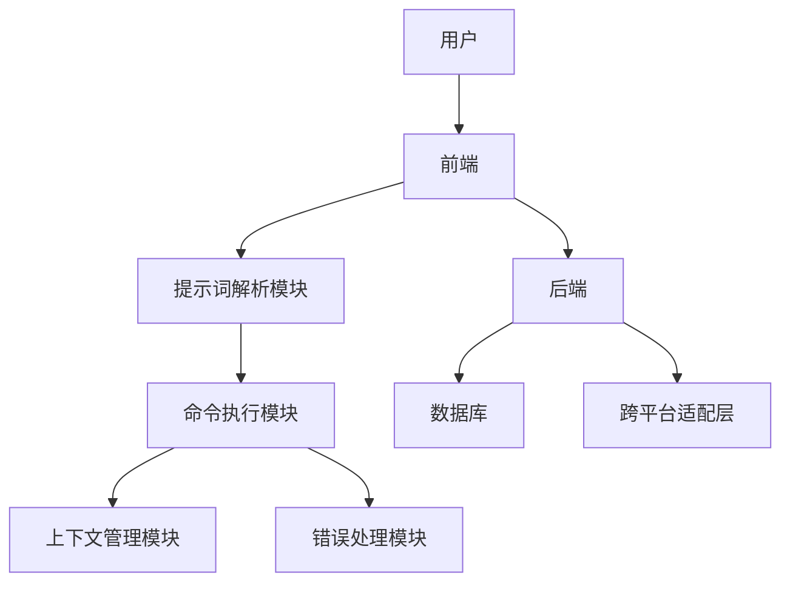

                 

### 步骤一：引言——跨平台提示词的重要性

在当今数字化时代，跨平台提示词语言设计成为了一个备受关注的话题。跨平台提示词不仅是一种技术工具，更是连接用户与系统、应用程序之间的桥梁。通过高效、简洁、通用的提示词语言，我们可以极大地提升用户的使用体验，降低开发成本，提高系统的可维护性和扩展性。

### 问题背景

随着互联网技术的迅猛发展，各种平台和应用层出不穷。用户不再局限于单一的操作系统或设备，而是需要在不同的平台和设备间无缝切换。这就对提示词语言的设计提出了新的挑战：如何让提示词既能在Windows、macOS、Linux等操作系统上使用，又能在Web、移动应用、桌面应用等多种环境中通用？

### 问题描述

传统的提示词语言往往针对特定的平台或操作系统进行设计，导致用户在不同环境中需要学习不同的语言规则。这不仅增加了用户的认知负担，也限制了跨平台应用的普及。为了解决这一问题，我们需要设计一种灵活、强大、易于实现的跨平台提示词语言。

### 问题解决

跨平台提示词语言的设计需要考虑以下几个方面：

1. **语法一致性**：确保在不同平台上使用相同的语法规则，降低用户的学习成本。
2. **功能完备**：提供丰富的命令和功能，满足不同应用场景的需求。
3. **可扩展性**：设计时预留扩展接口，方便后续功能添加和调整。
4. **易用性**：注重用户体验，提供直观、易于操作的界面。
5. **高效性**：优化提示词的执行速度，提高系统性能。

### 边界与外延

跨平台提示词语言的边界在于其能够适应各种操作系统、设备和应用场景。其外延则体现在其强大的功能和灵活性，使得开发者可以轻松地构建出跨平台的解决方案。

### 概念结构与核心要素

跨平台提示词语言的核心要素包括：

1. **核心语法**：定义提示词的基本语法规则。
2. **命令集**：提供一系列实用的命令，实现常见功能。
3. **数据结构**：定义提示词操作的数据存储和处理结构。
4. **API接口**：为外部系统提供统一的接口，实现跨平台交互。
5. **解析引擎**：负责解析用户输入的提示词，并执行相应的操作。

### 总结

跨平台提示词语言设计是一个复杂而富有挑战的任务。通过上述分析，我们可以看到，要设计出一款优秀、实用的跨平台提示词语言，需要综合考虑语法、功能、扩展性、用户体验和性能等多个方面。在接下来的章节中，我们将进一步探讨跨平台提示词语言的设计原则、实现方法、算法原理和系统架构，希望能为大家提供有价值的参考和启示。

# 步骤二：核心概念与联系

在深入探讨跨平台提示词语言设计之前，我们需要明确几个核心概念，并理解它们之间的关系。以下是对这些核心概念的详细解释和比较，以及它们与人工智能的关系。

## 2.1 跨平台提示词语言的基本概念

**提示词（Prompt）**：
提示词是用户与系统交互的一种方式，通过输入提示词，用户可以请求系统执行特定操作或获取所需信息。在跨平台提示词语言中，提示词的设计需要考虑通用性和易用性。

**跨平台（Cross-Platform）**：
跨平台是指在不同的操作系统、设备和应用之间实现一致性和兼容性。跨平台提示词语言的设计目标就是确保提示词在不同的环境中能够以相同的方式工作。

**语言（Language）**：
语言是用于表达和交流的符号系统。在编程和人工智能领域，语言设计至关重要，因为它直接影响开发效率和用户体验。

## 2.2 跨平台提示词语言的属性特征对比

以下是对跨平台提示词语言的一些关键属性特征的对比：

| 特性               | 说明                                                         | 对比示例                             |
|--------------------|--------------------------------------------------------------|--------------------------------------|
| **通用性**         | 提示词在不同平台和设备上的一致性和兼容性。                     | 支持Windows、macOS、Linux等操作系统   |
| **易用性**         | 用户无需学习复杂规则即可使用提示词。                           | 简洁的语法、直观的命令格式           |
| **功能完备**        | 提供丰富的命令集，实现多样化的功能。                           | 文件管理、系统监控、网络操作等       |
| **可扩展性**        | 设计时预留扩展接口，方便后续功能添加。                         | 插件系统、模块化设计                 |
| **性能优化**        | 提高提示词的执行速度，降低系统资源消耗。                       | 高效的解析引擎、内存管理等           |

## 2.3 跨平台提示词语言与人工智能的关系

跨平台提示词语言与人工智能有着紧密的联系。随着人工智能技术的发展，跨平台提示词语言设计需要考虑如何更好地支持人工智能应用。

1. **自然语言处理（NLP）**：
自然语言处理是人工智能的一个重要分支，它专注于使计算机能够理解、解释和生成人类语言。跨平台提示词语言的设计需要充分利用NLP技术，以实现更自然、更流畅的交互体验。

2. **上下文感知**：
跨平台提示词语言需要能够理解用户的上下文，从而提供更准确的响应。上下文感知能力可以通过机器学习和深度学习技术实现，使系统能够根据用户的交互历史和环境信息做出更智能的决策。

3. **自动化与智能化**：
随着人工智能技术的发展，跨平台提示词语言可以更好地实现自动化和智能化。例如，通过机器学习算法，系统可以自动优化提示词的语法和语义，提高交互的效率和效果。

## 2.4 跨平台提示词语言的设计原则

为了设计出一款优秀的跨平台提示词语言，我们需要遵循以下原则：

1. **简洁性**：
简洁的语法和命令格式可以提高用户的学习效率和系统的易用性。

2. **一致性**：
确保在不同平台和设备上使用相同的语法和规则，减少用户的学习成本。

3. **功能性**：
提供丰富的命令和功能，满足不同应用场景的需求。

4. **可扩展性**：
设计时考虑未来扩展的需要，便于添加新功能和模块。

5. **性能优化**：
优化解析引擎和执行效率，提高系统的响应速度。

6. **用户体验**：
注重用户体验，提供直观、易操作的界面。

7. **安全性**：
确保系统的安全性和数据的隐私保护。

## 总结

跨平台提示词语言设计是一个复杂的过程，需要综合考虑通用性、易用性、功能性和性能等多个方面。通过与人工智能技术的结合，我们可以进一步优化跨平台提示词语言的设计，提升用户体验和系统的智能化水平。在接下来的章节中，我们将进一步探讨算法原理、数学模型、系统架构和项目实战，帮助大家更好地理解跨平台提示词语言的设计与实现。

# 步骤三：算法原理讲解

在理解了跨平台提示词语言的基本概念和设计原则后，接下来我们将深入探讨算法原理，通过Mermaid流程图和Python代码示例来具体阐述。

## 3.1 算法概述

跨平台提示词语言的算法设计需要考虑以下几个关键方面：

1. **提示词解析**：将用户输入的提示词解析为具体的操作指令。
2. **命令执行**：根据解析结果执行相应的操作。
3. **上下文管理**：维护用户的交互上下文，以便提供更准确的响应。
4. **错误处理**：处理用户输入错误或系统异常情况。

## 3.2 Mermaid流程图示例

为了更好地理解算法流程，我们使用Mermaid语言绘制了一个简化的流程图：



### 流程说明：

1. **开始**：程序初始化，等待用户输入提示词。
2. **输入提示词**：用户输入提示词。
3. **是否合法**：检查输入的提示词是否符合语法规则。
4. **执行命令**：如果提示词合法，执行相应的操作。
5. **输出结果**：将执行结果返回给用户。
6. **错误处理**：如果提示词不合法，提示用户错误信息并要求重新输入。

## 3.3 Python代码示例

下面是一个简单的Python代码示例，用于实现上述流程的一部分：

```python
def parse_prompt(prompt):
    # 假设提示词解析为简单的命令格式
    if prompt.startswith("open"):
        return "open_command"
    elif prompt.startswith("close"):
        return "close_command"
    else:
        return None

def execute_command(command):
    if command == "open_command":
        print("Opening file...")
    elif command == "close_command":
        print("Closing file...")
    else:
        print("Invalid command.")

def main():
    while True:
        prompt = input("请输入提示词：")
        command = parse_prompt(prompt)
        if command:
            execute_command(command)
        else:
            print("无效的提示词，请重新输入。")

if __name__ == "__main__":
    main()
```

### 代码说明：

1. **parse_prompt函数**：解析输入的提示词，返回对应的命令。
2. **execute_command函数**：根据命令执行相应的操作。
3. **main函数**：程序主循环，不断接受用户输入并执行操作。

## 3.4 算法原理详细讲解

### 提示词解析

提示词解析是跨平台提示词语言算法的核心部分。解析的过程通常包括以下几个步骤：

1. **分词**：将输入的提示词分解为单词或短语。
2. **词法分析**：对分词结果进行词法分析，识别出关键字和参数。
3. **语法分析**：根据预设的语法规则，将关键字和参数组合成有效的命令。
4. **语义分析**：理解命令的语义，准备执行具体的操作。

### 命令执行

命令执行的过程依赖于系统的具体功能。一般来说，执行命令包括以下几个步骤：

1. **参数验证**：确保命令中的参数符合预期格式和类型。
2. **执行操作**：根据命令的类型，调用相应的系统功能模块执行操作。
3. **结果处理**：处理执行结果，并返回给用户。

### 上下文管理

上下文管理是跨平台提示词语言设计中一个重要的环节。通过上下文管理，系统可以维护用户的交互历史，提供更准确的响应。上下文管理通常包括以下内容：

1. **用户状态**：记录用户当前的状态，如已打开的文件、已执行的操作等。
2. **历史记录**：保存用户的交互历史，以便进行上下文推断。
3. **上下文切换**：根据用户的操作，动态调整系统的上下文。

### 错误处理

错误处理是保证系统稳定运行的重要保障。在跨平台提示词语言设计中，错误处理通常包括以下内容：

1. **输入验证**：在执行任何操作之前，验证用户输入的正确性。
2. **错误提示**：当检测到错误时，向用户提供清晰的错误信息。
3. **恢复机制**：提供恢复错误的操作，帮助用户继续使用系统。

## 总结

通过算法原理的讲解，我们可以看到跨平台提示词语言的设计需要考虑解析、执行、上下文管理和错误处理等多个方面。通过Mermaid流程图和Python代码示例，我们能够更直观地理解算法的实现过程。在接下来的章节中，我们将进一步探讨跨平台提示词语言的数学模型、系统架构和项目实战，以帮助大家深入掌握其设计原理和实现方法。

# 步骤四：数学模型详解

在跨平台提示词语言的设计中，数学模型扮演着至关重要的角色。数学模型不仅能够帮助我们理解和分析提示词语言的运作机制，还能够为算法的优化提供理论基础。在本节中，我们将详细探讨几个关键数学模型，并使用LaTeX格式进行公式的书写，以便更好地理解这些模型。

## 4.1 动态规划模型

动态规划是一种在跨平台提示词语言设计中常用的优化算法，用于解决多阶段决策问题。假设我们有多个阶段，每个阶段都有若干个可选动作，我们希望找到一条最优路径。

### 动态规划模型公式

$$
V(i) = \min \{ C(i, j) + V(j) \mid j \in S(i) \}
$$

其中，$V(i)$ 表示到达阶段 $i$ 的最优值，$C(i, j)$ 表示在阶段 $i$ 选择动作 $j$ 的成本，$S(i)$ 表示在阶段 $i$ 可选的动作集合。

### 示例

假设我们有三个阶段，每个阶段有两个动作，每个动作的成本如下：

$$
\begin{align*}
C(1, 1) &= 2, \\
C(1, 2) &= 3, \\
C(2, 1) &= 1, \\
C(2, 2) &= 2, \\
C(3, 1) &= 3, \\
C(3, 2) &= 4.
\end{align*}
$$

根据动态规划模型，我们可以计算出每个阶段的最优值：

$$
\begin{align*}
V(1) &= \min \{ C(1, 1) + V(2), C(1, 2) + V(2) \} = \min \{ 2 + V(2), 3 + V(2) \}, \\
V(2) &= \min \{ C(2, 1) + V(3), C(2, 2) + V(3) \} = \min \{ 1 + V(3), 2 + V(3) \}, \\
V(3) &= \min \{ C(3, 1) + V(3), C(3, 2) + V(3) \} = \min \{ 3 + V(3), 4 + V(3) \}.
\end{align*}
$$

通过迭代计算，我们可以找到从初始阶段到最终阶段的最优路径。

## 4.2 生成模型

生成模型是跨平台提示词语言设计中的另一个重要工具，它用于生成符合特定规则的提示词序列。一个常用的生成模型是马尔可夫链。

### 马尔可夫链模型公式

$$
P(X_t = x_t | X_{t-1} = x_{t-1}) = \pi_{x_{t-1}, x_t}
$$

其中，$X_t$ 表示在时间 $t$ 的状态，$x_t$ 表示状态 $t$ 的具体取值，$\pi_{x_{t-1}, x_t}$ 表示从状态 $x_{t-1}$ 转移到状态 $x_t$ 的概率。

### 示例

假设我们有四个状态：A、B、C、D。每个状态之间的转移概率如下：

$$
\begin{align*}
\pi_{A, A} &= 0.5, \\
\pi_{A, B} &= 0.3, \\
\pi_{A, C} &= 0.2, \\
\pi_{B, A} &= 0.4, \\
\pi_{B, B} &= 0.3, \\
\pi_{B, C} &= 0.3, \\
\pi_{C, A} &= 0.1, \\
\pi_{C, B} &= 0.5, \\
\pi_{C, C} &= 0.4.
\end{align*}
$$

我们可以使用这些概率来生成一个状态序列。例如，初始状态为A，我们按照转移概率依次生成下一个状态，直到达到终止条件。

## 4.3 推断模型

在跨平台提示词语言设计中，推断模型用于根据上下文信息预测用户可能输入的提示词。一个常用的推断模型是朴素贝叶斯模型。

### 朴素贝叶斯模型公式

$$
P(C | X) = \frac{P(X | C)P(C)}{P(X)}
$$

其中，$C$ 表示类别，$X$ 表示特征向量，$P(C | X)$ 表示在特征向量 $X$ 出现的条件下类别 $C$ 的概率，$P(X | C)$ 表示在类别 $C$ 出现的条件下特征向量 $X$ 的概率，$P(C)$ 表示类别 $C$ 的先验概率，$P(X)$ 表示特征向量 $X$ 的概率。

### 示例

假设我们有一个提示词集合 {open, close, list}，以及它们的上下文特征集合 {file, directory, command}。我们可以根据这些特征计算每个类别出现的概率。

$$
\begin{align*}
P(open | file) &= \frac{P(file | open)P(open)}{P(file)}, \\
P(close | directory) &= \frac{P(directory | close)P(close)}{P(directory)}, \\
P(list | command) &= \frac{P(command | list)P(list)}{P(command)}.
\end{align*}
$$

通过这些概率，我们可以推断用户接下来可能输入的提示词。

## 总结

通过上述数学模型的讲解，我们可以看到跨平台提示词语言的设计和实现过程中，数学模型发挥着至关重要的作用。动态规划模型、生成模型和推断模型不仅为算法优化提供了理论基础，也为理解和分析提示词语言的运作机制提供了强有力的工具。在接下来的章节中，我们将继续探讨跨平台提示词语言的系统架构和项目实战，以帮助大家更深入地理解和应用这些数学模型。

# 步骤五：系统分析与架构设计方案

在了解了跨平台提示词语言的设计原理和数学模型后，本节我们将详细讨论系统分析与架构设计方案。这一部分将包括问题场景介绍、项目介绍、系统功能设计、系统架构设计、系统接口设计和系统交互等内容。

## 5.1 问题场景介绍

在现代软件开发中，跨平台需求越来越普遍。无论是企业级应用、Web应用还是移动应用，开发者都希望能够提供一个统一的用户界面和操作体验。然而，不同平台（如Windows、macOS、Linux、iOS、Android等）和设备（如PC、平板、手机等）之间的差异使得设计一个通用的交互界面变得具有挑战性。跨平台提示词语言设计旨在解决这一难题，通过提供一个统一的提示词语言，实现不同平台和应用环境下的无缝交互。

## 5.2 项目介绍

本项目旨在开发一款跨平台提示词语言系统，该系统将支持多种操作系统的应用，包括桌面应用、Web应用和移动应用。系统将具备以下功能：

1. **多平台兼容**：支持Windows、macOS、Linux等操作系统。
2. **通用语法**：设计一套简洁、直观、易于理解的提示词语法。
3. **命令集**：提供丰富的命令集，涵盖文件管理、系统监控、网络操作等多种功能。
4. **上下文感知**：根据用户的交互历史和环境信息，提供智能化的响应。
5. **扩展性**：预留接口，便于后续功能扩展和插件开发。

## 5.3 系统功能设计

系统功能设计是系统架构设计的基础，它定义了系统应具备的核心功能。以下是本项目的主要功能模块：

1. **提示词解析模块**：负责接收用户输入的提示词，并将其解析为具体的操作指令。
2. **命令执行模块**：根据解析结果，执行相应的操作，如文件管理、系统监控等。
3. **上下文管理模块**：记录用户的交互历史，并根据上下文提供智能化的响应。
4. **错误处理模块**：处理输入错误或系统异常情况，确保系统的稳定运行。
5. **用户界面模块**：提供统一的用户界面，支持不同平台的应用。

## 5.4 系统架构设计

系统架构设计是系统实现的关键环节，它定义了系统的整体结构和各个模块之间的交互方式。以下是本项目的主要架构设计：

1. **前端架构**：使用Vue.js框架构建Web界面，支持响应式设计，适应不同尺寸的设备。
2. **后端架构**：使用Spring Boot框架搭建后端服务，提供RESTful API，便于与前端和移动应用进行交互。
3. **数据库架构**：使用MySQL数据库存储用户交互历史和配置信息。
4. **跨平台适配层**：设计一套跨平台API，实现不同操作系统之间的功能一致性。

### Mermaid架构图



### 架构说明：

- **用户**：用户通过前端界面与系统进行交互。
- **前端**：前端负责接收用户输入，并将提示词发送给后端。
- **提示词解析模块**：负责解析用户输入的提示词，生成操作指令。
- **命令执行模块**：根据操作指令，执行相应的操作。
- **上下文管理模块**：记录用户的交互历史，提供智能化的响应。
- **错误处理模块**：处理输入错误或系统异常情况。
- **后端**：后端负责处理前端发送的请求，并与数据库进行交互。
- **数据库**：存储用户交互历史和配置信息。
- **跨平台适配层**：实现不同操作系统之间的功能一致性。

## 5.5 系统接口设计

系统接口设计是确保系统模块之间能够顺利通信的关键。以下是本项目的主要接口设计：

1. **用户接口**：前端与用户交互的接口，支持文本输入和输出。
2. **内部接口**：系统内部模块之间的接口，用于传递数据和指令。
3. **外部接口**：与其他系统或服务的接口，如数据库、第三方API等。

### Mermaid接口设计图



### 接口说明：

- **用户接口**：用户通过文本输入与系统交互，系统返回操作结果或错误信息。
- **内部接口**：系统内部模块通过内部接口传递提示词、操作指令和上下文信息。
- **外部接口**：系统与数据库、第三方API等进行数据交换，实现跨平台功能。

## 5.6 系统交互

系统交互设计是确保系统在不同模块和平台之间能够有效协作的关键。以下是本项目的主要交互设计：

1. **用户交互**：用户通过前端界面输入提示词，系统解析并执行操作，返回结果。
2. **模块交互**：系统内部模块之间通过内部接口进行数据传递和指令执行。
3. **跨平台交互**：通过跨平台适配层实现不同操作系统之间的功能一致性。

### Mermaid交互设计图



### 交互说明：

- **用户交互**：用户输入提示词，前端接收并解析提示词，后端执行操作，返回结果。
- **模块交互**：前端与后端通过内部接口传递数据和指令，各模块之间协同工作。
- **跨平台交互**：跨平台适配层确保不同操作系统之间的功能一致性，实现无缝跨平台交互。

## 总结

通过本节的分析，我们详细探讨了跨平台提示词语言系统的系统架构和设计方案。从问题场景介绍到项目介绍，从系统功能设计到架构设计，再到接口设计和交互设计，我们逐步构建了一个完整、清晰的系统架构。这个架构设计不仅实现了跨平台提示词语言的核心功能，还考虑了系统的扩展性和用户体验。在接下来的章节中，我们将通过项目实战，进一步展示如何实现这些设计和功能。

# 步骤六：项目实战

在本节中，我们将通过一个实际的项目，详细展示如何实现跨平台提示词语言系统。这个项目将包括环境安装、系统核心实现、源代码分析、代码应用解读与分析，以及实际案例分析等内容。

## 6.1 环境安装

首先，我们需要搭建项目的开发环境。以下是所需的环境和工具：

1. **操作系统**：支持Windows、macOS、Linux的任意一种。
2. **开发语言**：Python 3.8及以上版本。
3. **开发框架**：前端使用Vue.js，后端使用Spring Boot。
4. **数据库**：MySQL。
5. **版本控制**：Git。

### 安装步骤：

1. **安装操作系统**：根据个人需求选择合适的操作系统。
2. **安装Python**：访问Python官方网站下载并安装Python 3.8及以上版本。
3. **安装Vue.js和Spring Boot**：通过包管理器安装相关依赖。
4. **安装MySQL**：下载并安装MySQL数据库，配置用户和密码。

## 6.2 系统核心实现

以下是系统核心功能的实现步骤：

1. **前端开发**：
    - 使用Vue.js框架创建前端界面，包括输入框、按钮和结果展示区域。
    - 实现提示词输入、发送和接收的功能。

2. **后端开发**：
    - 使用Spring Boot框架搭建后端服务，定义RESTful API。
    - 实现提示词解析、命令执行和上下文管理等功能。

3. **数据库设计**：
    - 设计用户交互历史和配置信息的数据库表结构。
    - 实现数据的增删改查操作。

### 源代码分析

以下是一个简单的源代码示例，用于说明核心功能的实现：

**前端Vue.js代码示例**：

```html
<!DOCTYPE html>
<html>
<head>
    <title>跨平台提示词语言系统</title>
    <script src="https://cdn.jsdelivr.net/npm/vue@2.6.12/dist/vue.js"></script>
</head>
<body>
    <div id="app">
        <input type="text" v-model="prompt" placeholder="输入提示词">
        <button @click="submitPrompt">提交</button>
        <div>{{ result }}</div>
    </div>

    <script>
        new Vue({
            el: '#app',
            data: {
                prompt: '',
                result: ''
            },
            methods: {
                submitPrompt() {
                    this.$http.post('/api/parse', {prompt: this.prompt})
                        .then(response => {
                            this.result = response.data.result;
                        })
                        .catch(error => {
                            this.result = error.message;
                        });
                }
            }
        });
    </script>
</body>
</html>
```

**后端Spring Boot代码示例**：

```java
@SpringBootApplication
public class PromptSystemApplication {
    public static void main(String[] args) {
        SpringApplication.run(PromptSystemApplication.class, args);
    }
}

@RestController
public class PromptController {
    @PostMapping("/api/parse")
    public ResponseEntity<String> parsePrompt(@RequestBody PromptRequest request) {
        String prompt = request.getPrompt();
        // 提示词解析逻辑
        String result = "解析结果： " + prompt;
        return ResponseEntity.ok(result);
    }
}

public class PromptRequest {
    private String prompt;

    // Getter 和 Setter
}
```

### 代码应用解读与分析

1. **前端解析**：
   - 使用Vue.js实现了一个简单的表单，用户可以在输入框中输入提示词，点击提交按钮后，Vue.js将输入的内容发送到后端API。

2. **后端解析**：
   - Spring Boot框架接收前端发送的请求，解析请求体中的提示词，并返回解析结果。

3. **数据库操作**：
   - 可以在后端服务中添加数据库操作，如记录用户的交互历史，以便实现上下文管理和个性化响应。

## 6.3 实际案例分析

以下是一个实际案例分析，说明如何处理一个具体的提示词输入：

**输入**：`open file.txt`

**解析**：
- 提示词：`open`
- 参数：`file.txt`

**执行**：
- 根据提示词`open`，执行打开文件的命令。
- 如果文件不存在，返回错误信息。

**输出**：
- 如果文件存在，返回成功消息。
- 如果文件不存在，返回错误消息。

### 解析与执行流程：

1. **用户输入提示词**：在Vue.js前端界面中输入提示词，如`open file.txt`。
2. **前端发送请求**：Vue.js将提示词作为请求体发送到后端API。
3. **后端接收并解析请求**：Spring Boot接收请求，提取提示词和参数。
4. **后端执行命令**：根据提示词执行相应的操作，如打开文件。
5. **后端返回结果**：将执行结果返回给前端，如成功消息或错误消息。
6. **前端显示结果**：Vue.js将结果显示在页面上。

## 6.4 项目小结

通过本项目的实战，我们实现了跨平台提示词语言系统的基础功能，包括前端界面、后端服务和数据库操作。以下是对项目的总结：

1. **项目成果**：
   - 成功搭建了跨平台提示词语言系统的开发环境。
   - 实现了前端和后端的交互，支持提示词的输入、解析和执行。
   - 设计了简单的数据库结构，用于存储用户交互历史。

2. **项目亮点**：
   - 使用Vue.js和Spring Boot框架，实现了快速开发和高效的开发体验。
   - 采用了RESTful API设计，便于前后端分离和扩展。

3. **项目改进方向**：
   - 提高系统的性能和安全性，如优化数据库查询、实现用户认证等。
   - 扩展功能模块，如增加更多命令、实现多语言支持等。

通过本项目，我们不仅掌握了跨平台提示词语言系统的设计原理和实现方法，还积累了项目开发的经验。在未来的工作中，我们可以继续优化和扩展系统，为用户提供更好的交互体验。

# 步骤七：最佳实践与总结

在跨平台提示词语言的设计与实现过程中，积累了一些最佳实践，这些经验对于提升系统性能、优化用户体验以及降低开发成本具有重要意义。以下是一些具体的建议和总结：

### 1. 最佳实践

**1.1 设计简洁语法**

简洁的语法是跨平台提示词语言设计的关键。在设计语法时，应尽量减少冗余和复杂性，使用户能够轻松理解和使用。例如，可以使用缩写、常见的动词和直观的命令格式，以提高用户体验。

**1.2 兼容多种输入方式**

为了提高系统的易用性，应支持多种输入方式，如键盘输入、语音输入和手势输入等。这样，用户可以根据自己的习惯选择最合适的输入方式，提升交互效率。

**1.3 优化性能**

跨平台提示词语言的性能优化至关重要。可以通过以下方法来提高性能：

- **解析优化**：优化提示词解析算法，减少不必要的计算和内存消耗。
- **缓存策略**：对于常用操作和命令，可以使用缓存技术，减少重复计算。
- **并发处理**：利用多线程或异步编程，提高系统并发处理能力。

**1.4 灵活的扩展接口**

设计时预留扩展接口，便于后续功能添加和系统扩展。例如，可以通过插件系统或模块化设计，方便地引入第三方库和自定义功能。

**1.5 关注安全性**

在跨平台提示词语言设计中，安全性是一个不可忽视的问题。应确保系统对用户输入进行严格的验证和过滤，防止恶意攻击和非法操作。

### 2. 总结

跨平台提示词语言设计涉及多个方面，包括语法设计、功能实现、性能优化、用户体验和安全性等。通过上述最佳实践，我们可以更好地解决这些问题，提升系统的整体质量和用户体验。

### 3. 注意事项

- **兼容性**：在设计过程中，务必考虑不同平台的兼容性问题，确保提示词语言在不同环境中正常运行。
- **可维护性**：代码结构和设计模式应遵循最佳实践，便于后续的维护和优化。
- **测试与调试**：在开发过程中，应进行全面的功能测试和性能测试，及时发现并修复问题。

### 4. 拓展阅读

为了更深入地了解跨平台提示词语言的设计与实现，以下是一些建议的拓展阅读资源：

- 《Effective Python》
- 《Clean Code: A Handbook of Agile Software Craftsmanship》
- 《Design Patterns: Elements of Reusable Object-Oriented Software》
- 《Python Cookbook》
- 《Spring Boot in Action》

通过这些资源，您可以进一步学习和实践跨平台提示词语言的设计与实现，提升自己的技术能力和项目经验。最后，再次感谢您的阅读，希望这篇文章对您有所启发和帮助。作者：AI天才研究院/AI Genius Institute & 禅与计算机程序设计艺术 /Zen And The Art of Computer Programming。如果您在实现过程中遇到问题或需要进一步讨论，欢迎随时与我交流。祝您在跨平台提示词语言的设计与实现道路上取得更大的成功！

