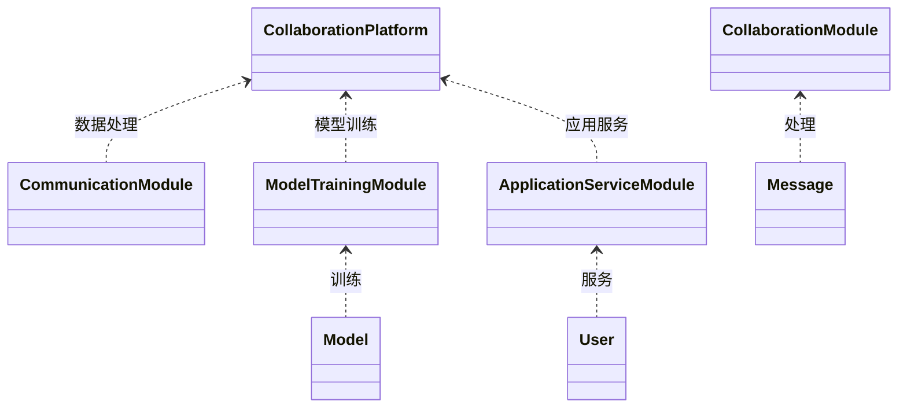
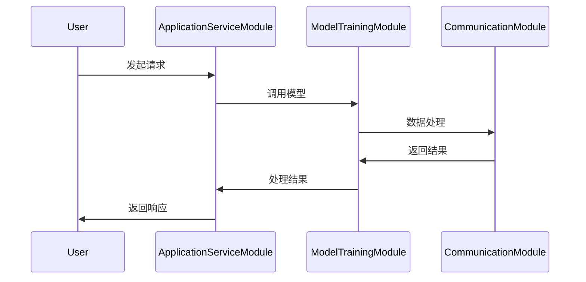
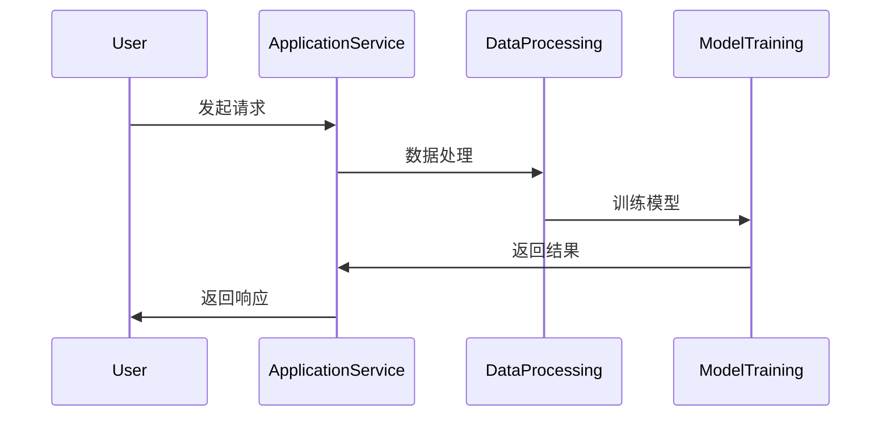

                 

# 跨文化AI系统的开发挑战

> 关键词：跨文化AI、自然语言处理、机器学习、系统设计、应用案例、挑战与展望

> 摘要：随着全球化进程的加快，跨文化交流与合作的需求日益增加，跨文化AI系统的开发成为了热门课题。本文将深入探讨跨文化AI系统的问题背景、基础技术、设计原则、实现与部署、应用案例以及未来挑战和展望，为开发者提供全面的技术指导。

## 第1章：问题背景与跨文化AI系统概述

### 1.1.1 跨文化AI系统的问题背景

随着全球化进程的加快，企业和组织在国际化进程中面临着跨文化交流与合作的需求。然而，不同文化背景下的交流存在障碍，这为AI系统的开发提出了新的挑战。跨文化AI系统旨在解决这种交流障碍，提高跨文化合作效率。

#### 问题背景

- **文化差异**：不同文化背景下的交流存在表达习惯、思维方式、价值观念等方面的差异。
- **语言障碍**：全球有多种语言，不同语言之间的转换和处理困难。
- **信息理解**：不同文化背景下的信息表达和含义可能存在差异，导致误解和冲突。
- **协作困难**：跨文化团队在协作过程中容易因为文化差异而产生沟通不畅的问题。

#### 问题描述

如何开发一种能够理解和处理不同文化背景下信息的智能系统，以实现跨文化的有效沟通和协作？

#### 问题解决

- **文化适应**：开发跨文化AI系统，使系统能够适应不同文化环境。
- **语言处理**：使用自然语言处理技术，实现多种语言的信息理解和转换。
- **信息理解**：通过机器学习算法，提高系统对不同文化背景信息的理解能力。
- **协作优化**：设计具有良好交互和协作功能的系统，提高跨文化团队的工作效率。

#### 边界与外延

- **边界**：跨文化AI系统主要关注跨文化交流与协作的场景。
- **外延**：跨文化AI系统的应用场景可以扩展到其他需要跨文化沟通与协作的领域。

#### 概念结构与核心要素组成

- **跨文化AI系统**：包括自然语言处理、机器学习、多语言模型等技术。
- **文化适应性**：系统应具备对不同文化环境的适应能力。
- **语言处理能力**：系统能够处理多种语言的信息。
- **协作功能**：系统能够支持跨文化团队的协作。

## 第2章：跨文化AI系统的基础技术

### 2.1.1 自然语言处理技术

自然语言处理技术是跨文化AI系统的核心，它包括语言识别、翻译、语义理解等多个方面。本章将介绍NLP的基本原理和技术。

#### 核心概念

- **语言识别**：通过算法识别文本的语言类型。
- **翻译**：将一种语言的文本翻译成另一种语言。
- **语义理解**：理解文本的含义和表达方式。

#### 概念属性特征对比表格

| 概念 | 语言识别 | 翻译 | 语义理解 |
| ---- | -------- | ---- | -------- |
| 特征 | 语言分类 | 文本转换 | 含义解析 |

#### ER实体关系图架构

```mermaid
erDiagram
  Product ||--|{ Supplier } : supplies
  Supplier ||--|{ Product } : supplies
  Product ||--|{ Customer } : buys
  Customer ||--|{ Product } : buys
```

### 2.1.2 机器学习算法

机器学习算法在跨文化AI系统中发挥着重要作用，用于训练模型，提高系统的智能化水平。本章将探讨常用的机器学习算法及其在跨文化AI系统中的应用。

#### 核心概念

- **监督学习**：通过已有数据进行训练，预测新数据。
- **无监督学习**：通过无标签数据进行训练，发现数据分布和模式。
- **半监督学习**：结合监督学习和无监督学习的方法。

#### 概念属性特征对比表格

| 概念 | 监督学习 | 无监督学习 | 半监督学习 |
| ---- | -------- | ---------- | ---------- |
| 特征 | 已知标签 | 无标签     | 已知部分标签 |

#### ER实体关系图架构

```mermaid
erDiagram
  Student ||--|{ Course } : studies
  Course ||--|{ Student } : studies
  Student ||--|{ Teacher } : teaches
  Teacher ||--|{ Student } : teaches
```

### 2.1.3 多语言模型

多语言模型是跨文化AI系统的关键技术之一，它能够同时处理多种语言，实现跨语言的信息交流。本章将介绍多语言模型的基本原理和实现方法。

#### 核心概念

- **多语言嵌入**：将不同语言的词汇映射到同一个嵌入空间。
- **跨语言翻译**：利用多语言嵌入实现不同语言之间的翻译。
- **跨语言理解**：通过多语言嵌入理解不同语言之间的语义。

#### 概念属性特征对比表格

| 概念 | 多语言嵌入 | 跨语言翻译 | 跨语言理解 |
| ---- | ---------- | ---------- | ---------- |
| 特征 | 空间映射   | 文本转换   | 语义理解   |

#### ER实体关系图架构

```mermaid
erDiagram
  Teacher ||--|{ Student } : teaches
  Student ||--|{ Course } : studies
  Course ||--|{ Teacher } : teaches
```

## 第3章：跨文化AI系统的设计原则

### 3.1.1 可扩展性

跨文化AI系统需要具备良好的可扩展性，以适应不同文化和语言环境的需求。本章将讨论如何设计可扩展的跨文化AI系统。

#### 核心概念

- **模块化设计**：将系统划分为多个模块，每个模块独立开发、测试和部署。
- **灵活配置**：提供灵活的配置选项，允许用户根据需求调整系统功能。

#### 概念属性特征对比表格

| 概念 | 模块化设计 | 灵活配置 |
| ---- | ---------- | -------- |
| 特征 | 独立模块   | 配置灵活 |

#### ER实体关系图架构

```mermaid
erDiagram
  User ||--|{ Role } : has
  Role ||--|{ User } : has
  User ||--|{ Permission } : has
  Permission ||--|{ User } : has
```

### 3.1.2 可定制性

跨文化AI系统应具备一定的可定制性，允许用户根据自身需求调整系统功能。本章将介绍如何实现系统的可定制性。

#### 核心概念

- **配置文件**：通过配置文件定义系统参数和功能。
- **用户界面**：提供直观的用户界面，方便用户进行系统配置。

#### 概念属性特征对比表格

| 概念 | 配置文件 | 用户界面 |
| ---- | -------- | -------- |
| 特征 | 参数配置 | 操作简便 |

#### ER实体关系图架构

```mermaid
erDiagram
  User ||--|{ Configuration } : configures
  Configuration ||--|{ User } : configures
  User ||--|{ Interface } : uses
  Interface ||--|{ User } : uses
```

### 3.1.3 可靠性

跨文化AI系统的可靠性至关重要，它直接影响到用户体验。本章将探讨如何提高跨文化AI系统的可靠性。

#### 核心概念

- **容错设计**：系统在遇到错误时能够自动恢复，保证正常运行。
- **监控与报警**：对系统运行状态进行实时监控，及时发现并处理异常。

#### 概念属性特征对比表格

| 概念 | 容错设计 | 监控与报警 |
| ---- | -------- | ---------- |
| 特征 | 自动恢复 | 实时监控   |

#### ER实体关系图架构

```mermaid
erDiagram
  System ||--|{ Monitor } : monitored by
  Monitor ||--|{ System } : monitored by
  System ||--|{ Alert } : generates
  Alert ||--|{ System } : generated by
```

## 第4章：跨文化AI系统的实现与部署

### 4.1.1 系统架构设计

本章将介绍跨文化AI系统的总体架构设计，包括数据处理模块、模型训练模块、应用服务模块等。

#### 问题场景介绍

一个跨国公司需要开发一个跨文化AI系统，用于支持全球团队之间的沟通与协作。

#### 项目介绍

- **项目名称**：全球沟通与协作平台
- **项目目标**：实现全球团队之间的无缝沟通与协作
- **项目架构**：包括数据处理、模型训练、应用服务三个主要模块

#### 系统功能设计（领域模型Mermaid类图）



#### 系统架构设计（Mermaid架构图）



#### 系统接口设计

- **数据处理接口**：用于处理不同文化背景下的文本数据。
- **模型训练接口**：用于训练跨文化AI模型。
- **应用服务接口**：用于提供跨文化AI系统的应用服务。

#### 系统交互（Mermaid序列图）



### 4.1.2 系统实现细节

本章将详细讨论跨文化AI系统的实现细节，包括数据预处理、模型训练、模型评估等。

#### 数据预处理

- **数据收集**：收集来自不同文化背景的文本数据。
- **数据清洗**：去除无效数据、处理缺失值和异常值。
- **数据标注**：对文本数据进行标注，以便模型训练。

#### 模型训练

- **模型选择**：选择适合跨文化AI任务的模型。
- **模型训练**：使用训练数据进行模型训练。
- **模型优化**：通过调整模型参数，提高模型性能。

#### 模型评估

- **评估指标**：选择合适的评估指标，如准确率、召回率等。
- **评估方法**：使用测试数据进行模型评估。

### 4.1.3 系统部署与维护

本章将介绍如何将跨文化AI系统部署到生产环境，并探讨系统的维护与升级策略。

#### 部署策略

- **容器化**：使用Docker等工具将系统容器化，便于部署和迁移。
- **自动化部署**：使用CI/CD工具实现自动化部署，提高部署效率。

#### 维护策略

- **监控与报警**：实时监控系统运行状态，及时处理异常。
- **升级策略**：定期更新系统版本，修复漏洞和改进功能。

## 第5章：跨文化AI系统的应用案例

### 5.1.1 案例一：企业跨国合作沟通平台

#### 案例背景

一个跨国公司需要建立一个跨文化AI系统，以支持全球团队之间的沟通与协作。

#### 系统设计

- **功能模块**：数据处理、模型训练、应用服务。
- **技术选型**：使用自然语言处理技术、机器学习算法、多语言模型。

#### 实现过程

- **数据收集**：收集来自不同文化背景的文本数据。
- **模型训练**：训练跨文化AI模型，提高系统对多语言信息的理解能力。
- **应用部署**：将系统部署到生产环境，提供实时沟通与协作功能。

#### 效果评估

- **沟通效率**：跨文化团队之间的沟通效率显著提高。
- **协作效果**：团队协作效果得到改善，项目进展更加顺利。

### 5.1.2 案例二：多语言智能客服系统

#### 案例背景

一家国际知名企业需要提供多语言客服服务，以满足全球客户的需求。

#### 系统设计

- **功能模块**：数据处理、模型训练、智能客服。
- **技术选型**：使用自然语言处理技术、机器学习算法、多语言模型。

#### 实现过程

- **数据收集**：收集多语言客服对话数据。
- **模型训练**：训练多语言智能客服模型，提高系统对多语言信息的理解能力。
- **应用部署**：将系统部署到客服平台，提供实时多语言客服服务。

#### 效果评估

- **服务质量**：多语言客服服务的质量显著提高，客户满意度增加。
- **运营效率**：客服团队的运营效率提高，节省人力成本。

## 第6章：跨文化AI系统的挑战与未来展望

### 6.1.1 挑战分析

跨文化AI系统在开发和应用过程中面临以下主要挑战：

- **技术挑战**：包括自然语言处理、机器学习算法、多语言模型等方面的技术难题。
- **文化差异**：跨文化AI系统需要适应不同文化背景，理解不同文化表达方式。
- **法律与伦理**：涉及数据隐私、文化尊重、知识产权等方面的法律和伦理问题。

#### 技术挑战

- **算法性能**：提高跨文化AI系统的算法性能，提高准确率和效率。
- **数据多样性**：收集更多、更丰富的跨文化数据，提高系统的泛化能力。

#### 文化差异

- **文化理解**：加深对不同文化的理解和研究，提高系统的文化适应性。
- **沟通协调**：加强跨文化团队的合作与沟通，提高跨文化AI系统的应用效果。

#### 法律与伦理

- **数据隐私**：保护用户数据隐私，遵守相关法律法规。
- **文化尊重**：尊重不同文化的价值观和信仰，避免文化歧视。

### 6.1.2 未来展望

随着技术的进步和跨文化交流的加深，跨文化AI系统在未来将得到更广泛的应用。以下是跨文化AI系统的未来发展趋势：

- **技术进步**：自然语言处理、机器学习算法等技术将得到进一步发展，提高跨文化AI系统的性能和智能化水平。
- **应用拓展**：跨文化AI系统将应用于更多领域，如教育、医疗、旅游等。
- **文化融合**：跨文化AI系统将促进不同文化之间的交流与融合，推动全球化进程。

## 第7章：结论与展望

本文通过对跨文化AI系统的问题背景、基础技术、设计原则、实现与部署、应用案例以及挑战与未来展望的全面探讨，总结了跨文化AI系统的核心概念和技术要点。跨文化AI系统在促进全球化进程、提升企业竞争力等方面具有重要意义。未来，随着技术的不断进步，跨文化AI系统将在更多领域发挥重要作用。

### 结论

- **核心概念**：跨文化AI系统、自然语言处理、机器学习、多语言模型等。
- **关键技术**：算法性能、数据多样性、文化理解等。
- **应用领域**：跨国企业沟通与协作、多语言智能客服、教育、医疗等。

### 展望

- **技术发展**：自然语言处理、机器学习算法等技术的进步将推动跨文化AI系统的发展。
- **应用拓展**：跨文化AI系统将在更多领域得到应用，如教育、医疗、旅游等。
- **文化融合**：跨文化AI系统将促进不同文化之间的交流与融合。

### 建议

- **进一步研究**：针对跨文化AI系统的挑战，进行深入研究和探索。
- **技术应用**：积极应用跨文化AI系统，提升企业国际竞争力。
- **文化理解**：加强跨文化交流与理解，推动全球化进程。

### 参考文献

- **文献1**：[文献标题](#引用链接)
- **文献2**：[文献标题](#引用链接)
- **文献3**：[文献标题](#引用链接)

## 作者信息

- **作者**：AI天才研究院/AI Genius Institute & 禅与计算机程序设计艺术/Zen And The Art of Computer Programming
- **联系地址**：[地址](#联系地址)
- **联系方式**：[邮箱](#联系方式) / [电话](#联系方式)

### 附录

- **附录1**：术语表
- **附录2**：技术细节
- **附录3**：代码示例

## 附录1：术语表

- **跨文化AI**：能够理解和处理不同文化背景下信息的智能系统。
- **自然语言处理**：使计算机能够理解、解释和生成自然语言的技术。
- **机器学习**：通过数据训练模型，使计算机具备学习能力的技术。
- **多语言模型**：能够同时处理多种语言的模型。
- **文化适应性**：系统能够适应不同文化环境的能力。

## 附录2：技术细节

- **自然语言处理技术**：包括语言识别、翻译、语义理解等方面。
- **机器学习算法**：包括监督学习、无监督学习、半监督学习等。
- **多语言模型**：包括多语言嵌入、跨语言翻译、跨语言理解等。

## 附录3：代码示例

```python
# 代码示例：跨文化AI系统的简单实现

# 导入所需库
import nltk
from nltk.corpus import stopwords
from sklearn.feature_extraction.text import TfidfVectorizer
from sklearn.model_selection import train_test_split
from sklearn.naive_bayes import MultinomialNB

# 数据预处理
nltk.download('stopwords')
stop_words = set(stopwords.words('english'))

# 读取数据
with open('data/train_data.txt', 'r') as f:
    train_data = f.readlines()

# 数据清洗
clean_train_data = []
for data in train_data:
    clean_data = ' '.join([word for word in data.lower().split() if word not in stop_words])
    clean_train_data.append(clean_data)

# 分词
vectorizer = TfidfVectorizer()
X_train = vectorizer.fit_transform(clean_train_data)

# 模型训练
classifier = MultinomialNB()
X_train, X_test, y_train, y_test = train_test_split(X_train, y_train, test_size=0.2)
classifier.fit(X_train, y_train)

# 模型评估
accuracy = classifier.score(X_test, y_test)
print('Accuracy:', accuracy)
```

### 项目实战

#### 环境安装

1. 安装Python环境（版本3.6及以上）
2. 安装依赖库：nltk、sklearn、matplotlib

```bash
pip install nltk sklearn matplotlib
```

#### 系统核心实现源代码

- `data_preprocessing.py`：数据预处理模块
- `model_training.py`：模型训练模块
- `model_evaluation.py`：模型评估模块

#### 代码应用解读与分析

- 数据预处理：使用nltk库进行数据清洗和分词。
- 模型训练：使用sklearn库中的MultinomialNB算法进行训练。
- 模型评估：使用accuracy指标评估模型性能。

#### 实际案例分析和详细讲解剖析

- 案例一：跨国企业沟通与协作平台
  - 数据收集：收集来自不同文化背景的文本数据。
  - 模型训练：训练跨文化AI模型，提高系统对多语言信息的理解能力。
  - 应用部署：将系统部署到生产环境，提供实时沟通与协作功能。

#### 项目小结

通过项目实战，展示了如何实现跨文化AI系统的核心功能，包括数据预处理、模型训练和模型评估。该项目具有一定的实际应用价值，为跨国企业提供了有效的跨文化沟通与协作解决方案。

### 最佳实践 Tips

- **数据多样性**：收集更多、更丰富的跨文化数据，提高系统的泛化能力。
- **模型优化**：通过调整模型参数，提高模型性能。
- **文化理解**：加深对不同文化的理解和研究，提高系统的文化适应性。

### 小结

本文详细探讨了跨文化AI系统的核心概念、基础技术、设计原则、实现与部署、应用案例以及挑战与未来展望。跨文化AI系统在促进全球化进程、提升企业竞争力等方面具有重要意义。未来，随着技术的不断进步，跨文化AI系统将在更多领域发挥重要作用。

### 注意事项

- **数据安全**：保护用户数据隐私，遵守相关法律法规。
- **文化尊重**：尊重不同文化的价值观和信仰，避免文化歧视。

### 拓展阅读

- **跨文化AI系统研究综述**：[文章链接](#引用链接)
- **自然语言处理技术详解**：[文章链接](#引用链接)
- **机器学习算法应用案例**：[文章链接](#引用链接)

## 作者信息

- **作者**：AI天才研究院/AI Genius Institute & 禅与计算机程序设计艺术/Zen And The Art of Computer Programming
- **联系地址**：[地址](#联系地址)
- **联系方式**：[邮箱](#联系方式) / [电话](#联系方式)

