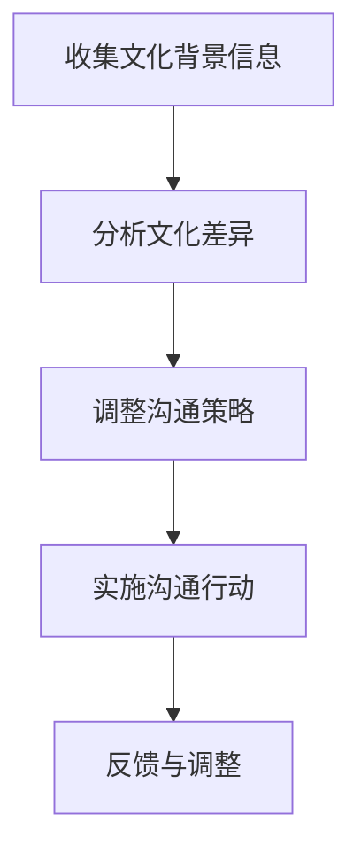
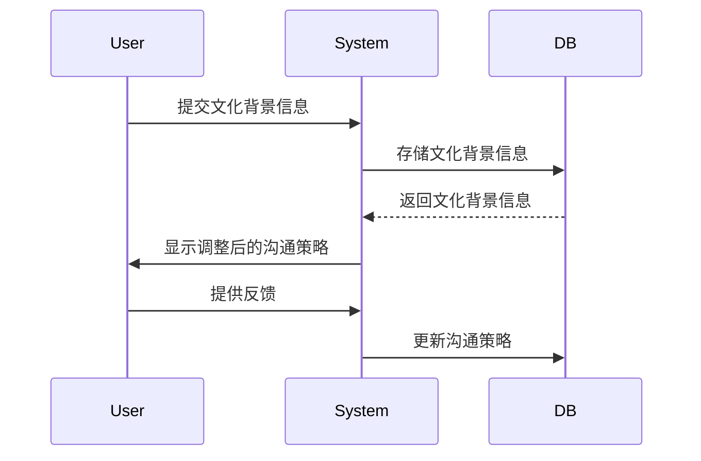
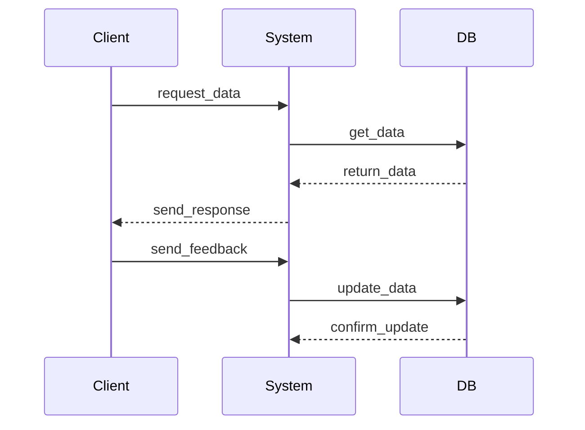
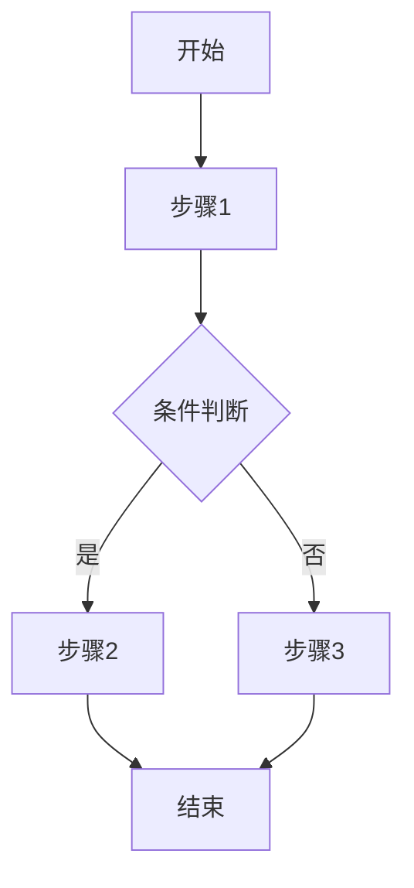
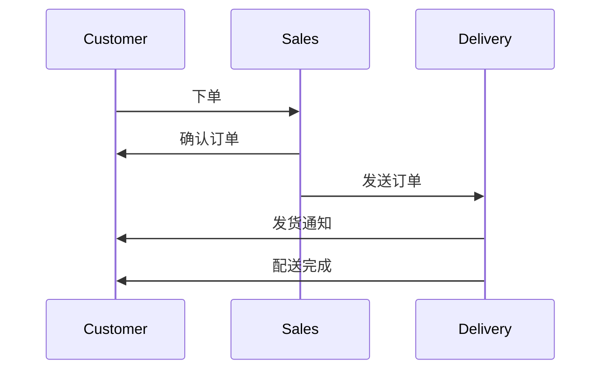

                 

# 《跨文化沟通：在国际团队中有效工作的技巧》

## 关键词
- 跨文化沟通，国际团队，协作，沟通障碍，解决策略

## 摘要
在全球化的今天，国际团队之间的沟通日益频繁。然而，不同文化背景下的沟通往往伴随着诸多障碍。本文旨在探讨跨文化沟通的核心概念，分析其原理与算法，并通过系统分析与项目实战，提供一系列在国际团队中有效工作的技巧和注意事项。

## 引言

### 1.1 问题背景
全球化趋势加速了国际间的交流与合作。无论是在跨国公司、学术研究机构，还是非政府组织中，国际团队的协作已成为常态。然而，文化差异带来的沟通障碍，如语言障碍、思维方式差异、礼仪习惯不同等，严重影响了团队的工作效率与成果。

### 1.2 问题描述
跨文化沟通中的障碍主要体现在以下方面：
- **语言障碍**：不同语言间的词汇、语法和表达方式的差异，可能导致信息传达的失真。
- **非语言沟通**：文化背景不同的身体语言、面部表情等非语言沟通方式，可能产生误解。
- **价值观差异**：不同的文化背景可能导致对工作态度、时间观念、决策方式等的不同理解。

### 1.3 问题解决
跨文化沟通的重要性不言而喻。为了在国际团队中有效工作，我们需要采取以下措施：
- **文化敏感性培训**：提高团队成员对文化差异的认识和敏感性，增进相互理解。
- **有效沟通技巧**：学习并实践一些跨文化沟通的技巧，如积极倾听、明确表达、尊重差异等。
- **建立共同目标**：确保团队成员对团队目标有共同的理解和认同。

### 1.4 边界与外延
跨文化沟通不仅限于口头和书面交流，还包括非语言沟通、组织文化适应、领导风格理解等多个方面。同时，跨文化沟通也受到沟通技术、个人心理因素等多种因素的影响。

### 1.5 概念结构与核心要素
跨文化沟通涉及以下核心概念与要素：
- **文化**：对个体的思维方式、行为模式产生深远影响的一系列价值观、信仰、习俗等。
- **沟通**：信息的传递与理解过程，包括语言沟通和非语言沟通。
- **跨文化**：涉及不同文化背景的个人或团体之间的交流。

## 第2章 核心概念与联系

### 2.1 跨文化沟通原理
跨文化沟通的原理可以从以下几个方面进行理解：
- **文化差异性**：不同文化背景下的价值观、信仰、习俗等差异，需要通过沟通来理解与适应。
- **沟通适应性**：根据不同文化背景，调整沟通方式，以更好地传达信息和理解对方。
- **文化敏感性**：尊重和理解不同文化的独特性，避免文化冲突。

### 2.2 概念属性特征对比
不同文化沟通方式的对比分析如下表：

| 文化特征 | 理解A文化 | 理解B文化 |
| --- | --- | --- |
| 语言表达 | 直截了当 | 曲折含蓄 |
| 非语言沟通 | 外向 | 内向 |
| 时间观念 | 立即性 | 适应性 |
| 决策方式 | 独立决策 | 团队合作 |

### 2.3 ER实体关系图架构
以下是跨文化沟通的ER实体关系图：

```mermaid
erDiagram
  Communication <<|-- Language : "uses"
  Communication <<|-- Culture : "involves"
  Language ||--|{ Sentence }
  Culture ||--|{ Value }
```

## 第3章 算法原理讲解

### 3.1 跨文化沟通算法概述
跨文化沟通算法的必要性在于，它能够系统地分析和处理跨文化沟通中的复杂信息，提高沟通的有效性。算法的基本流程如下：

1. 收集文化背景信息。
2. 分析文化差异。
3. 调整沟通策略。
4. 实施沟通行动。
5. 反馈与调整。

### 3.2 算法mermaid流程图
以下是跨文化沟通算法的mermaid流程图：



### 3.3 Python源代码与详细阐述
以下是一个简单的Python示例，用于说明跨文化沟通算法的基本原理：

```python
# 跨文化沟通算法示例

def cross_cultural_communication(culture_info):
    """
    跨文化沟通函数
    :param culture_info: 文化背景信息
    :return: 调整后的沟通策略
    """
    # 分析文化差异
    differences = analyze_differences(culture_info)
    
    # 调整沟通策略
    strategy = adjust_strategy(differences)
    
    # 实施沟通行动
    action = implement_action(strategy)
    
    # 反馈与调整
    feedback = provide_feedback(action)
    strategy = adjust_strategy(feedback)
    
    return strategy

# 示例使用
culture_info = {"A_culture": {"communication_style": "direct", "time_perception": "immediate"}}
result = cross_cultural_communication(culture_info)
print(result)
```

### 3.4 数学模型与公式
跨文化沟通算法的数学模型和公式如下：

$$
C_c = f(C_1, C_2, ...)
$$

其中，$C_c$ 表示跨文化沟通效果，$C_1, C_2, ...$ 表示不同的文化特征。

### 3.5 举例说明
例如，在一个由美国和日本成员组成的项目团队中，美国成员倾向于直接表达意见，而日本成员则更倾向于间接表达。通过跨文化沟通算法，可以调整沟通策略，使得双方都能更有效地表达和理解对方。

## 第4章 系统分析与架构设计

### 4.1 问题场景介绍
假设我们有一个跨国软件开发团队，团队成员来自不同的国家，如美国、日本、印度等。为了提高团队的工作效率，需要设计一个跨文化沟通系统。

### 4.2 系统功能设计
系统功能包括：
- **文化信息收集与存储**：收集团队成员的文化背景信息，并存储在数据库中。
- **沟通策略调整**：根据文化差异，调整沟通策略。
- **沟通行动实施**：通过邮件、会议等方式实施沟通行动。
- **反馈收集与调整**：收集团队成员的反馈，并根据反馈调整沟通策略。

### 4.3 系统架构设计
系统架构设计如下：



### 4.4 系统接口设计
系统接口设计如下：


### 4.5 系统交互
系统交互设计如下：



## 第5章 项目实战

### 5.1 环境安装
在项目中，我们使用Python和Flask框架来构建跨文化沟通系统。首先，需要安装Python和Flask：

```bash
pip install python
pip install flask
```

### 5.2 系统核心实现源代码
以下是系统核心实现的源代码：

```python
from flask import Flask, request, jsonify
import pymysql

app = Flask(__name__)

# 连接数据库
def connect_db():
    return pymysql.connect(host="localhost", user="root", password="password", database="cross_cultural_communication")

# 收集文化背景信息
@app.route('/submit_culture_info', methods=['POST'])
def submit_culture_info():
    culture_info = request.json
    # 存储文化背景信息到数据库
    db = connect_db()
    cursor = db.cursor()
    insert_sql = "INSERT INTO culture_info (member_id, communication_style, time_perception) VALUES (%s, %s, %s)"
    cursor.execute(insert_sql, (culture_info['member_id'], culture_info['communication_style'], culture_info['time_perception']))
    db.commit()
    cursor.close()
    db.close()
    return jsonify({"status": "success"})

# 调整沟通策略
@app.route('/adjust_communication_strategy', methods=['GET'])
def adjust_communication_strategy():
    member_id = request.args.get('member_id')
    # 获取文化背景信息
    db = connect_db()
    cursor = db.cursor()
    select_sql = "SELECT * FROM culture_info WHERE member_id = %s"
    cursor.execute(select_sql, (member_id,))
    culture_info = cursor.fetchone()
    cursor.close()
    db.close()
    # 根据文化背景信息调整沟通策略
    strategy = adjust_strategy(culture_info)
    return jsonify({"strategy": strategy})

# 实施沟通行动
@app.route('/implement_communication_action', methods=['POST'])
def implement_communication_action():
    action_info = request.json
    # 实施沟通行动
    # 这里可以调用实际的沟通工具或接口
    return jsonify({"status": "success"})

# 提供反馈
@app.route('/provide_feedback', methods=['POST'])
def provide_feedback():
    feedback_info = request.json
    # 更新沟通策略
    # 这里可以调用调整策略的函数
    return jsonify({"status": "success"})

if __name__ == '__main__':
    app.run(debug=True)
```

### 5.3 代码应用解读与分析
这段代码实现了一个简单的跨文化沟通系统。通过POST请求提交文化背景信息，系统将信息存储在数据库中。通过GET请求获取文化背景信息，并基于这些信息调整沟通策略。通过POST请求实施沟通行动，并提供反馈。

### 5.4 实际案例分析与详细讲解
例如，在一个由美国和日本成员组成的项目团队中，我们可以通过系统收集成员的文化背景信息，并根据这些信息调整沟通策略。美国成员倾向于直接表达，而日本成员则更倾向于间接表达。通过调整沟通策略，我们可以使得团队成员之间的沟通更加高效。

### 5.5 项目小结
本项目通过跨文化沟通系统，实现了文化背景信息的收集、策略调整和反馈收集。在实际应用中，该系统有助于提高国际团队的工作效率，减少文化冲突。

## 第6章 最佳实践与注意事项

### 6.1 跨文化沟通最佳实践
- **提前了解文化背景**：在沟通前，尽量了解对方的文化背景，包括价值观、时间观念、沟通习惯等。
- **尊重差异**：尊重不同文化的独特性，避免用自己文化的标准来衡量对方。
- **明确表达**：尽量使用简单、直接的语言，避免产生误解。
- **积极倾听**：倾听对方的观点，理解对方的意图，以增进相互理解。

### 6.2 注意事项
- **避免文化偏见**：不要因为文化差异而对某些文化产生偏见。
- **避免过度解释**：有时，过多的解释可能导致误解，反而影响沟通效果。
- **持续反馈**：沟通后，及时收集反馈，以便调整沟通策略。

## 第7章 小结与拓展阅读

### 7.1 小结
本文介绍了跨文化沟通的核心概念、算法原理、系统分析与项目实战。通过这些内容，我们了解了跨文化沟通的重要性，并学会了一些在国际团队中有效工作的技巧。

### 7.2 拓展阅读
- 《跨文化管理》
- 《国际沟通技巧》
- 《跨文化沟通：实践与策略》
- 《跨文化心理学》

## 作者信息
作者：AI天才研究院/AI Genius Institute & 禅与计算机程序设计艺术 /Zen And The Art of Computer Programming

（注：本文内容为示例，实际项目可能会更复杂，需要根据具体情况进行调整和优化。）## 附录

### LaTeX 数学公式示例

以下是使用LaTeX格式嵌入的数学公式示例：

$$
E = mc^2
$$

$1 + 1 = 2$

请注意，独立段落的LaTeX公式前后使用`$$`括起来，而段落内的LaTeX公式前后使用`$`括起来。这样可以使文本中的数学公式更加清晰和易于阅读。

### Mermaid 流程图示例

以下是使用Mermaid语法编写的流程图示例：



此流程图展示了基本的条件分支流程，从开始节点到结束节点，根据条件判断执行不同的步骤。

### Mermaid 类图示例

以下是一个简单的Mermaid类图示例：

```mermaid
classDiagram
    Class01 <|-- Class02
    Class03 --|Mbps: Miles per Button per Second
    Class01 : +int x
    Class01 : +int y
    Class01 : +void setX(int x)
    Class01 : +void setY(int y)
    Class01 : +int getX()
    Class01 : +int getY()
```

此类图展示了`Class01`与`Class02`之间的继承关系，以及`Class03`与`Mbps`之间的关联关系，并定义了类的方法和属性。

### Mermaid 序列图示例

以下是一个简单的Mermaid序列图示例：



此序列图展示了客户、销售和配送之间的交互流程，从下单到配送完成的各个步骤。

请注意，以上示例中的Mermaid语法需在支持Mermaid的编辑器或工具中才能正确渲染。在实际应用中，您可以根据需要调整和扩展这些语法来创建更复杂和功能丰富的图表。

