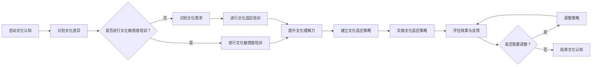
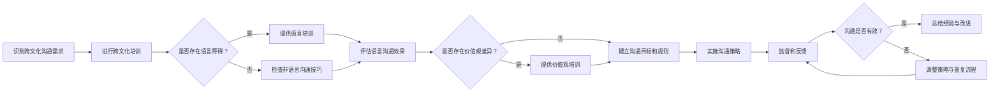
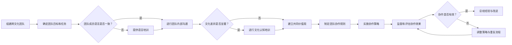
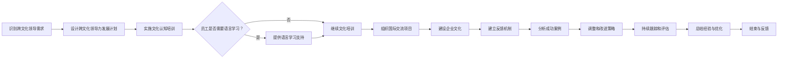

                 

### 1.1.1 全球化背景下的跨文化现象

随着全球化进程的加速，各国之间的经济、政治、文化等领域的交流越来越频繁。全球化使得世界变得更加紧密，企业和个人在全球范围内的互动愈加频繁。这种背景下，跨文化现象日益显著。首先，跨国公司越来越多，它们在全球范围内招聘和调配员工，使得不同文化背景的人在同一组织中工作。其次，全球化的供应链使得不同国家的企业在制造、分销等环节紧密合作。此外，国际旅游、教育和移民等活动也促进了不同文化之间的交流与融合。

跨文化现象不仅体现在企业层面，也渗透到社会生活的方方面面。例如，全球化的媒体传播使得不同文化的娱乐内容在全球范围内流通，影响着人们的价值观和生活方式。同时，互联网的普及使得人们能够更加便捷地获取来自世界各地的信息，进一步加深了跨文化的交流。

跨文化领导力在这种背景下变得尤为重要。领导者在全球化环境中不仅需要具备管理能力和业务技能，还必须具备跨文化沟通和协调的能力。有效的跨文化领导力能够帮助组织更好地应对全球化带来的挑战，提升组织的竞争力。

### 1.1.2 跨文化领导力的需求与挑战

跨文化领导力的需求主要源于全球化背景下日益复杂的国际环境。首先，全球化使得企业越来越依赖于跨文化团队，这些团队在不同国家工作，面临着不同的文化背景和价值观。因此，领导者需要具备理解和尊重不同文化的能力，以便有效地管理这些团队。

其次，跨文化领导力在解决国际商务合作中的沟通障碍方面起着关键作用。不同文化背景的人可能在沟通方式、语言习惯、决策风格等方面存在差异，这些差异可能导致误解和冲突。有效的跨文化领导力能够帮助领导者识别并解决这些障碍，促进有效的沟通和协作。

然而，跨文化领导力也面临着诸多挑战。首先，文化差异可能导致信任问题。不同文化背景下的人可能对信任的理解和期望不同，这可能会影响团队内部的信任关系。其次，文化冲突是一个常见的挑战。当来自不同文化背景的员工在同一组织中工作时，可能会因为价值观、行为规范等方面的差异而产生冲突。此外，跨文化领导力还面临着跨文化管理经验和知识不足的挑战。领导者需要不断学习和适应不同文化的特点，这需要时间和经验的积累。

总之，跨文化领导力的需求与挑战并存。领导者需要不断努力提升自己的跨文化能力，以应对全球化环境下的各种挑战。

### 1.2 跨文化领导力的定义与核心要素

跨文化领导力是指在全球化背景下，领导者通过理解和尊重不同文化的差异，有效地管理多元文化团队，实现组织目标的能力。跨文化领导力不仅包括技术层面的管理技能，更涉及到对文化差异的深刻认知和适应性。

首先，文化认知是跨文化领导力的核心要素之一。文化认知指的是领导者对文化差异的理解和认知能力，包括对文化价值观、行为习惯、语言沟通等方面的认识。领导者需要具备敏锐的文化感知能力，能够识别和尊重不同文化背景的员工，从而建立良好的信任关系。

其次，沟通策略是跨文化领导力的关键要素。跨文化沟通不仅涉及语言的表达，还包括非语言的沟通方式。有效的跨文化沟通策略能够帮助领导者克服文化差异带来的沟通障碍，促进团队内部的协作和沟通。例如，领导者可以采用开放式的沟通方式，鼓励团队成员分享观点和意见，同时注重倾听和理解对方的立场。

最后，团队协作也是跨文化领导力的重要组成部分。跨文化团队协作要求领导者不仅要具备跨文化沟通的能力，还要能够激发团队成员的潜力，实现团队的目标。这需要领导者具备团队建设和管理的技能，能够调动不同文化背景的员工的积极性，形成协同合作的工作氛围。

总之，跨文化领导力是一个多维度的概念，包括文化认知、沟通策略和团队协作等多个核心要素。领导者需要在这些方面不断提升自己，以应对全球化环境下的各种挑战。

#### 1.2.1 跨文化领导力的定义

跨文化领导力可以被定义为领导者在全球化和多元文化环境中，通过理解和尊重不同文化差异，有效地管理多元文化团队，实现组织目标的能力。它不仅涉及技术层面的管理技能，更强调对文化差异的深刻认知和适应性。

首先，跨文化领导力不仅仅是简单的文化敏感性，而是一种深层次的文化理解。领导者需要具备对各种文化背景的深刻洞察，能够识别和尊重不同文化背景下员工的行为模式、价值观和沟通风格。这种理解能力是跨文化领导力的基础，也是实现有效管理的关键。

其次，跨文化领导力强调适应性。全球化环境中，文化差异是不可避免的，领导者需要具备灵活性和适应性，能够根据不同的文化背景调整管理策略。例如，在高度集体主义文化背景下，领导者可能需要更加关注团队的协作和集体目标，而在高度个人主义文化背景下，领导者可能需要更加注重个体的成就和自我实现。

最后，跨文化领导力还涉及到跨文化沟通技巧。有效的沟通是团队协作和冲突解决的重要手段。领导者需要掌握跨文化沟通的技巧，包括语言和非语言的沟通方式，能够建立和维护良好的跨文化关系。例如，通过使用明确的语言表达、尊重对方的隐私和文化习惯，以及采用开放式沟通策略，领导者可以减少误解和冲突，增强团队的凝聚力和协作效率。

总之，跨文化领导力是一种综合性的领导能力，它要求领导者具备文化理解、适应性和有效的沟通技巧，能够在全球化和多元文化环境中，有效地管理团队，实现组织的战略目标。

#### 1.2.2 核心要素：文化认知、沟通策略、团队协作

跨文化领导力的核心要素主要包括文化认知、沟通策略和团队协作，这些要素相互关联，共同构成了跨文化领导力的基础。

首先，文化认知是跨文化领导力的核心要素之一。文化认知是指领导者对文化差异的理解和认知能力，包括对文化价值观、行为习惯、语言沟通等方面的认识。文化认知使得领导者能够识别和尊重不同文化背景的员工，建立良好的信任关系。例如，领导者需要了解不同文化背景下的礼仪、价值观和工作习惯，避免因文化差异而产生的误解和冲突。通过文化认知，领导者可以更好地理解员工的动机和行为，从而制定更有效的人力资源管理策略。

其次，沟通策略是跨文化领导力的关键要素。有效的跨文化沟通策略能够帮助领导者克服文化差异带来的沟通障碍，促进团队内部的协作和沟通。领导者需要掌握跨文化沟通的技巧，包括语言和非语言的沟通方式。例如，在跨文化团队中，领导者可能需要使用明确的语言表达，避免使用可能产生歧义的词语；同时，领导者还需要尊重不同文化背景下的沟通习惯，如某些文化背景下的员工可能更加注重间接沟通，而另一些文化背景下的员工可能更加注重直接沟通。通过有效的沟通策略，领导者可以减少误解和冲突，增强团队的凝聚力和协作效率。

最后，团队协作也是跨文化领导力的重要组成部分。跨文化团队协作要求领导者不仅要具备跨文化沟通的能力，还要能够激发团队成员的潜力，实现团队的目标。这需要领导者具备团队建设和管理的技能，能够调动不同文化背景的员工的积极性，形成协同合作的工作氛围。例如，领导者可以采用多元化的团队建设活动，促进团队成员之间的相互了解和信任；同时，领导者还需要关注团队内部的沟通和协作机制，确保团队目标的明确性和执行力。

总之，文化认知、沟通策略和团队协作是跨文化领导力的三大核心要素。文化认知帮助领导者理解和尊重不同文化背景的员工，沟通策略帮助领导者克服文化差异带来的沟通障碍，团队协作则帮助领导者实现团队目标。这三大要素相互关联，共同构成了跨文化领导力的基础，使领导者能够在全球化和多元文化环境中，有效地管理团队，实现组织的战略目标。

#### 1.3 跨文化领导力的关键要素对比表格

为了更好地理解跨文化领导力的关键要素，我们可以通过一个对比表格来展示这些要素的具体区别和联系。

| 要素       | 描述                                                     | 对比 |
|------------|----------------------------------------------------------|------|
| 文化认知   | 对不同文化差异的理解和认知能力，包括价值观、行为习惯、语言沟通等方面。 | **核心要素** |
| 沟通策略   | 如何在不同文化背景下进行有效沟通，包括语言和非语言的沟通方式。       | **关键要素** |
| 团队协作   | 如何激发和协调跨文化团队的潜力，实现团队目标。                   | **重要要素** |

通过对比表格，我们可以看出，文化认知是跨文化领导力的核心要素，因为它直接影响领导者对文化差异的理解和认知。有效的沟通策略则是关键要素，因为它决定了领导者如何克服文化差异带来的沟通障碍。团队协作虽然重要，但更多的是一种实现目标的方式，而非跨文化领导力的核心要素。

这些要素之间的联系在于，文化认知为沟通策略和团队协作提供了基础，而沟通策略和团队协作则是在文化认知的基础上，进一步推动组织目标的实现。因此，一个成功的跨文化领导者需要在这些要素之间找到平衡，以应对全球化环境下的各种挑战。

#### 1.3.2 跨文化领导力要素的权重分析

在跨文化领导力中，各要素的重要性不同，需要根据具体情境进行权重分析。通常，文化认知被认为是核心要素，其权重最大，因为它直接决定了领导者对文化差异的理解和认知能力。有效的文化认知能够帮助领导者识别和尊重不同文化背景的员工，建立良好的信任关系，从而为沟通策略和团队协作提供基础。

沟通策略是跨文化领导力的关键要素，其权重次之。有效的沟通策略能够帮助领导者克服文化差异带来的沟通障碍，促进团队内部的协作和沟通。在全球化环境中，沟通策略对于实现组织目标至关重要，因此其权重较高。

团队协作虽然重要，但更多是一种实现目标的方式，其权重相对较低。团队协作要求领导者具备团队建设和管理的技能，能够调动不同文化背景的员工的积极性，形成协同合作的工作氛围。然而，如果没有文化认知和有效的沟通策略作为基础，团队协作可能会面临挑战，因此其权重相对较低。

在实际应用中，跨文化领导力的权重分配会根据组织的特点和需求进行调整。例如，在高度集体主义文化背景下，团队协作可能被视为更为重要的要素，而在高度个人主义文化背景下，文化认知和沟通策略可能更为关键。总之，跨文化领导力的权重分析需要结合具体情境，以实现最优的领导效果。

#### 1.4 跨文化领导力的研究现状与发展趋势

跨文化领导力的研究现状显示，尽管近年来在全球化和多元文化环境中，跨文化领导力的重要性日益凸显，但相关研究仍存在一些不足。首先，大多数研究集中在理论层面，对跨文化领导力的实践应用缺乏深入探讨。其次，研究方法较为单一，主要采用问卷调查和案例研究，缺乏实证研究，使得结论的普适性受到一定限制。此外，跨文化领导力在不同文化背景下的具体表现和影响因素仍需进一步研究。

未来发展趋势方面，跨文化领导力的研究将更加注重实践应用和实证研究。随着大数据和人工智能技术的不断发展，研究者可以利用这些工具，收集和分析跨文化领导力的实际案例，为理论提供更为坚实的实证基础。同时，跨文化领导力研究将更加关注文化多样性的影响，探讨不同文化背景下领导力的适应性和有效性。此外，跨文化领导力的培训和教育将成为研究热点，如何通过培训提升领导者的跨文化能力，将成为学者和实践者共同关注的问题。

总之，跨文化领导力的研究现状和发展趋势表明，这一领域具有广阔的研究前景。未来的研究将更加综合和深入，旨在为全球化环境下的领导实践提供更加有效的理论指导和实践方案。

### 2.1 文化认知的概念与重要性

文化认知是指领导者对文化差异的理解和认知能力，包括对文化价值观、行为习惯、语言沟通等方面的认识。文化认知不仅仅是简单的对文化现象的感知，而是一种深层次的理解和洞察，它使得领导者能够识别和尊重不同文化背景的员工，从而建立良好的信任关系。

文化认知的重要性体现在多个方面。首先，它有助于领导者更好地理解员工的动机和行为。不同文化背景下的员工可能有不同的价值观和行为规范，领导者通过文化认知可以更好地理解这些差异，从而制定更有效的管理策略。例如，在高度集体主义文化背景下，领导者需要更加关注团队的协作和集体目标，而在高度个人主义文化背景下，领导者需要更加注重个体的成就和自我实现。

其次，文化认知能够帮助领导者识别和减少文化冲突。跨文化团队中，文化差异可能导致误解和冲突。领导者通过文化认知，可以提前预测和解决这些问题，避免因文化差异而产生的冲突。例如，了解不同文化背景下的沟通习惯和行为规范，可以减少因沟通方式不同而产生的误解。

最后，文化认知有助于提升跨文化团队的协作效率。通过文化认知，领导者可以更好地调动不同文化背景的员工的积极性，促进团队的协同合作。例如，了解不同文化背景下的员工偏好和激励方式，领导者可以采用更加有效的激励手段，提高团队的士气和协作效率。

总之，文化认知是跨文化领导力的基础，它对于领导者理解员工、减少文化冲突和提升团队协作效率具有重要意义。因此，在全球化环境中，领导者必须高度重视文化认知，不断提升自己的文化认知能力。

#### 2.2 文化差异的类型与表现

文化差异的类型多种多样，主要包括价值观差异、行为习惯差异和语言沟通差异。

首先，价值观差异是文化差异中最显著的一种类型。不同文化背景下，人们的价值观可能存在显著差异。例如，在集体主义文化中，人们更注重团队和集体的利益，而在个人主义文化中，人们更强调个体的自由和独立。这种价值观差异可能导致在决策方式、工作态度和团队目标设定上的冲突。

其次，行为习惯差异也是文化差异的一个重要方面。不同文化背景下，人们的行为习惯可能存在显著差异。例如，在一些文化中，直接和开放的表达方式被认为是一种礼貌和尊重，而在另一些文化中，间接和含蓄的表达方式更为普遍。这些行为习惯的差异可能会影响跨文化团队的沟通效率和协作效果。

最后，语言沟通差异是文化差异中的另一个重要方面。语言不仅是一种交流工具，还承载了文化价值观和行为规范。例如，某些文化背景下的语言表达可能更加直接和明确，而在另一些文化背景下，语言表达可能更加含蓄和间接。这种语言沟通差异可能导致误解和沟通障碍。

这些文化差异在跨文化团队中表现为以下几个方面：首先，团队成员可能在价值观上存在分歧，导致决策和团队目标的设定出现困难。其次，行为习惯的差异可能导致团队成员之间的误解和冲突，影响团队协作效率。最后，语言沟通的差异可能使得团队成员之间的沟通不畅，影响信息的准确传递和共享。

#### 2.3 文化适应策略

文化适应策略是指领导者为应对文化差异，促进跨文化团队的有效合作和沟通所采取的一系列措施。这些策略包括文化敏感度培训、文化适应培训和文化融合措施。

首先，文化敏感度培训是一种重要的文化适应策略。通过文化敏感度培训，领导者可以提高对文化差异的认知和理解，减少因文化差异而产生的误解和冲突。文化敏感度培训通常包括对文化价值观、行为规范和沟通方式的介绍，帮助领导者更好地理解不同文化背景下的员工。

其次，文化适应培训是另一种有效的文化适应策略。文化适应培训旨在提高领导者和管理者的跨文化适应能力，包括如何在不同的文化背景下进行有效的沟通和协作。例如，培训可以涵盖如何在不同文化背景下进行决策、管理冲突和激励员工。

最后，文化融合措施是促进文化适应的重要手段。通过文化融合措施，领导者可以创造一个包容和多元化的工作环境，促进不同文化背景的员工之间的交流和融合。例如，组织可以开展跨文化团队建设活动，促进团队成员之间的相互了解和信任。

总之，文化适应策略对于提升跨文化团队的合作效率具有重要意义。通过文化敏感度培训、文化适应培训和文化融合措施，领导者可以更好地应对文化差异，促进跨文化团队的有效合作。

#### 2.4 文化认知的Mermaid流程图

以下是一个关于文化认知的Mermaid流程图，用于展示文化认知的过程和关键步骤：

该流程图展示了从启动文化认知到评估效果与反馈的整个过程。通过识别文化差异、进行文化敏感度培训和文化适应培训，领导者可以提升对文化差异的理解和认知，建立有效的文化适应策略，并不断调整策略以应对文化挑战。最终，通过评估效果与反馈，确保文化认知的持续改进和优化。

### 第二部分：跨文化沟通

#### 3.1 跨文化沟通的概念与重要性

跨文化沟通是指在全球化背景下，不同文化背景的人或团队之间进行的交流与互动。它不仅包括语言的表达，还涉及非语言沟通方式，如肢体语言、面部表情和空间距离等。跨文化沟通的重要性在于，它直接影响跨文化团队的合作效率、组织目标实现和员工满意度。

首先，跨文化沟通有助于减少误解和冲突。不同文化背景的人在沟通方式、语言表达和行为习惯上可能存在显著差异，这些差异可能导致误解和冲突。有效的跨文化沟通策略可以帮助团队成员理解彼此的立场和意图，避免因误解而产生的冲突。

其次，跨文化沟通有助于促进团队合作和协作。在全球化和多元文化环境中，跨文化团队的合作和协作至关重要。通过有效的跨文化沟通，团队成员可以更好地理解彼此的需求和期望，形成协同合作的工作氛围，提高团队的协作效率。

最后，跨文化沟通对于提升员工的满意度和组织绩效具有重要作用。当员工感受到领导者和组织重视跨文化沟通，并为其提供必要的支持和培训时，员工的满意度和忠诚度会显著提高。同时，有效的跨文化沟通也有助于提高组织的创新能力，因为团队成员能够从不同的文化背景中获得新的视角和思路。

总之，跨文化沟通在全球化环境中具有重要的意义，它不仅有助于减少误解和冲突，促进团队合作和协作，还能提升员工的满意度和组织绩效。领导者需要高度重视跨文化沟通，不断提升自己的跨文化沟通能力，以应对全球化带来的挑战。

#### 3.2 跨文化沟通的障碍与解决策略

跨文化沟通中存在的障碍主要包括语言障碍、非语言沟通障碍、价值观差异和权力距离等。首先，语言障碍是跨文化沟通中最常见的障碍。不同语言之间的词汇、语法和表达方式可能存在显著差异，这可能导致误解和沟通不畅。例如，在某些语言中，一种表达方式可能被认为是一种礼貌的询问，而在另一种语言中则可能被视为直接的命令。

其次，非语言沟通障碍包括肢体语言、面部表情和空间距离等方面的差异。不同文化背景下的人可能在非语言沟通方式上存在显著差异。例如，在某些文化中，直接的目光接触被认为是一种尊重和信任的表示，而在另一些文化中，则可能被视为侵犯隐私。

价值观差异也是跨文化沟通中的重要障碍。不同文化背景下的人可能对工作、生活和社会的价值观有不同的理解。例如，在某些文化中，重视个人成就和竞争，而在另一些文化中，则更注重团队协作和集体利益。

权力距离也是跨文化沟通中的一个关键障碍。不同文化背景下的人对权力和地位的看法可能存在显著差异。例如，在一些文化中，领导者的权威和决策权可能更为集中，而在另一些文化中，则可能更强调民主和参与式决策。

为了解决这些障碍，可以采取以下策略：

首先，提供跨文化沟通培训。通过培训，员工可以学习到不同文化的沟通习惯和价值观，提高对文化差异的认知和理解，减少误解和冲突。

其次，建立明确的沟通目标和规则。在跨文化团队中，明确沟通的目标和规则有助于确保信息的准确传递和共享。例如，可以制定一套统一的沟通标准和流程，确保团队成员之间的沟通畅通。

第三，注重非语言沟通的练习。通过模拟和练习，员工可以更好地掌握不同文化背景下的非语言沟通技巧，减少因非语言差异而产生的误解。

最后，建立信任和尊重的文化。领导者可以通过鼓励开放和诚实的沟通，建立团队成员之间的信任和尊重。这有助于营造一个包容和多元化的工作环境，促进跨文化团队的有效合作。

总之，跨文化沟通中存在的障碍是复杂的，但通过有效的策略和措施，可以克服这些障碍，提高跨文化沟通的效率和质量。

### 3.3 跨文化沟通的Mermaid流程图

以下是一个关于跨文化沟通的Mermaid流程图，用于展示跨文化沟通的过程和关键步骤：

该流程图展示了从识别跨文化沟通需求到监督和反馈的整个过程。通过进行跨文化培训、提供语言和非语言沟通技巧、建立沟通目标和规则，以及实施和监督沟通策略，领导者可以有效地克服跨文化沟通中的障碍，提高团队合作的效率和质量。

#### 3.4 跨文化沟通案例分析

为了更好地理解跨文化沟通在实际中的应用，我们来看两个案例分析。

案例一：跨国公司的跨文化沟通挑战

某跨国公司在全球范围内设有多个分支机构，员工来自不同的文化背景。在一次跨国项目合作中，该公司发现不同地区的团队在沟通上存在显著差异。例如，某些地区的团队成员更倾向于直接表达意见，而另一些地区的团队成员则更喜欢间接和含蓄的表达方式。这种沟通差异导致了项目进展缓慢，团队内部出现了误解和冲突。

解决方案：公司采取了跨文化沟通培训，帮助员工了解不同文化背景下的沟通习惯和价值观。同时，公司制定了统一的沟通目标和规则，确保信息的准确传递和共享。通过这些措施，团队内部的沟通效率得到了显著提高，项目进展顺利。

案例二：国际项目中的跨文化沟通策略

某国际项目团队由来自五个不同国家的成员组成，他们在文化、语言和沟通方式上存在显著差异。项目初期，由于沟通不畅，团队内部出现了多次误解和冲突。项目领导者意识到问题的严重性，并采取了以下策略：

1. **文化认知培训**：项目领导者组织了文化认知培训，帮助团队成员了解彼此的文化背景和沟通习惯。
2. **建立沟通小组**：为了确保沟通的畅通，项目领导者建立了专门的沟通小组，负责协调和监督项目沟通。
3. **使用多种沟通工具**：项目领导者鼓励团队成员使用多种沟通工具，如邮件、电话会议和即时通讯工具，以确保信息的及时传递和共享。

通过这些策略，项目团队克服了文化差异带来的沟通障碍，项目进展顺利，最终取得了成功。

总之，跨文化沟通在实际应用中面临诸多挑战，但通过有效的培训和策略，可以克服这些障碍，提高团队合作的效率和质量。

### 4.1 跨文化团队协作的概念与重要性

跨文化团队协作是指在全球化背景下，由来自不同文化背景的成员组成的团队，在共同目标和任务驱动下，通过有效的沟通和协作，共同完成工作目标的过程。跨文化团队协作不仅涉及团队内部成员之间的互动，还包括与外部合作伙伴的协作。

跨文化团队协作的重要性体现在以下几个方面：

首先，跨文化团队协作能够充分利用不同文化背景成员的优势和专长。在全球化和多元化环境中，团队成员来自不同的国家，他们拥有各自的文化背景、知识结构和技能。通过有效的协作，这些多样化的资源和能力可以相互补充，形成强大的团队合力。

其次，跨文化团队协作有助于提升组织的创新能力。不同文化背景的团队成员在面对问题时，往往能从不同的角度思考，提出创新的解决方案。这种多元化的思维碰撞有助于激发团队的创造力，推动组织的创新和发展。

第三，跨文化团队协作有助于提高团队的凝聚力和归属感。通过共同的目标和任务，团队成员在协作过程中建立了深厚的信任和合作关系。这种信任和合作不仅增强了团队的凝聚力，也提高了成员的归属感和工作满意度。

最后，跨文化团队协作是应对全球化挑战的有效手段。在全球化和多元文化环境中，企业需要具备快速适应和响应市场变化的能力。跨文化团队协作可以帮助企业更好地理解和适应不同市场的文化特点，提升企业的市场竞争力。

总之，跨文化团队协作在全球化背景下具有至关重要的意义。通过有效的跨文化团队协作，企业可以充分利用多元化的资源，提高创新能力和团队凝聚力，从而更好地应对全球化带来的各种挑战。

#### 4.2 跨文化团队协作的挑战与应对策略

跨文化团队协作虽然具有许多优势，但同时也面临着诸多挑战。首先，语言障碍是一个显著的挑战。团队成员来自不同的国家，他们可能使用不同的语言，导致沟通不畅和误解。为了解决这一问题，团队可以采取以下策略：一是为团队成员提供语言培训，帮助他们掌握工作所需的语言技能；二是采用通用的工作语言，例如英语，作为团队内部的主要沟通语言；三是使用翻译工具和技术，确保信息的准确传递。

其次，文化差异也是跨文化团队协作的一个重要挑战。不同文化背景的团队成员可能在价值观、行为规范和沟通方式上存在显著差异。这可能导致团队成员之间的误解和冲突。为了应对这一挑战，团队可以采取以下策略：一是进行文化认知培训，帮助团队成员了解彼此的文化背景和价值观；二是建立共同的团队目标和价值观，以确保团队成员在行为上的一致性；三是鼓励团队成员开放和诚实地表达自己的观点和意见，建立相互尊重和理解的文化。

另外，权力和地位的差异也可能成为跨文化团队协作的障碍。在多元文化团队中，不同成员可能来自不同的层级和背景，他们对权力的看法和期望可能不同。为了解决这一问题，团队可以采取以下策略：一是明确团队成员的职责和权限，确保团队成员在权力分配上的公平性；二是建立开放的沟通渠道，鼓励团队成员就权力和决策问题进行讨论和协商；三是设立跨文化团队领导，负责协调和解决团队内部的权力冲突。

总之，跨文化团队协作面临着语言障碍、文化差异和权力差异等多重挑战。通过采取有效的应对策略，团队可以克服这些障碍，提高协作效率，实现共同目标。

### 4.3 跨文化团队协作的Mermaid流程图

以下是一个关于跨文化团队协作的Mermaid流程图，用于展示跨文化团队协作的过程和关键步骤：

该流程图展示了从组建跨文化团队到监督和评估协作效果的整个过程。通过确定团队目标和任务、提供语言和文化培训、制定协作规则和实施协作策略，团队可以有效地克服文化差异和语言障碍，提高协作效率和质量。通过监督和评估协作效果，团队可以不断优化协作策略，实现共同目标。

### 第三部分：跨文化领导力实践

#### 5.1 跨文化领导力实践概述

跨文化领导力实践是指在实际工作环境中，领导者通过一系列具体行动和策略，有效管理多元文化团队，实现组织目标的过程。这种实践不仅涉及对文化差异的认知和理解，还包括具体的管理技巧和领导方法。跨文化领导力实践的重要性在于，它能够帮助组织更好地适应全球化环境，提升团队协作效率，增强组织竞争力。

首先，跨文化领导力实践有助于提升团队凝聚力。通过理解并尊重不同文化背景的员工，领导者可以建立良好的信任关系，减少文化冲突，增强团队成员之间的互信和合作意愿。

其次，跨文化领导力实践能够促进创新和多元化思维。跨文化团队的成员来自不同的背景，拥有不同的知识结构和思维方式。领导者通过鼓励开放和诚实的沟通，可以激发团队的创造力，推动组织创新。

最后，跨文化领导力实践有助于提升组织绩效。通过有效管理多元文化团队，领导者可以确保信息流畅传递，提高决策效率，确保组织战略的顺利实施。

总之，跨文化领导力实践是全球化背景下组织成功的关键。领导者需要不断探索和实践，以提高跨文化管理能力，实现组织的长期发展。

#### 5.2 跨文化领导力实践的案例分析

跨文化领导力实践在全球化和多元文化组织中具有重要的实际意义。以下是两个跨国公司的成功案例分析。

案例一：跨国科技公司的文化融合

某跨国科技公司在其全球业务扩展过程中，面临着文化差异带来的管理挑战。公司采用了以下策略来促进文化融合：

1. **设立跨文化团队领导**：公司任命了具有丰富跨文化管理经验的领导，负责协调和管理不同文化背景的团队成员，确保文化差异不会影响团队的协作效率。

2. **文化认知培训**：公司为员工提供了定期的文化认知培训，帮助员工了解彼此的文化背景和价值观，减少误解和冲突。

3. **建立统一的沟通平台**：公司建立了统一的沟通平台，鼓励团队成员使用英语进行交流，确保信息的准确传递和共享。

通过这些措施，公司成功地促进了不同文化背景员工之间的融合，团队协作效率显著提升，组织绩效得到了改善。

案例二：国际金融机构的多元文化管理

某国际金融机构在全球化进程中，注重多元文化管理，通过以下策略提升了跨文化领导力：

1. **本地化管理**：公司根据不同国家和地区的文化特点，制定了本地化管理策略，确保管理方法符合当地文化习惯。

2. **跨文化团队建设**：公司组织了跨文化团队建设活动，如团队拓展训练和跨文化研讨会，增强团队成员之间的信任和合作。

3. **多元文化培训**：公司定期开展多元文化培训，帮助员工了解和尊重不同文化，提升跨文化沟通能力。

这些策略有效地促进了不同文化背景员工之间的协作，提高了团队的凝聚力和创新力，公司在全球市场中的竞争力得到了显著提升。

总之，通过具体案例可以看出，跨文化领导力实践在全球化组织中具有显著的实际效果。有效的跨文化领导力不仅有助于减少文化冲突，提升团队协作效率，还能增强组织的整体竞争力。

#### 5.3 跨文化领导力实践的策略与技巧

在全球化环境中，跨文化领导力实践的策略与技巧至关重要。以下是一些具体策略与技巧，可以帮助领导者提升跨文化管理能力：

1. **文化敏感性培训**：领导者需要首先提升自身的文化敏感性，通过文化认知培训，了解不同文化的价值观、行为习惯和沟通方式。这有助于领导者更好地理解和尊重不同文化背景的员工。

2. **建立多元文化团队**：领导者应鼓励多元化团队的组建，通过多元化的团队成员组合，激发创新思维和多元化视角，提升团队的整体竞争力。

3. **明确沟通规则**：制定明确的沟通规则和流程，确保信息的准确传递和共享。例如，使用统一的沟通语言，建立畅通的沟通渠道，确保团队成员之间的信息交流畅通无阻。

4. **促进文化融合**：通过组织跨文化团队建设活动，如团队拓展训练、文化研讨会和分享会，增强团队成员之间的信任和合作，促进文化的融合。

5. **提供跨文化支持**：为员工提供必要的跨文化支持，如语言培训、文化适应辅导和心理辅导，帮助员工更好地适应新的文化环境。

6. **鼓励开放沟通**：领导者应鼓励团队成员开放和诚实地表达自己的观点和意见，建立相互尊重和理解的文化氛围，减少误解和冲突。

7. **定期评估与反馈**：领导者应定期评估跨文化管理的效果，通过反馈机制，发现和解决文化差异带来的问题，不断优化跨文化管理策略。

通过这些策略与技巧，领导者可以提升跨文化领导力，有效管理多元文化团队，实现组织目标。

### 6.1 跨文化领导力提升的重要性

跨文化领导力提升在全球化背景下具有重要意义。首先，它有助于企业更好地适应和应对全球市场变化。随着全球化进程的加速，企业需要具备更强的跨文化管理能力，以应对不同文化背景的客户和合作伙伴。跨文化领导力提升可以帮助企业领导者更好地理解和尊重不同文化的价值观和行为规范，从而在全球化市场中取得成功。

其次，跨文化领导力提升有助于提升企业的创新能力。跨文化团队往往拥有多元化的知识和技能，通过提升跨文化领导力，领导者可以激发团队成员的创造力，推动组织创新。多元化的视角和思维碰撞有助于提出创新的解决方案，提升企业的竞争力。

最后，跨文化领导力提升有助于提升员工的满意度和忠诚度。当企业注重跨文化领导力提升，并为员工提供跨文化培训和辅导时，员工会感受到企业对他们的关注和支持，从而提高工作满意度和忠诚度。这有助于减少员工流失，提升企业的整体人力资源质量。

总之，跨文化领导力提升对于企业适应全球化环境、提升创新能力和员工满意度具有重要意义，是企业实现长期发展的关键。

#### 6.2 跨文化领导力提升的方法与工具

提升跨文化领导力需要结合多种方法和工具，以下是一些有效的策略：

1. **跨文化培训**：通过定期的文化认知培训，帮助领导者了解不同文化的价值观、行为习惯和沟通方式。培训可以包括文化敏感性训练、跨文化沟通技巧和文化适应性训练等。有效的培训能够提高领导者的文化认知和适应能力，减少误解和冲突。

2. **语言学习**：语言是跨文化沟通的重要工具。领导者应鼓励并支持团队成员学习新的语言，特别是工作中常用的语言，如英语。语言学习不仅有助于提高沟通效率，还能增强领导者对文化差异的理解和感知。

3. **国际交流项目**：组织国际交流项目，如海外培训、国际会议和交换项目，让领导者亲身体验不同文化的环境。这种实地体验有助于领导者更深入地了解和适应不同文化，提升跨文化管理能力。

4. **文化建设**：在企业内部建立包容和多元文化的组织文化，鼓励员工之间的相互尊重和理解。通过组织跨文化团队建设活动和庆祝不同文化的节日，增强团队的凝聚力和跨文化意识。

5. **反馈机制**：建立有效的反馈机制，定期收集团队成员关于跨文化管理实践的反馈。这有助于领导者及时了解跨文化管理中的问题和挑战，进行针对性的改进。

6. **案例分析**：通过研究成功的跨文化管理案例，领导者可以学习借鉴其他企业的经验和教训。案例分析可以帮助领导者理解跨文化管理中的关键成功因素和最佳实践。

7. **领导力发展计划**：为领导者制定个性化的领导力发展计划，包括跨文化领导力培训、领导力发展研讨会和导师辅导等。这种系统性的领导力发展计划有助于提升领导者的整体领导能力和跨文化管理技能。

通过这些方法和工具，企业可以有效地提升跨文化领导力，增强在全球市场中的竞争力。

### 6.3 跨文化领导力提升的Mermaid流程图

以下是一个关于跨文化领导力提升的Mermaid流程图，用于展示提升跨文化领导力的过程和关键步骤：

该流程图展示了从识别跨文化领导需求到总结经验与优化的整个过程。通过设计跨文化领导力发展计划、实施文化认知培训、提供语言学习支持、组织国际交流项目、建设企业文化、建立反馈机制和调整策略，领导者可以系统地提升跨文化领导力，确保组织在全球化环境中取得成功。

### 第7章 结论与展望

#### 7.1 跨文化领导力的总结

跨文化领导力是全球化背景下不可或缺的领导能力，它不仅涉及对文化差异的深刻理解，还要求领导者具备有效的沟通策略和团队协作技能。通过文化认知、沟通策略和团队协作，领导者可以克服文化差异带来的障碍，提升团队协作效率，实现组织目标。

首先，文化认知是跨文化领导力的基础。领导者需要深入了解不同文化的价值观、行为习惯和沟通方式，以便更好地理解和尊重团队成员。其次，沟通策略在跨文化团队中尤为重要。领导者需要掌握跨文化沟通技巧，确保信息的准确传递和共享，减少误解和冲突。最后，团队协作是跨文化领导力的关键。通过建立协同合作的工作氛围，激发团队成员的潜力，实现团队目标。

总之，跨文化领导力不仅有助于提升组织在全球化环境中的竞争力，还能促进团队成员之间的信任和合作，为组织的长期发展奠定坚实基础。

#### 7.2 跨文化领导力的发展趋势

跨文化领导力的发展趋势表明，这一领域将继续在全球化和多元化背景下扮演关键角色。首先，随着全球化进程的加速，跨国公司和多元文化团队的增多，跨文化领导力需求将持续上升。企业和组织将更加重视培养领导者的跨文化能力，以应对全球化带来的挑战。

其次，技术的进步，特别是人工智能和大数据的应用，将为跨文化领导力研究提供新的工具和方法。通过数据分析，研究者可以更精确地了解文化差异，制定个性化的跨文化管理策略。同时，虚拟现实和增强现实技术的应用，将使领导者能够模拟和体验不同文化环境，提升跨文化管理能力。

最后，跨文化领导力研究将更加关注文化多样性的影响。随着全球范围内的文化融合，领导者需要具备处理多元文化团队的能力，实现文化间的和谐与合作。这将为跨文化领导力研究带来新的机遇和挑战。

#### 7.3 跨文化领导力研究的未来方向

跨文化领导力研究的未来方向主要包括以下几个方面：

首先，加强实证研究。未来的研究应更多地依赖于实证数据，通过问卷调查、访谈和实验等方法，深入研究跨文化领导力的具体影响和作用机制。这将有助于提高研究结果的可靠性和普适性。

其次，探索跨学科研究。跨文化领导力涉及多个学科领域，如管理学、心理学、社会学和语言学等。未来的研究可以借鉴不同学科的理论和方法，形成更加综合和深入的研究框架，为跨文化领导力提供更全面的解释和指导。

第三，关注新兴文化现象。随着全球化的深入，新的文化现象和趋势不断涌现。未来研究应关注这些新兴文化现象，如数字文化、网络文化和青年文化等，探讨其对跨文化领导力的影响，为跨文化管理提供新的视角和思路。

最后，注重实践应用。跨文化领导力研究应更加注重实践应用，将研究成果转化为可操作的管理策略和工具，帮助领导者在实际工作中应对跨文化挑战。同时，通过实践反馈，不断优化和完善跨文化领导力理论，推动跨文化领导力研究的持续发展。

总之，跨文化领导力研究的未来方向将更加注重实证研究、跨学科探索和实际应用，为全球化背景下的组织管理提供有力支持。

### 8.1 跨文化领导力的数学模型

在跨文化领导力研究中，数学模型能够帮助我们定量分析文化差异及其对领导效能的影响。以下是一些常用的数学模型和方法。

#### 8.1.1 文化差异度量模型

一种常用的度量文化差异的方法是基于文化特征的多维度分析。假设有 n 个文化特征，每个文化特征 C_i 在不同文化群体中的表现可以表示为 C_{ij}，其中 i 表示文化特征，j 表示文化群体。我们可以使用以下模型来度量文化差异：

$$
D = \sum_{i=1}^{n} (C_{i1} - C_{i2})^2
$$

其中，D 表示总的文化差异度，C_{i1} 和 C_{i2} 分别代表两个不同文化群体在某一特征上的表现。这个模型通过计算每个文化特征上的差异平方和来综合衡量不同文化群体之间的文化差异。

#### 8.1.2 跨文化领导效能模型

跨文化领导效能（E）可以通过文化认知（CL）、沟通策略（CM）和团队协作（TC）三个主要因素来衡量。我们可以构建以下综合模型：

$$
E = \alpha \cdot CL + \beta \cdot CM + \gamma \cdot TC
$$

其中，E 表示跨文化领导效能，α、β 和 γ 分别表示文化认知、沟通策略和团队协作对领导效能的影响权重。这些权重可以通过数据分析和实证研究来确定。

例如，如果通过实证分析发现文化认知对领导效能的影响最大，权重 α 可以设为0.5，沟通策略和团队协作的权重分别为0.3和0.2，那么模型可以表示为：

$$
E = 0.5 \cdot CL + 0.3 \cdot CM + 0.2 \cdot TC
$$

#### 8.1.3 文化适应度模型

文化适应度（A）是衡量领导者适应不同文化环境的能力。我们可以使用以下模型来衡量文化适应度：

$$
A = \frac{1}{n} \sum_{i=1}^{n} \frac{C_{i}}{C_{max}}
$$

其中，A 表示文化适应度，C_i 表示领导者对第 i 个文化特征的适应度，C_{max} 表示该文化特征的最大适应度。通过计算各个文化特征的适应度平均值，我们可以得到领导者的总体文化适应度。

#### 8.1.4 模型应用举例

假设我们有两个文化群体 A 和 B，每个文化群体在三个特征（价值观、沟通方式、工作习惯）上有不同的表现。我们使用上述模型来分析这两个文化群体之间的差异和领导效能。

首先，计算文化差异度 D：

$$
D = (V_{A1} - V_{B1})^2 + (C_{A2} - C_{B2})^2 + (H_{A3} - H_{B3})^2
$$

假设 V_{A1} = 5，V_{B1} = 3；C_{A2} = 4，C_{B2} = 2；H_{A3} = 6，H_{B3} = 1，那么：

$$
D = (5 - 3)^2 + (4 - 2)^2 + (6 - 1)^2 = 4 + 4 + 25 = 33
$$

接下来，计算跨文化领导效能 E：

$$
E = 0.5 \cdot CL + 0.3 \cdot CM + 0.2 \cdot TC
$$

假设 CL = 0.8，CM = 0.7，TC = 0.9，那么：

$$
E = 0.5 \cdot 0.8 + 0.3 \cdot 0.7 + 0.2 \cdot 0.9 = 0.4 + 0.21 + 0.18 = 0.79
$$

最后，计算文化适应度 A：

$$
A = \frac{1}{3} \sum_{i=1}^{3} \frac{C_{i}}{C_{max}}
$$

假设 C_{max} = 10，那么：

$$
A = \frac{1}{3} \left( \frac{5}{10} + \frac{4}{10} + \frac{6}{10} \right) = \frac{1}{3} \cdot 1.5 = 0.5
$$

通过这些计算，我们可以得到两个文化群体之间的文化差异度、跨文化领导效能和文化适应度，从而为跨文化管理提供量化依据。

总之，这些数学模型为我们提供了分析和衡量跨文化领导力的工具，有助于领导者更好地理解和应对文化差异，提升领导效能。

### 8.2 跨文化领导力在其他领域的应用

跨文化领导力不仅在企业管理和国际商务中具有重要应用，还在教育、医疗、国际关系等多个领域发挥着重要作用。

首先，在教育领域，跨文化领导力有助于构建多元文化校园。教育机构通过培养具有跨文化领导力的教师和管理者，能够更好地管理多元文化学生群体，促进文化融合和交流。例如，美国的一些大学通过设立跨文化领导力课程和项目，帮助学生们提高跨文化沟通能力，增强他们的国际视野。

其次，在医疗领域，跨文化领导力对于医疗服务质量和患者满意度至关重要。医疗团队中的跨文化领导者需要理解患者的文化背景和医疗需求，提供更加个性化和尊重患者的医疗服务。例如，在美国的医疗体系中，许多医院为非英语患者提供翻译服务，并培训医护人员掌握基本的跨文化沟通技巧，以提高医疗服务质量。

最后，在国际关系领域，跨文化领导力有助于促进国际合作和解决国际冲突。外交官和跨国组织的领导者需要具备跨文化沟通和协调能力，以应对不同国家之间的文化差异和利益冲突。例如，联合国和其他国际组织通过组织跨文化领导力培训项目，提升外交官和国际事务专家的跨文化管理能力，以推动全球治理和国际和平。

总之，跨文化领导力在多个领域的应用不仅提升了组织的管理水平，还有助于促进不同文化之间的理解和合作，为全球化和多元化社会的发展提供支持。通过跨文化领导力的实践，组织和个人能够更好地适应全球化环境，实现可持续发展。

