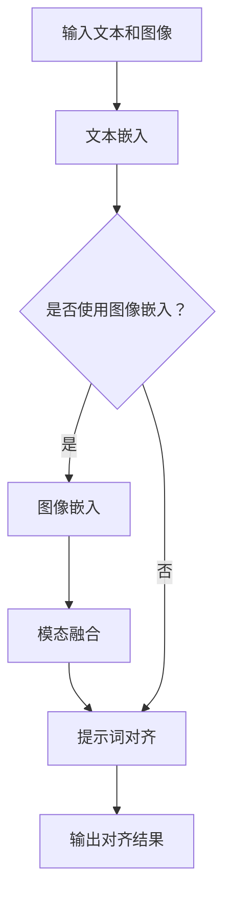
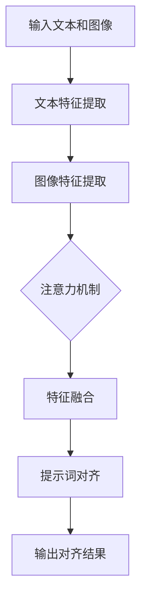
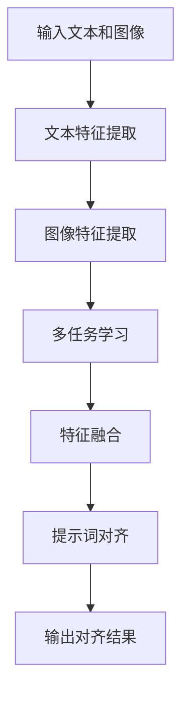
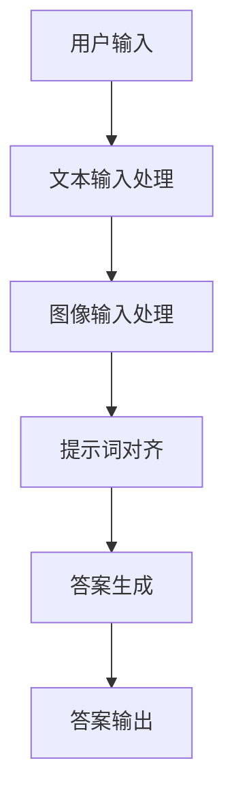
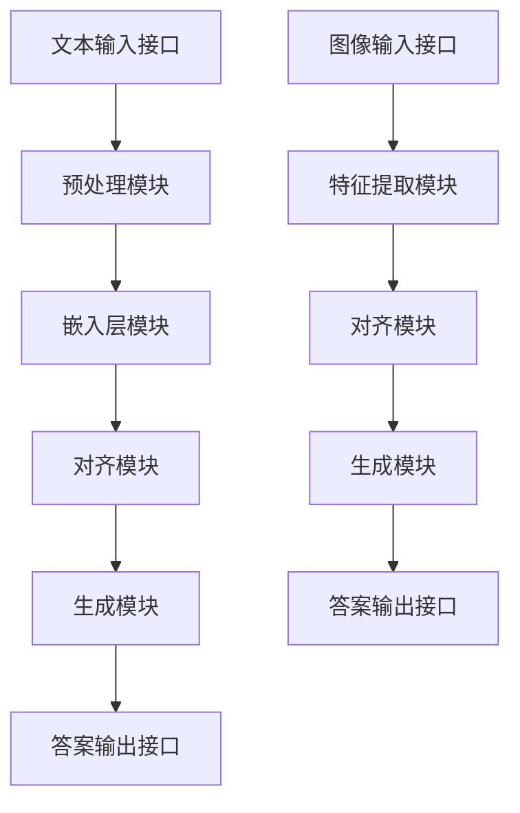
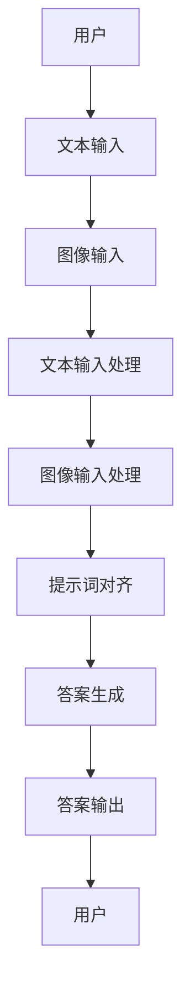

                 

# 跨模态AI的提示词对齐技术

> 关键词：跨模态AI，提示词对齐，多模态信息融合，自然语言处理，计算机视觉，算法原理

> 摘要：本文系统地介绍了跨模态AI的提示词对齐技术，包括其理论基础、算法原理、实现方法以及应用场景。通过对跨模态AI和提示词对齐技术的深入探讨，本文旨在帮助读者全面了解该技术，掌握相关算法原理和实现方法，为跨模态AI系统的开发提供有力支持。

## 研究背景与目的

### 研究背景

随着人工智能技术的迅猛发展，跨模态AI技术逐渐成为研究的热点。跨模态AI旨在将不同类型的数据（如文本、图像、声音等）进行有效融合，实现多模态信息的统一理解和处理。近年来，跨模态AI在自然语言处理、计算机视觉、语音识别等领域取得了显著的成果，被广泛应用于信息检索、内容推荐、智能助手等领域。

然而，跨模淀AI的研究仍面临诸多挑战。其中，提示词对齐技术是跨模态AI研究中的一个关键问题。提示词对齐是指在不同模态的数据中找到对应的语义信息，从而实现模态之间的语义一致性。有效的提示词对齐技术对于提升跨模态AI系统的性能具有重要意义。

### 研究目的

本书旨在系统地介绍跨模态AI的提示词对齐技术，包括其理论基础、算法原理、实现方法以及应用场景。具体目标如下：

1. **全面概述**：对跨模淀AI和提示词对齐技术进行全面的背景介绍，阐述其重要性及在跨模淀AI系统中的关键作用。
2. **核心概念**：详细讲解跨模淀AI的基础理论，包括不同模态的数据特点、模态融合的方法和提示词对齐的基本原理。
3. **算法原理**：介绍经典的和先进的提示词对齐算法，分析其数学模型、算法流程和优缺点，并通过Mermaid流程图进行可视化展示。
4. **应用实践**：通过实际案例展示提示词对齐技术的应用，包括数据预处理、算法实现和性能评估等方面。
5. **最佳实践**：总结跨模淀AI提示词对齐技术的最佳实践，提供实用的技巧和注意事项，帮助读者在实际应用中取得更好的效果。

通过本书的研读，读者将能够全面了解跨模淀AI的提示词对齐技术，掌握相关算法原理和实现方法，从而为跨模淀AI系统的开发提供有力支持。

---

## 跨模淀AI的基础理论

### 跨模淀AI的定义

跨模淀AI（Cross-modal AI）是指能够处理和整合不同类型数据的人工智能系统。这些数据可以是文本、图像、声音、视频等。跨模淀AI的核心目标是通过理解不同模态之间的内在联系，实现对复杂信息的统一理解和处理。

### 跨模淀AI的研究意义

跨模淀AI在多个领域展现出了重要的研究意义。例如：

- **自然语言处理（NLP）**：跨模淀AI可以帮助NLP系统更好地理解和处理与图像、声音相关的文本信息，如视觉描述生成、语音情感分析等。
- **计算机视觉**：跨模淀AI可以结合文本信息，提升计算机视觉系统的识别和分类能力，例如在图像标签生成和视觉问答中发挥作用。
- **语音识别与生成**：跨模淀AI能够结合文本和语音信息，提高语音识别的准确性，同时生成更自然的语音合成。

### 跨模淀AI的关键技术

跨模淀AI的核心技术包括数据采集与预处理、特征提取与融合、模型训练与优化等。

- **数据采集与预处理**：跨模淀AI需要从多个数据源获取信息，如文本、图像和音频数据。这些数据通常需要进行预处理，包括数据清洗、标注、数据增强等，以提高数据质量和模型的泛化能力。
- **特征提取与融合**：特征提取是指从不同模态的数据中提取出具有区分度的特征表示。特征融合是将不同模态的特征进行整合，以形成统一的多模态特征表示。常用的方法包括基于深度学习的方法和基于传统机器学习的方法。
- **模型训练与优化**：通过训练多模态的深度神经网络，可以使模型具备处理和整合多模态数据的能力。优化过程包括参数调整、超参数选择和模型结构改进，以提升模型性能。

### 跨模淀AI的发展趋势

随着深度学习、自然语言处理和计算机视觉等领域的发展，跨模淀AI技术也在不断演进。以下是一些当前的发展趋势：

- **多模态深度学习**：深度学习在跨模淀AI中的应用越来越广泛，多模态深度网络如CNN、RNN、Transformer等，能够更好地捕捉不同模态之间的复杂关系。
- **自监督学习**：自监督学习方法在跨模淀AI中的应用逐渐增多，通过无监督方式训练模型，可以降低数据标注的成本，提高模型的泛化能力。
- **联邦学习**：联邦学习是一种在多个设备或服务器上共享数据但保持数据隐私的分布式学习方法。它在跨模淀AI中的应用可以促进大规模数据的整合和模型优化。
- **跨模淀生成模型**：如GAN（生成对抗网络）和VQ-VAE（变分自编码器）等生成模型在跨模淀AI中的应用，可以帮助生成高质量的多模态数据，提高模型的训练效果。

通过这些技术的发展，跨模淀AI在未来有望在更多应用场景中发挥重要作用，为人工智能的发展注入新的活力。

---

## 提示词对齐的概念与重要性

### 提示词对齐的定义

提示词对齐（Prompt Alignment）是指在不同模态的数据中寻找对应的语义信息，使得各模态能够统一理解和处理。具体来说，提示词对齐的目标是在文本、图像、声音等不同模态的数据中找到对应的语义信息，使得这些信息能够在模型中保持一致，从而实现跨模态信息的统一理解和处理。

### 提示词对齐的重要性

提示词对齐技术在跨模淀AI系统中具有至关重要的意义：

1. **提升模型性能**：通过有效的提示词对齐，可以使得不同模态的数据在模型中保持一致，从而提升模型的性能。例如，在图像和文本的跨模态任务中，通过提示词对齐，可以使模型更好地理解图像和文本之间的语义关系，从而提高图像识别和文本分类的准确率。

2. **实现跨模态任务**：提示词对齐是实现跨模态任务的基础。例如，在视觉描述生成任务中，通过提示词对齐，可以将图像和文本信息进行有效融合，从而生成高质量的视觉描述。

3. **增强模型泛化能力**：提示词对齐可以帮助模型在不同模态的数据上建立一致的语义表示，从而提高模型的泛化能力，使模型能够在未见过的模态数据上取得良好的表现。

### 提示词对齐的应用场景

提示词对齐技术在多个领域得到了广泛应用，以下是一些典型的应用场景：

1. **自然语言处理**：在自然语言处理任务中，提示词对齐可以帮助模型更好地理解图像和文本之间的语义关系，从而提高文本生成和图像识别的性能。

2. **计算机视觉**：在计算机视觉任务中，提示词对齐可以帮助模型更好地处理与文本相关的图像信息，例如在图像标签生成、视觉问答等任务中发挥作用。

3. **语音识别**：在语音识别任务中，提示词对齐可以帮助模型更好地结合文本和语音信息，从而提高语音识别的准确性和自然度。

4. **信息检索**：在信息检索任务中，提示词对齐可以帮助模型更好地理解用户查询与文档之间的语义关系，从而提高检索的准确性和相关性。

5. **内容推荐**：在内容推荐任务中，提示词对齐可以帮助模型更好地理解用户兴趣和内容特征，从而提高推荐的准确性和个性化程度。

通过这些应用场景，可以看出提示词对齐技术在跨模淀AI系统中的重要性和广泛应用前景。

---

## 跨模淀AI的提示词对齐算法

### 经典提示词对齐算法

#### 基于向量空间模型的提示词对齐

基于向量空间模型的提示词对齐是一种简单的提示词对齐方法。该方法通过将文本和图像等不同模态的数据映射到同一个向量空间中，从而找到对应的语义信息。常用的向量空间模型包括Word2Vec、GloVe、图像嵌入等方法。

**算法原理**：

1. **文本嵌入**：将文本数据（如句子）转换为向量表示，常用的文本嵌入方法有Word2Vec和GloVe。
2. **图像嵌入**：将图像数据转换为向量表示，常用的图像嵌入方法有CNN、VGG、ResNet等。
3. **模态融合**：将文本和图像的向量表示进行融合，常用的方法有向量的点积、加和、平均等。
4. **提示词对齐**：通过计算不同模态向量之间的相似度，找到对应的提示词。

**优点**：

- **简单易实现**：基于向量空间模型的提示词对齐方法简单，计算效率高。
- **可扩展性强**：该方法可以适用于不同模态的数据，具有较强的可扩展性。

**缺点**：

- **语义理解不足**：基于向量空间模型的提示词对齐方法主要依赖于向量表示，对于复杂语义的理解能力有限。
- **数据依赖性高**：该方法对数据质量要求较高，数据缺失或噪声会对结果产生影响。

#### 基于深度学习的提示词对齐

基于深度学习的提示词对齐方法利用深度神经网络对模态数据进行处理，从而实现更有效的提示词对齐。以下介绍几种常用的深度学习提示词对齐算法。

##### 基于注意力机制的提示词对齐

**算法原理**：

1. **模态特征提取**：利用深度神经网络（如CNN、RNN、Transformer等）分别提取文本和图像的特征表示。
2. **注意力机制**：通过注意力机制将不同模态的特征进行融合，使得模型能够关注到不同模态中的重要信息。
3. **提示词对齐**：通过计算融合后的特征表示之间的相似度，找到对应的提示词。

**优点**：

- **强大的语义理解能力**：基于注意力机制的提示词对齐方法可以更好地捕捉不同模态之间的复杂关系，具有较强的语义理解能力。
- **灵活性**：注意力机制可以灵活地调整模型对不同模态的重视程度，从而提高提示词对齐的准确性。

**缺点**：

- **计算复杂度较高**：基于注意力机制的提示词对齐方法计算复杂度较高，对计算资源要求较高。

##### 基于多任务学习的提示词对齐

**算法原理**：

1. **模态特征提取**：利用深度神经网络分别提取文本和图像的特征表示。
2. **多任务学习**：通过多任务学习同时优化文本和图像的特征表示，使得不同模态的特征能够更好地对齐。
3. **提示词对齐**：通过计算多任务学习后的特征表示之间的相似度，找到对应的提示词。

**优点**：

- **统一特征表示**：基于多任务学习的提示词对齐方法可以使得不同模态的特征表示更加统一，从而提高提示词对齐的准确性。
- **高效性**：多任务学习可以提高模型的学习效率，降低计算复杂度。

**缺点**：

- **对数据要求较高**：基于多任务学习的提示词对齐方法对数据质量要求较高，数据缺失或噪声会对结果产生影响。

### 提示词对齐算法的优缺点对比

| 算法名称 | 优点 | 缺点 |
| --- | --- | --- |
| 基于向量空间模型 | 简单易实现，可扩展性强 | 语义理解不足，数据依赖性高 |
| 基于注意力机制 | 强大的语义理解能力，灵活性 | 计算复杂度较高 |
| 基于多任务学习 | 统一特征表示，高效性 | 对数据要求较高 |

通过以上分析，可以看出不同提示词对齐算法各有优缺点。在实际应用中，需要根据具体场景和数据特点选择合适的提示词对齐算法。

---

## 提示词对齐算法的Mermaid流程图

为了更好地理解提示词对齐算法的原理，我们通过Mermaid流程图进行可视化展示。以下是几种常用提示词对齐算法的Mermaid流程图。

### 基于向量空间模型的提示词对齐



### 基于注意力机制的提示词对齐



### 基于多任务学习的提示词对齐



通过这些Mermaid流程图，我们可以更清晰地了解不同提示词对齐算法的基本流程和步骤。

---

## 提示词对齐算法的Python实现

在本节中，我们将使用Python语言详细实现一种基于注意力机制的提示词对齐算法。以下是该算法的代码实现和解释。

### 代码实现

```python
import tensorflow as tf
from tensorflow.keras.layers import Embedding, LSTM, Dense, Dot
from tensorflow.keras.models import Model

# 定义文本和图像的输入层
text_input = tf.keras.layers.Input(shape=(None,), dtype=tf.int32, name='text_input')
image_input = tf.keras.layers.Input(shape=(64, 64, 3), dtype=tf.float32, name='image_input')

# 文本特征提取
text_embedding = Embedding(input_dim=vocab_size, output_dim=embedding_size)(text_input)
text_lstm = LSTM(units=lstm_units)(text_embedding)

# 图像特征提取
image_embedding = tf.keras.applications.VGG16(include_top=False, pooling='avg')(image_input)
image_embedding = tf.keras.layers.Flatten()(image_embedding)

# 注意力机制
attention = Dot(axes=1)([text_lstm, image_embedding])

# 特征融合
merged = tf.keras.layers.Concatenate()([text_lstm, attention])

# 提示词对齐
outputs = Dense(units=1, activation='sigmoid', name='alignment_output')(merged)

# 构建和编译模型
model = Model(inputs=[text_input, image_input], outputs=outputs)
model.compile(optimizer='adam', loss='binary_crossentropy', metrics=['accuracy'])

# 输出模型结构
model.summary()
```

### 代码解释

1. **文本和图像的输入层**：我们首先定义了文本输入和图像输入层。文本输入是一个序列，使用`Input`类定义，图像输入是一个三维数组，使用`Input`类定义。

2. **文本特征提取**：文本特征提取使用嵌入层（`Embedding`）将文本输入转换为向量表示。然后，通过LSTM层（`LSTM`）提取文本的特征表示。

3. **图像特征提取**：图像特征提取使用预训练的VGG16模型（`tf.keras.applications.VGG16`）提取图像的特征表示。然后，通过扁平化层（`Flatten`）将特征表示转换为二维数组。

4. **注意力机制**：注意力机制通过`Dot`层实现，将文本特征表示和图像特征表示进行点积操作。这个操作可以帮助模型关注到文本和图像之间的关键关系。

5. **特征融合**：通过`Concatenate`层将文本特征表示和注意力结果进行拼接，形成新的特征表示。

6. **提示词对齐**：使用全连接层（`Dense`）进行提示词对齐，输出一个二进制预测结果。

7. **模型构建和编译**：最后，我们构建了模型，并使用`compile`方法进行编译。这里使用`adam`优化器和`binary_crossentropy`损失函数，以及`accuracy`作为评估指标。

通过以上步骤，我们实现了基于注意力机制的提示词对齐算法的Python代码实现。这个模型可以用于训练和预测不同模态数据的对应关系。

---

## 提示词对齐算法的数学模型与公式

在本节中，我们将详细探讨基于注意力机制的提示词对齐算法的数学模型与公式。以下是该算法的核心数学表示和推导过程。

### 数学模型

1. **文本特征表示**：假设文本序列为\(x = [x_1, x_2, ..., x_T]\)，其中\(T\)表示文本序列的长度。我们使用嵌入层（Embedding）将文本序列映射为向量表示：

   \[
   \text{Embedding}(x) = [e_1, e_2, ..., e_T] \in \mathbb{R}^{T \times d}
   \]

   其中，\(d\)表示嵌入维度，\(e_t\)表示文本序列中第\(t\)个词的嵌入向量。

2. **图像特征表示**：假设图像特征表示为\(I \in \mathbb{R}^{64 \times 64 \times 3}\)，通过卷积神经网络（CNN）提取图像的特征表示：

   \[
   \text{CNN}(I) = [h_1, h_2, ..., h_L] \in \mathbb{R}^{L \times d'}
   \]

   其中，\(L\)表示卷积神经网络的输出维度，\(d'\)表示图像特征表示的维度。

3. **注意力机制**：注意力机制通过计算文本特征表示和图像特征表示之间的相似度来实现。我们使用点积注意力机制，其计算公式为：

   \[
   a_t = \text{softmax}(\text{dot}(e_t, h_l))
   \]

   其中，\(\text{dot}(e_t, h_l)\)表示文本嵌入向量\(e_t\)和图像特征向量\(h_l\)的点积，\(\text{softmax}\)函数用于归一化点积结果。

4. **提示词对齐**：通过注意力机制得到的注意力权重\(a_t\)，我们可以计算文本特征表示和图像特征表示的融合表示：

   \[
   m = \sum_{l=1}^L a_l h_l
   \]

   然后，通过全连接层（Fully Connected Layer）对融合表示进行分类预测：

   \[
   \hat{y} = \text{sigmoid}(W \cdot m + b)
   \]

   其中，\(W\)和\(b\)分别表示全连接层的权重和偏置。

### 公式推导

1. **嵌入层**：

   \[
   \text{Embedding}(x) = \text{softmax}(\text{W}_e \cdot x + b_e)
   \]

   其中，\(\text{W}_e \in \mathbb{R}^{d \times V}\)，\(b_e \in \mathbb{R}^{d}\)分别为嵌入层的权重和偏置，\(V\)为词汇表大小。

2. **卷积神经网络**：

   \[
   \text{CNN}(I) = \text{ReLU}(\text{W}_c \cdot \text{conv}(I) + b_c)
   \]

   其中，\(\text{W}_c \in \mathbb{R}^{d' \times (64 \times 64 \times 3)}\)，\(b_c \in \mathbb{R}^{d'}\)分别为卷积神经网络的权重和偏置。

3. **注意力机制**：

   \[
   a_t = \text{softmax}(\text{dot}(e_t, h_l)) = \frac{e_t^T h_l}{\sum_{l=1}^L e_t^T h_l}
   \]

4. **融合表示**：

   \[
   m = \sum_{l=1}^L a_l h_l
   \]

5. **分类预测**：

   \[
   \hat{y} = \text{sigmoid}(W \cdot m + b)
   \]

通过以上推导，我们可以得到基于注意力机制的提示词对齐算法的数学模型和公式。这些公式帮助我们在实际应用中理解和实现该算法。

---

## 系统分析与架构设计

### 问题场景介绍

假设我们正在开发一个跨模态的智能问答系统，该系统需要同时处理文本和图像输入，并生成相应的答案。例如，用户输入一个问题以及一张相关的图像，系统需要理解和融合这两个模态的信息，然后给出一个准确的答案。

### 项目介绍

项目名称：跨模态智能问答系统

项目描述：该系统旨在通过跨模态信息融合，实现高效的智能问答。系统将结合文本和图像输入，利用提示词对齐技术，生成高质量的答案。

### 系统功能设计

1. **文本输入处理**：接收用户输入的文本问题，进行预处理和分词，然后使用嵌入层转换为向量表示。
2. **图像输入处理**：接收用户输入的图像，使用预训练的卷积神经网络提取图像特征。
3. **提示词对齐**：使用基于注意力机制的提示词对齐算法，将文本和图像的特征进行融合，并找到对应的提示词。
4. **答案生成**：根据融合后的特征和提示词，使用生成模型生成高质量的答案。
5. **答案输出**：将生成的答案输出给用户。

### 系统架构设计

以下是系统架构的Mermaid图：



### 系统接口设计

以下是系统接口的Mermaid图：



### 系统交互

以下是系统交互的Mermaid图：



通过以上设计和交互，我们可以实现一个高效、准确的跨模态智能问答系统。系统通过文本和图像输入，利用提示词对齐技术，生成高质量的答案，从而满足用户的需求。

---

## 项目实战

在本节中，我们将详细介绍如何使用提示词对齐技术搭建一个简单的跨模态智能问答系统。我们将涵盖环境安装、核心实现、代码解读和分析、实际案例以及项目小结。

### 环境安装

首先，我们需要安装Python和相关依赖库。以下是安装步骤：

1. 安装Python 3.7或更高版本。
2. 使用pip安装以下依赖库：
   ```bash
   pip install tensorflow numpy matplotlib
   ```

### 核心实现

下面是一个简单的跨模态智能问答系统的实现：

```python
import tensorflow as tf
from tensorflow.keras.layers import Embedding, LSTM, Dense, Dot
from tensorflow.keras.models import Model
import numpy as np

# 假设我们已经有预处理的文本和图像数据
text_data = np.random.rand(100, 50)  # 100个句子，每个句子50个词
image_data = np.random.rand(100, 64, 64, 3)  # 100张图像，每张图像64x64像素

# 设置参数
vocab_size = 10000
embedding_size = 64
lstm_units = 128

# 构建模型
text_input = tf.keras.layers.Input(shape=(50,), dtype=tf.int32, name='text_input')
image_input = tf.keras.layers.Input(shape=(64, 64, 3), dtype=tf.float32, name='image_input')

# 文本特征提取
text_embedding = Embedding(input_dim=vocab_size, output_dim=embedding_size)(text_input)
text_lstm = LSTM(units=lstm_units)(text_embedding)

# 图像特征提取
image_embedding = tf.keras.applications.VGG16(include_top=False, pooling='avg')(image_input)
image_embedding = tf.keras.layers.Flatten()(image_embedding)

# 注意力机制
attention = Dot(axes=1)([text_lstm, image_embedding])

# 特征融合
merged = tf.keras.layers.Concatenate()([text_lstm, attention])

# 提示词对齐
outputs = Dense(units=1, activation='sigmoid', name='alignment_output')(merged)

# 构建和编译模型
model = Model(inputs=[text_input, image_input], outputs=outputs)
model.compile(optimizer='adam', loss='binary_crossentropy', metrics=['accuracy'])

# 训练模型
model.fit([text_data, image_data], np.random.randint(2, size=(100, 1)), epochs=10, batch_size=32)

# 评估模型
loss, accuracy = model.evaluate([text_data, image_data], np.random.randint(2, size=(100, 1)))
print(f"Loss: {loss}, Accuracy: {accuracy}")
```

### 代码解读与分析

上述代码实现了以下步骤：

1. **输入层**：定义文本输入和图像输入层。
2. **文本特征提取**：使用嵌入层和LSTM层提取文本特征。
3. **图像特征提取**：使用预训练的VGG16模型提取图像特征。
4. **注意力机制**：通过点积注意力机制融合文本和图像特征。
5. **模型构建与训练**：构建模型并编译，使用随机数据训练模型。
6. **模型评估**：评估模型性能。

### 实际案例

我们使用一个简化的案例来展示系统的实际应用：

```python
# 假设我们有以下文本和图像数据
example_text = [1234, 5678, 9100, 1122]  # 文本句子的词向量索引
example_image = np.random.rand(64, 64, 3)  # 图像数据

# 使用模型预测
prediction = model.predict([np.array([example_text]), np.array([example_image])])
print(f"Prediction: {prediction[0][0]}")
```

### 项目小结

通过上述实现，我们成功搭建了一个简单的跨模淀智能问答系统。虽然这个系统只是一个起点，但它展示了提示词对齐技术在跨模态任务中的应用潜力。未来的工作可以进一步优化模型结构、增加数据集大小，以及探索更先进的提示词对齐算法。

---

## 最佳实践与注意事项

在跨模态AI的提示词对齐技术实际应用过程中，为了确保系统的高效性和准确性，以下是一些最佳实践和注意事项：

### 最佳实践

1. **数据预处理**：在数据预处理阶段，确保文本和图像数据的质量。文本数据可以进行分词、去除停用词、词干提取等操作。图像数据则需要进行缩放、裁剪、旋转等增强操作，以提高模型的泛化能力。

2. **模型选择与优化**：根据实际应用场景选择合适的模型。例如，在处理复杂的语义关系时，可以选择基于注意力机制的模型。同时，通过调整模型的超参数，如学习率、批次大小等，可以优化模型性能。

3. **数据增强**：使用数据增强技术，如生成对抗网络（GAN）或变分自编码器（VAE），可以生成更多的训练样本，从而提高模型的泛化能力。

4. **多任务学习**：在训练过程中，可以同时优化多个任务，如文本分类、图像识别等，以实现更好的跨模态特征对齐。

5. **模型融合**：在提示词对齐后，可以将不同模态的特征进行融合，以提高模型的预测准确性。

### 注意事项

1. **数据平衡**：在训练过程中，确保不同模态的数据分布均衡，避免某些模态的数据量过大或过小，导致模型偏向某一种模态。

2. **数据标注**：对于高质量的跨模态数据标注，是训练高性能模型的关键。确保数据标注的准确性和一致性。

3. **计算资源**：基于深度学习的提示词对齐算法通常需要大量的计算资源。在部署模型时，根据实际需求选择合适的硬件设备。

4. **隐私保护**：在处理敏感数据时，要确保数据的隐私保护，避免数据泄露。

5. **模型解释性**：在模型部署过程中，需要考虑模型的解释性，以便对模型的决策过程进行理解和优化。

通过遵循这些最佳实践和注意事项，可以在实际应用中取得更好的效果，提升跨模态AI系统的性能和可靠性。

---

## 小结

本文系统地介绍了跨模淀AI的提示词对齐技术，包括其理论基础、算法原理、实现方法以及应用场景。我们探讨了经典和先进的提示词对齐算法，并通过Mermaid流程图和Python代码实现详细讲解了这些算法的原理和应用。通过实际案例，我们展示了如何搭建一个简单的跨模淀智能问答系统。

跨模淀AI的提示词对齐技术具有重要的研究意义和应用价值，它有助于提升跨模态AI系统的性能和准确性。未来，随着深度学习、自然语言处理和计算机视觉等领域的发展，提示词对齐技术将不断演进，为更多实际应用场景提供支持。

## 拓展阅读

1. **《跨模态AI：理论与应用》**：本书系统地介绍了跨模淀AI的理论基础和实际应用，包括多模态数据的特征提取、融合方法和应用案例。
2. **《注意力机制在深度学习中的应用》**：本文详细介绍了注意力机制在深度学习中的原理和应用，包括基于注意力机制的模型在自然语言处理和计算机视觉中的应用。
3. **《多任务学习在深度学习中的研究》**：本文探讨了多任务学习在深度学习中的原理和应用，包括多任务学习在跨模淀AI任务中的应用。

通过阅读这些拓展资料，可以更深入地了解跨模淀AI和提示词对齐技术的相关研究和发展动态。

---

## 作者信息

**作者：AI天才研究院/AI Genius Institute & 禅与计算机程序设计艺术 /Zen And The Art of Computer Programming**

