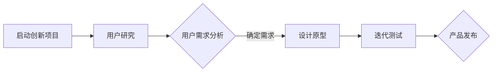

                 

### 《跨界创新：融合多领域智慧的领导方法》

---

## 关键词
- 跨界创新
- 领导方法
- 多领域智慧
- 创新思维
- 领导力
- 跨领域融合

## 摘要
在快速变化的时代，跨界创新已成为推动企业和社会发展的重要动力。本文旨在探讨跨界创新的核心概念及其在领导方法中的应用，通过详细的理论讲解、案例分析、实战指导，帮助读者理解跨界创新的本质，掌握融合多领域智慧的领导艺术。

---

### 第一部分：背景介绍

#### 第1章：跨界创新的必要性

**1.1 创新的时代背景**

创新，作为推动社会进步和企业发展的核心动力，在当今科技日新月异、市场竞争加剧的环境中尤为重要。跨界创新则是在这种背景下应运而生的一种创新模式，它通过跨领域的知识和技术融合，开辟新的市场空间和商业模式。

**1.2 跨界创新的定义**

跨界创新是指将不同领域、不同行业的技术、方法、理念相互融合，形成新的产品、服务或商业模式的过程。它强调的是跨领域的协作和知识整合，以实现创新的最大化效益。

**1.3 跨界创新的价值**

跨界创新具有以下几个方面的价值：
- **突破传统思维局限**：通过跨领域的视角，打破原有的思维定势，实现创新的突破。
- **拓展市场空间**：跨界创新能够开拓新的市场，满足消费者的多样化需求。
- **提高竞争力**：跨界创新有助于企业提升竞争力，实现持续发展和增长。

#### 第2章：核心概念与联系

**2.1 创新思维**

创新思维是指一种能够创造新颖想法和解决方案的思维方式。它要求人们敢于打破常规，勇于尝试新的方法和技术。

**2.2 跨领域融合**

跨领域融合是将不同领域的知识、技术、方法相互整合，以产生新的价值和效益。它强调的是跨领域的知识共享和协同创新。

**2.3 领导力**

领导力是指领导者通过激励、指导和协调，使团队成员共同实现目标的能力。在跨界创新中，领导力尤为重要，它能够推动跨领域团队的协同合作，实现创新目标。

**2.4 对比表格：创新思维与跨界融合对比**

| 特征 | 创新思维 | 跨领域融合 |
| --- | --- | --- |
| 目标 | 创造新颖想法 | 跨领域知识整合 |
| 方法 | 突破常规 | 知识共享与协同 |
| 影响力 | 改变思维模式 | 提升市场竞争力 |

---

### 第二部分：理论与案例分析

#### 第3章：跨界创新方法论

**3.1 创新方法论概述**

创新方法论是指一系列用于指导创新活动的理论和方法。在跨界创新中，常用的方法论包括用户研究、原型设计、迭代测试等。

**3.2 跨领域思维模式**

跨领域思维模式是指一种能够灵活应对复杂问题的思维方式。它要求人们具备广泛的知识面和跨领域的思维习惯。

**3.3 创新过程管理**

创新过程管理是指对创新活动的全流程进行规划、控制和优化。在跨界创新中，创新过程管理尤为重要，它能够确保创新活动的高效和成功。

**3.4 Mermaid流程图：创新过程**

#### 第4章：跨界创新案例分析

**4.1 案例一：科技公司跨界零售**

**4.2 案例二：制造业与互联网融合**

**4.3 案例三：文化娱乐与科技的融合**

---

### 第三部分：领导方法与实践

#### 第5章：跨界创新的领导方法

**5.1 领导风格**

领导风格是指领导者行使领导职能时所采用的方式和方法。在跨界创新中，灵活的领导风格尤为重要，它能够适应不同环境和需求。

**5.2 团队建设**

团队建设是指通过优化团队结构和提高团队效能，实现团队目标的过程。在跨界创新中，团队建设尤为重要，它能够确保团队的高效协作。

**5.3 文化塑造**

文化塑造是指通过价值观、行为准则等来塑造组织文化。在跨界创新中，积极向上的组织文化能够激发团队的创造力。

**5.4 Mermaid流程图：领导方法应用**

#### 第6章：实战指导

**6.1 项目策划**

项目策划是指对项目进行详细的规划和设计。在跨界创新中，项目策划尤为重要，它能够确保项目的顺利进行。

**6.2 团队协作**

团队协作是指团队成员之间的相互配合和协作。在跨界创新中，团队协作尤为重要，它能够提升项目的执行效率。

**6.3 风险管理**

风险管理是指对项目可能出现的风险进行识别、评估和控制。在跨界创新中，风险管理尤为重要，它能够降低项目失败的风险。

**6.4 实战案例解读**

通过实际案例分析，解读跨界创新项目中的关键环节和成功要素。

---

### 第四部分：总结与展望

#### 第7章：跨界创新的最佳实践

**7.1 实践技巧**

总结跨界创新项目中的实践经验，提供实用的技巧和方法。

**7.2 注意事项**

指出跨界创新项目中的潜在问题和注意事项，以帮助读者避免常见的错误。

**7.3 小结**

对跨界创新的核心内容进行总结，强调关键点和实践要点。

#### 第8章：跨界创新的发展趋势

**8.1 未来展望**

分析跨界创新的发展趋势，探讨未来跨界创新的发展方向。

**8.2 潜在挑战**

探讨跨界创新可能面临的挑战，并提出应对策略。

**8.3 发展策略**

为企业和组织提供跨界创新的发展策略，以实现长期发展。

---

### 作者信息

作者：AI天才研究院/AI Genius Institute & 禅与计算机程序设计艺术 /Zen And The Art of Computer Programming

---

**全文完。**

---

请注意，本文档仅为目录大纲的框架，具体的正文内容需要根据大纲结构逐步填充和撰写。每个章节都需要详细的内容，包括背景介绍、核心概念与联系、理论讲解、案例分析、领导方法、实战指导等。文章的字数和格式要求也需严格遵守。

