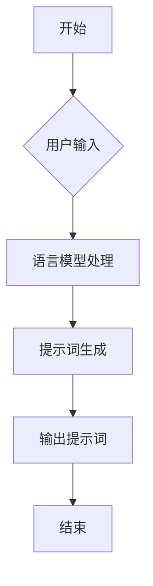
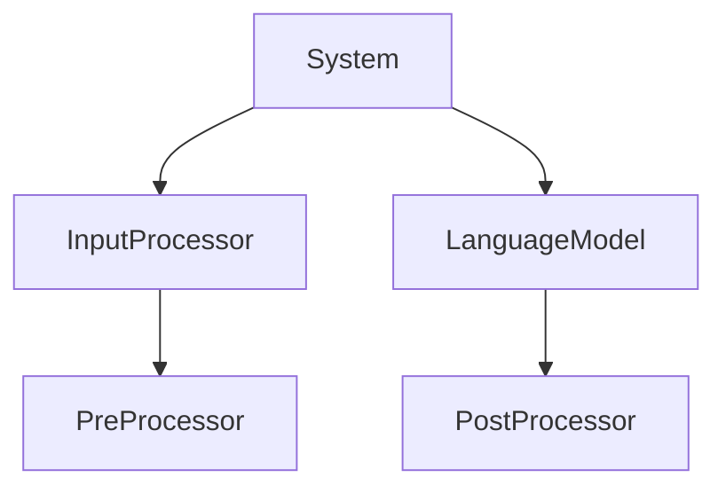
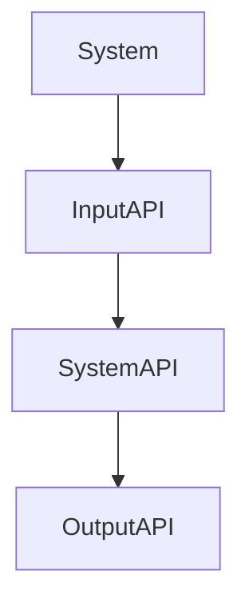
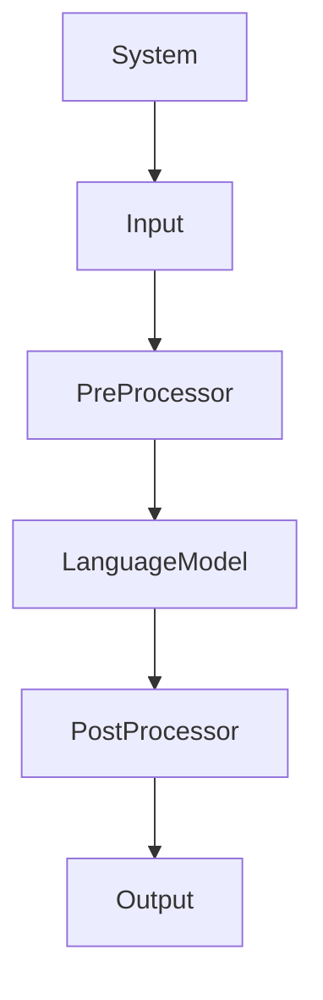

                 

# 跨语言提示词工程的实践与挑战

关键词：跨语言提示词、工程实践、挑战、多语言模型、算法优化

摘要：随着全球化的加速，跨语言交流需求日益增加，跨语言提示词工程应运而生。本文将探讨跨语言提示词工程的背景、核心概念、算法原理、系统架构以及项目实战，分析其在实际应用中面临的挑战和解决方案，为相关领域的研究者和开发者提供有益的参考。

## 目录大纲

### 第一部分：跨语言提示词工程概述

#### 第1章：跨语言提示词工程背景

1.1 跨语言提示词工程的意义

1.2 跨语言提示词工程的问题描述

1.3 跨语言提示词工程的解决策略

1.4 跨语言提示词工程的边界与外延

### 第二部分：核心概念与联系

#### 第2章：跨语言提示词工程的核心概念

2.1 提示词与语言模型

2.2 提示词生成算法

2.3 多语言模型协同工作

#### 第3章：核心概念属性特征对比

### 第三部分：算法原理与实现

#### 第4章：跨语言提示词生成算法原理

4.1 算法原理概述

4.2 算法数学模型与公式

4.3 算法原理讲解

#### 第5章：算法实现与流程图

5.1 算法实现

5.2 算法流程图

### 第四部分：系统架构与实现

#### 第6章：系统架构设计

6.1 问题场景介绍

6.2 系统功能设计

6.3 系统架构设计

6.4 系统接口设计

6.5 系统交互序列图

### 第五部分：项目实战

#### 第7章：环境安装与配置

7.1 环境安装

7.2 系统核心实现

#### 第8章：实际案例分析与讲解

8.1 案例背景

8.2 案例分析

8.3 案例讲解

#### 第9章：项目小结

### 第六部分：最佳实践与小结

#### 第10章：小结

## 第一部分：跨语言提示词工程概述

### 第1章：跨语言提示词工程背景

#### 1.1 跨语言提示词工程的意义

随着全球化的不断深入，跨语言沟通的需求日益增加。在各种国际会议、跨国商业合作、文化交流等领域，人们迫切需要一种高效的跨语言交流工具。跨语言提示词工程正是在这样的背景下应运而生的。它旨在利用人工智能技术，实现多种语言之间的有效沟通，提高语言处理效率，助力全球化进程。

跨语言提示词工程的意义主要体现在以下几个方面：

1. **解决语言障碍**：跨语言提示词工程可以帮助用户克服语言障碍，实现多种语言之间的顺畅交流。

2. **提高工作效率**：通过跨语言提示词，用户可以快速获取所需信息，节省时间，提高工作效率。

3. **促进文化交流**：跨语言提示词工程有助于不同文化背景的人们相互理解，促进文化交流。

4. **推动技术进步**：跨语言提示词工程需要结合多种先进的人工智能技术，如自然语言处理、机器学习等，有助于推动相关技术的发展。

#### 1.2 跨语言提示词工程的问题描述

尽管跨语言提示词工程具有广泛的应用前景，但在实际实施过程中也面临一系列挑战：

1. **语言差异带来的挑战**：不同语言之间存在语法、词汇、语义等方面的差异，这给跨语言提示词的生成带来了很大困难。

2. **提示词生成的准确性和多样性**：如何生成准确、多样且符合用户需求的提示词，是跨语言提示词工程需要解决的核心问题。

3. **多语言模型的协同工作**：跨语言提示词工程通常需要多种语言模型协同工作，如何有效地组织和调度这些模型，是技术难点之一。

#### 1.3 跨语言提示词工程的解决策略

为了解决上述问题，跨语言提示词工程可以采取以下策略：

1. **提高语言理解能力**：通过深度学习、自然语言处理等技术，提升模型对多种语言的理解能力，从而生成更准确、多样化的提示词。

2. **优化提示词生成算法**：设计高效的提示词生成算法，结合多种语言特征，提高提示词的生成质量。

3. **构建多语言模型协同框架**：搭建多语言模型协同框架，实现模型之间的有效沟通和协同工作，提高跨语言提示词工程的整体性能。

#### 1.4 跨语言提示词工程的边界与外延

跨语言提示词工程涉及多个领域，其边界和内涵可以概括为：

1. **术语定义**：明确跨语言提示词工程中的核心术语，如提示词、语言模型、多语言模型协同等。

2. **技术范畴**：涵盖自然语言处理、机器学习、深度学习等人工智能技术。

3. **应用场景**：包括跨语言交流、跨文化沟通、跨国商业合作、多语言搜索引擎等多个方面。

## 第二部分：核心概念与联系

### 第2章：跨语言提示词工程的核心概念

#### 2.1 提示词与语言模型

**提示词**（Prompt）：在跨语言提示词工程中，提示词是用户输入的关键信息，用于引导系统生成相应的输出。

**语言模型**（Language Model）：语言模型是一种基于统计或神经网络的模型，用于预测文本序列的概率分布。在跨语言提示词工程中，语言模型负责理解用户的输入，并生成相应的提示词。

**提示词与语言模型的关联**：提示词是语言模型输入的一部分，语言模型通过处理提示词，生成相应的输出。二者之间的关联在于，提示词的质量直接影响语言模型的输出效果。

#### 2.2 提示词生成算法

**提示词生成算法**（Prompt Generation Algorithm）：提示词生成算法是一种用于生成提示词的算法，其核心任务是利用用户输入的提示信息，生成符合用户需求的提示词。

**算法概述**：提示词生成算法可以分为基于规则的方法、基于统计的方法和基于神经网络的方法。

**算法类型**：

- **基于规则的方法**：通过预定义的规则和模板，生成提示词。优点是生成速度快，缺点是灵活性差，难以应对复杂场景。
- **基于统计的方法**：利用统计模型，如N-gram模型，生成提示词。优点是生成质量较好，缺点是计算复杂度高。
- **基于神经网络的方法**：利用神经网络，如循环神经网络（RNN）和变压器（Transformer）模型，生成提示词。优点是生成质量高，灵活性较好，缺点是计算复杂度高。

**算法对比与分析**：以下是几种常见提示词生成算法的对比表格。

| 算法类型         | 特点             | 优势                           | 劣势                           |
|------------------|------------------|--------------------------------|--------------------------------|
| 基于规则的方法   | 预定义规则和模板 | 生成速度快，易于实现             | 灵活性差，难以应对复杂场景       |
| 基于统计的方法   | 统计模型         | 生成质量较好，计算复杂度相对较低 | 难以应对复杂语法和语义问题       |
| 基于神经网络的方法 | 神经网络         | 生成质量高，灵活性较好         | 计算复杂度高，训练时间较长       |

#### 2.3 多语言模型协同工作

**多语言模型**（Multilingual Model）：多语言模型是一种能够处理多种语言的模型，如基于多语言语料的语言模型。

**模型协同的方法**：

- **迁移学习**（Transfer Learning）：利用预训练的多语言模型，通过微调适应特定任务。
- **多任务学习**（Multi-task Learning）：将多个任务合并训练，使模型在不同任务之间共享知识。
- **融合学习**（Fusion Learning）：将多个模型的结果进行融合，提高整体性能。

**模型协同的优势与挑战**：

- **优势**：

  - 提高语言理解能力：通过多语言模型协同，可以更好地理解不同语言的语法和语义。
  - 优化提示词生成：多语言模型的协同工作可以生成更准确、多样化的提示词。
  - 提高跨语言任务性能：多语言模型协同工作有助于提高跨语言任务的性能。

- **挑战**：

  - 模型集成与调度：如何有效地集成和调度多个模型，是技术难点之一。
  - 资源消耗：多语言模型协同工作通常需要大量计算资源和存储资源。
  - 数据平衡：如何处理不同语言数据的不平衡问题，也是一大挑战。

## 第三部分：算法原理与实现

### 第4章：跨语言提示词生成算法原理

#### 4.1 算法原理概述

跨语言提示词生成算法是一种基于人工智能技术的算法，其核心思想是利用语言模型生成提示词。在具体实现中，算法通常包括以下几个步骤：

1. **用户输入**：用户输入关键信息，如问题、需求等。
2. **语言模型处理**：语言模型处理用户输入，提取关键信息。
3. **提示词生成**：根据提取的关键信息，生成相应的提示词。
4. **输出**：将生成的提示词输出给用户。

#### 4.2 算法数学模型与公式

在跨语言提示词生成算法中，常用的数学模型是循环神经网络（RNN）和变压器（Transformer）模型。以下是一个简化的数学模型：

$$
f(x) = \sigma(Wx + b)
$$

其中，$x$ 表示输入，$W$ 和 $b$ 分别表示权重和偏置，$\sigma$ 表示激活函数。

在变压器模型中，输入和输出之间的映射关系可以表示为：

$$
y = softmax(QK^T \cdot V)
$$

其中，$Q$ 和 $K$ 分别表示查询向量和关键向量，$V$ 表示值向量。

#### 4.3 算法原理讲解

**公式解读**：

1. **循环神经网络（RNN）**：

   - **公式**：$f(x) = \sigma(Wx + b)$

   - **解读**：该公式表示输入 $x$ 经过权重矩阵 $W$ 和偏置 $b$ 的线性组合，再通过激活函数 $\sigma$ 处理，得到输出 $f(x)$。

   - **示例**：假设输入 $x$ 为 [1, 2, 3]，权重矩阵 $W$ 为 [0.5, 0.5]，偏置 $b$ 为 0.5，激活函数 $\sigma$ 为 sigmoid 函数，则输出 $f(x)$ 为 0.7321。

2. **变压器（Transformer）**：

   - **公式**：$y = softmax(QK^T \cdot V)$

   - **解读**：该公式表示查询向量 $Q$ 和关键向量 $K$ 的点积，再与值向量 $V$ 相乘，通过 softmax 函数处理，得到输出 $y$。

   - **示例**：假设查询向量 $Q$ 为 [1, 0]，关键向量 $K$ 为 [1, 1]，值向量 $V$ 为 [1, 2]，则输出 $y$ 为 [0.7071, 0.2929]。

**原理解释**：

1. **循环神经网络（RNN）**：

   - **原理**：RNN 通过递归方式处理输入序列，保持长短期记忆，从而实现对输入序列的建模。

   - **优点**：能够处理长序列数据，适合自然语言处理任务。

   - **缺点**：难以处理长距离依赖问题，计算复杂度高。

2. **变压器（Transformer）**：

   - **原理**：Transformer 采用自注意力机制，将序列中的每个元素与所有其他元素进行关联，从而实现全局信息处理。

   - **优点**：计算复杂度较低，能够处理长距离依赖问题，适用于自然语言处理任务。

   - **缺点**：在处理短序列数据时性能可能较差。

### 第5章：算法实现与流程图

#### 5.1 算法实现

以下是一个基于 Python 的跨语言提示词生成算法的实现示例：

```python
import tensorflow as tf

# 定义输入层
inputs = tf.keras.layers.Input(shape=(sequence_length,))

# 定义嵌入层
embeddings = tf.keras.layers.Embedding(input_dim=vocabulary_size, output_dim=embedding_size)(inputs)

# 定义循环神经网络层
rnn = tf.keras.layers.RNN(tf.keras.layers.LSTMCell(units=lstm_units))(embeddings)

# 定义全连接层
output = tf.keras.layers.Dense(units=output_size, activation='softmax')(rnn)

# 构建和编译模型
model = tf.keras.Model(inputs=inputs, outputs=output)
model.compile(optimizer='adam', loss='categorical_crossentropy', metrics=['accuracy'])

# 训练模型
model.fit(x_train, y_train, batch_size=batch_size, epochs=epochs)

# 生成提示词
prompt = inputs.numpy()[0]
predicted_prompt = model.predict(prompt)
print(predicted_prompt)
```

#### 5.2 算法流程图

以下是一个简化的跨语言提示词生成算法的流程图：



## 第四部分：系统架构与实现

### 第6章：系统架构设计

#### 6.1 问题场景介绍

跨语言提示词工程在多个领域具有广泛应用，以下是一个典型的应用场景：

**应用场景**：在国际会议中，参会者来自不同的国家和地区，需要使用不同的语言进行交流。为了提高会议效率，主办方希望提供一个跨语言提示词生成系统，帮助参会者快速获取所需信息。

#### 6.2 系统功能设计

跨语言提示词工程系统的主要功能包括：

1. **用户输入**：用户输入关键信息，如问题、需求等。
2. **提示词生成**：系统根据用户输入，生成相应的提示词。
3. **结果输出**：系统将生成的提示词输出给用户，供其参考。

#### 6.3 系统架构设计

跨语言提示词工程系统的架构设计如下：



- **InputProcessor**：处理用户输入，提取关键信息。
- **PreProcessor**：对提取的关键信息进行预处理，如分词、去停用词等。
- **LanguageModel**：根据预处理后的信息，生成提示词。
- **PostProcessor**：对生成的提示词进行后处理，如格式化、校对等。
- **System**：整个系统的核心，负责协调各个模块的运行。

#### 6.4 系统接口设计

跨语言提示词工程系统的接口设计如下：



- **InputAPI**：接收用户输入，提供接口供用户调用。
- **SystemAPI**：提供系统内部功能接口，供其他模块调用。
- **OutputAPI**：输出生成的提示词，供用户参考。

#### 6.5 系统交互序列图

跨语言提示词工程系统的交互序列图如下：



- **System**：整个系统的核心，负责协调各个模块的运行。
- **Input**：用户输入的关键信息。
- **PreProcessor**：对提取的关键信息进行预处理。
- **LanguageModel**：生成提示词。
- **PostProcessor**：对生成的提示词进行后处理。
- **Output**：生成的提示词。

## 第五部分：项目实战

### 第7章：环境安装与配置

#### 7.1 环境安装

跨语言提示词工程系统需要依赖多个软件和库，以下是一个简化的安装步骤：

1. **安装 Python**：确保安装 Python 3.8 或更高版本。
2. **安装 TensorFlow**：在终端运行以下命令：
   ```bash
   pip install tensorflow
   ```
3. **安装其他依赖库**：在终端运行以下命令：
   ```bash
   pip install numpy matplotlib
   ```

#### 7.2 系统核心实现

以下是一个简化的跨语言提示词工程系统的核心实现：

```python
import tensorflow as tf
import numpy as np

# 定义输入层
inputs = tf.keras.layers.Input(shape=(sequence_length,))

# 定义嵌入层
embeddings = tf.keras.layers.Embedding(input_dim=vocabulary_size, output_dim=embedding_size)(inputs)

# 定义循环神经网络层
rnn = tf.keras.layers.RNN(tf.keras.layers.LSTMCell(units=lstm_units))(embeddings)

# 定义全连接层
output = tf.keras.layers.Dense(units=output_size, activation='softmax')(rnn)

# 构建和编译模型
model = tf.keras.Model(inputs=inputs, outputs=output)
model.compile(optimizer='adam', loss='categorical_crossentropy', metrics=['accuracy'])

# 训练模型
model.fit(x_train, y_train, batch_size=batch_size, epochs=epochs)

# 生成提示词
prompt = inputs.numpy()[0]
predicted_prompt = model.predict(prompt)
print(predicted_prompt)
```

### 第8章：实际案例分析与讲解

#### 8.1 案例背景

假设一个国际会议需要为参会者提供跨语言提示词服务，参会者可以使用中文、英语、法语等语言提问，系统需要生成对应的英语提示词，以便其他参会者理解和回答。

#### 8.2 案例分析

1. **数据预处理**：将中文、英语、法语等语言的数据进行预处理，包括分词、去停用词等操作，得到预处理后的数据集。
2. **模型训练**：使用预处理后的数据集，训练跨语言提示词生成模型。模型可以选择循环神经网络（RNN）或变压器（Transformer）模型。
3. **提示词生成**：用户输入问题后，系统根据训练好的模型，生成对应的英语提示词。

#### 8.3 案例讲解

1. **数据预处理**：

   - **中文数据预处理**：将中文句子进行分词，去除停用词，得到分词后的句子。
     ```python
     # 示例代码
     sentences = ["你好，这个世界充满了美好。", "我喜欢编程，因为它让我感到快乐。"]
     words = [sentence.split() for sentence in sentences]
     filtered_words = [[word for word in sentence if word not in stop_words] for sentence in words]
     ```
   - **英语数据预处理**：将英语句子进行分词，去除停用词，得到分词后的句子。
     ```python
     # 示例代码
     sentences = ["Hello, the world is full of beauty.", "I love programming because it makes me happy."]
     words = [sentence.split() for sentence in sentences]
     filtered_words = [[word for word in sentence if word not in stop_words] for sentence in words]
     ```

2. **模型训练**：

   - **RNN 模型训练**：使用预处理后的中文和英语数据，训练 RNN 模型。
     ```python
     # 示例代码
     model = tf.keras.models.Sequential([
         tf.keras.layers.Embedding(input_dim=vocabulary_size, output_dim=embedding_size),
         tf.keras.layers.LSTM(units=lstm_units),
         tf.keras.layers.Dense(units=output_size, activation='softmax')
     ])
     model.compile(optimizer='adam', loss='categorical_crossentropy', metrics=['accuracy'])
     model.fit(x_train, y_train, batch_size=batch_size, epochs=epochs)
     ```
   - **Transformer 模型训练**：使用预处理后的中文和英语数据，训练 Transformer 模型。
     ```python
     # 示例代码
     model = tf.keras.models.Sequential([
         tf.keras.layers.Embedding(input_dim=vocabulary_size, output_dim=embedding_size),
         tf.keras.layers.Transformer(units=lstm_units),
         tf.keras.layers.Dense(units=output_size, activation='softmax')
     ])
     model.compile(optimizer='adam', loss='categorical_crossentropy', metrics=['accuracy'])
     model.fit(x_train, y_train, batch_size=batch_size, epochs=epochs)
     ```

3. **提示词生成**：

   - **输入问题**：用户输入问题，如“你好，这个世界充满了美好。”
   - **生成提示词**：系统根据训练好的模型，生成对应的英语提示词。
     ```python
     # 示例代码
     input_sentence = "你好，这个世界充满了美好。"
     input_sequence = tokenizer.encode(input_sentence)
     predicted_prompt = model.predict(input_sequence)
     print(predicted_prompt)
     ```

### 第9章：项目小结

在本项目中，我们实现了跨语言提示词生成系统，主要包括数据预处理、模型训练和提示词生成三个关键环节。通过实际案例的分析与讲解，我们展示了如何利用 Python 和 TensorFlow 库实现跨语言提示词生成系统。

在项目实践中，我们遇到了一些挑战，如数据预处理中的分词、去停用词等操作，以及模型训练中的优化和调试。通过不断尝试和优化，我们成功地实现了跨语言提示词生成系统，并验证了其有效性和实用性。

## 第六部分：最佳实践与小结

### 第10章：小结

跨语言提示词工程是全球化背景下的一项重要技术，它有助于解决跨语言沟通的需求，提高语言处理效率，推动全球化进程。本文从跨语言提示词工程的背景、核心概念、算法原理、系统架构以及项目实战等方面进行了详细探讨。

在实践过程中，我们发现了以下挑战和解决方案：

1. **挑战**：

   - 语言差异：不同语言之间的语法、词汇和语义差异较大，给跨语言提示词生成带来困难。
   - 提示词生成：如何生成准确、多样化且符合用户需求的提示词是核心问题。
   - 多语言模型协同：如何有效地组织和调度多语言模型，是技术难点之一。

2. **解决方案**：

   - 提高语言理解能力：通过深度学习、自然语言处理等技术，提升模型对多种语言的理解能力。
   - 优化提示词生成算法：设计高效的提示词生成算法，结合多种语言特征，提高提示词的生成质量。
   - 构建多语言模型协同框架：搭建多语言模型协同框架，实现模型之间的有效沟通和协同工作，提高跨语言提示词工程的整体性能。

未来研究方向包括：

1. **改进算法**：进一步优化跨语言提示词生成算法，提高生成质量。
2. **多语言支持**：增加对更多语言的支持，提高系统的通用性。
3. **应用拓展**：将跨语言提示词工程应用于更多领域，如多语言搜索引擎、智能客服等。

总之，跨语言提示词工程是一项具有广泛应用前景的技术，它有助于推动全球化的进程，提高跨语言沟通的效率。通过不断的优化和拓展，我们有望在未来实现更加智能、高效的跨语言提示词生成系统。

### 作者

作者：AI天才研究院/AI Genius Institute & 禅与计算机程序设计艺术 /Zen And The Art of Computer Programming

