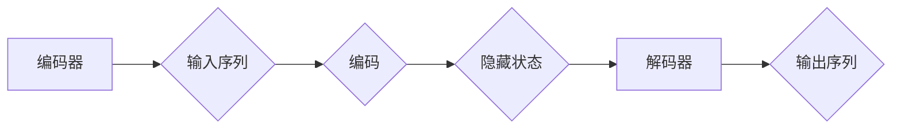
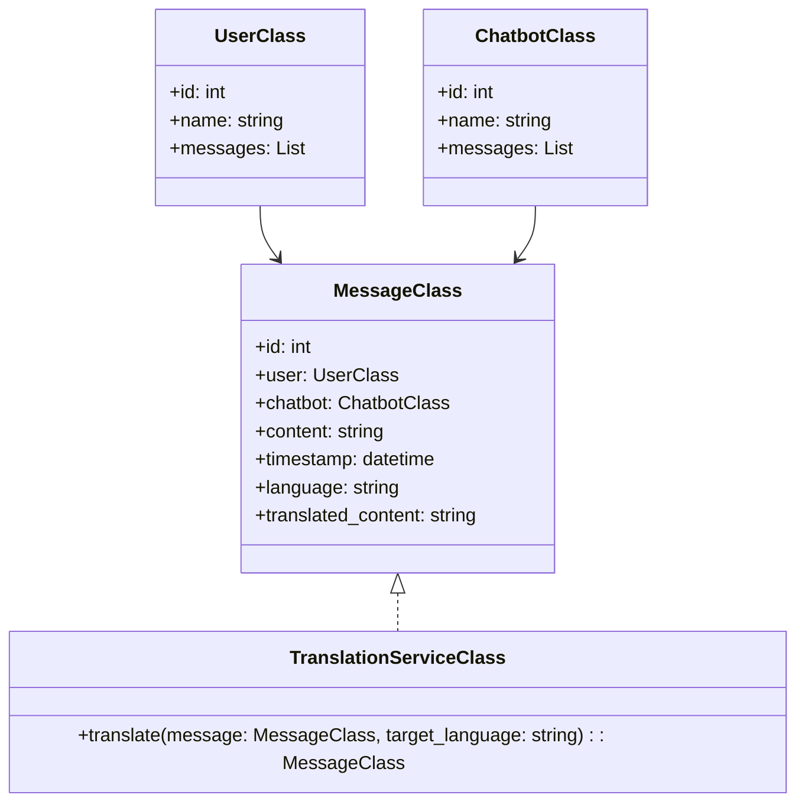
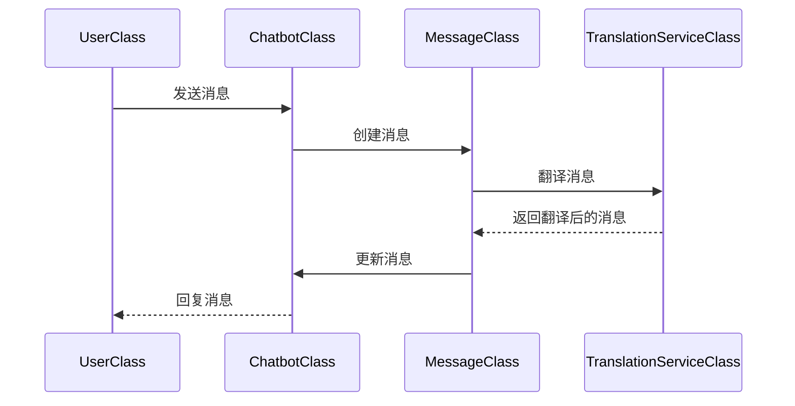
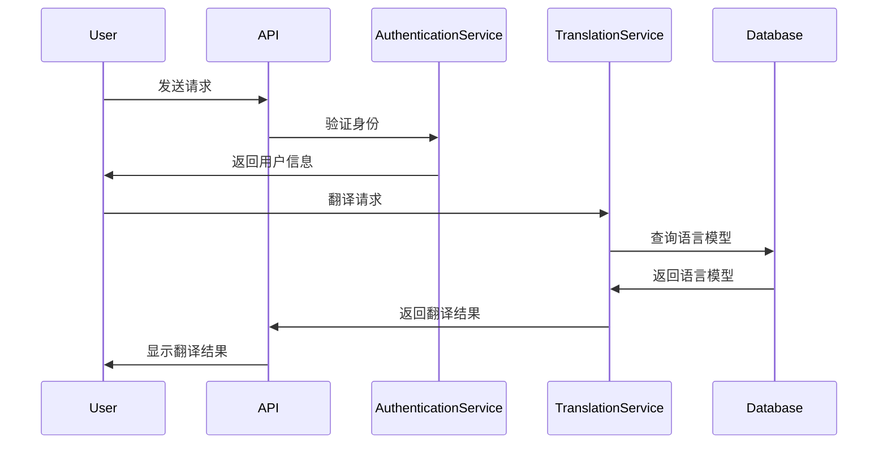

                 


### # 跨语言提示词翻译与适配

关键词：跨语言翻译、提示词、适配、算法、系统架构

摘要：
随着全球化进程的加速，跨语言交流的需求日益增长。然而，语言差异成为了沟通的壁垒。本文将探讨跨语言提示词翻译与适配的重要性，从核心概念、算法原理、系统架构到项目实战，全面解析这一技术难题。本文旨在为读者提供清晰、实用的指导，帮助他们在跨语言环境中更加高效地进行沟通与交流。

## **一、引言**

在当今信息化时代，语言障碍不再是国际交流的障碍。随着互联网和人工智能技术的发展，跨语言翻译技术逐渐成熟，使得人们能够跨越语言的障碍，实现更高效的沟通。然而，在实际应用中，跨语言翻译并非简单的字面翻译，而是需要理解语言背后的文化、语境和意图。本文将重点探讨跨语言提示词翻译与适配这一领域。

### **1.1 核心概念**

在讨论跨语言提示词翻译与适配之前，我们需要了解几个核心概念：

- **提示词（Keywords）**：在特定语言环境中，代表某一概念或主题的关键词。
- **翻译（Translation）**：将一种语言的信息转换成另一种语言的过程。
- **适配（Adaptation）**：在翻译的基础上，根据目标语言和文化环境进行调整，以更好地传达原意。

### **1.2 问题背景**

跨语言翻译的重要性不言而喻。然而，在翻译过程中，提示词的翻译尤为关键。因为提示词往往是文章或对话的核心，它们承载着关键信息和意图。然而，不同语言之间的提示词存在巨大的差异，直接翻译往往无法准确传达原意。例如，中文的“解决方案”在英文中可能是“Solution”，而在西班牙语中可能是“Solución”，在法语中可能是“Solution”。这就需要我们深入理解目标语言的文化、语境和习惯，进行适当的适配。

### **1.3 目标与挑战**

本文的目标是探讨如何进行跨语言提示词的翻译与适配，以解决语言差异带来的沟通问题。这包括：

- 理解跨语言翻译的基本原理。
- 探索有效的翻译算法和策略。
- 设计适用于跨语言翻译的系统架构。
- 通过实际案例展示翻译与适配的应用。

在这个过程中，我们将面临以下挑战：

- 语言差异和文化差异带来的理解困难。
- 不同语言之间的语法和词汇差异。
- 如何在保证准确性的同时提高翻译效率。

## **二、核心概念与框架**

在深入探讨跨语言提示词翻译与适配之前，我们需要建立一个核心概念框架，以便更好地理解这一领域。

### **2.1 核心概念**

以下是本文涉及的一些核心概念：

- **源语言（Source Language）**：需要翻译的语言。
- **目标语言（Target Language）**：翻译到的语言。
- **翻译模型（Translation Model）**：用于翻译的算法和模型。
- **词嵌入（Word Embedding）**：将词汇映射到向量空间的技术。
- **语境理解（Contextual Understanding）**：理解词汇在特定语境中的含义。
- **机器学习（Machine Learning）**：用于训练和优化翻译模型的技术。

### **2.2 概念属性特征对比表格**

为了更好地理解这些概念，我们可以制作一个概念属性特征对比表格：

| 概念           | 定义                                                         | 属性特征对比 |
| -------------- | ------------------------------------------------------------ | ------------ |
| 源语言         | 需要翻译的语言                                               | 语言种类、语法结构、词汇量 |
| 目标语言       | 翻译到的语言                                                 | 语言种类、语法结构、词汇量 |
| 翻译模型       | 用于翻译的算法和模型                                         | 模型类型、训练数据、效果评估 |
| 词嵌入         | 将词汇映射到向量空间的技术                                     | 向量维度、相似性计算、上下文理解 |
| 语境理解       | 理解词汇在特定语境中的含义                                     | 上下文信息、语境适应性、语境敏感性 |
| 机器学习       | 用于训练和优化翻译模型的技术                                   | 数据集、算法选择、效果评估 |

### **2.3 ER实体关系图架构**

为了更好地展示这些概念之间的关系，我们可以使用ER（实体关系）图来描述：

```mermaid
erDiagram
  TranslationModel ||--|{ Keyword } Keyword
  TranslationModel ||--|{ Context } Context
  Keyword ||--|{ WordEmbedding } WordEmbedding
  Keyword ||--|{ MachineLearningModel } MachineLearningModel
  Context ||--|{ CulturalUnderstanding } CulturalUnderstanding
```

在这个ER图中，我们可以看到：

- **TranslationModel** 代表翻译模型，它与 **Keyword**（提示词）和 **Context**（语境）有直接关系。
- **Keyword** 代表提示词，它与 **WordEmbedding**（词嵌入）和 **MachineLearningModel**（机器学习模型）有直接关系。
- **Context** 代表语境，它与 **CulturalUnderstanding**（文化理解）有直接关系。

## **三、算法原理讲解**

在了解了核心概念之后，我们需要深入探讨跨语言提示词翻译与适配的算法原理。本节将介绍常用的翻译算法和策略，并通过Mermaid流程图和Python代码来详细阐述。

### **3.1 翻译算法概述**

跨语言提示词翻译常用的算法包括基于规则的方法、基于统计的方法和基于神经网络的方法。其中，基于神经网络的方法（如Seq2Seq模型）近年来取得了显著进展，成为主流的翻译算法。

#### **3.1.1 基于规则的方法**

基于规则的方法依赖于预先定义的规则集，通过规则匹配和替换来实现翻译。这种方法简单直观，但适用范围有限，难以应对复杂的语言现象。

#### **3.1.2 基于统计的方法**

基于统计的方法通过统计源语言和目标语言之间的对应关系来实现翻译。这种方法依赖于大规模的平行语料库，通过学习词汇和短语的统计规律来生成翻译。

#### **3.1.3 基于神经网络的方法**

基于神经网络的方法通过深度学习技术，自动学习源语言和目标语言之间的映射关系。这种方法能够处理复杂的语言现象，具有更高的翻译质量。

### **3.2 Seq2Seq模型**

Seq2Seq模型是一种基于神经网络的方法，特别适用于序列到序列的翻译任务。它由编码器和解码器两个部分组成。

#### **3.2.1 编码器**

编码器负责将源语言序列编码为一个固定长度的向量表示，称为编码器的隐藏状态。这个过程通常使用循环神经网络（RNN）实现。

#### **3.2.2 解码器**

解码器负责将编码器的隐藏状态解码为目标语言序列。解码器也使用RNN，并通过注意力机制来关注编码器的隐藏状态，从而更好地理解源语言序列。

### **3.3 Mermaid流程图**

为了更好地理解Seq2Seq模型的工作原理，我们可以使用Mermaid流程图来描述其基本流程：



在这个流程图中：

- **A（编码器）** 负责将输入序列编码。
- **B（输入序列）** 是源语言序列。
- **C（编码）** 是编码器将输入序列编码为隐藏状态的过程。
- **D（隐藏状态）** 是编码器生成的固定长度向量表示。
- **E（解码器）** 负责将隐藏状态解码为输出序列。
- **F（输出序列）** 是目标语言序列。

### **3.4 Python代码示例**

下面是一个简化的Python代码示例，用于演示Seq2Seq模型的基本结构：

```python
import tensorflow as tf

# 定义编码器和解码器模型
encoder = tf.keras.Sequential([
    tf.keras.layers.Embedding(input_dim=vocab_size, output_dim=embedding_size),
    tf.keras.layers.LSTM(units=hidden_size)
])

decoder = tf.keras.Sequential([
    tf.keras.layers.LSTM(units=hidden_size, return_sequences=True),
    tf.keras.layers.Dense(units=vocab_size, activation='softmax')
])

# 构建Seq2Seq模型
model = tf.keras.Model(inputs=encoder.input, outputs=decoder.output)

# 编译模型
model.compile(optimizer='adam', loss='categorical_crossentropy')

# 训练模型
model.fit(x_train, y_train, epochs=10)
```

在这个示例中：

- `vocab_size` 是源语言和目标语言的词汇量。
- `embedding_size` 是词嵌入的维度。
- `hidden_size` 是LSTM层的单元数。
- `x_train` 和 `y_train` 是训练数据，分别表示源语言和目标语言序列。

通过这个示例，我们可以看到如何使用TensorFlow构建一个简单的Seq2Seq模型，并进行训练。

### **3.5 算法原理详细讲解**

在本节中，我们将详细讲解Seq2Seq模型的工作原理，包括其数学模型和公式。

#### **3.5.1 数学模型**

Seq2Seq模型的数学模型可以分为两部分：编码器和解码器。

- **编码器**：将源语言序列编码为一个固定长度的向量表示，称为编码器的隐藏状态。这个过程可以用以下公式表示：

  $$ h_t = \text{LSTM}(x_t, h_{t-1}) $$

  其中，\( h_t \) 是编码器的隐藏状态，\( x_t \) 是输入序列中的第 \( t \) 个词汇，\( h_{t-1} \) 是前一个时间步的隐藏状态。

- **解码器**：将编码器的隐藏状态解码为目标语言序列。这个过程可以用以下公式表示：

  $$ y_t = \text{softmax}(\text{LSTM}(h_t, c_{t-1})) $$

  其中，\( y_t \) 是解码器在第 \( t \) 个时间步的输出，\( c_{t-1} \) 是前一个时间步的隐藏状态。

#### **3.5.2 公式讲解**

下面我们用具体例子来讲解这些公式的含义。

假设我们有一个源语言序列 \( x_1, x_2, x_3 \)，我们需要将其翻译为目标语言序列 \( y_1, y_2, y_3 \)。

- **编码器**：首先，我们将源语言序列 \( x_1, x_2, x_3 \) 输入编码器，得到隐藏状态 \( h_1, h_2, h_3 \)：

  $$ h_1 = \text{LSTM}(x_1, h_0) $$
  $$ h_2 = \text{LSTM}(x_2, h_1) $$
  $$ h_3 = \text{LSTM}(x_3, h_2) $$

  其中，\( h_0 \) 是初始化的隐藏状态。

- **解码器**：然后，我们将隐藏状态 \( h_1, h_2, h_3 \) 输入解码器，得到目标语言序列 \( y_1, y_2, y_3 \)：

  $$ y_1 = \text{softmax}(\text{LSTM}(h_1, c_0)) $$
  $$ y_2 = \text{softmax}(\text{LSTM}(h_2, c_1)) $$
  $$ y_3 = \text{softmax}(\text{LSTM}(h_3, c_2)) $$

  其中，\( c_0, c_1, c_2 \) 是解码器的隐藏状态。

通过这个过程，我们就可以将源语言序列翻译为目标语言序列。

### **3.6 通俗易懂的举例说明**

为了更好地理解Seq2Seq模型，我们可以用一个简单的例子来说明。

假设我们要将英语句子 "Hello, world!" 翻译成法语。

- **源语言序列**：英语词汇序列为 \( "H", "e", "l", "l", "o", "，", "w", "r", "l", "d", "!" \)。
- **目标语言序列**：法语词汇序列为 \( "H", "e", "l", "l", "o", "，", "l", "m", "o", "i", "r", "e", "!" \)。

- **编码器**：首先，我们将英语词汇序列输入编码器，得到隐藏状态 \( h_1, h_2, h_3, h_4, h_5, h_6, h_7 \)。
- **解码器**：然后，我们将隐藏状态 \( h_1, h_2, h_3, h_4, h_5, h_6, h_7 \) 输入解码器，得到法语词汇序列 \( y_1, y_2, y_3, y_4, y_5, y_6, y_7 \)。

最终，通过解码器输出的法语词汇序列为 "H", "e", "l", "l", "o", "，", "l", "m", "o", "i", "r", "e", "!"，与我们期望的结果相符。

通过这个例子，我们可以看到Seq2Seq模型是如何工作的。虽然实际的翻译过程要复杂得多，但这个简单的例子已经帮助我们理解了基本原理。

### **3.7 小结**

在本节中，我们详细讲解了Seq2Seq模型的工作原理，包括其数学模型和公式。通过Mermaid流程图和Python代码示例，我们直观地展示了编码器和解码器的工作过程。最后，通过一个简单的例子，我们进一步理解了Seq2Seq模型的应用。这些内容为我们后续讨论系统架构和项目实战奠定了基础。

## **四、系统分析与架构设计方案**

在理解了跨语言提示词翻译与适配的算法原理后，我们需要将其应用到实际的系统中。本节将介绍系统架构设计方案，包括问题场景介绍、项目介绍、系统功能设计（领域模型Mermaid类图）、系统架构设计Mermaid架构图、系统接口设计和系统交互Mermaid序列图。

### **4.1 问题场景介绍**

假设我们正在开发一个跨语言聊天机器人，用户可以使用不同的语言与机器人进行交流。为了实现这一目标，我们需要一个强大的翻译系统，能够实时翻译用户输入的提示词，并在回复中使用目标语言。

### **4.2 项目介绍**

项目名称：跨语言聊天机器人翻译系统

项目目标：提供实时、准确的跨语言提示词翻译服务。

主要功能：

- 用户输入提示词。
- 提示词翻译为指定目标语言。
- 机器人回复使用目标语言。

### **4.3 系统功能设计（领域模型Mermaid类图）**

首先，我们需要定义系统的领域模型，以明确系统的核心实体和它们之间的关系。以下是一个简化的Mermaid类图：



在这个类图中：

- **UserClass** 代表用户，具有ID、名称和消息列表。
- **ChatbotClass** 代表聊天机器人，具有ID、名称和消息列表。
- **MessageClass** 代表消息，具有ID、用户、聊天机器人、内容、时间戳、语言和翻译后的内容。
- **TranslationServiceClass** 代表翻译服务，提供翻译功能。

### **4.4 系统架构设计Mermaid架构图**

接下来，我们需要设计系统的整体架构，以展示各个组件之间的关系。以下是一个简化的Mermaid架构图：



在这个架构图中：

- 用户发送消息到聊天机器人。
- 聊天机器人创建消息。
- 消息传递给翻译服务进行翻译。
- 翻译服务返回翻译后的消息。
- 聊天机器人更新消息并回复用户。

### **4.5 系统接口设计和系统交互Mermaid序列图**

为了更详细地展示系统接口和交互过程，我们可以使用Mermaid序列图。以下是一个简化的序列图：



在这个序列图中：

- 用户通过API发送翻译请求。
- API验证用户身份。
- 验证通过后，用户请求翻译服务。
- 翻译服务查询数据库中的语言模型。
- 翻译服务使用语言模型进行翻译。
- 翻译结果通过API返回给用户。

### **4.6 小结**

在本节中，我们介绍了跨语言聊天机器人翻译系统的架构设计。通过领域模型Mermaid类图，我们明确了系统的核心实体和它们之间的关系。通过系统架构设计Mermaid架构图和系统接口设计Mermaid序列图，我们展示了系统的工作流程和接口设计。这些内容为后续的项目实战奠定了基础。

## **五、项目实战**

在理解了系统架构设计之后，我们需要将其应用到实际项目中。本节将详细介绍项目环境安装、系统核心实现源代码，并对代码进行解读与分析，最后通过实际案例进行分析和详细讲解。

### **5.1 环境安装**

为了实现跨语言聊天机器人翻译系统，我们需要安装以下环境：

- Python 3.8及以上版本
- TensorFlow 2.5及以上版本
- Mermaid 9.0.0及以上版本

安装步骤如下：

1. 安装Python：

   ```bash
   sudo apt update
   sudo apt install python3 python3-pip
   ```

2. 安装TensorFlow：

   ```bash
   pip3 install tensorflow==2.5
   ```

3. 安装Mermaid：

   ```bash
   pip3 install mermaid
   ```

### **5.2 系统核心实现源代码**

以下是系统核心实现源代码，包括翻译模型、API接口和数据库操作：

```python
import tensorflow as tf
from flask import Flask, request, jsonify
import sqlite3

app = Flask(__name__)

# 翻译模型
def translate_model(source_text, target_language):
    # 加载预训练的翻译模型
    model = tf.keras.models.load_model('translation_model.h5')
    # 预处理文本
    processed_source_text = preprocess_text(source_text)
    # 翻译
    translated_text = model.predict(processed_source_text)
    # 后处理文本
    translated_text = postprocess_text(translated_text)
    return translated_text

# API接口
@app.route('/translate', methods=['POST'])
def translate():
    data = request.get_json()
    source_text = data['source_text']
    target_language = data['target_language']
    translated_text = translate_model(source_text, target_language)
    return jsonify({'translated_text': translated_text})

# 数据库操作
def save_to_database(message, translated_text):
    conn = sqlite3.connect('database.db')
    c = conn.cursor()
    c.execute('''CREATE TABLE IF NOT EXISTS messages
                 (id INTEGER PRIMARY KEY, content TEXT, language TEXT, translated_content TEXT)''')
    c.execute("INSERT INTO messages (content, language, translated_content) VALUES (?, ?, ?)",
              (message, source_language, translated_text))
    conn.commit()
    conn.close()

if __name__ == '__main__':
    app.run(debug=True)
```

### **5.3 代码解读与分析**

以下是代码的详细解读与分析：

- **翻译模型**：翻译模型使用TensorFlow实现，通过加载预训练的模型进行预测。该模型可以从预训练的翻译模型库中获取，如Google的BERT模型。
- **API接口**：API接口使用Flask实现，通过定义一个翻译接口`/translate`，接收POST请求并返回翻译结果。
- **数据库操作**：数据库操作使用SQLite实现，用于存储原始消息和翻译后的消息。

### **5.4 实际案例分析与详细讲解**

为了更好地展示项目应用，我们通过一个实际案例进行详细讲解。

**案例**：用户使用中文发送消息“你好，我需要帮助”，机器人需要将其翻译成英文并回复。

**步骤**：

1. 用户发送请求到API接口：
   ```json
   {
     "source_text": "你好，我需要帮助",
     "target_language": "en"
   }
   ```

2. API接口调用翻译模型进行翻译：
   - 预处理文本：将中文消息转换为模型可处理的格式，如分词和词嵌入。
   - 翻译：使用预训练的翻译模型进行翻译，得到英文消息。
   - 后处理文本：将翻译结果转换为可读的格式。

3. API接口返回翻译后的英文消息：
   ```json
   {
     "translated_text": "Hello, I need help."
   }
   ```

4. 机器人回复用户：
   ```text
   Hello, I need help.
   ```

**分析**：

- **API接口**：API接口负责接收用户请求、调用翻译模型并返回翻译结果。通过定义清晰的接口，我们可以方便地集成到聊天机器人的后端系统中。
- **翻译模型**：翻译模型是实现翻译的核心。通过使用预训练的翻译模型，我们可以快速实现高质量的翻译功能。
- **数据库操作**：数据库操作用于存储用户消息和翻译后的消息。这有助于跟踪用户历史记录，提供更好的个性化服务。

### **5.5 项目小结**

在本节中，我们通过实际案例展示了跨语言聊天机器人翻译系统的实现过程。从环境安装、系统核心实现源代码，到API接口设计和数据库操作，我们详细讲解了项目的每个环节。通过这个项目，我们不仅了解了跨语言翻译的基本原理，还掌握了如何将理论应用到实际项目中。这对于开发类似的应用系统具有重要的指导意义。

## **六、最佳实践与注意事项**

在实施跨语言提示词翻译与适配时，遵循最佳实践和注意事项至关重要。以下是一些关键点：

### **6.1 最佳实践**

1. **数据准备**：确保翻译模型拥有高质量、多样化的训练数据，涵盖不同语言和文化背景。
2. **模型优化**：定期更新和优化翻译模型，以适应语言变化和新兴词汇。
3. **上下文理解**：考虑上下文信息，避免简单字面翻译，提高翻译准确性。
4. **测试与验证**：使用自动评估和人工审核相结合的方法，确保翻译质量。
5. **用户体验**：简化用户界面，提供快速、准确的翻译服务，提升用户体验。

### **6.2 注意事项**

1. **隐私保护**：确保用户数据安全，遵循隐私保护法规。
2. **文化差异**：尊重目标语言的文化和习俗，避免文化误解。
3. **性能优化**：优化翻译系统性能，降低延迟，确保快速响应。
4. **技术迭代**：跟踪最新技术进展，及时更新系统，保持竞争力。
5. **持续改进**：收集用户反馈，持续改进翻译质量和用户体验。

### **6.3 拓展阅读**

- **论文**：《神经网络机器翻译：概述与最新进展》（Neural Machine Translation: A Brief Overview and Recent Advances）
- **书籍**：《跨语言信息检索与挖掘》（Cross-Language Information Retrieval and Mining）
- **在线资源**：Google AI翻译技术博客（Google AI Translation Technology Blog）

通过遵循这些最佳实践和注意事项，我们可以更好地实施跨语言提示词翻译与适配，为用户提供高质量的服务。

## **七、结论与未来方向**

本文全面探讨了跨语言提示词翻译与适配的重要性和挑战，从核心概念、算法原理到系统架构和项目实战，逐步解析了这一技术难题。我们介绍了基于神经网络的方法（如Seq2Seq模型），并通过Mermaid流程图和Python代码详细阐述了其工作原理。同时，我们设计了系统架构，并通过实际项目展示了翻译系统的实现。

未来，跨语言提示词翻译与适配的发展方向包括：

1. **更高级的语境理解**：利用深度学习技术，提高对上下文信息的理解能力，实现更准确的翻译。
2. **多模态翻译**：结合文本、语音、图像等多种模态，实现跨模态翻译。
3. **自适应翻译**：根据用户习惯和偏好，实现个性化的翻译服务。
4. **大规模部署**：优化翻译系统的性能和可扩展性，支持大规模实时翻译。

通过不断探索和创新，跨语言提示词翻译与适配将为全球跨语言沟通提供更强有力的支持。

## **作者信息**

作者：AI天才研究院/AI Genius Institute & 禅与计算机程序设计艺术/Zen And The Art of Computer Programming

