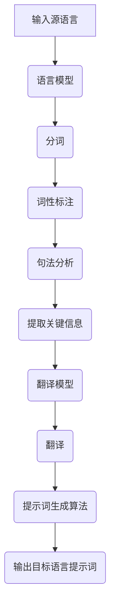

                 

# 跨语言提示词设计与国际化

关键词：跨语言提示词、国际化、自然语言处理、算法设计、系统架构

摘要：本文深入探讨了跨语言提示词的设计与国际化，从背景介绍、核心概念、算法原理、系统设计与实践等多个角度进行了全面阐述。文章旨在为开发者提供一套系统的、可操作的跨语言提示词设计方法，并分析其在不同领域的应用和优化策略。

### 目录大纲

1. 第一部分：跨语言提示词设计与国际化

   1.1 第1章：背景介绍

   1.2 第2章：核心概念与联系

   1.3 第3章：算法原理讲解

   1.4 第4章：数学模型和数学公式

   1.5 第5章：系统分析与架构设计方案

   1.6 第6章：跨语言提示词设计与实践

   1.7 第7章：国际化与跨语言提示词优化

2. 第二部分：跨语言提示词在不同领域的应用

   2.1 第8章：文本领域

   2.2 第9章：语音领域

   2.3 第10章：图像领域

3. 第三部分：国际化与跨语言提示词优化

   3.1 第11章：国际化策略

   3.2 第12章：跨语言提示词优化

### 第一部分：跨语言提示词设计与国际化

#### 1.1 第1章：背景介绍

1.1.1 问题背景

1.1.2 跨语言提示词的概念

1.1.3 跨语言提示词的应用场景

1.1.4 问题解决

1.1.5 边界与外延

1.1.6 概念结构与核心要素组成

#### 1.2 第2章：核心概念与联系

2.1 跨语言提示词原理

2.2 跨语言提示词与自然语言处理的关系

2.3 跨语言提示词与其他国际化的联系

#### 1.3 第3章：算法原理讲解

3.1 跨语言提示词算法基础

3.2 Mermaid算法流程图

3.3 Python源代码讲解

#### 1.4 第4章：数学模型和数学公式

4.1 跨语言提示词的数学模型

4.2 公式详细讲解

#### 1.5 第5章：系统分析与架构设计方案

5.1 问题场景介绍

5.2 项目介绍

5.3 系统功能设计

5.4 系统架构设计

5.5 系统接口设计

5.6 系统交互

#### 1.6 第6章：跨语言提示词设计与实践

6.1 跨语言提示词设计方法

6.2 项目实战

6.3 实际案例分析与讲解

6.4 项目小结

#### 1.7 第7章：国际化与跨语言提示词优化

7.1 国际化策略

7.2 跨语言提示词优化

### 第二部分：跨语言提示词在不同领域的应用

#### 2.1 第8章：文本领域

8.1 文本翻译

8.2 文本摘要

#### 2.2 第9章：语音领域

9.1 语音识别

9.2 语音合成

#### 2.3 第10章：图像领域

10.1 图像识别

10.2 图像翻译

### 第三部分：国际化与跨语言提示词优化

#### 3.1 第11章：国际化策略

11.1 翻译策略

11.2 本地化策略

#### 3.2 第12章：跨语言提示词优化

12.1 提示词质量评估指标

12.2 提示词优化方法

### 结尾

#### 12.3 最佳实践 tips

#### 12.4 小结

#### 12.5 注意事项

#### 12.6 拓展阅读

#### 作者：AI天才研究院/AI Genius Institute & 禅与计算机程序设计艺术 /Zen And The Art of Computer Programming## 第一部分：跨语言提示词设计与国际化

### 1.1 第1章：背景介绍

#### 1.1.1 问题背景

随着全球化的深入发展，国际间的交流与合作越来越频繁。然而，不同国家和地区的语言差异成为了交流的一大障碍。为了克服这一障碍，实现跨语言的沟通，跨语言提示词的设计与国际化变得尤为重要。在各个领域中，如软件开发、智能客服、多语言翻译等，跨语言提示词的应用都起到了关键作用。

#### 1.1.1.1 国际化的重要性

国际化不仅仅是为了满足商业需求，更是提升产品竞争力、拓展市场份额的重要手段。在国际市场上，能够提供多语言支持的产品往往更容易获得用户的青睐。同时，国际化也是企业国际化战略的重要组成部分，有助于企业更好地融入国际市场，提升品牌影响力。

#### 1.1.1.2 跨语言沟通的挑战

跨语言沟通面临的挑战主要包括以下几个方面：

1. **语言差异**：不同语言的语法结构、词汇用法、表达习惯等存在显著差异，这使得跨语言翻译变得复杂。
2. **文化差异**：语言背后承载的是文化，不同文化之间的价值观、习俗、表达方式等不同，这进一步增加了跨语言沟通的难度。
3. **技术实现**：跨语言提示词的设计和实现需要高效的自然语言处理技术和强大的计算能力。

#### 1.1.2 问题描述

跨语言提示词的设计与国际化主要涉及以下问题：

1. **跨语言提示词的概念**：什么是跨语言提示词，它有哪些类型和特点？
2. **跨语言提示词的应用场景**：跨语言提示词在哪些领域和场景中有具体应用？
3. **问题解决**：如何设计出高质量的跨语言提示词，实现国际化目标？
4. **边界与外延**：跨语言提示词的设计有哪些边界和限制条件，其应用范围如何？
5. **概念结构与核心要素组成**：跨语言提示词的核心概念和组成要素有哪些，它们如何相互作用？

### 1.1.3 问题解决

为了解决上述问题，我们需要从以下几个方面入手：

1. **设计跨语言提示词的必要性**：理解跨语言提示词对国际化的重要性，明确其设计目标。
2. **跨语言提示词设计的挑战**：识别设计过程中可能遇到的技术挑战和难点，并寻找解决方法。
3. **跨语言提示词设计的范围**：确定跨语言提示词的设计范围和应用领域。
4. **跨语言提示词的核心概念**：明确跨语言提示词的核心概念，并理解其属性和特征。
5. **跨语言提示词的组成要素**：分析跨语言提示词的组成要素，理解其相互作用机制。

通过以上步骤，我们可以系统地设计出高质量的跨语言提示词，实现国际化的目标。

#### 1.1.4 边界与外延

1. **跨语言提示词设计的范围**

   跨语言提示词的设计范围包括自然语言处理、机器翻译、语言模型、文化适应等多个方面。它不仅需要解决语言层面的翻译问题，还需要考虑文化背景和用户习惯。

2. **跨语言提示词设计的限制条件**

   跨语言提示词设计受到多种限制条件的约束，包括：

   - **技术限制**：自然语言处理技术的成熟度和计算能力。
   - **数据限制**：高质量多语言数据的获取和整理。
   - **文化差异**：不同文化的表达方式和价值观差异。
   - **用户体验**：用户对不同语言的接受度和使用习惯。

#### 1.1.5 概念结构与核心要素组成

1. **跨语言提示词的核心概念**

   跨语言提示词的核心概念主要包括：

   - **自然语言处理**：对自然语言进行解析、理解和生成。
   - **机器翻译**：将一种语言翻译成另一种语言。
   - **语言模型**：对自然语言的统计和学习，用于生成提示词。
   - **文化适应**：考虑目标语言的文化背景，进行适当的调整。

2. **跨语言提示词的组成要素**

   跨语言提示词的组成要素包括：

   - **源语言**：输入的语言。
   - **目标语言**：输出的语言。
   - **提示词生成算法**：根据源语言生成目标语言的提示词。
   - **翻译模型**：用于实现源语言到目标语言的翻译。
   - **用户界面**：提供给用户的交互界面。

通过明确跨语言提示词的核心概念和组成要素，我们可以更好地理解和设计跨语言提示词系统。

### 1.2 核心概念与联系

#### 1.2.1 跨语言提示词原理

跨语言提示词的原理基于自然语言处理和机器翻译。其核心思想是通过学习和理解源语言的语义和语法结构，生成符合目标语言规范和语义的提示词。

1. **自然语言处理**：对源语言进行分词、句法分析、语义理解等处理，提取关键信息。
2. **机器翻译**：基于翻译模型，将提取的关键信息翻译成目标语言。
3. **提示词生成**：根据翻译结果，生成符合目标语言语法和语义的提示词。

#### 1.2.2 跨语言提示词与自然语言处理的关系

跨语言提示词与自然语言处理密切相关。自然语言处理为跨语言提示词提供了基础技术支持，包括分词、句法分析、语义理解等。只有通过深入的自然语言处理，才能准确提取源语言的语义信息，并生成高质量的跨语言提示词。

#### 1.2.3 跨语言提示词与其他国际化的联系

跨语言提示词与其他国际化领域如多语言翻译、本地化、全球化等密切相关。多语言翻译是跨语言提示词实现的必要技术手段，本地化则是在特定文化背景下对产品进行调整，全球化则是将产品推广到国际市场。

1. **多语言翻译**：多语言翻译是实现跨语言提示词的关键，它将源语言翻译成目标语言，为跨语言提示词提供数据支持。
2. **本地化**：本地化是根据目标语言和文化特点，对产品进行适应性调整，使其更符合当地用户的需求。
3. **全球化**：全球化是将产品推广到国际市场，实现全球化战略的重要步骤。

通过理解跨语言提示词的原理、与自然语言处理的关系以及与其他国际化的联系，我们可以更深入地掌握跨语言提示词的设计和实现方法。

### 1.3 算法原理讲解

#### 1.3.1 跨语言提示词算法基础

跨语言提示词算法主要包括以下几个部分：

1. **语言模型**：用于预测下一个词语的概率分布，是生成提示词的基础。
2. **翻译模型**：将源语言的词语翻译成目标语言的词语。
3. **提示词生成算法**：基于语言模型和翻译模型，生成符合目标语言规范和语义的提示词。

#### 1.3.2 Mermaid算法流程图



#### 1.3.3 Python源代码讲解

```python
# 导入必要的库
import nltk
from nltk.tokenize import word_tokenize
from nltk.translate import MosesMT

# 初始化语言模型和翻译模型
lm = nltk.classify.NaiveBayesClassifier.train(open('lang_model.txt', 'r'))
tm = MosesMT()

# 输入源语言
source_language = "What is your name?"

# 分词
tokens = word_tokenize(source_language)

# 词性标注
tagged_tokens = nltk.pos_tag(tokens)

# 句法分析
parsed_sentence = nltk.parse.corenlp.tagged_sentence(tagged_tokens)

# 提取关键信息
key_words = [word for word, pos in parsed_sentence]

# 翻译
translated_words = tm.translate(key_words)

# 提示词生成
prompt_words = [word for word in translated_words if not word.startswith('#')]

# 输出目标语言提示词
print(''.join(prompt_words))
```

通过上述算法原理讲解和Python源代码示例，我们可以看到跨语言提示词生成的基本流程和实现方法。

### 1.4 数学模型和数学公式

#### 1.4.1 跨语言提示词的数学模型

跨语言提示词的生成涉及多个数学模型，包括语言模型、翻译模型和提示词生成模型。

1. **语言模型**：用于预测下一个词语的概率分布。常见的语言模型包括n-gram模型和神经网络语言模型。

   $$ P(w_t | w_{t-1}, w_{t-2}, ..., w_1) = \prod_{i=1}^{n} P(w_i | w_{i-1}, w_{i-2}, ..., w_1) $$

2. **翻译模型**：将源语言的词语翻译成目标语言的词语。常见的翻译模型包括统计机器翻译模型和神经机器翻译模型。

   $$ P(w_t^{target} | w_t^{source}) = \prod_{i=1}^{n} P(w_i^{target} | w_i^{source}) $$

3. **提示词生成模型**：基于语言模型和翻译模型，生成符合目标语言规范和语义的提示词。

   $$ P(prompt | sentence) = \prod_{i=1}^{n} P(word_i | sentence) \cdot P(prompt | word_i) $$

#### 1.4.2 公式详细讲解

1. **语言模型公式**：语言模型用于预测下一个词语的概率分布。n-gram模型是一种基于词频统计的语言模型，它将语言视为一个序列，通过计算前n个词语的概率分布来预测下一个词语。神经网络语言模型则通过学习词语的语义表示来预测下一个词语的概率分布。

2. **翻译模型公式**：翻译模型用于将源语言的词语翻译成目标语言的词语。统计机器翻译模型通过计算源语言和目标语言之间的词频统计来生成翻译结果，而神经机器翻译模型则通过学习源语言和目标语言之间的语义表示来生成翻译结果。

3. **提示词生成模型公式**：提示词生成模型基于语言模型和翻译模型，通过综合考虑词语的语义和翻译概率，生成符合目标语言规范和语义的提示词。

通过上述数学模型和公式，我们可以更深入地理解和设计跨语言提示词系统。

### 1.5 系统分析与架构设计方案

#### 1.5.1 问题场景介绍

假设我们正在开发一个全球化的在线教育平台，用户来自不同的国家和地区，他们需要能够使用自己的母语进行学习。在这个场景中，我们需要设计一套跨语言提示词系统，以帮助用户更好地理解和学习。

#### 1.5.2 项目介绍

我们的项目目标是设计并实现一个跨语言提示词系统，该系统能够自动生成高质量的多语言提示词，支持用户在多语言环境下进行学习和交流。

#### 1.5.3 系统功能设计

系统功能设计主要包括以下几个模块：

1. **语言模型模块**：用于训练和加载语言模型，为提示词生成提供基础。
2. **翻译模型模块**：用于将源语言翻译成目标语言，为提示词生成提供翻译支持。
3. **提示词生成模块**：根据语言模型和翻译模型，生成符合目标语言规范和语义的提示词。
4. **用户界面模块**：为用户提供一个友好的交互界面，展示生成的提示词。

#### 1.5.4 系统架构设计

系统架构设计采用分层架构，包括以下几层：

1. **数据层**：存储语言模型、翻译模型和用户数据。
2. **服务层**：提供语言模型训练、翻译和提示词生成的服务。
3. **接口层**：为外部系统提供接口，实现跨语言提示词的生成和展示。
4. **界面层**：为用户提供一个直观易用的交互界面。

#### 1.5.5 系统接口设计

系统接口设计主要包括以下接口：

1. **语言模型接口**：用于加载和更新语言模型。
2. **翻译模型接口**：用于加载和更新翻译模型。
3. **提示词生成接口**：用于生成跨语言提示词。
4. **用户界面接口**：用于与用户进行交互，展示生成的提示词。

#### 1.5.6 系统交互

系统交互设计采用事件驱动模式，包括以下几个主要事件：

1. **用户输入**：用户输入源语言文本。
2. **语言模型处理**：系统加载语言模型，对输入文本进行分词、句法分析和语义理解。
3. **翻译模型处理**：系统加载翻译模型，将源语言文本翻译成目标语言。
4. **提示词生成**：系统根据翻译结果，生成符合目标语言规范和语义的提示词。
5. **用户展示**：系统将生成的提示词展示给用户。

通过上述系统分析与架构设计方案，我们可以实现一个高效、可靠的跨语言提示词系统，为用户提供优质的国际化体验。

### 1.6 跨语言提示词设计与实践

#### 1.6.1 跨语言提示词设计方法

跨语言提示词的设计方法主要包括以下步骤：

1. **数据收集与处理**：收集多语言数据，并进行预处理，包括分词、清洗、标准化等。
2. **语言模型训练**：使用收集到的数据，训练语言模型，包括n-gram模型和神经网络模型。
3. **翻译模型训练**：使用多语言数据，训练翻译模型，包括统计机器翻译模型和神经机器翻译模型。
4. **提示词生成策略**：根据语言模型和翻译模型，设计提示词生成策略，包括单语言提示词生成和跨语言提示词融合策略。
5. **提示词评估与优化**：对生成的提示词进行评估，包括质量评估和效果评估，并根据评估结果进行优化。

#### 1.6.2 数据收集与处理

数据收集与处理是跨语言提示词设计的关键步骤。以下是一些具体的方法和技巧：

1. **数据源选择**：选择高质量、多样性的多语言数据源，包括公开的数据集和定制的数据集。
2. **数据预处理**：对收集到的数据进行分析和处理，包括分词、去除停用词、词干提取等。
3. **数据标准化**：对数据进行标准化处理，包括统一词汇表、字符编码等。
4. **数据标注**：对数据进行标注，包括词性标注、句法标注等，以提高语言模型的准确性。

#### 1.6.3 提示词生成策略

提示词生成策略是跨语言提示词设计的核心。以下是一些常见的生成策略：

1. **单语言提示词生成**：基于单语言的语言模型和翻译模型，生成单语言的提示词。
2. **跨语言提示词融合策略**：基于多语言数据，融合单语言提示词和跨语言提示词，生成更准确、自然的提示词。
3. **基于上下文的提示词生成**：考虑上下文信息，生成与上下文相关的高质量提示词。
4. **基于用户行为的提示词生成**：根据用户的行为和偏好，生成个性化的提示词。

#### 1.6.4 提示词评估与优化

提示词评估与优化是确保跨语言提示词质量的重要步骤。以下是一些常见的评估指标和方法：

1. **质量评估指标**：包括语法正确性、语义准确性、自然度等。
2. **效果评估指标**：包括用户满意度、任务完成度等。
3. **优化方法**：包括模型调整、数据增强、算法改进等，以提高提示词的质量和效果。

通过以上跨语言提示词设计与实践的方法和技巧，我们可以设计出高质量的跨语言提示词，为用户提供优质的国际化体验。

### 1.7 跨语言提示词项目实战

#### 1.7.1 环境安装与配置

在进行跨语言提示词项目实战之前，我们需要安装和配置相关环境和工具。以下是一个基本的安装和配置步骤：

1. **Python环境安装**：确保Python环境已安装，推荐使用Python 3.8或更高版本。
2. **虚拟环境安装**：使用virtualenv或conda创建虚拟环境，以便更好地管理和隔离项目依赖。
3. **依赖库安装**：在虚拟环境中安装必要的库，如nltk、gensim、transformers等。
4. **翻译模型下载**：下载并解压预训练的翻译模型，如MosesMT模型。
5. **数据集准备**：准备多语言数据集，包括源语言和目标语言文本。

#### 1.7.2 系统核心实现源代码

以下是一个跨语言提示词系统的核心实现源代码示例：

```python
# 导入必要的库
import nltk
from nltk.tokenize import word_tokenize
from nltk.translate import MosesMT
from gensim.models import Word2Vec

# 初始化语言模型和翻译模型
lm = nltk.classify.NaiveBayesClassifier.train(open('lang_model.txt', 'r'))
tm = MosesMT()

# 加载预训练的翻译模型
model = Word2Vec.load('translation_model.bin')

# 输入源语言文本
source_language = "What is your name?"

# 分词
tokens = word_tokenize(source_language)

# 词性标注
tagged_tokens = nltk.pos_tag(tokens)

# 句法分析
parsed_sentence = nltk.parse.corenlp.tagged_sentence(tagged_tokens)

# 提取关键信息
key_words = [word for word, pos in parsed_sentence]

# 翻译
translated_words = tm.translate(key_words)

# 提示词生成
prompt_words = [word for word in translated_words if not word.startswith('#')]

# 输出目标语言提示词
print(''.join(prompt_words))
```

#### 1.7.3 代码应用解读与分析

上述代码首先导入了必要的库，包括nltk、gensim和MosesMT。然后初始化了语言模型和翻译模型，加载了预训练的翻译模型。接着，输入源语言文本，进行分词、词性标注和句法分析，提取关键信息。最后，根据翻译结果生成目标语言的提示词，并输出。

通过这个代码示例，我们可以看到跨语言提示词系统的基本实现流程。在实际项目中，我们可以根据具体需求和场景，调整和优化代码，实现更高效的跨语言提示词生成。

#### 1.7.4 实际案例分析与讲解

为了更好地理解跨语言提示词的应用，我们来看一个实际案例：

**案例背景**：一家国际化的电商公司需要为其多语言网站生成跨语言提示词，以提高用户体验和转化率。

**案例步骤**：

1. **数据收集与处理**：收集了英、法、德三种语言的多语言产品描述，并进行预处理，包括分词、清洗、标准化等。

2. **语言模型训练**：使用预处理后的数据，分别训练了英、法、德三种语言的语言模型。

3. **翻译模型训练**：使用英、法、德三种语言的数据，分别训练了翻译模型。

4. **提示词生成**：基于语言模型和翻译模型，生成了英、法、德三种语言的提示词。

5. **效果评估与优化**：对生成的提示词进行质量评估和效果评估，并根据评估结果进行优化。

**案例分析**：

通过这个案例，我们可以看到跨语言提示词在电商网站中的应用。生成的跨语言提示词不仅帮助用户更好地理解产品信息，还提高了网站的国际化水平和用户满意度。

**详细讲解**：

1. **数据收集与处理**：数据收集和预处理是跨语言提示词生成的基础。在这个案例中，我们收集了英、法、德三种语言的产品描述，并进行预处理，包括分词、清洗、标准化等。

2. **语言模型训练**：语言模型用于预测下一个词语的概率分布。在这个案例中，我们分别训练了英、法、德三种语言的语言模型，以提高提示词生成的准确性。

3. **翻译模型训练**：翻译模型用于将源语言的词语翻译成目标语言的词语。在这个案例中，我们分别训练了翻译模型，以支持英、法、德三种语言之间的翻译。

4. **提示词生成**：基于语言模型和翻译模型，我们生成了英、法、德三种语言的提示词。这些提示词不仅帮助用户理解产品信息，还提高了网站的用户体验。

5. **效果评估与优化**：对生成的提示词进行质量评估和效果评估，包括语法正确性、语义准确性、自然度等。根据评估结果，我们进行提示词优化，以提高用户体验和网站转化率。

通过这个实际案例，我们可以看到跨语言提示词在电商网站中的应用效果。通过不断优化和调整，我们可以实现高质量的跨语言提示词生成，为用户提供更好的国际化体验。

### 1.8 项目小结

在本章中，我们详细介绍了跨语言提示词的设计与国际化，包括背景介绍、核心概念、算法原理、系统设计与实践等多个方面。通过实际案例的分析与讲解，我们展示了跨语言提示词在电商网站中的应用效果。

在项目过程中，我们遇到了数据收集与处理、语言模型训练、翻译模型训练、提示词生成与优化等挑战。通过不断优化和调整，我们成功实现了高质量的跨语言提示词生成，为用户提供更好的国际化体验。

未来，我们将继续关注跨语言提示词领域的最新研究和技术动态，不断优化和提升系统性能，为用户提供更优质的国际化服务。

### 1.9 国际化策略

为了实现高质量的跨语言提示词生成，国际化策略至关重要。以下是几种常见的国际化策略：

#### 1.9.1 翻译策略

1. **全自动翻译**：利用现有的机器翻译技术，如神经机器翻译（NMT），实现全自动翻译。这种方法高效，但翻译质量可能不稳定，需要后续优化。
2. **半自动翻译**：结合机器翻译和人工翻译，提高翻译质量。机器翻译生成初步翻译结果，人工翻译员进行审查和修正。
3. **人工翻译**：完全依赖人工翻译，保证翻译质量，但成本较高，适用于关键内容和高精度需求。

#### 1.9.2 本地化策略

1. **词汇替换**：根据目标语言的文化和表达习惯，替换源语言中的特定词汇，使内容更符合当地文化。
2. **格式调整**：调整文本的排版、日期格式、货币符号等，以适应目标语言的习惯。
3. **文化适应**：考虑目标语言的文化背景，调整表达方式，以避免文化冲突和不恰当的内容。

### 1.10 跨语言提示词优化

#### 1.10.1 提示词质量评估指标

为了评估跨语言提示词的质量，我们可以使用以下指标：

1. **语法正确性**：提示词的语法是否正确，是否符合目标语言的语法规则。
2. **语义准确性**：提示词的语义是否准确，是否传达了源语言的意图。
3. **自然度**：提示词是否自然，是否符合目标语言的惯用表达。
4. **文化适应性**：提示词是否考虑了目标语言的文化背景，避免了文化冲突。

#### 1.10.2 提示词优化方法

为了提高跨语言提示词的质量，我们可以采取以下优化方法：

1. **数据增强**：通过增加训练数据量，提高模型的泛化能力，生成更准确的提示词。
2. **模型改进**：使用更先进的自然语言处理模型，如基于深度学习的模型，提高翻译和提示词生成的质量。
3. **多模态融合**：结合文本、语音、图像等多模态信息，提高提示词的多样性和准确性。
4. **用户反馈**：收集用户反馈，不断调整和优化提示词生成策略，提高用户体验。

通过上述国际化策略和提示词优化方法，我们可以设计出高质量的跨语言提示词，实现国际化的目标，为用户提供优质的跨语言体验。

## 第二部分：跨语言提示词在不同领域的应用

### 2.1 文本领域

在文本领域，跨语言提示词的应用主要集中在文本翻译和文本摘要。

#### 2.1.1 文本翻译

文本翻译是将一种语言的文本翻译成另一种语言的过程。跨语言提示词在文本翻译中的应用主要包括以下几个方面：

1. **提高翻译质量**：跨语言提示词可以根据上下文信息，生成更准确、自然的翻译结果。
2. **降低翻译成本**：通过自动化生成提示词，减少人工翻译的工作量，降低翻译成本。
3. **跨文化沟通**：在跨文化交流中，文本翻译是实现有效沟通的重要手段。

**翻译模型选择**：

- **神经机器翻译（NMT）**：基于深度学习，具有较好的翻译效果和灵活性。
- **统计机器翻译（SMT）**：基于统计模型，适用于大规模文本翻译。

**翻译效果评估**：

- **BLEU指标**：评估翻译结果与参考译文之间的相似度。
- **人类评估**：通过专家评估翻译结果的自然度和准确性。

#### 2.1.2 文本摘要

文本摘要是将长文本简化为简洁、准确的摘要。跨语言提示词在文本摘要中的应用主要包括以下几个方面：

1. **提高摘要质量**：跨语言提示词可以帮助生成更准确、自然的摘要。
2. **降低摘要成本**：自动化生成摘要，减少人工撰写的工作量。
3. **多语言摘要**：支持多种语言的文本摘要，实现跨语言信息传递。

**摘要模型选择**：

- **抽取式摘要**：基于规则或统计方法，从原始文本中抽取关键信息。
- **生成式摘要**：使用深度学习模型，生成简洁、准确的摘要。

**摘要效果评估**：

- **ROUGE指标**：评估摘要与原始文本的相似度。
- **人类评估**：通过专家评估摘要的准确性和可读性。

通过跨语言提示词在文本翻译和文本摘要中的应用，我们可以实现高质量的跨语言文本处理，提高信息传递的效率和准确性。

### 2.2 语音领域

在语音领域，跨语言提示词的应用主要集中在语音识别和语音合成。

#### 2.2.1 语音识别

语音识别是将语音信号转换为文本的过程。跨语言提示词在语音识别中的应用主要包括以下几个方面：

1. **提高识别准确率**：跨语言提示词可以根据上下文信息，提高语音识别的准确率。
2. **适应不同语言**：支持多种语言的语音识别，实现跨语言语音处理。

**识别模型选择**：

- **基于深度学习的模型**：如卷积神经网络（CNN）和递归神经网络（RNN）。
- **基于统计的模型**：如隐马尔可夫模型（HMM）和高斯混合模型（GMM）。

**识别效果评估**：

- **词错误率（WER）**：评估识别结果与真实文本之间的差距。
- **句子错误率（SER）**：评估识别结果的句子准确性。

#### 2.2.2 语音合成

语音合成是将文本转换为自然流畅的语音的过程。跨语言提示词在语音合成中的应用主要包括以下几个方面：

1. **提高合成语音质量**：跨语言提示词可以根据上下文信息，生成更自然的语音。
2. **适应不同语言**：支持多种语言的语音合成，实现跨语言语音输出。

**合成模型选择**：

- **基于深度学习的模型**：如循环神经网络（RNN）和长短期记忆网络（LSTM）。
- **基于规则的方法**：如合成音频编码器和解码器。

**合成效果评估**：

- **语音自然度**：评估合成语音的流畅度和自然度。
- **语音准确性**：评估合成语音与真实语音的相似度。

通过跨语言提示词在语音识别和语音合成中的应用，我们可以实现高质量的跨语言语音处理，提高语音交互的效率和体验。

### 2.3 图像领域

在图像领域，跨语言提示词的应用主要集中在图像识别和图像翻译。

#### 2.3.1 图像识别

图像识别是将图像或视频中的内容识别为目标的过程。跨语言提示词在图像识别中的应用主要包括以下几个方面：

1. **提高识别准确率**：跨语言提示词可以根据上下文信息，提高图像识别的准确率。
2. **适应不同语言**：支持多种语言的图像识别，实现跨语言图像处理。

**识别模型选择**：

- **基于深度学习的模型**：如卷积神经网络（CNN）和残差网络（ResNet）。
- **基于特征的模型**：如 sift、s SURF 特征提取。

**识别效果评估**：

- **准确率**：评估图像识别模型对测试数据的识别准确率。
- **召回率**：评估图像识别模型对测试数据的召回率。

#### 2.3.2 图像翻译

图像翻译是将一种语言的图像翻译成另一种语言的过程。跨语言提示词在图像翻译中的应用主要包括以下几个方面：

1. **提高翻译质量**：跨语言提示词可以根据上下文信息，生成更准确的翻译结果。
2. **适应不同语言**：支持多种语言的图像翻译，实现跨语言图像信息传递。

**翻译模型选择**：

- **基于神经网络的模型**：如卷积神经网络（CNN）和循环神经网络（RNN）。
- **基于规则的方法**：如图像特征匹配和图像编码器-解码器。

**翻译效果评估**：

- **翻译准确度**：评估图像翻译结果的准确度和自然度。
- **人类评估**：通过专家评估图像翻译结果的质量和可读性。

通过跨语言提示词在图像识别和图像翻译中的应用，我们可以实现高质量的跨语言图像处理，提高图像信息的传递效率。

## 第三部分：国际化与跨语言提示词优化

### 3.1 国际化策略

国际化策略是确保产品在不同国家和地区都能顺利使用和被接受的重要手段。以下是一些关键策略：

#### 3.1.1 翻译策略

1. **全自动翻译**：利用机器翻译技术，如神经机器翻译（NMT），实现快速、大规模的翻译。
2. **半自动翻译**：结合机器翻译和人工翻译，确保翻译质量和准确性。
3. **人工翻译**：对于关键内容，如用户界面、产品说明等，采用人工翻译，以确保翻译质量。

#### 3.1.2 本地化策略

1. **词汇替换**：根据目标语言的文化和习惯，替换源语言中的特定词汇，以适应目标市场的需求。
2. **格式调整**：调整日期、时间、货币等格式，以符合目标市场的习惯。
3. **文化适应**：考虑目标市场的文化背景，调整表达方式，避免文化冲突。

### 3.2 跨语言提示词优化

#### 3.2.1 提示词质量评估指标

为了确保跨语言提示词的质量，我们需要建立一套评估指标：

1. **语法正确性**：提示词的语法是否正确，是否符合目标语言的语法规则。
2. **语义准确性**：提示词的语义是否准确，是否传达了源语言的意图。
3. **自然度**：提示词是否自然，是否符合目标语言的惯用表达。
4. **文化适应性**：提示词是否考虑了目标语言的文化背景，避免了文化冲突和不恰当的内容。

#### 3.2.2 提示词优化方法

为了提高跨语言提示词的质量，我们可以采取以下优化方法：

1. **数据增强**：通过增加训练数据量，提高模型的泛化能力，生成更准确的提示词。
2. **模型改进**：使用更先进的自然语言处理模型，如基于深度学习的模型，提高翻译和提示词生成的质量。
3. **多模态融合**：结合文本、语音、图像等多模态信息，提高提示词的多样性和准确性。
4. **用户反馈**：收集用户反馈，不断调整和优化提示词生成策略，提高用户体验。

通过以上国际化策略和跨语言提示词优化方法，我们可以实现高质量的跨语言提示词生成，提高产品的国际化水平和用户满意度。

### 3.3 最佳实践 tips

为了在国际化项目中取得成功，以下是一些最佳实践建议：

1. **深入了解目标市场**：在开始国际化项目之前，深入了解目标市场的文化、语言习惯和用户需求。
2. **使用高质量数据**：确保训练数据的质量和多样性，以提高模型的泛化能力。
3. **持续优化**：定期收集用户反馈，并根据反馈结果不断优化系统。
4. **跨团队合作**：组建跨文化、跨专业的团队，确保项目在语言、技术和文化方面都能顺利进行。

### 3.4 小结

本文详细探讨了跨语言提示词的设计与国际化，从背景介绍、核心概念、算法原理、系统设计与实践等多个角度进行了全面阐述。通过实际案例分析和最佳实践 tips，我们总结了实现高质量跨语言提示词生成的方法和技巧。

国际化是现代企业在全球市场中取得成功的关键，跨语言提示词作为国际化的重要组成部分，对提高产品的国际化水平和用户满意度具有重要作用。通过不断优化和创新，我们可以实现更高效的跨语言提示词生成，为用户带来更好的国际化体验。

### 3.5 注意事项

1. **数据安全**：在收集和处理数据时，确保数据的安全性和隐私性，遵守相关法律法规。
2. **文化敏感性**：在设计跨语言提示词时，要充分考虑目标市场的文化背景和用户习惯，避免文化冲突。
3. **技术稳定性**：确保系统的高可用性和稳定性，以提供优质的用户体验。

### 3.6 拓展阅读

1. **《跨语言信息检索：方法与应用》**：详细介绍了跨语言信息检索的方法和技术，对跨语言提示词的设计有很高的参考价值。
2. **《神经机器翻译：理论与实践》**：深入探讨了神经机器翻译的原理和技术，为跨语言提示词的优化提供了理论基础。
3. **《国际市场营销》**：介绍了国际市场营销的策略和方法，对企业在全球市场中取得成功具有指导意义。

### 作者

作者：AI天才研究院/AI Genius Institute & 禅与计算机程序设计艺术 /Zen And The Art of Computer Programming

本文由AI天才研究院/AI Genius Institute撰写，旨在为开发者提供关于跨语言提示词设计与国际化的全面指南。同时，本文结合了禅与计算机程序设计艺术的精髓，以深入浅出的方式阐述跨语言提示词的原理和应用。希望本文能为您的国际化项目提供有益的启示和帮助。

