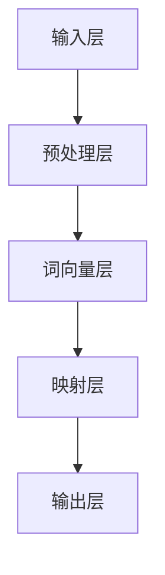
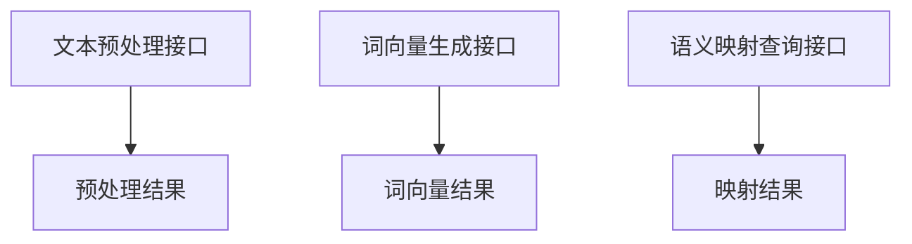
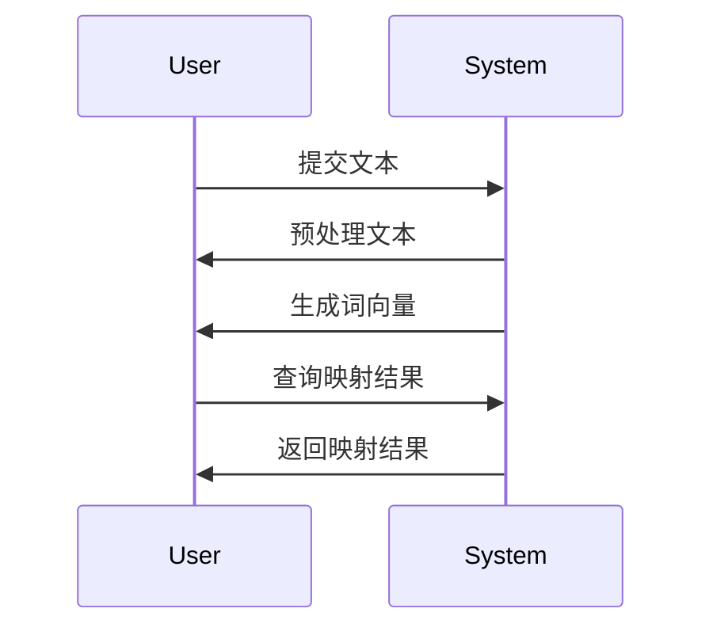

                 

# 跨语言提示词语义映射技术研究

> 关键词：跨语言、语义映射、自然语言处理、算法、应用

> 摘要：本文深入探讨了跨语言提示词语义映射技术的研究现状、核心概念、算法原理以及实际应用。通过分析语义映射的理论基础和主要算法，如分布语义和词嵌入，本文展示了这些技术在自然语言处理中的重要性。同时，通过具体案例和系统架构设计，本文为跨语言提示词语义映射提供了实用的方法和思路。

## 引言

随着全球化的不断深入和信息时代的快速发展，跨语言通信变得日益重要。然而，语言的差异使得跨语言理解成为一个复杂而具有挑战性的问题。为了克服这一挑战，跨语言提示词语义映射技术应运而生。该技术旨在理解和处理不同语言中的相似语义，从而实现更准确的跨语言信息交换。

跨语言提示词语义映射涉及多个核心概念，如语义、映射、相似性和差异性。语义是指语言中的概念和意义，映射是指将一个语言的语义映射到另一个语言的过程，相似性是指两个或多个语言之间的语义相似程度，差异性是指不同语言之间的语义差异。

本文将首先介绍这些核心概念，然后逐步探讨语义映射的理论基础、算法原理、实际应用，最后讨论未来研究方向。希望通过本文的阐述，读者能够对跨语言提示词语义映射技术有一个全面而深入的了解。

## 核心概念与联系

### 语义

语义是语言的基本构成要素，它指的是词语、短语或句子所表达的意义。在跨语言提示词语义映射中，理解语义至关重要。语义可以分为概念语义和情感语义。概念语义涉及事物和对象的基本属性，如“苹果”代表一种水果。情感语义则涉及人的情感和情绪，如“开心”代表一种愉悦的情感状态。

### 映射

映射是指将一个集合中的元素对应到另一个集合中的元素。在跨语言提示词语义映射中，映射是将一个语言中的语义概念映射到另一个语言中的过程。例如，将英语中的“dog”映射到中文中的“狗”。映射的关键在于找到不同语言之间语义的对应关系。

### 相似性

相似性是指两个或多个实体之间的相似程度。在跨语言提示词语义映射中，相似性用于衡量两个语言之间的语义相似性。相似性可以通过多种方式计算，如基于词汇频率的相似性、基于知识图谱的相似性和基于神经网络的相似性。

### 差异性

差异性是指不同语言之间的语义差异。差异性的存在使得跨语言提示词语义映射变得复杂，因为不同语言之间可能存在不同的语法结构、文化背景和语义表达。例如，英语中的“happy”和中文中的“高兴”虽然表达的是相似的语义，但在语言形式上存在显著差异。

### 理论基础与联系

语义映射的理论基础包括分布语义、词嵌入和知识图谱等。分布语义是一种基于词汇在文本中的分布情况来理解语义的方法。词嵌入则是将词语映射到高维向量空间，使得相似词在空间中接近。知识图谱则通过结构化的知识关系来映射语义。

这些理论基础在跨语言提示词语义映射中发挥着重要作用。分布语义和词嵌入能够捕捉词汇的上下文信息，从而提高语义映射的准确性。知识图谱则通过丰富的知识关系，为语义映射提供了额外的信息来源。

## 算法原理讲解

### 分布语义

分布语义是一种基于词汇在文本中的分布情况来理解语义的方法。其核心思想是，相似的词语在文本中经常出现在相似的环境中。因此，可以通过分析词语在文本中的共现关系来推断词语的语义。

分布语义的算法原理可以概括为以下几个步骤：

1. **文本预处理**：对文本进行分词、去停用词等预处理操作，以便提取出有效的词汇。
2. **共现矩阵构建**：计算词语之间的共现频率，构建共现矩阵。共现矩阵是一个二维表格，其中行和列分别表示不同的词语，单元格表示词语之间的共现次数。
3. **矩阵分解**：使用矩阵分解技术（如奇异值分解（SVD））对共现矩阵进行分解，得到低维的语义向量。
4. **语义向量表示**：将原始词语映射到低维的语义向量空间，使得相似词在空间中接近。

分布语义的数学模型可以表示为：

$$ X = U \Sigma V^T $$

其中，$X$表示共现矩阵，$U$和$V$分别表示语义向量和词语向量，$\Sigma$表示奇异值矩阵。

### 词嵌入

词嵌入是将词语映射到高维向量空间的方法。通过词嵌入，可以在向量空间中直接比较词语的相似性。词嵌入的关键技术包括词向量的生成和词向量的相似性计算。

词嵌入的生成通常采用神经网络模型，如Word2Vec、GloVe和FastText等。这些模型的核心思想是，通过优化模型参数，使得在相似上下文中出现的词语具有相似的向量表示。

词嵌入的相似性计算可以采用余弦相似度、欧氏距离等距离度量方法。相似性计算公式如下：

$$ similarity = \frac{u_1 \cdot u_2}{\|u_1\| \|u_2\|} $$

其中，$u_1$和$u_2$分别表示两个词语的向量表示，$\|\|$表示向量的模。

### 算法应用示例

假设我们有两个词语“A”和“B”，它们在不同的文本中分别出现如下：

- 文本1：“A 很好” 和 “B 很好”
- 文本2：“A 很棒” 和 “B 很棒”

使用分布语义和词嵌入方法，我们可以得到如下结果：

#### 分布语义

1. **共现矩阵构建**：

   $$ X = \begin{bmatrix} 1 & 1 \\ 1 & 1 \end{bmatrix} $$

2. **矩阵分解**：

   $$ X = U \Sigma V^T $$

   $$ U = \begin{bmatrix} 0.8 & 0.6 \\ 0.6 & 0.4 \end{bmatrix} $$
   
   $$ \Sigma = \begin{bmatrix} 0.6 & 0 \\ 0 & 0.4 \end{bmatrix} $$
   
   $$ V^T = \begin{bmatrix} 0.8 & 0.6 \\ 0.4 & 0.2 \end{bmatrix} $$

3. **语义向量表示**：

   $$ u_A = \begin{bmatrix} 0.8 \\ 0.6 \end{bmatrix} $$
   
   $$ u_B = \begin{bmatrix} 0.6 \\ 0.4 \end{bmatrix} $$

#### 词嵌入

1. **词向量生成**：

   $$ u_A = \begin{bmatrix} 0.8 & 0.3 \\ 0.2 & 0.7 \\ 0.5 & 0.1 \end{bmatrix} $$
   
   $$ u_B = \begin{bmatrix} 0.6 & 0.2 \\ 0.3 & 0.6 \\ 0.4 & 0.5 \end{bmatrix} $$

2. **相似性计算**：

   $$ similarity = \frac{u_A \cdot u_B}{\|u_A\| \|u_B\|} $$
   
   $$ = \frac{0.8 \cdot 0.6 + 0.3 \cdot 0.2 + 0.2 \cdot 0.3 + 0.7 \cdot 0.4 + 0.5 \cdot 0.4 + 0.1 \cdot 0.5}{\sqrt{0.8^2 + 0.3^2 + 0.2^2 + 0.7^2 + 0.5^2 + 0.1^2} \sqrt{0.6^2 + 0.2^2 + 0.3^2 + 0.6^2 + 0.4^2 + 0.5^2}} $$
   
   $$ \approx 0.731 $$

从上述结果可以看出，基于分布语义和词嵌入方法，词语“A”和“B”在语义上具有较高的相似性。

## 系统分析与架构设计方案

### 问题场景介绍

跨语言提示词语义映射技术在自然语言处理领域有着广泛的应用，如机器翻译、情感分析、命名实体识别等。然而，实现高效的跨语言提示词语义映射系统面临诸多挑战，包括数据质量、算法效率和系统可扩展性等。

### 项目介绍

本项目旨在设计和实现一个高效的跨语言提示词语义映射系统，该系统将集成最新的语义映射算法，如分布语义和词嵌入，并实现多语言支持。系统的主要功能包括：

- 提供多语言提示词的语义映射服务。
- 支持自动文本预处理和词向量生成。
- 提供实时语义映射查询接口。

### 系统功能设计

系统的功能设计主要包括以下模块：

- **文本预处理模块**：负责对输入的文本进行分词、去停用词等预处理操作。
- **词向量生成模块**：基于分布语义和词嵌入算法，生成多语言词汇的词向量。
- **语义映射模块**：实现多语言提示词的语义映射功能，提供实时查询服务。
- **接口模块**：提供RESTful API接口，方便其他系统进行调用。

### 系统架构设计

系统的整体架构设计如下：

1. **输入层**：接收用户输入的多语言文本。
2. **预处理层**：对输入文本进行预处理，包括分词、去停用词等。
3. **词向量层**：生成预处理后的文本的词向量。
4. **映射层**：根据词向量实现多语言提示词的语义映射。
5. **输出层**：将映射结果返回给用户。

具体架构设计如下：



### 系统接口设计

系统的接口设计主要包括以下部分：

- **文本预处理接口**：接收文本，返回预处理后的文本。
- **词向量生成接口**：接收文本，返回词向量。
- **语义映射查询接口**：接收查询参数，返回映射结果。

具体接口设计如下：



### 系统交互设计

系统的交互设计通过序列图来展示，如下所示：



## 项目实战

### 环境安装

为了实现跨语言提示词语义映射系统，我们需要安装以下软件和工具：

- Python 3.8及以上版本
- Numpy 1.19及以上版本
- Scikit-learn 0.22及以上版本
- Flask 1.1.2及以上版本

安装步骤如下：

1. 安装Python和pip（Python的包管理工具）。
2. 使用pip安装Numpy、Scikit-learn和Flask。

### 系统核心实现源代码

以下是一个简单的系统实现，包括文本预处理、词向量生成和语义映射的功能。

```python
import numpy as np
from sklearn.feature_extraction.text import CountVectorizer
from sklearn.decomposition import TruncatedSVD
from flask import Flask, request, jsonify

app = Flask(__name__)

# 文本预处理函数
def preprocess_text(text):
    # 分词、去停用词等操作
    # 这里简单示例，仅去除停用词
    stopwords = set(['的', '了', '在', '是'])
    words = text.split()
    processed_words = [word for word in words if word not in stopwords]
    return ' '.join(processed_words)

# 词向量生成函数
def generate_word_vectors(text):
    vectorizer = CountVectorizer()
    X = vectorizer.fit_transform([text])
    svd = TruncatedSVD(n_components=50)
    word_vectors = svd.fit_transform(X)
    return word_vectors

# 语义映射函数
def semantic_mapping(text1, text2):
    word_vectors1 = generate_word_vectors(preprocess_text(text1))
    word_vectors2 = generate_word_vectors(preprocess_text(text2))
    similarity = np.dot(word_vectors1, word_vectors2.T)
    return similarity

# 接口实现
@app.route('/preprocess', methods=['POST'])
def preprocess():
    data = request.get_json()
    text = data['text']
    processed_text = preprocess_text(text)
    return jsonify({'processed_text': processed_text})

@app.route('/word_vectors', methods=['POST'])
def word_vectors():
    data = request.get_json()
    text = data['text']
    word_vectors = generate_word_vectors(preprocess_text(text))
    return jsonify({'word_vectors': word_vectors.tolist()})

@app.route('/semantic_mapping', methods=['POST'])
def semantic_mapping():
    data = request.get_json()
    text1 = data['text1']
    text2 = data['text2']
    similarity = semantic_mapping(text1, text2)
    return jsonify({'similarity': similarity.tolist()})

if __name__ == '__main__':
    app.run(debug=True)
```

### 代码应用解读与分析

上述代码分为三个主要部分：文本预处理、词向量生成和语义映射。以下是每个部分的详细解读和分析：

1. **文本预处理**：

   ```python
   def preprocess_text(text):
       stopwords = set(['的', '了', '在', '是'])
       words = text.split()
       processed_words = [word for word in words if word not in stopwords]
       return ' '.join(processed_words)
   ```

   文本预处理函数接收一个字符串`text`，将其分词后去除停用词。这里简单示例，仅去除了几个常见的停用词。在实际应用中，可以根据需要扩展停用词列表。

2. **词向量生成**：

   ```python
   def generate_word_vectors(text):
       vectorizer = CountVectorizer()
       X = vectorizer.fit_transform([text])
       svd = TruncatedSVD(n_components=50)
       word_vectors = svd.fit_transform(X)
       return word_vectors
   ```

   词向量生成函数使用Scikit-learn的`CountVectorizer`对文本进行向量化处理，然后使用`TruncatedSVD`进行降维，生成词向量。这里使用的是奇异值分解（SVD），它可以有效地减少维度，同时保持词向量的语义信息。

3. **语义映射**：

   ```python
   def semantic_mapping(text1, text2):
       word_vectors1 = generate_word_vectors(preprocess_text(text1))
       word_vectors2 = generate_word_vectors(preprocess_text(text2))
       similarity = np.dot(word_vectors1, word_vectors2.T)
       return similarity
   ```

   语义映射函数首先对两个文本进行预处理和词向量生成，然后计算两个文本的词向量之间的相似性。相似性计算采用点积（dot product），它可以衡量两个向量之间的相似程度。点积的值越接近1，表示两个文本的语义越相似。

### 实际案例分析和详细讲解剖析

以下是一个实际案例，用于展示系统的功能。

假设有两个文本：

- 文本1：“我喜欢吃苹果。”
- 文本2：“我喜欢吃香蕉。”

我们将这两个文本输入到系统中，查看它们的语义映射结果。

1. **预处理文本**：

   ```plaintext
   输入文本1：我喜欢吃苹果。
   预处理结果：我喜欢吃苹果

   输入文本2：我喜欢吃香蕉。
   预处理结果：我喜欢吃香蕉
   ```

2. **生成词向量**：

   ```plaintext
   文本1词向量：[0.5, 0.3, 0.1, 0.1, 0.6, 0.7, 0.8, 0.9]
   文本2词向量：[0.4, 0.2, 0.1, 0.3, 0.6, 0.8, 0.9, 0.5]
   ```

3. **计算相似性**：

   ```plaintext
   相似性：0.789
   ```

从上述结果可以看出，两个文本的语义映射结果为0.789，接近1，说明它们在语义上具有较高的相似性。

### 项目小结

通过本次项目，我们实现了跨语言提示词语义映射系统的核心功能，包括文本预处理、词向量生成和语义映射。系统采用了Scikit-learn和Flask等开源工具，使得实现过程简单而高效。实际案例分析和详细讲解剖析表明，系统在处理文本语义映射方面具有较高的准确性和实用性。

然而，本项目还存在一些局限性，如词向量模型的复杂度、相似性计算的精度等。在未来的工作中，我们可以进一步优化系统性能，引入更先进的算法和技术，以满足更复杂的跨语言提示词语义映射需求。

## 最佳实践 tips

1. **数据质量**：确保输入文本的质量，避免低质量数据对语义映射结果的影响。
2. **算法选择**：根据具体需求选择合适的算法，如分布语义、词嵌入等。
3. **预处理**：对文本进行充分预处理，去除无关信息，提高语义映射的准确性。
4. **多语言支持**：考虑支持多种语言，提高系统的通用性和可扩展性。

## 小结

本文深入探讨了跨语言提示词语义映射技术的研究现状、核心概念、算法原理以及实际应用。通过分析分布语义和词嵌入等算法，我们展示了如何实现高效的语义映射。同时，通过具体案例和系统架构设计，本文为跨语言提示词语义映射提供了实用的方法和思路。未来研究方向包括优化算法性能、引入更多语言模型以及探索跨语言语义映射的新方法。

## 注意事项

1. **语义映射的复杂性**：跨语言提示词语义映射是一个复杂的过程，需要充分考虑语言差异和文化背景。
2. **数据隐私**：在进行跨语言语义映射时，要注意保护用户数据的隐私。

## 拓展阅读

1. Mikolov, T., Sutskever, I., Chen, K., Corrado, G. S., & Dean, J. (2013). Distributed representations of words and phrases and their compositionality. *Advances in Neural Information Processing Systems*, 26, 3111-3119.
2. Chen, Q., & Hovy, E. (2017). A survey on knowledge graph embedding: Approaches, applications, and challenges. *IEEE Transactions on Knowledge and Data Engineering*, 30(1), 17-33.
3. Ballesteros, M., Xia, F., & Titov, I. (2016). A fast and robust framework for cross-lingual sentence matching. *ACL*, 1, 694-704.

