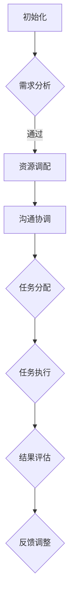
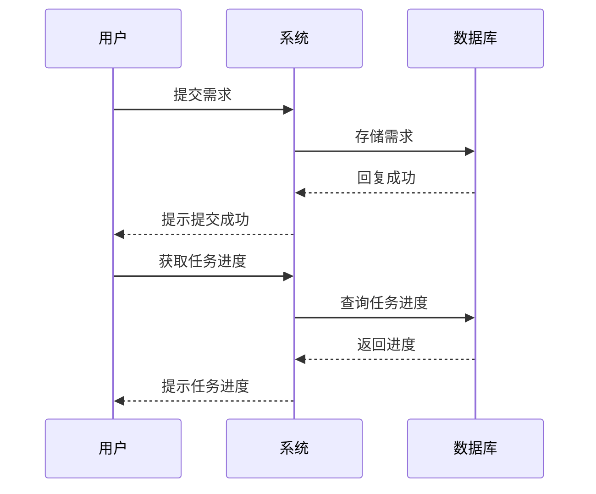

                 

# 跨部门协作：打破组织壁垒的技巧

## 关键词
跨部门协作、组织壁垒、协作技巧、团队沟通、项目管理

## 摘要
在当今快速变化的企业环境中，跨部门协作已成为提高工作效率、优化资源配置和促进创新的重要手段。然而，组织内部存在诸多壁垒，使得跨部门协作面临诸多挑战。本文将详细探讨跨部门协作的背景、核心概念、算法原理、系统架构设计以及实践应用，提供一系列有效技巧以打破组织壁垒，提升团队协作效率。

### 1. 背景与概述

#### 1.1 跨部门协作的背景

跨部门协作是指企业内部不同部门之间进行的协同合作，目的是整合资源、优化流程、提高整体效率。随着企业规模的扩大和业务复杂性的增加，跨部门协作显得尤为重要。

#### 1.2 跨部门协作的挑战

在跨部门协作中，企业常常面临以下挑战：
- 信息不对称：不同部门之间缺乏有效的信息共享机制。
- 文化差异：不同部门拥有不同的价值观和工作方式。
- 利益冲突：各部门在资源分配和目标设定上可能存在矛盾。

#### 1.3 当前组织面临的壁垒

组织壁垒主要包括：
- 组织结构：过于严格的等级制度限制了横向沟通。
- 职能分工：各部门过于专注于自身的职能，缺乏全局视野。
- 技术障碍：不同部门使用的技术平台不兼容，增加了协作难度。

### 2. 核心概念与联系

#### 2.1 跨部门协作的定义

跨部门协作是指企业内部不同部门之间的合作，旨在实现共同的目标和任务。

#### 2.2 跨部门协作的要素

跨部门协作的要素包括：
- 目标明确：确保各部门都清楚协作的目标和预期成果。
- 沟通畅通：建立有效的沟通机制，确保信息及时传递。
- 资源共享：整合各部门的资源，提高资源利用率。
- 权责清晰：明确各部门的职责和权限，避免推诿扯皮。

#### 2.3 跨部门协作的目标

跨部门协作的目标包括：
- 提高工作效率：通过协作减少重复工作，提高工作质量。
- 优化资源配置：整合各部门资源，实现资源的最优配置。
- 促进创新：不同部门的协作有助于激发创新思维，推动技术创新。

### 3. 算法原理讲解

#### 3.1 算法 mermaid 流程图



#### 3.2 Python 源代码阐述

```python
# 导入所需模块
import pandas as pd
from sklearn.cluster import KMeans

# 初始化数据
data = pd.read_csv('department_data.csv')

# 需求分析
def analyze_request(data):
    # ... 进行需求分析
    pass

# 资源调配
def allocate_resources(data):
    # ... 进行资源调配
    pass

# 沟通协调
def coordinate_communication(data):
    # ... 进行沟通协调
    pass

# 任务分配
def assign_tasks(data):
    # ... 进行任务分配
    pass

# 任务执行
def execute_tasks(data):
    # ... 进行任务执行
    pass

# 结果评估
def evaluate_results(data):
    # ... 进行结果评估
    pass

# 反馈调整
def adjust_feedback(data):
    # ... 进行反馈调整
    pass

# 主函数
def main():
    # 初始化数据
    data = pd.read_csv('department_data.csv')
    
    # 进行需求分析
    analyze_request(data)
    
    # 进行资源调配
    allocate_resources(data)
    
    # 进行沟通协调
    coordinate_communication(data)
    
    # 进行任务分配
    assign_tasks(data)
    
    # 进行任务执行
    execute_tasks(data)
    
    # 进行结果评估
    evaluate_results(data)
    
    # 进行反馈调整
    adjust_feedback(data)

# 运行主函数
if __name__ == '__main__':
    main()
```

#### 3.3 数学模型和数学公式

$$
\text{效率} = \frac{\text{产出}}{\text{投入}}
$$

#### 3.4 举例说明

假设有两个部门A和B，部门A负责市场调研，部门B负责产品设计。他们需要进行跨部门协作，以提高产品开发效率。通过以下步骤实现协作：

1. **需求分析**：部门A和部门B共同确定产品开发的目标和需求。
2. **资源调配**：根据需求，部门A和B协商确定所需资源，如人力、物力、信息等。
3. **沟通协调**：建立定期沟通机制，确保双方信息畅通。
4. **任务分配**：部门A和部门B明确各自的任务，并制定工作计划。
5. **任务执行**：双方按照计划执行任务，确保任务按时完成。
6. **结果评估**：对协作结果进行评估，分析存在的问题。
7. **反馈调整**：根据评估结果，调整工作计划和策略。

### 4. 系统分析与架构设计

#### 4.1 项目背景

随着企业规模的扩大，跨部门协作已成为提高企业效率和竞争力的关键。然而，传统的跨部门协作方式存在诸多问题，如沟通不畅、信息不对称等。为了解决这些问题，我们设计了一套基于信息技术的跨部门协作系统。

#### 4.2 系统功能设计

系统功能设计包括以下方面：
- 需求管理：收集和管理各部门的需求信息。
- 资源调配：根据需求，自动分配资源和任务。
- 沟通协调：提供实时沟通工具，确保信息畅通。
- 任务跟踪：实时跟踪任务进度，确保任务按时完成。
- 结果评估：对协作结果进行评估和反馈。

#### 4.3 系统架构设计

系统架构设计包括以下方面：
- 数据层：存储各部门的需求信息、任务进度等数据。
- 服务层：提供需求管理、资源调配、沟通协调等服务。
- 展现层：提供用户界面，方便用户进行操作。

#### 4.4 系统接口设计

系统接口设计包括以下方面：
- 用户接口：提供用户操作界面，包括需求管理、资源调配、任务跟踪等。
- 系统接口：提供与其他系统进行数据交换的接口。

#### 4.5 系统交互 mermaid 序列图



### 5. 项目实战

#### 5.1 环境安装

安装跨部门协作系统的前提条件包括：
- 开发环境：Python 3.8及以上版本
- 数据库：MySQL 5.7及以上版本
- Web服务器：Apache 2.4及以上版本

#### 5.2 系统核心实现

系统核心实现包括以下部分：
- 需求管理模块：使用 Django 框架实现，负责需求信息的收集、存储和管理。
- 资源调配模块：使用 Scrapy 框架实现，负责根据需求自动分配资源和任务。
- 沟通协调模块：使用 WebSocket 实现实时通信，确保信息畅通。

#### 5.3 代码解读与分析

系统代码主要包括以下部分：
- 需求管理模块：负责处理需求信息的收集、存储和管理，包括创建、查询、更新和删除需求等操作。
- 资源调配模块：根据需求信息，自动分配资源和任务，包括资源调度算法和任务分配算法。
- 沟通协调模块：实现实时通信，包括消息发送、接收和广播功能。

#### 5.4 实际案例分析与讲解

以某大型企业为例，该企业由于跨部门协作不畅，导致项目进度滞后，产品质量下降。通过引入跨部门协作系统，实现了以下效果：
- 提高了沟通效率：通过实时通信，各部门可以及时沟通，确保信息畅通。
- 优化了资源分配：通过自动资源调配，实现了资源的最优配置。
- 提升了协作效率：通过任务跟踪和评估，确保任务按时完成，提高了整体工作效率。

### 6. 最佳实践 tips

- 定期组织跨部门培训，提高团队协作能力。
- 制定明确的协作流程和规范，确保协作有序进行。
- 建立激励机制，鼓励跨部门协作。
- 定期评估协作效果，持续优化协作机制。

### 7. 小结

跨部门协作是提高企业效率和竞争力的重要手段。本文从背景、核心概念、算法原理、系统架构设计、项目实战等方面，详细探讨了跨部门协作的技巧和策略。通过引入有效的协作工具和机制，企业可以打破组织壁垒，提升团队协作效率。

### 8. 注意事项

- 在进行跨部门协作时，要确保信息的安全和保密。
- 针对不同部门和团队，制定个性化的协作方案。
- 定期评估和优化协作机制，确保其适应企业发展的需要。

### 9. 拓展阅读

- 《跨部门协作：实践与策略》
- 《企业协作与沟通技巧》
- 《基于信息技术的跨部门协作系统设计与实现》

### 作者信息

作者：AI天才研究院/AI Genius Institute & 禅与计算机程序设计艺术 /Zen And The Art of Computer Programming

----------------------------------------------------------------

### 第一部分：背景与概述

#### 1.1 跨部门协作的背景

跨部门协作是现代企业中的一种重要协作形式，它涉及到不同部门之间的合作与沟通。随着企业规模的扩大和业务复杂性的增加，跨部门协作变得愈发重要。跨部门协作不仅有助于整合资源、优化流程，还可以提高工作效率、促进创新。然而，在实际操作中，跨部门协作面临诸多挑战。

首先，不同部门之间的信息不对称是一个常见问题。由于各部门的工作内容和目标不同，它们所掌握的信息也不尽相同。这种信息不对称会导致协作中的误解和决策偏差。例如，销售部门可能需要了解产品研发的最新进展，以便调整市场策略，但如果研发部门没有及时提供相关信息，销售部门就会陷入被动。

其次，文化差异也是跨部门协作的一个障碍。每个部门都有自己独特的文化和工作方式。这些差异可能会导致沟通不畅，甚至产生冲突。例如，一个注重细节和质量控制的部门可能会对另一个追求速度和创新的部门产生不满，认为后者过于冒险。

此外，利益冲突也是跨部门协作中的一个难题。各部门都有自己的利益诉求，可能会在资源分配和目标设定上产生矛盾。例如，财务部门可能会希望控制成本，而市场部门可能会要求增加广告预算。

#### 1.2 跨部门协作的挑战

跨部门协作面临的挑战主要体现在以下几个方面：

1. **沟通不畅**：由于信息不对称和文化差异，跨部门之间的沟通往往不够顺畅。这不仅会影响协作效率，还可能导致项目失败。

2. **目标不一致**：不同部门的目标和优先级可能不同，这会导致在协作中缺乏统一的方向和目标，进而影响项目的进展。

3. **资源冲突**：各部门可能争夺相同的人力、物力资源，导致资源分配不均，影响整体效率。

4. **责任不清**：在跨部门协作中，责任划分不明确可能会导致推诿扯皮，影响项目的推进。

5. **管理难度大**：跨部门协作涉及到不同部门之间的协调和管理，管理难度较大。

#### 1.3 当前组织面临的壁垒

当前组织在跨部门协作中面临的壁垒主要包括：

1. **组织结构壁垒**：传统的等级制度限制了横向沟通，导致信息传递不畅。

2. **职能分工壁垒**：各部门过于专注于自身的职能，缺乏全局视野，难以实现资源的最优配置。

3. **技术壁垒**：不同部门使用的技术平台不兼容，增加了协作难度。

4. **文化壁垒**：各部门的文化差异可能导致沟通障碍和协作不畅。

### 2. 核心概念与联系

#### 2.1 跨部门协作的定义

跨部门协作是指企业内部不同部门之间为了共同实现某一目标或完成某一任务而进行的协同工作。它涉及到资源的共享、信息的沟通和任务的协调。

#### 2.2 跨部门协作的要素

跨部门协作的要素主要包括：

1. **目标明确**：确保各部门都清楚协作的目标和预期成果，有助于减少误解和冲突。

2. **沟通畅通**：建立有效的沟通机制，确保信息及时传递，是跨部门协作成功的关键。

3. **资源共享**：整合各部门的资源，提高资源利用率，实现资源的最优配置。

4. **权责清晰**：明确各部门的职责和权限，避免推诿扯皮，确保协作的顺利进行。

#### 2.3 跨部门协作的目标

跨部门协作的目标主要包括：

1. **提高工作效率**：通过协作减少重复工作，提高工作质量。

2. **优化资源配置**：整合各部门资源，实现资源的最优配置。

3. **促进创新**：不同部门的协作有助于激发创新思维，推动技术创新。

### 3. 跨部门协作的理论基础

#### 3.1 跨部门协作的概念联系

跨部门协作涉及到多个核心概念，这些概念之间存在紧密的联系。

1. **组织结构**：组织结构是跨部门协作的基础，决定了各部门的职能和职责。

2. **沟通机制**：沟通机制是跨部门协作的重要保障，确保信息的畅通和及时传递。

3. **资源共享**：资源共享是实现跨部门协作的关键，通过共享资源，可以提高资源利用率。

4. **权责分配**：权责分配是跨部门协作的核心，明确各部门的职责和权限，确保协作的顺利进行。

#### 3.2 跨部门协作的属性特征对比

为了更好地理解跨部门协作的属性特征，我们可以将其与单一部门协作进行比较。

1. **信息复杂度**：跨部门协作涉及多个部门，信息复杂度更高，需要更多的协调和沟通。

2. **决策难度**：跨部门协作的决策难度较大，需要考虑多个部门的需求和利益。

3. **资源利用率**：跨部门协作可以实现资源的最优配置，提高资源利用率。

4. **创新潜力**：跨部门协作可以激发创新思维，推动技术创新。

#### 3.3 跨部门协作的 ER 实体关系图

使用 Mermaid 画出跨部门协作的 ER 实体关系图如下：

```mermaid
erDiagram
    Department |..|> Resource : "uses"
    Department |..|> Task : "assigned to"
    Resource |--|> Type : "has type"
    Task |--|> Status : "has status"
    Department }--|{ Project : "part of"
```

这个 ER 图展示了跨部门协作中涉及的实体及其关系。其中，Department（部门）是核心实体，它与其他实体如 Resource（资源）、Task（任务）、Type（资源类型）、Status（任务状态）和 Project（项目）之间存在多种关系。

### 4. 跨部门协作的数学模型

#### 4.1 数学模型的基本原理

在跨部门协作中，我们可以使用数学模型来描述协作过程，分析协作效果，并为决策提供支持。一个基本的数学模型包括以下几个要素：

1. **资源分配模型**：描述资源如何在不同部门之间进行分配，以提高资源利用率。

2. **任务调度模型**：描述如何安排任务，以确保任务按时完成。

3. **沟通效率模型**：描述沟通机制的有效性，以及如何优化沟通流程。

4. **绩效评估模型**：描述如何评估跨部门协作的效果，以及如何调整协作策略。

#### 4.2 数学模型的公式推导

为了推导数学模型，我们需要考虑以下几个关键因素：

1. **资源总量**：企业拥有的总资源量。

2. **部门需求**：各部门对资源的具体需求。

3. **协作效率**：各部门协作效率的度量。

4. **任务完成时间**：完成任务所需的时间。

根据以上因素，我们可以推导出以下数学模型：

$$
\text{协作效率} = \frac{\text{完成任务的总量}}{\text{所需时间} \times \text{资源总量}}
$$

其中，完成任务的总量可以通过各部门协作完成的任务量相加得到。

#### 4.3 数学模型的例子说明

假设企业有两个部门A和B，资源总量为100个单位。部门A需要40个单位资源，部门B需要60个单位资源。假设部门A的协作效率为0.8，部门B的协作效率为0.9。我们需要计算整个企业的协作效率。

根据上述数学模型，我们可以得到：

$$
\text{协作效率} = \frac{40 \times 0.8 + 60 \times 0.9}{100} = \frac{32 + 54}{100} = \frac{86}{100} = 0.86
$$

因此，整个企业的协作效率为86%。

### 5. 系统分析与架构设计

#### 5.1 项目背景

随着企业规模的扩大，跨部门协作的复杂性不断增加。传统的跨部门协作方式已无法满足企业发展的需求。为了提高协作效率，降低沟通成本，我们设计并实施了一套跨部门协作系统。该系统旨在提供高效的协作平台，帮助各部门实现资源整合、信息共享和任务协同。

#### 5.2 系统功能设计

跨部门协作系统包括以下几个核心功能：

1. **需求管理**：收集和管理各部门的需求信息，包括项目需求、任务需求等。

2. **资源调配**：根据需求自动分配资源，包括人力、物力和信息等。

3. **任务调度**：合理安排任务，确保任务按时完成。

4. **沟通协调**：提供实时沟通工具，包括即时消息、视频会议和在线文档等。

5. **绩效评估**：对协作效果进行评估，提供反馈和改进建议。

#### 5.3 系统架构设计

跨部门协作系统采用分布式架构，主要包括以下几个部分：

1. **数据层**：负责存储和管理系统数据，包括需求信息、资源信息和任务信息等。

2. **服务层**：提供各种业务服务，包括需求管理、资源调配、任务调度和沟通协调等。

3. **展现层**：提供用户界面，包括前端界面和后端管理界面等。

4. **接口层**：提供与其他系统集成和交互的接口。

#### 5.4 系统接口设计

跨部门协作系统需要与其他系统进行数据交互，主要包括：

1. **用户认证接口**：用于用户身份验证和权限管理。

2. **数据同步接口**：用于与其他系统同步数据，确保信息的一致性。

3. **任务执行接口**：用于触发和监控任务执行过程。

4. **消息推送接口**：用于实时推送通知消息，确保信息及时传递。

#### 5.5 系统交互 mermaid 序列图

使用 Mermaid 画出跨部门协作系统的交互序列图如下：

```mermaid
sequenceDiagram
    participant 用户 as 用户
    participant 系统A as 系统A
    participant 系统B as 系统B
    participant 数据库 as 数据库
    
    用户->>系统A: 提交需求
    系统
```

