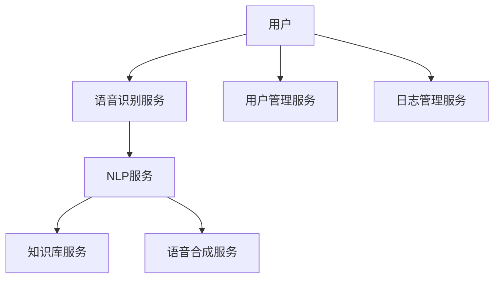

                 

### 背景介绍：问题背景、问题描述、问题解决、边界与外延、概念结构与核心要素组成

在现代企业运作中，跨部门协作已成为不可或缺的重要组成部分。随着企业规模的不断扩大，业务流程日趋复杂，不同部门之间的协同工作变得愈发重要。然而，跨部门协作并非易事，其中存在的沟通壁垒和协作问题严重影响了企业的运营效率和整体绩效。

#### 问题背景

随着全球化和信息化进程的加速，企业间的竞争日益激烈。为了在市场中保持竞争力，企业需要不断提高运作效率和创新能力，而这离不开跨部门协作。跨部门协作可以整合企业内部不同领域的专业知识和资源，促进信息共享，提高决策效率，进而推动企业的持续发展。

#### 问题描述

跨部门协作中存在的主要障碍包括以下几个方面：

1. **沟通不畅**：不同部门之间的沟通渠道不畅，信息传递效率低下，导致协作效果不佳。
2. **目标不明确**：各部门在协作过程中缺乏共同的目标，导致工作方向不一致，协作效率低下。
3. **资源分配不均**：资源分配不合理，部分部门资源丰富而另一些部门资源匮乏，影响协作的公平性和效率。
4. **工作流程复杂**：跨部门协作涉及多个环节和流程，流程复杂且繁琐，导致协作效率降低。

#### 问题解决

为了有效突破跨部门协作的沟通壁垒，提升协作效果，企业可以采取以下策略：

1. **明确目标**：制定清晰的跨部门协作目标，确保各部门在协作过程中有共同的方向和目标。
2. **优化沟通机制**：建立高效的沟通机制，通过定期会议、即时通讯工具等方式加强部门间的信息交流。
3. **合理配置资源**：根据各部门的实际情况，合理分配资源，确保协作的公平性和效率。
4. **简化工作流程**：对跨部门协作的工作流程进行优化，简化流程环节，提高协作效率。

#### 边界与外延

本文主要探讨跨部门协作中的沟通策略，涉及的问题包括沟通障碍、目标管理、资源分配和流程优化等。然而，本文不涉及项目管理、团队建设等其他类型的协作问题。跨部门协作的核心要素包括目标管理、沟通机制、资源配置、流程优化和绩效评估，这些要素构成了跨部门协作的基本框架。

#### 概念结构与核心要素组成

跨部门协作的核心要素如下：

1. **目标管理**：明确跨部门协作的目标，确保各部门的工作方向一致。
2. **沟通机制**：建立高效的沟通渠道，促进信息共享和协作。
3. **资源配置**：合理分配资源，确保协作的公平性和效率。
4. **流程优化**：简化工作流程，提高协作效率。
5. **绩效评估**：对跨部门协作的绩效进行评估，持续优化协作效果。

通过明确这些核心要素，企业可以更好地实施跨部门协作，提高整体运营效率，推动企业的持续发展。在接下来的部分，我们将进一步探讨这些核心概念及其在实际应用中的具体策略。  

---

## 第一部分：跨部门协作的背景与核心概念

### 1.1 问题背景与跨部门协作的重要性

随着现代企业日益复杂，跨部门协作的重要性日益凸显。跨部门协作不仅是企业内部资源整合和业务流程优化的关键手段，更是企业提升竞争力、实现可持续发展的重要途径。在全球化、信息化和市场竞争日益激烈的背景下，企业面临的问题日益多样化，单一部门的力量难以解决复杂的问题，这就需要不同部门之间的紧密合作。

首先，跨部门协作有助于资源整合。企业内部各个部门拥有不同的资源和专业知识，通过跨部门协作，可以实现资源的共享和优化配置，提高资源利用效率。例如，研发部门的技术成果可以应用于市场部门的产品推广，而市场部门的市场信息又可以反馈给研发部门，指导产品创新。

其次，跨部门协作能够提高决策效率。在复杂的市场环境中，企业需要快速响应市场变化，做出有效的决策。跨部门协作通过整合多部门的信息和资源，可以提供更全面、更准确的决策依据，减少决策的滞后性。

此外，跨部门协作还能够促进创新。不同部门之间的合作，可以激发创新思维，推动产品和服务的升级。例如，研发部门的技术创新可以与市场部门的商业模式相结合，创造出更具竞争力的新产品。

然而，跨部门协作并非一帆风顺，其中存在诸多挑战和障碍。首先，沟通不畅是跨部门协作面临的主要问题。不同部门之间的沟通渠道不畅，信息传递效率低下，导致协作效果不佳。其次，目标不明确也是跨部门协作的障碍。各部门在协作过程中缺乏共同的目标，导致工作方向不一致，协作效率低下。此外，资源分配不均和工作流程复杂也是跨部门协作中常见的难题。

因此，深入探讨跨部门协作的重要性，以及如何克服其中的挑战，对于企业来说具有重要意义。接下来，我们将进一步分析跨部门协作中的核心概念和主要策略。

---

### 1.2 跨部门协作的障碍与挑战

尽管跨部门协作在提升企业运作效率和创新能力方面具有重要作用，但其过程中面临的障碍和挑战也是不可忽视的。这些障碍主要涉及沟通不畅、目标不明确、资源分配不均和工作流程复杂等方面。

**1. 沟通不畅**

跨部门协作中的沟通不畅是首要问题。不同部门在组织结构、工作方式和沟通风格上存在差异，导致信息传递过程中容易出现误解和障碍。例如，技术部门可能更擅长使用技术术语进行沟通，而市场部门则可能更偏好使用通俗易懂的语言。这种沟通方式上的差异，容易导致信息传达不准确，从而影响协作效果。

**2. 目标不明确**

目标不明确是跨部门协作的另一个大障碍。在缺乏明确共同目标的情况下，各部门可能会各自为政，导致工作方向不一致，协作效率低下。例如，一个项目在启动阶段，如果没有明确的市场需求和产品目标，研发部门可能会按照自己的理解进行研发，而市场部门则可能按照自己的理解进行推广，最终导致产品与市场需求脱节。

**3. 资源分配不均**

资源分配不均是跨部门协作中的常见问题。由于企业内部资源有限，不同部门之间的资源需求差异可能导致资源分配不均。例如，研发部门可能需要大量资金和人力资源进行产品研发，而市场部门则可能需要更多的营销预算和推广资源。资源分配的不均，不仅会影响各部门的工作效率，还可能导致部门之间的矛盾和不满。

**4. 工作流程复杂**

跨部门协作涉及多个环节和流程，工作流程复杂。复杂的工作流程可能导致协作效率低下，甚至产生不必要的重复工作。例如，一个涉及多个部门的产品项目，可能需要经过多个审批流程，每个部门都有自己的流程和要求，导致整个项目的进度缓慢。

**5. 部门间文化差异**

部门间文化差异也是跨部门协作的障碍之一。不同部门在企业文化、工作氛围和价值观上可能存在差异，这种差异可能导致部门间的合作不畅。例如，技术部门可能更注重创新和效率，而市场部门则可能更注重市场和客户需求，这种差异可能导致部门间的矛盾和摩擦。

**6. 权力和利益分配**

跨部门协作还涉及权力和利益的分配问题。不同部门在协作中可能会因为权力和利益的分配不均而产生矛盾和冲突。例如，一个跨部门的项目，如果决策权主要在技术部门，可能会导致市场部门的参与度不高，反之亦然。

**7. 缺乏协作意识和责任感**

最后，缺乏协作意识和责任感也是跨部门协作的障碍之一。有些员工可能缺乏协作意识和责任感，认为跨部门协作是额外的工作负担，导致协作效率低下。例如，有些员工可能不愿意分享自己的知识和经验，导致信息传递不畅。

为了克服这些障碍，企业需要采取一系列措施，包括建立高效的沟通机制、明确跨部门协作的目标、优化资源分配和简化工作流程等。接下来，我们将探讨如何通过制定策略来突破这些沟通壁垒，提升跨部门协作的效果。

---

### 1.3 跨部门协作的核心概念

跨部门协作的核心概念包括跨部门协作的定义、类型、基本原则和主要策略。理解这些概念有助于我们更好地把握跨部门协作的内在机制，从而制定有效的策略来提升协作效果。

**1. 定义**

跨部门协作是指企业内部不同部门之间为了实现共同目标，通过信息共享、资源整合和工作协同，共同完成某项任务或项目的活动。它是一种企业内部协作的重要形式，旨在提高资源利用效率、促进信息流动和增强创新能力。

**2. 类型**

跨部门协作可以分为以下几种类型：

- **任务型协作**：指为了完成特定任务或项目，不同部门临时组成的协作团队。这种协作通常具有明确的任务目标和期限，成员之间相对固定。
- **日常型协作**：指在日常工作中，各部门之间进行的常态化协作。这种协作通常涉及多个部门和长期的项目，需要持续的沟通和协作。
- **紧急型协作**：指在突发情况下，为了快速响应市场变化或解决紧急问题，不同部门迅速组成的协作团队。这种协作通常具有高度的灵活性和响应速度。

**3. 基本原则**

跨部门协作需要遵循以下基本原则：

- **目标一致性**：确保各部门在协作过程中有共同的目标和方向，避免各自为政。
- **信息透明**：建立透明、高效的沟通渠道，确保各部门能够及时获取所需的信息。
- **资源共享**：优化资源分配，实现资源的最优配置，提高协作效率。
- **权责明确**：明确各部门在协作中的职责和权力，确保协作的顺利进行。
- **持续改进**：通过持续改进，优化协作流程和机制，提高协作效果。

**4. 主要策略**

为了提升跨部门协作的效果，企业可以采取以下主要策略：

- **目标管理策略**：明确跨部门协作的目标，制定具体、可量化的指标，确保各部门在工作中有共同的方向。
- **沟通机制策略**：建立高效的沟通机制，通过定期会议、即时通讯工具等方式加强部门间的信息交流。
- **资源配置策略**：根据各部门的实际情况，合理分配资源，确保协作的公平性和效率。
- **流程优化策略**：对跨部门协作的工作流程进行优化，简化流程环节，提高协作效率。
- **绩效评估策略**：建立跨部门协作的绩效评估机制，对协作效果进行评估和反馈，持续优化协作流程。

理解跨部门协作的核心概念和基本原则，有助于企业更好地实施跨部门协作，提升协作效果。在接下来的部分，我们将深入探讨这些策略的具体应用和实践。

---

### 1.4 跨部门协作的类型与基本原则

跨部门协作的类型和基本原则是确保协作高效顺利进行的关键。了解这些类型和原则，有助于企业根据不同情境制定合适的策略，从而提升协作效果。

**类型**

1. **项目型协作**
   - **定义**：项目型协作是为了完成特定的项目任务，临时组成的跨部门团队。
   - **特点**：项目目标明确，时间有限，团队成员相对固定。
   - **适用场景**：新产品研发、市场推广活动、紧急事件处理等。

2. **日常型协作**
   - **定义**：日常型协作是指企业日常运作中，各部门之间持续的常态化协作。
   - **特点**：涉及多个部门和长期项目，协作内容多样化，成员流动性较大。
   - **适用场景**：日常运营、产品改进、市场调研等。

3. **应急型协作**
   - **定义**：应急型协作是在突发事件或紧急情况下，迅速组建的跨部门团队。
   - **特点**：快速响应，高度灵活，协作目标明确。
   - **适用场景**：市场危机、设备故障、突发公关事件等。

**基本原则**

1. **目标一致性**
   - **原理**：确保各部门在协作过程中有共同的目标，避免各自为政。
   - **实践**：通过明确项目目标、设定关键绩效指标（KPI），确保各部门工作方向一致。

2. **信息透明**
   - **原理**：建立透明、高效的沟通渠道，确保各部门能够及时获取所需信息。
   - **实践**：定期召开跨部门会议，使用即时通讯工具，确保信息传递准确、及时。

3. **资源共享**
   - **原理**：优化资源分配，实现资源的最优配置，提高协作效率。
   - **实践**：建立共享资源平台，明确资源使用规则，确保各部门能够公平、高效地使用资源。

4. **权责明确**
   - **原理**：明确各部门在协作中的职责和权力，确保协作顺利进行。
   - **实践**：制定详细的职责分工表，明确每个部门和成员的职责，确保工作不重叠、不缺失。

5. **持续改进**
   - **原理**：通过持续改进，优化协作流程和机制，提高协作效果。
   - **实践**：定期收集反馈，分析协作中的问题，持续优化协作流程，提升协作效率。

理解跨部门协作的类型和基本原则，有助于企业在实际操作中更好地应对各种挑战，提升协作效果。在接下来的章节中，我们将进一步探讨具体的协作策略和实施方法。

---

## 第二部分：跨部门协作的核心策略

### 2.1 目标管理策略

目标管理策略是跨部门协作中至关重要的一环，其核心在于明确跨部门协作的目标，并通过设定具体、可量化的指标，确保各部门在工作中有共同的方向。以下是目标管理策略的具体方法和工具：

**明确跨部门协作的目标**

1. **设定整体目标**：在项目启动阶段，首先需要明确项目的整体目标，这个目标应当与企业的战略目标相一致。整体目标可以是提高销售额、缩短产品研发周期、提升客户满意度等。

2. **分解目标**：将整体目标分解为具体、可量化的子目标，这些子目标需要明确责任部门和完成时间。例如，如果整体目标是提高销售额，可以分解为市场部门的目标（增加市场份额）、销售部门的目标（提高销售量）和客户服务部门的目标（提高客户满意度）。

**设定协作目标的方法与工具**

1. **SMART 原则**：SMART原则是一种常用的目标设定方法，具体指的是目标应当是具体的（Specific）、可衡量的（Measurable）、可实现的（Achievable）、相关的（Relevant）和有时限的（Time-bound）。例如，一个符合SMART原则的目标可以是：“在2023年6月30日前，将产品A的市场份额提高至15%。”

2. **KPI（关键绩效指标）**：KPI是一种用于衡量目标完成情况的关键指标。通过设定KPI，可以实时监控项目的进展，及时发现问题并采取调整措施。常见的KPI包括销售额、项目完成率、客户满意度等。

**案例**

假设一家企业正在开发一款新产品，整体目标是确保产品在2023年9月30日前成功上市。为了实现这一目标，可以设定以下子目标：

- 研发部门的目标：在2023年6月30日前完成产品原型设计。
- 市场部门的目标：在2023年7月30日前完成市场调研，并制定营销策略。
- 销售部门的目标：在2023年8月30日前完成销售培训，并准备好销售材料。
- 客户服务部门的目标：在2023年9月10日前完成客户支持手册的编写和培训。

通过这些具体的子目标，各部门可以明确自己的工作方向，并按照设定的KPI进行监控和调整。

**目标管理策略的优点**

- 明确目标：通过设定具体的子目标和KPI，可以确保各部门明确自己的工作方向和责任。
- 提高协作效率：共同的目标和指标使得各部门之间可以更好地协调工作，提高协作效率。
- 易于监控：通过KPI可以实时监控项目的进展，及时发现和解决问题。

**目标管理策略的局限性**

- 目标设定难度：在设定目标时，需要充分考虑实际情况，确保目标的可行性和实现性。
- 需要持续调整：随着项目的进展，目标可能会需要调整，这需要各部门之间的密切沟通和协作。

通过目标管理策略，企业可以更好地协调各部门的工作，提高跨部门协作的效果。在接下来的章节中，我们将探讨如何通过沟通机制策略来优化跨部门协作。

---

### 2.2 沟通机制策略

沟通机制策略在跨部门协作中起着至关重要的作用。有效的沟通机制能够促进信息共享，减少误解和冲突，提高协作效率。以下是具体的沟通机制策略及其应用方法：

**沟通障碍与解决方法**

1. **沟通障碍**
   - **信息不对称**：由于不同部门的信息传递渠道不同，可能导致信息不对称，影响协作效果。
   - **沟通方式差异**：不同部门在沟通方式和风格上可能存在差异，导致沟通不畅。
   - **部门间文化差异**：不同部门的文化差异可能导致沟通障碍，影响协作氛围。

2. **解决方法**
   - **建立透明沟通渠道**：通过建立透明的沟通渠道，确保各部门能够及时获取所需信息。例如，定期召开跨部门会议、设立信息共享平台等。
   - **使用标准化沟通语言**：推广标准化沟通语言和术语，减少沟通误解。例如，使用统一的业务术语、技术术语等。
   - **加强跨部门文化培训**：通过文化培训，增强各部门之间的理解和信任，减少文化差异带来的沟通障碍。

**沟通工具与技巧**

1. **即时通讯工具**：使用即时通讯工具，如Slack、Microsoft Teams等，可以快速传递信息，提高沟通效率。
   - **优点**：即时性、高效性，适用于日常沟通和突发问题的快速解决。
   - **缺点**：信息记录不完整，需要额外的管理工具进行记录和归档。

2. **邮件沟通**：邮件是一种正式的沟通方式，适用于需要记录和归档的沟通内容。
   - **优点**：正式性、记录完整，适用于重要决策和正式通知。
   - **缺点**：沟通效率相对较低，信息传递速度较慢。

3. **会议沟通**：定期召开跨部门会议，可以确保各部门及时了解项目进展和沟通需求。
   - **优点**：面对面沟通，信息传递准确，适用于讨论复杂问题和决策。
   - **缺点**：会议时间和地点的协调难度大，会议效率可能受影响。

4. **项目管理工具**：使用项目管理工具，如Jira、Trello等，可以整合项目进度、任务分配和沟通记录。
   - **优点**：项目管理功能全面，任务分配明确，沟通记录完整。
   - **缺点**：需要一定的时间进行学习和使用，初期成本较高。

**最佳实践**

1. **制定沟通计划**：在项目启动阶段，制定详细的沟通计划，明确沟通频率、方式和责任人。
2. **定期反馈与评估**：定期收集各部门的反馈，评估沟通效果，并根据反馈进行优化。
3. **跨部门文化培训**：通过文化培训，增强各部门之间的理解和信任，建立良好的沟通氛围。

通过有效的沟通机制策略，企业可以确保跨部门协作顺利进行，提高协作效率。在接下来的章节中，我们将探讨资源配置策略，以优化跨部门协作。

---

### 2.3 资源配置策略

资源配置策略在跨部门协作中至关重要，其核心在于合理分配企业内部有限资源，确保各部门能够高效地完成协作任务。以下是具体的资源配置策略及其应用方法：

**资源配置中的常见问题**

1. **资源分配不均**：由于各部门的资源需求不同，可能导致部分部门资源丰富而另一些部门资源匮乏，影响协作效率。
2. **资源浪费**：资源配置不合理，可能导致资源浪费，例如人员闲置、设备利用率低等。
3. **资源冲突**：在资源有限的情况下，各部门可能为了争夺资源而产生冲突，影响协作氛围。

**解决方法**

1. **需求评估与优先级排序**：在资源配置前，对各部门的资源需求进行评估，并根据优先级进行排序。例如，对于紧急项目和高价值项目，可以优先分配资源。

2. **资源共享与调配**：建立资源共享平台，通过资源调配，确保资源能够充分利用。例如，企业可以建立内部人才库，根据项目需求动态调配人才。

3. **预算管理**：制定合理的预算管理策略，确保资源分配的公平性和效率。例如，可以通过预算审批流程，严格控制资源的使用。

4. **绩效评估与反馈**：建立绩效评估机制，对各部门的资源使用情况进行评估和反馈，持续优化资源配置。例如，通过定期审计，发现资源浪费和冲突问题，并采取相应措施进行改进。

**资源配置策略的优缺点**

**优点**

- **提高资源利用效率**：通过合理配置资源，可以最大化地利用企业内部的资源，提高资源利用效率。
- **确保协作公平**：合理分配资源，确保各部门在协作中公平地使用资源，提高协作的公平性和满意度。
- **减少资源浪费**：通过资源共享和调配，可以减少资源浪费，提高企业的整体运营效率。

**缺点**

- **管理成本高**：建立和实施资源配置策略需要一定的管理成本，包括人力、物力和时间等。
- **资源冲突**：在资源有限的情况下，各部门为了争夺资源可能产生冲突，影响协作氛围。

**最佳实践**

1. **定期资源评估**：定期对各部门的资源需求和使用情况进行评估，根据实际情况进行调整。
2. **建立资源共享平台**：建立内部资源共享平台，方便各部门之间的资源调配和共享。
3. **强化绩效评估**：通过绩效评估，及时发现资源浪费和冲突问题，并采取相应措施进行改进。

通过有效的资源配置策略，企业可以确保跨部门协作的高效和公平，提高整体运营效率。在接下来的章节中，我们将探讨流程优化策略，以进一步提升跨部门协作的效果。

---

### 2.4 流程优化策略

流程优化策略是提升跨部门协作效率的关键手段，通过简化工作流程、消除不必要的环节和环节之间的壁垒，可以显著提高协作效率，降低成本。以下是具体的流程优化策略及其应用方法：

**流程优化的重要性**

1. **提高协作效率**：简化和优化工作流程，可以减少不必要的步骤和等待时间，提高各个环节的工作效率，从而提高整个跨部门协作的效率。
2. **降低运营成本**：通过消除冗余环节和资源浪费，可以降低企业的运营成本，提高资源利用效率。
3. **提升客户满意度**：优化后的流程可以更快地响应客户需求，提高服务质量，从而提升客户满意度。

**工作流程分析**

1. **识别流程中的瓶颈**：通过对现有流程的详细分析，识别出流程中的瓶颈和冗余环节。这些瓶颈可能是由于流程设计不合理、资源分配不均或信息传递不畅等原因造成的。

2. **流程图绘制**：使用流程图（如UML活动图或mermaid流程图）详细描述现有流程，明确各个步骤和环节之间的关系。

3. **关键绩效指标（KPI）设定**：设定关键绩效指标，用于衡量流程优化后的效果，如流程周期时间、任务完成率、资源利用率等。

**流程优化方法**

1. **流程简化**：通过消除冗余步骤和合并重复工作，简化流程。例如，将多个审批流程合并为一个，减少不必要的签字环节。

2. **自动化**：使用自动化工具和系统，减少人工干预和手动操作。例如，使用项目管理软件来自动分配任务、监控进度和生成报告。

3. **标准化**：建立标准化的工作流程和操作规范，确保流程的一致性和可重复性。例如，制定统一的文档格式和报告模板。

4. **持续改进**：通过定期评审和反馈，不断优化流程。例如，建立流程优化小组，定期收集各部门的反馈和建议，并进行分析和改进。

**流程优化案例**

假设一家科技公司需要优化其产品研发流程。以下是具体的优化步骤：

1. **现状分析**：通过调研和访谈，了解现有研发流程中的问题和瓶颈，如需求分析时间过长、开发与测试环节协作不畅等。

2. **流程图绘制**：使用mermaid流程图绘制现有研发流程，明确各个环节和步骤。

3. **KPI设定**：设定关键绩效指标，如平均需求分析周期、平均开发周期、平均测试周期等。

4. **流程简化**：将多个审批环节合并为一个，减少审批时间。同时，通过自动化工具，如Jira，实现需求管理、任务分配和进度监控。

5. **标准化**：制定统一的研发流程和操作规范，确保流程的一致性和可重复性。

6. **持续改进**：通过定期评审和反馈，不断优化研发流程。例如，建立流程优化小组，每月收集各部门的反馈，并进行分析和改进。

**流程优化策略的优缺点**

**优点**

- **提高效率**：简化流程、消除瓶颈，提高协作效率。
- **降低成本**：减少不必要的步骤和资源浪费，降低运营成本。
- **提升客户满意度**：优化后的流程能更快地响应客户需求，提高服务质量。

**缺点**

- **初期成本高**：流程优化需要投入人力、物力和时间，初期成本较高。
- **变革管理难度大**：流程优化可能涉及到部门职责和利益的调整，变革管理难度大。

**最佳实践**

1. **定期流程评审**：定期对流程进行评审，及时发现和解决问题。
2. **跨部门协作**：建立跨部门流程优化小组，协同合作，确保流程优化效果。
3. **持续培训与宣传**：对员工进行流程优化培训，提高员工对优化流程的认同感和执行力。

通过有效的流程优化策略，企业可以显著提升跨部门协作的效率和质量，为企业的持续发展提供有力支持。在接下来的章节中，我们将探讨绩效评估策略，以进一步优化跨部门协作的效果。

---

### 2.5 绩效评估策略

绩效评估策略在跨部门协作中起着至关重要的作用，其核心在于对协作效果进行评估和反馈，从而持续优化协作流程和提高协作效率。以下是绩效评估策略的具体方法和工具：

**跨部门协作的绩效指标**

1. **项目完成率**：衡量项目在预定时间内完成的程度。例如，是否按照计划完成了研发、测试和上线等阶段。
2. **任务完成率**：衡量各部门在任务分配中的完成情况。例如，市场部门是否按时完成了市场调研和推广活动，研发部门是否按时完成了产品研发。
3. **资源利用率**：衡量企业内部资源的利用效率。例如，设备使用率、人力资源利用率等。
4. **沟通效率**：衡量跨部门沟通的效率和质量。例如，沟通频率、沟通渠道的及时性和准确性等。
5. **客户满意度**：衡量客户对协作效果的满意度。例如，客户对产品和服务质量的评价，客户投诉率等。
6. **项目成本**：衡量项目在预算范围内的完成情况。例如，实际成本是否低于预算成本。

**绩效评估方法与工具**

1. **定性与定量评估方法**：
   - **定性评估**：通过问卷调查、访谈、观察等方式，收集各部门对协作效果的主观评价。这种方法适用于评估沟通效率、客户满意度等难以量化的指标。
   - **定量评估**：通过数据分析和统计方法，量化绩效指标，如使用Excel、Python等工具对数据进行处理和分析。

2. **KPI（关键绩效指标）**：设定关键绩效指标，用于衡量协作效果。例如，可以设定项目完成率为90%，客户满意度为85%等目标，通过定期评估，监控协作效果。

3. **360度评估**：通过多角度、多层次的评估方式，收集不同部门和员工对协作效果的评价。这种方法可以更全面地了解协作中的问题和优点，有助于发现潜在的问题和优化点。

4. **绩效评估工具**：使用绩效评估工具，如KPI管理系统、绩效考核平台等，可以实现绩效评估的自动化和标准化。这些工具可以帮助企业更高效地收集、分析和处理绩效数据。

**绩效评估的步骤**

1. **设定绩效指标**：根据项目目标和协作需求，设定具体的绩效指标，明确评估的重点和方向。
2. **数据收集**：通过问卷调查、访谈、数据统计等方式，收集各部门的绩效数据。
3. **数据分析**：对收集到的绩效数据进行整理和分析，识别协作中的优势和不足。
4. **评估反馈**：将绩效评估结果反馈给各部门，分析问题原因，提出改进建议。
5. **持续优化**：根据绩效评估结果，持续优化协作流程和机制，提升协作效果。

**案例**

假设一家企业正在实施一个跨部门项目，目标是开发并上线一款新产品。以下是绩效评估的具体步骤：

1. **设定绩效指标**：设定项目完成率、任务完成率、资源利用率、客户满意度等绩效指标。
2. **数据收集**：通过问卷调查、访谈等方式，收集各部门的绩效数据，如项目进度报告、资源使用情况、客户反馈等。
3. **数据分析**：对收集到的数据进行分析，识别项目中的优势（如高效完成任务、高资源利用率）和不足（如沟通不畅、客户满意度低）。
4. **评估反馈**：将分析结果反馈给各部门，提出改进建议，如加强沟通、优化资源分配等。
5. **持续优化**：根据反馈结果，持续优化协作流程和机制，如建立更高效的沟通渠道、优化资源调配等，提升协作效果。

通过有效的绩效评估策略，企业可以及时发现协作中的问题和不足，持续优化协作流程，提高协作效率和质量。在接下来的章节中，我们将探讨跨部门协作的实际应用，分析其在企业中的具体实践。

---

## 第三部分：跨部门协作的实际应用

### 3.1 跨部门协作项目介绍

为了更好地理解跨部门协作在企业中的实际应用，我们选取了一家大型科技公司——XYZ公司，来介绍一个具体的跨部门协作项目。XYZ公司主要从事高科技产品的研发和销售，其产品涵盖人工智能、大数据、云计算等领域。在这个案例中，我们将介绍一个名为“智能语音助手”的项目，该项目旨在开发一款面向消费者的智能语音助手应用。

**项目背景**

随着人工智能技术的快速发展，智能语音助手成为市场的一大热门应用。XYZ公司看到这一市场机遇，决定启动“智能语音助手”项目，以提升公司的市场竞争力和用户满意度。该项目涉及多个部门，包括研发部门、市场部门、客户服务部门和销售部门等。

**项目目标**

1. **技术研发**：开发一款功能全面、用户友好的智能语音助手应用，具备语音识别、自然语言处理、语音合成等功能。
2. **市场推广**：通过多渠道营销，提升智能语音助手的品牌知名度和市场占有率。
3. **客户服务**：优化客户服务流程，通过智能语音助手提供便捷的客户支持，提升客户满意度。
4. **销售业绩**：通过智能语音助手的应用，提高销售业绩，拓展新的客户群体。

### 3.2 系统功能设计与架构

在“智能语音助手”项目中，系统功能设计是确保项目成功的关键。以下是该项目的领域模型、系统架构设计、系统接口设计和系统交互设计。

#### 系统功能设计

“智能语音助手”项目的系统功能主要包括以下几部分：

1. **语音识别**：接收用户的语音输入，将其转换为文本。
2. **自然语言处理（NLP）**：理解用户的文本输入，识别其意图和需求。
3. **语音合成**：将处理后的文本转换为语音输出，反馈给用户。
4. **知识库管理**：维护和更新智能语音助手的知识库，确保其能够准确回答用户的问题。
5. **用户管理**：管理用户账号，提供个性化服务。
6. **日志管理**：记录用户交互日志，用于分析和改进智能语音助手。

#### 系统架构设计

“智能语音助手”项目的系统架构采用微服务架构，以确保系统的高可扩展性和高可用性。以下是系统架构设计：



在该架构中，用户通过语音输入与语音识别服务进行交互，语音识别服务将语音转换为文本，并传递给NLP服务。NLP服务分析用户的意图和需求，调用知识库服务获取相关信息，并将处理结果传递给语音合成服务。语音合成服务将处理结果转换为语音输出，反馈给用户。此外，用户管理服务和日志管理服务分别负责用户账号管理和用户交互日志记录。

#### 系统接口设计

为了实现各服务之间的数据交换和功能调用，系统设计了以下接口：

1. **语音识别API**：用于接收用户的语音输入，并返回文本结果。
2. **NLP API**：用于处理用户的文本输入，返回处理结果。
3. **知识库API**：用于查询和更新知识库中的信息。
4. **语音合成API**：用于将文本转换为语音输出。
5. **用户管理API**：用于用户账号的注册、登录和管理。
6. **日志管理API**：用于记录和查询用户交互日志。

#### 系统交互设计

“智能语音助手”项目的系统交互设计主要包括用户与系统的交互过程和各服务之间的交互过程。以下是系统交互设计：

```mermaid
sequenceDiagram
    participant 用户 as 用户
    participant 语音识别服务 as 语音识别
    participant NLP服务 as NLP
    participant 知识库服务 as 知识库
    participant 语音合成服务 as 语音合成
    participant 用户管理服务 as 用户管理
    participant 日志管理服务 as 日志管理

    用户->>语音识别：输入语音
    语音识别->>用户：返回文本结果
    语音识别->>NLP：传递文本结果
    NLP->>知识库：查询信息
    NLP->>语音合成：传递处理结果
    语音合成->>用户：输出语音
    用户->>用户管理：登录/注册
    用户->>日志管理：记录交互日志
```

在该交互设计中，用户通过语音输入与语音识别服务进行交互，语音识别服务将语音转换为文本，并传递给NLP服务。NLP服务分析用户的意图和需求，调用知识库服务获取相关信息，并将处理结果传递给语音合成服务。语音合成服务将处理结果转换为语音输出，反馈给用户。此外，用户管理服务和日志管理服务分别负责用户账号管理和用户交互日志记录。

通过以上系统功能设计、架构设计、接口设计和交互设计，XYZ公司成功实现了“智能语音助手”项目。接下来，我们将深入分析该项目中的环境安装、系统核心实现源代码、代码应用解读与分析，以及实际案例分析和详细讲解剖析。

---

### 3.3 项目实战

**环境安装**

为了成功实施“智能语音助手”项目，我们需要搭建一个完整的技术环境。以下是该项目所需的环境安装步骤：

1. **操作系统**：推荐使用Linux操作系统，如Ubuntu 20.04。
2. **开发工具**：安装Python 3.8及以上版本，并配置好pip工具，用于安装和管理Python包。
3. **数据库**：安装MongoDB，用于存储用户数据和相关日志。
4. **中间件**：安装Nginx，用于Web服务器和反向代理。
5. **消息队列**：安装RabbitMQ，用于处理消息传递和任务调度。
6. **开发框架**：安装Django，用于Web开发。

以下是一个典型的环境安装步骤示例：

```bash
# 安装Python 3.8
sudo apt update
sudo apt install python3.8 python3.8-venv python3.8-pip

# 创建虚拟环境
python3.8 -m venv venv

# 激活虚拟环境
source venv/bin/activate

# 安装Django
pip install django

# 安装MongoDB
sudo apt install mongodb

# 启动MongoDB服务
sudo systemctl start mongodb

# 安装Nginx
sudo apt install nginx

# 安装RabbitMQ
sudo apt install rabbitmq-server
sudo systemctl start rabbitmq-server
```

**系统核心实现源代码**

以下是“智能语音助手”项目的一些核心实现源代码，包括语音识别、自然语言处理、知识库管理、语音合成和用户管理等功能。

```python
# 语音识别服务（基于Google Cloud Speech-to-Text）
from google.cloud import speech
import os

def transcribe_audio(file_path):
    client = speech.SpeechClient()
    with open(file_path, 'rb') as audio_file:
        audio = speech.RecognitionAudio(content=audio_file.read())
    config = speech.RecognitionConfig(
        encoding=speech.RecognitionConfig.AudioEncoding.LINEAR16,
        sample_rate_hertz=16000,
        language_code="en-US",
    )
    response = client.recognize(config, audio)
    return response.results[0].alternatives[0].transcript

# 自然语言处理服务（基于spaCy库）
import spacy

nlp = spacy.load("en_core_web_sm")

def process_text(text):
    doc = nlp(text)
    entities = [(ent.text, ent.label_) for ent in doc.ents]
    return entities

# 知识库管理服务（基于MongoDB）
from pymongo import MongoClient

client = MongoClient("mongodb://localhost:27017/")
db = client["smart_assistant"]
knowledge_col = db["knowledge"]

def update_knowledge(base, new_data):
    knowledge_col.update_one({"base": base}, {"$set": new_data}, upsert=True)

# 语音合成服务（基于Google Cloud Text-to-Speech）
from google.cloud import texttospeech

def synthesize_text(text):
    client = texttospeech.TextToSpeechClient()
    input_text = texttospeech.SynthesisInput(text=text)
    voice = texttospeech.VoiceSelectionParams(
        language_code="en-US", name="en-US-Wavenet-D"
    )
    audio_config = texttospeech.AudioConfig(
        audio_encoding=texttospeech.AudioEncoding.LINEAR16
    )
    response = client.synthesize_speech(
        input=input_text, voice=voice, audio_config=audio_config
    )
    with open("output.wav", "wb") as audio_file:
        audio_file.write(response.audio_content)
    return "output.wav"

# 用户管理服务
def register_user(username, password):
    # 对密码进行加密处理
    hashed_password = bcrypt.hashpw(password.encode("utf-8"), bcrypt.gensalt())
    user_data = {"username": username, "password": hashed_password}
    db.users.insert_one(user_data)
```

**代码应用解读与分析**

以上源代码展示了“智能语音助手”项目的核心功能实现。具体解读如下：

1. **语音识别服务**：使用Google Cloud的Speech-to-Text API进行语音转文本。通过调用Google的API，我们可以轻松地将语音转换为文本，便于后续处理。

2. **自然语言处理服务**：使用spaCy库进行文本处理。spaCy是一款强大的自然语言处理库，可以识别文本中的实体和关系，帮助我们更好地理解用户的意图。

3. **知识库管理服务**：使用MongoDB存储和管理知识库。MongoDB是一种灵活的NoSQL数据库，非常适合存储复杂的数据结构，如知识库中的信息。

4. **语音合成服务**：使用Google Cloud的Text-to-Speech API进行文本转语音。通过调用Google的API，我们可以将处理后的文本转换为语音输出，提供给用户。

5. **用户管理服务**：实现用户注册功能，使用bcrypt库对密码进行加密存储，确保用户数据的安全性。

通过这些核心代码模块，我们可以实现一个功能齐全的智能语音助手系统。接下来，我们将通过实际案例来展示跨部门协作策略在该项目中的应用。

---

### 3.4 实际案例分析和详细讲解剖析

在“智能语音助手”项目中，跨部门协作策略的有效实施不仅提升了项目效率，还确保了项目的成功落地。以下是一个具体的实际案例，通过详细分析该案例，我们将展示跨部门协作策略如何在实际项目中发挥作用。

**案例背景**

XYZ公司的“智能语音助手”项目在研发过程中，遇到了以下几方面的挑战：

1. **技术研发部门与市场部门的沟通不畅**：技术研发部门在开发过程中，对市场需求的理解不够深入，导致产品功能与市场预期存在偏差。市场部门对技术研发的进度和成果了解不足，难以及时提供反馈和支持。

2. **资源分配不均**：由于公司资源有限，研发部门在人员、设备和预算等方面面临较大压力，影响了项目的进展速度。而市场部门在营销预算和推广资源方面相对宽裕，但未能有效利用。

3. **工作流程复杂**：项目涉及多个环节，包括需求分析、研发、测试、上线等，工作流程较为复杂，各个环节之间的协作不畅，导致项目进度延迟。

**跨部门协作策略应用**

为了解决上述问题，XYZ公司采取了一系列跨部门协作策略，具体如下：

1. **目标管理策略**：

   - **明确项目目标**：在项目启动阶段，技术研发部门与市场部门共同制定了项目目标，包括功能完善、用户体验优化、市场推广效果等。通过明确共同的目标，确保各部门在工作中有共同的方向。
   - **设定具体指标**：针对每个目标，设定了具体的指标，如功能点完成率、用户体验评分、市场占有率等。这些指标用于衡量项目的进展和成果。

2. **沟通机制策略**：

   - **建立沟通渠道**：定期召开跨部门会议，确保技术研发部门和市场部门之间的信息传递畅通。通过会议，讨论项目进度、问题解决和需求调整等。
   - **使用沟通工具**：使用即时通讯工具（如Slack）和项目管理工具（如Jira），实时传递信息、分配任务和监控进度。这些工具提高了沟通效率，减少了信息传递中的误解和延迟。

3. **资源配置策略**：

   - **优化资源分配**：通过项目管理工具，对各部门的资源需求进行评估和调配。在项目初期，将更多资源（如人力、设备、预算）优先分配给技术研发部门，确保项目顺利推进。
   - **建立资源共享机制**：鼓励各部门在项目中进行资源共享，如技术文档、测试用例等。通过共享资源，提高资源利用率，减少重复工作。

4. **流程优化策略**：

   - **简化工作流程**：对现有工作流程进行梳理和优化，消除冗余环节和重复工作。例如，将多个审批流程合并为一个，减少审批时间。
   - **自动化流程**：使用自动化工具（如Jenkins）进行代码编译、测试和部署，减少人工干预，提高工作效率。

5. **绩效评估策略**：

   - **设立KPI**：设定关键绩效指标（KPI），如项目完成率、任务完成率、资源利用率等，用于衡量跨部门协作的效果。
   - **定期评估和反馈**：通过定期评估，收集各部门的反馈，分析协作中的问题和不足，并提出改进措施。例如，通过绩效评估发现沟通不畅的问题，进一步优化沟通渠道和沟通工具。

**案例分析**

通过实施上述跨部门协作策略，XYZ公司在“智能语音助手”项目中取得了显著成效：

1. **沟通效率提升**：通过建立有效的沟通渠道和沟通工具，技术研发部门和市场部门之间的信息传递更加及时、准确。各部门能够更好地理解对方的需求和进展，协作效率显著提高。

2. **资源利用优化**：通过优化资源分配和建立资源共享机制，技术研发部门能够充分利用公司资源，提高项目推进速度。同时，市场部门在营销预算和推广资源方面也得到了更好的利用。

3. **流程简化**：通过简化工作流程和自动化流程，项目中的各个环节之间的协作更加顺畅，项目进度得到有效控制。自动化工具的应用减少了人工干预，提高了工作效率。

4. **绩效评估**：通过设立KPI和定期评估，XYZ公司能够及时发现协作中的问题和不足，并采取相应措施进行改进。这有助于持续优化协作流程和机制，提高跨部门协作的整体效果。

通过这个实际案例，我们可以看到跨部门协作策略在提升项目效率和质量方面的重要作用。有效的跨部门协作不仅能够解决部门间的沟通障碍和资源分配问题，还能够优化工作流程，提高整体项目的成功率。未来，XYZ公司将继续探索和实践跨部门协作的最佳策略，以推动公司的持续发展。

---

### 3.5 项目小结

通过“智能语音助手”项目的实施，XYZ公司成功地展示了跨部门协作策略在复杂项目中的关键作用。以下是该项目的主要经验和教训：

**成功经验**

1. **明确目标与指标**：通过设定具体、可量化的项目目标和关键绩效指标（KPI），确保各部门在工作中有共同的方向和目标，从而提高了协作效率。
2. **优化沟通机制**：建立透明的沟通渠道和使用高效的沟通工具，如定期会议和即时通讯工具，确保了信息传递的及时性和准确性，减少了沟通障碍。
3. **资源合理分配**：通过项目管理工具对资源需求进行评估和调配，确保了各部门能够在有限资源下最大化项目效益，提高了资源利用率。
4. **流程优化与自动化**：通过简化工作流程和引入自动化工具，减少了冗余环节和人工干预，提高了项目的执行效率。
5. **持续改进与反馈**：通过定期评估和收集反馈，及时发现问题并进行改进，确保了项目流程的持续优化，提高了跨部门协作的整体效果。

**教训与建议**

1. **初期需求调研**：在项目启动阶段，应进行更加全面和深入的初期需求调研，确保项目目标和功能需求的准确性，减少后期调整和返工。
2. **跨部门协作文化的培养**：加强跨部门协作文化的培养，提高员工对协作重要性的认识，减少因部门壁垒导致的沟通不畅和协作障碍。
3. **资源预留与应急计划**：在项目规划和资源分配时，预留一定的缓冲资源，以应对突发情况和项目变更，确保项目进度不受影响。
4. **绩效评估的全面性**：绩效评估应不仅限于KPI，还应包括员工满意度、协作氛围等多个维度，以更全面地反映跨部门协作的效果。
5. **定期复盘与总结**：在项目结束后，进行全面的复盘和总结，将成功经验和教训形成文档，供未来项目参考，持续优化跨部门协作策略。

通过总结“智能语音助手”项目的成功经验和教训，XYZ公司为未来的跨部门协作项目奠定了坚实的基础，提供了宝贵的实践经验和参考。未来，公司将继续探索和实践跨部门协作的最佳策略，以推动企业的持续发展和创新。

---

## 第四部分：最佳实践与拓展

### 4.1 跨部门协作最佳实践

在跨部门协作中，以下是一些实用的最佳实践，可以帮助企业提高协作效率，克服沟通壁垒：

1. **建立统一的沟通平台**：选择一款适合企业的即时通讯工具（如Slack、Microsoft Teams）和项目管理工具（如Jira、Trello），确保信息传递的及时性和准确性。
2. **定期召开跨部门会议**：定期组织跨部门会议，讨论项目进展、问题和解决方案，确保各部门之间的信息共享和协同。
3. **设立共同目标**：确保各部门在协作过程中有共同的目标和方向，通过明确的KPI来衡量协作效果。
4. **优化资源分配**：合理分配企业资源，确保各部门在项目中的资源需求得到满足，避免资源浪费。
5. **流程标准化**：制定统一的操作流程和标准，减少因流程不一致导致的协作障碍。
6. **文化融合**：通过跨部门活动和文化培训，增强员工对协作重要性的认识，提高跨部门协作的积极性。
7. **绩效评估与反馈**：建立科学的绩效评估机制，及时收集反馈，发现问题并优化协作流程。

### 4.2 小结

本文从跨部门协作的背景、核心概念、策略、实际应用和最佳实践等方面进行了深入探讨。主要结论如下：

1. **跨部门协作的重要性**：跨部门协作是提高企业运作效率和创新能力的关键手段。
2. **核心概念与策略**：明确跨部门协作的目标、优化沟通机制、合理配置资源、简化工作流程和建立绩效评估机制是提高协作效果的重要策略。
3. **实际应用**：通过具体案例展示了跨部门协作策略在实际项目中的应用，验证了其有效性和实用性。
4. **最佳实践**：提供了一系列跨部门协作的最佳实践，有助于企业提升协作效率。

### 4.3 注意事项

在实践跨部门协作时，需要注意以下事项：

1. **初期调研**：确保项目目标清晰、需求准确，减少后期调整和返工。
2. **沟通工具选择**：选择适合企业的沟通工具，确保信息传递的效率和准确性。
3. **文化融合**：通过培训和活动，增强跨部门协作文化的培养。
4. **持续改进**：定期评估和反馈，持续优化协作流程和机制。
5. **资源预留**：预留一定的资源缓冲，以应对突发情况和项目变更。

### 4.4 拓展阅读

对于希望深入了解跨部门协作的读者，以下是一些推荐的拓展阅读材料：

1. **书籍**：
   - 《跨部门协作：如何高效沟通与协同工作》
   - 《团队协作：团队领导与团队管理》
   - 《项目管理实战指南》

2. **论文和报告**：
   - “跨部门协作中的沟通障碍与策略研究”
   - “基于绩效评估的跨部门协作优化模型”
   - “企业跨部门协作案例分析”

3. **在线课程和讲座**：
   - Coursera上的“项目管理专业课程”
   - edX上的“团队领导与团队协作”
   - TED演讲：“如何有效沟通”

通过阅读这些拓展材料，读者可以进一步深入了解跨部门协作的理论和实践，提升自身的跨部门协作能力。在未来的工作中，跨部门协作将成为企业提升竞争力、实现可持续发展的重要手段。希望本文能为大家提供有价值的参考和启发。作者：AI天才研究院/AI Genius Institute & 禅与计算机程序设计艺术 /Zen And The Art of Computer Programming。

