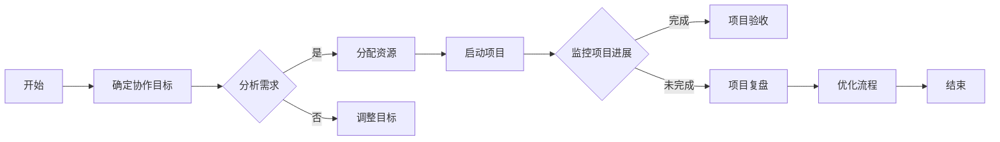
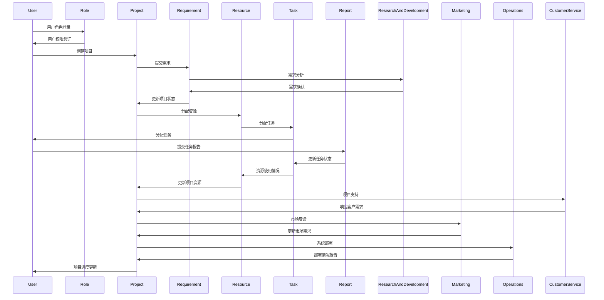
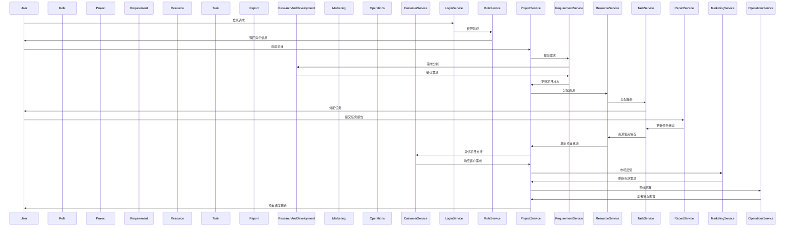

                 


### 第1章 问题背景与挑战

在当今的快速变化和复杂的企业环境中，跨部门协作已成为确保组织成功的关键因素。然而，许多领导者发现，实现有效的跨部门协作并非易事。

#### 1.1 跨部门协作的重要性

跨部门协作的重要性体现在多个方面。首先，它有助于提高工作效率。通过跨部门协作，可以避免重复劳动和资源浪费，确保工作流程的顺畅。其次，跨部门协作有助于创新和知识的共享。不同部门的专家可以共同解决复杂问题，从而推动组织整体竞争力的提升。此外，跨部门协作还有助于培养团队合作精神和员工之间的信任，促进企业文化的建设。

#### 1.2 领导者面临的跨部门协作挑战

尽管跨部门协作的重要性不容忽视，但领导者在实际操作中面临诸多挑战。首先，部门壁垒是跨部门协作的主要障碍。不同部门有着各自的工作流程、文化和目标，这些差异往往导致沟通不畅和合作困难。其次，协调难度大。领导者需要在有限的资源和时间范围内，平衡各部门的需求，确保协作目标的实现。此外，效果不佳也是一个常见问题。许多跨部门协作项目往往因为缺乏有效的监督和评估机制，导致项目进展缓慢甚至失败。

#### 1.3 跨部门协作的关键要素

要实现有效的跨部门协作，领导者需要关注以下几个关键要素。首先，是建立清晰的沟通机制。领导者需要确保各部门之间的信息畅通，避免信息孤岛的形成。其次，是制定明确的协作流程和目标。通过明确各部门的职责和协作步骤，可以提高协作效率。此外，团队文化的塑造也是关键。领导者需要倡导团队合作精神，鼓励员工主动参与跨部门协作，营造一个开放、包容的工作氛围。

### 第2章 核心概念与联系

在理解跨部门协作的挑战和关键要素之后，我们需要深入探讨其核心概念和联系。

#### 2.1 跨部门协作的定义与特点

跨部门协作是指组织内部不同部门之间的合作，共同完成某个任务或项目。与部门内部协作不同，跨部门协作需要跨越部门壁垒，涉及多个部门之间的协调和合作。其特点包括：多元性、复杂性、动态性和目标导向性。

- 多元性：跨部门协作涉及多个部门，需要不同专业技能和资源的整合。
- 复杂性：跨部门协作面临多种挑战，如部门壁垒、沟通不畅、资源分配等。
- 动态性：跨部门协作过程中，目标和任务可能会发生变化，需要灵活应对。
- 目标导向性：跨部门协作的目的是实现共同目标，需要各部门共同协作。

#### 2.2 概念属性特征对比表格

为了帮助读者更好地理解跨部门协作的概念，我们提供了以下对比表格：

| 概念           | 特征                    |
| -------------- | ----------------------- |
| 部门内部协作   | 专业性强、流程固定、目标明确 |
| 跨部门协作     | 多元性、复杂性、动态性、目标导向性 |
| 部门壁垒       | 工作流程、文化、目标差异     |
| 沟通机制       | 信息畅通、及时反馈、高效协作 |

#### 2.3 跨部门协作的ER实体关系图

为了更直观地展示跨部门协作的实体关系，我们使用Mermaid绘制了以下ER实体关系图：

```mermaid
erDiagram
  Department1 ||--|{ Employee1 }|-- Department2
  Department1 ||--|{ Employee2 }|-- Department3
  Department2 ||--|{ ProjectManager }|-- Department1
  Department3 ||--|{ ITExpert }|-- Department2
```

在这个ER图中，Department1、Department2和Department3代表不同部门，Employee1、Employee2和Employee3代表不同部门的员工，ProjectManager和ITExpert分别代表项目经理和IT专家。通过这张图，我们可以清晰地看到各部门之间的联系和角色分工。

### 第3章 算法原理讲解

在理解了跨部门协作的核心概念和联系后，我们接下来将探讨实现有效跨部门协作的算法原理。

#### 3.1 跨部门协作流程的Mermaid流程图

为了描述跨部门协作的流程，我们使用Mermaid绘制了以下流程图：



在这个流程图中，A代表协作的开始，B代表确定协作目标，C代表分析需求，D代表分配资源，E代表调整目标，F代表启动项目，G代表监控项目进展，H代表项目验收，I代表项目复盘，J代表优化流程，K代表协作结束。

#### 3.2 Python源代码实现

为了使读者更好地理解跨部门协作流程，我们提供以下Python源代码实现：

```python
import sys

def analyze_demand():
    # 分析需求
    print("分析需求...")

def allocate_resources():
    # 分配资源
    print("分配资源...")

def start_project():
    # 启动项目
    print("启动项目...")

def monitor_progress():
    # 监控项目进展
    while True:
        print("监控项目进展...")
        if input("项目是否完成？(是/否): ").lower() == '是':
            break

def project_review():
    # 项目复盘
    print("项目复盘...")

def optimize流程():
    # 优化流程
    print("优化流程...")

def main():
    # 跨部门协作流程
    print("开始跨部门协作...")
    analyze_demand()
    if input("需求分析完成？(是/否): ").lower() == '是':
        allocate_resources()
        start_project()
        monitor_progress()
        if input("项目验收通过？(是/否): ").lower() == '是':
            project_review()
            optimize流程()
        else:
            print("项目未完成，进行项目复盘...")
            project_review()
            optimize流程()
    else:
        print("需求分析未完成，调整目标...")
        analyze_demand()

if __name__ == "__main__":
    main()
```

在这个Python代码中，我们定义了一系列函数，分别对应流程图中的各个步骤。通过调用这些函数，可以实现跨部门协作的自动化流程。

#### 3.3 数学模型与公式

在跨部门协作中，数学模型可以用于分析和优化协作流程。以下是一个简单的跨部门协作模型：

$$
\text{协作效率} = \frac{\text{项目完成时间}}{\text{总资源投入}}
$$

其中，项目完成时间取决于多个因素，如资源分配、项目监控、团队协作等。总资源投入包括人力、物力和财力。通过优化这些因素，可以提高协作效率。

#### 3.4 算法原理详细讲解与举例

跨部门协作算法的原理主要包括以下几个步骤：

1. **需求分析**：首先，需要对协作需求进行详细分析，明确项目的目标、范围和关键需求。

2. **资源分配**：根据需求分析结果，合理分配资源，确保项目能够按时、按质量完成。

3. **项目启动**：启动项目，建立项目团队，明确各成员的职责和任务。

4. **项目监控**：实时监控项目进展，确保项目按计划进行。

5. **项目验收**：项目完成后，进行验收，确保项目满足预期目标。

6. **项目复盘**：对项目进行复盘，总结经验教训，优化流程。

为了更好地理解这些步骤，我们可以通过一个简单的例子进行说明：

假设某公司要开发一个新产品，涉及市场部、研发部和生产部的协作。首先，市场部需要对市场需求进行调研，明确产品的目标市场和功能需求。接着，研发部根据市场需求，制定产品开发计划，并分配相应的研发资源。生产部则根据研发部的计划，安排生产资源，确保产品能够按时投产。

在项目启动后，项目经理需要实时监控项目进展，确保各部门之间的协作顺畅。如果发现问题，需要及时进行调整和优化。项目完成后，进行验收，确保产品符合市场需求。最后，对项目进行复盘，总结成功经验和不足之处，为后续项目提供参考。

通过这个例子，我们可以看到跨部门协作算法的原理是如何在实际项目中得到应用的。

### 第4章 系统分析与架构设计方案

为了深入理解跨部门协作的复杂性，我们将通过一个实际案例来分析其系统架构设计。

#### 4.1 问题场景介绍

某大型企业正在开发一款全新的智能办公系统，该项目涉及多个部门的协作，包括研发部、市场部、运维部和客户服务部。研发部负责系统的研发和功能实现，市场部负责市场调研和用户需求分析，运维部负责系统的部署和维护，客户服务部则负责系统上线后的用户支持和服务。

#### 4.2 系统功能设计（领域模型类图）

首先，我们需要设计系统的功能模块，以便更好地理解各部门之间的协作关系。以下是系统的领域模型类图：

```mermaid
classDiagram
    User <<类>> 
    Role <<类>>
    Project <<类>> 
    Requirement <<类>>
    Resource <<类>> 
    Task <<类>>
    Report <<类>>

    User "1" --* "1" Role : 用户角色
    Project "1" --* "1" Requirement : 项目需求
    Project "1" --* "1" Resource : 项目资源
    Project "1" --* "1" Task : 项目任务
    Project "1" --* "1" Report : 项目报告
    Role "1" --* "1" User : 用户角色分配
    Resource "1" --* "1" Task : 资源分配
    Task "1" --* "1" Report : 任务报告
```

在这个类图中，User代表系统用户，Role代表用户角色，Project代表项目，Requirement代表需求，Resource代表资源，Task代表任务，Report代表报告。各部门之间的协作关系通过类图中的关联关系进行描述。

#### 4.3 系统架构设计（系统架构图）

接下来，我们需要设计系统的整体架构，以便各部门能够高效协作。以下是系统的架构图：



在这个架构图中，User代表系统用户，Role代表用户角色，Project代表项目，Requirement代表需求，Resource代表资源，Task代表任务，Report代表报告。各部门之间的协作关系通过序列图中的活动流进行描述。

#### 4.4 系统接口设计

为了实现各部门之间的协作，系统需要提供一系列接口，以便不同部门能够进行数据交互。以下是系统的主要接口设计：

- **用户接口**：用于用户登录、角色分配和项目创建。
- **项目接口**：用于提交需求、分配资源、监控项目进度和生成报告。
- **需求接口**：用于需求分析、确认和更新。
- **资源接口**：用于资源分配、使用情况和更新。
- **任务接口**：用于任务分配、报告提交和更新。
- **报告接口**：用于任务报告生成和项目进度更新。

#### 4.5 系统交互（系统交互序列图）

最后，我们需要设计系统的交互流程，以确保各部门之间的协作顺畅。以下是系统的交互序列图：



在这个序列图中，各个服务之间的交互流程清晰明了，各部门能够通过接口实现高效协作。

### 第5章 项目实战

为了更好地理解跨部门协作在实际项目中的应用，我们将通过一个具体案例进行详细讲解。

#### 5.1 环境安装

首先，我们需要搭建一个用于跨部门协作的测试环境。以下是环境安装步骤：

1. **安装Python**：访问Python官方网站（https://www.python.org/），下载并安装Python 3.x版本。
2. **安装Django**：在命令行中执行以下命令安装Django：
   ```
   pip install django
   ```
3. **安装PostgreSQL**：下载并安装PostgreSQL（https://www.postgresql.org/），配置数据库。
4. **安装Redis**：下载并安装Redis（https://redis.io/download），配置Redis服务。

#### 5.2 系统核心实现

接下来，我们将使用Django框架实现跨部门协作系统的核心功能。以下是系统的核心代码实现：

1. **创建Django项目**：
   ```
   django-admin startproject cross_department_collaboration
   cd cross_department_collaboration
   ```
2. **创建Django应用**：
   ```
   python manage.py startapp core
   ```
3. **编写用户管理模块**：
   ```python
   # core/models.py
   from django.contrib.auth.models import AbstractUser

   class User(AbstractUser):
       role = models.ForeignKey('Role', on_delete=models.CASCADE)
   ```
4. **编写角色管理模块**：
   ```python
   # core/models.py
   class Role(models.Model):
       name = models.CharField(max_length=100)
   ```
5. **编写项目模块**：
   ```python
   # core/models.py
   class Project(models.Model):
       name = models.CharField(max_length=100)
       requirements = models.ManyToManyField('Requirement')
       resources = models.ManyToManyField('Resource')
       tasks = models.ManyToManyField('Task')
       reports = models.ManyToManyField('Report')
   ```
6. **编写需求管理模块**：
   ```python
   # core/models.py
   class Requirement(models.Model):
       title = models.CharField(max_length=100)
       description = models.TextField()
   ```
7. **编写资源管理模块**：
   ```python
   # core/models.py
   class Resource(models.Model):
       name = models.CharField(max_length=100)
       type = models.CharField(max_length=100)
   ```
8. **编写任务管理模块**：
   ```python
   # core/models.py
   class Task(models.Model):
       title = models.CharField(max_length=100)
       description = models.TextField()
       assigned_to = models.ForeignKey(User, on_delete=models.CASCADE)
       status = models.CharField(max_length=100)
   ```
9. **编写报告管理模块**：
   ```python
   # core/models.py
   class Report(models.Model):
       title = models.CharField(max_length=100)
       content = models.TextField()
       date = models.DateTimeField(auto_now_add=True)
   ```

#### 5.3 代码应用解读与分析

以下是项目的核心代码，我们将对其进行解读与分析：

1. **用户管理**：
   ```python
   class User(AbstractUser):
       role = models.ForeignKey('Role', on_delete=models.CASCADE)
   ```
   这个类继承了Django内置的`AbstractUser`类，扩展了用户模型，添加了`role`字段，用于标识用户的角色。

2. **角色管理**：
   ```python
   class Role(models.Model):
       name = models.CharField(max_length=100)
   ```
   这个类用于定义角色模型，包括角色的名称。

3. **项目管理**：
   ```python
   class Project(models.Model):
       name = models.CharField(max_length=100)
       requirements = models.ManyToManyField('Requirement')
       resources = models.ManyToManyField('Resource')
       tasks = models.ManyToManyField('Task')
       reports = models.ManyToManyField('Report')
   ```
   这个类用于定义项目模型，包括项目的名称、需求、资源、任务和报告。

4. **需求管理**：
   ```python
   class Requirement(models.Model):
       title = models.CharField(max_length=100)
       description = models.TextField()
   ```
   这个类用于定义需求模型，包括需求的标题和描述。

5. **资源管理**：
   ```python
   class Resource(models.Model):
       name = models.CharField(max_length=100)
       type = models.CharField(max_length=100)
   ```
   这个类用于定义资源模型，包括资源的名称和类型。

6. **任务管理**：
   ```python
   class Task(models.Model):
       title = models.CharField(max_length=100)
       description = models.TextField()
       assigned_to = models.ForeignKey(User, on_delete=models.CASCADE)
       status = models.CharField(max_length=100)
   ```
   这个类用于定义任务模型，包括任务的标题、描述、指派人和状态。

7. **报告管理**：
   ```python
   class Report(models.Model):
       title = models.CharField(max_length=100)
       content = models.TextField()
       date = models.DateTimeField(auto_now_add=True)
   ```
   这个类用于定义报告模型，包括报告的标题、内容和创建日期。

#### 5.4 实际案例分析和详细讲解

以下是一个实际案例，用于展示如何使用系统实现跨部门协作：

1. **用户登录**：
   用户通过用户管理模块登录系统，系统根据用户的角色分配相应的权限。

2. **项目创建**：
   用户在项目管理模块中创建一个新的项目，输入项目的名称、需求和资源。

3. **任务分配**：
   项目经理在任务管理模块中分配任务，指派给相应的团队成员，并设置任务的状态。

4. **任务报告**：
   任务完成后，团队成员在报告管理模块中提交任务报告，更新任务的状态。

5. **项目监控**：
   项目经理通过项目管理模块监控项目的进展，查看任务报告，并根据需要调整项目资源。

6. **项目验收**：
   项目完成后，项目经理在项目管理模块中提交项目验收报告，项目进入验收阶段。

7. **项目复盘**：
   项目验收后，项目经理在项目管理模块中进行项目复盘，总结经验教训，优化流程。

#### 5.5 项目小结

通过本案例，我们可以看到跨部门协作系统在实际项目中的应用。该系统通过用户管理、角色管理、项目管理、需求管理、资源管理、任务管理和报告管理等模块，实现了各部门之间的协同工作。通过系统的监控和评估机制，可以确保项目按时、按质量完成，提高企业的协作效率和竞争力。

### 第6章 最佳实践 tips、小结、注意事项、拓展阅读

#### 最佳实践 tips

1. **建立明确的沟通机制**：确保各部门之间的沟通畅通，定期召开会议，及时解决协作过程中的问题。
2. **制定详细的协作计划**：在项目启动前，制定详细的协作计划，明确各部门的职责和任务，确保协作流程的顺畅。
3. **培养团队合作精神**：鼓励员工积极参与跨部门协作，培养团队合作意识，提高协作效率。
4. **利用技术工具**：采用现代化的协作工具，如项目管理软件、即时通讯工具等，提高协作效率。
5. **及时反馈和调整**：在协作过程中，及时收集反馈，根据实际情况调整协作计划，确保项目顺利进行。

#### 小结

跨部门协作在当今的企业环境中具有重要意义。通过本文的探讨，我们了解了跨部门协作的重要性、领导者面临的挑战、核心概念、算法原理、系统架构设计和实际应用案例。有效的跨部门协作可以提高工作效率、促进创新、增强团队凝聚力，从而推动企业的发展。

#### 注意事项

1. **避免信息孤岛**：确保各部门之间的信息畅通，避免形成信息孤岛。
2. **合理分配资源**：在跨部门协作中，合理分配资源，确保项目能够按时、按质量完成。
3. **培养团队协作精神**：鼓励员工积极参与跨部门协作，培养团队合作意识。
4. **持续优化协作流程**：根据项目实践，不断优化协作流程，提高协作效率。

#### 拓展阅读

1. 《敏捷开发实践指南》：了解敏捷开发方法在跨部门协作中的应用。
2. 《项目管理知识体系指南（PMBOK指南）》：学习项目管理的最佳实践，提高跨部门协作效率。
3. 《团队协作的力量》：探讨团队合作在跨部门协作中的重要性，提供实用的协作技巧。

### 作者信息

作者：AI天才研究院/AI Genius Institute & 禅与计算机程序设计艺术 /Zen And The Art of Computer Programming

---

本文通过详细的目录大纲和内容结构，系统地介绍了跨部门协作的挑战与对策。从问题背景到核心概念，再到算法原理和系统架构设计，以及实际项目实战，本文为读者提供了一个全面、深入的跨部门协作指南。希望本文能够对领导者和管理者在实际工作中提供有价值的参考和指导。

