                 

# 跨部门合作：打破组织壁垒的方法

## 关键词

跨部门合作、组织壁垒、沟通技巧、流程设计、信息技术、组织文化、成功案例

## 摘要

跨部门合作是现代企业中提高效率、创新能力和团队协作的重要手段。本文旨在探讨跨部门合作的关键问题和解决方法，包括理论基础、沟通技巧、流程设计、信息技术、组织文化以及成功案例。通过本文的阅读，读者将了解跨部门合作的背景、核心概念、实战技巧以及最佳实践，从而为实际工作提供指导。

---

## 第一部分：引言

### 第1章：跨部门合作的背景与挑战

#### 1.1 跨部门合作的重要性

在当今复杂多变的市场环境中，企业不仅需要内部各部门之间的高效协作，还需要跨部门的合作来应对各种挑战。跨部门合作能够整合企业内外部的资源，提高信息流通效率，促进创新和成长。

#### 1.2 跨部门合作面临的挑战

尽管跨部门合作的重要性不言而喻，但实际操作中仍面临着诸多挑战。这些挑战包括：

- **沟通障碍**：由于部门职责和利益的差异，沟通往往不畅。
- **文化冲突**：不同部门的文化差异可能导致合作中的误解和矛盾。
- **流程不透明**：跨部门流程往往较为复杂，难以有效管理。
- **目标不一致**：不同部门的目标和优先级可能不一致，影响合作效果。

#### 1.3 解决方案概述

本文将从以下几个方面提供跨部门合作的解决方案：

- **理论基础**：介绍跨部门合作的理论基础，包括组织行为学、社会网络分析等。
- **沟通技巧**：探讨如何通过有效的沟通技巧来克服沟通障碍。
- **流程设计**：提供跨部门合作流程设计的原则和最佳实践。
- **信息技术**：讨论如何利用信息技术提高跨部门合作效率。
- **组织文化**：分析如何塑造跨部门合作所需的组织文化。

### 第2章：跨部门合作的理论基础

#### 2.1 组织行为学

组织行为学是研究组织内部个体、群体以及组织整体行为的学科。它提供了理解跨部门合作中个体行为和团队动态的重要视角。

#### 2.2 社会网络分析

社会网络分析关注个体和群体之间的互动关系。在跨部门合作中，社会网络分析可以帮助识别关键节点和沟通路径，优化合作流程。

#### 2.3 协同工作理论

协同工作理论探讨了在分布式环境中如何实现高效的团队合作。它提供了跨部门合作中的协作机制和工具。

#### 2.4 跨文化管理

跨文化管理关注不同文化背景下的团队协作。在跨部门合作中，理解和管理跨文化差异是确保合作成功的关键。

---

### 第3章：跨部门沟通技巧

#### 3.1 沟通的重要性

有效的沟通是跨部门合作的基础。本文将探讨如何通过多种沟通技巧来克服沟通障碍，包括：

- **倾听**：倾听是理解对方观点和需求的重要前提。
- **清晰表达**：清晰的表达可以避免误解和混淆。
- **反馈**：及时的反馈可以确保信息传递的准确性。

#### 3.2 沟通障碍与解决策略

跨部门合作中的沟通障碍主要包括：

- **信息不对称**：解决策略包括信息共享平台和定期沟通会议。
- **文化差异**：解决策略包括跨文化培训和团队合作机制。

#### 3.3 高效沟通技巧

高效的沟通技巧包括：

- **简洁明了**：避免冗长的报告和复杂的语言。
- **针对受众**：根据沟通对象的特点来调整沟通方式。

#### 3.4 案例分析

通过实际案例分析，读者可以了解如何在具体场景中应用这些沟通技巧。

---

### 第4章：跨部门合作流程设计

#### 4.1 跨部门合作流程概述

跨部门合作流程包括：

- **需求收集**：明确跨部门合作的目标和需求。
- **任务分配**：根据能力分配任务，确保资源合理利用。
- **协调与沟通**：确保各部门之间的信息流通和协同工作。
- **成果验收**：评估合作成果，确保达成预期目标。

#### 4.2 流程设计原则

流程设计应遵循以下原则：

- **目标导向**：确保流程设计符合企业整体目标。
- **简洁性**：避免不必要的复杂环节，提高效率。
- **灵活性**：适应变化的需求和环境。

#### 4.3 流程优化案例

通过实际案例，本文将展示如何优化跨部门合作流程，提高效率和质量。

#### 4.4 持续改进机制

持续改进是跨部门合作流程的关键。本文将讨论如何建立持续改进机制，确保流程的不断完善。

---

### 第5章：跨部门合作工具与技术

#### 5.1 常见合作工具

常见的跨部门合作工具包括：

- **即时通讯工具**：如 Slack、Microsoft Teams。
- **项目管理工具**：如 Jira、Trello。
- **文档共享平台**：如 Google Drive、Dropbox。

#### 5.2 信息共享平台

信息共享平台是跨部门合作的重要基础设施。本文将探讨如何设计和实施有效的信息共享平台。

#### 5.3 信息技术在跨部门合作中的应用

信息技术在跨部门合作中的应用包括：

- **数据分析**：通过数据分析来优化决策。
- **自动化工具**：通过自动化工具来提高工作效率。

#### 5.4 案例介绍

通过实际案例，本文将展示信息技术在跨部门合作中的具体应用。

---

### 第6章：跨部门合作的组织文化

#### 6.1 组织文化的塑造

组织文化是跨部门合作的重要基础。本文将探讨如何塑造支持跨部门合作的组织文化，包括：

- **共同价值观**：建立共同的目标和价值观。
- **信任建设**：通过信任建设来促进合作。
- **鼓励创新**：鼓励创新思维和跨部门合作。

#### 6.2 跨部门文化冲突与融合

跨部门文化冲突是跨部门合作中常见的问题。本文将讨论如何识别和解决跨部门文化冲突，实现文化融合。

#### 6.3 增强团队协作的文化策略

增强团队协作的文化策略包括：

- **开放沟通**：鼓励开放、透明的沟通。
- **认可与奖励**：通过认可和奖励来激励团队协作。

#### 6.4 案例研究

通过案例研究，本文将探讨如何在不同文化背景下塑造支持跨部门合作的组织文化。

---

### 第7章：跨部门合作的成功案例

#### 7.1 案例一：如何实现跨部门高效合作

本文将介绍一个具体的跨部门合作案例，展示如何通过有效的沟通、流程设计和信息技术实现跨部门高效合作。

#### 7.2 案例二：跨部门合作的障碍与突破

本文将分析一个跨部门合作过程中遇到的障碍以及如何克服这些障碍，实现合作成功。

#### 7.3 案例三：跨部门合作的最佳实践

本文将总结跨部门合作的最佳实践，为其他企业提供参考。

#### 7.4 案例分析与启示

通过对成功案例的分析，本文将提炼出跨部门合作的关键要素和成功经验。

---

### 第8章：总结与展望

#### 8.1 主要成果总结

本文总结了跨部门合作的关键问题和解决方法，包括理论基础、沟通技巧、流程设计、信息技术、组织文化等方面。

#### 8.2 跨部门合作的未来趋势

本文将探讨跨部门合作的发展趋势，包括信息技术的发展、组织文化的演变等方面。

#### 8.3 对读者的建议

本文将为读者提供一些建议，帮助他们更好地理解和应用跨部门合作的方法。

---

## 作者

作者：AI天才研究院/AI Genius Institute & 禅与计算机程序设计艺术 /Zen And The Art of Computer Programming

---

以上内容是本书的初步大纲，涵盖了跨部门合作的各个方面。接下来，我们将逐步完善每个章节的内容，确保每个小节都详细讲解，并包含必要的数学模型、流程图、代码示例等。通过这样的结构化内容，读者将能够系统地学习跨部门合作的理论和实践，从而在现实工作中取得更好的效果。

---

接下来，我们将逐步填写每个章节的内容，确保文章的完整性、逻辑性和专业性。

---

## 第二部分：理论基础

### 第2章：跨部门合作的理论基础

#### 2.1 组织行为学

组织行为学是研究组织内部个体、群体以及组织整体行为的学科。它关注组织内部的沟通、领导、动机、团队动态等问题。在跨部门合作中，组织行为学提供了理解个体行为和团队动态的重要视角。

**核心概念原理**：

- **个体行为**：个体在组织中的行为模式，包括态度、动机、认知等。
- **群体行为**：群体内部成员之间的互动和协作方式。
- **团队动态**：团队在形成、发展和解散过程中的行为变化。

**概念属性特征对比表格**：

| 概念             | 属性特征                                                     |
|------------------|--------------------------------------------------------------|
| 个体行为         | 单个个体在组织中的行为模式，受个人性格、动机和态度影响。           |
| 群体行为         | 个体之间的互动和协作方式，受群体规范和文化影响。                 |
| 团队动态         | 团队在形成、发展和解散过程中的行为变化，包括团队建设、团队冲突等。 |

**ER实体关系图架构的 Mermaid 流程图**：

```mermaid
erDiagram
  AIndividual --> BTeam : belongs_to
  BTeam --> CTeam_Dynamics : has
  AIndividual --> CTeam_Dynamics : participates_in
```

#### 2.2 社会网络分析

社会网络分析关注个体和群体之间的互动关系。它通过图形化模型来描述个体之间的联系，帮助我们理解跨部门合作中的关键节点和沟通路径。

**核心概念原理**：

- **网络结构**：描述个体之间关系的图形结构。
- **网络密度**：网络中连接的紧密程度。
- **中心性**：个体在网络中的重要程度。

**概念属性特征对比表格**：

| 概念       | 属性特征                                                       |
|------------|--------------------------------------------------------------|
| 网络结构   | 描述个体之间的互动关系，用图形表示。                           |
| 网络密度   | 衡量网络中连接的紧密程度，通常用连接数除以可能的最大连接数来表示。 |
| 中心性     | 衡量个体在网络中的重要程度，包括度中心性、介数中心性和紧密中心性。 |

**ER实体关系图架构的 Mermaid 流程图**：

```mermaid
erDiagram
  AIndividual ||--|| BNetwork_Structure : is_part_of
  BNetwork_Structure ||--|| CNetwork_Density : measures
  BNetwork_Structure ||--|| C centrality : measures
```

#### 2.3 协同工作理论

协同工作理论探讨了在分布式环境中如何实现高效的团队合作。它关注团队合作中的协作机制、工具和流程。

**核心概念原理**：

- **协作机制**：团队成员之间的沟通和协调方式。
- **协作工具**：支持团队合作的信息技术和应用。
- **协作流程**：团队成员在合作过程中的行为规范和步骤。

**概念属性特征对比表格**：

| 概念           | 属性特征                                                     |
|----------------|--------------------------------------------------------------|
| 协作机制       | 团队成员之间的沟通和协调方式，包括正式和非正式的沟通机制。           |
| 协作工具       | 支持团队合作的信息技术和应用，如项目管理工具、文档共享平台等。         |
| 协作流程       | 团队成员在合作过程中的行为规范和步骤，包括任务分配、进度跟踪和成果验收等。 |

**ER实体关系图架构的 Mermaid 流程图**：

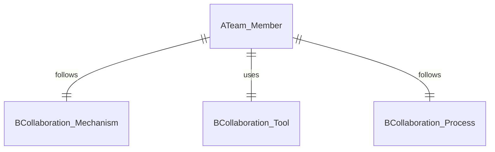

#### 2.4 跨文化管理

跨文化管理关注不同文化背景下的团队协作。它探讨如何在不同文化背景下理解和沟通，以实现有效的团队合作。

**核心概念原理**：

- **文化差异**：不同文化背景下的价值观、行为规范和沟通方式。
- **文化适应**：团队成员如何适应不同文化环境，以促进合作。
- **文化融合**：如何在不同文化背景下建立共同的文化认同。

**概念属性特征对比表格**：

| 概念       | 属性特征                                                     |
|------------|--------------------------------------------------------------|
| 文化差异   | 不同文化背景下的价值观、行为规范和沟通方式。                     |
| 文化适应   | 成员如何适应不同文化环境，以促进合作。                         |
| 文化融合   | 在不同文化背景下建立共同的文化认同，以增强团队协作。           |

**ER实体关系图架构的 Mermaid 流程图**：

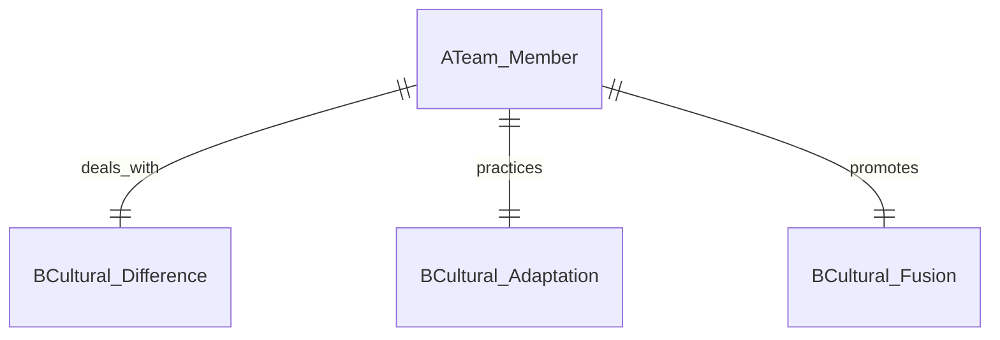

---

## 第三部分：跨部门沟通技巧

### 第3章：跨部门沟通技巧

#### 3.1 沟通的重要性

有效的沟通是跨部门合作的关键。良好的沟通能够确保信息的准确传递，减少误解和冲突，提高工作效率。

**核心概念原理**：

- **信息传递**：沟通的核心目的是传递信息。
- **减少误解**：通过有效的沟通减少信息传递中的误解。
- **增强协作**：沟通能够促进团队成员之间的协作和合作。

**概念属性特征对比表格**：

| 概念       | 属性特征                                                     |
|------------|--------------------------------------------------------------|
| 信息传递   | 沟通的核心目的是传递信息，确保信息准确无误地到达接收者。           |
| 减少误解   | 通过清晰、准确的沟通减少信息传递中的误解和歧义。                 |
| 增强协作   | 良好的沟通能够促进团队成员之间的协作和合作，提高整体效率。       |

**ER实体关系图架构的 Mermaid 流程图**：

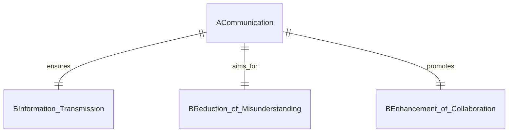

#### 3.2 沟通障碍与解决策略

跨部门合作中常常会遇到沟通障碍，这些障碍可能来自不同的部门文化、职责划分、信息不对称等方面。以下是一些常见的沟通障碍及其解决策略：

- **部门文化差异**：不同部门有各自的文化和习惯，这可能导致沟通不畅。
  - **解决策略**：通过跨部门培训和共同目标设定来促进文化融合。

- **职责划分不清**：职责划分不明确会导致责任推诿和沟通障碍。
  - **解决策略**：明确各部门的职责范围，制定清晰的流程和责任分配。

- **信息不对称**：不同部门对信息的掌握程度不同，可能导致信息传递不完整。
  - **解决策略**：建立统一的信息共享平台，确保信息透明和及时更新。

**概念属性特征对比表格**：

| 沟通障碍       | 解决策略                                                     |
|----------------|--------------------------------------------------------------|
| 部门文化差异   | 跨部门培训和共同目标设定，促进文化融合。                       |
| 职责划分不清   | 明确各部门的职责范围，制定清晰的流程和责任分配。               |
| 信息不对称     | 建立统一的信息共享平台，确保信息透明和及时更新。               |

**ER实体关系图架构的 Mermaid 流�程图**：

```mermaid
erDiagram
  ACommunication_Barriers ||--|| BCultural_Differences : causes
  ACommunication_Barriers ||--|| B unclear_Roles : causes
  ACommunication_Barriers ||--|| BInformation_Asymmetry : causes
  ACommunication_Barriers ||--|| B Cross-Department_Training : solves
  ACommunication_Barriers ||--|| B Clear_Role_Definition : solves
  ACommunication_Barriers ||--|| B Unified_Information_Platform : solves
```

#### 3.3 高效沟通技巧

为了提高跨部门合作的效率，团队成员需要掌握一些高效沟通的技巧。以下是一些实用的沟通技巧：

- **倾听**：倾听是有效沟通的前提，通过倾听可以理解对方的观点和需求。
- **清晰表达**：清晰的表达能够减少误解和混淆，确保信息准确传递。
- **反馈**：及时给予反馈可以确保沟通的准确性，并促进双向沟通。

**概念属性特征对比表格**：

| 沟通技巧 | 属性特征                                                     |
|----------|--------------------------------------------------------------|
| 倾听     | 通过倾听理解对方的观点和需求，是有效沟通的前提。               |
| 清晰表达 | 通过清晰、准确的语言表达来传递信息，减少误解和混淆。           |
| 反馈     | 及时给予反馈，确保沟通的准确性，并促进双向沟通。             |

**ER实体关系图架构的 Mermaid 流程图**：

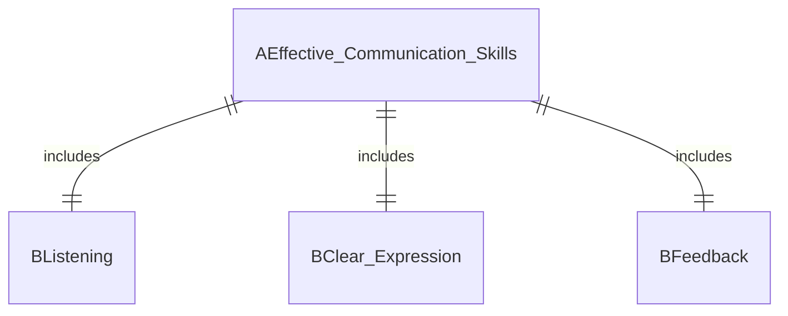

#### 3.4 案例分析

为了更好地理解跨部门沟通技巧的应用，以下是一个案例分析：

**案例背景**：某科技公司的一个项目团队由市场部、研发部和运营部组成。由于部门职责不同，团队在项目进展过程中遇到了沟通障碍，导致项目进展缓慢。

**问题**：团队成员之间的沟通不畅，导致需求理解不一致，项目进度延误。

**解决方案**：

1. **建立沟通渠道**：项目启动时，明确建立了一个跨部门的沟通渠道，包括定期会议和即时通讯工具，确保信息透明和及时更新。
2. **共同培训**：为各部门团队成员提供沟通技巧培训，提高他们的沟通能力和协作意识。
3. **明确职责**：明确各部门在项目中的职责，制定详细的任务分配和责任分配，避免责任推诿。

**结果**：通过这些措施，团队成员之间的沟通得到显著改善，项目进展顺利，最终提前完成了目标。

**ER实体关系图架构的 Mermaid 流程图**：

```mermaid
gantt
    title 跨部门沟通案例分析
    section 项目背景
    A1 :项目启动，建立沟通渠道
    A2 :共同培训，提高沟通能力
    A3 :明确职责，避免责任推诿

    section 解决方案实施
    B1 :定期会议，信息透明
    B2 :即时通讯，及时更新
    B3 :任务分配，责任清晰

    section 项目进展
    C1 :项目进展顺利
    C2 :项目提前完成
```

---

通过以上内容，我们详细介绍了跨部门沟通技巧的理论基础和实际应用。在接下来的部分，我们将继续探讨跨部门合作流程设计、信息技术应用、组织文化塑造以及成功案例分析，帮助读者更全面地理解跨部门合作的方法和实践。

## 第四部分：跨部门合作流程设计

### 第4章：跨部门合作流程设计

#### 4.1 跨部门合作流程概述

跨部门合作流程是确保各部门高效协作、顺利完成任务的关键。一个有效的跨部门合作流程应包括以下环节：

- **需求收集**：明确跨部门合作的目标和需求，确保各方的共识。
- **任务分配**：根据能力和职责，合理分配任务，确保资源的充分利用。
- **协调与沟通**：确保各部门之间的信息流通和协同工作，及时解决问题。
- **成果验收**：评估合作成果，确保达成预期目标。

**跨部门合作流程概述的 Mermaid 流程图**：

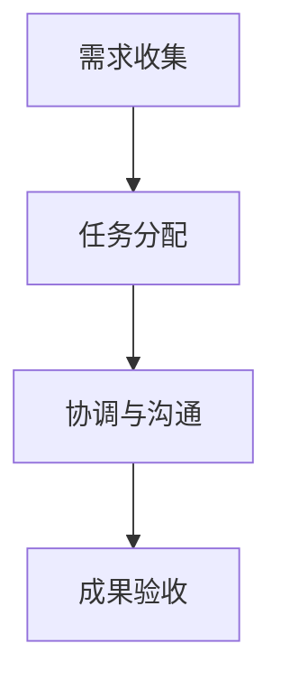

#### 4.2 流程设计原则

设计跨部门合作流程时，应遵循以下原则：

- **目标导向**：确保流程设计符合企业整体目标，提高整体效率。
- **简洁性**：避免不必要的复杂环节，提高流程的执行力。
- **灵活性**：流程设计应具有灵活性，适应变化的需求和环境。
- **透明性**：流程设计应透明，确保各方对流程的理解和遵守。

**流程设计原则的 Mermaid 流程图**：

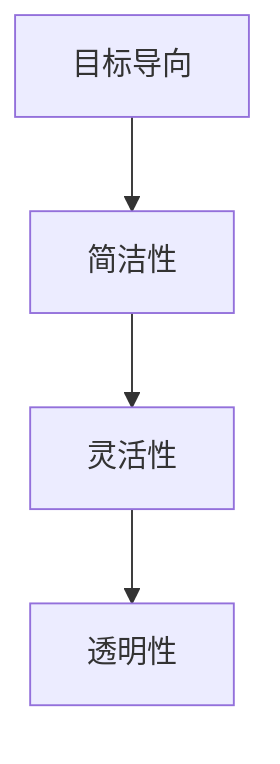

#### 4.3 流程优化案例

以下是一个流程优化案例，展示了如何通过改进流程设计来提高跨部门合作的效率。

**案例背景**：某公司市场部、研发部和运营部在项目执行过程中，发现项目进度缓慢，沟通不畅，导致项目延期。

**问题分析**：通过分析发现，问题主要出在任务分配不清和沟通机制不完善。

**解决方案**：

1. **重新定义任务分配**：明确各部门的职责和任务，制定详细的任务分配表，确保任务清晰、明确。
2. **建立定期沟通机制**：每周召开一次跨部门沟通会议，讨论项目进展、解决遇到的问题。
3. **采用项目管理工具**：使用项目管理工具（如 Jira）来跟踪项目进度，确保信息透明和及时更新。

**实施结果**：通过以上措施，项目进度明显加快，沟通问题得到解决，项目最终提前完成。

**流程优化案例的 Mermaid 流程图**：

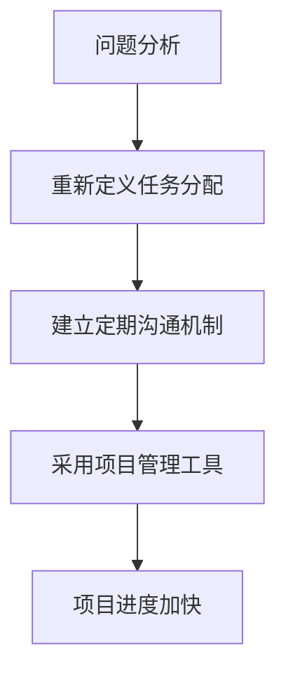

#### 4.4 持续改进机制

跨部门合作流程不是一成不变的，需要根据实际情况不断改进和完善。以下是一些建议的持续改进机制：

- **定期评估**：定期对跨部门合作流程进行评估，收集反馈意见，识别存在的问题。
- **改进措施**：根据评估结果，制定改进措施，不断完善流程设计。
- **培训与辅导**：为各部门团队成员提供培训和支持，提高他们的流程执行能力和协作意识。

**持续改进机制的 Mermaid 流程图**：

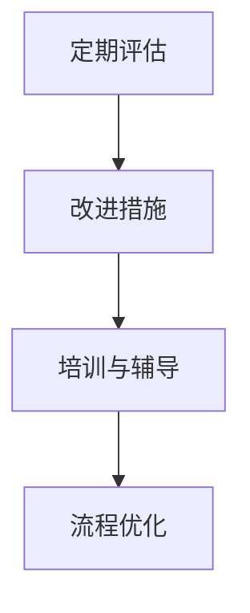

---

通过以上内容，我们详细介绍了跨部门合作流程设计的重要性和原则，并通过实际案例展示了如何优化跨部门合作流程。在接下来的部分，我们将探讨跨部门合作中信息技术的应用，帮助读者更好地理解如何利用现代技术提高跨部门合作的效率。

## 第五部分：跨部门合作工具与技术

### 第5章：跨部门合作工具与技术

#### 5.1 常见合作工具

在跨部门合作中，选择合适的工具能够显著提高工作效率和协作质量。以下是一些常见的跨部门合作工具：

- **即时通讯工具**：如 Slack、Microsoft Teams 和 WhatsApp，用于实时沟通和协作。
- **项目管理工具**：如 Jira、Trello 和 Asana，用于任务管理、进度跟踪和团队协作。
- **文档共享平台**：如 Google Drive、Dropbox 和 OneDrive，用于文档存储、共享和版本控制。
- **视频会议工具**：如 Zoom、Microsoft Teams 和 Google Meet，用于远程会议和在线协作。

**常见合作工具的 Mermaid 流程图**：

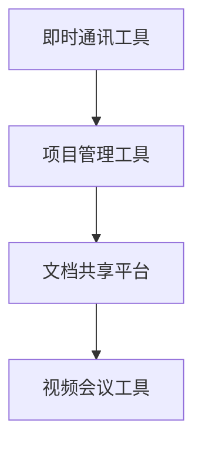

#### 5.2 信息共享平台

信息共享平台是跨部门合作中不可或缺的一部分，它能够提高信息透明度，确保团队成员之间的信息流通。以下是一些关键要素：

- **信息透明度**：通过信息共享平台，各部门可以实时查看项目的最新进展和相关信息。
- **信息共享**：团队成员可以共享文档、数据和其他资源，确保信息的及时更新。
- **协作效率**：信息共享平台提供了多种协作功能，如评论、通知和审批，提高协作效率。

**信息共享平台的 Mermaid 流程图**：

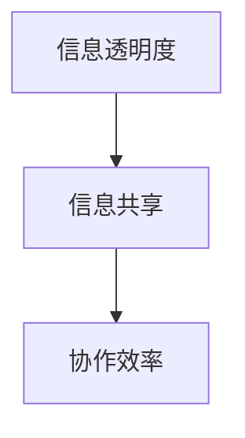

#### 5.3 信息技术在跨部门合作中的应用

现代信息技术的飞速发展，为跨部门合作提供了丰富的工具和平台。以下是一些信息技术在跨部门合作中的应用：

- **数据分析**：通过数据分析，企业可以更好地理解市场需求、优化产品设计和提高运营效率。
- **自动化工具**：自动化工具（如 RPA）可以简化重复性工作，减少人工干预，提高工作效率。
- **虚拟现实与增强现实**：虚拟现实和增强现实技术可以用于培训、设计和协作，提高团队的协作效率。

**信息技术在跨部门合作中的应用的 Mermaid 流程图**：

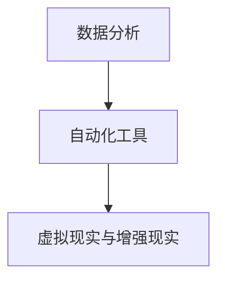

#### 5.4 案例介绍

以下是一个具体案例，展示了信息技术在跨部门合作中的实际应用：

**案例背景**：某公司市场部、研发部和运营部在项目执行过程中，发现沟通不畅、信息不及时更新，导致项目进度延误。

**解决方案**：

1. **采用项目管理工具**：引入 Jira 进行任务管理，确保任务分配清晰、进度跟踪及时。
2. **建立信息共享平台**：使用 Google Drive 进行文档共享，确保信息透明、共享便捷。
3. **采用自动化工具**：引入 RPA 机器人简化重复性工作，如数据录入和报告生成，提高工作效率。

**实施结果**：

- **项目进度加快**：通过 Jira 的任务管理功能，项目进度得到实时跟踪，项目提前完成。
- **信息透明度提高**：通过 Google Drive 的文档共享功能，信息更新及时，团队成员能够实时查看最新进展。
- **工作效率提升**：通过 RPA 机器人简化重复性工作，团队成员能够将精力集中在更有价值的工作上。

**案例介绍的 Mermaid 流程图**：

```mermaid
gantt
    title 跨部门合作信息技术应用案例
    section 解决方案
    A1 :实施 Jira 任务管理
    A2 :建立 Google Drive 信息共享平台
    A3 :引入 RPA 机器人

    section 实施结果
    B1 :项目进度加快
    B2 :信息透明度提高
    B3 :工作效率提升
```

---

通过以上内容，我们详细介绍了跨部门合作中常见的工具和技术，并通过实际案例展示了这些工具和技术在跨部门合作中的应用。在接下来的部分，我们将探讨跨部门合作的组织文化，帮助读者理解如何通过组织文化的塑造来促进跨部门合作。

## 第六部分：跨部门合作的组织文化

### 第6章：跨部门合作的组织文化

#### 6.1 组织文化的塑造

组织文化是跨部门合作的重要基础，它能够影响团队成员的行为、态度和价值观。塑造支持跨部门合作的组织文化，需要从以下几个方面着手：

- **共同价值观**：建立企业共同的目标和价值观，确保各部门在合作中具有共同的方向和目标。
- **信任建设**：通过团队活动和沟通，建立团队成员之间的信任，促进协作。
- **鼓励创新**：鼓励团队成员提出创新的想法和建议，激发团队的创造力和活力。

**组织文化塑造的 Mermaid 流程图**：

```mermaid
gantt
    title 组织文化塑造流程
    section 共同价值观
    A1 :明确企业目标
    A2 :建立共同价值观

    section 信任建设
    B1 :团队活动
    B2 :沟通机制

    section 鼓励创新
    C1 :创新激励
    C2 :建议收集
```

#### 6.2 跨部门文化冲突与融合

跨部门文化冲突是跨部门合作中常见的问题，它可能源于不同的价值观、工作方法和沟通风格。为了解决跨部门文化冲突，需要采取以下策略：

- **识别冲突**：通过调查和反馈，识别跨部门文化冲突的具体表现。
- **沟通解决**：通过开放和坦诚的沟通，理解对方的立场和需求，找到共同点。
- **文化融合**：通过文化融合活动，促进不同部门之间的交流和合作，减少冲突。

**跨部门文化冲突与融合的 Mermaid 流程图**：

```mermaid
gantt
    title 跨部门文化冲突与融合流程
    section 识别冲突
    A1 :调查反馈
    A2 :识别冲突

    section 沟通解决
    B1 :开放沟通
    B2 :理解立场

    section 文化融合
    C1 :文化交流
    C2 :共同目标
```

#### 6.3 增强团队协作的文化策略

为了增强团队协作，企业可以采取以下文化策略：

- **开放沟通**：鼓励团队成员之间进行开放、坦诚的沟通，分享想法和意见。
- **信任建设**：通过信任建设活动，如团队建设、互助计划和共同目标设定，增强团队成员之间的信任。
- **认可与奖励**：通过认可和奖励，激励团队成员积极参与团队协作，提高团队凝聚力。

**增强团队协作的文化策略的 Mermaid 流程图**：

```mermaid
gantt
    title 增强团队协作文化策略
    section 开放沟通
    A1 :鼓励分享
    A2 :建立沟通渠道

    section 信任建设
    B1 :团队建设
    B2 :互助计划

    section 认可与奖励
    C1 :认可制度
    C2 :奖励机制
```

#### 6.4 案例研究

以下是一个跨部门合作文化塑造的案例研究，展示了如何通过文化策略解决跨部门文化冲突，并增强团队协作。

**案例背景**：某公司研发部和技术支持部之间存在文化冲突，导致项目进展缓慢，客户满意度下降。

**问题分析**：通过调查发现，问题主要源于研发部强调技术创新，而技术支持部关注客户需求和反馈，双方在沟通和协作中存在误解和矛盾。

**解决方案**：

1. **共同价值观建设**：组织全体员工参加价值观研讨会，明确企业的共同目标和价值观，确保各部门在合作中具有共同的方向。
2. **文化融合活动**：定期组织跨部门的文化融合活动，如团队建设、技术交流和客户体验日，促进各部门之间的沟通和理解。
3. **沟通渠道建设**：建立跨部门的沟通渠道，确保信息透明和及时更新，减少误解和矛盾。
4. **认可与奖励**：设立跨部门协作奖项，鼓励团队成员积极参与团队协作，提高团队凝聚力。

**实施结果**：

- **文化冲突减少**：通过共同价值观建设和文化融合活动，研发部和技术支持部的沟通和理解得到显著改善，文化冲突减少。
- **项目进度加快**：通过沟通渠道建设和认可与奖励机制，项目进展加快，客户满意度提高。

**案例研究的 Mermaid 流程图**：

```mermaid
gantt
    title 跨部门合作文化塑造案例研究
    section 问题分析
    A1 :价值观冲突
    A2 :沟通误解

    section 解决方案
    B1 :价值观建设
    B2 :文化融合
    B3 :沟通渠道
    B4 :认可与奖励

    section 实施结果
    C1 :文化冲突减少
    C2 :项目进度加快
```

---

通过以上内容，我们详细介绍了跨部门合作的组织文化塑造、跨部门文化冲突与融合以及增强团队协作的文化策略。在接下来的部分，我们将通过成功案例的分析，进一步探讨跨部门合作的方法和实践。

## 第七部分：跨部门合作的成功案例

### 第7章：跨部门合作的成功案例

#### 7.1 案例一：如何实现跨部门高效合作

**背景**：某大型跨国公司的市场部、研发部和运营部在推广新产品时，面临跨部门协作的挑战。各部门之间沟通不畅，信息传递不及时，导致推广活动进展缓慢。

**解决方案**：

1. **建立沟通机制**：设立每周一次的跨部门沟通会议，讨论推广活动的进展和问题，确保信息的及时传递。
2. **使用项目管理工具**：采用 Jira 进行任务管理，明确各部门的任务和进度，确保任务分配合理。
3. **信息共享平台**：使用 Google Drive 进行文档共享，确保各部门能够实时查看最新文档，提高工作效率。

**实施结果**：

- **沟通效率提高**：通过每周的沟通会议，各部门之间的信息传递变得更加及时和准确，减少了误解和冲突。
- **任务分配合理**：通过 Jira 的任务管理功能，任务分配更加明确，各部门能够根据自身能力高效完成任务。
- **工作效率提升**：通过 Google Drive 的文档共享功能，团队成员可以实时查看最新文档，避免了重复工作和信息滞后。

**案例一的成功要素**：

- **有效的沟通机制**：确保信息的及时传递和问题的快速解决。
- **合理的任务分配**：根据各部门的能力和职责进行任务分配，提高工作效率。
- **信息共享平台**：提供便捷的文档共享和协作工具，提高团队协作效率。

#### 7.2 案例二：跨部门合作的障碍与突破

**背景**：某互联网公司在开发一款新产品时，研发部、设计部和市场部之间存在合作障碍。研发部注重技术实现，设计部关注用户体验，市场部关注市场需求，各部门之间在目标和需求上存在分歧。

**解决方案**：

1. **共同目标设定**：组织跨部门研讨会，明确新产品的共同目标，确保各部门在目标上达成一致。
2. **需求分析会议**：定期召开需求分析会议，讨论各方的需求，确保各方在需求理解上保持一致。
3. **协作工具引入**：引入协作工具，如 Slack 和 Trello，用于实时沟通和任务管理，提高协作效率。

**实施结果**：

- **目标一致**：通过共同目标设定和需求分析会议，各部门在目标和需求上达成一致，合作障碍减少。
- **协作效率提高**：通过 Slack 和 Trello 的协作工具，团队成员之间的沟通变得更加实时和高效，任务管理更加清晰。
- **产品质量提升**：通过协作和沟通的改善，新产品的开发进度加快，产品质量得到提升。

**案例二的成功要素**：

- **共同目标设定**：确保各部门在目标上的一致性，减少合作障碍。
- **需求分析会议**：确保各方在需求理解上的一致性，提高协作效率。
- **协作工具引入**：提供便捷的沟通和协作工具，提高团队协作效率。

#### 7.3 案例三：跨部门合作的最佳实践

**背景**：某金融机构在推进数字化转型时，涉及多个部门，包括信息技术部、业务运营部和客户服务部。各部门在推进过程中存在协调不畅、信息不一致等问题。

**解决方案**：

1. **建立项目办公室**：设立项目办公室，负责协调各部门的工作，确保项目进度和目标的一致性。
2. **定期项目会议**：定期召开项目会议，讨论项目的进展、问题和解决方案，确保各部门之间的信息同步。
3. **信息共享平台**：使用 SharePoint 作为信息共享平台，确保各部门能够实时查看项目文档和进展。

**实施结果**：

- **项目协调性增强**：通过项目办公室和定期项目会议，各部门之间的协调性得到显著改善，项目进展更加顺利。
- **信息一致性提高**：通过信息共享平台，各部门能够实时查看项目文档和进展，信息不一致问题得到解决。
- **项目效率提升**：通过有效的协调和信息共享，项目推进速度加快，资源利用更加高效。

**案例三的成功要素**：

- **项目办公室建立**：提供专门的协调团队，确保各部门工作的协调和一致性。
- **定期项目会议**：确保各部门之间的信息同步和沟通，解决项目中的问题。
- **信息共享平台**：提供便捷的信息共享工具，提高团队协作效率。

#### 7.4 案例分析与启示

通过对上述成功案例的分析，我们可以得出以下启示：

- **有效的沟通机制**：确保各部门之间的信息传递和问题解决，减少误解和冲突。
- **共同目标设定**：确保各部门在目标上的一致性，提高协作效率。
- **协作工具引入**：提供便捷的沟通和协作工具，提高团队协作效率。
- **项目办公室与定期会议**：提供专门的协调团队和定期沟通渠道，确保项目协调性和信息一致性。

跨部门合作的成功不仅仅依赖于技术工具和流程设计，更需要建立良好的组织文化和协作机制。通过上述成功案例，我们可以看到，在跨部门合作中，有效的沟通、共同目标和协作工具是确保合作成功的关键。

---

通过本章节的案例分析和启示，我们进一步了解了跨部门合作的成功方法和实践。在下一部分，我们将总结全文的主要内容，并展望跨部门合作的未来发展趋势。

## 第八部分：总结与展望

### 8.1 主要成果总结

本文从跨部门合作的背景与挑战、理论基础、沟通技巧、流程设计、信息技术应用、组织文化塑造以及成功案例等多个角度，全面探讨了跨部门合作的方法和实践。主要成果包括：

- **理论基础**：介绍了组织行为学、社会网络分析、协同工作理论和跨文化管理等方面的理论，为跨部门合作提供了理论支持。
- **沟通技巧**：探讨了沟通的重要性、沟通障碍的解决策略以及高效沟通的技巧，为跨部门合作提供了实用的沟通方法。
- **流程设计**：阐述了跨部门合作流程的设计原则、优化案例和持续改进机制，为跨部门合作提供了流程设计指导。
- **信息技术**：介绍了常见合作工具、信息共享平台以及信息技术在跨部门合作中的应用，为跨部门合作提供了技术支持。
- **组织文化**：分析了组织文化的塑造、跨部门文化冲突与融合以及增强团队协作的文化策略，为跨部门合作提供了文化保障。
- **成功案例**：通过具体案例展示了跨部门合作的成功经验和实践，为跨部门合作提供了实际参考。

### 8.2 跨部门合作的未来趋势

随着信息技术的发展和全球化进程的加速，跨部门合作在未来将呈现出以下趋势：

- **智能化**：随着人工智能技术的发展，跨部门合作将更加智能化，通过自动化工具和智能系统提高协作效率。
- **数字化**：数字化技术的普及将使跨部门合作更加便捷和高效，信息共享和流程管理将更加数字化和智能化。
- **全球化**：全球化的深入发展将使跨国跨部门的合作更加频繁，跨文化管理将成为跨部门合作的重要方面。
- **个性化**：随着用户需求的多样化，跨部门合作将更加注重个性化服务和定制化解决方案。

### 8.3 对读者的建议

为了更好地实施跨部门合作，本文提出以下建议：

- **学习理论知识**：深入了解跨部门合作的理论基础，掌握相关概念和原理，为跨部门合作提供理论支持。
- **掌握沟通技巧**：学习并应用有效的沟通技巧，提高跨部门沟通的效率和质量。
- **优化流程设计**：根据企业实际情况，优化跨部门合作流程，提高协作效率和项目成功率。
- **应用信息技术**：充分利用现代信息技术，提高跨部门合作的数字化和智能化水平。
- **塑造组织文化**：积极塑造支持跨部门合作的组织文化，促进团队成员之间的信任和合作。
- **借鉴成功案例**：通过学习和借鉴成功案例，吸取经验教训，提升跨部门合作的实际操作能力。

通过本文的阅读和实践，读者将能够更好地理解跨部门合作的本质和方法，从而在实际工作中取得更好的成果。

---

作者：AI天才研究院/AI Genius Institute & 禅与计算机程序设计艺术 /Zen And The Art of Computer Programming

---

本文作为一本关于跨部门合作的全面指南，通过深入的理论阐述、实际案例分析和实用技巧分享，旨在为读者提供关于跨部门合作的方法和实践指导。随着信息技术的不断进步和组织管理的日益复杂，跨部门合作的重要性愈加凸显。希望本文能为读者在实际工作中提供有益的启示和帮助，助力他们在跨部门合作中取得成功。同时，也希望读者能够不断探索和总结跨部门合作的最佳实践，为组织的持续发展和创新贡献力量。

