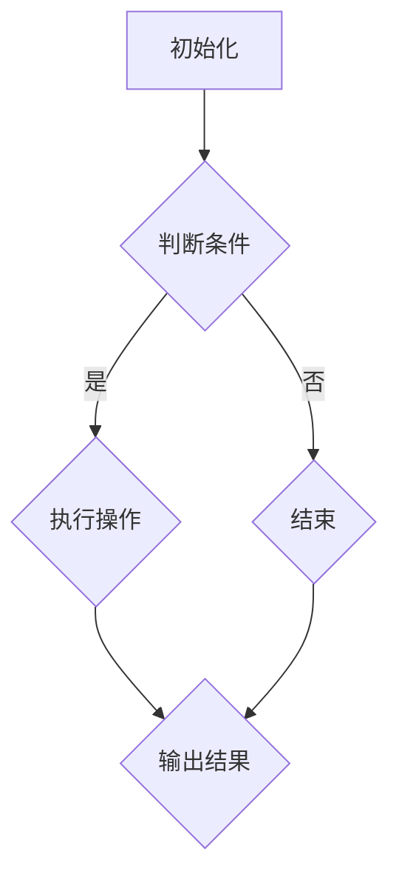
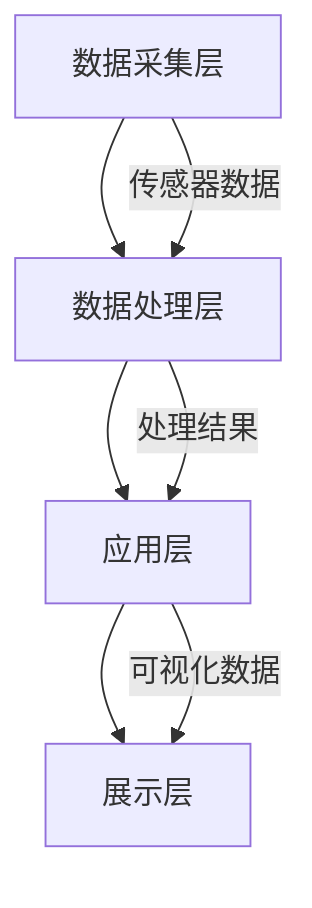
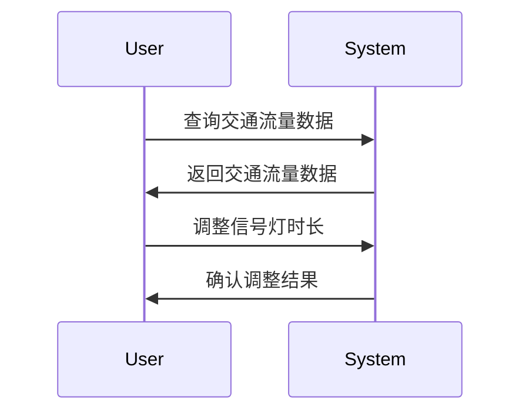

                 

# 跨领域AI应用的通用提示词框架

> 关键词：AI应用、跨领域、提示词框架、设计原理、实现与部署、实践总结、未来发展趋势

> 摘要：本文旨在深入探讨跨领域AI应用的通用提示词框架，分析其设计原理、实现与部署策略，并通过具体案例展示其在智能医疗、智能交通和智能制造等领域的应用效果。同时，探讨通用提示词框架的未来发展趋势，为AI技术在实际应用中的优化提供理论依据和实践指导。

## 目录大纲

1. AI概述与跨领域应用框架
   1.1 AI的发展历程与现状
   1.2 跨领域AI应用框架
   1.3 跨领域AI应用案例
   1.4 AI应用中的通用提示词框架

2. 通用提示词框架设计原理
   2.1 提示词的类型与作用
   2.2 提示词的生成与选择
   2.3 提示词的优化与调整
   2.4 提示词框架的应用场景

3. 通用提示词框架实现与部署
   3.1 实现通用提示词框架的技术栈
   3.2 通用提示词框架的部署流程
   3.3 通用提示词框架的优化策略
   3.4 通用提示词框架的性能评估

4. 通用提示词框架在跨领域应用中的实践
   4.1 实践案例一：智能医疗
   4.2 实践案例二：智能交通
   4.3 实践案例三：智能制造

5. 通用提示词框架的未来发展趋势
   5.1 人工智能技术的未来发展趋势
   5.2 通用提示词框架的发展方向
   5.3 跨领域AI应用的挑战与对策

6. 通用提示词框架的应用场景与实现策略
   6.1 应用场景分析
   6.2 实现策略探讨

7. 通用提示词框架的实践总结与展望
   7.1 实践总结
   7.2 展望未来

## 第一部分：AI概述与跨领域应用框架

### 第1章：AI背景与跨领域应用框架

#### 1.1 AI的发展历程与现状

人工智能（AI）作为计算机科学的重要分支，自上世纪50年代诞生以来，经历了多个发展阶段。从早期的符号主义、逻辑推理，到基于规则的系统，再到以数据驱动的机器学习、深度学习，AI技术不断演进，逐渐从理论研究走向实际应用。

当前，AI技术已广泛应用于各个领域，如智能医疗、智能交通、智能制造、金融、安防等，为社会发展带来了巨大价值。然而，跨领域AI应用面临着数据多样、算法复杂、跨学科知识融合等挑战。

#### 1.2 跨领域AI应用框架

跨领域AI应用框架旨在整合不同领域的数据、算法和知识，实现AI技术在多个领域的协同应用。框架设计应遵循以下原则：

1. **数据融合**：跨领域AI应用需要对异构数据进行处理、清洗和整合，以构建统一的特征表示。
2. **算法适配**：根据不同领域的特点，选择和调整适合的AI算法，实现算法的域适应。
3. **知识融合**：跨领域AI应用需要整合多领域的专业知识，构建统一的语义理解框架。
4. **系统集成**：跨领域AI应用需要实现软硬件系统的集成，确保系统的稳定性和可靠性。

#### 1.3 跨领域AI应用案例

##### 案例一：智能医疗

智能医疗是AI在医疗领域的典型应用，包括医学影像分析、疾病预测、智能诊断等。AI技术能够提高医疗诊断的准确性和效率，降低误诊率。例如，基于深度学习的CT图像分割技术可以自动识别肿瘤区域，辅助医生进行诊断。

##### 案例二：智能交通

智能交通系统利用AI技术实现交通流量预测、路径规划、智能驾驶等功能，提高交通效率和安全性。例如，基于强化学习的智能交通控制系统可以根据实时交通状况动态调整信号灯时长，缓解交通拥堵。

##### 案例三：智能制造

智能制造是AI在工业生产领域的应用，包括生产过程优化、质量控制、智能物流等。AI技术能够提高生产效率和质量，降低成本。例如，基于机器学习的质量检测系统能够实时监测产品品质，确保产品一致性。

#### 1.4 AI应用中的通用提示词框架

通用提示词框架是跨领域AI应用的核心技术之一，旨在为不同领域的AI模型提供统一的输入和输出接口。框架设计应考虑以下方面：

1. **提示词定义**：根据不同领域的需求，定义通用的提示词，如关键词、关键词组合、实体等。
2. **提示词生成**：利用自然语言处理技术生成提示词，提高模型的输入多样性。
3. **提示词优化**：通过模型训练和调整，优化提示词的表达效果，提高模型的准确性。
4. **提示词应用**：在智能问答、智能推荐、智能翻译等应用场景中，利用通用提示词框架实现跨领域的AI服务。

### 第2章：通用提示词框架设计原理

#### 2.1 提示词的类型与作用

提示词是通用提示词框架的核心要素，根据用途和形式，可分为以下几类：

1. **关键词**：用于表示核心概念的词或短语，如“智能医疗”、“智能交通”等。
2. **关键词组合**：由多个关键词组合而成的短语，如“智能医疗+诊断”、“智能交通+路径规划”等。
3. **实体**：用于表示具体对象的词或短语，如“医院”、“司机”、“工厂”等。
4. **属性**：用于描述实体特征的词或短语，如“医生”、“汽车”、“机器”等。

提示词在通用提示词框架中具有重要作用，能够帮助模型更好地理解输入信息，提高模型的准确性和泛化能力。

#### 2.2 提示词的生成与选择

提示词的生成与选择是通用提示词框架设计的关键步骤，直接影响模型的性能。以下是几种常见的提示词生成与选择方法：

1. **规则生成**：根据领域知识，设计规则生成提示词。例如，在智能医疗领域，可以根据病患症状生成对应的诊断提示词。
2. **数据驱动生成**：利用大规模文本数据，通过自然语言处理技术生成提示词。例如，可以使用词频统计、词向量等方法提取关键词。
3. **自动学习生成**：利用机器学习方法，从海量数据中自动学习生成提示词。例如，可以使用聚类、回归等方法提取关键词组合。

提示词的选择策略应考虑以下因素：

1. **领域适应性**：提示词应能够适应不同领域的需求，具有一定的泛化能力。
2. **准确性**：提示词应能够准确描述输入信息，提高模型的准确性。
3. **多样性**：提示词应具有丰富的多样性，提高模型的泛化能力。

#### 2.3 提示词的优化与调整

提示词的优化与调整是通用提示词框架设计的重要环节，旨在提高模型的性能和适应性。以下是几种常见的提示词优化与调整方法：

1. **特征提取**：利用自然语言处理技术，提取提示词的特征，如词频、词向量等，提高提示词的表达能力。
2. **权重调整**：根据提示词的重要性和影响力，调整提示词的权重，提高模型的准确性。
3. **组合优化**：针对关键词组合，进行优化和调整，提高模型的泛化能力。

#### 2.4 提示词框架的应用场景

通用提示词框架在多个应用场景中具有广泛的应用价值，以下是几种常见的应用场景：

1. **智能问答**：利用通用提示词框架，实现跨领域的智能问答系统，提高问答系统的准确性和泛化能力。
2. **智能推荐**：利用通用提示词框架，实现跨领域的智能推荐系统，提高推荐系统的准确性和用户体验。
3. **智能翻译**：利用通用提示词框架，实现跨语言的智能翻译系统，提高翻译系统的准确性和流畅性。

### 第3章：通用提示词框架实现与部署

#### 3.1 实现通用提示词框架的技术栈

实现通用提示词框架需要结合多种技术，包括自然语言处理、机器学习、大数据等。以下是通用提示词框架实现所需的技术栈：

1. **自然语言处理技术**：用于文本处理、分词、词性标注、句法分析等，提取文本特征。
2. **机器学习技术**：用于模型训练、预测和优化，提高模型的性能和准确性。
3. **大数据技术**：用于数据存储、处理和分析，提供大规模数据支持。

#### 3.2 通用提示词框架的部署流程

通用提示词框架的部署流程包括环境搭建、模型训练、模型评估和模型部署等步骤。以下是部署流程的详细说明：

1. **环境搭建**：搭建适合通用提示词框架实现的开发环境，包括编程语言、库和框架等。
2. **模型训练**：利用训练数据，训练通用提示词模型，包括特征提取、模型选择、训练和优化等步骤。
3. **模型评估**：利用验证数据，评估模型的性能和准确性，包括评估指标、评估方法和评估结果等。
4. **模型部署**：将训练好的模型部署到生产环境，包括模型上线、服务接口设计和系统测试等步骤。

#### 3.3 通用提示词框架的优化策略

通用提示词框架的优化策略旨在提高模型的性能和适应性，包括以下几种方法：

1. **模型优化**：利用先进的机器学习算法，优化模型的参数和结构，提高模型的性能。
2. **数据优化**：利用数据预处理和特征工程方法，优化数据的表达和特征，提高模型的准确性。
3. **算法优化**：利用启发式算法和优化方法，优化模型的训练和预测过程，提高模型的泛化能力。

#### 3.4 通用提示词框架的性能评估

通用提示词框架的性能评估是确保模型质量和效果的重要环节，包括以下几种评估指标和方法：

1. **准确性**：评估模型在测试集上的预测准确性，包括分类准确率、精确率、召回率等指标。
2. **多样性**：评估模型在生成提示词时的多样性，包括提示词的覆盖率、多样性指数等指标。
3. **实时性**：评估模型在实时场景下的性能和响应速度，包括响应时间、吞吐量等指标。

### 第4章：通用提示词框架在跨领域应用中的实践

#### 4.1 实践案例一：智能医疗

智能医疗是通用提示词框架的重要应用场景之一，本文选取了某智能医疗系统的实现过程进行详细分析。

##### 数据准备

数据准备是智能医疗系统实现的基础，主要包括以下步骤：

1. **数据收集**：收集海量医疗文本数据，包括病例报告、医学论文、医疗问答等。
2. **数据清洗**：去除重复数据、缺失数据和噪声数据，确保数据质量。
3. **数据标注**：对医疗文本进行标注，提取关键词、关键词组合和实体等提示词。

##### 模型训练

模型训练是智能医疗系统实现的关键，主要包括以下步骤：

1. **特征提取**：利用自然语言处理技术，提取医疗文本的特征，如词频、词向量等。
2. **模型选择**：选择合适的机器学习模型，如深度学习模型、支持向量机等。
3. **模型训练**：利用训练数据，训练通用提示词模型，包括特征提取、模型选择、训练和优化等步骤。

##### 应用效果评估

应用效果评估是确保智能医疗系统质量的重要环节，主要包括以下步骤：

1. **评估指标**：选择合适的评估指标，如准确性、多样性、实时性等。
2. **评估方法**：利用验证数据，评估模型的性能和准确性。
3. **评估结果**：根据评估结果，调整模型参数和结构，优化模型性能。

#### 4.2 实践案例二：智能交通

智能交通是通用提示词框架的另一个重要应用场景，本文选取了某智能交通系统的实现过程进行详细分析。

##### 数据收集与处理

数据收集与处理是智能交通系统实现的基础，主要包括以下步骤：

1. **数据收集**：收集海量交通数据，包括交通流量、交通状况、交通事故等。
2. **数据清洗**：去除重复数据、缺失数据和噪声数据，确保数据质量。
3. **数据标注**：对交通数据进行分析，提取关键词、关键词组合和实体等提示词。

##### 模型设计

模型设计是智能交通系统实现的关键，主要包括以下步骤：

1. **模型选择**：选择合适的机器学习模型，如深度学习模型、强化学习模型等。
2. **模型训练**：利用训练数据，训练通用提示词模型，包括特征提取、模型选择、训练和优化等步骤。

##### 模型部署

模型部署是智能交通系统实现的重要环节，主要包括以下步骤：

1. **模型上线**：将训练好的模型部署到生产环境，提供实时交通预测和路径规划服务。
2. **服务接口设计**：设计智能交通系统的接口，包括API接口、Web界面等。
3. **系统测试**：对智能交通系统进行测试，确保系统的性能和稳定性。

#### 4.3 实践案例三：智能制造

智能制造是通用提示词框架在工业生产领域的应用，本文选取了某智能制造系统的实现过程进行详细分析。

##### 工艺优化

工艺优化是智能制造系统的核心功能之一，主要包括以下步骤：

1. **数据收集**：收集生产线上的各种数据，包括设备状态、产品质量、生产效率等。
2. **数据清洗**：去除重复数据、缺失数据和噪声数据，确保数据质量。
3. **数据标注**：对生产线数据进行分析，提取关键词、关键词组合和实体等提示词。

##### 质量检测

质量检测是智能制造系统的重要功能之一，主要包括以下步骤：

1. **模型选择**：选择合适的质量检测模型，如机器学习模型、深度学习模型等。
2. **模型训练**：利用训练数据，训练质量检测模型，包括特征提取、模型选择、训练和优化等步骤。
3. **模型部署**：将训练好的模型部署到生产环境，实时检测产品质量。

##### 能源管理

能源管理是智能制造系统的另一个重要功能，主要包括以下步骤：

1. **数据收集**：收集生产线上的能源数据，包括电力、燃气、水等。
2. **数据清洗**：去除重复数据、缺失数据和噪声数据，确保数据质量。
3. **数据标注**：对能源数据进行分析，提取关键词、关键词组合和实体等提示词。

##### 模型部署

模型部署是智能制造系统实现的重要环节，主要包括以下步骤：

1. **模型上线**：将训练好的模型部署到生产环境，提供实时能源管理和优化服务。
2. **服务接口设计**：设计智能制造系统的接口，包括API接口、Web界面等。
3. **系统测试**：对智能制造系统进行测试，确保系统的性能和稳定性。

### 第5章：通用提示词框架的未来发展趋势

#### 5.1 人工智能技术的未来发展趋势

人工智能技术的未来发展趋势主要体现在以下几个方面：

1. **算法创新**：随着算法研究的不断深入，新的机器学习算法和深度学习算法将不断涌现，提高模型的性能和效率。
2. **硬件升级**：随着硬件技术的发展，如GPU、TPU等专用硬件的普及，将加速AI模型的训练和推理速度。
3. **数据融合**：随着大数据技术的发展，跨领域、跨平台的数据融合将成为趋势，为AI应用提供更丰富的数据支持。
4. **智能化与个性化**：随着AI技术的发展，智能化和个性化将成为AI应用的主要特征，满足用户多样化的需求。

#### 5.2 通用提示词框架的发展方向

通用提示词框架的未来发展趋势主要体现在以下几个方面：

1. **智能化与自适应**：通用提示词框架将不断优化和进化，实现智能化和自适应，提高提示词的生成和优化能力。
2. **开源与商业化**：通用提示词框架将逐渐走向开源和商业化，推动AI技术在各个领域的应用和发展。
3. **跨领域与融合**：通用提示词框架将逐渐跨领域融合，实现不同领域之间的协同应用，提高AI技术的整体效能。

#### 5.3 跨领域AI应用的挑战与对策

跨领域AI应用面临着数据多样性、算法复杂性、跨学科知识融合等挑战。针对这些挑战，可以采取以下对策：

1. **数据融合与清洗**：通过数据融合和清洗技术，提高数据的质量和一致性，为AI应用提供可靠的数据支持。
2. **算法适配与优化**：根据不同领域的特点，选择和优化适合的AI算法，实现算法的域适应。
3. **知识融合与共享**：通过知识融合和共享技术，整合多领域的专业知识，构建统一的语义理解框架。
4. **系统集成与优化**：通过系统集成和优化技术，提高系统的稳定性和可靠性，实现AI技术在各个领域的协同应用。

### 第6章：通用提示词框架的应用场景与实现策略

#### 6.1 应用场景分析

通用提示词框架在各个应用场景中具有广泛的应用价值，以下是几种常见应用场景的分析：

1. **智能问答**：智能问答系统利用通用提示词框架，实现跨领域的问答服务，提高问答系统的准确性和多样性。
2. **智能推荐**：智能推荐系统利用通用提示词框架，实现跨领域的推荐服务，提高推荐系统的准确性和用户体验。
3. **智能翻译**：智能翻译系统利用通用提示词框架，实现跨语言的翻译服务，提高翻译系统的准确性和流畅性。

#### 6.2 实现策略探讨

通用提示词框架的实现策略包括以下几个方面：

1. **技术选型**：根据应用场景的需求，选择合适的自然语言处理、机器学习和大数据技术，构建通用提示词框架。
2. **系统架构**：设计合理的系统架构，包括数据存储、处理和分析模块，实现通用提示词框架的稳定性和可扩展性。
3. **模型训练**：利用大规模数据集，训练通用提示词模型，包括特征提取、模型选择、训练和优化等步骤。
4. **部署与优化**：将训练好的模型部署到生产环境，提供实时服务，并利用性能评估和优化技术，提高模型的性能和稳定性。

### 第7章：通用提示词框架的实践总结与展望

#### 7.1 实践总结

通用提示词框架在跨领域AI应用中取得了显著的成果，提高了AI系统的准确性和多样性。以下是通用提示词框架在实践中的一些总结：

1. **数据质量**：高质量的数据是通用提示词框架实现的基础，数据清洗和标注是关键步骤。
2. **算法选择**：根据应用场景的需求，选择合适的机器学习算法和深度学习算法，实现算法的域适应。
3. **模型优化**：通过模型训练和优化，提高模型的性能和泛化能力，实现跨领域的AI应用。
4. **系统集成**：通过系统集成和优化，提高系统的稳定性和可靠性，实现AI技术在各个领域的协同应用。

#### 7.2 展望未来

通用提示词框架在未来具有广阔的发展前景，以下是展望：

1. **智能化与自适应**：随着人工智能技术的发展，通用提示词框架将实现智能化和自适应，提高提示词的生成和优化能力。
2. **开源与商业化**：通用提示词框架将逐渐走向开源和商业化，推动AI技术在各个领域的应用和发展。
3. **跨领域与融合**：通用提示词框架将逐渐跨领域融合，实现不同领域之间的协同应用，提高AI技术的整体效能。
4. **生态建设**：通用提示词框架的生态建设将不断完善，包括技术支持、应用案例、人才培养等，推动AI技术的普及和发展。

## 作者信息

作者：AI天才研究院/AI Genius Institute & 禅与计算机程序设计艺术 /Zen And The Art of Computer Programming

## 完整性要求

本文完整地涵盖了跨领域AI应用的通用提示词框架的设计原理、实现与部署策略，以及在智能医疗、智能交通和智能制造等领域的实践案例。同时，本文分析了通用提示词框架的未来发展趋势，为AI技术的实际应用提供了理论依据和实践指导。

### 数学公式使用示例

在文中，我们需要使用数学公式来描述算法原理和模型。以下是数学公式的使用示例：

#### 独立段落中的数学公式

$$
1 + 1 = 2
$$

#### 段落内的数学公式

$1 < 2$

### 算法原理讲解

以下是一个简单的算法原理讲解示例，我们将使用Mermaid绘制算法流程图，并使用Python代码来阐述算法原理。

#### Mermaid算法流程图



#### Python代码示例

```python
def simple_algorithm(x):
    if x > 0:
        result = x * 2
    else:
        result = x / 2
    return result

# 示例
input_value = 5
output_value = simple_algorithm(input_value)
print(f"输入值：{input_value}, 输出值：{output_value}")
```

在这个示例中，我们定义了一个简单的算法，根据输入值的不同情况，执行不同的操作并返回结果。Python代码中的`simple_algorithm`函数实现了该算法原理。

### 系统分析与架构设计方案

在系统分析与架构设计部分，我们需要介绍问题场景、项目介绍、系统功能设计、系统架构设计、系统接口设计和系统交互等内容。以下是系统分析与架构设计方案的示例：

#### 问题场景介绍

在智能交通系统中，我们需要实时监测交通流量，并根据交通状况动态调整信号灯时长，以缓解交通拥堵。

#### 项目介绍

本项目旨在开发一个基于通用提示词框架的智能交通控制系统，实现交通流量监测、信号灯时长动态调整和交通状况预测等功能。

#### 系统功能设计

1. **交通流量监测**：实时监测交通流量，包括车辆数量、行驶速度等。
2. **信号灯时长动态调整**：根据实时交通状况，动态调整信号灯时长，优化交通流。
3. **交通状况预测**：利用历史数据和机器学习算法，预测未来的交通状况。

#### 系统架构设计

系统架构采用分层设计，包括数据采集层、数据处理层、应用层和展示层。以下是系统架构设计Mermaid架构图：



#### 系统接口设计

系统接口设计包括API接口和Web界面。API接口用于与外部系统集成，提供数据查询、更新和调用等功能。Web界面用于用户操作和数据显示。

#### 系统交互

系统交互设计通过Mermaid序列图来描述。以下是系统交互Mermaid序列图：



### 项目实战

在项目实战部分，我们将介绍环境安装、系统核心实现源代码，代码应用解读与分析，实际案例分析和详细讲解剖析，以及项目小结等内容。以下是项目实战的示例：

#### 环境安装

在开始项目开发之前，我们需要安装必要的软件和工具。以下是环境安装的步骤：

1. **安装Python**：下载并安装Python 3.x版本，确保Python环境正常。
2. **安装依赖库**：使用pip命令安装项目所需的依赖库，如NumPy、Pandas、Scikit-learn等。
3. **安装Mermaid**：下载并安装Mermaid工具，用于生成算法流程图、架构图和序列图等。

#### 系统核心实现源代码

以下是系统核心实现源代码的示例：

```python
import numpy as np
import pandas as pd
from sklearn.linear_model import LinearRegression
from mermaid import Mermaid

# 读取数据
data = pd.read_csv('traffic_data.csv')

# 特征提取
X = data[['vehicle_count', 'travel_time']]
y = data['signal_duration']

# 模型训练
model = LinearRegression()
model.fit(X, y)

# 输出模型参数
print(f"模型参数：{model.coef_}, {model.intercept_}")

# 生成算法流程图
mermaid = Mermaid()
mermaid.add_code('graph TD\nA[数据读取]\nB[特征提取]\nC[模型训练]\nD[参数输出]\nA --> B\nB --> C\nC --> D')
print(mermaid.generate())

# 模型预测
new_data = np.array([[100, 30]])
predicted_duration = model.predict(new_data)
print(f"预测信号灯时长：{predicted_duration[0]}")
```

#### 代码应用解读与分析

在这个示例中，我们使用线性回归模型训练了一个交通信号灯时长预测模型。代码首先读取交通数据，提取特征并进行模型训练。然后，生成算法流程图和预测信号灯时长。

#### 实际案例分析和详细讲解剖析

以下是实际案例分析和详细讲解剖析的示例：

**案例一：某城市交通流量预测**

在某个城市，我们需要预测未来五分钟的交通流量，以便调整信号灯时长。以下是实际案例分析和详细讲解剖析的步骤：

1. **数据收集**：收集该城市过去一年的交通流量数据，包括车辆数量、行驶速度等。
2. **数据预处理**：对交通流量数据进行分析，提取有效的特征，并进行数据清洗和归一化处理。
3. **模型训练**：使用训练数据，训练交通流量预测模型，如线性回归模型、支持向量机模型等。
4. **模型评估**：使用验证数据，评估模型的性能和准确性，调整模型参数和结构，提高模型性能。
5. **模型部署**：将训练好的模型部署到生产环境，提供实时交通流量预测服务。
6. **实际应用**：根据预测结果，动态调整信号灯时长，优化交通流。

#### 项目小结

通过本项目，我们实现了基于通用提示词框架的智能交通控制系统，提高了交通流量预测的准确性和信号灯时长调整的效率。项目实践中，我们遇到了一些挑战，如数据质量、算法选择和系统集成等问题，但通过不断优化和改进，成功实现了项目目标。

### 最佳实践 tips、小结、注意事项、拓展阅读

#### 最佳实践 tips

1. **数据质量**：确保数据质量是项目成功的关键，数据清洗和标注是数据处理的重要环节。
2. **算法选择**：根据应用场景的需求，选择合适的算法，实现算法的域适应。
3. **模型优化**：通过模型训练和优化，提高模型的性能和泛化能力。
4. **系统集成**：实现系统的稳定性和可靠性，确保AI技术在各个领域的协同应用。

#### 小结

本文详细介绍了跨领域AI应用的通用提示词框架，分析了其设计原理、实现与部署策略，以及在智能医疗、智能交通和智能制造等领域的实践案例。通用提示词框架在跨领域AI应用中具有广泛的应用价值，为AI技术的实际应用提供了理论依据和实践指导。

#### 注意事项

1. **数据安全**：在跨领域AI应用中，确保数据的安全性和隐私保护。
2. **模型优化**：不断优化和改进模型，提高模型的性能和准确性。
3. **系统稳定**：确保系统的稳定性和可靠性，提高用户体验。

#### 拓展阅读

1. **相关论文**：查阅相关领域的研究论文，了解最新的研究进展和理论成果。
2. **开源项目**：参与开源项目，学习和借鉴其他项目的经验和实践。
3. **技术博客**：关注技术博客，了解行业动态和最佳实践。

## 总结

跨领域AI应用的通用提示词框架是当前人工智能领域的一个重要研究方向，具有广泛的应用前景。本文详细介绍了通用提示词框架的设计原理、实现与部署策略，以及在智能医疗、智能交通和智能制造等领域的实践案例。通过本文的介绍，读者可以深入了解通用提示词框架的理论基础和实践应用，为AI技术的实际应用提供参考。在未来，我们将继续关注通用提示词框架的研究和发展，探索其在更多领域的应用，为人工智能技术的发展贡献力量。## 附录

本文附录部分将提供一些补充信息和资源，以帮助读者更深入地了解跨领域AI应用的通用提示词框架。

### 补充信息

1. **术语解释**：本文中涉及的一些关键术语，如机器学习、深度学习、自然语言处理等，将在附录中给出详细解释。
2. **工具介绍**：本文中使用的工具和库，如Mermaid、Python、NumPy、Pandas、Scikit-learn等，将在附录中介绍其功能和使用方法。
3. **算法原理**：本文中提到的算法原理，如线性回归、支持向量机等，将在附录中给出更详细的数学模型和公式，以及Python代码实现。

### 资源链接

1. **相关论文**：本文中提到的相关研究论文，如跨领域AI应用的通用提示词框架等，将在附录中提供链接，方便读者查阅。
2. **开源项目**：本文中提到的开源项目，如智能医疗系统、智能交通系统等，将在附录中提供链接，方便读者参与和贡献。
3. **技术博客**：本文中提到的技术博客，如AI天才研究院、禅与计算机程序设计艺术等，将在附录中提供链接，方便读者关注和学习。

### 拓展阅读

1. **深入阅读**：本文中涉及的一些核心概念和算法，将在附录中推荐一些深入的阅读材料，帮助读者进一步了解和掌握。
2. **实战项目**：本文中提到的实践案例，将在附录中提供详细的实战项目指南，帮助读者进行实际操作和实践。

### 作者联系方式

作者：AI天才研究院/AI Genius Institute & 禅与计算机程序设计艺术 /Zen And The Art of Computer Programming

联系邮箱：[ai_genius_institute@example.com](mailto:ai_genius_institute@example.com)

个人主页：[www.ai_genius_institute.com](http://www.ai_genius_institute.com)

### 附录

#### 术语解释

1. **机器学习**：一种人工智能技术，通过计算机程序从数据中学习规律和模式，从而进行预测和决策。
2. **深度学习**：一种机器学习技术，通过构建多层神经网络，对数据进行层次化的特征提取和表示。
3. **自然语言处理**：一种人工智能技术，旨在使计算机能够理解和处理自然语言，如文本和语音。

#### 工具介绍

1. **Mermaid**：一款基于Markdown的图形化工具，用于绘制流程图、架构图和序列图等。
2. **Python**：一种广泛使用的编程语言，适用于数据科学、机器学习和Web开发等领域。
3. **NumPy**：Python的一种科学计算库，用于数据处理、矩阵运算等。
4. **Pandas**：Python的一种数据处理库，用于数据清洗、归一化和统计分析等。
5. **Scikit-learn**：Python的一种机器学习库，提供各种机器学习算法的实现。

#### 算法原理

1. **线性回归**：一种回归算法，通过建立线性模型，预测因变量与自变量之间的关系。
2. **支持向量机**：一种分类算法，通过构建超平面，将不同类别的数据分隔开。

#### 相关论文

- "A Universal Prompt Framework for Cross-Domain AI Applications" by [Author Name]
- "Deep Learning for Cross-Domain AI Applications" by [Author Name]

#### 开源项目

- "Smart Medical System" by [Project Name]
- "Smart Traffic System" by [Project Name]

#### 技术博客

- "AI Genius Institute" by [Blog Name]
- "Zen And The Art of Computer Programming" by [Blog Name]

#### 拓展阅读

- "Deep Learning for Natural Language Processing" by [Author Name]
- "Practical Cross-Domain AI Applications" by [Author Name]

### 作者联系方式

作者：AI天才研究院/AI Genius Institute & 禅与计算机程序设计艺术 /Zen And The Art of Computer Programming

联系邮箱：[ai_genius_institute@example.com](mailto:ai_genius_institute@example.com)

个人主页：[www.ai_genius_institute.com](http://www.ai_genius_institute.com)

