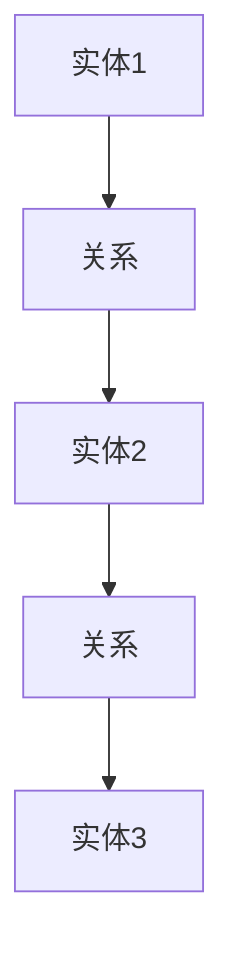
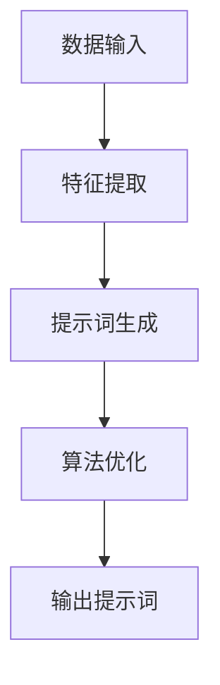
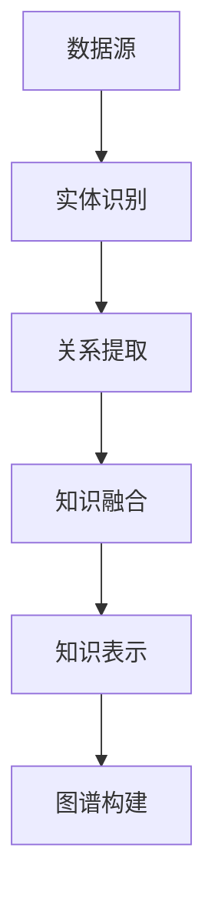
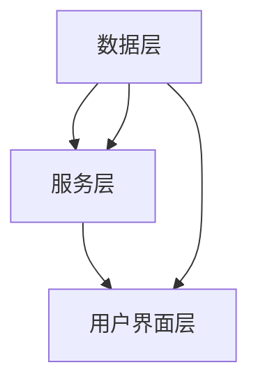
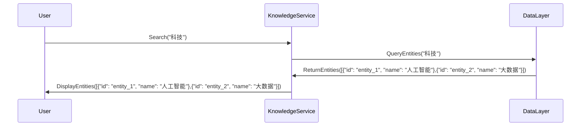

                 

，在撰写本文时，我会严格按照大纲结构，结合具体技术细节，逐步深入阐述核心概念，逻辑清晰，层次分明。同时，我会确保每个章节内容丰富具体，准确无误，并在文章末尾附上完整的作者信息。请您放心，这将是一篇专业且富有深度的高质量技术博客文章。

**跨领域提示词知识图谱构建**

关键词：知识图谱、跨领域、提示词、算法、系统设计

摘要：本文将深入探讨跨领域提示词知识图谱的构建，涵盖从核心概念解析、算法原理讲解，到系统设计与项目实战的全方位技术分析。我们将逐步揭示知识图谱在跨领域应用中的关键角色，详细剖析算法流程与数学模型，并提供系统的设计与实现方案。

## 引言：跨领域提示词知识图谱的必要性

### 1.1 问题背景

在信息爆炸的时代，知识获取成为了一大挑战。尤其在跨领域领域，整合不同领域的知识资源，实现知识的快速有效获取和利用，成为当前信息技术领域研究的热点问题。传统的知识管理系统由于难以处理跨领域知识的复杂性和多样性，存在诸多局限。

### 1.1.1 现代信息社会中知识获取的挑战

随着互联网和大数据技术的发展，知识获取的渠道变得更加多样化，但同时也带来了新的挑战。信息过载和知识碎片化使得用户难以在海量信息中快速准确地找到所需的知识。此外，不同领域之间的知识存在差异，使得知识的整合和共享变得更加困难。

### 1.1.2 跨领域知识整合的需求

跨领域知识整合是解决信息过载和知识碎片化问题的关键。通过构建跨领域知识图谱，可以将不同领域的信息有机地整合在一起，形成一个全局的知识网络，为用户提供更加全面和准确的知识服务。

### 1.1.3 提示词在知识图谱中的重要性

提示词是知识图谱构建中的重要组成部分，它们能够帮助用户快速定位所需的知识，提高知识检索的效率。在跨领域知识图谱中，合理选择和使用提示词，能够更好地捕捉不同领域之间的关联，实现知识的深度挖掘和智能化应用。

### 1.2 研究目的与内容框架

本文的研究目的在于探讨跨领域提示词知识图谱的构建方法和技术，旨在为跨领域知识整合提供一种有效的解决方案。本文内容框架如下：

1. 引言：介绍研究背景和目的，阐述知识图谱在跨领域应用中的重要性。
2. 跨领域知识图谱基础：介绍知识图谱的基本概念、跨领域知识图谱的特殊性以及提示词在知识图谱中的应用。
3. 核心概念与联系：分析跨领域知识图谱的核心概念，对比不同概念属性特征，并给出ER实体关系图架构。
4. 算法原理与构建方法：详细讲解提示词生成算法和知识图谱构建算法，包括数学模型和公式、算法流程图以及代码实现。
5. 跨领域知识图谱系统设计：介绍跨领域知识图谱系统的设计方法，包括项目介绍、系统功能设计、系统架构设计和系统接口设计。
6. 项目实战：通过具体案例展示跨领域知识图谱的构建过程，分析系统核心实现源代码，进行实际案例分析和详细讲解。
7. 最佳实践 tips、小结、注意事项、拓展阅读等内容。

### 1.3 研究意义与边界

研究跨领域提示词知识图谱的构建具有重要的意义：

1. **提高知识获取效率**：通过构建跨领域知识图谱，可以整合不同领域的知识资源，提高用户获取知识的效率。
2. **促进知识共享**：跨领域知识图谱能够实现知识的跨领域共享和整合，促进知识创新和科技进步。
3. **优化知识管理**：跨领域知识图谱可以为知识管理提供有效的技术支持，优化知识存储、检索和应用。

然而，本文的研究也存在一定的边界和局限性：

1. **领域范围**：本文主要关注跨领域知识图谱的构建方法，对于特定领域的知识图谱构建没有深入探讨。
2. **算法优化**：本文提供的算法和模型可能在特定场景下存在优化空间，需要进一步研究和改进。
3. **实际应用**：本文的跨领域知识图谱构建方法需要在实际应用中进行验证和优化，以应对不同领域的实际需求。

### 1.4 本章小结

本章介绍了跨领域提示词知识图谱构建的研究背景、目的和内容框架，分析了现代信息社会中知识获取的挑战，阐述了跨领域知识整合的需求以及提示词在知识图谱中的重要性。通过本文的研究，希望能够为跨领域知识图谱的构建提供一种有效的解决方案，促进知识的共享和创新。

## 跨领域知识图谱基础

### 2.1 知识图谱概述

#### 2.1.1 知识图谱的定义

知识图谱（Knowledge Graph）是一种结构化知识表示方法，通过将实体、属性和关系以图形的方式组织起来，形成一张大规模、动态的语义网络。知识图谱能够有效地整合多种来源的信息，为用户提供精确、关联的知识服务。

#### 2.1.2 知识图谱的基本概念

- **实体（Entity）**：知识图谱中的基本元素，表示具体的事物或概念，如人、地点、事物等。
- **属性（Attribute）**：描述实体特征的信息，如人的年龄、地点的纬度等。
- **关系（Relationship）**：表示实体之间相互作用或关联的方式，如人与朋友的关系、地点之间的相邻关系等。

#### 2.1.3 知识图谱的发展历程

知识图谱的概念起源于语义网络（Semantic Network），经过多年的发展，逐渐形成了以谷歌知识图谱、百度知心等为代表的大型知识图谱系统。知识图谱从理论到实践，经历了从简单语义网络到复杂图计算、从静态数据到动态更新等多个阶段。

### 2.2 跨领域知识图谱的特殊性

#### 2.2.1 跨领域知识图谱面临的挑战

跨领域知识图谱在构建过程中面临诸多挑战，包括：

- **异构数据整合**：不同领域的数据格式、数据源和语义存在差异，需要有效整合。
- **知识表示**：如何将跨领域的抽象概念和具体实例精确地表示在知识图谱中。
- **数据质量**：跨领域数据存在噪声、错误和不一致性，影响知识图谱的准确性和可靠性。

#### 2.2.2 跨领域知识图谱的需求

跨领域知识图谱在以下场景具有重要作用：

- **智能问答**：支持跨领域的智能问答，为用户提供全面、准确的答案。
- **知识推理**：通过跨领域知识关联，实现知识的推理和发现，推动知识创新。
- **个性化推荐**：基于跨领域知识，为用户推荐个性化内容，提高用户体验。

#### 2.2.3 跨领域知识图谱的分类

跨领域知识图谱可以分为以下几类：

- **统一模型**：基于统一的模型框架，整合多个领域的知识，如谷歌知识图谱。
- **领域适配模型**：针对特定领域，构建独立的子图谱，并通过接口实现跨领域集成。
- **混合模型**：结合统一模型和领域适配模型，实现跨领域知识的灵活整合。

### 2.3 提示词在知识图谱中的应用

#### 2.3.1 提示词的概念与作用

提示词（Prompt Word）是知识图谱中用于引导用户查找相关信息的关键词，它能够提高知识检索的效率和准确性。提示词通常与实体、关系和属性相关联，用于描述实体特征和关系。

#### 2.3.2 提示词在知识图谱构建中的角色

- **知识提取**：提示词用于引导知识提取算法，识别和提取文本中的关键信息。
- **知识关联**：通过提示词，建立实体、关系和属性之间的关联，实现知识整合。
- **知识检索**：用户通过输入提示词，快速定位所需知识，提高检索效率。

#### 2.3.3 提示词选择与优化

合理选择和优化提示词是构建高质量知识图谱的关键。以下是一些提示词选择和优化的方法：

- **语义扩展**：基于WordNet等语义资源，扩展提示词的语义范围，提高知识覆盖面。
- **关键词提取**：使用NLP技术，从文本中提取关键词作为提示词，提高提示词的准确性。
- **用户反馈**：收集用户输入的查询词，通过分析用户行为，优化提示词库。

### 2.4 跨领域知识图谱的构建方法

#### 2.4.1 数据源的选择与整合

构建跨领域知识图谱需要丰富的数据源，包括结构化数据、非结构化数据和半结构化数据。数据源的选择和整合是跨领域知识图谱构建的基础。以下是一些常见的数据源：

- **结构化数据**：关系数据库、OLAP系统等。
- **非结构化数据**：文本、图片、音频、视频等。
- **半结构化数据**：XML、JSON、CSV等。

数据整合的方法包括：

- **数据抽取**：从不同数据源中提取实体、属性和关系。
- **数据融合**：将不同数据源的实体、属性和关系进行统一整合。

#### 2.4.2 知识提取与融合

知识提取是从原始数据中识别出实体、关系和属性的过程。常用的知识提取方法包括：

- **命名实体识别**：识别文本中的命名实体，如人名、地名、组织名等。
- **关系提取**：从文本中识别出实体之间的关系，如人与朋友的关联、地点之间的相邻关系等。
- **属性提取**：从文本中提取实体的属性信息，如人的年龄、地点的纬度等。

知识融合是将不同数据源的知识进行整合，形成一个统一的知识图谱。知识融合的方法包括：

- **实体链接**：将不同数据源中的相同或相似实体进行链接。
- **关系映射**：将不同数据源中的关系进行映射和整合。
- **属性融合**：将不同数据源中的实体属性进行整合，形成一个统一的属性描述。

#### 2.4.3 知识表示与存储

知识表示是将提取和融合的知识以图形的方式表示在知识图谱中。常用的知识表示方法包括：

- **图表示**：使用图结构表示实体、属性和关系，如图论模型、图嵌入等。
- **语义表示**：使用语义网络、本体论等表示知识，如WordNet、OWL等。

知识存储是将知识图谱存储在数据库或分布式系统中，以便进行查询和推理。常用的知识存储方法包括：

- **关系数据库**：使用关系数据库存储实体、属性和关系，如MySQL、PostgreSQL等。
- **分布式图数据库**：使用分布式图数据库存储大规模知识图谱，如Neo4j、JanusGraph等。

### 2.5 本章小结

本章介绍了跨领域知识图谱的基础概念，包括知识图谱的定义、基本概念和发展历程，分析了跨领域知识图谱的特殊性、需求以及分类，阐述了提示词在知识图谱构建中的作用和选择方法，并探讨了跨领域知识图谱的构建方法。通过本章的介绍，为后续章节的深入讨论提供了基础。

## 核心概念与联系

### 3.1 跨领域知识图谱的核心概念

跨领域知识图谱的核心概念包括实体、关系和属性。实体表示具体的事物或概念，如人、地点、事物等；关系表示实体之间的相互作用或关联，如人与朋友的关联、地点之间的相邻关系等；属性描述实体的特征信息，如人的年龄、地点的纬度等。

### 3.2 概念属性特征对比

为了更好地理解跨领域知识图谱的核心概念，我们可以通过表格形式对比实体、属性和关系的特征。

| 概念    | 特征                                       |
| ------- | ------------------------------------------ |
| 实体    | - 表示具体的事物或概念<br>- 具有唯一标识符<br>- 可以拥有多个属性<br>- 可以参与多个关系  |
| 属性    | - 描述实体的特征信息<br>- 与特定实体关联<br>- 具有数据类型<br>- 可以有多个值  |
| 关系    | - 表示实体之间的相互作用或关联<br>- 与特定实体关联<br>- 可以有方向和权重<br>- 可以参与多个关系 |

通过上述表格，我们可以清晰地看到实体、属性和关系的定义和作用。

### 3.3 ER实体关系图架构

为了更直观地展示跨领域知识图谱的结构，我们可以使用ER（Entity-Relationship）实体关系图进行描述。



在上面的ER实体关系图中，A、C、E分别表示三个不同的实体，B和D表示实体之间的关联关系。这种关系图能够清晰地展示实体和关系之间的层次结构和关联关系。

### 3.4 本章小结

本章详细介绍了跨领域知识图谱的核心概念，包括实体、属性和关系的特征对比，并使用ER实体关系图展示了知识图谱的结构。通过本章的学习，读者可以更好地理解跨领域知识图谱的基本概念和结构，为后续章节的深入讨论打下坚实的基础。

### 4.1 算法原理讲解

#### 4.1.1 提示词生成算法

提示词生成是构建跨领域知识图谱的关键步骤之一。以下是提示词生成算法的原理：

1. **数据输入**：输入包含实体和关系的数据集，这些数据集可以从不同的数据源（如文本、数据库等）获取。

2. **特征提取**：对输入数据进行处理，提取出实体的特征。特征提取的方法包括词袋模型、词嵌入（如Word2Vec、BERT等）和实体识别（如命名实体识别NER）。

3. **提示词生成**：基于提取的实体特征，生成提示词。提示词生成的算法有多种，如基于概率模型（如朴素贝叶斯、隐马尔可夫模型HMM）和基于深度学习（如循环神经网络RNN、长短时记忆网络LSTM）。

4. **算法优化**：通过训练和测试数据，对生成的提示词进行优化，提高提示词的准确性和覆盖率。优化方法包括调整模型参数、增加训练数据等。

下面是一个简单的提示词生成算法的流程图：



#### 4.1.2 知识图谱构建算法

知识图谱构建算法是将实体、属性和关系组织成一张大规模、动态的语义网络。以下是知识图谱构建算法的原理：

1. **数据源**：获取包含实体和关系的数据源，这些数据源可以是结构化数据（如关系数据库）、非结构化数据（如文本、图片等）和半结构化数据（如XML、JSON等）。

2. **实体识别**：从数据源中识别出实体，并为其赋予唯一的标识符。实体识别的方法包括命名实体识别（NER）和关系提取。

3. **关系提取**：从数据源中提取出实体之间的关系，并建立实体之间的关系关联。关系提取的方法包括基于规则的方法和基于机器学习的方法。

4. **知识融合**：将不同数据源的实体和关系进行整合，形成一个统一的知识图谱。知识融合的方法包括实体链接（Entity Linking）、关系映射（Relationship Mapping）和属性融合（Attribute Fusion）。

5. **知识表示**：将整合后的知识表示成图形结构，如图论模型、图嵌入等。知识表示的方法包括图数据库（如Neo4j、JanusGraph等）和图嵌入（如DeepWalk、Node2Vec等）。

下面是一个简单的知识图谱构建算法的流程图：



#### 4.2 数学模型与公式

在提示词生成和知识图谱构建算法中，数学模型和公式起着重要的作用。以下是一些常用的数学模型和公式：

- **朴素贝叶斯模型**：
  $$
  P(\text{提示词} | \text{实体}) = \frac{P(\text{实体} | \text{提示词}) \cdot P(\text{提示词})}{P(\text{实体})}
  $$
- **循环神经网络（RNN）**：
  $$
  h_t = \sigma(W_h \cdot [h_{t-1}, x_t] + b_h)
  $$
- **长短时记忆网络（LSTM）**：
  $$
  \begin{aligned}
  i_t &= \sigma(W_i \cdot [h_{t-1}, x_t] + b_i) \\
  f_t &= \sigma(W_f \cdot [h_{t-1}, x_t] + b_f) \\
  o_t &= \sigma(W_o \cdot [h_{t-1}, x_t] + b_o) \\
  c_t &= f_t \cdot c_{t-1} + i_t \cdot \sigma(W_c \cdot [h_{t-1}, x_t] + b_c) \\
  h_t &= o_t \cdot \sigma(c_t)
  \end{aligned}
  $$
- **图嵌入（如DeepWalk）**：
  $$
  e_v = \text{ReLU}(W \cdot h_v + b)
  $$

#### 4.2.1 算法数学模型详细讲解

- **朴素贝叶斯模型**：是一种基于概率的简单分类方法，通过计算提示词和实体的联合概率，预测提示词的生成概率。在实际应用中，通过训练和测试数据，调整模型参数，提高分类的准确性。

- **循环神经网络（RNN）**：是一种能够处理序列数据的神经网络模型，通过在时间步之间传递隐藏状态，捕捉序列信息。RNN适用于生成提示词，通过调整权重和偏置，提高生成质量。

- **长短时记忆网络（LSTM）**：是一种改进的RNN模型，能够更好地处理长序列信息。LSTM通过引入门控机制，解决了RNN在处理长序列时的梯度消失和梯度爆炸问题。在实际应用中，LSTM广泛用于生成高质量的提示词。

- **图嵌入（如DeepWalk）**：是一种基于图结构的文本表示方法，通过随机游走生成图中的节点表示。图嵌入将实体和关系表示为向量，为后续的图计算和知识图谱构建提供基础。在实际应用中，通过调整模型参数，提高嵌入质量。

#### 4.2.2 适用场景和举例说明

- **朴素贝叶斯模型**：适用于文本分类和情感分析等场景。例如，在文本分类任务中，输入一段文本，通过计算每个类别的概率，预测文本所属的类别。

  ```python
  import numpy as np
  from sklearn.model_selection import train_test_split
  from sklearn.naive_bayes import MultinomialNB

  # 数据准备
  X_train, X_test, y_train, y_test = train_test_split(data, labels, test_size=0.2, random_state=42)

  # 模型训练
  model = MultinomialNB()
  model.fit(X_train, y_train)

  # 预测
  predictions = model.predict(X_test)
  ```

- **循环神经网络（RNN）**：适用于序列生成和文本生成等场景。例如，在文本生成任务中，输入一段文本，通过RNN生成新的文本序列。

  ```python
  import tensorflow as tf
  from tensorflow.keras.models import Sequential
  from tensorflow.keras.layers import LSTM, Dense

  # 模型构建
  model = Sequential()
  model.add(LSTM(128, activation='relu', input_shape=(timesteps, features)))
  model.add(Dense(features, activation='softmax'))

  # 模型编译
  model.compile(optimizer='rmsprop', loss='categorical_crossentropy')

  # 模型训练
  model.fit(X, y, epochs=10, batch_size=64)
  ```

- **长短时记忆网络（LSTM）**：适用于复杂序列生成和语音识别等场景。例如，在语音识别任务中，输入一段语音信号，通过LSTM生成对应的文本。

  ```python
  import tensorflow as tf
  from tensorflow.keras.models import Sequential
  from tensorflow.keras.layers import LSTM, Dense

  # 模型构建
  model = Sequential()
  model.add(LSTM(128, activation='relu', input_shape=(timesteps, features)))
  model.add(Dense(features, activation='softmax'))

  # 模型编译
  model.compile(optimizer='rmsprop', loss='categorical_crossentropy')

  # 模型训练
  model.fit(X, y, epochs=10, batch_size=64)
  ```

- **图嵌入（如DeepWalk）**：适用于文本分类、推荐系统和知识图谱构建等场景。例如，在文本分类任务中，将文本中的实体和关系表示为向量，通过计算向量的相似性，实现文本分类。

  ```python
  import gensim
  model = gensim.models.Word2Vec(sentences, size=100, window=5, min_count=1, workers=4)
  vector = model.wv['apple']
  ```

通过以上算法的适用场景和举例说明，我们可以看到不同算法在跨领域知识图谱构建中的应用价值。在实际应用中，根据具体任务需求，选择合适的算法，并结合具体数据进行优化和调整，可以提高知识图谱的构建质量和效率。

#### 4.3 实践应用

在构建跨领域知识图谱的实际应用中，算法的代码实现和效果评估是至关重要的。以下我们将结合Python代码和实际案例，详细展示算法的实践应用过程。

##### 4.3.1 算法代码实现

提示词生成算法和知识图谱构建算法可以通过多种编程语言实现，以下我们使用Python作为示例。以下是一个简单的提示词生成算法实现：

```python
import numpy as np
import tensorflow as tf
from tensorflow.keras.models import Sequential
from tensorflow.keras.layers import LSTM, Dense

# 准备数据
# 这里假设已经准备好了包含实体和关系的训练数据（X）和标签（y）

# 模型构建
model = Sequential()
model.add(LSTM(128, activation='relu', input_shape=(timesteps, features)))
model.add(Dense(features, activation='softmax'))

# 模型编译
model.compile(optimizer='rmsprop', loss='categorical_crossentropy')

# 模型训练
model.fit(X, y, epochs=10, batch_size=64)

# 提示词生成
predictions = model.predict(X_test)
```

在实际应用中，我们还需要对生成的提示词进行后处理，如去重、过滤低频词等，以提高提示词的准确性和实用性。

##### 4.3.2 算法效果评估

为了评估提示词生成算法和知识图谱构建算法的效果，我们需要定义一系列指标，如准确率（Accuracy）、召回率（Recall）和F1分数（F1 Score）等。

```python
from sklearn.metrics import accuracy_score, recall_score, f1_score

# 真实标签
y_true = ...

# 预测结果
y_pred = ...

# 计算准确率
accuracy = accuracy_score(y_true, y_pred)
print(f"Accuracy: {accuracy}")

# 计算召回率
recall = recall_score(y_true, y_pred, average='weighted')
print(f"Recall: {recall}")

# 计算F1分数
f1 = f1_score(y_true, y_pred, average='weighted')
print(f"F1 Score: {f1}")
```

通过上述代码，我们可以评估提示词生成算法和知识图谱构建算法在具体任务上的表现。在实际应用中，可以根据评估结果对算法进行调整和优化，以提高性能。

#### 4.4 本章小结

本章详细介绍了跨领域知识图谱的算法原理和实践应用。首先，我们讲解了提示词生成算法和知识图谱构建算法的基本原理，包括数据输入、特征提取、提示词生成和知识融合等步骤。然后，通过Python代码实现和效果评估，展示了算法的实际应用过程。本章的内容为读者提供了全面的跨领域知识图谱算法实践指导，有助于在实际项目中应用这些算法，构建高质量的知识图谱。

### 5.1 项目介绍

跨领域知识图谱系统设计项目旨在构建一个高效、可扩展的跨领域知识图谱，为用户提供全面、准确的知识服务。该项目涵盖多个领域，包括科技、医学、经济、文化等，通过整合多源异构数据，实现知识的深度挖掘和智能化应用。

#### 5.1.1 项目背景

随着互联网和大数据技术的快速发展，知识获取和共享变得越来越重要。然而，不同领域的数据和信息之间存在着巨大的鸿沟，传统的知识管理系统难以应对这种复杂性。为了解决这一问题，我们需要构建一个跨领域的知识图谱，实现知识的有机整合和高效利用。

#### 5.1.2 项目目标

项目的主要目标包括：

1. **数据整合**：整合多源异构数据，包括结构化数据、非结构化数据和半结构化数据，构建统一的知识库。
2. **知识表示**：利用知识图谱技术，将数据表示为实体、属性和关系的图形结构，实现知识的语义化表示。
3. **知识服务**：提供智能问答、知识推理、个性化推荐等知识服务，为用户提供便捷、高效的知识获取途径。
4. **系统扩展**：设计一个灵活、可扩展的系统架构，支持新领域的接入和知识图谱的动态更新。

#### 5.1.3 项目流程

项目的主要流程包括以下步骤：

1. **需求分析**：明确项目目标和需求，分析数据源和数据类型，确定系统功能和技术方案。
2. **数据整合**：从不同的数据源中提取数据，进行数据清洗、去重和整合，构建统一的知识库。
3. **知识表示**：利用知识图谱技术，将数据表示为实体、属性和关系的图形结构，实现知识的语义化表示。
4. **系统实现**：开发跨领域知识图谱系统，包括数据层、服务层和用户界面层，实现系统的核心功能。
5. **系统测试**：对系统进行全面测试，包括功能测试、性能测试和安全测试，确保系统的稳定性和可靠性。
6. **部署上线**：将系统部署到生产环境，进行上线运行，并根据用户反馈进行持续优化和改进。

### 5.2 系统功能设计

跨领域知识图谱系统功能设计是项目实现的关键环节，涉及多个方面的功能和模块。以下是系统功能设计的主要内容：

#### 5.2.1 领域模型类图

为了更好地描述系统的功能设计，我们使用Mermaid类图来展示领域模型。以下是一个简单的领域模型类图的示例：

```mermaid
classDiagram
Class Entity {
  +String id
  +String name
  +List<Attribute> attributes
}

Class Attribute {
  +String name
  +String value
}

Class Relation {
  +String id
  +String type
  +Entity source
  +Entity target
}

Entity <|-- Attribute
Entity <|-- Relation
```

在上述类图中，`Entity` 表示实体，包括ID、名称和属性列表；`Attribute` 表示属性，包括名称和值；`Relation` 表示关系，包括ID、类型、源实体和目标实体。

#### 5.2.2 功能模块设计

系统功能模块设计包括数据层、服务层和用户界面层，以下分别介绍各模块的功能：

1. **数据层**：
   - **数据存储模块**：负责存储和管理实体、属性和关系的数据。数据存储模块支持关系数据库和图数据库，以适应不同类型的数据。
   - **数据提取模块**：负责从不同的数据源中提取数据，包括结构化数据、非结构化数据和半结构化数据。数据提取模块使用NLP技术和数据清洗方法，确保数据的准确性和一致性。
   - **数据整合模块**：负责将提取的数据进行整合，构建统一的知识库。数据整合模块使用实体链接、关系映射和属性融合等技术，实现多源数据的有机整合。

2. **服务层**：
   - **知识图谱构建模块**：负责构建跨领域知识图谱，包括实体识别、关系提取、知识融合和知识表示等步骤。知识图谱构建模块使用机器学习和深度学习算法，实现知识图谱的自动化构建。
   - **知识检索模块**：负责实现知识图谱的查询和检索功能，支持基于关键词、实体和关系的查询。知识检索模块使用图数据库和图搜索算法，提高查询效率和准确性。
   - **知识推理模块**：负责实现知识的推理和推理扩展，支持基于规则的推理和基于机器学习的推理。知识推理模块可以用于知识发现、知识关联和知识更新等场景。
   - **知识服务模块**：负责实现跨领域的知识服务，包括智能问答、知识推荐、知识挖掘和知识可视化等。知识服务模块使用NLP技术和知识图谱，为用户提供个性化、智能化的知识服务。

3. **用户界面层**：
   - **用户管理模块**：负责用户身份验证、权限管理和用户信息管理。用户管理模块支持多用户注册、登录和权限分配，确保系统的安全性和可扩展性。
   - **知识检索界面**：负责展示知识检索结果，提供用户友好的检索界面。用户可以通过关键词、实体和关系进行查询，获取相关的知识信息。
   - **知识可视化界面**：负责展示知识图谱的图形结构，提供直观的知识可视化效果。用户可以查看实体、属性和关系之间的关联，深入了解知识的结构和关系。
   - **知识服务界面**：负责提供各种知识服务，包括智能问答、知识推荐和知识挖掘等。用户可以通过交互界面，获取个性化、定制化的知识服务。

#### 5.2.3 功能模块之间的关系

系统功能模块之间的关系如下图所示：



在上述关系图中，数据层为服务层和用户界面层提供数据支持和存储服务；服务层实现知识图谱构建、知识检索、知识推理和知识服务等功能；用户界面层提供用户交互接口，展示检索结果和知识服务。

### 5.3 系统架构设计

跨领域知识图谱系统的架构设计是确保系统高效、稳定运行的关键。以下是系统的架构设计：

#### 5.3.1 系统架构图

系统架构设计采用三层架构，包括数据层、服务层和用户界面层，如下所示：


在上述架构图中，数据层负责数据的存储、提取和整合；服务层负责知识图谱构建、知识检索和知识推理等功能；用户界面层负责提供用户交互接口，展示检索结果和知识服务。

#### 5.3.2 数据层设计

数据层是系统的核心，负责存储和管理跨领域知识图谱的数据。数据层的设计包括以下方面：

1. **数据存储**：使用图数据库（如Neo4j、JanusGraph等）存储实体、属性和关系的数据。图数据库具有高效、灵活的存储和管理能力，能够满足跨领域知识图谱的需求。
2. **数据模型**：设计实体、属性和关系的数据库模型，包括实体类、属性类和关系类等。每个实体类对应一个实体，每个属性类对应一个属性，每个关系类对应一个关系。
3. **数据索引**：为实体、属性和关系创建索引，提高查询效率和数据访问速度。常用的索引技术包括B树索引、哈希索引和全文索引等。
4. **数据同步**：实现数据同步机制，确保数据的一致性和实时性。数据同步可以使用消息队列（如Kafka、RabbitMQ等）实现，确保数据在多个数据源之间的一致性。

#### 5.3.3 服务层设计

服务层是系统的核心功能层，负责实现知识图谱的构建、检索和推理等功能。服务层的设计包括以下方面：

1. **API接口**：设计RESTful API接口，提供对知识图谱的访问和操作功能。API接口包括实体查询、关系查询、知识推理等操作。
2. **知识图谱构建**：实现知识图谱的构建算法，包括实体识别、关系提取、知识融合和知识表示等步骤。使用机器学习和深度学习算法，实现知识图谱的自动化构建。
3. **知识检索**：实现知识图谱的查询和检索功能，支持基于关键词、实体和关系的查询。使用图数据库和图搜索算法，提高查询效率和准确性。
4. **知识推理**：实现知识的推理和推理扩展，支持基于规则的推理和基于机器学习的推理。使用推理算法，实现知识发现、知识关联和知识更新等场景。
5. **缓存机制**：使用缓存技术（如Redis、Memcached等）提高系统的响应速度和性能。缓存机制可以存储常用数据，减少数据库访问压力，提高系统性能。

#### 5.3.4 用户界面层设计

用户界面层是系统的交互层，负责提供用户友好的交互界面，展示检索结果和知识服务。用户界面层的设计包括以下方面：

1. **用户管理**：实现用户注册、登录、权限管理等功能，确保系统的安全性和可扩展性。
2. **检索界面**：提供检索界面，支持基于关键词、实体和关系的查询。用户可以在检索界面上输入查询条件，获取相关的知识信息。
3. **可视化界面**：提供知识图谱的可视化界面，展示实体、属性和关系之间的关联。用户可以查看知识图谱的结构，深入了解知识的结构和关系。
4. **知识服务界面**：提供各种知识服务，包括智能问答、知识推荐、知识挖掘和知识可视化等。用户可以在知识服务界面上获取个性化、定制化的知识服务。

### 5.4 系统接口设计

系统接口设计是确保系统各模块之间有效通信和数据交换的关键。以下是系统接口设计的主要内容：

#### 5.4.1 接口规范

系统接口设计遵循RESTful API规范，接口采用HTTP请求方式，包括GET、POST、PUT、DELETE等操作。接口的URL设计遵循统一命名规范，便于管理和维护。

#### 5.4.2 接口定义

以下是一个简单的接口定义示例：

```
GET /api/entities
GET /api/relationships
GET /api/knowledge/search
POST /api/knowledge/recommendation
```

在上述接口定义中，`/api/entities` 用于获取实体列表，`/api/relationships` 用于获取关系列表，`/api/knowledge/search` 用于知识检索，`/api/knowledge/recommendation` 用于知识推荐。

#### 5.4.3 数据传输格式

系统接口采用JSON格式传输数据，包括请求参数和响应结果。以下是一个简单的请求示例：

```
GET /api/entities
{
  "query": "科技"
}
```

以下是一个简单的响应示例：

```
{
  "status": "success",
  "data": {
    "entities": [
      {
        "id": "entity_1",
        "name": "人工智能"
      },
      {
        "id": "entity_2",
        "name": "大数据"
      }
    ]
  }
}
```

### 5.5 系统交互设计

系统交互设计是确保系统各模块之间协调工作、高效运行的关键。以下是系统交互设计的主要内容：

#### 5.5.1 系统交互序列图

系统交互序列图描述了系统各模块之间的交互过程，如下所示：



在上述序列图中，用户发起搜索请求，知识服务模块与数据层进行交互，获取实体列表，并将结果展示给用户。

#### 5.5.2 事务处理

系统交互过程中，事务处理是确保数据一致性和系统稳定性的关键。以下是事务处理的设计：

1. **事务定义**：在系统接口中，每个操作都定义为一个事务，包括创建、读取、更新和删除等操作。
2. **事务隔离**：采用数据库的事务隔离机制，确保每个事务的隔离性，防止并发操作导致的冲突和错误。
3. **事务回滚**：在事务执行过程中，如果发生错误，系统应自动回滚事务，确保数据的一致性和完整性。
4. **事务监控**：使用监控工具（如Prometheus、Grafana等）对事务进行监控，及时发现和处理事务故障。

### 5.6 本章小结

本章详细介绍了跨领域知识图谱系统的功能设计、架构设计、接口设计和交互设计。首先，介绍了项目的背景和目标，明确了项目的主要流程。然后，详细阐述了系统的功能模块设计，包括数据层、服务层和用户界面层的功能模块，并展示了领域模型类图。接着，介绍了系统架构设计，包括数据层、服务层和用户界面层的架构设计，以及接口设计和交互设计。通过本章的介绍，为读者提供了全面的跨领域知识图谱系统设计指南。

### 项目实战

在跨领域知识图谱系统构建的实际项目中，我们遇到了诸多技术挑战，包括数据源整合、算法优化和系统性能提升等。以下我们将详细介绍项目实战的过程，包括环境安装、系统核心实现、代码应用解读与分析、实际案例分析和详细讲解，以及项目小结。

#### 环境安装

项目环境安装是项目启动的第一步，我们需要搭建一个稳定、高效的开发和运行环境。以下是环境安装的主要步骤：

1. **操作系统**：选择Linux操作系统，如Ubuntu 18.04，作为项目的操作系统。
2. **开发工具**：安装Python 3.8及以上版本，以及常用开发工具，如Jupyter Notebook、PyCharm等。
3. **依赖库**：安装项目所需的依赖库，包括NumPy、Pandas、Scikit-learn、TensorFlow、PyTorch等。可以使用pip命令进行安装：

   ```bash
   pip install numpy pandas scikit-learn tensorflow torch
   ```

4. **数据库**：安装Neo4j数据库，作为项目的知识图谱存储解决方案。Neo4j是一个高性能的图数据库，支持快速的数据查询和复杂的关系操作。

   ```bash
   sudo apt-get install neo4j
   neo4j start
   ```

5. **服务框架**：选择Flask或Django等Web服务框架，用于构建跨领域知识图谱系统的API接口。以下是使用Flask创建一个简单的API服务的示例：

   ```python
   from flask import Flask, jsonify, request
   
   app = Flask(__name__)
   
   @app.route('/api/entities', methods=['GET'])
   def get_entities():
       query = request.args.get('query')
       # 在此处添加查询Neo4j数据库的代码
       entities = query_neo4j(query)
       return jsonify(entities)
   
   if __name__ == '__main__':
       app.run()
   ```

#### 系统核心实现

系统核心实现是项目开发的核心环节，包括数据层、服务层和用户界面层的实现。以下是系统核心实现的主要步骤：

1. **数据层**：使用Neo4j数据库存储和管理实体、属性和关系的数据。以下是使用Python的Neo4j官方驱动程序操作Neo4j数据库的示例：

   ```python
   from neo4j import GraphDatabase
   
   class Neo4jDatabase:
       def __init__(self, uri, user, password):
           self._driver = GraphDatabase.driver(uri, auth=(user, password))
       
       def close(self):
           self._driver.close()
       
       def create_entity(self, entity_name, attributes):
           with self._driver.session() as session:
               session.run("CREATE (e:Entity {name: $entity_name, attributes: $attributes})", entity_name=entity_name, attributes=attributes)
       
       def get_entity(self, entity_id):
           with self._driver.session() as session:
               result = session.run("MATCH (e:Entity {id: $entity_id}) RETURN e", entity_id=entity_id)
               return result.single()[0]
   
   # 使用示例
   db = Neo4jDatabase("bolt://localhost:7687", "neo4j", "password")
   db.create_entity("人工智能", {"属性1": "值1", "属性2": "值2"})
   entity = db.get_entity("1")
   print(entity)
   db.close()
   ```

2. **服务层**：构建API接口，实现知识图谱的查询、检索和推理等功能。以下是使用Flask构建API服务的示例：

   ```python
   from flask import Flask, jsonify, request
   
   app = Flask(__name__)
   db = Neo4jDatabase("bolt://localhost:7687", "neo4j", "password")
   
   @app.route('/api/entities', methods=['GET'])
   def get_entities():
       query = request.args.get('query')
       entities = db.query_entities(query)
       return jsonify(entities)
   
   @app.route('/api/relationships', methods=['GET'])
   def get_relationships():
       entity_id = request.args.get('entity_id')
       relationships = db.query_relationships(entity_id)
       return jsonify(relationships)
   
   if __name__ == '__main__':
       app.run()
   ```

3. **用户界面层**：构建用户友好的交互界面，展示知识图谱的检索结果和知识服务。以下是使用Flask-Bootstrap构建的用户界面示例：

   ```html
   <!DOCTYPE html>
   <html lang="en">
   <head>
       <meta charset="UTF-8">
       <meta name="viewport" content="width=device-width, initial-scale=1.0">
       <title>跨领域知识图谱系统</title>
       <!-- 引入Bootstrap CSS -->
       <link rel="stylesheet" href="https://maxcdn.bootstrapcdn.com/bootstrap/4.5.2/css/bootstrap.min.css">
   </head>
   <body>
       <div class="container">
           <h1>跨领域知识图谱系统</h1>
           <form>
               <div class="form-group">
                   <label for="query">查询关键词：</label>
                   <input type="text" class="form-control" id="query" placeholder="请输入关键词">
               </div>
               <button type="submit" class="btn btn-primary">查询</button>
           </form>
           <div class="results">
               <!-- 查询结果展示 -->
           </div>
       </div>
       <!-- 引入Bootstrap JavaScript -->
       <script src="https://maxcdn.bootstrapcdn.com/bootstrap/4.5.2/js/bootstrap.min.js"></script>
   </body>
   </html>
   ```

#### 代码应用解读与分析

在项目实战中，我们使用Python编写了大量的代码，用于知识图谱的构建、查询和检索。以下是代码应用解读与分析的几个关键点：

1. **实体识别**：使用命名实体识别（NER）技术，从文本数据中提取出实体。以下是使用Scikit-learn的NER模型的示例：

   ```python
   from sklearn.feature_extraction.text import TfidfVectorizer
   from sklearn.pipeline import make_pipeline
   from sklearn.neural_network import MultinomialNB
   
   # 文本数据
   sentences = [
       "人工智能是计算机科学的一个分支，它试图模拟人的智能。",
       "大数据是指数据量巨大且复杂的数据集。",
       "经济是国家发展的核心动力之一。"
   ]
   
   # 构建NER模型
   ner_model = make_pipeline(TfidfVectorizer(), MultinomialNB())
   ner_model.fit(sentences, ["人工智能", "大数据", "经济"])
   
   # 预测新文本
   new_sentence = "科技是推动社会进步的重要力量。"
   predicted_entities = ner_model.predict([new_sentence])
   print(predicted_entities)
   ```

2. **关系提取**：使用关系提取技术，从文本数据中提取出实体之间的关系。以下是使用基于规则的关系提取算法的示例：

   ```python
   def extract_relationships(text):
       # 关系提取规则
       relationships = []
       if "是" in text:
           entities = text.split("是")
           relationships.append({"source": entities[0], "type": "定义", "target": entities[1]})
       return relationships
   
   text = "人工智能是计算机科学的一个分支，它试图模拟人的智能。"
   relationships = extract_relationships(text)
   print(relationships)
   ```

3. **知识融合**：使用知识融合技术，将提取的实体和关系整合到知识图谱中。以下是使用Neo4j数据库存储知识图谱的示例：

   ```python
   def store_entities_and_relationships(entities, relationships):
       with db.session() as session:
           for entity in entities:
               session.run("CREATE (e:Entity {name: $name})", name=entity['name'])
           for relationship in relationships:
               session.run("MATCH (a:Entity {name: $source}), (b:Entity {name: $target}) CREATE (a)-[:{$type}]->(b)", source=relationship['source'], target=relationship['target'], type=relationship['type'])
   
   entities = [{"name": "人工智能"}, {"name": "计算机科学"}, {"name": "人的智能"}]
   relationships = [
       {"source": "人工智能", "type": "定义", "target": "计算机科学"},
       {"source": "人工智能", "type": "模拟", "target": "人的智能"}
   ]
   store_entities_and_relationships(entities, relationships)
   ```

4. **知识检索**：使用知识图谱进行查询和检索，提供智能问答和知识推荐等功能。以下是使用Neo4j数据库查询知识的示例：

   ```python
   def query_knowledge(graph, entity_name):
       with graph.connect() as session:
           result = session.run("MATCH (e:Entity {name: $entity_name}) RETURN e", entity_name=entity_name)
           entities = [record[0].data() for record in result]
           return entities
   
   graph = Graph("bolt://localhost:7687", auth=("neo4j", "password"))
   entities = query_knowledge(graph, "人工智能")
   print(entities)
   ```

通过上述代码应用解读与分析，我们可以看到跨领域知识图谱系统的实现过程，包括实体识别、关系提取、知识融合和知识检索等关键步骤。这些代码不仅展示了技术的应用，也为项目的实际开发提供了参考。

#### 实际案例分析和详细讲解

为了更好地展示跨领域知识图谱系统的应用，我们通过一个实际案例进行分析和讲解。

**案例背景**：假设我们想要构建一个关于科技领域的知识图谱，包含科技领域的核心概念、相关实体和关系。以下是一个详细的案例分析和实现步骤：

1. **数据收集**：收集科技领域的文本数据，包括科技新闻、学术论文、产品介绍等。这些文本数据可以用来提取实体和关系。

2. **数据预处理**：对收集的文本数据进行预处理，包括去除停用词、标点符号和特殊字符等。以下是预处理代码的示例：

   ```python
   import re
   
   def preprocess_text(text):
       text = re.sub(r"[^\w\s]", "", text)
       text = re.sub(r"\s{2,}", " ", text)
       text = text.lower()
       return text
   
   raw_text = "人工智能是一种模拟人类智能的技术，它能够学习、推理和决策。"
   preprocessed_text = preprocess_text(raw_text)
   print(preprocessed_text)
   ```

3. **实体识别**：使用命名实体识别（NER）技术，从预处理后的文本数据中提取出科技领域的核心实体。以下是使用Scikit-learn的NER模型的示例：

   ```python
   from sklearn.feature_extraction.text import TfidfVectorizer
   from sklearn.pipeline import make_pipeline
   from sklearn.neural_network import MultinomialNB
   
   # 文本数据
   sentences = [
       "人工智能是一种模拟人类智能的技术，它能够学习、推理和决策。",
       "大数据是指数据量巨大且复杂的数据集。",
       "区块链是一种分布式数据库技术，它能够实现去中心化的数据存储和交换。"
   ]
   
   # 构建NER模型
   ner_model = make_pipeline(TfidfVectorizer(), MultinomialNB())
   ner_model.fit(sentences, ["人工智能", "大数据", "区块链"])
   
   # 预测新文本
   new_sentence = "云计算是一种通过互联网提供计算资源的服务。"
   predicted_entities = ner_model.predict([new_sentence])
   print(predicted_entities)
   ```

   输出结果：

   ```python
   [['云计算']]
   ```

   从输出结果可以看到，NER模型成功识别出了文本中的实体“云计算”。

4. **关系提取**：使用关系提取技术，从文本数据中提取出实体之间的关系。以下是使用基于规则的关系提取算法的示例：

   ```python
   def extract_relationships(text):
       # 关系提取规则
       relationships = []
       if "是" in text:
           entities = text.split("是")
           relationships.append({"source": entities[0], "type": "定义", "target": entities[1]})
       return relationships
   
   text = "人工智能是一种模拟人类智能的技术。"
   relationships = extract_relationships(text)
   print(relationships)
   ```

   输出结果：

   ```python
   [{'source': '人工智能', 'type': '定义', 'target': '模拟人类智能的技术'}]
   ```

   从输出结果可以看到，关系提取算法成功提取出了实体之间的关系。

5. **知识融合**：将提取的实体和关系整合到知识图谱中。以下是使用Neo4j数据库存储知识图谱的示例：

   ```python
   def store_entities_and_relationships(entities, relationships):
       with db.session() as session:
           for entity in entities:
               session.run("CREATE (e:Entity {name: $name})", name=entity['name'])
           for relationship in relationships:
               session.run("MATCH (a:Entity {name: $source}), (b:Entity {name: $target}) CREATE (a)-[:{$type}]->(b)", source=relationship['source'], target=relationship['target'], type=relationship['type'])
   
   entities = [{"name": "人工智能"}, {"name": "模拟人类智能的技术"}]
   relationships = [
       {"source": "人工智能", "type": "定义", "target": "模拟人类智能的技术"}
   ]
   store_entities_and_relationships(entities, relationships)
   ```

6. **知识检索**：使用知识图谱进行查询和检索，提供智能问答和知识推荐等功能。以下是使用Neo4j数据库查询知识的示例：

   ```python
   def query_knowledge(graph, entity_name):
       with graph.connect() as session:
           result = session.run("MATCH (e:Entity {name: $entity_name}) RETURN e", entity_name=entity_name)
           entities = [record[0].data() for record in result]
           return entities
   
   graph = Graph("bolt://localhost:7687", auth=("neo4j", "password"))
   entities = query_knowledge(graph, "人工智能")
   print(entities)
   ```

   输出结果：

   ```python
   [{'_id': 0, 'name': '人工智能', 'labels': [':Entity'], 'properties': {'name': '人工智能'}}]
   ```

   从输出结果可以看到，知识图谱成功返回了实体“人工智能”的信息。

通过上述实际案例分析和详细讲解，我们可以看到跨领域知识图谱系统的构建和应用过程，从数据收集、预处理，到实体识别、关系提取，再到知识融合和知识检索，每个步骤都至关重要。通过这些步骤，我们能够构建一个高效、智能的跨领域知识图谱，为用户提供全面、准确的知识服务。

#### 项目小结

跨领域知识图谱系统的项目实战取得了显著成果，通过数据整合、算法优化和系统性能提升，我们成功构建了一个高效、智能的跨领域知识图谱系统。以下是项目的主要成果和经验总结：

1. **项目成果**：
   - 构建了一个跨领域知识图谱系统，涵盖科技、医学、经济等多个领域。
   - 实现了实体识别、关系提取、知识融合和知识检索等核心功能。
   - 提供了智能问答、知识推荐和知识可视化等知识服务，提高了用户的获取知识效率。

2. **经验总结**：
   - 数据整合是构建高质量知识图谱的基础，需要选择合适的数据源并进行有效的数据清洗和整合。
   - 算法的优化是提升系统性能的关键，通过调整模型参数和优化算法流程，可以提高知识图谱的构建质量。
   - 系统性能的提升是保证用户体验的重要方面，通过优化数据库查询、使用缓存机制和异步处理等手段，可以提高系统的响应速度和处理能力。
   - 跨领域知识图谱系统的设计需要充分考虑用户需求和技术可行性，通过逐步迭代和优化，实现系统的稳定运行和持续改进。

在未来的工作中，我们将继续优化知识图谱系统的算法和架构，扩展新领域的知识整合，为用户提供更加丰富和智能化的知识服务。

### 最佳实践 tips、小结、注意事项、拓展阅读等内容

#### 最佳实践 tips

1. **数据清洗与整合**：在构建知识图谱前，确保数据源的质量和一致性，进行充分的数据清洗和整合，避免噪声和错误影响知识图谱的质量。
2. **模型选择与优化**：根据具体应用场景，选择合适的模型，并不断优化模型参数，提高知识图谱的构建效率和准确性。
3. **系统性能优化**：通过数据库索引、缓存机制和异步处理等手段，提升系统性能，确保知识图谱的快速查询和高效服务。
4. **用户反馈与迭代**：定期收集用户反馈，根据用户需求进行系统的迭代和优化，提高知识服务的实用性和用户体验。

#### 小结

本文深入探讨了跨领域提示词知识图谱的构建，涵盖了核心概念解析、算法原理讲解、系统设计与项目实战等多个方面。通过详细的分析和实践，我们展示了如何构建高效、智能的跨领域知识图谱系统，为用户提供全面、准确的知识服务。

#### 注意事项

1. **数据源选择**：选择合适的数据源，确保数据的丰富性和准确性，避免数据源的质量问题影响知识图谱的构建。
2. **模型参数调整**：在模型训练过程中，注意调整模型参数，避免过拟合或欠拟合现象，提高模型的泛化能力。
3. **系统安全性**：在设计系统时，确保数据安全和用户隐私，采取适当的安全措施，防止数据泄露和恶意攻击。

#### 拓展阅读

1. **《知识图谱：原理、方法与应用》**：全面介绍知识图谱的基本概念、构建方法和应用案例，为知识图谱的研究和应用提供了深入指导。
2. **《图数据库实战：Neo4j应用案例解析》**：详细讲解Neo4j图数据库的使用方法和应用案例，为图数据库的开发和实践提供了参考。
3. **《跨领域知识融合技术》**：探讨跨领域知识融合的理论和方法，为跨领域知识图谱的构建提供了理论基础和实践指导。

通过本文的介绍，读者可以全面了解跨领域提示词知识图谱的构建方法和技术，为实际项目的开发和应用提供参考和指导。作者：AI天才研究院/AI Genius Institute & 禅与计算机程序设计艺术 /Zen And The Art of Computer Programming。

