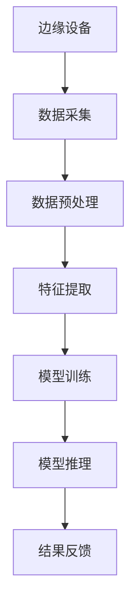
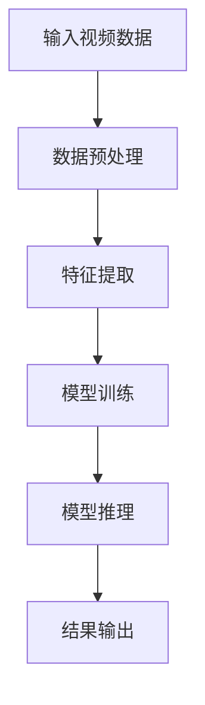

                 

 

## 第1章: 边缘AI技术概述

### 1.1 问题背景

#### 1.1.1 智能摄像头的发展

智能摄像头作为物联网（IoT）的重要组成部分，在现代社会中扮演着越来越重要的角色。从最初的简单视频监控设备，到如今的智能分析设备，智能摄像头的发展经历了多个阶段。

1. **第一阶段：视频录制**  
   在智能摄像头发展的初期，其主要功能是视频录制。这些摄像头可以捕捉和记录视频画面，但缺乏智能分析能力。

2. **第二阶段：视频分析**  
   随着计算机视觉和机器学习技术的发展，智能摄像头开始具备基本视频分析功能，如人脸识别、动作检测等。这些功能使得摄像头能够对捕获的视频数据进行分析，但仍然存在实时性和准确性方面的挑战。

3. **第三阶段：边缘AI智能分析**  
   近年来，边缘AI技术的兴起为智能摄像头的发展带来了新的契机。边缘AI技术能够在本地设备上执行复杂的计算任务，实现实时视频分析，提高摄像头系统的智能化水平。

#### 1.1.2 视频分析的需求

视频分析技术在安防、交通、零售等多个领域具有广泛的应用需求。

1. **安防领域**  
   安防领域对视频分析的需求主要集中在实时监控、异常行为检测和紧急事件响应等方面。通过视频分析，可以快速识别潜在威胁，提高安全防护能力。

2. **交通领域**  
   在交通领域，视频分析技术可用于实时监控交通流量、识别违章行为、优化交通信号控制等，有助于提高交通管理和安全水平。

3. **零售领域**  
   零售领域的视频分析需求主要在于消费者行为分析、货架管理和安全监控等。通过视频分析，零售商可以了解消费者的购物习惯，优化商品陈列和库存管理。

#### 1.1.3 边缘AI的兴起

边缘AI技术的兴起，源于以下几个因素：

1. **数据增长**  
   随着物联网设备和传感器数量的增加，产生的数据量呈爆炸式增长。中心化处理这些数据已不再现实，边缘AI技术可以在本地设备上进行数据处理，减轻中心服务器的负担。

2. **延迟敏感应用**  
   许多应用场景对延迟要求较高，如自动驾驶、工业自动化等。边缘AI技术可以实现本地实时处理，降低延迟，提高应用性能。

3. **隐私保护**  
   将数据处理和计算任务转移到边缘设备，可以减少数据在传输过程中的泄露风险，提高隐私保护水平。

### 1.2 问题描述

#### 1.2.1 传统视频分析的限制

传统的视频分析技术主要依赖于中心化处理，存在以下问题：

1. **延迟高**  
   数据需要传输到中心服务器进行处理，导致延迟较高，不适合实时应用。

2. **带宽消耗大**  
   视频数据量大，传输到中心服务器的过程中会消耗大量带宽。

3. **计算能力有限**  
   中心服务器在处理海量数据时，计算能力有限，可能无法满足实时视频分析的需求。

#### 1.2.2 边缘AI的作用

边缘AI技术可以解决传统视频分析技术面临的挑战：

1. **实时性**  
   边缘AI可以在本地设备上进行实时计算，减少数据传输和处理延迟。

2. **效率高**  
   边缘设备具备较强的计算能力，可以高效处理视频数据，提高视频分析精度。

3. **隐私保护**  
   边缘AI技术可以在本地设备上进行数据处理，降低数据泄露风险。

#### 1.2.3 实现实时视频分析

实时视频分析是智能摄像头系统的核心功能。通过边缘AI技术，可以实现以下目标：

1. **实时监控**  
   实时监控场景变化，及时发现异常情况。

2. **智能识别**  
   对视频内容进行智能识别，如人脸识别、物体检测等。

3. **智能决策**  
   根据实时分析结果，进行智能决策，如警报触发、智能调度等。

### 1.3 问题解决

《边缘AI在智能摄像头中的应用：实现实时视频分析》这本书将详细介绍如何利用边缘AI技术实现智能摄像头系统，提高视频分析的能力。

#### 1.3.1 边缘AI的定义

边缘AI是一种分布式计算架构，通过在边缘设备上执行计算，减少对中心服务器的依赖，提高数据处理速度和效率。

#### 1.3.2 边缘AI在视频分析中的应用

边缘AI在视频分析中的应用主要包括以下几个阶段：

1. **数据采集**  
   边缘设备采集视频数据。

2. **数据预处理**  
   在边缘设备上对视频数据预处理，如去噪、分割等。

3. **特征提取**  
   在边缘设备上提取视频数据的关键特征。

4. **模型训练**  
   利用边缘设备上的计算能力，训练机器学习模型。

5. **模型推理**  
   在边缘设备上对视频数据进行模型推理，实现实时分析。

6. **结果反馈**  
   将分析结果实时反馈给用户或相关系统。

#### 1.3.3 实现实时视频分析

通过边缘AI技术，可以实现实时视频分析，提高摄像头系统的智能化水平。具体实现步骤如下：

1. **环境搭建**  
   搭建边缘AI开发环境，包括硬件设备、软件框架等。

2. **数据收集**  
   收集视频数据，用于训练和测试模型。

3. **模型设计**  
   设计适用于边缘设备的机器学习模型。

4. **模型训练**  
   在边缘设备上训练模型，优化模型性能。

5. **模型部署**  
   将训练好的模型部署到边缘设备上。

6. **实时分析**  
   利用边缘设备进行实时视频分析，处理输入视频数据。

7. **结果展示**  
   将分析结果实时展示给用户。

### 1.4 边界与外延

边缘AI技术不仅适用于智能摄像头，还可以应用于其他边缘计算场景，如智能安防、智能交通、智能制造等。在这些场景中，边缘AI技术同样可以发挥重要作用，实现实时数据处理和分析。

### 1.5 概念结构与核心要素组成

边缘AI在智能摄像头应用中的概念结构包括以下几个核心要素：

1. **边缘设备**  
   边缘设备是边缘AI系统的核心组件，用于数据采集、预处理和模型推理。

2. **计算框架**  
   计算框架用于构建和部署机器学习模型，支持边缘设备上的计算任务。

3. **数据管理**  
   数据管理负责数据采集、存储和处理，为模型训练提供高质量数据。

4. **模型训练**  
   模型训练阶段，利用边缘设备的计算能力，训练机器学习模型。

5. **模型推理**  
   模型推理阶段，利用训练好的模型对视频数据进行实时分析。

6. **结果反馈**  
   结果反馈将分析结果实时展示给用户或相关系统。

### 1.6 本章总结

本章主要介绍了边缘AI技术在智能摄像头中的应用背景、问题描述以及问题解决方法。通过边缘AI技术，可以实现实时视频分析，提高摄像头系统的智能化水平。在后续章节中，我们将进一步探讨边缘AI技术的工作原理、算法实现以及系统架构设计，帮助读者全面了解边缘AI在智能摄像头中的应用。

----------------------------------------------------------------

## 第2章: 核心概念与联系

### 2.1 核心概念原理

边缘AI（Edge AI）是一种分布式计算架构，通过在边缘设备上执行计算任务，减少对中心服务器的依赖，实现实时数据处理和分析。边缘设备通常包括智能摄像头、智能手机、路由器等，它们具有较低的延迟、较高的带宽利用率和较低的成本。边缘AI技术可以应用于多种场景，如智能监控、智能家居、工业自动化等。

边缘AI的工作原理主要包括以下几个阶段：

1. **数据采集**：边缘设备采集实时数据，如视频、音频、传感器数据等。
2. **数据预处理**：在边缘设备上对采集到的数据预处理，如去噪、分割等。
3. **特征提取**：从预处理后的数据中提取关键特征，用于后续分析。
4. **模型训练**：利用边缘设备的计算能力，训练机器学习模型。
5. **模型推理**：在边缘设备上对实时数据应用训练好的模型，实现实时分析。
6. **结果反馈**：将分析结果实时反馈给用户或相关系统。

### 2.2 概念属性特征对比表格

| 特征       | 边缘AI                 | 云计算               |
|------------|------------------------|---------------------|
| 计算位置   | 边缘设备               | 中心服务器           |
| 数据处理   | 本地处理               | 远程处理             |
| 延迟       | 低延迟                | 高延迟               |
| 成本       | 低成本                | 高成本               |

#### 边缘AI的特点

1. **低延迟**：边缘AI在本地设备上执行计算，数据传输距离短，延迟低，适合实时应用。
2. **高带宽利用率**：边缘AI可以分担中心服务器的计算负担，提高带宽利用率。
3. **低成本**：边缘设备成本较低，适用于大规模部署。

#### 云计算的特点

1. **高计算能力**：云计算具有强大的计算资源，可以处理海量数据。
2. **高可靠性**：云计算服务通常提供高可用性和数据备份功能。
3. **灵活性**：云计算可以根据需求动态调整计算资源，灵活部署应用。

### 2.3 ER实体关系图架构的 Mermaid 流程图



在该流程图中，边缘设备作为数据采集的起点，通过数据预处理、特征提取、模型训练和模型推理等步骤，实现实时视频分析，并将结果反馈给用户或相关系统。

### 2.4 本章总结

本章主要介绍了边缘AI的核心概念原理及其与云计算的区别。通过对比分析，读者可以了解边缘AI在实时数据处理和分析方面的优势。接下来，我们将进一步探讨边缘AI算法的原理及其在智能摄像头系统中的应用。

----------------------------------------------------------------

## 第3章: 算法原理讲解

### 3.1 算法mermaid流程图

在介绍边缘AI算法原理时，我们可以使用Mermaid来绘制算法的流程图，使得算法的实现过程更加直观和易于理解。以下是边缘AI算法的Mermaid流程图：



在这个流程图中，算法首先接收输入视频数据，然后进行数据预处理，包括去噪、分割等操作。接下来，通过特征提取从预处理后的数据中提取关键特征。这些特征随后用于模型训练，生成适用于边缘设备的机器学习模型。最后，模型对实时视频数据进行推理，输出分析结果。

### 3.2 算法原理

边缘AI算法主要包括三个阶段：特征提取、模型训练和模型推理。

#### 3.2.1 特征提取

特征提取是边缘AI算法的重要阶段，其目的是从原始视频数据中提取出具有区分度的特征，用于后续的模型训练和推理。常见的特征提取方法包括：

1. **传统特征提取**：如HOG（Histogram of Oriented Gradients）和SIFT（Scale-Invariant Feature Transform）等，这些方法通过分析图像的局部特征来提取信息。

2. **深度特征提取**：基于深度学习的特征提取方法，如卷积神经网络（CNN）。深度学习方法能够自动学习图像的层次化特征，提取的效果更佳。

#### 3.2.2 模型训练

模型训练阶段是边缘AI算法的核心，其目标是利用提取出的特征训练出一个性能优良的机器学习模型。常见的模型训练方法包括：

1. **监督学习**：通过标注好的训练数据，训练分类或回归模型。例如，使用CNN进行图像分类。

2. **无监督学习**：在没有标注数据的情况下，通过自我学习和数据分布分析来训练模型。例如，使用聚类算法进行数据分类。

3. **半监督学习**：结合有标注和无标注的数据进行训练，以提高模型的泛化能力。

#### 3.2.3 模型推理

模型推理阶段是将训练好的模型应用于实时视频数据，实现实时分析。模型推理的关键是确保模型在边缘设备上的高效运行，以下是几种常见的模型推理方法：

1. **模型量化**：通过降低模型的精度来减少模型的大小，从而提高在边缘设备上的运行效率。

2. **模型压缩**：采用模型压缩技术，如知识蒸馏（Knowledge Distillation），将大模型的知识传递给小模型，以减少模型的大小。

3. **模型优化**：针对边缘设备的硬件特性，对模型进行优化，如使用GPU或FPGA加速模型的推理。

### 3.3 数学模型和公式

边缘AI算法涉及多个数学模型和公式，以下是一些常见的数学模型和公式：

1. **卷积神经网络（CNN）模型**：
   \[
   \sigma(\mathbf{W} \cdot \mathbf{X} + b)
   \]
   其中，\(\mathbf{W}\) 是权重矩阵，\(\mathbf{X}\) 是输入特征，\(\sigma\) 是激活函数（如ReLU函数），\(b\) 是偏置。

2. **支持向量机（SVM）模型**：
   \[
   \mathbf{w}^T \mathbf{x} + b = 0
   \]
   其中，\(\mathbf{w}\) 是法向量，\(\mathbf{x}\) 是支持向量，\(b\) 是偏置。

3. **生成对抗网络（GAN）模型**：
   \[
   \mathbb{E}_{\mathbf{z} \sim p(\mathbf{z})}[\log(D(\mathbf{G}(\mathbf{z})))]
   \]
   其中，\(D\) 是判别器，\(\mathbf{G}\) 是生成器，\(\mathbf{z}\) 是噪声向量。

### 3.4 详细讲解与举例说明

为了更好地理解边缘AI算法的原理，我们可以通过一个具体的例子进行说明。

#### 示例：基于CNN的人脸识别算法

在这个例子中，我们将使用卷积神经网络（CNN）实现人脸识别。以下是算法的实现步骤：

1. **数据预处理**：
   - 采集大量人脸图像数据，并进行预处理，如图像缩放、归一化等。
   - 将预处理后的图像数据分为训练集和测试集。

2. **特征提取**：
   - 使用CNN对图像数据进行特征提取，提取出具有区分度的人脸特征。

3. **模型训练**：
   - 利用训练集数据训练CNN模型，优化模型参数。
   - 使用交叉熵损失函数评估模型性能，调整学习率等超参数。

4. **模型推理**：
   - 将测试集数据输入到训练好的模型中，进行人脸识别。
   - 输出识别结果，如识别出的人脸及其对应的身份。

5. **结果分析**：
   - 分析识别结果，计算模型准确率、召回率等指标。
   - 根据分析结果调整模型参数，提高识别精度。

以下是一个简化的Python代码示例，展示了基于CNN的人脸识别算法的实现：

```python
import tensorflow as tf
from tensorflow.keras.models import Sequential
from tensorflow.keras.layers import Conv2D, MaxPooling2D, Flatten, Dense

# 数据预处理
# 加载并预处理图像数据
# ...

# 特征提取
model = Sequential([
    Conv2D(32, (3, 3), activation='relu', input_shape=(64, 64, 3)),
    MaxPooling2D((2, 2)),
    Flatten(),
    Dense(128, activation='relu'),
    Dense(1, activation='sigmoid')
])

# 模型训练
model.compile(optimizer='adam', loss='binary_crossentropy', metrics=['accuracy'])
model.fit(train_images, train_labels, epochs=10, batch_size=32)

# 模型推理
predictions = model.predict(test_images)

# 结果分析
# 计算准确率、召回率等指标
# ...

```

在这个示例中，我们使用TensorFlow框架构建CNN模型，对图像数据进行特征提取和分类。通过训练集数据训练模型，然后在测试集上验证模型的性能。最后，对测试结果进行分析，评估模型的准确性。

### 3.5 本章总结

本章详细介绍了边缘AI算法的基本原理，包括特征提取、模型训练和模型推理等阶段。通过一个具体的人脸识别算法示例，我们展示了如何实现边缘AI算法。在下一章中，我们将进一步探讨智能摄像头系统的整体架构和功能设计。

