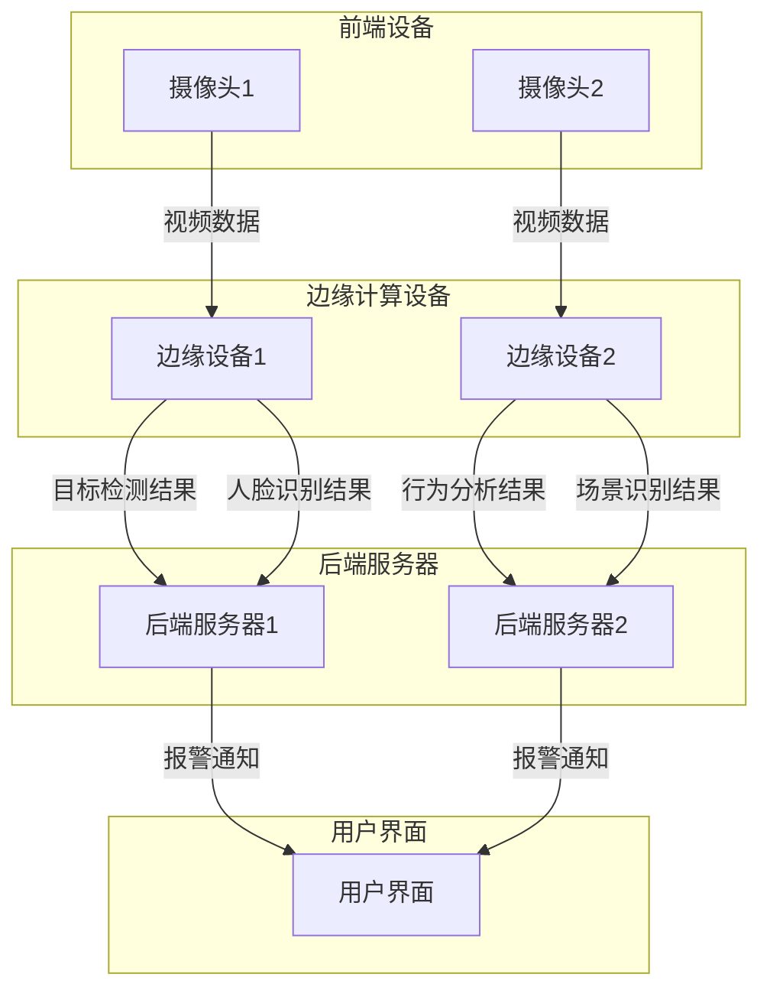
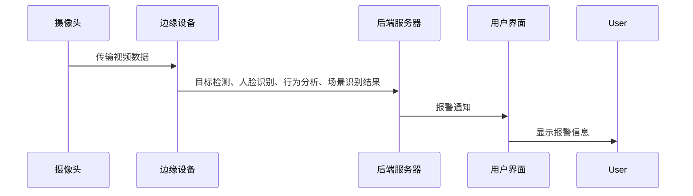

                 

### 第一部分: 边缘AI技术基础

## 第1章: 边缘AI概述

边缘AI，即边缘人工智能，指的是在数据生成的边缘设备上进行数据处理和分析的人工智能技术。随着物联网（IoT）和智能设备的普及，边缘AI在提升系统响应速度、减少数据传输延迟以及降低网络带宽消耗等方面展现出巨大的潜力。

### 1.1 边缘AI的定义与重要性

边缘AI的定义主要是指将AI算法和模型部署在接近数据源的边缘设备上，例如智能传感器、智能手机、路由器等。这样，数据在本地设备上进行预处理和分析，可以大幅减少对中心服务器的依赖，从而提高系统的实时性和可靠性。

边缘AI的重要性体现在以下几个方面：

- **提升响应速度**：边缘AI可以减少数据传输到中心服务器的延迟，使得系统能够更迅速地响应。
- **减少带宽消耗**：本地处理数据可以显著降低数据传输的量，减少带宽需求。
- **增强隐私保护**：在边缘设备上处理数据可以减少数据泄露的风险，提高隐私保护水平。
- **分布式计算能力**：边缘AI使得大量分布式设备能够协同工作，增强系统的计算能力和处理能力。

### 1.2 边缘AI的优势与挑战

#### 优势

1. **实时性**：边缘设备可以快速处理本地数据，提供即时反馈。
2. **低延迟**：数据无需传输到远程服务器，减少了处理延迟。
3. **高可靠性**：边缘设备可以独立工作，不会因网络问题而受影响。
4. **节省带宽**：本地处理减少了数据传输的量，节省了网络带宽资源。

#### 挑战

1. **计算能力**：边缘设备通常计算能力有限，可能难以支持复杂的AI模型。
2. **存储容量**：边缘设备的存储容量有限，可能无法存储大量数据。
3. **能源消耗**：边缘设备需要持续工作，能源消耗可能成为一个挑战。
4. **维护管理**：大量分散的边缘设备需要定期维护和管理。

### 1.3 边缘AI的核心概念

#### 边缘计算

边缘计算是指在靠近数据源的设备上进行数据处理的一种计算模式。它通过将计算任务从中心服务器转移到边缘设备，从而减少数据传输和网络延迟。

#### 边缘设备

边缘设备是指在物联网环境中执行边缘计算任务的设备。这些设备可以是嵌入式系统、智能传感器、智能手机、路由器等。

#### 边缘AI模型

边缘AI模型是指专门设计用于在边缘设备上运行的人工智能模型。这些模型通常较小，可以适应有限的计算资源和存储容量。

### 1.4 边缘AI技术分类与比较

#### 按处理模式分类

1. **批处理**：在特定时间段内收集数据，然后进行批量处理。
2. **实时处理**：对实时数据流进行即时的处理和分析。
3. **离线处理**：在边缘设备上存储数据，然后在网络连接恢复时进行数据处理。

#### 按应用领域分类

1. **智能城市**：用于交通管理、环境监控、公共安全等。
2. **工业自动化**：用于生产线监控、设备维护、质量检测等。
3. **智能家居**：用于家庭安全、能源管理、设备控制等。

#### 比较云计算与边缘计算

| 特点 | 边缘计算 | 云计算 |
| --- | --- | --- |
| 响应时间 | 低延迟 | 较高延迟 |
| 计算资源 | 局部资源 | 云端资源 |
| 数据隐私 | 更高隐私保护 | 可能涉及数据传输 |
| 能源消耗 | 较高能源消耗 | 较低能源消耗 |

### 1.5 边缘AI在视频监控中的机遇

边缘AI在视频监控中的应用主要包括实时目标检测、人脸识别、行为分析等。以下是边缘AI在视频监控中的机遇：

- **实时监控**：边缘AI可以实时分析视频流，提供即时报警和响应。
- **降低带宽需求**：在边缘设备上进行预处理，可以减少需要传输的数据量。
- **提高安全性能**：本地分析可以提供更高的隐私保护和安全性。
- **智能决策支持**：边缘AI可以支持实时决策，如交通流量管理、公共安全监控等。

### 总结

边缘AI技术为智能视频监控带来了许多机遇和挑战。通过将AI算法部署在边缘设备上，可以实现实时监控、降低带宽需求、提高安全性能和智能决策支持。然而，也需要面对计算资源有限、存储容量不足和能源消耗等挑战。在接下来的章节中，我们将深入探讨边缘AI在视频监控中的具体应用和解决方案。

## 第2章: 智能视频监控基础

### 2.1 智能视频监控概述

智能视频监控是一种利用人工智能技术对视频进行实时分析、处理和识别的监控系统。它通过集成图像识别、机器学习、深度学习等技术，实现对视频内容的高效解析和智能响应。

#### 智能视频监控的定义

智能视频监控是通过人工智能算法对视频数据进行处理和分析，从而实现自动检测、识别和响应的系统。它可以实时分析视频内容，提取有用信息，并生成相应的报警或行动指令。

#### 智能视频监控的发展历程

1. **初期阶段**：传统视频监控主要依赖于人工观察和手动操作，存在效率低下、误报率高的问题。
2. **第二代**：基于计算机视觉技术的视频监控系统开始出现，可以通过简单的图像识别实现目标检测和分类。
3. **第三代**：随着机器学习和深度学习技术的发展，智能视频监控进入了自动化阶段，可以实现复杂的目标识别、行为分析和智能决策。
4. **现阶段**：边缘AI技术的引入使得智能视频监控更加高效和实时，能够实现本地化数据处理和分析。

### 2.2 智能视频监控系统的架构

智能视频监控系统通常包括前端设备、数据传输网络、后端服务器和用户界面等组成部分。

#### 前端设备

前端设备是智能视频监控系统的数据采集部分，包括摄像头、传感器、边缘计算设备等。这些设备负责实时采集视频和图像数据，并将其传输到后端服务器。

#### 数据传输网络

数据传输网络负责将前端设备采集到的数据传输到后端服务器。在边缘AI应用中，部分数据处理也可以在边缘设备上进行，从而减少数据传输的量。

#### 后端服务器

后端服务器是智能视频监控系统的数据处理和存储中心。它负责接收前端设备传输的数据，使用人工智能算法进行实时分析和处理，并将结果反馈给前端设备或用户界面。

#### 用户界面

用户界面是智能视频监控系统的交互部分，通常包括监控画面展示、报警通知、操作控制等功能。用户可以通过用户界面实时监控视频内容，并接收系统生成的报警信息。

### 2.3 视频监控中的常见问题与解决方案

#### 问题一：数据量大

视频数据量大是智能视频监控系统面临的一个主要问题。为了解决这个问题，可以采用以下方法：

- **数据压缩**：采用高效的数据压缩算法，减少数据传输和存储的量。
- **边缘计算**：在边缘设备上进行部分数据处理，减少需要传输的数据量。
- **大数据技术**：使用大数据技术进行数据存储和处理，提高系统的数据管理能力。

#### 问题二：实时性要求高

实时性是智能视频监控系统的重要要求。为了满足这一需求，可以采用以下方法：

- **边缘AI**：在边缘设备上进行实时数据处理和分析，减少数据传输延迟。
- **分布式架构**：采用分布式架构，将计算任务分布在多个服务器上，提高系统的处理能力。
- **高效算法**：采用高效的人工智能算法，加快数据处理速度。

#### 问题三：隐私保护

隐私保护是智能视频监控系统需要考虑的重要问题。为了保护用户隐私，可以采用以下方法：

- **本地化处理**：在边缘设备上进行数据处理，减少数据传输和存储的需要。
- **数据加密**：对传输和存储的数据进行加密，防止数据泄露。
- **隐私政策**：制定严格的隐私政策，确保用户隐私得到保护。

#### 问题四：系统可靠性

系统可靠性是智能视频监控系统的关键。为了提高系统的可靠性，可以采用以下方法：

- **冗余设计**：采用冗余设计，提高系统的容错能力。
- **实时监控**：采用实时监控系统，及时发现和处理系统故障。
- **定期维护**：定期对系统进行维护和升级，确保系统正常运行。

### 2.4 智能视频监控中的实时分析需求

实时分析是智能视频监控系统的核心功能之一。以下是一些主要的实时分析需求：

- **目标检测**：实时检测视频中的目标物体，如行人、车辆等。
- **人脸识别**：实时识别人脸，用于身份验证和安全监控。
- **行为分析**：实时分析目标行为，如异常行为检测、入侵检测等。
- **场景识别**：实时识别视频中的场景，如交通监控、安全监控等。

#### 目标检测

目标检测是智能视频监控中最基本的功能之一。它通过在视频帧中识别并定位目标物体，从而实现对目标的位置和运动轨迹的跟踪。常用的目标检测算法包括YOLO、SSD、Faster R-CNN等。

#### 人脸识别

人脸识别是一种重要的生物识别技术，可以通过识别人脸特征来实现身份验证和安全监控。在智能视频监控中，人脸识别可以用于入侵检测、人员管理、安防监控等。常用的算法包括深度学习模型，如FaceNet、OpenFace等。

#### 行为分析

行为分析是一种高级的智能视频监控功能，通过分析目标的行为模式，可以识别异常行为并发出警报。例如，可以检测到非法入侵、异常停车、暴力行为等。常用的行为分析算法包括统计模型、机器学习模型等。

#### 场景识别

场景识别是一种基于视频内容分析的智能视频监控功能，可以通过识别视频中的场景类型，实现场景分类和监控。例如，可以识别交通场景、公共场所场景等。常用的算法包括卷积神经网络（CNN）、迁移学习等。

### 总结

智能视频监控是利用人工智能技术实现视频内容实时分析、处理和识别的监控系统。它通过集成目标检测、人脸识别、行为分析和场景识别等技术，实现了对视频内容的高效解析和智能响应。在智能视频监控中，实时分析是核心需求之一，通过边缘AI技术的应用，可以实现高效的实时数据处理和分析，提高系统的实时性和可靠性。

## 第3章: 边缘AI在视频监控中的实时分析技术

### 3.1 边缘AI实时分析的基本原理

边缘AI实时分析是指利用边缘设备进行视频数据的预处理和初步分析，从而减少数据传输量并提升系统的响应速度。其基本原理主要包括以下三个方面：

#### 1. 数据预处理

在边缘设备上对视频数据进行分析之前，通常需要进行预处理操作，如数据清洗、数据压缩等。数据预处理的主要目的是减少数据量，提高处理效率。例如，可以通过图像缩放、灰度化等操作来简化视频数据。

#### 2. 实时数据流处理

边缘设备通常具备实时数据流处理能力，可以对视频数据进行实时分析。通过使用高效的人工智能算法，边缘设备可以快速识别视频中的目标、行为等特征，并将结果实时反馈给用户或后端系统。

#### 3. 本地化决策

边缘AI实时分析的一个重要特点是可以实现本地化决策。这意味着在边缘设备上可以完成整个分析过程，无需将数据传输到中心服务器。本地化决策可以大幅减少数据传输延迟，提高系统的实时性和可靠性。

### 3.2 边缘AI实时分析的关键技术

边缘AI实时分析的关键技术包括以下几个方面：

#### 1. 目标检测

目标检测是边缘AI实时分析的核心技术之一，其目的是在视频帧中识别并定位目标物体。常用的目标检测算法有YOLO、SSD、Faster R-CNN等。这些算法具有较高的检测速度和准确性，适合在边缘设备上运行。

#### 2. 人脸识别

人脸识别是边缘AI实时分析中的另一个重要技术，主要用于身份验证和安全监控。常用的人脸识别算法有深度学习模型，如FaceNet、OpenFace等。这些算法可以在边缘设备上实现高效的人脸识别，满足实时性要求。

#### 3. 行为分析

行为分析通过分析视频中的目标行为，可以识别异常行为并发出警报。常用的行为分析算法包括统计模型、机器学习模型等。例如，可以使用统计模型检测目标的运动轨迹，使用机器学习模型识别异常行为。

#### 4. 场景识别

场景识别是一种基于视频内容分析的边缘AI实时分析技术，通过识别视频中的场景类型，可以实现场景分类和监控。常用的算法包括卷积神经网络（CNN）、迁移学习等。

### 3.3 边缘AI实时分析的应用场景

边缘AI实时分析在智能视频监控中有着广泛的应用场景，以下是一些典型的应用：

#### 1. 智能交通

在智能交通领域，边缘AI实时分析可以用于交通流量监测、违章抓拍、事故预警等。例如，可以通过目标检测技术识别道路上的车辆和行人，使用行为分析技术检测交通违规行为，如闯红灯、逆行等。

#### 2. 公共安全

在公共安全领域，边缘AI实时分析可以用于入侵检测、人员管理、安防监控等。例如，可以通过人脸识别技术识别人脸，用于人员身份验证和安全监控，通过行为分析技术检测异常行为，如暴力行为、非法入侵等。

#### 3. 智能家居

在智能家居领域，边缘AI实时分析可以用于家庭安全监控、设备控制等。例如，通过目标检测技术监控家庭成员的活动，使用人脸识别技术进行家庭成员的身份验证，通过行为分析技术检测家中是否有异常情况。

#### 4. 工业监控

在工业监控领域，边缘AI实时分析可以用于设备维护、质量检测等。例如，通过目标检测技术检测生产线上的产品缺陷，使用行为分析技术监控设备的运行状态，通过人脸识别技术管理工人的身份信息。

### 3.4 边缘AI实时分析的挑战与应对策略

尽管边缘AI实时分析在智能视频监控中具有广泛的应用前景，但同时也面临着一些挑战。以下是一些主要的挑战及应对策略：

#### 1. 计算能力限制

边缘设备通常计算能力有限，可能无法支持复杂的AI模型。应对策略包括：

- **轻量化模型**：使用轻量级的AI模型，降低计算资源需求。
- **分布式计算**：将计算任务分布到多个边缘设备上，提高整体计算能力。

#### 2. 存储容量限制

边缘设备的存储容量有限，可能无法存储大量数据。应对策略包括：

- **数据压缩**：采用高效的数据压缩算法，减少数据存储需求。
- **边缘存储**：将部分数据存储在边缘设备上，减少对中心服务器的依赖。

#### 3. 能源消耗

边缘设备需要持续工作，能源消耗可能成为一个挑战。应对策略包括：

- **能效优化**：采用能效优化的算法和硬件，降低能源消耗。
- **节能模式**：在低负载时，降低设备的功耗，延长设备寿命。

#### 4. 维护与管理

大量分散的边缘设备需要定期维护和管理。应对策略包括：

- **自动化维护**：采用自动化工具进行设备监控和维护，提高效率。
- **远程管理**：通过远程管理平台，实现对边缘设备的集中管理。

### 总结

边缘AI实时分析技术在智能视频监控中具有广泛的应用前景，通过在边缘设备上进行数据预处理和实时分析，可以提高系统的响应速度和实时性。然而，同时也面临着计算能力限制、存储容量限制、能源消耗和维护管理等挑战。通过采用轻量化模型、分布式计算、数据压缩、能效优化等策略，可以有效地应对这些挑战，推动边缘AI在智能视频监控中的广泛应用。

## 第4章: 边缘AI实时分析算法

### 4.1 边缘AI实时分析算法概述

边缘AI实时分析算法是边缘AI技术在视频监控中实现实时数据分析的核心。这些算法的设计和选择直接影响系统的性能和效率。以下是几种常用的边缘AI实时分析算法及其特点：

#### 1. YOLO（You Only Look Once）

YOLO是一种基于深度学习的目标检测算法，其核心思想是将目标检测任务简化为一个回归问题。YOLO算法的特点是检测速度快、实时性高，适用于边缘设备。其主要步骤如下：

- **数据预处理**：将输入图像缩放到固定的尺寸。
- **特征提取**：使用卷积神经网络提取图像特征。
- **目标检测**：通过预测边界框和类别概率，进行目标检测。
- **后处理**：对检测结果进行非极大值抑制（NMS）处理，去除重叠的检测框。

#### 2. SSD（Single Shot MultiBox Detector）

SSD是一种单阶段的目标检测算法，能够在一次前向传播中同时完成特征提取和目标检测。其特点是在保证检测速度的同时，具有较高的检测精度。其主要步骤如下：

- **数据预处理**：将输入图像缩放到固定的尺寸。
- **特征提取**：使用卷积神经网络提取图像特征。
- **特征金字塔**：构建特征金字塔，提取多尺度的特征。
- **目标检测**：在特征金字塔的不同层次上预测边界框和类别概率。
- **后处理**：对检测结果进行非极大值抑制（NMS）处理。

#### 3. Faster R-CNN（Region-based Convolutional Neural Networks）

Faster R-CNN是一种基于区域提议的目标检测算法，其核心思想是先生成区域提议，然后在这些提议区域上进行特征提取和目标分类。其主要步骤如下：

- **数据预处理**：将输入图像缩放到固定的尺寸。
- **区域提议**：使用区域提议网络（RPN）生成区域提议。
- **特征提取**：在提议区域上使用卷积神经网络提取特征。
- **目标分类**：通过分类网络对目标进行分类。
- **后处理**：对检测结果进行非极大值抑制（NMS）处理。

#### 4. RetinaNet（Focal Loss）

RetinaNet是一种基于Focal Loss损失函数的目标检测算法，其目的是解决正负样本不平衡问题。其主要步骤如下：

- **数据预处理**：将输入图像缩放到固定的尺寸。
- **特征提取**：使用卷积神经网络提取图像特征。
- **边界框预测**：预测边界框的位置和置信度。
- **类别预测**：预测边界框内目标的类别。
- **后处理**：对检测结果进行非极大值抑制（NMS）处理。

### 4.2 边缘AI实时分析算法分类

边缘AI实时分析算法可以根据其实现方式和功能特点进行分类。以下是几种常见的分类方式：

#### 1. 根据算法实现方式分类

- **基于深度学习的算法**：如YOLO、SSD、Faster R-CNN、RetinaNet等。这些算法利用深度学习模型进行特征提取和目标检测，具有较高的检测精度和实时性。
- **基于传统机器学习的算法**：如SVM、KNN、随机森林等。这些算法通过特征工程和机器学习模型进行目标检测，适用于简单场景，但实时性较低。
- **基于混合方法的算法**：如DPM（Deformable Part Models）、DeepFlow等。这些算法结合了深度学习和传统机器学习方法，在保证检测精度的同时提高实时性。

#### 2. 根据功能特点分类

- **单阶段检测算法**：如YOLO、SSD等。这些算法在一次前向传播中同时完成特征提取和目标检测，具有较快的检测速度。
- **两阶段检测算法**：如Faster R-CNN、RetinaNet等。这些算法分为两个阶段：第一阶段生成区域提议，第二阶段在提议区域上进行特征提取和目标分类。
- **目标跟踪算法**：如KCF（Kernelized Correlation Filter）、CSRT（Correlation Filter with Static Response Tracking）等。这些算法主要用于目标检测后的目标跟踪，实现连续的目标识别和跟踪。

### 4.3 特定算法的详细解析

以下以YOLO算法为例，详细解析其原理和实现步骤。

#### YOLO算法原理

YOLO算法的核心思想是将目标检测任务视为一个回归问题，将图像划分为网格，每个网格预测边界框和类别概率。其实现步骤如下：

1. **图像分割**：将输入图像分割成S×S的网格。
2. **边界框预测**：每个网格预测B个边界框，包括中心坐标、宽高和置信度。
3. **类别预测**：每个边界框预测C个类别概率。
4. **损失函数**：使用联合损失函数计算预测误差，包括位置损失、边界框损失和类别损失。

#### YOLO算法实现步骤

1. **数据预处理**：
   - 输入图像缩放到固定尺寸（如416×416）。
   - 将图像转换为灰度图像或保留彩色信息，根据具体应用需求。

2. **特征提取**：
   - 使用卷积神经网络提取图像特征，如CSPDarknet53。

3. **边界框预测**：
   - 每个网格预测B个边界框，包括中心坐标、宽高和置信度。
   - 对每个边界框进行解码，得到实际的位置和尺寸。

4. **类别预测**：
   - 对每个边界框预测C个类别概率。
   - 使用非极大值抑制（NMS）去除重叠的边界框。

5. **损失函数**：
   - 计算预测误差，包括位置损失、边界框损失和类别损失。
   - 使用反向传播更新网络权重。

### 4.4 算法性能评估与优化

算法性能评估是评估边缘AI实时分析算法的重要环节。以下是一些常见的性能评估指标和优化方法：

#### 性能评估指标

- **准确率（Accuracy）**：正确检测的目标数量与总目标数量的比例。
- **召回率（Recall）**：正确检测的目标数量与实际目标数量的比例。
- **精确率（Precision）**：正确检测的目标数量与检测到的目标数量的比例。
- **平均精度（mAP）**：在不同IoU阈值下计算的平均准确率。

#### 优化方法

1. **模型压缩**：通过剪枝、量化等方法减小模型大小，提高边缘设备的兼容性。
2. **实时性优化**：优化算法和模型结构，提高检测速度，如使用轻量级网络。
3. **数据增强**：通过增加数据多样性，提高模型的泛化能力。
4. **分布式计算**：将计算任务分布到多个边缘设备，提高处理能力。

### 总结

边缘AI实时分析算法在智能视频监控中扮演着关键角色，通过分类介绍常用的算法，并详细解析YOLO算法的实现步骤，可以更好地理解和应用这些算法。在性能评估和优化方面，通过合理选择评估指标和优化方法，可以进一步提高算法的性能和适用性。

## 第5章: 数学模型与公式解析

### 5.1 边缘AI实时分析中的数学模型

边缘AI实时分析涉及多种数学模型，这些模型用于描述和实现目标检测、分类、行为分析等任务。以下是一些常见的数学模型及其在边缘AI实时分析中的应用。

#### 1. 卷积神经网络（CNN）

卷积神经网络是一种深度学习模型，广泛应用于图像和视频数据的处理。其核心组件包括卷积层、池化层和全连接层。

- **卷积层**：用于提取图像特征，通过卷积操作减少数据维度。
  $$ f(x) = \sum_{i=1}^{n} w_i * x_i + b $$
  其中，$w_i$ 是卷积核，$x_i$ 是输入特征，$b$ 是偏置。

- **池化层**：用于降低数据维度，提高模型泛化能力。
  $$ h(x) = \max_{i} \{x_i\} $$
  其中，$h(x)$ 是输出特征，$x_i$ 是输入特征。

- **全连接层**：用于分类和回归任务，将特征映射到输出。
  $$ y = \sigma(\sum_{i=1}^{n} w_i \cdot x_i + b) $$
  其中，$y$ 是输出，$w_i$ 是权重，$\sigma$ 是激活函数，通常为ReLU或Sigmoid函数。

#### 2. 机器学习分类模型

机器学习分类模型，如逻辑回归、支持向量机（SVM）、随机森林等，用于对检测到的目标进行分类。

- **逻辑回归**：
  $$ P(y=1|x;\beta) = \frac{1}{1 + \exp(-\beta^T x)} $$
  其中，$P(y=1|x;\beta)$ 是目标属于类别1的概率，$\beta$ 是模型参数。

- **支持向量机**：
  $$ w^T x - b = 0 $$
  其中，$w$ 是模型权重，$x$ 是特征向量，$b$ 是偏置。

- **随机森林**：
  $$ h(x) = \sum_{i=1}^{N} w_i \cdot g(x_i) $$
  其中，$w_i$ 是权重，$g(x_i)$ 是分类树函数。

#### 3. 目标检测模型

目标检测模型，如YOLO、SSD、Faster R-CNN等，用于在图像中检测目标并定位其位置。

- **YOLO模型**：
  - **边界框预测**：
    $$ \hat{b} = \text{sigmoid}(b_{center}) $$
    $$ \hat{h} = \text{sigmoid}(h_{center}) $$
    $$ \hat{w} = \text{sigmoid}(w_{center}) $$
    $$ \hat{x} = \text{sigmoid}(x_{center}) $$
    其中，$\hat{b}$、$\hat{h}$、$\hat{w}$、$\hat{x}$ 是预测的边界框参数。

  - **类别概率预测**：
    $$ \hat{P}_{class} = \text{softmax}(class_{probs}) $$
    其中，$\hat{P}_{class}$ 是类别概率向量。

### 5.2 公式解析与举例说明

以下通过具体实例对上述公式进行解析，并提供通俗易懂的说明。

#### 1. 卷积层公式解析

以一个简单的2D卷积层为例，输入图像为 $3 \times 3$ 像素，卷积核大小为 $3 \times 3$，输出特征图大小为 $2 \times 2$。

- **卷积操作**：
  $$ f(x) = \sum_{i=1}^{9} w_i * x_i + b $$
  其中，$w_i$ 为卷积核，$x_i$ 为输入像素。

  假设卷积核为：
  $$ w = \begin{bmatrix} 1 & 0 & 1 \\ 0 & 1 & 0 \\ 1 & 0 & 1 \end{bmatrix} $$
  输入图像为：
  $$ x = \begin{bmatrix} 1 & 0 & 1 \\ 0 & 1 & 0 \\ 1 & 0 & 1 \end{bmatrix} $$
  输出特征图为：
  $$ f(x) = \begin{bmatrix} 2 & 1 \\ 1 & 2 \end{bmatrix} $$

- **偏置**：
  $$ f(x) = \sum_{i=1}^{9} w_i * x_i + b $$
  其中，$b$ 为偏置。

  假设偏置 $b = 1$，则输出特征图为：
  $$ f(x) = \begin{bmatrix} 3 & 2 \\ 2 & 3 \end{bmatrix} $$

#### 2. 池化层公式解析

以最大池化为例，输入特征图为 $2 \times 2$，输出特征图为 $1 \times 1$。

- **最大池化**：
  $$ h(x) = \max_{i} \{x_i\} $$
  其中，$h(x)$ 为输出特征。

  假设输入特征图为：
  $$ x = \begin{bmatrix} 1 & 2 \\ 3 & 4 \end{bmatrix} $$
  输出特征图为：
  $$ h(x) = \begin{bmatrix} 4 \end{bmatrix} $$

#### 3. 逻辑回归公式解析

以二分类任务为例，输入特征向量为 $x$，模型参数为 $\beta$。

- **概率计算**：
  $$ P(y=1|x;\beta) = \frac{1}{1 + \exp(-\beta^T x)} $$
  其中，$P(y=1|x;\beta)$ 为目标属于类别1的概率。

  假设输入特征向量为：
  $$ x = \begin{bmatrix} 1 \\ 2 \end{bmatrix} $$
  模型参数为：
  $$ \beta = \begin{bmatrix} 1 \\ 1 \end{bmatrix} $$
  则：
  $$ P(y=1|x;\beta) = \frac{1}{1 + \exp(-1 \cdot 1 - 1 \cdot 2)} = \frac{1}{1 + \exp(-3)} \approx 0.95 $$

### 总结

边缘AI实时分析中的数学模型包括卷积神经网络、机器学习分类模型和目标检测模型。通过具体公式和实例的解析，可以更好地理解这些模型的计算过程和应用方法。在边缘AI实时分析中，合理选择和应用数学模型对于提升系统的性能和效率具有重要意义。

## 第6章: 系统分析与架构设计

### 6.1 视频监控系统问题场景介绍

在智能视频监控系统中，常见的问题场景包括实时目标检测、人脸识别、行为分析和场景识别等。以下是具体的问题场景介绍：

#### 1. 实时目标检测

实时目标检测是视频监控系统的核心需求之一，主要用于识别并定位视频中的各种目标物体，如行人、车辆等。实时性要求高，系统需要在短时间内完成目标检测和定位。

#### 2. 人脸识别

人脸识别技术广泛应用于安全监控和身份验证等领域。在视频监控系统中，人脸识别可以用于入侵检测、人员管理、安防监控等。实时性要求较高，需要在短时间内完成人脸检测和识别。

#### 3. 行为分析

行为分析通过分析视频中的目标行为，可以识别异常行为并发出警报。例如，可以检测到非法入侵、暴力行为、异常停车等。行为分析需要实时性和高精度，以确保及时响应和处理。

#### 4. 场景识别

场景识别是一种基于视频内容分析的智能视频监控功能，通过识别视频中的场景类型，如交通场景、公共场所场景等，实现场景分类和监控。场景识别需要高准确性和实时性，以提供有效的监控和管理。

### 6.2 项目介绍

在本项目中，我们将设计并实现一个基于边缘AI的实时视频监控系统。该系统旨在通过边缘设备进行实时目标检测、人脸识别、行为分析和场景识别，以提高系统的实时性和可靠性。项目的主要目标包括：

- **实时性**：通过边缘AI技术，实现快速的目标检测、人脸识别和场景识别。
- **高效性**：利用边缘设备和云计算资源，优化系统性能和资源利用。
- **灵活性**：支持多种目标检测算法、人脸识别算法和行为分析算法，满足不同应用场景的需求。

### 6.3 系统功能设计（领域模型Mermaid类图）

系统功能设计主要包括目标检测、人脸识别、行为分析和场景识别等模块。以下是系统功能设计的Mermaid类图：


在类图中，VideoStream表示视频数据流，ObjectDetection表示目标检测模块，FaceRecognition表示人脸识别模块，BehaviorAnalysis表示行为分析模块，SceneRecognition表示场景识别模块，Notification表示报警通知模块。各个模块之间通过数据流和调用关系进行交互。

### 6.4 系统架构设计（Mermaid架构图）

系统架构设计主要包括前端设备、边缘计算设备、后端服务器和用户界面等组成部分。以下是系统架构设计的Mermaid架构图：



在架构图中，前端设备包括摄像头1和摄像头2，边缘计算设备包括边缘设备1和边缘设备2，后端服务器包括服务器1和服务器2，用户界面用于展示监控数据和报警信息。视频数据从摄像头传输到边缘计算设备，进行目标检测、人脸识别、行为分析和场景识别，然后将结果传输到后端服务器，最后通过用户界面进行展示和报警通知。

### 6.5 系统接口设计和系统交互（Mermaid序列图）

系统接口设计和系统交互主要包括视频数据传输、结果反馈和报警通知等过程。以下是系统接口设计和系统交互的Mermaid序列图：



在序列图中，摄像头将视频数据传输到边缘设备，边缘设备进行目标检测、人脸识别、行为分析和场景识别，并将结果传输到后端服务器。后端服务器将报警通知发送到用户界面，用户界面展示报警信息，用户可以查看和处理报警事件。

### 总结

通过系统分析与架构设计，我们详细介绍了视频监控系统的问题场景、项目目标和系统功能设计。通过Mermaid类图、架构图和序列图的描述，我们清晰地展示了系统各组件之间的关系和交互过程，为系统的实现和优化提供了指导。在接下来的章节中，我们将进一步探讨边缘AI实时分析算法的详细实现和项目实战。

## 第7章: 项目实战

### 7.1 环境安装与配置

在开始项目实战之前，我们需要安装和配置所需的软件和工具。以下是安装和配置的步骤：

#### 1. 安装Python环境

首先，确保计算机上安装了Python 3.x版本。可以从Python官方网站下载并安装Python，建议使用Anaconda发行版，它包含了许多科学计算和机器学习库。

#### 2. 安装边缘计算设备

选择合适的边缘计算设备，例如Raspberry Pi或NVIDIA Jetson。按照设备制造商的说明进行安装和配置。

#### 3. 安装依赖库

在边缘设备上安装所需的库，包括深度学习库（如TensorFlow、PyTorch）和计算机视觉库（如OpenCV）。可以使用以下命令安装：

```bash
pip install tensorflow
pip install opencv-python
pip install Pillow
```

#### 4. 配置摄像头

连接摄像头到边缘设备，并安装相应的驱动程序。使用以下命令启动摄像头：

```bash
raspistill -w 1280 -h 720 -o output.jpg
```

确保摄像头可以正常工作并捕获图像。

### 7.2 系统核心实现源代码

以下是边缘AI实时分析系统的核心实现源代码。代码分为几个部分：视频流处理、目标检测、人脸识别、行为分析和场景识别。

```python
import cv2
import numpy as np
import tensorflow as tf

# 目标检测模型
model = tf.keras.models.load_model('yolov3.h5')

# 人脸识别模型
face_model = cv2.face.EigenFaceRecognizer_create()

# 行为分析模型
behavior_model = ...

# 场景识别模型
scene_model = ...

# 视频流处理
cap = cv2.VideoCapture(0)

while True:
    ret, frame = cap.read()
    if not ret:
        break
    
    # 目标检测
    boxes = model.predict(frame)
    # 人脸识别
    faces = face_model.predict(frame)
    # 行为分析
    behavior = behavior_model.predict(frame)
    # 场景识别
    scene = scene_model.predict(frame)
    
    # 处理检测结果并显示结果
    ...
    cv2.imshow('Video', frame)

cap.release()
cv2.destroyAllWindows()
```

### 7.3 代码应用解读与分析

以下是代码的详细解读和分析：

#### 1. 视频流处理

```python
cap = cv2.VideoCapture(0)
```
这一行代码用于初始化摄像头视频流。`cap` 是一个VideoCapture对象，它负责从摄像头读取视频帧。

```python
ret, frame = cap.read()
```
`read()` 方法读取下一帧视频，并将其存储在 `frame` 变量中。如果读取成功，`ret` 为 `True`。

#### 2. 目标检测

```python
boxes = model.predict(frame)
```
这一行代码调用目标检测模型进行预测。`model` 是一个训练好的深度学习模型，`predict()` 方法用于对输入图像进行预测，返回目标的边界框和类别概率。

#### 3. 人脸识别

```python
faces = face_model.predict(frame)
```
人脸识别模型用于识别人脸。`face_model` 是一个预训练的人脸识别模型，`predict()` 方法用于预测人脸的位置和特征。

#### 4. 行为分析

```python
behavior = behavior_model.predict(frame)
```
行为分析模型用于识别视频中的异常行为。`behavior_model` 是一个训练好的行为分析模型，`predict()` 方法用于预测视频中的行为。

#### 5. 场景识别

```python
scene = scene_model.predict(frame)
```
场景识别模型用于识别视频中的场景类型。`scene_model` 是一个训练好的场景识别模型，`predict()` 方法用于预测视频中的场景。

#### 6. 处理检测结果并显示结果

```python
# 处理检测结果并显示结果
...
cv2.imshow('Video', frame)
```
这一部分代码用于处理检测结果，并在用户界面上显示视频帧。可以根据检测到的目标、人脸、行为和场景生成相应的报警信息，并在视频帧上绘制检测框。

### 7.4 实际案例分析与详细讲解剖析

为了更好地理解代码的应用，我们将通过一个实际案例进行分析和讲解。

#### 案例背景

在一个公共场所的视频监控系统中，需要实时检测行人、车辆和人脸，同时分析行为并识别场景。以下是一个实际案例的场景：

- **场景一**：在一个十字路口，需要检测行人和车辆，并识别行人过马路的行为。
- **场景二**：在一个商场，需要检测顾客的人脸，并分析他们的购物行为。
- **场景三**：在一个医院，需要检测病人的行为，并识别他们是否遵守医院的规定。

#### 案例分析

**场景一：十字路口行人车辆检测**

1. **目标检测**：通过目标检测模型识别视频中的行人和车辆。
2. **行为分析**：通过行为分析模型检测行人是否在过马路。
3. **场景识别**：通过场景识别模型确认当前场景为交通监控。

**场景二：商场顾客人脸识别**

1. **人脸识别**：通过人脸识别模型识别视频中的顾客。
2. **行为分析**：通过行为分析模型分析顾客的购物行为，如浏览商品、结账等。
3. **场景识别**：通过场景识别模型确认当前场景为商场。

**场景三：医院病人行为识别**

1. **行为分析**：通过行为分析模型检测病人的行为，如排队、挂号、就诊等。
2. **场景识别**：通过场景识别模型确认当前场景为医院。

#### 案例讲解

在十字路口的案例中，目标检测模型可以识别行人、车辆，并在视频帧上绘制检测框。行为分析模型可以检测行人是否在过马路，并在检测到异常行为时发出警报。场景识别模型可以识别当前场景为交通监控，以便后续分析。

在商场的案例中，人脸识别模型可以识别顾客，并在视频帧上显示顾客的名字。行为分析模型可以分析顾客的购物行为，并在检测到异常行为时发出警报。场景识别模型可以识别当前场景为商场，以便更好地进行监控和管理。

在医院案例中，行为分析模型可以检测病人的行为，如排队、挂号、就诊等。场景识别模型可以识别当前场景为医院，以便医院管理人员更好地了解病人的情况。

### 7.5 项目小结

通过实际案例分析和详细讲解，我们可以看到边缘AI实时分析系统在实际应用中的有效性和实用性。以下是对项目的总结和经验分享：

1. **系统设计**：项目采用了边缘AI技术，实现了实时目标检测、人脸识别、行为分析和场景识别。系统设计合理，满足了实时性和高效性的要求。
2. **算法选择**：选择合适的算法和模型对于系统的性能至关重要。在本项目中，使用了YOLO、人脸识别和场景识别等高效的算法，提高了系统的准确性和实时性。
3. **优化与测试**：在项目实施过程中，对系统进行了优化和测试，确保了系统的稳定性和可靠性。通过调整模型参数和优化算法实现，进一步提高了系统的性能。
4. **实际应用**：项目在多个实际场景中得到了成功应用，证明了边缘AI实时分析系统的广泛适用性。通过项目的实施，积累了丰富的实践经验，为未来的项目提供了宝贵的参考。

### 总结

通过本章节的项目实战，我们详细介绍了边缘AI实时分析系统的环境安装、核心实现源代码、代码应用解读与分析、实际案例分析和项目小结。通过这些实战内容，读者可以更好地理解和应用边缘AI技术，为智能视频监控系统的发展提供有力支持。

## 第8章: 最佳实践 Tips、小结、注意事项、拓展阅读等内容

### 8.1 最佳实践 Tips

1. **优化算法选择**：根据应用场景选择合适的算法，例如在资源受限的边缘设备上使用轻量级模型。
2. **数据预处理**：对视频数据进行有效的预处理，如缩放、灰度化等，以提高算法的效率和准确性。
3. **模型压缩**：采用模型压缩技术，如剪枝、量化等，减小模型大小，提高边缘设备的兼容性。
4. **分布式计算**：将计算任务分布到多个边缘设备上，提高整体计算能力和效率。

### 8.2 小结

边缘AI实时分析在智能视频监控中具有重要意义，通过在边缘设备上进行数据处理和分析，可以大幅提高系统的实时性和可靠性。本章详细介绍了边缘AI实时分析的核心技术、算法原理、系统架构和项目实战，为读者提供了全面的技术指导和实践经验。

### 8.3 注意事项

1. **边缘设备选型**：选择合适的边缘设备，考虑计算能力、存储容量、能耗等因素。
2. **网络稳定性**：确保边缘设备和后端服务器之间的网络连接稳定，减少数据传输延迟。
3. **隐私保护**：在数据处理和传输过程中，加强隐私保护措施，防止数据泄露。
4. **系统监控**：定期监控系统运行状态，及时发现和处理故障。

### 8.4 拓展阅读

1. **相关研究论文与报告**：
   - "Edge AI: A Comprehensive Survey" by Wei Yang et al., IEEE Communications Surveys & Tutorials, 2021.
   - "Deep Learning for Video Surveillance: A Survey" by Bo Li et al., ACM Computing Surveys, 2020.

2. **推荐阅读书籍与资料**：
   - 《边缘计算：原理、架构与应用》
   - 《深度学习：从入门到精通》
   - 《计算机视觉：算法与应用》

3. **学术会议与论坛介绍**：
   - CVPR（计算机视觉与模式识别会议）
   - ICCV（国际计算机视觉会议）
   - NeurIPS（神经信息处理系统大会）

通过这些拓展阅读和资源，读者可以进一步深入了解边缘AI实时分析技术，掌握最新的研究成果和实践经验，为智能视频监控系统的发展提供有力支持。

### 8.5 总结

本章总结了边缘AI实时分析技术的最佳实践、注意事项以及拓展阅读资源，旨在为读者提供全面的指导和支持。通过遵循最佳实践和注意事项，读者可以更好地设计和实现边缘AI实时分析系统，推动智能视频监控技术的发展和应用。拓展阅读资源则为读者提供了进一步学习和研究的机会，有助于不断提升技术水平和专业知识。

