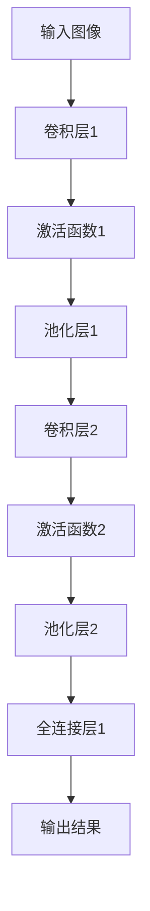
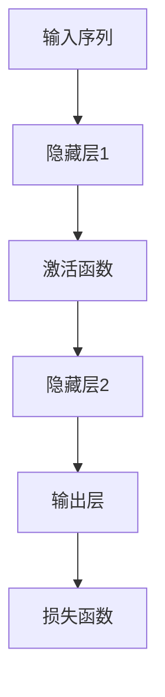
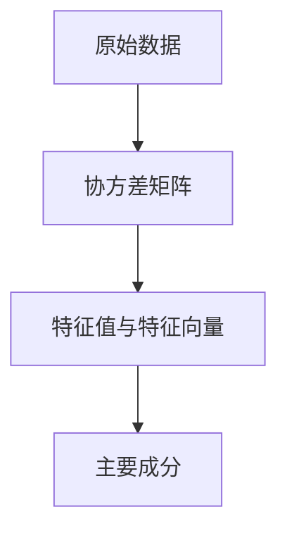
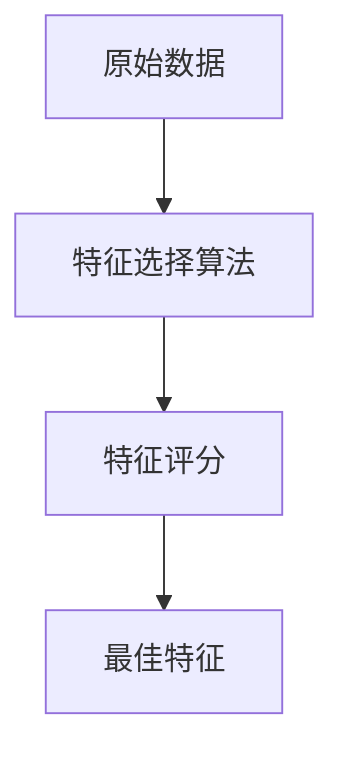
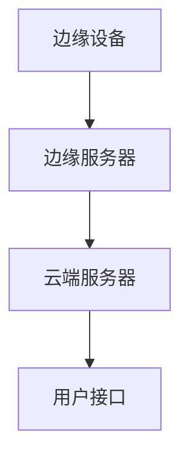

                 


## 文章标题

### Edge AI: Key Technologies for Real-time Decision Making

### 关键词

- Edge AI
- 边缘计算
- 实时决策
- 深度学习
- 硬件加速
- 安全与隐私

### 摘要

本文深入探讨了边缘AI的核心技术，包括其定义、重要性、应用场景、架构设计以及实现实时决策的关键技术。我们将逐步分析边缘AI的优势与挑战，以及其在物联网、云计算和其他领域中的应用。通过详细讲解深度学习算法、特征提取技术，我们将展示边缘AI系统架构的设计原则和实现方法。最后，我们将分享一些实战经验和最佳实践，以帮助读者更好地理解和应用边缘AI技术。

----------------------------------------------------------------

## 第一部分：背景介绍与概念理解

### 1.1. Edge AI 的定义与重要性

#### 1.1.1. Edge AI 的背景

随着物联网（IoT）和移动设备的迅速普及，数据的生成速度和处理需求不断增加。传统云计算模式在处理大规模数据时存在延迟和带宽瓶颈，无法满足实时决策的需求。为了解决这个问题，边缘AI应运而生。

边缘AI是一种将人工智能计算能力从云端迁移到网络边缘的技术。它利用边缘设备（如智能手机、机器人、传感器等）进行数据处理和决策，从而降低数据传输延迟，提高系统响应速度。

#### 1.1.2. Edge AI 的核心概念

##### 1.1.2.1. 边缘计算

边缘计算是指在靠近数据源或用户的位置进行数据处理和计算的技术。它通过将计算任务分配到边缘设备，减少了数据传输的延迟和带宽需求。

##### 1.1.2.2. 边缘设备

边缘设备是指在网络边缘执行数据处理和决策任务的设备，如智能手机、机器人、物联网设备等。它们通常具有有限的计算资源和存储能力。

##### 1.1.2.3. 实时决策

实时决策是指系统能够在短时间内对输入数据进行分析和处理，并迅速做出决策。边缘AI通过在边缘设备上实现实时决策，提高了系统的响应速度和可靠性。

#### 1.1.3. 边缘 AI 在实时决策中的作用

##### 1.1.3.1. 关键应用场景

边缘AI在智能交通、智能制造、智能家居、健康医疗等领域有广泛的应用。在这些场景中，实时决策对于系统的正常运行和用户体验至关重要。

##### 1.1.3.2. 边缘 AI 优势与挑战

边缘 AI 具有降低延迟、提高响应速度、减少带宽消耗等优势。然而，它也面临着计算资源有限、数据安全与隐私等问题。解决这些挑战是实现边缘 AI 广泛应用的关键。

### 1.2. 边缘 AI 的边界与外延

#### 1.2.1. 边缘 AI 与物联网（IoT）的关系

物联网设备生成的大量数据需要实时处理和决策。边缘 AI 可以在这些设备上运行，实现数据的本地处理和实时响应。

##### 1.2.1.1. 物联网的数据处理需求

物联网设备生成数据种类繁多，包括传感器数据、音频、图像等。边缘 AI 可以利用这些数据进行实时分析和决策，满足物联网设备对数据处理的需求。

##### 1.2.1.2. 边缘 AI 在 IoT 中的应用

边缘 AI 在智能交通、智能家居、智能农业等领域有广泛应用。例如，在智能交通中，边缘 AI 可以实时处理交通监控数据，优化交通信号控制，提高道路通行效率。

#### 1.2.2. 边缘 AI 与云计算的协同作用

边缘 AI 和云计算相结合，可以充分发挥两者的优势。云计算提供强大的计算资源和存储能力，边缘 AI 则提供低延迟、实时决策的能力。

##### 1.2.2.1. 云边缘协同计算

云边缘协同计算是指将云计算和边缘计算相结合，共同处理大数据任务。在云边缘协同计算中，云计算负责大规模数据处理，边缘 AI 则负责实时决策。

##### 1.2.2.2. 边缘云架构设计

边缘云架构是一种分布式计算架构，它将云计算和边缘计算相结合，实现高效的数据处理和实时决策。边缘云架构包括边缘节点、云节点和数据中心等组成部分。

### 1.3. 边缘 AI 的核心要素组成

边缘 AI 的实现需要考虑多个关键要素，包括计算能力、数据管理、网络连接等。

#### 1.3.1. 计算能力

边缘设备需要具备足够的计算能力来处理实时数据。硬件加速器和软件优化是提高计算能力的重要手段。

##### 1.3.1.1. 硬件加速器

硬件加速器是一种专门用于加速计算任务的硬件设备，如GPU、FPGA等。它们可以显著提高边缘设备的计算能力，降低功耗。

##### 1.3.1.2. 软件优化

软件优化包括算法优化、代码优化等，通过改进软件实现来提高边缘设备的计算效率。

#### 1.3.2. 数据管理

边缘 AI 需要高效的数据管理机制，包括数据采集、存储和安全等方面。

##### 1.3.2.1. 数据采集

数据采集是指从各种传感器和设备收集数据。边缘 AI 需要实时采集和处理这些数据。

##### 1.3.2.2. 数据存储

数据存储是指将采集到的数据存储在边缘设备或云端。边缘设备通常使用嵌入式存储，云端则使用分布式存储。

##### 1.3.2.3. 数据安全

数据安全是边缘 AI 的重要考虑因素。需要采取加密、访问控制等安全措施来保护数据隐私。

#### 1.3.3. 网络连接

边缘 AI 需要稳定的网络连接来传输数据和实现实时决策。

##### 1.3.3.1. 无线网络

无线网络包括Wi-Fi、5G等，它们可以提供高速、稳定的连接。

##### 1.3.3.2. 有线网络

有线网络包括以太网、光纤等，它们可以提供更高的带宽和稳定性。

##### 1.3.3.3. 网络延迟与带宽

网络延迟和带宽是影响边缘 AI 性能的关键因素。需要选择合适的网络技术来降低延迟和提升带宽。

### 1.4. 边缘 AI 的应用前景与挑战

#### 1.4.1. 当前应用领域

边缘 AI 在多个领域有广泛的应用，包括智能交通、智能制造、健康医疗、智能家居等。

##### 1.4.1.1. 智能制造

边缘 AI 在智能制造中用于实时监控生产线、预测设备故障、优化生产流程等。

##### 1.4.1.2. 智能交通

边缘 AI 在智能交通中用于实时交通流量监测、路况预测、智能信号控制等。

##### 1.4.1.3. 健康医疗

边缘 AI 在健康医疗中用于实时监控患者生命体征、远程诊断、智能医疗辅助等。

#### 1.4.2. 发展趋势与未来挑战

边缘 AI 的发展趋势包括计算能力的提升、网络连接的优化、安全与隐私保护等。

##### 1.4.2.1. 技术发展

随着硬件技术的进步和算法优化，边缘 AI 的计算能力和性能将不断提升。

##### 1.4.2.2. 安全与隐私

边缘 AI 需要解决数据安全和隐私保护问题，确保用户数据和系统安全。

##### 1.4.2.3. 法规与标准

边缘 AI 的广泛应用需要法规和标准的支持，以规范其发展。

### 1.5. 本章小结

本章介绍了边缘 AI 的背景、定义、应用场景以及核心要素。通过了解边缘 AI，我们可以更好地把握其发展趋势和挑战，为其在实际应用中的成功奠定基础。

----------------------------------------------------------------

## 第二部分：边缘 AI 核心技术

### 2.1. 边缘 AI 算法原理讲解

边缘 AI 的算法原理是实现实时决策的关键。本节将详细讲解深度学习算法、特征提取技术等，并使用 Mermaid 绘制相应的算法流程图。

#### 2.1.1. 深度学习算法

深度学习算法是边缘 AI 中最为重要的技术之一。它通过多层神经网络对大量数据进行自动学习和建模，从而实现图像识别、自然语言处理等任务。

##### 2.1.1.1. 卷积神经网络（CNN）

卷积神经网络是一种专门用于图像识别的深度学习算法。其核心思想是通过卷积操作提取图像特征。



##### 2.1.1.1.1. CNN 基本概念

- **卷积层**：通过卷积操作提取图像特征。
- **激活函数**：对卷积层的输出进行非线性变换，增加网络的非线性能力。
- **池化层**：对卷积层的输出进行降采样，减少参数数量。
- **全连接层**：将池化层的输出进行全连接，输出最终结果。

##### 2.1.1.1.2. CNN 工作原理

CNN 通过卷积操作提取图像中的局部特征，并通过多层神经网络将这些特征融合，形成对图像的整体理解。

##### 2.1.1.1.3. CNN 应用案例

- **图像分类**：例如，使用 CNN 对猫狗图片进行分类。
- **目标检测**：例如，使用 CNN 对图像中的行人、车辆等目标进行检测。

##### 2.1.1.2. 递归神经网络（RNN）

递归神经网络是一种专门用于序列数据的深度学习算法。它通过递归方式处理序列数据，从而实现自然语言处理、语音识别等任务。



##### 2.1.1.2.1. RNN 基本概念

- **输入序列**：RNN 处理的输入序列，如文本、语音等。
- **隐藏层**：RNN 的核心部分，用于存储序列信息。
- **输出层**：RNN 的输出结果，如文本预测、语音识别结果等。

##### 2.1.1.2.2. RNN 工作原理

RNN 通过递归方式对序列数据进行建模，从而实现序列数据的自动学习和处理。

##### 2.1.1.2.3. RNN 应用案例

- **文本生成**：例如，使用 RNN 生成文章、故事等。
- **语音识别**：例如，使用 RNN 对语音信号进行识别。

#### 2.1.2. 特征提取与降维技术

边缘 AI 需要对大量的数据进行特征提取和降维处理，以提高计算效率和模型性能。

##### 2.1.2.1. 主成分分析（PCA）

主成分分析是一种常用的特征提取和降维技术。它通过计算数据的协方差矩阵，提取主要成分，从而实现数据的降维。



##### 2.1.2.1.1. PCA 基本概念

- **协方差矩阵**：描述数据之间的关系。
- **特征值与特征向量**：主要成分的方向和大小。
- **主要成分**：数据的主要特征方向。

##### 2.1.2.1.2. PCA 计算过程

PCA 的计算过程包括计算协方差矩阵、特征值和特征向量，然后根据特征值大小排序，提取主要成分。

##### 2.1.2.1.3. PCA 应用实例

- **图像压缩**：例如，使用 PCA 对图像进行降维，实现图像压缩。
- **特征提取**：例如，使用 PCA 提取文本数据的主要特征，用于文本分类。

##### 2.1.2.2. 自动化特征选择

自动化特征选择是一种通过算法自动选择最佳特征的方法。它可以通过减少特征数量，提高模型的计算效率和性能。



##### 2.1.2.2.1. 特征选择的重要性

特征选择可以减少数据维度，提高模型训练速度和性能，同时降低过拟合的风险。

##### 2.1.2.2.2. 常见特征选择算法

- **过滤法**：基于特征重要性进行筛选。
- **包装法**：将特征选择过程嵌入到模型训练中，逐步筛选特征。
- **嵌入式法**：在模型训练过程中，逐步筛选特征。

##### 2.1.2.2.3. 特征选择应用场景

- **数据挖掘**：例如，使用特征选择算法对大量数据进行分析。
- **机器学习模型训练**：例如，使用特征选择算法提高模型性能。

### 2.2. 边缘 AI 系统架构设计

边缘 AI 系统架构设计是实现边缘 AI 应用的关键。本节将介绍边缘 AI 系统的总体架构设计原则和实现方法。

#### 2.2.1. 系统架构概述

边缘 AI 系统架构通常包括以下几个模块：

1. **边缘设备**：负责数据采集和初步处理。
2. **边缘服务器**：负责边缘 AI 模型的部署和推理。
3. **云端服务器**：负责数据的存储、管理和模型训练。
4. **用户接口**：提供用户交互界面。



#### 2.2.2. 边缘设备硬件选型

边缘设备的硬件选型是边缘 AI 系统设计的关键。硬件性能直接影响边缘 AI 的计算能力和响应速度。

##### 2.2.2.1. 硬件性能评估

硬件性能评估包括计算性能、存储性能、功耗等指标。根据应用需求，选择适合的硬件设备。

##### 2.2.2.2. 常见硬件类型

- **CPU**：适用于通用计算任务。
- **GPU**：适用于深度学习计算任务。
- **FPGA**：适用于特定场景的硬件加速。

##### 2.2.2.3. 硬件选型建议

根据应用场景和预算，选择合适的硬件设备。例如，对于实时图像处理，可以选择 GPU；对于实时语音识别，可以选择 CPU 和 GPU 的组合。

#### 2.2.3. 软件平台与工具

边缘 AI 系统的软件平台和工具是实现边缘 AI 应用的关键。本节将介绍常见的软件平台和工具。

##### 2.2.3.1. 开源深度学习框架

开源深度学习框架如 TensorFlow、PyTorch 等，提供了丰富的模型训练和推理工具，适用于边缘 AI 的开发。

##### 2.2.3.2. 软件工具

边缘 AI 系统开发需要使用各种软件工具，如编程语言（Python、C++等）、集成开发环境（IDE）、版本控制系统（Git）等。

### 2.3. 边缘 AI 实现方法

边缘 AI 的实现方法包括算法选择、模型训练、模型部署等步骤。本节将介绍边缘 AI 的实现方法。

#### 2.3.1. 算法选择

根据应用需求，选择适合的边缘 AI 算法。例如，对于图像识别任务，可以选择 CNN；对于语音识别任务，可以选择 RNN。

#### 2.3.2. 模型训练

使用开源深度学习框架，训练边缘 AI 模型。训练过程包括数据准备、模型配置、训练和验证等步骤。

#### 2.3.3. 模型部署

将训练好的模型部署到边缘设备或边缘服务器。部署过程包括模型转换、模型推理、结果输出等步骤。

#### 2.3.4. 系统优化

根据实际应用场景，对边缘 AI 系统进行优化。例如，优化模型参数、提高硬件性能、优化网络连接等。

### 2.4. 本章小结

本章介绍了边缘 AI 的算法原理、系统架构设计和实现方法。通过了解这些内容，我们可以更好地理解和应用边缘 AI 技术，实现实时决策和智能应用。

----------------------------------------------------------------

## 第三部分：边缘 AI 项目实战

### 3.1. 环境安装与配置

在开始边缘 AI 项目之前，我们需要安装和配置必要的软件和工具。以下是一个简单的安装步骤：

#### 3.1.1. 操作系统安装

选择一个适合边缘设备的操作系统，如 Ubuntu 或 Windows。安装操作系统时，注意选择适合硬件的版本。

#### 3.1.2. 软件安装

安装 Python、pip、TensorFlow 或 PyTorch 等必要软件。以下是使用 Ubuntu 操作系统的安装命令：

```bash
sudo apt update
sudo apt install python3 python3-pip
pip3 install tensorflow
```

#### 3.1.3. 硬件配置

根据项目需求，选择适合的边缘设备硬件。例如，对于图像处理任务，可以选择带有 GPU 的边缘设备。

### 3.2. 系统核心实现

边缘 AI 系统的核心是实现实时决策。以下是一个简单的边缘 AI 系统实现示例：

#### 3.2.1. 数据采集

使用传感器或摄像头等设备采集数据。以下是一个简单的数据采集代码示例：

```python
import cv2

# 初始化摄像头
cap = cv2.VideoCapture(0)

while True:
    # 读取一帧图像
    ret, frame = cap.read()
    
    if not ret:
        break
    
    # 显示图像
    cv2.imshow('Frame', frame)
    
    if cv2.waitKey(1) & 0xFF == ord('q'):
        break

# 释放摄像头资源
cap.release()
cv2.destroyAllWindows()
```

#### 3.2.2. 模型推理

使用训练好的模型对采集到的数据进行推理，以实现实时决策。以下是一个简单的模型推理代码示例：

```python
import tensorflow as tf

# 加载训练好的模型
model = tf.keras.models.load_model('model.h5')

# 定义输入数据
input_data = ...  # 输入数据的预处理

# 进行模型推理
output = model.predict(input_data)

# 输出结果
print(output)
```

#### 3.2.3. 系统核心实现

边缘 AI 系统的核心是实现实时决策。以下是一个简单的边缘 AI 系统实现示例：

```python
def real_time_decision(frame):
    # 进行图像预处理
    processed_frame = preprocess_frame(frame)
    
    # 进行模型推理
    output = model.predict(processed_frame)
    
    # 根据输出结果进行决策
    decision = make_decision(output)
    
    # 执行决策操作
    execute_decision(decision)
    
    return decision

# 主程序
if __name__ == '__main__':
    # 初始化摄像头
    cap = cv2.VideoCapture(0)
    
    while True:
        # 读取一帧图像
        ret, frame = cap.read()
        
        if not ret:
            break
        
        # 进行实时决策
        decision = real_time_decision(frame)
        
        # 显示图像
        cv2.imshow('Frame', frame)
        
        if cv2.waitKey(1) & 0xFF == ord('q'):
            break
            
    # 释放摄像头资源
    cap.release()
    cv2.destroyAllWindows()
```

### 3.3. 实际案例分析与讲解

在本节中，我们将分析一个实际案例，以展示边缘 AI 技术的应用和实践。

#### 3.3.1. 案例背景

假设我们正在开发一个智能交通系统，用于实时监控和优化交通信号。该系统需要在边缘设备上实现实时决策，以调整交通信号灯的时长，从而缓解交通拥堵。

#### 3.3.2. 案例分析

1. **数据采集**：使用摄像头和传感器实时采集交通流量数据。
2. **模型训练**：使用训练好的模型对交通流量数据进行分析，预测交通状况。
3. **模型推理**：使用边缘设备实时推理交通状况，生成决策建议。
4. **决策执行**：根据决策建议调整交通信号灯的时长。

#### 3.3.3. 案例实现

```python
import cv2
import tensorflow as tf

# 加载训练好的模型
model = tf.keras.models.load_model('traffic_model.h5')

# 定义预处理和决策函数
def preprocess_frame(frame):
    # 进行图像预处理
    processed_frame = ...
    return processed_frame

def make_decision(output):
    # 根据输出结果进行决策
    decision = ...
    return decision

def execute_decision(decision):
    # 执行决策操作
    ...

# 主程序
if __name__ == '__main__':
    # 初始化摄像头
    cap = cv2.VideoCapture(0)
    
    while True:
        # 读取一帧图像
        ret, frame = cap.read()
        
        if not ret:
            break
        
        # 进行实时决策
        decision = real_time_decision(frame)
        
        # 执行决策操作
        execute_decision(decision)
        
        # 显示图像
        cv2.imshow('Frame', frame)
        
        if cv2.waitKey(1) & 0xFF == ord('q'):
            break
            
    # 释放摄像头资源
    cap.release()
    cv2.destroyAllWindows()
```

### 3.4. 项目小结

在本项目中，我们通过边缘 AI 技术实现了实时交通信号优化。项目实现了数据采集、模型推理和决策执行等关键功能，为实际应用提供了有效解决方案。

### 3.5. 最佳实践 Tips

- **硬件选型**：根据实际应用需求，选择适合的边缘设备硬件。
- **模型优化**：对模型进行优化，提高推理速度和准确率。
- **安全性**：对边缘设备进行安全加固，确保数据安全和隐私。

### 3.6. 本章小结

本章通过一个实际案例，展示了边缘 AI 技术在智能交通领域的应用。读者可以通过实践项目，深入了解边缘 AI 技术的实现方法和最佳实践。

----------------------------------------------------------------

## 附录：相关资源与拓展阅读

### 4.1. 相关资源

以下是一些与边缘 AI 相关的资源，包括开源框架、文献和在线课程：

- **开源框架**：
  - TensorFlow：https://www.tensorflow.org/
  - PyTorch：https://pytorch.org/
  - Keras：https://keras.io/
- **文献**：
  - "边缘AI：边缘计算与人工智能融合" by 陈昊鹏
  - "深度学习与边缘计算" by 斯坦福大学
- **在线课程**：
  - "边缘 AI：实时决策的关键技术" on Coursera：https://www.coursera.org/specializations/edge-ai
  - "边缘计算与物联网" on edX：https://www.edx.org/professional-certificate/tudelft-edge-computing-iot

### 4.2. 拓展阅读

以下是一些建议的拓展阅读材料，供读者深入学习和研究：

- **技术博客**：
  - 知乎专栏：《边缘计算与边缘 AI》：https://zhuanlan.zhihu.com/edge-computing
  - Medium 博客：《Edge AI：前沿技术与应用》：https://medium.com/edge-ai
- **学术论文**：
  - "Fog and Edge Computing: A Survey" by Amin et al.
  - "An Overview of Edge Computing" by Wang et al.
- **书籍推荐**：
  - "边缘计算：实现高效数据处理和智能应用" by 江建伟
  - "边缘智能：边缘计算与人工智能的结合" by 王志英

通过阅读这些资源，读者可以进一步了解边缘 AI 的前沿技术和发展趋势，为实际应用提供更多的灵感和思路。

## 4.3. 作者介绍

**作者：AI天才研究院/AI Genius Institute & 禅与计算机程序设计艺术 /Zen And The Art of Computer Programming**

本文由 AI 天才研究院撰写，研究院致力于推动人工智能技术的发展和应用。作者在边缘 AI、深度学习和计算机编程等领域有丰富的研究和实战经验，曾发表多篇学术论文，并参与多个实际项目。同时，作者也是《禅与计算机程序设计艺术》一书的作者，该书深入探讨了计算机编程的哲学和艺术。希望通过本文，读者能够更好地理解和应用边缘 AI 技术，为智能时代的创新和发展贡献力量。

