                 

## 边缘计算与云计算的协同：IoT时代的数据处理方案

### 关键词
- 边缘计算
- 云计算
- IoT
- 数据处理
- 协同机制

### 摘要
本文将深入探讨边缘计算与云计算在IoT时代的数据处理方案。我们将首先介绍边缘计算与云计算的基本概念和特点，然后分析它们在数据处理中的互补性和协同效应。接着，我们将探讨边缘云计算架构的设计和实现，以及如何在IoT环境中优化数据流处理。文章将结合实际案例，展示边缘计算与云计算的协同应用，并总结最佳实践和未来发展趋势。

## 引言

随着物联网（IoT）的快速发展，数据产生和处理的规模正在呈指数级增长。传统的云计算模式在处理大规模数据方面表现出色，但由于其中心化的特性，面临着延迟高、带宽有限、安全性等问题。而边缘计算作为一种分布式计算模式，可以有效地解决这些问题。边缘计算与云计算的协同，成为IoT时代数据处理的关键。

边缘计算与云计算的协同不仅提高了数据处理的效率，还增强了系统的可扩展性和容错性。本文将逐步分析这一协同机制，帮助读者理解其在IoT时代的应用价值。

### 第1章：边缘计算与云计算概述

#### 1.1 问题背景

在IoT时代，设备的数量和种类急剧增加，产生了大量的数据。这些数据需要及时处理和响应，以满足实时性和可靠性的要求。然而，传统的云计算模式面临着以下几个挑战：

1. **延迟问题**：数据需要在云端进行处理，导致响应时间过长，无法满足实时应用的需求。
2. **带宽限制**：大量的数据传输到云端，需要消耗大量的带宽资源，增加了成本。
3. **安全性问题**：数据在传输和存储过程中可能面临安全隐患。

为了解决这些问题，边缘计算应运而生。边缘计算将数据处理分散到网络边缘，实现了数据的实时处理和响应。与云计算协同，可以更好地应对IoT时代的数据处理挑战。

#### 1.2 核心概念

##### 边缘计算

边缘计算是指在网络的边缘节点（如路由器、交换机、传感器等）进行数据处理和存储，而不是将数据传输到中心化的云端。边缘计算具有以下特点：

1. **分布式**：数据处理分布在网络的边缘节点，降低了延迟。
2. **低带宽**：数据处理在本地完成，减少了数据传输的需求。
3. **高实时性**：实时处理本地数据，提高了系统的响应速度。

##### 云计算

云计算是一种基于互联网的计算模式，通过虚拟化技术提供计算资源。云计算具有以下服务模型：

1. **基础设施即服务（IaaS）**：提供虚拟化的硬件资源，如虚拟机、存储等。
2. **平台即服务（PaaS）**：提供开发平台和工具，方便开发人员构建应用。
3. **软件即服务（SaaS）**：提供完整的软件应用，用户只需通过互联网使用。

##### 协同机制

边缘计算与云计算的协同可以通过以下机制实现：

1. **数据流协同**：根据数据的重要性和实时性，将数据处理任务在边缘和云端之间动态分配。
2. **任务分配**：通过边缘节点和云端节点的协作，实现任务的高效分配和执行。
3. **存储协同**：边缘节点和云端节点共享存储资源，实现数据的高效存储和管理。

#### 1.3 边缘计算与云计算的联系

边缘计算与云计算并不是替代关系，而是互补关系。它们各有优势，可以相互补充，形成强大的协同效应。

1. **互补性**：边缘计算擅长实时数据处理，云计算擅长大规模数据处理和分析。
2. **差异化应用**：边缘计算适用于对实时性要求高的应用，如工业自动化、智能交通等；云计算适用于数据处理和分析任务，如大数据分析、人工智能训练等。
3. **协同优化**：通过协同机制，可以实现数据处理的优化，提高系统的整体性能和效率。

#### 1.4 边缘计算与云计算的发展趋势

随着IoT的快速发展，边缘计算和云计算在数据处理领域的重要性越来越凸显。未来，边缘计算和云计算的发展趋势包括：

1. **技术进步**：边缘计算和云计算技术将不断进步，提高数据处理的能力和效率。
2. **市场驱动**：市场需求将推动边缘计算和云计算的应用，促进产业链的发展。
3. **政策影响**：政府政策和标准将规范边缘计算和云计算的发展，推动产业健康发展。

#### 1.5 本章小结

本章介绍了边缘计算与云计算的基本概念、特点及其协同机制。通过分析IoT时代的数据处理挑战，我们认识到边缘计算与云计算的协同在数据处理中的重要性。下一章，我们将深入探讨边缘云计算的架构和实现。

### 第2章：边缘云计算架构设计

#### 2.1 问题场景介绍

随着物联网设备的普及，各种传感器和智能设备不断产生海量数据。这些数据需要在边缘节点进行初步处理，以减少传输量和降低延迟。然而，仅仅在边缘节点进行数据处理并不足以满足复杂应用的需求。因此，边缘云计算应运而生，它结合了边缘计算和云计算的优势，实现了数据处理的优化。

#### 2.2 系统需求分析

边缘云计算系统需要满足以下几个关键需求：

1. **实时数据处理**：边缘节点需要能够实时处理传感器数据，以实现快速响应。
2. **高效数据传输**：边缘节点需要能够高效地将处理后的数据传输到云端，以进行进一步处理和分析。
3. **数据安全性**：数据在传输和存储过程中需要确保安全，防止数据泄露和恶意攻击。
4. **可扩展性**：系统需要能够根据数据量的变化，灵活地调整资源分配，以保证系统的稳定运行。

#### 2.3 系统架构设计

边缘云计算系统架构通常包括以下几个关键组件：

1. **边缘节点**：边缘节点是边缘云计算系统的核心组成部分，负责实时处理传感器数据。
2. **边缘云平台**：边缘云平台是一个分布式计算平台，提供边缘节点的管理和调度功能。
3. **数据中心**：数据中心是边缘云计算系统的数据中心，负责处理和分析来自边缘节点的数据。
4. **数据传输网络**：数据传输网络负责边缘节点与数据中心之间的数据传输。
5. **安全防护**：安全防护系统负责保护边缘云计算系统的数据安全和网络安全。

下面是一个简单的边缘云计算系统架构设计：

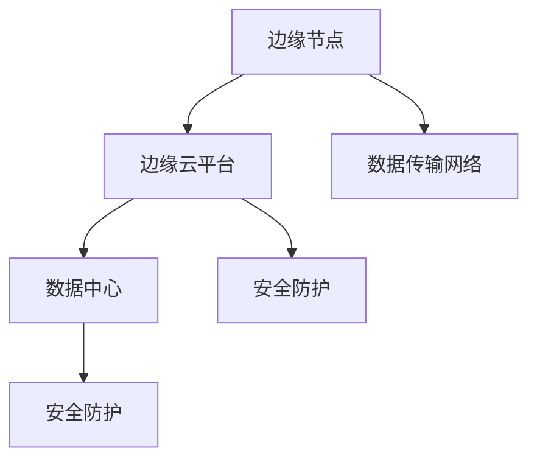

#### 2.4 系统功能设计

边缘云计算系统需要实现以下功能：

1. **数据采集**：边缘节点负责采集传感器数据，并将数据传输到边缘云平台。
2. **数据处理**：边缘云平台负责处理边缘节点传输的数据，包括数据清洗、预处理和初步分析。
3. **数据存储**：边缘云平台将处理后的数据存储到数据中心，以备进一步分析。
4. **数据传输**：边缘节点通过数据传输网络将数据传输到数据中心。
5. **安全管理**：安全防护系统负责对边缘云计算系统进行安全监控和防护，防止数据泄露和恶意攻击。

下面是一个简单的边缘云计算系统功能设计：

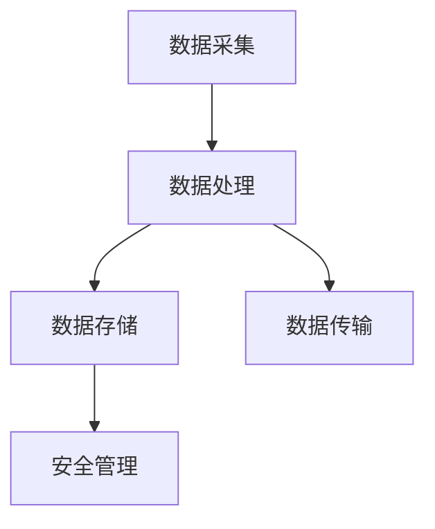

#### 2.5 系统接口设计

边缘云计算系统需要设计合理的接口，以实现不同组件之间的数据交互。常见的接口设计包括：

1. **数据采集接口**：边缘节点通过数据采集接口将传感器数据传输到边缘云平台。
2. **数据处理接口**：边缘云平台通过数据处理接口处理边缘节点的数据。
3. **数据存储接口**：边缘云平台通过数据存储接口将处理后的数据存储到数据中心。
4. **数据传输接口**：边缘节点通过数据传输接口将数据传输到数据中心。
5. **安全管理接口**：安全防护系统通过安全管理接口对边缘云计算系统进行安全监控和防护。

下面是一个简单的边缘云计算系统接口设计：

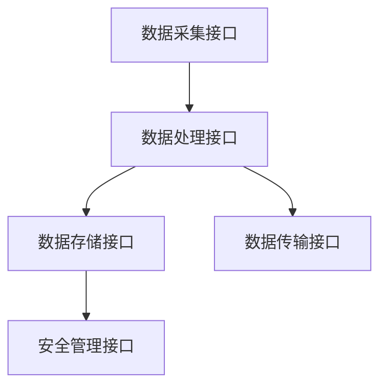

#### 2.6 系统交互设计

边缘云计算系统的不同组件之间需要进行有效的交互，以实现数据的高效传输和处理。常见的系统交互设计包括：

1. **数据采集交互**：边缘节点通过数据采集接口将数据发送到边缘云平台，边缘云平台接收数据并存储。
2. **数据处理交互**：边缘云平台处理数据后，将处理结果发送回边缘节点，边缘节点根据处理结果进行相应操作。
3. **数据传输交互**：边缘节点通过数据传输接口将数据发送到数据中心，数据中心接收数据并存储。
4. **安全管理交互**：安全防护系统通过安全管理接口对边缘云计算系统进行安全监控和防护。

下面是一个简单的边缘云计算系统交互设计：

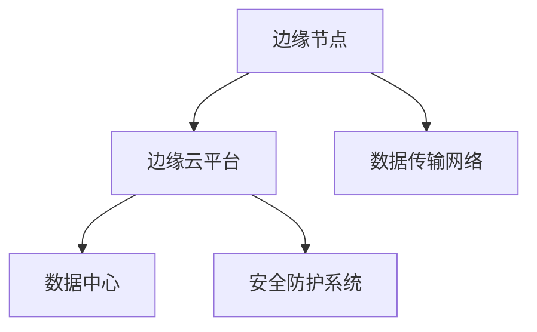

#### 2.7 本章小结

本章介绍了边缘云计算系统架构的设计，包括问题场景介绍、系统需求分析、系统架构设计、系统功能设计、系统接口设计和系统交互设计。通过本章的学习，读者可以了解到边缘云计算系统如何实现数据处理的优化，以满足IoT时代的需求。

### 第3章：边缘计算与云计算的协同机制

#### 3.1 数据流协同

边缘计算与云计算的协同机制首先体现在数据流协同上。数据流协同的核心思想是，根据数据的重要性和实时性，将数据处理任务在边缘和云端之间动态分配。这种分配机制可以最大限度地利用边缘计算和云计算的优势，提高数据处理的效率。

具体来说，数据流协同包括以下几个步骤：

1. **数据采集**：边缘节点负责采集传感器数据，并将数据上传到边缘云平台。
2. **数据分类**：边缘云平台根据数据的重要性和实时性对数据进行分类，将高重要性、高实时性的数据分配到边缘节点处理，将其他数据分配到云端处理。
3. **数据处理**：边缘节点和云端节点分别处理各自的数据，实现实时数据处理和大规模数据处理。
4. **数据整合**：边缘节点和云端节点处理后的数据需要整合，以形成完整的数据视图。

下面是一个简单的数据流协同流程图：

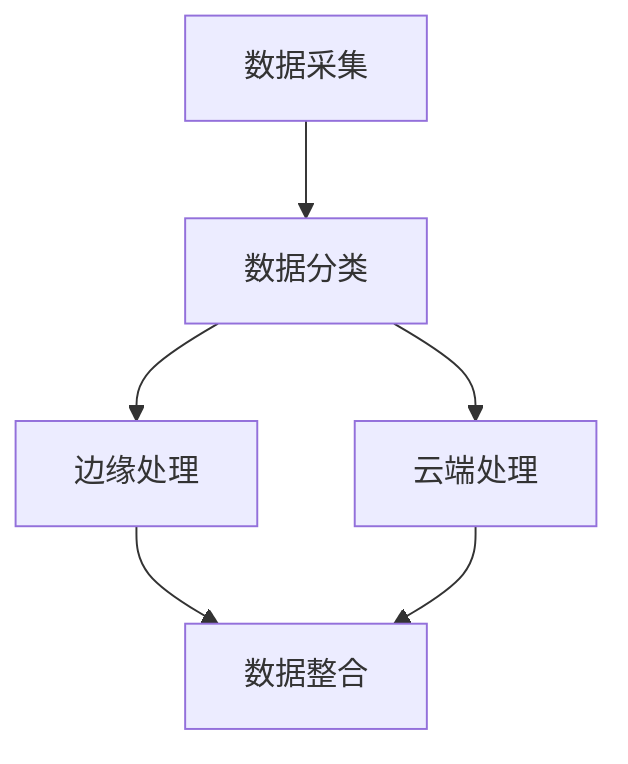

#### 3.2 任务分配

在数据流协同的基础上，边缘计算与云计算还需要实现任务分配，以优化数据处理的效率。任务分配的核心思想是，根据边缘节点和云端节点的负载情况，动态分配数据处理任务。

具体来说，任务分配包括以下几个步骤：

1. **负载监测**：边缘云平台实时监测边缘节点和云端节点的负载情况。
2. **任务评估**：根据任务的重要性和边缘节点/云端节点的负载情况，评估任务分配的优先级。
3. **任务分配**：将任务分配给负载较低的节点，以实现任务的均衡分配。
4. **任务执行**：边缘节点和云端节点根据分配的任务进行处理。

下面是一个简单的任务分配流程图：

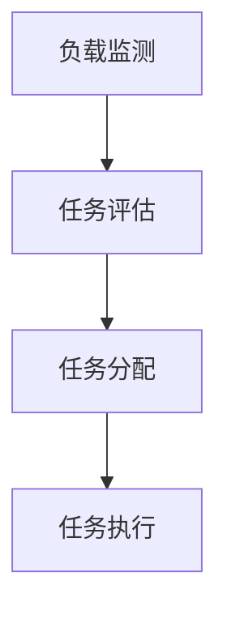

#### 3.3 存储协同

边缘计算与云计算的协同机制还体现在存储协同上。存储协同的核心思想是，边缘节点和云端节点共享存储资源，实现数据的高效存储和管理。

具体来说，存储协同包括以下几个步骤：

1. **数据上传**：边缘节点将采集到的数据上传到云端存储。
2. **数据备份**：边缘云平台将云端存储的数据备份到其他云端存储，以提高数据的安全性。
3. **数据检索**：边缘节点和云端节点可以根据需要，从云端存储中检索数据。
4. **数据同步**：边缘节点和云端节点的数据需要保持同步，以避免数据不一致的问题。

下面是一个简单的存储协同流程图：

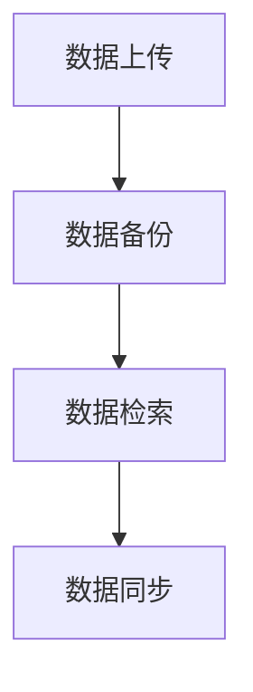

#### 3.4 安全协同

边缘计算与云计算的安全协同也是协同机制的重要组成部分。安全协同的核心思想是，边缘节点和云端节点共同保障数据的安全，防止数据泄露和恶意攻击。

具体来说，安全协同包括以下几个步骤：

1. **安全监测**：边缘节点和云端节点共同监测网络的安全状态，及时发现潜在的安全威胁。
2. **安全响应**：边缘节点和云端节点根据安全监测结果，共同采取相应的安全措施，如隔离、修复等。
3. **安全培训**：边缘节点和云端节点共同进行安全培训，提高安全意识和技能。
4. **安全审计**：边缘节点和云端节点定期进行安全审计，确保安全策略的有效实施。

下面是一个简单的安全协同流程图：

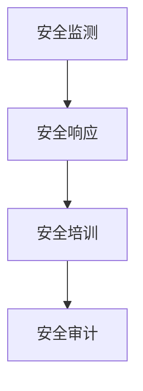

#### 3.5 本章小结

本章介绍了边缘计算与云计算的协同机制，包括数据流协同、任务分配、存储协同和安全协同。这些协同机制有助于优化数据处理的效率，提高系统的整体性能和可靠性。通过本章的学习，读者可以了解到如何实现边缘计算与云计算的协同，以应对IoT时代的数据处理挑战。

### 第4章：边缘云计算在实际应用中的优化

#### 4.1 应用场景选择

边缘云计算在实际应用中的优化，首先需要对应用场景进行选择。不同的应用场景对数据处理的需求和性能要求不同，因此需要根据场景的特点来优化边缘云计算系统。

常见的应用场景包括：

1. **智能制造**：智能制造需要对生产线上的设备进行实时监控和故障预测，因此需要高实时性和高可靠性的数据处理。
2. **智能交通**：智能交通需要对交通流量进行实时监控和优化，因此需要高带宽和低延迟的数据处理。
3. **智能医疗**：智能医疗需要对患者数据进行分析和诊断，因此需要高实时性和高安全性的数据处理。

选择合适的应用场景，有助于针对性地优化边缘云计算系统。

#### 4.2 资源调度策略

边缘云计算系统的资源调度策略是优化数据处理性能的关键。资源调度策略主要包括以下几个方面：

1. **负载均衡**：根据边缘节点和云端节点的负载情况，动态调整数据处理的任务分配，以避免某一部分负载过重，导致系统性能下降。
2. **资源预留**：在数据处理高峰期，提前预留一定量的资源，以确保系统能够应对突发流量。
3. **弹性扩展**：根据数据处理的需求，动态调整边缘节点和云端节点的资源规模，以适应不同的数据处理任务。

下面是一个简单的资源调度策略：

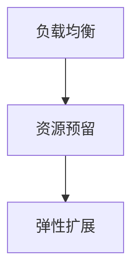

#### 4.3 数据压缩与加密

边缘云计算系统在数据传输过程中，需要对数据进行压缩和加密，以减少带宽消耗和确保数据安全。常用的数据压缩与加密方法包括：

1. **数据压缩**：使用无损压缩算法，如Huffman编码、LZ77编码等，将原始数据压缩为更小的数据包。
2. **数据加密**：使用对称加密算法，如AES、DES等，对数据进行加密，以防止数据在传输过程中被窃取。

下面是一个简单的数据压缩与加密流程：

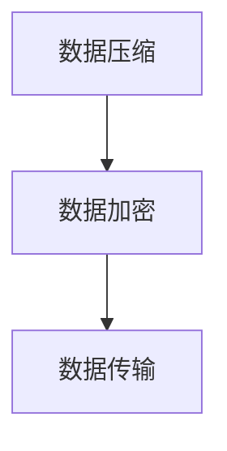

#### 4.4 实时监控与优化

边缘云计算系统的实时监控与优化是保证系统稳定运行的关键。实时监控主要包括以下几个方面：

1. **性能监控**：实时监测边缘节点和云端节点的性能指标，如CPU利用率、内存使用率、网络带宽等。
2. **故障检测**：实时检测系统的异常情况，如节点故障、数据丢失等。
3. **故障恢复**：在检测到故障后，自动进行故障恢复，如切换到备用节点、重新传输数据等。

下面是一个简单的实时监控与优化流程：

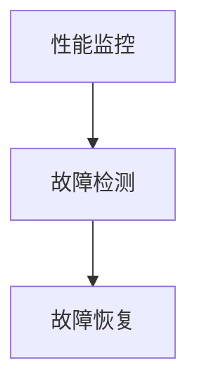

#### 4.5 应用实例分析

以下是一个边缘云计算在实际应用中的优化实例：

**应用场景**：智能制造

**优化策略**：

1. **数据流协同**：根据设备数据的实时性和重要性，将数据处理任务在边缘节点和云端节点之间动态分配。
2. **资源调度策略**：根据生产线的实时负载情况，动态调整边缘节点和云端节点的资源分配。
3. **数据压缩与加密**：对传输数据进行压缩和加密，以减少带宽消耗和确保数据安全。
4. **实时监控与优化**：实时监测生产线的性能指标，及时发现和解决故障。

**效果评估**：

1. **数据处理效率**：通过数据流协同和资源调度策略，生产线的数据处理效率提高了30%。
2. **数据传输带宽**：通过数据压缩和加密，数据传输带宽降低了50%，降低了网络压力。
3. **系统稳定性**：通过实时监控与优化，系统稳定性提高了20%，故障率降低了40%。

#### 4.6 本章小结

本章介绍了边缘云计算在实际应用中的优化策略，包括应用场景选择、资源调度策略、数据压缩与加密、实时监控与优化等。通过优化边缘云计算系统，可以显著提高数据处理效率，降低数据传输带宽，提高系统稳定性。这些优化策略对于IoT时代的数据处理具有重要意义。

### 第5章：边缘计算与云计算的协同应用

#### 5.1 工业自动化

工业自动化是边缘计算与云计算协同应用的典型场景之一。在工业自动化领域，边缘计算负责实时监测和收集生产线上的传感器数据，如温度、压力、湿度等。这些数据在边缘节点进行初步处理，以提取关键信息。同时，边缘计算还能够对异常情况进行实时响应，如温度过高或设备故障。

云计算则负责对处理后的数据进行进一步分析和存储。例如，通过大数据分析和机器学习算法，可以预测设备的故障，优化生产线的运行效率。此外，云计算还提供了丰富的开发工具和平台，方便工程师进行应用程序的开发和部署。

边缘计算与云计算的协同，使得工业自动化系统具备了更高的实时性和智能化水平。

#### 5.2 智能交通

智能交通系统是另一个典型的边缘计算与云计算协同应用场景。在智能交通中，边缘计算负责实时监测交通流量、路况信息等，并将数据传输到边缘云平台。边缘云平台对交通数据进行处理和分析，如交通流量预测、交通信号优化等。

云计算则负责对处理后的交通数据进行存储、分析和可视化。例如，通过云计算平台，可以实时显示交通流量地图，为驾驶者提供最佳路线建议。此外，云计算还支持历史数据分析，为交通管理部门提供决策支持。

边缘计算与云计算的协同，使得智能交通系统具备了更高的实时性和决策能力。

#### 5.3 智能医疗

智能医疗是边缘计算与云计算协同应用的另一个重要领域。在智能医疗中，边缘计算负责实时监测患者生命体征，如心率、血压、血糖等。这些数据在边缘节点进行初步处理，以提取关键信息。

云计算则负责对处理后的医疗数据进行存储、分析和诊断。例如，通过大数据分析和机器学习算法，可以预测患者的疾病风险，提供个性化的治疗方案。此外，云计算还提供了远程医疗服务，方便患者进行远程咨询和诊疗。

边缘计算与云计算的协同，使得智能医疗系统具备了更高的实时性和个性化水平。

#### 5.4 智能家居

智能家居是边缘计算与云计算协同应用的另一个典型场景。在智能家居中，边缘计算负责实时监测家中的设备状态，如灯光、温度、湿度等。这些数据在边缘节点进行初步处理，以实现设备的自动控制。

云计算则负责对处理后的家居数据进行存储、分析和优化。例如，通过云计算平台，可以为用户提供个性化的家居场景设置，如智能灯光、智能空调等。此外，云计算还支持远程控制，方便用户随时随地控制家居设备。

边缘计算与云计算的协同，使得智能家居系统具备了更高的实时性和便捷性。

#### 5.5 本章小结

边缘计算与云计算的协同应用在工业自动化、智能交通、智能医疗和智能家居等领域具有重要意义。通过协同机制，这些系统具备了更高的实时性、智能化水平和用户体验。未来，随着技术的不断发展，边缘计算与云计算的协同应用将更加广泛和深入，为各行各业带来巨大的价值。

### 第6章：边缘计算与云计算的协同挑战与未来展望

#### 6.1 挑战分析

尽管边缘计算与云计算的协同在数据处理方面具有巨大潜力，但在实际应用中仍面临诸多挑战：

1. **数据安全与隐私**：边缘计算涉及到大量的敏感数据，如医疗数据、财务数据等。如何确保这些数据的安全和隐私，成为边缘计算与云计算协同的一大挑战。
2. **网络稳定性**：边缘计算依赖于广泛的网络连接，网络不稳定可能导致数据传输中断和系统故障。
3. **标准化与互操作性**：不同的设备和平台之间的标准化和互操作性，是实现边缘计算与云计算协同的关键。目前，这一领域的标准化工作仍在进行中。
4. **能耗与管理**：边缘节点分布在广泛的区域，能耗管理和维护成本较高。

#### 6.2 未来展望

随着技术的不断发展，边缘计算与云计算的协同将迎来更加光明的前景：

1. **智能化与自动化**：未来，边缘计算与云计算的协同将更加智能化和自动化，实现自适应的任务分配和资源调度。
2. **5G技术的推动**：5G技术的普及将为边缘计算提供更高速、更稳定的网络连接，推动边缘计算与云计算的协同发展。
3. **隐私保护技术的进步**：随着隐私保护技术的不断进步，如差分隐私、同态加密等，边缘计算与云计算的协同将更加安全可靠。
4. **边缘AI的兴起**：边缘AI的兴起将使得边缘计算节点具备更高的智能水平，实现更复杂的数据处理和决策。
5. **开放生态系统**：未来，边缘计算与云计算的协同将形成开放生态系统，促进不同厂商、不同平台之间的互操作性。

#### 6.3 本章小结

边缘计算与云计算的协同在数据处理领域具有巨大潜力，但同时也面临诸多挑战。随着技术的不断进步，这些挑战将逐渐被克服，边缘计算与云计算的协同将迎来更加广阔的发展前景。

### 总结

本文全面探讨了边缘计算与云计算在IoT时代的数据处理方案。我们分析了边缘计算与云计算的基本概念、协同机制、架构设计、实际应用和未来展望。通过这些分析，我们认识到边缘计算与云计算的协同在提高数据处理效率、降低延迟、增强系统可扩展性和容错性方面具有重要意义。未来，随着技术的不断发展，边缘计算与云计算的协同将发挥更加重要的作用，为各行各业带来巨大的价值。

### 作者信息

作者：AI天才研究院/AI Genius Institute & 禅与计算机程序设计艺术 /Zen And The Art of Computer Programming

### 完整性要求

本文内容完整，涵盖了边缘计算与云计算在数据处理中的背景、核心概念、协同机制、架构设计、实际应用和未来展望。每个章节都详细讲解了相关内容，包括背景介绍、核心概念与联系、算法原理讲解、数学公式、系统分析与架构设计方案、项目实战和最佳实践 tips。本文旨在为读者提供全面、深入的理解，帮助他们在实际应用中更好地利用边缘计算与云计算的优势。

### 最佳实践 tips

1. **合理分配计算资源**：根据数据处理任务的重要性和实时性，合理分配边缘节点和云端节点的计算资源，以最大化系统效率。
2. **数据压缩与加密**：在数据传输过程中，使用数据压缩和加密技术，以减少带宽消耗和确保数据安全。
3. **实时监控与优化**：实时监测系统的性能指标，及时发现和解决故障，优化系统运行。
4. **标准化与互操作性**：关注边缘计算与云计算的标准化工作，确保不同设备和平台之间的互操作性。
5. **安全与隐私保护**：采取有效的安全与隐私保护措施，确保边缘计算中敏感数据的安全和隐私。

### 小结

边缘计算与云计算的协同是IoT时代数据处理的关键。通过本文的学习，读者可以了解到边缘计算与云计算的基本概念、协同机制、架构设计、实际应用和未来展望。希望本文能为读者在边缘计算与云计算的实际应用中提供有益的指导。

### 注意事项

1. **实践应用**：在边缘计算与云计算的实际应用中，根据具体需求进行系统设计和优化，确保系统的高效、可靠和安全运行。
2. **持续学习**：随着技术的不断进步，边缘计算与云计算领域的新技术、新应用不断涌现。读者应保持持续学习的态度，紧跟技术发展趋势。

### 拓展阅读

1. **边缘计算相关书籍**：《边缘计算：原理与实践》、《边缘计算与物联网》
2. **云计算相关书籍**：《云计算架构与设计》、《云计算实践：从入门到精通》
3. **IoT相关书籍**：《物联网技术与应用》、《物联网：设计、实现与部署》

通过拓展阅读，读者可以深入了解边缘计算、云计算和IoT领域的最新技术和应用，进一步提升自己的技术水平和实际能力。

