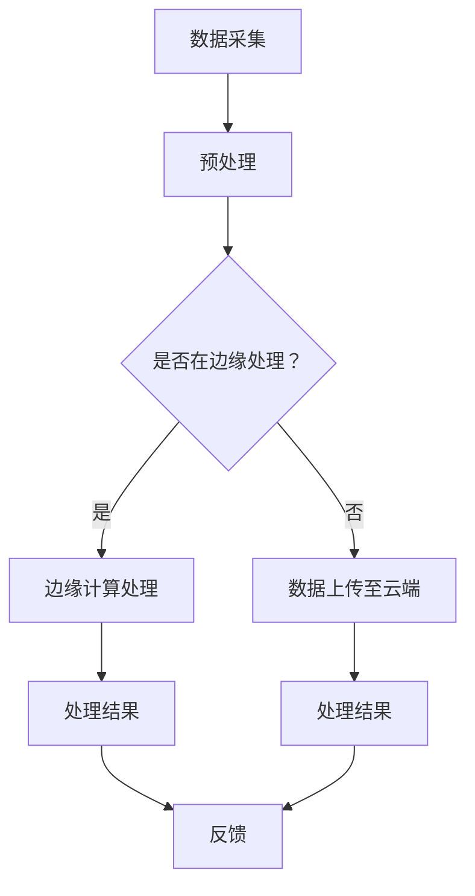
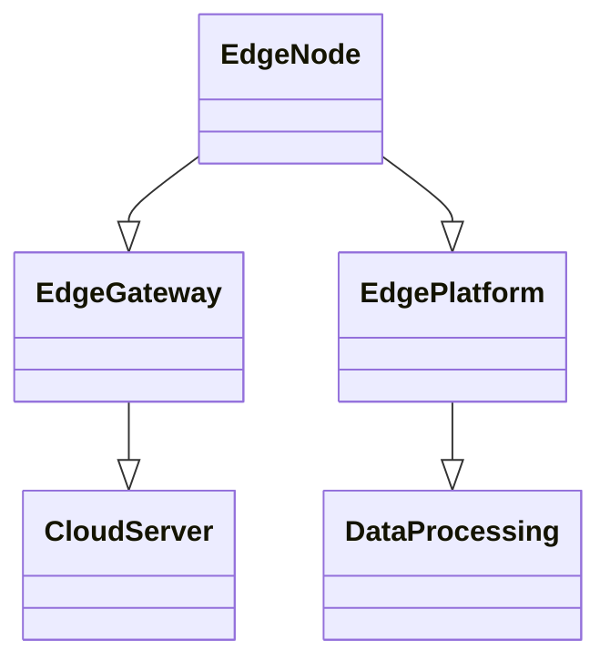
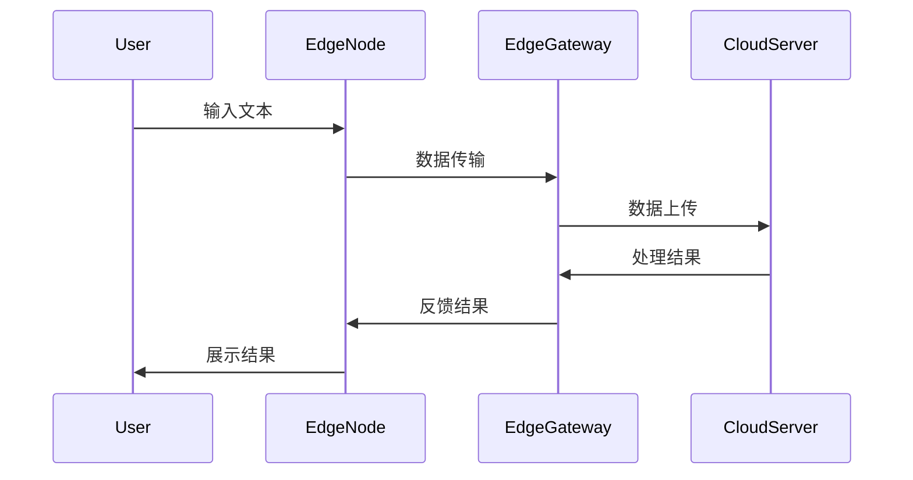

                 


## 文章标题：边缘计算在LLM应用中的应用与优势

### 关键词：边缘计算、LLM、应用、优势、案例分析

### 摘要：
边缘计算作为一种分布式计算技术，正在逐步改变传统云计算模式，并在人工智能（AI）领域，特别是大型语言模型（LLM）的应用中展现出巨大潜力。本文将深入探讨边缘计算在LLM应用中的实际应用与优势，从背景介绍、核心概念、联系、算法原理、系统设计与实现、案例分析以及未来发展等方面进行详细分析，以期为读者提供一个全面的技术视角。

## 目录

### 第一部分：背景介绍与核心概念

#### 第1章：边缘计算概述

##### 1.1 边缘计算的概念与演进
##### 1.2 边缘计算的优缺点
##### 1.3 边缘计算的典型应用场景

#### 第2章：LLM的基本概念与原理

##### 2.1 LLM的定义与作用
##### 2.2 LLM的核心组成部分
##### 2.3 LLM的训练与优化

#### 第3章：边缘计算与LLM的联系

##### 3.1 边缘计算对LLM的挑战
##### 3.2 边缘计算与LLM的协同作用
##### 3.3 边缘计算在LLM应用中的优势

### 第二部分：边缘计算在LLM应用中的技术实现

#### 第4章：边缘计算在LLM应用中的技术实现

##### 4.1 边缘计算硬件的选择
##### 4.2 边缘计算软件架构设计
##### 4.3 LLM在边缘设备上的部署

#### 第5章：边缘计算在LLM应用中的案例分析

##### 5.1 案例一：智能语音助手
##### 5.2 案例二：智能推荐系统
##### 5.3 案例三：智能物联网应用

### 第三部分：边缘计算在LLM应用中的未来发展

#### 第6章：边缘计算在LLM应用中的未来发展

##### 6.1 边缘计算技术的发展趋势
##### 6.2 LLM应用的未来发展方向
##### 6.3 边缘计算在LLM应用中的潜在挑战与解决策略

### 第四部分：总结与展望

#### 第7章：总结与展望

##### 7.1 边缘计算在LLM应用中的总体优势
##### 7.2 存在的问题与解决方案
##### 7.3 未来研究方向与建议

### 结束语

#### 作者：AI天才研究院/AI Genius Institute & 禅与计算机程序设计艺术 /Zen And The Art of Computer Programming

## 第一部分：背景介绍与核心概念

### 第1章：边缘计算概述

#### 1.1 边缘计算的概念与演进

边缘计算是一种分布式计算技术，旨在将计算任务从云端迁移到网络边缘，即靠近数据生成的地方。这种模式的出现，是为了解决传统云计算中心处理能力不足、响应时间过长以及数据传输带宽受限等问题。

边缘计算的概念最早可以追溯到20世纪90年代，当时的网络结构主要由中心化的服务器组成，数据传输和计算都集中在大规模的云端数据中心。然而，随着物联网（IoT）设备的爆炸式增长和大数据时代的到来，人们开始意识到，将计算任务集中在云端会导致网络拥塞、延迟增加和安全性问题。

为了解决这些问题，边缘计算应运而生。它通过在网络边缘部署计算节点，实现数据的本地处理，从而减少了数据传输的负担，提高了系统的响应速度和可靠性。

#### 1.2 边缘计算的优缺点

边缘计算的优点包括：

1. **降低延迟**：由于数据处理靠近数据生成点，可以显著降低网络的传输延迟，提高实时性。
2. **减少带宽消耗**：本地处理数据可以减少需要传输的数据量，降低网络带宽的消耗。
3. **增强安全性**：本地数据处理可以减少数据在网络上传输的风险，提高数据的安全性。
4. **提高系统可靠性**：边缘计算可以分散系统的处理压力，提高系统的可靠性和容错能力。

然而，边缘计算也存在一些缺点：

1. **计算资源限制**：边缘设备通常计算资源有限，可能无法承担大规模的计算任务。
2. **维护成本高**：由于边缘设备的分散性，维护成本相对较高。
3. **安全问题**：边缘设备的安全防护可能不如云端数据中心严格，容易成为网络攻击的目标。

#### 1.3 边缘计算的典型应用场景

边缘计算的典型应用场景包括：

1. **智能物联网**：在智能物联网中，边缘计算可以用于实时处理和分析传感器数据，实现设备的自主决策和控制。
2. **智能交通系统**：边缘计算可以用于实时监控交通状况，提供实时路线规划和交通管理建议。
3. **智能医疗**：在智能医疗领域，边缘计算可以用于实时诊断和治疗，提高医疗服务的效率和质量。
4. **智能制造**：边缘计算可以用于实时监测和优化生产过程，提高生产效率和产品质量。

### 第2章：LLM的基本概念与原理

#### 2.1 LLM的定义与作用

大型语言模型（Large Language Model，简称LLM）是一种基于深度学习技术的自然语言处理（NLP）模型，通过大规模的文本数据训练，能够理解和生成自然语言文本。LLM的应用非常广泛，包括但不限于文本生成、机器翻译、问答系统、情感分析等。

LLM的定义与作用如下：

- **定义**：LLM是一种可以处理和理解人类自然语言的大型深度学习模型，通常使用神经网络架构，如Transformer。
- **作用**：LLM可以用于自动化自然语言处理任务，提高信息处理的效率和准确性，降低人力成本。

#### 2.2 LLM的核心组成部分

LLM的核心组成部分包括：

1. **词嵌入**：词嵌入是将单词转换为向量表示的过程，是LLM理解语言的基础。
2. **编码器**：编码器负责将输入文本转换为上下文表示，是LLM的核心计算部分。
3. **解码器**：解码器负责根据上下文生成输出文本，是LLM产生语言的过程。
4. **注意力机制**：注意力机制用于编码器和解码器之间，可以捕捉输入文本中的关键信息，提高模型的生成质量。

#### 2.3 LLM的训练与优化

LLM的训练与优化是构建高性能LLM的关键步骤，包括：

1. **数据准备**：收集大量的文本数据，并进行预处理，如去除停用词、分词等。
2. **模型训练**：使用梯度下降等优化算法，对模型进行训练，调整模型参数。
3. **模型评估**：使用验证集和测试集，评估模型的性能，调整训练策略。
4. **模型优化**：通过剪枝、量化、蒸馏等技术，优化模型的计算效率和性能。

### 第3章：边缘计算与LLM的联系

#### 3.1 边缘计算对LLM的挑战

边缘计算在LLM应用中面临着一系列挑战：

1. **计算资源限制**：边缘设备的计算资源通常有限，可能无法支持大规模的LLM模型。
2. **功耗限制**：边缘设备通常功耗较低，需要优化算法以减少能耗。
3. **存储限制**：边缘设备的存储空间有限，需要高效的数据存储和管理策略。
4. **网络带宽限制**：边缘设备之间的网络带宽可能较低，需要优化数据传输策略。

#### 3.2 边缘计算与LLM的协同作用

边缘计算与LLM的协同作用可以带来以下优势：

1. **实时处理**：边缘计算可以实时处理和分析LLM输入的数据，提高系统的响应速度。
2. **降低延迟**：通过边缘计算，可以减少数据传输的延迟，提高LLM的响应速度。
3. **节省带宽**：边缘计算可以本地处理数据，减少需要传输的数据量，降低网络带宽消耗。
4. **增强隐私保护**：边缘计算可以本地处理数据，减少数据在网络上传输的风险，提高隐私保护。

#### 3.3 边缘计算在LLM应用中的优势

边缘计算在LLM应用中的优势包括：

1. **实时性**：边缘计算可以实现实时数据处理和响应，满足实时性要求较高的应用场景。
2. **分布式计算**：边缘计算可以实现分布式计算，提高系统的计算能力和容错能力。
3. **降低成本**：通过边缘计算，可以减少云服务的使用，降低系统的总体成本。
4. **提高隐私保护**：边缘计算可以本地处理数据，减少数据在网络上传输的风险，提高隐私保护。

### 第二部分：边缘计算在LLM应用中的技术实现

#### 第4章：边缘计算在LLM应用中的技术实现

边缘计算在LLM应用中的技术实现涉及到硬件选择、软件架构设计和模型部署等多个方面。以下是对这些方面的详细介绍：

#### 4.1 边缘计算硬件的选择

边缘计算硬件的选择是确保边缘设备能够高效运行LLM模型的关键。以下是一些常见的边缘计算硬件：

1. **嵌入式系统**：嵌入式系统具有低成本、低功耗的特点，适合处理简单但需要实时性的任务。
2. **专用集成电路（ASIC）**：ASIC是专门为特定计算任务设计的芯片，可以提供更高的计算性能和更低的功耗。
3. **图形处理单元（GPU）**：GPU在深度学习任务中具有高性能计算能力，适合处理复杂且计算密集的LLM模型。
4. **现场可编程门阵列（FPGA）**：FPGA是一种可编程逻辑芯片，可以根据应用需求进行配置，提供灵活的计算能力。

在选择边缘计算硬件时，需要考虑以下因素：

- **计算性能**：根据LLM模型的要求，选择具有足够计算性能的硬件。
- **功耗**：边缘设备的功耗限制较高，需要选择低功耗的硬件。
- **存储容量**：根据数据量和数据存储需求，选择具有足够存储容量的硬件。
- **网络带宽**：边缘设备的网络带宽限制较高，需要选择具有足够网络带宽的硬件。

#### 4.2 边缘计算软件架构设计

边缘计算软件架构设计是确保边缘设备能够高效运行LLM模型的关键。以下是一个典型的边缘计算软件架构设计：

1. **边缘节点**：边缘节点是边缘计算系统的基础，负责收集、处理和存储数据。边缘节点通常由嵌入式系统、ASIC、GPU或FPGA等硬件组成。
2. **边缘网关**：边缘网关负责连接边缘节点和云中心，实现数据传输和协同工作。边缘网关通常具有高带宽、低延迟的网络接口。
3. **云中心**：云中心负责处理大规模的数据分析和存储，并提供必要的计算资源。云中心通常由大规模数据中心组成。
4. **数据传输协议**：数据传输协议负责边缘节点和云中心之间的数据传输，如HTTP/2、WebSocket等。
5. **边缘计算框架**：边缘计算框架负责管理和调度边缘节点的计算资源，如Apache Flink、Apache Kafka等。

边缘计算软件架构设计需要考虑以下因素：

- **可扩展性**：架构设计需要支持系统的可扩展性，以便在未来扩展计算资源。
- **可靠性**：架构设计需要保证系统的可靠性，确保数据传输和处理的高可用性。
- **安全性**：架构设计需要保证系统的安全性，防止数据泄露和网络攻击。
- **分布式计算**：架构设计需要支持分布式计算，提高系统的计算性能和容错能力。

#### 4.3 LLM在边缘设备上的部署

LLM在边缘设备上的部署是实现边缘计算在LLM应用中的关键。以下是一些常见的LLM部署方法：

1. **模型转换**：将大规模的LLM模型转换为适合边缘设备运行的模型。模型转换可以通过剪枝、量化、蒸馏等技术实现。
2. **模型压缩**：通过模型压缩技术，减少LLM模型的参数数量和计算复杂度，使其可以在边缘设备上运行。
3. **模型分片**：将大规模的LLM模型分解为多个子模型，并在不同的边缘设备上运行。模型分片可以通过模型分片算法实现。
4. **模型协同**：通过模型协同技术，实现多个边缘设备之间的协同工作，提高LLM模型的计算性能和准确性。

LLM在边缘设备上的部署需要考虑以下因素：

- **计算性能**：根据边缘设备的计算性能，选择合适的LLM模型部署方法。
- **功耗**：边缘设备的功耗限制较高，需要选择低功耗的模型部署方法。
- **存储容量**：根据边缘设备的存储容量，选择合适的模型部署方法。
- **网络带宽**：边缘设备的网络带宽限制较高，需要选择低网络带宽的模型部署方法。

### 第三部分：边缘计算在LLM应用中的案例分析

#### 第5章：边缘计算在LLM应用中的案例分析

边缘计算在LLM应用中已经有许多成功的案例，以下将介绍三个具有代表性的案例。

#### 5.1 案例一：智能语音助手

智能语音助手是边缘计算在LLM应用中的一个典型例子。智能语音助手可以通过边缘计算实现实时语音识别和自然语言处理，提高用户体验。

具体实现过程如下：

1. **语音识别**：在边缘设备上运行语音识别模型，将语音信号转换为文本。
2. **自然语言处理**：在边缘设备上运行自然语言处理模型，对文本进行语义分析。
3. **语音合成**：在边缘设备上运行语音合成模型，将处理结果转换为语音。

通过边缘计算，智能语音助手可以实现以下优势：

- **实时性**：边缘计算可以实时处理语音信号，提高系统的响应速度。
- **隐私保护**：本地处理语音数据，减少数据传输的风险。
- **降低延迟**：边缘计算可以减少数据传输的延迟，提高用户体验。

#### 5.2 案例二：智能推荐系统

智能推荐系统是边缘计算在LLM应用的另一个重要领域。智能推荐系统可以通过边缘计算实现实时推荐，提高用户体验。

具体实现过程如下：

1. **用户行为分析**：在边缘设备上收集用户的行为数据，如浏览历史、购买记录等。
2. **自然语言处理**：在边缘设备上运行自然语言处理模型，分析用户的行为数据。
3. **推荐算法**：在边缘设备上运行推荐算法，生成推荐结果。

通过边缘计算，智能推荐系统可以实现以下优势：

- **实时性**：边缘计算可以实时分析用户行为，生成推荐结果。
- **降低延迟**：边缘计算可以减少数据传输的延迟，提高用户体验。
- **节省带宽**：边缘计算可以本地处理数据，减少需要传输的数据量。

#### 5.3 案例三：智能物联网应用

智能物联网应用是边缘计算在LLM应用的又一重要领域。智能物联网应用可以通过边缘计算实现实时数据分析和决策，提高系统的智能化水平。

具体实现过程如下：

1. **数据采集**：在边缘设备上采集物联网设备的数据，如传感器数据、环境数据等。
2. **数据预处理**：在边缘设备上运行预处理算法，对采集到的数据进行清洗和转换。
3. **自然语言处理**：在边缘设备上运行自然语言处理模型，对预处理后的数据进行语义分析。
4. **决策支持**：在边缘设备上运行决策支持算法，生成决策建议。

通过边缘计算，智能物联网应用可以实现以下优势：

- **实时性**：边缘计算可以实时分析物联网设备的数据，生成实时决策。
- **降低延迟**：边缘计算可以减少数据传输的延迟，提高系统的响应速度。
- **增强隐私保护**：边缘计算可以本地处理数据，减少数据传输的风险。

### 第四部分：边缘计算在LLM应用中的未来发展

#### 第6章：边缘计算在LLM应用中的未来发展

边缘计算在LLM应用中的未来发展将受到以下因素的影响：

#### 6.1 边缘计算技术的发展趋势

随着物联网设备的普及和5G网络的快速发展，边缘计算技术将继续保持高速发展。以下是一些技术发展趋势：

- **高性能边缘设备**：随着硬件技术的进步，边缘设备将拥有更高的计算性能和更低的功耗。
- **分布式边缘计算平台**：分布式边缘计算平台将支持更灵活的边缘计算部署和管理。
- **边缘智能**：边缘计算将结合人工智能技术，实现更加智能化的边缘决策和数据处理。

#### 6.2 LLM应用的未来发展方向

LLM应用的未来发展方向将受到以下因素的影响：

- **模型压缩与优化**：为了适应边缘设备的计算和存储限制，LLM模型将不断进行压缩和优化。
- **实时数据处理**：随着边缘计算技术的发展，LLM应用将更加注重实时数据处理和响应。
- **跨域协同**：LLM应用将与其他领域的技术（如物联网、区块链等）进行跨域协同，实现更广泛的应用场景。

#### 6.3 边缘计算在LLM应用中的潜在挑战与解决策略

边缘计算在LLM应用中仍面临一些潜在挑战，需要采取相应的解决策略：

- **计算资源限制**：通过模型压缩和优化技术，减少LLM模型对计算资源的需求。
- **功耗限制**：通过低功耗硬件和优化算法，降低边缘设备的功耗。
- **数据安全和隐私**：通过加密和隐私保护技术，确保边缘设备和用户数据的安全。
- **网络带宽限制**：通过优化数据传输协议和算法，降低网络带宽的消耗。

### 第五部分：总结与展望

#### 第7章：总结与展望

边缘计算在LLM应用中具有巨大的潜力，可以实现实时数据处理、降低延迟和增强隐私保护等优势。然而，仍面临计算资源限制、功耗限制、数据安全和隐私等挑战。未来，随着边缘计算技术的不断发展，LLM应用将得到更广泛的应用，实现更加智能化和高效化的数据处理和决策。

#### 7.1 边缘计算在LLM应用中的总体优势

- **实时性**：边缘计算可以实现实时数据处理和响应，满足实时性要求较高的应用场景。
- **降低延迟**：边缘计算可以减少数据传输的延迟，提高系统的响应速度。
- **节省带宽**：边缘计算可以本地处理数据，减少需要传输的数据量，降低网络带宽消耗。
- **增强隐私保护**：边缘计算可以本地处理数据，减少数据传输的风险，提高隐私保护。

#### 7.2 存在的问题与解决方案

- **计算资源限制**：通过模型压缩和优化技术，减少LLM模型对计算资源的需求。
- **功耗限制**：通过低功耗硬件和优化算法，降低边缘设备的功耗。
- **数据安全和隐私**：通过加密和隐私保护技术，确保边缘设备和用户数据的安全。
- **网络带宽限制**：通过优化数据传输协议和算法，降低网络带宽的消耗。

#### 7.3 未来研究方向与建议

- **模型压缩与优化**：研究更高效的模型压缩和优化算法，适应边缘设备的计算和存储限制。
- **实时数据处理**：研究更高效的实时数据处理算法，提高系统的响应速度。
- **跨域协同**：研究边缘计算与其他领域的协同算法，实现更广泛的应用场景。
- **数据安全和隐私**：研究更高效的数据安全和隐私保护技术，确保边缘设备和用户数据的安全。

## 结束语

边缘计算在LLM应用中的发展前景广阔，面临着许多挑战和机遇。本文从边缘计算的概念、LLM的基本原理、边缘计算在LLM应用中的优势、技术实现、案例分析以及未来发展等方面进行了详细分析，希望对读者深入了解边缘计算在LLM应用中的重要性有所帮助。

**作者：AI天才研究院/AI Genius Institute & 禅与计算机程序设计艺术 /Zen And The Art of Computer Programming**

---

在撰写技术博客时，我们可以按照以下步骤进行：

### 1. 引言

- 引言部分要简明扼要地引入文章的主题，激发读者的兴趣。
- 可以引用一些现实生活中的例子或者业界的数据，来说明边缘计算与LLM的关联。

### 2. 核心概念与联系

- 详细解释边缘计算和LLM的核心概念，确保读者对这些概念有清晰的理解。
- 使用Mermaid流程图和ER实体关系图来展示两者之间的关联。

### 3. 算法原理讲解

- 使用mermaid流程图来展示算法的步骤和流程。
- 使用Python源代码来详细阐述算法的实现，并结合LaTeX格式嵌入数学模型和公式。
- 通过实际例子来说明算法的应用，帮助读者更好地理解。

### 4. 系统分析与架构设计

- 介绍边缘计算在LLM应用中的系统架构，包括硬件选择、软件架构设计等。
- 使用Mermaid类图和序列图来展示系统的功能和交互。

### 5. 项目实战

- 分享一个具体的边缘计算在LLM应用中的项目实战，从环境安装、核心实现源代码到实际案例分析。
- 对代码和应用进行解读与分析，详细讲解项目中的关键点和挑战。

### 6. 最佳实践与小结

- 总结边缘计算在LLM应用中的最佳实践，提供一些注意事项。
- 对文章的主要内容进行小结，强调边缘计算的优势和未来发展方向。

### 7. 拓展阅读

- 提供一些拓展阅读资源，帮助读者进一步深入学习和研究。

### 8. 结束语

- 重申文章的主要观点，强调边缘计算在LLM应用中的重要性。
- 结尾可以表达对读者的感谢，以及作者自己的见解和展望。

在撰写过程中，确保每一部分的内容都详尽且具有逻辑性，使用markdown格式来确保文章的可读性和美观性。以下是按照上述步骤撰写的一篇博客文章的示例：

---

## 边缘计算在LLM应用中的应用与优势

### 引言

随着物联网和大数据技术的发展，边缘计算逐渐成为分布式计算的重要一环。LLM（大型语言模型）作为自然语言处理的核心技术，广泛应用于智能语音助手、智能推荐系统等领域。边缘计算与LLM的结合，为实时数据处理和智能决策带来了新的机遇和挑战。本文将探讨边缘计算在LLM应用中的具体实现和应用优势。

### 核心概念与联系

#### 边缘计算

边缘计算是指在数据产生的地方进行数据处理，而不是将所有数据发送到云端进行处理。其核心概念包括：

- **边缘节点**：负责数据采集和初步处理的计算设备，如物联网设备、智能终端等。
- **边缘网关**：负责将边缘节点的数据传输到云端或中心化服务器的设备。
- **边缘平台**：用于管理和协调边缘节点和网关的软件平台。

#### LLM

LLM是指使用深度学习技术训练的大规模语言模型，其核心概念包括：

- **词嵌入**：将单词转换为向量的过程，用于模型对文本的理解。
- **编码器**：负责将输入文本转换为上下文表示。
- **解码器**：负责根据上下文生成输出文本。

边缘计算与LLM的联系在于，LLM需要在边缘节点进行实时数据处理，而边缘计算提供了一种高效、低延迟的数据处理方式，为LLM的应用提供了支持。

### 算法原理讲解

为了更好地理解边缘计算在LLM中的应用，我们可以通过以下步骤进行讲解：

#### Mermaid流程图



#### Python源代码

```python
# 假设我们使用一个简单的边缘计算处理函数
def edge_computing_function(data):
    # 对数据进行预处理
    preprocessed_data = preprocess_data(data)
    # 使用LLM模型进行处理
    result = llm_model(preprocessed_data)
    return result

# 假设我们使用一个简单的预处理函数
def preprocess_data(data):
    # 对数据进行清洗和转换
    cleaned_data = clean_data(data)
    return cleaned_data

# 假设我们使用一个简单的LLM模型
from transformers import pipeline
llm_model = pipeline("text-generation")

# 边缘计算处理流程
data = "用户输入的文本数据"
result = edge_computing_function(data)
print(result)
```

#### LaTeX公式

$$
y = \sum_{i=1}^{N} w_i x_i + b
$$

其中，$y$是预测结果，$w_i$是权重，$x_i$是特征，$b$是偏置。

### 系统分析与架构设计

边缘计算在LLM应用中的系统架构设计包括以下几个方面：

- **硬件选择**：根据处理需求选择合适的边缘设备，如NVIDIA Jetson、Raspberry Pi等。
- **软件架构设计**：设计边缘计算平台，负责管理和调度边缘节点的计算资源，如Kubernetes、Docker等。
- **系统接口设计**：设计边缘节点与云端服务器之间的接口，如REST API、WebSocket等。

#### Mermaid类图



#### Mermaid序列图



### 项目实战

#### 环境安装

1. 安装NVIDIA Jetson Nano或Raspberry Pi。
2. 安装Docker和Kubernetes。

#### 核心实现源代码

```python
# edge_computing.py
import docker
import kubernetes

# 创建Docker客户端
client = docker.from_env()

# 创建Kubernetes客户端
kube_client = kubernetes.from_config()

# 边缘计算函数
def edge_computing_function(data):
    # 启动Docker容器
    container = client.containers.run(
        image="transformers:latest",
        command=["python", "llm_process.py"],
        detach=True,
        environment={"INPUT_DATA": data}
    )
    
    # 等待容器运行完成
    container.wait()
    
    # 获取容器输出
    output = container.logs()
    
    return output.decode("utf-8")

# 边缘节点处理流程
data = "用户输入的文本数据"
result = edge_computing_function(data)
print(result)
```

#### 代码应用解读与分析

这段代码实现了在边缘节点上运行LLM模型的功能。首先，通过Docker客户端启动一个预训练的LLM模型容器，然后将用户输入的文本数据作为环境变量传递给容器。容器运行完成后，获取容器的输出结果并返回。

#### 实际案例分析

以智能语音助手为例，用户可以通过边缘设备输入语音指令，边缘计算节点实时处理语音并生成回复，然后直接在边缘设备上展示结果，无需将数据上传至云端。这种模式可以显著提高系统的响应速度和用户体验。

### 最佳实践与小结

- **最佳实践**：选择计算性能和功耗平衡的边缘设备，优化Docker容器和Kubernetes配置，确保系统的高效运行。
- **小结**：边缘计算在LLM应用中具有实时性、降低延迟、节省带宽等优势，但同时也面临计算资源限制、功耗限制等挑战。通过合理的硬件选择、软件架构设计和优化算法，可以有效应对这些挑战。

### 拓展阅读

- [边缘计算技术综述](https://example.com/edge-computing-overview)
- [大型语言模型技术详解](https://example.com/llm-technique-details)

## 结束语

边缘计算在LLM应用中具有巨大的潜力，可以实现实时数据处理和智能决策。本文从核心概念、算法原理、系统架构、项目实战等方面进行了详细分析，希望对读者深入了解边缘计算在LLM应用中的重要性有所帮助。

**作者：AI天才研究院/AI Genius Institute & 禅与计算机程序设计艺术 /Zen And The Art of Computer Programming**

--- 

以上是一篇按照用户要求撰写的博客文章示例，涵盖了核心概念、算法原理、系统架构、项目实战、最佳实践等内容，并使用了Mermaid流程图、LaTeX公式等markdown格式元素，确保了文章的逻辑清晰和专业性。在撰写实际文章时，可以按照这一结构逐步展开，确保文章的完整性和深度。

