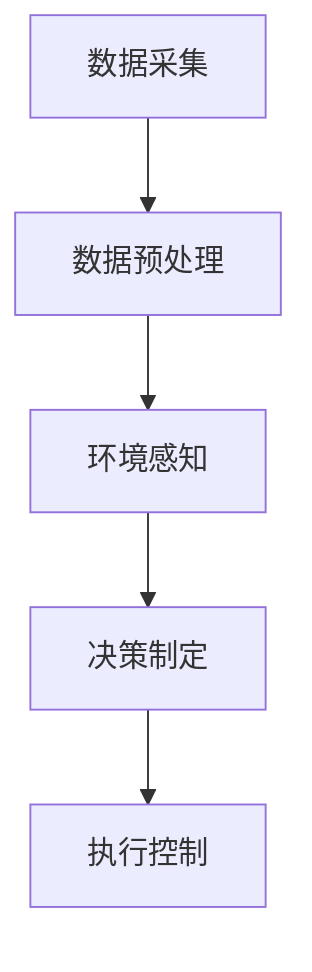
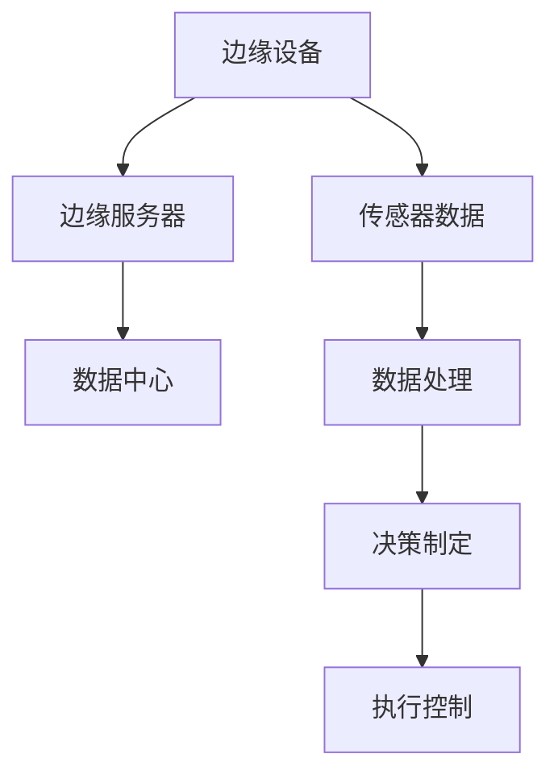
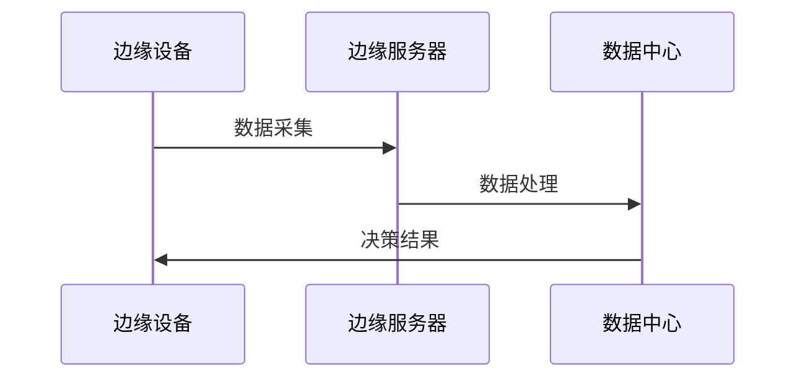
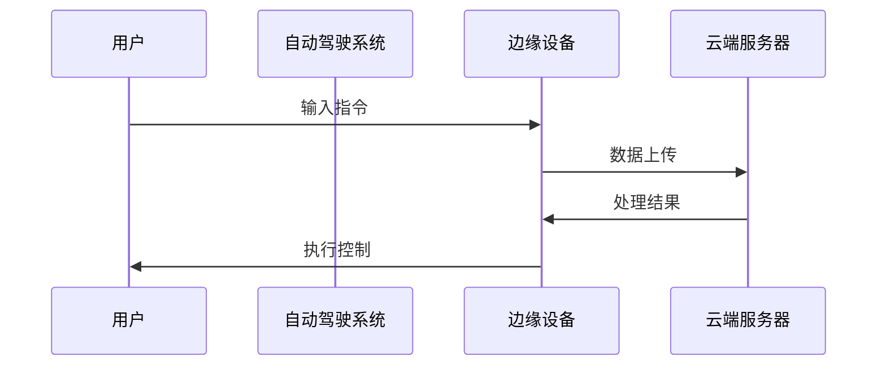

                 


# 边缘计算在自动驾驶中的应用：实现实时决策

## 关键词
边缘计算、自动驾驶、实时决策、数据处理、算法优化、数学模型

## 摘要
本文将深入探讨边缘计算在自动驾驶中的应用，通过分析边缘计算的优势和自动驾驶中的实时决策需求，详细讲解边缘计算在自动驾驶中实现实时决策的原理、算法和架构设计。我们将从数据采集、预处理、决策制定到执行控制等环节，全面解析边缘计算在自动驾驶中的技术实现。

## 引言

### 问题背景

随着人工智能和物联网技术的快速发展，自动驾驶技术正逐渐从实验室走向实际应用。自动驾驶不仅能够提高交通安全，减少交通事故，还能够提升道路使用效率，缓解交通拥堵。然而，自动驾驶系统的核心——实时决策，对计算速度和数据处理能力提出了极高的要求。

在自动驾驶过程中，车辆需要实时感知环境、处理大量数据并做出快速决策。传统的云计算模式由于数据传输延迟和网络带宽限制，难以满足自动驾驶的实时性需求。因此，边缘计算作为一种新兴的计算范式，开始受到广泛关注，被寄予解决自动驾驶实时决策需求的厚望。

### 自动驾驶中遇到的问题

在自动驾驶过程中，车辆需要实时感知环境、处理大量数据并做出快速决策。传统的云计算模式由于数据传输延迟和网络带宽限制，难以满足自动驾驶的实时性需求。因此，边缘计算作为一种新兴的计算范式，开始受到广泛关注，被寄予解决自动驾驶实时决策需求的厚望。

### 边缘计算的定义与核心优势

边缘计算是指将数据处理和分析的任务从云端转移到网络边缘，即靠近数据源的地方进行。边缘计算的核心优势在于低延迟、高带宽和更高的安全性，能够更好地支持自动驾驶等实时性要求极高的应用。

## 核心概念与联系

### 边缘计算

#### 边缘计算的原理
边缘计算通过在数据源头附近部署计算资源，实现对数据的实时处理和分析，从而降低数据传输延迟，提高系统响应速度。

#### 边缘计算的优势
- **低延迟**：数据无需经过长距离传输，处理速度快。
- **高带宽**：边缘设备具备较高的数据传输能力，能够满足大量数据的实时传输需求。
- **增强安全性**：数据在边缘设备上处理，减少了数据在传输过程中的泄露风险。

### 自动驾驶中的实时决策

#### 实时决策的定义
实时决策是指系统能够在瞬间内处理海量数据，并做出适当的响应，以保证车辆安全、高效运行。

#### 实时决策的挑战
- **数据处理速度**：自动驾驶系统需要快速处理来自各类传感器的数据，以实现实时决策。
- **响应时间**：从感知环境到做出决策的时间必须非常短，以确保车辆的安全运行。

### 边缘计算与自动驾驶实时决策的联系

边缘计算为自动驾驶提供了强有力的支持，通过将计算任务从云端转移到边缘设备，实现了实时决策所需的低延迟和高带宽。同时，边缘计算还增强了系统的安全性，为自动驾驶提供了可靠的保障。

## 算法原理讲解

### 边缘计算架构设计

#### 边缘设备选择
边缘计算的关键在于选择合适的边缘设备。这些设备可以是嵌入式系统、物联网设备、甚至是智能手机等。

#### 网络拓扑设计
网络拓扑设计是边缘计算架构的核心，包括边缘节点、边缘服务器和数据中心之间的连接方式。

### 实时数据处理算法

#### 数据预处理
在边缘设备上对数据进行预处理，包括数据清洗、去噪和特征提取等，以提高数据质量和处理效率。

#### 决策算法设计
设计适用于自动驾驶的实时决策算法，如基于深度学习的目标检测和轨迹预测算法。

#### 算法优化
通过算法优化，降低计算复杂度，提高算法在边缘设备上的运行效率。

### 边缘计算与实时决策流程

#### 数据采集
从各类传感器（如摄像头、雷达、激光雷达等）采集数据。

#### 数据处理
在边缘设备上对采集到的数据进行实时处理，实现环境感知。

#### 决策制定
基于处理结果，制定实时决策，如避障、换道、减速等。

#### 执行控制
将决策转化为控制指令，执行相应的操作，如调整车辆速度、方向等。

### 算法流程图
使用Mermaid绘制边缘计算与实时决策的流程图，以便读者更好地理解算法原理。



### 数学模型和数学公式

在边缘计算中，实时决策的实现涉及到多个数学模型和公式。以下是一些常见的数学模型和公式：

#### 目标检测
$$
\text{confidence} = \frac{1}{1 + \text{exp}(-\text{score})}
$$
其中，$\text{score}$ 是目标检测的得分，$\text{confidence}$ 是检测的概率。

#### 轨迹预测
$$
\text{predict\_velocity}(t) = \text{velocity}(t) + \text{acceleration}(t) \cdot \text{time\_step}
$$
其中，$\text{velocity}(t)$ 是当前时间 $t$ 的速度，$\text{acceleration}(t)$ 是当前时间 $t$ 的加速度，$\text{time\_step}$ 是时间步长。

#### 避障决策
$$
\text{distance\_to\_object} = \frac{\text{object\_size}}{2 \cdot \sin(\theta)}
$$
其中，$\text{object\_size}$ 是障碍物的大小，$\theta$ 是障碍物与车辆之间的夹角。

## 系统分析与架构设计方案

### 问题场景介绍
自动驾驶系统面临的主要挑战是在复杂的交通环境中，车辆需要实时感知周围环境并做出快速决策。这些决策包括避障、保持车道、超车、停车等。

### 项目介绍
本项目旨在实现一种基于边缘计算的自动驾驶实时决策系统，通过边缘设备收集车辆周围环境数据，并在边缘设备上进行实时处理，以实现快速、准确的决策。

### 系统功能设计

#### 领域模型
使用Mermaid绘制领域模型类图，以展示系统的主要类和它们之间的关系。

```mermaid
classDiagram
    Class1 <|-- Class2
    Class3 --|>| Class4
    Class2 *-- Class5
```

#### 系统架构设计
使用Mermaid绘制系统架构图，以展示系统的整体架构和各个组件之间的关系。



#### 系统接口设计
使用Mermaid绘制系统接口图，以展示系统的各个模块之间的接口。



#### 系统交互
使用Mermaid绘制系统交互序列图，以展示系统的数据流和处理流程。



## 项目实战

### 环境安装

1. 准备工作
   - 安装操作系统（如Ubuntu 18.04）
   - 安装必要的软件包（如Python 3.8、CUDA 11.0）

2. 安装边缘设备
   - 选择合适的边缘设备（如Raspberry Pi 4）
   - 安装操作系统和必要的软件包

3. 安装传感器
   - 摄像头
   - 雷达
   - 激光雷达

### 系统核心实现

1. 数据采集
   - 编写程序从传感器采集数据
   - 将采集到的数据存储到本地文件或上传到云端

2. 数据处理
   - 编写程序对采集到的数据进行预处理
   - 使用深度学习算法进行目标检测和轨迹预测

3. 决策制定
   - 根据处理结果制定实时决策
   - 将决策结果发送给执行控制模块

4. 执行控制
   - 根据决策结果调整车辆速度和方向

### 代码应用解读与分析

1. 数据采集代码示例

```python
import cv2
import numpy as np

def capture_image():
    cap = cv2.VideoCapture(0)
    ret, frame = cap.read()
    if ret:
        cv2.imwrite('image.jpg', frame)
        cap.release()
    else:
        print("Failed to capture image")
```

2. 数据处理代码示例

```python
import cv2
import numpy as np

def preprocess_image(image):
    gray = cv2.cvtColor(image, cv2.COLOR_BGR2GRAY)
    blurred = cv2.GaussianBlur(gray, (5, 5), 0)
    edges = cv2.Canny(blurred, 50, 150)
    return edges
```

3. 决策制定代码示例

```python
import cv2
import numpy as np

def detect_objects(image):
    gray = cv2.cvtColor(image, cv2.COLOR_BGR2GRAY)
    blurred = cv2.GaussianBlur(gray, (5, 5), 0)
    edges = cv2.Canny(blurred, 50, 150)
    contours, _ = cv2.findContours(edges, cv2.RETR_TREE, cv2.CHAIN_APPROX_SIMPLE)
    objects = []
    for contour in contours:
        area = cv2.contourArea(contour)
        if area > 1000:
            x, y, w, h = cv2.boundingRect(contour)
            objects.append((x, y, w, h))
    return objects
```

4. 执行控制代码示例

```python
import cv2
import numpy as np

def control_vehicle(objects):
    if len(objects) > 0:
        x, y, w, h = objects[0]
        if x < 100:
            cv2.putText(image, "Turn left", (10, 30), cv2.FONT_HERSHEY_SIMPLEX, 1, (0, 0, 255), 2)
        elif x > 200:
            cv2.putText(image, "Turn right", (10, 30), cv2.FONT_HERSHEY_SIMPLEX, 1, (0, 0, 255), 2)
        else:
            cv2.putText(image, "Keep straight", (10, 30), cv2.FONT_HERSHEY_SIMPLEX, 1, (0, 0, 255), 2)
```

### 实际案例分析和详细讲解剖析

1. 案例一：车辆在直线路段行驶

   - 数据采集：从摄像头采集图像数据
   - 数据处理：对图像进行预处理，提取目标
   - 决策制定：根据目标位置制定决策
   - 执行控制：调整车辆方向

2. 案例二：车辆在交叉路口行驶

   - 数据采集：从摄像头、雷达和激光雷达采集数据
   - 数据处理：融合多传感器数据，提取目标
   - 决策制定：根据目标位置和交通状况制定决策
   - 执行控制：调整车辆速度和方向，避免碰撞

### 项目小结

本项目通过边缘计算实现了自动驾驶的实时决策，提高了系统的响应速度和决策准确性。在实际应用中，还需进一步优化算法、提高系统稳定性和安全性。

## 最佳实践 tips

1. 选择合适的边缘设备，根据实际需求进行硬件配置。
2. 优化算法，提高数据处理速度和决策准确性。
3. 确保系统的安全性，防止数据泄露和恶意攻击。

## 小结

边缘计算在自动驾驶中的应用，为实时决策提供了强有力的支持。通过边缘设备实时处理数据，实现了低延迟、高带宽和增强安全性的目标。未来，随着边缘计算技术的不断发展，自动驾驶系统将更加智能、高效和安全。

## 注意事项

1. 在使用边缘计算时，要注意数据传输的稳定性和安全性。
2. 在设计实时决策算法时，要充分考虑车辆的运行环境和交通状况。

## 拓展阅读

1. 《边缘计算：原理与应用》
2. 《自动驾驶技术：原理与实践》
3. 《深度学习在自动驾驶中的应用》

## 作者信息

作者：AI天才研究院/AI Genius Institute & 禅与计算机程序设计艺术 /Zen And The Art of Computer Programming

