                 

## 第3章 未来趋势分析

### 3.1 技术趋势分析

在当今快速变化的科技时代，技术趋势分析显得尤为重要。本节将深入探讨几个关键技术领域，包括人工智能与自动化、互联网与数字安全、以及生物技术与健康医疗。

#### 3.1.1 人工智能与自动化

##### 3.1.1.1 人工智能技术的快速发展

人工智能（AI）是当前技术领域的一个热点，其发展速度之快，几乎每天都在刷新我们的认知。核心概念包括机器学习、深度学习和强化学习。

**核心概念对比表格：**
| 技术名称 | 定义 | 主要特点 |
| --- | --- | --- |
| 机器学习 | 从数据中学习规律，进行预测和决策 | 数据驱动，自动学习，无需明确编程规则 |
| 深度学习 | 特定的机器学习技术，使用多层神经网络 | 能够模拟人脑的学习过程，处理复杂数据 |
| 强化学习 | 通过奖励机制学习如何在特定环境中做出决策 | 与环境交互，通过试错学习最优策略 |

在制造业中，自动化正成为改变生产方式的关键因素。**ER实体关系图架构**展示了制造业自动化中的关键实体及其关系：

```mermaid
erDiagram
  Product ||--|{ Machine } : produced by
  Machine ||--|{ Process } : runs
  Process ||--|{ Worker } : assisted by
  Product : { has specifications }
  Machine : { has capabilities }
  Process : { has steps }
  Worker : { has skills }
```

**未来技术预测：量子计算与边缘计算**

量子计算被认为是下一代计算机技术，其潜力在于能够解决传统计算机无法处理的复杂问题。边缘计算则是将计算能力推向数据源附近，以减少延迟和带宽使用。

##### 3.1.1.2 自动化在制造业中的应用

自动化在制造业中的应用正在不断扩展，从简单的重复性任务到复杂的决策过程。以下是一个**ER实体关系图架构**示例，展示了制造业自动化中的关键实体及其关系：

```mermaid
erDiagram
  ManufacturingUnit ||--|{ AutomatedMachine } : equipped with
  AutomatedMachine ||--|{ ProductionProcess } : executes
  ProductionProcess ||--|{ QualityControl } : monitored by
  QualityControl : { has standards }
  AutomatedMachine : { has sensors }
  ProductionProcess : { has parameters }
```

##### 3.1.1.3 未来技术预测：量子计算与边缘计算

量子计算和边缘计算被认为是未来技术发展的重要方向。量子计算有望解决传统计算机难以处理的复杂问题，而边缘计算则能提供更快速、更安全的计算体验。

#### 3.1.2 互联网与数字安全

##### 3.1.2.1 5G技术的普及与影响

5G技术的普及将为互联网带来革命性的变革。**算法原理讲解与mermaid流程图**展示了5G网络架构与通信流程：

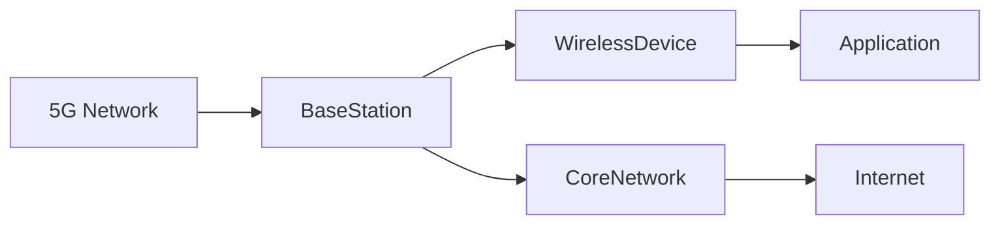

**数字货币与区块链技术**

数字货币和区块链技术正在改变金融领域。区块链的分布式账本原理提供了透明、安全的数据存储方式。**数学模型讲解**展示了区块链的基本原理：

```latex
$$
\text{Blockchain} = \{ \text{Block}_1, \text{Block}_2, ..., \text{Block}_n \}
$$

\text{Block}_i = \{ \text{Transactions}_i, \text{Hash}_{i-1} \}
$$

```

##### 3.1.2.2 网络安全与隐私保护策略

随着互联网的普及，网络安全和隐私保护变得尤为重要。**网络安全与隐私保护策略**包括数据加密、身份验证、入侵检测等多层次防护措施。

#### 3.1.3 生物技术与健康医疗

##### 3.1.3.1 精准医疗与基因编辑技术

精准医疗和基因编辑技术为健康医疗带来了新的可能性。**数学公式 & 详细讲解 & 举例说明**展示了基因测序与数据分析的过程：

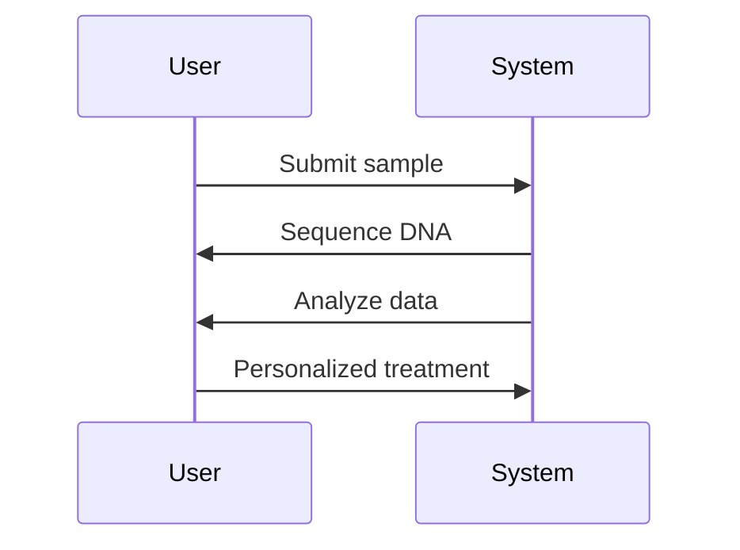

##### 3.1.3.2 人工智能在健康医疗中的应用

人工智能在健康医疗中的应用正在不断扩展，从诊断辅助到个性化治疗。**系统架构设计mermaid架构图**展示了人工智能辅助诊断系统的结构：

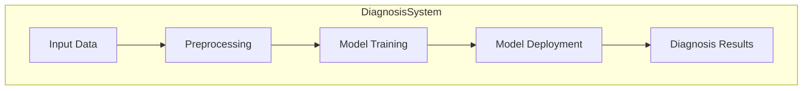

##### 3.1.3.3 未来健康趋势：预防医学与个性化医疗

未来的健康医疗将更加注重预防医学和个性化医疗。通过大数据和人工智能技术，我们可以更好地预测健康风险，提供个性化的治疗方案。

### 3.2 经济趋势分析

经济趋势的变化对企业和个人都具有重要影响。本节将分析全球化与区域经济一体化、新型经济模式、以及金融科技的发展。

#### 3.2.1 全球化与区域经济一体化

全球化与区域经济一体化是当前经济发展的主要趋势。**Mermaid流程图**展示了全球贸易流与经济体系互动的过程：

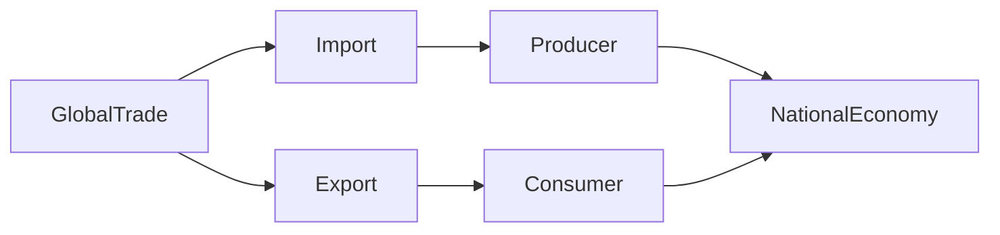

**区域经济一体化的影响**

区域经济一体化，如欧盟和北美自由贸易区，通过消除贸易壁垒，促进了区域内经济的繁荣。**领域模型mermaid类图**展示了区域经济一体化的实体及其关系：

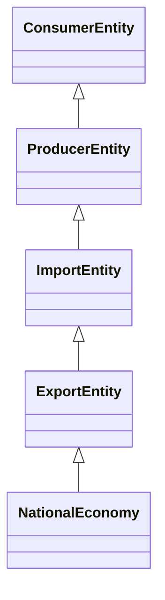

#### 3.2.2 新型经济模式

新型经济模式，如共享经济和平台经济，正在改变传统商业模式。**系统接口设计与系统交互mermaid序列图**展示了共享出行平台的服务流程：

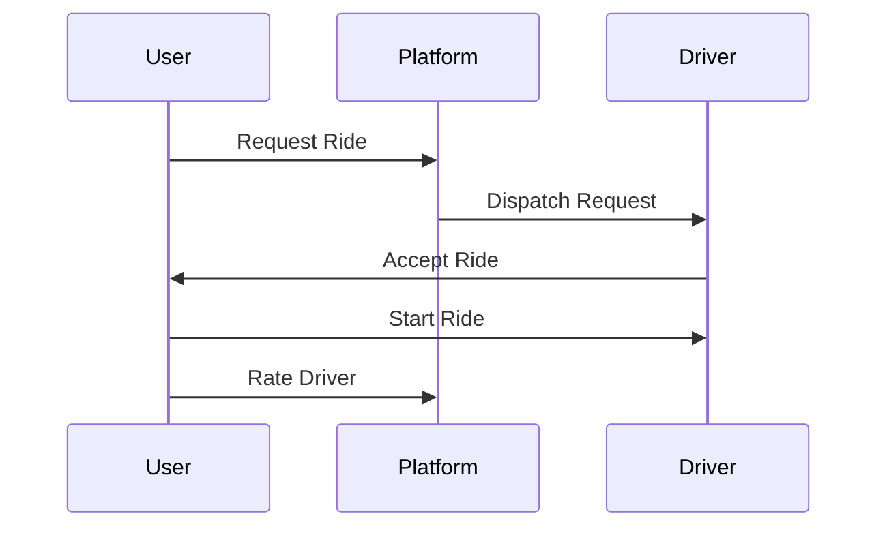

**区块链技术在经济领域的应用**

区块链技术为新型经济模式提供了可靠的信任机制。**案例分析与详细讲解**展示了区块链在供应链金融中的应用：

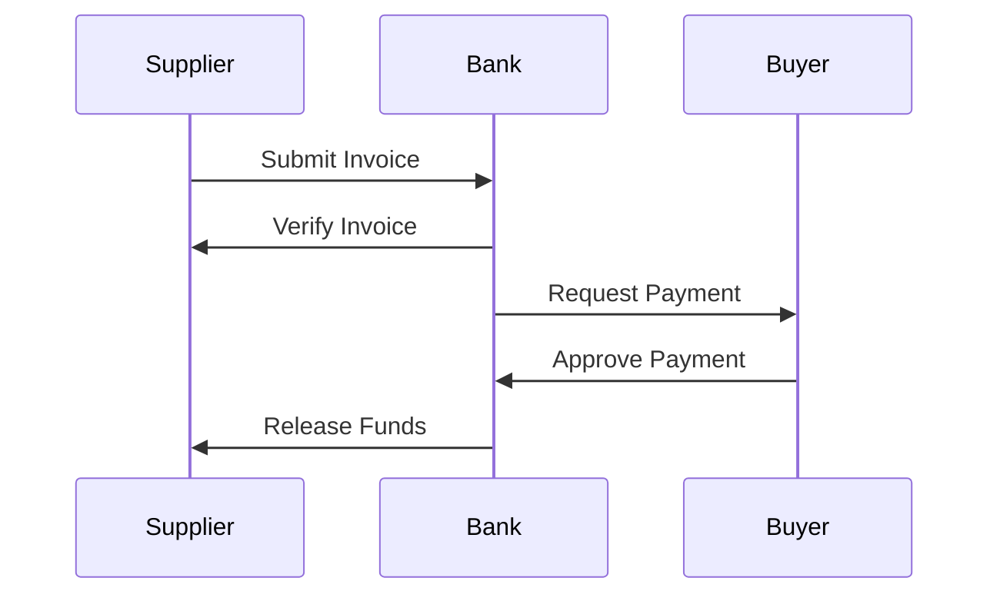

#### 3.2.3 金融科技的发展

金融科技（FinTech）的发展正在改变传统金融行业。**mermaid流程图**展示了互联网金融产品与服务流程：

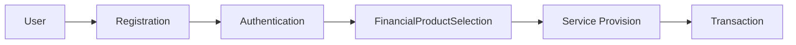

### 3.3 社会趋势分析

社会趋势的变化反映了人类行为和价值观念的转变。本节将探讨环境趋势、人口结构变化、以及文化融合等社会趋势。

#### 3.3.1 环境趋势分析

环境问题已经成为全球关注的焦点。**可持续发展**和**绿色能源**是环境趋势的两个关键方向。

**可持续发展**

可持续发展是指在满足当前需求的同时，不损害子孙后代满足其需求的能力。**Mermaid流程图**展示了可持续发展的影响和实施步骤：


**绿色能源**

绿色能源，如太阳能和风能，是减少碳排放和保护环境的重要手段。**Mermaid流程图**展示了绿色能源的来源和应用：

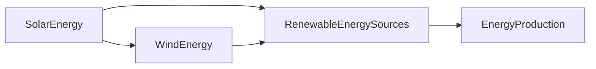

#### 3.3.2 人口结构变化

人口结构的变化对社会和经济产生深远影响。**人口老龄化**和**城市化**是当前人口结构变化的两个主要趋势。

**人口老龄化**

人口老龄化是指老年人口比例增加，年轻人口比例减少的现象。**Mermaid流程图**展示了人口老龄化的影响和应对策略：

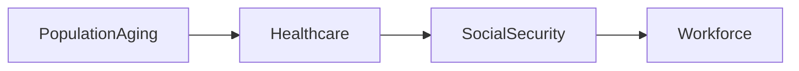

**城市化**

城市化是指人口从农村转移到城市的过程。**Mermaid流程图**展示了城市化的影响和挑战：


#### 3.3.3 文化融合

文化融合是全球化进程中的一个重要趋势。**文化多样性**和**文化交流**是文化融合的两个关键方面。

**文化多样性**

文化多样性是指不同文化在交流中相互融合，形成新的文化形态。**Mermaid流程图**展示了文化多样性的影响和优势：

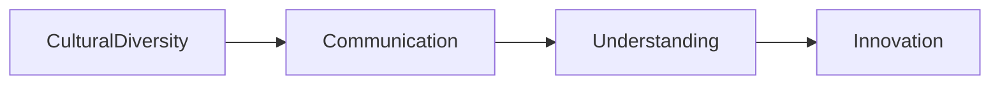

**文化交流**

文化交流是指不同文化之间通过交流互动，增进了解和互信。**Mermaid流程图**展示了文化交流的过程和效果：

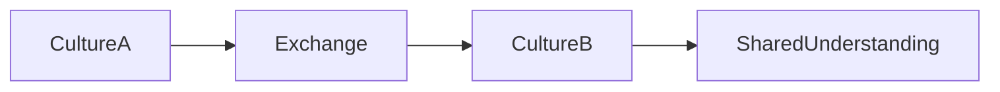

## 第6章 远见领导力案例研究

案例研究是理解和应用远见领导力的有效方式。通过分析成功的企业案例，我们可以学习如何预见并把握未来趋势。

### 6.1 案例一：科技公司的未来战略规划

#### 案例研究目标

本案例旨在探讨一家科技公司如何通过远见领导力，制定并实施其未来战略规划。

#### 案例研究内容

1. **技术趋势分析**

   科技公司首先对人工智能、物联网、区块链等关键技术趋势进行了深入分析，以确定哪些技术将对公司未来发展产生重大影响。

   **ER实体关系图架构**：

   ```mermaid
   erDiagram
       Company ||--|{ Technology } : adopts
       Technology ||--|{ BusinessImpact } : drives
       BusinessImpact : { has opportunities }
       Technology : { has potential }
   ```

2. **市场趋势分析**

   公司分析了全球市场趋势，包括消费行为、市场需求、竞争格局等，以确定未来市场的机会和挑战。

   **Mermaid流程图**：

   ```mermaid
   flowchart LR
       A[MarketTrends] --> B[ConsumerBehavior]
       B --> C[MarketDemand]
       C --> D[CompetitiveAnalysis]
   ```

3. **战略制定与实施**

   基于上述分析，公司制定了未来的战略规划，包括产品创新、市场拓展、人才引进等。**Mermaid流程图**展示了战略规划的实施步骤：

   ```mermaid
   flowchart LR
       A[StrategyDevelopment] --> B[ProductInnovation]
       B --> C[MarketExpansion]
       C --> D[TalentAcquisition]
   ```

### 6.2 案例二：新兴企业的团队建设

#### 案例研究目标

本案例旨在探讨一家新兴企业如何通过远见领导力，打造具有高度凝聚力和创新能力的团队。

#### 案例研究内容

1. **团队价值观与文化建设**

   新兴企业首先建立了明确的团队价值观，并通过文化塑造活动，如团队建设、文化交流等，增强团队成员的归属感和认同感。

   **Mermaid流程图**：

   ```mermaid
   flowchart LR
       A[TeamValues] --> B[CorporateCulture]
       B --> C[TeamBuildingActivities]
   ```

2. **人才引进与培养**

   企业通过多样化的招聘渠道，吸引具有创新能力和跨学科背景的人才。同时，通过内部培训和外部交流，不断提升团队成员的专业能力和综合素质。

   **Mermaid流程图**：

   ```mermaid
   flowchart LR
       A[TalentRecruitment] --> B[TalentTraining]
       B --> C[Cross-DisciplinaryExchange]
   ```

3. **团队协作与创新能力培养**

   企业鼓励团队成员之间的协作，通过项目制、竞赛制等方式，激发团队的创新活力。**Mermaid流程图**展示了团队协作与创新能力培养的过程：

   ```mermaid
   flowchart LR
       A[TeamCollaboration] --> B[Project-BasedWork]
       B --> C[InnovationCompetition]
   ```

## 第7章 结论

通过以上案例研究，我们可以看到远见领导力在预见并把握未来趋势中的重要作用。未来领导者需要具备持续学习、深度分析、以及敏锐洞察力，以应对不断变化的市场环境和科技趋势。远见领导力不仅关乎个人成长，更关乎企业的长期成功和社会的可持续发展。

未来领导者应：

1. **持续关注技术趋势**：紧跟科技前沿，掌握新兴技术的应用场景和潜在影响。
2. **深入分析市场环境**：理解市场需求、竞争格局、以及政策法规的变化。
3. **培养创新思维**：鼓励团队成员提出新想法，不断探索和试验。
4. **强化团队协作**：建立高效的团队协作机制，激发团队的创造力和执行力。
5. **提升危机应对能力**：在面临突发事件时，能够迅速做出决策，采取有效措施。

远见领导力是一个持续发展的过程，需要不断地学习和实践。未来领导者应保持开放的心态，积极拥抱变革，以实现个人和组织的共同成长。

### 作者信息

作者：AI天才研究院/AI Genius Institute & 禅与计算机程序设计艺术 /Zen And The Art of Computer Programming

