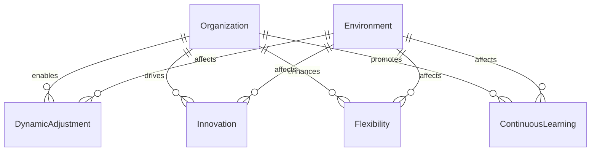

                 

### 引言

在现代商业环境中，变化已经成为一个不可忽视的现实。技术进步、市场动态、消费者偏好——所有这些因素都在不断地推动组织向前发展，或迫使其进行变革。对于组织来说，适应这种不断变化的环境是维持竞争力的关键。然而，如何在变化中保持组织的灵活性和敏捷性，成为一个极具挑战性的问题。这就引出了本文的核心主题：适应性战略。

**适应性战略**是指组织为了在快速变化的环境中保持竞争优势，采取的一系列动态调整和适应性措施。它不仅仅是一种应对变化的策略，更是一种持续创新和优化组织结构和运营方式的系统性方法。

本文将深入探讨适应性战略的重要性，其理论基础、实施方法、实践案例以及未来趋势。我们将通过一系列步骤来详细阐述：

1. **问题背景与适应性战略的重要性**：分析现代组织面临的主要挑战，探讨适应性战略的必要性。
2. **适应性战略的定义与核心要素**：明确适应性战略的概念，阐述其核心要素和与传统战略的区别。
3. **适应性战略的理论基础**：介绍适应性战略的理论框架，对比核心概念，并展示实体关系图。
4. **适应性战略的实施**：详细描述适应性战略的规划、设计以及落地实施的关键步骤。
5. **适应性战略的实践**：通过具体案例展示适应性战略在不同组织中的应用和成效。
6. **适应性战略的挑战与应对**：分析实施过程中可能遇到的挑战，并探讨应对策略。
7. **适应性战略的未来展望**：探讨数字化转型、全球化趋势对适应性战略的影响。

通过以上七个步骤的详细探讨，我们希望能够帮助读者更好地理解适应性战略，并在实际应用中取得成功。

### 第一部分：引言

在当前全球化和技术迅猛发展的背景下，组织面临的挑战前所未有。市场环境的快速变化、技术的不断革新以及消费者需求的多样化，迫使企业不断调整和优化自身的运营模式，以确保在竞争激烈的环境中立于不败之地。适应性战略作为一种应对变化的系统性方法，成为现代组织不可或缺的核心竞争力。本文旨在通过系统性地探讨适应性战略的概念、理论基础、实施方法和未来趋势，帮助读者深入理解其在现代组织中的重要性，并为其在实践中的应用提供指导。

**本文的核心内容包括：**

1. **问题背景与适应性战略的重要性**：分析现代组织面临的主要挑战，如市场环境的不确定性、技术变革的加速、消费者需求的多样化等，探讨适应性战略的必要性。

2. **适应性战略的定义与核心要素**：明确适应性战略的概念，阐述其与传统战略的区别，并介绍其核心要素，如动态调整能力、创新能力、组织灵活性等。

3. **适应性战略的理论基础**：介绍适应性战略的理论框架，包括核心概念、属性特征对比和实体关系图，帮助读者建立系统性认识。

4. **适应性战略的实施**：详细描述适应性战略的规划、设计以及落地实施的关键步骤，包括现状分析、目标设定、资源评估、组织结构调整、文化建设等。

5. **适应性战略的实践**：通过具体案例展示适应性战略在不同组织中的应用，分析其实施过程和成效。

6. **适应性战略的挑战与应对**：探讨实施过程中可能遇到的挑战，如组织惯性、资源限制和文化适应等，并讨论相应的应对策略。

7. **适应性战略的未来展望**：分析数字化转型和全球化趋势对适应性战略的影响，探讨其未来发展方向。

通过以上七个部分的系统探讨，本文希望能够为读者提供一个全面、深入的了解，帮助其在实际工作中更好地运用适应性战略，以应对不断变化的市场环境，保持组织的竞争优势。

### 第一部分：引言

在现代商业环境中，变化已经成为一个不可忽视的现实。技术进步、市场动态、消费者偏好——所有这些因素都在不断地推动组织向前发展，或迫使其进行变革。对于组织来说，适应这种不断变化的环境是维持竞争力的关键。然而，如何在变化中保持组织的灵活性和敏捷性，成为一个极具挑战性的问题。这就引出了本文的核心主题：适应性战略。

**适应性战略**是指组织为了在快速变化的环境中保持竞争优势，采取的一系列动态调整和适应性措施。它不仅仅是一种应对变化的策略，更是一种持续创新和优化组织结构和运营方式的系统性方法。

本文将深入探讨适应性战略的重要性，其理论基础、实施方法、实践案例以及未来趋势。我们将通过一系列步骤来详细阐述：

1. **问题背景与适应性战略的重要性**：分析现代组织面临的主要挑战，探讨适应性战略的必要性。

2. **适应性战略的定义与核心要素**：明确适应性战略的概念，阐述其核心要素和与传统战略的区别。

3. **适应性战略的理论基础**：介绍适应性战略的理论框架，对比核心概念，并展示实体关系图。

4. **适应性战略的实施**：详细描述适应性战略的规划、设计以及落地实施的关键步骤。

5. **适应性战略的实践**：通过具体案例展示适应性战略在不同组织中的应用和成效。

6. **适应性战略的挑战与应对**：分析实施过程中可能遇到的挑战，并探讨应对策略。

7. **适应性战略的未来展望**：探讨数字化转型、全球化趋势对适应性战略的影响。

通过以上七个步骤的详细探讨，我们希望能够帮助读者更好地理解适应性战略，并在实际应用中取得成功。

### 第1章：问题的背景与适应性战略的重要性

#### 1.1 问题背景

在当今快速变化的世界，组织面临的环境复杂性前所未有。技术的迅猛发展，如人工智能、大数据和云计算，不仅改变了企业运营的方式，还加剧了市场竞争的激烈程度。消费者需求不断演变，个性化服务和即时满足成为主流，企业需要迅速适应这些变化。此外，全球化的推进使得市场更加开放，但同时也带来了更大的不确定性，包括国际贸易政策的变化、地缘政治风险以及经济波动等。

这些挑战使得传统的静态战略难以奏效。组织需要更加灵活和敏捷，能够快速响应市场变化，保持竞争优势。然而，传统的战略规划和执行往往基于长期预测和稳定的环境，缺乏对动态变化的适应能力。这就导致了现代组织在应对快速变化时常常显得力不从心，无法有效地应对外部环境的剧变。

#### 1.1.1 现代组织面临的挑战

1. **技术变革的加速**：技术的快速迭代使得企业必须不断更新其产品和服务，以保持竞争力。例如，物联网和区块链技术的兴起，要求企业重新审视其业务模式和技术架构。

2. **市场动态的不确定性**：市场环境的不确定性增加，消费者行为难以预测，企业需要更加灵活的战略来应对突发状况。

3. **消费者需求的多样化**：消费者需求的多样化和个性化，要求企业提供更加定制化的产品和服务，这对企业的研发和市场响应速度提出了更高的要求。

4. **全球化的挑战**：全球化带来了更广阔的市场机会，但同时也带来了更多的风险和不确定性。企业需要在全球化进程中保持灵活性和适应性，以应对不同市场的变化。

#### 1.1.2 变化环境下的组织困境

在快速变化的环境中，组织常常面临以下困境：

1. **战略滞后**：传统战略规划周期较长，难以及时应对市场的快速变化。

2. **组织僵化**：组织结构和文化可能变得僵化，难以适应外部环境的快速变化。

3. **资源分配不合理**：资源分配往往基于过去的成功经验，可能导致在新的市场环境中资源投入不足或过剩。

4. **创新不足**：组织可能过于依赖现有产品和市场，缺乏对新兴技术和市场的敏感性和创新动力。

#### 1.1.3 适应性战略的必要性

适应性战略的核心在于通过动态调整和持续优化，使组织能够迅速适应外部环境的变化。这种战略不仅关注外部环境的变化，还注重内部结构的优化和运营效率的提升。以下是适应性战略的必要性：

1. **提升组织灵活性**：适应性战略强调组织结构的灵活性和敏捷性，使组织能够快速响应市场变化。

2. **增强创新能力**：适应性战略鼓励组织不断探索和试验新的业务模式和技术，推动持续创新。

3. **优化资源分配**：通过实时监控和调整资源分配，使组织能够在变化的环境中更加高效地利用资源。

4. **提升竞争力**：适应性战略帮助组织在动态的市场环境中保持竞争优势，抓住新的市场机会。

总之，适应性战略不仅是一种应对变化的策略，更是一种系统性方法，通过不断调整和优化，使组织在快速变化的环境中保持竞争力。在接下来的章节中，我们将深入探讨适应性战略的理论基础、实施方法和未来趋势，以帮助读者更好地理解这一重要概念。

#### 1.2 适应性战略的定义

适应性战略，顾名思义，是指组织在快速变化的环境中，通过一系列动态调整和适应性措施，以保持竞争优势和持续发展的战略。它不仅关注外部市场和技术变化，还包括对内部组织结构和运营模式的持续优化。

首先，从广义上讲，适应性战略可以定义为一种应对不确定性和变化的管理方法。这种方法强调灵活性和敏捷性，使组织能够快速适应外部环境的变化，并在变化中寻找新的发展机会。具体而言，适应性战略的核心要素包括：

1. **动态调整能力**：适应性战略强调对内外部环境变化的持续监控和评估，并根据这些变化进行动态调整。这种调整不仅包括战略层面的调整，还涉及组织结构、运营流程和资源配置的优化。

2. **创新能力**：适应性战略鼓励组织不断探索和试验新的业务模式、技术和市场，以推动持续创新。这种创新能力不仅体现在产品和服务上，还体现在管理模式和组织文化上。

3. **组织灵活性**：适应性战略强调组织结构的灵活性和敏捷性，使组织能够快速响应外部环境的变化。这种灵活性不仅体现在决策速度上，还体现在组织成员的协作和沟通能力上。

4. **持续学习与优化**：适应性战略强调持续学习和优化，使组织能够在变化的环境中不断进步。这种学习不仅包括技术学习和市场研究，还包括对管理方法和组织文化的反思和改进。

其次，从狭义上讲，适应性战略可以视为一种在特定情境下，针对某一具体问题的解决方案。例如，在技术变革快速推进的背景下，企业可能需要通过适应性战略来调整其技术架构和业务模式，以适应新的市场环境。在这种情况下，适应性战略的目标是确保企业在变化中不被淘汰，并能抓住新的市场机会。

综上所述，适应性战略不仅是一种应对变化的策略，更是一种系统性方法，通过动态调整、创新能力和组织灵活性，使组织能够在快速变化的环境中保持竞争力。在接下来的章节中，我们将进一步探讨适应性战略的理论基础，以帮助读者更深入地理解这一概念。

#### 1.3 适应性战略的边界与外延

尽管适应性战略在应对快速变化的环境方面具有显著优势，但它的应用并非无限制。了解适应性战略的边界与外延，对于组织在实际操作中有效利用这一战略至关重要。

首先，适应性战略的**限制条件**包括：

1. **资源限制**：适应性战略的实施需要充足的资源和投入，包括人力、财务和技术支持。如果资源有限，组织可能难以全面推行适应性战略，或者只能部分实施，这可能导致战略效果打折扣。

2. **时间限制**：适应性战略的实施通常需要一定的时间周期，如果时间紧迫，组织可能无法充分评估和调整战略，从而降低其有效性。

3. **文化障碍**：组织文化对于适应性战略的实施具有重要影响。如果一个组织文化过于保守或僵化，员工可能缺乏创新和改革的动力，从而阻碍适应性战略的推进。

4. **外部环境的不确定性**：在某些情况下，外部环境的变化可能过于迅速，超出了组织控制范围，使得适应性战略难以有效实施。

其次，适应性战略的**应用场景**包括：

1. **技术变革**：在技术快速发展的背景下，企业需要通过适应性战略来调整其技术架构和业务模式，以适应新兴技术带来的市场机会。

2. **市场动荡**：在市场环境不稳定的情况下，企业需要通过适应性战略来应对市场波动和竞争变化，确保市场份额和竞争优势。

3. **战略转型**：当一个组织需要进行重大战略转型时，适应性战略可以帮助其在转型过程中保持灵活性和敏捷性，减少变革的阻力。

4. **全球运营**：在全球化背景下，企业需要在不同的市场和文化环境中运营，适应性战略可以帮助其适应这些多样化的环境。

综上所述，适应性战略在资源、时间、文化等条件允许的情况下，可以在多种场景下发挥其重要作用。然而，组织需要根据具体情况进行战略调整，以确保适应性战略的有效实施。

#### 1.4 适应性战略的核心概念联系

在深入探讨适应性战略时，理解其核心概念之间的联系是至关重要的。适应性战略不仅包含一系列特定的概念和要素，这些概念和要素之间还相互交织，共同构成了一个复杂而动态的战略框架。

首先，我们需要明确**适应性战略与传统战略的区别**。传统战略通常是基于长期规划和稳定性假设，强调资源的优化配置和效率的提升。它侧重于预测未来环境，制定稳定的战略方向，并在相对稳定的环境中执行。相比之下，适应性战略则更强调灵活性和动态调整，侧重于快速响应外部环境的变化。传统战略的核心在于“做正确的事情”，而适应性战略的核心在于“正确地做事情”。

1. **静态与动态**：传统战略通常在一个相对稳定的时期内制定并执行，适应性战略则更关注实时调整和动态优化。

2. **预测与响应**：传统战略依赖对未来环境的预测，而适应性战略强调对外部变化的即时响应。

3. **稳定性与灵活性**：传统战略追求稳定性和可预测性，而适应性战略则追求灵活性和敏捷性。

其次，适应性战略与**敏捷管理**有着紧密的联系。敏捷管理是一种基于迭代和增量发展的管理方法，强调快速交付、持续改进和团队协作。这与适应性战略的核心理念高度契合：

1. **迭代与增量**：敏捷管理通过迭代和增量的方式，使组织能够快速适应变化，这与适应性战略的动态调整能力一致。

2. **持续改进**：敏捷管理强调持续改进，不断优化产品和服务，这与适应性战略的持续学习与优化理念相吻合。

3. **团队协作**：敏捷管理倡导团队协作，强调团队成员的多样性和沟通能力，这与适应性战略的组织灵活性要求相符。

此外，适应性战略的核心概念还包括**动态能力**、**敏捷性**和**创新能力**。这些概念共同构成了适应性战略的理论基础：

1. **动态能力**：动态能力是指组织快速调整其战略和运营能力以应对外部环境变化的能力。它包括战略调整、资源配置、组织结构和文化变革等方面。

2. **敏捷性**：敏捷性是指组织在变化环境中快速响应和适应变化的能力。它不仅涉及决策速度和执行效率，还包括组织成员的协作和创新能力。

3. **创新能力**：创新能力是指组织不断探索和试验新方法、新技术和新业务模式的能力。这是适应性战略的重要支撑，使组织能够在竞争激烈的市场中保持竞争优势。

最后，将这些核心概念联系起来，我们可以看到，适应性战略不仅是一种应对变化的策略，更是一种系统性方法。它通过动态调整、敏捷响应和持续创新，帮助组织在快速变化的环境中保持竞争力。这些核心概念之间的相互作用和整合，构成了适应性战略的完整框架，使组织能够在变化中找到新的发展机遇。

#### 1.5 本章小结

本章详细探讨了适应性战略在快速变化环境中的重要性及其核心概念。首先，我们分析了现代组织面临的挑战，包括技术变革、市场动态、消费者需求的多样化等，阐述了适应性战略的必要性。接着，我们定义了适应性战略的概念，并介绍了其核心要素，如动态调整能力、创新能力、组织灵活性等。然后，我们探讨了适应性战略的边界与外延，分析了其限制条件和应用场景。此外，我们还对比了适应性战略与传统战略，并探讨了其与敏捷管理的联系。通过这些分析，我们为后续章节的深入探讨奠定了基础。

### 第二部分：适应性战略的理论基础

#### 第2章：适应性战略的理论基础

在探讨适应性战略的实践中，理解其理论基础是至关重要的。本章将系统地介绍适应性战略的理论框架，包括其演变过程、主要概念以及与传统战略的比较。我们将通过对比分析，明确适应性战略的独特属性，并展示其核心概念和属性的ER实体关系图。

#### 2.1 适应性战略的理论框架

适应性战略的理论框架是一个复杂而动态的系统，其发展经历了多个阶段。以下是适应性战略理论框架的演变过程：

1. **早期战略管理理论**：在20世纪初期，战略管理主要关注资源优化和效率提升。这一阶段的核心理论包括泰勒的科学管理理论和马克斯·韦伯的官僚组织理论，它们为组织提供了稳定性和效率的基础。

2. **竞争战略理论**：20世纪60年代，迈克尔·波特提出了竞争战略理论，强调通过成本领先、差异化和集中战略来获得竞争优势。这一理论推动了企业战略规划的发展，但也面临无法有效应对快速变化的局限。

3. **动态竞争理论**：随着市场环境的不断变化，20世纪90年代，亨利·明茨伯格和亚当·布兰登伯格等人提出了动态竞争理论。这一理论强调企业在动态环境中通过灵活调整和快速响应来保持竞争优势。

4. **适应性战略理论**：21世纪初，适应性战略理论逐渐兴起。这一理论强调组织在快速变化的环境中，通过动态调整、创新能力和组织灵活性来保持竞争优势。适应性战略理论整合了前人的研究成果，形成了一个更加综合和动态的战略框架。

#### 2.2 核心概念与属性特征对比

适应性战略的核心概念包括动态调整能力、创新能力、组织灵活性和持续学习与优化。以下是这些概念的主要属性特征及其对比分析：

1. **动态调整能力**：动态调整能力是指组织快速调整其战略和运营能力以应对外部环境变化的能力。其主要属性特征包括：
   - **实时监控和评估**：通过实时监控和评估外部环境的变化，组织能够及时调整战略方向。
   - **灵活性**：动态调整能力强调组织的灵活性，使组织能够在变化中快速响应。
   - **适应性**：动态调整能力不仅关注当前变化，还关注未来可能的变化，使组织具备长远适应性。

   与传统战略相比，动态调整能力更加注重实时性和灵活性，而传统战略则侧重于长期规划和稳定性。

2. **创新能力**：创新能力是指组织不断探索和试验新方法、新技术和新业务模式的能力。其主要属性特征包括：
   - **创新思维**：鼓励组织成员进行创新思维，提出新的解决方案和业务模式。
   - **实验和验证**：通过实验和验证，组织能够不断优化和改进创新成果。
   - **学习与改进**：持续学习和改进是创新能力的核心，使组织能够在不断变化的环境中保持领先。

   与传统战略相比，创新能力更加注重探索和试验，而传统战略则侧重于优化现有资源和流程。

3. **组织灵活性**：组织灵活性是指组织在变化环境中快速适应和调整的能力。其主要属性特征包括：
   - **结构灵活性**：组织结构的灵活性，使组织能够快速调整其组织架构和职责分工。
   - **文化灵活性**：组织文化的灵活性，鼓励员工在变化中保持积极和开放的心态。
   - **流程灵活性**：业务流程的灵活性，使组织能够快速适应新的工作流程和操作模式。

   与传统战略相比，组织灵活性更加注重适应性和敏捷性，而传统战略则侧重于稳定性和可预测性。

4. **持续学习与优化**：持续学习与优化是指组织在变化环境中不断学习和改进，以保持竞争优势。其主要属性特征包括：
   - **知识管理**：通过知识管理，组织能够积累和共享经验，提高整体运营效率。
   - **系统优化**：通过系统优化，组织能够不断提升其运营效率和服务质量。
   - **组织文化**：持续学习与优化要求组织具备积极的学习文化和改进文化。

   与传统战略相比，持续学习与优化更加注重长期发展和持续改进，而传统战略则侧重于短期目标和效率提升。

通过以上对比分析，我们可以看到，适应性战略的核心概念与传统战略存在显著差异。适应性战略更加注重动态调整、创新能力和组织灵活性，这些特征使其能够更好地适应快速变化的环境，并在竞争中获得优势。

#### 2.3 适应性战略的ER实体关系图

为了更直观地理解适应性战略的核心概念和属性特征，我们可以使用ER（Entity-Relationship）实体关系图进行展示。ER图通过实体和关系的定义，清晰地展示了不同概念之间的关联。

以下是适应性战略ER实体关系图：

```mermaid
erDiagram
    Product |..|> Customer : "sells to"
    Resource |..|> Organization : "allocated to"
    Market |..|> Organization : "operates in"
    Technology |..|> Organization : "uses"
    Strategy |..|> Organization : "defines"
    DynamicAdjustment |..|> Strategy : "enables"
    Innovation |..|> Organization : "drives"
    Flexibility |..|> Organization : "enhances"
    ContinuousLearning |..|> Organization : "promotes"
```

在这个ER图中，我们定义了以下实体和关系：

- **Product（产品）**：指组织生产或销售的产品和服务。
- **Customer（客户）**：指组织的产品或服务的购买者。
- **Resource（资源）**：指组织用于运营和发展的各种资源，包括人力、财务和技术等。
- **Market（市场）**：指组织运营的市场环境，包括竞争格局、消费者需求和行业趋势等。
- **Technology（技术）**：指组织使用的技术和工具。
- **Strategy（战略）**：指组织的整体发展战略。
- **DynamicAdjustment（动态调整）**：指组织在战略中采用的动态调整能力。
- **Innovation（创新）**：指组织的创新能力。
- **Flexibility（灵活性）**：指组织的灵活性。
- **ContinuousLearning（持续学习）**：指组织的持续学习能力。

各个实体之间的关系如下：

- **Product与Customer之间的关系**：产品通过销售给客户实现其价值。
- **Resource与Organization之间的关系**：资源被分配给组织以支持其运营和发展。
- **Market与Organization之间的关系**：组织在其运营的市场环境中进行业务活动。
- **Technology与Organization之间的关系**：组织使用技术来提高运营效率和创新能力。
- **Strategy与Organization之间的关系**：战略指导组织的整体发展。
- **DynamicAdjustment与Strategy之间的关系**：动态调整能力是战略中的一部分，使战略能够适应环境变化。
- **Innovation与Organization之间的关系**：创新是组织发展的重要驱动力。
- **Flexibility与Organization之间的关系**：灵活性是组织在变化环境中保持竞争优势的关键。
- **ContinuousLearning与Organization之间的关系**：持续学习是组织不断进步和优化的基础。

通过ER实体关系图，我们可以更直观地理解适应性战略的核心概念和属性特征之间的关联，从而更好地应用这一战略。

### 第2章：适应性战略的理论基础

在上一章中，我们介绍了适应性战略的概念和核心要素。本章将进一步深入探讨适应性战略的理论基础，以帮助读者建立更加系统的认识。

#### 2.1 适应性战略的理论框架

适应性战略的理论框架是一个复杂且多维的系统，它包括多个核心概念和理论源流。以下是适应性战略理论框架的几个关键组成部分：

1. **动态能力理论**：动态能力理论由亨利·明茨伯格等人提出，强调组织在快速变化的环境中通过动态调整其能力来应对外部挑战。这一理论的核心在于组织的动态调整能力和敏捷性。

2. **敏捷管理理论**：敏捷管理理论由肯特·贝克等人提出，是一种基于迭代和增量发展的管理方法。它强调快速交付、持续改进和团队协作，这些理念与适应性战略高度契合。

3. **创新管理理论**：创新管理理论强调组织在不断创新中寻找新的发展机会。这一理论认为，创新能力是组织持续发展的关键，与适应性战略中的创新能力密切相关。

4. **复杂系统理论**：复杂系统理论认为，组织是一个复杂的适应性系统，其行为受到内部和外部环境的相互作用影响。这一理论为理解适应性战略提供了一个重要的视角。

5. **战略变革理论**：战略变革理论关注组织如何通过战略变革来应对环境变化。这一理论强调组织在战略变革过程中需要具备的动态调整能力和创新能力。

#### 2.2 核心概念与属性特征对比

适应性战略的核心概念包括动态调整能力、创新能力、组织灵活性和持续学习与优化。以下是这些概念的主要属性特征及其对比分析：

1. **动态调整能力**：动态调整能力是指组织快速调整其战略和运营能力以应对外部环境变化的能力。其主要属性特征包括：
   - **实时监控和评估**：通过实时监控和评估外部环境的变化，组织能够及时调整战略方向。
   - **灵活性**：动态调整能力强调组织的灵活性，使组织能够在变化中快速响应。
   - **适应性**：动态调整能力不仅关注当前变化，还关注未来可能的变化，使组织具备长远适应性。

2. **创新能力**：创新能力是指组织不断探索和试验新方法、新技术和新业务模式的能力。其主要属性特征包括：
   - **创新思维**：鼓励组织成员进行创新思维，提出新的解决方案和业务模式。
   - **实验和验证**：通过实验和验证，组织能够不断优化和改进创新成果。
   - **学习与改进**：持续学习和改进是创新能力的核心，使组织能够在不断变化的环境中保持领先。

3. **组织灵活性**：组织灵活性是指组织在变化环境中快速适应和调整的能力。其主要属性特征包括：
   - **结构灵活性**：组织结构的灵活性，使组织能够快速调整其组织架构和职责分工。
   - **文化灵活性**：组织文化的灵活性，鼓励员工在变化中保持积极和开放的心态。
   - **流程灵活性**：业务流程的灵活性，使组织能够快速适应新的工作流程和操作模式。

4. **持续学习与优化**：持续学习与优化是指组织在变化环境中不断学习和改进，以保持竞争优势。其主要属性特征包括：
   - **知识管理**：通过知识管理，组织能够积累和共享经验，提高整体运营效率。
   - **系统优化**：通过系统优化，组织能够不断提升其运营效率和服务质量。
   - **组织文化**：持续学习与优化要求组织具备积极的学习文化和改进文化。

#### 2.3 适应性战略的ER实体关系图

为了更直观地理解适应性战略的核心概念和属性特征，我们可以使用ER（Entity-Relationship）实体关系图进行展示。以下是适应性战略ER实体关系图：



在这个ER图中，我们定义了以下实体：

- **Organization（组织）**：指实施适应性战略的主体。
- **DynamicAdjustment（动态调整能力）**：指组织在战略中采用的动态调整能力。
- **Innovation（创新能力）**：指组织的创新能力。
- **Flexibility（灵活性）**：指组织的灵活性。
- **ContinuousLearning（持续学习与优化）**：指组织的持续学习与优化能力。
- **Environment（环境）**：指组织所处的内外部环境。

各个实体之间的关系如下：

- **Organization与DynamicAdjustment之间的关系**：组织通过动态调整能力来适应外部环境的变化。
- **Organization与Innovation之间的关系**：组织通过创新能力来寻找新的发展机会。
- **Organization与Flexibility之间的关系**：组织通过灵活性来快速响应外部环境的变化。
- **Organization与ContinuousLearning之间的关系**：组织通过持续学习与优化来不断提升自身能力。
- **Environment与DynamicAdjustment之间的关系**：外部环境的变化影响组织的动态调整能力。
- **Environment与Innovation之间的关系**：外部环境的变化影响组织的创新能力。
- **Environment与Flexibility之间的关系**：外部环境的变化影响组织的灵活性。
- **Environment与ContinuousLearning之间的关系**：外部环境的变化影响组织的持续学习与优化能力。

通过ER实体关系图，我们可以更直观地理解适应性战略的核心概念和属性特征之间的关联，从而更好地应用这一战略。

### 第3章：适应性战略的规划与设计

在理解了适应性战略的理论基础之后，接下来的重点是如何规划和设计适应性战略。适应性战略的规划与设计是一个系统化的过程，涉及多个关键步骤和策略。本章节将详细阐述这些步骤和策略，帮助组织在实际操作中有效地实施适应性战略。

#### 3.1 适应性战略规划的关键步骤

适应性战略的规划是一个复杂且多层次的过程，以下是其关键步骤：

1. **现状分析**：首先，组织需要对其当前状况进行全面分析，包括市场环境、内部运营、资源状况、组织文化等方面。通过这一步骤，组织能够明确自身的优势与劣势，以及面临的机遇与挑战。

2. **目标设定**：在了解现状的基础上，组织需要设定明确的目标。这些目标应具备可衡量性和可实现性，并与组织的长期愿景相一致。目标设定应考虑外部环境的变化和内部资源状况。

3. **资源评估**：资源评估是适应性战略规划的重要环节。组织需要评估其可用资源，包括人力、财务、技术等，并确保这些资源能够支持战略目标的实现。资源评估还应考虑资源分配的优先级和效率。

4. **战略方案设计**：基于现状分析和目标设定，组织需要设计具体的战略方案。这些方案应包括具体的行动计划、责任分配和时间表。战略方案设计应考虑多种可能性，以应对不确定性的挑战。

5. **风险评估与调整**：在规划过程中，组织需要识别潜在的风险，并制定相应的应对措施。这包括对战略方案进行模拟和评估，以确保其在实际操作中具备可行性和有效性。

6. **实施与监控**：战略方案确定后，组织需要开始实施并持续监控其执行情况。实施过程中，组织应保持灵活性，根据实际情况进行必要的调整。

#### 3.2 适应性战略的设计方法

适应性战略的设计方法包括多种工具和技术，以下是一些常用的方法：

1. **SWOT分析**：SWOT分析是一种常用的战略规划工具，通过分析组织的优势（Strengths）、劣势（Weaknesses）、机会（Opportunities）和威胁（Threats），帮助组织明确其战略方向。在适应性战略设计中，SWOT分析可以用于评估组织的当前状况和外部环境，为战略方案提供依据。

2. **五力模型**：五力模型由迈克尔·波特提出，用于分析行业的竞争格局。在适应性战略设计中，五力模型可以帮助组织了解其所在行业的主要竞争因素，从而制定相应的策略。

3. **波士顿矩阵**：波士顿矩阵是一种用于分析产品组合和业务结构的工具。它将产品分为四个象限：明星产品、问题产品、现金牛产品和瘦狗产品。在适应性战略设计中，波士顿矩阵可以帮助组织优化其产品组合，确保资源的有效利用。

4. **价值链分析**：价值链分析是一种用于分析企业价值创造过程的工具。它将企业的各种活动分为主要活动和辅助活动，并通过分析这些活动的成本和价值贡献，帮助组织优化其运营流程。在适应性战略设计中，价值链分析可以帮助组织识别其核心竞争优势，从而制定有效的战略。

5. **平衡计分卡**：平衡计分卡是一种用于衡量企业绩效的综合性工具，它从财务、客户、内部业务流程和学习与成长四个维度评估企业的绩效。在适应性战略设计中，平衡计分卡可以帮助组织确保其战略目标在不同维度上的均衡实现。

通过上述方法，组织可以系统地设计适应性战略，确保其在变化的环境中具备灵活性和竞争力。

#### 3.3 适应性战略的落地实施

适应性战略的设计只是第一步，关键在于如何将其有效落地实施。以下是一些关键步骤和策略：

1. **组织结构调整**：适应性战略的实施需要组织结构的支持。组织需要根据战略目标调整其组织架构，确保各部门之间的协作和沟通效率。例如，可以设立跨部门项目组，促进不同部门之间的合作。

2. **文化建设**：文化是组织内部行为和价值观的体现，对于适应性战略的实施至关重要。组织需要建立一种鼓励创新、学习和适应变化的文化。例如，可以通过员工培训、企业文化活动和团队建设活动来强化这种文化。

3. **激励机制**：激励机制是确保战略实施的重要手段。组织需要设计合理的激励机制，鼓励员工积极参与战略的实施。例如，可以设置目标奖励制度，根据员工的表现给予奖励。

4. **持续监控与调整**：战略实施过程中，组织需要持续监控其执行情况，并根据实际情况进行必要的调整。这包括对关键绩效指标的跟踪分析，以及对战略方案进行模拟和评估。

5. **资源优化**：资源是战略实施的重要保障。组织需要确保资源的合理分配和使用，确保战略目标的实现。例如，可以通过优化资源配置、提高资源利用率来支持战略实施。

通过以上步骤和策略，组织可以确保适应性战略的有效落地实施，从而在快速变化的环境中保持竞争优势。

### 第3章：适应性战略的规划与设计

在了解了适应性战略的理论基础和设计方法之后，接下来的重点是如何有效地规划和设计适应性战略，以确保组织在快速变化的环境中保持竞争力。本章将详细探讨适应性战略的规划与设计，包括关键步骤和策略，帮助组织在实施过程中取得成功。

#### 3.1 适应性战略规划的关键步骤

适应性战略的规划是一个系统化的过程，涉及多个关键步骤。以下是这些步骤的详细说明：

1. **现状分析**：
   - **市场环境分析**：分析当前市场环境，包括市场趋势、竞争格局和消费者需求等。通过市场调研、竞争对手分析等方法，获取市场信息。
   - **内部运营分析**：评估组织的内部运营状况，包括业务流程、资源配置和运营效率等。通过内部审计、流程优化等方法，识别现有流程中的瓶颈和改进机会。
   - **资源状况分析**：评估组织的资源状况，包括人力、财务、技术等。了解资源的利用情况和潜在的限制，为后续资源分配提供依据。

2. **目标设定**：
   - **明确战略愿景**：设定组织的长期战略愿景，确保战略目标的实现与组织愿景一致。
   - **制定具体目标**：根据现状分析的结果，设定可衡量、可实现的具体目标。这些目标应包括短期和长期目标，以及财务和非财务目标。

3. **资源评估**：
   - **资源需求分析**：根据设定的战略目标，分析实现目标所需的资源。这包括人力、财务、技术等资源，并评估资源的优先级。
   - **资源分配策略**：制定资源分配策略，确保资源能够有效支持战略目标的实现。这包括优化资源配置、提高资源利用效率等。

4. **战略方案设计**：
   - **制定行动计划**：根据目标设定和资源评估，制定具体的行动计划。这些行动计划应包括实施步骤、责任分配和时间表，以确保战略目标的实现。
   - **多种方案比较**：考虑多种可能的战略方案，评估每种方案的优缺点和可行性，选择最优方案。

5. **风险评估与调整**：
   - **识别潜在风险**：在战略方案设计过程中，识别可能的风险，包括市场风险、技术风险、运营风险等。
   - **制定应对措施**：为每种风险制定相应的应对措施，确保在风险发生时能够有效应对。

6. **实施与监控**：
   - **启动战略实施**：根据战略方案开始实施，确保各行动计划得到有效执行。
   - **持续监控**：持续监控战略实施情况，包括关键绩效指标（KPI）的跟踪分析，以及战略方案的模拟和评估。
   - **调整与优化**：根据监控结果，及时调整战略方案和行动计划，以应对新的挑战和变化。

#### 3.2 适应性战略的设计方法

适应性战略的设计方法多种多样，以下是一些常用的方法：

1. **SWOT分析**：
   - **优势（Strengths）**：分析组织的内部优势，如核心竞争力、独特资源、品牌影响力等。
   - **劣势（Weaknesses）**：分析组织的内部劣势，如管理问题、技术瓶颈、市场地位等。
   - **机会（Opportunities）**：分析外部环境中的机会，如市场趋势、政策支持、技术发展等。
   - **威胁（Threats）**：分析外部环境中的威胁，如竞争加剧、政策变化、技术革新等。

   通过SWOT分析，组织可以明确自身的优势和劣势，抓住机遇，规避威胁，为战略设计提供依据。

2. **五力模型**：
   - **行业竞争者**：分析行业内主要竞争者的竞争策略和市场地位。
   - **潜在进入者**：评估潜在进入者可能对市场带来的竞争压力。
   - **替代产品或服务**：分析替代产品或服务对市场的影响。
   - **供应商**：评估供应商的议价能力和对供应链的影响。
   - **买家**：分析买家的议价能力和购买行为。

   通过五力模型，组织可以了解行业竞争格局，为战略设计提供市场分析基础。

3. **波士顿矩阵**：
   - **明星产品**：高增长、高市场份额的产品，需要投入资源以维持其增长。
   - **问题产品**：高增长、低市场份额的产品，需要分析原因并采取策略以提升市场份额。
   - **现金牛产品**：低增长、高市场份额的产品，可以通过维持市场份额产生稳定现金流。
   - **瘦狗产品**：低增长、低市场份额的产品，可能需要淘汰或调整。

   通过波士顿矩阵，组织可以优化产品组合，确保资源的合理分配。

4. **价值链分析**：
   - **主要活动**：包括内部物流、生产作业、外部物流、市场营销和服务等。
   - **辅助活动**：包括采购管理、人力资源管理、技术开发和采购等。

   通过价值链分析，组织可以识别其核心竞争优势，为战略设计提供运营优化基础。

5. **平衡计分卡**：
   - **财务维度**：评估组织的财务绩效，如收入、利润、现金流等。
   - **客户维度**：评估组织的客户满意度、市场份额、客户保留率等。
   - **内部业务流程维度**：评估组织的运营效率、生产周期、产品质量等。
   - **学习与成长维度**：评估组织的员工培训、技术创新、企业文化等。

   通过平衡计分卡，组织可以确保其战略目标在不同维度上的均衡实现。

#### 3.3 适应性战略的落地实施

适应性战略的设计只是一个开始，关键在于如何将其有效落地实施。以下是一些关键步骤和策略：

1. **组织结构调整**：
   - **组织架构优化**：根据战略目标和业务需求，调整组织架构，确保各部门之间的协作和沟通效率。
   - **岗位设置调整**：根据业务流程和战略目标，设置合适的岗位，确保人员配置合理。
   - **职责分工明确**：明确各部门和岗位的职责分工，确保任务明确、责任清晰。

2. **文化建设**：
   - **鼓励创新**：建立鼓励创新的文化，激发员工的创新思维和创造力。
   - **学习氛围**：营造积极的学习氛围，鼓励员工不断学习和提升自身能力。
   - **沟通渠道**：建立有效的沟通渠道，促进内部信息的传递和交流。

3. **激励机制**：
   - **绩效奖励**：设立绩效奖励制度，根据员工的绩效表现给予奖励，激发员工的工作积极性。
   - **晋升机会**：为员工提供晋升机会，鼓励员工在组织内不断成长和发展。
   - **工作满意度**：关注员工的工作满意度，提高员工的工作积极性和忠诚度。

4. **持续监控与调整**：
   - **关键绩效指标（KPI）**：设立关键绩效指标，对战略实施情况进行持续监控，确保战略目标的实现。
   - **定期评估**：定期对战略实施情况进行评估，分析实施效果，发现问题和不足，及时进行调整。
   - **反馈机制**：建立有效的反馈机制，收集员工的意见和建议，不断优化战略实施过程。

5. **资源优化**：
   - **资源配置**：根据战略目标和业务需求，合理配置资源，确保资源能够有效支持战略实施。
   - **资源整合**：通过资源整合，提高资源利用效率，减少浪费。
   - **技术创新**：鼓励技术创新，提高生产效率和服务质量，降低运营成本。

通过以上步骤和策略，组织可以确保适应性战略的有效落地实施，从而在快速变化的环境中保持竞争力。

### 第四部分：适应性战略的实践

#### 第4章：案例分析与实施策略

在前几章中，我们详细探讨了适应性战略的理论基础、规划和设计方法。然而，理论知识的实际应用效果如何，还需要通过具体的案例分析来验证。本章将通过两个企业案例，展示适应性战略在不同组织中的成功实施，并分析其实施策略。

#### 4.1 案例一：企业A的适应性战略实施

**4.1.1 案例背景**

企业A是一家从事制造业的企业，主要生产电子产品。随着技术的快速发展，市场需求不断变化，消费者对于产品性能、品质和价格的要求越来越高。同时，国际市场的竞争日益激烈，企业A面临巨大的压力。为了在激烈的市场竞争中保持优势，企业A决定实施适应性战略。

**4.1.2 适应性战略规划**

1. **现状分析**：
   - **市场环境**：通过市场调研，发现消费者对电子产品性能和价格的要求越来越高，同时竞争对手也在不断推出新产品。
   - **内部运营**：分析企业的生产流程和运营效率，发现存在生产成本高、产品研发周期长等问题。
   - **资源状况**：评估企业的财务状况和人力资源配置，发现资源利用不充分，需要优化资源配置。

2. **目标设定**：
   - **短期目标**：提高产品质量，降低生产成本，缩短产品研发周期。
   - **长期目标**：提升市场竞争力，扩大市场份额，实现可持续发展。

3. **资源评估**：
   - **财务资源**：通过财务分析，确定可用于战略实施的资金。
   - **人力资源**：评估现有员工的能力和潜力，确定是否需要招聘新员工或进行培训。

4. **战略方案设计**：
   - **提高产品质量**：通过引入先进的生产设备和工艺，提高生产效率和质量。
   - **降低生产成本**：通过优化生产流程，减少浪费，降低生产成本。
   - **缩短研发周期**：建立快速研发体系，通过团队协作和持续改进，缩短产品研发周期。

5. **风险评估与调整**：
   - **市场风险**：通过市场分析，评估新产品上市的可行性，制定相应的应对措施。
   - **技术风险**：评估新技术引入的可行性，确保技术风险在可控范围内。

6. **实施与监控**：
   - **启动实施**：根据战略方案开始实施，确保各行动计划得到有效执行。
   - **持续监控**：通过关键绩效指标的跟踪分析，确保战略目标的实现。

**4.1.3 实施过程**

1. **组织结构调整**：
   - **设立研发中心**：建立专门的研发中心，提高产品研发效率。
   - **优化生产流程**：通过精益生产方法，优化生产流程，提高生产效率。

2. **文化建设**：
   - **鼓励创新**：设立创新奖项，激励员工提出创新建议。
   - **学习氛围**：组织定期培训，提高员工的技能和知识水平。

3. **激励机制**：
   - **绩效奖励**：根据员工的绩效表现，给予相应的奖励。
   - **晋升机会**：为表现优秀的员工提供晋升机会。

**4.1.4 成果评估**

1. **产品质量**：通过改进生产设备和工艺，产品质量得到显著提升，客户满意度提高。

2. **生产成本**：通过优化生产流程，生产成本降低，企业盈利能力增强。

3. **研发周期**：通过建立快速研发体系，产品研发周期缩短，新产品上市速度加快。

#### 4.2 案例二：企业B的适应性战略转型

**4.2.1 案例背景**

企业B是一家传统的零售企业，面临电子商务的冲击，市场份额逐渐下降。为了在激烈的市场竞争中生存和发展，企业B决定实施适应性战略，进行数字化转型。

**4.2.2 适应性战略规划**

1. **现状分析**：
   - **市场环境**：通过市场调研，发现消费者购物习惯逐渐向线上转移，电子商务成为主流。
   - **内部运营**：分析企业的零售模式，发现存在线下门店租金高、库存管理困难等问题。
   - **资源状况**：评估企业的财务状况和人力资源配置，发现资源利用不充分，需要优化资源配置。

2. **目标设定**：
   - **短期目标**：提升线上销售能力，降低运营成本。
   - **长期目标**：建立线上线下一体化零售模式，实现持续增长。

3. **资源评估**：
   - **财务资源**：通过财务分析，确定可用于战略实施的资金。
   - **人力资源**：评估现有员工的能力和潜力，确定是否需要招聘新员工或进行培训。

4. **战略方案设计**：
   - **建立电商平台**：投资建设电商平台，提升线上销售能力。
   - **优化供应链**：通过信息化手段，优化供应链管理，提高库存周转率。
   - **线上线下融合**：推动线上线下融合，实现顾客一站式购物体验。

5. **风险评估与调整**：
   - **市场风险**：通过市场分析，评估电子商务的发展趋势，制定相应的应对措施。
   - **技术风险**：评估电商平台的技术架构，确保技术稳定性。

6. **实施与监控**：
   - **启动实施**：根据战略方案开始实施，确保各行动计划得到有效执行。
   - **持续监控**：通过关键绩效指标的跟踪分析，确保战略目标的实现。

**4.2.3 实施过程**

1. **组织结构调整**：
   - **设立电商部门**：设立电商部门，专门负责电商平台的建设和运营。
   - **整合线上线下资源**：通过整合线上线下资源，实现数据共享和业务协同。

2. **文化建设**：
   - **数字化思维**：推动员工数字化转型，培养数字化思维和技能。
   - **创新氛围**：鼓励员工提出创新想法，推动业务模式创新。

3. **激励机制**：
   - **绩效奖励**：根据电商部门的业绩表现，给予相应的奖励。
   - **晋升机会**：为表现优秀的员工提供晋升机会。

**4.2.4 成果评估**

1. **线上销售能力**：通过电商平台的建设，线上销售额显著提升，市场份额得到恢复。

2. **运营成本**：通过优化供应链和整合线上线下资源，运营成本降低，企业盈利能力增强。

3. **顾客满意度**：通过线上线下融合，顾客购物体验得到提升，顾客满意度提高。

#### 4.3 案例分析与实施策略总结

通过以上两个案例，我们可以看到，适应性战略在不同组织中的成功实施需要以下几个关键因素：

1. **全面现状分析**：了解组织内外部环境，明确当前存在的问题和挑战。

2. **明确目标设定**：设定具体的战略目标，确保目标的可实现性和可衡量性。

3. **资源评估与优化**：评估现有资源，确保资源能够支持战略目标的实现。

4. **战略方案设计**：制定详细的战略方案，包括具体的行动计划和责任分配。

5. **风险评估与调整**：识别潜在风险，制定相应的应对措施。

6. **组织结构调整**：根据战略目标，调整组织架构，确保组织灵活性。

7. **文化建设**：营造鼓励创新和学习的文化氛围，提高员工参与度和积极性。

8. **激励机制**：通过合理的激励机制，激发员工的创新和创业精神。

9. **持续监控与调整**：通过关键绩效指标的跟踪分析，确保战略目标的实现，并根据实际情况进行必要的调整。

通过这些关键因素的综合运用，组织可以有效地实施适应性战略，在快速变化的市场环境中保持竞争优势。

### 第5章：适应性战略的挑战与应对

在实施适应性战略的过程中，组织可能会面临多种挑战。这些挑战不仅源自外部环境的变化，还包括内部结构和文化的阻力。了解这些挑战并制定相应的应对策略，对于确保适应性战略的有效实施至关重要。以下将详细探讨适应性战略的几个主要挑战及应对策略。

#### 5.1 组织惯性的挑战

**5.1.1 挑战描述**

组织惯性是指组织在长期运营过程中形成的惯性思维和行为模式。这种惯性往往使组织难以迅速适应外部环境的变化。以下是组织惯性的几个表现：

1. **保守的文化**：组织内部可能存在一种保守的文化氛围，员工倾向于维持现状，不愿尝试新的方法和业务模式。
2. **固定的流程和制度**：组织内部可能存在僵化的流程和制度，阻碍了快速响应市场变化的能力。
3. **依赖历史数据**：组织在决策时可能过于依赖历史数据，忽视外部环境的变化，导致战略滞后。

**5.1.2 应对策略**

1. **推动文化变革**：组织需要通过培训、宣传等方式，推动员工树立创新意识，鼓励他们提出新的想法和解决方案。
2. **简化流程和制度**：对现有的流程和制度进行评估和简化，去除不必要的环节，提高决策速度和灵活性。
3. **建立快速决策机制**：建立快速决策机制，减少决策层级，提高决策效率，使组织能够快速响应外部变化。
4. **引入外部咨询**：通过引入外部咨询机构，带来新的视角和思路，推动组织文化和管理模式的变革。

#### 5.2 资源限制的挑战

**5.2.1 挑战描述**

资源限制是指组织在实施适应性战略时，可能面临的人力、财务和技术等资源不足的问题。资源限制可能导致以下问题：

1. **预算不足**：组织可能缺乏足够的预算，无法支持大规模的变革和投资。
2. **人才短缺**：组织可能缺乏具备创新能力和管理能力的人才，难以推动战略实施。
3. **技术落后**：组织可能缺乏先进的技术支持，难以实现数字化转型和智能化运营。

**5.2.2 应对策略**

1. **优化资源配置**：通过优化内部资源，提高资源利用效率，确保有限的资源能够支持关键战略项目的实施。
2. **灵活融资**：通过多种融资渠道，如股权融资、债务融资等，确保组织有足够的资金支持战略实施。
3. **人才引进和培养**：通过招聘和培养创新人才，提升组织的创新能力和管理能力。
4. **技术合作和投资**：通过与技术公司合作或投资于新技术，获取先进的技术支持，提升组织的竞争力。

#### 5.3 文化适应的挑战

**5.3.1 挑战描述**

文化适应是指组织在实施适应性战略时，需要适应新的管理模式和文化氛围。文化适应的挑战包括：

1. **传统与创新的冲突**：组织内部可能存在传统与创新的冲突，保守派可能反对变革，导致战略实施受阻。
2. **沟通障碍**：不同部门和员工之间的沟通不畅，可能导致战略目标无法有效传达和执行。
3. **组织认同感下降**：在变革过程中，员工可能会感到迷茫和不安，导致组织认同感下降。

**5.3.2 应对策略**

1. **强化沟通**：通过定期召开会议、发布内部通讯等方式，加强组织内部的信息传递和沟通，确保战略目标得到广泛传达。
2. **建立跨部门团队**：建立跨部门团队，促进不同部门和员工之间的合作和交流，提高整体执行力。
3. **建立激励机制**：通过建立激励机制，激励员工积极参与变革，提升组织的创新能力和执行力。
4. **加强组织文化建设**：通过塑造积极、开放、创新的文化氛围，增强员工的归属感和认同感，推动组织文化的变革。

#### 5.4 持续学习和优化的挑战

**5.4.1 挑战描述**

持续学习和优化是适应性战略的重要特点，但这一过程本身也存在挑战：

1. **学习成本**：持续学习和优化需要投入大量时间和资源，组织可能面临成本压力。
2. **技术更新**：技术日新月异，组织需要不断学习和掌握新技术，否则可能落后于市场。
3. **员工适应性**：员工可能对持续学习和优化感到抵触，导致变革推进困难。

**5.4.2 应对策略**

1. **建立学习机制**：通过建立系统化的学习机制，如内部培训、外部培训、学习交流等，确保员工能够持续学习和提升能力。
2. **引入外部资源**：通过引入外部专家和咨询机构，获取先进的知识和经验，提升组织的整体水平。
3. **激励机制**：通过建立激励机制，鼓励员工积极参与学习和优化，提高他们的积极性和主动性。
4. **文化引导**：通过加强文化引导，营造积极的学习氛围，使员工认识到持续学习和优化对组织发展的重要性。

通过上述应对策略，组织可以克服实施适应性战略过程中面临的挑战，确保战略的有效实施，并在快速变化的市场环境中保持竞争力。

### 第6章：适应性战略的未来趋势

随着技术的不断进步和全球化的深入发展，适应性战略也在不断演变和更新。本章节将探讨数字化转型和全球化趋势对适应性战略的影响，以及未来适应性战略的发展方向。

#### 6.1 数字化转型对适应性战略的影响

数字化转型已经成为全球企业的战略重点，它不仅改变了企业的运营模式，也深刻影响了适应性战略的制定和实施。以下是数字化转型对适应性战略的几个关键影响：

1. **技术赋能**：数字化转型提供了先进的技术工具和平台，如人工智能、大数据、物联网等，这些技术可以显著提升企业的数据分析能力、运营效率和创新能力。通过技术赋能，企业能够更加精准地了解市场需求，快速调整战略。

2. **数据驱动**：数字化转型使得企业能够获取海量数据，通过数据分析，企业可以更准确地预测市场趋势和消费者行为，从而制定更加科学和灵活的战略。数据驱动的决策机制使得企业能够快速适应变化，减少决策的滞后性。

3. **智能化运营**：数字化转型推动了企业运营的智能化，通过自动化和智能化手段，企业能够优化业务流程，减少人力成本，提高运营效率。智能化的运营模式使得企业能够更加灵活地应对市场变化，快速调整资源配置。

4. **跨部门协作**：数字化转型促进了企业内部不同部门之间的信息共享和协作，打破了传统的部门壁垒，使得企业能够更加协调一致地推进战略实施。跨部门协作提升了企业的整体灵活性和敏捷性，有助于适应性战略的落实。

5. **客户体验优化**：数字化转型使得企业能够通过在线平台和智能设备，提供更加个性化、即时的客户体验。这种客户体验的优化，不仅提升了客户的满意度，也为企业提供了更多的市场机会，增强了企业的竞争力。

#### 6.2 全球化趋势对适应性战略的影响

全球化趋势使得企业面临更加复杂和多变的市场环境，对适应性战略提出了新的要求。以下是全球化趋势对适应性战略的几个关键影响：

1. **市场多元化**：全球化使得企业能够进入更多的国际市场，但同时也带来了市场多元化的挑战。不同市场的消费者行为、文化背景和法规环境各异，企业需要制定多元化的适应性战略，以适应不同市场的需求。

2. **竞争加剧**：全球化使得市场竞争更加激烈，企业不仅要面对本地竞争对手，还要面对全球范围内的强大对手。为了在全球化市场中保持竞争力，企业需要不断提升自身的创新能力、运营效率和客户服务水平。

3. **供应链复杂化**：全球化导致了供应链的复杂化，企业需要管理跨越多个国家和地区的供应链，这增加了供应链管理的难度和风险。适应性战略需要充分考虑供应链的复杂性和不确定性，制定灵活的供应链策略。

4. **法规和合规要求**：全球化带来了更多的法规和合规要求，企业需要遵守不同国家和地区的法律法规，这增加了合规管理的复杂性和成本。适应性战略需要考虑不同地区的法规要求，确保企业的运营符合当地法律法规。

5. **文化交流和融合**：全球化促进了不同文化和价值观的交流和融合，企业需要具备跨文化的管理能力，理解并尊重不同文化的特点和需求。适应性战略需要考虑跨文化因素，促进组织内部的多元化和包容性。

#### 6.3 适应性战略的未来发展方向

随着数字化转型的深入和全球化的不断推进，适应性战略也在不断发展和演变。以下是适应性战略的未来发展方向：

1. **智能化与自动化**：未来，智能化和自动化将成为适应性战略的重要方向。通过引入人工智能、机器学习和自动化技术，企业能够更加精准地预测市场趋势、优化运营流程和提升客户体验。

2. **数据驱动决策**：数据驱动的决策机制将成为适应性战略的核心。企业将更加依赖数据分析来制定战略和决策，通过实时数据监控和预测，企业能够更加灵活地应对市场变化。

3. **敏捷性与灵活性**：未来，敏捷性和灵活性将成为适应性战略的关键特征。企业将更加注重敏捷组织建设和快速响应机制，确保能够在快速变化的市场环境中迅速调整战略和运营模式。

4. **全球化战略**：随着全球化趋势的加深，企业将需要制定更加多元化的全球化战略，以适应不同市场的需求和竞争环境。全球化战略将注重跨文化管理和国际市场布局，提升企业在全球市场的竞争力。

5. **可持续发展**：未来，可持续发展将成为适应性战略的重要方向。企业将更加注重社会责任和环境保护，通过绿色技术和可持续业务模式，实现经济、社会和环境的可持续发展。

总之，随着数字化和全球化趋势的不断发展，适应性战略将不断演变和更新。企业需要紧跟这些趋势，制定灵活、创新和可持续的适应性战略，以在快速变化的市场环境中保持竞争力。

### 第7章：总结与展望

通过本文的详细探讨，我们系统地阐述了适应性战略的概念、理论基础、实施方法和未来趋势。适应性战略作为一种应对快速变化环境的系统性方法，不仅关注外部环境的变化，还注重内部结构的优化和运营效率的提升。以下是本文的核心要点：

1. **适应性战略的重要性**：在当前快速变化的市场环境中，适应性战略成为企业保持竞争优势的关键。它通过动态调整、创新能力和组织灵活性，帮助企业在变化中抓住机遇。

2. **核心概念与属性特征**：适应性战略的核心概念包括动态调整能力、创新能力、组织灵活性和持续学习与优化。这些概念相互关联，构成了适应性战略的理论框架。

3. **实施策略**：适应性战略的实施涉及现状分析、目标设定、资源评估、战略方案设计、风险评估与调整以及实施与监控等多个步骤。通过这些步骤，组织可以确保适应性战略的有效落地。

4. **实践案例分析**：通过具体案例分析，我们展示了适应性战略在不同组织中的成功实施，并分析了其实施策略和成效。

5. **挑战与应对**：在实施适应性战略过程中，组织可能面临组织惯性、资源限制和文化适应等挑战。通过针对性的应对策略，组织可以克服这些挑战，确保战略的有效实施。

6. **未来趋势**：随着数字化和全球化趋势的深入，适应性战略将继续发展。智能化与自动化、数据驱动决策、敏捷性与灵活性、全球化战略和可持续发展将成为适应性战略的未来发展方向。

**未来展望**：

1. **技术创新**：技术创新将继续驱动适应性战略的发展。人工智能、大数据、物联网等新兴技术将为企业提供更强大的工具，提升其适应能力。

2. **数据驱动**：数据驱动的决策机制将成为适应性战略的核心。实时数据监控和预测将帮助组织更加精准地制定和调整战略。

3. **敏捷组织**：未来，敏捷组织将成为主流。企业将更加注重敏捷性和灵活性，通过快速调整和响应市场变化，保持竞争优势。

4. **全球化布局**：全球化趋势将进一步加深，企业将需要制定更加多元化的全球化战略，以适应不同市场的需求和竞争环境。

5. **可持续发展**：可持续发展将成为适应性战略的重要方向。企业将更加注重社会责任和环境保护，通过绿色技术和可持续业务模式，实现长期发展。

总之，适应性战略在未来发展中将继续发挥重要作用。企业需要紧跟技术趋势和市场变化，灵活调整和优化其战略，以在快速变化的环境中保持竞争力。通过不断学习和创新，企业可以迎接未来挑战，实现可持续发展。

### 作者信息

**作者：AI天才研究院/AI Genius Institute & 禅与计算机程序设计艺术 /Zen And The Art of Computer Programming**

AI天才研究院是一家专注于人工智能技术研究和应用的创新机构，致力于推动人工智能在各个领域的深入研究和实际应用。我们的团队由一群顶尖的人工智能科学家和工程师组成，他们在人工智能领域拥有丰富的理论知识和实践经验。

《禅与计算机程序设计艺术》是一本深入探讨计算机编程哲学的经典之作，它结合了计算机科学和禅宗思想，为程序员提供了独特的思考方式和解决问题的方法。这本书不仅为计算机编程领域的专业人士提供了宝贵的启示，也对人工智能领域的研究和应用有着重要的影响。

我们希望通过本文，向读者们展示适应性战略在现代组织中的重要性，并提供实际操作中的指导和建议。我们期待与您一起探讨适应性战略的未来发展方向，共同应对快速变化的市场环境，实现组织的发展和成功。如果您对我们的研究感兴趣，欢迎联系我们，我们期待与您进行深入的交流和合作。

