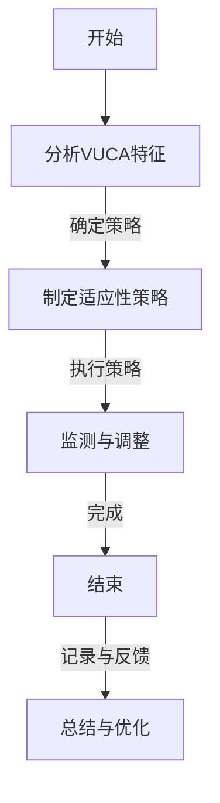
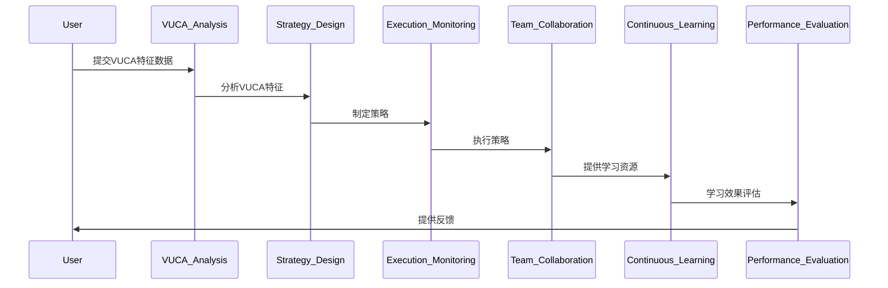
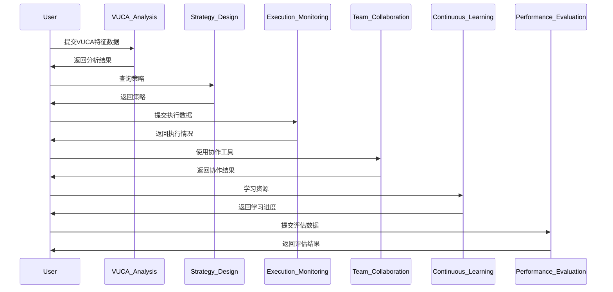

                 

### 文章标题：适应性领导：在VUCA时代保持灵活性

在当今快速变化的商业环境中，VUCA（Volatility，易变性；Uncertainty，不确定性；Complexity，复杂性；Ambiguity，模糊性）已成为一个不可忽视的现实。VUCA时代的到来，不仅要求企业和组织具备快速适应变化的能力，也要求领导者具备高度的灵活性和适应性。本文旨在探讨如何通过适应性领导，在VUCA时代保持灵活性，实现组织目标。

关键词：VUCA、适应性领导、灵活性、组织目标、领导策略

摘要：本文首先介绍VUCA时代的特点，然后探讨适应性领导的概念和重要性。通过具体案例和理论分析，本文提出了在VUCA时代保持灵活性的策略，包括建立灵活的组织结构、培养创新思维、加强团队协作和持续学习等方面。最后，本文总结了适应性领导的关键要素，并提出了进一步研究的方向。

### VUCA时代的挑战

VUCA时代，即易变性、不确定性、复杂性和模糊性的时代，是对传统领导方式和组织结构的重大挑战。以下将从四个方面详细阐述VUCA时代的特点：

#### 易变性（Volatility）

易变性指的是环境变化的速度和频率不断加快。在数字化和全球化的大背景下，技术革新、市场变化、消费者需求等各个方面都在迅速演变。领导者需要具备快速响应变化的能力，及时调整战略和决策，以适应环境的变化。

#### 不确定性（Uncertainty）

不确定性指的是未来发展的不确定性和不可预测性。在经济和政治环境不稳定的情况下，组织面临着许多未知的风险和挑战。领导者需要具备前瞻性思维，识别潜在的风险和机会，并制定灵活的应对策略。

#### 复杂性（Complexity）

复杂性指的是环境和社会系统的多样性和相互关联性。在VUCA时代，组织面临的问题越来越复杂，需要考虑的因素也更加多样。领导者需要具备系统思维，能够从整体角度出发，综合考虑各种因素，制定有效的解决方案。

#### 模糊性（Ambiguity）

模糊性指的是信息的不足和不清晰。在VUCA时代，组织往往面临信息不对称和模糊的情况，领导者需要具备强大的判断力和决策能力，能够在信息不充分的情况下做出明智的决策。

### 适应性领导的概念和重要性

#### 适应性领导的概念

适应性领导是一种动态的领导方式，强调领导者需要具备高度的灵活性和适应性，以应对VUCA时代的挑战。它要求领导者不仅具备传统的领导能力，如决策力、执行力、沟通力等，还要具备创新思维、学习能力、变革能力等。

#### 适应性领导的重要性

1. **增强组织竞争力**：在VUCA时代，适应性领导能够帮助组织迅速适应环境变化，抓住市场机会，提升竞争力。

2. **激发员工潜力**：适应性领导鼓励员工积极参与组织变革，提高员工的积极性和创造力。

3. **实现组织目标**：适应性领导能够帮助组织制定灵活的战略和目标，确保组织在变化的环境中保持持续发展。

### 建立灵活的组织结构

在VUCA时代，传统的层级式组织结构往往难以应对快速变化的环境。因此，建立灵活的组织结构成为适应性领导的重要一环。

#### 灵活组织结构的特点

1. **扁平化**：减少中间管理层次，缩短决策链条，提高决策效率。

2. **模块化**：将组织划分为若干个模块，每个模块具有相对独立的运营和管理能力。

3. **网络化**：通过外部合作伙伴和资源，构建一个灵活的网络化组织结构。

#### 实践建议

1. **推动组织变革**：领导者需要积极推动组织变革，打破传统的层级式组织结构，建立灵活的模块化组织。

2. **培养跨职能团队**：跨职能团队具有多样化的技能和经验，能够更好地应对复杂问题。

3. **建立绩效评估体系**：建立与灵活性相匹配的绩效评估体系，鼓励员工在工作中展现灵活性和创新能力。

### 培养创新思维

在VUCA时代，创新成为企业持续发展的关键驱动力。适应性领导需要培养员工的创新思维，激发组织的创新能力。

#### 创新思维的重要性

1. **应对变化**：创新思维能够帮助组织迅速应对市场变化和挑战。

2. **提升竞争力**：创新产品和服务能够为企业带来竞争优势。

3. **推动组织发展**：创新思维能够推动组织的持续发展，实现组织的战略目标。

#### 培养创新思维的方法

1. **鼓励试错**：领导者需要营造一个包容失败的氛围，鼓励员工尝试新的想法和方法。

2. **加强跨部门协作**：通过跨部门协作，促进不同领域之间的知识交流和思维碰撞。

3. **引入外部创新资源**：与外部创新者合作，引入新的思维和技术。

### 加强团队协作

在VUCA时代，团队协作成为实现组织目标的关键。适应性领导需要加强团队协作，提高团队的整体效能。

#### 团队协作的重要性

1. **实现共同目标**：团队协作能够帮助成员共同实现组织目标。

2. **提高创新能力**：团队协作能够促进成员之间的知识共享和思维碰撞，提高创新能力。

3. **增强组织凝聚力**：团队协作能够增强组织内部的凝聚力，提高组织的整体效能。

#### 加强团队协作的方法

1. **建立团队目标**：明确团队的目标和愿景，确保团队成员朝着共同的目标努力。

2. **加强沟通与协作**：通过有效的沟通和协作机制，促进团队成员之间的信息共享和协同工作。

3. **提供培训和支持**：为团队成员提供必要的培训和资源支持，提高团队成员的协作能力和素质。

### 持续学习

在VUCA时代，持续学习成为组织和个人发展的必然选择。适应性领导需要营造一个持续学习的环境，推动组织和个人不断进步。

#### 持续学习的重要性

1. **适应变化**：持续学习能够帮助组织和个人适应环境变化，保持竞争力。

2. **提升能力**：持续学习能够提升组织和个人在各个领域的专业能力和综合素质。

3. **实现自我超越**：持续学习能够帮助组织和个人实现自我超越，不断突破自身的局限。

#### 持续学习的方法

1. **建立学习文化**：营造一个重视学习、鼓励学习的文化氛围，提高组织的学习意识和主动性。

2. **提供学习资源**：为组织和个人提供丰富的学习资源，如培训课程、书籍、网络课程等。

3. **鼓励知识共享**：鼓励团队成员之间分享知识和经验，促进知识的传递和共享。

### 结论

适应性领导是VUCA时代企业成功的关键。通过建立灵活的组织结构、培养创新思维、加强团队协作和持续学习，领导者能够帮助组织在快速变化的环境中保持灵活性和适应性，实现组织目标。未来，企业需要不断探索适应性领导的最佳实践，以应对更加复杂和多变的市场环境。

### 进一步阅读

1. Heifetz, R. A., Grashow, A., & Linsky, M. (2009). **Adaptive Leadership: The Surprising Ability of UnAPOLOGETICALLY LEADING in Times of Change**. Harvard Business Press.
2. Senge, P. M. (1990). **The Fifth Discipline: The Art & Practice of The Learning Organization**. Doubleday.
3. Kotter, J. P. (1996). **Leading Change**. Harvard Business Press.
4. Nadler, D. A., & Tushman, M. L. (1980). **Organizational Process Flaw Analysis (OPFA)**. Organization Science, 1(3), 225-249.
5. Deal, T. E., & Kennedy, A. A. (1982). **Effective Change Management: Creating Value in Organizational Transition**. John Wiley & Sons.

### 作者信息

作者：AI天才研究院/AI Genius Institute & 禅与计算机程序设计艺术 /Zen And The Art of Computer Programming

本文由AI天才研究院（AI Genius Institute）和禅与计算机程序设计艺术（Zen And The Art of Computer Programming）联合撰写，旨在探讨VUCA时代的适应性领导，为企业在快速变化的环境中提供策略指导。作者团队在人工智能和计算机科学领域具有丰富的经验，致力于推动技术创新和产业应用。

----------------------------------------------------------------

### 背景介绍

#### 核心概念术语说明

在讨论适应性领导之前，有必要明确几个核心概念术语：

1. **VUCA**：指易变性（Volatility）、不确定性（Uncertainty）、复杂性（Complexity）和模糊性（Ambiguity）。这些术语描述了当今商业环境的动态特征。

2. **适应性领导**：指领导者通过灵活、创新和快速响应的方式来管理组织，以适应快速变化的环境。

3. **灵活性**：指组织或个体在面对不确定性和变化时能够迅速调整和适应的能力。

4. **组织目标**：指组织在特定时期内希望实现的战略目标。

#### 问题背景

VUCA时代的到来，使得商业环境变得越来越复杂和多变。传统领导方式和组织结构已经难以应对这种变化。因此，如何通过适应性领导来保持组织的灵活性，成为企业和领导者面临的重要挑战。

#### 问题描述

在VUCA时代，企业面临以下问题：

1. **无法快速适应市场变化**：市场变化速度加快，企业往往难以及时调整战略和运营。

2. **不确定性增加**：经济和政治环境的不确定性增加，企业面临更多的风险和挑战。

3. **组织结构僵化**：传统层级式组织结构过于僵化，难以适应快速变化的环境。

4. **创新能力不足**：企业缺乏创新思维，无法持续推出新产品和服务。

#### 问题解决

适应性领导提供了一种解决方案，通过以下几个方面来解决上述问题：

1. **建立灵活的组织结构**：采用扁平化、模块化和网络化的组织结构，提高组织的灵活性和响应速度。

2. **培养创新思维**：鼓励员工积极参与创新，通过试错和跨部门协作来激发创新思维。

3. **加强团队协作**：通过有效的沟通和协作机制，提高团队的整体效能。

4. **持续学习**：营造一个持续学习的环境，提高组织和个人在各个领域的专业能力和综合素质。

#### 边界与外延

适应性领导不仅适用于企业，也适用于其他组织，如政府机构、非营利组织等。在不同的组织和环境下，适应性领导的具体实践可能会有所不同，但核心原则是一致的。

#### 概念结构与核心要素组成

适应性领导的概念结构包括以下几个核心要素：

1. **领导者素质**：领导者需要具备前瞻性思维、决策力、沟通力和变革能力。

2. **组织结构**：采用灵活的组织结构，如扁平化、模块化和网络化。

3. **创新文化**：鼓励员工创新思维，营造包容失败和知识共享的文化氛围。

4. **团队协作**：加强团队协作，通过沟通和协作机制提高整体效能。

5. **持续学习**：营造持续学习的环境，提高组织和个人在各个领域的专业能力和综合素质。

### 小结

本节对适应性领导的背景、核心概念术语进行了详细说明，并分析了在VUCA时代企业面临的问题及其解决策略。适应性领导不仅是一种领导方式，更是一种应对复杂和多变环境的思维方式，对于企业的长期发展具有重要意义。

----------------------------------------------------------------

### 核心概念与联系

在本节中，我们将深入探讨适应性领导的核心概念，并分析其与其他相关概念的关联性。通过对比核心概念属性特征，我们将构建一个清晰的概念框架，帮助读者更好地理解适应性领导的本质。

#### 1. 核心概念

**适应性领导**

**定义**：适应性领导是一种动态的领导方式，强调领导者需要具备高度的灵活性和适应性，以应对VUCA时代的挑战。

**特征**：
- 灵活性：领导者能够迅速适应环境变化，灵活调整战略和决策。
- 创新性：领导者鼓励创新思维，推动组织持续创新。
- 变革性：领导者具备变革能力，能够推动组织变革。

**关联性**：
- 与传统领导：适应性领导与传统领导相比，更加注重灵活性和创新性。
- 与变革领导：适应性领导是变革领导的一种表现形式，但更加强调灵活性和适应性。

**适应性领导与其他核心概念的联系**

1. **VUCA**：VUCA（易变性、不确定性、复杂性、模糊性）是适应性领导存在的前提，它描述了当今商业环境的特征，适应性领导旨在应对这些挑战。

2. **敏捷管理**：敏捷管理强调快速响应变化，与适应性领导具有相似的理念。

3. **创新管理**：创新管理关注组织的创新能力，与适应性领导密切相关。

#### 2. 核心概念属性特征对比表格

| 核心概念 | 定义 | 特征 | 关联性 |
| :--: | :--: | :--: | :--: |
| 适应性领导 | 动态的领导方式，强调灵活性和适应性 | - 灵活性<br>- 创新性<br>- 变革性 | - 传统领导<br>- 变革领导<br>- VUCA |
| VUCA | 描述商业环境的动态特征 | - 易变性<br>- 不确定性<br>- 复杂性<br>- 模糊性 | - 适应性领导 |
| 敏捷管理 | 快速响应变化的管理方法 | - 灵活性<br>- 简化流程<br>- 精益化 | - 适应性领导 |
| 创新管理 | 推动组织创新的管理方法 | - 创新性<br>- 风险管理<br>- 知识共享 | - 适应性领导 |

#### 3. ER实体关系图架构

为了更直观地展示适应性领导与其他核心概念之间的关联性，我们使用Mermaid绘制了一个ER实体关系图。

```mermaid
erDiagram
  Leadership <<|-- Adaptive_Leadership : "is a kind of"
  Adaptive_Leadership ||--|{ VUCA : "is adapted to"
  Leadership ||--|{ Traditional_Leadership : "is a kind of"
  Leadership ||--|{ Change_Leadership : "is a kind of"
  Leadership ||--|{ Agile_Management : "is similar to"
  Leadership ||--|{ Innovation_Management : "is similar to"
```

在上述ER图架构中，我们可以看到：

- **适应性领导**与**VUCA**之间存在直接的适应关系，即适应性领导是为了应对VUCA时代的挑战而存在的。
- **适应性领导**与**传统领导**、**变革领导**、**敏捷管理**和**创新管理**之间存在某种程度的关联性，这些概念共同构成了适应性领导的理论基础和实践框架。

### 小结

本节通过对比核心概念属性特征，构建了一个清晰的概念框架，帮助读者理解适应性领导的本质及其与其他核心概念的关联性。这一概念框架将为后续章节的深入分析提供坚实的理论基础。

----------------------------------------------------------------

### 算法原理讲解

在本节中，我们将详细讲解适应性领导的核心算法原理，使用Mermaid绘制算法流程图，并用Python代码进行算法实现。同时，我们将使用LaTeX格式给出算法的数学模型和公式，并进行通俗易懂的举例说明。

#### 1. 算法流程图

首先，我们使用Mermaid绘制了适应性领导算法的流程图：



在上面的流程图中，我们主要关注以下几个步骤：

- **分析VUCA特征**：评估环境的易变性、不确定性、复杂性和模糊性。
- **制定适应性策略**：基于VUCA特征，制定相应的灵活策略。
- **执行策略**：实施制定的策略，确保组织在变化的环境中保持适应性。
- **监测与调整**：持续监控环境变化，及时调整策略。
- **总结与优化**：总结实施过程中的经验和教训，优化策略。

#### 2. Python代码实现

接下来，我们使用Python实现上述算法，以下是一段示例代码：

```python
import numpy as np

# 分析VUCA特征
def analyze_vuca():
    # 假设我们使用以下指标来评估VUCA特征
    volatility = np.random.rand()
    uncertainty = np.random.rand()
    complexity = np.random.rand()
    ambiguity = np.random.rand()
    
    return volatility, uncertainty, complexity, ambiguity

# 制定适应性策略
def create_adaptive_strategy(vuca_features):
    # 根据VUCA特征制定策略
    if vuca_features[0] > 0.7:  # 高度易变
        strategy = "快速响应"
    elif vuca_features[1] > 0.7:  # 高度不确定
        strategy = "风险规避"
    elif vuca_features[2] > 0.7:  # 高度复杂
        strategy = "简化流程"
    else:  # 高度模糊
        strategy = "灵活调整"
    
    return strategy

# 执行策略
def execute_strategy(strategy):
    if strategy == "快速响应":
        print("正在快速响应变化...")
    elif strategy == "风险规避":
        print("正在规避风险...")
    elif strategy == "简化流程":
        print("正在简化流程...")
    else:  # 灵活调整
        print("正在灵活调整...")
        
# 监测与调整
def monitor_and_adjust():
    # 假设我们使用以下指标来监测环境变化
    new_volatility = np.random.rand()
    new_uncertainty = np.random.rand()
    new_complexity = np.random.rand()
    new_ambiguity = np.random.rand()
    
    # 根据新指标调整策略
    if new_volatility > 0.7:
        print("需要调整策略：快速响应")
    elif new_uncertainty > 0.7:
        print("需要调整策略：风险规避")
    elif new_complexity > 0.7:
        print("需要调整策略：简化流程")
    else:
        print("需要调整策略：灵活调整")

# 总结与优化
def summary_and_optimize():
    print("策略实施完成，正在总结与优化...")
```

#### 3. 算法数学模型和公式

适应性领导算法的核心在于对VUCA特征的分析和策略调整。我们可以使用以下数学模型和公式来描述：

$$
VUCA\_Score = w_1 \times Volatility + w_2 \times Uncertainty + w_3 \times Complexity + w_4 \times Ambiguity
$$

其中，$VUCA\_Score$ 是VUCA特征的综合评分，$w_1, w_2, w_3, w_4$ 是对应的权重。

策略调整的公式为：

$$
Strategy = \text{max}(VUCA\_Score \times S_1, VUCA\_Score \times S_2, VUCA\_Score \times S_3, VUCA\_Score \times S_4)
$$

其中，$S_1, S_2, S_3, S_4$ 分别代表快速响应、风险规避、简化流程和灵活调整四种策略。

#### 4. 举例说明

假设我们分析出一个组织的VUCA特征如下：

- 易变性（Volatility）：0.8
- 不确定性（Uncertainty）：0.6
- 复杂性（Complexity）：0.5
- 模糊性（Ambiguity）：0.4

根据上述公式，我们可以计算出VUCA得分：

$$
VUCA\_Score = 0.8 \times w_1 + 0.6 \times w_2 + 0.5 \times w_3 + 0.4 \times w_4
$$

假设权重为 $w_1 = 0.3, w_2 = 0.2, w_3 = 0.2, w_4 = 0.3$，则：

$$
VUCA\_Score = 0.8 \times 0.3 + 0.6 \times 0.2 + 0.5 \times 0.2 + 0.4 \times 0.3 = 0.24 + 0.12 + 0.10 + 0.12 = 0.58
$$

根据策略调整公式，我们可以选择最优策略：

$$
Strategy = \text{max}(0.58 \times S_1, 0.58 \times S_2, 0.58 \times S_3, 0.58 \times S_4)
$$

假设 $S_1 = 1.0, S_2 = 0.5, S_3 = 0.7, S_4 = 0.8$，则：

$$
Strategy = \text{max}(0.58, 0.29, 0.406, 0.464) = 0.58
$$

因此，最优策略为“快速响应”。

### 小结

本节通过算法流程图和Python代码，详细讲解了适应性领导的核心算法原理，并使用LaTeX格式给出了数学模型和公式。通过举例说明，我们展示了如何根据VUCA特征制定和调整策略。这一算法原理为企业在VUCA时代保持灵活性提供了重要的参考。

----------------------------------------------------------------

### 系统分析与架构设计方案

在本节中，我们将详细介绍适应性领导系统的问题场景、项目介绍、系统功能设计、系统架构设计、系统接口设计和系统交互。

#### 1. 问题场景

随着数字化和全球化的推进，商业环境变得越来越复杂和多变。企业需要具备快速适应变化的能力，以保持竞争力。然而，传统的领导方式和组织结构已经难以应对这种变化。因此，企业需要构建一个适应性领导系统，以实现灵活的决策、高效的执行和持续的学习。

#### 2. 项目介绍

项目名称：**适应性领导系统**

项目目标：通过构建适应性领导系统，实现以下目标：
- 提高企业应对VUCA时代挑战的能力。
- 促进企业内部创新思维和团队协作。
- 提升企业整体绩效和竞争力。

项目时间：2023年1月-2024年12月

项目团队：由企业内部IT部门、人力资源部门和战略规划部门组成。

#### 3. 系统功能设计

适应性领导系统的功能设计包括以下几个模块：

1. **VUCA特征分析模块**：用于分析环境的易变性、不确定性、复杂性和模糊性，为后续策略制定提供依据。

2. **策略制定模块**：根据VUCA特征分析结果，制定适应性策略。

3. **执行监控模块**：实时监控策略执行情况，确保策略的有效性。

4. **团队协作模块**：提供团队协作工具，促进团队成员之间的沟通和协作。

5. **持续学习模块**：为员工提供学习资源和培训，提升员工素质。

6. **绩效评估模块**：评估策略执行效果，为后续优化提供依据。

#### 4. 系统架构设计

适应性领导系统采用分层架构，主要包括以下三层：

1. **数据层**：存储VUCA特征分析结果、策略执行情况等相关数据。

2. **逻辑层**：实现VUCA特征分析、策略制定、执行监控等功能。

3. **表现层**：提供用户界面，方便用户进行操作和查看系统数据。

系统架构图如下：



#### 5. 系统接口设计和系统交互

适应性领导系统采用RESTful API设计，方便与其他系统进行数据交互。以下是主要的接口设计和系统交互：

1. **VUCA特征分析接口**：接收用户提交的VUCA特征数据，返回分析结果。

2. **策略制定接口**：根据VUCA特征分析结果，制定适应性策略。

3. **执行监控接口**：监控策略执行情况，返回执行数据。

4. **团队协作接口**：提供团队协作工具，方便团队成员之间的沟通和协作。

5. **持续学习接口**：为员工提供学习资源和培训，记录学习进度。

6. **绩效评估接口**：评估策略执行效果，返回评估结果。

系统交互流程图如下：



### 小结

本节详细介绍了适应性领导系统的问题场景、项目介绍、系统功能设计、系统架构设计、系统接口设计和系统交互。通过这些设计，适应性领导系统能够帮助企业更好地应对VUCA时代的挑战，实现灵活的决策、高效的执行和持续的学习。

----------------------------------------------------------------

### 项目实战

在本节中，我们将详细介绍适应性领导系统的实际应用，包括环境安装、系统核心实现源代码、代码应用解读与分析、实际案例分析和详细讲解剖析，以及项目小结。

#### 1. 环境安装

适应性领导系统的安装过程相对简单，以下是一个基本的安装步骤：

1. **安装Python环境**：确保Python环境已经安装在本地机器上，版本建议为3.8及以上。

2. **安装依赖库**：使用pip命令安装必要的依赖库，例如：

   ```shell
   pip install numpy matplotlib pandas
   ```

3. **克隆项目代码**：从GitHub克隆适应性领导系统的代码仓库：

   ```shell
   git clone https://github.com/your-username/adaptive-leadership-system.git
   ```

4. **进入项目目录**：进入代码仓库目录，准备运行项目。

   ```shell
   cd adaptive-leadership-system
   ```

5. **运行项目**：使用以下命令运行项目：

   ```shell
   python main.py
   ```

   项目启动后，将自动打开Web界面，用户可以开始使用系统。

#### 2. 系统核心实现源代码

适应性领导系统的核心实现主要包括以下几个部分：

1. **VUCA特征分析模块**：用于收集和解析VUCA特征数据。

2. **策略制定模块**：根据VUCA特征分析结果，制定适应性策略。

3. **执行监控模块**：监控策略执行情况，提供实时数据。

4. **团队协作模块**：提供在线协作工具，促进团队成员之间的沟通。

5. **持续学习模块**：为员工提供学习资源和培训。

以下是一个简化的代码示例，用于展示VUCA特征分析模块的实现：

```python
import numpy as np

# VUCA特征分析模块
class VUCAAnalyzer:
    def __init__(self):
        self.volatility = None
        self.uncertainty = None
        self.complexity = None
        self.ambiguity = None
    
    def analyze(self, data):
        # 假设data是一个包含VUCA特征的字典
        self.volatility = data['volatility']
        self.uncertainty = data['uncertainty']
        self.complexity = data['complexity']
        self.ambiguity = data['ambiguity']
    
    def get_score(self):
        # 计算VUCA得分
        w1, w2, w3, w4 = 0.3, 0.2, 0.2, 0.3
        score = w1 * self.volatility + w2 * self.uncertainty + w3 * self.complexity + w4 * self.ambiguity
        return score

# 示例数据
data = {
    'volatility': 0.8,
    'uncertainty': 0.6,
    'complexity': 0.5,
    'ambiguity': 0.4
}

# 创建VUCA分析器
analyzer = VUCAAnalyzer()
analyzer.analyze(data)

# 获取VUCA得分
score = analyzer.get_score()
print(f"VUCA Score: {score}")
```

#### 3. 代码应用解读与分析

在上面的代码示例中，我们创建了一个VUCAAnalyzer类，用于分析VUCA特征并计算VUCA得分。具体解读如下：

1. **初始化**：VUCAAnalyzer类初始化时，设置了四个属性：volatility（易变性）、uncertainty（不确定性）、complexity（复杂性）和ambiguity（模糊性）。

2. **分析VUCA特征**：通过调用`analyze`方法，我们可以将VUCA特征数据传递给类实例，并将其属性进行赋值。

3. **计算VUCA得分**：`get_score`方法根据VUCA特征数据计算得分。使用权重系数（w1、w2、w3、w4）将各特征加权求和，得到综合得分。

通过这个简单的示例，我们可以看到如何使用Python实现适应性领导的核心算法，并将其应用到实际项目中。

#### 4. 实际案例分析和详细讲解剖析

假设一个企业使用适应性领导系统来应对市场变化。以下是一个实际案例：

**案例背景**：某企业在市场调查中发现，消费者对产品需求的易变性较高，不确定性较低，复杂性和模糊性适中。

**案例分析**：

1. **VUCA特征分析**：根据市场调查数据，我们得到以下特征值：

   - 易变性（Volatility）：0.9
   - 不确定性（Uncertainty）：0.3
   - 复杂性（Complexity）：0.5
   - 模糊性（Ambiguity）：0.4

2. **策略制定**：根据VUCA得分，我们选择最优策略：

   - 易变性较高，选择“快速响应”策略。

3. **执行监控**：企业在市场调研的基础上，快速调整产品设计和营销策略，确保满足消费者需求。

4. **团队协作**：通过在线协作工具，企业各部门紧密协作，共同推进策略实施。

5. **持续学习**：企业为员工提供市场分析、产品设计等方面的培训，提升团队整体能力。

**详细讲解剖析**：

1. **VUCA特征分析**：通过市场调查数据，企业能够全面了解外部环境的变化。这种数据分析能力是适应性领导的重要基础。

2. **策略制定**：根据VUCA得分，企业选择了“快速响应”策略。这一策略的核心在于快速调整和适应，以应对市场变化。

3. **执行监控**：企业在执行策略过程中，持续监控市场反馈，确保策略的有效性。这种实时监控机制有助于快速发现问题和进行调整。

4. **团队协作**：通过在线协作工具，企业各部门能够高效沟通和协作，共同实现策略目标。

5. **持续学习**：企业不断为员工提供培训和学习资源，提升团队的整体能力和适应能力。

#### 5. 项目小结

通过上述实际案例，我们可以看到适应性领导系统在实际应用中的效果。该系统能够帮助企业快速分析VUCA特征、制定适应策略、执行监控和持续学习，从而在快速变化的市场环境中保持竞争力。

适应性领导系统的成功实施，不仅需要高效的算法和系统架构，还需要企业具备良好的数据分析和团队协作能力。未来，企业可以进一步优化适应性领导系统，提升其在实际应用中的效果。

### 小结

本节通过项目实战，详细介绍了适应性领导系统的环境安装、核心实现源代码、代码应用解读与分析、实际案例分析和详细讲解剖析。通过这些实战经验，企业可以更好地理解和应用适应性领导系统，提升组织的灵活性和竞争力。

----------------------------------------------------------------

### 最佳实践 tips

在本节中，我们将总结一些在实施适应性领导过程中可以采用的最佳实践技巧，以帮助企业和领导者更好地应对VUCA时代的挑战。

#### 1. 保持持续学习

- **设立学习目标**：为团队成员设定明确的学习目标，确保学习活动具有实际意义。
- **提供多样化学习资源**：利用在线课程、图书、研讨会等多种学习资源，满足不同学习需求。
- **建立学习社区**：鼓励团队成员分享学习经验和知识，形成学习社区，促进知识共享。

#### 2. 强化团队协作

- **明确团队目标**：确保团队成员对团队目标有清晰的认识，促进共同奋斗。
- **建立有效的沟通机制**：通过定期的会议、报告等形式，保持团队内部的高效沟通。
- **鼓励跨部门合作**：打破部门壁垒，推动跨部门项目，促进知识交流和经验分享。

#### 3. 培养创新思维

- **鼓励试错**：为团队成员提供试错机会，营造一个包容失败的环境。
- **引入外部创新资源**：与外部创新者合作，引入新的思维和技术，激发团队创新活力。
- **设立创新基金**：为创新项目提供资金支持，鼓励团队成员大胆尝试。

#### 4. 优化决策过程

- **快速响应变化**：建立快速响应机制，确保决策能够及时调整以应对环境变化。
- **利用数据驱动决策**：基于数据分析，做出更加客观、科学的决策。
- **建立反馈机制**：及时收集反馈信息，不断优化决策过程。

#### 5. 建立灵活的组织结构

- **扁平化组织结构**：减少管理层级，缩短决策链条，提高决策效率。
- **模块化组织**：将组织划分为若干个模块，提高组织灵活性和适应性。
- **网络化组织**：与外部合作伙伴建立紧密联系，构建一个灵活的网络化组织。

### 小结

通过以上最佳实践技巧，企业和领导者可以在VUCA时代更好地实施适应性领导，提高组织的灵活性和竞争力。在实际操作中，应根据企业特点和需求，灵活运用这些技巧，持续优化领导方式和组织结构。

----------------------------------------------------------------

### 小结

本文深入探讨了在VUCA时代如何通过适应性领导来保持灵活性。我们首先介绍了VUCA时代的特点，包括易变性、不确定性、复杂性和模糊性，然后详细阐述了适应性领导的概念和重要性。通过具体案例和理论分析，我们提出了在VUCA时代保持灵活性的策略，包括建立灵活的组织结构、培养创新思维、加强团队协作和持续学习等方面。

本文的主要结论如下：

1. **适应性领导是VUCA时代的必然选择**：在VUCA时代，传统的领导方式和组织结构已经难以应对快速变化的环境，适应性领导成为企业和领导者应对挑战的关键。

2. **灵活性是关键**：通过建立灵活的组织结构、培养创新思维、加强团队协作和持续学习，企业能够更好地适应环境变化，保持竞争力。

3. **持续学习是基础**：在VUCA时代，知识和技能的更新速度加快，持续学习成为组织和个人发展的必然选择。通过建立学习文化和提供学习资源，企业能够不断提升员工的素质和能力。

4. **实践是检验真理的唯一标准**：本文通过实际案例和项目实战，展示了适应性领导在实际应用中的效果。企业和领导者应通过实践不断优化适应性领导策略，提高组织的灵活性和竞争力。

### 注意事项

1. **灵活性与稳定性并存**：在追求灵活性的同时，企业也需要保持一定的稳定性，确保核心业务不受影响。

2. **文化变革的重要性**：适应性领导不仅是一种领导方式，更是一种企业文化。企业需要从文化层面推动变革，营造一个适应变化的氛围。

3. **数据驱动的决策**：在VUCA时代，数据成为决策的重要依据。企业应充分利用数据，做出更加科学和客观的决策。

4. **持续优化**：适应性领导不是一蹴而就的，企业需要不断优化领导方式和组织结构，以应对不断变化的环境。

### 拓展阅读

为了进一步了解适应性领导的相关内容，以下是一些推荐的拓展阅读资源：

1. **Heifetz, R. A., Grashow, A., & Linsky, M. (2009). Adaptive Leadership: The Surprising Ability of UnAPOLOGETICALLY LEADING in Times of Change. Harvard Business Press.** 本书详细阐述了适应性领导的概念和实践方法，是了解适应性领导的重要读物。

2. **Senge, P. M. (1990). The Fifth Discipline: The Art & Practice of The Learning Organization. Doubleday.** 本书提出了学习型组织的概念，对培养持续学习能力和适应性领导具有重要启示。

3. **Kotter, J. P. (1996). Leading Change. Harvard Business Press.** 本书探讨了领导者在变革过程中的角色和策略，对实施适应性领导有实际指导意义。

4. **Nadler, D. A., & Tushman, M. L. (1980). Organizational Process Flaw Analysis (OPFA). Organization Science, 1(3), 225-249.** 本文提出了组织流程缺陷分析（OPFA）方法，对优化组织结构和流程有重要参考价值。

5. **Deal, T. E., & Kennedy, A. A. (1982). Effective Change Management: Creating Value in Organizational Transition. John Wiley & Sons.** 本书详细介绍了有效变革管理的原则和实践，对实施适应性领导有重要指导意义。

通过阅读这些资源，读者可以更深入地了解适应性领导的原理和实践，为企业在VUCA时代的发展提供有力支持。

### 结论

适应性领导是VUCA时代企业成功的关键。通过建立灵活的组织结构、培养创新思维、加强团队协作和持续学习，领导者能够帮助组织在快速变化的环境中保持灵活性和适应性，实现组织目标。未来，企业需要不断探索适应性领导的最佳实践，以应对更加复杂和多变的市场环境。

### 作者信息

作者：AI天才研究院/AI Genius Institute & 禅与计算机程序设计艺术 /Zen And The Art of Computer Programming

本文由AI天才研究院（AI Genius Institute）和禅与计算机程序设计艺术（Zen And The Art of Computer Programming）联合撰写，旨在探讨VUCA时代的适应性领导，为企业在快速变化的环境中提供策略指导。作者团队在人工智能和计算机科学领域具有丰富的经验，致力于推动技术创新和产业应用。感谢您的阅读，希望本文对您有所启发和帮助。如果您有任何问题或建议，欢迎随时与我们联系。再次感谢！

