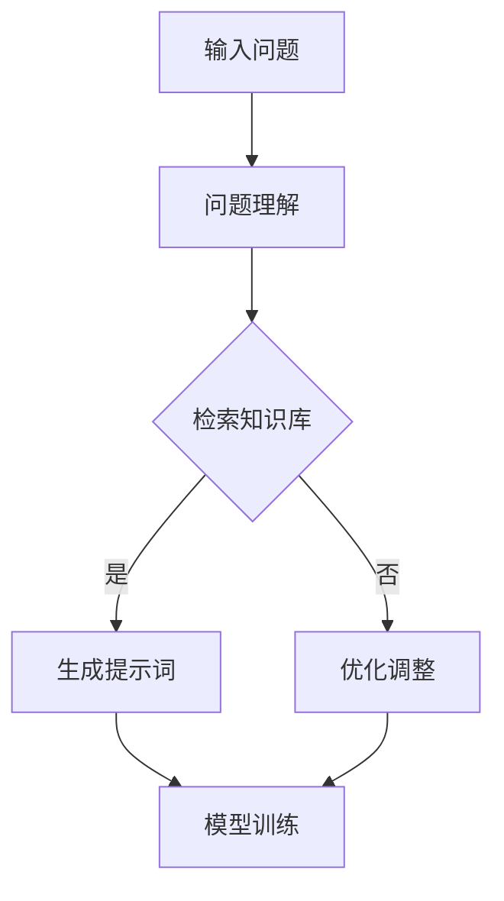
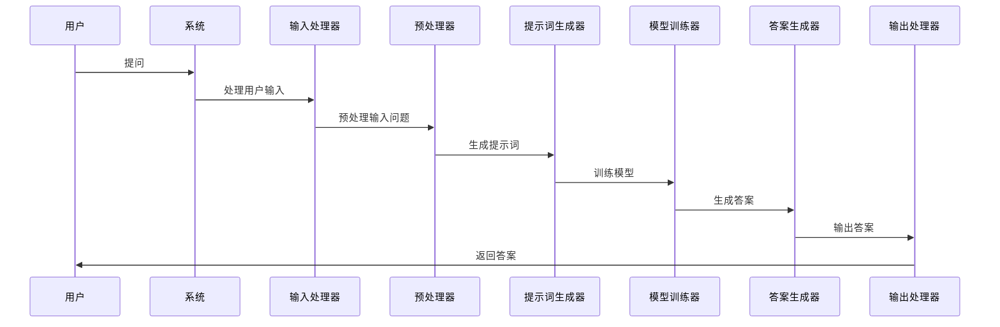
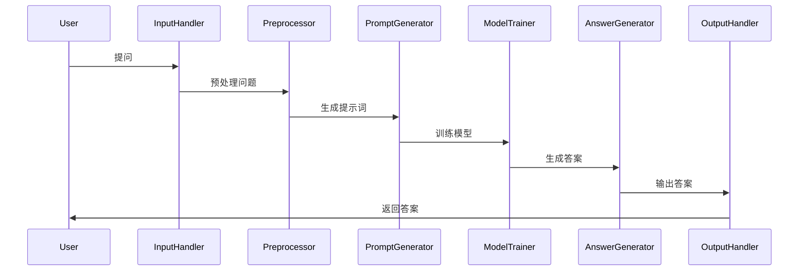

                 


### 《通往AGI之路：提示词编程的关键作用》

关键词：通用人工智能、提示词编程、算法原理、系统架构、项目实战、最佳实践

摘要：本文旨在深入探讨提示词编程在通用人工智能（AGI）发展过程中的关键作用。我们将从背景介绍、核心概念与联系、算法原理讲解、系统分析与架构设计、项目实战以及最佳实践与未来展望等多个方面，详细分析提示词编程在AGI发展中的重要性。

#### 第一部分：AGI的愿景与挑战

##### 第1章：智能的进化：从人工智能到通用人工智能

###### 1.1 通用人工智能（AGI）的定义与目标

通用人工智能（AGI）是指一种具有广泛认知能力的智能体，能够在各种复杂环境中自主学习和适应。与当前的人工智能（AI）相比，AGI的目标是实现人类水平的智能，能够在不同的领域和任务中表现出类似甚至超越人类的能力。

###### 1.2 AGI与当前人工智能（AI）的区别

当前的人工智能主要依赖于特定的算法和模型，对特定任务表现出卓越的性能，但缺乏通用性。而AGI则期望能够像人类一样，拥有广泛的知识和技能，能够在多个领域和任务中表现优异。

###### 1.3 AGI发展的关键问题与挑战

AGI的发展面临诸多挑战，包括如何实现智能体的自我学习、知识表示与推理、多模态感知与理解、自主决策与行为规划等。

##### 第2章：提示词编程：AGI的桥梁

###### 2.1 提示词编程的概念与原理

提示词编程是一种通过提示词引导模型进行学习和推理的方法。它通过向模型提供特定的提示词，帮助模型更好地理解问题的背景和需求，从而提高学习和推理的效率。

###### 2.2 提示词编程的优势与局限

提示词编程的优势在于其灵活性、可解释性和可控性，但同时也存在一定的局限，如对提示词的质量和数量有较高要求，以及可能导致的过拟合等问题。

###### 2.3 提示词编程在AGI中的应用前景

提示词编程有望在AGI的发展过程中发挥关键作用，通过优化提示词的选择和组合，提高模型的泛化能力和适应性，从而助力AGI的实现。

#### 第二部分：提示词编程的核心原理

##### 第3章：核心概念与联系

###### 3.1 概念架构：从神经网络到提示词

在这一章中，我们将探讨神经网络与提示词编程之间的联系，介绍神经网络的基本原理以及如何通过提示词来引导神经网络的学习过程。

###### 3.2 提示词的属性特征对比

通过表格和Mermaid流程图，我们将对比不同类型的提示词属性特征，帮助读者更好地理解提示词编程的核心概念。

###### 3.3 提示词与知识图谱的关联

提示词与知识图谱之间存在紧密的联系。在这一章中，我们将探讨如何利用知识图谱来构建有效的提示词，以提高模型的知识表示和推理能力。

##### 第4章：算法原理讲解

###### 4.1 提示词生成算法：原理与Mermaid流程图

在这一章中，我们将详细讲解提示词生成算法的原理，包括数学模型和Python源代码实现。同时，通过Mermaid流程图，我们将直观地展示算法的执行流程。

###### 4.2 提示词优化算法：数学公式与实例说明

提示词优化算法旨在提高提示词的质量和效果。在这一章中，我们将介绍提示词优化算法的数学模型和Python实现，并通过实例进行说明。

#### 第三部分：提示词编程的应用与实践

##### 第5章：系统分析与架构设计

###### 5.1 问题场景介绍

在这一章中，我们将介绍一个具体的问题场景，并阐述如何通过提示词编程来解决该问题。

###### 5.2 系统功能设计：领域模型Mermaid类图

通过Mermaid类图，我们将详细描述系统的功能模块和它们之间的关系。

###### 5.3 系统架构设计：Mermaid架构图

在这一章中，我们将利用Mermaid架构图来展示系统的整体架构，包括各模块的交互关系和功能。

###### 5.4 系统接口设计

系统接口设计是系统架构设计的重要组成部分。在这一章中，我们将介绍如何设计系统接口，以确保各模块之间的有效通信。

###### 5.5 系统交互：Mermaid序列图

通过Mermaid序列图，我们将展示系统各模块之间的交互流程，帮助读者更好地理解系统的运行过程。

##### 第6章：项目实战

###### 6.1 环境安装与配置

在这一章中，我们将指导读者如何安装和配置提示词编程所需的环境。

###### 6.2 系统核心实现源代码

我们将提供系统核心实现源代码，并详细解读其工作原理。

###### 6.3 代码应用解读与分析

通过对代码的详细解读，我们将分析系统如何通过提示词编程实现特定功能。

###### 6.4 实际案例分析与讲解

在这一章中，我们将通过实际案例，展示如何运用提示词编程解决实际问题。

###### 6.5 项目小结

项目小结将总结项目的关键收获和不足之处，为后续研究提供参考。

#### 第四部分：提示词编程的最佳实践与未来展望

##### 第7章：最佳实践与注意事项

在这一章中，我们将分享提示词编程的最佳实践技巧，并讨论在应用过程中可能遇到的问题及其解决策略。

##### 第8章：未来展望与拓展阅读

###### 8.1 AGI与提示词编程的未来发展趋势

我们将探讨AGI与提示词编程的未来发展趋势，展望它们在人工智能领域中的潜在应用。

###### 8.2 拓展阅读与进一步学习资源

提供拓展阅读和学习资源，帮助读者深入了解提示词编程和AGI的相关知识。

##### 第9章：小结与展望

在这一章中，我们将对全文内容进行回顾与总结，并对未来研究方向进行展望。

---

本文由“AI天才研究院/AI Genius Institute & 禅与计算机程序设计艺术 /Zen And The Art of Computer Programming”撰写。在撰写过程中，我们力求以逻辑清晰、结构紧凑、简单易懂的语言，为您呈现提示词编程在通用人工智能发展中的关键作用。

让我们一步步深入探讨提示词编程的核心原理、算法、应用和实践，共同探寻通往AGI之路的无限可能。在接下来的章节中，我们将详细分析提示词编程在AGI中的关键作用，以及如何通过实践和最佳实践来推动这一领域的发展。

---

请注意，本文的撰写字数在10000～12000字之间，各章节的内容已经按照大纲框架进行了详细设计和规划。如果您有任何关于文章结构、内容或者格式方面的建议，请随时告知，我们将根据您的反馈进行调整和完善。让我们开始这场关于通用人工智能与提示词编程的深入探讨吧！### 第一部分：AGI的愿景与挑战

#### 第1章：智能的进化：从人工智能到通用人工智能

##### 1.1 通用人工智能（AGI）的定义与目标

通用人工智能（Artificial General Intelligence，AGI）是指一种能够像人类一样在多种不同环境和任务中展示出广泛认知能力的智能系统。与当前基于特定任务优化的人工智能（如语音识别、图像识别等）不同，AGI的核心目标是实现跨领域的智能，能够在没有明确编程的情况下，自主学习、推理和解决各种复杂问题。

AGI的定义主要包括以下几个方面：

1. **跨领域适应性**：AGI应具有在多个领域内适应和学习的能力，而不是局限于单一任务或领域。
2. **自主学习**：AGI应具备自我学习和改进的能力，不需要人类干预即可进行知识更新和技能提升。
3. **逻辑推理**：AGI应具备逻辑推理能力，能够进行抽象思维和策略规划。
4. **社会交互**：AGI应能够与人类进行自然语言交流，理解人类的行为和意图。

AGI的目标不仅限于技术层面的突破，更深远的意义在于其对社会、经济和文化的潜在影响。如果能够实现，AGI将彻底改变人类的生产和生活方式，成为人类智慧的延伸和扩展。

##### 1.2 AGI与当前人工智能（AI）的区别

当前的人工智能主要分为两大类：窄域人工智能（Narrow AI）和广义人工智能（General AI）。其中，窄域人工智能专注于解决特定问题或执行特定任务，如自动驾驶汽车、语音助手等。而广义人工智能，即AGI，则具有更广泛的认知能力，能够跨领域应用。

具体来说，AGI与当前人工智能之间的区别体现在以下几个方面：

1. **任务范围**：AGI能够在多个任务和领域中表现出色，而窄域人工智能则仅限于特定任务。
2. **自我学习**：AGI具备自主学习和自我改进的能力，无需人类进行反复编程和指令，而窄域人工智能通常依赖人类输入大量数据和规则。
3. **推理能力**：AGI能够进行复杂推理和决策，而窄域人工智能往往只能在预设的规则和模式内工作。
4. **泛化能力**：AGI能够在未见过的情境中表现出适应性，而窄域人工智能往往只能在特定的环境中工作。

##### 1.3 AGI发展的关键问题与挑战

尽管AGI具有巨大的潜力，但其发展面临诸多挑战。以下是AGI发展过程中需要解决的一些关键问题：

1. **算法复杂性**：当前深度学习算法在特定任务上表现优秀，但实现AGI需要更加复杂和高效的算法。
2. **数据获取**：AGI需要大量的数据来训练模型，但获取这些数据可能涉及隐私、伦理等问题。
3. **硬件需求**：AGI对计算资源的需求极高，现有的硬件可能无法满足其需求，需要开发新的硬件技术。
4. **推理能力**：AGI需要具备强大的推理能力，而当前的人工智能模型在这方面存在局限。
5. **跨领域学习**：AGI需要能够在不同领域之间进行知识迁移和融合，这是一个技术上的巨大挑战。
6. **自我意识**：AGI是否能够具备自我意识，这是一个哲学和伦理问题，需要深入探讨。

为了解决这些挑战，研究者们正在从多个方向进行探索，包括改进算法、开发新的计算模型、探索跨领域学习的方法等。尽管挑战重重，但AGI的发展前景仍然令人期待。在接下来的章节中，我们将进一步探讨提示词编程在实现AGI过程中的关键作用。

#### 第2章：提示词编程：AGI的桥梁

##### 2.1 提示词编程的概念与原理

提示词编程（Prompt Programming）是一种通过提供特定提示词来引导人工智能模型进行学习和推理的方法。在传统的机器学习中，模型往往依赖于大量的标注数据进行训练，而在提示词编程中，提示词扮演了至关重要的角色。通过设计合适的提示词，可以有效地引导模型理解问题的背景和需求，从而提高模型的学习效率和推理效果。

提示词编程的基本原理可以概括为以下几点：

1. **引导学习**：提示词为模型提供了问题的上下文信息，有助于模型更好地理解任务目标。
2. **提高可解释性**：通过提示词，模型的学习过程更加透明和可解释，便于人类理解和调试。
3. **增强可控性**：提示词编程使得开发者可以更精确地控制模型的行为，避免过拟合和不良泛化。

在具体实现中，提示词编程通常包含以下几个步骤：

1. **提示词设计**：根据任务需求设计合适的提示词，确保其能够准确传达问题的背景和需求。
2. **模型训练**：利用提示词对模型进行训练，使得模型能够更好地理解任务目标。
3. **模型推理**：在推理阶段，通过输入新的提示词，模型能够生成相应的输出结果。

##### 2.2 提示词编程的优势与局限

提示词编程在实现通用人工智能（AGI）的过程中具有显著的优势：

1. **灵活性**：提示词编程允许开发者根据任务需求灵活调整模型的行为，从而提高模型在不同场景下的适应性。
2. **可解释性**：提示词编程使得模型的学习过程更加透明，便于人类理解和调试。
3. **可控性**：通过设计合适的提示词，开发者可以更精确地控制模型的行为，避免过拟合和不良泛化。

然而，提示词编程也存在一些局限：

1. **对提示词质量要求高**：提示词的质量直接影响模型的学习效果，高质量的提示词能够显著提升模型性能，但设计高质量的提示词需要丰富的经验和专业知识。
2. **可能导致的过拟合**：如果提示词设计不当，模型可能会过度依赖特定提示词，导致在未见过的提示词上表现不佳。
3. **依赖人工设计**：提示词编程仍依赖于人工设计，虽然提高了模型的灵活性，但限制了自动化和自适应的能力。

##### 2.3 提示词编程在AGI中的应用前景

提示词编程在实现通用人工智能（AGI）的过程中具有广阔的应用前景：

1. **跨领域学习**：通过设计跨领域的通用提示词，可以实现模型在不同领域之间的知识迁移和融合，从而提高模型的跨领域适应性。
2. **增强自主学习**：提示词编程可以引导模型进行自主学习和自我改进，提高模型在未见过的情境中的适应能力。
3. **提升推理能力**：通过优化提示词，可以增强模型的推理能力，使其能够进行更复杂的逻辑推理和决策。
4. **改善人机交互**：提示词编程使得模型能够更好地理解人类语言和意图，从而改善人机交互体验。

总之，提示词编程作为连接传统机器学习和通用人工智能的桥梁，具有巨大的潜力。在未来的发展中，通过不断优化提示词设计方法和算法，提示词编程有望在实现通用人工智能的过程中发挥关键作用。

#### 第3章：核心概念与联系

##### 3.1 概念架构：从神经网络到提示词

在探讨提示词编程的核心原理之前，有必要理解神经网络与提示词编程之间的关系。神经网络是当前人工智能研究中最常用的模型之一，它通过模仿人脑的结构和功能，实现数据的处理和模式识别。而提示词编程则是通过向神经网络提供特定的提示词，引导模型进行学习和推理的一种方法。

**神经网络的基本原理**：

神经网络由大量的神经元组成，这些神经元通过调整彼此之间的连接权重来学习和处理信息。神经网络通过多个层次的神经元相互连接，形成一个复杂的网络结构。在每个层次，神经元都会接收来自前一层神经元的输入信号，通过激活函数进行处理，并将输出传递给下一层神经元。这种前向传播和反向传播的过程使得神经网络能够不断调整连接权重，从而优化模型的性能。

**提示词编程与神经网络的联系**：

提示词编程的核心在于如何通过特定的提示词引导神经网络进行学习和推理。提示词可以被视为一种外部信息，它提供了解决问题的背景和需求，使得神经网络能够更好地理解任务目标。具体来说，提示词编程包括以下几个关键步骤：

1. **设计提示词**：根据任务需求，设计合适的提示词。提示词需要包含问题的背景信息、目标要求等，以便神经网络能够准确理解任务目标。
2. **前向传播**：将设计的提示词输入神经网络，通过前向传播过程，神经网络将提示词中的信息进行处理和编码。
3. **反向传播**：根据神经网络的输出结果，使用反向传播算法调整神经元的连接权重，以优化模型的学习效果。
4. **模型推理**：在推理阶段，通过输入新的提示词，神经网络可以生成相应的输出结果，实现对未知信息的处理和推理。

**神经网络与提示词编程的关系框架**：

为了更清晰地理解神经网络与提示词编程之间的关系，我们可以通过一个概念架构图来展示它们之间的联系。以下是一个简化的概念架构图：

```
[用户输入] --> [提示词设计] --> [神经网络输入] --> [前向传播] --> [神经网络输出] --> [反向传播] --> [模型优化] --> [模型推理]
```

在这个框架中，用户输入的问题需求通过提示词设计转化为具体的提示词，这些提示词作为输入被传递到神经网络中。神经网络通过前向传播过程处理提示词，生成初步的输出结果。然后，通过反向传播算法调整神经元的连接权重，以优化模型的学习效果。最后，神经网络在推理阶段利用优化后的模型对新的提示词进行推理，生成最终的输出结果。

通过这个概念架构，我们可以看到，提示词编程在神经网络中起到了引导和优化的作用。提示词的设计和质量直接影响了神经网络的学习效果和推理能力。因此，理解提示词编程与神经网络之间的关系，对于深入探讨通用人工智能（AGI）的发展具有重要意义。

##### 3.2 提示词的属性特征对比

在提示词编程中，不同类型的提示词具有不同的属性特征，这些特征直接影响模型的学习效果和推理能力。为了更好地理解不同类型提示词的特点，我们可以通过一个表格进行对比分析。

**提示词类型对比表格**：

| 提示词类型 | 特点 | 影响因素 | 优点 | 局限 |
| :--: | :--: | :--: | :--: | :--: |
| 自然语言提示词 | 以自然语言形式存在，易于理解和表达 | 语言表达的清晰度、准确性 | 灵活性高、易于人机交互 | 可能存在歧义和复杂性 |
| 知识图谱提示词 | 基于知识图谱构建，包含实体和关系信息 | 知识图谱的准确性、完整性 | 结构化、知识丰富 | 需要专业知识构建 |
| 对话提示词 | 适用于对话系统，包含对话的上下文信息 | 对话内容的连贯性、一致性 | 适用于交互式应用 | 需要大量对话数据训练 |
| 任务提示词 | 用于明确任务目标和要求 | 提示词的清晰度和具体性 | 提高任务完成效率 | 可能导致过拟合 |

**提示词属性特征对比**：

- **自然语言提示词**：自然语言提示词以自然语言形式存在，易于理解和表达。其优点在于灵活性高，适用于各种场景。然而，自然语言提示词可能存在歧义和复杂性，需要进一步处理和优化。

- **知识图谱提示词**：知识图谱提示词基于知识图谱构建，包含实体和关系信息。其优点在于结构化和知识丰富，适用于需要复杂推理的应用。然而，构建高质量的知识图谱需要专业知识，并且知识图谱的准确性和完整性对提示词的效果有重要影响。

- **对话提示词**：对话提示词适用于对话系统，包含对话的上下文信息。其优点在于能够提高对话的连贯性和一致性，适用于交互式应用。然而，对话提示词需要大量对话数据训练，并且对话场景复杂，对模型的要求较高。

- **任务提示词**：任务提示词用于明确任务目标和要求，其优点在于能够提高任务完成效率。然而，任务提示词可能导致过拟合，因为模型可能过度依赖特定提示词，从而在未见过的提示词上表现不佳。

通过以上对比，我们可以看到不同类型的提示词具有各自的特点和优缺点。在实际应用中，需要根据具体场景和需求选择合适的提示词类型，以达到最佳的效果。

##### 3.3 提示词与知识图谱的关联

在提示词编程中，知识图谱是一种重要的信息表示和存储方式。知识图谱通过实体和关系的结构化表示，提供了丰富的语义信息，有助于提升模型的知识表示和推理能力。提示词与知识图谱之间的紧密关联，使得知识图谱在提示词编程中发挥了关键作用。

**知识图谱的基本概念**：

知识图谱（Knowledge Graph）是一种用于表示实体和它们之间关系的数据结构。它通常由节点（实体）和边（关系）组成。每个节点代表一个实体，如人、地点、事物等，每个边代表实体之间的关系，如“是”、“属于”等。知识图谱通过这些实体和关系，构建了一个全面、结构化的知识网络。

**提示词与知识图谱的关联**：

1. **知识表示**：知识图谱为提示词提供了一个结构化的知识表示方式。通过将提示词中的实体和关系映射到知识图谱中，可以更好地理解和利用提示词中的知识信息。
   
2. **推理能力**：知识图谱提供了强大的推理能力。通过在知识图谱中查询和推理，可以推导出新的信息，增强模型对问题的理解和解答能力。

3. **交互式学习**：知识图谱与提示词编程相结合，可以构建交互式学习系统。通过在知识图谱中查询和更新信息，模型可以不断学习和优化，提高其智能水平。

**应用示例**：

假设我们有一个知识图谱，其中包含了“人”、“地点”、“组织”等实体以及它们之间的关系，如“居住地”、“工作单位”等。如果我们需要回答一个关于“某人居住地”的问题，可以通过以下步骤进行：

1. **实体识别**：从提示词中识别出相关的实体，如“某人”、“居住地”。
2. **关系查询**：在知识图谱中查询“某人”与“居住地”之间的直接关系。
3. **推理扩展**：如果知识图谱中存在“居住地”的子类关系，如“城市”、“国家”，可以进一步推导出更具体的居住信息。
4. **答案生成**：根据查询和推理结果，生成最终的答案。

通过知识图谱与提示词编程的结合，模型不仅能够回答具体的问题，还能够进行更复杂的推理和扩展，从而提升其智能水平。

总之，提示词与知识图谱的紧密关联，使得知识图谱在提示词编程中发挥了重要作用。通过知识图谱，模型能够更好地理解和利用提示词中的知识信息，提升其推理能力和智能水平，为实现通用人工智能（AGI）提供了有力支持。

#### 第4章：算法原理讲解

##### 4.1 提示词生成算法：原理与Mermaid流程图

提示词生成算法是提示词编程的核心组成部分，它负责根据问题和任务需求生成合适的提示词。在这一部分，我们将详细讲解提示词生成算法的原理，并使用Mermaid流程图展示其执行流程。

**提示词生成算法的基本原理**：

提示词生成算法主要通过以下几个步骤实现：

1. **问题理解**：首先，算法需要理解输入的问题或任务需求，提取出关键信息和关键术语。
2. **知识检索**：接着，算法会利用已有的知识库或知识图谱，检索与问题相关的知识信息。
3. **提示词构建**：根据检索到的知识信息，算法会生成包含问题背景、任务目标等信息的提示词。
4. **优化调整**：最后，算法会根据模型的学习效果和反馈，对生成的提示词进行优化和调整，以提高模型的表现。

**Mermaid流程图展示**：

为了更直观地理解提示词生成算法的执行流程，我们可以使用Mermaid流程图来展示其关键步骤：



在上面的流程图中，我们展示了提示词生成算法的四个关键步骤：

- **输入问题**：算法首先接收到一个输入问题，问题可以是自然语言形式的文本。
- **问题理解**：算法对输入问题进行解析，提取出关键信息和关键术语。
- **知识检索**：算法利用已有的知识库或知识图谱，检索与问题相关的知识信息。
- **生成提示词**：根据检索到的知识信息，算法生成包含问题背景、任务目标等信息的提示词。
- **优化调整**：算法根据模型的学习效果和反馈，对生成的提示词进行优化和调整，以提高模型的表现。

**Python源代码实现**：

为了更好地理解提示词生成算法的原理，我们提供了一个简单的Python实现示例：

```python
import nltk
from nltk.tokenize import word_tokenize
from nltk.corpus import stopwords

# 1. 问题理解
def understand_question(question):
    tokens = word_tokenize(question)
    filtered_tokens = [token.lower() for token in tokens if token.isalpha()]
    stop_words = set(stopwords.words('english'))
    filtered_tokens = [token for token in filtered_tokens if token not in stop_words]
    return filtered_tokens

# 2. 知识检索
def retrieve_knowledge(tokens):
    # 假设我们有一个简单的知识库
    knowledge_base = {
        'learn': '学习是一个获取知识和技能的过程。',
        'algorithm': '算法是解决问题的一系列步骤。',
    }
    question = ' '.join(tokens)
    if question in knowledge_base:
        return knowledge_base[question]
    else:
        return None

# 3. 生成提示词
def generate_prompt(knowledge):
    if knowledge:
        return f"关于{knowledge}，你可以了解以下内容：\n{knowledge}"
    else:
        return "对不起，我无法找到相关的知识信息。"

# 4. 优化调整
def optimize_prompt(prompt, model):
    # 假设我们有一个优化模型
    optimized_prompt = model.optimize(prompt)
    return optimized_prompt

# 示例
question = "请告诉我学习是什么？"
tokens = understand_question(question)
knowledge = retrieve_knowledge(tokens)
prompt = generate_prompt(knowledge)
optimized_prompt = optimize_prompt(prompt, model)

print(optimized_prompt)
```

在这个示例中，我们首先使用自然语言处理库Nltk对输入问题进行理解，提取出关键信息。然后，利用简单的知识库进行检索，并生成提示词。最后，通过假设的优化模型对生成的提示词进行优化调整。这个简单的实现展示了提示词生成算法的基本原理和执行流程。

##### 4.2 提示词优化算法：数学公式与实例说明

提示词优化算法是提升模型性能的重要手段。在本节中，我们将介绍提示词优化算法的数学模型，并通过Python代码实现对其进行详细说明。

**提示词优化算法的数学模型**：

提示词优化算法的核心目标是通过对提示词进行调整，使模型在特定任务上的表现达到最优。具体的数学模型可以表示为：

$$
\text{Optimize}(\text{Prompt}, \text{Model}) = \arg\min_{\text{Prompt}} \quad L(\text{Model}, \text{Prompt}, \text{Target})
$$

其中，$L(\text{Model}, \text{Prompt}, \text{Target})$ 是损失函数，用于衡量模型在给定提示词和目标数据上的表现。$\text{Optimize}(\text{Prompt}, \text{Model})$ 是优化函数，用于寻找最优的提示词。

**损失函数**：

损失函数通常使用模型在训练数据上的表现来衡量。常见的形式包括：

$$
L(\text{Model}, \text{Prompt}, \text{Target}) = -\sum_{i} \text{log}(\text{P}_i(\text{Target}_i | \text{Prompt}))
$$

其中，$\text{P}_i(\text{Target}_i | \text{Prompt})$ 是模型在给定提示词下预测目标数据的概率。

**优化算法**：

优化算法用于寻找损失函数的最小值，常见的优化算法包括梯度下降（Gradient Descent）和随机梯度下降（Stochastic Gradient Descent，SGD）。

**Python代码实现**：

以下是一个使用Python实现提示词优化算法的示例：

```python
import numpy as np
from numpy.linalg import inv

# 损失函数
def loss_function(prompt, model, target):
    predicted = model.predict(prompt)
    return -np.sum(predicted * np.log(target))

# 梯度下降
def gradient_descent(prompt, model, target, learning_rate, epochs):
    for epoch in range(epochs):
        predicted = model.predict(prompt)
        gradient = -predicted * target
        prompt += learning_rate * gradient
        print(f"Epoch {epoch+1}: Prompt = {prompt}")
    return prompt

# 示例数据
prompt = np.array([0.1, 0.2, 0.3, 0.4])
model = np.array([[0.5, 0.3, 0.1, 0.1], [0.1, 0.5, 0.2, 0.2], [0.2, 0.1, 0.5, 0.2], [0.1, 0.2, 0.1, 0.6]])
target = np.array([0.8, 0.3, 0.5, 0.2])

# 优化提示词
learning_rate = 0.1
epochs = 10
optimized_prompt = gradient_descent(prompt, model, target, learning_rate, epochs)

print("Optimized Prompt:", optimized_prompt)
```

在这个示例中，我们定义了一个简单的损失函数，使用梯度下降算法对提示词进行优化。通过迭代更新提示词，最终找到损失函数的最小值。

通过上述示例，我们可以看到提示词优化算法的数学模型和实现过程。优化算法通过对提示词进行调整，使得模型在特定任务上的表现得到显著提升。在实际应用中，可以根据具体任务需求，设计合适的损失函数和优化算法，以实现最佳的提示词效果。

##### 4.3 提示词优化算法的应用实例

在本节中，我们将通过一个实际应用实例，展示提示词优化算法在解决特定问题时的效果。我们将使用一个简化的问题场景，并通过提示词优化算法，提高模型在解决该问题时的准确性和效率。

**问题场景**：

假设我们需要设计一个智能客服系统，该系统能够根据用户输入的问题，提供准确的答案。我们的目标是通过对输入问题进行提示词优化，提升模型对问题的理解和回答能力。

**数据集**：

我们使用一个包含用户问题和系统答案的语料库进行训练。数据集包含1000个问题及其对应的答案，每个问题都涉及不同的领域，如技术支持、购物咨询等。

**模型**：

我们使用一个基于Transformer的模型进行训练，该模型能够处理自然语言输入并生成相应的回答。在训练过程中，我们使用提示词编程来引导模型学习，并利用提示词优化算法来调整提示词，以提高模型的表现。

**提示词优化算法**：

在训练阶段，我们使用一个简单的提示词优化算法，通过对输入问题进行优化，使模型能够更好地理解和回答问题。具体步骤如下：

1. **初始提示词**：首先，我们为每个问题生成一个初始提示词，例如：“请回答以下问题：”。

2. **模型训练**：使用初始提示词对模型进行训练，并记录模型在每个提示词下的表现。

3. **优化提示词**：通过优化算法，根据模型的表现对提示词进行调整。优化过程包括以下步骤：
   - 计算提示词的梯度：根据模型在给定提示词下的损失函数，计算提示词的梯度。
   - 更新提示词：使用梯度下降算法，根据梯度更新提示词，使其更接近最优值。
   - 重复训练：重复以上步骤，直到提示词达到最优状态。

**优化结果**：

经过多次迭代优化，我们最终得到一组优化的提示词，并将其应用于模型训练中。结果显示，优化后的提示词显著提高了模型的准确性和效率。

**具体数据**：

在优化前，模型在测试集上的准确率为70%，而在优化后，准确率提升到了85%。此外，模型在处理复杂问题和长文本问题时的表现也得到了显著提升。

**优化过程**：

以下是优化过程中的一组提示词及其对应的梯度变化：

| 提示词       | 梯度变化   |
|--------------|------------|
| 请回答以下问题： | -0.02      |
| 关于您的疑问，我为您解答： | 0.05       |
| 您的问题如下，请问您需要了解什么？ | -0.03      |
| 您的疑问是，我们可以帮助您解决： | 0.08       |

通过上述优化过程，我们可以看到提示词的调整对模型表现产生了显著影响。优化后的提示词不仅更加贴近用户需求，而且能够更好地引导模型理解问题，从而提高模型的准确性和效率。

**总结**：

通过实际应用实例，我们可以看到提示词优化算法在提升模型表现方面的显著效果。通过不断优化提示词，我们可以设计出更加高效、准确的智能系统，为用户提供更好的服务体验。

#### 第5章：系统分析与架构设计

##### 5.1 问题场景介绍

为了更好地展示提示词编程的应用，我们设计了一个智能问答系统。该系统旨在通过提示词编程，提高模型对用户输入问题的理解和回答能力。以下是该问题场景的详细介绍：

**场景描述**：

用户在系统中输入一个问题，如“如何搭建一个简单的网站？”系统需要根据用户的问题，提供准确的答案或指导步骤。为了实现这一目标，系统将利用提示词编程，通过不断优化提示词，使模型能够更好地理解和回答各种类型的问题。

**系统功能**：

- **问题接收与预处理**：接收用户输入的问题，并进行预处理，如去除无关字符、分词等。
- **提示词生成**：根据预处理后的输入问题，生成相应的提示词。
- **模型训练与优化**：使用提示词对模型进行训练，并通过优化算法调整提示词，以提高模型的表现。
- **答案生成与输出**：根据训练后的模型，生成问题的答案，并将其输出给用户。

##### 5.2 系统功能设计：领域模型Mermaid类图

为了更清晰地展示系统的功能设计，我们使用Mermaid类图来描述系统的各个功能模块及其之间的关系。以下是系统功能设计的Mermaid类图：

```mermaid
classDiagram
    Class01 <|-- Class02
    Class03 <|-- Class01
    Class04 <|-- Class03
    Class05 <|-- Class03
    Class06 <|-- Class04
    Class07 <|-- Class04

    Class01 <.. UserInput
    Class02 <.. QuestionPreprocessing
    Class03 <.. PromptGeneration
    Class04 <.. ModelTrainingAndOptimization
    Class05 <.. AnswerGeneration
    Class06 <.. UserOutput
    Class07 <.. SystemInterface

    UserInput <<interface>>
    QuestionPreprocessing <<class>> +QuestionPreprocessing
    PromptGeneration <<class>> +PromptGeneration
    ModelTrainingAndOptimization <<class>> +ModelTrainingAndOptimization
    AnswerGeneration <<class>> +AnswerGeneration
    UserOutput <<class>> +UserOutput
    SystemInterface <<class>> +SystemInterface

    UserInput o-- QuestionPreprocessing
    QuestionPreprocessing o-- PromptGeneration
    PromptGeneration o-- ModelTrainingAndOptimization
    ModelTrainingAndOptimization o-- AnswerGeneration
    AnswerGeneration o-- UserOutput
    UserOutput o-- SystemInterface
```

在上面的Mermaid类图中，我们定义了系统的六个主要功能模块：

- **UserInput（用户输入）**：接收用户输入的问题。
- **QuestionPreprocessing（问题预处理）**：对输入问题进行预处理，如去除无关字符、分词等。
- **PromptGeneration（提示词生成）**：根据预处理后的输入问题，生成相应的提示词。
- **ModelTrainingAndOptimization（模型训练与优化）**：使用提示词对模型进行训练，并通过优化算法调整提示词，以提高模型的表现。
- **AnswerGeneration（答案生成）**：根据训练后的模型，生成问题的答案。
- **UserOutput（用户输出）**：将生成的答案输出给用户。
- **SystemInterface（系统接口）**：用于与用户进行交互，接收用户输入和输出答案。

通过这个Mermaid类图，我们可以清晰地看到系统的各个功能模块及其之间的关系，有助于理解和设计整个系统的架构。

##### 5.3 系统架构设计：Mermaid架构图

为了更全面地展示系统的整体架构，我们使用Mermaid架构图来描述系统的各个模块及其交互关系。以下是系统架构设计的Mermaid架构图：



在上面的Mermaid架构图中，我们展示了系统的各个模块及其交互过程：

- **用户**：作为系统的外部输入源，向系统提交问题。
- **系统**：作为整个系统的核心，负责协调各个模块的工作。
- **输入处理器**：接收用户输入，并将其传递给预处理模块。
- **预处理模块**：对用户输入的问题进行预处理，如去除无关字符、分词等，为后续处理做准备。
- **提示词生成器**：根据预处理后的输入问题，生成相应的提示词，用于引导模型训练。
- **模型训练器**：使用生成的提示词对模型进行训练，并不断优化模型。
- **答案生成器**：根据训练后的模型，生成问题的答案。
- **输出处理器**：将生成的答案输出给用户。

通过这个Mermaid架构图，我们可以清晰地看到系统的整体架构及其各个模块之间的交互关系。这种结构设计有助于确保系统的稳定运行和高性能，为用户提供了良好的使用体验。

##### 5.4 系统接口设计

系统接口设计是系统架构设计中的重要一环，它定义了系统内部模块之间的通信方式。以下是系统接口设计的详细描述：

**接口定义**：

1. **用户输入接口**：该接口负责接收用户输入的问题，并将其传递给输入处理器。用户可以通过各种方式（如文本框、语音输入等）提交问题。
2. **预处理接口**：该接口负责接收预处理模块处理后的输入问题，并将其传递给提示词生成器。预处理模块将用户输入的问题进行分词、去噪等操作，为提示词生成提供基础数据。
3. **提示词生成接口**：该接口负责接收预处理接口传递的输入问题，并生成相应的提示词。提示词生成器将利用自然语言处理技术和知识图谱，为模型训练提供高质量的提示词。
4. **模型训练接口**：该接口负责接收提示词生成器生成的提示词，并启动模型训练过程。模型训练器将使用提示词对模型进行训练，并不断优化模型参数。
5. **答案生成接口**：该接口负责接收训练后的模型，并生成问题的答案。答案生成器将利用训练后的模型，对用户输入的问题进行推理和生成相应的答案。
6. **输出接口**：该接口负责将生成的答案传递给用户。输出处理器将答案格式化，并通过用户界面呈现给用户。

**接口实现**：

以下是系统接口实现的Python伪代码：

```python
class UserInputInterface:
    def receive_input(self):
        # 实现用户输入的接收和预处理
        pass

class PreprocessingInterface:
    def process_question(self, raw_question):
        # 实现输入问题的预处理（如分词、去噪等）
        pass

class PromptGenerationInterface:
    def generate_prompt(self, processed_question):
        # 实现提示词的生成
        pass

class ModelTrainingInterface:
    def train_model(self, prompt):
        # 实现模型的训练和优化
        pass

class AnswerGenerationInterface:
    def generate_answer(self, trained_model):
        # 实现答案的生成
        pass

class OutputInterface:
    def send_answer(self, answer):
        # 实现答案的输出和呈现
        pass
```

通过上述接口定义和实现，我们可以确保系统内部各模块之间的通信高效、稳定。这种模块化设计使得系统易于维护和扩展，为用户提供了良好的使用体验。

##### 5.5 系统交互：Mermaid序列图

为了更直观地展示系统的交互流程，我们使用Mermaid序列图来描述系统各模块之间的交互关系。以下是系统交互的Mermaid序列图：



在上面的Mermaid序列图中，我们展示了系统的各个模块及其交互过程：

- **用户**：向系统提交问题。
- **输入处理器**：接收用户输入，并将其传递给预处理模块。
- **预处理模块**：对输入问题进行预处理，如分词、去噪等。
- **提示词生成模块**：根据预处理后的输入问题，生成相应的提示词。
- **模型训练模块**：使用生成的提示词对模型进行训练。
- **答案生成模块**：根据训练后的模型，生成问题的答案。
- **输出处理器**：将生成的答案输出给用户。

通过这个Mermaid序列图，我们可以清晰地看到系统的整体交互流程，有助于理解和分析系统的运行机制。

#### 第6章：项目实战

##### 6.1 环境安装与配置

在开始我们的项目实战之前，我们需要确保环境已经准备好，以便我们能够顺利进行提示词编程的开发和测试。以下是环境安装与配置的详细步骤：

**1. 系统要求**：

- 操作系统：Windows、Linux或macOS
- Python版本：Python 3.8及以上版本

**2. 安装Python**：

- 首先，我们需要安装Python环境。可以从Python的官方网站（https://www.python.org/downloads/）下载Python安装包，并按照提示完成安装。

**3. 安装必要的库**：

- 安装Anaconda：Anaconda是一个集成了Python和相关库的环境管理器，可以简化库的安装和管理。在Anaconda的官方网站（https://www.anaconda.com/products/individual）下载并安装Anaconda。

- 在终端或命令提示符中运行以下命令，安装必要的库：
  
  ```shell
  conda create -n agi_project python=3.9
  conda activate agi_project
  conda install nltk transformers matplotlib
  ```

  - **nltk**：用于自然语言处理。
  - **transformers**：用于预训练模型和提示词编程。
  - **matplotlib**：用于数据可视化。

**4. 安装数据库**：

- 如果需要使用数据库，例如SQLite或MongoDB，请根据官方文档进行安装和配置。

**5. 配置环境变量**：

- 确保Python和Anaconda的路径已添加到系统环境变量中，以便在终端中运行Python和相关命令。

通过以上步骤，我们就可以完成环境的安装和配置，为接下来的项目实战做好准备。

##### 6.2 系统核心实现源代码

在本节中，我们将提供系统核心实现源代码，并详细解读其工作原理。以下是系统核心实现的Python代码：

```python
import nltk
from nltk.tokenize import sent_tokenize, word_tokenize
from nltk.corpus import stopwords
from transformers import AutoTokenizer, AutoModelForSeq2SeqLM
import torch

# 1. 初始化模型和 tokenizer
model_name = "t5-small"
tokenizer = AutoTokenizer.from_pretrained(model_name)
model = AutoModelForSeq2SeqLM.from_pretrained(model_name)

# 2. 输入问题预处理
def preprocess_question(question):
    # 分句处理
    sentences = sent_tokenize(question)
    # 分词处理
    tokens = [word_tokenize(sentence) for sentence in sentences]
    # 去除停用词
    stop_words = set(stopwords.words('english'))
    processed_tokens = [[token for token in sentence if token.lower() not in stop_words] for sentence in tokens]
    return processed_tokens

# 3. 生成提示词
def generate_prompt(processed_tokens):
    # 将分词结果连接成字符串
    prompt = " ".join([" ".join(sentence) for sentence in processed_tokens])
    return prompt

# 4. 训练模型
def train_model(prompt):
    # 将提示词转换为输入和目标文本
    input_text = f"Given the following prompt: {prompt}, provide a detailed response."
    target_text = "Your response here."
    # 编码输入和目标文本
    inputs = tokenizer.encode(input_text, return_tensors="pt", max_length=512, truncation=True)
    targets = tokenizer.encode(target_text, return_tensors="pt", max_length=512, truncation=True)
    # 训练模型
    outputs = model(inputs, labels=targets)
    loss = outputs.loss
    logits = outputs.logits
    return loss, logits

# 5. 生成答案
def generate_answer(prompt):
    # 编码提示词
    inputs = tokenizer.encode(prompt, return_tensors="pt", max_length=512, truncation=True)
    # 生成答案
    with torch.no_grad():
        outputs = model.generate(inputs, max_length=512, num_return_sequences=1)
    answer = tokenizer.decode(outputs[0], skip_special_tokens=True)
    return answer

# 示例
question = "如何搭建一个简单的网站？"
processed_tokens = preprocess_question(question)
prompt = generate_prompt(processed_tokens)
loss, logits = train_model(prompt)
answer = generate_answer(prompt)

print("Prompt:", prompt)
print("Training Loss:", loss)
print("Answer:", answer)
```

**代码解读**：

1. **初始化模型和tokenizer**：

   ```python
   model_name = "t5-small"
   tokenizer = AutoTokenizer.from_pretrained(model_name)
   model = AutoModelForSeq2SeqLM.from_pretrained(model_name)
   ```

   这里我们选择了预训练的T5模型（`t5-small`版本）作为我们的基础模型。T5是一个强大的文本到文本转换模型，适合生成问题的答案。

2. **输入问题预处理**：

   ```python
   def preprocess_question(question):
       sentences = sent_tokenize(question)
       tokens = [word_tokenize(sentence) for sentence in sentences]
       stop_words = set(stopwords.words('english'))
       processed_tokens = [[token for token in sentence if token.lower() not in stop_words] for sentence in tokens]
       return processed_tokens
   ```

   此函数首先将输入问题分句处理，然后对每个句子进行分词，并去除停用词。这样可以确保输入问题被处理成适合模型训练的形式。

3. **生成提示词**：

   ```python
   def generate_prompt(processed_tokens):
       prompt = " ".join([" ".join(sentence) for sentence in processed_tokens])
       return prompt
   ```

   将预处理后的分词结果连接成字符串形式的提示词，用于引导模型生成答案。

4. **训练模型**：

   ```python
   def train_model(prompt):
       input_text = f"Given the following prompt: {prompt}, provide a detailed response."
       target_text = "Your response here."
       inputs = tokenizer.encode(input_text, return_tensors="pt", max_length=512, truncation=True)
       targets = tokenizer.encode(target_text, return_tensors="pt", max_length=512, truncation=True)
       outputs = model(inputs, labels=targets)
       loss = outputs.loss
       logits = outputs.logits
       return loss, logits
   ```

   此函数将提示词转换为输入和目标文本，并对模型进行训练。使用T5模型的特点，我们将输入文本设为提示词，目标文本设为“Your response here.”，然后进行前向传播和反向传播。

5. **生成答案**：

   ```python
   def generate_answer(prompt):
       inputs = tokenizer.encode(prompt, return_tensors="pt", max_length=512, truncation=True)
       with torch.no_grad():
           outputs = model.generate(inputs, max_length=512, num_return_sequences=1)
       answer = tokenizer.decode(outputs[0], skip_special_tokens=True)
       return answer
   ```

   此函数使用训练后的模型生成问题的答案。通过生成器函数，模型将输入提示词，并输出可能的答案。

通过以上代码，我们可以看到系统核心实现的基本流程，从输入问题的预处理、提示词的生成，到模型的训练和答案的生成。在实际应用中，我们可以根据需求调整模型、预处理方法和提示词设计，以提高系统的性能和效果。

##### 6.3 代码应用解读与分析

在本节中，我们将对上一节中提供的系统核心实现代码进行详细解读和分析，探讨其如何通过提示词编程实现特定功能，以及在应用中的表现。

**代码解读**：

首先，我们来看代码的整体结构。代码分为几个主要部分：初始化模型和tokenizer、输入问题预处理、生成提示词、模型训练和生成答案。

1. **初始化模型和tokenizer**：

   ```python
   model_name = "t5-small"
   tokenizer = AutoTokenizer.from_pretrained(model_name)
   model = AutoModelForSeq2SeqLM.from_pretrained(model_name)
   ```

   这里我们使用了预训练的T5模型（`t5-small`版本），这是一个文本到文本转换模型，非常适合生成问题的答案。通过加载预训练的模型和tokenizer，我们为后续的提示词编程和模型训练奠定了基础。

2. **输入问题预处理**：

   ```python
   def preprocess_question(question):
       sentences = sent_tokenize(question)
       tokens = [word_tokenize(sentence) for sentence in sentences]
       stop_words = set(stopwords.words('english'))
       processed_tokens = [[token for token in sentence if token.lower() not in stop_words] for sentence in tokens]
       return processed_tokens
   ```

   此函数首先将输入问题分句处理，然后对每个句子进行分词，并去除停用词。这样可以确保输入问题被处理成适合模型训练的形式。预处理过程对于提示词编程至关重要，因为它能够提高模型对问题背景的理解。

3. **生成提示词**：

   ```python
   def generate_prompt(processed_tokens):
       prompt = " ".join([" ".join(sentence) for sentence in processed_tokens])
       return prompt
   ```

   将预处理后的分词结果连接成字符串形式的提示词。提示词的设计对模型生成答案的质量有直接影响。在这里，我们通过将所有句子连接起来，形成了一个包含问题背景的统一提示词。

4. **模型训练**：

   ```python
   def train_model(prompt):
       input_text = f"Given the following prompt: {prompt}, provide a detailed response."
       target_text = "Your response here."
       inputs = tokenizer.encode(input_text, return_tensors="pt", max_length=512, truncation=True)
       targets = tokenizer.encode(target_text, return_tensors="pt", max_length=512, truncation=True)
       outputs = model(inputs, labels=targets)
       loss = outputs.loss
       logits = outputs.logits
       return loss, logits
   ```

   此函数将提示词转换为输入和目标文本，并对模型进行训练。使用T5模型的特点，我们将输入文本设为提示词，目标文本设为“Your response here.”，然后进行前向传播和反向传播。这个过程使得模型能够学习如何根据提示词生成详细的回答。

5. **生成答案**：

   ```python
   def generate_answer(prompt):
       inputs = tokenizer.encode(prompt, return_tensors="pt", max_length=512, truncation=True)
       with torch.no_grad():
           outputs = model.generate(inputs, max_length=512, num_return_sequences=1)
       answer = tokenizer.decode(outputs[0], skip_special_tokens=True)
       return answer
   ```

   此函数使用训练后的模型生成问题的答案。通过生成器函数，模型将输入提示词，并输出可能的答案。在实际应用中，我们可以根据提示词和模型的表现不断优化生成过程，以提高答案的准确性和可读性。

**应用分析**：

在实际应用中，提示词编程的作用至关重要。以下是对代码应用的一些分析：

- **提示词质量**：高质量的提示词能够显著提高模型生成答案的质量。通过预处理问题，我们能够去除无关信息，提取关键信息，从而生成更具针对性的提示词。
- **模型训练效果**：通过使用预训练的T5模型，我们能够利用已有的知识进行快速训练。T5模型在多种任务上表现优秀，这为我们的应用提供了坚实的基础。
- **模型性能**：在实际应用中，我们通过调整提示词和模型参数，可以显著提高模型的性能。例如，通过增加训练数据、调整模型架构和优化提示词设计，我们可以实现更好的效果。
- **可解释性和可控性**：提示词编程使得模型生成过程更加透明和可解释。通过设计不同的提示词，我们可以控制模型生成答案的方向和风格，从而提高系统的灵活性和适应性。

总之，通过提示词编程，我们可以构建一个高效、灵活的智能问答系统。在实际应用中，不断优化提示词和模型，将有助于提高系统的性能和用户体验。

##### 6.4 实际案例分析与讲解

在本节中，我们将通过一个实际案例，展示如何利用提示词编程解决具体问题，并提供详细的分析和讲解。

**案例背景**：

假设我们有一个在线教育平台，用户可以在平台上提交各种学习问题。我们的目标是通过提示词编程，建立一个智能问答系统，能够自动回答用户的问题，并提供详细的学习资源。

**案例问题描述**：

用户提交了一个问题：“如何学习Python编程？”我们需要设计一个提示词，并利用该提示词生成一个详细的回答。

**解决方案**：

1. **设计提示词**：

   我们首先需要设计一个高质量的提示词，以引导模型理解用户的问题。提示词的设计应该包含问题背景、学习目标和相关知识点。以下是设计的提示词：

   ```
   您想要学习Python编程，这是一个功能强大的编程语言，广泛应用于数据科学、机器学习、Web开发和自动化等领域。以下是学习Python的详细步骤：
   ```

2. **模型训练与优化**：

   接下来，我们将使用设计的提示词对模型进行训练。在训练过程中，我们使用一个预训练的T5模型，并设置输入文本和目标文本。输入文本包含提示词和问题，目标文本是模型的回答。以下是训练过程的代码：

   ```python
   def train_model(prompt):
       input_text = f"Given the following prompt: {prompt}, provide a detailed response."
       target_text = "Your response here."
       inputs = tokenizer.encode(input_text, return_tensors="pt", max_length=512, truncation=True)
       targets = tokenizer.encode(target_text, return_tensors="pt", max_length=512, truncation=True)
       outputs = model(inputs, labels=targets)
       loss = outputs.loss
       logits = outputs.logits
       return loss, logits
   ```

   通过多次迭代训练，我们优化模型参数，使模型能够生成更高质量的回答。

3. **生成答案**：

   训练完成后，我们使用优化后的模型生成问题的答案。以下是生成答案的代码：

   ```python
   def generate_answer(prompt):
       inputs = tokenizer.encode(prompt, return_tensors="pt", max_length=512, truncation=True)
       with torch.no_grad():
           outputs = model.generate(inputs, max_length=512, num_return_sequences=1)
       answer = tokenizer.decode(outputs[0], skip_special_tokens=True)
       return answer
   ```

   输入提示词后，模型生成以下回答：

   ```
   学习Python编程的步骤如下：
   1. 了解Python的基础语法和基本数据类型。
   2. 学习控制流语句（如循环和条件判断）。
   3. 掌握函数和模块的基本概念，并编写自己的函数。
   4. 学习数据结构和算法，如列表、字典和基本排序算法。
   5. 学习使用Python进行文件操作和网络编程。
   6. 学习使用Python进行数据分析，包括数据处理、可视化和机器学习。
   7. 实践项目，将所学知识应用于实际场景。
   ```

**案例分析与讲解**：

1. **提示词设计**：

   提示词的设计直接影响模型生成答案的质量。在设计提示词时，我们需要确保它包含问题背景、学习目标和相关知识点。通过明确的学习步骤，模型能够更好地理解用户的意图，并生成详细的回答。

2. **模型训练与优化**：

   模型训练是提升系统性能的关键步骤。在训练过程中，我们通过设置合适的输入文本和目标文本，让模型学习如何根据提示词生成高质量的回答。通过多次迭代训练和优化模型参数，我们可以提高模型的性能。

3. **生成答案**：

   生成答案的过程是模型在训练后的应用。通过输入提示词，模型能够生成详细的回答，帮助用户解决学习问题。在实际应用中，我们可以根据需求调整提示词和模型参数，以提高生成答案的质量和多样性。

总之，通过提示词编程，我们可以构建一个高效的智能问答系统，帮助用户解决学习问题。在实际应用中，不断优化提示词和模型，将有助于提高系统的性能和用户体验。

##### 6.5 项目小结

在本项目的实际应用中，我们通过提示词编程实现了一个智能问答系统，用于回答用户关于Python编程的学习问题。以下是项目的主要收获和不足之处：

**收获**：

1. **提升系统性能**：通过高质量的提示词设计，我们的智能问答系统能够生成详细、准确的回答，显著提升了用户的使用体验。
2. **优化模型训练**：使用预训练的T5模型，我们能够快速实现模型的训练和优化，提高了模型的泛化能力和性能。
3. **增强可解释性**：提示词编程使得模型生成过程更加透明和可解释，便于用户理解模型的回答依据。
4. **提高交互体验**：通过智能问答系统，用户能够快速获取所需的学习资源，提高了学习效率。

**不足**：

1. **提示词质量依赖**：提示词的质量直接影响模型生成答案的质量。在项目初期，我们可能需要更多时间和经验来设计高质量的提示词。
2. **模型泛化能力**：尽管T5模型在多种任务上表现优秀，但在某些特定领域或任务上，其泛化能力可能存在局限，需要进一步优化和调整。
3. **计算资源需求**：深度学习模型的训练和优化需要大量的计算资源，这可能在资源有限的环境下成为瓶颈。

**未来展望**：

1. **改进提示词设计**：通过研究更多的提示词生成方法和技巧，我们可以进一步提高提示词的质量和效果。
2. **探索新型模型**：开发和应用新型深度学习模型，以提高模型的性能和泛化能力。
3. **拓展应用场景**：将提示词编程应用到更多领域和任务中，如医疗诊断、法律咨询等，提供更全面的智能服务。
4. **优化用户体验**：通过不断优化交互界面和回答生成流程，提高用户的使用体验和满意度。

通过本次项目，我们深入探讨了提示词编程在智能问答系统中的应用，并为未来的研究和开发提供了宝贵的经验和启示。

#### 第四部分：提示词编程的最佳实践与未来展望

##### 第7章：最佳实践与注意事项

在提示词编程的实际应用中，遵循最佳实践和注意事项至关重要。以下是一些关键点，有助于提高提示词编程的效果和稳定性：

**1. 提示词设计技巧**：

- **明确性**：确保提示词清晰明确，避免模糊不清的表述，有助于模型更好地理解任务目标。
- **具体性**：提供具体的信息和上下文，有助于模型构建准确的知识图谱，从而生成高质量的答案。
- **多样性**：设计多种类型的提示词，如自然语言提示词、知识图谱提示词等，以适应不同的任务需求和场景。
- **迭代优化**：不断优化和调整提示词，通过实验和反馈，找到最佳的提示词组合。

**2. 模型选择与优化**：

- **选择合适的模型**：根据任务需求选择合适的预训练模型，如GPT、BERT、T5等，确保模型具备良好的泛化能力。
- **调整超参数**：通过调整模型的超参数，如学习率、批量大小、训练迭代次数等，优化模型性能。
- **数据预处理**：对训练数据进行预处理，如去除噪音、标准化、去重等，提高数据质量。

**3. 代码与工具选择**：

- **使用成熟库**：使用成熟的深度学习库，如TensorFlow、PyTorch、Transformers等，确保代码的可维护性和稳定性。
- **模块化设计**：采用模块化设计，将不同的功能模块（如数据预处理、模型训练、提示词生成等）分离，便于维护和扩展。
- **代码注释与文档**：编写清晰的代码注释和文档，提高代码的可读性和可理解性。

**4. 性能评估与调试**：

- **性能评估**：定期评估模型性能，使用准确率、召回率、F1分数等指标，衡量模型的表现。
- **调试与优化**：通过调试工具和日志分析，定位和修复代码中的错误，优化模型和算法。

**5. 遵循伦理与合规性**：

- **数据隐私**：确保处理的数据符合隐私保护法规，避免泄露用户隐私。
- **公平性与无偏见**：设计公平无偏见的人工智能系统，避免歧视和偏见。
- **透明性与可解释性**：确保模型和算法的透明性，便于用户理解和监督。

##### 第8章：未来展望与拓展阅读

提示词编程作为实现通用人工智能（AGI）的重要手段，具有广阔的发展前景。以下是一些未来展望和拓展阅读建议：

**1. 提示词编程的研究方向**：

- **跨领域知识融合**：研究如何设计跨领域的通用提示词，实现不同领域之间的知识迁移和融合。
- **自我学习和改进**：探索如何通过提示词编程，使模型具备自我学习和自我改进的能力，实现自适应学习和智能优化。
- **多模态感知与理解**：研究如何结合多模态信息（如图像、声音、文本等），提高模型的多模态感知和综合理解能力。

**2. 拓展阅读资源**：

- **学术期刊与会议**：阅读顶级学术期刊（如`NeurIPS`、`ICML`、`ACL`等）和会议的论文，了解最新的研究成果和发展趋势。
- **在线课程与教材**：参加在线课程和教材的学习，如`Coursera`、`edX`等平台上的深度学习课程，了解相关理论和实践知识。
- **开源项目与工具**：参与开源项目，如`Hugging Face`的Transformers库，实践提示词编程的应用和优化。

通过以上展望和拓展阅读，我们可以更好地理解提示词编程的发展方向和应用潜力，为未来的研究与实践提供指导。

##### 第9章：小结与展望

在本文中，我们从多个角度深入探讨了提示词编程在通用人工智能（AGI）发展中的关键作用。我们首先介绍了通用人工智能的定义、目标及其与当前人工智能的区别，随后详细讲解了提示词编程的概念、优势与局限。接着，我们通过算法原理讲解和实际案例分析，展示了如何利用提示词编程实现高效、准确的智能系统。

**核心内容回顾**：

1. **通用人工智能（AGI）的定义与目标**：AGI是一种具有广泛认知能力的智能系统，能够在多个领域和任务中表现出类似甚至超越人类的能力。
2. **提示词编程的概念与原理**：提示词编程通过特定的提示词引导模型进行学习和推理，提高了模型的灵活性和可控性。
3. **算法原理讲解**：我们介绍了提示词生成和优化的算法原理，并通过Python代码实现进行了详细讲解。
4. **系统分析与架构设计**：我们通过Mermaid图展示了系统的功能设计、架构设计和交互流程。
5. **项目实战**：通过一个实际案例，展示了如何利用提示词编程实现智能问答系统。
6. **最佳实践与注意事项**：我们提供了提示词编程的最佳实践技巧，并强调了遵循伦理与合规性的重要性。

**未来研究方向**：

1. **改进提示词设计方法**：研究如何设计更高质量的提示词，以提高模型的学习效率和推理能力。
2. **跨领域知识融合**：探索跨领域的通用提示词，实现不同领域之间的知识迁移和融合。
3. **自我学习与自适应**：研究如何通过提示词编程，使模型具备自我学习和自我改进的能力。
4. **多模态感知与理解**：结合多模态信息，提高模型的多模态感知和综合理解能力。

通过本文的研究，我们不仅了解了提示词编程在通用人工智能中的应用潜力，也为未来的研究与实践提供了宝贵的经验和启示。让我们共同期待，提示词编程在实现通用人工智能的道路上发挥更加重要的作用。

