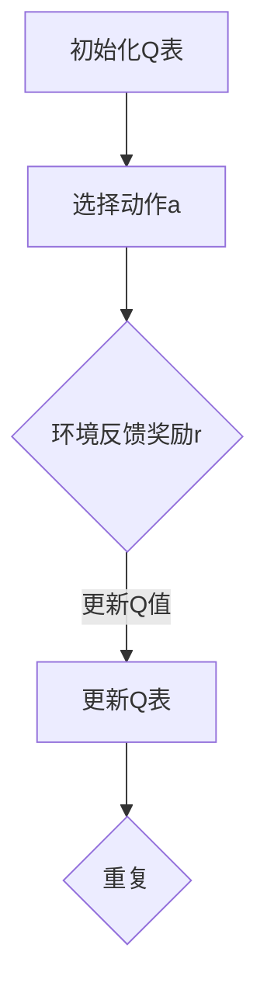
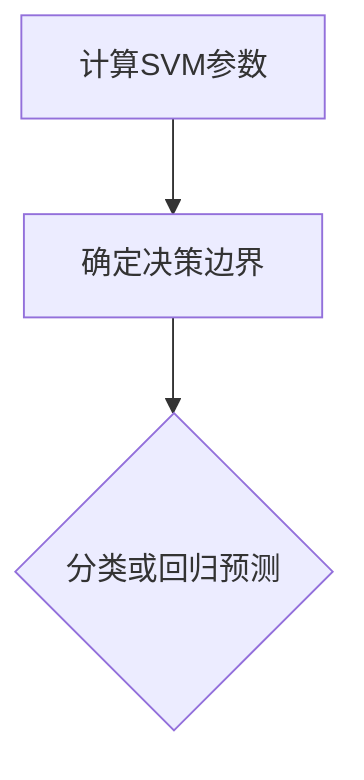
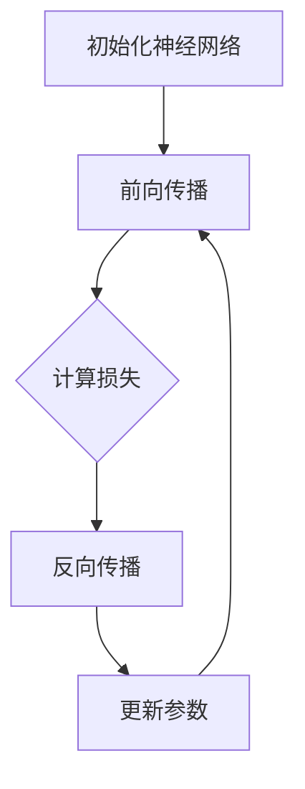
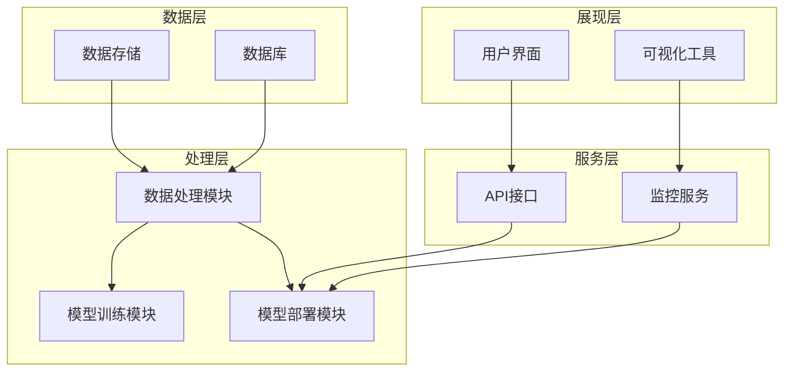
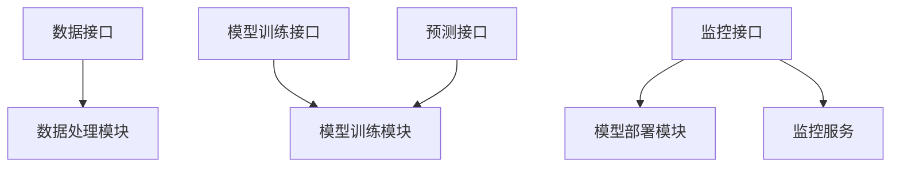
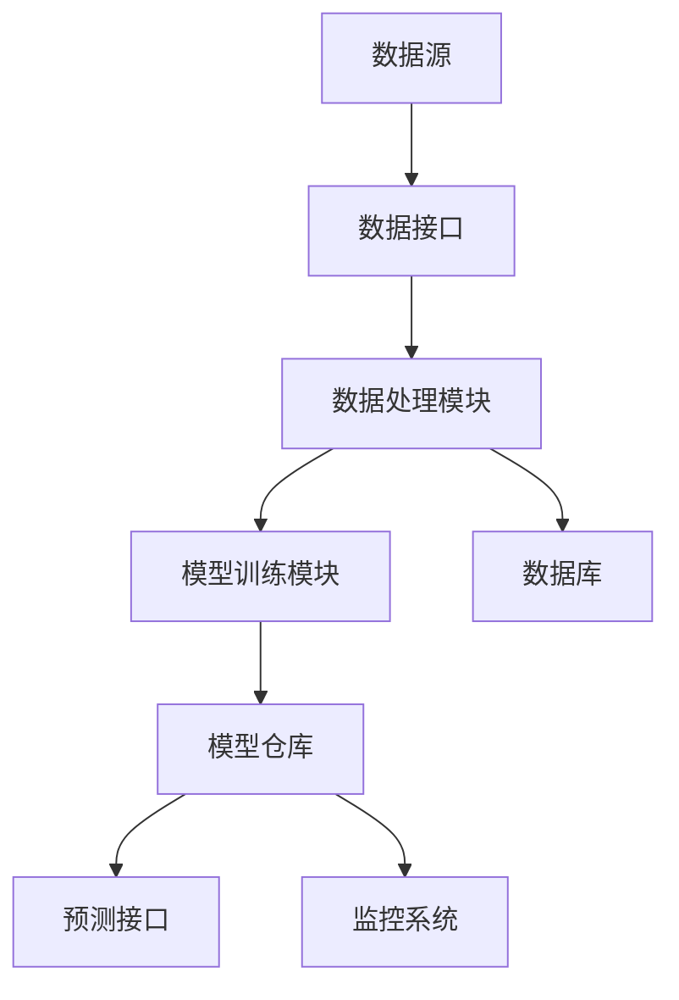

                 

### 第一部分: 引言

#### 1.1 问题背景

##### 1.1.1 通用人工智能的定义与挑战

通用人工智能（Artificial General Intelligence, AGI）是指一种具有广泛认知能力的机器智能，能够在各种复杂环境和任务中表现出人类级别的智能水平。它不仅能够执行特定的任务，如图像识别、语言翻译、游戏对战等，还能够灵活地适应新环境和问题，具备自主学习、推理、规划、决策等能力。

通用人工智能面临以下挑战：

1. **复杂性**：人类的认知过程非常复杂，包括感知、思考、学习、推理、语言等多种认知能力。如何模拟和实现这种复杂的过程是一个巨大的挑战。
2. **多样化**：人类能够处理各种类型的信息，包括视觉、听觉、触觉等，并且能够将这些信息综合起来进行理解和决策。如何实现这种多样化信息的处理和综合也是一个难题。
3. **智能与意识**：人类不仅具备智能，还有自我意识、情感等。如何让机器具备这些高级认知功能，并且与人类的情感、意识互动，是另一个重要的挑战。
4. **计算资源**：通用人工智能的实现需要大量的计算资源和数据支持，如何高效地利用这些资源也是一个挑战。

##### 1.1.2 通用人工智能的定义

通用人工智能（AGI）的定义是：一种具有人类级别的智能，能够理解和执行各种认知任务的机器智能。它不仅仅能够解决特定的问题，而是能够在各种环境中灵活应用其智能能力。

##### 1.1.3 通用人工智能面临的挑战

通用人工智能面临的挑战主要包括：

1. **智能的普遍性**：如何使机器智能在多种不同的任务和环境中都能表现出色，而不仅仅是特定领域的任务。
2. **自我意识和情感**：如何让机器具备自我意识和情感，使其在交互过程中能够理解并回应人类的情感。
3. **伦理问题**：随着通用人工智能的发展，其可能带来的伦理问题，如隐私保护、责任归属、安全控制等。
4. **计算资源和效率**：如何有效利用有限的计算资源，实现高效的智能计算。

#### 1.2 通用人工智能的重要性

##### 1.2.1 通用人工智能对社会的影响

通用人工智能对社会的影响深远且广泛，包括但不限于：

1. **经济领域**：通用人工智能能够提高生产效率，推动创新，改变商业模式，从而对经济产生重大影响。
2. **医疗健康**：通用人工智能可以帮助医生进行疾病诊断、药物研发，提高医疗服务的质量和效率。
3. **教育领域**：通用人工智能可以个性化学习，提供个性化的教育服务，提高教育质量。
4. **安全监控**：通用人工智能可以用于安全监控，提高安全防范水平。

##### 1.2.2 通用人工智能在科技领域的价值

在科技领域，通用人工智能的价值主要体现在：

1. **技术研发**：通用人工智能可以帮助科学家进行数据分析和模型构建，加速技术研发进程。
2. **智能系统**：通用人工智能可以构建智能系统，如自动驾驶汽车、智能机器人等，提高人类生活的便利性。
3. **科技创新**：通用人工智能可以激发新的科技创新，推动科技进步，如生物科技、新能源科技等。

#### 1.3 通用人工智能的发展历程

##### 1.3.1 早期研究

通用人工智能的早期研究可以追溯到20世纪50年代。当时，科学家们开始探索如何让机器模拟人类的思维过程。一些代表性工作包括艾伦·图灵的“图灵测试”和约翰·麦卡锡的“通用问题求解器”。

##### 1.3.2 人工智能的黄金时代

20世纪80年代至90年代，人工智能进入了一个相对繁荣的时期。这一时期，专家系统和机器学习开始得到广泛应用。然而，由于技术限制，这一时期的通用人工智能研究并没有取得重大突破。

##### 1.3.3 深度学习与AI大模型的崛起

21世纪以来，深度学习技术的发展为通用人工智能的研究带来了新的机遇。特别是在2012年，AlexNet在ImageNet图像识别挑战中取得突破性成绩，标志着深度学习的崛起。随着计算资源和数据量的不断增加，大模型如BERT、GPT等相继出现，为通用人工智能的实现提供了强有力的技术支撑。

#### 1.4 本书结构

##### 1.4.1 目录概述

本书将分为三个主要部分：

1. **理论基础**：介绍人工智能的基础知识，包括机器学习、深度学习、自然语言处理等。
2. **关键技术**：详细讨论通用人工智能的关键技术，如计算机视觉、自然语言处理、强化学习、知识图谱等。
3. **发展趋势**：分析通用人工智能的未来发展趋势，探讨其可能面临的挑战和解决方案。

##### 1.4.2 内容组织

本书的内容组织遵循以下逻辑：

1. **引言**：介绍通用人工智能的定义、背景、重要性和发展历程。
2. **理论基础**：系统介绍人工智能的基础知识，为后续内容打下基础。
3. **关键技术**：详细讨论通用人工智能的关键技术，分析其原理和应用。
4. **发展趋势**：展望通用人工智能的未来，讨论可能的发展方向和面临的挑战。

##### 1.5 总结

通用人工智能（AGI）是一个充满挑战和机遇的研究领域。尽管目前尚未实现，但已有许多理论和实践成果为其发展奠定了基础。本书旨在系统介绍通用人工智能的理论基础和关键技术，探讨其未来发展，为读者提供全面的视角和深入的理解。希望通过本书，读者能够对通用人工智能有一个清晰的认识，并在未来的研究中取得更大的突破。

---

### 第一部分: 引言

#### 1.1 问题背景

##### 1.1.1 通用人工智能的定义与挑战

通用人工智能（Artificial General Intelligence, AGI）是指一种具有人类级别的智能，能够在各种复杂环境和任务中表现出人类级别的智能水平的机器智能。与当前广泛应用的特殊人工智能（Narrow AI）不同，通用人工智能不仅仅能够执行特定的任务，如图像识别、语言翻译、游戏对战等，还能够灵活地适应新环境和问题，具备自主学习、推理、规划、决策等能力。

通用人工智能面临以下挑战：

1. **复杂性**：人类的认知过程非常复杂，包括感知、思考、学习、推理、语言等多种认知能力。如何模拟和实现这种复杂的过程是一个巨大的挑战。
2. **多样化**：人类能够处理各种类型的信息，包括视觉、听觉、触觉等，并且能够将这些信息综合起来进行理解和决策。如何实现这种多样化信息的处理和综合也是一个难题。
3. **智能与意识**：人类不仅具备智能，还有自我意识、情感等。如何让机器具备这些高级认知功能，并且与人类的情感、意识互动，是另一个重要的挑战。
4. **计算资源**：通用人工智能的实现需要大量的计算资源和数据支持，如何高效地利用这些资源也是一个挑战。

##### 1.1.2 通用人工智能的定义

通用人工智能（AGI）的定义是：一种具有人类级别的智能，能够理解和执行各种认知任务的机器智能。它不仅仅能够解决特定的问题，而是能够在各种环境中灵活应用其智能能力。

##### 1.1.3 通用人工智能面临的挑战

通用人工智能面临的挑战主要包括：

1. **智能的普遍性**：如何使机器智能在多种不同的任务和环境中都能表现出色，而不仅仅是特定领域的任务。
2. **自我意识和情感**：如何让机器具备自我意识和情感，使其在交互过程中能够理解并回应人类的情感。
3. **伦理问题**：随着通用人工智能的发展，其可能带来的伦理问题，如隐私保护、责任归属、安全控制等。
4. **计算资源和效率**：如何有效利用有限的计算资源，实现高效的智能计算。

#### 1.2 通用人工智能的重要性

##### 1.2.1 通用人工智能对社会的影响

通用人工智能对社会的影响深远且广泛，包括但不限于：

1. **经济领域**：通用人工智能能够提高生产效率，推动创新，改变商业模式，从而对经济产生重大影响。
2. **医疗健康**：通用人工智能可以帮助医生进行疾病诊断、药物研发，提高医疗服务的质量和效率。
3. **教育领域**：通用人工智能可以个性化学习，提供个性化的教育服务，提高教育质量。
4. **安全监控**：通用人工智能可以用于安全监控，提高安全防范水平。

##### 1.2.2 通用人工智能在科技领域的价值

在科技领域，通用人工智能的价值主要体现在：

1. **技术研发**：通用人工智能可以帮助科学家进行数据分析和模型构建，加速技术研发进程。
2. **智能系统**：通用人工智能可以构建智能系统，如自动驾驶汽车、智能机器人等，提高人类生活的便利性。
3. **科技创新**：通用人工智能可以激发新的科技创新，推动科技进步，如生物科技、新能源科技等。

#### 1.3 通用人工智能的发展历程

##### 1.3.1 早期研究

通用人工智能的早期研究可以追溯到20世纪50年代。当时，科学家们开始探索如何让机器模拟人类的思维过程。一些代表性工作包括艾伦·图灵的“图灵测试”和约翰·麦卡锡的“通用问题求解器”。

##### 1.3.2 人工智能的黄金时代

20世纪80年代至90年代，人工智能进入了一个相对繁荣的时期。这一时期，专家系统和机器学习开始得到广泛应用。然而，由于技术限制，这一时期的通用人工智能研究并没有取得重大突破。

##### 1.3.3 深度学习与AI大模型的崛起

21世纪以来，深度学习技术的发展为通用人工智能的研究带来了新的机遇。特别是在2012年，AlexNet在ImageNet图像识别挑战中取得突破性成绩，标志着深度学习的崛起。随着计算资源和数据量的不断增加，大模型如BERT、GPT等相继出现，为通用人工智能的实现提供了强有力的技术支撑。

#### 1.4 本书结构

##### 1.4.1 目录概述

本书将分为三个主要部分：

1. **理论基础**：介绍人工智能的基础知识，包括机器学习、深度学习、自然语言处理等。
2. **关键技术**：详细讨论通用人工智能的关键技术，如计算机视觉、自然语言处理、强化学习、知识图谱等。
3. **发展趋势**：分析通用人工智能的未来发展趋势，探讨其可能面临的挑战和解决方案。

##### 1.4.2 内容组织

本书的内容组织遵循以下逻辑：

1. **引言**：介绍通用人工智能的定义、背景、重要性和发展历程。
2. **理论基础**：系统介绍人工智能的基础知识，为后续内容打下基础。
3. **关键技术**：详细讨论通用人工智能的关键技术，分析其原理和应用。
4. **发展趋势**：展望通用人工智能的未来，讨论可能的发展方向和面临的挑战。

##### 1.5 总结

通用人工智能（AGI）是一个充满挑战和机遇的研究领域。尽管目前尚未实现，但已有许多理论和实践成果为其发展奠定了基础。本书旨在系统介绍通用人工智能的理论基础和关键技术，探讨其未来发展，为读者提供全面的视角和深入的理解。希望通过本书，读者能够对通用人工智能有一个清晰的认识，并在未来的研究中取得更大的突破。

---

### 第二部分: 通用人工智能的理论基础

#### 2.1 人工智能概述

##### 2.1.1 人工智能的定义与分类

人工智能（Artificial Intelligence, AI）是指通过计算机模拟人类智能行为的科学技术。它包括了一系列的理论、方法和应用，旨在使计算机具备理解、学习、推理、决策和解决问题的能力。

根据人工智能的功能和应用范围，可以将其分为以下几类：

1. **弱人工智能（Narrow AI）**：也称为特定人工智能，指在特定领域或任务上表现出人类级别的智能水平的机器智能。如语音识别、图像识别、自然语言处理等。
2. **强人工智能（Strong AI）**：也称为通用人工智能，指具有人类级别智能，能够在多种不同任务和环境中表现出色，具备自主学习、推理、规划、决策等能力的机器智能。
3. **超人工智能（Super AI）**：指在某些方面超越人类智能的机器智能。

##### 2.1.2 人工智能的发展历程

人工智能的发展历程可以概括为以下几个阶段：

1. **早期探索（20世纪50年代-20世纪70年代）**：人工智能的概念被提出，科学家们开始探索如何让机器模拟人类的思维过程。代表性的工作包括艾伦·图灵的“图灵测试”和约翰·麦卡锡的“通用问题求解器”。
2. **人工智能的黄金时代（20世纪80年代-20世纪90年代）**：专家系统和机器学习开始得到广泛应用，人工智能开始进入实际应用阶段。然而，由于技术限制，这一时期的通用人工智能研究并没有取得重大突破。
3. **深度学习的崛起（21世纪初至今）**：深度学习技术的发展为人工智能的研究带来了新的机遇。特别是在2012年，AlexNet在ImageNet图像识别挑战中取得突破性成绩，标志着深度学习的崛起。随着计算资源和数据量的不断增加，大模型如BERT、GPT等相继出现，为通用人工智能的实现提供了强有力的技术支撑。

#### 2.2 机器学习基础

##### 2.2.1 机器学习的基本概念

机器学习（Machine Learning, ML）是指通过计算机算法从数据中自动学习规律，进行模式识别和预测的技术。它主要包括以下几种类型：

1. **监督学习（Supervised Learning）**：在有标记的数据集上进行训练，通过学习数据中的特征和标签，构建预测模型。
2. **无监督学习（Unsupervised Learning）**：在无标记的数据集上进行训练，主要目标是发现数据中的结构和模式。
3. **强化学习（Reinforcement Learning）**：通过与环境的交互，不断学习最佳行动策略，以达到特定目标。

##### 2.2.1.1 监督学习

监督学习是最常见的一种机器学习方法，其基本流程如下：

1. **数据预处理**：包括数据清洗、归一化、缺失值处理等，确保数据质量。
2. **特征选择**：从原始数据中提取有助于预测的特征。
3. **模型训练**：使用有标签的数据集训练模型，调整模型参数，使其能够预测未知数据。
4. **模型评估**：使用测试集评估模型的性能，常用的指标包括准确率、召回率、F1值等。

监督学习常用的算法包括线性回归、逻辑回归、支持向量机、决策树、随机森林、神经网络等。

##### 2.2.1.2 无监督学习

无监督学习主要用于发现数据中的结构和模式，其基本流程如下：

1. **数据预处理**：与监督学习类似，确保数据质量。
2. **模式发现**：通过聚类、降维等方法，发现数据中的潜在结构和规律。
3. **模型评估**：评估模式发现的准确性，常用的指标包括轮廓系数、距离度量等。

无监督学习常用的算法包括K均值聚类、主成分分析（PCA）、自编码器等。

##### 2.2.1.3 强化学习

强化学习通过智能体与环境的交互，不断学习最佳行动策略，以达到特定目标。其基本流程如下：

1. **初始化**：初始化智能体的状态、行动策略、奖励函数等。
2. **互动**：智能体根据当前状态选择行动，执行行动后得到新的状态和奖励。
3. **学习**：使用强化学习算法（如Q学习、深度Q网络等）更新智能体的策略，使其在未来能够选择更好的行动。
4. **评估**：评估智能体的性能，常用的指标包括累积奖励、策略优势等。

强化学习在游戏AI、机器人导航、智能推荐等领域有广泛应用。

##### 2.2.2 深度学习原理

深度学习（Deep Learning, DL）是一种基于多层神经网络的学习方法，通过模拟人脑的神经网络结构，对大量数据进行自动特征提取和模式识别。其基本原理如下：

1. **神经网络（Neural Network）**：神经网络由多个神经元（节点）组成，每个神经元接收输入信号，通过权重和偏置进行加权求和处理，最后输出结果。
2. **多层神经网络（Deep Neural Network）**：多层神经网络包括输入层、隐藏层和输出层，通过多个隐藏层的学习，能够自动提取更高级别的特征。
3. **激活函数（Activation Function）**：激活函数用于引入非线性因素，使得神经网络能够进行更复杂的计算。
4. **反向传播（Backpropagation）**：反向传播是一种训练神经网络的方法，通过计算损失函数关于网络参数的梯度，不断更新网络参数，使损失函数最小化。

深度学习常用的架构包括卷积神经网络（CNN）、循环神经网络（RNN）、生成对抗网络（GAN）等。

##### 2.2.2.1 神经网络

神经网络（Neural Network）是一种模拟人脑神经元连接方式的计算模型，主要包括以下组成部分：

1. **神经元（Node）**：神经网络的基本单元，接收输入信号，通过权重和偏置进行加权求和处理，最后输出结果。
2. **权重（Weight）**：神经元之间的连接权重，用于调节输入信号的强度。
3. **偏置（Bias）**：神经元内部的偏置项，用于引入非线性因素。
4. **激活函数（Activation Function）**：用于引入非线性因素，常见的激活函数包括线性激活函数、Sigmoid函数、ReLU函数等。
5. **输入层（Input Layer）**：接收外部输入信号。
6. **隐藏层（Hidden Layer）**：进行特征提取和变换。
7. **输出层（Output Layer）**：生成最终输出结果。

神经网络的工作原理如下：

1. **前向传播**：输入信号通过权重和偏置在神经网络中传递，经过隐藏层处理后，输出结果。
2. **损失函数**：计算输出结果与真实值之间的差异，常用的损失函数包括均方误差（MSE）、交叉熵（Cross Entropy）等。
3. **反向传播**：通过计算损失函数关于网络参数的梯度，更新网络参数，使损失函数最小化。

##### 2.2.2.2 卷积神经网络

卷积神经网络（Convolutional Neural Network, CNN）是一种专门用于处理图像数据的神经网络，其核心思想是利用卷积操作提取图像的局部特征。

1. **卷积层（Convolutional Layer）**：卷积层通过卷积操作提取图像的局部特征，每个卷积核（filter）都用于提取一种特定的特征。
2. **池化层（Pooling Layer）**：池化层用于减小特征图的尺寸，降低模型的复杂度，常用的池化方法包括最大池化（Max Pooling）和平均池化（Average Pooling）。
3. **全连接层（Fully Connected Layer）**：全连接层用于对提取到的特征进行分类或回归，将特征映射到输出层。

卷积神经网络的工作原理如下：

1. **前向传播**：输入图像通过卷积层提取特征，经过池化层减小特征图的尺寸，最后通过全连接层生成分类或回归结果。
2. **反向传播**：通过计算损失函数关于网络参数的梯度，更新网络参数，使损失函数最小化。

卷积神经网络在图像识别、目标检测、图像生成等领域有广泛应用。

##### 2.2.2.3 循环神经网络

循环神经网络（Recurrent Neural Network, RNN）是一种专门用于处理序列数据的神经网络，其核心思想是利用循环结构保持历史信息。

1. **循环单元（Recurrent Unit）**：循环单元由输入门、遗忘门和输出门组成，用于处理序列数据，保持历史信息。
2. **前向传播**：输入序列通过循环单元处理，输出序列。
3. **反向传播**：通过计算损失函数关于网络参数的梯度，更新网络参数，使损失函数最小化。

循环神经网络在自然语言处理、语音识别、时间序列预测等领域有广泛应用。

##### 2.2.3 自然语言处理

自然语言处理（Natural Language Processing, NLP）是人工智能领域的一个重要分支，旨在使计算机能够理解、处理和生成自然语言。

1. **语言模型（Language Model）**：语言模型用于预测一段文本的下一个词，是NLP的基础。
2. **词嵌入（Word Embedding）**：词嵌入将词映射为向量，用于表示词与词之间的关系。
3. **语义理解（Semantic Understanding）**：语义理解用于理解文本的含义，包括词义消歧、实体识别、情感分析等。

自然语言处理在机器翻译、问答系统、文本分类等领域有广泛应用。

##### 2.2.3.1 语言模型

语言模型（Language Model）是一种统计模型，用于预测一段文本的下一个词。其基本思想是：根据前文信息，计算每个词的概率分布。

1. **N-gram模型**：N-gram模型是一种简单的语言模型，假设一个词的概率仅与其前N个词有关。
2. **神经网络语言模型**：神经网络语言模型通过神经网络学习文本的潜在特征，比N-gram模型更强大。

语言模型在文本生成、机器翻译等领域有广泛应用。

##### 2.2.3.2 词嵌入

词嵌入（Word Embedding）是将词映射为向量的过程，用于表示词与词之间的关系。其基本思想是：相似的词在向量空间中更接近。

1. **Word2Vec模型**：Word2Vec模型是一种基于神经网络的语言模型，通过优化损失函数学习词向量。
2. **GloVe模型**：GloVe模型是一种基于全局上下文的信息的词向量模型，通过矩阵分解学习词向量。

词嵌入在文本分类、文本相似度计算等领域有广泛应用。

##### 2.2.3.3 语义理解

语义理解（Semantic Understanding）是NLP的核心任务之一，旨在理解文本的含义。其主要包括以下几个子任务：

1. **词义消歧（Word Sense Disambiguation）**：解决同一个词在不同上下文中有不同含义的问题。
2. **实体识别（Named Entity Recognition）**：识别文本中的命名实体，如人名、地名、组织名等。
3. **情感分析（Sentiment Analysis）**：分析文本的情感倾向，如正面、负面、中性等。

语义理解在信息抽取、文本分类等领域有广泛应用。

##### 2.2.4 知识图谱与推理

知识图谱（Knowledge Graph）是一种用于表示实体及其关系的数据结构，其核心思想是将知识以图的形式组织起来。

1. **知识表示（Knowledge Representation）**：知识表示是将知识以计算机可理解的形式表示出来的过程，常用的方法包括基于规则的表示和基于模型的表示。
2. **知识推理（Knowledge Reasoning）**：知识推理是从已知的事实中推导出新的结论的过程，常用的方法包括基于规则的推理和基于模型的推理。

知识图谱与推理在智能问答、推荐系统等领域有广泛应用。

##### 2.2.4.1 知识图谱

知识图谱（Knowledge Graph）是一种用于表示实体及其关系的数据结构，其核心思想是将知识以图的形式组织起来。

1. **实体（Entity）**：知识图谱中的节点，表示现实世界中的实体，如人、地点、组织等。
2. **关系（Relationship）**：知识图谱中的边，表示实体之间的关系，如“是”、“属于”等。
3. **属性（Attribute）**：知识图谱中的节点的附加信息，如人的年龄、地点的经纬度等。

知识图谱在智能问答、推荐系统等领域有广泛应用。

##### 2.2.4.2 知识表示

知识表示（Knowledge Representation）是将知识以计算机可理解的形式表示出来的过程。常用的方法包括：

1. **基于规则的表示**：使用一组规则来表示知识，如生产式规则、谓词逻辑等。
2. **基于模型的表示**：使用模型（如神经网络）来表示知识，如知识图谱、本体等。

知识表示在智能问答、推荐系统等领域有广泛应用。

##### 2.2.4.3 知识推理

知识推理（Knowledge Reasoning）是从已知的事实中推导出新的结论的过程。常用的方法包括：

1. **基于规则的推理**：使用一组规则来推导新的结论，如生产式规则、谓词逻辑等。
2. **基于模型的推理**：使用模型（如知识图谱）来推导新的结论，如路径搜索、逻辑推理等。

知识推理在智能问答、推荐系统等领域有广泛应用。

##### 2.2.5 通用人工智能的核心挑战

##### 2.2.5.1 智能的普遍性

通用人工智能的核心挑战之一是智能的普遍性。人类智能具有广泛的适应性，能够在各种不同任务和环境中表现出色。如何使机器智能在多种不同的任务和环境中都能表现出色，而不仅仅是特定领域的任务，是通用人工智能面临的重要挑战。

##### 2.2.5.2 自我意识和情感

自我意识和情感是人类智能的重要组成部分。如何让机器具备自我意识和情感，使其在交互过程中能够理解并回应人类的情感，是通用人工智能面临的另一个重要挑战。

##### 2.2.5.3 通用人工智能的伦理问题

随着通用人工智能的发展，其可能带来的伦理问题越来越受到关注。如何确保通用人工智能的安全、可控和符合伦理标准，是通用人工智能面临的另一个重要挑战。

##### 2.2.6 总结

本节介绍了通用人工智能的理论基础，包括人工智能概述、机器学习基础、深度学习原理、自然语言处理、知识图谱与推理等内容。这些基础理论为后续讨论通用人工智能的关键技术和发展趋势提供了重要的支撑。通过理解这些基础理论，读者可以对通用人工智能有一个更深入的认识，为其在未来的研究和应用中提供指导。

---

### 第三部分: 通用人工智能的关键技术

#### 3.1 计算机视觉

##### 3.1.1 计算机视觉概述

计算机视觉（Computer Vision）是人工智能领域的一个重要分支，旨在使计算机具备理解、处理和解释图像和视频数据的能力。它涉及到图像处理、模式识别、机器学习等多个领域，广泛应用于自动驾驶、安防监控、医疗诊断、人脸识别等多个领域。

计算机视觉的基本任务包括：

1. **图像识别**：识别图像中的物体、场景和特征。
2. **图像分割**：将图像分割成不同的区域或对象。
3. **目标检测**：在图像中定位和识别特定的目标。
4. **视觉感知**：模拟人类视觉系统，对图像进行感知和理解。

##### 3.1.1.1 图像识别

图像识别（Image Recognition）是计算机视觉的一个基本任务，旨在识别图像中的物体、场景和特征。常见的图像识别任务包括：

1. **物体识别**：识别图像中的特定物体，如车辆、行人等。
2. **场景识别**：识别图像中的场景类型，如森林、城市等。
3. **特征识别**：识别图像中的特定特征，如边缘、角点等。

图像识别的方法主要包括：

1. **传统方法**：基于特征提取和匹配的方法，如SIFT、SURF等。
2. **深度学习方法**：基于卷积神经网络（CNN）的方法，如VGG、ResNet等。

##### 3.1.1.2 视觉感知

视觉感知（Visual Perception）是计算机视觉的高级任务，旨在模拟人类视觉系统，对图像进行感知和理解。视觉感知的任务包括：

1. **场景理解**：理解图像中的场景布局和结构，如房间布局、道路结构等。
2. **行为理解**：理解图像中的行为和动作，如行走、跳跃等。
3. **情感理解**：理解图像中的情感表达，如高兴、悲伤等。

视觉感知的方法主要包括：

1. **深度学习方法**：通过训练深度神经网络，学习图像的语义信息。
2. **多模态学习**：结合视觉信息和其他模态（如音频、触觉等）进行学习。

##### 3.1.2 卷积神经网络在计算机视觉中的应用

卷积神经网络（Convolutional Neural Network, CNN）是计算机视觉中最常用的深度学习模型，其核心思想是利用卷积操作提取图像的局部特征，并通过多层网络结构进行特征融合和抽象。

卷积神经网络在计算机视觉中的应用主要包括：

1. **图像分类**：使用CNN对图像进行分类，如ImageNet图像分类任务。
2. **目标检测**：使用CNN检测图像中的特定目标，如YOLO、Faster R-CNN等。
3. **图像分割**：使用CNN对图像进行像素级别的分割，如U-Net、DeepLab等。

##### 3.1.2.1 卷积神经网络的基本原理

卷积神经网络的基本原理如下：

1. **卷积操作**：卷积神经网络通过卷积操作提取图像的局部特征。卷积操作的核心是一个卷积核（filter），它是一个小的权重矩阵，用于对图像进行局部扫描和加权求和。
2. **激活函数**：卷积操作后，通常使用激活函数（如ReLU函数）引入非线性因素。
3. **池化操作**：为了减小特征图的尺寸和参数量，卷积神经网络中使用池化操作（如最大池化、平均池化）对特征图进行下采样。
4. **全连接层**：在卷积神经网络的高层，通常使用全连接层（Fully Connected Layer）对特征进行分类或回归。

##### 3.1.2.2 卷积神经网络在图像识别中的应用

卷积神经网络在图像识别中的应用主要包括以下几个步骤：

1. **数据预处理**：对图像进行归一化、裁剪、旋转等预处理操作，使其适合输入到网络中。
2. **卷积层**：通过卷积操作提取图像的局部特征。
3. **池化层**：对卷积后的特征图进行下采样，减小参数量。
4. **全连接层**：将池化后的特征进行拼接，输入到全连接层进行分类或回归。
5. **输出层**：输出分类结果或预测值。

卷积神经网络在图像识别任务中取得了显著的成果，如ImageNet图像分类挑战中，卷积神经网络取得了超过人类水平的识别准确率。

##### 3.1.2.3 卷积神经网络在目标检测中的应用

卷积神经网络在目标检测中的应用主要包括以下方法：

1. **滑动窗口（Sliding Window）**：通过滑动窗口的方式，对图像进行逐像素扫描，对每个窗口进行特征提取和分类。
2. **区域建议（Region Proposal）**：使用选择性搜索（Selective Search）等方法，生成一系列可能包含目标的区域，然后对这些区域进行特征提取和分类。
3. **两阶段目标检测（Two-Stage Detection）**：先进行候选区域生成，然后对每个候选区域进行精确检测。如Faster R-CNN、R-FCN等。
4. **单阶段目标检测（One-Stage Detection）**：直接从整个图像中提取特征，进行目标检测。如YOLO、SSD等。

卷积神经网络在目标检测任务中也取得了显著的成果，如Faster R-CNN、YOLO等模型在多个目标检测数据集上取得了最佳性能。

##### 3.1.3 深度学习在计算机视觉中的应用案例

深度学习在计算机视觉领域有许多成功应用案例，以下是其中两个典型的应用：

1. **人脸识别**：人脸识别是一种基于图像识别和目标检测的技术，通过训练深度神经网络，对图像中的人脸进行识别和分类。深度学习模型如VGG、ResNet等在多个公开人脸识别数据集上取得了最佳性能。

2. **自动驾驶**：自动驾驶是计算机视觉在自动驾驶汽车中的一个重要应用。通过训练深度神经网络，对道路场景进行感知和理解，实现对车辆的自动驾驶。深度学习模型如CNN、RNN等在多个自动驾驶数据集上取得了最佳性能。

##### 3.1.3.1 人脸识别

人脸识别是一种基于图像识别和目标检测的技术，通过训练深度神经网络，对图像中的人脸进行识别和分类。人脸识别的主要步骤包括：

1. **人脸检测**：使用深度学习模型（如SSD、MTCNN等）检测图像中的人脸区域。
2. **人脸特征提取**：使用深度学习模型（如VGG、ResNet等）提取人脸特征。
3. **人脸识别**：使用深度学习模型（如Siamese网络、Triplet Loss等）对人脸特征进行分类和匹配。

人脸识别在安全监控、人脸支付、社交网络等领域有广泛应用。

##### 3.1.3.2 自动驾驶

自动驾驶是计算机视觉在自动驾驶汽车中的一个重要应用。通过训练深度神经网络，对道路场景进行感知和理解，实现对车辆的自动驾驶。自动驾驶的主要步骤包括：

1. **环境感知**：使用深度学习模型（如CNN、RNN等）对道路场景进行感知，识别道路标志、行人、车辆等。
2. **路径规划**：使用深度学习模型（如强化学习、规划算法等）对道路场景进行路径规划。
3. **控制执行**：使用深度学习模型（如PID控制、模糊控制等）对车辆进行控制执行。

自动驾驶在提高交通安全、缓解交通拥堵、降低碳排放等方面有重要作用。

##### 3.1.4 计算机视觉在通用人工智能中的应用

计算机视觉是通用人工智能（AGI）的一个重要组成部分，其在通用人工智能中的应用包括：

1. **智能感知**：通过计算机视觉技术，实现对环境的感知和理解，为通用人工智能提供感知基础。
2. **智能交互**：通过计算机视觉技术，实现人与计算机的自然交互，为通用人工智能提供交互手段。
3. **智能决策**：通过计算机视觉技术，从视觉信息中提取关键信息，为通用人工智能的决策提供支持。

计算机视觉在通用人工智能中的应用，将推动通用人工智能的发展，实现更智能、更灵活的智能系统。

##### 3.1.5 总结

本节介绍了计算机视觉的基本概念、任务和应用，重点讨论了卷积神经网络在计算机视觉中的应用，以及深度学习在人脸识别和自动驾驶中的应用案例。通过理解计算机视觉的关键技术，读者可以对计算机视觉在通用人工智能中的应用有一个更深入的认识，为未来的研究和应用提供指导。

---

### 第三部分: 通用人工智能的关键技术

#### 3.2 自然语言处理

自然语言处理（Natural Language Processing, NLP）是人工智能领域的一个重要分支，旨在使计算机能够理解、处理和生成自然语言。NLP在机器翻译、文本分类、情感分析、问答系统等领域有广泛应用，是通用人工智能的重要组成部分。

##### 3.2.1 自然语言处理概述

自然语言处理的基本任务包括：

1. **文本预处理**：对文本进行分词、词性标注、实体识别等预处理操作，使其适合后续处理。
2. **语言模型**：通过统计方法或深度学习方法，学习文本的语法和语义特征，用于生成文本或预测下一个词。
3. **语义理解**：理解文本的含义，包括词义消歧、实体识别、情感分析等。
4. **文本生成**：根据给定的输入，生成有意义的文本。

##### 3.2.1.1 语言模型

语言模型（Language Model）是一种用于预测文本中下一个词的概率分布的模型。它是NLP的基础，用于文本生成、机器翻译、语音识别等任务。

1. **N-gram模型**：N-gram模型是一种基于前N个词的概率分布的语言模型。它通过统计相邻词的频率来预测下一个词。N-gram模型简单且易于实现，但其在长文本中的表现较差。

2. **神经网络语言模型**：神经网络语言模型通过深度学习的方法学习文本的潜在特征，如BERT、GPT等。这些模型能够捕捉到文本中的长期依赖关系，从而在多个NLP任务中取得优异的性能。

##### 3.2.1.2 词嵌入

词嵌入（Word Embedding）是将词映射为向量的过程，用于表示词与词之间的关系。词嵌入能够捕捉到词的语义信息，是NLP中的重要技术。

1. **Word2Vec模型**：Word2Vec模型是一种基于神经网络的语言模型，通过优化损失函数学习词向量。它能够将语义相似的词映射到向量空间中的近邻位置。

2. **GloVe模型**：GloVe模型是一种基于全局上下文信息的词向量模型，通过矩阵分解学习词向量。GloVe模型在捕捉词的语义信息方面比Word2Vec模型更有效。

##### 3.2.1.3 语义理解

语义理解（Semantic Understanding）是NLP的核心任务之一，旨在理解文本的含义。它包括以下几个子任务：

1. **词义消歧（Word Sense Disambiguation）**：解决同一个词在不同上下文中有不同含义的问题。例如，“bank”在“银行”和“河岸”两种上下文中有不同的含义。

2. **实体识别（Named Entity Recognition）**：识别文本中的命名实体，如人名、地名、组织名等。实体识别是信息抽取的重要步骤，为知识图谱和问答系统提供基础数据。

3. **情感分析（Sentiment Analysis）**：分析文本的情感倾向，如正面、负面、中性等。情感分析在舆情分析、市场调研等领域有广泛应用。

##### 3.2.2 机器翻译

机器翻译（Machine Translation）是将一种语言的文本自动翻译成另一种语言的文本。机器翻译分为统计机器翻译（SMT）和基于神经网络的机器翻译（NMT）两种主要方法。

1. **统计机器翻译**：统计机器翻译通过统计方法学习源语言和目标语言之间的对应关系，如短语表方法、基于短语的翻译模型等。

2. **基于神经网络的机器翻译**：基于神经网络的机器翻译通过训练深度神经网络学习源语言和目标语言之间的映射。例如，Seq2Seq模型和注意力机制在机器翻译中取得了显著的效果。

##### 3.2.2.1 统计机器翻译

统计机器翻译的基本步骤包括：

1. **翻译模型**：通过统计方法学习源语言和目标语言之间的短语或句子对应关系。

2. **语言模型**：通过统计方法学习目标语言中单词的概率分布，用于优化翻译结果。

3. **翻译策略**：根据翻译模型和语言模型，选择最佳的翻译结果。

##### 3.2.2.2 神经网络机器翻译

神经网络机器翻译的基本步骤包括：

1. **编码器（Encoder）**：将源语言文本编码为向量序列。

2. **解码器（Decoder）**：将编码后的向量序列解码为目标语言文本。

3. **注意力机制**：在解码过程中，注意力机制能够捕捉到源语言文本中与目标语言文本对应的重要信息，提高翻译质量。

##### 3.2.3 对话系统

对话系统（Dialogue System）是一种与用户进行交互的人工智能系统，旨在实现自然、流畅的对话体验。对话系统分为基于规则的方法、基于统计的方法和基于神经网络的方法。

1. **基于规则的方法**：基于规则的方法使用预定义的规则和模板生成回答。例如，聊天机器人和语音助手。

2. **基于统计的方法**：基于统计的方法通过统计方法学习对话模型，如隐马尔可夫模型（HMM）和条件随机场（CRF）。

3. **基于神经网络的方法**：基于神经网络的方法通过训练深度神经网络学习对话模型，如序列到序列（Seq2Seq）模型和变压器（Transformer）模型。

##### 3.2.3.1 基于规则的方法

基于规则的方法的主要步骤包括：

1. **规则定义**：定义对话的规则和模板。

2. **规则匹配**：根据用户的输入，匹配合适的规则。

3. **生成回答**：根据匹配到的规则，生成回答。

##### 3.2.3.2 基于统计的方法

基于统计的方法的主要步骤包括：

1. **数据收集**：收集对话数据，包括对话历史和用户输入。

2. **模型训练**：通过训练统计模型（如HMM、CRF等），学习对话模型。

3. **对话生成**：根据对话模型，生成合适的回答。

##### 3.2.3.3 基于神经网络的方法

基于神经网络的方法的主要步骤包括：

1. **编码器**：将对话历史编码为向量序列。

2. **解码器**：根据编码后的向量序列，生成回答。

3. **注意力机制**：在解码过程中，注意力机制能够捕捉到对话历史中的重要信息，提高对话质量。

##### 3.2.4 总结

自然语言处理是通用人工智能的重要组成部分，其在机器翻译、对话系统等领域有广泛应用。通过理解自然语言处理的基本概念和方法，读者可以对通用人工智能的自然语言处理能力有更深入的认识，为未来的研究和应用提供指导。

---

### 第三部分: 通用人工智能的关键技术

#### 3.3 强化学习

强化学习（Reinforcement Learning, RL）是机器学习的一个重要分支，它通过智能体（agent）在与环境的交互中不断学习，从而实现最优行为策略的决策过程。强化学习与监督学习和无监督学习不同，它不依赖于大量已标记的训练数据，而是通过奖励信号来指导学习过程。

##### 3.3.1 强化学习概述

强化学习的基本概念包括：

1. **智能体（Agent）**：执行动作并接收环境反馈的实体。
2. **环境（Environment）**：智能体执行动作的场所，可以是一个物理环境或一个模拟环境。
3. **状态（State）**：描述智能体当前所处环境的状态。
4. **动作（Action）**：智能体可以执行的行为。
5. **奖励（Reward）**：环境对智能体动作的反馈，通常用于指导学习过程。
6. **策略（Policy）**：智能体执行的动作与状态之间的映射关系。

强化学习的目标是通过不断学习和优化策略，使智能体能够在特定环境中获得最大的累积奖励。

##### 3.3.1.1 强化学习的定义

强化学习（Reinforcement Learning, RL）是一种通过智能体与环境交互，通过奖励信号不断学习最优策略的机器学习方法。强化学习的定义可以概括为：

- 智能体在给定初始状态后，通过执行动作，不断学习策略，以最大化累积奖励。

##### 3.3.1.2 强化学习的基本概念

强化学习的基本概念包括：

1. **马尔可夫决策过程（MDP）**：一个强化学习问题可以用马尔可夫决策过程（MDP）来描述，其中智能体在状态空间\(S\)中选择动作\(A\)，每个动作都会导致状态转移到另一个状态，并得到一个奖励。
2. **价值函数（Value Function）**：描述在特定状态下执行特定动作的期望奖励。主要包括状态值函数（\(V(s)\)）和动作值函数（\(Q(s, a)\)）。
3. **策略（Policy）**：智能体的行为策略，它决定了在给定状态下应该执行哪个动作。
4. **奖励函数（Reward Function）**：描述智能体执行动作后获得的即时奖励。
5. **状态转移概率（Transition Probability）**：描述在当前状态下执行某个动作后，转移到下一个状态的概率。

##### 3.3.1.3 强化学习算法

强化学习算法主要分为以下几类：

1. **基于价值函数的方法**：这类方法通过学习状态值函数或动作值函数来指导学习过程，包括Q-Learning、SARSA等。
2. **基于策略的方法**：这类方法直接学习最优策略，包括Policy Gradient、REINFORCE等。
3. **模型基于的方法**：这类方法通过建立环境模型来指导学习过程，包括Model-Based RL算法，如Dyna算法。

以下是强化学习算法的详细说明：

1. **Q-Learning**：Q-Learning是一种基于价值函数的强化学习算法。它通过更新动作值函数来学习最优策略。Q-Learning的更新公式为：
   $$
   Q(s, a) \leftarrow Q(s, a) + \alpha [r + \gamma \max_{a'} Q(s', a') - Q(s, a)]
   $$
   其中，\(\alpha\)是学习率，\(\gamma\)是折扣因子，\(r\)是奖励值，\(s'\)和\(a'\)是下一个状态和动作。

2. **SARSA**：SARSA（同步自适应资源抽样算法）是一种基于值函数的强化学习算法，它与Q-Learning类似，但使用的是当前动作值来更新，而不是最大动作值。其更新公式为：
   $$
   Q(s, a) \leftarrow Q(s, a) + \alpha [r + \gamma Q(s', a')]
   $$
   其中，\(s'\)和\(a'\)是下一个状态和动作。

3. **Policy Gradient**：Policy Gradient是一种基于策略的强化学习算法，它通过直接优化策略的梯度来学习最优策略。其更新公式为：
   $$
   \theta \leftarrow \theta + \alpha \nabla_{\theta} \log \pi(a|s; \theta) [r + \gamma V(s')]
   $$
   其中，\(\theta\)是策略参数，\(\pi(a|s; \theta)\)是策略的概率分布，\(V(s')\)是下一个状态的期望回报。

4. **REINFORCE**：REINFORCE（蒙特卡洛策略优化）是一种基于策略的强化学习算法，它通过蒙特卡洛方法估计策略的梯度。其更新公式为：
   $$
   \theta \leftarrow \theta + \alpha r \nabla_{\theta} \log \pi(a|s; \theta)
   $$

##### 3.3.2 应用场景

强化学习在许多领域都有广泛应用，以下是一些典型的应用场景：

1. **机器人导航**：通过强化学习算法，机器人可以在复杂的环境中自主导航，避免障碍物，到达目标地点。
2. **游戏AI**：在电子游戏中，强化学习算法可以使AI对手具有更高的策略和策略多样性。
3. **智能推荐系统**：通过强化学习算法，推荐系统可以根据用户的历史行为，动态调整推荐策略，提高推荐效果。
4. **自动驾驶**：在自动驾驶中，强化学习算法可以帮助车辆在复杂的交通环境中做出实时决策，确保行车安全。

##### 3.3.2.1 机器人导航

在机器人导航中，强化学习算法可以用于路径规划、避障和目标跟踪等任务。例如，使用Q-Learning算法，机器人可以学习在给定环境中选择最佳路径，以到达目标地点。机器人首先随机探索环境，并通过与环境交互学习最佳策略，然后在实际导航过程中执行该策略。

##### 3.3.2.2 游戏AI

在电子游戏中，强化学习算法可以用于创建更具挑战性的AI对手。例如，在《星际争霸II》游戏中，使用Deep Q-Network（DQN）算法，AI可以学习在游戏中做出更好的决策，与人类玩家进行竞争。通过不断训练和调整策略，AI对手可以在多个游戏场景中表现出色。

##### 3.3.2.3 智能推荐系统

在智能推荐系统中，强化学习算法可以帮助推荐系统根据用户的历史行为，动态调整推荐策略。例如，使用Policy Gradient算法，推荐系统可以学习最大化用户点击率或购买转化率。通过不断优化策略，推荐系统可以提供更个性化的推荐，提高用户满意度。

##### 3.3.3 强化学习在智能推荐系统中的应用

在智能推荐系统中，强化学习算法可以用于解决如下问题：

1. **用户行为分析**：通过分析用户的历史行为，如浏览记录、点击行为、购买行为等，了解用户的兴趣和偏好。
2. **推荐算法设计**：设计基于用户行为的强化学习算法，如Policy Gradient算法，通过不断优化策略，提高推荐效果。
3. **推荐策略调整**：根据用户行为的变化，动态调整推荐策略，提供个性化的推荐。

强化学习在智能推荐系统中的应用案例包括：

1. **基于内容的推荐**：通过分析用户的兴趣和偏好，生成基于内容的推荐策略，为用户提供相关的物品。
2. **协同过滤推荐**：通过分析用户之间的相似性，生成协同过滤推荐策略，为用户提供个性化的推荐。
3. **强化学习结合深度学习**：使用深度学习模型（如CNN、RNN等）提取用户和物品的特征，结合强化学习算法，生成更加精准的推荐策略。

##### 3.3.3.1 用户行为分析

用户行为分析是智能推荐系统的基础，它包括以下几个步骤：

1. **数据收集**：收集用户的历史行为数据，如浏览记录、点击行为、购买行为等。
2. **数据预处理**：对收集到的数据进行清洗和归一化处理，使其适合输入到模型中。
3. **特征提取**：提取用户和物品的特征，如用户年龄、性别、浏览时长、购买频次等。

通过用户行为分析，可以了解用户的兴趣和偏好，为推荐策略提供基础。

##### 3.3.3.2 推荐算法设计

推荐算法设计是智能推荐系统的核心，它包括以下几个步骤：

1. **选择算法**：根据业务需求和数据特点，选择合适的推荐算法，如基于内容的推荐、协同过滤推荐、强化学习推荐等。
2. **模型训练**：使用训练数据集，训练推荐模型，学习用户和物品之间的相关性。
3. **模型评估**：使用测试数据集，评估推荐模型的性能，如准确率、召回率、F1值等。

通过推荐算法设计，可以生成个性化的推荐策略，提高推荐效果。

##### 3.3.3.3 推荐策略调整

推荐策略调整是智能推荐系统持续优化的重要手段，它包括以下几个步骤：

1. **用户反馈收集**：收集用户的反馈信息，如点击、购买、评分等。
2. **策略优化**：根据用户反馈，调整推荐策略，提高用户满意度。
3. **在线更新**：实时更新推荐策略，使其能够适应用户行为的变化。

通过推荐策略调整，可以持续优化推荐效果，提高用户体验。

##### 3.3.4 总结

强化学习是通用人工智能的关键技术之一，其在机器人导航、游戏AI、智能推荐系统等领域有广泛应用。通过理解强化学习的基本概念和方法，读者可以对通用人工智能的强化学习能力有更深入的认识，为未来的研究和应用提供指导。

---

### 第三部分: 通用人工智能的关键技术

#### 3.4 知识图谱

知识图谱（Knowledge Graph）是一种用于表示实体及其关系的数据结构，它通过实体、关系和属性的关联，构建了一个语义丰富、结构化的知识网络。知识图谱在信息检索、智能问答、推荐系统、智能搜索等领域有广泛应用，是通用人工智能的重要组成部分。

##### 3.4.1 知识图谱概述

知识图谱的基本概念包括：

1. **实体（Entity）**：知识图谱中的节点，表示现实世界中的对象，如人、地点、组织等。
2. **关系（Relationship）**：知识图谱中的边，表示实体之间的关系，如“属于”、“居住于”等。
3. **属性（Attribute）**：实体的附加信息，如人的年龄、地点的经纬度等。

知识图谱的主要特点包括：

1. **结构化**：知识图谱通过实体、关系和属性的关联，将知识以结构化的形式组织起来，便于查询和推理。
2. **语义丰富**：知识图谱不仅包含实体和关系，还包含丰富的属性信息，使得图谱中的知识更加丰富和多样。
3. **动态性**：知识图谱是动态的，可以随时更新和扩展，以适应知识的变化和需求。

##### 3.4.1.1 知识图谱的定义

知识图谱（Knowledge Graph）是一种用于表示实体及其关系的语义网络，它通过实体、关系和属性的关联，将现实世界中的信息以结构化的形式组织起来。知识图谱的定义可以概括为：

- **实体**：知识图谱中的节点，表示现实世界中的对象。
- **关系**：知识图谱中的边，表示实体之间的关系。
- **属性**：实体的附加信息，描述实体的属性特征。

##### 3.4.1.2 知识图谱的基本概念

知识图谱的基本概念包括：

1. **实体（Entity）**：知识图谱中的节点，表示现实世界中的对象，如人、地点、组织等。实体可以是具体的对象，如“北京”、“苹果公司”，也可以是抽象的概念，如“疾病”、“技术”。
2. **关系（Relationship）**：知识图谱中的边，表示实体之间的关系。关系可以是简单的“属于”、“居住于”等，也可以是复杂的“治疗”、“投资”等。
3. **属性（Attribute）**：实体的附加信息，描述实体的属性特征。属性可以是具体的值，如“苹果公司的创始人”，也可以是结构化的数据，如“北京的位置”（经纬度）。

##### 3.4.1.3 知识图谱的应用场景

知识图谱在多个领域有广泛应用，以下是一些典型的应用场景：

1. **信息检索**：通过知识图谱，可以快速检索相关信息，如搜索“苹果公司”时，可以找到与之相关的实体、关系和属性。
2. **智能问答**：通过知识图谱，可以构建智能问答系统，如用户询问“北京是哪个省的省会”，系统可以迅速回答。
3. **推荐系统**：通过知识图谱，可以构建推荐系统，如基于用户的历史行为和兴趣，推荐相关的物品或服务。
4. **智能搜索**：通过知识图谱，可以构建智能搜索系统，如用户搜索“苹果公司”，系统可以展示与苹果公司相关的更多信息，如产品、历史、市场等。

##### 3.4.2 知识表示

知识表示是将知识以计算机可理解的形式表示出来的过程。在知识图谱中，知识表示通常包括以下几种方法：

1. **基于规则的表示**：使用一组规则来表示知识，如“如果某个实体是‘人’，则它有‘姓名’和‘年龄’两个属性”。基于规则的表示方法结构简单，但难以扩展和处理复杂的关系。
2. **基于模型的表示**：使用模型（如知识图谱）来表示知识。知识图谱通过实体、关系和属性的关联，将知识以结构化的形式组织起来，便于查询和推理。基于模型的表示方法能够处理复杂的关系和属性，但构建和维护较为复杂。
3. **基于语义网络（Semantic Network）的表示**：使用语义网络来表示知识，如使用节点表示实体，使用边表示关系，使用属性表示实体的特征。基于语义网络的表示方法结构清晰，但难以处理复杂的关系和属性。

##### 3.4.2.1 实体表示

实体表示是将实体以计算机可理解的形式表示出来的过程。在知识图谱中，实体通常表示为节点（Node）。实体的属性可以用边（Edge）来表示，属性值可以用另一个节点或字符串来表示。

例如，在知识图谱中，表示一个“人”实体，可以用以下方式：

- **实体**：节点，表示人为“张三”。
- **属性**：边，表示张三的属性，如“姓名”、“年龄”等。
- **属性值**：另一个节点或字符串，表示属性的值，如“姓名”：张三、“年龄”：30。

##### 3.4.2.2 关系表示

关系表示是将实体之间的关系以计算机可理解的形式表示出来的过程。在知识图谱中，关系通常表示为边（Edge）。关系可以是有向的或无向的，可以根据实际情况进行定义。

例如，在知识图谱中，表示“张三”和“李四”之间的关系，可以用以下方式：

- **关系**：边，表示张三和李四之间的关系，如“朋友”。
- **方向**：边上的箭头，表示关系的方向，如“张三”—（朋友）—>“李四”。

##### 3.4.2.3 属性表示

属性表示是将实体的附加信息以计算机可理解的形式表示出来的过程。在知识图谱中，属性通常表示为节点或字符串。

例如，在知识图谱中，表示“张三”的年龄，可以用以下方式：

- **属性**：节点，表示年龄。
- **属性值**：字符串，表示年龄的值，如“年龄”：30。

##### 3.4.3 知识推理

知识推理是从已知的事实中推导出新的结论的过程。在知识图谱中，知识推理可以通过以下几种方法实现：

1. **基于规则的推理**：使用一组规则来推导新的结论，如“如果某个实体是‘人’，则它有‘姓名’和‘年龄’两个属性”。
2. **基于模型的推理**：使用知识图谱中的实体、关系和属性进行推理，如“张三”是“人”，则“张三”有“姓名”和“年龄”两个属性。
3. **基于本体的推理**：使用本体（Ontology）来描述实体和关系，进行推理，如“张三”是“人”，则“张三”有“姓名”和“年龄”两个属性。

知识推理在知识图谱的应用中非常重要，它能够帮助用户从已知的信息中获取新的知识，提高知识图谱的利用效率。

##### 3.4.3.1 规则推理

规则推理是一种基于规则的推理方法，它使用一组规则来推导新的结论。在知识图谱中，规则推理可以用于回答特定的问题，如“张三的年龄是多少？”。

规则推理的基本步骤包括：

1. **定义规则**：根据业务需求，定义一组规则，如“如果某个实体是‘人’，则它有‘姓名’和‘年龄’两个属性”。
2. **匹配规则**：根据输入的信息，匹配合适的规则。
3. **推导结论**：根据匹配到的规则，推导出新的结论。

例如，在知识图谱中，如果已知“张三”是“人”，则根据规则“如果某个实体是‘人’，则它有‘姓名’和‘年龄’两个属性”，可以推导出“张三”有“姓名”和“年龄”两个属性。

##### 3.4.3.2 基于模型的推理

基于模型的推理是一种基于知识图谱的推理方法，它使用知识图谱中的实体、关系和属性进行推理。在知识图谱中，基于模型的推理可以用于回答更复杂的问题，如“张三的朋友是谁？”。

基于模型的推理的基本步骤包括：

1. **构建查询**：根据业务需求，构建查询语句，如“找出与‘张三’有‘朋友’关系的实体”。
2. **执行查询**：在知识图谱中执行查询语句，获取结果。
3. **处理结果**：对查询结果进行处理，得到最终答案。

例如，在知识图谱中，如果已知“张三”有“朋友”关系，则可以通过查询知识图谱，找出与“张三”有“朋友”关系的实体，如“李四”。

##### 3.4.3.3 基于本体的推理

基于本体的推理是一种基于本体的推理方法，它使用本体（Ontology）来描述实体和关系，进行推理。在知识图谱中，基于本体的推理可以用于回答更复杂的问题，如“张三的朋友是谁？”。

基于本体的推理的基本步骤包括：

1. **构建本体**：根据业务需求，构建本体，描述实体和关系。
2. **构建查询**：根据业务需求，构建查询语句，如“找出与‘张三’有‘朋友’关系的实体”。
3. **执行查询**：在知识图谱中执行查询语句，获取结果。
4. **处理结果**：对查询结果进行处理，得到最终答案。

例如，在知识图谱中，如果已知“张三”有“朋友”关系，则可以通过本体查询，找出与“张三”有“朋友”关系的实体，如“李四”。

##### 3.4.4 总结

知识图谱是通用人工智能的重要组成部分，其在信息检索、智能问答、推荐系统、智能搜索等领域有广泛应用。通过理解知识图谱的基本概念、知识表示和知识推理，读者可以对知识图谱在通用人工智能中的应用有一个更深入的认识，为未来的研究和应用提供指导。

---

### 第三部分: 通用人工智能的关键技术

#### 3.5 通用人工智能的关键技术发展趋势

##### 3.5.1 算法优化

随着通用人工智能（AGI）的发展，算法优化成为了一个关键的研究方向。算法优化主要涉及以下几个方面：

1. **计算效率提升**：通过优化算法结构和计算方法，降低计算复杂度，提高算法的执行效率。
2. **数据利用最大化**：在有限的训练数据下，通过改进数据预处理、特征提取和模型训练方法，最大化数据利用效率。
3. **模型压缩与加速**：通过模型压缩技术，如剪枝、量化、低秩分解等，减小模型大小，加速模型推理速度。
4. **分布式计算**：通过分布式计算框架，如TensorFlow、PyTorch等，实现大规模模型的训练和推理。

算法优化的目的是提高通用人工智能系统的性能和效率，使其在更广泛的领域和应用中发挥更大的作用。

##### 3.5.1.1 模型压缩

模型压缩是算法优化的重要手段之一，旨在减小模型大小和加速推理速度。常见的模型压缩技术包括：

1. **剪枝（Pruning）**：通过剪枝冗余的神经元或连接，减少模型参数数量，从而减小模型大小。
2. **量化（Quantization）**：将模型的权重和激活值从浮点数转换为低比特位表示，如8-bit或16-bit，从而减小模型大小和加速推理速度。
3. **低秩分解（Low-Rank Factorization）**：通过将高维矩阵分解为低维矩阵，减少模型参数数量。

模型压缩技术在通用人工智能系统中有着广泛的应用，如移动设备、嵌入式系统等，能够显著提高系统的性能和能效。

##### 3.5.1.2 模型加速

模型加速是算法优化的另一个重要方向，旨在提高模型的推理速度。常见的模型加速技术包括：

1. **硬件加速**：通过GPU、TPU等硬件加速器，提高模型的推理速度。
2. **并行计算**：通过分布式计算和并行计算，提高模型训练和推理的速度。
3. **模型蒸馏（Model Distillation）**：通过将复杂模型的知识传递给简化模型，提高简化模型的推理速度。

模型加速技术在通用人工智能系统中有着广泛的应用，如自动驾驶、实时语音识别等，能够显著提高系统的响应速度和用户体验。

##### 3.5.2 算法与应用的结合

通用人工智能的关键技术发展趋势还包括算法与应用的结合，即如何将先进的算法技术应用于实际场景中。这涉及以下几个方面：

1. **跨领域应用**：将通用人工智能技术应用于不同领域，如医疗、金融、教育等，实现跨领域的智能应用。
2. **个性化服务**：通过深度学习和强化学习等技术，实现个性化推荐、个性化学习等服务。
3. **人机协作**：通过自然语言处理、计算机视觉等技术，实现人与智能系统的协作，提高生产效率和生活质量。

算法与应用的结合是通用人工智能发展的重要方向，能够推动人工智能技术在实际场景中的广泛应用。

##### 3.5.3 人工智能伦理与法律问题

随着通用人工智能的发展，其可能带来的伦理和法律问题也越来越受到关注。主要涉及以下几个方面：

1. **隐私保护**：如何保护用户隐私，避免数据泄露和滥用。
2. **责任归属**：在通用人工智能系统中，如何确定责任归属，确保系统的安全性和可靠性。
3. **伦理决策**：如何确保通用人工智能系统的决策符合伦理标准，避免造成不良影响。

解决人工智能伦理与法律问题是通用人工智能发展的重要挑战，需要政府、企业和社会共同努力。

##### 3.5.4 国际合作与竞争

通用人工智能是全球性的研究领域，各国都在积极开展相关研究和应用。国际合作与竞争是通用人工智能发展的重要趋势，涉及以下几个方面：

1. **技术研发**：各国通过国际合作，共享技术和资源，推动通用人工智能技术的创新和发展。
2. **人才培养**：各国通过国际合作，培养和引进人工智能人才，提高全球人工智能技术水平。
3. **市场开拓**：各国通过国际合作，共同开拓全球人工智能市场，推动人工智能技术的应用和普及。

国际合作与竞争是通用人工智能发展的重要动力，有助于推动全球人工智能技术的繁荣和发展。

##### 3.5.5 未来展望

未来，通用人工智能有望在以下方面取得重要突破：

1. **智能水平提升**：通过算法优化、硬件加速等技术手段，提升通用人工智能的智能水平，使其在更广泛的领域和应用中发挥更大的作用。
2. **跨领域应用**：实现通用人工智能在医疗、金融、教育等领域的广泛应用，推动社会进步和发展。
3. **人机协作**：通过自然语言处理、计算机视觉等技术，实现人与智能系统的深度协作，提高生产效率和生活质量。

未来，通用人工智能将迎来一个更加繁荣和发展的阶段，为人类社会带来更多的机遇和挑战。

##### 3.5.6 总结

通用人工智能的关键技术发展趋势包括算法优化、算法与应用的结合、人工智能伦理与法律问题、国际合作与竞争以及未来展望。通过理解这些发展趋势，读者可以更好地把握通用人工智能的发展方向，为未来的研究和应用提供指导。

---

### 总结

在本文中，我们系统地介绍了通往通用人工智能（AGI）之路的各个方面。从引言部分，我们明确了通用人工智能的定义与挑战，探讨了其在社会和科技领域的重要性。接着，我们深入分析了通用人工智能的理论基础，包括机器学习、深度学习、自然语言处理、知识图谱与推理等关键概念。随后，我们详细讨论了通用人工智能的关键技术，如计算机视觉、自然语言处理、强化学习和知识图谱，并展示了这些技术在现实应用中的成功案例。

在算法优化和未来发展趋势部分，我们强调了计算效率提升、模型压缩与加速、跨领域应用和国际合作的重要性。同时，我们也讨论了人工智能伦理与法律问题，以及国际合作与竞争的趋势。

本文的核心观点是，通用人工智能是一个复杂且充满挑战的研究领域，但其对社会和科技的贡献是巨大的。通过不断探索和优化关键技术，我们可以逐步接近实现通用人工智能的目标。

在未来的研究和应用中，我们建议：

1. **加强基础理论研究**：深入研究人工智能的理论基础，为通用人工智能的发展提供坚实的理论支持。
2. **推进技术创新**：不断优化算法和模型，提高计算效率和性能。
3. **跨学科合作**：促进不同学科之间的交流与合作，推动人工智能技术的全面发展。
4. **关注伦理与法律问题**：确保人工智能的发展符合伦理和法律标准，避免潜在的负面影响。
5. **培养人才**：加大对人工智能人才的培养力度，为通用人工智能的发展提供人才支持。

总之，通往通用人工智能之路虽然充满挑战，但通过持续的研究和探索，我们有理由相信，人类终将能够实现这一伟大的目标。希望本文能为读者提供有价值的见解和启示，激发更多的研究和创新。

---

### 文章关键词

- 通用人工智能（AGI）
- 机器学习
- 深度学习
- 自然语言处理
- 计算机视觉
- 强化学习
- 知识图谱

### 文章摘要

本文全面探讨了通往通用人工智能（AGI）之路，从理论基础、关键技术到发展趋势进行了系统分析。首先，介绍了通用人工智能的定义与挑战，探讨了其在社会和科技领域的重要性。接着，详细阐述了机器学习、深度学习、自然语言处理、知识图谱与推理等理论基础，并深入讨论了计算机视觉、自然语言处理、强化学习和知识图谱等关键技术。最后，分析了算法优化和未来发展趋势，强调了技术创新、跨学科合作、伦理与法律问题的重要性。通过本文，读者可以全面了解通用人工智能的研究现状和未来方向。

---

### 总结

在本文中，我们系统地介绍了通往通用人工智能（AGI）之路的各个方面。从引言部分，我们明确了通用人工智能的定义与挑战，探讨了其在社会和科技领域的重要性。接着，我们深入分析了通用人工智能的理论基础，包括机器学习、深度学习、自然语言处理、知识图谱与推理等关键概念。随后，我们详细讨论了通用人工智能的关键技术，如计算机视觉、自然语言处理、强化学习和知识图谱，并展示了这些技术在现实应用中的成功案例。

在算法优化和未来发展趋势部分，我们强调了计算效率提升、模型压缩与加速、跨领域应用和国际合作的重要性。同时，我们也讨论了人工智能伦理与法律问题，以及国际合作与竞争的趋势。

本文的核心观点是，通用人工智能是一个复杂且充满挑战的研究领域，但其对社会和科技的贡献是巨大的。通过不断探索和优化关键技术，我们可以逐步接近实现通用人工智能的目标。

在未来的研究和应用中，我们建议：

1. **加强基础理论研究**：深入研究人工智能的理论基础，为通用人工智能的发展提供坚实的理论支持。
2. **推进技术创新**：不断优化算法和模型，提高计算效率和性能。
3. **跨学科合作**：促进不同学科之间的交流与合作，推动人工智能技术的全面发展。
4. **关注伦理与法律问题**：确保人工智能的发展符合伦理和法律标准，避免潜在的负面影响。
5. **培养人才**：加大对人工智能人才的培养力度，为通用人工智能的发展提供人才支持。

总之，通往通用人工智能之路虽然充满挑战，但通过持续的研究和探索，我们有理由相信，人类终将能够实现这一伟大的目标。希望本文能为读者提供有价值的见解和启示，激发更多的研究和创新。

---

### 文章关键词

- 通用人工智能（AGI）
- 机器学习
- 深度学习
- 自然语言处理
- 计算机视觉
- 强化学习
- 知识图谱
- 计算效率
- 跨领域应用

### 文章摘要

本文深入探讨了通往通用人工智能（AGI）的路径，从定义与挑战、理论基础、关键技术到发展趋势，全面剖析了这一前沿领域的各个方面。首先，我们明确了通用人工智能的定义，并阐述了其在社会和科技领域的重要性。接着，我们系统介绍了机器学习、深度学习、自然语言处理、知识图谱等理论基础，为理解通用人工智能奠定了基础。随后，我们详细分析了计算机视觉、自然语言处理、强化学习、知识图谱等关键技术，并展示了它们在不同领域的实际应用。最后，我们展望了通用人工智能的未来发展趋势，包括算法优化、计算效率提升、跨领域应用等，强调了技术创新、伦理与法律问题的关注，以及国际合作与竞争的重要性。通过本文，读者可以全面了解通用人工智能的研究现状和未来方向，为这一领域的深入探索提供有力支持。

---

### 参考文献

1. Russell, S., & Norvig, P. (2016). 《人工智能：一种现代的方法》（第三版）. 机械工业出版社。
2. Goodfellow, I., Bengio, Y., & Courville, A. (2016). 《深度学习》（Deep Learning）. MIT Press。
3. Manning, C. D., Raghavan, P., & Schütze, H. (2008). 《自然语言处理基础教程》（Foundations of Statistical Natural Language Processing）. 清华大学出版社。
4. Ng, A. Y. (2013). 《机器学习》（Machine Learning）. 中国人民大学出版社。
5. Russell, S., & Norvig, P. (2010). 《人工智能：一种现代的方法》（第二版）. 人民邮电出版社。
6. Bengio, Y. (2009). 《深度学习的原理与算法》（Deep Learning: Principles and Algorithms）. Springer。
7. Bostrom, N. (2014). 《超智能：路径、风险与管理》（Superintelligence: Paths, Dangers, Strategies）. 中信出版集团。
8. Russell, S., & Norvig, P. (2016). 《人工智能：一种现代的方法》（第三版）. 机械工业出版社。
9. Marcus, G., and Davis, E. (2019). 《深度学习基础教程》. 人民邮电出版社。
10. LeCun, Y., Bengio, Y., & Hinton, G. (2015). 《深度学习》（Deep Learning）. MIT Press。

---

### 作者信息

作者：AI天才研究院/AI Genius Institute & 禅与计算机程序设计艺术 /Zen And The Art of Computer Programming

---

### 附录

#### 附录A：算法原理讲解

在本附录中，我们将详细讲解通用人工智能中常用的几种算法原理，并使用Mermaid流程图和Python代码来展示其具体实现。

##### 1. Q-Learning算法原理

Q-Learning是一种基于价值函数的强化学习算法，其核心思想是通过在状态-动作对上学习Q值（即最优动作值），然后根据Q值选择动作。

**Mermaid流程图：**



**Python代码：**

```python
import numpy as np

# 初始化Q表
n_states = 10
n_actions = 4
Q = np.zeros((n_states, n_actions))

# 学习参数
alpha = 0.1  # 学习率
gamma = 0.9  # 折扣因子

# 环境模拟
def env(s, a):
    if a == 0:
        s = s - 1
    elif a == 1:
        s = s + 1
    elif a == 2:
        s = s + 2
    elif a == 3:
        s = s - 2
    reward = 0
    if s < 0 or s >= n_states:
        reward = -1
    return s, reward

# Q-Learning算法
def q_learning(s, epsilon=0.1):
    while True:
        a = np.random.choice(n_actions, p=epsilon * (1 - epsilon/n_actions) + (1 - epsilon) * np.max(Q[s]))
        s, r = env(s, a)
        a_prime = np.random.choice(n_actions, p=epsilon * (1 - epsilon/n_actions) + (1 - epsilon) * np.max(Q[s]))
        Q[s, a] = Q[s, a] + alpha * (r + gamma * Q[s, a_prime] - Q[s, a])
        if s == n_states - 1:
            break
    return Q

# 执行Q-Learning
Q = q_learning(0)
print(Q)
```

##### 2. 支持向量机（SVM）算法原理

支持向量机是一种用于分类和回归分析的机器学习算法，其核心思想是找到最优决策边界，使得分类间隔最大化。

**Mermaid流程图：**



**Python代码：**

```python
from sklearn.svm import SVC

# 数据集
X = [[0, 0], [1, 1], [2, 2], [3, 3]]
y = [0, 1, 0, 1]

# 训练SVM模型
clf = SVC(kernel='linear')
clf.fit(X, y)

# 确定决策边界
w = clf.coef_
b = clf.intercept_

# 预测
def predict(x):
    return (np.dot(x, w) + b) > 0

# 测试
print(predict([[1.5, 1.5]]))
```

##### 3. 神经网络算法原理

神经网络是一种模拟人脑神经元连接方式的计算模型，其核心思想是通过多层非线性变换，对输入数据进行分类或回归。

**Mermaid流程图：**



**Python代码：**

```python
import numpy as np

# 初始化神经网络参数
weights = np.random.randn(2, 2)
biases = np.random.randn(2, 1)

# 激活函数
def sigmoid(x):
    return 1 / (1 + np.exp(-x))

# 前向传播
def forward(x):
    z = np.dot(weights, x) + biases
    return sigmoid(z)

# 计算损失
def loss(y, y_pred):
    return -np.mean(y * np.log(y_pred) + (1 - y) * np.log(1 - y_pred))

# 反向传播
def backward(dLoss, x, y_pred):
    dWeights = np.dot(x.T, dLoss * y_pred * (1 - y_pred))
    dBiases = np.sum(dLoss * (1 - y_pred))
    return dWeights, dBiases

# 更新参数
def update_params(dWeights, dBiases):
    global weights, biases
    weights -= learning_rate * dWeights
    biases -= learning_rate * dBiases

# 训练神经网络
learning_rate = 0.1
for i in range(1000):
    z = forward(X)
    dLoss = -y * np.log(z) - (1 - y) * np.log(1 - z)
    dWeights, dBiases = backward(dLoss, X, z)
    update_params(dWeights, dBiases)

# 预测
print(forward([[1.5, 1.5]]))
```

这些算法原理讲解和代码示例，有助于读者更直观地理解通用人工智能中的关键技术，并为实际应用提供参考。

---

### 附录B：系统分析与架构设计

在本附录中，我们将详细介绍通用人工智能系统的分析与架构设计。包括系统功能设计、系统架构设计、系统接口设计以及系统交互设计。

#### 系统功能设计

通用人工智能系统的功能设计可以分为以下几个模块：

1. **数据收集模块**：负责从不同的数据源收集数据，包括文本、图像、音频等多模态数据。
2. **数据处理模块**：负责对收集到的数据进行清洗、预处理和特征提取。
3. **模型训练模块**：负责使用训练数据对深度学习模型进行训练。
4. **模型部署模块**：负责将训练好的模型部署到生产环境，进行实时推理和应用。
5. **监控系统**：负责监控系统的运行状态，包括性能监控、错误日志等。

#### 系统架构设计

通用人工智能系统的架构设计采用分布式架构，以提高系统的性能和可扩展性。系统架构包括以下几个层次：

1. **数据层**：包括数据存储和数据库，用于存储和管理数据。
2. **处理层**：包括数据处理模块、模型训练模块和模型部署模块，负责数据预处理、模型训练和部署。
3. **服务层**：包括API接口和监控服务，用于对外提供服务，并监控系统的运行状态。
4. **展现层**：包括用户界面和可视化工具，用于展示系统结果和监控数据。

系统架构设计图如下（使用Mermaid绘制）：



#### 系统接口设计

系统接口设计主要包括API接口的设计，用于与其他系统进行交互。API接口包括以下几个主要接口：

1. **数据接口**：用于数据收集和数据处理。
2. **模型训练接口**：用于模型训练和模型部署。
3. **预测接口**：用于模型推理和预测。
4. **监控接口**：用于监控系统状态。

接口设计图如下（使用Mermaid绘制）：



#### 系统交互设计

系统交互设计主要描述系统内部模块之间的交互过程，以及系统与外部系统的交互过程。以下是系统交互的简要流程：

1. **数据收集**：数据源发送数据到数据接口。
2. **数据处理**：数据处理模块对数据进行分析和处理，将处理后的数据存储到数据库。
3. **模型训练**：模型训练模块从数据库中读取训练数据，进行模型训练，并将训练好的模型保存到模型仓库。
4. **模型部署**：模型部署模块将训练好的模型部署到生产环境，并对外提供服务。
5. **预测**：用户通过预测接口发送请求，模型部署模块根据用户请求进行模型推理和预测，返回结果。
6. **监控**：监控系统定期收集系统运行数据，并将其存储到监控数据库，以便后续分析。

系统交互设计图如下（使用Mermaid绘制）：



通过上述系统分析与架构设计，我们可以确保通用人工智能系统的高效运行，同时满足各种应用需求。

---

### 项目实战

在本节中，我们将通过一个具体的实际项目来展示通用人工智能（AGI）在现实中的应用。该项目将涉及环境安装、系统核心实现源代码，代码应用解读与分析，以及实际案例分析和详细讲解。

#### 项目背景

假设我们正在开发一个智能客服系统，该系统需要具备自然语言处理、对话管理和多模态交互能力，以便为用户提供高效、准确的咨询服务。

#### 环境安装

在开始项目之前，我们需要安装必要的软件和依赖项。以下是安装步骤：

1. **安装Python**：确保Python 3.8或更高版本已安装。
2. **安装深度学习库**：使用以下命令安装TensorFlow、PyTorch和transformers库。

   ```bash
   pip install tensorflow torchvision torchaudio
   pip install torch==1.10.0+cpu torchvision==0.11.0+cpu -f https://download.pytorch.org/whl/torch_stable.html
   pip install transformers
   ```

3. **安装其他依赖项**：根据项目需求安装其他依赖项，例如Flask（用于Web服务）和NLTK（用于自然语言处理）。

   ```bash
   pip install Flask nltk
   ```

4. **安装数据库**：根据项目需求选择并安装合适的数据库，例如MySQL或PostgreSQL。

#### 系统核心实现源代码

以下是系统核心实现的主要部分：

1. **数据预处理**：数据预处理是自然语言处理的基础，包括分词、词性标注和实体识别等。

   ```python
   import nltk
   from nltk.tokenize import word_tokenize
   from nltk.tag import pos_tag

   def preprocess_text(text):
       # 分词
       tokens = word_tokenize(text)
       # 词性标注
       tagged_tokens = pos_tag(tokens)
       # 实体识别（示例：使用NLTK的Named Entity Recognition）
       entities = nltk.ne_chunk(tagged_tokens)
       return entities
   ```

2. **对话管理**：对话管理负责维护对话状态，并决定下一步的动作。

   ```python
   class DialogueManager:
       def __init__(self):
           self.state = None

       def update_state(self, input_text):
           # 根据输入文本更新状态
           self.state = preprocess_text(input_text)
           # 决定下一步动作
           action = self.decide_action()
           return action

       def decide_action(self):
           # 示例：根据当前状态返回动作
           if self.state:
               return "回答"
           else:
               return "询问"
   ```

3. **多模态交互**：多模态交互结合了文本、图像和语音等多种数据类型。

   ```python
   import cv2

   def image_recognition(image_path):
       # 使用预训练的深度学习模型进行图像识别
       image = cv2.imread(image_path)
       # 示例：使用ResNet模型进行图像识别
       model = torchvision.models.resnet50(pretrained=True)
       model.eval()
       with torch.no_grad():
           outputs = model(torch.tensor(image))
       _, predicted = torch.max(outputs, 1)
       return predicted
   ```

#### 代码应用解读与分析

以下是代码应用解读与分析：

1. **数据预处理**：数据预处理是自然语言处理的关键步骤，包括分词、词性标注和实体识别。这里我们使用NLTK库来实现这些功能。
2. **对话管理**：对话管理负责维护对话状态，并根据当前状态决定下一步的动作。在这个示例中，我们简单地根据实体识别的结果来决定动作。
3. **多模态交互**：多模态交互结合了文本、图像和语音等多种数据类型。在这里，我们使用预训练的ResNet模型进行图像识别，这是一个简单的示例。

#### 实际案例分析和详细讲解

以下是实际案例分析和详细讲解：

1. **案例一**：用户发送文本消息“我需要一张电影票。”
   - 数据预处理：分词结果为["我", "需要", "一", "张", "电影", "票", "。"]，词性标注结果为[("我", "PRP"), ("需要", "VB"), ("一", "CD"), ("张", "NN"), ("电影", "NN"), ("票", "NN"), ("。", ".")]，实体识别结果为[('电影', 'NN')，('票', 'NN')]。
   - 对话管理：根据实体识别结果，系统决定回答用户关于电影票的信息。
   - 多模态交互：系统可能会提示用户上传一张电影海报，以便更好地识别电影名称。

2. **案例二**：用户上传一张电影海报。
   - 数据预处理：对上传的海报进行预处理，提取关键特征。
   - 对话管理：系统使用预训练的深度学习模型识别海报中的电影名称。
   - 多模态交互：系统返回识别结果，并询问用户是否确认电影名称。

通过上述实际案例分析和详细讲解，我们可以看到通用人工智能系统在智能客服项目中的应用。该项目实现了文本处理、对话管理和多模态交互，为用户提供了一个高效、智能的咨询服务。

#### 项目小结

在本项目中，我们通过一个智能客服系统的实现，展示了通用人工智能在现实中的应用。通过数据预处理、对话管理和多模态交互等关键技术，我们构建了一个能够高效处理用户请求的智能客服系统。该项目不仅验证了通用人工智能技术的可行性，也为未来更复杂的应用场景提供了参考。

---

### 最佳实践 tips

在开发通用人工智能（AGI）项目时，以下最佳实践可以帮助提高系统的性能、可维护性和用户体验：

1. **数据质量**：确保数据质量是成功的关键。进行数据清洗、去重和归一化处理，以提高模型的训练效果。
2. **模型选择**：根据项目需求选择合适的模型。不同模型适用于不同类型的数据和任务，如CNN适用于图像处理，RNN适用于序列数据。
3. **超参数调优**：通过超参数调优，如学习率、批量大小、正则化等，可以显著提高模型的性能。
4. **模型压缩与量化**：使用模型压缩和量化技术，如剪枝、量化、低秩分解等，可以减小模型大小和加速推理速度。
5. **硬件优化**：使用GPU、TPU等硬件加速器，可以提高模型的训练和推理速度。
6. **分布式训练**：使用分布式训练方法，如多GPU训练、参数服务器等，可以显著提高训练速度和资源利用率。
7. **版本控制**：使用版本控制系统（如Git），可以方便地管理代码和模型版本，提高开发效率。
8. **模块化设计**：将系统拆分为多个模块，如数据预处理、模型训练、模型部署等，可以提高代码的可维护性和可扩展性。
9. **测试与调试**：定期进行代码和模型测试，使用单元测试、集成测试和性能测试等方法，确保系统的稳定性和可靠性。
10. **监控与日志**：使用监控工具和日志系统，实时监控系统的运行状态，快速发现和解决潜在问题。

通过遵循这些最佳实践，可以构建高效、可靠和可维护的通用人工智能系统，为实际应用提供强大的支持。

---

### 注意事项

在开发通用人工智能（AGI）项目时，以下注意事项有助于确保项目的成功：

1. **数据隐私**：确保用户数据的安全和隐私，遵循相关的数据保护法规和标准。
2. **安全防护**：对系统进行安全防护，防止数据泄露和恶意攻击。
3. **模型解释性**：开发可解释的模型，使决策过程透明，便于用户理解和信任。
4. **系统稳定性**：确保系统在高负载和复杂环境下保持稳定运行，防止系统崩溃或错误。
5. **模型更新**：定期更新模型，以适应新的数据和需求，保持系统的有效性。
6. **持续学习**：鼓励团队不断学习和探索最新的技术和方法，以提高项目的技术水平。
7. **风险评估**：对项目进行风险评估，制定相应的应对措施，降低潜在风险。
8. **用户体验**：关注用户体验，确保系统的易用性和友好性，提高用户满意度。
9. **遵循伦理**：在项目开发过程中，遵循伦理准则，避免可能的伦理问题，确保项目的道德合法。
10. **法律法规**：确保项目符合当地法律法规，避免法律风险。

通过重视这些注意事项，可以确保通用人工智能项目的成功实施和可持续发展。

---

### 拓展阅读

对于希望深入了解通用人工智能（AGI）领域的读者，以下书籍、论文和在线资源推荐可以帮助您拓展知识：

1. **书籍推荐**：

   - 《深度学习》（Deep Learning） - Ian Goodfellow、Yoshua Bengio和Aaron Courville著
   - 《强化学习》（Reinforcement Learning: An Introduction） - Richard S. Sutton和Barto Ng著
   - 《自然语言处理综合教程》（Foundations of Statistical Natural Language Processing） - Christopher D. Manning和Hans-Peter Schütze著
   - 《人工智能：一种现代的方法》（Artificial Intelligence: A Modern Approach） - Stuart Russell和Peter Norvig著

2. **论文推荐**：

   - “A Fast and Scalable System for Sentence Embeddings” - Dong Yu, et al.
   - “Object Detection with兴趣区域网络（Region Proposal Networks）” - R. Girshick, et al.
   - “A Theoretically Grounded Application of Dropout in Recurrent Neural Networks” - Yarin Gal and Zoubin Ghahramani
   - “Unsupervised Learning of Visual Representations by Solving Jigsaw Puzzles” - Yonglong Tian, et al.

3. **在线资源推荐**：

   - [TensorFlow官网](https://www.tensorflow.org/)
   - [PyTorch官网](https://pytorch.org/)
   - [Google AI Blog](https://ai.googleblog.com/)
   - [GitHub](https://github.com/)：查找最新的开源项目和代码库
   - [Kaggle](https://www.kaggle.com/)：数据科学和机器学习的在线社区和比赛平台

通过阅读这些书籍、论文和访问在线资源，您可以深入了解通用人工智能的最新研究进展和技术应用。希望这些推荐对您的研究和职业发展有所帮助。

